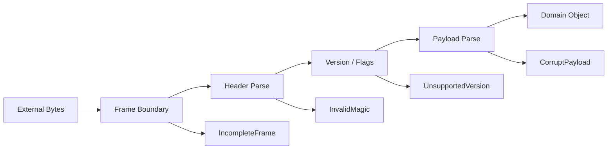

------
title: Learn Java IO, Modern IO, Streams, Buffers, Resources, Serialization & Data Boundaries - Part 008
description: Binary IO deep dive for Java engineers: DataInput/DataOutput, ByteBuffer byte order, endianness, length-prefixed framing, magic bytes, versioning, bounded reads, and binary protocol correctness.
series: learn-java-io-modern-io-resource-boundaries
seriesTitle: Learn Java IO, Modern IO, Streams, Buffers, Resources, Serialization & Data Boundaries
order: 8
partTitle: Binary IO: DataInput, DataOutput, Endianness, Framing
tags:
  - java
  - io
  - binary-io
  - datainput
  - dataoutput
  - bytebuffer
  - endianness
  - framing
  - protocol-design
  - series
date: 2026-06-30
---

# Part 008 — Binary IO: DataInput, DataOutput, Endianness, Framing

> Target skill: mampu mendesain dan mereview binary IO Java yang eksplisit, portable, bounded, versioned, dan tahan partial read/write, endian mismatch, corrupt frame, resource exhaustion, serta compatibility drift.

Binary IO adalah tempat engineer sering merasa “lebih dekat ke mesin”, tetapi justru karena itu bug-nya sering lebih berbahaya. Text IO gagal dengan karakter aneh. Binary IO gagal dengan **offset salah**, **length salah**, **endianness salah**, **allocation bomb**, **silent truncation**, atau **parser yang tetap menerima data corrupt**.

Binary boundary harus diperlakukan seperti kontrak protokol.



Core invariant:

> **A binary format is not a byte array. It is a grammar over bytes.**

---

## 1. Kaufman Deconstruction: Sub-skill yang Harus Dikuasai

| Sub-skill | Mengapa penting | Failure jika lemah |
|---|---|---|
| Membedakan raw bytes vs structured fields | Binary format harus punya grammar | Parser offset drift, data corrupt |
| Memahami primitive encoding | `int`, `long`, `float`, `double` punya representasi byte | Data lintas bahasa/platform salah |
| Endianness eksplisit | Sistem/protokol bisa big-endian atau little-endian | Angka berubah total |
| Framing | Stream tidak punya message boundary bawaan | Reader menggantung, over-read, under-read |
| Bounded allocation | Length field dari luar tidak boleh dipercaya | OOM / DoS |
| Partial read/write | IO tidak menjamin semua byte tersedia sekali baca | Truncation atau parsing frame setengah |
| Versioning | Format binary hidup lama | Deployment baru merusak data lama |
| Corruption detection | Binary sulit diinspeksi manual | Error terlambat masuk domain layer |

Latihan deliberate practice untuk binary IO: tulis format kecil dari nol, baca kembali, fuzz length field, ubah endian, potong file di tengah, naikkan version, dan pastikan parser gagal dengan error yang benar.

---

## 2. Mental Model: Binary Format sebagai Grammar

Text format punya delimiter visual. Binary format tidak punya struktur kecuali kita mendesainnya.

Contoh grammar sederhana:

```text
File        = Magic Version RecordCount Record*
Magic       = 4 bytes: 0x4A 0x49 0x4F 0x31  // "JIO1"
Version     = unsigned byte
RecordCount = int32 big-endian
Record      = Length Payload
Length      = int32 big-endian, max 1 MiB
Payload     = Length bytes, UTF-8 JSON or custom binary
```

Walaupun payload bisa apa pun, struktur luarnya tetap binary framing.

Representasi byte:

```text
4A 49 4F 31 01 00 00 00 02 00 00 00 05 48 65 6C 6C 6F ...
```

Tanpa grammar, itu hanya hex dump. Dengan grammar, kita punya contract.

---

## 3. Java Binary IO API Landscape

| API | Level | Cocok untuk |
|---|---|---|
| `InputStream` / `OutputStream` | raw byte stream | portable byte transfer, wrappers |
| `DataInput` / `DataOutput` | primitive binary values | simple binary format dengan Java primitive |
| `DataInputStream` / `DataOutputStream` | stream wrapper | read/write primitive dari stream |
| `RandomAccessFile` | file random access legacy | seek-based read/write sederhana |
| `ByteBuffer` | NIO byte container | binary parsing, channels, endian control |
| `FileChannel` | channel-level file IO | positional IO, transfer, mmap foundation |

Bagian ini fokus pada `DataInput/DataOutput`, `DataInputStream/DataOutputStream`, dan `ByteBuffer` untuk binary grammar. NIO channel dan file operations akan dibahas lebih dalam di Part 013–016.

---

## 4. `DataInput` dan `DataOutput`: Portable Primitive IO

`DataOutput` menulis primitive Java menjadi sequence of bytes. `DataInput` membaca sequence bytes kembali menjadi primitive.

Contoh:

```java
import java.io.*;

byte[] encoded;

try (ByteArrayOutputStream baos = new ByteArrayOutputStream();
     DataOutputStream out = new DataOutputStream(baos)) {
    out.writeInt(42);
    out.writeLong(1_700_000_000_000L);
    out.writeBoolean(true);
    encoded = baos.toByteArray();
}

try (DataInputStream in = new DataInputStream(new ByteArrayInputStream(encoded))) {
    int id = in.readInt();
    long timestamp = in.readLong();
    boolean active = in.readBoolean();
}
```

Important properties:

- `DataInputStream` membaca dari underlying `InputStream`.
- `DataOutputStream` menulis ke underlying `OutputStream`.
- Operasi primitive multi-byte punya urutan byte yang didefinisikan.
- `readFully` berguna untuk membaca exact byte count.
- `EOFException` menandakan input berakhir sebelum value lengkap.

Rule:

> `DataInputStream.read(byte[])` adalah stream read biasa; untuk binary field fixed length, gunakan `readFully`.

---

## 5. Partial Read: Bug Binary IO Paling Umum

`InputStream.read(byte[])` tidak wajib mengisi seluruh buffer. Ia mengembalikan jumlah byte yang benar-benar dibaca, atau `-1` untuk EOF.

Bug:

```java
byte[] payload = new byte[length];
in.read(payload); // salah: bisa hanya sebagian
parse(payload);
```

Perbaikan dengan `DataInputStream`:

```java
byte[] payload = new byte[length];
dataInput.readFully(payload);
```

Perbaikan generic:

```java
public static void readFully(InputStream in, byte[] buffer, int offset, int length) throws IOException {
    int total = 0;
    while (total < length) {
        int n = in.read(buffer, offset + total, length - total);
        if (n == -1) {
            throw new EOFException("Expected " + length + " bytes, got " + total);
        }
        total += n;
    }
}
```

Rule:

> Setiap binary parser harus mengasumsikan read bisa partial.

---

## 6. Partial Write: Jangan Asumsikan Semua Byte Langsung Persist

`OutputStream.write(byte[])` pada banyak implementasi mencoba menulis seluruh array atau melempar exception. Namun saat masuk NIO channel, socket, non-blocking IO, atau custom sink, write bisa partial.

Untuk `OutputStream`, API `write(byte[])` biasanya convenience yang memanggil `write(byte[], 0, len)`, dan contract implementasi harus menangani sesuai spesifikasi. Tetapi mental model tetap penting:

- write ke buffer bukan berarti durable,
- flush bukan berarti fsync,
- socket write bukan berarti peer sudah memproses,
- non-blocking channel write bisa menulis sebagian.

Nanti di Part 015–016 kita akan membahas channel write loops.

---

## 7. Endianness: Big-endian, Little-endian, dan Network Order

Endianness menentukan urutan byte untuk angka multi-byte.

Angka `0x01020304`:

| Endian | Byte order |
|---|---|
| Big-endian | `01 02 03 04` |
| Little-endian | `04 03 02 01` |

Jika parser salah endian, nilai berubah drastis.

```text
Bytes: 00 00 01 00
Big-endian int:    256
Little-endian int: 65536
```

`DataInputStream`/`DataOutputStream` menggunakan format yang didefinisikan oleh Java data stream, yaitu high byte first untuk primitive multi-byte. Untuk format little-endian, gunakan `ByteBuffer.order(ByteOrder.LITTLE_ENDIAN)` atau encode manual.

```java
ByteBuffer buffer = ByteBuffer.allocate(4);
buffer.order(ByteOrder.LITTLE_ENDIAN);
buffer.putInt(0x01020304);
byte[] bytes = buffer.array(); // 04 03 02 01
```

Default `ByteBuffer` adalah big-endian. Jangan mengandalkan default secara implisit pada protocol parser; set order eksplisit di boundary.

```java
ByteBuffer buffer = ByteBuffer.wrap(bytes).order(ByteOrder.BIG_ENDIAN);
int value = buffer.getInt();
```

Rule:

> Binary contract harus menyebut endian untuk setiap multi-byte numeric field.

---

## 8. Signedness: Java Tidak Punya Unsigned Byte Primitive

Java `byte` signed: -128 sampai 127. Tetapi binary format sering memakai unsigned byte: 0 sampai 255.

Bug:

```java
byte b = payload[0];
int value = b; // sign-extended, bisa negatif
```

Perbaikan:

```java
int value = payload[0] & 0xFF;
```

Untuk unsigned short:

```java
int unsignedShort = dataInput.readUnsignedShort();
```

Untuk unsigned int 32-bit:

```java
long unsignedInt = Integer.toUnsignedLong(dataInput.readInt());
```

Rule:

> Saat binary format menyebut unsigned, jangan pakai widening Java biasa tanpa masking/conversion eksplisit.

---

## 9. `writeUTF` Bukan General UTF-8 String Encoding

`DataOutput.writeUTF(String)` menulis string dalam format yang dikenal sebagai **modified UTF-8**, dengan length prefix tertentu. Ini berguna untuk data stream Java tertentu, tetapi bukan format UTF-8 umum untuk interoperabilitas lintas bahasa.

Untuk binary protocol yang ingin menyimpan UTF-8 biasa, gunakan:

```java
byte[] utf8 = value.getBytes(StandardCharsets.UTF_8);
out.writeInt(utf8.length);
out.write(utf8);
```

Read side:

```java
int length = in.readInt();
if (length < 0 || length > MAX_STRING_BYTES) {
    throw new IOException("Invalid string length: " + length);
}
byte[] utf8 = new byte[length];
in.readFully(utf8);
String value = new String(utf8, StandardCharsets.UTF_8);
```

Untuk strict UTF-8, gunakan `CharsetDecoder` seperti Part 007.

Rule:

> Jangan gunakan `writeUTF` untuk format publik/interoperable kecuali contract secara eksplisit menyebut Java modified UTF-8.

---

## 10. Framing: Stream Tidak Punya Message Boundary

Byte stream adalah sequence kontinu. Ia tidak tahu “message 1 selesai di sini”. Jika kamu menulis dua payload berturut-turut, reader harus punya cara menentukan batas payload.

Strategi framing umum:

| Strategy | Bentuk | Cocok untuk | Risiko |
|---|---|---|---|
| Fixed length | setiap record N bytes | format sederhana, numeric table | wasteful, sulit evolve |
| Delimiter | payload diakhiri byte khusus | text-ish protocol | escaping, delimiter dalam payload |
| Length prefix | length + payload | binary message | length bomb jika tidak dibatasi |
| TLV | type + length + value | extensible binary format | parser lebih kompleks |
| Chunked | sequence chunk sampai terminator | streaming large payload | state machine lebih sulit |

Untuk binary data, length-prefix adalah pilihan umum.

```text
Frame = Magic Version Length Payload Crc32
```

---

## 11. Magic Bytes: Fail Fast terhadap Format Salah

Magic bytes adalah signature di awal file/message.

Contoh:

```java
private static final int MAGIC = 0x4A494F31; // "JIO1"
```

Write:

```java
out.writeInt(MAGIC);
```

Read:

```java
int magic = in.readInt();
if (magic != MAGIC) {
    throw new IOException("Invalid magic: 0x" + Integer.toHexString(magic));
}
```

Manfaat:

- mendeteksi file salah,
- mendeteksi endian mismatch lebih cepat,
- membantu debugging hex dump,
- memberi boundary jelas untuk parser.

Rule:

> Setiap binary file format non-trivial sebaiknya punya magic bytes.

---

## 12. Version Field: Format Akan Berevolusi

Binary format tanpa version field adalah format yang diam-diam menganggap tidak akan berubah.

Contoh header:

```text
magic:   4 bytes
version: 1 byte
flags:   1 byte
length:  4 bytes
```

Read:

```java
int version = in.readUnsignedByte();
if (version != 1) {
    throw new IOException("Unsupported version: " + version);
}
```

Versioning strategies:

| Strategy | Cocok untuk | Trade-off |
|---|---|---|
| Single version byte | format kecil | major changes saja |
| Major/minor | compatibility lebih halus | parsing lebih kompleks |
| Feature flags | optional capabilities | butuh unknown flag policy |
| TLV extension fields | extensible records | overhead dan parser lebih rumit |

Unknown flags policy harus jelas:

- reject unknown critical flags,
- ignore unknown non-critical flags,
- preserve unknown fields jika melakukan read-modify-write.

---

## 13. Length Field: Validasi Sebelum Allocation

Length prefix adalah sumber vulnerability dan outage jika dipercaya mentah-mentah.

Bug:

```java
int length = in.readInt();
byte[] payload = new byte[length]; // length bisa negatif atau sangat besar
in.readFully(payload);
```

Perbaikan:

```java
private static final int MAX_PAYLOAD_BYTES = 1024 * 1024;

int length = in.readInt();
if (length < 0 || length > MAX_PAYLOAD_BYTES) {
    throw new IOException("Invalid payload length: " + length);
}

byte[] payload = new byte[length];
in.readFully(payload);
```

Rule:

> Tidak ada allocation berdasarkan data eksternal tanpa batas maksimum.

---

## 14. CRC dan Integrity Check Ringan

Checksum seperti CRC32 bisa mendeteksi corruption accidental. Ini bukan security mechanism, bukan pengganti signature/MAC, tetapi berguna untuk file transfer, storage, dan framing.

Write:

```java
import java.util.zip.CRC32;

CRC32 crc = new CRC32();
crc.update(payload);
long checksum = crc.getValue();
out.writeInt((int) checksum);
```

Read:

```java
CRC32 crc = new CRC32();
crc.update(payload);
int actual = (int) crc.getValue();
int expected = in.readInt();

if (actual != expected) {
    throw new IOException("CRC mismatch");
}
```

Important:

- CRC32 mendeteksi banyak corruption accidental.
- CRC32 tidak mencegah malicious tampering.
- Untuk security integrity gunakan mekanisme cryptographic yang dibahas di seri security, bukan diulang di sini.

---

## 15. Complete Example: Length-Prefixed Binary Record Codec

Kita buat format kecil:

```text
Frame:
  magic       int32  big-endian  "JIO1"
  version     u8     currently 1
  flags       u8     currently 0
  type        u16    application-defined
  length      int32  payload length, 0..1MiB
  payload     bytes  opaque
  crc32       int32  CRC32 over payload
```

### 15.1 Model

```java
public record BinaryFrame(int type, byte[] payload) {
    public BinaryFrame {
        if (type < 0 || type > 0xFFFF) {
            throw new IllegalArgumentException("type must fit unsigned 16-bit");
        }
        payload = payload.clone();
    }

    @Override
    public byte[] payload() {
        return payload.clone();
    }
}
```

### 15.2 Writer

```java
import java.io.*;
import java.util.zip.CRC32;

public final class BinaryFrameWriter {
    private static final int MAGIC = 0x4A494F31; // JIO1
    private static final int VERSION = 1;
    private static final int FLAGS = 0;
    private static final int MAX_PAYLOAD_BYTES = 1024 * 1024;

    private final DataOutputStream out;

    public BinaryFrameWriter(OutputStream out) {
        this.out = new DataOutputStream(new BufferedOutputStream(out));
    }

    public void writeFrame(BinaryFrame frame) throws IOException {
        byte[] payload = frame.payload();
        if (payload.length > MAX_PAYLOAD_BYTES) {
            throw new IOException("Payload too large: " + payload.length);
        }

        out.writeInt(MAGIC);
        out.writeByte(VERSION);
        out.writeByte(FLAGS);
        out.writeShort(frame.type());
        out.writeInt(payload.length);
        out.write(payload);
        out.writeInt(crc32(payload));
    }

    public void flush() throws IOException {
        out.flush();
    }

    private static int crc32(byte[] bytes) {
        CRC32 crc = new CRC32();
        crc.update(bytes);
        return (int) crc.getValue();
    }
}
```

### 15.3 Reader

```java
import java.io.*;
import java.util.zip.CRC32;

public final class BinaryFrameReader {
    private static final int MAGIC = 0x4A494F31; // JIO1
    private static final int SUPPORTED_VERSION = 1;
    private static final int MAX_PAYLOAD_BYTES = 1024 * 1024;

    private final DataInputStream in;

    public BinaryFrameReader(InputStream in) {
        this.in = new DataInputStream(new BufferedInputStream(in));
    }

    public BinaryFrame readFrame() throws IOException {
        int magic;
        try {
            magic = in.readInt();
        } catch (EOFException eof) {
            throw new EOFException("No complete frame header available");
        }

        if (magic != MAGIC) {
            throw new IOException("Invalid magic: 0x" + Integer.toHexString(magic));
        }

        int version = in.readUnsignedByte();
        if (version != SUPPORTED_VERSION) {
            throw new IOException("Unsupported frame version: " + version);
        }

        int flags = in.readUnsignedByte();
        if (flags != 0) {
            throw new IOException("Unsupported flags: 0x" + Integer.toHexString(flags));
        }

        int type = in.readUnsignedShort();
        int length = in.readInt();
        if (length < 0 || length > MAX_PAYLOAD_BYTES) {
            throw new IOException("Invalid payload length: " + length);
        }

        byte[] payload = new byte[length];
        in.readFully(payload);

        int expectedCrc = in.readInt();
        int actualCrc = crc32(payload);
        if (actualCrc != expectedCrc) {
            throw new IOException("CRC mismatch");
        }

        return new BinaryFrame(type, payload);
    }

    private static int crc32(byte[] bytes) {
        CRC32 crc = new CRC32();
        crc.update(bytes);
        return (int) crc.getValue();
    }
}
```

### 15.4 Why this is production-shaped

- magic bytes detect wrong format,
- version supports evolution,
- flags create room for future capabilities,
- type allows multiplexing record kinds,
- length is bounded before allocation,
- `readFully` handles partial read,
- CRC detects accidental corruption,
- buffered wrapper reduces syscall pressure,
- payload is defensive-copied.

---

## 16. Streaming Multiple Frames

A file or socket may contain many frames.

```java
while (true) {
    try {
        BinaryFrame frame = reader.readFrame();
        handle(frame);
    } catch (EOFException eof) {
        break;
    }
}
```

Namun ini terlalu kasar karena `EOFException` bisa berarti dua hal:

1. clean EOF before next frame,
2. truncated frame after partial header/payload.

Lebih baik desain reader yang membedakan:

```java
public enum FrameReadStatus {
    FRAME,
    CLEAN_EOF,
    TRUNCATED
}
```

Atau gunakan method:

```java
Optional<BinaryFrame> readNextFrame() throws IOException;
```

Tetapi `Optional.empty()` hanya boleh berarti clean EOF **sebelum** membaca byte pertama frame. Jika EOF terjadi setelah sebagian frame terbaca, itu harus error.

Rule:

> Clean EOF dan truncated frame adalah dua kondisi berbeda.

---

## 17. ByteBuffer untuk Binary Parsing

`ByteBuffer` memberi API get/put primitive dengan posisi, limit, dan byte order.

```java
ByteBuffer buffer = ByteBuffer.allocate(16)
        .order(ByteOrder.BIG_ENDIAN);

buffer.putInt(0x4A494F31);
buffer.put((byte) 1);
buffer.put((byte) 0);
buffer.putShort((short) 42);

buffer.flip();

int magic = buffer.getInt();
int version = buffer.get() & 0xFF;
int flags = buffer.get() & 0xFF;
int type = buffer.getShort() & 0xFFFF;
```

`ByteBuffer` lebih cocok saat:

- kamu sudah punya byte array atau mapped region,
- parsing header fixed-size,
- bekerja dengan channels,
- butuh endian control eksplisit,
- ingin avoid banyak object wrapper.

`DataInputStream` lebih cocok saat:

- stream sequential blocking,
- format sederhana,
- ingin API mudah untuk primitive,
- tidak butuh random access atau NIO integration.

---

## 18. ByteBuffer Boundary Checks

`ByteBuffer.getInt()` akan gagal jika remaining bytes kurang dari 4. Tetapi error-nya adalah buffer exception, bukan domain-specific parse error.

Untuk parser production, cek remaining dan lempar error format yang jelas.

```java
public static int getIntRequired(ByteBuffer buffer, String field) throws IOException {
    if (buffer.remaining() < Integer.BYTES) {
        throw new EOFException("Missing int32 field: " + field);
    }
    return buffer.getInt();
}
```

Untuk payload length:

```java
int length = getIntRequired(buffer, "payloadLength");
if (length < 0 || length > MAX_PAYLOAD_BYTES) {
    throw new IOException("Invalid payload length: " + length);
}
if (buffer.remaining() < length) {
    throw new EOFException("Payload truncated: expected " + length + " bytes");
}
```

Rule:

> Low-level buffer exception sebaiknya diterjemahkan menjadi format error yang bermakna di boundary parser.

---

## 19. TLV: Type-Length-Value untuk Evolvable Binary Format

TLV berguna saat record punya field opsional atau format perlu evolve.

```text
Message = Field*
Field   = Type Length Value
Type    = u16
Length  = u32
Value   = bytes
```

Contoh type:

```text
1 = userId UTF-8 string
2 = timestamp epoch millis int64
3 = status u8
1000..1999 = vendor extensions
```

Reader bisa:

- parse known fields,
- skip unknown non-critical fields,
- reject duplicate required fields,
- reject missing required fields,
- enforce max field length.

Skeleton:

```java
while (buffer.hasRemaining()) {
    int type = readUnsignedShort(buffer);
    int length = readBoundedLength(buffer, MAX_FIELD_BYTES);

    if (buffer.remaining() < length) {
        throw new EOFException("Truncated TLV field " + type);
    }

    ByteBuffer value = buffer.slice(buffer.position(), length);
    buffer.position(buffer.position() + length);

    switch (type) {
        case 1 -> userId = decodeUtf8(value);
        case 2 -> timestamp = readInt64(value);
        default -> handleUnknown(type, value);
    }
}
```

TLV trade-off:

- lebih verbose,
- parser lebih kompleks,
- lebih mudah evolve,
- lebih mudah skip unknown fields.

---

## 20. Varint: Compact Integer Encoding

Beberapa binary format memakai variable-length integer agar angka kecil memakai byte lebih sedikit. Contoh pendekatan umum: 7 bit data per byte, MSB sebagai continuation bit.

Write unsigned varint:

```java
public static void writeUnsignedVarInt(OutputStream out, int value) throws IOException {
    while ((value & 0xFFFFFF80) != 0L) {
        out.write((value & 0x7F) | 0x80);
        value >>>= 7;
    }
    out.write(value & 0x7F);
}
```

Read unsigned varint dengan batas:

```java
public static int readUnsignedVarInt(InputStream in) throws IOException {
    int value = 0;
    int position = 0;

    while (position < 32) {
        int b = in.read();
        if (b == -1) {
            throw new EOFException("Truncated varint");
        }

        value |= (b & 0x7F) << position;

        if ((b & 0x80) == 0) {
            return value;
        }

        position += 7;
    }

    throw new IOException("Varint too long");
}
```

Varint bagus untuk:

- banyak angka kecil,
- bandwidth sensitif,
- format compact.

Varint buruk jika:

- format perlu mudah dibaca hex dump,
- random access fixed offset penting,
- parser simplicity lebih penting dari beberapa byte hemat.

Rule:

> Jangan memakai varint hanya karena terlihat sophisticated. Pakai saat compression/size benefit nyata.

---

## 21. Alignment dan Padding

Beberapa binary format memakai padding agar field dimulai pada offset tertentu. Ini umum di format low-level atau interop dengan native struct.

Contoh:

```text
u8 type
u8 flags
u16 reserved
u32 length
```

Padding harus eksplisit dalam spec:

- berapa byte,
- harus nol atau boleh sembarang,
- apakah reader harus reject jika non-zero,
- apakah writer wajib mengisi nol.

Rule:

> Reserved bytes harus ditulis nol dan biasanya direject jika non-zero kecuali spec mengizinkan.

Kenapa? Reserved bytes adalah ruang evolusi. Jika hari ini diabaikan tanpa aturan, besok compatibility sulit.

---

## 22. Binary Compatibility: Tambah Field Tanpa Merusak Reader Lama

Fixed-layout format:

```text
V1: id:int32 amount:int64
V2: id:int32 amount:int64 currency:u16
```

Jika reader lama membaca V2 tanpa version/framing, ia bisa:

- mengabaikan trailing bytes secara tidak sadar,
- menganggap trailing bytes sebagai record berikutnya,
- corrupt seluruh stream.

Lebih aman:

```text
Record = version length payload
```

Reader lama yang melihat unsupported version bisa reject cleanly. Reader yang mendukung skip bisa melewati record berdasarkan length.

Evolution rules:

- Tambah optional field hanya jika parser bisa skip unknown.
- Jangan ubah meaning field existing tanpa major version.
- Jangan ubah endian diam-diam.
- Jangan ubah unit field tanpa version, misalnya seconds menjadi millis.
- Jangan ubah signedness tanpa migration.

---

## 23. Error Taxonomy untuk Binary Parser

Jangan semua error menjadi `IOException("bad file")`. Boundary error harus actionable.

| Error | Meaning | Typical action |
|---|---|---|
| InvalidMagic | bukan format yang diharapkan | reject file/message |
| UnsupportedVersion | format lebih baru/lama | compatibility handling |
| InvalidLength | length negatif/terlalu besar | reject, possible abuse |
| TruncatedFrame | EOF sebelum frame lengkap | retry transfer / mark corrupt |
| CrcMismatch | payload corrupt | reject / re-fetch |
| UnknownCriticalFlag | fitur tidak didukung | reject |
| DuplicateField | TLV field invalid | reject as corrupt |
| MissingRequiredField | schema incomplete | reject |

Di Java, kamu bisa mulai sederhana dengan custom exception:

```java
public final class BinaryFormatException extends IOException {
    public BinaryFormatException(String message) {
        super(message);
    }

    public BinaryFormatException(String message, Throwable cause) {
        super(message, cause);
    }
}
```

Lalu gunakan message yang menyertakan field/offset jika memungkinkan.

---

## 24. Hex Dump untuk Debugging

Binary parser butuh tooling debugging. Minimal utility:

```java
public static String hex(byte[] bytes, int max) {
    StringBuilder sb = new StringBuilder();
    int limit = Math.min(bytes.length, max);
    for (int i = 0; i < limit; i++) {
        if (i > 0) {
            sb.append(' ');
        }
        sb.append(String.format("%02X", bytes[i] & 0xFF));
    }
    if (bytes.length > max) {
        sb.append(" ...");
    }
    return sb.toString();
}
```

Jangan log seluruh payload besar atau sensitif. Log cukup:

- magic,
- version,
- length,
- offset,
- first N bytes,
- checksum,
- correlation id.

---

## 25. Testing Binary IO

Binary IO test harus mencakup round-trip dan failure injection.

### 25.1 Round-trip

```java
BinaryFrame original = new BinaryFrame(7, new byte[] {1, 2, 3});

ByteArrayOutputStream baos = new ByteArrayOutputStream();
BinaryFrameWriter writer = new BinaryFrameWriter(baos);
writer.writeFrame(original);
writer.flush();

BinaryFrameReader reader = new BinaryFrameReader(new ByteArrayInputStream(baos.toByteArray()));
BinaryFrame decoded = reader.readFrame();

assertEquals(original.type(), decoded.type());
assertArrayEquals(original.payload(), decoded.payload());
```

### 25.2 Invalid magic

Mutate first byte and expect failure.

```java
bytes[0] = 0x00;
assertThrows(IOException.class, () -> reader(bytes).readFrame());
```

### 25.3 Truncated payload

Remove last byte.

```java
byte[] truncated = Arrays.copyOf(bytes, bytes.length - 1);
assertThrows(EOFException.class, () -> reader(truncated).readFrame());
```

### 25.4 Length bomb

Set length to `Integer.MAX_VALUE` and ensure parser rejects before allocation.

```java
// mutate bytes at payload length offset
```

Assertion penting:

> Test harus memastikan parser tidak mencoba allocate payload besar sebelum validasi.

### 25.5 Endian mismatch

Encode little-endian, read big-endian, pastikan invalid magic/length terdeteksi.

### 25.6 Fuzz small mutations

Untuk format kecil, lakukan mutation random pada byte array dan pastikan parser:

- tidak hang,
- tidak OOM,
- tidak uncaught runtime exception yang aneh,
- gagal dengan `IOException`/`BinaryFormatException`.

---

## 26. Anti-patterns

### Anti-pattern 1 — Allocation dari length eksternal

```java
byte[] payload = new byte[in.readInt()];
```

Perbaikan: validate length dulu.

### Anti-pattern 2 — `read()` sekali untuk payload

```java
in.read(payload);
```

Perbaikan: `readFully`.

### Anti-pattern 3 — Endian implicit

```java
int value = ByteBuffer.wrap(bytes).getInt();
```

Perbaikan:

```java
int value = ByteBuffer.wrap(bytes)
        .order(ByteOrder.BIG_ENDIAN)
        .getInt();
```

### Anti-pattern 4 — `writeUTF` untuk public protocol

Perbaikan: length-prefixed normal UTF-8 bytes.

### Anti-pattern 5 — No magic, no version

Masalah: file salah dan evolution sulit dideteksi.

Perbaikan: header dengan magic + version.

### Anti-pattern 6 — Treat EOF as normal everywhere

Masalah: truncated frame dianggap clean EOF.

Perbaikan: bedakan EOF before frame vs EOF inside frame.

---

## 27. Binary Format Design Checklist

### Header

- [ ] Apakah ada magic bytes?
- [ ] Apakah ada version?
- [ ] Apakah ada flags/reserved field untuk evolusi?
- [ ] Apakah endian ditentukan eksplisit?

### Length and bounds

- [ ] Apakah semua length field divalidasi sebelum allocation?
- [ ] Apakah ada max payload bytes?
- [ ] Apakah max field bytes berbeda dari max message bytes jika perlu?
- [ ] Apakah negative length direject?

### Reading

- [ ] Apakah fixed-size field dibaca dengan exact read?
- [ ] Apakah clean EOF dibedakan dari truncated frame?
- [ ] Apakah parser punya error taxonomy yang jelas?
- [ ] Apakah unknown flags/fields punya policy?

### Encoding

- [ ] Apakah string memakai UTF-8 biasa atau modified UTF-8 secara sengaja?
- [ ] Apakah signedness eksplisit?
- [ ] Apakah unit numeric field jelas: bytes, millis, nanos, cents?
- [ ] Apakah timestamp format jelas?

### Evolution

- [ ] Apakah tambah field bisa dilakukan tanpa merusak reader lama?
- [ ] Apakah reserved bytes ditulis nol?
- [ ] Apakah reader reject reserved non-zero jika perlu?
- [ ] Apakah unsupported version gagal cleanly?

### Integrity

- [ ] Apakah corruption accidental perlu checksum?
- [ ] Apakah security tampering butuh MAC/signature di layer lain?
- [ ] Apakah checksum dihitung atas bytes yang benar?

---

## 28. Deliberate Practice

### Exercise 1 — Build a binary frame codec

Implementasikan format:

```text
magic: 4 bytes
version: 1 byte
type: 2 bytes
length: 4 bytes
payload: length bytes
crc32: 4 bytes
```

Requirement:

- max payload 256 KiB,
- big-endian eksplisit,
- invalid magic error,
- unsupported version error,
- truncated frame error,
- CRC mismatch error,
- unit tests round-trip + mutations.

### Exercise 2 — Add TLV extension section

Tambahkan optional metadata:

```text
metadataLength: int32
metadata: repeated TLV
```

Requirement:

- skip unknown non-critical fields,
- reject duplicate field 1,
- reject field length > 4 KiB,
- decode field 1 as strict UTF-8.

### Exercise 3 — Little-endian interop

Buat writer little-endian dengan `ByteBuffer`, lalu parser big-endian. Pastikan test menunjukkan failure yang jelas.

### Exercise 4 — Fuzz parser

Generate valid frame, lalu mutate 1–5 random bytes. Parser tidak boleh:

- hang,
- OOM,
- infinite loop,
- throw unexpected `ArrayIndexOutOfBoundsException`,
- accept obviously invalid length.

### Exercise 5 — Hex dump diagnostics

Saat parse gagal, tampilkan:

- offset logical,
- field name,
- first 32 bytes hex,
- expected vs actual jika ada.

---

## 29. Key Takeaways

1. Binary format adalah grammar atas byte, bukan byte array acak.
2. Stream tidak punya message boundary; framing harus didesain.
3. `read(byte[])` bisa partial; gunakan `readFully` untuk exact binary fields.
4. Endianness harus menjadi bagian eksplisit dari contract.
5. Jangan allocate berdasarkan length field eksternal tanpa validasi maksimum.
6. Magic bytes dan version field adalah investasi kecil untuk debugging dan evolution.
7. `writeUTF` memakai modified UTF-8; jangan pakai untuk public protocol kecuali memang contract-nya demikian.
8. Clean EOF dan truncated frame harus dibedakan.
9. Binary parser perlu error taxonomy yang actionable.
10. Test binary IO harus mencakup mutation, truncation, invalid length, endian mismatch, dan checksum mismatch.

---

## 30. Referensi

- Java SE 25 API — `DataInput`: https://docs.oracle.com/en/java/javase/25/docs/api/java.base/java/io/DataInput.html
- Java SE 25 API — `DataOutput`: https://docs.oracle.com/en/java/javase/25/docs/api/java.base/java/io/DataOutput.html
- Java SE 25 API — `DataInputStream`: https://docs.oracle.com/en/java/javase/25/docs/api/java.base/java/io/DataInputStream.html
- Java SE 25 API — `DataOutputStream`: https://docs.oracle.com/en/java/javase/25/docs/api/java.base/java/io/DataOutputStream.html
- Java SE 25 API — `ByteBuffer`: https://docs.oracle.com/en/java/javase/25/docs/api/java.base/java/nio/ByteBuffer.html
- Java SE 25 API — `ByteOrder`: https://docs.oracle.com/en/java/javase/25/docs/api/java.base/java/nio/ByteOrder.html
- Java SE 25 API — `CRC32`: https://docs.oracle.com/en/java/javase/25/docs/api/java.base/java/util/zip/CRC32.html
