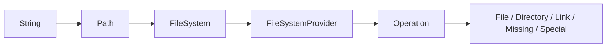
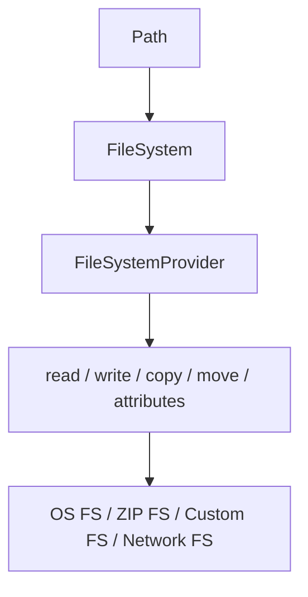

------
title: Learn Java IO, Modern IO, Streams, Buffers, Resources, Serialization & Data Boundaries - Part 009
description: Modern Java file API dengan Path, Files, FileSystem, provider abstraction, URI paths, relative/absolute paths, normalization, dan API design untuk filesystem boundary.
series: learn-java-io-modern-io-resource-boundaries
seriesTitle: Learn Java IO, Modern IO, Streams, Buffers, Resources, Serialization & Data Boundaries
order: 9
partTitle: Modern File API: Path, Files, FileSystem
tags:
  - java
  - io
  - nio
  - path
  - files
  - filesystem
  - resource-boundary
  - series
date: 2026-06-30
---

# Part 009 — Modern File API: `Path`, `Files`, `FileSystem`

## 1. Target Kompetensi

Setelah bagian ini, kita ingin bisa membaca kode seperti ini dan langsung tahu boundary decision yang sedang dibuat:

```java
Path uploadRoot = Path.of("/srv/app/uploads").toRealPath();
Path target = uploadRoot.resolve(userProvidedName).normalize();

if (!target.startsWith(uploadRoot)) {
    throw new IllegalArgumentException("Path escapes upload root");
}

try (InputStream in = Files.newInputStream(target, StandardOpenOption.READ)) {
    return in.readAllBytes();
}
```

Kode di atas kelihatan sederhana, tetapi di dalamnya ada beberapa keputusan penting:

- apakah input user dianggap path atau filename?
- apakah path sudah dinormalisasi?
- apakah path merujuk ke filesystem default atau filesystem lain?
- apakah symbolic link harus diikuti?
- apakah resource stream dimiliki caller atau callee?
- apakah file boleh berubah setelah validasi?

`java.nio.file` bukan sekadar pengganti modern dari `java.io.File`. Ia adalah model yang lebih eksplisit untuk bekerja dengan **path, filesystem, provider, metadata, dan operasi file**.

Oracle mendeskripsikan `java.nio.file` sebagai package yang mendefinisikan class dan interface untuk mengakses file dan file systems. Attribute API berada di `java.nio.file.attribute`, sedangkan provider extension berada di `java.nio.file.spi`.

## 2. Kaufman Deconstruction

Dalam framework Josh Kaufman, skill ini kita pecah menjadi sub-skill kecil yang bisa dilatih cepat.

| Sub-skill | Pertanyaan yang Harus Bisa Dijawab |
|---|---|
| Path modelling | Apakah ini string biasa, path relatif, path absolut, atau resolved path? |
| Filesystem modelling | Path ini berada di default filesystem, ZIP filesystem, memory filesystem, atau custom provider? |
| Path transformation | Kapan memakai `resolve`, `normalize`, `toAbsolutePath`, `toRealPath`, `relativize`? |
| Operation semantics | Apakah `Files.copy`, `Files.move`, `Files.delete`, `Files.exists` bersifat atomic? |
| Resource lifecycle | Apakah `Files.list`, `Files.walk`, dan `newDirectoryStream` wajib ditutup? |
| Cross-platform correctness | Apakah kode ini aman di Linux, macOS, Windows, container, dan filesystem remote? |
| Boundary design | Apakah API menerima `String`, `Path`, `URI`, `InputStream`, atau abstraction lain? |

Skill utamanya bukan menghafal method `Files`. Skill utamanya adalah **membuat boundary filesystem yang eksplisit, portable, dan defensible**.

## 3. Mental Model: Path Is Not File

Kesalahan awal yang sering terjadi adalah menganggap `Path` sama dengan file.

`Path` adalah **alamat logis** di dalam sebuah `FileSystem`. File adalah entity yang mungkin ada, mungkin tidak ada, mungkin berubah, mungkin diganti, dan mungkin berbeda antara saat dicek dan saat dibuka.



Implikasinya:

- `Path.of("a/b.txt")` tidak menyentuh disk.
- `path.normalize()` tidak menyentuh disk.
- `path.toAbsolutePath()` biasanya tidak membuktikan file ada.
- `path.toRealPath()` menyentuh filesystem dan menyelesaikan symbolic link sesuai option.
- `Files.exists(path)` hanya observasi sesaat, bukan guarantee untuk operasi berikutnya.

Invariant penting:

> A `Path` is a description. `Files` operations are interactions with reality.

## 4. `File` vs `Path`

Sebelum Java 7, `java.io.File` adalah API utama untuk file path. Nama `File` agak menyesatkan karena object ini bisa merujuk ke file, directory, atau sesuatu yang tidak ada. `Path` memperbaiki model mental itu.

| Aspek | `java.io.File` | `java.nio.file.Path` |
|---|---|---|
| Introduced | Java lama | Java 7 NIO.2 |
| Model | Abstract pathname | Path dalam `FileSystem` |
| Provider abstraction | Terbatas | Ya, via `FileSystemProvider` |
| Symbolic link handling | Terbatas | Lebih eksplisit via `LinkOption` |
| Attribute view | Terbatas | Basic, POSIX, DOS, ACL, owner, user-defined |
| Error model | Banyak boolean | Banyak method throw `IOException` |
| API design modern | Kurang ideal | Preferred untuk filesystem boundary |

Gunakan `Path` untuk kode baru.

```java
Path config = Path.of("config", "application.yml");
String text = Files.readString(config);
```

Jangan buru-buru ubah `Path` menjadi `File` kecuali harus berinteraksi dengan API lama.

```java
File legacy = path.toFile(); // hanya jika library lama butuh File
```

## 5. Membuat `Path`

### 5.1 `Path.of`

Untuk Java modern, prefer `Path.of`.

```java
Path p1 = Path.of("/var/log/app.log");
Path p2 = Path.of("/var", "log", "app.log");
```

`Path.of(first, more...)` lebih aman daripada manual concatenate string dengan separator.

Bad:

```java
Path p = Path.of(base + "/" + name);
```

Better:

```java
Path p = base.resolve(name);
```

### 5.2 `Paths.get`

`Paths.get(...)` masih ada, tetapi dokumentasi Java 25 memberi API note bahwa disarankan memperoleh `Path` via `Path.of` daripada method `Paths.get`, karena class `Paths` dapat didepresiasi pada rilis mendatang.

```java
Path oldStyle = Paths.get("data", "input.csv");
Path newStyle = Path.of("data", "input.csv");
```

Untuk kode baru, pakai `Path.of`.

### 5.3 `FileSystem.getPath`

Kalau bekerja dengan filesystem non-default, gunakan `fileSystem.getPath`.

```java
try (FileSystem zipFs = FileSystems.newFileSystem(Path.of("archive.zip"))) {
    Path insideZip = zipFs.getPath("/reports/2026.csv");
    String content = Files.readString(insideZip);
}
```

Ini penting: `Path.of("/reports/2026.csv")` akan memakai default filesystem, bukan ZIP filesystem.

## 6. Anatomy of a Path

Sebuah `Path` bisa memiliki:

- root component
- sequence of name elements
- filename
- parent
- filesystem

```java
Path p = Path.of("/srv/app/data/report.csv");

System.out.println(p.getRoot());      // /
System.out.println(p.getParent());    // /srv/app/data
System.out.println(p.getFileName());  // report.csv
System.out.println(p.getNameCount()); // 4 on Unix-like filesystem
System.out.println(p.getName(0));     // srv
```

Jangan terlalu bergantung pada output literal di semua OS. Windows path root, drive letter, UNC path, dan separator punya aturan berbeda.

Contoh Windows:

```java
Path p = Path.of("C:\\data\\report.csv");
```

UNC path:

```java
Path p = Path.of("\\\\server\\share\\report.csv");
```

Cross-platform code harus memakai operasi `Path`, bukan parsing string manual.

## 7. Relative Path, Absolute Path, Real Path

Ada tiga level yang sering tertukar.

### 7.1 Relative Path

```java
Path p = Path.of("logs/app.log");
```

Relative path tergantung working directory process.

Bahaya:

```java
Files.readString(Path.of("config.yml"));
```

Kode ini bergantung pada dari mana JVM dijalankan. Dalam IDE, container, systemd, test runner, dan Kubernetes, working directory bisa berbeda.

### 7.2 Absolute Path

```java
Path absolute = Path.of("logs/app.log").toAbsolutePath();
```

`toAbsolutePath()` mengubah path menjadi absolut berdasarkan current working directory. Ia tidak membuktikan file ada.

### 7.3 Real Path

```java
Path real = Path.of("logs/app.log").toRealPath();
```

`toRealPath()` menyentuh filesystem. Ia biasanya:

- membutuhkan file ada,
- menyelesaikan `.` dan `..`,
- dapat menyelesaikan symbolic link,
- throw `IOException` jika gagal.

Dengan `NOFOLLOW_LINKS`:

```java
Path real = path.toRealPath(LinkOption.NOFOLLOW_LINKS);
```

Rule praktis:

| Need | Method |
|---|---|
| Compose path safely | `resolve` |
| Remove lexical `.` and `..` | `normalize` |
| Make path absolute without checking existence | `toAbsolutePath` |
| Resolve against actual filesystem | `toRealPath` |
| Compare user path under trusted root | combine `toRealPath`, `resolve`, `normalize`, `startsWith`, and link policy carefully |

## 8. `normalize()` Is Lexical, Not Security Magic

```java
Path p = Path.of("/srv/app/uploads/../secrets.txt");
Path normalized = p.normalize();

System.out.println(normalized); // /srv/app/secrets.txt
```

`normalize()` hanya memproses path elements secara lexical. Ia tidak tahu apakah salah satu element adalah symbolic link.

Contoh jebakan:

```text
/srv/app/uploads/link -> /etc
/srv/app/uploads/link/passwd
```

Lexical normalization tidak cukup untuk memastikan path tetap di root yang diizinkan.

Safe-ish pattern untuk banyak kasus:

```java
Path root = Path.of("/srv/app/uploads").toRealPath();
Path candidate = root.resolve(userInput).normalize();

if (!candidate.startsWith(root)) {
    throw new IllegalArgumentException("Path escapes root");
}
```

Namun, jika attacker bisa membuat symbolic link di bawah `root`, kita butuh policy tambahan: `NOFOLLOW_LINKS`, directory ownership, temp directory isolation, atau `SecureDirectoryStream` jika tersedia. Ini akan disentuh lagi di part operasi file correctness.

## 9. `resolve`, `resolveSibling`, dan `relativize`

### 9.1 `resolve`

`resolve` menyambungkan base path dengan child path.

```java
Path base = Path.of("/srv/app");
Path log = base.resolve("logs/app.log");
// /srv/app/logs/app.log
```

Jika argument absolut, behavior-nya perlu dipahami:

```java
Path base = Path.of("/srv/app");
Path result = base.resolve("/etc/passwd");
// on Unix-like systems, result is /etc/passwd
```

Karena itu, jangan langsung `resolve(userInput)` tanpa memvalidasi bahwa input adalah relative filename/path sesuai contract.

### 9.2 `resolveSibling`

Berguna untuk membuat file di direktori yang sama.

```java
Path report = Path.of("/data/report.csv");
Path tmp = report.resolveSibling(report.getFileName() + ".tmp");
```

Pattern ini sering muncul untuk safe replace:

```java
Path target = Path.of("/data/report.csv");
Path temp = target.resolveSibling(target.getFileName() + ".tmp");
```

### 9.3 `relativize`

```java
Path root = Path.of("/srv/app");
Path file = Path.of("/srv/app/data/report.csv");
Path relative = root.relativize(file);
// data/report.csv
```

`relativize` berguna untuk display, archive entries, backup manifests, dan mapping file tree ke object key. Pastikan kedua path compatible: biasanya sama-sama absolute atau sama-sama relative dalam filesystem yang sama.

## 10. Path Equality and `startsWith`

`Path.equals` adalah equality path object, bukan selalu identity file.

```java
Path a = Path.of("/tmp/../tmp/file.txt");
Path b = Path.of("/tmp/file.txt");

System.out.println(a.equals(b));              // often false
System.out.println(a.normalize().equals(b));  // often true
```

Untuk identity actual file, gunakan `Files.isSameFile(a, b)`.

```java
if (Files.isSameFile(a, b)) {
    // same file according to provider
}
```

`startsWith` juga path-element aware, bukan sekadar string prefix.

Bad:

```java
if (candidate.toString().startsWith("/srv/app/uploads")) {
    // /srv/app/uploads_evil passes string prefix
}
```

Better:

```java
if (candidate.normalize().startsWith(uploadRoot)) {
    // path-element comparison
}
```

Tetap ingat: lexical check bukan pengganti link policy.

## 11. `FileSystem` and Provider Abstraction

`FileSystem` adalah factory untuk `Path`, matcher, root directories, file stores, dan watch service.

```java
FileSystem fs = FileSystems.getDefault();
Path path = fs.getPath("data", "input.csv");
```

Java NIO.2 didesain agar operasi `Files` mendelegasikan ke provider filesystem terkait. Artinya, `Files.readString(path)` tidak selalu berarti membaca dari disk lokal biasa. Bisa saja:

- default OS filesystem,
- ZIP/JAR filesystem,
- custom in-memory filesystem,
- network-mounted filesystem,
- provider khusus test.



Implikasi engineering:

- Jangan assume separator `/` selalu benar untuk semua provider.
- Jangan assume POSIX permissions selalu ada.
- Jangan assume atomic move selalu didukung.
- Jangan assume file key, creation time, atau owner selalu tersedia.
- Jangan assume case sensitivity.

## 12. URI Paths

`Path` bisa dibuat dari URI.

```java
Path p = Path.of(URI.create("file:///srv/app/data/report.csv"));
```

Tetapi URI bukan pengganti universal path string. URI membawa scheme.

```text
file:///srv/app/data/report.csv
jar:file:///tmp/archive.zip!/data/report.csv
```

Untuk ZIP filesystem, pattern umum:

```java
Path zip = Path.of("archive.zip");
URI uri = URI.create("jar:" + zip.toUri());

try (FileSystem fs = FileSystems.newFileSystem(uri, Map.of())) {
    Path entry = fs.getPath("/data/report.csv");
    String text = Files.readString(entry);
}
```

Dalam API business biasa, jangan menerima URI kalau domain sebenarnya file lokal. URI memperluas boundary contract.

## 13. `Files`: Static Operations over Path

`Files` berisi static methods untuk operasi terhadap files, directories, atau jenis file lain. Banyak operasi akan didelegasikan ke associated filesystem provider.

Contoh operasi umum:

```java
Path p = Path.of("data/report.csv");

boolean exists = Files.exists(p);
long size = Files.size(p);
String content = Files.readString(p);
Files.writeString(p, "hello\n");
```

Namun, `Files` bukan satu API homogen. Method-method-nya punya karakteristik berbeda.

| Category | Examples | Critical Concern |
|---|---|---|
| Small content convenience | `readString`, `readAllBytes`, `writeString` | Materializes whole file |
| Stream creation | `newInputStream`, `newOutputStream`, `newBufferedReader` | Caller must close |
| Directory listing | `list`, `walk`, `find`, `newDirectoryStream` | Returned stream/directory stream must close |
| Metadata | `size`, `getLastModifiedTime`, `readAttributes` | May be stale, provider-dependent |
| Existence/access | `exists`, `isReadable`, `isWritable` | Race-prone observation |
| Mutating operations | `createFile`, `copy`, `move`, `delete` | Atomicity and options matter |

## 14. Convenience Methods: Great Until They Hide Boundary Size

### 14.1 `readString`

```java
String text = Files.readString(Path.of("message.txt"));
```

Good for:

- config files,
- small templates,
- tests,
- small metadata files.

Bad for:

- unbounded uploads,
- logs,
- exports,
- unknown object size,
- user-controlled files.

Use size checks or streaming.

```java
Path file = Path.of("upload.dat");
long maxBytes = 10 * 1024 * 1024;

long size = Files.size(file);
if (size > maxBytes) {
    throw new IllegalArgumentException("File too large");
}

byte[] bytes = Files.readAllBytes(file);
```

Even then, size may change between check and read. For hostile or concurrent environments, enforce limits during reading too.

### 14.2 `writeString`

```java
Files.writeString(Path.of("output.txt"), "hello\n");
```

Default behavior matters. For production code, specify intent:

```java
Files.writeString(
    Path.of("output.txt"),
    "hello\n",
    StandardOpenOption.CREATE,
    StandardOpenOption.TRUNCATE_EXISTING,
    StandardOpenOption.WRITE
);
```

This makes review easier.

## 15. Stream Creation from `Files`

```java
try (InputStream in = Files.newInputStream(path)) {
    process(in);
}
```

```java
try (BufferedReader reader = Files.newBufferedReader(path, StandardCharsets.UTF_8)) {
    String line;
    while ((line = reader.readLine()) != null) {
        process(line);
    }
}
```

Rule:

> If `Files` returns a stream-like object, assume you must close it unless documentation says otherwise.

This includes:

- `InputStream`
- `OutputStream`
- `BufferedReader`
- `BufferedWriter`
- `Stream<String>` from `Files.lines`
- `Stream<Path>` from `Files.list`, `Files.walk`, `Files.find`
- `DirectoryStream<Path>`

## 16. `Files.lines`: Lazy and Closeable

```java
try (Stream<String> lines = Files.lines(path, StandardCharsets.UTF_8)) {
    lines.filter(line -> !line.isBlank())
         .forEach(this::process);
}
```

Bad:

```java
Files.lines(path).forEach(this::process); // resource leak risk
```

`Stream` dari `Files.lines` membawa resource filesystem. Treat it like file handle.

Pattern aman:

```java
public long countNonBlank(Path path) throws IOException {
    try (Stream<String> lines = Files.lines(path, StandardCharsets.UTF_8)) {
        return lines.filter(line -> !line.isBlank()).count();
    }
}
```

## 17. Directory Listing: `list`, `walk`, `find`, `DirectoryStream`

### 17.1 `Files.list`

```java
try (Stream<Path> entries = Files.list(directory)) {
    entries.forEach(System.out::println);
}
```

`Files.list` hanya satu level.

### 17.2 `Files.walk`

```java
try (Stream<Path> tree = Files.walk(root)) {
    tree.filter(Files::isRegularFile)
        .forEach(this::index);
}
```

`Files.walk` recursive. Hati-hati:

- traversal bisa besar,
- symbolic link policy penting,
- permission error bisa terjadi di tengah traversal,
- stream harus ditutup,
- ordering tidak boleh diasumsikan untuk business semantics kecuali disortir.

### 17.3 `Files.find`

```java
try (Stream<Path> files = Files.find(
        root,
        4,
        (path, attrs) -> attrs.isRegularFile() && path.toString().endsWith(".csv")
)) {
    files.forEach(this::process);
}
```

`Files.find` bisa lebih efisien daripada `walk(...).filter(...)` karena predicate menerima `BasicFileAttributes` yang mungkin sudah dibaca selama traversal.

### 17.4 `DirectoryStream`

```java
try (DirectoryStream<Path> stream = Files.newDirectoryStream(root, "*.csv")) {
    for (Path entry : stream) {
        process(entry);
    }
}
```

`DirectoryStream` lebih old-school tetapi jelas resource lifecycle-nya. Ia juga bisa lebih cocok untuk direktori besar karena iterable lazily.

## 18. `StandardOpenOption`

Saat membuka file, option adalah bagian dari contract.

```java
try (OutputStream out = Files.newOutputStream(
        path,
        StandardOpenOption.CREATE_NEW,
        StandardOpenOption.WRITE
)) {
    out.write(payload);
}
```

Common options:

| Option | Meaning | Use Case |
|---|---|---|
| `READ` | open for read | explicit read channel/stream |
| `WRITE` | open for write | explicit write |
| `APPEND` | append to end | logs, append-only output |
| `TRUNCATE_EXISTING` | truncate existing file | replace content intentionally |
| `CREATE` | create if missing | upsert-like write |
| `CREATE_NEW` | create only if absent | lock files, idempotency marker |
| `DELETE_ON_CLOSE` | delete on close | temp/transient files |
| `SPARSE` | hint sparse file | large sparse files |
| `SYNC` | synchronous content+metadata updates | durability-sensitive writes |
| `DSYNC` | synchronous content updates | durability-sensitive content |

Prefer explicit options in production code. Defaults are easy to misread.

## 19. Existence and Access Checks Are Observations, Not Guarantees

```java
if (Files.exists(path)) {
    return Files.readString(path);
}
```

This has a race:

```text
T1: exists(path) == true
T2: deletes/replaces path
T1: readString(path) fails or reads different file
```

Better:

```java
try {
    return Files.readString(path);
} catch (NoSuchFileException e) {
    return null;
}
```

Do the operation and handle the exception.

Same applies to:

- `isReadable`
- `isWritable`
- `isExecutable`
- `isDirectory`
- `isRegularFile`

These are useful for diagnostics and preflight, not authority.

## 20. Designing APIs Around `Path`

### 20.1 Accept `Path` for Filesystem Objects

Good:

```java
public ImportResult importCsv(Path file) throws IOException {
    try (BufferedReader reader = Files.newBufferedReader(file, StandardCharsets.UTF_8)) {
        return parse(reader);
    }
}
```

Bad:

```java
public ImportResult importCsv(String fileName) throws IOException {
    return parse(Files.newBufferedReader(Path.of(fileName)));
}
```

A `String` hides too much:

- is it a filename?
- relative path?
- absolute path?
- URI?
- classpath resource?
- object key?
- display label?

Use `String` only when the domain is truly string.

### 20.2 Accept `InputStream` for Byte Source Boundary

If your logic does not care where bytes come from:

```java
public ImportResult importCsv(InputStream source) throws IOException {
    try (Reader reader = new InputStreamReader(source, StandardCharsets.UTF_8)) {
        return parse(reader);
    }
}
```

But decide ownership. Does this method close `source`?

Alternative:

```java
public ImportResult importCsv(Supplier<? extends InputStream> sourceFactory) throws IOException {
    try (InputStream source = sourceFactory.get()) {
        return importCsv(source);
    }
}
```

This is useful when the data may need replay.

### 20.3 Accept `Path` When Metadata Matters

If you need size, name, modified time, atomic move, delete, or directory context, `InputStream` is insufficient.

```java
public StoredFile ingest(Path source) throws IOException {
    BasicFileAttributes attrs = Files.readAttributes(source, BasicFileAttributes.class);
    // size, modified time, regular file check, etc.
}
```

## 21. Cross-Platform Path Pitfalls

### 21.1 Separator

Do not split paths using `/` or `\\`.

Bad:

```java
String[] parts = path.toString().split("/");
```

Better:

```java
for (Path element : path) {
    System.out.println(element);
}
```

### 21.2 Case Sensitivity

Do not assume `README.md` and `readme.md` are distinct. Depends on filesystem.

### 21.3 Reserved Names

Windows has reserved device names and different filename rules. Avoid generating filenames directly from arbitrary user/business strings.

### 21.4 Path Length

Long path behavior differs by OS, filesystem, and runtime configuration. Avoid building deeply nested operational paths from unbounded business data.

### 21.5 Unicode Normalization

macOS and Linux may represent visually identical filenames with different Unicode normalization forms. Do not use filename string equality as a deep identity contract across systems.

## 22. Boundary Pattern: Rooted File Access

Common requirement: user may access file only under a root directory.

A minimal pattern:

```java
public final class RootedFileStore {
    private final Path root;

    public RootedFileStore(Path root) throws IOException {
        this.root = root.toRealPath();
    }

    public Path resolveRelative(String relativeName) {
        Path relative = Path.of(relativeName);
        if (relative.isAbsolute()) {
            throw new IllegalArgumentException("Absolute paths are not allowed");
        }

        Path candidate = root.resolve(relative).normalize();
        if (!candidate.startsWith(root)) {
            throw new IllegalArgumentException("Path escapes root");
        }
        return candidate;
    }

    public byte[] read(String relativeName) throws IOException {
        Path candidate = resolveRelative(relativeName);
        return Files.readAllBytes(candidate);
    }
}
```

Limitations:

- It does not fully solve symlink races.
- It does not bound file size.
- It does not handle permissions policy.
- It does not prevent file replacement after resolution.

For trusted application-owned directories, this may be enough. For hostile multi-tenant directories, you need stronger controls.

## 23. Boundary Pattern: Small Config File Loader

```java
public final class ConfigLoader {
    private final Path configPath;
    private final long maxBytes;

    public ConfigLoader(Path configPath, long maxBytes) {
        this.configPath = Objects.requireNonNull(configPath);
        this.maxBytes = maxBytes;
    }

    public String load() throws IOException {
        long size = Files.size(configPath);
        if (size > maxBytes) {
            throw new IOException("Config file too large: " + size);
        }
        return Files.readString(configPath, StandardCharsets.UTF_8);
    }
}
```

Review questions:

- Is the file expected to be small?
- Is UTF-8 explicit?
- Is the path injected instead of hardcoded?
- Are errors propagated with useful context?
- Is size checked before materialization?

## 24. Boundary Pattern: Directory Scanner

```java
public List<Path> findCsvFiles(Path root, int maxDepth) throws IOException {
    try (Stream<Path> files = Files.find(
            root,
            maxDepth,
            (path, attrs) -> attrs.isRegularFile()
                    && path.getFileName().toString().endsWith(".csv")
    )) {
        return files.sorted().toList();
    }
}
```

Trade-offs:

- `toList()` materializes all results.
- `sorted()` requires full materialization.
- For very large trees, prefer streaming to a consumer.

```java
public void scanCsvFiles(Path root, int maxDepth, Consumer<Path> consumer) throws IOException {
    try (Stream<Path> files = Files.find(
            root,
            maxDepth,
            (path, attrs) -> attrs.isRegularFile()
                    && path.getFileName().toString().endsWith(".csv")
    )) {
        files.forEach(consumer);
    }
}
```

## 25. Error Model

`Files` methods often throw specific subclasses of `IOException`.

Examples:

- `NoSuchFileException`
- `FileAlreadyExistsException`
- `DirectoryNotEmptyException`
- `AccessDeniedException`
- `FileSystemLoopException`
- `NotDirectoryException`

Do not collapse all into `RuntimeException` too early.

Better:

```java
try {
    Files.createFile(marker);
} catch (FileAlreadyExistsException e) {
    return AlreadyProcessed.INSTANCE;
} catch (AccessDeniedException e) {
    throw new StorageUnavailableException("No permission to create marker: " + marker, e);
}
```

The exception type often carries state-machine meaning.

## 26. Common Anti-Patterns

### 26.1 Hardcoding Working Directory Assumptions

```java
Path p = Path.of("src/main/resources/template.txt");
```

This works in local dev and fails in packaged deployments.

### 26.2 Mixing Classpath Resource and Filesystem Path

```java
Path p = Path.of(getClass().getResource("/template.txt").getPath());
```

This fails when resource is inside JAR or URL-encoded. Classpath resource handling belongs in Part 028.

### 26.3 Not Closing Directory Streams

```java
Files.walk(root).forEach(this::process); // leak risk
```

Use try-with-resources.

### 26.4 String Prefix Path Authorization

```java
if (path.toString().startsWith(root.toString())) { ... }
```

Use path-element operations and real path policy.

### 26.5 Assuming `exists` Prevents Failure

```java
if (!Files.exists(path)) {
    Files.createFile(path);
}
```

Use `CREATE_NEW` or catch `FileAlreadyExistsException`.

## 27. Review Checklist

Before approving filesystem boundary code, ask:

- Does API accept the right abstraction: `Path`, `InputStream`, `Reader`, `URI`, or `String`?
- Is charset explicit for text?
- Are large files streamed instead of materialized?
- Are stream-like objects closed?
- Are path transformations lexical or real filesystem operations?
- Is user input prevented from becoming absolute path unexpectedly?
- Is `normalize()` used correctly, without pretending it solves symlink races?
- Are `StandardOpenOption`s explicit for writes?
- Are exceptions interpreted as domain state where appropriate?
- Are cross-platform assumptions visible?

## 28. Practice: 90-Minute Drill

### Drill A — Path Anatomy

Write a small program that prints for several paths:

- `isAbsolute`
- `getRoot`
- `getParent`
- `getFileName`
- `getNameCount`
- each name element
- `normalize`
- `toAbsolutePath`

Inputs:

```text
logs/app.log
./logs/../config.yml
/srv/app/data/report.csv
C:\\data\\report.csv
```

Run on your OS. Record which outputs are OS-specific.

### Drill B — Safe-ish Root Resolver

Implement:

```java
Path resolveUnderRoot(Path root, String userInput) throws IOException
```

Rules:

- reject absolute user input,
- normalize result,
- ensure result starts with real root,
- write tests for `../secret.txt`, `subdir/file.txt`, `/etc/passwd`, and `a/../../b`.

### Drill C — Directory Scanner

Implement a scanner that finds `.csv` files up to depth 3 and returns relative paths from root.

Add tests with temporary directories.

### Drill D — Resource Leak Experiment

Create a large directory. Use `Files.list` without try-with-resources in a loop. Observe file descriptor behavior with OS tools if available. Then fix it.

## 29. Summary

`Path`, `Files`, and `FileSystem` are the core modern filesystem API in Java.

The key mental models:

- `Path` is not a file. It is a path in a filesystem.
- `Files` performs operations through the associated provider.
- `normalize()` is lexical; `toRealPath()` touches reality.
- Existence/access checks are observations, not guarantees.
- Directory and line streams must be closed.
- API boundary type matters. `String` hides too much.
- Filesystem behavior is provider- and OS-dependent.

In the next part, we go deeper into filesystem semantics: metadata, links, permissions, attributes, file identity, and cross-platform traps.

## References

- Java SE 25 API — `java.nio.file` package: https://docs.oracle.com/en/java/javase/25/docs/api/java.base/java/nio/file/package-summary.html
- Java SE 25 API — `Files`: https://docs.oracle.com/en/java/javase/25/docs/api/java.base/java/nio/file/Files.html
- Java SE 25 API — `Path`: https://docs.oracle.com/en/java/javase/25/docs/api/java.base/java/nio/file/Path.html
- Java SE 25 API — `Paths`: https://docs.oracle.com/en/java/javase/25/docs/api/java.base/java/nio/file/Paths.html
- Java SE 25 API — `FileSystem`: https://docs.oracle.com/en/java/javase/25/docs/api/java.base/java/nio/file/FileSystem.html
- Java SE 25 API — `FileSystemProvider`: https://docs.oracle.com/en/java/javase/25/docs/api/java.base/java/nio/file/spi/FileSystemProvider.html
