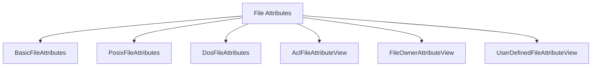

------
title: Learn Java IO, Modern IO, Streams, Buffers, Resources, Serialization & Data Boundaries - Part 010
description: Filesystem semantics untuk Java engineer: metadata, attributes, symbolic links, hard links, permissions, ownership, file identity, timestamps, hidden files, access checks, dan cross-platform correctness.
series: learn-java-io-modern-io-resource-boundaries
seriesTitle: Learn Java IO, Modern IO, Streams, Buffers, Resources, Serialization & Data Boundaries
order: 10
partTitle: Filesystem Semantics: Metadata, Links, Permissions, Attributes
tags:
  - java
  - io
  - nio
  - filesystem
  - metadata
  - symbolic-links
  - permissions
  - attributes
  - series
date: 2026-06-30
---

# Part 010 — Filesystem Semantics: Metadata, Links, Permissions, Attributes

## 1. Target Kompetensi

Bagian sebelumnya membahas `Path`, `Files`, dan `FileSystem`. Sekarang kita masuk ke semantik objek filesystem itu sendiri.

Targetnya: ketika melihat kode seperti ini, kita bisa tahu apa yang benar, apa yang race-prone, dan apa yang OS/provider-dependent.

```java
BasicFileAttributes attrs = Files.readAttributes(
    path,
    BasicFileAttributes.class,
    LinkOption.NOFOLLOW_LINKS
);

if (!attrs.isRegularFile()) {
    throw new IllegalArgumentException("Expected regular file");
}

if (Files.isSymbolicLink(path)) {
    throw new IllegalArgumentException("Symbolic links are not allowed");
}
```

Pertanyaan engineering-nya:

- Apa itu “regular file”?
- Apakah symbolic link diikuti atau tidak?
- Apakah metadata dibaca secara atomic?
- Apakah permission model sama di Linux dan Windows?
- Apakah `isReadable` cukup untuk memutuskan boleh membaca?
- Apakah timestamp presisi dan maknanya sama di semua filesystem?
- Apakah dua path yang berbeda bisa menunjuk file yang sama?

Filesystem bukan database. Ia adalah namespace mutable yang penuh edge case.

## 2. Kaufman Deconstruction

Kita pecah skill ini menjadi sub-skill operasional.

| Sub-skill | Yang Harus Dikuasai |
|---|---|
| File type semantics | regular file, directory, symlink, other/special file |
| Attribute views | basic, POSIX, DOS, ACL, owner, user-defined |
| Link handling | follow vs no-follow, symlink vs hard link |
| Permission model | POSIX mode bits, Windows ACL/DOS attributes, owner/group |
| Identity | file key, `isSameFile`, link count assumptions |
| Time metadata | creation, modified, access time, precision, stability |
| Access checks | why `isReadable`/`isWritable` are not authority |
| Cross-platform review | portability traps before production |

Mental model utama:

> Filesystem metadata is an observation with provider-specific meaning, not a universal truth object.

## 3. Filesystem Object Types

Java exposes common file type predicates via `BasicFileAttributes` and convenience methods in `Files`.

```java
BasicFileAttributes attrs = Files.readAttributes(path, BasicFileAttributes.class);

if (attrs.isRegularFile()) { ... }
if (attrs.isDirectory()) { ... }
if (attrs.isSymbolicLink()) { ... }
if (attrs.isOther()) { ... }
```

Convenience methods:

```java
Files.isRegularFile(path);
Files.isDirectory(path);
Files.isSymbolicLink(path);
```

### 3.1 Regular File

A regular file is the normal byte container most application code expects.

Examples:

- CSV file,
- image file,
- PDF,
- log file,
- serialized binary blob.

But “regular file” does not mean:

- small,
- stable,
- readable,
- trusted,
- immutable,
- local disk-backed.

### 3.2 Directory

A directory is a mapping from names to entries. It is not just “a file with children” from application perspective.

Directory operations have special failure modes:

- `DirectoryNotEmptyException`,
- permission denied during traversal,
- entries changing while listing,
- cycles through symbolic links,
- provider-specific ordering.

### 3.3 Symbolic Link

A symbolic link is a filesystem entry whose content points to another path.

```java
boolean link = Files.isSymbolicLink(path);
```

If symbolic links are followed, operations affect or inspect the target. If not followed, operations affect or inspect the link itself.

### 3.4 Other / Special File

`attrs.isOther()` covers provider-specific non-regular non-directory non-symlink entries.

On Unix-like systems, examples may include:

- device files,
- named pipes/FIFOs,
- sockets.

Application ingestion code should normally reject `isOther()` unless it explicitly supports special files.

```java
if (!attrs.isRegularFile()) {
    throw new IOException("Expected regular file: " + path);
}
```

## 4. Attribute Views

Java NIO.2 exposes metadata through attribute views.



### 4.1 Basic Attributes

`BasicFileAttributes` are common across file systems.

```java
BasicFileAttributes attrs = Files.readAttributes(path, BasicFileAttributes.class);

long size = attrs.size();
FileTime modified = attrs.lastModifiedTime();
FileTime accessed = attrs.lastAccessTime();
FileTime created = attrs.creationTime();
Object key = attrs.fileKey();
```

Common fields:

| Field | Meaning | Caveat |
|---|---|---|
| `size()` | file size in bytes | may change after read |
| `lastModifiedTime()` | last modification time | precision/provider-dependent |
| `lastAccessTime()` | last access time | may be disabled or coarse |
| `creationTime()` | creation/birth time if available | may be synthetic or same as modified time |
| `fileKey()` | identity-like object if available | may be null |
| `isRegularFile()` | regular file type | link policy matters |
| `isDirectory()` | directory type | link policy matters |
| `isSymbolicLink()` | symbolic link | depends on no-follow usage |
| `isOther()` | special/other | reject by default for ingestion |

### 4.2 POSIX Attributes

POSIX attributes are available on POSIX-like file systems.

```java
PosixFileAttributes attrs = Files.readAttributes(path, PosixFileAttributes.class);

UserPrincipal owner = attrs.owner();
GroupPrincipal group = attrs.group();
Set<PosixFilePermission> permissions = attrs.permissions();
```

Example permission formatting:

```java
Set<PosixFilePermission> perms = Files.getPosixFilePermissions(path);
String mode = PosixFilePermissions.toString(perms);
System.out.println(mode); // e.g. rw-r-----
```

Set permissions:

```java
Set<PosixFilePermission> ownerOnly = PosixFilePermissions.fromString("rw-------");
Files.setPosixFilePermissions(path, ownerOnly);
```

Do not run this blindly on Windows. It may throw `UnsupportedOperationException`.

### 4.3 DOS Attributes

DOS attributes matter mostly on Windows-compatible filesystems.

```java
DosFileAttributes attrs = Files.readAttributes(path, DosFileAttributes.class);

boolean hidden = attrs.isHidden();
boolean readOnly = attrs.isReadOnly();
boolean archive = attrs.isArchive();
boolean system = attrs.isSystem();
```

Set attribute:

```java
Files.setAttribute(path, "dos:hidden", true);
```

### 4.4 Owner View

```java
UserPrincipal owner = Files.getOwner(path);
Files.setOwner(path, owner);
```

Owner identity semantics depend on OS and provider. Avoid assuming usernames are stable unique identifiers in distributed systems.

### 4.5 ACL View

Windows and some filesystems expose ACLs.

```java
AclFileAttributeView view = Files.getFileAttributeView(path, AclFileAttributeView.class);
if (view != null) {
    List<AclEntry> acl = view.getAcl();
}
```

ACLs are more expressive than POSIX mode bits. Do not try to model enterprise permission systems as only `rwx` bits if the target filesystem uses ACLs.

### 4.6 User-Defined Attributes

Some providers support user-defined attributes.

```java
UserDefinedFileAttributeView view = Files.getFileAttributeView(
    path,
    UserDefinedFileAttributeView.class
);
```

Use with caution:

- not portable,
- may not survive copy/archive/backup,
- may be stripped by tools,
- may not work on mounted volumes.

## 5. `readAttributes` vs Convenience Methods

Instead of calling many convenience methods:

```java
boolean regular = Files.isRegularFile(path);
long size = Files.size(path);
FileTime modified = Files.getLastModifiedTime(path);
```

Prefer one attributes read when you need a consistent snapshot-ish view:

```java
BasicFileAttributes attrs = Files.readAttributes(path, BasicFileAttributes.class);

if (attrs.isRegularFile() && attrs.size() > 0) {
    process(path, attrs.lastModifiedTime());
}
```

Caveat: Java documentation notes that whether all file attributes are read atomically with respect to other filesystem operations is implementation-specific.

So this is better, but not a transaction.

## 6. Symbolic Link Policy

Symbolic links are where many filesystem boundary bugs begin.

Default behavior for many operations is to follow symbolic links. You can often change this with `LinkOption.NOFOLLOW_LINKS`.

```java
BasicFileAttributes attrs = Files.readAttributes(
    path,
    BasicFileAttributes.class,
    LinkOption.NOFOLLOW_LINKS
);
```

### 6.1 Follow vs No-Follow

```mermaid
flowchart LR
    L[path: uploads/a] -->|symlink content| T[/etc/passwd]

    OP1[follow links] --> T
    OP2[NOFOLLOW_LINKS] --> L
```

If you follow links, `isRegularFile()` may describe the target.

If you do not follow links, `isSymbolicLink()` can describe the link itself.

### 6.2 Creating Symbolic Links

```java
Path link = Path.of("shortcut.txt");
Path target = Path.of("real.txt");
Files.createSymbolicLink(link, target);
```

This can fail because:

- OS does not support it,
- permission is missing,
- filesystem provider rejects it,
- target path form is invalid,
- link already exists.

### 6.3 Reading Symbolic Link Target

```java
Path target = Files.readSymbolicLink(link);
```

The returned path is the link target as stored. It may be relative.

### 6.4 Symlink Boundary Risk

Suppose application allows writing under `/srv/app/uploads`.

```text
/srv/app/uploads/user-a/report.csv
```

An attacker or compromised process creates:

```text
/srv/app/uploads/user-a/out -> /etc
```

Then application writes:

```text
/srv/app/uploads/user-a/out/app.conf
```

Lexically it is under upload root. Semantically it escapes.

Mitigations depend on threat model:

- disallow symlinks under writable roots,
- keep upload directories owned only by application user,
- use `NOFOLLOW_LINKS` for final component where possible,
- use temp directories with controlled permissions,
- use `SecureDirectoryStream` where supported,
- validate after opening if identity matters,
- avoid path-based authority in hostile directories.

## 7. Hard Links

A hard link is another directory entry pointing to the same underlying file object.

```java
Files.createLink(link, existing);
```

Unlike symbolic links:

- hard links are not “pointers to path strings”,
- they usually point to same file identity/inode,
- deleting one link does not delete content until last link is gone,
- they may be restricted across filesystems or directories.

Java does not expose a universal hard-link count in `BasicFileAttributes`.

Use `Files.isSameFile(a, b)` to ask provider whether two paths locate the same file.

```java
boolean same = Files.isSameFile(pathA, pathB);
```

Do not build security logic assuming one path equals one file.

## 8. File Identity

`Path.equals` compares path objects. `Files.isSameFile` compares actual file identity according to provider.

```java
Path a = Path.of("/tmp/data.txt");
Path b = Path.of("/tmp/../tmp/data.txt");

System.out.println(a.equals(b));         // path equality
System.out.println(Files.isSameFile(a,b)); // filesystem identity
```

`BasicFileAttributes.fileKey()` may expose an identity-like object.

```java
Object key = Files.readAttributes(path, BasicFileAttributes.class).fileKey();
```

Caveats:

- may be null,
- not portable,
- format unspecified,
- may not survive across JVM runs/providers,
- may not be stable on some remote filesystems.

Use `fileKey` for diagnostics and cycle detection support, not universal business identity.

## 9. Permissions Are Not Portable

### 9.1 POSIX Permission Model

POSIX permissions are mode bits for owner, group, and others.

```text
rw-r-----
```

Means:

```text
owner: read/write
group: read
others: no access
```

Java model:

```java
Set<PosixFilePermission> permissions = Set.of(
    PosixFilePermission.OWNER_READ,
    PosixFilePermission.OWNER_WRITE
);
Files.setPosixFilePermissions(path, permissions);
```

### 9.2 Windows Permission Model

Windows primarily uses ACLs and DOS attributes. A file can be read-only in DOS attributes while ACLs separately control access.

Do not write platform-neutral code that assumes `setPosixFilePermissions` works everywhere.

### 9.3 Permission at Creation Time

Setting permissions after creating a file can create a short exposure window.

Less ideal:

```java
Files.createFile(path);
Files.setPosixFilePermissions(path, PosixFilePermissions.fromString("rw-------"));
```

Better where supported:

```java
FileAttribute<Set<PosixFilePermission>> attrs =
    PosixFilePermissions.asFileAttribute(
        PosixFilePermissions.fromString("rw-------")
    );

Files.createFile(path, attrs);
```

Provider may reject unsupported attributes. Handle it explicitly.

## 10. Access Checks Are Race-Prone

```java
if (Files.isReadable(path)) {
    return Files.readString(path);
}
```

Between check and read:

- file can be deleted,
- file can be replaced,
- permissions can change,
- path can become a link,
- mount can disappear.

Better:

```java
try {
    return Files.readString(path, StandardCharsets.UTF_8);
} catch (AccessDeniedException e) {
    throw new IOException("Not allowed to read: " + path, e);
}
```

Use `isReadable` for UI hints, diagnostics, or preflight logs. Do not treat it as authorization.

## 11. Hidden Files

```java
boolean hidden = Files.isHidden(path);
```

Hidden semantics differ:

- Unix-like systems often use leading dot convention.
- Windows has hidden attribute.
- Providers may define their own behavior.

Do not encode compliance or retention policy based only on “hidden”. Hidden means “hidden in normal directory views”, not “private”, “secure”, or “system-owned”.

## 12. Timestamps

```java
BasicFileAttributes attrs = Files.readAttributes(path, BasicFileAttributes.class);

FileTime created = attrs.creationTime();
FileTime modified = attrs.lastModifiedTime();
FileTime accessed = attrs.lastAccessTime();
```

### 12.1 Last Modified Time

Often the most useful for caches and incremental processing.

But:

- precision varies,
- clock source may differ,
- updates may be delayed,
- remote filesystems can behave strangely,
- content may change without expected timestamp behavior in exotic cases.

### 12.2 Last Access Time

May be disabled for performance. On many systems, access time updates are coarse, lazy, or suppressed.

Do not use last access time as a strong audit event.

### 12.3 Creation Time

Creation time is not universally meaningful. Some filesystems do not store true birth time. Java may return an implementation-specific value.

### 12.4 Timestamp Precision

Two files written in quick succession may have equal timestamps. Build incremental processors with additional checks when correctness matters:

- size,
- checksum,
- content hash,
- version marker,
- manifest,
- monotonic application sequence.

## 13. Size Metadata

```java
long size = Files.size(path);
```

Size is an observation. It can become stale immediately.

Incorrect assumption:

```java
long size = Files.size(path);
byte[] bytes = Files.readAllBytes(path);
assert bytes.length == size; // not guaranteed under concurrent modification
```

Better for bounded read:

```java
public static byte[] readBounded(Path path, long maxBytes) throws IOException {
    try (InputStream in = Files.newInputStream(path)) {
        ByteArrayOutputStream out = new ByteArrayOutputStream();
        byte[] buffer = new byte[8192];
        long total = 0;

        int n;
        while ((n = in.read(buffer)) != -1) {
            total += n;
            if (total > maxBytes) {
                throw new IOException("File exceeds limit: " + maxBytes);
            }
            out.write(buffer, 0, n);
        }
        return out.toByteArray();
    }
}
```

This enforces the boundary during read, not only before read.

## 14. Attribute Names API

Java allows reading attributes via string names.

```java
Object size = Files.getAttribute(path, "basic:size");
Object hidden = Files.getAttribute(path, "dos:hidden");
```

And setting:

```java
Files.setAttribute(path, "basic:lastModifiedTime", FileTime.from(Instant.now()));
```

Use strongly typed APIs when possible. String attributes are useful for generic tooling, diagnostics, or provider-specific code.

## 15. File Stores

`FileStore` represents storage pool/device/partition concept exposed by provider.

```java
FileStore store = Files.getFileStore(path);

long total = store.getTotalSpace();
long usable = store.getUsableSpace();
boolean posix = store.supportsFileAttributeView(PosixFileAttributeView.class);
```

Use cases:

- checking attribute support,
- capacity diagnostics,
- deciding whether POSIX permissions can be used,
- operational health check.

Caveat: free space checks are also observations. Another process can consume space immediately after the check.

## 16. File Attribute View Discovery

Before using optional views:

```java
FileStore store = Files.getFileStore(path);

if (store.supportsFileAttributeView("posix")) {
    Set<PosixFilePermission> perms = Files.getPosixFilePermissions(path);
}
```

Or:

```java
PosixFileAttributeView view = Files.getFileAttributeView(
    path,
    PosixFileAttributeView.class
);

if (view != null) {
    PosixFileAttributes attrs = view.readAttributes();
}
```

This makes portability explicit.

## 17. Secure Directory Stream

`SecureDirectoryStream` is a specialized directory stream for operations relative to an open directory, intended to support race-free operations where the underlying implementation supports it.

```java
try (DirectoryStream<Path> ds = Files.newDirectoryStream(root)) {
    if (ds instanceof SecureDirectoryStream<Path> secure) {
        // use secure operations when supported
    }
}
```

Not all providers support it. But for high-risk path traversal/link-race scenarios, know it exists.

## 18. Directory Traversal Semantics

When walking a tree:

```java
try (Stream<Path> paths = Files.walk(root)) {
    paths.forEach(this::process);
}
```

Think about:

- Should symlinks be followed?
- What happens on cycles?
- What happens when a directory becomes unreadable mid-walk?
- Is traversal order meaningful?
- Do you need stable snapshot semantics? Filesystem traversal usually does not provide that.

For complex traversal, `FileVisitor` gives more explicit control.

```java
Files.walkFileTree(root, new SimpleFileVisitor<>() {
    @Override
    public FileVisitResult visitFile(Path file, BasicFileAttributes attrs) throws IOException {
        process(file, attrs);
        return FileVisitResult.CONTINUE;
    }

    @Override
    public FileVisitResult visitFileFailed(Path file, IOException exc) throws IOException {
        // choose continue, skip, or fail
        return FileVisitResult.CONTINUE;
    }
});
```

## 19. Cross-Platform Matrix

| Concern | Linux/POSIX-like | Windows | Engineering Guidance |
|---|---|---|---|
| Separator | `/` | `\\` accepted in many contexts | Use `Path` operations |
| Case sensitivity | Usually sensitive | Often insensitive | Do not rely blindly on case distinction |
| Permissions | POSIX mode bits + ACLs possible | ACLs + DOS attrs | Discover attribute view |
| Hidden files | dot convention | hidden attribute | Use `Files.isHidden`, but avoid security meaning |
| Symlinks | common | supported but privilege/config may matter | Handle failure explicitly |
| Hard links | common for files | supported with differences | Use `isSameFile`, avoid assumptions |
| Creation time | filesystem-dependent | often available | Treat as optional-ish metadata |
| File locking | advisory/mandatory varies | different semantics | Covered later with channels |
| Rename replace | strong on same filesystem | different constraints if open | Covered in Part 011 |

## 20. Production Pattern: Metadata Snapshot Object

Instead of passing raw attributes everywhere, create a domain-level snapshot.

```java
public record FileSnapshot(
    Path path,
    boolean regularFile,
    boolean symbolicLink,
    long size,
    FileTime lastModifiedTime,
    Object fileKey
) {
    public static FileSnapshot readNoFollow(Path path) throws IOException {
        BasicFileAttributes attrs = Files.readAttributes(
            path,
            BasicFileAttributes.class,
            LinkOption.NOFOLLOW_LINKS
        );

        return new FileSnapshot(
            path,
            attrs.isRegularFile(),
            attrs.isSymbolicLink(),
            attrs.size(),
            attrs.lastModifiedTime(),
            attrs.fileKey()
        );
    }
}
```

Benefits:

- link policy is explicit,
- metadata is grouped,
- tests are easier,
- business logic avoids repeated filesystem calls,
- logs can include consistent fields.

Caveat: still not a transaction.

## 21. Production Pattern: Reject Non-Regular Input

```java
public void ingest(Path file) throws IOException {
    BasicFileAttributes attrs = Files.readAttributes(
        file,
        BasicFileAttributes.class,
        LinkOption.NOFOLLOW_LINKS
    );

    if (!attrs.isRegularFile()) {
        throw new IOException("Expected regular file, got non-regular path: " + file);
    }

    if (attrs.size() == 0) {
        throw new IOException("Empty input file: " + file);
    }

    try (InputStream in = Files.newInputStream(file, StandardOpenOption.READ)) {
        parse(in);
    }
}
```

This is not perfect against replacement races, but it documents the expected boundary.

For higher correctness, open file first with a channel and inspect metadata through the opened handle where possible. That will be covered in channel/file correctness sections.

## 22. Production Pattern: Optional POSIX Permissions

```java
public void createPrivateFile(Path path, byte[] content) throws IOException {
    Set<PosixFilePermission> perms = PosixFilePermissions.fromString("rw-------");
    FileAttribute<Set<PosixFilePermission>> attr = PosixFilePermissions.asFileAttribute(perms);

    try {
        Files.write(path, content, attr);
    } catch (UnsupportedOperationException e) {
        // Fallback policy must be explicit.
        Files.write(path, content, StandardOpenOption.CREATE_NEW);
    }
}
```

A better fallback may be platform-specific ACL handling or failing closed. Do not silently downgrade security-sensitive permission intent unless your threat model allows it.

## 23. Production Pattern: Attribute Support Check

```java
public boolean supportsPosix(Path path) throws IOException {
    return Files.getFileStore(path)
        .supportsFileAttributeView(PosixFileAttributeView.class);
}
```

Use this in startup diagnostics:

```java
if (!supportsPosix(storageRoot)) {
    log.warn("Storage root does not support POSIX file permissions: {}", storageRoot);
}
```

For regulated or multi-tenant systems, this may be a startup failure, not a warning.

## 24. Common Anti-Patterns

### 24.1 Treating `isRegularFile` as Stable

```java
if (Files.isRegularFile(path)) {
    process(Files.newInputStream(path));
}
```

The file can change between check and open.

### 24.2 Assuming POSIX Everywhere

```java
Files.setPosixFilePermissions(path, perms);
```

This breaks on unsupported providers.

### 24.3 Using Hidden as Security

```java
if (Files.isHidden(path)) {
    denyAccess(path);
}
```

Hidden is display metadata, not authorization.

### 24.4 Trusting Timestamp for Exact Change Detection

```java
if (modified.isAfter(lastRun)) {
    importFile(path);
}
```

This can miss changes on coarse timestamp filesystems or concurrent updates. Use manifest/hash/sequence where correctness matters.

### 24.5 Ignoring Links in Upload/Extract Code

Archive extraction, upload staging, and generated file placement must treat links explicitly.

## 25. Failure Taxonomy

| Failure | Example Exception / Signal | Meaning |
|---|---|---|
| Missing path | `NoSuchFileException` | Path not present at operation time |
| Permission denied | `AccessDeniedException` | Effective access denied or locked by OS/provider |
| Not directory | `NotDirectoryException` | Path component expected directory but is not |
| Already exists | `FileAlreadyExistsException` | Create-new semantics failed |
| Directory not empty | `DirectoryNotEmptyException` | Delete/move constraint |
| Symlink cycle | `FileSystemLoopException` | Traversal detected loop |
| Unsupported view | `UnsupportedOperationException` | Provider does not support requested view |
| Unsupported link | `UnsupportedOperationException` / `IOException` | Provider/OS cannot create link |

Map these to domain outcomes instead of generic “IO failed”.

## 26. Review Checklist

For code that reads filesystem metadata:

- Is link policy explicit?
- Are optional attribute views discovered or guarded?
- Are permissions treated as platform-dependent?
- Are access checks not used as authority?
- Are timestamps not treated as perfect change events?
- Is non-regular input rejected where appropriate?
- Are special files handled intentionally?
- Is file identity checked with `isSameFile` if identity matters?
- Is `fileKey` treated as optional/provider-specific?
- Are errors mapped to meaningful domain states?

## 27. Practice: 120-Minute Drill

### Drill A — Attribute Inspector

Implement CLI:

```text
java AttributeInspector <path>
```

Print:

- absolute path,
- real path if available,
- basic attributes with `FOLLOW_LINKS`,
- basic attributes with `NOFOLLOW_LINKS`,
- owner,
- supported attribute views,
- POSIX permissions if supported,
- DOS attributes if supported.

### Drill B — Symlink Experiment

Create:

```text
root/file.txt
root/link-to-file -> file.txt
root/link-to-parent -> ..
```

Observe behavior of:

```java
Files.isRegularFile(path)
Files.isRegularFile(path, LinkOption.NOFOLLOW_LINKS)
Files.readAttributes(path, BasicFileAttributes.class)
Files.readAttributes(path, BasicFileAttributes.class, LinkOption.NOFOLLOW_LINKS)
```

Write down what changed.

### Drill C — Permission Fallback

Write a method that creates a private file:

- uses POSIX permissions if supported,
- fails closed if not supported,
- logs clear reason.

Then write a variant that falls back on Windows ACLs if you want deeper platform practice.

### Drill D — Timestamp Trap

Write two files quickly in a loop and inspect modified times. Test on local filesystem and, if available, a mounted volume. Observe precision.

## 28. Summary

Filesystem semantics are subtle because file metadata is not a universal, immutable object.

Core lessons:

- A path can refer to regular file, directory, symlink, or special object.
- Attribute views are provider-dependent.
- `NOFOLLOW_LINKS` is a policy decision, not a detail.
- `Files.exists` and `Files.isReadable` are observations, not guarantees.
- POSIX permissions, DOS attributes, and ACLs are different models.
- Timestamps have limited precision and weak audit meaning.
- `Path.equals` is not file identity; use `Files.isSameFile` when needed.
- Metadata snapshots help structure code, but are not transactions.

Next, we will use these semantics to design correct file operations: create, move, copy, delete, safe replace, atomicity, TOCTOU risks, and partial failure handling.

## References

- Java SE 25 API — `java.nio.file` package: https://docs.oracle.com/en/java/javase/25/docs/api/java.base/java/nio/file/package-summary.html
- Java SE 25 API — `Files`: https://docs.oracle.com/en/java/javase/25/docs/api/java.base/java/nio/file/Files.html
- Java SE 25 API — `BasicFileAttributes`: https://docs.oracle.com/en/java/javase/25/docs/api/java.base/java/nio/file/attribute/BasicFileAttributes.html
- Java SE 25 API — `PosixFileAttributes`: https://docs.oracle.com/en/java/javase/25/docs/api/java.base/java/nio/file/attribute/PosixFileAttributes.html
- Java SE 25 API — `DosFileAttributes`: https://docs.oracle.com/en/java/javase/25/docs/api/java.base/java/nio/file/attribute/DosFileAttributes.html
- Java SE 25 API — `LinkOption`: https://docs.oracle.com/en/java/javase/25/docs/api/java.base/java/nio/file/LinkOption.html
- Java SE 25 API — `SecureDirectoryStream`: https://docs.oracle.com/en/java/javase/25/docs/api/java.base/java/nio/file/SecureDirectoryStream.html
- Java SE 25 API — `FileStore`: https://docs.oracle.com/en/java/javase/25/docs/api/java.base/java/nio/file/FileStore.html
