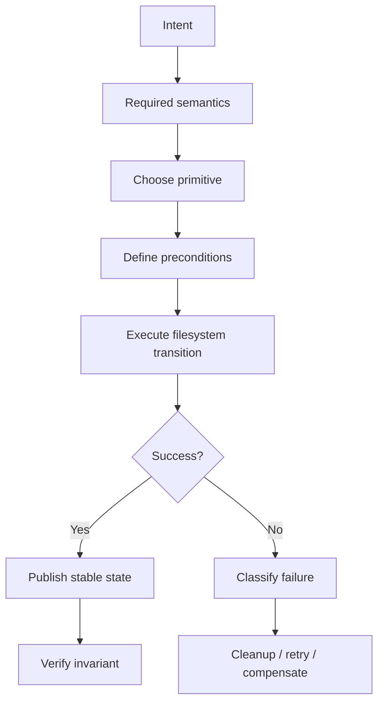
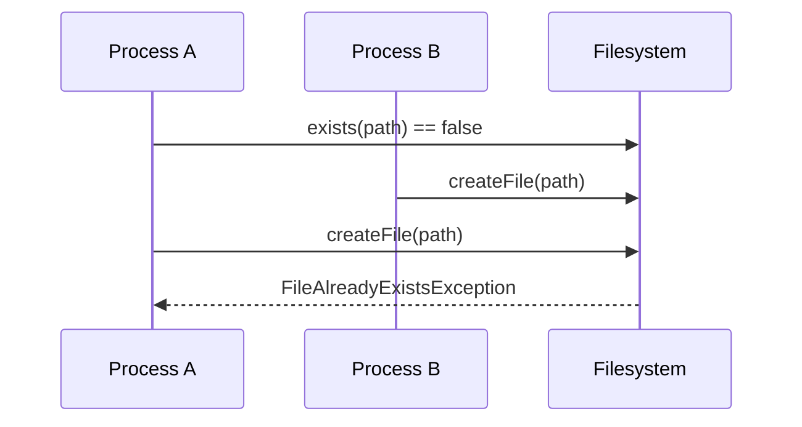
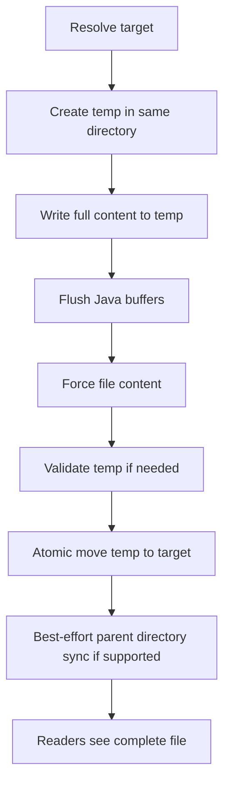
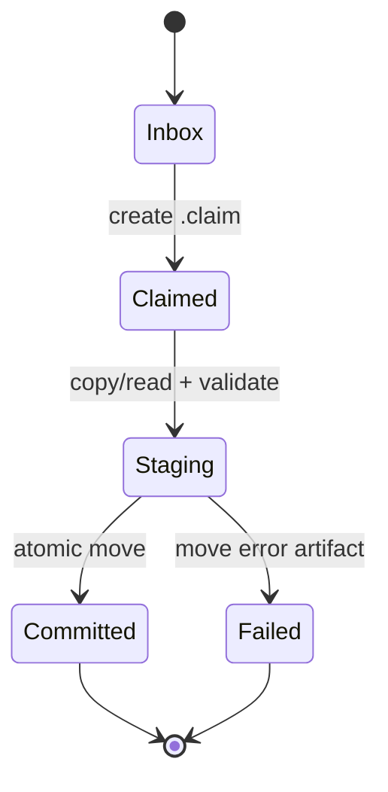
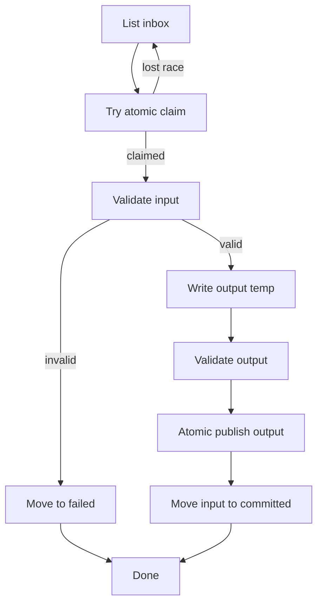

------
title: Learn Java IO, Modern IO, Streams, Buffers, Resources, Serialization & Data Boundaries - Part 011
description: Correct file operations in Java using Path, Files, FileChannel, atomic move, safe replace, temp files, race-resistant creation, copy/move/delete semantics, and production-grade filesystem correctness.
series: learn-java-io-modern-io-resource-boundaries
seriesTitle: Learn Java IO, Modern IO, Streams, Buffers, Resources, Serialization & Data Boundaries
order: 11
partTitle: Correct File Operations: Create, Move, Copy, Delete, Atomicity
tags:
  - java
  - io
  - nio
  - filesystem
  - path
  - files
  - atomicity
  - resource-management
  - series
date: 2026-06-30
---

# Part 011 — Correct File Operations: Create, Move, Copy, Delete, Atomicity

> Target: setelah part ini, kita tidak lagi menulis file code dengan mental model “kalau tidak throw berarti aman”. Kita akan mendesain operasi file sebagai **state transition pada filesystem** yang bisa gagal sebagian, dipengaruhi provider, link, permission, race, dan crash boundary.

Part sebelumnya membangun model `Path`, `Files`, metadata, link, dan permission. Sekarang kita masuk ke operasi yang paling sering terlihat sederhana tetapi salah di production: create, open, copy, move, replace, delete, recursive traversal, dan safe publication.

Java memberikan API yang cukup kuat lewat `java.nio.file.Files`, `StandardOpenOption`, `StandardCopyOption`, `LinkOption`, `FileChannel`, dan `FileVisitor`. Tetapi API tersebut tidak otomatis membuat desain kita benar. Correctness berasal dari **urutan operasi, pilihan primitive, dan contract failure** yang kita tetapkan.

---

## 1. Kaufman Skill Deconstruction

Dalam pendekatan Josh Kaufman, skill besar harus dipecah menjadi sub-skill kecil yang bisa dilatih secara sadar. Untuk file operations, skill-nya bukan “hafal method `Files`”, melainkan kemampuan menjawab pertanyaan berikut:

1. Apa state filesystem sebelum operasi?
2. Apa state yang diinginkan setelah operasi?
3. Apakah operasi harus atomic, idempotent, resumable, atau best-effort?
4. Siapa pemilik path, directory, permission, dan lifecycle?
5. Apa yang terjadi jika operasi gagal di tengah?
6. Apa yang terjadi jika proses lain menyentuh path yang sama?
7. Apa yang terjadi jika input path mengandung symbolic link?
8. Apa yang terjadi jika target ada, tidak ada, directory, file, link, atau special file?
9. Apa yang harus dilakukan terhadap partial output?
10. Apakah hasil harus visible hanya setelah lengkap?

Kita akan belajar dengan mental model berikut:



**Invariant utama:** operasi file yang benar bukan operasi yang “berhasil di laptop”, tetapi operasi yang tetap memiliki state akhir yang dapat dijelaskan saat ada concurrency, permission error, disk full, path race, partial write, dan crash.

---

## 2. Problem Space: File Operations Are State Transitions

File operation terlihat seperti function call:

```java
Files.copy(source, target);
```

Tetapi secara realita ini adalah state transition pada external system:

```text
filesystem_before + operation + environment = filesystem_after | exception | partial_state
```

External system ini memiliki karakteristik:

- state berada di luar JVM;
- state bisa berubah oleh proses lain;
- failure bisa muncul dari kernel, filesystem, network mount, antivirus, quota, permission, lock, device removal, dan storage layer;
- operasi tidak selalu atomic;
- exception tidak selalu berarti state tidak berubah;
- sukses tidak selalu berarti durable setelah crash;
- path string tidak selalu menunjuk entity yang sama sepanjang waktu.

Karena itu, Java file operation harus dipandang sebagai **boundary operation**, bukan hanya library call.

---

## 3. Taxonomy Operasi File

| Operation | Java Primitive | Core Risk | Better Question |
|---|---|---|---|
| Create file | `Files.createFile`, `Files.newByteChannel(... CREATE_NEW)` | Race jika check-then-create | Apakah create harus fail jika sudah ada? |
| Create directory | `Files.createDirectory`, `Files.createDirectories` | Parent missing, partial directory tree | Apakah tree creation idempotent? |
| Open existing | `Files.newInputStream`, `Files.newByteChannel` | Target berubah/link | Apakah entity harus verified? |
| Write file | `Files.write`, `FileChannel.write` | Partial output visible | Apakah output boleh terlihat sebelum lengkap? |
| Copy | `Files.copy` | Partial target, metadata mismatch | Apakah copy harus all-or-nothing? |
| Move | `Files.move` | Cross-filesystem fallback, replacement race | Apakah move harus atomic? |
| Replace | temp + atomic move | Crash window | Apakah reader harus melihat old atau new, never half? |
| Delete | `Files.delete`, `deleteIfExists` | Wrong target, non-empty dir, link confusion | Apakah delete idempotent dan scoped? |
| Recursive delete | `Files.walkFileTree` | Symlink traversal, partial delete | Apa policy saat sebagian gagal? |
| Publish artifact | temp/staging + validation + move | Incomplete artifact consumed | Kapan artifact dianggap committed? |

---

## 4. The Most Important Rule: Avoid Check-Then-Act

Classic anti-pattern:

```java
if (!Files.exists(path)) {
    Files.createFile(path);
}
```

Kode ini terlihat masuk akal, tetapi salah sebagai boundary logic. Antara `exists` dan `createFile`, proses lain bisa membuat file yang sama.

Masalahnya disebut **TOCTOU**: time-of-check to time-of-use.



Correct model:

```java
try {
    Files.createFile(path);
} catch (FileAlreadyExistsException e) {
    // expected race outcome; handle according to policy
}
```

Atau untuk open-write exclusive:

```java
try (SeekableByteChannel channel = Files.newByteChannel(
        path,
        StandardOpenOption.CREATE_NEW,
        StandardOpenOption.WRITE)) {
    // write to newly created file only
}
```

**Rule:** kalau filesystem menyediakan operasi atomic untuk intent kita, gunakan operasi itu sebagai check sekaligus act.

---

## 5. Existence Checks Are Observations, Not Guarantees

`Files.exists(path)` dan `Files.notExists(path)` sering disalahgunakan. Mereka adalah observasi sementara, bukan precondition yang stabil.

Contoh misleading:

```java
if (Files.exists(config)) {
    return Files.readString(config);
}
return defaultConfig();
```

Bahkan jika `exists` mengembalikan true, file bisa dihapus sebelum `readString`. Sebaliknya, jika `exists` false, mungkin sebenarnya status tidak bisa ditentukan karena permission atau I/O error.

Pola yang lebih benar:

```java
try {
    return Files.readString(config);
} catch (NoSuchFileException e) {
    return defaultConfig();
}
```

Namun, jangan juga menelan semua `IOException` sebagai default:

```java
try {
    return Files.readString(config);
} catch (IOException e) {
    return defaultConfig(); // dangerous: permission/disk/corruption becomes default
}
```

Lebih baik klasifikasikan failure:

```java
try {
    return Files.readString(config);
} catch (NoSuchFileException e) {
    return defaultConfig();
} catch (AccessDeniedException e) {
    throw new IllegalStateException("Config exists but is not readable: " + config, e);
} catch (IOException e) {
    throw new UncheckedIOException("Cannot read config: " + config, e);
}
```

**Mental model:** existence is not truth; it is a stale snapshot.

---

## 6. Creating Files Correctly

### 6.1 `Files.createFile`

Use when:

- file must not already exist;
- collision is meaningful;
- create is part of a lock/claim/idempotency protocol;
- you want atomic fail-if-exists behavior.

```java
Path claim = inbox.resolve(messageId + ".claim");

try {
    Files.createFile(claim);
    // this worker owns this message
} catch (FileAlreadyExistsException e) {
    // another worker already claimed it
}
```

This pattern is useful for simple filesystem-based coordination, but it is not a replacement for robust distributed locking. On local filesystem, create-if-absent is often atomic. On network filesystem, semantics can vary by provider and mount behavior.

### 6.2 `Files.createDirectories`

Use when directory tree creation should be idempotent:

```java
Files.createDirectories(base.resolve("staging"));
Files.createDirectories(base.resolve("committed"));
Files.createDirectories(base.resolve("failed"));
```

But remember: `createDirectories` can create some parent directories and then fail later. Do not assume all-or-nothing.

```text
before:
  /data

operation:
  createDirectories(/data/a/b/c)

possible failure state:
  /data/a exists
  /data/a/b does not exist
  /data/a/b/c does not exist
```

Design implication:

- treat directory initialization as idempotent;
- allow re-run;
- validate final structure after initialization;
- avoid assuming rollback.

### 6.3 Temporary Files

Temporary files are not just for scratch data. They are central to safe publication.

Prefer creating temp file in the **same target directory** when it will later be moved into place:

```java
Path target = outputDir.resolve("report.csv");
Path temp = Files.createTempFile(outputDir, ".report-", ".tmp");
```

Why same directory?

- atomic move usually requires same filesystem/provider;
- permission and quota are closer to final target;
- cleanup scope is localized;
- readers watching the directory can ignore temp naming convention.

Avoid this for final publication:

```java
Path temp = Files.createTempFile("report", ".tmp"); // maybe different filesystem
Files.move(temp, target, StandardCopyOption.ATOMIC_MOVE);
```

The move may fail if temp and target are on different filesystems.

---

## 7. Opening Files: `StandardOpenOption` as Contract

Opening a file is a contract. `StandardOpenOption` defines what state transition you are asking from the filesystem.

| Option | Meaning | Common Use |
|---|---|---|
| `READ` | open for reading | input, verification |
| `WRITE` | open for writing | explicit write access |
| `CREATE` | create if missing | non-exclusive output |
| `CREATE_NEW` | create new, fail if exists | race-resistant create |
| `TRUNCATE_EXISTING` | truncate existing file | overwrite-in-place, usually risky |
| `APPEND` | write at end | logs, append-only records |
| `DELETE_ON_CLOSE` | attempt delete on close | temp resources, limited portability expectations |
| `SPARSE` | hint sparse file | large sparse files |
| `SYNC` | synchronous content + metadata updates | high durability, high cost |
| `DSYNC` | synchronous content updates | high durability, less metadata emphasis |

Example: exclusive output creation:

```java
try (BufferedWriter writer = Files.newBufferedWriter(
        path,
        StandardCharsets.UTF_8,
        StandardOpenOption.CREATE_NEW,
        StandardOpenOption.WRITE)) {
    writer.write(payload);
}
```

Example: dangerous overwrite-in-place:

```java
Files.writeString(
        target,
        payload,
        StandardCharsets.UTF_8,
        StandardOpenOption.CREATE,
        StandardOpenOption.TRUNCATE_EXISTING,
        StandardOpenOption.WRITE);
```

If the process crashes after truncate but before full write, readers may see empty or partial file. This is acceptable only if your contract says partial output is okay. For configuration, checkpoints, manifests, indexes, and published artifacts, it is usually wrong.

---

## 8. Copy Semantics: Copy Is Not Publication

`Files.copy(source, target, options...)` is convenient, but production semantics must be explicit.

Questions before copying:

1. Is source allowed to change during copy?
2. Is target allowed to be visible while incomplete?
3. Should target replacement be atomic?
4. Should metadata be copied?
5. Should symbolic links be followed?
6. Should partial target be deleted on failure?
7. Is source on same filesystem as target?
8. Is copy retryable?

Naive copy:

```java
Files.copy(source, target, StandardCopyOption.REPLACE_EXISTING);
```

Potential problems:

- target may be visible while being written;
- failure can leave partial target;
- replacement is not necessarily atomic;
- readers may consume corrupted/incomplete output;
- metadata may not match expectation;
- source may change during copy.

Safer publication copy:

```java
static void copyThenPublish(Path source, Path target) throws IOException {
    Path dir = target.toAbsolutePath().getParent();
    Files.createDirectories(dir);

    Path temp = Files.createTempFile(dir, "." + target.getFileName(), ".tmp");
    boolean completed = false;

    try {
        Files.copy(source, temp, StandardCopyOption.REPLACE_EXISTING);

        try (FileChannel channel = FileChannel.open(temp, StandardOpenOption.READ)) {
            channel.force(true);
        }

        Files.move(
                temp,
                target,
                StandardCopyOption.REPLACE_EXISTING,
                StandardCopyOption.ATOMIC_MOVE);

        completed = true;
    } finally {
        if (!completed) {
            try {
                Files.deleteIfExists(temp);
            } catch (IOException cleanupFailure) {
                // log or attach to original failure in real code
            }
        }
    }
}
```

This pattern improves visibility semantics: readers see either previous target or complete new target, not a half-written target, assuming atomic move is supported by the filesystem/provider.

---

## 9. Move Semantics: Rename Is a Commit Primitive

`Files.move` is one of the most important file primitives because move/rename is often used as a **commit marker**.

```java
Files.move(temp, finalPath, StandardCopyOption.ATOMIC_MOVE);
```

`ATOMIC_MOVE` asks the filesystem to perform the move atomically. If unsupported, Java can throw `AtomicMoveNotSupportedException`.

Do not silently fall back from atomic move to non-atomic move unless your contract allows partial visibility.

Bad fallback:

```java
try {
    Files.move(temp, target, StandardCopyOption.ATOMIC_MOVE);
} catch (AtomicMoveNotSupportedException e) {
    Files.move(temp, target, StandardCopyOption.REPLACE_EXISTING); // maybe breaks contract
}
```

Better:

```java
try {
    Files.move(temp, target,
            StandardCopyOption.REPLACE_EXISTING,
            StandardCopyOption.ATOMIC_MOVE);
} catch (AtomicMoveNotSupportedException e) {
    throw new IOException("Filesystem does not support atomic publication to " + target, e);
}
```

Or explicitly degrade only when safe:

```java
if (contract.allowsNonAtomicPublication()) {
    Files.move(temp, target, StandardCopyOption.REPLACE_EXISTING);
} else {
    throw new IOException("Atomic publication required but unavailable");
}
```

### 9.1 Same Directory Matters

Atomic move is most reliable when source and target are in the same directory on the same filesystem.

```text
/data/out/.report-123.tmp  --atomic move-->  /data/out/report.csv
```

Cross-filesystem move may need copy+delete semantics, which are not atomic.

---

## 10. Safe Replace Pattern

Safe replace is the canonical pattern for writing final files.



Implementation:

```java
import java.io.BufferedWriter;
import java.io.IOException;
import java.nio.charset.StandardCharsets;
import java.nio.channels.FileChannel;
import java.nio.file.*;

import static java.nio.file.StandardCopyOption.ATOMIC_MOVE;
import static java.nio.file.StandardCopyOption.REPLACE_EXISTING;
import static java.nio.file.StandardOpenOption.READ;

public final class SafeFileWriter {

    public static void writeStringAtomically(Path target, String content) throws IOException {
        Path absoluteTarget = target.toAbsolutePath();
        Path directory = absoluteTarget.getParent();
        if (directory == null) {
            throw new IllegalArgumentException("Target has no parent directory: " + target);
        }

        Files.createDirectories(directory);

        Path temp = Files.createTempFile(directory, "." + absoluteTarget.getFileName(), ".tmp");
        boolean published = false;

        try {
            try (BufferedWriter writer = Files.newBufferedWriter(temp, StandardCharsets.UTF_8)) {
                writer.write(content);
            }

            try (FileChannel channel = FileChannel.open(temp, READ)) {
                channel.force(true);
            }

            Files.move(temp, absoluteTarget, REPLACE_EXISTING, ATOMIC_MOVE);
            published = true;
        } finally {
            if (!published) {
                Files.deleteIfExists(temp);
            }
        }
    }

    private SafeFileWriter() {}
}
```

Important nuance: closing `BufferedWriter` flushes Java-level buffers, but it does not necessarily guarantee durable storage after OS crash. That is why Part 012 goes deeper into `FileChannel.force`, parent directory sync, and crash consistency.

---

## 11. Atomicity vs Durability

Do not confuse these:

| Concept | Meaning | Example |
|---|---|---|
| Atomicity | Readers observe old or new, not half-transition | atomic move |
| Durability | State survives crash/power loss | `FileChannel.force` + storage behavior |
| Visibility | Other processes can see name/content | file appears in directory |
| Isolation | Other writers/readers cannot interfere | not guaranteed by normal files |
| Idempotency | Retry yields acceptable state | create-if-absent, temp cleanup |

Atomic move solves publication visibility. It does not by itself prove bytes are safely on disk after crash.

---

## 12. Directory Creation and Initialization

Suppose application startup needs:

```text
/data/app/inbox
/data/app/staging
/data/app/committed
/data/app/failed
```

Naive:

```java
Files.createDirectories(base.resolve("inbox"));
Files.createDirectories(base.resolve("staging"));
Files.createDirectories(base.resolve("committed"));
Files.createDirectories(base.resolve("failed"));
```

Better with validation:

```java
static void initializeLayout(Path base) throws IOException {
    Path inbox = base.resolve("inbox");
    Path staging = base.resolve("staging");
    Path committed = base.resolve("committed");
    Path failed = base.resolve("failed");

    for (Path dir : List.of(inbox, staging, committed, failed)) {
        Files.createDirectories(dir);
        if (!Files.isDirectory(dir, LinkOption.NOFOLLOW_LINKS)) {
            throw new IOException("Expected directory but found non-directory: " + dir);
        }
        if (!Files.isReadable(dir) || !Files.isWritable(dir)) {
            throw new IOException("Directory is not readable/writable: " + dir);
        }
    }
}
```

Why validate after creation?

- another process may have created unexpected entity;
- path may be symlink if policy forbids it;
- permissions may not allow later operations;
- network mount may behave differently than local dev;
- partial initialization should fail early.

---

## 13. Deleting Files Correctly

`Files.delete(path)` and `Files.deleteIfExists(path)` look simple, but delete is destructive and should have strict scope.

### 13.1 `delete` vs `deleteIfExists`

Use `delete` when missing file is a bug:

```java
Files.delete(lockFile);
```

Use `deleteIfExists` when cleanup is best-effort/idempotent:

```java
Files.deleteIfExists(tempFile);
```

Do not use `deleteIfExists` to hide logic errors:

```java
Files.deleteIfExists(customerData); // dangerous if missing indicates corrupted workflow state
```

### 13.2 Delete Is Not Always Immediate

On some operating systems, deleting an open file behaves differently. On Unix-like systems, a deleted file may remain accessible through existing file descriptors until closed. On Windows, deleting an open file may fail depending on sharing mode.

Design implication:

- close resources before cleanup;
- tolerate cleanup failure where appropriate;
- do not assume delete frees disk immediately if another process holds the file;
- avoid relying on OS-specific delete semantics.

---

## 14. Recursive Delete: Use `walkFileTree`, Not Blind String Concatenation

Recursive delete is dangerous because bugs can destroy data outside intended scope.

Naive and risky:

```java
Files.walk(root)
        .sorted(Comparator.reverseOrder())
        .forEach(path -> {
            try {
                Files.delete(path);
            } catch (IOException e) {
                throw new UncheckedIOException(e);
            }
        });
```

This can be acceptable for test cleanup, but production recursive delete needs clearer policy.

Safer structure:

```java
static void deleteTree(Path root) throws IOException {
    Path realRoot = root.toRealPath(LinkOption.NOFOLLOW_LINKS);

    Files.walkFileTree(realRoot, new SimpleFileVisitor<>() {
        @Override
        public FileVisitResult visitFile(Path file, BasicFileAttributes attrs) throws IOException {
            ensureInside(realRoot, file);
            Files.delete(file);
            return FileVisitResult.CONTINUE;
        }

        @Override
        public FileVisitResult postVisitDirectory(Path dir, IOException exc) throws IOException {
            if (exc != null) {
                throw exc;
            }
            ensureInside(realRoot, dir);
            Files.delete(dir);
            return FileVisitResult.CONTINUE;
        }
    });
}

static void ensureInside(Path root, Path candidate) throws IOException {
    Path normalized = candidate.toAbsolutePath().normalize();
    if (!normalized.startsWith(root)) {
        throw new IOException("Refusing to delete outside root: " + candidate);
    }
}
```

For symlink policy, be explicit. By default, `walkFileTree` does not follow symbolic links unless `FOLLOW_LINKS` is used. For delete operations, not following links is usually safer.

---

## 15. User-Supplied Paths: Containment Before Operation

If user input affects path resolution, always define a base directory and containment policy.

Bad:

```java
Path target = uploadRoot.resolve(userFileName);
Files.copy(input, target);
```

If `userFileName` contains `../`, target may escape intended root.

Better:

```java
static Path resolveInside(Path base, String userPath) throws IOException {
    Path normalizedBase = base.toRealPath(LinkOption.NOFOLLOW_LINKS);
    Path candidate = normalizedBase.resolve(userPath).normalize();

    if (!candidate.startsWith(normalizedBase)) {
        throw new IOException("Path escapes base directory: " + userPath);
    }
    return candidate;
}
```

But there is still nuance: `normalize` is lexical. A symlink inside the base directory can still redirect outside if you later follow it. Whether this matters depends on your threat model and link policy. If input is untrusted, prefer creating new files with `CREATE_NEW`, avoid following symlinks where possible, validate parent directories, and keep upload staging separate from sensitive paths.

---

## 16. Partial Write and Partial Copy Failure Model

Any file-writing operation can fail after writing some bytes.

Example failure causes:

- disk full;
- quota exceeded;
- permission change;
- network filesystem interruption;
- target removed;
- process interrupted;
- hardware/storage error;
- antivirus or external process interference;
- file lock conflict;
- path becomes unavailable.

Therefore this is unsafe for published artifacts:

```java
Files.write(target, payload);
```

Unless you are okay with partial `target`.

Better:

```java
writeToTempThenMove(payload, target);
```

**Production invariant:** files consumed by other components should usually be written under a temporary/staging name and published only after complete validation.

---

## 17. File Names as Protocol State

A common production pattern is to encode workflow state in file names or directories:

```text
inbox/order-123.dat
staging/order-123.dat.tmp
committed/order-123.dat
failed/order-123.dat.err
```

This can be reasonable for simple ingestion systems, but only if transitions are explicit.



Rules:

- state transitions should be monotonic;
- temp names must not be consumed as final files;
- final names should appear only after complete write;
- cleanup must be idempotent;
- recovery process must understand orphan temp/claim files;
- do not overload extension alone if correctness matters.

---

## 18. File Locking: Advisory, Not a Universal Coordination Primitive

Java has `FileChannel.lock()` and `tryLock()`. They can be useful, but they are not magic.

Problems:

- lock semantics vary by OS/filesystem;
- locks may be advisory;
- some network filesystems have surprising behavior;
- locks are associated with channels/processes;
- lock release on crash depends on OS semantics;
- lock does not replace atomic rename protocol for publication.

Use file locks when:

- coordinating cooperating local processes;
- protecting append-only log writes;
- avoiding simultaneous maintenance job execution;
- you understand filesystem behavior.

Avoid file locks as the only correctness mechanism for distributed systems, cross-host workflows, or untrusted clients.

Example:

```java
try (FileChannel channel = FileChannel.open(lockPath,
        StandardOpenOption.CREATE,
        StandardOpenOption.WRITE);
     FileLock lock = channel.tryLock()) {

    if (lock == null) {
        throw new IllegalStateException("Another process holds lock: " + lockPath);
    }

    // critical section
}
```

Even here, decide what happens if process crashes halfway. Lock prevents concurrency; it does not create rollback.

---

## 19. Copying Streams to Files Safely

Common upload endpoint:

```java
Files.copy(inputStream, target, StandardCopyOption.REPLACE_EXISTING);
```

This exposes partial target on failure. Better:

```java
static void receiveUpload(InputStream body, Path finalPath, long maxBytes) throws IOException {
    Path dir = finalPath.toAbsolutePath().getParent();
    Files.createDirectories(dir);

    Path temp = Files.createTempFile(dir, ".upload-", ".tmp");
    boolean success = false;

    try (InputStream limited = new BoundedInputStream(body, maxBytes);
         OutputStream out = Files.newOutputStream(temp, StandardOpenOption.WRITE)) {

        limited.transferTo(out);
        success = true;
    } finally {
        if (!success) {
            Files.deleteIfExists(temp);
        }
    }

    try {
        Files.move(temp, finalPath,
                StandardCopyOption.ATOMIC_MOVE,
                StandardCopyOption.REPLACE_EXISTING);
    } catch (IOException e) {
        Files.deleteIfExists(temp);
        throw e;
    }
}
```

A minimal bounded stream:

```java
final class BoundedInputStream extends FilterInputStream {
    private long remaining;

    BoundedInputStream(InputStream in, long maxBytes) {
        super(in);
        if (maxBytes < 0) {
            throw new IllegalArgumentException("maxBytes must be non-negative");
        }
        this.remaining = maxBytes;
    }

    @Override
    public int read() throws IOException {
        if (remaining == 0) {
            throw new IOException("Input exceeds configured limit");
        }
        int value = super.read();
        if (value != -1) {
            remaining--;
        }
        return value;
    }

    @Override
    public int read(byte[] b, int off, int len) throws IOException {
        Objects.checkFromIndexSize(off, len, b.length);
        if (len == 0) {
            return 0;
        }
        if (remaining == 0) {
            throw new IOException("Input exceeds configured limit");
        }
        int allowed = (int) Math.min(len, remaining);
        int read = super.read(b, off, allowed);
        if (read != -1) {
            remaining -= read;
        }
        return read;
    }
}
```

This still needs validation, content scanning, hash calculation, and type policy in real systems, but the file publication boundary is better.

---

## 20. Append Operations

Append looks simple:

```java
Files.writeString(log, line, StandardOpenOption.CREATE, StandardOpenOption.APPEND);
```

Questions:

- Is each record written atomically?
- Can multiple processes append concurrently?
- Can lines interleave?
- What if process crashes mid-record?
- Is there a checksum or length prefix?
- Is log recovery expected?

For application logs, use logging frameworks. For domain append-only files, design record framing.

Example append with explicit newline:

```java
try (BufferedWriter writer = Files.newBufferedWriter(
        log,
        StandardCharsets.UTF_8,
        StandardOpenOption.CREATE,
        StandardOpenOption.APPEND)) {
    writer.write(record);
    writer.newLine();
}
```

This is fine for simple local diagnostics. It is not enough for financial ledger durability or multi-process audit logs.

---

## 21. Replace Existing: Powerful but Dangerous

`REPLACE_EXISTING` has different implications depending on operation.

For copy:

```java
Files.copy(source, target, StandardCopyOption.REPLACE_EXISTING);
```

The target can be overwritten non-atomically.

For move with atomic option:

```java
Files.move(temp, target,
        StandardCopyOption.REPLACE_EXISTING,
        StandardCopyOption.ATOMIC_MOVE);
```

This can be a safe publication primitive if supported.

Rule:

- `REPLACE_EXISTING` alone means replacement intent;
- `REPLACE_EXISTING + ATOMIC_MOVE` means atomic publication intent;
- without `ATOMIC_MOVE`, readers may observe problematic states depending on provider/operation.

---

## 22. Attribute Copying

`COPY_ATTRIBUTES` asks Java to copy file attributes to the new file.

```java
Files.copy(source, target,
        StandardCopyOption.COPY_ATTRIBUTES,
        StandardCopyOption.REPLACE_EXISTING);
```

But attribute support varies by filesystem and provider. Copying attributes can fail or be partial depending on attribute type and platform.

Do not make hidden assumptions:

- POSIX permissions may not exist on Windows;
- ACLs may not map cleanly;
- ownership may require privileges;
- timestamps may have different precision;
- extended attributes may not be copied by default;
- symbolic link attributes require explicit link policy.

For compliance-sensitive systems, define which attributes matter and verify them explicitly.

---

## 23. Link Policy During Operations

Symbolic links are not just metadata. They can change the target of an operation.

Example:

```java
Files.copy(source, target);
```

Do you mean:

- copy bytes of file pointed to by symlink?
- copy the symlink itself?
- reject symlinks?

Use `LinkOption.NOFOLLOW_LINKS` where supported by the operation.

```java
BasicFileAttributes attrs = Files.readAttributes(
        path,
        BasicFileAttributes.class,
        LinkOption.NOFOLLOW_LINKS);

if (attrs.isSymbolicLink()) {
    throw new IOException("Symlink not allowed: " + path);
}
```

For deletion, deleting a symlink usually deletes the link, not the link target. For traversal, following symlinks can escape the intended tree.

---

## 24. Directory Listing and Snapshot Illusion

`DirectoryStream` and `Files.list` do not give you a timeless snapshot of a directory. A directory can change while you iterate.

```java
try (DirectoryStream<Path> stream = Files.newDirectoryStream(inbox, "*.dat")) {
    for (Path file : stream) {
        process(file);
    }
}
```

Between listing and processing:

- file may be removed;
- file may be replaced;
- file may still be being written;
- permissions may change;
- path may become a symlink;
- producer may publish incomplete file if protocol is bad.

Correctness comes from producer/consumer protocol, not directory listing alone.

Common pattern:

```text
producer writes: .file.tmp
producer validates
producer atomic-moves: file.dat
consumer only scans: *.dat
consumer claims by atomic move: file.dat -> processing/file.dat
```

---

## 25. Claiming Files for Processing

If multiple workers read an inbox, do not let them all process the same file.

Weak pattern:

```java
for (Path file : Files.newDirectoryStream(inbox, "*.dat")) {
    process(file); // two workers may process same file
}
```

Better local filesystem pattern: claim by atomic move.

```java
static Optional<Path> tryClaim(Path inboxFile, Path processingDir) throws IOException {
    Files.createDirectories(processingDir);
    Path claimed = processingDir.resolve(inboxFile.getFileName());

    try {
        Files.move(inboxFile, claimed, StandardCopyOption.ATOMIC_MOVE);
        return Optional.of(claimed);
    } catch (NoSuchFileException e) {
        return Optional.empty(); // another worker got it
    } catch (FileAlreadyExistsException e) {
        return Optional.empty(); // collision or previous claim
    } catch (AtomicMoveNotSupportedException e) {
        throw new IOException("Atomic claim not supported", e);
    }
}
```

Now the filesystem transition is the claim. If one worker wins, others fail cleanly.

---

## 26. Error Classification for File Operations

Do not flatten every `IOException` into “failed”. Classification informs retry and compensation.

| Exception / Condition | Likely Meaning | Retry? | Typical Response |
|---|---|---:|---|
| `NoSuchFileException` | path missing | maybe | default, skip, or workflow error |
| `FileAlreadyExistsException` | collision | no/depends | idempotency handling or conflict |
| `AccessDeniedException` | permission/lock | rarely immediate | fail fast or alert |
| `DirectoryNotEmptyException` | non-empty dir | no | recursive policy needed |
| `AtomicMoveNotSupportedException` | provider cannot meet atomic move | no | fail if atomic required |
| disk full/quota | capacity issue | later | cleanup, alert, retry later |
| interrupted/network mount | transient maybe | yes with caution | retry if operation idempotent |
| partial target after copy | incomplete state | no direct | cleanup and re-run |

Retry only when operation is idempotent or recovery logic understands partial state.

---

## 27. Designing Idempotent File Workflows

Idempotency means re-running after failure yields acceptable state.

Non-idempotent:

```text
read inbox/file.dat
write output/file.dat
append audit line
delete inbox/file.dat
```

If crash occurs after output but before delete, retry may duplicate output or audit.

More idempotent:

```text
atomic move inbox/file.dat -> processing/file.dat
write output/.file.tmp
validate output/.file.tmp
atomic move output/.file.tmp -> output/file.dat
atomic move processing/file.dat -> committed/file.dat
```

Recovery can scan:

- `inbox`: unclaimed input;
- `processing`: possibly crashed worker;
- `output/*.tmp`: incomplete output;
- `committed`: completed input;
- `failed`: rejected input.

This is not free. You must define cleanup/retry rules. But state is inspectable.

---

## 28. File Operation Review Checklist

Use this checklist in code review.

### Path and Scope

- Is the path trusted or user-controlled?
- Is the base directory explicit?
- Is path traversal prevented?
- Is symbolic link policy explicit?
- Are relative paths avoided in long-lived services?

### Creation

- Is create-if-absent atomic?
- Are we using `CREATE_NEW` or `createFile` where collision matters?
- Are directory creation failures recoverable?
- Are permissions/attributes validated after creation?

### Writing

- Is output visible before complete?
- Is temp file in same directory as target?
- Is partial output cleaned up?
- Is encoding explicit for text?
- Is maximum size enforced for untrusted input?

### Copy/Move

- Does replacement need to be atomic?
- Is `ATOMIC_MOVE` required or optional?
- Is cross-filesystem behavior acceptable?
- Are attributes intentionally copied or ignored?
- Is fallback semantics explicit?

### Delete

- Is delete scoped to safe root?
- Is recursive delete link-safe?
- Is missing file expected or a bug?
- Is cleanup best-effort or must-succeed?

### Failure

- Is exception classification meaningful?
- Are retries idempotent?
- Are partial states recoverable?
- Is recovery documented?

---

## 29. Practice: Implement a Safe File Publisher

Build this utility:

```java
public interface FilePublisher {
    void publish(Path target, byte[] payload) throws IOException;
}
```

Requirements:

1. Create parent directory if missing.
2. Write payload to temp file in same directory.
3. Ensure no temp file remains after failure.
4. Atomically replace target.
5. Reject target without parent directory.
6. Expose no partial final file.
7. Add optional validator hook before publish.
8. Add test for simulated write failure.

Suggested design:

```java
public final class AtomicFilePublisher implements FilePublisher {
    private final Consumer<Path> validator;

    public AtomicFilePublisher(Consumer<Path> validator) {
        this.validator = Objects.requireNonNull(validator);
    }

    @Override
    public void publish(Path target, byte[] payload) throws IOException {
        Path absoluteTarget = target.toAbsolutePath();
        Path directory = absoluteTarget.getParent();
        if (directory == null) {
            throw new IllegalArgumentException("Target has no parent: " + target);
        }

        Files.createDirectories(directory);

        Path temp = Files.createTempFile(directory, "." + absoluteTarget.getFileName(), ".tmp");
        boolean moved = false;
        try {
            Files.write(temp, payload, StandardOpenOption.WRITE);
            validator.accept(temp);
            Files.move(temp, absoluteTarget,
                    StandardCopyOption.REPLACE_EXISTING,
                    StandardCopyOption.ATOMIC_MOVE);
            moved = true;
        } finally {
            if (!moved) {
                Files.deleteIfExists(temp);
            }
        }
    }
}
```

Then improve:

- use `FileChannel.force(true)` before move;
- classify `AtomicMoveNotSupportedException`;
- add checksum validation;
- add metrics in caller, not utility;
- test with concurrent readers.

---

## 30. Common Anti-Patterns

### 30.1 Overwrite in Place for Published Files

```java
Files.writeString(configPath, newConfig);
```

Risk: partial config after crash or exception.

Use temp + atomic move.

### 30.2 `exists` Before Create

```java
if (!Files.exists(path)) {
    Files.createFile(path);
}
```

Risk: race. Use `createFile` and handle `FileAlreadyExistsException`.

### 30.3 Treating `deleteIfExists` as Always Safe

```java
Files.deleteIfExists(path);
```

Risk: hides workflow bugs or deletes unintended scoped target.

### 30.4 Recursive Delete Without Boundary

```java
Files.walk(path).forEach(Files::delete);
```

Risk: symlink/prefix mistakes, partial delete, uncontrolled blast radius.

### 30.5 Silent Atomic Move Fallback

```java
tryAtomicMoveElseNormalMove();
```

Risk: violates reader contract. If atomicity is required, fail loudly.

### 30.6 Temp File in Global Temp Directory

```java
Path temp = Files.createTempFile("x", ".tmp");
Files.move(temp, target, ATOMIC_MOVE);
```

Risk: different filesystem; atomic move fails.

---

## 31. Production Pattern: Ingestion Directory Protocol

A robust local file ingestion protocol:

```text
/inbox
  order-1.dat
/processing
/committed
/failed
```

Worker:

1. list `inbox/*.dat`;
2. claim file by atomic move to `processing`;
3. read and validate;
4. produce output to temp;
5. publish output by atomic move;
6. move input to `committed` or `failed`;
7. recovery job handles stale `processing` files.



The key point: file names and directories form a small state machine. Correctness comes from making transitions explicit.

---

## 32. Top 1% Engineer Mental Model

A top engineer does not ask only:

> How do I copy a file in Java?

They ask:

> What are the required filesystem semantics of this transition, and which Java primitive preserves those semantics under race, failure, and recovery?

The distinction matters.

Junior code:

```java
Files.copy(input, output, REPLACE_EXISTING);
```

Senior code:

```text
Input is stream-once.
Output must not be visible before complete.
Replacement must be atomic.
Partial temp must be cleaned.
Crash may leave temp.
Recovery deletes temp older than threshold.
Atomic move unsupported is fatal.
```

Then the implementation follows naturally.

---

## 33. Summary

In this part, we learned:

- file operations are external state transitions;
- `exists` is an observation, not a stable guarantee;
- create-if-absent should use atomic primitives like `createFile` or `CREATE_NEW`;
- overwrite-in-place is dangerous for published files;
- safe publication usually means temp file in same directory + write + validate + atomic move;
- `ATOMIC_MOVE` is a correctness requirement, not a performance option;
- copy is not necessarily atomic publication;
- delete requires scope and link policy;
- recursive operations require explicit traversal policy;
- file workflows should be designed as recoverable state machines.

Part 012 continues directly from this and answers the deeper question: after a successful write/move, **will the result survive a crash?**

---

## References

- Oracle Java SE 25 API, `java.nio.file.Files`
- Oracle Java SE 25 API, `java.nio.file.StandardCopyOption`
- Oracle Java SE 25 API, `java.nio.file.StandardOpenOption`
- Oracle Java SE 25 API, `java.nio.channels.FileChannel`
- Oracle Java Tutorials, File I/O, file operations and moving files
