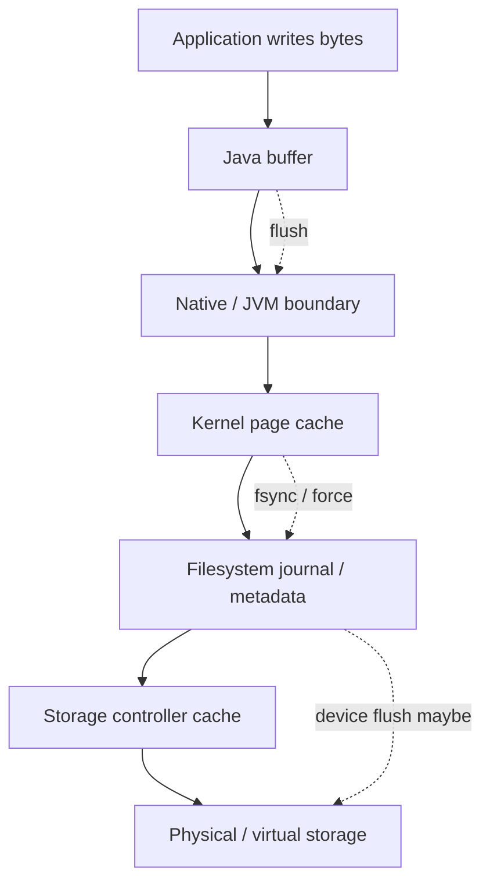
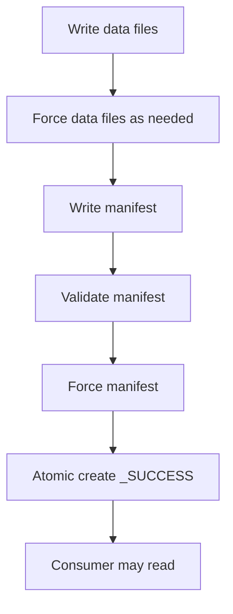
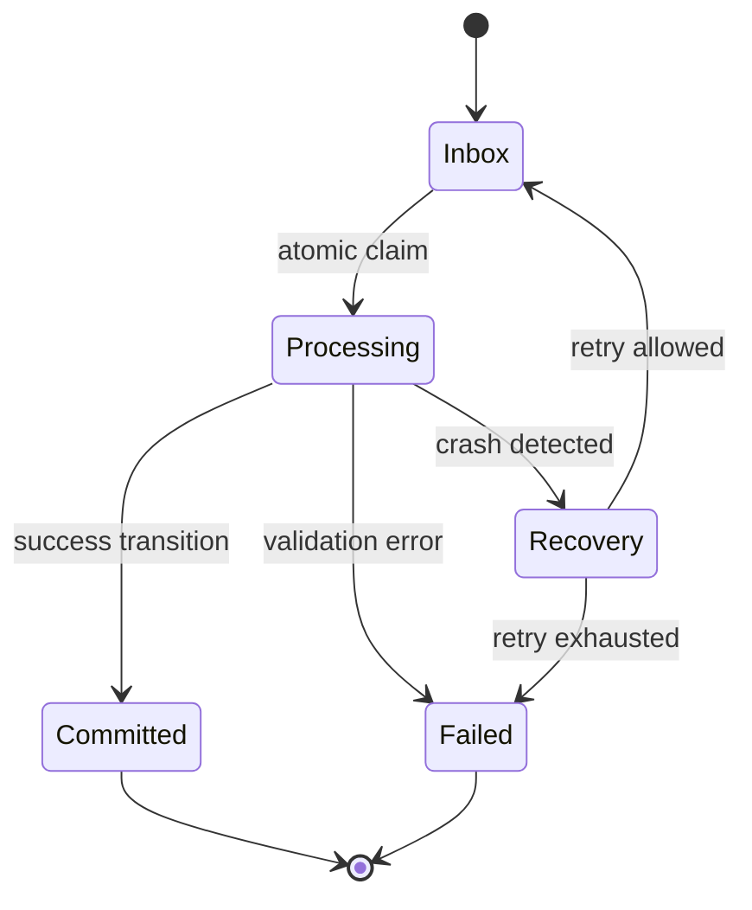
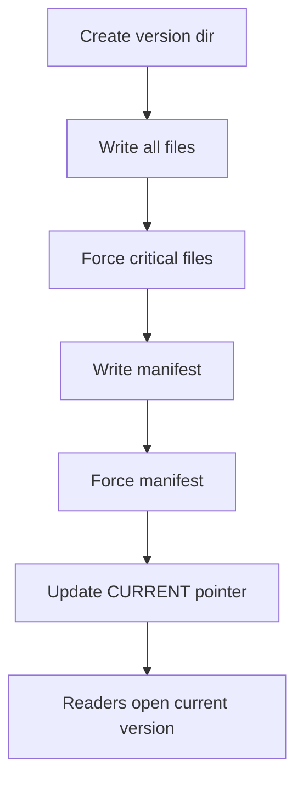

------
title: Learn Java IO, Modern IO, Streams, Buffers, Resources, Serialization & Data Boundaries - Part 012
description: Durability and crash consistency for Java file IO: flush, fsync, FileChannel.force, atomic rename discipline, temp files, parent directory persistence, write-ahead patterns, checkpoints, and recovery design.
series: learn-java-io-modern-io-resource-boundaries
seriesTitle: Learn Java IO, Modern IO, Streams, Buffers, Resources, Serialization & Data Boundaries
order: 12
partTitle: Durability & Crash Consistency
tags:
  - java
  - io
  - nio
  - filesystem
  - durability
  - crash-consistency
  - filechannel
  - fsync
  - atomicity
  - series
date: 2026-06-30
---

# Part 012 — Durability & Crash Consistency

> Target: setelah part ini, kita bisa membedakan **flush**, **close**, **atomic move**, dan **durability**. Kita akan mendesain file update yang tetap punya cerita recovery saat JVM mati, proses crash, OS crash, atau storage gagal di tengah operasi.

Part 011 membahas correct file operations: create, copy, move, delete, atomic publication, dan TOCTOU. Tetapi ada satu boundary yang lebih dalam:

> Setelah Java method sukses, apakah data benar-benar aman jika mesin crash sekarang?

Jawabannya: belum tentu.

Part ini membahas durability dan crash consistency. Ini bukan materi database, bukan juga observability umum. Ini adalah skill spesifik untuk IO engineer: memahami perbedaan antara Java buffer, OS page cache, filesystem metadata, rename atomicity, directory entry persistence, dan recovery state.

---

## 1. Kaufman Skill Deconstruction

Skill “durable file update” bisa dipecah menjadi beberapa sub-skill:

1. Membedakan visibility, atomicity, dan durability.
2. Memahami lapisan buffering dari Java sampai storage.
3. Mengetahui kapan `flush()` cukup dan kapan tidak.
4. Menggunakan `FileChannel.force(boolean)` secara benar.
5. Mendesain temp-write-rename discipline.
6. Memahami parent directory durability.
7. Mendesain recovery untuk orphan temp, partial record, dan stale state.
8. Mengukur trade-off latency vs durability.
9. Menentukan durability contract per data class.
10. Menghindari klaim durability yang tidak bisa dijamin portable.

Mental model utama:



**Invariant:** `write()` means bytes were accepted by some layer. It does not automatically mean bytes are durable on stable storage.

---

## 2. Vocabulary: Stop Mixing These Words

| Term | Meaning | Java/Filesystem Example |
|---|---|---|
| Write | Application hands bytes to API | `OutputStream.write` |
| Flush | Push buffered bytes from one layer to next | `BufferedWriter.flush` |
| Close | Release resource; often flushes first | try-with-resources close |
| Visibility | Other readers can observe file/name | file appears in directory |
| Atomicity | Operation appears indivisible | `Files.move(..., ATOMIC_MOVE)` |
| Durability | State survives crash/power loss | `FileChannel.force` + storage behavior |
| Consistency | On recovery, state satisfies invariants | old or new config, never half config |
| Ordering | A is durable before B | force temp before rename |

The most common production bug is using one property as if it implied another.

Wrong assumptions:

```text
close() succeeded => durable
flush() succeeded => durable
atomic move succeeded => durable
method returned => crash-safe
```

Better:

```text
close() releases Java resource and usually flushes Java-level buffers.
force() requests storage synchronization for file content/metadata.
atomic move controls visibility transition.
recovery logic handles states that still occur after crash.
```

---

## 3. Java Buffers vs OS Page Cache

Consider:

```java
try (BufferedWriter writer = Files.newBufferedWriter(path, StandardCharsets.UTF_8)) {
    writer.write("hello");
}
```

When try-with-resources closes the writer:

1. `BufferedWriter` flushes its internal char buffer.
2. `OutputStreamWriter` encodes chars into bytes.
3. underlying stream writes bytes to OS.
4. OS may store bytes in page cache.
5. storage may persist later.

That is usually enough for normal logs, exports, caches, and user downloads. It is not enough for files that represent committed state.

Examples requiring stronger thinking:

- local queue checkpoint;
- file-based lock/claim protocol;
- payment batch manifest;
- compliance audit record;
- index file for a data store;
- application configuration replacement;
- resumable upload state;
- exactly-once-ish ingestion marker;
- embedded database-like storage.

---

## 4. `flush()` Is Not `fsync()`

`flush()` is API-layer dependent.

```java
BufferedOutputStream out = new BufferedOutputStream(Files.newOutputStream(path));
out.write(payload);
out.flush();
```

This ensures bytes are pushed out of `BufferedOutputStream` into the wrapped stream. It does not necessarily force the OS to persist bytes to stable storage.

Similarly:

```java
PrintWriter writer = new PrintWriter(Files.newBufferedWriter(path));
writer.println("event");
writer.flush();
```

This only flushes writer layers. The OS may still delay actual storage.

**Rule:** use `flush` to manage application-level buffering; use file synchronization primitives when durability is part of the contract.

---

## 5. `FileChannel.force(boolean)`

`FileChannel.force(boolean metaData)` asks the channel to force updates to the file to the storage device.

```java
try (FileChannel channel = FileChannel.open(path, StandardOpenOption.WRITE)) {
    channel.write(buffer);
    channel.force(true);
}
```

The boolean matters:

| `force` argument | Intent |
|---|---|
| `force(false)` | force file content changes; metadata may be omitted if not required for content retrieval |
| `force(true)` | force content and metadata updates |

Use `true` when metadata changes matter, such as file length, timestamps, or newly created file visibility. Use `false` only when you know metadata durability is not required.

Important nuance:

- `force` can be expensive;
- `force` may not guarantee what broken or virtualized storage refuses to guarantee;
- semantics can depend on OS, filesystem, and device;
- `force` on a file does not necessarily make the parent directory entry durable after rename on every platform;
- portable Java support for directory fsync is limited.

So we design with best effort plus recovery, not magical certainty.

---

## 6. Atomic Move Is Not Enough

Suppose:

```java
Files.writeString(temp, newConfig, StandardCharsets.UTF_8);
Files.move(temp, config, StandardCopyOption.REPLACE_EXISTING, StandardCopyOption.ATOMIC_MOVE);
```

Visibility is good: readers should see old config or new config, not half-written config.

But crash consistency has more questions:

1. Were temp bytes forced before rename?
2. Was temp file metadata forced?
3. Was directory entry for rename persisted?
4. If crash occurs after rename returns, can old name reappear?
5. If crash occurs before rename, what recovery does with temp?
6. If target replacement occurs, is old file still recoverable?

The exact answer depends on filesystem and OS behavior. Therefore robust design combines:

- write temp;
- force temp;
- atomic rename;
- best-effort parent directory force where available;
- recovery scan for temp/orphan states;
- file-level validation such as magic/version/checksum.

---

## 7. Crash Windows in Safe Replace

Let's analyze the safe replace pattern.

```text
1. create temp
2. write bytes to temp
3. close writer
4. force temp file
5. atomic move temp -> target
6. force parent directory if possible
```

Crash states:

| Crash Point | Possible State | Recovery |
|---|---|---|
| before temp create | old target only | no action |
| after temp create | old target + empty temp | delete stale temp |
| during write | old target + partial temp | delete stale temp |
| after close before force | old target + temp maybe not durable | delete/validate temp |
| after force before move | old target + complete temp | either publish or delete based on protocol |
| during atomic move | old or new target | validate target |
| after move before dir force | new target visible; directory persistence may vary | validate on startup |
| after dir force | new target expected durable | normal |

This table is the engineering artifact we want. It converts hand-wavy “safe write” into explicit failure-state reasoning.

---

## 8. Implementation: Durable-ish Atomic Replace

Java cannot abstract every storage guarantee perfectly, but we can implement a strong practical pattern.

```java
import java.io.IOException;
import java.io.OutputStream;
import java.nio.channels.FileChannel;
import java.nio.file.*;
import java.util.Objects;

import static java.nio.file.StandardCopyOption.ATOMIC_MOVE;
import static java.nio.file.StandardCopyOption.REPLACE_EXISTING;
import static java.nio.file.StandardOpenOption.*;

public final class DurableFileWriter {

    public static void replace(Path target, byte[] payload) throws IOException {
        Objects.requireNonNull(target, "target");
        Objects.requireNonNull(payload, "payload");

        Path absoluteTarget = target.toAbsolutePath();
        Path directory = absoluteTarget.getParent();
        if (directory == null) {
            throw new IllegalArgumentException("Target has no parent directory: " + target);
        }

        Files.createDirectories(directory);

        Path temp = Files.createTempFile(directory, "." + absoluteTarget.getFileName(), ".tmp");
        boolean moved = false;

        try {
            try (OutputStream out = Files.newOutputStream(temp, WRITE, TRUNCATE_EXISTING)) {
                out.write(payload);
                out.flush();
            }

            forceFile(temp, true);

            Files.move(temp, absoluteTarget, REPLACE_EXISTING, ATOMIC_MOVE);
            moved = true;

            forceDirectoryBestEffort(directory);
        } finally {
            if (!moved) {
                Files.deleteIfExists(temp);
            }
        }
    }

    private static void forceFile(Path path, boolean metadata) throws IOException {
        try (FileChannel channel = FileChannel.open(path, READ)) {
            channel.force(metadata);
        }
    }

    private static void forceDirectoryBestEffort(Path directory) throws IOException {
        try (FileChannel channel = FileChannel.open(directory, READ)) {
            channel.force(true);
        } catch (AccessDeniedException | FileSystemException unsupported) {
            // Directory fsync is not portable across all providers/platforms.
            // In a strict durability system, choose whether to fail here instead.
        }
    }

    private DurableFileWriter() {}
}
```

Notes:

- `forceFile(temp, true)` is done before move because we want temp content/metadata stable first.
- temp is in same directory because atomic move usually requires same filesystem/provider.
- parent directory force is best-effort because Java/platform behavior varies.
- strict systems may not swallow directory force failure.
- this still does not protect against every storage lie, controller cache issue, or hardware failure.

---

## 9. Parent Directory Durability

File content and directory entries are different things.

When you rename:

```text
.temp-123 -> config.json
```

The directory entry changes. For crash consistency, many systems also fsync the parent directory after rename. Java's `FileChannel` is primarily a file channel API, and opening a directory as a channel is not portable across all platforms/providers.

Practical policy options:

| Policy | Behavior |
|---|---|
| Best-effort | Try forcing directory; ignore unsupported; rely on recovery validation |
| Strict local filesystem | Require directory force to succeed; fail otherwise |
| Application-level journal | Record intent and completion separately |
| Database/object-store | Avoid using raw filesystem as commit log |

The right answer depends on data criticality. For generated report cache, best-effort is enough. For payment batch commit marker, you need a stricter protocol.

---

## 10. `SYNC` and `DSYNC` Open Options

`StandardOpenOption.SYNC` and `DSYNC` request synchronous update behavior for writes through the opened channel/stream.

Example:

```java
try (SeekableByteChannel channel = Files.newByteChannel(
        path,
        StandardOpenOption.CREATE,
        StandardOpenOption.WRITE,
        StandardOpenOption.DSYNC)) {
    channel.write(buffer);
}
```

Trade-offs:

- simpler per-write durability intent;
- potentially much slower;
- may still depend on provider/device behavior;
- can destroy throughput if used for every small record;
- may be better replaced by batching + explicit force.

Do not casually add `SYNC` to “make it safe”. First decide your durability boundary:

```text
force every record?
force every batch?
force every checkpoint?
force before publishing manifest?
```

---

## 11. Batching Durability

For high-volume systems, forcing every write is expensive.

Naive durable append:

```text
write record
force
write record
force
write record
force
```

Batching:

```text
write 100 records
force
write 100 records
force
```

The contract changes:

- per-record force: lower data loss window, higher latency;
- batch force: possible loss of last batch, better throughput;
- timed force: possible loss of last N milliseconds;
- checkpoint force: recovery replays from last durable checkpoint.

A top engineer makes this explicit:

```text
This local queue may lose at most the last 1 second of accepted telemetry on host crash.
```

or:

```text
This payment manifest is not acknowledged upstream until manifest and parent directory have been forced.
```

---

## 12. Append-Only Files and Record Crash Consistency

Append-only files are common:

- local event spool;
- audit trail;
- WAL-like journal;
- batch status log;
- ingestion offset log.

But appending text lines is not enough if crash consistency matters.

Problem:

```text
record-1\n
record-2\n
record-3-partial
```

Recovery must know whether `record-3-partial` is valid.

Better record format:

```text
[length][payload][checksum]
[length][payload][checksum]
```

Recovery:

1. read length;
2. if length incomplete, truncate to previous good offset;
3. read payload;
4. verify checksum;
5. if checksum fails, truncate to previous good offset;
6. continue.

Java sketch:

```java
record LogRecord(byte[] payload, int crc32) {}
```

Write:

```java
static void appendRecord(FileChannel channel, byte[] payload) throws IOException {
    CRC32 crc = new CRC32();
    crc.update(payload);

    ByteBuffer header = ByteBuffer.allocate(Integer.BYTES);
    header.putInt(payload.length).flip();

    ByteBuffer body = ByteBuffer.wrap(payload);

    ByteBuffer trailer = ByteBuffer.allocate(Integer.BYTES);
    trailer.putInt((int) crc.getValue()).flip();

    while (header.hasRemaining()) channel.write(header);
    while (body.hasRemaining()) channel.write(body);
    while (trailer.hasRemaining()) channel.write(trailer);
}
```

Then batch:

```java
appendRecord(channel, payload);
channel.force(false);
```

This still does not guarantee higher-level exactly-once semantics. It only gives recoverable file structure.

---

## 13. Write-Ahead Pattern

Write-ahead logging is a general crash consistency idea:

> record intent durably before applying the state transition.

For file workflows:

```text
1. write journal: INTEND_REPLACE config.json temp-123
2. force journal
3. write temp
4. force temp
5. atomic move temp -> config.json
6. force directory best-effort/strict
7. write journal: COMPLETE_REPLACE config.json
8. force journal
```

Recovery:

- if intent exists but no complete, inspect temp/target;
- if target valid, mark complete;
- if temp valid and target old, decide publish/delete;
- if temp invalid, delete and fail operation.

This may be overkill for simple config files. It is appropriate when the filesystem itself becomes a mini state machine.

---

## 14. Manifest Commit Pattern

For data directories, publishing one file is not enough. Example:

```text
batch-2026-06-30/
  part-0001.dat
  part-0002.dat
  part-0003.dat
  manifest.json
```

If consumers scan directory, they may see incomplete batches.

Better:

```text
batch-2026-06-30.tmp/
  part-0001.dat
  part-0002.dat
  part-0003.dat
  manifest.json

atomic move:
batch-2026-06-30.tmp -> batch-2026-06-30
```

But directory atomic move semantics vary by platform/provider, especially if target exists or directory is non-empty.

Another pattern:

```text
batch-2026-06-30/
  part-0001.dat
  part-0002.dat
  part-0003.dat
  _SUCCESS
```

Consumer only reads batch if `_SUCCESS` exists. `_SUCCESS` is written and forced last.



This is common in data pipelines because it makes completeness explicit.

---

## 15. Checkpoint Files

Checkpoint files store progress:

```json
{"partition": 12, "offset": 884291}
```

Bad update:

```java
Files.writeString(checkpoint, json, StandardCharsets.UTF_8);
```

Crash can corrupt checkpoint. Better:

```java
DurableFileWriter.replace(checkpoint, json.getBytes(StandardCharsets.UTF_8));
```

Even better: include validation fields.

```json
{
  "version": 1,
  "partition": 12,
  "offset": 884291,
  "previousOffset": 884000,
  "updatedAt": "2026-06-30T10:15:30Z",
  "checksum": "..."
}
```

Recovery:

- parse JSON strictly;
- verify version;
- verify checksum if present;
- if invalid, fall back to previous checkpoint or rebuild from committed state;
- never silently reset to zero unless contract allows replay from start.

---

## 16. Two-File Checkpoint Pattern

For more safety, keep two checkpoint generations:

```text
checkpoint.A
checkpoint.B
checkpoint.current
```

or:

```text
checkpoint-000123.json
checkpoint-000124.json
CURRENT
```

Update:

1. write new generation file;
2. force generation file;
3. update `CURRENT` by atomic replace;
4. force parent directory best-effort/strict;
5. cleanup old generations later.

Recovery:

- read `CURRENT`;
- if invalid, scan generations;
- choose highest valid generation;
- repair `CURRENT`.

This is similar in spirit to manifest and commit-pointer patterns.

---

## 17. The Commit Pointer Pattern

Instead of replacing a large file, write immutable versions and atomically update a small pointer.

```text
config-000001.json
config-000002.json
CURRENT
```

`CURRENT` contains:

```text
config-000002.json
```

Benefits:

- old versions remain available;
- rollback is simpler;
- large file rewrite is not required;
- pointer update is small;
- recovery can scan valid versions.

Costs:

- cleanup policy needed;
- readers must resolve pointer;
- pointer and target validation required;
- directory durability still matters.

Java sketch:

```java
static void publishVersion(Path dir, String name, byte[] payload) throws IOException {
    Files.createDirectories(dir);

    Path version = dir.resolve(name);
    Path pointer = dir.resolve("CURRENT");

    // Create immutable version; fail if collision.
    try (FileChannel ch = FileChannel.open(version,
            StandardOpenOption.CREATE_NEW,
            StandardOpenOption.WRITE)) {
        ch.write(ByteBuffer.wrap(payload));
        ch.force(true);
    }

    DurableFileWriter.replace(pointer, name.getBytes(StandardCharsets.UTF_8));
}
```

---

## 18. Temporary Files and Recovery

Temp files are not garbage by definition. They are evidence of incomplete operations.

Naming convention:

```text
.report.csv.9f3a.tmp
.upload.12345.tmp
checkpoint.000124.tmp
```

Recovery policy:

| Temp Type | Meaning | Recovery |
|---|---|---|
| upload temp | incomplete stream receive | delete if older than threshold |
| output temp | unpublished generated result | validate and publish or delete |
| checkpoint temp | incomplete checkpoint update | delete if current checkpoint valid |
| journal temp | possible in-flight operation | inspect journal first |

Do not blindly delete every `*.tmp` on startup unless the protocol says it is safe.

---

## 19. Crash Consistency for Directory-Based State Machines

From Part 011, ingestion workflow:

```text
inbox -> processing -> committed / failed
```

Crash windows:

| State | Meaning | Recovery |
|---|---|---|
| file in inbox | not claimed | process normally |
| file in processing | worker crashed or still working | use lease/mtime/claim metadata |
| output temp exists | output incomplete or unpublished | validate/delete |
| file in committed | done | skip |
| file in failed | rejected | skip or manual review |

For recovery, every directory must have a clear meaning. Avoid ambiguous directories like `tmp2`, `old`, `backup`, `new`, `done-maybe`.

State machine:



---

## 20. Force Discipline by Data Criticality

Not every file deserves `force`. Durability is expensive, so classify data.

| Data Class | Example | Suggested Discipline |
|---|---|---|
| Disposable cache | thumbnails, generated reports | close enough; rebuild on loss |
| User-visible export | downloaded CSV | temp + atomic move; no strict fsync usually |
| Config update | app settings | temp + force + atomic move |
| Local checkpoint | consumer offset | temp + force + atomic move; validate on startup |
| Audit/security event | compliance trail | append framing + batch force + external sink |
| Financial commit marker | payment batch manifest | strict force, parent dir policy, journal/recovery |
| Embedded storage | custom index/data files | WAL/checksum/truncation/recovery protocol |

A mature engineering doc says exactly which class applies.

---

## 21. Latency Cost of Durability

`force` may be orders of magnitude slower than buffered writes because it waits for storage synchronization behavior.

Design options:

```text
maximum safety       -> force every critical transition
balanced             -> force at commit boundaries
throughput optimized -> batch force periodically
best effort          -> rely on close/page cache
```

Do not make this a hidden performance accident. Make it a product/engineering contract:

```text
Accepted upload is acknowledged only after the manifest is atomically published.
```

or:

```text
Telemetry spool may lose buffered records from the last flush interval after host crash.
```

---

## 22. Testing Crash Consistency

Unit tests cannot fully simulate OS crash, but they can test protocol invariants.

### 22.1 Fault Injection Points

Inject failures after each step:

```text
create temp
write first half
write full payload
close
force
move
directory force
cleanup
```

Test expectations:

- old target remains valid if publish not complete;
- temp files are cleaned or recoverable;
- no final partial file exists;
- recovery can handle every injected state;
- unsupported atomic move fails if contract requires atomicity.

### 22.2 Interface for Failure Injection

```java
interface StepProbe {
    void after(String step) throws IOException;
}
```

```java
final class ProbedWriter {
    private final StepProbe probe;

    ProbedWriter(StepProbe probe) {
        this.probe = probe;
    }

    void replace(Path target, byte[] payload) throws IOException {
        Path dir = target.toAbsolutePath().getParent();
        Files.createDirectories(dir);
        probe.after("directories");

        Path temp = Files.createTempFile(dir, "." + target.getFileName(), ".tmp");
        probe.after("temp-created");

        boolean moved = false;
        try {
            Files.write(temp, payload, StandardOpenOption.WRITE);
            probe.after("temp-written");

            try (FileChannel ch = FileChannel.open(temp, StandardOpenOption.READ)) {
                ch.force(true);
            }
            probe.after("temp-forced");

            Files.move(temp, target, StandardCopyOption.REPLACE_EXISTING, StandardCopyOption.ATOMIC_MOVE);
            moved = true;
            probe.after("moved");
        } finally {
            if (!moved) {
                Files.deleteIfExists(temp);
            }
        }
    }
}
```

Then test each failure point.

---

## 23. Checksums and Self-Describing Files

Crash consistency improves when files are self-validating.

For binary files:

```text
magic bytes
version
header length
payload length
payload
checksum
```

For text/JSON files:

```json
{
  "magic": "APP_CHECKPOINT",
  "version": 1,
  "payload": {
    "offset": 884291
  },
  "checksum": "sha256:..."
}
```

Validation on read:

1. magic matches;
2. version supported;
3. required fields present;
4. length/checksum valid;
5. semantic invariants valid.

This prevents partial files from being mistaken as valid state.

---

## 24. Recovery-First Design

Instead of asking “how do I prevent every crash state?”, ask:

> If the process restarts after any line, can it determine what to do?

Recovery-first design means every persistent state is one of:

- valid committed state;
- valid previous state;
- incomplete temp state;
- recoverable in-flight state;
- invalid state requiring operator intervention.

Bad state:

```text
file exists but we do not know if it is complete
```

Good state:

```text
file exists with valid checksum and manifest commit marker
```

or:

```text
temp file exists and no commit marker exists, so it is safe to delete after lease expiry
```

---

## 25. Multi-File Update Problem

Atomic rename can publish one name. Multi-file updates are harder.

Example:

```text
index.dat
metadata.json
CURRENT
```

Need to update all consistently.

Bad:

```text
write index.dat
write metadata.json
```

Crash can produce new index with old metadata.

Better versioned directory:

```text
versions/
  000001/
    index.dat
    metadata.json
  000002/
    index.dat
    metadata.json
CURRENT
```

Publish by updating `CURRENT` after version directory is complete.



This is a common pattern for search indexes, model artifacts, static site builds, and local metadata stores.

---

## 26. Avoiding False Durability in Cloud-Native Environments

In containers and cloud environments, filesystem assumptions can be weaker:

- container writable layer may be ephemeral;
- network volumes have different semantics;
- object stores are not POSIX filesystems;
- Kubernetes pod restart may lose local state;
- virtualized storage may acknowledge writes differently;
- multiple replicas writing same path is a design smell.

If data must survive node loss, local `FileChannel.force` is not enough. You need a durable external system or replicated storage with documented semantics.

Use local crash-consistent files for:

- local cache;
- local spool with replay upstream;
- temporary staging;
- single-node tools;
- embedded components with clear backup/replication story.

Avoid raw local files as source of truth for distributed state unless you own the full failure model.

---

## 27. Practical Patterns

### 27.1 Config File Replace

Requirement:

- readers must see old or new config;
- no partial config;
- recovery can fall back to previous valid config.

Pattern:

```text
write config.tmp
force config.tmp
atomic move config.tmp -> config.json
best-effort force parent dir
on startup validate config.json
```

### 27.2 Local Queue Segment

Requirement:

- records recoverable after crash;
- may replay committed records;
- corrupt tail truncated.

Pattern:

```text
append length + payload + checksum
force every N records or M milliseconds
on startup scan until invalid tail
truncate invalid tail
resume
```

### 27.3 Batch Output Directory

Requirement:

- consumers never read incomplete batch.

Pattern:

```text
write to batch.tmp/
write manifest
force critical files
create _SUCCESS last
consumer requires _SUCCESS
```

### 27.4 Immutable Artifact + Pointer

Requirement:

- rollback and recovery.

Pattern:

```text
write artifact-v123
force artifact-v123
replace CURRENT with artifact-v123
cleanup old versions later
```

---

## 28. Common Anti-Patterns

### 28.1 “Close Means Durable”

```java
try (Writer writer = Files.newBufferedWriter(path)) {
    writer.write(data);
}
```

Good enough for many files, but not a durability guarantee.

### 28.2 “Atomic Move Means Crash-Safe”

```java
Files.move(temp, target, ATOMIC_MOVE);
```

Good visibility primitive. Not full durability story.

### 28.3 “Force Everything”

```java
channel.force(true); // after every tiny write
```

May destroy performance. Use clear commit boundaries.

### 28.4 “Ignore Directory Sync Always”

Sometimes fine. Sometimes not. Make policy explicit.

### 28.5 “No Recovery Needed Because We Use Temp Files”

Temp files are not recovery. They are recovery inputs.

### 28.6 “Use Filesystem as Database Without WAL”

If you need multi-record atomicity, transactions, isolation, indexes, and recovery, use a database or implement database-like protocols consciously.

---

## 29. Review Checklist

### Durability Contract

- What data class is this file?
- What can be lost after process crash?
- What can be lost after OS crash?
- When do we acknowledge upstream success?
- Is durability required per record, batch, or commit?

### Write Protocol

- Is output written to temp first?
- Is temp in same directory?
- Is Java buffer flushed/closed before force?
- Is file content forced before publish?
- Is metadata forced if required?
- Is atomic move required?
- Is parent directory force policy explicit?

### Recovery

- What happens to orphan temp files?
- How are partial records detected?
- Is checksum/magic/version present?
- Can startup distinguish committed from in-flight state?
- Is cleanup safe and scoped?

### Environment

- Is filesystem local, network, container overlay, or object-store mounted?
- Are semantics documented?
- Is there more than one writer?
- Is local state acceptable source of truth?

---

## 30. Practice: Crash-State Table for Your Own File Workflow

Pick one workflow from your system:

- upload staging;
- report generation;
- checkpoint update;
- local queue;
- config replacement;
- file ingestion;
- batch export.

Create a table:

| Step | Operation | Crash State | Recovery Action | Data Loss Allowed? |
|---|---|---|---|---|
| 1 | create temp | empty temp | delete | yes |
| 2 | write body | partial temp | delete | yes |
| 3 | force temp | complete temp | publish/delete based on marker | no maybe |
| 4 | move | old or new final | validate final | no |
| 5 | cleanup | final + temp maybe | delete temp | yes |

This one artifact will reveal most hidden assumptions.

---

## 31. Top 1% Engineer Mental Model

A top engineer does not say:

> We use atomic move, so it is safe.

They say:

> Atomic move gives us visibility atomicity. We force the temp file before move because the new content must not disappear after crash. Directory force is best-effort on this platform, so startup validation scans for missing/invalid final state. The operation is acknowledged only after move succeeds. Orphan temp files older than the lease are deleted.

That is the difference between using an API and owning the failure model.

---

## 32. Summary

In this part, we learned:

- `flush`, `close`, `force`, atomic move, and durability are different;
- Java buffers and OS page cache are different layers;
- `FileChannel.force(boolean)` is the Java primitive for requesting file synchronization;
- atomic move gives publication atomicity, not a complete crash-consistency proof;
- robust replace uses temp write, close/flush, force, atomic move, and recovery;
- parent directory persistence is a real concern but not perfectly portable in Java;
- append-only files need record framing and tail recovery;
- multi-file updates need manifest, versioned directories, or commit pointers;
- durability should be classified by data criticality;
- every file workflow should have a crash-state table.

Part 013 moves from filesystem operations into the core of modern NIO data movement: **NIO Buffer Anatomy — position, limit, capacity, mark, flip, clear, compact, slicing, duplication, and the bugs they create.**

---

## References

- Oracle Java SE 25 API, `java.nio.channels.FileChannel`
- Oracle Java SE 25 API, `java.nio.file.Files`
- Oracle Java SE 25 API, `java.nio.file.StandardOpenOption`
- Oracle Java SE 25 API, `java.nio.file.StandardCopyOption`
- Oracle Java Tutorials, File I/O and atomic file operations
