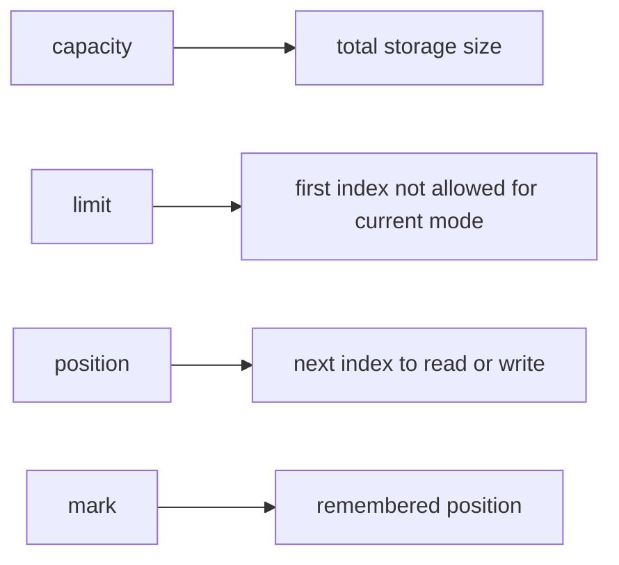
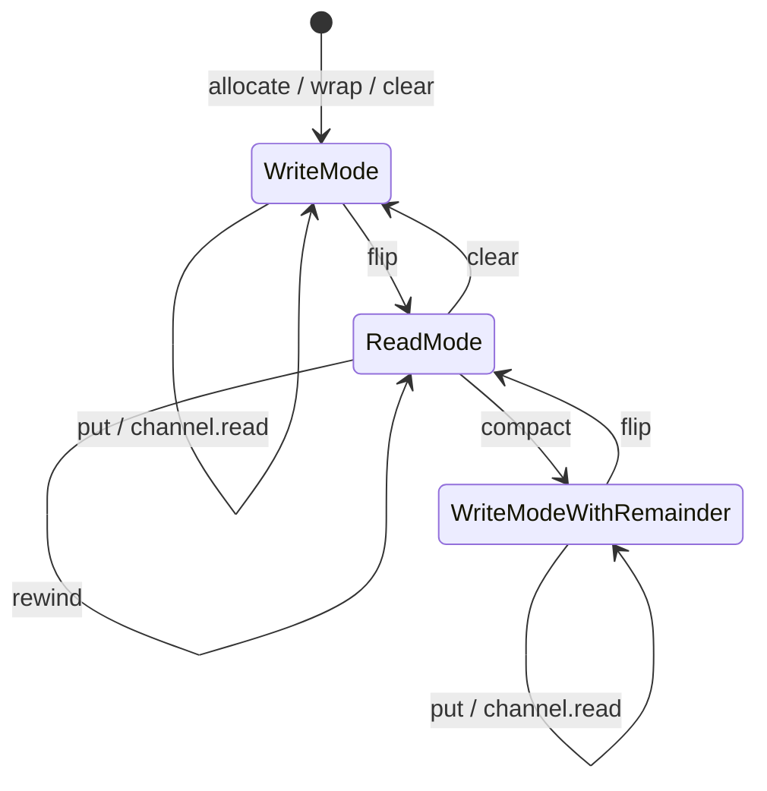
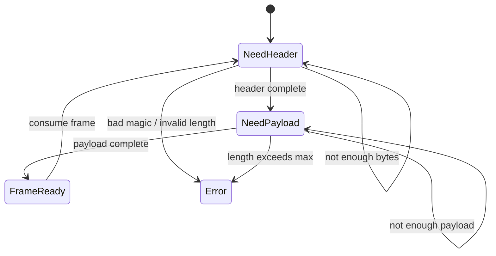
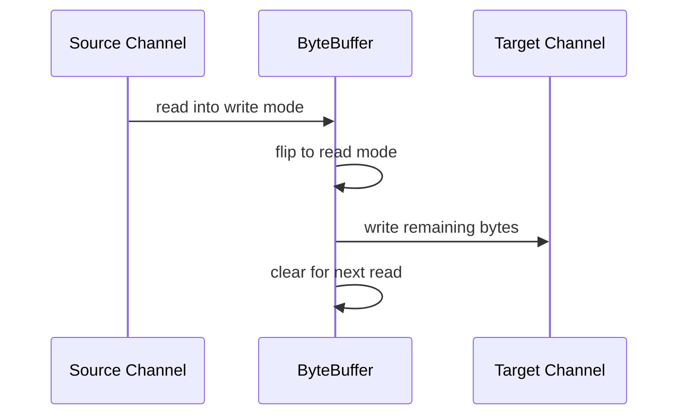
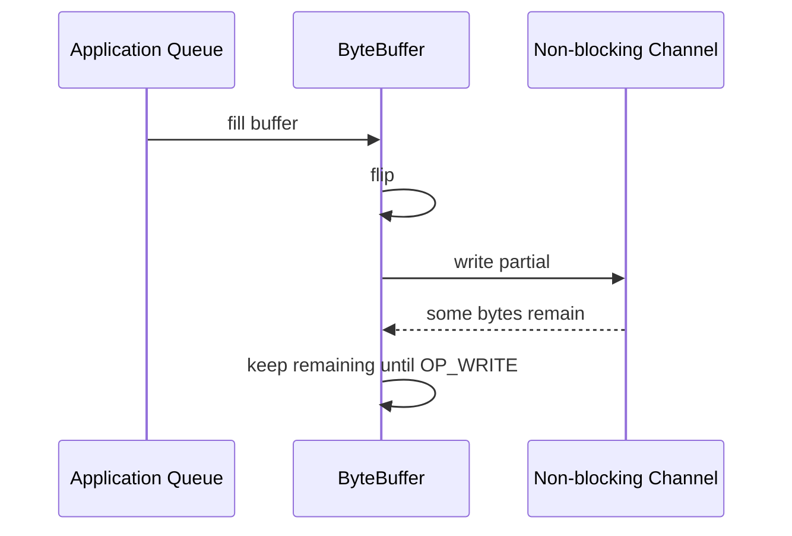

------
title: Learn Java IO, Modern IO, Streams, Buffers, Resources, Serialization & Data Boundaries - Part 013
description: NIO ByteBuffer anatomy for production Java IO: position, limit, capacity, mark, flip, clear, compact, slice, duplicate, read-only views, byte order, channel loops, and buffer state-machine correctness.
series: learn-java-io-modern-io-resource-boundaries
seriesTitle: Learn Java IO, Modern IO, Streams, Buffers, Resources, Serialization & Data Boundaries
order: 13
partTitle: NIO Buffer Anatomy: position, limit, capacity, mark
tags:
  - java
  - io
  - nio
  - bytebuffer
  - buffers
  - channels
  - binary-io
  - performance
  - series
date: 2026-06-30
---

# Part 013 — NIO Buffer Anatomy: `position`, `limit`, `capacity`, `mark`

> Target: setelah part ini, kita tidak lagi memakai `ByteBuffer` dengan trial-error. Kita akan memahami `ByteBuffer` sebagai **state machine** yang mengatur area tulis, area baca, dan area kosong secara eksplisit.

Part 012 menutup fase filesystem correctness: atomicity, durability, dan crash consistency. Mulai part ini kita masuk ke pusat `java.nio`: **buffer dan channel**.

Di classic `java.io`, data terlihat seperti stream satu arah:

```java
int n = input.read(byteArray);
output.write(byteArray, 0, n);
```

Di NIO, data sering bergerak melalui object stateful:

```java
ByteBuffer buffer = ByteBuffer.allocate(8192);
int n = channel.read(buffer);
buffer.flip();
while (buffer.hasRemaining()) {
    sink.write(buffer);
}
buffer.clear();
```

Kode ini tampak sederhana, tetapi setiap baris mengubah invariant internal. Engineer yang tidak memahami invariant ini akan membuat bug yang sulit dideteksi: data hilang, data duplikat, infinite loop, parser salah offset, atau memory pressure tidak terlihat.

---

## 1. Kaufman Skill Deconstruction

Skill utama di part ini adalah **mengendalikan buffer state**.

Sub-skill yang harus dikuasai:

1. Memahami `capacity`, `limit`, `position`, dan `mark`.
2. Membedakan mode menulis ke buffer dan mode membaca dari buffer.
3. Menggunakan `flip()`, `clear()`, `rewind()`, dan `compact()` dengan benar.
4. Membedakan relative operation dan absolute operation.
5. Memahami `remaining()`, `hasRemaining()`, dan return value channel.
6. Memahami `slice()`, `duplicate()`, dan `asReadOnlyBuffer()`.
7. Memahami byte order dan view buffer untuk binary protocol.
8. Menulis channel loop yang benar untuk partial read/write.
9. Menghindari buffer aliasing bug.
10. Mendesain API yang tidak membocorkan mutable buffer state sembarangan.

Kaufman-style practice goal:

> Dalam 20 jam latihan, kita harus bisa membaca, menulis, mem-parse, dan mentransfer data menggunakan `ByteBuffer` tanpa menebak-nebak posisi pointer.

---

## 2. The Core Mental Model

`ByteBuffer` bukan hanya `byte[]` yang lebih modern. Ia adalah **window over bytes** dengan cursor dan boundary.



Invariant dasar semua `Buffer`:

```text
0 <= mark <= position <= limit <= capacity
```

`mark` bisa undefined, tetapi jika defined, ia tidak boleh berada setelah `position`.

Dalam praktik, kita paling sering memikirkan tiga area:

```text
0                          position              limit              capacity
|--------------------------|---------------------|------------------|
 already processed/written   remaining area        unavailable area
```

Makna area itu bergantung pada mode.

---

## 3. Write Mode vs Read Mode

Ketika buffer baru dibuat:

```java
ByteBuffer buffer = ByteBuffer.allocate(8);
```

State awal:

```text
position = 0
limit    = 8
capacity = 8
```

Ini adalah **write mode**: kita boleh menulis dari `position` sampai sebelum `limit`.

```java
buffer.put((byte) 10);
buffer.put((byte) 20);
buffer.put((byte) 30);
```

State:

```text
position = 3
limit    = 8
capacity = 8
```

Diagram:

```text
0       1       2       3                       8
|  10   |  20   |  30   |   free write space     |
                        ^ position              ^ limit/capacity
```

Untuk membaca bytes yang baru ditulis, kita harus memanggil:

```java
buffer.flip();
```

Setelah `flip()`:

```text
position = 0
limit    = 3
capacity = 8
```

Diagram read mode:

```text
0       1       2       3                       8
|  10   |  20   |  30   |   irrelevant old/free   |
^ position              ^ limit                 ^ capacity
```

**Invariant:**

> `flip()` mengubah area yang sudah ditulis menjadi area yang siap dibaca.

---

## 4. State Transition Diagram



Empat operasi kunci:

| Method | Tujuan | State Setelahnya | Data Dihapus? |
|---|---|---|---|
| `flip()` | Write mode → read mode | `limit = position`, `position = 0` | Tidak |
| `clear()` | Siap tulis dari awal | `position = 0`, `limit = capacity` | Tidak secara fisik |
| `compact()` | Simpan unread bytes, lanjut tulis | unread bytes dipindah ke awal, `position` setelah unread | Tidak, tetapi layout berubah |
| `rewind()` | Baca ulang dari awal sampai limit | `position = 0`, limit tetap | Tidak |

Common misconception:

> `clear()` tidak mengisi buffer dengan zero. Ia hanya mengubah metadata sehingga storage lama boleh ditimpa.

---

## 5. `flip()` Is Not Optional

Bug paling klasik:

```java
ByteBuffer buffer = ByteBuffer.allocate(1024);
channel.read(buffer);

// BUG: position ada di akhir data, limit masih capacity.
sink.write(buffer);
```

Masalahnya: setelah `read(buffer)`, channel menulis bytes ke buffer dan menaikkan `position`. Untuk menulis isi buffer ke sink, sink akan membaca dari `position` sampai `limit`. Tanpa `flip()`, sink membaca area kosong setelah data.

Correct:

```java
ByteBuffer buffer = ByteBuffer.allocate(1024);
int n = channel.read(buffer);

if (n > 0) {
    buffer.flip();
    while (buffer.hasRemaining()) {
        sink.write(buffer);
    }
    buffer.clear();
}
```

**Rule:**

> Setelah producer menulis ke buffer, consumer harus melihat buffer setelah `flip()`.

---

## 6. `clear()` vs `compact()`

### 6.1 Use `clear()` When All Bytes Were Consumed

```java
buffer.flip();
while (buffer.hasRemaining()) {
    sink.write(buffer);
}
buffer.clear();
```

Jika `sink.write(buffer)` berhasil menghabiskan semua bytes, `clear()` aman.

### 6.2 Use `compact()` When Some Bytes Remain

Dalam non-blocking IO, `write()` tidak wajib menghabiskan semua bytes. Ia bisa menulis sebagian saja.

```java
buffer.flip();
sink.write(buffer);

if (buffer.hasRemaining()) {
    buffer.compact(); // keep unwritten bytes
} else {
    buffer.clear();
}
```

Setelah `compact()`, unread/unwritten bytes dipindahkan ke awal buffer, lalu `position` berada setelah bytes tersebut. Buffer kembali ke write mode sehingga kita bisa menambahkan data baru setelah remainder.

```text
Before compact in read mode:

0           position          limit          capacity
| consumed  | unread/unwritten | unavailable |

After compact:

0                position                    limit/capacity
| unread bytes   | free write space           |
```

**Production invariant:**

> Jangan pernah `clear()` buffer yang masih memiliki `hasRemaining()` true, kecuali memang ingin membuang data.

---

## 7. Relative vs Absolute Operations

`ByteBuffer` punya dua gaya akses.

### 7.1 Relative Access

Relative access memakai dan mengubah `position`.

```java
byte a = buffer.get();     // reads at position, then position++
buffer.put((byte) 42);     // writes at position, then position++
int x = buffer.getInt();   // reads 4 bytes, then position += 4
```

Relative access cocok untuk parser linear.

### 7.2 Absolute Access

Absolute access memakai index eksplisit dan tidak mengubah `position`.

```java
byte first = buffer.get(0);
int length = buffer.getInt(4);
buffer.put(7, (byte) 99);
```

Absolute access cocok untuk:

1. Membaca header tanpa mengganggu parsing cursor.
2. Backpatch length/checksum setelah payload ditulis.
3. Inspect data untuk debugging.
4. Menulis fixed-layout binary structure.

Contoh backpatch length:

```java
ByteBuffer frame = ByteBuffer.allocate(1024);

int lengthOffset = frame.position();
frame.putInt(0); // placeholder

int payloadStart = frame.position();
writePayload(frame);
int payloadEnd = frame.position();

int payloadLength = payloadEnd - payloadStart;
frame.putInt(lengthOffset, payloadLength); // absolute write, position unchanged

frame.flip();
```

**Rule:**

> Gunakan relative access untuk sequential protocol flow; gunakan absolute access untuk metadata fixed offset.

---

## 8. `remaining()` Is a Contract, Not Decoration

```java
int remaining = buffer.remaining();
boolean has = buffer.hasRemaining();
```

`remaining()` berarti:

```text
limit - position
```

Dalam read mode, itu berarti bytes yang masih bisa dibaca.

Dalam write mode, itu berarti space yang masih bisa ditulis.

Contoh bounded read:

```java
int toRead = Math.min(buffer.remaining(), maxAllowedBytes);
```

Contoh guarded parse:

```java
static int readLength(ByteBuffer buffer) {
    if (buffer.remaining() < Integer.BYTES) {
        throw new IllegalArgumentException("not enough bytes for length field");
    }
    return buffer.getInt();
}
```

Protocol parser yang baik tidak “berharap” bytes cukup. Ia memeriksa `remaining()` sebelum membaca field fixed-size.

---

## 9. Underflow and Overflow Are Boundary Signals

Jika membaca lebih dari `limit`:

```java
BufferUnderflowException
```

Jika menulis melebihi `limit`:

```java
BufferOverflowException
```

Dalam production parser, exception ini sering berarti salah satu dari:

1. Frame corrupt.
2. Length field tidak valid.
3. Parser salah state.
4. Buffer belum menerima semua bytes.
5. Ada mismatch endianness atau format version.

Jangan memakai exception ini sebagai normal control flow untuk network/file parser. Lebih baik periksa `remaining()`.

```java
static boolean hasCompleteHeader(ByteBuffer input) {
    return input.remaining() >= 8; // magic + length
}
```

---

## 10. Channel Read Loop: Correctness Before Performance

`ReadableByteChannel.read(ByteBuffer)` menulis bytes ke buffer mulai dari current `position`. Return value penting:

| Return | Meaning |
|---:|---|
| `> 0` | bytes dibaca |
| `0` | tidak ada bytes sekarang, terutama non-blocking channel |
| `-1` | EOF |

Blocking file channel biasanya mengembalikan bytes sampai EOF, tetapi kita tetap tidak boleh menulis kode yang mengabaikan return value.

Contoh copy loop:

```java
static long copy(ReadableByteChannel source, WritableByteChannel sink) throws IOException {
    ByteBuffer buffer = ByteBuffer.allocate(64 * 1024);
    long total = 0;

    while (true) {
        int read = source.read(buffer);
        if (read == -1) {
            break;
        }
        if (read == 0) {
            continue;
        }

        total += read;
        buffer.flip();
        while (buffer.hasRemaining()) {
            sink.write(buffer);
        }
        buffer.clear();
    }

    return total;
}
```

Untuk non-blocking channel, loop di atas bisa menjadi busy-spin jika `read == 0`. Non-blocking IO butuh selector/readiness model. Itu dibahas di Part 019.

---

## 11. Channel Write Loop: Partial Write Is Normal

`WritableByteChannel.write(ByteBuffer)` membaca bytes dari buffer mulai dari current `position`. Return value bisa lebih kecil dari `remaining()`.

Bug:

```java
channel.write(buffer); // BUG: assumes all bytes written
```

Correct:

```java
while (buffer.hasRemaining()) {
    channel.write(buffer);
}
```

Untuk blocking channel, loop ini biasanya selesai. Untuk non-blocking channel, `write()` bisa return `0`; dalam kasus itu kita harus menunggu readiness, bukan spin. Lagi-lagi ini bagian selector.

**Invariant:**

> `write(buffer)` is not equivalent to `writeAll(buffer)`.

---

## 12. `slice()`: Window Without Copy

`slice()` membuat buffer baru yang berbagi content dengan buffer asal, tetapi position/limit/capacity sendiri.

```java
ByteBuffer packet = ByteBuffer.allocate(1024);
// assume packet is in read mode

packet.position(8);
packet.limit(24);

ByteBuffer payloadHeader = packet.slice();
```

`payloadHeader` memiliki:

```text
position = 0
limit    = 16
capacity = 16
```

Tetapi content-nya mengarah ke byte 8..23 milik `packet`.

Use cases:

1. Membuat view payload tanpa copy.
2. Membatasi parser ke frame tertentu.
3. Mengirim subrange ke channel.
4. Menghindari allocation untuk small views.

Risiko:

1. Mutasi di slice terlihat di original.
2. Mutasi di original terlihat di slice.
3. Lifetime slice bergantung pada lifetime buffer backing.
4. Jika original direuse, slice bisa membaca data berubah.

**Rule:**

> `slice()` adalah boundary view, bukan ownership transfer.

---

## 13. `duplicate()`: Same Content, Independent Cursor

`duplicate()` membuat buffer baru dengan shared content tetapi position/limit/mark independent.

```java
ByteBuffer original = ByteBuffer.allocate(128);
ByteBuffer copyOfView = original.duplicate();
```

Keduanya melihat bytes yang sama. Namun `position` salah satu tidak mengubah `position` yang lain.

Use cases:

1. Logging preview tanpa mengubah cursor utama.
2. Multiple parser pass terhadap content yang sama.
3. Passing read-only-ish view ke helper yang mengubah position.
4. Retry write dari same data dengan cursor sendiri.

Contoh preview yang aman terhadap cursor caller:

```java
static String hexPreview(ByteBuffer buffer, int maxBytes) {
    ByteBuffer view = buffer.duplicate();
    int count = Math.min(view.remaining(), maxBytes);

    StringBuilder result = new StringBuilder(count * 3);
    for (int i = 0; i < count; i++) {
        result.append(String.format("%02x", view.get()));
        if (i + 1 < count) {
            result.append(' ');
        }
    }
    return result.toString();
}
```

Tanpa `duplicate()`, helper logging akan menggeser `position` buffer utama. Itu bug buruk karena logging mengubah behavior.

---

## 14. `asReadOnlyBuffer()`: Protect Cursor? No. Protect Content? Yes.

```java
ByteBuffer readOnly = buffer.asReadOnlyBuffer();
```

Read-only buffer:

1. Berbagi content dengan original.
2. Tidak mengizinkan mutation melalui view tersebut.
3. Memiliki cursor sendiri.
4. Masih melihat perubahan yang dilakukan lewat original mutable buffer.

Artinya read-only bukan immutable snapshot.

```java
ByteBuffer mutable = ByteBuffer.allocate(4);
mutable.putInt(123);
mutable.flip();

ByteBuffer view = mutable.asReadOnlyBuffer();

mutable.put(0, (byte) 0); // mutates shared content
int changed = view.getInt(0);
```

Jika butuh immutable snapshot, copy bytes ke storage baru.

```java
static ByteBuffer immutableSnapshot(ByteBuffer source) {
    ByteBuffer view = source.duplicate();
    ByteBuffer copy = ByteBuffer.allocate(view.remaining());
    copy.put(view);
    copy.flip();
    return copy.asReadOnlyBuffer();
}
```

---

## 15. `wrap(byte[])`: Convenient but Aliased

```java
byte[] bytes = {1, 2, 3};
ByteBuffer buffer = ByteBuffer.wrap(bytes);
```

Mutasi array mengubah buffer:

```java
bytes[0] = 99;
System.out.println(buffer.get(0)); // 99
```

Mutasi buffer mengubah array:

```java
buffer.put(1, (byte) 88);
System.out.println(bytes[1]); // 88
```

`wrap()` bagus untuk adapter boundary, tetapi buruk jika caller mengira data sudah dicopy.

API rule:

> Jika method menerima `byte[]` dan menyimpan `ByteBuffer.wrap(bytes)` untuk jangka panjang, dokumentasikan aliasing atau copy defensive.

Defensive copy:

```java
static ByteBuffer safeBuffer(byte[] input) {
    return ByteBuffer.wrap(input.clone()).asReadOnlyBuffer();
}
```

---

## 16. Byte Order: Big Endian by Default Is Not a Protocol Strategy

`ByteBuffer` membaca primitive multi-byte menggunakan byte order tertentu. Default-nya big-endian.

```java
ByteBuffer buffer = ByteBuffer.allocate(4);
buffer.order(ByteOrder.LITTLE_ENDIAN);
buffer.putInt(0x01020304);
```

Jika writer little-endian tetapi reader big-endian, value berubah total.

Protocol code harus eksplisit:

```java
static final ByteOrder WIRE_ORDER = ByteOrder.BIG_ENDIAN;

static ByteBuffer newProtocolBuffer(int capacity) {
    return ByteBuffer.allocate(capacity).order(WIRE_ORDER);
}
```

Jangan mengandalkan default jika format data adalah kontrak lintas sistem.

---

## 17. View Buffers: `asIntBuffer`, `asLongBuffer`, etc.

`ByteBuffer` bisa dibuat menjadi typed view:

```java
ByteBuffer bytes = ByteBuffer.allocate(16).order(ByteOrder.BIG_ENDIAN);
IntBuffer ints = bytes.asIntBuffer();

ints.put(10);
ints.put(20);
```

`IntBuffer` melihat storage yang sama, tetapi indexing-nya berdasarkan `int`, bukan byte.

Use cases:

1. Fixed-size numeric arrays.
2. Binary format dengan primitive homogeneous.
3. Interop dengan native-like layout.

Caution:

1. Byte order harus diset sebelum membuat view.
2. View punya position/limit sendiri.
3. Mutasi shared content tetap terjadi.
4. Tidak cocok untuk format campuran yang butuh alignment/field parsing fleksibel.

---

## 18. Parsing Length-Prefixed Frame with ByteBuffer

Format:

```text
4 bytes magic
4 bytes payloadLength
N bytes payload
```

Implementation:

```java
final class FrameParser {
    private static final int MAGIC = 0x4A494F31; // "JIO1"
    private static final int HEADER_SIZE = Integer.BYTES + Integer.BYTES;
    private static final int MAX_PAYLOAD = 16 * 1024 * 1024;

    static ByteBuffer parseOne(ByteBuffer input) {
        ByteBuffer view = input.duplicate();

        if (view.remaining() < HEADER_SIZE) {
            throw new IllegalArgumentException("incomplete header");
        }

        int magic = view.getInt();
        if (magic != MAGIC) {
            throw new IllegalArgumentException("bad magic");
        }

        int payloadLength = view.getInt();
        if (payloadLength < 0 || payloadLength > MAX_PAYLOAD) {
            throw new IllegalArgumentException("invalid payload length: " + payloadLength);
        }

        if (view.remaining() < payloadLength) {
            throw new IllegalArgumentException("incomplete payload");
        }

        int payloadStart = view.position();
        int payloadEnd = payloadStart + payloadLength;

        input.position(input.position() + HEADER_SIZE + payloadLength);

        ByteBuffer payload = input.duplicate();
        payload.position(payloadStart);
        payload.limit(payloadEnd);
        return payload.slice().asReadOnlyBuffer();
    }
}
```

Notes:

1. Parser memakai duplicate untuk inspect.
2. Caller buffer position hanya dimajukan setelah frame valid.
3. Payload dikembalikan sebagai bounded read-only view.
4. Tidak ada copy payload.
5. Jika caller akan reuse backing buffer, payload view tidak boleh disimpan jangka panjang.

---

## 19. Incremental Parser: Handling Incomplete Data

File bisa dibaca chunk-by-chunk. Network lebih ekstrem: bytes bisa datang sebagian.

State machine:



Buffer strategy:

1. Keep one receive buffer in write mode.
2. Read bytes from channel into buffer.
3. Flip to read mode.
4. Parse complete frames.
5. Compact remainder.
6. Repeat.

Skeleton:

```java
final class IncrementalFrames {
    private final ByteBuffer receive = ByteBuffer.allocate(64 * 1024);

    List<ByteBuffer> readAvailable(ReadableByteChannel channel) throws IOException {
        int n = channel.read(receive);
        if (n == -1) {
            return List.of();
        }

        receive.flip();
        List<ByteBuffer> frames = new ArrayList<>();

        while (true) {
            int before = receive.position();
            ByteBuffer frame = tryParse(receive);
            if (frame == null) {
                receive.position(before);
                break;
            }
            frames.add(copyFrame(frame));
        }

        receive.compact();
        return frames;
    }

    private static ByteBuffer tryParse(ByteBuffer input) {
        // return null for incomplete; throw for corrupt
        return null;
    }

    private static ByteBuffer copyFrame(ByteBuffer frame) {
        ByteBuffer copy = ByteBuffer.allocate(frame.remaining());
        copy.put(frame.duplicate());
        copy.flip();
        return copy.asReadOnlyBuffer();
    }
}
```

Why copy frame here?

Because `receive.compact()` and future reads will mutate the backing buffer. Returning slices directly would leak unstable views.

---

## 20. `mark()` and `reset()`: Use Sparingly

```java
buffer.mark();
int type = buffer.get();

if (!canHandle(type)) {
    buffer.reset();
}
```

`mark()` can be useful for local rollback, but it becomes hard to reason about across helpers. `flip()`, `clear()`, and `compact()` discard mark.

Prefer explicit saved position for parsers:

```java
int checkpoint = buffer.position();
try {
    parse(buffer);
} catch (IncompleteFrame e) {
    buffer.position(checkpoint);
}
```

This is clearer in code review.

---

## 21. Thread Safety: Buffer State Is Mutable

`ByteBuffer` is not a safe shared cursor object. Even if content is read-only, `position` and `limit` are mutable state.

Bad:

```java
class SharedWriter {
    private final ByteBuffer buffer = ByteBuffer.allocate(1024);

    void write(byte[] bytes) {
        buffer.put(bytes); // shared mutable position
    }
}
```

Better:

1. One buffer per operation.
2. One buffer per connection/session.
3. One buffer per thread when safe.
4. Immutable copied payload for cross-thread handoff.
5. Read-only duplicate only if content lifetime is stable.

Cross-thread handoff rule:

> Passing a `ByteBuffer` across threads passes both data and cursor state. Make the cursor contract explicit.

Example:

```java
record Payload(ByteBuffer bytes) {
    Payload {
        bytes = immutableSnapshot(bytes);
    }
}
```

---

## 22. API Design with ByteBuffer

### 22.1 Bad API

```java
void process(ByteBuffer buffer);
```

Ambiguity:

1. Should buffer be in read mode or write mode?
2. Will method mutate `position`?
3. Will method mutate content?
4. Will method retain reference?
5. Does method consume all remaining bytes or fixed number?

### 22.2 Better API

```java
/**
 * Reads exactly one frame from {@code input.remaining()} bytes.
 * Advances input.position() by the consumed bytes.
 * Does not retain the buffer.
 * Does not mutate bytes outside the consumed region.
 */
Frame readFrame(ByteBuffer input);
```

Or for non-mutating inspection:

```java
/**
 * Inspects the remaining bytes without changing caller-visible position.
 * Does not retain the buffer.
 */
FrameHeader peekHeader(ByteBuffer input);
```

Implementation:

```java
FrameHeader peekHeader(ByteBuffer input) {
    ByteBuffer view = input.duplicate();
    // parse from view
}
```

---

## 23. Buffer Lifecycle in Data Transfer

Typical blocking channel copy:



Typical non-blocking write with pending bytes:



In blocking code, `clear()` after full write is common. In non-blocking code, retaining partially written buffers is normal.

---

## 24. Common Bugs and Review Comments

### Bug 1 — Forgetting `flip()`

Symptom: empty output, garbage output, or zero-byte transfer.

Review comment:

> This buffer is written by the source and then read by the sink. It needs a `flip()` before the sink reads from it.

### Bug 2 — Calling `clear()` Before Consuming Remaining Bytes

Symptom: data loss under slow sink.

Review comment:

> `clear()` discards the unread region logically. Use `compact()` or keep the buffer pending until all bytes are written.

### Bug 3 — Assuming `write()` Writes Everything

Symptom: truncated data, especially sockets/non-blocking channels.

Review comment:

> Channel writes can be partial. Loop while `buffer.hasRemaining()` or model pending writes explicitly.

### Bug 4 — Returning Slice from Reused Buffer

Symptom: returned payload changes later.

Review comment:

> This slice shares storage with the reusable receive buffer. Copy it before storing or crossing async boundaries.

### Bug 5 — Logging Changes Position

Symptom: parser skips bytes after debug logging.

Review comment:

> The logging helper should use `duplicate()` so it does not mutate caller-visible position.

### Bug 6 — Hidden Byte Order

Symptom: cross-platform/protocol value mismatch.

Review comment:

> Set the protocol byte order explicitly. Do not rely on ByteBuffer default in wire-format code.

---

## 25. Production Utility: Safe Hex Dump

```java
static String hexDump(ByteBuffer source, int maxBytes) {
    ByteBuffer view = source.duplicate();
    int count = Math.min(view.remaining(), maxBytes);

    StringBuilder sb = new StringBuilder(count * 3 + 16);
    for (int i = 0; i < count; i++) {
        int unsigned = Byte.toUnsignedInt(view.get());
        if (i > 0) {
            sb.append(' ');
        }
        sb.append(Character.forDigit((unsigned >>> 4) & 0xF, 16));
        sb.append(Character.forDigit(unsigned & 0xF, 16));
    }

    if (view.hasRemaining()) {
        sb.append(" ...");
    }
    return sb.toString();
}
```

Properties:

1. Does not mutate caller position.
2. Bounds output size.
3. Handles signed byte correctly.
4. Avoids logging entire payload accidentally.

---

## 26. Production Utility: Read Exactly N Bytes

```java
static ByteBuffer readExactly(ReadableByteChannel channel, int size) throws IOException {
    if (size < 0) {
        throw new IllegalArgumentException("size must not be negative");
    }

    ByteBuffer buffer = ByteBuffer.allocate(size);
    while (buffer.hasRemaining()) {
        int n = channel.read(buffer);
        if (n == -1) {
            throw new EOFException("expected " + size + " bytes, got " + buffer.position());
        }
        if (n == 0) {
            Thread.onSpinWait(); // acceptable only for illustrative blocking-ish case
        }
    }
    buffer.flip();
    return buffer.asReadOnlyBuffer();
}
```

In production non-blocking code, do not spin with `onSpinWait()` waiting for IO readiness. Use selector or async model.

---

## 27. Production Utility: Write All Remaining Bytes

```java
static void writeAll(WritableByteChannel channel, ByteBuffer source) throws IOException {
    while (source.hasRemaining()) {
        channel.write(source);
    }
}
```

This mutates `source.position()` until all remaining bytes are consumed.

If caller should keep original cursor:

```java
static void writeAllWithoutConsumingCallerPosition(
        WritableByteChannel channel,
        ByteBuffer source
) throws IOException {
    ByteBuffer view = source.duplicate();
    while (view.hasRemaining()) {
        channel.write(view);
    }
}
```

Document which behavior the API provides.

---

## 28. Checklist: ByteBuffer Code Review

Use this checklist for every non-trivial `ByteBuffer` PR:

1. Is buffer mode clear at method boundary?
2. Is `flip()` called before reading bytes that were just written?
3. Is `clear()` only used after all bytes are consumed or intentionally discarded?
4. Is `compact()` used when preserving remainder matters?
5. Are channel return values checked?
6. Are partial writes handled?
7. Are incomplete reads handled?
8. Does logging/debugging avoid mutating position?
9. Are `slice()`/`duplicate()` aliasing effects acceptable?
10. Is byte order explicit for binary format?
11. Are `remaining()` checks done before reading structured fields?
12. Is buffer crossing thread boundary safely?
13. Is lifetime clear if buffer content is backed by reusable storage?
14. Is the method allowed to retain the buffer reference?
15. Are max sizes enforced before allocation?

---

## 29. Exercises

### Exercise 1 — Draw the State

Given:

```java
ByteBuffer b = ByteBuffer.allocate(10);
b.put((byte) 1);
b.put((byte) 2);
b.put((byte) 3);
b.flip();
b.get();
b.compact();
b.put((byte) 4);
b.flip();
```

Write final `position`, `limit`, `capacity`, and readable bytes.

Expected reasoning:

1. After three puts: position 3, limit 10.
2. After flip: position 0, limit 3.
3. After get: position 1, limit 3; unread bytes are 2,3.
4. After compact: bytes 2,3 moved to start; position 2, limit 10.
5. After put 4: position 3, limit 10.
6. After flip: position 0, limit 3; readable bytes 2,3,4.

### Exercise 2 — Fix Partial Write Bug

Buggy code:

```java
buffer.flip();
channel.write(buffer);
buffer.clear();
```

Fix for blocking channel:

```java
buffer.flip();
while (buffer.hasRemaining()) {
    channel.write(buffer);
}
buffer.clear();
```

Fix for non-blocking channel:

```java
buffer.flip();
channel.write(buffer);
if (buffer.hasRemaining()) {
    keepPending(buffer.slice());
} else {
    buffer.clear();
}
```

In real code, pending ownership must be explicit.

### Exercise 3 — Build a Safe Parser

Build a parser for:

```text
1 byte type
2 bytes unsigned length
N bytes payload
```

Requirements:

1. Big-endian length.
2. Max payload 64 KiB.
3. Return null if incomplete.
4. Throw if length invalid.
5. Do not advance caller position unless complete.
6. Copy payload if returning beyond receive buffer lifetime.

---

## 30. Mental Compression

Remember these invariants:

```text
flip()    = written bytes become readable
clear()   = forget logical content, prepare full write capacity
compact() = keep unread bytes, prepare to append more
rewind()  = read same readable region again
slice()   = bounded shared-content view
duplicate() = shared content, independent cursor
```

The fastest way to debug `ByteBuffer` code is to print:

```java
static String state(Buffer b) {
    return "pos=" + b.position()
            + " lim=" + b.limit()
            + " cap=" + b.capacity()
            + " rem=" + b.remaining();
}
```

Then ask:

> Which mode is this buffer in, and who owns the next state transition?

---

## 31. References

- Oracle Java SE 25 API — `java.nio` package
- Oracle Java SE 25 API — `java.nio.Buffer`
- Oracle Java SE 25 API — `java.nio.ByteBuffer`
- Oracle Java SE 25 API — `java.nio.channels` package

---

## 32. Part Summary

Kita sudah membangun mental model `ByteBuffer` sebagai state machine. Hal penting:

1. `position`, `limit`, dan `capacity` adalah contract, bukan detail internal.
2. `flip()`, `clear()`, dan `compact()` adalah state transition.
3. Channel read/write mengubah buffer position.
4. Partial read/write harus dianggap normal.
5. `slice()` dan `duplicate()` berbagi content.
6. Read-only buffer bukan immutable snapshot.
7. Binary protocol harus eksplisit soal byte order dan size boundary.
8. API yang menerima `ByteBuffer` harus menjelaskan cursor, mutation, retention, dan ownership.

Part berikutnya membahas **direct buffers dan off-heap memory**: kapan `allocateDirect()` membantu, kapan merusak, bagaimana native memory pressure muncul, dan bagaimana engineer production mengelola buffer lifecycle.
