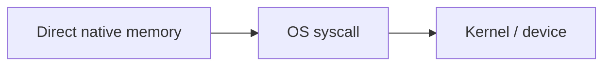
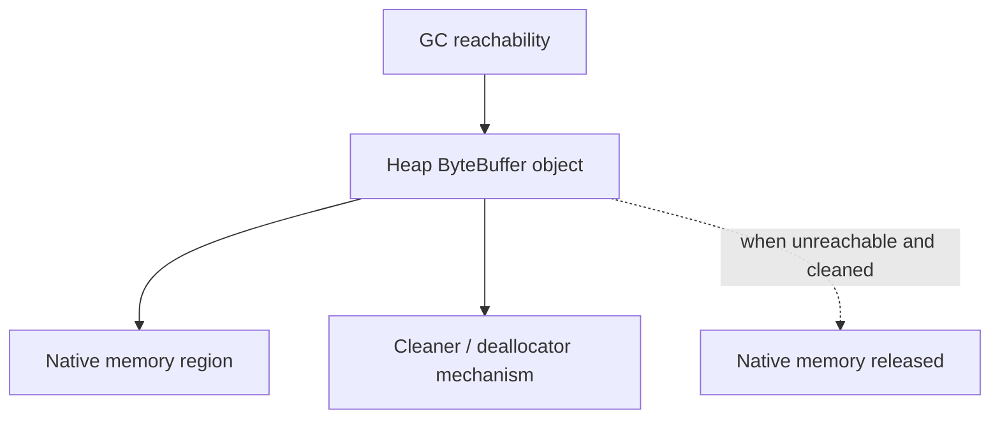

------
title: Learn Java IO, Modern IO, Streams, Buffers, Resources, Serialization & Data Boundaries - Part 014
description: Direct ByteBuffer and off-heap memory in Java IO: heap vs direct buffers, native memory pressure, allocation cost, pooling, lifetime, GC interaction, diagnostics, and production usage patterns.
series: learn-java-io-modern-io-resource-boundaries
seriesTitle: Learn Java IO, Modern IO, Streams, Buffers, Resources, Serialization & Data Boundaries
order: 14
partTitle: Direct Buffers & Off-Heap IO Memory
tags:
  - java
  - io
  - nio
  - bytebuffer
  - direct-buffer
  - off-heap
  - native-memory
  - performance
  - series
date: 2026-06-30
---

# Part 014 — Direct Buffers & Off-Heap IO Memory

> Target: setelah part ini, kita bisa memutuskan kapan memakai `ByteBuffer.allocateDirect()`, kapan tetap memakai heap buffer, dan bagaimana menghindari native memory incident yang tidak terlihat dari heap chart.

Part 013 membahas state machine `ByteBuffer`. Part ini membahas dimensi lain: **di mana bytes disimpan**.

Java NIO menyediakan dua kategori besar `ByteBuffer`:

```java
ByteBuffer heap = ByteBuffer.allocate(8192);
ByteBuffer direct = ByteBuffer.allocateDirect(8192);
```

Keduanya punya `position`, `limit`, `capacity`, `flip()`, `clear()`, `compact()`, `slice()`, dan seterusnya. Perbedaannya bukan di API cursor, melainkan di backing memory dan interaction dengan native IO.

---

## 1. Kaufman Skill Deconstruction

Skill “direct buffer mastery” bisa dipecah menjadi:

1. Membedakan heap buffer dan direct buffer.
2. Memahami kenapa direct buffer bisa mengurangi copy pada native IO path.
3. Memahami kenapa direct buffer allocation lebih mahal.
4. Menghitung native memory budget, bukan hanya heap budget.
5. Menghindari per-request direct allocation.
6. Memahami lifetime direct buffer dan GC interaction.
7. Mengenali `OutOfMemoryError: Direct buffer memory`.
8. Menggunakan pooling secara disiplin.
9. Mendiagnosis native memory via MXBean/JFR/NMT.
10. Mendesain ownership boundary untuk buffer reuse.

Core mental model:

> Direct buffer adalah resource-like memory object. Ia bukan file descriptor, tetapi di production ia harus diperlakukan dengan disiplin lifecycle yang mirip resource.

---

## 2. Heap Buffer vs Direct Buffer

### 2.1 Heap Buffer

```java
ByteBuffer buffer = ByteBuffer.allocate(64 * 1024);
```

Heap buffer:

1. Backed by Java heap memory.
2. Bisa punya accessible backing array jika tidak read-only.
3. Cepat dialokasikan relatif terhadap direct buffer.
4. Dikelola normal oleh GC heap.
5. Cocok untuk general application data manipulation.
6. Bisa memerlukan copy tambahan ketika digunakan untuk native IO.

### 2.2 Direct Buffer

```java
ByteBuffer buffer = ByteBuffer.allocateDirect(64 * 1024);
```

Direct buffer:

1. Backed by native memory di luar Java heap.
2. Designed for efficient native IO interaction.
3. Allocation/deallocation lebih mahal.
4. Tidak memiliki ordinary Java backing array.
5. Dibatasi oleh native memory budget, bukan hanya `-Xmx`.
6. Lifetime deallocation bergantung pada reachability/cleaning mechanism JVM.

Comparison:

| Dimension | Heap Buffer | Direct Buffer |
|---|---|---|
| Storage | Java heap | Native/off-heap memory |
| Allocation cost | Usually lower | Usually higher |
| GC heap pressure | Yes | Object reference on heap, bytes off-heap |
| Native IO path | May require intermediate copy | Can be used more directly by native IO |
| `array()` support | Often yes | No |
| Best for | App parsing, short-lived buffers, small data | Large/long-lived IO buffers, channels, high-throughput paths |
| Main risk | Heap GC pressure | Native memory pressure invisible to heap-only monitoring |

---

## 3. Why Direct Buffers Exist

OS IO APIs work with native memory. If Java data sits in movable managed heap, JVM/native boundary may need extra work.

Simplified path with heap buffer:

```mermaid
flowchart LR
    A[Java heap byte[]] --> B[JVM/native temporary buffer]
    B --> C[OS syscall]
    C --> D[Kernel / device]
```

Simplified path with direct buffer:



This is the intuition, not a universal guarantee. Actual behavior depends on JVM, OS, channel implementation, file/socket/device, and call path.

Practical interpretation:

> Direct buffers are most defensible when bytes frequently cross native IO boundaries and the buffer is large or long-lived enough to amortize allocation cost.

---

## 4. Oracle's Practical Guidance in Plain Engineering Terms

The Java API documentation warns that direct buffers should generally be allocated primarily for large, long-lived buffers subject to native IO, and only when they provide measurable performance gain.

Engineering translation:

1. Do not allocate direct buffers casually.
2. Do not allocate direct buffers per small request.
3. Do not assume direct is always faster.
4. Benchmark the actual IO path.
5. Monitor native memory, not only heap.
6. Prefer reuse/pooling if direct buffers are hot-path objects.

---

## 5. Allocation Cost and Lifetime

Bad:

```java
void handleRequest(ReadableByteChannel source, WritableByteChannel sink) throws IOException {
    ByteBuffer buffer = ByteBuffer.allocateDirect(8 * 1024);
    source.read(buffer);
    buffer.flip();
    sink.write(buffer);
}
```

If this runs per request at high QPS, it creates pressure on native allocation and deallocation.

Better:

```java
final class ConnectionState {
    private final ByteBuffer readBuffer = ByteBuffer.allocateDirect(64 * 1024);
    private final ByteBuffer writeBuffer = ByteBuffer.allocateDirect(64 * 1024);
}
```

Or use a bounded pool:

```java
final class DirectBufferPool {
    private final ArrayBlockingQueue<ByteBuffer> buffers;

    DirectBufferPool(int poolSize, int bufferSize) {
        this.buffers = new ArrayBlockingQueue<>(poolSize);
        for (int i = 0; i < poolSize; i++) {
            buffers.add(ByteBuffer.allocateDirect(bufferSize));
        }
    }

    BorrowedBuffer borrow() throws InterruptedException {
        ByteBuffer buffer = buffers.take();
        buffer.clear();
        return new BorrowedBuffer(buffer, this::release);
    }

    private void release(ByteBuffer buffer) {
        buffer.clear();
        buffers.offer(buffer);
    }

    record BorrowedBuffer(ByteBuffer buffer, Consumer<ByteBuffer> release) implements AutoCloseable {
        @Override
        public void close() {
            release.accept(buffer);
        }
    }
}
```

Usage:

```java
try (DirectBufferPool.BorrowedBuffer borrowed = pool.borrow()) {
    ByteBuffer buffer = borrowed.buffer();
    // use buffer without retaining reference after close
}
```

This is intentionally similar to resource lifecycle design from Part 004.

---

## 6. Native Memory Budgeting

A heap-only memory budget is incomplete.

Example service:

```text
-Xmx = 2 GiB
connections = 20_000
read direct buffer = 64 KiB
write direct buffer = 64 KiB
```

Direct buffer budget:

```text
20_000 * (64 KiB + 64 KiB) = 2.5 GiB
```

That exceeds heap size and may exceed container memory limit even if heap chart looks healthy.

Budget model:

```text
process_memory ≈ heap
               + metaspace
               + code cache
               + thread stacks
               + direct buffers
               + memory mapped files
               + JNI/native libraries
               + allocator fragmentation
               + JVM overhead
```

Container incident pattern:

1. Heap usage looks stable.
2. RSS keeps increasing.
3. Container is OOM-killed.
4. Application logs do not show Java heap OOME.
5. Root cause is native/off-heap growth.

**Rule:**

> Any production design using direct buffers needs process memory budget, not only heap budget.

---

## 7. `MaxDirectMemorySize`

HotSpot has a max direct memory setting commonly configured as:

```text
-XX:MaxDirectMemorySize=<size>
```

This can limit total memory used by direct buffer allocations. However, do not treat it as the whole native memory budget. Other native memory categories still exist.

Production guidance:

1. Set heap with container limit in mind.
2. Account for direct memory explicitly.
3. Leave room for metaspace, thread stacks, JIT, mmap, and native libraries.
4. Prefer bounded direct buffer pools.
5. Alert on process RSS and direct buffer pool metrics.

Example rough budget:

```text
container limit:     4096 MiB
heap (-Xmx):         2048 MiB
max direct memory:    768 MiB
metaspace/code/etc:   512 MiB
thread stacks:        256 MiB
safety margin:        512 MiB
```

The exact numbers depend on workload and runtime.

---

## 8. `hasArray()` and `array()` Trap

Heap buffer often exposes backing array:

```java
ByteBuffer heap = ByteBuffer.allocate(16);
if (heap.hasArray()) {
    byte[] array = heap.array();
}
```

Direct buffer usually does not:

```java
ByteBuffer direct = ByteBuffer.allocateDirect(16);
direct.array(); // UnsupportedOperationException
```

Bad generic code:

```java
byte[] bytes = buffer.array(); // BUG for direct or read-only buffers
```

Better:

```java
static byte[] copyRemaining(ByteBuffer source) {
    ByteBuffer view = source.duplicate();
    byte[] result = new byte[view.remaining()];
    view.get(result);
    return result;
}
```

This works for heap, direct, read-only, slice, and mapped buffers.

---

## 9. Direct Buffer and GC Interaction

Direct buffer object itself lives on heap. Its byte storage lives outside heap.

Simplified:



Implications:

1. Direct memory release is tied to object reachability and JVM cleaning mechanism.
2. You cannot rely on immediate release at exact lexical scope exit.
3. Many short-lived direct buffers can create delayed native memory pressure.
4. Holding references accidentally holds native memory.
5. Slices/duplicates can keep the underlying storage reachable.

Important:

> `ByteBuffer` does not implement `Closeable`. Try-with-resources cannot directly release a direct buffer.

That is why bounded pooling and stable ownership are important.

---

## 10. Slices and Duplicates Keep Storage Alive

Consider:

```java
ByteBuffer large = ByteBuffer.allocateDirect(128 * 1024 * 1024);
large.position(0).limit(16);
ByteBuffer tinySlice = large.slice();

cache.put("header", tinySlice);
large = null;
```

The tiny slice can keep the large direct memory region alive.

This is the off-heap version of substring-retaining-large-array style bugs.

Rule:

> Do not store tiny views into large direct buffers in long-lived structures. Copy the small data.

Safer:

```java
static ByteBuffer copyToSmallHeapBuffer(ByteBuffer source) {
    ByteBuffer view = source.duplicate();
    ByteBuffer copy = ByteBuffer.allocate(view.remaining());
    copy.put(view);
    copy.flip();
    return copy.asReadOnlyBuffer();
}
```

---

## 11. Pooling Direct Buffers: Useful but Dangerous

Pooling helps when:

1. Allocation cost is significant.
2. Buffers are large.
3. Buffers are used repeatedly on hot IO path.
4. Pool size is bounded.
5. Ownership is clear.

Pooling hurts when:

1. Pool is unbounded.
2. Borrowed buffers escape.
3. Buffers are returned while still in use.
4. Sensitive data is reused without clearing when required.
5. Pool fragmentation creates too many size classes.
6. Pool hides memory from simple observability.

Correct pool properties:

| Property | Reason |
|---|---|
| Bounded capacity | Prevent native memory explosion |
| Fixed or limited size classes | Avoid fragmentation complexity |
| Borrow/release discipline | Prevent ownership ambiguity |
| Clear state on borrow/release | Avoid cursor contamination |
| Leak detection in tests | Catch forgotten release |
| No long-lived slices | Prevent hidden retention |

---

## 12. Minimal Borrowed Buffer Abstraction

```java
public final class BorrowedByteBuffer implements AutoCloseable {
    private final ByteBuffer buffer;
    private final Consumer<ByteBuffer> releaser;
    private boolean closed;

    BorrowedByteBuffer(ByteBuffer buffer, Consumer<ByteBuffer> releaser) {
        this.buffer = Objects.requireNonNull(buffer);
        this.releaser = Objects.requireNonNull(releaser);
    }

    public ByteBuffer buffer() {
        if (closed) {
            throw new IllegalStateException("buffer already released");
        }
        return buffer;
    }

    @Override
    public void close() {
        if (!closed) {
            closed = true;
            buffer.clear();
            releaser.accept(buffer);
        }
    }
}
```

This does not make underlying `ByteBuffer` closeable. It makes **borrowed ownership** closeable.

Usage:

```java
try (BorrowedByteBuffer borrowed = pool.borrow()) {
    ByteBuffer buffer = borrowed.buffer();
    // read/write
}
```

Do not return `buffer` from the method. Do not store slices after `close()`.

---

## 13. Data Leakage and Buffer Reuse

If buffers contain sensitive data, `clear()` is not enough. It only resets metadata.

```java
buffer.clear(); // does not zero old bytes
```

For sensitive bytes:

```java
static void zero(ByteBuffer buffer) {
    ByteBuffer view = buffer.duplicate();
    view.clear();
    while (view.hasRemaining()) {
        view.put((byte) 0);
    }
    buffer.clear();
}
```

Caveat:

1. Compiler/JVM optimizations and copies may complicate hard guarantees.
2. For crypto-grade memory handling, use specialized security guidance.
3. This series only covers IO boundary implications, not full cryptographic memory hygiene.

Operationally, if buffers may contain credentials, tokens, PII, or payment data, make reuse policy explicit.

---

## 14. Direct Buffers and File IO

For large file copy via channel:

```java
static long copyWithDirectBuffer(Path source, Path target) throws IOException {
    try (FileChannel in = FileChannel.open(source, StandardOpenOption.READ);
         FileChannel out = FileChannel.open(target,
                 StandardOpenOption.CREATE,
                 StandardOpenOption.TRUNCATE_EXISTING,
                 StandardOpenOption.WRITE)) {

        ByteBuffer buffer = ByteBuffer.allocateDirect(1024 * 1024);
        long total = 0;

        while (true) {
            int n = in.read(buffer);
            if (n == -1) {
                break;
            }
            if (n == 0) {
                continue;
            }
            total += n;

            buffer.flip();
            while (buffer.hasRemaining()) {
                out.write(buffer);
            }
            buffer.clear();
        }

        return total;
    }
}
```

This may or may not beat:

```java
Files.copy(source, target, StandardCopyOption.REPLACE_EXISTING);
```

or:

```java
FileChannel.transferTo(...)
```

The best primitive depends on file size, OS, filesystem, storage, and JVM implementation. Part 016 covers zero-copy transfer.

---

## 15. Direct Buffers and Socket IO

For high-throughput network servers, direct buffers are common because sockets cross native boundaries frequently.

Connection-level design:

```java
final class NioConnection {
    private final SocketChannel channel;
    private final ByteBuffer inbound;
    private final Deque<ByteBuffer> outboundQueue = new ArrayDeque<>();

    NioConnection(SocketChannel channel, int bufferSize) {
        this.channel = channel;
        this.inbound = ByteBuffer.allocateDirect(bufferSize);
    }
}
```

Risks at scale:

```text
connections * per-connection-direct-buffer-size = native memory floor
```

If 100k mostly idle connections each hold 128 KiB direct buffer, you have designed a memory incident.

Alternative strategies:

1. Smaller per-connection buffers.
2. Shared bounded pool for active IO only.
3. Adaptive buffer sizing.
4. Heap buffers for low-throughput paths.
5. Backpressure earlier at accept/session layer.

---

## 16. Direct Buffer Size Selection

There is no universal best buffer size.

Factors:

1. Syscall overhead.
2. Storage/network throughput.
3. Page size and cache behavior.
4. Number of concurrent operations.
5. Max latency per operation.
6. Memory budget.
7. Allocation/pooling strategy.

Heuristic starting points:

| Use Case | Starting Size | Notes |
|---|---:|---|
| Small command protocol | 4–16 KiB | Often heap is enough |
| File streaming | 64 KiB–1 MiB | Benchmark actual storage path |
| TLS/application framing | 16–64 KiB | Consider framework buffer strategy |
| Large sequential transfer | 256 KiB–1 MiB | Compare with `transferTo`/`Files.copy` |
| Many idle connections | Small or pooled | Avoid per-connection memory floor |

The correct size is the smallest size that meets throughput/latency targets under realistic concurrency.

---

## 17. Diagnostics: Know Where Memory Went

### 17.1 BufferPoolMXBean

Java exposes buffer pool metrics through management APIs.

```java
import java.lang.management.BufferPoolMXBean;
import java.lang.management.ManagementFactory;

for (BufferPoolMXBean pool : ManagementFactory.getPlatformMXBeans(BufferPoolMXBean.class)) {
    System.out.printf(
            "%s count=%d used=%d capacity=%d%n",
            pool.getName(),
            pool.getCount(),
            pool.getMemoryUsed(),
            pool.getTotalCapacity()
    );
}
```

Typical pools include direct and mapped. Use these as application/runtime telemetry.

### 17.2 Native Memory Tracking

HotSpot Native Memory Tracking can help categorize native memory, but it must be enabled and has overhead.

Typical commands:

```bash
jcmd <pid> VM.native_memory summary
jcmd <pid> VM.native_memory detail
```

Runtime flags commonly used:

```text
-XX:NativeMemoryTracking=summary
-XX:NativeMemoryTracking=detail
```

Use in staging/performance testing before enabling in sensitive production paths.

### 17.3 JFR

Java Flight Recorder can help correlate allocation, IO, GC, and memory behavior. For direct buffer incidents, combine:

1. Process RSS.
2. Heap usage.
3. Direct buffer pool metrics.
4. Mapped buffer metrics.
5. Thread count and stack size.
6. Container OOM events.
7. Allocation profiles.

---

## 18. Failure Modes

### 18.1 `OutOfMemoryError: Direct buffer memory`

Typical causes:

1. Too many direct buffers.
2. Per-request direct allocation spike.
3. Slices/duplicates retaining large regions.
4. Pool not bounded.
5. Pool leak.
6. Container memory too small for heap + native.
7. `MaxDirectMemorySize` too low for intended workload.

Response:

1. Capture heap dump only if it helps find references to buffer objects.
2. Check direct buffer pool MXBean.
3. Check RSS vs heap.
4. Use NMT if enabled.
5. Find allocation sites.
6. Bound/pool/reduce buffer sizes.
7. Review retention of slices and queues.

### 18.2 Container OOM Kill Without Java OOME

Cause:

Process exceeds cgroup/container memory limit due to total RSS, not Java heap only.

Response:

1. Reduce `-Xmx` or native memory usage.
2. Bound direct buffer memory.
3. Reduce thread stacks or thread count if relevant.
4. Account for mmap.
5. Add RSS alerts.

### 18.3 Latency Spikes from Direct Allocation

Cause:

Direct allocation/deallocation on hot path.

Response:

1. Preallocate.
2. Pool.
3. Use heap buffer if benchmark shows no benefit.
4. Reduce allocation frequency.

### 18.4 Data Corruption from Reuse

Cause:

Buffer returned to pool while slice/view still in use.

Response:

1. Copy before async handoff.
2. Forbid retaining borrowed buffers.
3. Add debug guards in pool wrapper.
4. Use ownership-aware types.

---

## 19. Direct Buffer API Boundary Design

Bad:

```java
ByteBuffer borrowBuffer();
```

This says nothing about:

1. Who returns it?
2. Can it be retained?
3. Is it direct?
4. Is it cleared?
5. Can slices escape?
6. Is it thread-confined?

Better:

```java
interface BufferPool {
    BorrowedByteBuffer borrow() throws InterruptedException;
}
```

Document:

```java
/**
 * Borrows a direct buffer in write mode.
 * The caller must close the returned handle exactly once.
 * The ByteBuffer and all derived views must not be retained after close.
 * The buffer is thread-confined to the borrower.
 */
BorrowedByteBuffer borrow();
```

The API should make lifecycle visible.

---

## 20. Heap vs Direct Decision Matrix

Use heap buffer when:

1. Data is small.
2. Buffer is short-lived.
3. Main work is application parsing/transformation.
4. You need `byte[]` frequently.
5. You are not on hot native IO path.
6. Simplicity matters more than theoretical IO gain.

Use direct buffer when:

1. Buffer is large or long-lived.
2. Buffer is repeatedly used with channels/native IO.
3. Benchmark shows measurable improvement.
4. Native memory budget is explicit.
5. Allocation is amortized through reuse.
6. Ownership/lifetime is controlled.

Avoid direct buffer when:

1. Per-request allocation is high.
2. You cannot monitor native memory.
3. You pass buffers through many unknown layers.
4. You store small slices long-term.
5. You are memory constrained and concurrency is high.
6. Performance claim is not measured.

---

## 21. Direct Buffer and `MemorySegment`

Modern Java also has the Foreign Function & Memory API under `java.lang.foreign`, including `MemorySegment` and `Arena`. This gives more explicit lifetime management for foreign/off-heap memory than direct `ByteBuffer` in some use cases.

However, do not mix abstractions casually:

| Need | Usually Start With |
|---|---|
| Java channel IO buffer | `ByteBuffer` |
| Native interop / structured foreign memory | `MemorySegment` |
| Memory-mapped file with modern API | Part 018 topic |
| Legacy NIO API compatibility | `ByteBuffer` |

This part focuses on direct `ByteBuffer`. Part 018 will cover modern foreign memory and mapped segments in more detail.

---

## 22. Benchmarking Direct Buffers Correctly

Bad benchmark:

```java
for (int i = 0; i < iterations; i++) {
    ByteBuffer buffer = ByteBuffer.allocateDirect(8192);
    // measure read/write once
}
```

This measures allocation more than IO.

Better benchmark dimensions:

1. Preallocated heap vs preallocated direct.
2. Different buffer sizes.
3. Same file/socket/storage path.
4. Realistic concurrency.
5. Warmup.
6. Allocation rate.
7. Tail latency, not only average throughput.
8. RSS/native memory impact.

Hypotheses to test:

1. Direct buffer improves channel throughput for large sequential IO.
2. Direct buffer hurts latency if allocated per operation.
3. Larger buffer improves throughput only until saturation.
4. Heap buffer is equal or better for small application parsing.
5. `transferTo`/`Files.copy` beats manual copy for large files.

---

## 23. Example: Bounded File Chunk Reader

Goal: read file chunks using a reusable direct buffer but return stable heap chunks to downstream.

```java
final class FileChunkReader implements Closeable {
    private final FileChannel channel;
    private final ByteBuffer ioBuffer;

    FileChunkReader(Path path, int bufferSize) throws IOException {
        this.channel = FileChannel.open(path, StandardOpenOption.READ);
        this.ioBuffer = ByteBuffer.allocateDirect(bufferSize);
    }

    Optional<ByteBuffer> nextChunk() throws IOException {
        ioBuffer.clear();
        int n = channel.read(ioBuffer);
        if (n == -1) {
            return Optional.empty();
        }

        ioBuffer.flip();
        ByteBuffer stable = ByteBuffer.allocate(ioBuffer.remaining());
        stable.put(ioBuffer);
        stable.flip();
        return Optional.of(stable.asReadOnlyBuffer());
    }

    @Override
    public void close() throws IOException {
        channel.close();
    }
}
```

Why copy to heap?

Because the direct buffer is reused internally. Returning a slice would expose unstable mutable storage.

Alternative: process chunk synchronously via callback and do not return it.

```java
void forEachChunk(Consumer<ByteBuffer> consumer) throws IOException {
    while (true) {
        ioBuffer.clear();
        int n = channel.read(ioBuffer);
        if (n == -1) {
            return;
        }
        ioBuffer.flip();
        consumer.accept(ioBuffer.asReadOnlyBuffer());
    }
}
```

Contract: consumer must not retain the buffer after callback returns.

---

## 24. Example: Pool Leak Detection for Tests

```java
final class DebugBufferPool {
    private final Set<BorrowedByteBuffer> outstanding = ConcurrentHashMap.newKeySet();
    private final ArrayBlockingQueue<ByteBuffer> free;

    DebugBufferPool(int count, int size) {
        this.free = new ArrayBlockingQueue<>(count);
        for (int i = 0; i < count; i++) {
            free.add(ByteBuffer.allocateDirect(size));
        }
    }

    BorrowedByteBuffer borrow() throws InterruptedException {
        ByteBuffer buffer = free.take();
        BorrowedByteBuffer borrowed = new BorrowedByteBuffer(buffer, b -> {
            free.offer(b);
        });
        outstanding.add(borrowed);
        return borrowed;
    }

    void assertNoLeaks() {
        if (!outstanding.isEmpty()) {
            throw new AssertionError("borrowed buffers not returned: " + outstanding.size());
        }
    }
}
```

Real implementation should remove from `outstanding` on close. This sketch shows the intent: make leaks test-visible.

---

## 25. Operational Checklist

For every service using direct buffers:

1. What is max number of direct buffers?
2. What is max direct buffer capacity total?
3. Are buffers allocated per request or reused?
4. Is direct memory bounded by configuration/pool?
5. Is `MaxDirectMemorySize` explicitly considered?
6. Is process RSS monitored?
7. Are direct/mapped buffer pool metrics exported?
8. Are tiny slices of large buffers retained anywhere?
9. Can borrowed buffers cross async/thread boundaries?
10. Is there a clear policy for sensitive data reuse?
11. Are buffer sizes benchmarked under realistic concurrency?
12. Is fallback to heap acceptable if direct memory is constrained?
13. Do tests detect pool leaks?
14. Are direct buffers actually improving the measured bottleneck?
15. Does container memory leave room beyond heap?

---

## 26. Code Review Comments You Should Be Able to Make

### Per-request Direct Allocation

> This allocates a direct buffer per request. Direct allocation is expensive and can create native memory pressure. Use heap buffer unless benchmarked, or borrow from a bounded pool.

### Hidden Heap Assumption

> This calls `buffer.array()`, which fails for direct/read-only buffers. Use duplicate + copy if the method must support generic `ByteBuffer`.

### Escaping Borrowed Buffer

> This returns a slice of a pooled direct buffer. The caller may observe corrupted data after the buffer is reused. Copy or change the API to process inside the borrow scope.

### Missing Memory Budget

> This adds per-connection direct buffers. Please include `connections * bufferSize` in the native memory budget and container sizing.

### Unmeasured Optimization

> Direct buffer is not automatically faster. We need a benchmark for this path or use heap buffer for simpler lifecycle.

---

## 27. Exercises

### Exercise 1 — Budget Calculation

A service has:

```text
container memory: 6 GiB
-Xmx: 3 GiB
connections: 30_000
inbound direct buffer: 32 KiB
outbound direct buffer: 32 KiB
threads: 300
thread stack: 1 MiB
```

Calculate direct buffer memory:

```text
30_000 * 64 KiB = 1,920,000 KiB ≈ 1.83 GiB
```

Thread stacks:

```text
300 MiB
```

Subtotal:

```text
heap 3 GiB + direct 1.83 GiB + stacks 0.29 GiB = 5.12 GiB
```

Before metaspace, code cache, mapped files, native libraries, allocator overhead, and safety margin, this is already risky.

### Exercise 2 — Fix `array()` Bug

Bug:

```java
byte[] body = buffer.array();
```

Fix:

```java
ByteBuffer view = buffer.duplicate();
byte[] body = new byte[view.remaining()];
view.get(body);
```

### Exercise 3 — Prevent Slice Retention

Given a 64 MiB direct receive buffer, the parser returns a 32-byte header slice and stores it in a cache.

Fix options:

1. Copy header to small heap array.
2. Parse header into value object.
3. Do not retain buffer-derived views.

Best:

```java
record Header(int version, int flags, long correlationId) {}
```

Convert bytes to semantic value, not long-lived byte view.

---

## 28. Mental Compression

Direct buffer rule of thumb:

```text
Heap buffer  = default for application data
Direct buffer = measured optimization for native IO paths
```

Production invariant:

```text
Direct buffers consume native memory.
Native memory must be budgeted, bounded, monitored, and owned.
```

Lifecycle invariant:

```text
A pooled direct buffer must not escape its borrow scope.
```

Aliasing invariant:

```text
slice/duplicate share storage and can keep large direct memory alive.
```

---

## 29. References

- Oracle Java SE 25 API — `java.nio.ByteBuffer`
- Oracle Java SE 25 API — `java.nio.Buffer`
- Oracle Java SE 25 API — `java.lang.management.BufferPoolMXBean`
- Oracle Java SE 25 API — `java.lang.foreign.MemorySegment`
- HotSpot Native Memory Tracking documentation

---

## 30. Part Summary

Kita sudah membahas direct buffers sebagai off-heap IO memory. Hal penting:

1. Direct buffer berbeda dari heap buffer pada backing memory, bukan cursor API.
2. Direct buffer bisa membantu native IO path, tetapi tidak otomatis lebih cepat.
3. Allocation direct buffer relatif mahal; hindari per-request direct allocation.
4. Native memory pressure bisa terjadi walaupun heap terlihat sehat.
5. Slices dan duplicates bisa menahan large direct memory.
6. Pooling hanya aman jika bounded dan ownership jelas.
7. `array()` bukan generic `ByteBuffer` API.
8. Monitoring harus mencakup direct buffer metrics dan process RSS.
9. Direct buffer harus dipilih berdasarkan benchmark dan budget.

Part berikutnya membahas **Channels: `FileChannel`, `SeekableByteChannel`, positional IO, scattering/gathering, locking, dan transfer APIs**.
