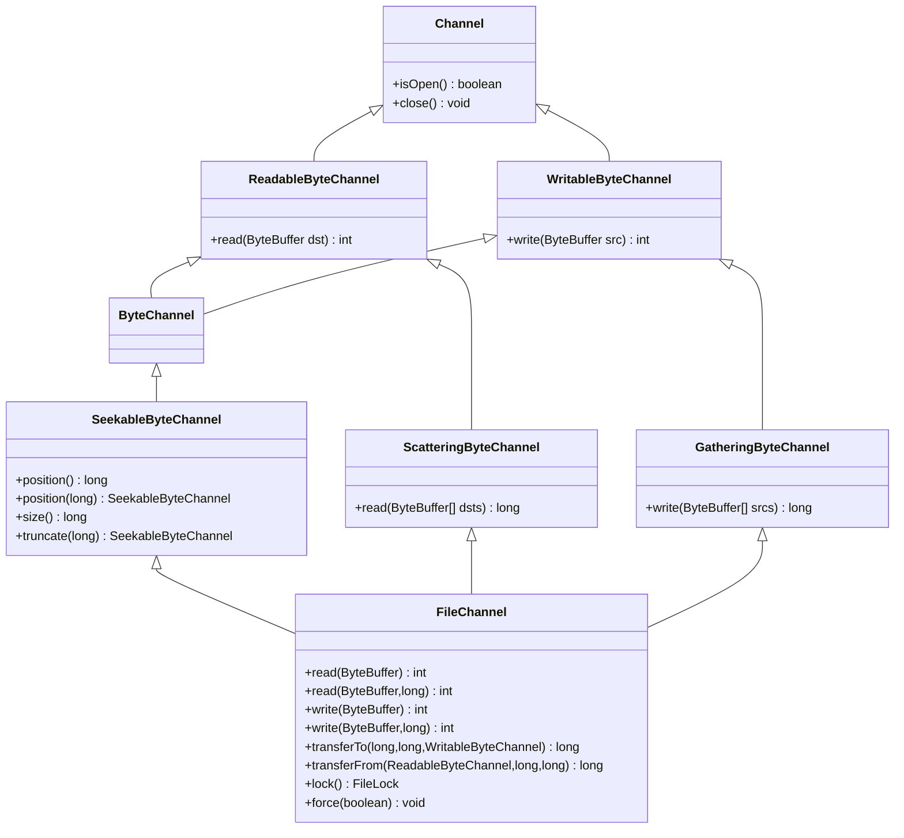
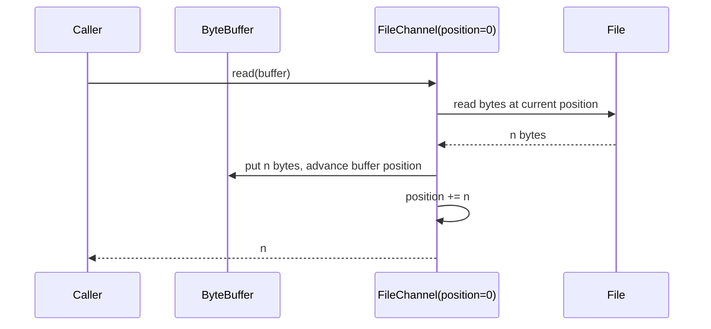
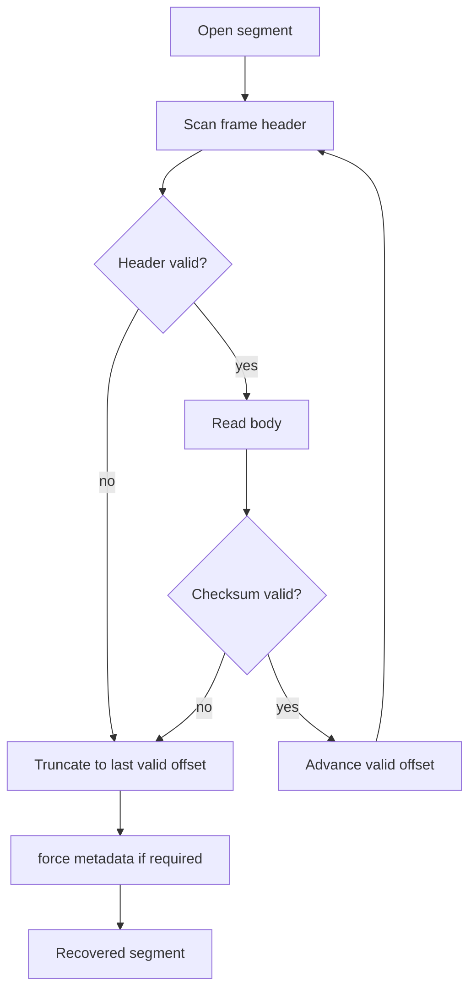

------
title: Learn Java IO, Modern IO, Streams, Buffers, Resources, Serialization & Data Boundaries - Part 015
description: Deep dive into Java NIO channels, FileChannel, SeekableByteChannel, positional IO, scatter/gather operations, and file locks as production IO primitives.
series: learn-java-io-modern-io-resource-boundaries
seriesTitle: Learn Java IO, Modern IO, Streams, Buffers, Resources, Serialization & Data Boundaries
order: 15
partTitle: Channels: FileChannel, SeekableByteChannel, Gathering/Scattering
tags:
  - java
  - nio
  - filechannel
  - seekablebytechannel
  - bytebuffer
  - scatter-gather
  - file-lock
  - io-boundary
  - series
date: 2026-06-30
------

# Part 015 — Channels: `FileChannel`, `SeekableByteChannel`, Gathering/Scattering

> Goal part ini: memahami **channel** sebagai primitive IO modern yang membawa byte melalui `ByteBuffer`, bukan melalui array/stream abstraction. Setelah bagian ini, kita harus bisa mendesain file IO yang aman untuk random access, large files, structured binary IO, concurrent positional access, dan scatter/gather transfer.

Kita sudah membahas stream, resource lifecycle, buffering, text/binary encoding, filesystem operations, durability, dan `ByteBuffer`. Sekarang kita masuk ke primitive yang menyatukan banyak konsep tersebut: **NIO Channel**.

`FileChannel` sering tampak seperti “cara lain membaca file”. Itu framing yang terlalu sempit. Mental model yang lebih benar:

```text
FileChannel = opened file descriptor + file position + channel operations + ByteBuffer boundary
```

`FileChannel` adalah bridge antara:

- filesystem state,
- open option,
- file offset,
- byte buffer state,
- OS-level read/write/mapping/locking/transfer capability.

Kalau `InputStream` cocok untuk sequential byte flow, `FileChannel` cocok saat kita butuh salah satu dari ini:

- explicit offset;
- random access;
- large file transfer;
- scatter/gather IO;
- file locking;
- memory mapping;
- durability control via `force`;
- integration dengan non-stream APIs.

---

## 1. Kaufman Deconstruction: Skill yang Dipelajari

Dalam framework Josh Kaufman, kita pecah skill ini menjadi sub-skill kecil yang bisa dilatih cepat.

| Sub-skill | Yang Harus Bisa | Failure Kalau Lemah |
|---|---|---|
| Channel mental model | Membedakan stream cursor, channel position, dan explicit position | Race condition, read/write di offset salah |
| ByteBuffer interop | Mengelola `flip`, `clear`, `compact`, `remaining` | Infinite loop, data corrupt, empty writes |
| Seekable IO | Membaca/menulis region tertentu tanpa mengganggu cursor global | Bug pada index file, WAL, checkpoint, blob store |
| Scatter/gather | Membaca/menulis header/body sebagai buffer terpisah | Extra copy, parser rumit, allocation berlebih |
| File locking | Memahami lock sebagai OS/JVM coordination hint, bukan mutex internal | False safety, multi-process corruption |
| Partial operation handling | Loop sampai contract terpenuhi | Truncated output, partial protocol frame |
| API boundary design | Memilih `FileChannel`, `SeekableByteChannel`, `ReadableByteChannel`, atau stream | API terlalu sempit atau overexposed |

Target akhir part ini bukan hafal method, tetapi punya judgement: **kapan channel adalah primitive yang benar, dan kapan stream lebih sederhana serta cukup**.

---

## 2. Channel vs Stream: Perbedaan Mental Model

Classic stream:

```text
consumer calls read()
        ↓
stream advances hidden cursor
        ↓
consumer receives byte(s)
```

Channel:

```text
caller owns ByteBuffer state
        ↓
channel transfers bytes into/out of buffer
        ↓
channel position may or may not move depending operation
```

Perbedaan penting:

| Aspek | Stream | Channel |
|---|---|---|
| Data container | `byte[]` atau internal buffer | `ByteBuffer` |
| Cursor data | Hidden inside stream | Explicit: buffer position + channel position |
| Random access | Tidak natural | Natural via `position` atau positional methods |
| Scatter/gather | Tidak native | Native via buffer arrays |
| Large transfer | Bisa, tapi sering copy-loop | Ada `transferTo`/`transferFrom` |
| Memory mapping | Tidak | Via `FileChannel.map` |
| Locking | Tidak | Via `FileChannel.lock/tryLock` |
| API complexity | Lebih sederhana | Lebih stateful dan error-prone |

**Rule praktis:**

Gunakan stream jika masalahnya adalah sequential content flow. Gunakan channel jika masalahnya adalah **byte region management**.

---

## 3. NIO Channel Interface Family

Channel API punya beberapa interface dasar:



Yang penting bukan memorisasi hierarchy, tetapi memahami **capability contract**:

- `ReadableByteChannel`: bisa memasukkan byte ke `ByteBuffer`.
- `WritableByteChannel`: bisa mengambil byte dari `ByteBuffer`.
- `SeekableByteChannel`: punya ukuran dan current position.
- `ScatteringByteChannel`: bisa baca ke beberapa buffer.
- `GatheringByteChannel`: bisa tulis dari beberapa buffer.
- `FileChannel`: file-specific operations: position, truncate, force, lock, map, transfer.

---

## 4. Membuka `FileChannel`

Cara modern:

```java
Path path = Path.of("data/orders.bin");

try (FileChannel channel = FileChannel.open(
        path,
        StandardOpenOption.READ)) {
    // read using ByteBuffer
}
```

Untuk write:

```java
try (FileChannel channel = FileChannel.open(
        path,
        StandardOpenOption.CREATE,
        StandardOpenOption.WRITE,
        StandardOpenOption.TRUNCATE_EXISTING)) {
    // write
}
```

Untuk read-write random access:

```java
try (FileChannel channel = FileChannel.open(
        path,
        StandardOpenOption.CREATE,
        StandardOpenOption.READ,
        StandardOpenOption.WRITE)) {
    // read/write arbitrary regions
}
```

Open options adalah bagian dari contract. Jangan sembunyikan pilihan ini kalau API perlu correctness tinggi.

Contoh helper yang eksplisit:

```java
public static FileChannel openExistingForRandomRead(Path path) throws IOException {
    return FileChannel.open(path, StandardOpenOption.READ);
}

public static FileChannel openNewForExclusiveWrite(Path path) throws IOException {
    return FileChannel.open(
            path,
            StandardOpenOption.CREATE_NEW,
            StandardOpenOption.WRITE);
}
```

**Design smell:** method bernama `openFile(Path)` tanpa menjelaskan read/write/create/truncate/append semantics.

---

## 5. Relative IO: Operasi yang Menggerakkan Channel Position

Relative read:

```java
ByteBuffer buffer = ByteBuffer.allocate(8192);

try (FileChannel channel = FileChannel.open(path, StandardOpenOption.READ)) {
    int n = channel.read(buffer);
    // channel position moved by n bytes, unless EOF
}
```

Relative write:

```java
ByteBuffer buffer = ByteBuffer.wrap("hello\n".getBytes(StandardCharsets.UTF_8));

try (FileChannel channel = FileChannel.open(
        path,
        StandardOpenOption.CREATE,
        StandardOpenOption.WRITE,
        StandardOpenOption.TRUNCATE_EXISTING)) {
    while (buffer.hasRemaining()) {
        channel.write(buffer);
    }
}
```

Relative operations use a mutable file position inside the channel. That position is shared by operations on that channel.



### Production rule

If multiple code paths share a `FileChannel`, relative operations create implicit coordination through channel position.

Bad:

```java
// Two services share this object.
class SharedLogReader {
    private final FileChannel channel;

    byte[] readNext(int size) throws IOException {
        ByteBuffer b = ByteBuffer.allocate(size);
        channel.read(b); // shared mutable cursor
        return b.array();
    }
}
```

Better if callers own offsets:

```java
final class IndexedFileReader {
    private final FileChannel channel;

    IndexedFileReader(FileChannel channel) {
        this.channel = channel;
    }

    byte[] readAt(long offset, int size) throws IOException {
        ByteBuffer buffer = ByteBuffer.allocate(size);
        readFullyAt(channel, buffer, offset);
        return buffer.array();
    }
}
```

---

## 6. Positional IO: Operasi yang Tidak Mengubah Channel Position

`FileChannel` punya overload:

```java
int read(ByteBuffer dst, long position)
int write(ByteBuffer src, long position)
```

Ini adalah primitive penting untuk index, segment file, sparse file, checkpoint, dan concurrent reader.

```java
static void readFullyAt(FileChannel channel, ByteBuffer dst, long offset) throws IOException {
    long position = offset;
    while (dst.hasRemaining()) {
        int n = channel.read(dst, position);
        if (n == -1) {
            throw new EOFException("EOF before reading expected bytes at offset " + position);
        }
        if (n == 0) {
            // For FileChannel in blocking mode this is uncommon, but contract-safe.
            Thread.onSpinWait();
            continue;
        }
        position += n;
    }
}
```

Write fully at offset:

```java
static void writeFullyAt(FileChannel channel, ByteBuffer src, long offset) throws IOException {
    long position = offset;
    while (src.hasRemaining()) {
        int n = channel.write(src, position);
        if (n == 0) {
            Thread.onSpinWait();
            continue;
        }
        position += n;
    }
}
```

### Invariant

```text
relative read/write:
    mutates buffer position
    mutates channel position

positional read/write:
    mutates buffer position
    does NOT mutate channel position
```

Ini sangat penting untuk desain API. Kalau library menerima `FileChannel` dan memakai relative operations, library tersebut ikut mengubah state caller.

---

## 7. `SeekableByteChannel`: Abstraction yang Lebih Kecil dari `FileChannel`

Tidak semua API perlu `FileChannel`. Kadang cukup:

```java
public interface SeekableByteChannel extends ByteChannel {
    long position() throws IOException;
    SeekableByteChannel position(long newPosition) throws IOException;
    long size() throws IOException;
    SeekableByteChannel truncate(long size) throws IOException;
}
```

Gunakan `SeekableByteChannel` saat API hanya butuh:

- read/write bytes;
- seek;
- size;
- truncate.

Jangan expose `FileChannel` kalau API tidak butuh:

- memory mapping;
- file locking;
- `force`;
- zero-copy transfer;
- file-specific operation.

Contoh:

```java
final class FixedRecordStore {
    private final SeekableByteChannel channel;
    private final int recordSize;

    FixedRecordStore(SeekableByteChannel channel, int recordSize) {
        if (recordSize <= 0) {
            throw new IllegalArgumentException("recordSize must be positive");
        }
        this.channel = channel;
        this.recordSize = recordSize;
    }

    byte[] readRecord(long index) throws IOException {
        long offset = Math.multiplyExact(index, recordSize);
        ByteBuffer buffer = ByteBuffer.allocate(recordSize);
        channel.position(offset);
        while (buffer.hasRemaining()) {
            int n = channel.read(buffer);
            if (n == -1) {
                throw new EOFException("Missing record " + index);
            }
        }
        return buffer.array();
    }
}
```

Kelemahannya: `SeekableByteChannel` positional read/write tidak tersedia di interface. Jika butuh concurrent offset-based operations tanpa mengubah cursor, gunakan `FileChannel` atau desain abstraction sendiri.

---

## 8. `Channels`: Bridge antara Stream dan Channel

Java menyediakan utility `Channels` untuk interop:

```java
ReadableByteChannel channel = Channels.newChannel(inputStream);
WritableByteChannel out = Channels.newChannel(outputStream);
InputStream in = Channels.newInputStream(readableChannel);
OutputStream os = Channels.newOutputStream(writableChannel);
```

Ini berguna saat library lama memakai stream, tetapi internal pipeline kita memakai channel.

Contoh bounded copy dari `InputStream` ke `FileChannel`:

```java
static long copyToFile(InputStream input, FileChannel output) throws IOException {
    try (ReadableByteChannel source = Channels.newChannel(input)) {
        ByteBuffer buffer = ByteBuffer.allocateDirect(64 * 1024);
        long total = 0;
        while (true) {
            buffer.clear();
            int n = source.read(buffer);
            if (n == -1) {
                return total;
            }
            buffer.flip();
            while (buffer.hasRemaining()) {
                total += output.write(buffer);
            }
        }
    }
}
```

Perhatikan ownership: `Channels.newChannel(input)` biasanya menutup underlying stream saat channel ditutup. Jangan menutup stream/channel jika caller masih memilikinya.

---

## 9. Scatter Read: Header dan Body Tanpa Manual Copy

Scattering read membaca byte ke beberapa buffer secara berurutan.

Misalnya format file:

```text
+----------------+------------------+
| 16-byte header | variable payload |
+----------------+------------------+
```

Kita bisa baca header dan body sekaligus:

```java
ByteBuffer header = ByteBuffer.allocate(16);
ByteBuffer body = ByteBuffer.allocate(payloadLength);
ByteBuffer[] buffers = { header, body };

try (FileChannel channel = FileChannel.open(path, StandardOpenOption.READ)) {
    readFully(channel, buffers);
}

header.flip();
body.flip();
```

Helper:

```java
static void readFully(ScatteringByteChannel channel, ByteBuffer[] buffers) throws IOException {
    while (hasRemaining(buffers)) {
        long n = channel.read(buffers);
        if (n == -1) {
            throw new EOFException("EOF before all buffers were filled");
        }
        if (n == 0) {
            Thread.onSpinWait();
        }
    }
}

static boolean hasRemaining(ByteBuffer[] buffers) {
    for (ByteBuffer buffer : buffers) {
        if (buffer.hasRemaining()) {
            return true;
        }
    }
    return false;
}
```

### Kapan scatter read berguna?

- fixed header + variable body;
- protocol frame parsing;
- log segment entry;
- binary container format;
- avoiding temporary concatenation buffer.

### Kapan tidak berguna?

- format sederhana yang sudah line-oriented;
- body size kecil dan parsing lebih jelas dengan single buffer;
- channel/provider tidak memberi manfaat signifikan;
- readability lebih penting dari micro-optimization.

---

## 10. Gather Write: Header dan Body Tanpa Concatenation

Gathering write mengambil byte dari beberapa buffer secara berurutan.

```java
ByteBuffer header = ByteBuffer.allocate(16);
header.putInt(0xCAFE_BABE);
header.putInt(1); // version
header.putLong(body.remaining());
header.flip();

ByteBuffer body = ByteBuffer.wrap(payload);

try (FileChannel channel = FileChannel.open(
        path,
        StandardOpenOption.CREATE,
        StandardOpenOption.WRITE,
        StandardOpenOption.TRUNCATE_EXISTING)) {
    writeFully(channel, new ByteBuffer[] { header, body });
}
```

Helper:

```java
static void writeFully(GatheringByteChannel channel, ByteBuffer[] buffers) throws IOException {
    while (hasRemaining(buffers)) {
        long n = channel.write(buffers);
        if (n == 0) {
            Thread.onSpinWait();
        }
    }
}
```

### Why this matters

Tanpa gather write, engineer sering melakukan:

```java
byte[] frame = new byte[header.length + body.length];
System.arraycopy(header, 0, frame, 0, header.length);
System.arraycopy(body, 0, frame, header.length, body.length);
out.write(frame);
```

Itu menambah copy dan allocation. Untuk payload besar atau throughput tinggi, gather write menjaga boundary:

```text
header buffer stays header
body buffer stays body
channel performs ordered write
```

---

## 11. Partial Read/Write: Contract yang Wajib Dilatih

Channel operations tidak menjamin memenuhi seluruh buffer sekali panggil.

Wrong:

```java
ByteBuffer buffer = ByteBuffer.allocate(4096);
channel.read(buffer); // assumes full
```

Right:

```java
while (buffer.hasRemaining()) {
    int n = channel.read(buffer);
    if (n == -1) {
        throw new EOFException();
    }
}
```

Wrong:

```java
channel.write(buffer); // assumes all bytes written
```

Right:

```java
while (buffer.hasRemaining()) {
    channel.write(buffer);
}
```

### Why partial operation happens

- OS may complete less than requested;
- non-blocking channel may return zero;
- file may end before expected region;
- target may be slower;
- signal/interruption/provider behavior may split work;
- large buffer may exceed underlying transfer capability.

**Top 1% habit:** every IO review asks: “What if this call transfers fewer bytes than requested?”

---

## 12. File Size, Truncate, and Sparse Growth

`FileChannel.size()` returns current file size.

```java
long size = channel.size();
```

`truncate` shrinks or caps file:

```java
channel.truncate(1024 * 1024);
```

Writing beyond current size grows the file:

```java
ByteBuffer one = ByteBuffer.wrap(new byte[] { 1 });
channel.write(one, 10_000_000L);
```

Bytes between previous EOF and new write are filesystem/provider dependent in terms of physical allocation. Conceptually, file length grows; operationally, sparse files may or may not be used depending platform/options/filesystem.

### Use cases

- preallocated segment files;
- sparse index files;
- append-only log truncation after recovery;
- checkpoint compaction;
- random-access blob store.

### Failure mode

Do not use file size as proof of complete valid content. A file can have the expected size but invalid checksum, incomplete logical commit, or unwritten sparse holes.

Correctness needs logical validation:

```text
physical size >= required bytes
AND magic bytes valid
AND version supported
AND frame checksum valid
AND commit marker present
```

---

## 13. File Locks: Coordination, Not Magic Safety

`FileChannel` supports locks:

```java
try (FileChannel channel = FileChannel.open(
        path,
        StandardOpenOption.CREATE,
        StandardOpenOption.WRITE);
     FileLock lock = channel.lock()) {
    // exclusive lock region
}
```

Region lock:

```java
try (FileLock lock = channel.lock(offset, length, false)) {
    // false = exclusive
}
```

Shared lock:

```java
try (FileLock lock = channel.lock(offset, length, true)) {
    // shared lock, requires channel opened for reading
}
```

Non-blocking attempt:

```java
try (FileLock lock = channel.tryLock()) {
    if (lock == null) {
        throw new IllegalStateException("Already locked by another process");
    }
    // use lock
}
```

### Crucial mental model

File lock is usually for **inter-process coordination**, not intra-JVM thread safety.

Use Java locks for thread-level coordination:

```java
private final ReentrantLock mutex = new ReentrantLock();
```

Use file locks for external process coordination:

```text
process A and process B both know to obey the lock protocol
```

### Lock pitfalls

- Lock semantics differ by OS and filesystem.
- Network filesystems may have surprising behavior.
- Locks are advisory in many environments.
- A lock does not validate file contents.
- A lock does not replace atomic write/rename discipline.
- Lock lifetime is tied to channel/JVM/OS handle semantics.
- Do not assume lock is a distributed consensus primitive.

### Safe pattern: single-writer process coordination

```java
final class SingleProcessFileWriter implements AutoCloseable {
    private final FileChannel channel;
    private final FileLock lock;

    SingleProcessFileWriter(Path lockFile) throws IOException {
        this.channel = FileChannel.open(
                lockFile,
                StandardOpenOption.CREATE,
                StandardOpenOption.WRITE);
        FileLock acquired = channel.tryLock();
        if (acquired == null) {
            channel.close();
            throw new IllegalStateException("Another process is active");
        }
        this.lock = acquired;
    }

    @Override
    public void close() throws IOException {
        IOException failure = null;
        try {
            lock.close();
        } catch (IOException e) {
            failure = e;
        }
        try {
            channel.close();
        } catch (IOException e) {
            if (failure != null) {
                failure.addSuppressed(e);
            } else {
                failure = e;
            }
        }
        if (failure != null) {
            throw failure;
        }
    }
}
```

---

## 14. Channel Position and Concurrency

`FileChannel` can be used by multiple threads, but that does not mean every usage is logically safe.

### Dangerous pattern

```java
// Thread A
channel.position(0);
channel.read(bufferA);

// Thread B
channel.position(1024);
channel.read(bufferB);
```

This is a race at the logical protocol level. Position changes are shared.

### Better pattern: positional reads

```java
CompletableFuture<byte[]> f1 = CompletableFuture.supplyAsync(() -> readBlock(channel, 0));
CompletableFuture<byte[]> f2 = CompletableFuture.supplyAsync(() -> readBlock(channel, 1024));
```

```java
static byte[] readBlock(FileChannel channel, long offset) {
    try {
        ByteBuffer b = ByteBuffer.allocate(1024);
        readFullyAt(channel, b, offset);
        return b.array();
    } catch (IOException e) {
        throw new UncheckedIOException(e);
    }
}
```

### Rule

If you share a `FileChannel` across threads:

- avoid `position(long)`;
- avoid relative reads/writes unless synchronized;
- prefer positional reads/writes;
- make file growth/truncate single-writer;
- treat `force`, `truncate`, and metadata-changing operations as coordinated transitions.

---

## 15. Structured Binary Record Example

Let’s build a simple fixed-size index file.

Record format:

```text
+------------+-------------+-------------+-------------+
| keyHash(8) | offset(8)   | length(4)   | flags(4)    |
+------------+-------------+-------------+-------------+
Total: 24 bytes
```

Record codec:

```java
record IndexEntry(long keyHash, long offset, int length, int flags) {
    static final int BYTES = Long.BYTES + Long.BYTES + Integer.BYTES + Integer.BYTES;
}
```

Write one entry:

```java
static void writeEntry(FileChannel channel, long recordIndex, IndexEntry entry) throws IOException {
    ByteBuffer buffer = ByteBuffer.allocate(IndexEntry.BYTES);
    buffer.putLong(entry.keyHash());
    buffer.putLong(entry.offset());
    buffer.putInt(entry.length());
    buffer.putInt(entry.flags());
    buffer.flip();

    long position = Math.multiplyExact(recordIndex, IndexEntry.BYTES);
    writeFullyAt(channel, buffer, position);
}
```

Read one entry:

```java
static IndexEntry readEntry(FileChannel channel, long recordIndex) throws IOException {
    ByteBuffer buffer = ByteBuffer.allocate(IndexEntry.BYTES);
    long position = Math.multiplyExact(recordIndex, IndexEntry.BYTES);
    readFullyAt(channel, buffer, position);
    buffer.flip();

    long keyHash = buffer.getLong();
    long offset = buffer.getLong();
    int length = buffer.getInt();
    int flags = buffer.getInt();
    return new IndexEntry(keyHash, offset, length, flags);
}
```

### Important invariants

- `recordIndex >= 0`.
- `recordIndex * recordSize` must not overflow.
- Reads must be full reads.
- Writes must be full writes.
- File size alone does not prove record validity.
- Endianness must be explicit if format crosses languages/platforms.
- If durability matters, coordinate with `force` and commit markers.

---

## 16. Append with Channel: Simple, but Be Careful

Append mode:

```java
try (FileChannel channel = FileChannel.open(
        path,
        StandardOpenOption.CREATE,
        StandardOpenOption.WRITE,
        StandardOpenOption.APPEND)) {
    channel.write(ByteBuffer.wrap(payload));
}
```

Append is convenient for logs, but be careful:

- multi-writer append semantics are OS-dependent;
- frame boundaries can interleave if multiple writers write multi-buffer frames;
- `write(buffer)` can be partial;
- durability is not guaranteed without flush/force discipline;
- append position and explicit positional writes can interact badly.

For high-integrity append-only files, prefer a single writer abstraction:

```java
final class AppendOnlyFile implements AutoCloseable {
    private final FileChannel channel;

    AppendOnlyFile(Path path) throws IOException {
        this.channel = FileChannel.open(
                path,
                StandardOpenOption.CREATE,
                StandardOpenOption.WRITE,
                StandardOpenOption.READ);
        this.channel.position(this.channel.size());
    }

    synchronized long append(ByteBuffer frame) throws IOException {
        long start = channel.position();
        while (frame.hasRemaining()) {
            channel.write(frame);
        }
        return start;
    }

    void force() throws IOException {
        channel.force(false);
    }

    @Override
    public void close() throws IOException {
        channel.close();
    }
}
```

Synchronized here is not about `FileChannel` thread-safety. It is about maintaining the logical invariant:

```text
one frame append is one logical operation
```

---

## 17. `FileChannel.force`: Mentioned Here, Designed Earlier

We covered durability in Part 012. Here is the channel-specific placement:

```java
channel.force(false); // data only, where supported
channel.force(true);  // data + metadata, where supported
```

Use `force` when the channel operation is part of a durability boundary:

- segment commit;
- checkpoint write;
- manifest update;
- index publication;
- local persistent queue acknowledgement;
- file ingestion handoff.

Do not call `force` after every small write by default. That can destroy throughput. Instead, align it with logical commit points.

---

## 18. `truncate` for Recovery

Append-only logs often recover by scanning valid frames and truncating trailing garbage.

```java
static void recoverAndTruncate(FileChannel channel) throws IOException {
    long validEnd = scanValidFrames(channel);
    if (validEnd < channel.size()) {
        channel.truncate(validEnd);
        channel.force(true);
    }
}
```

Conceptual flow:



This is a realistic use of channel operations:

- positional reads;
- size;
- truncate;
- force.

---

## 19. Choosing the Right Abstraction

| Need | Prefer |
|---|---|
| Read sequential file as text | `Files.newBufferedReader` |
| Read sequential bytes | `InputStream` or `ReadableByteChannel` |
| Write sequential bytes | `OutputStream` or `WritableByteChannel` |
| Read/write fixed offsets | `FileChannel` positional methods |
| Generic seekable binary store | `SeekableByteChannel` |
| Header/body without copy | `ScatteringByteChannel` / `GatheringByteChannel` |
| Large file transfer to socket/file | `FileChannel.transferTo/transferFrom` |
| Memory-mapped random access | `FileChannel.map` |
| Cross-process file coordination | `FileChannel.lock` with caution |
| Crash consistency | `FileChannel.force` plus safe protocol |

---

## 20. API Design Patterns

### Pattern A — Accept `Path`, own the channel lifecycle

Use when your component owns open options and resource lifetime.

```java
public void rebuildIndex(Path source, Path index) throws IOException {
    try (FileChannel in = FileChannel.open(source, StandardOpenOption.READ);
         FileChannel out = FileChannel.open(
                 index,
                 StandardOpenOption.CREATE,
                 StandardOpenOption.WRITE,
                 StandardOpenOption.TRUNCATE_EXISTING)) {
        // rebuild
    }
}
```

Best for application service boundaries.

### Pattern B — Accept `ReadableByteChannel`

Use when you only need sequential binary input.

```java
public Metadata parseMetadata(ReadableByteChannel source) throws IOException {
    ByteBuffer header = ByteBuffer.allocate(64);
    readFully(source, new ByteBuffer[] { header });
    header.flip();
    return decodeMetadata(header);
}
```

Best for reusable parsers.

### Pattern C — Accept `FileChannel`

Use only when file-specific operations matter.

```java
public void writeCheckpoint(FileChannel channel, Checkpoint checkpoint) throws IOException {
    ByteBuffer encoded = encode(checkpoint);
    writeFullyAt(channel, encoded, 0);
    channel.force(true);
}
```

Best for storage engines and durable local state.

### Pattern D — Accept `SeekableByteChannel`

Use when random access matters but file-specific features do not.

```java
public byte[] readRegion(SeekableByteChannel channel, long offset, int length) throws IOException {
    ByteBuffer buffer = ByteBuffer.allocate(length);
    channel.position(offset);
    while (buffer.hasRemaining()) {
        int n = channel.read(buffer);
        if (n == -1) throw new EOFException();
    }
    return buffer.array();
}
```

Best for testable abstractions and custom in-memory implementations.

---

## 21. Common Bugs and Reviews

### Bug 1 — Forgetting `flip`

```java
ByteBuffer b = ByteBuffer.allocate(1024);
channel.read(b);
other.write(b); // writes zero bytes or wrong region
```

Correct:

```java
b.flip();
while (b.hasRemaining()) {
    other.write(b);
}
```

### Bug 2 — Assuming one write writes all

```java
channel.write(buffer);
```

Correct:

```java
while (buffer.hasRemaining()) {
    channel.write(buffer);
}
```

### Bug 3 — Sharing relative channel position

```java
channel.position(offset);
channel.read(buffer);
```

inside shared service.

Prefer:

```java
channel.read(buffer, offset);
```

### Bug 4 — Treating file lock as thread mutex

Wrong:

```java
try (FileLock lock = channel.lock()) {
    // assumes no thread in this JVM can write concurrently
}
```

Use Java synchronization for threads.

### Bug 5 — Ignoring open options

```java
FileChannel.open(path, WRITE, CREATE, TRUNCATE_EXISTING)
```

inside helper named `save`. This can destroy existing data. Make destructive behavior visible in method name or parameter.

---

## 22. Production Checklist

Before approving channel-based IO code, ask:

- Does this API need `FileChannel`, or is `ReadableByteChannel` enough?
- Are open options explicit and safe?
- Are all reads/writes looped until contract is satisfied?
- Are EOF and short read handled separately?
- Are buffer states (`flip`, `clear`, `compact`) correct?
- Does relative IO accidentally share channel position?
- Should positional IO be used instead?
- Are file size, offset, and length calculations overflow-safe?
- Is byte order explicit for persistent binary formats?
- Is file lock treated as coordination hint, not universal safety?
- Is durability handled at logical commit points?
- Is resource ownership clear?
- Are partial frames recoverable?
- Are tests covering short read/write behavior?

---

## 23. Practice: 20-Hour Deliberate Loop

### Drill 1 — Implement `readFullyAt`

Write a helper that reads exactly `n` bytes at offset. Test:

- offset 0;
- offset middle;
- offset beyond EOF;
- file shorter than requested;
- zero-length read;
- negative offset rejection.

### Drill 2 — Build Fixed Record File

Implement:

```java
void put(long index, byte[] record)
byte[] get(long index)
long count()
void truncateRecords(long count)
```

Constraints:

- fixed record size;
- overflow-safe offset calculation;
- full read/write loops;
- no accidental shared position bugs.

### Drill 3 — Header/Body Gather Write

Create binary frame:

```text
magic:int version:int length:int crc:int body:bytes
```

Write using `GatheringByteChannel`, read using `ScatteringByteChannel`.

### Drill 4 — Lock File

Implement single-process guard with `tryLock`. Then write down what it **does not** guarantee.

### Drill 5 — Code Review

Review any existing file IO code and classify every operation:

- relative read/write;
- positional read/write;
- force;
- truncate;
- lock;
- scatter/gather;
- stream bridge.

---

## 24. Key Takeaways

- `FileChannel` is not just a faster stream. It is a file-specific byte-region primitive.
- Channel IO transfers bytes through `ByteBuffer`, so buffer state is part of correctness.
- Relative operations mutate channel position; positional operations do not.
- Scatter/gather preserves structured boundaries and avoids unnecessary concatenation.
- Partial read/write handling is mandatory.
- File locks coordinate processes only if all parties respect the protocol.
- `SeekableByteChannel` is often a better API boundary than `FileChannel` when file-specific operations are not needed.
- Production-grade channel code is mostly about invariants: offset, length, ownership, position, lifecycle, and commit semantics.

---

## References

- Oracle Java SE 25 API — `java.nio.channels` package
- Oracle Java SE 25 API — `FileChannel`
- Oracle Java SE 25 API — `SeekableByteChannel`
- Oracle Java SE 25 API — `ScatteringByteChannel`
- Oracle Java SE 25 API — `GatheringByteChannel`
- Oracle Java SE 25 API — `FileLock`
- Oracle Java SE 25 API — `ByteBuffer`
