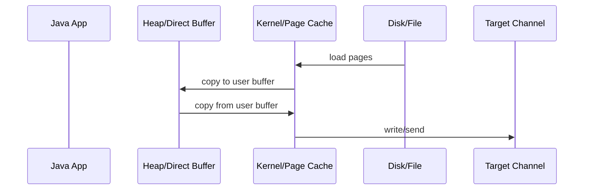
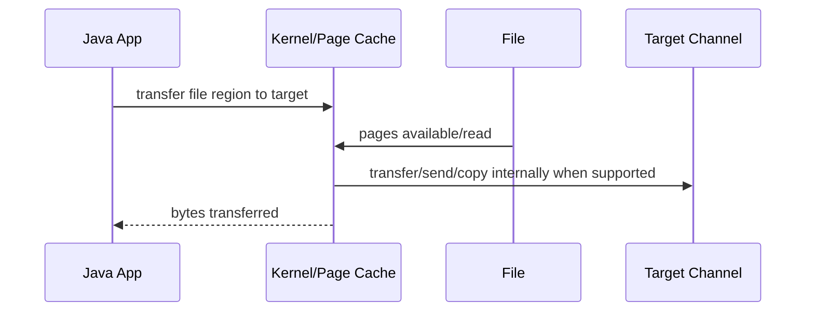
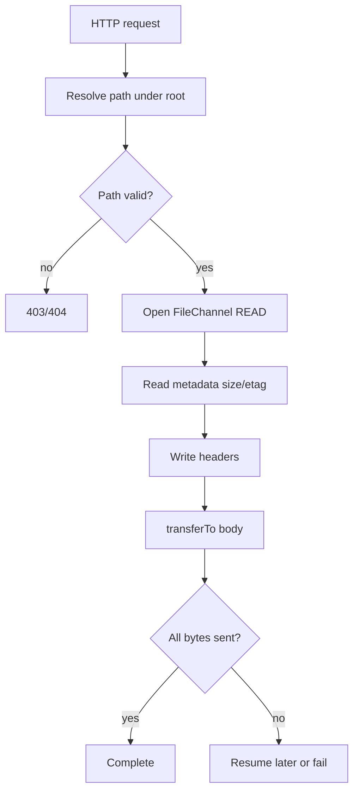

------
title: Learn Java IO, Modern IO, Streams, Buffers, Resources, Serialization & Data Boundaries - Part 016
description: Production-grade guide to FileChannel transferTo/transferFrom, zero-copy thinking, large file transfer loops, fallback strategies, correctness boundaries, and operational trade-offs.
series: learn-java-io-modern-io-resource-boundaries
seriesTitle: Learn Java IO, Modern IO, Streams, Buffers, Resources, Serialization & Data Boundaries
order: 16
partTitle: Zero-Copy and Large Data Transfer Patterns
tags:
  - java
  - nio
  - filechannel
  - zero-copy
  - transferTo
  - transferFrom
  - large-file-transfer
  - performance
  - io-boundary
  - series
date: 2026-06-30
------

# Part 016 — Zero-Copy and Large Data Transfer Patterns

> Goal part ini: memahami `FileChannel.transferTo` dan `transferFrom` sebagai primitive transfer besar yang bisa dioptimalkan OS, tetapi tetap harus dipakai dengan loop, fallback, dan boundary contract yang benar.

Banyak artikel menyebut `transferTo`/`transferFrom` sebagai “zero-copy”. Itu berguna sebagai shorthand, tetapi berbahaya kalau dianggap guarantee. Dalam engineering yang lebih presisi:

```text
transferTo / transferFrom = API yang memberi kesempatan JVM/OS melakukan transfer lebih efisien, sering dengan mengurangi copy antara user-space dan kernel-space.
```

Namun hasil aktual bergantung pada:

- OS;
- filesystem;
- target channel;
- JVM implementation;
- file size;
- blocking/non-blocking behavior;
- network stack;
- encryption/compression layer;
- provider-specific limitations.

Jadi, part ini tidak mengajarkan “pakai zero-copy pasti cepat”. Kita belajar membuat **large transfer boundary** yang benar.

---

## 1. Mental Model: Copy Loop vs OS-Assisted Transfer

Classic copy loop:



`transferTo`/`transferFrom` target mental model:



The win can come from:

- fewer Java heap allocations;
- fewer user-space copies;
- fewer context transitions;
- better page-cache utilization;
- native sendfile-like mechanisms;
- simpler application loop.

But correctness still belongs to application code.

---

## 2. The `FileChannel` Transfer APIs

Core methods:

```java
long transferTo(long position, long count, WritableByteChannel target)
long transferFrom(ReadableByteChannel src, long position, long count)
```

`transferTo` reads bytes from this file channel at `position` and writes them to `target`.

```java
try (FileChannel source = FileChannel.open(sourcePath, StandardOpenOption.READ);
     FileChannel target = FileChannel.open(
             targetPath,
             StandardOpenOption.CREATE,
             StandardOpenOption.WRITE,
             StandardOpenOption.TRUNCATE_EXISTING)) {

    long transferred = source.transferTo(0, source.size(), target);
}
```

That code is incomplete for production because `transferTo` may transfer fewer bytes than requested.

Correct approach:

```java
static long transferFullyTo(FileChannel source,
                            long position,
                            long count,
                            WritableByteChannel target) throws IOException {
    if (position < 0 || count < 0) {
        throw new IllegalArgumentException("position and count must be non-negative");
    }

    long remaining = count;
    long offset = position;
    long total = 0;

    while (remaining > 0) {
        long n = source.transferTo(offset, remaining, target);
        if (n == 0) {
            // Avoid infinite loops. The caller can choose stronger policies for non-blocking targets.
            if (offset >= source.size()) {
                break;
            }
            Thread.onSpinWait();
            continue;
        }
        offset += n;
        remaining -= n;
        total += n;
    }
    return total;
}
```

For file-to-file copy with expected exact size:

```java
static void copyFileRegion(FileChannel source,
                           FileChannel target,
                           long position,
                           long count) throws IOException {
    long copied = transferFullyTo(source, position, count, target);
    if (copied != count) {
        throw new EOFException("Expected " + count + " bytes, copied " + copied);
    }
}
```

---

## 3. Why `transferTo` Can Be Partial

Even with blocking file channels, a transfer method can return before all requested bytes are moved.

Reasons include:

- source has fewer bytes than requested;
- OS-level maximum transfer size;
- target channel accepts only part of the data;
- target is non-blocking;
- signal/interruption/provider behavior;
- network backpressure;
- special filesystem/provider constraints;
- platform bugs or conservative implementations.

Therefore:

```text
transferTo return value is progress, not success proof.
```

Never treat it as “done” unless it equals expected count and the expected count itself is valid.

---

## 4. `transferTo` Does Not Replace Boundary Validation

Bad:

```java
source.transferTo(0, source.size(), socket);
```

This says nothing about:

- whether the file is complete;
- whether the file is the expected logical object;
- whether checksum matches;
- whether receiver got full logical payload;
- whether receiver can parse the frame;
- whether connection closed halfway;
- whether file changed during transfer.

Production transfer should have metadata boundary:

```text
before transfer:
    object id
    expected size
    content hash or checksum
    content type/version
    transfer id

during transfer:
    byte progress
    timeout/cancellation
    backpressure handling

after transfer:
    actual bytes == expected size
    receiver commit/ack
    checksum validation if required
```

---

## 5. File-to-File Transfer Pattern

A robust copy to temp file:

```java
static void copyFileAtomically(Path source, Path target) throws IOException {
    Path dir = target.toAbsolutePath().getParent();
    Path temp = Files.createTempFile(dir, target.getFileName().toString(), ".tmp");

    boolean success = false;
    try (FileChannel in = FileChannel.open(source, StandardOpenOption.READ);
         FileChannel out = FileChannel.open(
                 temp,
                 StandardOpenOption.WRITE,
                 StandardOpenOption.TRUNCATE_EXISTING)) {

        long size = in.size();
        copyFileRegion(in, out, 0, size);
        out.force(true);
        success = true;
    } finally {
        if (!success) {
            Files.deleteIfExists(temp);
        }
    }

    Files.move(temp, target,
            StandardCopyOption.REPLACE_EXISTING,
            StandardCopyOption.ATOMIC_MOVE);
}
```

This combines:

- `transferTo` for large data movement;
- full transfer loop;
- temp file;
- force;
- atomic publication.

But there is a subtle issue: if `source` is being modified concurrently, `in.size()` may not represent a stable logical object. For high-integrity copy, require a stable source protocol:

- immutable source file;
- lock protocol;
- staging/committed directory convention;
- manifest with checksum;
- snapshot-capable filesystem/storage layer.

---

## 6. `transferFrom`: Pulling from a Source Channel

`transferFrom` copies bytes from source channel into this file at a given position.

```java
static long transferFullyFrom(FileChannel target,
                              ReadableByteChannel source,
                              long position,
                              long count) throws IOException {
    if (position < 0 || count < 0) {
        throw new IllegalArgumentException("position and count must be non-negative");
    }

    long remaining = count;
    long offset = position;
    long total = 0;

    while (remaining > 0) {
        long n = target.transferFrom(source, offset, remaining);
        if (n == 0) {
            Thread.onSpinWait();
            continue;
        }
        offset += n;
        remaining -= n;
        total += n;
    }
    return total;
}
```

Use cases:

- receiving data from socket into file;
- copying from custom channel to file;
- staging uploaded object;
- importing stream data into segment file.

But if source is an `InputStream` wrapped via `Channels.newChannel`, the optimization may be limited. Still, `transferFrom` can simplify a file-ingestion loop.

---

## 7. Transfer with Unknown Length

Many sources do not have known length. Example: HTTP request body, socket stream, compressed stream.

`transferFrom` requires a `count`. You can choose chunks:

```java
static long transferUnknownLength(ReadableByteChannel source,
                                  FileChannel target,
                                  long startPosition) throws IOException {
    long position = startPosition;
    long total = 0;
    long chunk = 64L * 1024L * 1024L;

    while (true) {
        long n = target.transferFrom(source, position, chunk);
        if (n == 0) {
            // Ambiguous: source may be temporarily unavailable, or EOF-like for some channel types.
            // For wrapped blocking streams, fallback read can disambiguate.
            break;
        }
        position += n;
        total += n;
    }
    return total;
}
```

However, unknown-length transfer is tricky because `0` is ambiguous for some channel types. A manual buffer loop often gives clearer EOF behavior:

```java
static long copyUnknownLength(ReadableByteChannel source,
                              FileChannel target,
                              long startPosition) throws IOException {
    ByteBuffer buffer = ByteBuffer.allocateDirect(64 * 1024);
    long position = startPosition;
    long total = 0;

    while (true) {
        buffer.clear();
        int n = source.read(buffer);
        if (n == -1) {
            return total;
        }
        if (n == 0) {
            Thread.onSpinWait();
            continue;
        }
        buffer.flip();
        while (buffer.hasRemaining()) {
            int written = target.write(buffer, position);
            position += written;
            total += written;
        }
    }
}
```

**Rule:** `transferTo/From` shines when the source region and count are known. For unknown-length protocol streams, a manual loop can be more explicit and safer.

---

## 8. File-to-Socket Pattern

A common use case is serving a file over a socket channel.

```java
static void sendFile(FileChannel file,
                     WritableByteChannel socket,
                     long offset,
                     long length) throws IOException {
    long sent = transferFullyTo(file, offset, length, socket);
    if (sent != length) {
        throw new EOFException("File ended while sending. expected=" + length + ", sent=" + sent);
    }
}
```

For non-blocking `SocketChannel`, this helper is not enough. If `transferTo` returns `0`, the correct response is often:

- register interest in `OP_WRITE`;
- return to event loop;
- resume later from the same offset.

Non-blocking transfer state:

```java
final class TransferState {
    final FileChannel file;
    final long start;
    final long length;
    long sent;

    TransferState(FileChannel file, long start, long length) {
        this.file = file;
        this.start = start;
        this.length = length;
    }

    boolean complete() {
        return sent >= length;
    }

    long position() {
        return start + sent;
    }

    long remaining() {
        return length - sent;
    }
}
```

Progress function:

```java
static void progressTransfer(TransferState state,
                             WritableByteChannel target) throws IOException {
    if (state.complete()) {
        return;
    }
    long n = state.file.transferTo(state.position(), state.remaining(), target);
    if (n > 0) {
        state.sent += n;
    }
}
```

The event loop decides when to call it again.

---

## 9. Zero-Copy Is Not Compatible with Every Transformation

If data must be transformed in user space, zero-copy usually disappears.

Examples:

| Requirement | Effect |
|---|---|
| Encrypt application payload manually | Need read into app memory |
| Compress on the fly | Need transformation buffer |
| Convert charset | Need decode/encode |
| Calculate hash while sending | Need read bytes unless using separate file scan or OS support |
| Redact data | Need inspect/modify content |
| Frame with custom protocol headers | Can gather header + transfer body in some designs |
| TLS via ordinary Java stack | May prevent direct kernel sendfile-style transfer |

Design pattern:

```text
static file body: transferTo candidate
small dynamic header: gather/write separately
dynamic transformed body: manual pipeline
```

Example: send header manually, then transfer body:

```java
static void sendFramedFile(FileChannel file,
                           WritableByteChannel target,
                           long offset,
                           long length) throws IOException {
    ByteBuffer header = ByteBuffer.allocate(16);
    header.putInt(0xCAFE_BABE);
    header.putInt(1);
    header.putLong(length);
    header.flip();

    while (header.hasRemaining()) {
        target.write(header);
    }

    long sent = transferFullyTo(file, offset, length, target);
    if (sent != length) {
        throw new EOFException("Incomplete file body transfer");
    }
}
```

---

## 10. Transfer Boundaries and File Mutation

A transfer region is defined by:

```text
source file identity
start offset
byte count
expected content
```

If file changes during transfer, several things can go wrong:

- size changes after initial `size()`;
- content changes in already-sent region;
- content changes in not-yet-sent region;
- file replaced while channel remains open;
- target receives mixed logical versions.

Production approaches:

### Approach A — Immutable committed files

```text
incoming/tmp/abc.tmp  -> write complete
incoming/tmp/abc.tmp  -> force
incoming/tmp/abc.tmp  -> atomic move to committed/abc.dat
committed/abc.dat     -> never modified
```

Best for ingestion and object storage.

### Approach B — Manifest with hash

```text
file: object.dat
manifest: object.dat.manifest { size, sha256, version }
```

Receiver validates after transfer.

### Approach C — Lock protocol

Use when all writers/readers are cooperative. Less robust than immutable files.

### Approach D — Snapshot

Use filesystem/storage snapshot if available. Java API alone does not create storage snapshot semantics.

---

## 11. Fallback Strategy: `transferTo` then Manual Copy

A robust library can attempt transfer and fallback if no progress occurs.

```java
static long transferWithFallback(FileChannel source,
                                 long position,
                                 long count,
                                 WritableByteChannel target) throws IOException {
    long offset = position;
    long remaining = count;
    long total = 0;
    int zeroProgress = 0;

    while (remaining > 0) {
        long n = source.transferTo(offset, remaining, target);
        if (n > 0) {
            offset += n;
            remaining -= n;
            total += n;
            zeroProgress = 0;
            continue;
        }

        zeroProgress++;
        if (zeroProgress >= 3) {
            long copied = manualCopyRegion(source, offset, remaining, target);
            total += copied;
            return total;
        }

        Thread.onSpinWait();
    }

    return total;
}
```

Manual region copy:

```java
static long manualCopyRegion(FileChannel source,
                             long position,
                             long count,
                             WritableByteChannel target) throws IOException {
    ByteBuffer buffer = ByteBuffer.allocateDirect(64 * 1024);
    long offset = position;
    long remaining = count;
    long total = 0;

    while (remaining > 0) {
        buffer.clear();
        int max = (int) Math.min(buffer.capacity(), remaining);
        buffer.limit(max);

        int read = source.read(buffer, offset);
        if (read == -1) {
            break;
        }
        if (read == 0) {
            Thread.onSpinWait();
            continue;
        }

        offset += read;
        remaining -= read;
        buffer.flip();

        while (buffer.hasRemaining()) {
            int written = target.write(buffer);
            if (written == 0) {
                Thread.onSpinWait();
            }
        }
        total += read;
    }

    return total;
}
```

This fallback is not always appropriate for event-loop non-blocking channels, but it is useful in blocking file-to-file or file-to-stream utilities.

---

## 12. Progress, Cancellation, and Timeouts

Large transfers need operational controls.

```java
interface TransferListener {
    void onProgress(long transferred, long total);
}
```

```java
static long transferWithProgress(FileChannel source,
                                 long position,
                                 long count,
                                 WritableByteChannel target,
                                 TransferListener listener,
                                 BooleanSupplier cancelled) throws IOException {
    long offset = position;
    long remaining = count;
    long total = 0;

    while (remaining > 0) {
        if (cancelled.getAsBoolean()) {
            throw new InterruptedIOException("Transfer cancelled after " + total + " bytes");
        }

        long n = source.transferTo(offset, remaining, target);
        if (n == 0) {
            Thread.onSpinWait();
            continue;
        }

        offset += n;
        remaining -= n;
        total += n;
        listener.onProgress(total, count);
    }

    return total;
}
```

Timeout policy should be based on **no-progress duration**, not just wall-clock duration, for large transfers:

```text
if bytes are moving slowly but consistently -> maybe okay
if no bytes moved for N seconds -> likely stuck/backpressured/dead peer
```

---

## 13. Resumable Transfer Design

A resumable transfer must persist progress at a logical boundary.

Bad:

```text
client says "resume from byte 123456"
server blindly starts there
```

Better:

```text
transferId
source object id
source version/hash
expected size
offset already committed by receiver
range checksum or final checksum
```

Java-side state:

```java
record TransferCheckpoint(
        String transferId,
        String objectId,
        long expectedSize,
        long committedOffset,
        String expectedSha256) {
}
```

Resume validation:

```java
static void validateResume(TransferCheckpoint cp, long sourceSize, String sourceHash) {
    if (cp.expectedSize() != sourceSize) {
        throw new IllegalStateException("Source size changed");
    }
    if (!cp.expectedSha256().equals(sourceHash)) {
        throw new IllegalStateException("Source hash changed");
    }
}
```

Then transfer region:

```java
long remaining = cp.expectedSize() - cp.committedOffset();
transferFullyTo(source, cp.committedOffset(), remaining, target);
```

---

## 14. Large File Edge Cases

### Edge Case 1 — `int` overflow

Never cast file size to `int`:

```java
int size = (int) channel.size(); // wrong for large files
```

Use `long` for offsets and sizes.

### Edge Case 2 — count larger than actual remaining file

```java
long size = channel.size();
if (position > size) {
    throw new EOFException("position beyond EOF");
}
long available = size - position;
long count = Math.min(requested, available);
```

### Edge Case 3 — file grows during transfer

If you use `source.size()` once, you transfer snapshot-by-size, not necessarily snapshot-by-content.

### Edge Case 4 — target already has content

Opening with `CREATE` and `WRITE` does not necessarily truncate. Choose explicitly:

```java
StandardOpenOption.TRUNCATE_EXISTING
```

or position explicitly and validate overwrite semantics.

### Edge Case 5 — sparse file

Copying sparse files with Java channel transfer may not preserve sparseness. If sparseness matters, filesystem-specific tooling may be required.

---

## 15. Performance Model

`transferTo`/`transferFrom` can improve performance, but measurement matters.

Potential improvements:

- lower CPU per GB;
- fewer allocations;
- less GC pressure;
- higher throughput for static file serving;
- reduced data copies.

Potential non-improvements:

- encrypted/compressed streams;
- small files dominated by open/close latency;
- network bottleneck;
- slow disk;
- target channel not optimized;
- extra validation pass still required;
- cloud/network filesystem behavior.

### Benchmark caution

Bad benchmark:

```text
copy same file repeatedly on warm page cache
measure wall time only
ignore CPU, allocation, GC, disk cache, target speed
```

Better benchmark dimensions:

- cold vs warm page cache;
- file size distribution;
- direct buffer fallback;
- CPU usage;
- allocation rate;
- p50/p95/p99 latency;
- throughput under concurrency;
- cancellation behavior;
- network backpressure;
- correctness validation cost.

---

## 16. Case Study: Static File Response Engine

Simplified design:

```text
Request
  ↓
Resolve safe path
  ↓
Open immutable committed file
  ↓
Validate metadata: size, etag/hash, content type
  ↓
Write response headers
  ↓
Transfer file region
  ↓
Close channel
```

Mermaid:



Pseudo-code:

```java
static void serveStaticFile(Path root,
                            String requestPath,
                            WritableByteChannel client) throws IOException {
    Path resolved = root.resolve(requestPath).normalize();
    if (!resolved.startsWith(root)) {
        throw new AccessDeniedException(requestPath);
    }

    try (FileChannel file = FileChannel.open(resolved, StandardOpenOption.READ)) {
        long size = file.size();

        ByteBuffer headers = StandardCharsets.US_ASCII.encode(
                "HTTP/1.1 200 OK\r\n" +
                "Content-Length: " + size + "\r\n" +
                "Content-Type: application/octet-stream\r\n" +
                "\r\n");

        while (headers.hasRemaining()) {
            client.write(headers);
        }

        long sent = transferFullyTo(file, 0, size, client);
        if (sent != size) {
            throw new EOFException("Incomplete response body");
        }
    }
}
```

Production version would need better HTTP compliance, MIME rules, range requests, non-blocking state, cancellation, and security checks. The IO lesson is the boundary separation:

```text
metadata/header = small explicit buffer
body = large file region transfer
```

---

## 17. Case Study: Local Artifact Publisher

Goal: publish a large artifact file safely.

Protocol:

1. Copy source to temp file using transfer loop.
2. Validate byte count.
3. Optionally validate hash.
4. Force temp file.
5. Atomic move into published directory.
6. Optionally force parent directory where supported/needed.

```java
static void publishArtifact(Path source, Path published) throws IOException {
    Path dir = published.toAbsolutePath().getParent();
    Path temp = Files.createTempFile(dir, published.getFileName() + ".", ".tmp");

    boolean complete = false;
    try {
        try (FileChannel in = FileChannel.open(source, StandardOpenOption.READ);
             FileChannel out = FileChannel.open(temp, StandardOpenOption.WRITE)) {
            long size = in.size();
            long copied = transferWithFallback(in, 0, size, out);
            if (copied != size) {
                throw new EOFException("Incomplete artifact copy");
            }
            out.force(true);
        }

        Files.move(temp, published,
                StandardCopyOption.ATOMIC_MOVE,
                StandardCopyOption.REPLACE_EXISTING);
        complete = true;
    } finally {
        if (!complete) {
            Files.deleteIfExists(temp);
        }
    }
}
```

The key point: `transferTo` is only the data movement primitive. Publication correctness comes from the surrounding file protocol.

---

## 18. When Not to Use `transferTo` / `transferFrom`

Avoid or reconsider when:

- payload is small and code simplicity matters more;
- data must be transformed byte-by-byte;
- you need per-record validation during transfer;
- source is not a file region;
- non-blocking event-loop complexity is not handled;
- target has strict framing that requires interleaving data and control messages;
- fallback path is not tested;
- you need portable preservation of sparse-file holes or special metadata.

A plain buffered loop can be more honest:

```java
static long simpleCopy(InputStream in, OutputStream out) throws IOException {
    byte[] buffer = new byte[64 * 1024];
    long total = 0;
    while (true) {
        int n = in.read(buffer);
        if (n == -1) {
            return total;
        }
        out.write(buffer, 0, n);
        total += n;
    }
}
```

Top engineers do not worship APIs. They choose the primitive that matches the boundary.

---

## 19. Transfer Design Checklist

Before approving large-transfer code:

- Is source region stable?
- Is expected size known?
- Are offsets and counts `long`?
- Is `transferTo/From` looped until done?
- Is zero return handled without infinite busy loop?
- Is non-blocking target handled by state machine, not blocking loop?
- Is partial transfer observable and resumable if needed?
- Is target temp/staging file used before publication?
- Is `force` used if durability is required?
- Is final byte count checked?
- Is checksum/hash needed?
- Is source mutation during transfer prevented or detected?
- Is fallback path tested?
- Are cancellation and timeout semantics defined?
- Is metadata copied separately if needed?
- Is sparse-file behavior relevant?

---

## 20. Practice: Deliberate Exercises

### Exercise 1 — Exact file-to-file copy

Implement:

```java
void copyExact(Path source, Path target)
```

Requirements:

- uses `FileChannel.transferTo`;
- loops for partial transfers;
- writes to temp file;
- checks copied byte count;
- force temp file;
- atomic move;
- deletes temp on failure.

### Exercise 2 — Transfer with progress

Implement:

```java
long transfer(Path source, WritableByteChannel target, TransferListener listener)
```

Requirements:

- reports progress after every successful transfer;
- supports cancellation;
- avoids integer overflow;
- handles zero progress.

### Exercise 3 — Non-blocking transfer state

Design a class:

```java
final class FileSendState {
    boolean progress(SocketChannel channel) throws IOException;
}
```

It should:

- transfer as much as possible;
- return `true` when complete;
- never block waiting for writability;
- preserve offset across calls.

### Exercise 4 — Fallback test

Create a fake `WritableByteChannel` that accepts only N bytes per write. Confirm your transfer loop still completes.

### Exercise 5 — Mutation thought experiment

Write down what happens if source file changes during transfer. Then define a protocol to prevent or detect it.

---

## 21. Key Takeaways

- `transferTo`/`transferFrom` are transfer primitives, not correctness protocols.
- “Zero-copy” is an optimization possibility, not a portable semantic guarantee.
- Always loop because transfer methods can make partial progress.
- Use `long` for sizes and offsets.
- Separate small metadata/header handling from large body transfer.
- Unknown-length streams are often clearer with manual buffer loops.
- Non-blocking transfer requires resumable state, not a blocking while-loop.
- Stable source identity and final validation matter more than raw throughput.
- Production-grade transfer is a protocol: stage, transfer, verify, force, publish.

---

## References

- Oracle Java SE 25 API — `FileChannel`
- Oracle Java SE 25 API — `WritableByteChannel`
- Oracle Java SE 25 API — `ReadableByteChannel`
- Oracle Java SE 25 API — `StandardOpenOption`
- Oracle Java SE 25 API — `StandardCopyOption`
- Oracle Java SE 25 API — `Files`
