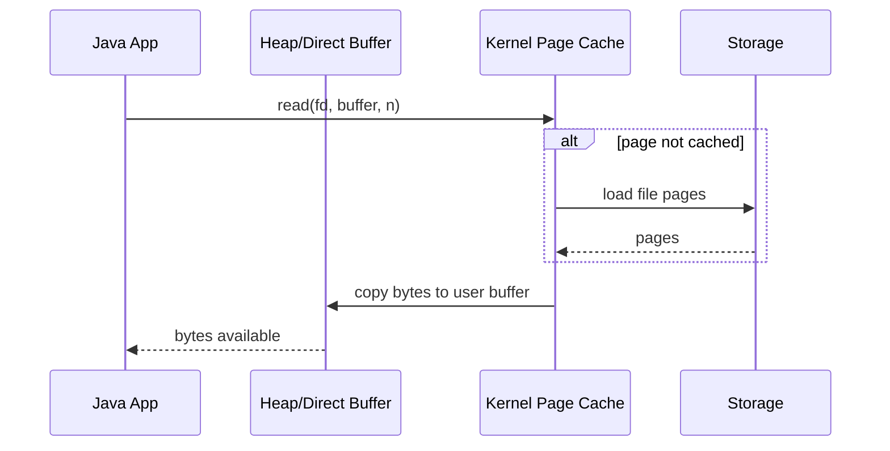
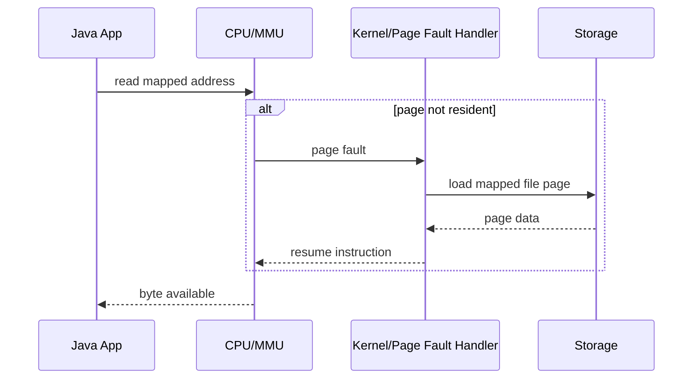
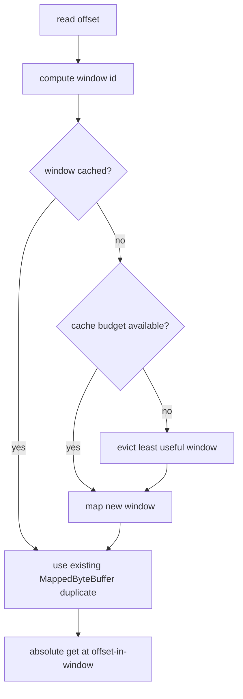
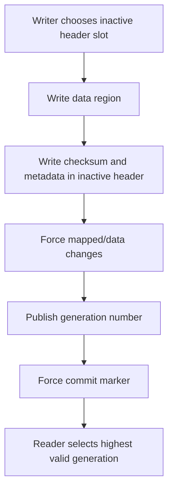
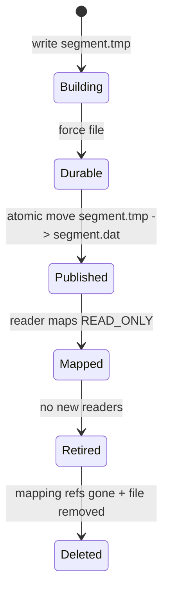
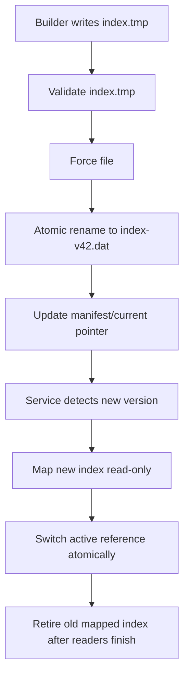

------
title: Learn Java IO, Modern IO, Streams, Buffers, Resources, Serialization & Data Boundaries - Part 017
description: Deep guide to Java memory-mapped files with MappedByteBuffer, FileChannel.map, paging behavior, region design, durability, unmapping lifecycle, correctness risks, and production usage patterns.
series: learn-java-io-modern-io-resource-boundaries
seriesTitle: Learn Java IO, Modern IO, Streams, Buffers, Resources, Serialization & Data Boundaries
order: 17
partTitle: Memory-Mapped Files
tags:
  - java
  - nio
  - mmap
  - mappedbytebuffer
  - filechannel
  - bytebuffer
  - filesystem
  - performance
  - io-boundary
  - series
date: 2026-06-30
------

# Part 017 — Memory-Mapped Files

> Goal part ini: memahami memory-mapped files bukan sebagai “file yang dimasukkan ke memory”, tetapi sebagai **mapping antara region file dan virtual memory process** yang dikendalikan OS page cache. Kita akan membahas kapan mmap sangat kuat, kapan berbahaya, dan bagaimana mendesain boundary-nya secara production-grade.

Memory-mapped IO sering dipromosikan sebagai cara super cepat membaca file besar. Itu tidak salah, tetapi framing-nya kurang presisi. `MappedByteBuffer` bukan array raksasa berisi seluruh file. Ia adalah `ByteBuffer` direct yang content-nya merepresentasikan region file yang dipetakan ke address space process.

Mental model yang lebih benar:

```text
File region <-> OS page cache <-> virtual memory mapping <-> Java MappedByteBuffer view
```

Saat kode Java membaca byte dari `MappedByteBuffer`, CPU mengakses alamat memory. Jika page belum ada di memory, OS menangani page fault, membaca page dari storage, lalu melanjutkan instruksi. Jadi, control flow terlihat seperti akses memory, tetapi failure/performance behavior tetap IO.

---

## 1. Apa yang Sebenarnya Dilakukan `FileChannel.map`

API utama:

```java
try (FileChannel channel = FileChannel.open(path, StandardOpenOption.READ)) {
    MappedByteBuffer mapped = channel.map(FileChannel.MapMode.READ_ONLY, 0, channel.size());
    byte first = mapped.get(0);
}
```

`FileChannel.map` membuat mapping untuk region file tertentu:

```text
map(mode, position, size)
```

- `mode`: jenis akses mapping.
- `position`: offset awal di file.
- `size`: panjang region yang dimapping.

Important distinction:

```text
Membuka FileChannel != membaca file
Mapping file != memuat seluruh file ke RAM
Mengakses mapped byte != selalu bebas IO
```

Mapping hanyalah membuat relasi antara address range process dan file region. Loading page dilakukan lazily oleh OS, kecuali kamu secara eksplisit melakukan pre-load dengan `load()` atau OS melakukan read-ahead.

---

## 2. Mental Model: Regular Read vs Memory-Mapped Read

### 2.1 Regular buffered/channel read



### 2.2 Memory-mapped read



The important difference:

- regular read makes IO visible at method call boundary;
- mmap can make IO happen at memory access boundary.

That can make code elegant and fast. It can also make failure modes more surprising.

---

## 3. When Memory Mapping Helps

Memory mapping is useful when at least one of these is true:

1. You need random access over a large file.
2. You scan the same file repeatedly.
3. You need many small reads at arbitrary offsets.
4. You want to avoid copying file content into Java heap.
5. You need a file-backed structure such as index, segment, cache, or immutable data table.
6. You can tolerate OS/page-cache behavior being part of your performance model.

Typical examples:

- read-only search index segment;
- append-only log segment reader;
- immutable lookup table;
- binary data file with offset index;
- large file parser with random jumps;
- memory-efficient checksum calculation;
- high-throughput local file serving where file content is stable.

Memory mapping is **not automatically better** for:

- one-pass streaming of small files;
- request-scoped parsing of tiny uploads;
- data that must be transformed/decompressed/decrypted before use;
- code that needs deterministic release of file handles on every platform;
- write-heavy mutable structures without careful crash protocol.

---

## 4. Map Modes

`FileChannel.MapMode` provides access modes.

Common modes:

| Mode | Meaning | Typical Use |
|---|---|---|
| `READ_ONLY` | mapped content cannot be modified through the buffer | immutable file scanning, indexes, static resources |
| `READ_WRITE` | writes to buffer may update the file | file-backed structures, local persistence primitives |
| `PRIVATE` | copy-on-write mapping; modifications are private to process | speculative edits, sandboxed inspection |
|

Example:

```java
try (FileChannel channel = FileChannel.open(
        path,
        StandardOpenOption.READ,
        StandardOpenOption.WRITE)) {

    MappedByteBuffer mapped = channel.map(
            FileChannel.MapMode.READ_WRITE,
            0,
            channel.size());

    mapped.putInt(0, 0xCAFE_BABE);
    mapped.force();
}
```

Important:

```text
READ_WRITE mapping gives you a mutable view. It does not give you a transaction, a lock, a schema, or crash consistency by itself.
```

---

## 5. `MappedByteBuffer` Is Still a `ByteBuffer`

`MappedByteBuffer` extends `ByteBuffer`, so all Part 013 concepts still apply:

- `position`
- `limit`
- `capacity`
- relative reads/writes
- absolute reads/writes
- `slice`
- `duplicate`
- byte order
- view buffers

Example:

```java
static int readMagic(Path path) throws IOException {
    try (FileChannel channel = FileChannel.open(path, StandardOpenOption.READ)) {
        if (channel.size() < Integer.BYTES) {
            throw new EOFException("File too small for magic");
        }

        MappedByteBuffer mapped = channel.map(FileChannel.MapMode.READ_ONLY, 0, Integer.BYTES);
        mapped.order(ByteOrder.BIG_ENDIAN);
        return mapped.getInt(0);
    }
}
```

Prefer absolute reads for structured random access:

```java
int version = mapped.getInt(4);
long indexOffset = mapped.getLong(8);
```

Prefer relative reads for sequential parsing:

```java
int magic = mapped.getInt();
int version = mapped.getInt();
long recordCount = mapped.getLong();
```

Do not mix relative and absolute access carelessly. Relative reads mutate `position`; absolute reads do not.

---

## 6. Large Files: Region Mapping Strategy

A single `MappedByteBuffer` uses `int` indexing because `ByteBuffer` capacity is `int`-bounded. That means one buffer cannot naturally model arbitrary multi-terabyte files.

For large files, think in **windows**:

```text
file = window[0] + window[1] + window[2] + ...
```

Example fixed-size window mapping:

```java
final class MappedFileWindows implements AutoCloseable {
    private static final long WINDOW_SIZE = 256L * 1024 * 1024; // 256 MiB

    private final FileChannel channel;
    private final long size;

    MappedFileWindows(Path path) throws IOException {
        this.channel = FileChannel.open(path, StandardOpenOption.READ);
        this.size = channel.size();
    }

    byte get(long fileOffset) throws IOException {
        if (fileOffset < 0 || fileOffset >= size) {
            throw new IndexOutOfBoundsException("offset=" + fileOffset + ", size=" + size);
        }

        long windowStart = (fileOffset / WINDOW_SIZE) * WINDOW_SIZE;
        long offsetInWindow = fileOffset - windowStart;
        long remaining = size - windowStart;
        long windowLength = Math.min(WINDOW_SIZE, remaining);

        MappedByteBuffer window = channel.map(
                FileChannel.MapMode.READ_ONLY,
                windowStart,
                windowLength);

        return window.get(Math.toIntExact(offsetInWindow));
    }

    @Override
    public void close() throws IOException {
        channel.close();
    }
}
```

This example is intentionally simple. A production implementation would cache windows, bound total mapped memory, and avoid remapping on every byte access.

---

## 7. Window Cache Pattern

A mapped window cache is useful when file access has locality.



Key design choices:

- window size;
- max mapped windows;
- eviction policy;
- thread safety;
- duplicated/sliced views per reader;
- prefetch behavior;
- failure behavior when file shrinks or changes.

A minimal cached variant:

```java
final class MappedWindowCache implements AutoCloseable {
    private final FileChannel channel;
    private final long fileSize;
    private final long windowSize;
    private final int maxWindows;

    private final LinkedHashMap<Long, MappedByteBuffer> cache;

    MappedWindowCache(Path path, long windowSize, int maxWindows) throws IOException {
        if (windowSize <= 0 || windowSize > Integer.MAX_VALUE) {
            throw new IllegalArgumentException("invalid window size: " + windowSize);
        }
        if (maxWindows <= 0) {
            throw new IllegalArgumentException("maxWindows must be positive");
        }

        this.channel = FileChannel.open(path, StandardOpenOption.READ);
        this.fileSize = channel.size();
        this.windowSize = windowSize;
        this.maxWindows = maxWindows;
        this.cache = new LinkedHashMap<>(16, 0.75f, true) {
            @Override
            protected boolean removeEldestEntry(Map.Entry<Long, MappedByteBuffer> eldest) {
                return size() > MappedWindowCache.this.maxWindows;
            }
        };
    }

    synchronized byte get(long offset) throws IOException {
        if (offset < 0 || offset >= fileSize) {
            throw new IndexOutOfBoundsException("offset=" + offset + ", size=" + fileSize);
        }

        long windowId = offset / windowSize;
        long windowStart = windowId * windowSize;
        int index = Math.toIntExact(offset - windowStart);

        MappedByteBuffer window = cache.get(windowId);
        if (window == null) {
            long length = Math.min(windowSize, fileSize - windowStart);
            window = channel.map(FileChannel.MapMode.READ_ONLY, windowStart, length);
            cache.put(windowId, window);
        }

        return window.get(index);
    }

    @Override
    public synchronized void close() throws IOException {
        cache.clear();
        channel.close();
    }
}
```

Note the limitation: clearing the cache releases references, but actual unmapping is still not a deterministic public operation on `MappedByteBuffer` itself. We discuss that next.

---

## 8. Lifecycle and Unmapping

This is the most important production caveat.

`MappedByteBuffer` represents a mapping that remains valid while the buffer is reachable. Java historically did not expose a simple public `unmap()` method on `MappedByteBuffer`.

That means:

```text
close FileChannel != necessarily unmap buffer
clear reference != immediately unmap buffer
GC timing != deterministic resource release contract
```

Practical consequences:

- on some platforms, mapped files can be difficult to delete or replace while still mapped;
- long-lived references to slices/duplicates can keep mappings alive;
- frequent map/unmap cycles can create native resource pressure;
- resource lifecycle is less explicit than `InputStream`/`FileChannel` close.

Bad pattern:

```java
static ByteBuffer readHeader(Path path) throws IOException {
    try (FileChannel channel = FileChannel.open(path, StandardOpenOption.READ)) {
        MappedByteBuffer mapped = channel.map(FileChannel.MapMode.READ_ONLY, 0, 4096);
        return mapped.slice(0, 64); // slice can retain mapping lifetime
    }
}
```

Why problematic:

- caller receives what looks like a small buffer;
- the small slice may retain the backing mapped region;
- caller might keep it for a long time;
- file mapping lifetime becomes hidden.

Better pattern:

```java
static byte[] readHeaderCopy(Path path) throws IOException {
    try (FileChannel channel = FileChannel.open(path, StandardOpenOption.READ)) {
        MappedByteBuffer mapped = channel.map(FileChannel.MapMode.READ_ONLY, 0, Math.min(4096, channel.size()));
        byte[] header = new byte[Math.min(64, mapped.remaining())];
        mapped.get(header);
        return header;
    }
}
```

If you expose mapped buffers, document that the returned object owns or extends a file mapping lifecycle.

---

## 9. `load`, `isLoaded`, and `force`

`MappedByteBuffer` adds mapping-specific methods:

- `load()`
- `isLoaded()`
- `force()`
- `force(int index, int length)`

### 9.1 `load()`

`load()` attempts to load mapped content into physical memory.

Do not interpret it as a hard guarantee that every byte remains resident:

```java
mapped.load();
```

Useful when:

- warming a read-only index before traffic;
- reducing first-query latency;
- preparing a known hot region.

Dangerous when:

- mapping huge files;
- causing memory pressure;
- competing with other services on the same host;
- hiding startup latency in a “warmup” phase that can still fail under load.

### 9.2 `isLoaded()`

`isLoaded()` is a hint-like status check. Do not build correctness on it.

```java
if (!mapped.isLoaded()) {
    mapped.load();
}
```

This is performance logic, not correctness logic.

### 9.3 `force()`

`force()` requests that changes made to the mapped buffer be written to the storage device.

```java
mapped.putLong(0, sequenceNumber);
mapped.force();
```

But `force()` is not a transaction. It does not make a multi-field update atomic. It does not solve torn writes. It does not define recovery logic.

---

## 10. Memory-Mapped Writes Are Not a Database

Consider this format:

```text
offset 0: magic
offset 4: version
offset 8: recordCount
offset 16: indexOffset
offset 24: dataOffset
```

If code writes fields one by one:

```java
mapped.putInt(0, MAGIC);
mapped.putInt(4, VERSION);
mapped.putLong(8, recordCount);
mapped.putLong(16, indexOffset);
mapped.putLong(24, dataOffset);
mapped.force();
```

A crash may leave:

- old magic with new record count;
- new index offset with old data;
- partially written field;
- forced data but not forced metadata;
- data visible to readers before commit flag is stable.

For writeable mmap, you still need file-format protocol:

```text
write inactive region
write checksum
force data
publish commit marker
force commit marker
recover by validating commit marker + checksum
```

Example commit marker layout:

```text
Header A
Header B
Data pages
```



A simple commit header:

```java
record Header(long generation, long dataOffset, long dataLength, int crc32) {
}
```

Recovery rule:

```text
Choose highest generation whose magic/version/length/checksum are valid.
Ignore incomplete or corrupt generation.
```

---

## 11. File Size and Mapping Boundaries

A mapping has a fixed size. If the file grows, the mapping does not automatically grow. If the file shrinks while mapped, behavior can become platform-dependent and may lead to runtime errors when accessing invalid pages.

Design rules:

- treat mapped immutable files as immutable;
- do not truncate a file while another component maps it;
- for append-only files, map windows only over known committed ranges;
- use a manifest or length field to separate physical file size from logical committed size;
- remap explicitly when file size changes.

Bad pattern:

```java
MappedByteBuffer mapped = channel.map(MapMode.READ_ONLY, 0, channel.size());
// another process truncates file
byte b = mapped.get(largeOffset); // surprise failure risk
```

Better protocol:

```text
writer writes segment-N.tmp
writer fsyncs file
writer atomically renames to segment-N.dat
reader maps segment-N.dat as immutable
segment files are never modified in place
```

---

## 12. Mapping Immutable Segment Files

Memory mapping shines with immutable segment files.

Example segment lifecycle:



Benefits:

- readers do not coordinate with active writers;
- file size is stable;
- mapping can be read-only;
- crash recovery is easier;
- segment deletion can be delayed until readers release.

This is common in systems that use log-structured or segment-based design.

---

## 13. Random Access Binary Parser with mmap

Suppose we have a binary file:

```text
0      4      magic
4      4      version
8      8      recordCount
16     8      indexOffset
24     ...    payload
```

Parser:

```java
final class MappedRecordFile implements AutoCloseable {
    private static final int MAGIC = 0x52454346; // "RECF"

    private final FileChannel channel;
    private final MappedByteBuffer buffer;
    private final long recordCount;
    private final long indexOffset;

    MappedRecordFile(Path path) throws IOException {
        this.channel = FileChannel.open(path, StandardOpenOption.READ);
        long size = channel.size();
        if (size < 24) {
            throw new EOFException("file too small: " + size);
        }

        this.buffer = channel.map(FileChannel.MapMode.READ_ONLY, 0, size);
        this.buffer.order(ByteOrder.BIG_ENDIAN);

        int magic = buffer.getInt(0);
        if (magic != MAGIC) {
            throw new IOException("invalid magic: 0x" + Integer.toHexString(magic));
        }

        int version = buffer.getInt(4);
        if (version != 1) {
            throw new IOException("unsupported version: " + version);
        }

        this.recordCount = buffer.getLong(8);
        this.indexOffset = buffer.getLong(16);

        validate(size);
    }

    private void validate(long fileSize) throws IOException {
        if (recordCount < 0) {
            throw new IOException("negative record count");
        }
        if (indexOffset < 24 || indexOffset >= fileSize) {
            throw new IOException("invalid index offset: " + indexOffset);
        }
        long indexBytes = Math.multiplyExact(recordCount, Long.BYTES);
        long indexEnd = Math.addExact(indexOffset, indexBytes);
        if (indexEnd > fileSize) {
            throw new EOFException("index exceeds file size");
        }
    }

    ByteBuffer readRecord(long id) throws IOException {
        if (id < 0 || id >= recordCount) {
            throw new IndexOutOfBoundsException("id=" + id);
        }

        int offsetOfIndexEntry = Math.toIntExact(indexOffset + id * Long.BYTES);
        long recordOffset = buffer.getLong(offsetOfIndexEntry);
        if (recordOffset < 24 || recordOffset + Integer.BYTES > buffer.capacity()) {
            throw new IOException("invalid record offset: " + recordOffset);
        }

        int base = Math.toIntExact(recordOffset);
        int length = buffer.getInt(base);
        if (length < 0 || recordOffset + Integer.BYTES + length > buffer.capacity()) {
            throw new IOException("invalid record length: " + length);
        }

        return buffer.asReadOnlyBuffer()
                .position(base + Integer.BYTES)
                .limit(base + Integer.BYTES + length)
                .slice();
    }

    @Override
    public void close() throws IOException {
        channel.close();
    }
}
```

Key takeaways:

- validate all offsets before using them;
- use `Math.addExact` / `multiplyExact` to catch overflow;
- distinguish physical file size from logical format bounds;
- expose read-only slices if caller must not mutate data;
- document slice lifetime.

---

## 14. mmap and Concurrency

A `MappedByteBuffer` object is not magically thread-safe as a mutable buffer object. Its content is shared memory. Its `position`/`limit` state is mutable object state.

Read-only pattern:

```java
ByteBuffer perThreadView = sharedMappedBuffer.asReadOnlyBuffer();
byte b = perThreadView.get(offset);
```

For concurrent readers:

- use absolute reads where possible;
- create duplicate/read-only views per thread;
- avoid sharing mutable `position`;
- treat underlying file as immutable.

For concurrent writers:

- define memory visibility rules;
- define atomic field update expectations;
- define commit protocol;
- use locks or external coordination when needed;
- assume multi-byte writes are not a full transaction;
- validate on read.

This series already has a dedicated concurrency track, so here the IO-specific invariant is:

```text
Never confuse shared mapped bytes with a synchronized data structure.
```

---

## 15. mmap and Page Cache

Memory mapping uses the OS page cache. That has several consequences.

### 15.1 Good consequences

- repeated reads can be served from memory;
- random reads can avoid repeated copy into heap;
- OS can perform readahead;
- multiple processes can share cached file pages;
- Java heap stays smaller.

### 15.2 Bad consequences

- page faults can appear as latency spikes;
- page cache competes with other processes;
- memory use may not show as Java heap;
- container memory limits can interact badly with page cache pressure;
- performance depends on OS and storage behavior.

Operationally, mmap-heavy services need host-level metrics, not only JVM heap metrics.

Watch:

- RSS;
- major/minor page faults;
- IO wait;
- page cache pressure;
- direct/native memory;
- file descriptor count;
- mapped region count;
- container memory limit events.

---

## 16. mmap vs Direct Buffer vs Heap Buffer

| Approach | Best For | Weakness |
|---|---|---|
| Heap byte array | small data, normal parsing, request-scope payload | GC pressure for large files; extra copy from kernel |
| Direct `ByteBuffer` | native IO boundary, reusable large buffers | allocation cost; native memory lifecycle |
| `MappedByteBuffer` | file-backed random access, immutable segments | unmapping lifecycle; page fault latency; file mutation hazards |
| `MemorySegment.mapFile` | explicit scoped mapping with modern FFM model | newer API, different programming model |

Selection heuristic:

```text
Small one-shot file?                      Files.readAllBytes or buffered stream.
Large sequential file?                    FileChannel + direct/heap buffer or transferTo.
Large random-access immutable file?       MappedByteBuffer or MemorySegment mapping.
Long-lived file-backed data structure?    mmap with explicit format and recovery protocol.
Need explicit lifecycle bounds?           Consider MemorySegment + Arena.
```

---

## 17. mmap Anti-Patterns

### 17.1 Mapping every request upload

```java
MappedByteBuffer mapped = channel.map(READ_ONLY, 0, channel.size());
```

If uploads are small and read once, this adds complexity with little benefit.

### 17.2 Returning slices without lifecycle docs

```java
return mapped.slice(offset, length);
```

This leaks mapping lifetime across API boundaries.

### 17.3 Mutable mmap with no recovery story

```java
mapped.putLong(STATUS_OFFSET, DONE);
mapped.force();
```

What happens if crash occurs between related fields?

### 17.4 Assuming `force()` equals “safe”

`force()` helps durability. It does not define atomicity or validation.

### 17.5 Mapping untrusted file structure without bounds checks

Every offset and length read from the file is untrusted until validated.

---

## 18. Design Pattern: Immutable Mapped Index

Use case:

```text
Service loads a read-only local index at startup. Index is rebuilt separately and published atomically.
```

Design:



Reader holder:

```java
final class ActiveIndex implements AutoCloseable {
    private final MappedRecordFile recordFile;
    private final AtomicInteger readers = new AtomicInteger();
    private volatile boolean closed;

    ActiveIndex(Path path) throws IOException {
        this.recordFile = new MappedRecordFile(path);
    }

    <T> T withReader(CheckedFunction<MappedRecordFile, T> fn) throws Exception {
        if (closed) {
            throw new IllegalStateException("index closed");
        }
        readers.incrementAndGet();
        try {
            if (closed) {
                throw new IllegalStateException("index closed");
            }
            return fn.apply(recordFile);
        } finally {
            readers.decrementAndGet();
        }
    }

    @Override
    public void close() throws IOException {
        closed = true;
        recordFile.close();
    }

    interface CheckedFunction<T, R> {
        R apply(T value) throws Exception;
    }
}
```

This example is not a full RCU implementation, but it shows the key concept: mapped data lifetime must be managed at application level.

---

## 19. Design Pattern: Append-Only Segment Reader

For append-only files, do not map uncommitted tail blindly.

Better:

```text
writer appends records
writer publishes committedLength separately
reader maps only [0, committedLength)
reader remaps when committedLength increases significantly
```

Record format:

```text
[length:int][payload:bytes][crc:int]
```

Reader validation:

```java
static int validateRecord(ByteBuffer buffer, int offset, int fileLimit) throws IOException {
    if (offset + Integer.BYTES > fileLimit) {
        throw new EOFException("missing length");
    }

    int length = buffer.getInt(offset);
    if (length < 0) {
        throw new IOException("negative length: " + length);
    }

    long end = (long) offset + Integer.BYTES + length + Integer.BYTES;
    if (end > fileLimit) {
        throw new EOFException("record exceeds committed limit");
    }

    int expectedCrc = buffer.getInt((int) end - Integer.BYTES);
    CRC32 crc = new CRC32();
    ByteBuffer payload = buffer.asReadOnlyBuffer()
            .position(offset + Integer.BYTES)
            .limit(offset + Integer.BYTES + length)
            .slice();

    while (payload.hasRemaining()) {
        crc.update(payload.get() & 0xff);
    }

    if ((int) crc.getValue() != expectedCrc) {
        throw new IOException("crc mismatch at offset " + offset);
    }

    return Math.toIntExact(end);
}
```

This is intentionally conservative. It treats the file as a hostile boundary even if the writer is “our own service”.

---

## 20. mmap and File Locks

File locks and mmap solve different problems.

- File lock: coordination signal between cooperating processes.
- mmap: memory view over file region.

A lock does not automatically make mapped writes transactional. A mapping does not automatically acquire a lock. Some OS/filesystem behaviors vary.

Use locks only when:

- multiple independent processes modify the same file;
- all writers cooperate;
- fallback behavior is defined;
- failure cleanup is defined.

For most production designs, prefer immutable file publication over mutable shared mmap.

---

## 21. mmap and Error Handling

Potential errors include:

- file not found;
- permission denied;
- mapping too large;
- invalid map offset/size;
- file truncated while mapped;
- storage error surfaced during page fault;
- SIGBUS-like platform-level failure surfaced as JVM error/exception behavior;
- out-of-memory/native mapping failure;
- illegal access due to read-only mapping writes.

The operational lesson:

```text
mmap moves some IO failures from explicit read calls to memory access paths.
```

Therefore, isolate mapped access behind a boundary API that can:

- validate format early;
- fail fast on startup;
- expose health state;
- retire bad mappings;
- fall back to previous segment/version;
- avoid request-path surprises where possible.

---

## 22. Production Checklist for mmap

Before using memory-mapped files, answer these:

1. Is the file immutable while mapped?
2. What owns the mapping lifetime?
3. Can mapped buffer or slices escape the lifecycle owner?
4. How large can the mapping be?
5. How many mappings can exist concurrently?
6. What is the behavior under container memory pressure?
7. What happens if the file is replaced while mapped?
8. What happens if the file is truncated?
9. Are all offsets and lengths validated?
10. Is byte order explicit?
11. Is the mapping read-only unless mutation is required?
12. If writing, what is the commit/recovery protocol?
13. Is `force()` used where durability is required?
14. Is there a fallback if new segment mapping fails?
15. Are page faults acceptable in request path?

---

## 23. Practice: Build a Read-Only Mapped Table

Create a binary file format:

```text
magic:int
version:int
recordCount:int
indexOffset:int
records...
index: int offset per record
```

Task:

1. Write a builder using `FileChannel`.
2. Write all records.
3. Write index.
4. Force file.
5. Atomically publish file.
6. Implement read-only `MappedTable`.
7. Validate header and index before serving reads.
8. Add a test that corrupts one offset and expects failure.
9. Add a test that uses a non-default byte order and expects failure.
10. Add a benchmark comparing repeated random lookup with `FileChannel.read`.

Success criteria:

- no heap materialization of full file;
- stable API boundary;
- explicit close/lifecycle;
- checked offsets;
- read-only views;
- deterministic tests.

---

## 24. Mini Review: mmap Invariants

Use this as a code review lens:

```text
Invariant 1: A mapped buffer is a view over a file region, not an owned byte array.
Invariant 2: Mapping lifetime can outlive FileChannel close.
Invariant 3: Small slices can retain large mappings.
Invariant 4: File mutation/truncation while mapped is a serious boundary hazard.
Invariant 5: force() helps persistence, not atomicity.
Invariant 6: Every offset and length from the file is untrusted.
Invariant 7: mmap performance is page-cache performance.
Invariant 8: mmap is strongest for immutable random-access data.
```

---

## 25. Summary

Memory-mapped files are powerful when the problem is truly file-backed random access or long-lived immutable local data. They are not a universal faster file-read API.

The difference between beginner and production use is lifecycle and protocol design:

- beginner: “map file and read bytes”; 
- production: “define file immutability, mapping ownership, region windows, validation, memory pressure budget, publication protocol, and recovery behavior.”

In the next part, we move to the modern Foreign Function & Memory API. It gives Java a more explicit model for native memory and file mapping through `MemorySegment` and `Arena`, which can be cleaner than legacy `MappedByteBuffer` for some advanced IO boundaries.

---

## References

- Java SE 25 API: `MappedByteBuffer`
- Java SE 25 API: `FileChannel`
- Java SE 25 API: `ByteBuffer`
- Java SE 25 API: `java.nio.file`
- OpenJDK / Java Foreign Function & Memory materials for modern file-mapped memory direction
