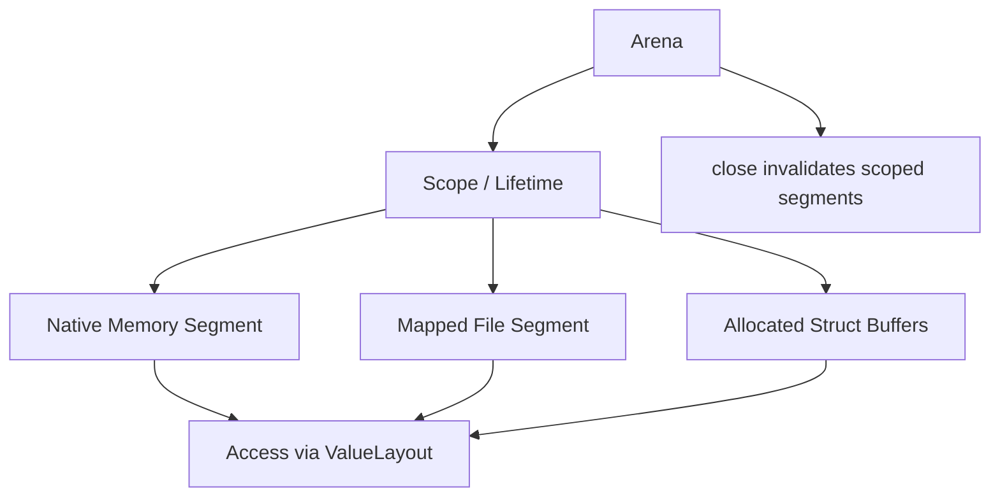
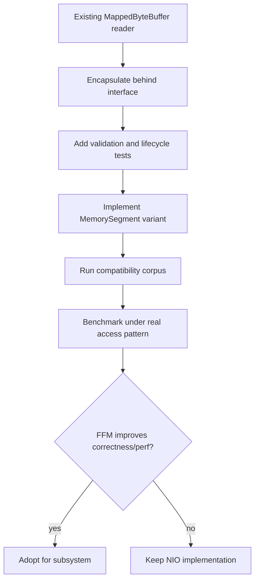

------
title: Learn Java IO, Modern IO, Streams, Buffers, Resources, Serialization & Data Boundaries - Part 018
description: Production-grade introduction to Java Foreign Function & Memory API for IO engineers, covering MemorySegment, Arena, mapped file segments, memory layouts, lifecycle, bounds safety, interop, and when to choose FFM over ByteBuffer or MappedByteBuffer.
series: learn-java-io-modern-io-resource-boundaries
seriesTitle: Learn Java IO, Modern IO, Streams, Buffers, Resources, Serialization & Data Boundaries
order: 18
partTitle: Modern Foreign Memory & File Mapping
tags:
  - java
  - foreign-memory
  - ffm
  - memorysegment
  - arena
  - mmap
  - offheap
  - native-memory
  - io-boundary
  - series
date: 2026-06-30
------

# Part 018 — Modern Foreign Memory & File Mapping

> Goal part ini: memahami Foreign Function & Memory API dari perspektif Java IO engineer: bukan untuk “belajar native interop” secara umum, tetapi untuk menguasai **explicit native memory lifecycle, safe off-heap access, file-mapped segments, binary layout, dan boundary design**.

Pada bagian sebelumnya kita membahas `MappedByteBuffer`. Legacy NIO mapping kuat, tetapi lifecycle-nya kurang eksplisit. Foreign Function & Memory API, biasa disingkat FFM, memperkenalkan model modern berbasis:

- `MemorySegment`
- `Arena`
- `MemoryLayout`
- `ValueLayout`
- `Linker`
- `SymbolLookup`

Dalam seri IO ini, fokus kita adalah `MemorySegment`, `Arena`, dan file mapping. Native function call hanya dibahas sebagai konteks, bukan inti.

---

## 1. Why FFM Matters for IO Engineers

Sebelum FFM, Java engineer biasanya punya tiga pilihan untuk memory di luar heap:

```text
1. Direct ByteBuffer
2. MappedByteBuffer
3. Unsafe / JNI / native library wrappers
```

Masing-masing punya trade-off:

| Tool | Strength | Weakness |
|---|---|---|
| Direct `ByteBuffer` | works with NIO channels; avoids heap copy | lifecycle less explicit; int indexing; awkward structure access |
| `MappedByteBuffer` | file-backed mapping; familiar NIO buffer API | unmapping/lifetime awkward; int indexing; limited layout expressiveness |
| `Unsafe`/JNI | powerful, low-level | unsafe, brittle, hard to review, hard to defend |
| FFM `MemorySegment` | explicit lifecycle, bounds checking, structured access | newer API, different mental model, requires careful adoption |

FFM gives a first-class Java model for memory outside the Java heap without jumping directly to `Unsafe` or custom JNI.

---

## 2. Core Mental Model

A `MemorySegment` is a bounded region of memory.

That memory can be backed by:

- native/off-heap memory;
- heap array;
- mapped file;
- memory returned by native code.

An `Arena` controls lifetime for segments allocated or associated with its scope.



The two most important safety ideas:

```text
Spatial safety: access must stay within segment bounds.
Temporal safety: access must happen while the segment's scope is alive.
```

Compare with raw native pointers:

```text
pointer + offset = trust me
MemorySegment + offset + layout = checked access within known bounds/lifetime
```

---

## 3. `Arena`: Explicit Lifecycle Boundary

An arena controls lifetime. That makes it conceptually similar to try-with-resources for native memory.

```java
try (Arena arena = Arena.ofConfined()) {
    MemorySegment segment = arena.allocate(1024);
    segment.set(ValueLayout.JAVA_INT, 0, 42);
    int value = segment.get(ValueLayout.JAVA_INT, 0);
}
// segment is no longer valid after arena close
```

The central invariant:

```text
Do not let a MemorySegment escape an Arena lifetime unless the API contract explicitly supports it.
```

Bad pattern:

```java
static MemorySegment allocateBuffer() {
    try (Arena arena = Arena.ofConfined()) {
        return arena.allocate(1024); // invalid after method returns
    }
}
```

Better pattern:

```java
final class NativeBuffer implements AutoCloseable {
    private final Arena arena;
    private final MemorySegment segment;

    NativeBuffer(long bytes) {
        this.arena = Arena.ofConfined();
        this.segment = arena.allocate(bytes);
    }

    MemorySegment segment() {
        return segment;
    }

    @Override
    public void close() {
        arena.close();
    }
}
```

This restores a familiar IO resource model:

```text
owner creates resource -> owner passes view/control -> owner closes resource
```

---

## 4. Arena Types and Boundary Meaning

Common arena patterns:

| Arena Pattern | Meaning | Typical Use |
|---|---|---|
| Confined arena | one owner thread; explicit close | request/task-local native buffers |
| Shared arena | multiple threads; explicit close with coordination | shared read-only mapped data, cross-thread native buffers |
| Auto arena | managed by GC reachability | convenience, less deterministic lifecycle |
| Global arena | lifetime of process | truly process-global data only |

Selection guidance:

```text
Default to confined for local temporary memory.
Use shared only when cross-thread access is part of the design.
Avoid global unless data is intentionally process-lifetime.
Avoid auto when deterministic release matters.
```

For IO engineers, deterministic lifecycle usually matters. Prefer explicit arenas.

---

## 5. Native Memory Allocation

Allocate off-heap memory:

```java
try (Arena arena = Arena.ofConfined()) {
    MemorySegment buffer = arena.allocate(4096);

    for (long offset = 0; offset < buffer.byteSize(); offset++) {
        buffer.set(ValueLayout.JAVA_BYTE, offset, (byte) 0);
    }
}
```

Unlike `ByteBuffer`, `MemorySegment` uses `long` sizes and offsets. That matters for large data structures.

But large addressability is not a license to allocate huge memory casually. You still need:

- memory budget;
- accounting;
- admission control;
- lifecycle ownership;
- cleanup behavior;
- operational metrics.

---

## 6. Accessing Primitive Values

FFM uses layouts to describe primitive access.

```java
try (Arena arena = Arena.ofConfined()) {
    MemorySegment segment = arena.allocate(16);

    segment.set(ValueLayout.JAVA_INT, 0, 0xCAFE_BABE);
    segment.set(ValueLayout.JAVA_LONG, 8, 123L);

    int magic = segment.get(ValueLayout.JAVA_INT, 0);
    long sequence = segment.get(ValueLayout.JAVA_LONG, 8);
}
```

This forces you to be explicit about:

- offset;
- type;
- alignment/layout;
- byte order when using layouts with order;
- bounds.

The result is much more reviewable than scattered `Unsafe.getLong(address + offset)` calls.

---

## 7. File Mapping with `MemorySegment`

Modern Java can map a file to a `MemorySegment`.

Conceptually:

```java
try (Arena arena = Arena.ofConfined()) {
    MemorySegment mapped = FileChannel.open(path, StandardOpenOption.READ)
            .map(FileChannel.MapMode.READ_ONLY, 0, Files.size(path), arena);

    int magic = mapped.get(ValueLayout.JAVA_INT, 0);
}
```

Depending on exact JDK version/API shape, file mapping may be exposed through `FileChannel.map(..., Arena)` or related FFM APIs. The key design idea remains:

```text
Mapped file segment lifetime is tied to a scope, not hidden only behind GC reachability.
```

That is the big conceptual improvement over legacy `MappedByteBuffer` lifecycle.

---

## 8. `MemorySegment` vs `MappedByteBuffer`

| Dimension | `MappedByteBuffer` | `MemorySegment` |
|---|---|---|
| API family | NIO Buffer | FFM |
| Offset type | `int` | `long` |
| Lifecycle | buffer reachability / GC-dependent mapping lifetime | scope/arena based |
| Structured access | manual via `getInt`, byte order, views | layouts and var handles |
| Bounds checking | yes within buffer | yes within segment |
| Temporal checking | less explicit | scope liveness checked |
| Familiarity | high for NIO users | newer model |
| Channel integration | direct | improving/current FFM integration |

When to choose `MappedByteBuffer`:

- codebase is already NIO-buffer-oriented;
- mapping size fits practical `ByteBuffer` constraints;
- lifecycle is simple and long-lived;
- team is not ready to adopt FFM yet.

When to consider `MemorySegment`:

- you need explicit memory lifecycle;
- you need long offsets;
- binary layout needs strong structure;
- native interop is nearby;
- you want to avoid `Unsafe`;
- you want mapped memory scoped to an owner.

---

## 9. Structured Binary Layouts

A binary file often has a header:

```text
magic:int
version:int
recordCount:long
indexOffset:long
```

With `ByteBuffer`, this is manual offset work:

```java
int magic = buffer.getInt(0);
int version = buffer.getInt(4);
long recordCount = buffer.getLong(8);
long indexOffset = buffer.getLong(16);
```

With FFM, you can model layout:

```java
static final GroupLayout HEADER_LAYOUT = MemoryLayout.structLayout(
        ValueLayout.JAVA_INT.withName("magic"),
        ValueLayout.JAVA_INT.withName("version"),
        ValueLayout.JAVA_LONG.withName("recordCount"),
        ValueLayout.JAVA_LONG.withName("indexOffset")
);
```

Then derive access handles:

```java
static final VarHandle MAGIC = HEADER_LAYOUT.varHandle(
        MemoryLayout.PathElement.groupElement("magic"));

static final VarHandle VERSION = HEADER_LAYOUT.varHandle(
        MemoryLayout.PathElement.groupElement("version"));
```

Usage:

```java
int magic = (int) MAGIC.get(segment, 0L);
int version = (int) VERSION.get(segment, 0L);
```

The benefit is not just syntax. It is making the binary contract inspectable:

```text
The layout becomes code, not tribal knowledge hidden in offsets.
```

---

## 10. Byte Order and Layout

Never let byte order be implicit for persistent or cross-process formats.

```java
static final ValueLayout.OfInt BE_INT = ValueLayout.JAVA_INT.withOrder(ByteOrder.BIG_ENDIAN);
static final ValueLayout.OfLong BE_LONG = ValueLayout.JAVA_LONG.withOrder(ByteOrder.BIG_ENDIAN);
```

Layout:

```java
static final GroupLayout HEADER_LAYOUT = MemoryLayout.structLayout(
        BE_INT.withName("magic"),
        BE_INT.withName("version"),
        BE_LONG.withName("recordCount"),
        BE_LONG.withName("indexOffset")
);
```

Review rule:

```text
Any persistent binary layout without explicit byte order is incomplete.
```

---

## 11. Alignment and Padding

Native memory layout can include alignment and padding. That matters when interoperating with C structs or memory formats defined outside Java.

For Java-owned file formats, prefer explicitly packed layouts where every byte is defined.

Example explicit file header:

```text
0   int32 magic
4   int32 version
8   int64 recordCount
16  int64 indexOffset
24  int64 dataOffset
```

Do not casually mirror a C struct to disk unless you control:

- compiler;
- platform ABI;
- field alignment;
- padding;
- endianness;
- struct versioning.

A portable file format is not the same thing as a native in-memory struct.

---

## 12. Building a Scoped Mapped File Reader

```java
public final class SegmentFileReader implements AutoCloseable {
    private static final int MAGIC_VALUE = 0x53454746; // "SEGF"

    private static final ValueLayout.OfInt I32 = ValueLayout.JAVA_INT.withOrder(ByteOrder.BIG_ENDIAN);
    private static final ValueLayout.OfLong I64 = ValueLayout.JAVA_LONG.withOrder(ByteOrder.BIG_ENDIAN);

    private final Arena arena;
    private final FileChannel channel;
    private final MemorySegment segment;

    public SegmentFileReader(Path path) throws IOException {
        this.arena = Arena.ofConfined();
        try {
            this.channel = FileChannel.open(path, StandardOpenOption.READ);
            long size = channel.size();
            if (size < 24) {
                throw new EOFException("file too small: " + size);
            }
            this.segment = channel.map(FileChannel.MapMode.READ_ONLY, 0, size, arena);
            validate(size);
        } catch (Throwable t) {
            arena.close();
            throw t;
        }
    }

    private void validate(long size) throws IOException {
        int magic = segment.get(I32, 0);
        if (magic != MAGIC_VALUE) {
            throw new IOException("invalid magic");
        }

        int version = segment.get(I32, 4);
        if (version != 1) {
            throw new IOException("unsupported version: " + version);
        }

        long recordCount = segment.get(I64, 8);
        long indexOffset = segment.get(I64, 16);

        if (recordCount < 0) {
            throw new IOException("negative record count");
        }
        if (indexOffset < 24 || indexOffset >= size) {
            throw new IOException("invalid index offset: " + indexOffset);
        }
    }

    public long recordCount() {
        return segment.get(I64, 8);
    }

    @Override
    public void close() throws IOException {
        try {
            channel.close();
        } finally {
            arena.close();
        }
    }
}
```

Note the constructor cleanup pattern:

```text
If mapping validation fails after arena creation, close the arena before rethrowing.
```

Resource construction is a boundary too.

---

## 13. Constructor Failure and Resource Cleanup

Bad constructor:

```java
SegmentFileReader(Path path) throws IOException {
    this.arena = Arena.ofConfined();
    this.channel = FileChannel.open(path, StandardOpenOption.READ);
    this.segment = channel.map(READ_ONLY, 0, channel.size(), arena);
    validate(); // may throw, leaking channel/arena if not handled
}
```

Better:

```java
SegmentFileReader(Path path) throws IOException {
    Arena createdArena = Arena.ofConfined();
    FileChannel createdChannel = null;
    try {
        createdChannel = FileChannel.open(path, StandardOpenOption.READ);
        MemorySegment createdSegment = createdChannel.map(
                FileChannel.MapMode.READ_ONLY,
                0,
                createdChannel.size(),
                createdArena);

        validate(createdSegment);

        this.arena = createdArena;
        this.channel = createdChannel;
        this.segment = createdSegment;
    } catch (Throwable t) {
        if (createdChannel != null) {
            try {
                createdChannel.close();
            } catch (Throwable closeFailure) {
                t.addSuppressed(closeFailure);
            }
        }
        try {
            createdArena.close();
        } catch (Throwable closeFailure) {
            t.addSuppressed(closeFailure);
        }
        throw t;
    }
}
```

The code is verbose, but the invariant is simple:

```text
Every partially constructed native/file resource must have a cleanup path.
```

---

## 14. API Boundary Design with `MemorySegment`

A `MemorySegment` carries lifecycle risk. Do not expose it casually.

### 14.1 Internal-only segment

```java
public final class NativeTable implements AutoCloseable {
    private final Arena arena;
    private final MemorySegment segment;

    public int getInt(long row, long column) {
        long offset = computeOffset(row, column);
        return segment.get(ValueLayout.JAVA_INT, offset);
    }

    @Override
    public void close() {
        arena.close();
    }
}
```

This is safest. Callers never receive raw segment.

### 14.2 Borrowed segment callback

```java
public <T> T withSegment(Function<MemorySegment, T> fn) {
    ensureOpen();
    return fn.apply(segment.asReadOnly());
}
```

This allows advanced callers to inspect without owning lifetime. Document that the segment must not be retained.

### 14.3 Exposed owned segment

```java
public MemorySegment segment() {
    return segment;
}
```

Only use when callers are trusted and understand lifecycle. This is internal-platform API territory.

---

## 15. Temporal Safety Failure Example

```java
MemorySegment segment;
try (Arena arena = Arena.ofConfined()) {
    segment = arena.allocate(8);
    segment.set(ValueLayout.JAVA_LONG, 0, 99L);
}

long value = segment.get(ValueLayout.JAVA_LONG, 0); // invalid access
```

The important point is not the exact exception type. The important point is the mental model:

```text
A MemorySegment is not just an address. It is address + bounds + lifetime.
```

This is the safety win over raw pointer-style code.

---

## 16. Spatial Safety Failure Example

```java
try (Arena arena = Arena.ofConfined()) {
    MemorySegment segment = arena.allocate(8);
    segment.set(ValueLayout.JAVA_LONG, 8, 1L); // offset 8 plus 8 bytes exceeds size
}
```

A raw pointer model might corrupt adjacent memory. Segment access should reject out-of-bounds access.

Spatial checks are especially valuable when parsing files where offsets are read from the file itself.

---

## 17. File Format Parsing with Bounds-Checked Segments

Suppose record layout:

```text
record:
  length:int32
  payload:byte[length]
  crc:int32
```

Parser:

```java
static MemorySegment payloadAt(MemorySegment file, long offset, long committedLimit) throws IOException {
    if (offset < 0 || offset + Integer.BYTES > committedLimit) {
        throw new EOFException("missing length at " + offset);
    }

    int length = file.get(ValueLayout.JAVA_INT.withOrder(ByteOrder.BIG_ENDIAN), offset);
    if (length < 0) {
        throw new IOException("negative length: " + length);
    }

    long payloadStart = offset + Integer.BYTES;
    long payloadEnd = payloadStart + length;
    long crcEnd = payloadEnd + Integer.BYTES;

    if (payloadEnd < payloadStart || crcEnd < payloadEnd || crcEnd > committedLimit) {
        throw new EOFException("record exceeds committed limit");
    }

    return file.asSlice(payloadStart, length).asReadOnly();
}
```

Notice that we still validate manually. Bounds-checked APIs are not a replacement for format validation. They are a second line of defense.

---

## 18. FFM and `ByteBuffer` Interoperability

Some APIs still expect `ByteBuffer`. `MemorySegment` can interoperate with byte buffers in some contexts, but do not design a system that constantly converts between both without a reason.

Conceptual boundary options:

```text
NIO world:       Channel <-> ByteBuffer
FFM world:       MemorySegment <-> layout/varhandle/native interop
Bridge world:    convert only at edges
```

If most code is channel-based, `ByteBuffer` may remain better. If most code is binary-layout/native-memory-based, `MemorySegment` may be better.

Architecture rule:

```text
Pick one primary memory abstraction per subsystem. Bridge at boundaries, not inside every method.
```

---

## 19. FFM for Native Library IO Boundaries

Although this series is not about JNI replacement, IO-heavy systems often integrate with native libraries:

- compression engines;
- encryption accelerators;
- image/video codecs;
- database engines;
- columnar file readers;
- network packet libraries;
- custom hardware SDKs.

FFM lets Java call native functions and pass native memory without writing JNI glue. For an IO engineer, the boundary question is:

```text
Who owns the memory, who may mutate it, and how long is it valid?
```

Example memory ownership table:

| Scenario | Owner | Caller Responsibility |
|---|---|---|
| Java allocates segment, native reads | Java arena | keep arena alive during call |
| Java allocates segment, native writes | Java arena | validate output length/status |
| Native returns pointer | native or API-specific | know release function/lifetime |
| Native stores pointer | shared contract | keep segment alive as required |

Never let a native library retain a pointer to memory whose arena will close immediately after the call.

---

## 20. Native Memory Budgeting

Off-heap memory is not free because it avoids Java heap.

You need budgeting:

```text
nativeMemoryBudget = directBuffers + memorySegments + mappedRegions + nativeLibraries + threadStacks + JVM native overhead
```

Admission control example:

```java
final class NativeMemoryBudget {
    private final long maxBytes;
    private final AtomicLong used = new AtomicLong();

    NativeMemoryBudget(long maxBytes) {
        this.maxBytes = maxBytes;
    }

    Reservation reserve(long bytes) {
        while (true) {
            long current = used.get();
            long next = Math.addExact(current, bytes);
            if (next > maxBytes) {
                throw new IllegalStateException("native memory budget exceeded");
            }
            if (used.compareAndSet(current, next)) {
                return new Reservation(bytes);
            }
        }
    }

    final class Reservation implements AutoCloseable {
        private final long bytes;
        private boolean closed;

        private Reservation(long bytes) {
            this.bytes = bytes;
        }

        @Override
        public synchronized void close() {
            if (!closed) {
                used.addAndGet(-bytes);
                closed = true;
            }
        }
    }
}
```

Use this pattern around large off-heap allocations/mappings.

---

## 21. Scoped Native Buffer Pool

A pool can reduce allocation overhead, but can also create lifecycle bugs.

For request/task-local IO, prefer scoped allocation:

```java
try (Arena arena = Arena.ofConfined()) {
    MemorySegment scratch = arena.allocate(64 * 1024);
    parseBatch(scratch);
}
```

For long-lived reusable memory, pool only if:

- allocation cost is measured;
- max pool size is bounded;
- buffer ownership is exclusive while borrowed;
- returned buffers are sanitized if needed;
- close/shutdown releases memory;
- misuse is detectable.

A pool of raw `MemorySegment` references is easy to misuse. Prefer a `BorrowedBuffer` wrapper with `close()`.

---

## 22. FFM and Threading

Arena choice affects thread access.

Confined segment:

```text
owned by one thread / confined scope
```

Shared segment:

```text
can be used across threads, but memory consistency and data-race rules are still your responsibility
```

Do not confuse:

```text
shareable memory segment != synchronized data structure
```

For read-only mapped files, shared access is usually fine if the file is immutable and each reader uses explicit offsets. For mutable native memory, define synchronization and visibility rules.

---

## 23. FFM vs Serialization

Do not use FFM memory layout as a lazy replacement for a durable serialization format.

Bad durable format idea:

```text
Dump native struct layout to disk and read it forever.
```

Risks:

- padding changes;
- alignment changes;
- endian mismatch;
- field evolution problems;
- platform ABI dependency;
- no schema migration;
- no validation envelope.

Better durable boundary:

```text
magic + version + explicit endian + explicit field offsets + checksum + compatibility rules
```

FFM can implement this format efficiently, but the format must still be intentionally designed.

---

## 24. Migration Strategy from `MappedByteBuffer` to `MemorySegment`

Do not rewrite working NIO code just because FFM exists.

Migration makes sense when you have pain around:

- deterministic unmapping;
- huge files with long offsets;
- native memory safety;
- unsafe/JNI replacement;
- structured binary layout;
- explicit lifecycle reviews.

Incremental path:



Interface example:

```java
interface BinaryRegion extends AutoCloseable {
    long size();
    byte getByte(long offset);
    int getInt(long offset);
    long getLong(long offset);
}
```

This keeps the application model stable while implementations evolve.

---

## 25. Production Failure Modes

FFM reduces some classes of native bugs, but not system-level failures.

Potential failure modes:

- arena closed too early;
- segment retained after owner close;
- mapping huge file under memory pressure;
- native library retains pointer beyond arena lifetime;
- file truncated while mapped;
- byte order mismatch;
- layout mismatch;
- alignment mismatch;
- missing cleanup after constructor failure;
- assuming native memory is visible in Java heap metrics;
- shared segment used without synchronization.

Mitigation:

- use explicit owner classes;
- avoid raw segment exposure;
- validate file headers;
- use read-only views when possible;
- enforce memory budgets;
- test lifecycle failure paths;
- add stress tests around close/race behavior;
- document native ownership contracts.

---

## 26. Testing FFM IO Code

Test categories:

### 26.1 Lifecycle tests

```java
@Test
void segmentCannotBeUsedAfterClose() {
    MemorySegment segment;
    try (Arena arena = Arena.ofConfined()) {
        segment = arena.allocate(8);
        segment.set(ValueLayout.JAVA_LONG, 0, 1L);
    }

    assertThrows(IllegalStateException.class, () ->
            segment.get(ValueLayout.JAVA_LONG, 0));
}
```

Depending on JDK behavior, use the precise exception expected by your baseline. The invariant is more important than the exact name in this conceptual example.

### 26.2 Bounds tests

```java
@Test
void rejectsOutOfBoundsRead() {
    try (Arena arena = Arena.ofConfined()) {
        MemorySegment segment = arena.allocate(4);
        assertThrows(IndexOutOfBoundsException.class, () ->
                segment.get(ValueLayout.JAVA_LONG, 0));
    }
}
```

### 26.3 Format corruption tests

- invalid magic;
- unsupported version;
- negative length;
- offset overflow;
- record beyond committed limit;
- checksum mismatch;
- truncated file;
- wrong endian.

### 26.4 Resource failure tests

- constructor validation failure closes arena/channel;
- close is idempotent at wrapper level if required;
- concurrent read during close is handled according to contract;
- failed map does not leak open file channel.

---

## 27. Code Review Checklist

For any FFM-based IO code, ask:

1. Who owns the `Arena`?
2. Can the segment outlive its arena?
3. Is the segment exposed to callers?
4. If exposed, is it read-only or borrowed?
5. Are offsets and lengths validated before access?
6. Is byte order explicit?
7. Is layout portable or platform-specific?
8. Are constructor failures cleaned up?
9. Is native memory budgeted?
10. Is thread access consistent with arena choice?
11. Can native code retain a pointer?
12. Is there a documented release function for native-owned memory?
13. Are mapped files immutable while mapped?
14. Are lifecycle tests present?
15. Are corruption tests present?

---

## 28. Practice: Build a FFM-Based Binary Header Reader

Build a binary file reader using `MemorySegment`.

File layout:

```text
0   int32 magic "FFMT"
4   int32 version
8   int64 createdAtEpochMillis
16  int64 recordCount
24  int64 indexOffset
32  int32 headerCrc
```

Tasks:

1. Write a file builder using `FileChannel`.
2. Map the file using a scoped arena.
3. Define explicit big-endian layouts.
4. Validate magic/version.
5. Validate `indexOffset` and `recordCount` without overflow.
6. Expose a safe domain object, not raw segment.
7. Ensure constructor failure closes all resources.
8. Add lifecycle tests.
9. Add corrupted file tests.
10. Implement a `MappedByteBuffer` version behind the same interface and compare clarity/performance.

Success criteria:

- no unsafe raw pointer usage;
- explicit lifecycle;
- explicit endian;
- validation before access;
- deterministic close;
- clean boundary API.

---

## 29. Summary

FFM is not “a faster ByteBuffer”. It is a more explicit model for memory outside the Java heap.

For IO boundary engineering, its value is:

- scoped lifetime;
- bounds-checked native memory;
- structured binary layouts;
- safer replacement for some `Unsafe`/JNI use cases;
- modern mapped file access patterns;
- clearer ownership model.

But it does not remove the need for engineering discipline. You still need file format validation, crash protocol, byte order decisions, memory budgets, concurrency rules, and lifecycle tests.

The next part moves from local file/memory access into **selectors and non-blocking IO**, where the key model changes again: instead of blocking on a read/write call, the application reacts to readiness signals and must handle partial progress explicitly.

---

## References

- Java SE 25 API: `java.lang.foreign.Arena`
- Java SE 25 API: `java.lang.foreign.MemorySegment`
- Java SE 25 API: Foreign Function & Memory API guide
- OpenJDK JEP 454: Foreign Function & Memory API
- Java SE 25 API: `FileChannel`
