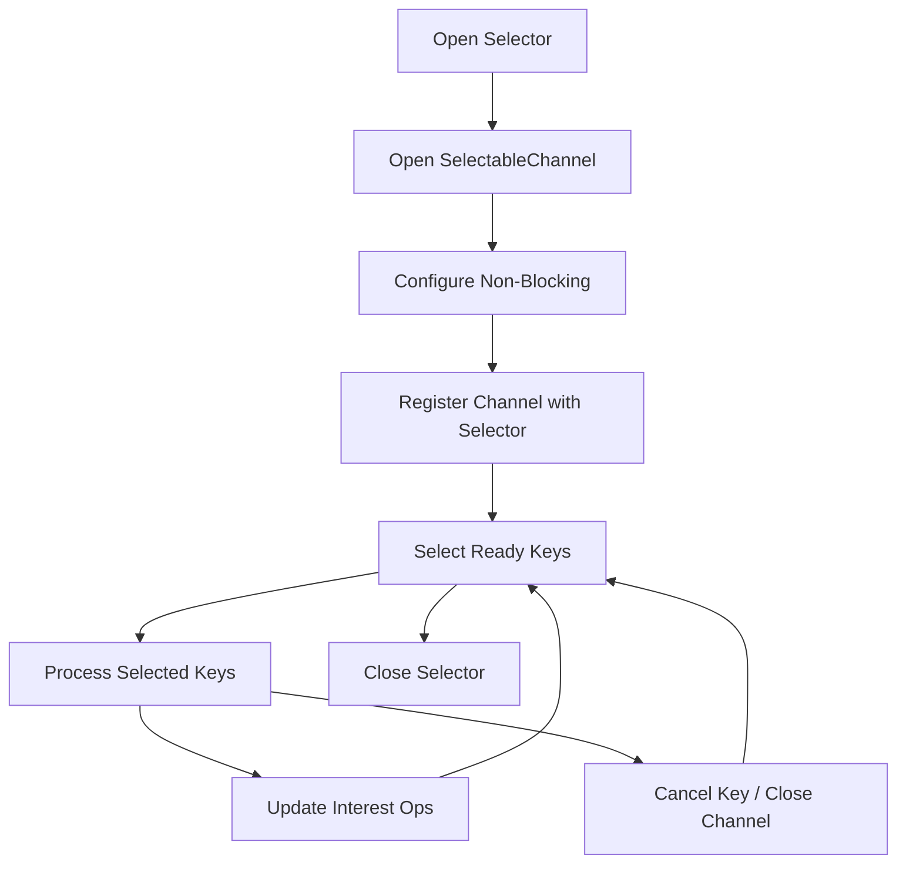
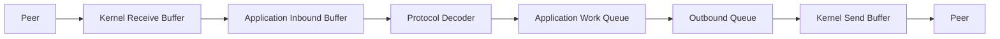
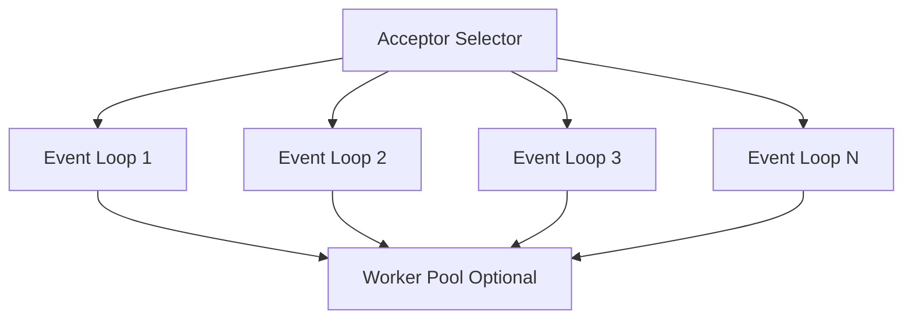

------
title: Learn Java IO, Modern IO, Streams, Buffers, Resources, Serialization & Data Boundaries - Part 019
description: Deep practical guide to Java selector-based non-blocking IO, covering Selector, SelectableChannel, SelectionKey, readiness semantics, event loops, partial reads/writes, outbound queues, backpressure, cancellation, and failure modes.
series: learn-java-io-modern-io-resource-boundaries
seriesTitle: Learn Java IO, Modern IO, Streams, Buffers, Resources, Serialization & Data Boundaries
order: 19
partTitle: Selectors and Non-Blocking IO
tags:
  - java
  - nio
  - selector
  - selectablechannel
  - selectionkey
  - nonblocking-io
  - socketchannel
  - server-socket-channel
  - event-loop
  - backpressure
  - io-boundary
  - series
date: 2026-06-30
------

# Part 019 — Selectors and Non-Blocking IO

> Goal part ini: memahami selector-based non-blocking IO sebagai **readiness-driven state machine**, bukan sebagai “threadless magic”. Setelah bagian ini, kamu harus bisa membaca, mendesain, dan mereview event-loop NIO yang aman terhadap partial read, partial write, slow peer, key cancellation, wakeup race, dan backpressure.

Pada bagian sebelumnya kita membahas memory mapped files dan FFM. Sekarang kita berpindah ke model IO yang berbeda: bukan file-region IO, tetapi **multiplexed IO**.

Di classic blocking IO, satu thread biasanya menunggu satu socket atau satu stream. Di selector-based NIO, satu thread dapat memonitor banyak channel dan bereaksi saat channel tertentu **siap** untuk operasi tertentu.

Kata kuncinya adalah **siap**, bukan **selesai**.

---

## 1. Mental Model: Readiness, Not Completion

Selector API sering disalahpahami sebagai async IO. Ia bukan completion-based async IO. Ia adalah readiness-based non-blocking IO.

```text
Blocking IO:
  call read()
  thread waits until data arrives or EOF/error occurs
  method returns data/error

Selector-based non-blocking IO:
  register interest in READ/WRITE/ACCEPT/CONNECT readiness
  selector tells you channel may be ready
  you call non-blocking operation
  operation may read/write zero, some, or all bytes

Completion-based async IO:
  submit read/write operation
  runtime notifies when operation completes
```

Invariants selector-based IO:

1. `Selector` tells readiness, not guaranteed progress.
2. A ready key does not mean a full message is available.
3. A successful read does not mean a full protocol frame is available.
4. A writable key does not mean all queued bytes can be written.
5. Non-blocking `read` and `write` must be treated as partial operations.
6. Application protocol state must live outside the channel.
7. Interest operations are part of backpressure and must be updated deliberately.

This is the core shift: with selectors, **your code owns the IO state machine**.

---

## 2. API Surface

The minimum selector vocabulary:

| Type | Role |
|---|---|
| `Selector` | multiplexor that waits for registered channels to become ready |
| `SelectableChannel` | channel that can be put in non-blocking mode and registered with a selector |
| `SelectionKey` | registration handle connecting channel, selector, interest ops, ready ops, and attachment |
| `ServerSocketChannel` | selectable server socket channel for accepting TCP connections |
| `SocketChannel` | selectable TCP socket channel |
| `DatagramChannel` | selectable UDP channel |
| `Pipe.SourceChannel` / `Pipe.SinkChannel` | selectable pipe channels |

Important distinction:

```text
Channel      = endpoint / connection abstraction
Selector     = readiness multiplexer
SelectionKey = registration + per-channel state hook
Attachment   = your protocol/session state
```

Official API model: selectable channels must be configured into non-blocking mode before registration. A newly-created selectable channel starts in blocking mode, and non-blocking mode is most useful with selector-based multiplexing.

---

## 3. Selector Lifecycle

Basic lifecycle:



Minimal server shape:

```java
try (Selector selector = Selector.open();
     ServerSocketChannel server = ServerSocketChannel.open()) {

    server.bind(new InetSocketAddress("127.0.0.1", 8080));
    server.configureBlocking(false);
    server.register(selector, SelectionKey.OP_ACCEPT);

    while (true) {
        selector.select();

        Iterator<SelectionKey> it = selector.selectedKeys().iterator();
        while (it.hasNext()) {
            SelectionKey key = it.next();
            it.remove();

            if (!key.isValid()) {
                continue;
            }

            if (key.isAcceptable()) {
                accept(selector, key);
            } else if (key.isReadable()) {
                read(key);
            } else if (key.isWritable()) {
                write(key);
            }
        }
    }
}
```

The loop looks simple. The production-grade complexity is hidden in `accept`, `read`, `write`, and interest-op management.

---

## 4. SelectionKey: Interest vs Ready

A `SelectionKey` has two different operation sets:

| Operation Set | Meaning |
|---|---|
| `interestOps` | what the application wants to be notified about |
| `readyOps` | what the selector observed as ready |

Common operations:

| Operation | Meaning |
|---|---|
| `OP_ACCEPT` | server socket may accept a connection |
| `OP_CONNECT` | non-blocking connect may finish |
| `OP_READ` | channel may have inbound data or EOF/error |
| `OP_WRITE` | channel may accept outbound bytes |

A frequent bug is treating `OP_WRITE` like a rare event. For TCP sockets, writability is often true most of the time. If you keep `OP_WRITE` permanently enabled, your event loop may spin continuously.

Correct rule:

```text
Enable OP_WRITE only when there is queued outbound data.
Disable OP_WRITE when the outbound queue becomes empty.
```

Example helpers:

```java
static void addInterest(SelectionKey key, int op) {
    if (key.isValid()) {
        key.interestOps(key.interestOps() | op);
    }
}

static void removeInterest(SelectionKey key, int op) {
    if (key.isValid()) {
        key.interestOps(key.interestOps() & ~op);
    }
}
```

Be careful: if another thread modifies interest ops, you need a selector wakeup strategy. More on this later.

---

## 5. Attachments: Where Session State Lives

A selector tells you which channel is ready. It does not manage your protocol state.

Per-connection state usually contains:

- inbound buffer
- outbound queue
- decode state
- encode state
- protocol phase
- authentication/handshake phase if applicable
- remote address metadata
- idle/deadline metadata
- error/cancellation state

Example:

```java
final class Session {
    final ByteBuffer inbound = ByteBuffer.allocate(64 * 1024);
    final Deque<ByteBuffer> outbound = new ArrayDeque<>();
    final FrameDecoder decoder = new FrameDecoder();
    boolean closingAfterWrite;

    void enqueue(ByteBuffer encodedMessage) {
        outbound.add(encodedMessage);
    }

    boolean hasPendingWrites() {
        return !outbound.isEmpty();
    }
}
```

Register with attachment:

```java
SocketChannel client = server.accept();
client.configureBlocking(false);
SelectionKey key = client.register(selector, SelectionKey.OP_READ);
key.attach(new Session());
```

Or attach during registration:

```java
client.register(selector, SelectionKey.OP_READ, new Session());
```

The attachment is not a side detail. It is the place where the application protocol becomes explicit.

---

## 6. Accept Path

Accept readiness means the server socket may have one or more connections to accept.

A robust accept handler drains all currently available accepts:

```java
static void accept(Selector selector, SelectionKey key) throws IOException {
    ServerSocketChannel server = (ServerSocketChannel) key.channel();

    while (true) {
        SocketChannel client = server.accept();
        if (client == null) {
            return;
        }

        client.configureBlocking(false);
        client.setOption(StandardSocketOptions.TCP_NODELAY, true);

        Session session = new Session();
        client.register(selector, SelectionKey.OP_READ, session);
    }
}
```

Why loop?

Because readiness is level-triggered in common selector implementations. If multiple connections are pending, accepting only one may leave the server socket ready and cause extra loop iterations.

Production accept considerations:

| Concern | Design Response |
|---|---|
| connection flood | cap accepted connections; close or shed load |
| expensive session initialization | defer heavy work outside event loop |
| per-connection memory | bound buffer sizes; avoid eager megabyte buffers |
| slow handshake | deadline and idle timeout |
| failure during accept | close accepted channel if registration fails |

Safer accept with cleanup:

```java
static void acceptOne(Selector selector, ServerSocketChannel server) throws IOException {
    SocketChannel client = server.accept();
    if (client == null) {
        return;
    }

    boolean registered = false;
    try {
        client.configureBlocking(false);
        Session session = new Session();
        client.register(selector, SelectionKey.OP_READ, session);
        registered = true;
    } finally {
        if (!registered) {
            try {
                client.close();
            } catch (IOException ignored) {
                // best-effort cleanup
            }
        }
    }
}
```

---

## 7. Read Path: Bytes Are Not Messages

A readable socket means the channel may produce bytes or EOF. It does not mean a complete message is available.

Basic non-blocking read:

```java
static void read(SelectionKey key) throws IOException {
    SocketChannel channel = (SocketChannel) key.channel();
    Session session = (Session) key.attachment();
    ByteBuffer buffer = session.inbound;

    int total = 0;
    while (true) {
        int n = channel.read(buffer);
        if (n > 0) {
            total += n;
            continue;
        }
        if (n == 0) {
            break;
        }
        if (n == -1) {
            closeKey(key);
            return;
        }
    }

    if (total > 0) {
        buffer.flip();
        decodeAvailableFrames(session, buffer);
        buffer.compact();
    }
}
```

Important points:

- `read` may return positive count.
- `read` may return zero in non-blocking mode.
- `read` may return `-1` for end-of-stream.
- One read may contain half a message.
- One read may contain multiple messages.
- One read may contain complete message plus part of the next message.

A protocol decoder must preserve leftover bytes.

---

## 8. Length-Prefixed Decoder Example

A simple frame format:

```text
frame := uint32_be length + payload[length]
```

Constraints:

- length must be non-negative
- length must not exceed max frame size
- decoder must tolerate partial length field
- decoder must tolerate partial payload
- decoder must emit multiple frames if available

Decoder:

```java
final class FrameDecoder {
    private static final int HEADER_BYTES = 4;
    private static final int MAX_FRAME_BYTES = 1 << 20; // 1 MiB

    private Integer expectedLength;

    List<ByteBuffer> decode(ByteBuffer input) throws ProtocolException {
        List<ByteBuffer> frames = new ArrayList<>();

        while (true) {
            if (expectedLength == null) {
                if (input.remaining() < HEADER_BYTES) {
                    return frames;
                }
                int len = input.getInt();
                if (len < 0 || len > MAX_FRAME_BYTES) {
                    throw new ProtocolException("invalid frame length: " + len);
                }
                expectedLength = len;
            }

            if (input.remaining() < expectedLength) {
                return frames;
            }

            int oldLimit = input.limit();
            int frameEnd = input.position() + expectedLength;
            input.limit(frameEnd);

            ByteBuffer frame = ByteBuffer.allocate(expectedLength);
            frame.put(input);
            frame.flip();
            frames.add(frame.asReadOnlyBuffer());

            input.limit(oldLimit);
            expectedLength = null;
        }
    }
}
```

Usage:

```java
static void decodeAvailableFrames(Session session, ByteBuffer inbound)
        throws ProtocolException {

    for (ByteBuffer frame : session.decoder.decode(inbound)) {
        ByteBuffer response = handleFrame(frame);
        session.enqueue(response);
    }
}
```

After decoding, `compact()` preserves incomplete tail bytes:

```text
Before flip:    [ consumed? no ][ bytes written by channel ][ free space ]
After flip:     [ bytes to decode ][ no access ]
After compact:  [ leftover undecoded bytes ][ free space ]
```

---

## 9. Write Path: Writability Is Not Drain Completion

A writable socket may accept some bytes. It may not accept all bytes.

Correct write handler:

```java
static void write(SelectionKey key) throws IOException {
    SocketChannel channel = (SocketChannel) key.channel();
    Session session = (Session) key.attachment();

    while (!session.outbound.isEmpty()) {
        ByteBuffer head = session.outbound.peek();
        channel.write(head);

        if (head.hasRemaining()) {
            // Kernel send buffer currently full or partially available.
            return;
        }

        session.outbound.remove();
    }

    removeInterest(key, SelectionKey.OP_WRITE);

    if (session.closingAfterWrite) {
        closeKey(key);
    }
}
```

When application enqueues response:

```java
static void enqueueResponse(SelectionKey key, ByteBuffer response) {
    Session session = (Session) key.attachment();
    session.enqueue(response);
    addInterest(key, SelectionKey.OP_WRITE);
}
```

Important invariant:

```text
outbound queue non-empty  => OP_WRITE enabled
outbound queue empty      => OP_WRITE disabled
```

---

## 10. Scatter/Gather Write

For framed protocols, response often consists of header + payload. Avoid copying payload into one combined buffer unless needed.

```java
static ByteBuffer intHeader(int value) {
    ByteBuffer header = ByteBuffer.allocate(Integer.BYTES);
    header.putInt(value);
    header.flip();
    return header;
}

static List<ByteBuffer> encode(ByteBuffer payload) {
    return List.of(intHeader(payload.remaining()), payload.asReadOnlyBuffer());
}
```

A session may maintain a queue of buffer arrays or flatten into a deque.

Simple deque form:

```java
final class Session {
    final Deque<ByteBuffer> outbound = new ArrayDeque<>();

    void enqueueFrame(ByteBuffer payload) {
        outbound.add(intHeader(payload.remaining()));
        outbound.add(payload.asReadOnlyBuffer());
    }
}
```

For high-throughput systems, gather writes can reduce syscall count:

```java
static void writeGathering(SelectionKey key) throws IOException {
    SocketChannel channel = (SocketChannel) key.channel();
    Session session = (Session) key.attachment();

    while (!session.outbound.isEmpty()) {
        ByteBuffer[] batch = session.outbound.stream()
                .limit(16)
                .toArray(ByteBuffer[]::new);

        long n = channel.write(batch);
        if (n == 0) {
            return;
        }

        while (!session.outbound.isEmpty()
                && !session.outbound.peek().hasRemaining()) {
            session.outbound.remove();
        }
    }

    removeInterest(key, SelectionKey.OP_WRITE);
}
```

Trade-off:

| Approach | Benefit | Cost |
|---|---|---|
| copy into one buffer | simple queue logic | extra copy and memory |
| header + payload buffers | avoids copy | more state management |
| gather write | fewer syscalls | batching logic and buffer-array management |

---

## 11. Backpressure: Bounded Queues or Memory Death

Non-blocking IO makes it easy to accept data faster than downstream systems can process it. Without bounded queues, memory becomes the hidden buffer.

Backpressure must exist at multiple points:



If any stage is unbounded, the system can fail under slow consumer or malicious input.

Common bounds:

| Resource | Bound |
|---|---|
| inbound buffer | per-connection max buffer size |
| frame length | max frame bytes |
| outbound queue | max queued bytes per connection |
| work queue | bounded executor queue |
| open connections | max concurrent sessions |
| idle sessions | timeout |

Outbound queue should track bytes, not only number of buffers:

```java
final class OutboundQueue {
    private final long maxQueuedBytes;
    private long queuedBytes;
    private final Deque<ByteBuffer> queue = new ArrayDeque<>();

    OutboundQueue(long maxQueuedBytes) {
        this.maxQueuedBytes = maxQueuedBytes;
    }

    boolean offer(ByteBuffer buffer) {
        int bytes = buffer.remaining();
        if (queuedBytes + bytes > maxQueuedBytes) {
            return false;
        }
        queue.add(buffer);
        queuedBytes += bytes;
        return true;
    }

    ByteBuffer peek() {
        return queue.peek();
    }

    ByteBuffer removeFullyWritten() {
        ByteBuffer removed = queue.remove();
        queuedBytes -= removed.limit(); // only safe when buffer position starts at 0 and limit is payload size
        return removed;
    }

    boolean isEmpty() {
        return queue.isEmpty();
    }
}
```

A production implementation should store original remaining size separately because buffer `position` mutates during writes.

Slow peer policy choices:

| Policy | Meaning |
|---|---|
| close connection | simplest, often correct for overload |
| drop low-priority messages | useful for telemetry-like streams |
| stop reading | applies TCP backpressure upstream |
| degrade response | send smaller response or error |
| move to slower lane | separate pools/limits for slow sessions |

A useful invariant:

```text
If outbound queued bytes exceeds high watermark:
    disable OP_READ or stop accepting application messages for that session.
If outbound queued bytes drops below low watermark:
    re-enable OP_READ.
```

Example:

```java
static void maybeApplyBackpressure(SelectionKey key, Session session) {
    if (session.outboundBytes() > session.highWatermark()) {
        removeInterest(key, SelectionKey.OP_READ);
    } else if (session.outboundBytes() < session.lowWatermark()) {
        addInterest(key, SelectionKey.OP_READ);
    }
}
```

---

## 12. Connect Path

Non-blocking connect has a separate state transition:

```java
SocketChannel channel = SocketChannel.open();
channel.configureBlocking(false);
boolean connected = channel.connect(remoteAddress);

int ops = connected ? SelectionKey.OP_READ : SelectionKey.OP_CONNECT;
channel.register(selector, ops, session);
```

When key is connectable:

```java
static void finishConnect(SelectionKey key) throws IOException {
    SocketChannel channel = (SocketChannel) key.channel();

    if (channel.finishConnect()) {
        key.interestOps(SelectionKey.OP_READ);
    }
}
```

Important:

- `OP_CONNECT` means connection process may be completed.
- You must call `finishConnect()`.
- Connection may fail at `finishConnect()`.
- Once connected, remove `OP_CONNECT` from interests.
- Outbound data queued before connect should enable `OP_WRITE` after connection completes.

---

## 13. Key Cancellation and Close Discipline

Closing a channel cancels its keys, but event loops should still be explicit.

```java
static void closeKey(SelectionKey key) {
    try {
        key.cancel();
        key.channel().close();
    } catch (IOException ignored) {
        // close is best effort
    }
}
```

Do not keep stale session references alive after close.

Better:

```java
static void closeKey(SelectionKey key) {
    Object attachment = key.attachment();
    key.attach(null);
    key.cancel();

    if (attachment instanceof Session session) {
        session.releaseBuffers();
    }

    try {
        key.channel().close();
    } catch (IOException ignored) {
        // best effort
    }
}
```

Failure modes:

| Failure | Cause | Prevention |
|---|---|---|
| selected-key leak | not removing processed key from selected set | always `iterator.remove()` |
| stale attachment retained | attachment holds buffers after close | detach and release |
| repeated invalid key handling | not checking `key.isValid()` | validate before operations |
| cancelled key still selected once | cancellation processed later | tolerate invalid/cancelled keys |
| close during operation | peer reset or local shutdown | centralized close path |

---

## 14. The Selected-Key Removal Bug

This is one of the most common selector bugs:

```java
for (SelectionKey key : selector.selectedKeys()) {
    handle(key);
}
```

Wrong because processed keys remain in the selected set.

Correct:

```java
Iterator<SelectionKey> iterator = selector.selectedKeys().iterator();
while (iterator.hasNext()) {
    SelectionKey key = iterator.next();
    iterator.remove();
    handle(key);
}
```

Invariant:

```text
Every selected key must be removed exactly once by the event loop iteration that processes it.
```

---

## 15. Wakeup and Cross-Thread Handoff

A selector thread often receives tasks from other threads:

- enqueue outbound message
- close a session
- change interest ops
- register new channel
- execute timeout decisions

If the selector is blocked inside `select()`, another thread must wake it.

Pattern:

```java
final class EventLoop implements Runnable {
    private final Selector selector;
    private final Queue<Runnable> tasks = new ConcurrentLinkedQueue<>();

    EventLoop(Selector selector) {
        this.selector = selector;
    }

    void execute(Runnable task) {
        tasks.add(task);
        selector.wakeup();
    }

    @Override
    public void run() {
        while (!Thread.currentThread().isInterrupted()) {
            try {
                selector.select();
                runTasks();
                processSelectedKeys();
            } catch (IOException e) {
                // loop-level failure policy
            }
        }
    }

    private void runTasks() {
        Runnable task;
        while ((task = tasks.poll()) != null) {
            task.run();
        }
    }
}
```

Potential issue: if tasks are added after `runTasks()` but before `select()`, `wakeup()` ensures `select()` returns promptly.

Rule:

```text
All channel registration and interest-op mutation should happen on the selector thread,
or be handed off with a wakeup discipline.
```

This avoids complex synchronization around `SelectionKey` state and session state.

---

## 16. Event Loop Ownership Model

A clean production model:

```text
Selector thread owns:
  - Selector
  - selected key iteration
  - channel registration
  - channel read/write calls
  - selection-key interestOps
  - session buffers

Worker threads own:
  - CPU-heavy business logic
  - blocking downstream calls if unavoidable
  - response preparation

Cross-thread queue carries:
  - immutable decoded request
  - immutable encoded response
  - event-loop tasks
```

Diagram:

```mermaid
sequenceDiagram
    participant Peer
    participant Loop as Selector Thread
    participant Worker as Worker Pool

    Peer->>Loop: bytes arrive
    Loop->>Loop: read non-blocking bytes
    Loop->>Loop: decode complete frame
    Loop->>Worker: submit immutable request
    Worker->>Worker: process request
    Worker->>Loop: enqueue response task + wakeup
    Loop->>Loop: attach response buffer
    Loop->>Loop: enable OP_WRITE
    Loop->>Peer: write partial/full bytes
```

Do not let worker threads write directly to `SocketChannel` unless you intentionally design for it. It complicates ordering, backpressure, and close coordination.

---

## 17. Timeouts and Idle Sessions

Selectors do not automatically manage deadlines. You must model them.

Common deadlines:

| Deadline | Meaning |
|---|---|
| accept/session idle timeout | close connection after no activity |
| read frame timeout | close if frame is incomplete too long |
| write drain timeout | close slow consumer |
| connect timeout | fail pending outbound connection |
| application response timeout | fail request if worker is too slow |

Implementation options:

1. `selector.select(timeoutMillis)` plus periodic scan.
2. Priority queue of deadlines.
3. Timer wheel for very many connections.
4. External scheduler that posts close tasks to event loop.

Simple periodic scan:

```java
long now = System.nanoTime();
selector.select(1000);
processSelectedKeys();
expireIdleSessions(now);
```

Do not use wall-clock time for duration comparisons if monotonic time is available. Use `System.nanoTime()` for elapsed durations.

---

## 18. Framing Failure and Close Policy

When decoder detects invalid protocol data, do not continue parsing the stream.

```java
try {
    decodeAvailableFrames(session, inbound);
} catch (ProtocolException e) {
    session.enqueue(encodeError(e));
    session.closingAfterWrite = true;
    addInterest(key, SelectionKey.OP_WRITE);
    removeInterest(key, SelectionKey.OP_READ);
}
```

For untrusted peers, often better:

```java
catch (ProtocolException e) {
    closeKey(key);
}
```

Decision depends on protocol:

| Protocol Type | Suggested Policy |
|---|---|
| internal trusted binary protocol | structured error then close may help debugging |
| public internet protocol | close quickly, avoid amplification |
| long-lived authenticated control channel | send explicit protocol error if safe |
| file/data ingestion stream | quarantine, mark failed, close |

---

## 19. Read Loop Budgeting

A single hot connection can monopolize the selector loop if you drain it indefinitely. Draining is good for throughput but can harm fairness.

Budgeted read:

```java
static void readWithBudget(SelectionKey key) throws IOException {
    SocketChannel channel = (SocketChannel) key.channel();
    Session session = (Session) key.attachment();
    ByteBuffer buffer = session.inbound;

    int reads = 0;
    int bytes = 0;

    while (reads < 16 && bytes < 256 * 1024) {
        int n = channel.read(buffer);
        if (n > 0) {
            reads++;
            bytes += n;
            continue;
        }
        if (n == 0) {
            break;
        }
        closeKey(key);
        return;
    }

    if (bytes > 0) {
        buffer.flip();
        decodeAvailableFrames(session, buffer);
        buffer.compact();
    }
}
```

Fairness is a product requirement. For low connection counts, drain aggressively. For many connections, apply budgets.

---

## 20. Write Loop Budgeting

Same problem on outbound path. A fast connection with huge queued output can dominate.

```java
static void writeWithBudget(SelectionKey key) throws IOException {
    SocketChannel channel = (SocketChannel) key.channel();
    Session session = (Session) key.attachment();

    long written = 0;
    long maxBytesPerTurn = 512 * 1024;

    while (!session.outbound.isEmpty() && written < maxBytesPerTurn) {
        ByteBuffer head = session.outbound.peek();
        int before = head.remaining();
        int n = channel.write(head);
        written += n;

        if (head.hasRemaining()) {
            break;
        }
        session.outbound.remove();

        if (n == 0 && before > 0) {
            break;
        }
    }

    if (session.outbound.isEmpty()) {
        removeInterest(key, SelectionKey.OP_WRITE);
    } else {
        addInterest(key, SelectionKey.OP_WRITE);
    }
}
```

---

## 21. Selector Loop Architecture

Production event loop structure:

```java
final class NioEventLoop implements AutoCloseable, Runnable {
    private final Selector selector;
    private final Queue<Runnable> tasks = new ConcurrentLinkedQueue<>();
    private volatile boolean running = true;

    NioEventLoop() throws IOException {
        this.selector = Selector.open();
    }

    void execute(Runnable task) {
        tasks.add(Objects.requireNonNull(task));
        selector.wakeup();
    }

    @Override
    public void run() {
        while (running) {
            try {
                selector.select(1000);
                runTasks();
                processKeys();
                expireSessions();
            } catch (IOException e) {
                handleLoopFailure(e);
            } catch (RuntimeException e) {
                handleUnexpectedFailure(e);
            }
        }
    }

    private void processKeys() throws IOException {
        Iterator<SelectionKey> it = selector.selectedKeys().iterator();
        while (it.hasNext()) {
            SelectionKey key = it.next();
            it.remove();

            try {
                if (!key.isValid()) continue;
                if (key.isAcceptable()) handleAccept(key);
                if (key.isConnectable()) handleConnect(key);
                if (key.isReadable()) handleRead(key);
                if (key.isWritable()) handleWrite(key);
            } catch (IOException | ProtocolException e) {
                closeKey(key);
            } catch (RuntimeException e) {
                closeKey(key);
                // log session-level bug/failure
            }
        }
    }

    private void runTasks() {
        Runnable task;
        while ((task = tasks.poll()) != null) {
            task.run();
        }
    }

    @Override
    public void close() throws IOException {
        running = false;
        selector.wakeup();
        selector.close();
    }
}
```

Notice the handler order uses independent `if` statements, not `else if`. A key can be ready for multiple operations. For a server socket key, `OP_ACCEPT` is the relevant operation. For a socket key, read and write may both be ready.

Ordering policy matters:

| Order | Behavior |
|---|---|
| read then write | prioritize inbound consumption; may produce response quickly |
| write then read | prioritize draining outbound queue; useful for slow consumers |
| budgeted mix | avoids starvation |

---

## 22. Multi-Selector Scaling

One selector thread is not always enough. Common scaling strategy:

```text
1 acceptor thread accepts connections
N worker event loops handle connected sockets
connection assigned to event loop by round-robin or load
```

Diagram:



Registration from acceptor to worker:

```java
void assign(SocketChannel channel) {
    NioEventLoop loop = chooseLoop();
    loop.execute(() -> {
        try {
            channel.configureBlocking(false);
            channel.register(loop.selector(), SelectionKey.OP_READ, new Session());
        } catch (IOException e) {
            closeQuietly(channel);
        }
    });
}
```

Do not register a channel with a selector from a thread that has no wakeup/synchronization discipline. Handoff to the owner event loop.

---

## 23. Selector vs Blocking IO vs Virtual Threads

Modern Java gives multiple ways to handle many connections:

| Model | Strength | Weakness |
|---|---|---|
| blocking IO + platform threads | simple | does not scale well to very many blocking connections |
| blocking IO + virtual threads | simple programming model; high concurrency | still needs bounded resources and careful blocking boundaries |
| selector-based NIO | explicit backpressure; few event-loop threads; mature for network servers | complex state machine |
| async/completion IO | useful for operation submission model | callback/future complexity |

Selector-based NIO still matters when:

- building network frameworks
- implementing protocol gateways
- managing many mostly-idle connections
- needing fine-grained backpressure
- avoiding one-stack-per-connection model
- integrating with existing NIO-based frameworks
- controlling buffering and fairness explicitly

But do not use selectors just to look advanced. For many business services, blocking style on virtual threads may be clearer. Selector code is justified when the explicit state machine is a real advantage.

---

## 24. File Channels Are Not Selectable

Do not confuse NIO channels with selectable channels.

`FileChannel` is a channel, but not a `SelectableChannel`. Selector multiplexing is primarily for channels such as sockets, datagrams, pipes, and server sockets.

For file IO concurrency, consider:

- blocking `FileChannel` on appropriate threads
- `AsynchronousFileChannel`
- memory mapped files
- bounded executor for file tasks
- platform-specific async behavior considerations

This leads into Part 020.

---

## 25. Common Failure Modes

### 25.1 Treating Readiness as Full Message Availability

Bad:

```java
if (key.isReadable()) {
    ByteBuffer buf = ByteBuffer.allocate(1024);
    channel.read(buf);
    handleMessage(buf.array()); // wrong
}
```

Problems:

- might read partial message
- might read multiple messages
- uses unflipped buffer
- may include unused array bytes
- allocates per read
- no frame validation

### 25.2 Leaving OP_WRITE Enabled Forever

Bad:

```java
client.register(selector, SelectionKey.OP_READ | SelectionKey.OP_WRITE, session);
```

This can create a busy loop because sockets are often writable.

### 25.3 Ignoring `read == -1`

EOF means peer closed output side. For most request/response protocols, close the session or start graceful half-close handling.

### 25.4 Allocating Buffers Per Event

Bad:

```java
ByteBuffer buffer = ByteBuffer.allocate(8192);
channel.read(buffer);
```

Under load, this creates allocation churn and unstable latency. Prefer per-session buffers, pooled buffers, or carefully bounded allocation.

### 25.5 Doing Blocking Work on Selector Thread

Bad:

```java
if (key.isReadable()) {
    Request req = decode(key);
    Response res = databaseCall(req); // blocks selector thread
    enqueue(key, res);
}
```

Selector thread should not block on database, HTTP, filesystem, locks, or long CPU work.

### 25.6 Unbounded Outbound Queue

A slow peer can accumulate response buffers until process memory is exhausted.

### 25.7 Interest Ops From Random Threads

Mutating `SelectionKey` from arbitrary threads without wakeup/ownership discipline causes lost notifications and hard-to-reproduce races.

---

## 26. Production Review Checklist

Use this checklist when reviewing selector code.

### Selector Loop

- [ ] Are selected keys removed from selected set?
- [ ] Are invalid/cancelled keys tolerated?
- [ ] Does each handler isolate session-level failures?
- [ ] Is there a controlled shutdown path?
- [ ] Is `selector.wakeup()` used for cross-thread task submission?
- [ ] Are registration and interest-op mutations owned by event loop or safely handed off?

### Read Path

- [ ] Does read handle positive, zero, and `-1` return values?
- [ ] Are partial frames preserved across reads?
- [ ] Is max frame size enforced?
- [ ] Is inbound memory bounded?
- [ ] Are protocol errors handled deliberately?
- [ ] Is read processing budgeted if fairness matters?

### Write Path

- [ ] Does write handle partial writes?
- [ ] Is outbound queue bounded by bytes?
- [ ] Is `OP_WRITE` enabled only when needed?
- [ ] Is `OP_WRITE` disabled when queue drains?
- [ ] Is slow peer behavior defined?
- [ ] Are closing-after-write semantics explicit?

### Backpressure

- [ ] Are per-connection buffers bounded?
- [ ] Are global connection/session counts bounded?
- [ ] Are work queues bounded?
- [ ] Does high watermark disable reading or otherwise slow production?
- [ ] Does low watermark restore reading?

### Architecture

- [ ] Is blocking work kept off selector thread?
- [ ] Is session state single-owner where possible?
- [ ] Are worker responses posted back to the event loop safely?
- [ ] Are timeouts and idle sessions enforced?
- [ ] Is protocol state separated from transport state?

---

## 27. Practice: Build a Minimal Framed Echo Server

Implement a TCP echo server with this binary frame:

```text
uint32_be length + payload[length]
```

Requirements:

1. Use `Selector`.
2. Use non-blocking `ServerSocketChannel` and `SocketChannel`.
3. One event-loop thread only.
4. Per-session inbound buffer.
5. Per-session outbound queue.
6. Max frame size: 1 MiB.
7. `OP_WRITE` only enabled when outbound queue is non-empty.
8. Close connection on protocol error.
9. Close connection after 60 seconds idle.
10. Expose counters internally:
    - accepted connections
    - closed connections
    - decoded frames
    - protocol errors
    - queued outbound bytes

Stretch goals:

- add read/write budgets
- add high/low watermark backpressure
- add graceful shutdown
- support multiple event loops

---

## 28. Baeldung-Style Summary

Selector-based non-blocking IO is not difficult because of API count. It is difficult because the API pushes protocol state, memory boundaries, fairness, and backpressure into your code.

The core mental model:

```text
Selector gives readiness.
Channel operations make partial progress.
Buffers preserve incomplete data.
Attachments hold protocol state.
Interest ops express demand.
Backpressure protects memory.
The event loop owns mutation.
```

When code follows those invariants, selector-based NIO becomes a precise, powerful model. When it violates them, bugs appear as CPU spin, memory growth, protocol corruption, stuck writes, dropped data, or rare race conditions.

---

## 29. References

- Java SE 25 API — `java.nio.channels` package summary
- Java SE 25 API — `Selector`
- Java SE 25 API — `SelectableChannel`
- Java SE 25 API — `SelectionKey`
- Java SE 25 API — `SocketChannel`
- Java SE 25 API — `ServerSocketChannel`
- Java SE 25 API — `ByteBuffer`

