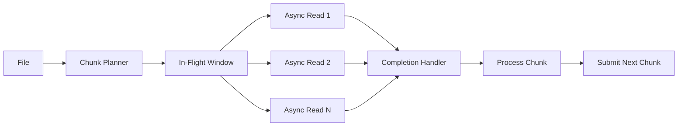

------
title: Learn Java IO, Modern IO, Streams, Buffers, Resources, Serialization & Data Boundaries - Part 020
description: Production-grade guide to AsynchronousFileChannel and completion-based file IO, covering positional async reads/writes, Future and CompletionHandler APIs, executor strategy, partial completion, cancellation, bounded concurrency, lifecycle, and when async file IO helps or hurts.
series: learn-java-io-modern-io-resource-boundaries
seriesTitle: Learn Java IO, Modern IO, Streams, Buffers, Resources, Serialization & Data Boundaries
order: 20
partTitle: AsynchronousFileChannel and Completion-Based IO
tags:
  - java
  - nio
  - asynchronousfilechannel
  - async-io
  - file-io
  - completion-handler
  - future
  - bytebuffer
  - bounded-concurrency
  - io-boundary
  - series
date: 2026-06-30
------

# Part 020 — AsynchronousFileChannel and Completion-Based IO

> Goal part ini: memahami `AsynchronousFileChannel` sebagai primitive **completion-based positional file IO**, bukan sebagai “lebih cepat otomatis”. Kita akan membahas kapan ia berguna, kapan blocking `FileChannel` lebih sederhana, bagaimana menangani partial read/write, bagaimana mengendalikan concurrency, dan bagaimana mendesain lifecycle yang aman.

Part 019 membahas selector-based non-blocking IO. Selector memberi tahu bahwa channel **siap**. `AsynchronousFileChannel` memakai model berbeda: kita mengajukan operasi, lalu menerima sinyal ketika operasi **selesai**.

```text
Selector model:
  wait for readiness
  call read/write yourself
  handle partial progress

AsynchronousFileChannel model:
  submit read/write at file position
  runtime completes operation later
  handle completed byte count or failure
```

Namun completion tidak berarti “semua selesai sesuai niat bisnis”. Satu async write masih bisa menulis sebagian. Satu async read masih bisa membaca sebagian. State machine tetap milik aplikasi.

---

## 1. What AsynchronousFileChannel Is

`AsynchronousFileChannel` is for asynchronous reading, writing, and manipulating a file. It operates on file positions, not an implicit stream cursor.

Core capabilities:

- open file with read/write options
- read bytes into `ByteBuffer` from a given file position
- write bytes from `ByteBuffer` to a given file position
- get file size
- truncate file
- force updates to storage
- acquire file locks asynchronously/synchronously depending on method
- receive completion through `Future` or `CompletionHandler`

Core non-goals:

- it is not a selector channel
- it does not preserve record boundaries
- it does not remove need for buffering discipline
- it does not remove need for `force`/durability decisions
- it does not guarantee faster throughput than well-designed blocking IO

Important mental model:

```text
AsynchronousFileChannel = positional operation submission API
Application = operation graph + buffers + offsets + concurrency limits + lifecycle
```

---

## 2. Readiness vs Completion

Comparison:

| Dimension | Selector-Based NIO | `AsynchronousFileChannel` |
|---|---|---|
| Trigger | readiness | operation completion |
| Typical channels | sockets, datagrams, pipes | files |
| Position model | channel dependent | explicit file position per operation |
| Notification | selected key | `Future` or `CompletionHandler` |
| State location | attachment/session | attachment/context object |
| Partial operation | must handle | must handle |
| Backpressure | interest ops and queues | bounded outstanding operations |

Do not mentally model `AsynchronousFileChannel` as “file selector”. It is a different programming model.

---

## 3. Opening an AsynchronousFileChannel

Basic open:

```java
Path path = Path.of("data.bin");

try (AsynchronousFileChannel channel = AsynchronousFileChannel.open(
        path,
        StandardOpenOption.READ)) {
    // submit async reads
}
```

Open for writing:

```java
try (AsynchronousFileChannel channel = AsynchronousFileChannel.open(
        path,
        StandardOpenOption.CREATE,
        StandardOpenOption.WRITE)) {
    // submit async writes
}
```

Open with executor:

```java
ExecutorService ioExecutor = Executors.newFixedThreadPool(8);

try (AsynchronousFileChannel channel = AsynchronousFileChannel.open(
        path,
        Set.of(StandardOpenOption.READ),
        ioExecutor)) {
    // completions may use the supplied executor depending on implementation
} finally {
    ioExecutor.shutdown();
}
```

Why supply an executor?

- isolate file IO completion work from common/system defaults
- bound concurrency
- give threads meaningful names
- apply operational controls
- avoid unintentional coupling with unrelated async work

Thread factory example:

```java
static ThreadFactory namedThreadFactory(String prefix) {
    AtomicInteger seq = new AtomicInteger();
    return task -> {
        Thread t = new Thread(task, prefix + "-" + seq.incrementAndGet());
        t.setDaemon(false);
        return t;
    };
}
```

---

## 4. Future API

The simplest API returns a `Future<Integer>`:

```java
ByteBuffer buffer = ByteBuffer.allocate(8192);
Future<Integer> future = channel.read(buffer, 0L);

int bytesRead = future.get();
```

This is easy to understand, but calling `get()` blocks the current thread. If you immediately block after submitting, you may not gain much over blocking `FileChannel`.

Future API is useful when:

- you submit multiple independent operations
- you collect completions later
- you want straightforward integration with existing blocking orchestration
- you have explicit timeout/cancellation policy

Example: submit several reads and then collect:

```java
record ReadTask(long position, ByteBuffer buffer, Future<Integer> future) {}

List<ReadTask> tasks = new ArrayList<>();
for (long position = 0; position < fileSize; position += CHUNK_SIZE) {
    ByteBuffer buffer = ByteBuffer.allocate(CHUNK_SIZE);
    Future<Integer> future = channel.read(buffer, position);
    tasks.add(new ReadTask(position, buffer, future));
}

for (ReadTask task : tasks) {
    int n = task.future().get();
    task.buffer().flip();
    processChunk(task.position(), task.buffer(), n);
}
```

But this has a dangerous flaw for large files: it submits all reads at once. Use bounded concurrency.

---

## 5. CompletionHandler API

The callback API:

```java
channel.read(buffer, position, attachment, new CompletionHandler<Integer, Attachment>() {
    @Override
    public void completed(Integer result, Attachment attachment) {
        // operation completed successfully
    }

    @Override
    public void failed(Throwable exc, Attachment attachment) {
        // operation failed
    }
});
```

The attachment is your operation context. Treat it like `SelectionKey.attachment()` in selector code.

Example context:

```java
record ReadContext(
        AsynchronousFileChannel channel,
        long position,
        ByteBuffer buffer,
        Consumer<ByteBuffer> onChunk,
        Consumer<Throwable> onError
) {}
```

Read once:

```java
static void readOnce(ReadContext ctx) {
    ctx.channel().read(ctx.buffer(), ctx.position(), ctx,
            new CompletionHandler<Integer, ReadContext>() {
                @Override
                public void completed(Integer n, ReadContext c) {
                    if (n == -1) {
                        c.buffer().flip();
                        c.onChunk().accept(c.buffer());
                        return;
                    }
                    c.buffer().flip();
                    c.onChunk().accept(c.buffer());
                }

                @Override
                public void failed(Throwable exc, ReadContext c) {
                    c.onError().accept(exc);
                }
            });
}
```

Callbacks are powerful but increase control-flow complexity. Keep callback bodies small and move policy into named methods.

---

## 6. Partial Reads Still Exist

A read operation completes with an integer count:

- positive: number of bytes read
- zero: possible depending on operation/context
- `-1`: end-of-file

If you require exactly N bytes from a position, you need `readFully` logic.

```java
static CompletableFuture<ByteBuffer> readFully(
        AsynchronousFileChannel channel,
        long position,
        int byteCount) {

    ByteBuffer buffer = ByteBuffer.allocate(byteCount);
    CompletableFuture<ByteBuffer> result = new CompletableFuture<>();
    readFully0(channel, position, buffer, result);
    return result;
}

static void readFully0(
        AsynchronousFileChannel channel,
        long position,
        ByteBuffer buffer,
        CompletableFuture<ByteBuffer> result) {

    if (!buffer.hasRemaining()) {
        buffer.flip();
        result.complete(buffer);
        return;
    }

    channel.read(buffer, position, null, new CompletionHandler<Integer, Void>() {
        @Override
        public void completed(Integer n, Void ignored) {
            if (n == -1) {
                result.completeExceptionally(new EOFException(
                        "EOF before reading requested byte count"));
                return;
            }
            if (n == 0) {
                // Avoid tight recursive completion if implementation returns zero repeatedly.
                readFully0(channel, position, buffer, result);
                return;
            }
            readFully0(channel, position + n, buffer, result);
        }

        @Override
        public void failed(Throwable exc, Void ignored) {
            result.completeExceptionally(exc);
        }
    });
}
```

Caution: recursive callback chains can become hard to reason about. For production, consider a small state object and explicit scheduling if completion can happen inline or very quickly.

---

## 7. Partial Writes Still Exist

A write operation completes with number of bytes written. It may write fewer bytes than the buffer has remaining.

`writeFully`:

```java
static CompletableFuture<Long> writeFully(
        AsynchronousFileChannel channel,
        long position,
        ByteBuffer source) {

    CompletableFuture<Long> result = new CompletableFuture<>();
    writeFully0(channel, position, source, 0L, result);
    return result;
}

static void writeFully0(
        AsynchronousFileChannel channel,
        long position,
        ByteBuffer source,
        long totalWritten,
        CompletableFuture<Long> result) {

    if (!source.hasRemaining()) {
        result.complete(totalWritten);
        return;
    }

    channel.write(source, position, null, new CompletionHandler<Integer, Void>() {
        @Override
        public void completed(Integer n, Void ignored) {
            if (n < 0) {
                result.completeExceptionally(new EOFException("unexpected negative write result"));
                return;
            }
            if (n == 0) {
                writeFully0(channel, position, source, totalWritten, result);
                return;
            }
            writeFully0(channel, position + n, source, totalWritten + n, result);
        }

        @Override
        public void failed(Throwable exc, Void ignored) {
            result.completeExceptionally(exc);
        }
    });
}
```

Invariant:

```text
If your logical operation requires all bytes to be written,
then one AsynchronousFileChannel.write call is not enough as a correctness boundary.
```

---

## 8. Buffer Ownership During Outstanding Operations

When a buffer is passed to async read/write, do not mutate or reuse it until the operation completes.

Bad:

```java
ByteBuffer buffer = ByteBuffer.allocate(8192);
channel.read(buffer, 0L);
buffer.clear(); // bug: operation may still be using it
```

Correct:

```java
ByteBuffer buffer = ByteBuffer.allocate(8192);
Future<Integer> future = channel.read(buffer, 0L);
int n = future.get();
buffer.flip();
```

With callbacks:

```java
channel.read(buffer, 0L, buffer, new CompletionHandler<Integer, ByteBuffer>() {
    @Override
    public void completed(Integer n, ByteBuffer b) {
        b.flip();
        process(b);
    }

    @Override
    public void failed(Throwable exc, ByteBuffer b) {
        release(b);
    }
});
```

Ownership invariant:

```text
Outstanding async operation owns the buffer's mutable state.
Application regains ownership only in completion/failure/cancellation handling.
```

This is one of the most important review rules for async file IO.

---

## 9. Positional IO and Ordering

`AsynchronousFileChannel` operations specify file position explicitly:

```java
channel.read(buffer, 1024L, attachment, handler);
channel.write(buffer, 4096L, attachment, handler);
```

This is powerful for parallel chunk IO, but it removes implicit ordering guarantees at the application level.

If two writes target overlapping regions, your application must define what happens.

```text
write A: position 0, length 100
write B: position 50, length 100
```

This is a data race at the file-content level unless intentionally coordinated.

Design rules:

- independent chunks may be written in parallel
- overlapping writes require serialization
- append-style file formats need an allocation/offset coordinator
- metadata commit should happen after data writes complete
- durability should be applied at commit boundary, not random operation boundary

---

## 10. Bounded Concurrency

The most common async IO mistake is unbounded submission.

Bad:

```java
for (long pos = 0; pos < fileSize; pos += CHUNK_SIZE) {
    channel.read(ByteBuffer.allocate(CHUNK_SIZE), pos, null, handler);
}
```

For a 100 GiB file, this can allocate huge memory and enqueue too many outstanding operations.

Use a semaphore or work window.

```java
final class AsyncChunkReader {
    private final AsynchronousFileChannel channel;
    private final int chunkSize;
    private final int maxInFlight;
    private final AtomicLong nextPosition = new AtomicLong();
    private final long fileSize;
    private final AtomicInteger inFlight = new AtomicInteger();
    private final CompletableFuture<Void> done = new CompletableFuture<>();
    private final AtomicReference<Throwable> failure = new AtomicReference<>();

    AsyncChunkReader(AsynchronousFileChannel channel, long fileSize,
                     int chunkSize, int maxInFlight) {
        this.channel = channel;
        this.fileSize = fileSize;
        this.chunkSize = chunkSize;
        this.maxInFlight = maxInFlight;
    }

    CompletableFuture<Void> start() {
        for (int i = 0; i < maxInFlight; i++) {
            submitNext();
        }
        return done;
    }

    private void submitNext() {
        if (failure.get() != null) {
            completeIfIdle();
            return;
        }

        long position = nextPosition.getAndAdd(chunkSize);
        if (position >= fileSize) {
            completeIfIdle();
            return;
        }

        int size = (int) Math.min(chunkSize, fileSize - position);
        ByteBuffer buffer = ByteBuffer.allocate(size);
        inFlight.incrementAndGet();

        channel.read(buffer, position, position, new CompletionHandler<Integer, Long>() {
            @Override
            public void completed(Integer n, Long pos) {
                try {
                    if (n == -1) {
                        // EOF may be acceptable at file end; here it is unexpected for a planned region.
                        throw new EOFException("unexpected EOF at position " + pos);
                    }
                    buffer.flip();
                    process(pos, buffer);
                } catch (Throwable t) {
                    failure.compareAndSet(null, t);
                } finally {
                    inFlight.decrementAndGet();
                    submitNext();
                }
            }

            @Override
            public void failed(Throwable exc, Long pos) {
                failure.compareAndSet(null, exc);
                inFlight.decrementAndGet();
                submitNext();
            }
        });
    }

    private void completeIfIdle() {
        if (inFlight.get() == 0) {
            Throwable t = failure.get();
            if (t == null) done.complete(null);
            else done.completeExceptionally(t);
        }
    }

    private void process(long position, ByteBuffer buffer) {
        // Application-specific chunk processing.
    }
}
```

This example is intentionally simplified. A production version needs better partial-read handling and cancellation. But the key design is the bounded window.

---

## 11. Chunked Parallel Read Pattern

Good use case: read independent fixed-size chunks from a large immutable file.



Suitable when:

- file is stable/immutable during read
- chunks are independent
- order is not required or can be reconstructed
- memory budget is bounded
- downstream processing is not slower than read rate, or has backpressure

Not suitable when:

- file format requires sequential parsing
- chunk boundary can split records without a parser plan
- downstream is slow and queue is unbounded
- disk is already saturated by other workloads
- operation order matters strongly

---

## 12. Ordered Output From Parallel Reads

Parallel reads complete out of order. If output order matters, you need reorder buffering.

```java
final class OrderedCollector {
    private final Map<Long, ByteBuffer> completed = new HashMap<>();
    private long nextExpectedPosition;

    void complete(long position, ByteBuffer chunk) {
        completed.put(position, chunk);
        drainReady();
    }

    private void drainReady() {
        while (true) {
            ByteBuffer next = completed.remove(nextExpectedPosition);
            if (next == null) {
                return;
            }
            emit(nextExpectedPosition, next);
            nextExpectedPosition += next.limit();
        }
    }

    private void emit(long position, ByteBuffer chunk) {
        // write/process in file order
    }
}
```

This introduces a memory risk: if an early chunk is delayed, many later chunks may accumulate. Bounded in-flight window is required.

---

## 13. Async Write Pattern: Staged File Assembly

Use case: write independent file regions, then publish a manifest or marker.

```text
1. allocate output file path in staging directory
2. write independent chunks at fixed offsets
3. wait for all chunk writes to complete
4. force file content if durability matters
5. write/force metadata or manifest
6. atomic move staging file into final location
```

Sketch:

```java
CompletableFuture<?>[] writes = chunks.stream()
        .map(chunk -> writeFully(channel, chunk.position(), chunk.buffer()))
        .toArray(CompletableFuture[]::new);

CompletableFuture<Void> allWrites = CompletableFuture.allOf(writes);

allWrites.thenRun(() -> {
    try {
        channel.force(true);
    } catch (IOException e) {
        throw new CompletionException(e);
    }
});
```

Do not mark the file as complete before all writes and commit actions finish.

---

## 14. Durability with AsynchronousFileChannel

`AsynchronousFileChannel` has `force(boolean metaData)`, similar in purpose to `FileChannel.force`.

Durability questions are the same as Part 012:

- Do we need file content durable?
- Do we need metadata durable?
- Do we rely on atomic rename?
- Do we need parent directory durability?
- What happens after process crash?
- What happens after OS crash?

Async operation completion does not imply crash durability.

```text
write completion => bytes accepted by OS/runtime path
force completion  => request to force updates to storage
atomic move       => namespace transition, not necessarily complete storage-barrier story
```

Safe publish pattern:

```java
Path tmp = finalPath.resolveSibling(finalPath.getFileName() + ".tmp");

try (AsynchronousFileChannel ch = AsynchronousFileChannel.open(
        tmp,
        StandardOpenOption.CREATE,
        StandardOpenOption.TRUNCATE_EXISTING,
        StandardOpenOption.WRITE)) {

    writeFully(ch, 0L, content).join();
    ch.force(true);
}

Files.move(tmp, finalPath,
        StandardCopyOption.ATOMIC_MOVE,
        StandardCopyOption.REPLACE_EXISTING);
```

For the strongest crash-consistency requirements, revisit directory fsync constraints from Part 012 and the deployment filesystem behavior.

---

## 15. Cancellation and Timeouts

The `Future` API exposes cancellation:

```java
Future<Integer> future = channel.read(buffer, position);
boolean cancelled = future.cancel(true);
```

But cancellation semantics can be implementation-specific in practical effect. You still need a failure policy if operation completes after timeout or if cancellation is not effective immediately.

Timeout wrapper:

```java
static <T> CompletableFuture<T> withTimeout(
        CompletableFuture<T> original,
        Duration timeout,
        ScheduledExecutorService scheduler) {

    CompletableFuture<T> timeoutFuture = new CompletableFuture<>();
    ScheduledFuture<?> scheduled = scheduler.schedule(
            () -> timeoutFuture.completeExceptionally(new TimeoutException()),
            timeout.toMillis(),
            TimeUnit.MILLISECONDS);

    return original.applyToEither(timeoutFuture, Function.identity())
            .whenComplete((r, t) -> scheduled.cancel(false));
}
```

Timeout policy choices:

| Policy | Meaning |
|---|---|
| fail logical operation only | ignore late completion but keep channel |
| close channel | force outstanding operations to fail eventually |
| cancel future | best-effort cancellation |
| retry at same offset | only safe if operation is idempotent and buffer ownership is clear |
| quarantine output | if partial write may have occurred |

For writes, timeout is especially tricky because partial data may already be on disk.

---

## 16. Close Semantics

If a channel is closed while operations are outstanding, those operations should fail, commonly with asynchronous close-related failure.

Design rule:

```text
A component that owns an AsynchronousFileChannel must coordinate:
  - no new submissions after closing begins
  - outstanding operation accounting
  - buffer release after completion/failure
  - channel close
  - executor shutdown if executor is owned
```

Lifecycle state:

```java
enum LifecycleState {
    OPEN,
    CLOSING,
    CLOSED
}
```

Submission gate:

```java
final class AsyncFileComponent implements AutoCloseable {
    private final AsynchronousFileChannel channel;
    private final AtomicReference<LifecycleState> state =
            new AtomicReference<>(LifecycleState.OPEN);

    CompletableFuture<ByteBuffer> read(long position, int size) {
        if (state.get() != LifecycleState.OPEN) {
            return CompletableFuture.failedFuture(
                    new ClosedChannelException());
        }
        return readFully(channel, position, size);
    }

    @Override
    public void close() throws IOException {
        if (state.compareAndSet(LifecycleState.OPEN, LifecycleState.CLOSING)) {
            channel.close();
            state.set(LifecycleState.CLOSED);
        }
    }
}
```

Production implementations also track in-flight operations and wait or fail fast depending on shutdown mode.

---

## 17. Error Taxonomy

Async file IO errors should be classified, not just logged.

| Error | Typical Meaning | Response |
|---|---|---|
| `EOFException` | expected bytes missing | fail parse/read operation |
| `ClosedChannelException` | channel closed before/during operation | coordinate lifecycle or fail request |
| `AsynchronousCloseException` | close interrupted outstanding operation | expected during shutdown, abnormal otherwise |
| `NoSuchFileException` | path missing | classify as input/config/dependency error |
| `AccessDeniedException` | permission/lock/policy issue | fail operation; surface operational detail |
| `FileSystemException` | provider-specific FS failure | include path/reason; retry only if safe |
| `IOException` | broad IO failure | classify by context |
| `OutOfMemoryError` | buffer over-allocation or memory pressure | reduce in-flight/window/buffer size |

Callback failure handling should preserve operation context:

```java
record OperationContext(
        Path path,
        long position,
        int expectedBytes,
        String operationName
) {}
```

Then wrap errors with context:

```java
static IOException enrich(Throwable error, OperationContext ctx) {
    return new IOException(
            ctx.operationName() + " failed at " + ctx.path()
                    + " position=" + ctx.position()
                    + " expectedBytes=" + ctx.expectedBytes(),
            error);
}
```

---

## 18. Completion Handler Design Rules

Bad callback:

```java
@Override
public void completed(Integer n, Ctx ctx) {
    parseHugeFile(ctx.buffer());
    callRemoteService();
    writeDatabase();
}
```

Problems:

- completion thread is blocked
- IO completion throughput drops
- hidden coupling to downstream systems
- error handling becomes unclear

Better:

```java
@Override
public void completed(Integer n, Ctx ctx) {
    if (n < 0) {
        ctx.result().completeExceptionally(new EOFException());
        return;
    }

    ctx.buffer().flip();
    ctx.cpuExecutor().execute(() -> {
        try {
            Parsed parsed = parse(ctx.buffer());
            ctx.result().complete(parsed);
        } catch (Throwable t) {
            ctx.result().completeExceptionally(t);
        }
    });
}
```

Rule:

```text
Completion handler should complete IO state and hand off heavy work.
It should not become the business workflow engine.
```

---

## 19. Integrating With CompletableFuture

`AsynchronousFileChannel` predates `CompletableFuture`, but wrapping it can simplify composition.

```java
static CompletableFuture<Integer> readAsync(
        AsynchronousFileChannel channel,
        ByteBuffer buffer,
        long position) {

    CompletableFuture<Integer> cf = new CompletableFuture<>();
    channel.read(buffer, position, null, new CompletionHandler<Integer, Void>() {
        @Override
        public void completed(Integer result, Void attachment) {
            cf.complete(result);
        }

        @Override
        public void failed(Throwable exc, Void attachment) {
            cf.completeExceptionally(exc);
        }
    });
    return cf;
}
```

Then:

```java
CompletableFuture<ByteBuffer> chunk = readAsync(channel, buffer, position)
        .thenApply(n -> {
            if (n == -1) throw new CompletionException(new EOFException());
            buffer.flip();
            return buffer;
        });
```

Caution:

- `thenApply` may run on completion thread.
- use `thenApplyAsync` with a chosen executor for heavier work.
- preserve buffer ownership boundaries.
- do not hide partial read/write requirements behind too-simple wrappers.

---

## 20. Virtual Threads and Blocking File IO

Modern Java makes blocking code more scalable with virtual threads, but file IO has different characteristics from network socket IO. Many OS/filesystem operations still consume kernel resources and storage bandwidth regardless of Java thread model.

Decision framing:

| Use Case | Reasonable Choice |
|---|---|
| simple sequential file read/write | `Files` or `FileChannel` with clear blocking code |
| many independent file operations with simple logic | virtual threads + bounded executor may be clearer |
| large positional chunk IO with bounded in-flight operations | `AsynchronousFileChannel` can be useful |
| latency-sensitive network server | selector/framework or virtual-thread design depending on constraints |
| complex streaming parser | sequential blocking may be easier and safer |
| custom storage engine region IO | `FileChannel`, mmap, or FFM depending on access pattern |

Do not choose async file IO because it sounds modern. Choose it when the operation graph benefits from overlapping independent file operations and when you can bound the complexity.

---

## 21. When AsynchronousFileChannel Helps

Good fits:

1. Parallel random reads from large immutable files.
2. File serving where chunks can be read independently.
3. Index/data file access by known offsets.
4. Background prefetch pipelines.
5. Large staged file assembly from independent chunks.
6. Systems that already use completion-based orchestration.
7. Workloads where blocking file threads are expensive or hard to isolate.

Poor fits:

1. Tiny files where overhead dominates.
2. Strictly sequential parsing.
3. Write-once small config files.
4. Codebase without async discipline.
5. Cases where you immediately block on every `Future`.
6. Workloads bottlenecked by storage throughput, not thread blocking.
7. Systems without clear memory and in-flight limits.

---

## 22. Async File Reader: A Bounded Design Sketch

A production-style shape:

```java
public final class BoundedAsyncFileReader implements AutoCloseable {
    private final AsynchronousFileChannel channel;
    private final Semaphore permits;
    private final int chunkSize;

    public BoundedAsyncFileReader(Path path, int maxInFlight, int chunkSize,
                                  ExecutorService executor) throws IOException {
        this.channel = AsynchronousFileChannel.open(
                path,
                Set.of(StandardOpenOption.READ),
                executor);
        this.permits = new Semaphore(maxInFlight);
        this.chunkSize = chunkSize;
    }

    public CompletableFuture<ByteBuffer> readChunk(long position, int size) {
        CompletableFuture<ByteBuffer> result = new CompletableFuture<>();

        try {
            permits.acquire();
        } catch (InterruptedException e) {
            Thread.currentThread().interrupt();
            return CompletableFuture.failedFuture(e);
        }

        ByteBuffer buffer = ByteBuffer.allocate(Math.min(size, chunkSize));
        channel.read(buffer, position, null, new CompletionHandler<Integer, Void>() {
            @Override
            public void completed(Integer n, Void ignored) {
                try {
                    if (n == -1) {
                        result.completeExceptionally(new EOFException());
                        return;
                    }
                    buffer.flip();
                    result.complete(buffer);
                } finally {
                    permits.release();
                }
            }

            @Override
            public void failed(Throwable exc, Void ignored) {
                try {
                    result.completeExceptionally(exc);
                } finally {
                    permits.release();
                }
            }
        });

        return result;
    }

    @Override
    public void close() throws IOException {
        channel.close();
    }
}
```

This still reads once, not necessarily fully. Depending on contract, wrap it with `readFully`.

---

## 23. Async Write Safety: Idempotency and Partial Output

Retries are not automatically safe.

Suppose a write times out:

```text
write bytes [0..8191] at position 0
application times out
operation may later complete partially or fully
application retries different content at position 0
```

Now file content may be ambiguous unless you coordinate carefully.

Safer write design:

- write immutable content for a region
- retry same bytes at same position only if idempotent
- avoid overlapping writes
- verify content length/checksum if needed
- commit with manifest after all regions complete
- publish final file atomically

For append-like semantics, do not let many operations guess append offsets. Allocate offsets centrally:

```java
AtomicLong nextOffset = new AtomicLong();

long allocate(int length) {
    return nextOffset.getAndAdd(length);
}
```

Then write at allocated positions.

---

## 24. Testing Async File IO

Tests must force non-happy paths.

Test cases:

- read empty file
- read exact chunk size
- read final partial chunk
- read beyond EOF
- write zero bytes
- write large buffer
- close while operation outstanding
- fail opening missing path
- access denied path if feasible
- bounded in-flight never exceeds configured limit
- cancellation/timeout policy
- partial read/write wrappers using fake channel or adapter

For deterministic tests, isolate operation orchestration from actual JDK channel where possible:

```java
interface AsyncPositionalReader {
    void read(ByteBuffer dst, long position,
              CompletionHandler<Integer, ReadRequest> handler,
              ReadRequest request);
}
```

Then inject a fake that completes:

- immediately
- later
- with partial count
- with EOF
- with failure
- out of order

This lets you test your state machine without depending on OS timing.

---

## 25. Observability Without Repeating Observability Series

For async file IO, minimum internal counters:

| Metric | Why It Matters |
|---|---|
| outstanding operations | detects unbounded submission |
| queued logical requests | detects upstream pressure |
| operation latency | detects storage slowdown |
| bytes read/written | throughput |
| completion failures by exception class | operational classification |
| cancellation/timeouts | deadline pressure |
| buffer allocation bytes | memory pressure |
| force latency | durability cost |

Log operation context on failure:

```text
operation=readFully path=/data/index.bin position=1048576 expectedBytes=4096 exception=EOFException
```

Avoid logging per successful chunk at high volume.

---

## 26. Production Review Checklist

### API Choice

- [ ] Is async file IO justified over blocking `FileChannel`/`Files`?
- [ ] Are operations independent enough to benefit from overlap?
- [ ] Is file access positional rather than naturally sequential?
- [ ] Is code complexity acceptable for the benefit?

### Correctness

- [ ] Are partial reads handled where full reads are required?
- [ ] Are partial writes handled where full writes are required?
- [ ] Are overlapping writes prevented or intentionally coordinated?
- [ ] Is EOF handled explicitly?
- [ ] Are file positions computed safely?
- [ ] Is publish/commit separated from data write completion?

### Resource Management

- [ ] Are outstanding operations bounded?
- [ ] Are buffers bounded and released after completion/failure?
- [ ] Are buffers not mutated while operation is outstanding?
- [ ] Is executor ownership clear?
- [ ] Is channel close coordinated with in-flight operations?

### Failure Handling

- [ ] Are exceptions enriched with path/position/operation context?
- [ ] Is timeout policy defined?
- [ ] Is cancellation policy defined?
- [ ] Are retries idempotent?
- [ ] Is partial output quarantined or recoverable?

### Durability

- [ ] Is `force` used only at meaningful commit boundaries?
- [ ] Is metadata durability considered when required?
- [ ] Is atomic move used for publish when appropriate?
- [ ] Is recovery behavior defined after crash?

---

## 27. Practice: Build an Async Chunk Copier

Build a file copier using `AsynchronousFileChannel`.

Requirements:

1. Input and output paths.
2. Chunk size configurable.
3. Max in-flight chunks configurable.
4. Use positional reads and writes.
5. Handle partial reads and partial writes.
6. Preserve output order by writing at the same offsets.
7. Do not submit more than max in-flight operations.
8. On any failure, close channels and delete/quarantine temp output.
9. Write to temp file first.
10. After all writes complete, call `force(true)`.
11. Publish with atomic move if supported.
12. Validate final size.

Stretch goals:

- compute checksum while copying
- report progress
- support cancellation
- simulate partial read/write in tests
- compare with `FileChannel.transferTo` and blocking copy

Review question:

```text
Does your copier remain correct if:
  - final chunk is smaller than chunk size?
  - read completes partially?
  - write completes partially?
  - chunk 10 completes before chunk 2?
  - output publish fails?
  - process crashes before atomic move?
```

---

## 28. Baeldung-Style Summary

`AsynchronousFileChannel` gives Java a completion-based API for positional file IO. It is useful when you have independent file regions, bounded outstanding operations, and a clear operation graph.

The core invariants:

```text
Completion is not full logical completion.
One read/write may be partial.
Buffers are owned by outstanding operations.
Positions are explicit and must not overlap accidentally.
Concurrency must be bounded.
Async completion does not imply durability.
Close/cancel/retry policies must be explicit.
```

Used well, `AsynchronousFileChannel` is a strong primitive for large-file and random-access workflows. Used casually, it creates callback complexity without improving correctness or performance.

---

## 29. References

- Java SE 25 API — `AsynchronousFileChannel`
- Java SE 25 API — `AsynchronousChannel`
- Java SE 25 API — `CompletionHandler`
- Java SE 25 API — `ByteBuffer`
- Java SE 25 API — `StandardOpenOption`
- Java SE 25 API — `Path`
- Java SE 25 API — `Files`

