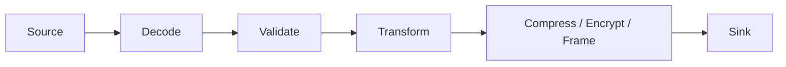
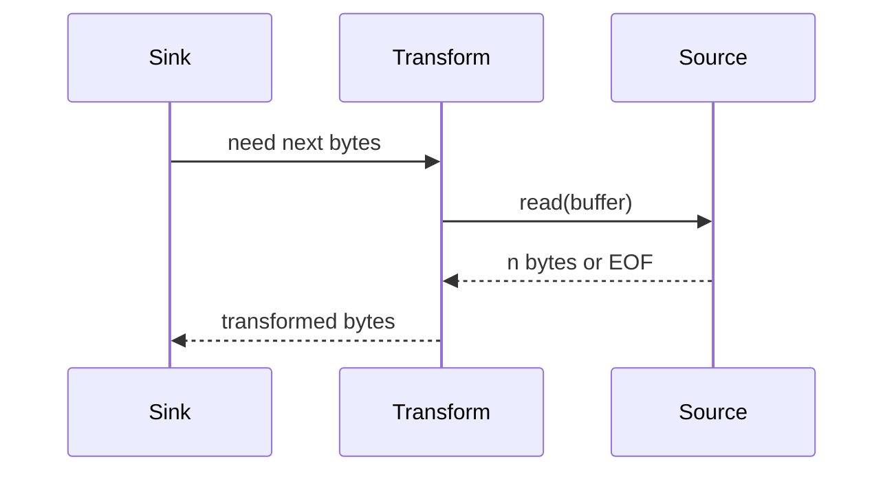
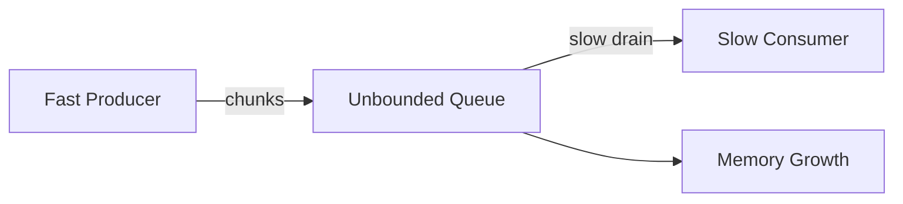
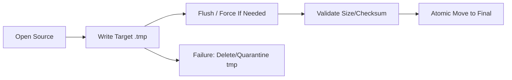
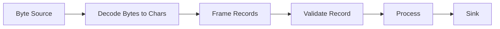

------
title: Learn Java IO, Modern IO, Streams, Buffers, Resources, Serialization & Data Boundaries - Part 021
description: Streaming pipelines and backpressure at Java IO boundaries: pull versus push, bounded memory, chunking, slow consumers, cancellation, close propagation, and production pipeline design.
series: learn-java-io-modern-io-resource-boundaries
seriesTitle: Learn Java IO, Modern IO, Streams, Buffers, Resources, Serialization & Data Boundaries
order: 21
partTitle: Streaming Pipelines and Backpressure at IO Boundaries
tags:
  - java
  - io
  - nio
  - streaming
  - backpressure
  - resource-management
  - boundary-design
  - series
date: 2026-06-30
---

# Part 021 — Streaming Pipelines and Backpressure at IO Boundaries

## 1. Why This Part Matters

In earlier parts, we learned the primitives:

- `InputStream` and `OutputStream` as classic byte streams.
- `Reader` and `Writer` as character streams.
- `Path`, `Files`, and filesystem semantics.
- `ByteBuffer`, `Channel`, `FileChannel`, `MappedByteBuffer`, and async file IO.

This part is about **composition**.

A production IO system is rarely just:

```java
byte[] data = Files.readAllBytes(path);
```

It is usually closer to this:



Examples:

- Read a large upload and store it safely.
- Stream a report from database rows to HTTP response.
- Copy a file from object storage to local disk.
- Parse a large newline-delimited file.
- Stream compressed records into an ingestion engine.
- Transfer a payload while computing checksum and byte count.
- Consume a socket/file/process output without unbounded memory growth.

The key question is not **“can Java read and write bytes?”**.

The real question is:

> Can we design an IO pipeline whose memory, latency, cancellation, error behavior, and resource ownership stay correct under pressure?

That is the top 1% distinction.

---

## 2. Kaufman Skill Slice

Following Josh Kaufman's rapid skill acquisition approach, we do not try to memorize every IO class. We deconstruct the skill into production-relevant sub-skills.

For this part, the target skill is:

> Given an IO source and an IO sink, design a bounded, cancelable, observable-enough, failure-safe streaming pipeline without accidentally materializing the whole payload.

### 2.1 Sub-Skills

| Sub-skill | What You Must Be Able To Do |
|---|---|
| Streaming mental model | Distinguish source, transform, sink, and boundary contracts |
| Pull vs push | Know who controls demand and why it matters |
| Chunking | Pick chunk size and state handling intentionally |
| Backpressure | Prevent fast producers from overwhelming slow consumers |
| Bounded memory | Avoid accidental full materialization |
| Cancellation | Stop upstream and downstream work promptly |
| Close propagation | Close the right things in the right order |
| Error propagation | Preserve failure cause without hiding cleanup failures |
| Replayability | Know whether the stream can be retried |
| Pipeline testing | Simulate partial reads, slow writes, early EOF, and failure mid-stream |

---

## 3. Streaming Is a Boundary Contract, Not a Syntax Style

Many developers use the word “streaming” loosely.

In production engineering, streaming means:

> Data is processed incrementally across a boundary without requiring the entire data set to be present in memory at once.

This definition has several implications.

A streaming pipeline should answer these questions:

1. Who owns the source?
2. Who owns the sink?
3. Who owns intermediate buffers?
4. Who decides how much data is pulled next?
5. What happens when downstream is slower than upstream?
6. What happens when the consumer cancels?
7. What happens if transform fails after some bytes have already been emitted?
8. Can the operation be retried safely?
9. Is the result atomic, partial, append-only, or externally visible as it is written?

If these questions are implicit, the pipeline is fragile.

---

## 4. The Core Streaming Loop

The simplest byte streaming loop is still one of the most important patterns in Java IO.

```java
static long copy(InputStream in, OutputStream out) throws IOException {
    byte[] buffer = new byte[64 * 1024];
    long total = 0;

    while (true) {
        int n = in.read(buffer);
        if (n == -1) {
            break;
        }
        out.write(buffer, 0, n);
        total += n;
    }

    return total;
}
```

This code is simple, but it encodes several invariants:

- `read` may return less than the buffer size.
- `read` returns `-1` for EOF.
- `write(buffer, 0, n)` must use the actual byte count.
- The buffer is reused.
- The pipeline is bounded by the buffer size.
- The caller owns close behavior.

A naive version often looks like this:

```java
byte[] all = in.readAllBytes();
out.write(all);
```

That is not a streaming pipeline. That is full materialization.

It may be acceptable for small bounded data, but it is not a general transfer primitive.

---

## 5. `InputStream.transferTo`: Useful but Not a Complete Design

Java provides `InputStream.transferTo(OutputStream)`.

```java
try (InputStream in = Files.newInputStream(source);
     OutputStream out = Files.newOutputStream(target)) {
    long bytes = in.transferTo(out);
}
```

This is concise and useful.

But it does not answer every production question:

| Concern | Is `transferTo` Enough? |
|---|---|
| Copy bytes from input to output | Yes |
| Bounded internal buffering | Generally yes |
| Progress callback | No |
| Cancellation check | Not explicit |
| Rate limit | No |
| Checksum while copying | No |
| Transform while copying | No |
| Retry policy | No |
| Atomic target replacement | No |
| Backpressure policy beyond blocking writes | No |

So `transferTo` is a good primitive, not a full architecture.

Use it when the pipeline is truly just **copy source bytes to sink** and no additional policy is required.

---

## 6. Pull-Based Pipelines

Classic Java IO is mostly pull-based.

The downstream consumer asks upstream for data:

```java
int n = source.read(buffer);
```

The reader controls demand.



Pull-based IO is naturally good for bounded memory because no stage produces more data than the next stage asks for.

But pull-based IO can still fail if one stage materializes data internally.

Bad transform:

```java
byte[] transformed = transform(in.readAllBytes());
out.write(transformed);
```

Good transform:

```java
byte[] buffer = new byte[64 * 1024];
while ((n = in.read(buffer)) != -1) {
    transformChunk(buffer, 0, n, out);
}
```

The real invariant is not “uses streams”.

The invariant is:

> Each stage must process bounded chunks and must not accumulate unbounded data unless the boundary contract explicitly allows it.

---

## 7. Push-Based Pipelines

In push-based pipelines, upstream emits data to downstream.

Common examples:

- callback-based parsers
- event listeners
- process output gobblers
- reactive streams
- async completion handlers
- HTTP client response subscribers

Pseudo-model:

```java
source.onChunk(chunk -> sink.accept(chunk));
```

Push pipelines are powerful, but they need a demand signal.

Without backpressure, a fast source can overwhelm a slow sink.



A push pipeline without backpressure usually hides the problem in one of these places:

- unbounded queue
- unbounded byte array
- unbounded list of records
- executor task backlog
- OS pipe buffer
- socket send buffer
- HTTP response buffer
- framework-managed request body buffer

Top-level rule:

> Push requires explicit demand, bounded queues, or a loss/rejection strategy.

---

## 8. Backpressure: The Most Important Production Concept

Backpressure is the mechanism by which a slow downstream stage limits the upstream production rate.

In blocking IO, backpressure often appears as a blocking `write`.

```java
out.write(buffer, 0, n); // may block if sink is slow
```

That is not a bug. It is the control signal.

A dangerous design tries to “avoid blocking” by moving writes to an unbounded executor:

```java
while ((n = in.read(buffer)) != -1) {
    byte[] copy = Arrays.copyOf(buffer, n);
    executor.submit(() -> out.write(copy));
}
```

This removes natural backpressure and replaces it with unbounded memory/task growth.

Better:

```java
BlockingQueue<byte[]> queue = new ArrayBlockingQueue<>(64);
```

But a bounded queue still requires policy:

- block producer?
- fail fast?
- drop?
- spill to disk?
- slow down upstream?
- cancel entire operation?

For IO pipelines handling correctness-sensitive data, dropping is usually unacceptable. Blocking, failing, or spilling are more common.

---

## 9. The Bounded Pipeline Invariant

Every streaming design should state its maximum memory usage.

Example:

```text
maxMemory ~= chunkSize * inFlightChunks + perStageState
```

For a single-threaded copy:

```text
maxMemory ~= 64 KiB + small object overhead
```

For a producer-consumer pipeline:

```text
maxMemory ~= queueCapacity * chunkSize + perConsumerBuffers
```

Example:

```text
queueCapacity = 128
chunkSize = 256 KiB
consumerCount = 4

queuedBytes ~= 128 * 256 KiB = 32 MiB
consumerBuffers ~= 4 * 256 KiB = 1 MiB
```

This is acceptable if intentional.

It is a production incident if accidental.

---

## 10. Chunk Size Is a Design Parameter

Chunk size affects:

- syscall count
- memory usage
- latency to first byte
- CPU cache behavior
- compression ratio in some designs
- progress granularity
- cancellation responsiveness
- fairness between streams

There is no universal best size.

Common starting points:

| Workload | Reasonable Starting Chunk |
|---|---:|
| Small file copy | 8 KiB–64 KiB |
| Large sequential file copy | 64 KiB–1 MiB |
| Network streaming | 8 KiB–64 KiB |
| Compression pipeline | 32 KiB–256 KiB |
| Many concurrent streams | smaller chunks to bound aggregate memory |
| Few large transfers | larger chunks may reduce overhead |

The correct process is:

1. Pick a bounded default.
2. Calculate aggregate memory.
3. Benchmark with realistic payloads.
4. Measure latency and throughput.
5. Revisit under concurrency.

Avoid tuning chunk size in isolation.

---

## 11. Bounded Materialization

Materialization is not always wrong.

It is wrong when unbounded or accidental.

Acceptable materialization:

```java
byte[] header = in.readNBytes(16);
```

Dangerous materialization:

```java
byte[] body = in.readAllBytes();
```

unless the input has a trusted maximum size.

A good boundary contract states:

```java
record PayloadPolicy(long maxBytes, int chunkSize) {}
```

Then materialization becomes explicit:

```java
static byte[] readSmallPayload(InputStream in, long maxBytes) throws IOException {
    ByteArrayOutputStream out = new ByteArrayOutputStream();
    byte[] buffer = new byte[8192];
    long total = 0;

    while (true) {
        int n = in.read(buffer);
        if (n == -1) {
            return out.toByteArray();
        }
        total += n;
        if (total > maxBytes) {
            throw new IOException("payload exceeds maxBytes: " + maxBytes);
        }
        out.write(buffer, 0, n);
    }
}
```

Now the code communicates the invariant:

> This method intentionally materializes, but only up to a bounded maximum.

---

## 12. Streaming With Progress and Checksum

A common production requirement is copying while computing metadata.

```java
record TransferResult(long bytes, long crc32) {}

static TransferResult copyWithCrc32(InputStream in, OutputStream out) throws IOException {
    CRC32 crc = new CRC32();
    byte[] buffer = new byte[64 * 1024];
    long total = 0;

    while (true) {
        int n = in.read(buffer);
        if (n == -1) {
            break;
        }
        crc.update(buffer, 0, n);
        out.write(buffer, 0, n);
        total += n;
    }

    return new TransferResult(total, crc.getValue());
}
```

This pattern is often better than a separate checksum pass because it avoids another full read.

But be careful: the checksum describes what was read and attempted to write. It does not by itself prove the sink durably stored the bytes.

If durability matters, combine this with Part 012 patterns:

1. write to staging file
2. compute checksum while writing
3. flush/force as required
4. validate expected size/checksum
5. atomically promote

---

## 13. Streaming With Limit Enforcement

A pipeline that reads from untrusted or variable-size input should enforce limits as close to the source as possible.

```java
final class LimitedInputStream extends FilterInputStream {
    private long remaining;

    LimitedInputStream(InputStream in, long maxBytes) {
        super(in);
        if (maxBytes < 0) {
            throw new IllegalArgumentException("maxBytes must be >= 0");
        }
        this.remaining = maxBytes;
    }

    @Override
    public int read() throws IOException {
        if (remaining == 0) {
            throw new IOException("input exceeds configured limit");
        }
        int b = super.read();
        if (b != -1) {
            remaining--;
        }
        return b;
    }

    @Override
    public int read(byte[] b, int off, int len) throws IOException {
        Objects.checkFromIndexSize(off, len, b.length);
        if (len == 0) {
            return 0;
        }
        if (remaining == 0) {
            throw new IOException("input exceeds configured limit");
        }
        int allowed = (int) Math.min(len, remaining);
        int n = super.read(b, off, allowed);
        if (n != -1) {
            remaining -= n;
        }
        return n;
    }
}
```

This wrapper changes the source contract:

- caller cannot accidentally consume more than allowed
- downstream code does not need to remember the limit
- violation is detected during read, not after OOM

---

## 14. Pipeline Close Propagation

Close behavior must be designed, not assumed.

There are three common ownership models.

### 14.1 Caller Owns Both Ends

```java
static long copy(InputStream in, OutputStream out) throws IOException {
    return in.transferTo(out);
}
```

This method does **not** close either stream.

That is often the best library design because ownership remains with the caller.

### 14.2 Method Owns Created Resources

```java
static long copyFile(Path source, Path target) throws IOException {
    try (InputStream in = Files.newInputStream(source);
         OutputStream out = Files.newOutputStream(target)) {
        return in.transferTo(out);
    }
}
```

This method creates the streams, so it owns closing them.

### 14.3 Wrapper Owns Downstream on Close

Decorator streams typically propagate close to the wrapped stream.

```java
try (GZIPOutputStream gzip = new GZIPOutputStream(Files.newOutputStream(path))) {
    gzip.write(data);
}
```

Closing `gzip` must finish the compression stream and close the underlying output stream.

Do not bypass the outermost wrapper.

Bad:

```java
OutputStream raw = Files.newOutputStream(path);
GZIPOutputStream gzip = new GZIPOutputStream(raw);
gzip.write(data);
raw.close(); // may skip gzip trailer/finalization
```

Correct:

```java
gzip.close();
```

---

## 15. Cancellation

A streaming pipeline needs a way to stop.

Cancellation can come from:

- HTTP client disconnect
- user abort
- timeout
- application shutdown
- downstream validation failure
- disk full
- upstream source failure

A simple synchronous design can poll a cancellation token between chunks.

```java
interface CancellationToken {
    boolean isCancelled();
}

static long copyCancellable(
        InputStream in,
        OutputStream out,
        CancellationToken cancellation
) throws IOException {
    byte[] buffer = new byte[64 * 1024];
    long total = 0;

    while (true) {
        if (cancellation.isCancelled()) {
            throw new InterruptedIOException("transfer cancelled after " + total + " bytes");
        }

        int n = in.read(buffer);
        if (n == -1) {
            return total;
        }

        out.write(buffer, 0, n);
        total += n;
    }
}
```

However, cancellation polling does not always interrupt a blocking `read` or `write` immediately.

Depending on the source/sink, you may need to:

- close the stream/channel from another thread
- interrupt the worker thread if the primitive responds to interruption
- use channels with timeouts where available
- design with non-blocking IO
- apply socket/read timeout at the boundary
- bound executor shutdown behavior

Do not promise “instant cancellation” unless the underlying primitive supports it.

---

## 16. Timeouts Are Boundary Policy

Classic file IO generally does not have a timeout parameter.

Network IO often does.

Process IO may block if the child process does not produce/consume as expected.

A production transfer policy often includes:

```java
record TransferPolicy(
        int chunkSize,
        long maxBytes,
        Duration idleTimeout,
        Duration totalTimeout
) {}
```

Two timeout types matter:

| Timeout | Meaning |
|---|---|
| Idle timeout | No progress for too long |
| Total timeout | Operation exceeded overall time budget |

Idle timeout requires tracking progress:

```java
long lastProgressNanos = System.nanoTime();
```

But implementing correct timeouts around blocking streams often requires additional infrastructure, such as a worker thread plus cancellation by close.

Keep the contract honest:

> This method enforces timeout between chunks only if the underlying read/write returns control.

---

## 17. Error Propagation in Pipelines

A pipeline can fail in multiple places:

- source read failure
- transform failure
- sink write failure
- flush failure
- close failure
- cancellation
- validation failure after bytes were written

The error model should preserve the primary failure.

Try-with-resources helps by attaching close failures as suppressed exceptions.

```java
try (InputStream in = Files.newInputStream(source);
     OutputStream out = Files.newOutputStream(target)) {
    in.transferTo(out);
}
```

If `transferTo` fails and `close` also fails, the close failure is available through `Throwable.getSuppressed()`.

Do not replace useful failures with vague errors.

Bad:

```java
catch (IOException e) {
    throw new RuntimeException("copy failed");
}
```

Better:

```java
catch (IOException e) {
    throw new UncheckedIOException("copy failed: " + source + " -> " + target, e);
}
```

For library code, prefer checked `IOException` unless the abstraction deliberately hides IO.

---

## 18. Partial Output Is a First-Class State

Many IO pipelines produce partial output if they fail midway.

Examples:

- partially written file
- partially sent HTTP response
- partially appended log
- partially extracted archive
- partially consumed input stream
- partially moved staging artifact

Your pipeline should define what partial means.

### 18.1 Safe File Output Pattern



This prevents consumers from seeing incomplete final output.

### 18.2 Append-Only Output Pattern

For append-only logs, partial output is expected but must be recoverable.

Use:

- record length
- record checksum
- magic/version
- recovery scan
- truncate bad tail

This overlaps with Part 008 and Part 012.

---

## 19. Replayability

A streaming source may be one-shot.

| Source | Replayable? |
|---|---|
| `byte[]` | Yes |
| `Path` | Usually yes, if file unchanged |
| `InputStream` from socket | No |
| HTTP request body | Usually no |
| Process stdout | No |
| `Supplier<InputStream>` backed by file | Usually yes |
| `ByteBuffer` | Depends on position/duplicate/reset contract |

Retry logic depends on replayability.

Bad API:

```java
void upload(InputStream body);
```

If upload fails after reading half the stream, retry is impossible unless the caller can reconstruct the stream.

Better API for retryable source:

```java
void upload(Supplier<? extends InputStream> bodySupplier);
```

But the contract must be explicit:

> The supplier must return a fresh stream positioned at byte 0 for each invocation.

For file-backed retry:

```java
Supplier<InputStream> body = () -> Files.newInputStream(path);
```

---

## 20. Push-to-Pull Adapter

Sometimes we need to connect a push source to a pull consumer.

Example:

- callback parser emits chunks
- downstream expects `InputStream`

Common solution: pipe.

```java
PipedInputStream in = new PipedInputStream();
PipedOutputStream out = new PipedOutputStream(in);
```

But Java pipe streams are easy to misuse:

- they require separate threads for producer and consumer
- small internal buffer can create deadlocks
- errors must cross thread boundary manually
- close/cancellation must be coordinated

A safer architecture usually uses:

- bounded queue of chunks
- explicit end marker
- explicit error marker
- cancellation signal

Pseudo-design:

```java
sealed interface ChunkEvent permits DataChunk, EndOfStream, StreamFailure {}
record DataChunk(byte[] bytes, int length) implements ChunkEvent {}
record EndOfStream() implements ChunkEvent {}
record StreamFailure(Throwable cause) implements ChunkEvent {}
```

This makes the pipeline protocol visible.

---

## 21. Queue-Based Pipeline Pattern

A bounded producer-consumer pipeline can look like this:

```java
final class Chunk {
    final byte[] data;
    final int length;

    Chunk(byte[] data, int length) {
        this.data = data;
        this.length = length;
    }
}
```

Producer:

```java
static void produce(InputStream in, BlockingQueue<Chunk> queue, int chunkSize) throws IOException, InterruptedException {
    while (true) {
        byte[] buffer = new byte[chunkSize];
        int n = in.read(buffer);
        if (n == -1) {
            queue.put(new Chunk(buffer, -1));
            return;
        }
        queue.put(new Chunk(buffer, n));
    }
}
```

Consumer:

```java
static void consume(BlockingQueue<Chunk> queue, OutputStream out) throws IOException, InterruptedException {
    while (true) {
        Chunk chunk = queue.take();
        if (chunk.length == -1) {
            return;
        }
        out.write(chunk.data, 0, chunk.length);
    }
}
```

This is not complete production code because it does not propagate failures both ways. But it illustrates the backpressure property:

> `queue.put` blocks when the queue is full.

A production version must add:

- poison/end marker
- failure marker
- cancellation token
- executor lifecycle
- close coordination
- timeout policy
- bounded allocation or buffer pooling

---

## 22. Buffer Reuse Versus Ownership

Buffer reuse is good in single-threaded pipelines.

```java
byte[] buffer = new byte[64 * 1024];
while ((n = in.read(buffer)) != -1) {
    out.write(buffer, 0, n);
}
```

But in async or queued pipelines, reuse can corrupt data.

Bad:

```java
byte[] buffer = new byte[64 * 1024];
while ((n = in.read(buffer)) != -1) {
    queue.put(new Chunk(buffer, n)); // same array reused
}
```

The producer may overwrite the buffer before the consumer reads it.

Options:

1. allocate a new array per chunk
2. copy into owned immutable chunk
3. use a buffer pool with strict acquire/release discipline
4. process synchronously and avoid queueing

The invariant:

> Once a buffer crosses an async boundary, ownership must transfer or the bytes must be copied.

---

## 23. Transform Pipelines

A transform pipeline changes bytes or records.

Examples:

- compression
- encryption
- Base64
- CSV to records
- NDJSON parser
- checksum
- filtering
- redaction
- canonicalization

There are two broad transform types.

### 23.1 Stateless Chunk Transform

Each chunk can be transformed independently.

Example: byte counting.

```java
long total = 0;
while ((n = in.read(buffer)) != -1) {
    total += n;
    out.write(buffer, 0, n);
}
```

### 23.2 Stateful Transform

The transform needs state across chunks.

Examples:

- UTF-8 decoder
- compression stream
- encryption block mode
- line parser
- record parser

For stateful transforms, chunk boundary is not record boundary.

Bad assumption:

```java
String chunk = new String(buffer, 0, n, StandardCharsets.UTF_8);
```

A multibyte UTF-8 character can be split across chunks.

Use a decoder or a higher-level reader when doing text.

This is why Part 007 exists.

---

## 24. Record Streaming

Many systems process records, not just bytes.

Example:

```text
record\nrecord\nrecord\n
```

A record streaming pipeline has two layers:



Important invariant:

> Byte chunks, character chunks, and records are different boundaries.

A newline may appear:

- within a buffer
- across two buffers
- as `\n`
- as `\r\n`
- inside quoted CSV field
- inside escaped JSON string

Do not build a record parser by blindly splitting raw byte chunks unless the format contract permits it.

---

## 25. Streaming Text Lines Safely

For line-oriented text files:

```java
try (BufferedReader reader = Files.newBufferedReader(path, StandardCharsets.UTF_8)) {
    String line;
    while ((line = reader.readLine()) != null) {
        process(line);
    }
}
```

This is streaming at the line level.

But there are caveats:

- a single line can still be huge
- `readLine` removes line terminator
- charset errors depend on decoder behavior
- newline semantics may matter
- line number tracking should be explicit

If line size is untrusted, add a maximum line length policy.

---

## 26. `Files.lines`: Convenient but Requires Closing

`Files.lines(path, charset)` returns a Java `Stream<String>` backed by an open file.

It must be closed.

```java
try (Stream<String> lines = Files.lines(path, StandardCharsets.UTF_8)) {
    lines.forEach(this::process);
}
```

Do not return it casually from a method unless the caller clearly owns closing it.

Bad:

```java
Stream<String> readLines(Path path) throws IOException {
    return Files.lines(path);
}
```

This leaks ownership complexity to the caller.

If you do return it, document:

> The returned stream must be closed by the caller.

For many production cases, a callback is safer:

```java
static void forEachLine(Path path, Charset charset, Consumer<String> consumer) throws IOException {
    try (BufferedReader reader = Files.newBufferedReader(path, charset)) {
        String line;
        while ((line = reader.readLine()) != null) {
            consumer.accept(line);
        }
    }
}
```

The method owns the resource lifecycle.

---

## 27. Streaming and Java `Stream<T>` Are Not the Same Thing

Java `Stream<T>` is a functional abstraction.

IO streaming is a resource and boundary abstraction.

They can overlap, but they are not identical.

A Java `Stream<String>` from `Files.lines` is IO-backed and must be closed.

A Java `Stream<Integer>` from `List.of(1, 2, 3).stream()` is not an IO resource.

Do not assume that because code uses `Stream<T>`, it is memory-safe or resource-safe.

Examples:

```java
List<String> lines = Files.lines(path).toList(); // materializes
```

This uses stream syntax but not streaming memory behavior.

---

## 28. Streaming HTTP Response Pattern

A common application pattern:

```java
void writeReport(OutputStream responseBody) throws IOException {
    try (Writer writer = new BufferedWriter(
            new OutputStreamWriter(responseBody, StandardCharsets.UTF_8))) {
        for (ReportRow row : rows()) {
            writer.write(format(row));
            writer.write('\n');
        }
    }
}
```

Be careful: should this method close `responseBody`?

In many web frameworks, the container owns the response stream. Closing may be acceptable or may interfere with framework behavior depending on the API.

A safer reusable method:

```java
void writeReport(Writer writer) throws IOException {
    for (ReportRow row : rows()) {
        writer.write(format(row));
        writer.write('\n');
    }
    writer.flush();
}
```

The framework adapter owns stream creation and closing.

---

## 29. Streaming Upload to File Pattern

Production upload ingestion should avoid direct final writes.

```java
record StoredObject(Path finalPath, long size, long crc32) {}

static StoredObject storeUpload(InputStream body, Path stagingDir, Path finalPath) throws IOException {
    Path tmp = Files.createTempFile(stagingDir, "upload-", ".tmp");
    boolean promoted = false;

    try {
        TransferResult result;
        try (OutputStream out = Files.newOutputStream(tmp, StandardOpenOption.WRITE)) {
            result = copyWithCrc32(body, out);
        }

        Files.move(tmp, finalPath,
                StandardCopyOption.ATOMIC_MOVE,
                StandardCopyOption.REPLACE_EXISTING);
        promoted = true;
        return new StoredObject(finalPath, result.bytes(), result.crc32());
    } finally {
        if (!promoted) {
            try {
                Files.deleteIfExists(tmp);
            } catch (IOException cleanupFailure) {
                // log or attach in real implementation
            }
        }
    }
}
```

This pattern separates:

- streaming ingestion
- staging
- validation
- promotion
- cleanup

For stronger durability, integrate `FileChannel.force` and parent directory sync as discussed in Part 012.

---

## 30. Streaming Compression Pattern

Compression streams are stateful wrappers.

```java
static long gzip(Path source, Path target) throws IOException {
    try (InputStream in = new BufferedInputStream(Files.newInputStream(source));
         OutputStream fileOut = new BufferedOutputStream(Files.newOutputStream(target));
         GZIPOutputStream gzipOut = new GZIPOutputStream(fileOut)) {
        return in.transferTo(gzipOut);
    }
}
```

Important points:

- close the outer compression stream
- do not assume input bytes equal output bytes
- progress should track input and/or output separately
- checksum of compressed bytes differs from checksum of original bytes
- failure mid-compression usually produces unusable output

If output must be atomic, write compressed data to a staging file first.

---

## 31. Slow Consumer Handling

A slow consumer is not exceptional. It is normal.

Examples:

- network client on poor connection
- disk under pressure
- downstream API throttling
- CPU-heavy compression
- remote object store latency

Strategies:

| Strategy | When It Fits |
|---|---|
| Blocking backpressure | simple synchronous correctness |
| Bounded queue | decouple short bursts |
| Rate limit | protect downstream or fairness |
| Spill to disk | preserve data when memory must stay bounded |
| Fail fast | interactive request with strict SLA |
| Cancel | caller no longer needs result |

Anti-strategy:

```java
List<byte[]> chunks = new ArrayList<>();
```

This just moves the backpressure bug into heap memory.

---

## 32. Streaming Pipeline Review Checklist

Before approving a streaming pipeline, ask:

1. What is the maximum memory usage per transfer?
2. What is the maximum aggregate memory at peak concurrency?
3. Does any stage call `readAllBytes`, `toByteArray`, `toList`, or collect unbounded records?
4. What is the chunk size and why?
5. Who closes source and sink?
6. Does close happen on success, failure, and cancellation?
7. Is partial output visible to consumers?
8. Is final output promoted atomically?
9. Can the input be retried?
10. Are size limits enforced near the source?
11. Is character decoding stateful and correct across chunk boundaries?
12. Are queue sizes bounded?
13. What happens when downstream is slow?
14. What happens when upstream fails after partial output?
15. Is cancellation best-effort or guaranteed?
16. Are timeouts idle, total, or both?
17. Are errors wrapped with enough context?
18. Are cleanup failures preserved or at least logged?
19. Does the pipeline work with tiny chunks, huge payloads, and mid-stream failure?
20. Does the test suite simulate partial reads and writes?

---

## 33. Practice Lab: Build a Bounded Transfer Engine

Implement this API:

```java
record TransferPolicy(
        int chunkSize,
        long maxBytes,
        boolean computeCrc32
) {}

record TransferReport(
        long bytesRead,
        long bytesWritten,
        OptionalLong crc32
) {}

interface TransferProgress {
    void onProgress(long bytesRead, long bytesWritten);
}

static TransferReport transfer(
        InputStream source,
        OutputStream sink,
        TransferPolicy policy,
        TransferProgress progress
) throws IOException {
    // implement
}
```

Requirements:

- Do not close source or sink.
- Enforce `maxBytes`.
- Use bounded memory.
- Support progress callback.
- Compute CRC32 if configured.
- Correctly handle EOF.
- Correctly handle zero-length reads if encountered.
- Do not write stale buffer bytes.
- Preserve `IOException`.

Then test with:

1. empty input
2. input smaller than chunk
3. input exactly one chunk
4. input larger than chunk
5. input exceeding maxBytes
6. source fails mid-stream
7. sink fails mid-stream
8. progress callback throws
9. tiny chunk size of 1 byte
10. large input generated lazily

---

## 34. Common Anti-Patterns

### 34.1 Stream Syntax Masquerading as Streaming

```java
Files.lines(path).toList();
```

This can materialize the entire file.

### 34.2 Unbounded ByteArrayOutputStream

```java
ByteArrayOutputStream out = new ByteArrayOutputStream();
in.transferTo(out);
```

This is full materialization unless bounded.

### 34.3 Async Queue Without Backpressure

```java
executor.submit(() -> write(chunk));
```

If submission is unbounded, memory grows under slow sinks.

### 34.4 Ignoring Partial Writes in Channels

For channels, `write` may write fewer bytes than requested.

Loop until buffer is drained.

### 34.5 Closing the Wrong Layer

Close the outermost stream wrapper.

### 34.6 Splitting Text by Byte Chunks

Byte chunk boundaries are not character or line boundaries.

### 34.7 Retrying One-Shot Streams

An `InputStream` is usually consumed once.

---

## 35. Mental Model Summary

A streaming pipeline is a controlled flow of data across boundaries.

The core production invariants are:

1. **Bounded memory** — no accidental full materialization.
2. **Explicit ownership** — the code that creates a resource usually closes it.
3. **Backpressure** — slow downstream must slow upstream or trigger policy.
4. **Correct framing** — byte chunks are not records.
5. **Correct lifecycle** — close, flush, finish, cancel, and cleanup are distinct.
6. **Partial-state awareness** — failure after partial output is a real state.
7. **Replayability awareness** — retry requires a replayable source.
8. **Failure transparency** — preserve the real cause and boundary context.

When you review IO code, do not ask only:

> Does it work for my file?

Ask:

> What happens when the data is huge, slow, malformed, partial, cancelled, retried, or fails halfway?

That is production IO thinking.

---

## 36. References

- Java SE 25 API — `java.io` package: https://docs.oracle.com/en/java/javase/25/docs/api/java.base/java/io/package-summary.html
- Java SE 25 API — `InputStream`: https://docs.oracle.com/en/java/javase/25/docs/api/java.base/java/io/InputStream.html
- Java SE 25 API — `OutputStream`: https://docs.oracle.com/en/java/javase/25/docs/api/java.base/java/io/OutputStream.html
- Java SE 25 API — `Files`: https://docs.oracle.com/en/java/javase/25/docs/api/java.base/java/nio/file/Files.html
- Java SE 25 API — `java.nio.channels` package: https://docs.oracle.com/en/java/javase/25/docs/api/java.base/java/nio/channels/package-summary.html
- Java SE 25 API — `ByteBuffer`: https://docs.oracle.com/en/java/javase/25/docs/api/java.base/java/nio/ByteBuffer.html
