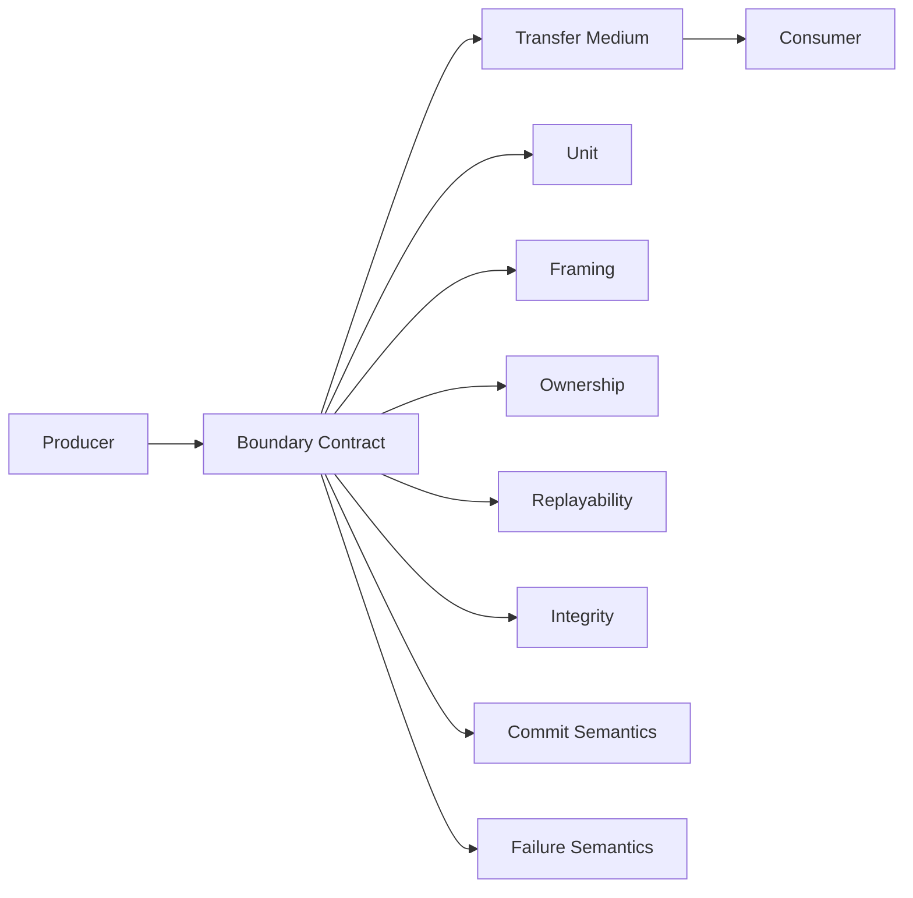
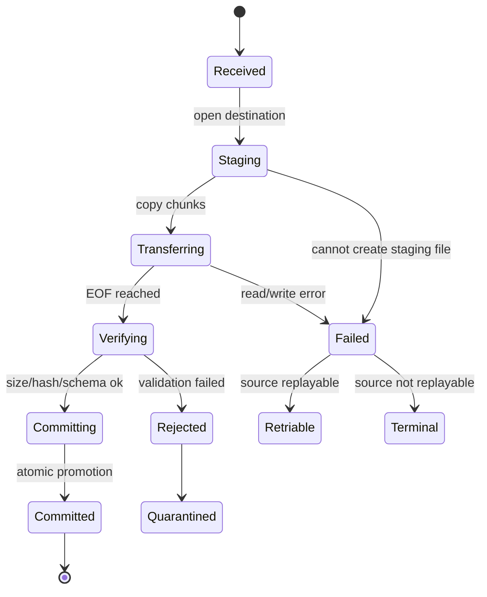
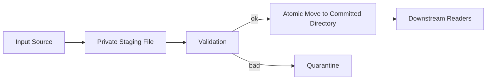
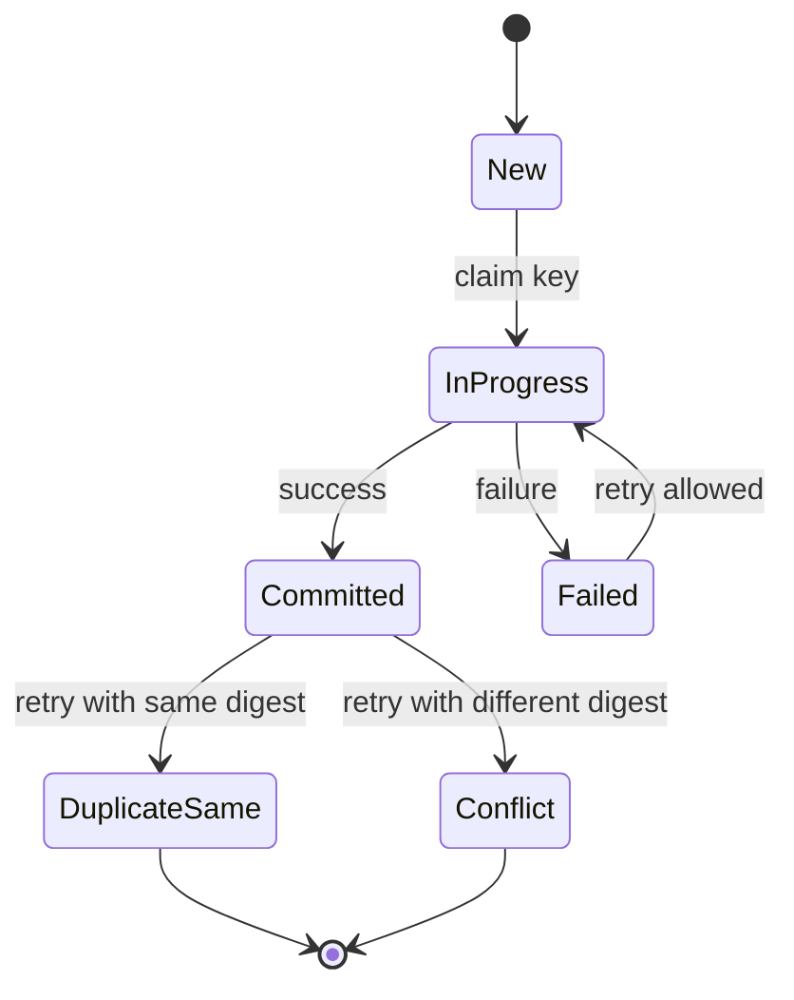
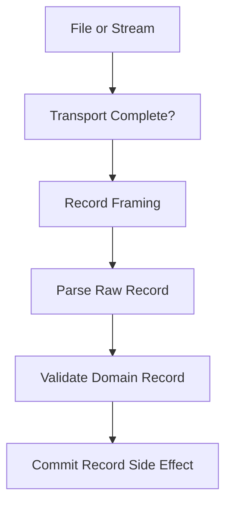

------
title: Learn Java IO, Modern IO, Streams, Buffers, Resources, Serialization & Data Boundaries - Part 023
description: Data transfer boundaries in Java IO: files, streams, messages, records, framing, replayability, idempotency, staging, checksums, partial failure, and production-grade transfer contracts.
series: learn-java-io-modern-io-resource-boundaries
seriesTitle: Learn Java IO, Modern IO, Streams, Buffers, Resources, Serialization & Data Boundaries
order: 23
partTitle: Data Transfer Boundaries: Files, Streams, Messages, Records
tags:
  - java
  - io
  - data-transfer
  - boundaries
  - streams
  - files
  - records
  - framing
  - series
date: 2026-06-30
---

# Part 023 — Data Transfer Boundaries: Files, Streams, Messages, Records

## 1. Why This Part Matters

Most IO bugs in enterprise systems are not caused by developers forgetting how to call `read()` or `write()`.
They come from weak boundary contracts.

A producer says, "I sent the file."
A consumer says, "I processed the file."
An operator says, "The job succeeded."
A downstream system says, "The data is missing, duplicated, truncated, or inconsistent."

The gap is usually here:

- Was the data transferred completely?
- Was it transferred exactly once, at least once, or maybe more than once?
- Was it validated before being committed?
- Was a partial output visible to readers?
- Is the input replayable after a failure?
- Is the body seekable or one-shot?
- Is the boundary byte-oriented, text-oriented, record-oriented, or object-oriented?
- Is framing explicit or inferred?
- Is the consumer allowed to close the stream?
- Is the transfer atomic from the business point of view?

This part treats IO as **data movement across trust, durability, ownership, and interpretation boundaries**.

We already covered individual primitives in earlier parts:

- `InputStream` and `OutputStream`
- `Reader` and `Writer`
- `Path` and `Files`
- `ByteBuffer`
- `FileChannel`
- buffering
- resource lifecycle
- file atomicity
- streaming pipeline
- API boundary design

Now we combine them into a production mental model for **data transfer boundaries**.

The goal is not merely to write bytes from A to B. The goal is to design a transfer contract that remains correct under partial read, partial write, retry, crash, duplicate delivery, concurrent readers, malformed records, slow storage, and human operational recovery.

---

## 2. Kaufman Skill Slice

Following the Kaufman approach, we deconstruct this skill into a small set of high-leverage capabilities.

### 2.1 Target Performance Level

After this part, you should be able to design and review a Java data transfer boundary and answer, without hand-waving:

1. What exactly is the unit of transfer?
2. Is the source replayable?
3. Is the destination atomic?
4. How do we detect truncation or corruption?
5. What happens if the process dies mid-transfer?
6. What happens if the transfer is retried?
7. What happens if a record is malformed?
8. What happens if the consumer is slower than the producer?
9. Which API shape exposes the right contract?
10. Which state transitions are visible to other actors?

### 2.2 Sub-skills

| Sub-skill | What to learn | Why it matters |
|---|---|---|
| Boundary classification | file, stream, message, record, object, chunk | Each has different failure semantics |
| Replayability | one-shot vs reopenable vs seekable | Determines retry and validation strategy |
| Framing | length-prefix, delimiter, fixed-width, chunked, manifest | Prevents ambiguity and truncation bugs |
| Staging | temp path, validate, commit | Prevents partial output visibility |
| Idempotency | hash, key, version, checkpoint | Prevents duplicate side effects |
| Integrity | size, digest, CRC, count | Detects corruption and incomplete transfer |
| Recovery | checkpoint, quarantine, retry policy | Turns failure into controlled state |
| Ownership | who closes, who deletes, who commits | Prevents leaks and accidental data loss |
| Backpressure | bounded buffers, pull loops, cancellation | Prevents memory collapse |
| Observability surface | metrics/events without redoing observability series | Makes boundary debuggable |

### 2.3 Practice Unit

A good practice unit for this part is:

> Build a file ingestion component that accepts a one-shot `InputStream`, writes it to a staging file, computes size and digest while streaming, validates metadata, atomically promotes the file, and returns a replayable `Path` for downstream record parsing.

That one exercise forces you to understand resource ownership, stream consumption, staging, digesting, validation, atomicity, and transfer metadata.

---

## 3. The Core Mental Model

A data transfer boundary is not just a pipe.

It is a contract between four things:



A strong boundary contract defines:

- **unit**: what is being transferred?
- **shape**: file, stream, message, record, chunk, object, page?
- **lifetime**: ephemeral, durable, temporary, committed?
- **ownership**: who opens, reads, closes, deletes, renames?
- **framing**: how does the consumer know where one unit ends?
- **interpretation**: bytes, text, binary grammar, object graph, domain record?
- **integrity**: how do we know it is complete and uncorrupted?
- **idempotency**: what happens on retry?
- **visibility**: when is output visible to others?
- **recovery**: how do we resume, rollback, quarantine, or replay?

Weak IO design often hides these inside incidental implementation details.

Top-tier IO design exposes them as explicit state transitions.

---

## 4. Four Common Boundary Shapes

### 4.1 File Boundary

A file boundary represents a durable named byte sequence in a filesystem.

Typical Java representation:

```java
Path inputFile;
Path outputFile;
```

Properties:

| Property | Typical value |
|---|---|
| Replayable | Yes, if file remains available |
| Seekable | Usually yes |
| Durable | Maybe, depending on fsync and storage semantics |
| Metadata available | size, timestamps, permissions, owner, attributes |
| Partial output risk | High unless staged |
| Concurrent visibility | High unless controlled |
| Best for | batch ingestion, large payloads, audit artifacts, handoff directories |

A file boundary is strong when:

- readers never see partial files
- writers use staging paths
- commits are explicit
- metadata is validated
- duplicate detection exists
- delete/archive policy is explicit

A file boundary is weak when:

- producer writes directly to the final path
- consumer polls final directory and reads files still being written
- filename is treated as reliable business identity without validation
- `Files.exists()` is used as an authority before later open/write/delete operations
- partial files and failed files are indistinguishable from complete files

### 4.2 Stream Boundary

A stream boundary represents a sequential one-shot flow of bytes or characters.

Typical Java representation:

```java
InputStream body;
OutputStream destination;
Reader text;
Writer writer;
```

Properties:

| Property | Typical value |
|---|---|
| Replayable | No, unless wrapped by a replayable source |
| Seekable | No |
| Durable | No by itself |
| Metadata available | Often incomplete or absent |
| Partial output risk | High unless destination is staged |
| Backpressure | Natural if pull-based, dangerous if materialized |
| Best for | HTTP bodies, socket payloads, process pipes, compression, encryption, upload/download |

A stream boundary is strong when:

- the owner of the stream is clear
- consumers do not assume replayability
- size limits are enforced while reading
- output is staged before commit
- cancellation closes the stream
- parsing handles EOF and partial frames explicitly

A stream boundary is weak when:

- it calls `readAllBytes()` on untrusted or unbounded input
- the same `InputStream` is passed to multiple consumers
- validation happens after irreversible side effects
- downstream code closes a stream it does not own
- retry logic assumes the stream can be reread

### 4.3 Message Boundary

A message boundary represents a discrete payload with metadata.

Examples:

- broker message body
- HTTP request/response body plus headers
- S3-like object event plus object key
- command/event envelope
- uploaded part metadata plus body stream

Typical Java representation:

```java
record PayloadMessage(
    String messageId,
    String contentType,
    Long contentLength,
    InputStream body
) {}
```

Properties:

| Property | Typical value |
|---|---|
| Replayable | Depends on transport and retention |
| Seekable | Usually no for body stream |
| Metadata available | Often yes through headers/envelope |
| Unit boundary | Usually explicit |
| Idempotency needed | Almost always |
| Best for | service-to-service transfer, broker handoff, upload events, task payloads |

A message boundary is strong when the envelope clearly separates:

- identity
- routing metadata
- integrity metadata
- format/version metadata
- body access
- retry semantics

A message boundary is weak when:

- message ID is confused with business idempotency key
- body format version is implicit
- payload is assumed small
- acknowledgement happens before durable staging
- reprocessing causes duplicate side effects

### 4.4 Record Boundary

A record boundary represents a logical item inside a larger file, stream, or message.

Examples:

- one line in NDJSON
- one row in CSV
- one fixed-width banking transaction
- one TLV entry
- one protobuf message inside a file
- one length-prefixed event inside a binary stream

Typical representation:

```java
record TransferRecord(
    long index,
    long byteOffset,
    byte[] rawBody
) {}
```

Properties:

| Property | Typical value |
|---|---|
| Replayable | Depends on parent boundary |
| Seekable | If offsets are known and source is seekable |
| Unit boundary | Must be explicit or inferable |
| Partial failure | Common |
| Best for | batch processing, import files, audit trails, append logs |

A record boundary is strong when:

- record index and/or byte offset is tracked
- malformed records can be isolated
- parsing is deterministic
- checkpointing is based on committed records, not just bytes read
- business validation is separated from transport parsing

A record boundary is weak when:

- line number is the only identity but records can span lines
- a bad record aborts the entire file without quarantine policy
- offsets are lost after parsing
- records are committed before the transfer itself is verified
- delimiter parsing ignores escaping, encoding, or truncation

---

## 5. Boundary Dimension Matrix

When reviewing an IO design, classify it across these dimensions.

| Dimension | Questions |
|---|---|
| Unit | What is the smallest complete thing? file, chunk, record, message, object? |
| Replayability | Can the consumer read it again? How? From same stream, reopened file, broker redelivery, archive? |
| Seekability | Can we resume from offset or index? |
| Size | Known, bounded, unbounded, attacker-controlled? |
| Framing | How do we know where the unit ends? |
| Commit | When does the output become visible? |
| Integrity | Size, digest, CRC, count, footer, manifest? |
| Idempotency | What identifies a duplicate? |
| Ordering | Does order matter? Is it globally or partition-local? |
| Ownership | Who closes, deletes, renames, acknowledges? |
| Failure | What states are possible after crash or timeout? |
| Recovery | Retry, resume, replay, quarantine, compensate? |
| Observability | What can operators see without inspecting raw data? |

This table is more important than memorizing more IO classes.

---

## 6. The Transfer State Machine

A robust transfer is a state machine, not a single method call.



The important part is not the labels. The important part is that each state has clear invariants.

| State | Invariant |
|---|---|
| Received | Boundary metadata captured; no durable side effect yet |
| Staging | Destination exists only in private/staging namespace |
| Transferring | Partial bytes may exist, but not visible as committed output |
| Verifying | Input is complete from transport perspective; output still not committed |
| Committing | Atomic promotion attempted |
| Committed | Readers may observe output; idempotency key recorded |
| Failed | Partial artifact is either deleted, retained for debug, or quarantined |
| Rejected | Data is complete but invalid |
| Quarantined | Invalid artifact isolated with reason and metadata |

If your design cannot list these states, it probably relies on hope.

---

## 7. Replayability: The First Design Question

The most important question for any transfer boundary is:

> Can we read this data again after failure?

### 7.1 One-shot Source

Examples:

- raw `InputStream` from HTTP request
- socket input
- process stdout
- decompression stream
- encryption stream
- broker body stream in some client APIs

A one-shot source must be consumed carefully.

Bad design:

```java
void process(InputStream in) throws IOException {
    validate(in);
    parse(in); // BUG: stream already consumed
}
```

Better design:

```java
Path staged = stageOnce(in, stagingDir);
validate(staged);
parse(staged);
```

The stream is consumed once into a replayable representation.

### 7.2 Reopenable Source

Examples:

- `Path`
- object storage key
- database blob with repeatable read semantics
- classpath resource if accessible repeatedly

A reopenable source can provide a new stream each time.

```java
@FunctionalInterface
interface BodySource {
    InputStream openStream() throws IOException;
}
```

This is stronger than passing an already-open `InputStream`.

```java
void process(BodySource source) throws IOException {
    try (InputStream first = source.openStream()) {
        // validate or hash
    }
    try (InputStream second = source.openStream()) {
        // parse independently
    }
}
```

### 7.3 Seekable Source

Examples:

- `FileChannel`
- `SeekableByteChannel`
- memory-mapped file
- byte array wrapper

Seekability enables:

- resumable transfer
- random access parsing
- footer validation
- index-based record lookup
- retry from known offset

But seekability is not free. A design that requires seekability cannot accept an arbitrary `InputStream` without staging first.

---

## 8. Framing: How the Consumer Knows Where Data Ends

A stream is only a sequence of bytes. The consumer needs framing to recover units.

### 8.1 EOF Framing

The whole stream is one unit.

```text
[ bytes ... until EOF ]
```

Works for:

- file upload body
- downloaded artifact
- compressed file body

Risks:

- no embedded unit boundary
- truncation can look like a valid EOF unless size/digest/footer exists
- not suitable for multiplexing many records unless the whole file is the record

### 8.2 Fixed-width Framing

Each record has known length.

```text
[100 bytes][100 bytes][100 bytes]
```

Works for:

- legacy banking files
- fixed-width telecom exports
- binary records with stable schema

Risks:

- schema evolution is hard
- character encoding can break width assumptions if width is in characters but transfer is bytes
- padding and trimming rules become part of the protocol

### 8.3 Delimiter Framing

Records are separated by a delimiter.

```text
record1\nrecord2\nrecord3\n
```

Works for:

- line-delimited text
- NDJSON
- simple logs

Risks:

- delimiter escaping
- multi-line records
- final line without newline
- newline differences
- malformed encoding before delimiter detection

### 8.4 Length-prefix Framing

Each record starts with length.

```text
[length][body][length][body]
```

Works for:

- binary protocols
- multiplexed streams
- record logs
- framed messages over sockets

Risks:

- length overflow
- negative length
- malicious huge length
- EOF before full body
- disagreement about endian and length field size

Example safe read:

```java
static byte[] readFrame(DataInputStream in, int maxFrameSize) throws IOException {
    int length;
    try {
        length = in.readInt();
    } catch (EOFException eof) {
        return null; // clean EOF between frames
    }

    if (length < 0 || length > maxFrameSize) {
        throw new IOException("Invalid frame length: " + length);
    }

    byte[] body = new byte[length];
    in.readFully(body); // throws EOFException on truncated frame
    return body;
}
```

The key point: `readFully` distinguishes a complete body from a short read.

### 8.5 Chunked Framing

The transfer is broken into chunks, often with metadata per chunk.

```text
[chunk-header][chunk-body][chunk-header][chunk-body]...[end]
```

Works for:

- resumable upload
- streaming compression
- large transfer with progress
- network protocols

Risks:

- chunk integrity vs whole-object integrity
- reordering
- duplicate chunks
- finalization semantics
- partial final chunk

### 8.6 Manifest Framing

A manifest describes one or more payloads.

```text
manifest.json
payload-0001.bin
payload-0002.bin
payload-0003.bin
```

Works for:

- batch exchange
- multi-file transfer
- data lake ingestion
- partner integration
- regulatory/audit handoff

Risks:

- manifest and payload inconsistency
- manifest committed before payloads
- missing payloads
- stale payloads reused accidentally
- unclear commit marker

---

## 9. Integrity: Detecting Incomplete or Corrupt Transfer

A transfer without integrity metadata is difficult to trust.

Common integrity signals:

| Signal | Detects | Does not detect |
|---|---|---|
| byte count | truncation/extra bytes if expected known | byte substitution with same length |
| record count | missing/extra records | corrupt record body if count unchanged |
| CRC | accidental corruption | malicious tampering |
| cryptographic hash | accidental corruption and strong identity | semantic validity |
| footer | incomplete file if footer missing | all logical schema errors |
| manifest | missing payloads, expected sizes/hashes | correctness of domain meaning |
| signature | authenticity/integrity if key managed correctly | parser bugs and business validation |

For most internal high-volume transfer boundaries, a practical baseline is:

- total byte count
- record count when record-oriented
- SHA-256 digest for full payload
- explicit format version
- commit timestamp
- producer identity
- idempotency key

Example transfer metadata:

```java
record TransferReceipt(
    String transferId,
    long byteCount,
    String sha256Hex,
    long startedAtMillis,
    long completedAtMillis,
    Path committedPath
) {}
```

Compute digest while copying, not by reading the input twice.

```java
static TransferReceipt stageWithDigest(
    String transferId,
    InputStream source,
    Path stagingFile,
    Path committedFile
) throws IOException {
    MessageDigest digest;
    try {
        digest = MessageDigest.getInstance("SHA-256");
    } catch (NoSuchAlgorithmException e) {
        throw new IllegalStateException(e);
    }

    long started = System.currentTimeMillis();
    long bytes = 0;

    Files.createDirectories(stagingFile.getParent());

    try (InputStream in = source;
         OutputStream rawOut = Files.newOutputStream(
             stagingFile,
             StandardOpenOption.CREATE_NEW,
             StandardOpenOption.WRITE
         );
         DigestOutputStream out = new DigestOutputStream(rawOut, digest)) {

        byte[] buffer = new byte[64 * 1024];
        int n;
        while ((n = in.read(buffer)) != -1) {
            out.write(buffer, 0, n);
            bytes += n;
        }
    }

    String hash = HexFormat.of().formatHex(digest.digest());

    Files.createDirectories(committedFile.getParent());
    Files.move(stagingFile, committedFile, StandardCopyOption.ATOMIC_MOVE);

    return new TransferReceipt(
        transferId,
        bytes,
        hash,
        started,
        System.currentTimeMillis(),
        committedFile
    );
}
```

Production version should add:

- maximum size limit
- expected digest check when available
- expected content length check when available
- file force/dir force if crash durability is required
- failure cleanup/quarantine policy
- idempotency record
- metrics/events

---

## 10. Staging and Commit Discipline

The most important rule for file-like output:

> Do not write directly to the final visible name.

Write to a staging location, verify, then commit.



### 10.1 Unsafe Direct Write

```java
try (OutputStream out = Files.newOutputStream(finalPath)) {
    source.transferTo(out);
}
```

If the JVM dies halfway through, readers may observe a partial file at `finalPath`.

### 10.2 Safer Staged Write

```java
Path tmp = stagingDir.resolve(finalPath.getFileName() + "." + UUID.randomUUID() + ".tmp");

try {
    try (InputStream in = source;
         OutputStream out = Files.newOutputStream(tmp, StandardOpenOption.CREATE_NEW)) {
        in.transferTo(out);
    }

    validate(tmp);
    Files.move(tmp, finalPath, StandardCopyOption.ATOMIC_MOVE);
} catch (Throwable t) {
    try {
        Files.deleteIfExists(tmp);
    } catch (IOException cleanupFailure) {
        t.addSuppressed(cleanupFailure);
    }
    throw t;
}
```

Staging gives the design a clean separation between:

- bytes being written
- bytes completed but not trusted
- bytes committed for consumption

### 10.3 Commit Marker Pattern

Sometimes the payload cannot be atomically moved as one unit, especially when many files are involved.

Pattern:

1. Write payload files to a batch directory.
2. Verify all payloads.
3. Write manifest.
4. Write final small `_COMMITTED` marker last.
5. Consumers only process directories with `_COMMITTED`.

```text
batch-2026-06-30-001/
  payload-0001.dat
  payload-0002.dat
  manifest.json
  _COMMITTED
```

The marker becomes the visibility boundary.

It must be written after all required data is durable enough for your requirement.

---

## 11. Idempotency and Duplicate Transfer

Retries are unavoidable.

A correct transfer boundary must define whether repeated delivery is:

- ignored
- overwritten
- versioned
- rejected
- merged
- compensated

### 11.1 Message ID Is Not Always Idempotency ID

A broker message ID may change across retries or republishing.
A business payload may be the same with a new transport envelope.

Better idempotency keys:

- producer system + producer file id
- business batch id
- content digest
- object storage bucket/key/version
- partner id + sequence number
- domain command id

### 11.2 Idempotent Commit Table

Even for file-based IO, store a commit record.

```java
record TransferCommit(
    String idempotencyKey,
    String committedPath,
    long byteCount,
    String sha256Hex,
    Instant committedAt
) {}
```

On retry:

- if same key and same digest: return previous success
- if same key and different digest: reject as conflict
- if new key: process normally

This avoids duplicate side effects.

### 11.3 Idempotency State Machine



The core invariant:

> A committed idempotency key must never silently map to different content.

---

## 12. Record Processing Boundaries

Record-oriented processing introduces a second boundary inside the transfer.



Do not collapse these into one catch-all `processLine` method.

### 12.1 Record Identity

A good record identity includes:

- transfer id
- record index
- byte offset when available
- raw record hash when useful
- business key if parse succeeds

```java
record RawRecord(
    String transferId,
    long index,
    long byteOffset,
    byte[] body
) {}
```

This allows precise quarantine:

```java
record RejectedRecord(
    String transferId,
    long index,
    long byteOffset,
    String reason,
    byte[] rawBody
) {}
```

### 12.2 Transport Validity vs Record Validity

A file may be transport-valid but contain business-invalid records.

| Layer | Example failure | Typical action |
|---|---|---|
| Transport | truncated file, wrong digest, missing footer | reject whole transfer |
| Framing | length says 100 bytes but EOF after 70 | reject whole transfer or recover to last complete record |
| Syntax | CSV row has invalid quote escaping | reject row or file depending contract |
| Semantic | account id unknown | quarantine row or produce domain rejection |
| Side effect | DB commit fails | retry or stop with checkpoint |

Mixing these layers leads to poor recovery.

### 12.3 Checkpoint by Committed Record, Not Read Record

Bad checkpoint:

```text
lastReadRecord = 1000
```

If the process crashes after reading record 1000 but before committing its side effect, resuming from 1001 loses data.

Better checkpoint:

```text
lastCommittedRecord = 999
```

Resume from 1000.

### 12.4 Offset-Aware Reader Skeleton

For byte-oriented formats, track offsets before reading each frame.

```java
final class FramedRecordReader implements Closeable {
    private final DataInputStream in;
    private long offset;
    private long index;
    private final int maxFrameSize;

    FramedRecordReader(InputStream source, int maxFrameSize) {
        this.in = new DataInputStream(new BufferedInputStream(source));
        this.maxFrameSize = maxFrameSize;
    }

    RawRecord next(String transferId) throws IOException {
        long recordOffset = offset;

        int length;
        try {
            length = in.readInt();
            offset += Integer.BYTES;
        } catch (EOFException cleanEof) {
            return null;
        }

        if (length < 0 || length > maxFrameSize) {
            throw new IOException("Invalid frame length at offset " + recordOffset + ": " + length);
        }

        byte[] body = new byte[length];
        in.readFully(body);
        offset += length;

        return new RawRecord(transferId, index++, recordOffset, body);
    }

    @Override
    public void close() throws IOException {
        in.close();
    }
}
```

The implementation is simple, but the contract is explicit.

---

## 13. The Boundary Contract Document

For serious systems, write a boundary contract document.

A minimal transfer contract:

```yaml
name: partner-settlement-import
unit: batch-file
transport: SFTP drop directory
format: length-prefixed binary records
encoding: binary; strings inside records are UTF-8
producer: partner-system-a
consumer: settlement-ingestion-service
visibility: file appears in incoming directory only after producer rename
consumer-staging: required
max-size-bytes: 5368709120
integrity:
  - expected byte count in control file
  - SHA-256 digest in control file
  - record count in trailer
idempotency-key: partner-id + business-date + batch-sequence
commit:
  - write to private staging
  - verify digest and trailer
  - atomic move to committed directory
retry:
  - same idempotency key + same digest returns previous success
  - same idempotency key + different digest rejected
record-errors:
  malformed: reject whole file
  semantic-invalid: quarantine record and continue up to threshold
crash-recovery:
  staging files older than 24h are inspected and either retried or quarantined
```

This is not bureaucracy. It is executable thinking.

---

## 14. Java API Shapes for Transfer Boundaries

Part 022 already covered API design generally. Here we focus specifically on transfer semantics.

### 14.1 Accept `Path` When You Need Replayability and Metadata

```java
TransferReceipt ingest(Path source) throws IOException;
```

This implies:

- source can be reopened
- size can be queried
- metadata may be inspected
- validation and parsing can be separate passes
- caller controls source lifecycle unless documented otherwise

### 14.2 Accept `InputStream` When You Consume Once

```java
TransferReceipt ingest(InputStream source) throws IOException;
```

This implies:

- method probably closes source if documented
- source is not replayable
- method must validate while consuming or stage first
- retry belongs outside unless staged

Document ownership explicitly:

```java
/**
 * Consumes and closes {@code source}. The source is read exactly once.
 */
TransferReceipt ingest(InputStream source) throws IOException;
```

### 14.3 Accept `Supplier<InputStream>` for Reopenable Stream Source

```java
TransferReceipt ingest(ThrowingSupplier<InputStream> source) throws IOException;
```

This implies:

- method may open multiple streams
- caller must ensure each stream sees the same data
- useful for validation + parse separation

But do not use `Supplier<InputStream>` if the source is actually one-shot. That lies to the API consumer.

### 14.4 Accept `ReadableByteChannel` for ByteBuffer Pipelines

```java
long transfer(ReadableByteChannel source, WritableByteChannel target) throws IOException;
```

Useful when:

- using direct buffers
- composing with NIO channels
- integrating with socket/file channels
- needing scatter/gather or non-stream transfer primitives

### 14.5 Return a Receipt, Not Just `void`

Bad:

```java
void ingest(InputStream source) throws IOException;
```

Better:

```java
TransferReceipt ingest(InputStream source) throws IOException;
```

A receipt makes the boundary observable and testable.

---

## 15. Bounded Transfer Pump

A transfer pump should have explicit limits.

```java
static long copyBounded(InputStream in, OutputStream out, long maxBytes) throws IOException {
    byte[] buffer = new byte[64 * 1024];
    long total = 0;

    while (true) {
        int n = in.read(buffer);
        if (n == -1) {
            return total;
        }

        total += n;
        if (total > maxBytes) {
            throw new IOException("Input exceeds max allowed size: " + maxBytes);
        }

        out.write(buffer, 0, n);
    }
}
```

Do not materialize first and check later:

```java
byte[] all = in.readAllBytes(); // dangerous for unbounded input
if (all.length > maxBytes) { ... }
```

By the time you check, memory has already been consumed.

---

## 16. Transfer Failure Taxonomy

A useful transfer boundary distinguishes failure types.

| Failure | Meaning | Retry? | Typical handling |
|---|---|---|---|
| Source unavailable | cannot open/read input | maybe | retry with backoff |
| Source changed | metadata/digest changed across attempts | no or conflict | reject or restart |
| Destination unavailable | cannot write staging/output | maybe | retry |
| Size limit exceeded | source too large | no | reject |
| Truncated input | EOF before expected frame/footer | maybe if source can be resent | reject artifact |
| Digest mismatch | bytes differ from expected | no until producer fixes | quarantine/reject |
| Format error | framing/parser failed | usually no | reject transfer or record |
| Semantic error | record parsed but invalid | depends | reject/quarantine record |
| Duplicate same content | retry of completed transfer | yes as no-op | return previous receipt |
| Duplicate conflicting content | same key different content | no | conflict alert |
| Commit failure | cannot promote output | maybe | retry commit if staging intact |
| Ack failure | output committed but producer not acked | dangerous | idempotent retry required |

Notice the ack failure case. It is one of the most important distributed-system IO edge cases:

1. Consumer stages and commits file.
2. Consumer fails before acknowledging producer/broker.
3. Producer/broker retries.
4. Consumer must not duplicate side effects.

The fix is not "avoid failure". The fix is idempotent commit.

---

## 17. Pattern: Stage Once, Then Fan Out

When multiple consumers need the same one-shot input, do not pass the same stream around.

Bad:

```java
validate(inputStream);
computeDigest(inputStream);
parse(inputStream);
archive(inputStream);
```

Better:

```java
Path staged = stage(inputStream);
ValidationResult validation = validate(staged);
String digest = computeDigest(staged);
parse(staged);
archive(staged);
```

This converts one-shot flow into durable replayable source.

Trade-off:

- more disk IO
- much better correctness
- easier diagnostics
- simpler retry
- easier operator recovery

For small trusted payloads, in-memory staging may be acceptable. For unknown or large payloads, prefer disk/object storage staging.

---

## 18. Pattern: Envelope + Body

A boundary should separate metadata from bytes.

```java
record TransferEnvelope(
    String transferId,
    String producer,
    String contentType,
    String formatVersion,
    OptionalLong declaredLength,
    Optional<String> declaredSha256,
    InputStream body
) {}
```

Validation flow:

```java
TransferReceipt receive(TransferEnvelope envelope) throws IOException {
    requireSupportedFormat(envelope.contentType(), envelope.formatVersion());

    Path staged = stagingPath(envelope.transferId());
    TransferReceipt receipt = stageAndHash(envelope.body(), staged);

    envelope.declaredLength().ifPresent(expected -> {
        if (receipt.byteCount() != expected) {
            throw new IllegalStateException("Length mismatch");
        }
    });

    envelope.declaredSha256().ifPresent(expected -> {
        if (!receipt.sha256Hex().equalsIgnoreCase(expected)) {
            throw new IllegalStateException("Digest mismatch");
        }
    });

    return commit(receipt);
}
```

The envelope lets you reject unsupported or obviously invalid transfers before doing expensive work.

---

## 19. Pattern: Quarantine with Evidence

A rejected transfer should not just disappear.

A good quarantine artifact contains:

- raw payload or safe sample
- reason code
- exception class/message
- producer metadata
- byte count
- digest
- received timestamp
- parser version
- service version
- record offset/index if record-specific

Example structure:

```text
quarantine/
  2026-06-30/
    transfer-abc123/
      payload.bin
      metadata.json
      error.txt
```

Quarantine is not only for debugging. It is part of regulatory defensibility and operational recovery.

---

## 20. Pattern: Manifest + Payload

For multi-file transfer, do not infer completeness from directory listing alone.

Use a manifest.

```json
{
  "batchId": "settlement-2026-06-30-001",
  "producer": "partner-a",
  "files": [
    {
      "name": "transactions-0001.dat",
      "bytes": 104857600,
      "sha256": "..."
    },
    {
      "name": "transactions-0002.dat",
      "bytes": 99824412,
      "sha256": "..."
    }
  ],
  "recordCount": 2500000
}
```

Consumer rules:

1. Only process directories with a commit marker.
2. Read manifest first.
3. Resolve payload paths against the batch root safely.
4. Reject paths that escape the batch root.
5. Verify every file size and digest.
6. Only then parse records.

---

## 21. Handling Partial Reads and Writes

At low level, never assume a read or write completes the whole requested amount unless the API explicitly says so.

For streams:

- `InputStream.read(byte[])` may return fewer bytes than requested
- `OutputStream.write(byte[])` writes the provided bytes or throws, but failure may occur after partial external side effects

For channels:

- `ReadableByteChannel.read(ByteBuffer)` may read partial bytes
- `WritableByteChannel.write(ByteBuffer)` may write partial bytes
- non-blocking channels may read/write zero bytes

A safe channel copy loop:

```java
static long copy(ReadableByteChannel source, WritableByteChannel target) throws IOException {
    ByteBuffer buffer = ByteBuffer.allocateDirect(64 * 1024);
    long total = 0;

    while (source.read(buffer) != -1) {
        buffer.flip();
        while (buffer.hasRemaining()) {
            total += target.write(buffer);
        }
        buffer.clear();
    }

    buffer.flip();
    while (buffer.hasRemaining()) {
        total += target.write(buffer);
    }

    return total;
}
```

The nested `while (buffer.hasRemaining())` is not noise. It is the correctness condition for partial writes.

---

## 22. Common Anti-patterns

### 22.1 Assuming `InputStream` Is Replayable

```java
logPreview(in);
parse(in); // parse starts after preview consumed bytes
```

Fix: stage, buffer bounded preview separately, or design a source that can reopen.

### 22.2 Using Filename as the Only Commit Signal

```text
incoming/report.csv
```

If the producer writes directly to `report.csv`, the consumer cannot know if it is complete.

Fix: producer writes `report.csv.tmp` and renames, or uses a marker/manifest protocol.

### 22.3 Materializing Unbounded Input

```java
byte[] body = requestBody.readAllBytes();
```

Fix: stream with maximum limit and staging.

### 22.4 Mixing Parse and Side Effect

```java
for (String line : lines) {
    db.insert(parse(line));
}
```

This makes retry behavior ambiguous.

Fix: define checkpoint and idempotent record commit.

### 22.5 Silent Truncation

```java
int n = in.read(buffer);
process(buffer); // BUG: ignores n
```

Fix: always use the returned count.

### 22.6 Catch-all Rejection

```java
catch (Exception e) {
    markFileBad(file);
}
```

Fix: classify failure type. A transient storage error is not the same as malformed data.

---

## 23. Production Review Checklist

Use this checklist when reviewing a data transfer feature.

### 23.1 Boundary Shape

- [ ] Is the boundary a file, stream, message, record, chunk, or object graph?
- [ ] Is the transfer unit explicit?
- [ ] Is the format version explicit?
- [ ] Is byte-vs-character interpretation explicit?

### 23.2 Replay and Retry

- [ ] Is the source replayable?
- [ ] If not, is it staged before multi-pass processing?
- [ ] Is retry safe after partial failure?
- [ ] Is duplicate delivery handled?
- [ ] Is conflicting duplicate content rejected?

### 23.3 Framing and Integrity

- [ ] Is framing explicit?
- [ ] Are size limits enforced before allocation?
- [ ] Are length fields validated?
- [ ] Is truncation detected?
- [ ] Is checksum/digest verified when required?
- [ ] Is record count verified when required?

### 23.4 Commit and Visibility

- [ ] Are partial outputs hidden from readers?
- [ ] Is staging used?
- [ ] Is commit atomic enough for the boundary?
- [ ] Is crash recovery defined?
- [ ] Are old staging files handled?

### 23.5 Records

- [ ] Is record identity tracked?
- [ ] Is offset/index tracked where useful?
- [ ] Are malformed records handled separately from semantic rejections?
- [ ] Is checkpoint based on committed records?

### 23.6 Resource Ownership

- [ ] Who closes the input?
- [ ] Who closes the output?
- [ ] Who deletes staging files?
- [ ] Who archives committed files?
- [ ] Who acknowledges upstream delivery?

---

## 24. Practice Exercises

### Exercise 1 — One-shot Upload Staging

Implement:

```java
TransferReceipt receive(InputStream body, long maxBytes) throws IOException;
```

Requirements:

- consume and close body exactly once
- enforce max size while reading
- stage to temp file
- compute SHA-256 while streaming
- atomically move to committed directory
- return receipt
- clean up failed staging file

### Exercise 2 — Length-prefixed Record Reader

Implement a reader for:

```text
[int32 length][payload][int32 length][payload]...
```

Requirements:

- reject negative length
- reject length greater than configured max
- return clean EOF only between frames
- throw on EOF inside a frame
- track record index and byte offset

### Exercise 3 — Idempotent Transfer Commit

Design a simple repository:

```java
interface TransferCommitRepository {
    Optional<TransferCommit> find(String idempotencyKey);
    void insertInProgress(String idempotencyKey);
    void markCommitted(TransferCommit commit);
    void markFailed(String idempotencyKey, String reason);
}
```

Define behavior for:

- same key, same digest
- same key, different digest
- crash after file commit before DB commit
- crash after DB commit before upstream ack

### Exercise 4 — Manifest Verification

Write a verifier that reads a manifest and validates all payload files.

Requirements:

- reject path traversal
- reject missing files
- reject size mismatch
- reject digest mismatch
- return list of verified payload paths

---

## 25. Summary

A data transfer boundary is a contract, not a copy loop.

The core production questions are:

- What is the unit?
- Is the source replayable?
- How is the unit framed?
- How is completeness verified?
- When does output become visible?
- What happens on retry?
- What happens on crash?
- What happens to bad records?
- Who owns each resource?

Java gives you the primitives: `Path`, `Files`, `InputStream`, `OutputStream`, `ByteBuffer`, `Channel`, `FileChannel`, and so on.

Engineering maturity comes from choosing the right boundary contract and making its invariants explicit.

In the next part, we move into Java Object Serialization internals. That topic is not merely a data format. It is a boundary that serializes object identity, class descriptors, graph references, hidden callbacks, and version compatibility rules.

---

## References

- Java SE 25 `java.io` package documentation
- Java SE 25 `java.nio` package documentation
- Java SE 25 `java.nio.file.Files` documentation
- Java SE 25 `java.nio.channels.FileChannel` documentation
- Java SE 25 `InputStream` and `OutputStream` documentation
