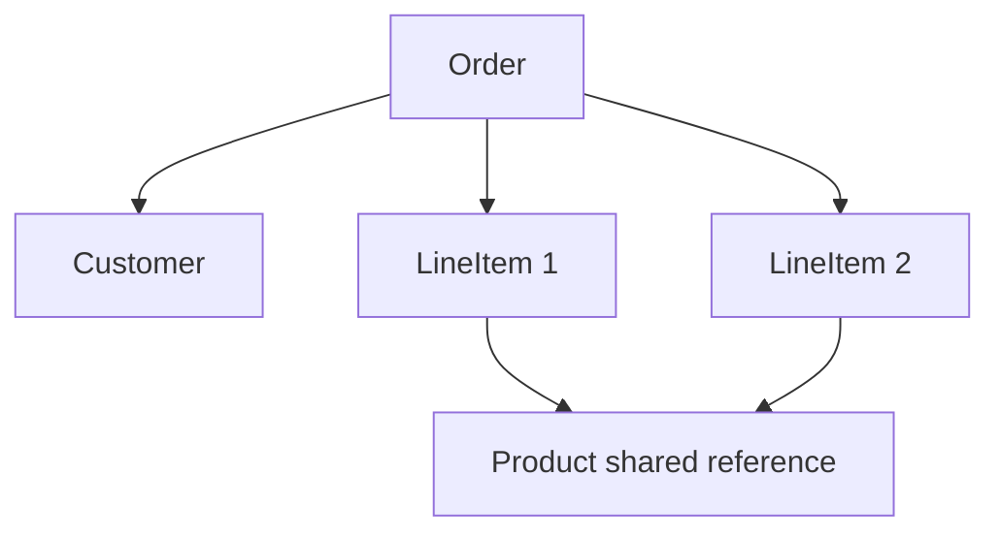
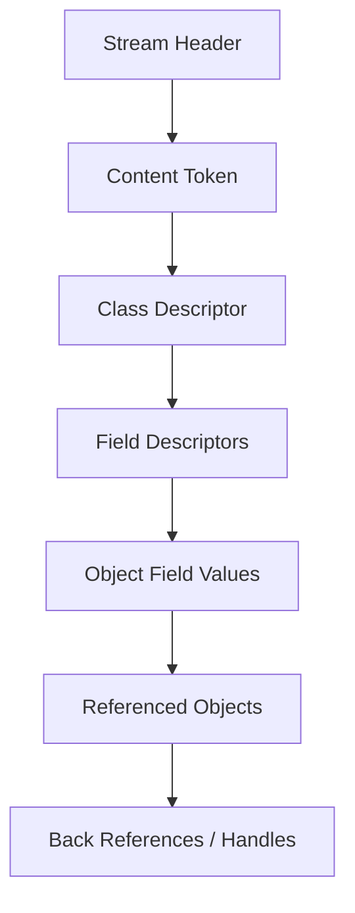

------
title: Learn Java IO, Modern IO, Streams, Buffers, Resources, Serialization & Data Boundaries - Part 024
description: Java Object Serialization internals: Serializable, ObjectInputStream, ObjectOutputStream, object graphs, handles, class descriptors, serialVersionUID, custom serialization hooks, failure modes, and boundary design.
series: learn-java-io-modern-io-resource-boundaries
seriesTitle: Learn Java IO, Modern IO, Streams, Buffers, Resources, Serialization & Data Boundaries
order: 24
partTitle: Java Serialization Internals
tags:
  - java
  - io
  - serialization
  - object-serialization
  - serializable
  - objectinputstream
  - objectoutputstream
  - boundaries
  - series
date: 2026-06-30
---

# Part 024 — Java Serialization Internals

## 1. Why This Part Matters

Java Object Serialization is one of the most misunderstood IO boundaries in the Java ecosystem.

It looks simple:

```java
out.writeObject(order);
Order restored = (Order) in.readObject();
```

But behind that simplicity, Java is not just writing a neutral data document.

It is writing an **object graph** that carries:

- class names
- field metadata
- graph identity
- references and cycles
- class evolution rules
- custom serialization hooks
- replacement hooks
- hidden callbacks
- compatibility constraints
- runtime class loading assumptions

That makes Java serialization very different from JSON, XML, CSV, Protobuf, Avro, or a hand-written binary frame.

A top-tier Java engineer does not need to use native Java serialization everywhere. In fact, modern system design often avoids it for external boundaries. But a top-tier Java engineer must understand it because it appears in:

- legacy file formats
- old RMI/EJB systems
- distributed session replication
- old cache payloads
- framework internals
- test fixtures
- migration projects
- incident response involving deserialization
- object graph persistence created years ago

This part is about internals and mental model. Versioning is covered deeper in Part 025. Safety boundary hardening is covered deeper in Part 026.

---

## 2. Serialization Is an Object Graph Boundary

The first correction:

> Java serialization is not primarily a row format, document format, or message format. It is an object graph format.

When you serialize an object, the stream may include many objects reachable from it.



If `LineItem 1` and `LineItem 2` point to the same `Product` instance, Java serialization can preserve that shared reference relationship.

This differs from many document formats, where repeated structures often become independent values unless you explicitly model identity.

### 2.1 What Gets Serialized?

For ordinary `Serializable` classes, default serialization includes:

- non-static fields
- non-transient fields
- serializable fields from serializable superclasses
- enough metadata to reconstruct class-specific state
- references to other serializable objects

It does not serialize:

- static fields as instance state
- transient fields by default
- methods
- thread stacks
- open file descriptors
- database connections
- sockets as meaningful live resources
- dependency injection container identity

If an object contains live resources, serializing it usually captures the wrong abstraction.

---

## 3. Minimal Example

```java
import java.io.*;
import java.nio.file.*;

record Customer(String id, String name) implements Serializable {}
record Order(String id, Customer customer, long amountCents) implements Serializable {}

public class SerializationDemo {
    public static void main(String[] args) throws Exception {
        Path path = Path.of("order.ser");

        Order order = new Order("ord-1", new Customer("cust-1", "Rina"), 150_000);

        try (ObjectOutputStream out = new ObjectOutputStream(
                 Files.newOutputStream(path))) {
            out.writeObject(order);
        }

        try (ObjectInputStream in = new ObjectInputStream(
                 Files.newInputStream(path))) {
            Order restored = (Order) in.readObject();
            System.out.println(restored);
        }
    }
}
```

This works because the records implement `Serializable`, and their components are also serializable.

But production-grade serialization is not about whether the example works. It is about whether the boundary remains stable and safe across time, versions, classpath changes, and failure modes.

---

## 4. Core Classes and Interfaces

### 4.1 `Serializable`

`Serializable` is a marker interface. It has no methods.

```java
public interface Serializable {
}
```

A class that implements it opts into Java's object serialization mechanism.

That opt-in is not small. It exposes the class's serialized form as a compatibility surface.

### 4.2 `Externalizable`

`Externalizable` gives the class more control.

```java
public interface Externalizable extends Serializable {
    void writeExternal(ObjectOutput out) throws IOException;
    void readExternal(ObjectInput in) throws IOException, ClassNotFoundException;
}
```

It requires a public no-arg constructor and manual external form handling.

Use it rarely. It is easy to create brittle formats and unsafe reconstruction logic.

### 4.3 `ObjectOutputStream`

`ObjectOutputStream` writes primitive data and object graphs.

Key methods:

```java
void writeObject(Object obj)
void writeUnshared(Object obj)
void defaultWriteObject()
void reset()
void flush()
void close()
```

It maintains stream state, including handles for objects already written.

### 4.4 `ObjectInputStream`

`ObjectInputStream` reconstructs primitive data and objects written by `ObjectOutputStream`.

Key methods:

```java
Object readObject()
Object readUnshared()
void defaultReadObject()
void registerValidation(ObjectInputValidation obj, int priority)
```

It resolves class descriptors, allocates objects, restores fields, resolves references, and invokes custom hooks where applicable.

---

## 5. Stream Header and Protocol Thinking

A Java serialization stream begins with a stream header.

The well-known first bytes are:

```text
AC ED 00 05
```

Conceptually:

- magic number
- stream version
- content tokens
- class descriptors
- field descriptors
- object data
- references to previously seen objects
- block data for primitives/custom data

You rarely need to hand-parse the protocol, but you must understand that it is a protocol, not a memory dump.

Simplified structure:



Important implication:

> The stream contains enough information to describe serialized classes, but successful deserialization still depends on compatible classes being available locally.

---

## 6. Handles, Identity, and Cycles

`ObjectOutputStream` tracks objects already written and assigns handles.

Why?

To preserve:

- shared references
- cyclic graphs
- object identity relationships within the stream

Example:

```java
final class Node implements Serializable {
    String name;
    Node next;

    Node(String name) {
        this.name = name;
    }
}

Node a = new Node("a");
Node b = new Node("b");
a.next = b;
b.next = a; // cycle

out.writeObject(a);
```

A naive tree serializer would recurse forever. Java serialization can represent the cycle using references/handles.

### 6.1 Shared Reference Example

```java
final class Product implements Serializable {
    final String sku;
    Product(String sku) { this.sku = sku; }
}

final class LineItem implements Serializable {
    final Product product;
    LineItem(Product product) { this.product = product; }
}

Product p = new Product("SKU-1");
List<LineItem> items = List.of(new LineItem(p), new LineItem(p));

out.writeObject(items);
```

After deserialization, both `LineItem` instances can point to the same restored `Product` instance.

### 6.2 Handle Cache Surprise

The object output stream remembers objects it has already written.

```java
out.writeObject(account);
account.balance = 200;
out.writeObject(account);
```

The second write may write a reference to the first object, not a full updated snapshot.

If you are writing a sequence of snapshots to the same `ObjectOutputStream`, you may need:

```java
out.reset();
out.writeObject(account);
```

or careful use of `writeUnshared`.

This is a classic production surprise in long-lived object streams.

---

## 7. Construction During Deserialization

Deserialization does not behave like a normal constructor call for serializable classes.

For a serializable class:

- constructors of serializable classes are not invoked in the normal way
- fields are restored from the stream
- constructors of the first non-serializable superclass are invoked
- custom `readObject` may run
- `readResolve` may replace the object

This matters because constructor invariants are not automatically enforced.

Example:

```java
final class Money implements Serializable {
    private final String currency;
    private final long cents;

    Money(String currency, long cents) {
        if (currency == null || currency.length() != 3) {
            throw new IllegalArgumentException("Invalid currency");
        }
        this.currency = currency;
        this.cents = cents;
    }
}
```

The constructor validation does not automatically protect deserialization. If you need invariants, enforce them in `readObject` or use a serialization proxy pattern.

---

## 8. `serialVersionUID`

`serialVersionUID` identifies a version of the serialized form of a class.

```java
@Serial
private static final long serialVersionUID = 1L;
```

If absent, the JVM computes one from class details. That computed value can change unexpectedly after seemingly small source changes.

For any class intentionally serializable across time, declare it explicitly.

```java
final class TransferSnapshot implements Serializable {
    @Serial
    private static final long serialVersionUID = 1L;

    private final String transferId;
    private final long byteCount;

    TransferSnapshot(String transferId, long byteCount) {
        this.transferId = transferId;
        this.byteCount = byteCount;
    }
}
```

Important:

- `serialVersionUID` is not a schema version by itself.
- Keeping it the same does not guarantee your business migration is correct.
- Changing it intentionally rejects old serialized data unless custom migration is used elsewhere.

Part 025 goes deeper into compatibility and versioning.

---

## 9. Field Rules

### 9.1 Static Fields

Static fields are class state, not object instance state. They are not serialized as normal object fields.

```java
final class ConfigSnapshot implements Serializable {
    static String environment = "prod"; // not instance serialized state
    String name;
}
```

### 9.2 Transient Fields

Transient fields are skipped by default.

```java
final class ReportHandle implements Serializable {
    private final String reportId;
    private transient InputStream openStream;

    ReportHandle(String reportId, InputStream openStream) {
        this.reportId = reportId;
        this.openStream = openStream;
    }
}
```

After deserialization, `openStream` is `null` unless restored manually.

Use transient for:

- caches
- derived values
- live resources
- framework services
- loggers
- non-serializable collaborators

But do not assume transient solves design problems. If a class depends on live resources to be valid, it may not be a good serialization boundary.

### 9.3 Final Fields

Final fields can be restored by serialization, but this can surprise developers who expect constructor-only assignment semantics.

The larger point: serialization is a privileged reconstruction mechanism. Treat it as such.

---

## 10. Custom Serialization Hooks

Java serialization recognizes specially named private methods.

### 10.1 `writeObject` and `readObject`

```java
final class ApiToken implements Serializable {
    @Serial
    private static final long serialVersionUID = 1L;

    private String token;
    private transient String masked;

    ApiToken(String token) {
        this.token = Objects.requireNonNull(token);
        this.masked = mask(token);
    }

    @Serial
    private void writeObject(ObjectOutputStream out) throws IOException {
        out.defaultWriteObject();
    }

    @Serial
    private void readObject(ObjectInputStream in)
        throws IOException, ClassNotFoundException {
        in.defaultReadObject();

        if (token == null || token.isBlank()) {
            throw new InvalidObjectException("token must not be blank");
        }
        this.masked = mask(token);
    }

    private static String mask(String value) {
        return "****" + value.substring(Math.max(0, value.length() - 4));
    }
}
```

Rules:

- method must be private
- signature must match exactly
- `defaultWriteObject` writes default serializable fields
- `defaultReadObject` reads default serializable fields
- validate invariants after reading

### 10.2 `readObjectNoData`

Called in some class evolution scenarios when no data is available for a class in the hierarchy.

```java
@Serial
private void readObjectNoData() throws ObjectStreamException {
    throw new InvalidObjectException("No data for required class");
}
```

Most applications rarely use it, but it matters in advanced evolution cases.

### 10.3 `writeReplace` and `readResolve`

`writeReplace` allows an object to nominate a replacement object to be serialized.

`readResolve` allows a deserialized object to be replaced after reading.

Common uses:

- singleton preservation
- enum-like canonicalization in old code
- serialization proxy pattern

Example singleton-style `readResolve`:

```java
final class SystemMarker implements Serializable {
    static final SystemMarker INSTANCE = new SystemMarker();

    private SystemMarker() {}

    @Serial
    private Object readResolve() throws ObjectStreamException {
        return INSTANCE;
    }
}
```

Without `readResolve`, deserialization could create a distinct instance.

---

## 11. Serialization Proxy Pattern

The serialization proxy pattern avoids exposing the internal representation directly.

Simplified example:

```java
final class Money implements Serializable {
    @Serial
    private static final long serialVersionUID = 1L;

    private final String currency;
    private final long cents;

    Money(String currency, long cents) {
        if (currency == null || currency.length() != 3) {
            throw new IllegalArgumentException("Invalid currency");
        }
        this.currency = currency;
        this.cents = cents;
    }

    @Serial
    private Object writeReplace() {
        return new SerializationProxy(this);
    }

    @Serial
    private void readObject(ObjectInputStream in) throws InvalidObjectException {
        throw new InvalidObjectException("Use serialization proxy");
    }

    private static final class SerializationProxy implements Serializable {
        @Serial
        private static final long serialVersionUID = 1L;

        private final String currency;
        private final long cents;

        SerializationProxy(Money money) {
            this.currency = money.currency;
            this.cents = money.cents;
        }

        @Serial
        private Object readResolve() throws ObjectStreamException {
            try {
                return new Money(currency, cents);
            } catch (RuntimeException e) {
                InvalidObjectException invalid = new InvalidObjectException(e.getMessage());
                invalid.initCause(e);
                throw invalid;
            }
        }
    }
}
```

Why this helps:

- serialized form is explicit
- constructor validation is reused
- internal representation can change
- invalid streams are rejected earlier

This pattern is especially valuable for immutable value objects.

---

## 12. `serialPersistentFields`

Sometimes you want the serialized fields to differ from actual implementation fields.

```java
final class UserSnapshot implements Serializable {
    @Serial
    private static final long serialVersionUID = 1L;

    @Serial
    private static final ObjectStreamField[] serialPersistentFields = {
        new ObjectStreamField("id", String.class),
        new ObjectStreamField("displayName", String.class)
    };

    private final String id;
    private final String firstName;
    private final String lastName;

    UserSnapshot(String id, String firstName, String lastName) {
        this.id = id;
        this.firstName = firstName;
        this.lastName = lastName;
    }

    @Serial
    private void writeObject(ObjectOutputStream out) throws IOException {
        ObjectOutputStream.PutField fields = out.putFields();
        fields.put("id", id);
        fields.put("displayName", firstName + " " + lastName);
        out.writeFields();
    }

    @Serial
    private void readObject(ObjectInputStream in)
        throws IOException, ClassNotFoundException {
        ObjectInputStream.GetField fields = in.readFields();
        // assign/migrate through custom representation in non-final design
    }
}
```

This is advanced and can make code harder to maintain. Use it only when you truly need a stable serialized form independent of implementation fields.

---

## 13. `@Serial`

`@Serial` marks serialization-related declarations.

Examples:

```java
@Serial
private static final long serialVersionUID = 1L;

@Serial
private void writeObject(ObjectOutputStream out) throws IOException { ... }

@Serial
private void readObject(ObjectInputStream in)
    throws IOException, ClassNotFoundException { ... }

@Serial
private Object readResolve() throws ObjectStreamException { ... }
```

It helps compile-time checking and communicates intent.

It does not make serialization safe or correct by itself.

---

## 14. Failure Modes

Java serialization has distinctive exception types.

| Exception | Typical meaning |
|---|---|
| `NotSerializableException` | a reachable object does not implement `Serializable` |
| `InvalidClassException` | class is incompatible with stream, often `serialVersionUID` mismatch |
| `StreamCorruptedException` | stream header or protocol is invalid |
| `OptionalDataException` | primitive data found where object expected, or end of custom data |
| `ClassNotFoundException` | class in stream unavailable locally |
| `EOFException` | stream ended unexpectedly |
| `InvalidObjectException` | custom validation rejected object |
| `WriteAbortedException` | exception happened during serialization and was recorded |

Do not collapse these into "serialization failed" in logs. They imply different recovery actions.

Example handling:

```java
try (ObjectInputStream in = new ObjectInputStream(Files.newInputStream(path))) {
    return (TransferSnapshot) in.readObject();
} catch (InvalidClassException e) {
    throw new SnapshotCompatibilityException("Snapshot class incompatible: " + path, e);
} catch (ClassNotFoundException e) {
    throw new SnapshotCompatibilityException("Snapshot class unavailable: " + path, e);
} catch (StreamCorruptedException e) {
    throw new SnapshotCorruptException("Not a valid serialization stream: " + path, e);
} catch (EOFException e) {
    throw new SnapshotCorruptException("Truncated snapshot: " + path, e);
}
```

Recovery policy should distinguish:

- corrupt file
- incompatible version
- missing class
- invalid object state
- transient IO failure

---

## 15. Long-lived `ObjectOutputStream` Pitfalls

### 15.1 Object Handle Growth

Because `ObjectOutputStream` tracks previously written objects, long-lived streams can grow memory usage.

If writing many independent objects:

```java
for (Event event : events) {
    out.writeObject(event);
    out.reset();
}
```

But `reset()` also affects back-reference behavior. Do not add it blindly if shared references across writes matter.

### 15.2 Snapshot Surprise

If you write the same mutable object repeatedly without reset, subsequent writes may refer back to the first serialized instance.

```java
out.writeObject(order);
order.status = "PAID";
out.writeObject(order); // may not write updated fields as expected
```

Design options:

- write immutable event objects
- create fresh snapshot objects
- use `reset()` between independent messages
- avoid long-lived object streams for message logs

### 15.3 Stream Header in Append Mode

Appending to a file with a new `ObjectOutputStream` writes another stream header.

```java
try (ObjectOutputStream out = new ObjectOutputStream(
         Files.newOutputStream(path, StandardOpenOption.APPEND))) {
    out.writeObject(event);
}
```

This often breaks later reads unless handled specially.

For append logs, Java object serialization is usually a poor boundary unless you design the framing carefully.

---

## 16. Class Evolution Preview

Part 025 covers this deeply, but here are the core rules to keep in mind.

Compatible changes may include some field additions/removals depending on rules and defaults.

Dangerous changes include:

- changing class name/package
- changing field type
- changing hierarchy in incompatible ways
- changing `serialVersionUID`
- changing semantic meaning of fields while keeping names
- adding invariants not enforced for old data

A stable serialized form is a public contract, even if the class is `private` to your codebase.

Why?

Because old bytes outlive old code.

---

## 17. Serialization and Records

Java records can implement `Serializable`.

```java
record TransferSnapshot(String id, long bytes) implements Serializable {
    @Serial
    private static final long serialVersionUID = 1L;
}
```

Records are attractive as serialized DTOs because they are shallowly immutable and explicit.

But be careful:

- record component names and types become part of the serialized contract
- nested components must be serializable
- invariants should still be considered
- external boundary compatibility should still be designed deliberately

Do not confuse "record" as Java language feature with "record" as data-transfer unit from Part 023. They are different concepts.

---

## 18. Serialization Is Not a Good External Contract by Default

For external service boundaries, prefer explicit schemas/formats unless you have a strong reason otherwise.

Why Java serialization is risky as an external contract:

- Java-specific
- classpath-dependent
- fragile across refactoring
- difficult for non-Java consumers
- embeds implementation details
- has complex compatibility rules
- deserialization has a large object reconstruction surface

Good uses are narrower:

- controlled internal snapshots
- short-lived caches under same deployment version
- test fixtures with explicit regeneration policy
- legacy interop where format already exists
- carefully designed serialization proxy for stable internal value objects

Bad uses:

- public API payloads
- partner integrations
- long-term archival records without migration plan
- untrusted network input
- domain aggregates with live resources and framework-managed collaborators

---

## 19. Boundary Design Rules

### Rule 1 — Serialize DTOs, Not Services

Bad:

```java
final class PaymentProcessor implements Serializable {
    private PaymentGateway gateway;
    private ExecutorService executor;
    private DataSource dataSource;
}
```

Better:

```java
record PaymentSnapshot(
    String paymentId,
    String status,
    long amountCents,
    Instant createdAt
) implements Serializable {
    @Serial
    private static final long serialVersionUID = 1L;
}
```

### Rule 2 — Declare `serialVersionUID`

If a class intentionally supports serialization, declare it.

```java
@Serial
private static final long serialVersionUID = 1L;
```

### Rule 3 — Validate on Read

Deserialization can bypass normal constructor paths. Validate invariants.

```java
@Serial
private void readObject(ObjectInputStream in)
    throws IOException, ClassNotFoundException {
    in.defaultReadObject();
    if (id == null || id.isBlank()) {
        throw new InvalidObjectException("id is required");
    }
}
```

### Rule 4 — Treat Serialized Form as Schema

If old bytes matter, serialized fields are schema.

Document:

- class name
- serialVersionUID
- fields
- migration expectations
- retention period
- regeneration policy

### Rule 5 — Avoid Long-lived Mutable Object Streams

Use explicit message framing if you need appendable event logs or long-lived transfer streams.

### Rule 6 — Do Not Deserialize Untrusted Bytes Without a Boundary Policy

This is covered deeply in Part 026, but the rule belongs here too.

---

## 20. Inspecting a Serialized Stream Safely

For learning, it can be useful to inspect the first bytes.

```java
Path path = Path.of("order.ser");
byte[] firstBytes = Files.readAllBytes(path);

for (int i = 0; i < Math.min(firstBytes.length, 16); i++) {
    System.out.printf("%02X ", firstBytes[i]);
}
```

You will commonly see:

```text
AC ED 00 05 ...
```

Do not build production parsers by reverse-engineering these bytes. Use the specification and Java APIs if you must interoperate with native serialization.

---

## 21. Testing Serialization Boundaries

Serialization tests should prove more than "roundtrip works today".

### 21.1 Basic Roundtrip

```java
static <T> T roundTrip(T value, Class<T> type)
    throws IOException, ClassNotFoundException {

    ByteArrayOutputStream bytes = new ByteArrayOutputStream();
    try (ObjectOutputStream out = new ObjectOutputStream(bytes)) {
        out.writeObject(value);
    }

    try (ObjectInputStream in = new ObjectInputStream(
             new ByteArrayInputStream(bytes.toByteArray()))) {
        return type.cast(in.readObject());
    }
}
```

This catches missing `Serializable` and basic field restoration issues.

### 21.2 Golden Serialized Fixtures

For long-lived formats, store old serialized fixtures.

```text
src/test/resources/serialization/v1/transfer-snapshot.ser
src/test/resources/serialization/v2/transfer-snapshot.ser
```

Test that current code can read old fixtures.

Be deliberate: fixtures created accidentally can lock in bad formats.

### 21.3 Invariant Violation Tests

Test that invalid streams are rejected.

This may require custom fixture generation or controlled mutation of serialized bytes. Keep such tests focused and documented.

### 21.4 Handle Cache Tests

If using long-lived streams, test repeated writes of mutable objects.

```java
ByteArrayOutputStream bytes = new ByteArrayOutputStream();
try (ObjectOutputStream out = new ObjectOutputStream(bytes)) {
    MutableSnapshot snapshot = new MutableSnapshot("A");
    out.writeObject(snapshot);
    snapshot.value = "B";
    out.writeObject(snapshot);
}
```

Then read both objects and verify behavior. You may discover the second object is not the independent snapshot you expected.

---

## 22. Operational Questions

Before accepting Java serialization as a boundary, ask:

1. How long will the bytes live?
2. Which application versions must read them?
3. Can classes be renamed or moved?
4. Are old fixtures tested?
5. Are invalid objects rejected?
6. Is the classpath controlled?
7. Are bytes trusted?
8. Is there a deserialization filter policy?
9. Is migration planned?
10. Is a schema-based format more appropriate?

If the data must cross organization, language, or long-term archival boundaries, Java native serialization is usually the wrong default.

---

## 23. Common Anti-patterns

### 23.1 `implements Serializable` Everywhere

Adding `Serializable` casually makes class internals part of a serialized surface.

Bad:

```java
class BaseEntity implements Serializable { ... }
```

This forces many subclasses into a serialization contract whether they were designed for it or not.

### 23.2 Serializing Domain Aggregates Directly

Aggregates often contain invariants, lazy references, caches, event lists, framework proxies, or persistence assumptions.

Prefer explicit snapshots.

### 23.3 Ignoring `serialVersionUID`

The default computed value is brittle for long-lived data.

### 23.4 Assuming Constructor Validation Runs

It does not protect deserialization in the same way.

### 23.5 Appending with New Object Streams

Multiple stream headers can corrupt simple read loops.

### 23.6 Deserializing Unknown Input

Never treat object deserialization as harmless parsing.

---

## 24. Mini Case Study: Snapshot File

Imagine an enforcement lifecycle platform stores workflow checkpoint snapshots.

Weak design:

```java
class CaseWorkflow implements Serializable {
    CaseState state;
    User assignedOfficer;
    transient RuleEngine ruleEngine;
    List<Runnable> pendingActions;
}
```

Problems:

- internal domain object becomes storage schema
- future refactoring breaks old snapshots
- `Runnable` may capture arbitrary implementation objects
- transient dependency may be null after restore
- invariants may not be checked
- operational migration is unclear

Better design:

```java
record CaseWorkflowSnapshot(
    String caseId,
    String lifecycleState,
    int schemaVersion,
    List<String> pendingActionCodes,
    Instant capturedAt
) implements Serializable {
    @Serial
    private static final long serialVersionUID = 1L;
}
```

Then reconstruct runtime behavior through application services:

```java
CaseWorkflow restore(CaseWorkflowSnapshot snapshot, RuleEngine ruleEngine) {
    return new CaseWorkflow(
        snapshot.caseId(),
        CaseState.valueOf(snapshot.lifecycleState()),
        snapshot.pendingActionCodes(),
        ruleEngine
    );
}
```

This separates:

- serialized state
- runtime behavior
- dependency injection
- migration policy

That separation is the real engineering move.

---

## 25. Practice Exercises

### Exercise 1 — Roundtrip DTO

Create a `TransferSnapshot` record with:

- `transferId`
- `byteCount`
- `sha256Hex`
- `committedAt`

Make it `Serializable`, declare `serialVersionUID`, and write a roundtrip test.

### Exercise 2 — Custom Invariant Validation

Create a serializable `Money` class.

Requirements:

- currency must be exactly 3 uppercase letters
- cents must be non-negative
- validation must happen in constructor and deserialization

### Exercise 3 — Handle Cache Demonstration

Write the same mutable object twice to one `ObjectOutputStream`, mutating it between writes.

Then read both objects back.

Repeat with `out.reset()` between writes.

Explain the difference.

### Exercise 4 — Golden Fixture

Create a v1 serialized fixture for a class.

Then evolve the class by adding an optional field.

Write a test proving current code can read the v1 fixture.

### Exercise 5 — Serialization Proxy

Implement serialization proxy for an immutable value object.

Requirements:

- original class rejects direct `readObject`
- proxy validates through constructor
- serialized form does not expose internal derived fields

---

## 26. Summary

Java Object Serialization is an object graph boundary.

It preserves more than values:

- class identity
- field descriptors
- object references
- shared identity
- cycles
- custom hooks
- compatibility assumptions

Its power is also its risk.

The core rules:

- serialize explicit snapshots, not live services
- declare `serialVersionUID`
- validate invariants on read
- understand handle caching
- avoid long-lived mutable object streams unless carefully designed
- treat serialized form as schema
- do not use Java serialization as a default external contract
- do not deserialize untrusted bytes without a safety boundary

Part 025 continues with serialization versioning and compatibility: what changes are compatible, what changes break old data, and how to design migrations for serialized forms that outlive code releases.

---

## References

- Java Object Serialization Specification, Java SE 25
- Java SE 25 `Serializable` documentation
- Java SE 25 `ObjectInputStream` documentation
- Java SE 25 `ObjectOutputStream` documentation
- Java SE 25 `ObjectStreamClass` documentation
- Java SE 25 `@Serial` documentation
