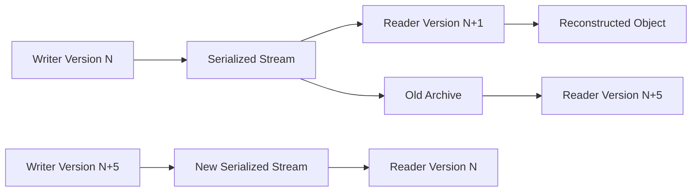
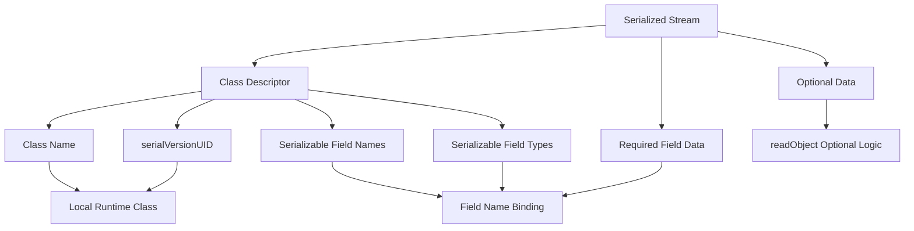
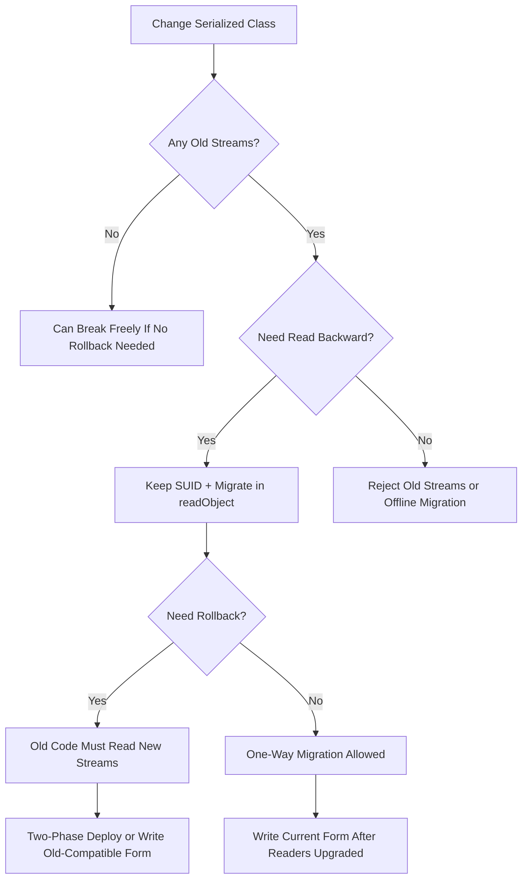

------
title: Learn Java IO, Modern IO, Streams, Buffers, Resources, Serialization & Data Boundaries - Part 025
description: Serialization versioning and compatibility for long-lived Java serialized data: serialVersionUID, compatible and incompatible changes, serialPersistentFields, readObject/writeObject, migration, golden streams, and operational decision rules.
series: learn-java-io-modern-io-resource-boundaries
seriesTitle: Learn Java IO, Modern IO, Streams, Buffers, Resources, Serialization & Data Boundaries
order: 25
partTitle: Serialization Versioning and Compatibility
tags:
  - java
  - io
  - serialization
  - compatibility
  - versioning
  - serialVersionUID
  - boundaries
  - series
date: 2026-06-30
---

# Part 025 — Serialization Versioning and Compatibility

## 1. Why This Part Matters

Java serialization is often treated as an implementation detail:

```java
out.writeObject(value);
var restored = (MyType) in.readObject();
```

That is the wrong mental model once serialized bytes outlive the running JVM.

The moment serialized data is written to a file, database blob, cache snapshot, distributed session store, message queue, backup archive, or external boundary, the serialized form becomes a **compatibility contract**.

That contract may be accidental, but it is still real.

A production system can fail years later because one engineer:

- renamed a field
- changed a primitive type
- changed a class hierarchy
- removed `Serializable`
- changed `serialVersionUID`
- added a validation rule to `readObject`
- refactored a class into a record
- changed package/class names
- deployed writer and reader versions in the wrong order

Java serialization versioning is not about memorizing a table. It is about maintaining a stable contract between:



The hard part is not whether serialization can read one changed class locally.

The hard part is whether a distributed system can survive **mixed versions, rollback, replay, backups, blue/green deploys, archived data, and migration windows**.

---

## 2. Core Mental Model

Treat Java serialized bytes as a private, symbolic, class-coupled protocol.

It is not schema-first.

It is not language-neutral.

It is not naturally stable across arbitrary refactoring.

It is a stream containing class descriptors and field data that the receiver maps back into local classes.

The important mapping is:



The receiver does not reconstruct the old class implementation. It reconstructs an object using the **current local class** and data from the stream.

So compatibility means:

> Can the current class interpret the old stream sufficiently to preserve the class contract?

This is stronger than “deserialization does not throw”.

A stream can deserialize successfully and still produce an object that violates business invariants.

---

## 3. Serialization Versioning Is Receiver-Makes-Right

Java serialization versioning is best understood as a receiver-makes-right system:

- the writer writes its known class shape
- the stream carries class descriptors and values
- the reader compares stream descriptors with local classes
- the reader fills missing data with defaults or custom logic
- the reader must restore valid object invariants

This creates one major engineering rule:

> Newer classes are responsible for understanding older serialized streams if old data can still exist.

That means compatibility is not just a type-system property. It is a lifecycle responsibility.

For every serialized type, ask:

1. Can old data still be read?
2. Can new data be read by old binaries during rollback?
3. Can mixed writer/reader deployments exist?
4. Does default value assignment preserve invariants?
5. Does the class have a migration path?
6. How do we test compatibility?

---

## 4. The Three Compatibility Axes

Java engineers often collapse compatibility into one word. Do not do that.

For serialized objects, there are at least three compatibility axes.

| Axis | Question | Example |
|---|---|---|
| Read backward | Can new code read old streams? | Version 3 reads data written by version 1 |
| Write backward | Can old code read new streams? | Rollback after version 3 wrote new data |
| Semantic compatibility | Does reconstructed object still satisfy invariants? | `status = null` technically reads but breaks domain logic |

A change can be technically compatible but semantically unsafe.

Example:

```java
final class Invoice implements Serializable {
    private static final long serialVersionUID = 1L;

    private BigDecimal amount;

    // Added in v2
    private Currency currency;
}
```

Old streams have no `currency`. Java can initialize it to `null`. That is technically readable, but the object may now violate a domain rule: every invoice must have a currency.

A top-level engineer fixes that in `readObject`, not by hoping every old stream disappears.

---

## 5. `serialVersionUID` Is Not a Version Number

`serialVersionUID` is a compatibility identifier.

It answers this question:

> Should this local class be considered compatible with the serialized class descriptor in the stream?

It is not a release version.

Do not treat it like:

```java
private static final long serialVersionUID = 2L; // v2 release
```

That habit causes unnecessary incompatibility.

A better rule:

> Keep the same `serialVersionUID` while the serialized form remains intentionally compatible. Change it only when old streams must be rejected.

### 5.1 Always Declare It Explicitly

Do not rely on compiler-generated `serialVersionUID` for long-lived serialized data.

```java
final class PaymentSnapshot implements Serializable {
    private static final long serialVersionUID = 1L;

    private String paymentId;
    private BigDecimal amount;
}
```

Why?

The default computed value is sensitive to class details. Refactoring implementation details can accidentally change compatibility.

Explicit `serialVersionUID` makes the decision intentional.

### 5.2 When to Keep It

Keep the same `serialVersionUID` when:

- added fields can be defaulted or migrated
- removed fields are no longer required by current readers
- custom `readObject` can restore invariants
- old streams are still acceptable
- rollback compatibility is managed separately

### 5.3 When to Change It

Change `serialVersionUID` when:

- the class no longer represents the same serialized contract
- old streams must be rejected loudly
- reconstruction from old data would be dangerously misleading
- type meaning changed even if field names are similar
- migration must happen through an explicit tool instead of transparent deserialization

Example:

```java
// v1: amount is in cents
final class MoneyAmount implements Serializable {
    private static final long serialVersionUID = 1L;
    private long amount;
}

// v2: amount is in major units. Same field name, different meaning.
final class MoneyAmount implements Serializable {
    private static final long serialVersionUID = 2L;
    private BigDecimal amount;
}
```

This is not compatible in meaning. Reject old streams or write an explicit migration layer.

---

## 6. Compatible Changes: What Java Can Usually Handle

The Java Object Serialization Specification defines the idea of compatible class evolution. But you must still validate domain invariants.

### 6.1 Adding Fields

Adding a field is usually technically compatible.

```java
// v1
final class CustomerSnapshot implements Serializable {
    private static final long serialVersionUID = 1L;
    private String id;
    private String name;
}

// v2
final class CustomerSnapshot implements Serializable {
    private static final long serialVersionUID = 1L;
    private String id;
    private String name;
    private String countryCode;
}
```

When v2 reads a v1 stream, `countryCode` is absent and receives the Java default value, usually `null`.

That is technically compatible.

It may not be semantically compatible.

If `countryCode` is required, migrate it:

```java
private void readObject(ObjectInputStream in)
        throws IOException, ClassNotFoundException {
    in.defaultReadObject();

    if (countryCode == null) {
        countryCode = "UNKNOWN";
    }

    validate();
}
```

### 6.2 Adding Classes in the Hierarchy

Adding a serializable class to a hierarchy can be compatible if Java can initialize the added state safely.

But this is a high-risk change because hierarchy state is written in sequence.

Prefer composition over hierarchy changes for long-lived serialized objects.

### 6.3 Removing `writeObject`/`readObject`

Removing custom serialization methods can be compatible if required field data is still readable and optional data can be skipped.

But this is rarely a trivial code cleanup. It changes how optional data is interpreted.

Write golden-stream tests before doing this.

### 6.4 Adding `writeObject`/`readObject`

Adding custom methods can be compatible if you still call:

```java
out.defaultWriteObject();
```

and:

```java
in.defaultReadObject();
```

in the correct places.

If you stop writing/reading default field data in a class that previously did, you may create incompatibility.

### 6.5 Adding `Serializable`

Adding `Serializable` can be compatible in some inheritance cases, but the details are subtle. For non-serializable supertypes, Java may require an accessible no-argument constructor for proper initialization.

Do not add `Serializable` casually to rich domain classes.

Prefer a dedicated snapshot DTO.

---

## 7. Incompatible Changes: What Usually Breaks

The most dangerous changes are changes that make the stream and local class disagree about identity, hierarchy, or field type.

### 7.1 Deleting Fields

Deleting a field from the current class can be readable by newer code because extra stream fields may be ignored.

But the reverse direction is dangerous: if new writers no longer write a field required by old readers, rollback can fail semantically.

Example:

```java
// v1
private String settlementAccount;

// v2 removed field
```

If rollback happens after v2 writes data, v1 may read `settlementAccount = null` and break payment routing.

The incompatibility is operational, not just technical.

### 7.2 Changing Primitive Field Type

This is unsafe:

```java
// v1
private int retryCount;

// v2
private long retryCount;
```

Field name is the same, but serialized primitive type differs.

Java default serialization does not perform arbitrary type conversion.

Use an adapter field or explicit migration:

```java
private int retryCountLegacy;
private long retryCount;
```

Then migrate through `readObject` or a one-time offline job.

### 7.3 Moving Classes Up or Down the Hierarchy

Avoid changing serialized class hierarchy for long-lived data.

```java
// v1
class Base implements Serializable { ... }
class Child extends Base { ... }

// v2
class NewBase implements Serializable { ... }
class Base extends NewBase { ... }
class Child extends Base { ... }
```

The stream contains class hierarchy data. Moving state up/down can make the expected sequence invalid or semantically wrong.

### 7.4 Changing Serializable to Externalizable

`Serializable` and `Externalizable` represent different protocols.

Do not switch between them for existing persisted streams unless you intentionally break compatibility and migrate.

### 7.5 Removing Serializable

Removing `Serializable` from a type that still appears in old streams is an incompatible boundary change.

This is especially common when teams “clean up” marker interfaces without checking archived data.

### 7.6 Changing Ordinary Class to Enum

An enum has special serialization behavior. Do not convert serialized ordinary classes to enum types across long-lived streams.

### 7.7 Adding `readResolve`/`writeReplace` Unsafely

`readResolve` and `writeReplace` can change the actual object observed after deserialization.

They are powerful for proxies and singletons, but dangerous when old readers expect a different graph shape.

---

## 8. Compatible Is Not Safe: Default Values Are Often Domain Bugs

The most common Java serialization incident pattern:

1. A field is added.
2. Old data is read.
3. The new field defaults to `null`, `0`, or `false`.
4. The object technically deserializes.
5. Business logic interprets the default incorrectly.

Examples:

| Added Field | Default | Possible Bug |
|---|---:|---|
| `boolean approved` | `false` | Old approved records become rejected |
| `int priority` | `0` | Old records become highest priority if lower is better |
| `BigDecimal amount` | `null` | NPE later in billing |
| `String tenantId` | `null` | Cross-tenant authorization bug |
| `Instant expiresAt` | `null` | Session never expires or expires immediately |

Therefore every new serialized field needs a **migration decision**:

```text
new field -> default acceptable? derive? reject? migrate offline?
```

Do not leave this implicit.

---

## 9. Use `readObject` as a Migration Boundary

`readObject` is the natural place to repair old streams when using native serialization.

Example:

```java
final class TransferSnapshot implements Serializable {
    private static final long serialVersionUID = 1L;

    private String transferId;
    private long amountMinorUnits;

    // Added in v2
    private String currency;

    private void readObject(ObjectInputStream in)
            throws IOException, ClassNotFoundException {
        in.defaultReadObject();

        if (currency == null) {
            currency = "IDR";
        }

        if (transferId == null || transferId.isBlank()) {
            throw new InvalidObjectException("transferId is required");
        }

        if (amountMinorUnits < 0) {
            throw new InvalidObjectException("amountMinorUnits must be non-negative");
        }
    }
}
```

Good `readObject` migration code does three things:

1. reads old data
2. fills missing values deliberately
3. validates the reconstructed object before exposing it

Bad `readObject` migration code does this:

```java
private void readObject(ObjectInputStream in)
        throws IOException, ClassNotFoundException {
    in.defaultReadObject();
    // TODO later
}
```

That is not a migration. That is deferred failure.

---

## 10. Use `serialPersistentFields` to Stabilize Serialized Form

By default, Java serializes non-static, non-transient fields. This couples serialized form to field declarations.

For long-lived data, you may want a stable serialized schema that differs from runtime fields.

Use `serialPersistentFields`.

```java
final class AccountSnapshot implements Serializable {
    private static final long serialVersionUID = 1L;

    private static final ObjectStreamField[] serialPersistentFields = {
            new ObjectStreamField("id", String.class),
            new ObjectStreamField("balanceMinorUnits", long.class),
            new ObjectStreamField("currency", String.class)
    };

    private transient String accountId;
    private transient Money balance;

    private void writeObject(ObjectOutputStream out) throws IOException {
        ObjectOutputStream.PutField fields = out.putFields();
        fields.put("id", accountId);
        fields.put("balanceMinorUnits", balance.minorUnits());
        fields.put("currency", balance.currency());
        out.writeFields();
    }

    private void readObject(ObjectInputStream in)
            throws IOException, ClassNotFoundException {
        ObjectInputStream.GetField fields = in.readFields();

        String id = (String) fields.get("id", null);
        long minorUnits = fields.get("balanceMinorUnits", 0L);
        String currency = (String) fields.get("currency", "IDR");

        if (id == null || id.isBlank()) {
            throw new InvalidObjectException("id is required");
        }

        this.accountId = id;
        this.balance = new Money(minorUnits, currency);
    }
}
```

This separates:

- runtime object model
- serialized wire/storage model

That separation is valuable when internal implementation must evolve more frequently than stored data.

---

## 11. Prefer Serialization Proxy for Rich Domain Types

For rich objects with invariants, prefer the serialization proxy pattern.

The domain object writes a small stable proxy. The proxy reconstructs the domain object through normal constructors/factories.

```java
public final class Money implements Serializable {
    private static final long serialVersionUID = 1L;

    private final long minorUnits;
    private final String currency;

    public Money(long minorUnits, String currency) {
        if (minorUnits < 0) {
            throw new IllegalArgumentException("minorUnits must be non-negative");
        }
        if (currency == null || currency.length() != 3) {
            throw new IllegalArgumentException("currency must be ISO-like 3-letter code");
        }
        this.minorUnits = minorUnits;
        this.currency = currency;
    }

    private Object writeReplace() {
        return new SerializationProxy(this);
    }

    private void readObject(ObjectInputStream in) throws InvalidObjectException {
        throw new InvalidObjectException("Use serialization proxy");
    }

    private static final class SerializationProxy implements Serializable {
        private static final long serialVersionUID = 1L;

        private final long minorUnits;
        private final String currency;

        SerializationProxy(Money money) {
            this.minorUnits = money.minorUnits;
            this.currency = money.currency;
        }

        private Object readResolve() throws ObjectStreamException {
            return new Money(minorUnits, currency);
        }
    }
}
```

This prevents partially initialized invalid objects from escaping.

For enterprise systems, this pattern is often cleaner than trying to make every domain class safely deserializable directly.

---

## 12. Version Field Inside the Stream

`serialVersionUID` is not enough for migrations. It tells Java whether the class is compatible, but it does not tell your business logic which semantic version of the payload you are reading.

Add an internal schema version when you control the class:

```java
final class CaseSnapshot implements Serializable {
    private static final long serialVersionUID = 1L;

    private int schemaVersion = 2;

    private String caseId;
    private String status;
    private String escalationLevel;

    private void readObject(ObjectInputStream in)
            throws IOException, ClassNotFoundException {
        in.defaultReadObject();

        if (schemaVersion <= 0) {
            schemaVersion = 1;
        }

        switch (schemaVersion) {
            case 1 -> migrateFromV1();
            case 2 -> { /* current */ }
            default -> throw new InvalidObjectException(
                    "Unsupported schemaVersion: " + schemaVersion);
        }

        validate();
    }

    private void migrateFromV1() {
        if (escalationLevel == null) {
            escalationLevel = "NORMAL";
        }
        schemaVersion = 2;
    }

    private void validate() throws InvalidObjectException {
        if (caseId == null || caseId.isBlank()) {
            throw new InvalidObjectException("caseId is required");
        }
        if (status == null || status.isBlank()) {
            throw new InvalidObjectException("status is required");
        }
    }
}
```

This gives you semantic migration control without changing `serialVersionUID` for every compatible evolution.

---

## 13. Deployment Compatibility Matrix

Before changing a serialized class, determine deployment topology.



### 13.1 One-Way Upgrade

Only new code reads data after migration.

Allowed strategy:

1. deploy new reader that can read old streams
2. read/migrate old data lazily or offline
3. write new format
4. remove migration code only after retention window expires

### 13.2 Rolling Deploy

Old and new versions run together.

Required strategy:

- new readers must read old streams
- old readers may need to read new streams
- writers may need to write old-compatible form until all readers upgrade

### 13.3 Rollback-Sensitive Deploy

New version may write data, then system may rollback.

Required strategy:

- old binary must not crash on newly written streams
- new fields must be optional for old code
- do not remove required old fields too early
- avoid changing primitive field types
- consider feature flag for new serialized format writes

---

## 14. Two-Phase Serialized Format Evolution

For production systems, prefer two-phase evolution.

### Phase 1 — Read New, Write Old-Compatible

Deploy code that can read both old and new forms but writes old-compatible form.

```text
V2 readers: old + new
V2 writers: old-compatible
```

This makes rollback safer.

### Phase 2 — Write New

After all readers are upgraded and rollback risk is acceptable, enable new writes.

```text
V2 readers: old + new
V2 writers: new
```

### Phase 3 — Retire Old

After retention/migration completes, remove old read path.

```text
V3 readers: new only
V3 writers: new
```

This is the same discipline used in schema migration, event contract evolution, and database migrations. Java serialization is not exempt from it.

---

## 15. Golden Stream Tests

If serialized bytes are long-lived, you need golden stream tests.

A golden stream is a committed serialized payload created by an older version.

```text
src/test/resources/serialization/customer-v1.ser
src/test/resources/serialization/customer-v2.ser
```

Test example:

```java
class CustomerSnapshotCompatibilityTest {

    @Test
    void readsV1Stream() throws Exception {
        try (var in = new ObjectInputStream(
                getClass().getResourceAsStream("/serialization/customer-v1.ser"))) {
            CustomerSnapshot snapshot = (CustomerSnapshot) in.readObject();

            assertEquals("C-001", snapshot.id());
            assertEquals("UNKNOWN", snapshot.countryCode());
            assertValid(snapshot);
        }
    }
}
```

Do not regenerate golden files every time the test fails. That defeats the purpose.

A good rule:

> Regenerating a golden stream requires a compatibility review.

---

## 16. Compatibility Test Matrix

At minimum:

| Test | Purpose |
|---|---|
| Current reads v1 | Backward read compatibility |
| Current reads v2 | Current format sanity |
| Current writes then reads | Round-trip sanity |
| Old binary reads current output | Rollback compatibility, if needed |
| Corrupt/truncated stream | Failure behavior |
| Unknown future schema version | Forward safety |
| Missing newly required field | Migration correctness |

For regulated or financial systems, include archived real-world samples with sensitive data scrubbed.

---

## 17. Avoid Serializing Rich Entity Objects

A dangerous habit:

```java
class CaseEntity implements Serializable {
    private WorkflowState state;
    private List<CaseNote> notes;
    private User assignedUser;
    private transient Validator validator;
    private transient Repository repository;
}
```

This creates a huge object graph boundary.

Problems:

- accidental deep graph serialization
- lazy-loaded associations
- framework proxies
- transient infrastructure fields
- classpath coupling
- versioning across many classes
- deserialization side effects
- difficult migration

Prefer a stable snapshot:

```java
record CaseSnapshot(
        String caseId,
        String state,
        String assignedUserId,
        List<String> noteIds,
        int schemaVersion
) implements Serializable {
    private static final long serialVersionUID = 1L;
}
```

Snapshot design keeps the serialized contract small and intentional.

---

## 18. `Externalizable`: Manual Format, Manual Responsibility

`Externalizable` gives full control over the external form:

```java
public final class RoutingSnapshot implements Externalizable {
    private static final long serialVersionUID = 1L;

    private String routeId;
    private int priority;

    public RoutingSnapshot() {
        // required for Externalizable
    }

    @Override
    public void writeExternal(ObjectOutput out) throws IOException {
        out.writeInt(1); // format version
        out.writeUTF(routeId);
        out.writeInt(priority);
    }

    @Override
    public void readExternal(ObjectInput in)
            throws IOException, ClassNotFoundException {
        int version = in.readInt();
        if (version != 1) {
            throw new InvalidObjectException("Unsupported version: " + version);
        }
        routeId = in.readUTF();
        priority = in.readInt();
    }
}
```

But the cost is high:

- you own ordering
- you own versioning
- you own optional fields
- you own validation
- you own compatibility forever

Use `Externalizable` only when that control is needed and justified.

---

## 19. Records and Serialization Compatibility

Records are serializable if they implement `Serializable`, but their reconstruction uses the canonical constructor semantics.

This is good for invariants because constructors are involved.

But records are not magic compatibility shields.

Adding a component may still require default handling. Removing a component may still discard stream data. Changing component names/types affects the serialized form.

For long-lived data, do not casually convert mutable classes into records without checking serialized compatibility.

A safe pattern:

```java
public record ExportManifest(
        String exportId,
        String checksum,
        long payloadBytes,
        int schemaVersion
) implements Serializable {
    private static final long serialVersionUID = 1L;

    public ExportManifest {
        if (exportId == null || exportId.isBlank()) {
            throw new IllegalArgumentException("exportId is required");
        }
        if (payloadBytes < 0) {
            throw new IllegalArgumentException("payloadBytes must be non-negative");
        }
    }
}
```

Still maintain golden streams.

---

## 20. Migration Strategy for Long-Lived Serialized Data

When native serialized data already exists, choose one of four strategies.

### 20.1 Transparent Lazy Migration

Current code reads old streams and writes back new streams when touched.

Good for active data.

Risk: cold archives may never migrate.

### 20.2 Offline Bulk Migration

A migration job reads all old streams and writes a new format.

Good for controlled cutovers.

Risk: expensive, requires rollback plan.

### 20.3 Compatibility Forever

Keep old read paths permanently.

Good for legal archives.

Risk: codebase accumulates legacy branches.

### 20.4 Reject and Rebuild

Reject old streams and rebuild state from source of truth.

Good when serialized data is cache only.

Risk: only safe if source of truth truly exists.

---

## 21. Practical Decision Matrix

| Situation | Recommendation |
|---|---|
| Session cache only, can be invalidated | Change freely, invalidate cache intentionally |
| Persistent user data | Keep SUID, add migration, golden tests |
| Distributed mixed-version deployment | Two-phase read/write compatibility |
| Legal archive | Keep readers for all retained versions |
| Domain refactor | Introduce snapshot/proxy, migrate offline |
| External partner boundary | Do not use native Java serialization |
| Security-sensitive boundary | Avoid native serialization or use strict filters; see Part 026 |
| Framework proxy graph | Do not serialize rich graph; create DTO snapshot |

---

## 22. Anti-Patterns

### 22.1 “It Compiles, So Serialization Is Fine”

Compilation says nothing about old serialized bytes.

### 22.2 “Just Bump `serialVersionUID`”

That rejects old streams. Sometimes correct, often accidental.

### 22.3 “Do Not Declare `serialVersionUID`”

This makes compatibility sensitive to implementation changes.

### 22.4 “Use Entity Classes Directly”

Entities are not stable serialized contracts.

### 22.5 “No Golden Streams”

Without golden streams, compatibility is mostly hope.

### 22.6 “Default Values Are Good Enough”

Default values are only good if explicitly reviewed against invariants.

---

## 23. Engineering Checklist

Before changing a serializable class, answer:

- [ ] Is this class serialized to durable storage or only temporary memory/cache?
- [ ] Are old streams still present?
- [ ] Is rollback possible after new streams are written?
- [ ] Is `serialVersionUID` explicit?
- [ ] Are new fields safe with Java default values?
- [ ] Does `readObject` restore invariants?
- [ ] Are removed fields still required by old readers?
- [ ] Are primitive field types unchanged?
- [ ] Is class hierarchy unchanged?
- [ ] Are custom hooks tested?
- [ ] Are golden streams committed?
- [ ] Is migration documented?
- [ ] Is there a retention date for old format support?

---

## 24. Deliberate Practice

### Exercise 1 — Add a Required Field Safely

Create `UserSnapshot` v1:

```java
final class UserSnapshot implements Serializable {
    private static final long serialVersionUID = 1L;
    private String id;
    private String email;
}
```

Serialize a golden file.

Then add:

```java
private String tenantId;
```

Implement `readObject` so old streams get `tenantId = "default"` and invalid objects are rejected.

### Exercise 2 — Break and Detect Compatibility

Change a field from `int` to `long` and observe failure or incorrect behavior.

Then redesign using explicit migration fields.

### Exercise 3 — Rollback Compatibility

Write a test where old code reads new streams.

This requires keeping an old fixture or small compatibility module.

### Exercise 4 — Serialization Proxy

Implement `Money` using serialization proxy and prove that direct deserialization through the original class is rejected.

---

## 25. Key Takeaways

1. Java serialized form is a compatibility contract once bytes outlive the JVM.
2. `serialVersionUID` is a compatibility identifier, not a release counter.
3. Compatible technical changes can still be semantically dangerous.
4. Default values must be reviewed as migration decisions.
5. `readObject` is a migration and validation boundary.
6. `serialPersistentFields` can decouple serialized form from runtime fields.
7. Golden stream tests are mandatory for long-lived serialized data.
8. Rolling deployments need two-phase read/write compatibility.
9. Rich domain objects make poor serialized contracts.
10. Native Java serialization is acceptable mainly for controlled, trusted, internal, compatibility-managed boundaries.

---

## 26. References

- Java Object Serialization Specification — Versioning of Serializable Objects: https://docs.oracle.com/en/java/javase/26/docs/specs/serialization/version.html
- Java Object Serialization Specification — Contents: https://docs.oracle.com/en/java/javase/26/docs/specs/serialization/index.html
- `Serializable` Java API: https://docs.oracle.com/en/java/javase/25/docs/api/java.base/java/io/Serializable.html
- `ObjectInputStream` Java API: https://docs.oracle.com/en/java/javase/25/docs/api/java.base/java/io/ObjectInputStream.html
- `ObjectOutputStream` Java API: https://docs.oracle.com/en/java/javase/25/docs/api/java.base/java/io/ObjectOutputStream.html

---

## 27. Next Part

Part 026 moves from compatibility to safety:

> How do we deserialize only what we intentionally allow, bound object graph complexity, avoid arbitrary class reconstruction, and build defensive deserialization boundaries?
