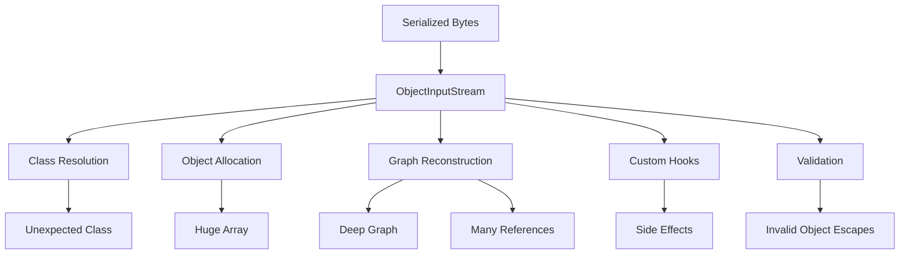
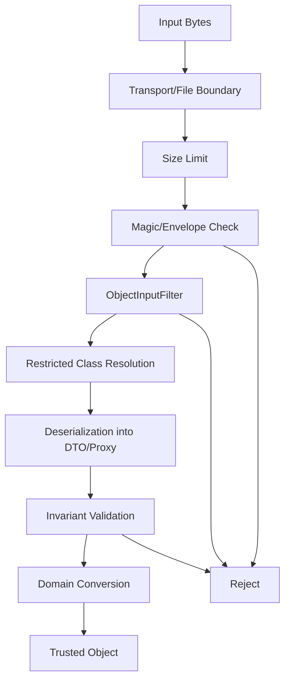
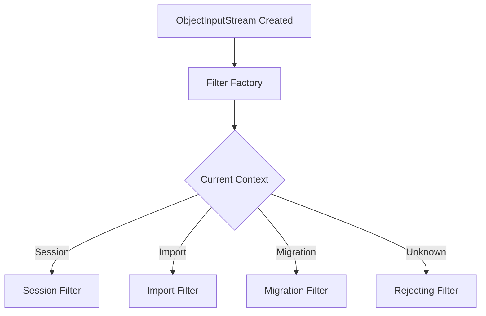
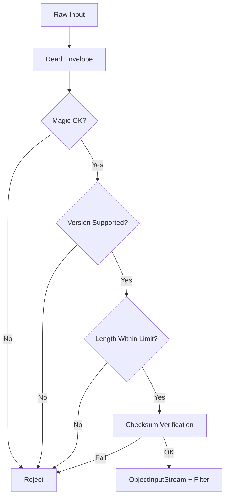
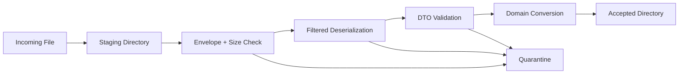
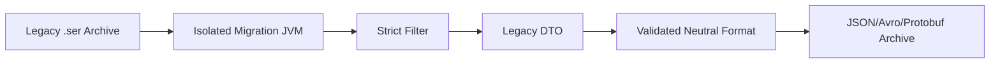

------
title: Learn Java IO, Modern IO, Streams, Buffers, Resources, Serialization & Data Boundaries - Part 026
description: Serialization safety boundaries using ObjectInputFilter, allowlists, graph limits, stream limits, context-specific filters, deserialization quarantine, and production hardening patterns.
series: learn-java-io-modern-io-resource-boundaries
seriesTitle: Learn Java IO, Modern IO, Streams, Buffers, Resources, Serialization & Data Boundaries
order: 26
partTitle: Serialization Safety Boundaries
tags:
  - java
  - io
  - serialization
  - deserialization
  - objectinputfilter
  - safety
  - boundaries
  - hardening
  - series
date: 2026-06-30
---

# Part 026 — Serialization Safety Boundaries

## 1. Why This Part Matters

Deserialization is not just parsing.

When you deserialize Java objects, the runtime may:

- load classes
- allocate arrays
- build object graphs
- invoke special serialization hooks
- call validation callbacks
- reconstruct references and cycles
- execute `readObject`, `readResolve`, or related logic
- consume memory proportional to graph depth, references, array sizes, and stream content

That means deserialization is a **code and resource boundary**, not just a data boundary.

This part does not repeat the general Java security series. It focuses specifically on IO boundary engineering for Java native serialization.

The production question is:

> If serialized bytes arrive at this boundary, exactly which classes, graph shapes, and resource sizes are allowed to be reconstructed?

If the answer is “whatever the stream says”, the boundary is not engineered.

---

## 2. First Principle: Avoid Untrusted Native Deserialization

The safest Java native deserialization policy is:

> Do not deserialize untrusted native Java serialized data.

Native Java serialization is class-coupled and behavior-coupled. It is not a neutral schema format.

For external, partner, browser, mobile, public API, or cross-language boundaries, prefer explicit data formats with schema and parser controls:

- JSON with strict schema/validation
- Protocol Buffers
- Avro
- FlatBuffers
- CBOR with strict schema
- custom binary frames with explicit grammar

Native Java serialization may still appear in:

- legacy systems
- old durable files
- session replication
- RMI-era systems
- local snapshots
- internal cache payloads
- framework internals
- test fixtures
- migration utilities

For those cases, harden the boundary.

---

## 3. Threat and Failure Model

A deserialization boundary can fail in multiple ways.



The concrete risks include:

| Risk | Meaning |
|---|---|
| Arbitrary class reconstruction | Stream causes unexpected classes to be loaded/reconstructed |
| Gadget invocation | Class hooks or object graph behavior trigger unwanted execution paths |
| Memory exhaustion | Huge arrays or reference graphs consume heap/native resources |
| CPU exhaustion | Deep/nested structures create expensive reconstruction |
| Classpath sensitivity | Adding a library changes what classes are available to deserialize |
| Invalid object state | Object bypasses normal constructors and violates invariants |
| Type confusion at boundary | Caller casts a broad `Object` and trusts it prematurely |
| Compatibility bypass | Old serialized form bypasses newer validation assumptions |

Even when the stream is trusted, accidental corruption can create similar operational failures.

---

## 4. Safety Boundary Layers

A defensible Java serialization boundary has multiple layers.



Do not rely on one mechanism.

`ObjectInputFilter` is important, but it is not a replacement for:

- byte-size limits
- envelope validation
- allowlisted classes
- DTO/proxy design
- invariant checks
- operational monitoring
- migration discipline

---

## 5. `ObjectInputFilter` Mental Model

`ObjectInputFilter` lets you inspect deserialization metadata before objects are fully accepted.

It can check:

- candidate classes
- array lengths
- graph depth
- reference count
- number of bytes consumed

The result is one of:

```java
enum Status {
    ALLOWED,
    REJECTED,
    UNDECIDED
}
```

A filter is not the object validator.

It is the **admission control** layer.

Object validation still belongs in:

- `readObject`
- `readResolve`
- canonical constructors for records
- domain factories
- explicit post-read validation

---

## 6. Use Allowlists, Not Blocklists

Blocklists age badly.

A blocklist says:

```text
allow everything except these known-bad classes
```

That is fragile because the classpath changes over time.

An allowlist says:

```text
only these expected classes/packages/modules are allowed
```

This is boundary-oriented thinking.

Example command-line filter:

```bash
java -Djdk.serialFilter="maxdepth=20;maxrefs=10000;maxbytes=1048576;maxarray=100000;com.example.snapshot.**;java.base/*;!*" \
     -jar app.jar
```

Meaning:

- reject too deep graphs
- reject too many references
- reject too many bytes
- reject huge arrays
- allow expected snapshot package
- allow `java.base` classes needed for standard types
- reject everything else

The final `!*` is important. Without it, unmatched classes may remain undecided depending on composition.

---

## 7. Stream-Specific Filter

Set filters as close as possible to the boundary.

```java
static Object readTrustedSnapshot(InputStream raw) throws IOException, ClassNotFoundException {
    ObjectInputFilter filter = ObjectInputFilter.Config.createFilter(
            "maxdepth=20;" +
            "maxrefs=10000;" +
            "maxbytes=1048576;" +
            "maxarray=100000;" +
            "com.acme.snapshot.**;" +
            "java.base/*;" +
            "!*"
    );

    try (var in = new ObjectInputStream(raw)) {
        in.setObjectInputFilter(filter);
        return in.readObject();
    }
}
```

This is better than relying only on a global policy because it makes the boundary contract visible near the use case.

But there is a caveat:

> A stream-specific filter only helps if every deserialization site sets one.

In large codebases, also use JVM-wide filters.

---

## 8. JVM-Wide Filter

A JVM-wide filter provides a baseline safety net.

Programmatic setup:

```java
public final class SerializationFilterBootstrap {
    private SerializationFilterBootstrap() {
    }

    public static void install() {
        ObjectInputFilter filter = ObjectInputFilter.Config.createFilter(
                "maxdepth=20;" +
                "maxrefs=100000;" +
                "maxbytes=10485760;" +
                "maxarray=1000000;" +
                "com.acme.snapshot.**;" +
                "java.base/*;" +
                "!*"
        );

        ObjectInputFilter.Config.setSerialFilter(filter);
    }
}
```

Call this early during application startup before any `ObjectInputStream` is created.

Command-line setup is often better in platform-managed environments:

```bash
-Djdk.serialFilter=maxdepth=20;maxrefs=100000;maxbytes=10485760;maxarray=1000000;com.acme.snapshot.**;java.base/*;!*
```

Operationally, command-line or security properties are harder for application code to accidentally bypass.

---

## 9. Context-Specific Filters

One global allowlist is often too broad.

A session deserialization boundary should not allow the same classes as a file-import boundary.

A cache snapshot boundary should not allow the same classes as an admin migration tool.

Context-specific filtering gives each boundary its own policy.



Simplified pattern:

```java
final class SerializationContext {
    private static final ThreadLocal<String> CURRENT = new ThreadLocal<>();

    static <T> T withContext(String context, ThrowingSupplier<T> action) throws Exception {
        String previous = CURRENT.get();
        CURRENT.set(context);
        try {
            return action.get();
        } finally {
            if (previous == null) {
                CURRENT.remove();
            } else {
                CURRENT.set(previous);
            }
        }
    }

    static String current() {
        return CURRENT.get();
    }
}
```

Factory example:

```java
ObjectInputFilter sessionFilter = ObjectInputFilter.Config.createFilter(
        "maxdepth=12;maxrefs=5000;maxbytes=1048576;" +
        "com.acme.session.**;java.base/*;!*"
);

ObjectInputFilter importFilter = ObjectInputFilter.Config.createFilter(
        "maxdepth=8;maxrefs=1000;maxbytes=262144;" +
        "com.acme.imports.dto.**;java.base/*;!*"
);

ObjectInputFilter rejectAll = ObjectInputFilter.Config.createFilter("!*");

ObjectInputFilter.Config.setSerialFilterFactory((current, requested) -> {
    ObjectInputFilter contextFilter = switch (String.valueOf(SerializationContext.current())) {
        case "session" -> sessionFilter;
        case "import" -> importFilter;
        default -> rejectAll;
    };

    if (requested == null) {
        return contextFilter;
    }

    return ObjectInputFilter.merge(contextFilter, requested);
});
```

The real implementation should be reviewed carefully because filter-factory behavior is JVM-wide and must be installed before broad deserialization use.

---

## 10. Reject `UNDECIDED` Classes

A common filter mistake is allowing `UNDECIDED` to pass accidentally.

A strong boundary should prefer fail-closed behavior.

```java
ObjectInputFilter allowExpected = ObjectInputFilter.allowFilter(
        clazz -> clazz.getName().startsWith("com.acme.snapshot.")
                || clazz.getModule().getName().equals("java.base"),
        ObjectInputFilter.Status.UNDECIDED
);

ObjectInputFilter failClosed = ObjectInputFilter.rejectUndecidedClass(allowExpected);
```

The concept:

```text
known allowed -> ALLOWED
known rejected -> REJECTED
unknown -> REJECTED
```

In production boundary code, unknown should usually not mean “try it and see”.

---

## 11. Bound the Bytes Before `ObjectInputStream`

`maxbytes` helps, but do not rely only on deserialization internals.

Limit the raw input before creating `ObjectInputStream`.

```java
final class BoundedInputStream extends FilterInputStream {
    private final long maxBytes;
    private long read;

    BoundedInputStream(InputStream in, long maxBytes) {
        super(in);
        this.maxBytes = maxBytes;
    }

    @Override
    public int read() throws IOException {
        int b = super.read();
        if (b != -1) {
            increment(1);
        }
        return b;
    }

    @Override
    public int read(byte[] b, int off, int len) throws IOException {
        int n = super.read(b, off, len);
        if (n > 0) {
            increment(n);
        }
        return n;
    }

    private void increment(long n) throws IOException {
        read += n;
        if (read > maxBytes) {
            throw new IOException("Serialized payload exceeds limit: " + maxBytes);
        }
    }
}
```

Usage:

```java
try (var bounded = new BoundedInputStream(raw, 1_048_576);
     var in = new ObjectInputStream(bounded)) {
    in.setObjectInputFilter(filter);
    return in.readObject();
}
```

This protects even before the serialization layer has interpreted everything.

---

## 12. Envelope Before Object Stream

Do not feed arbitrary bytes directly into `ObjectInputStream` when you control the file/message format.

Wrap serialized payloads in a small envelope:

```text
magic bytes
format version
payload length
checksum
serialized bytes
```

Example conceptual format:

```text
ACME-SER\0
version = 2
length = 18231
sha256 = ...
payload = Java serialized bytes
```

Read flow:



This lets you reject malformed or oversized input before deserialization starts.

---

## 13. Deserialize to DTO, Then Convert

Do not deserialize directly into active domain objects with behavior, services, callbacks, or framework state.

Prefer:

```text
bytes -> serialized DTO/proxy -> validation -> domain factory -> domain object
```

Example:

```java
final class CaseSnapshot implements Serializable {
    private static final long serialVersionUID = 1L;

    String caseId;
    String state;
    String assignedUserId;
    int schemaVersion;

    private void readObject(ObjectInputStream in)
            throws IOException, ClassNotFoundException {
        in.defaultReadObject();

        if (caseId == null || caseId.isBlank()) {
            throw new InvalidObjectException("caseId is required");
        }
        if (state == null || state.isBlank()) {
            throw new InvalidObjectException("state is required");
        }
    }
}
```

Conversion:

```java
Case toDomain(CaseSnapshot snapshot) {
    return Case.restore(
            CaseId.of(snapshot.caseId),
            CaseState.parse(snapshot.state),
            UserId.of(snapshot.assignedUserId),
            snapshot.schemaVersion
    );
}
```

This prevents deserialization from becoming domain activation.

---

## 14. Validate After Deserialization

Filters decide what can be reconstructed.

Validation decides whether the reconstructed data is acceptable.

Do both.

```java
static CaseSnapshot readCaseSnapshot(InputStream raw)
        throws IOException, ClassNotFoundException {
    ObjectInputFilter filter = ObjectInputFilter.Config.createFilter(
            "maxdepth=10;maxrefs=1000;maxbytes=262144;" +
            "com.acme.caseio.CaseSnapshot;" +
            "java.base/*;!*"
    );

    try (var in = new ObjectInputStream(new BoundedInputStream(raw, 262_144))) {
        in.setObjectInputFilter(filter);

        Object value = in.readObject();
        if (!(value instanceof CaseSnapshot snapshot)) {
            throw new InvalidObjectException("Expected CaseSnapshot, got " + value.getClass().getName());
        }

        snapshot.validateAfterRead();
        return snapshot;
    }
}
```

Do not cast and continue blindly.

---

## 15. Restricted `ObjectInputStream`

For high-risk internal tools, you can subclass `ObjectInputStream` to restrict class resolution.

```java
final class AllowlistObjectInputStream extends ObjectInputStream {
    private final Set<String> allowedClasses;

    AllowlistObjectInputStream(InputStream in, Set<String> allowedClasses) throws IOException {
        super(in);
        this.allowedClasses = Set.copyOf(allowedClasses);
    }

    @Override
    protected Class<?> resolveClass(ObjectStreamClass desc)
            throws IOException, ClassNotFoundException {
        String name = desc.getName();
        if (!allowedClasses.contains(name) && !name.startsWith("java.lang.")) {
            throw new InvalidClassException("Rejected class", name);
        }
        return super.resolveClass(desc);
    }
}
```

This is not a full replacement for `ObjectInputFilter` because arrays, graph metrics, and resource limits are better handled by filters.

But it can add defense-in-depth.

---

## 16. Arrays Are a Resource Boundary

Arrays are especially important because a stream can request allocation of large arrays.

Filter limits should include:

```text
maxarray=...
```

And domain validation should check collection sizes after read.

```java
private void validateAfterRead() throws InvalidObjectException {
    if (items == null) {
        throw new InvalidObjectException("items is required");
    }
    if (items.size() > 10_000) {
        throw new InvalidObjectException("too many items: " + items.size());
    }
}
```

Do not assume graph filters alone encode all business size limits.

---

## 17. Graph Depth and Reference Limits

Deserialization can build deeply nested graphs or graphs with many references.

Bound both:

```text
maxdepth=20
maxrefs=10000
```

Depth limits reduce recursive graph abuse.

Reference limits reduce huge object graph reconstruction.

But tune them using expected payloads. If your legitimate snapshot has depth 6 and 200 references, do not set `maxdepth=200` and `maxrefs=10_000_000` out of fear of false positives.

A filter should represent expected shape.

---

## 18. Boundary-Specific Limit Profiles

Different contexts need different limits.

| Boundary | Example Limits |
|---|---|
| Session snapshot | low bytes, low depth, known DTO package |
| Cache warmup | moderate bytes, known cache DTOs |
| Admin migration tool | higher bytes, strict offline access |
| Test fixtures | small bytes, test package allowlist |
| Legal archive reader | read-only process, strict classpath, offline sandbox |

Do not use one large limit everywhere because one tool needs it.

---

## 19. Classpath Drift Risk

Serialization safety changes when the classpath changes.

Adding a dependency can add new serializable classes and new gadget-like behavior.

Therefore:

- use allowlists
- keep deserialization classpath minimal
- run deserialization migration tools in isolated processes
- avoid broad package patterns like `com.acme.**` if only `com.acme.snapshot.**` is needed
- review new dependencies for deserialization exposure

A safe allowlist is narrow enough that unrelated dependency additions do not expand the deserialization surface.

---

## 20. Quarantine Pattern for Serialized Input

For ingestion systems, do not deserialize directly into final processing.

Use quarantine.



Quarantine record should include:

- source identifier
- received timestamp
- rejection reason
- payload checksum
- filter name/version
- byte length
- parser version

Never log full serialized payloads.

---

## 21. Operational Observability for Deserialization Boundaries

Track:

- accepted payload count
- rejected payload count
- rejection reason
- max observed bytes
- max observed graph depth if available
- max observed references if available
- class rejection events
- invalid object exceptions
- timeout/cancellation count
- quarantine count

Do not log arbitrary class names from untrusted sources without sanitization and rate limiting. Class names may still be attacker-controlled input from the stream descriptor.

---

## 22. Failure Handling Rules

A deserialization failure should be treated as an input rejection unless proven otherwise.

Do not:

```java
catch (Exception e) {
    return new DefaultObject();
}
```

That creates silent data corruption.

Prefer:

```java
catch (InvalidClassException | InvalidObjectException e) {
    throw new RejectedSerializedPayloadException("Invalid serialized payload", e);
} catch (StreamCorruptedException e) {
    throw new RejectedSerializedPayloadException("Corrupted serialized stream", e);
} catch (OptionalDataException e) {
    throw new RejectedSerializedPayloadException("Unexpected primitive/object data", e);
}
```

Then route to quarantine, retry decision, or manual review depending on context.

---

## 23. Safe Local Snapshot Reader Example

```java
public final class SnapshotReader<T> {
    private final Class<T> expectedType;
    private final ObjectInputFilter filter;
    private final long maxBytes;

    public SnapshotReader(Class<T> expectedType, ObjectInputFilter filter, long maxBytes) {
        this.expectedType = Objects.requireNonNull(expectedType);
        this.filter = Objects.requireNonNull(filter);
        this.maxBytes = maxBytes;
    }

    public T read(InputStream raw) throws IOException, ClassNotFoundException {
        try (var bounded = new BoundedInputStream(raw, maxBytes);
             var in = new ObjectInputStream(bounded)) {
            in.setObjectInputFilter(filter);

            Object value = in.readObject();
            if (!expectedType.isInstance(value)) {
                throw new InvalidObjectException(
                        "Expected " + expectedType.getName() +
                        ", got " + value.getClass().getName());
            }

            return expectedType.cast(value);
        }
    }
}
```

Usage:

```java
ObjectInputFilter filter = ObjectInputFilter.Config.createFilter(
        "maxdepth=10;maxrefs=1000;maxbytes=262144;" +
        "com.acme.snapshot.CustomerSnapshot;" +
        "java.base/*;!*"
);

SnapshotReader<CustomerSnapshot> reader =
        new SnapshotReader<>(CustomerSnapshot.class, filter, 262_144);
```

This pattern makes expected type, filter, and byte limit explicit.

---

## 24. Do Not Deserialize in Privileged or Constructor-Like Contexts

Avoid deserializing while:

- holding locks
- inside constructors
- inside static initializers
- under elevated privileges
- inside transaction critical sections
- before global filters are installed
- before logging/metrics are initialized

Deserialization may block, allocate, throw, or execute hooks. Treat it like running a parser with side-effect potential.

---

## 25. Sandboxed Migration Tool Pattern

For risky legacy archives:

1. Create a separate migration executable.
2. Use minimal classpath.
3. Use strict filters.
4. Run with resource limits.
5. Read old serialized data.
6. Convert to neutral schema format.
7. Validate output independently.
8. Store new format.
9. Retire native serialization for future writes.



This is often better than keeping dangerous deserialization paths inside the main service forever.

---

## 26. Anti-Patterns

### 26.1 Deserializing `Object` from an API Request

```java
Object value = new ObjectInputStream(requestBody).readObject();
```

This is not an API. It is arbitrary object reconstruction.

### 26.2 Broad Allowlist

```text
com.company.**;java.**;javax.**;!*
```

This usually allows far more than the boundary needs.

### 26.3 No Size Limit

If the boundary has no byte and graph limit, it has no resource contract.

### 26.4 Catch-and-Default

Replacing deserialization failure with a default object hides corruption and can create business incidents.

### 26.5 Filters Without Validation

A filter can allow a class. It does not prove the fields form a valid business object.

### 26.6 Validation Without Filters

Validation happens too late if deserialization already allocated a huge graph or reconstructed unexpected classes.

---

## 27. Review Checklist

For every `ObjectInputStream` site:

- [ ] Is the input trusted?
- [ ] Can native Java serialization be avoided?
- [ ] Is there a byte limit before deserialization?
- [ ] Is there an envelope/magic/version/checksum if the format is controlled?
- [ ] Is an `ObjectInputFilter` applied?
- [ ] Is the filter allowlist-based?
- [ ] Are `maxdepth`, `maxrefs`, `maxbytes`, and `maxarray` set?
- [ ] Are unmatched classes rejected?
- [ ] Is expected root type checked?
- [ ] Are DTO invariants validated after read?
- [ ] Is domain conversion explicit?
- [ ] Are failures quarantined or rejected loudly?
- [ ] Are metrics emitted for accept/reject paths?
- [ ] Is classpath drift controlled?
- [ ] Are migration tools isolated from main service runtime?

---

## 28. Deliberate Practice

### Exercise 1 — Add a Filter to an Existing Reader

Find a simple `ObjectInputStream` example and add:

- max bytes
- max array length
- max depth
- exact root DTO allowlist
- final reject-all pattern

### Exercise 2 — Build a Rejection Test

Create a stream containing an unexpected serializable class.

Verify that your filter rejects it before domain logic sees it.

### Exercise 3 — Oversized Array Test

Serialize a DTO with a large array or list.

Verify that the boundary rejects it using filter/resource limits.

### Exercise 4 — Quarantine Workflow

Implement:

```text
input -> staging -> deserialize -> validate -> accepted/quarantine
```

Record rejection reason without logging the payload.

### Exercise 5 — Migration JVM

Create a small standalone migration tool that reads a legacy `.ser` file with strict filters and writes JSON or another explicit format.

---

## 29. Key Takeaways

1. Deserialization is a code and resource boundary.
2. Avoid untrusted native Java deserialization whenever possible.
3. Use allowlists, not blocklists.
4. Bound bytes before `ObjectInputStream`.
5. Use `ObjectInputFilter` for class, array, depth, reference, and byte controls.
6. Prefer boundary-specific filters over one broad global policy.
7. Reject unknown classes by default.
8. Deserialize into DTOs/proxies, then convert to domain objects.
9. Validate after read; filters are not business validators.
10. Isolate risky legacy migration from main service runtime.

---

## 30. References

- `ObjectInputFilter` Java SE 25 API: https://docs.oracle.com/en/java/javase/25/docs/api/java.base/java/io/ObjectInputFilter.html
- `ObjectInputFilter.Config` Java SE 25 API: https://docs.oracle.com/en/java/javase/25/docs/api/java.base/java/io/ObjectInputFilter.Config.html
- `ObjectInputStream` Java SE 25 API: https://docs.oracle.com/en/java/javase/25/docs/api/java.base/java/io/ObjectInputStream.html
- Java Object Serialization Specification: https://docs.oracle.com/en/java/javase/26/docs/specs/serialization/index.html
- Serialization Filtering Guide: https://docs.oracle.com/javase/8/docs/technotes/guides/serialization/filters/serialization-filtering.html

---

## 31. Next Part

Part 027 moves to another dangerous IO boundary:

> Compression, archives, ZIP/JAR traversal, streaming decompression, zip-slip prevention, and large archive risk management.
