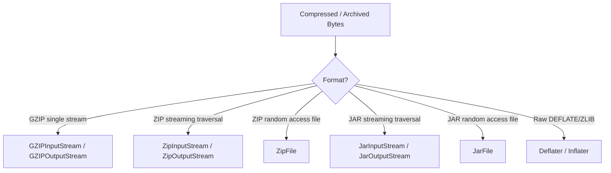
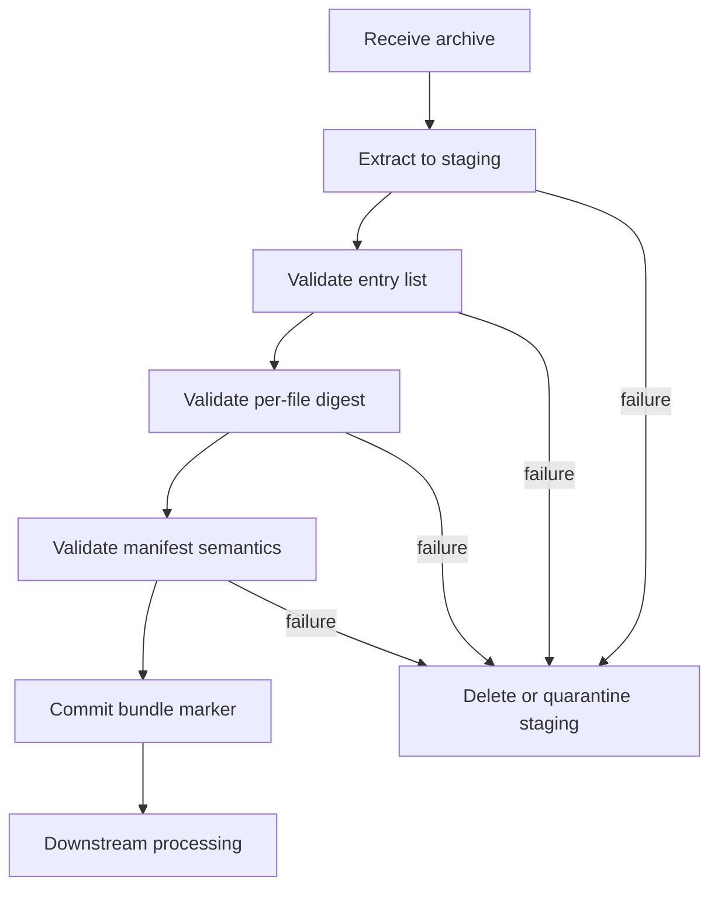
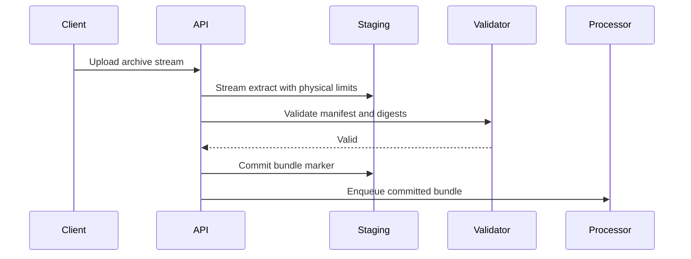

------
title: Learn Java IO, Modern IO, Streams, Buffers, Resources, Serialization & Data Boundaries - Part 027
description: Compression, archive, ZIP, GZIP, JAR, zip-slip prevention, streaming compression, archive traversal, large archive risks, and production-grade packaging IO boundaries.
series: learn-java-io-modern-io-resource-boundaries
seriesTitle: Learn Java IO, Modern IO, Streams, Buffers, Resources, Serialization & Data Boundaries
order: 27
partTitle: Compression, Archives, and Packaging IO
tags:
  - java
  - io
  - nio
  - zip
  - gzip
  - jar
  - compression
  - archive
  - resource-boundaries
  - series
date: 2026-06-30
---

# Part 027 — Compression, Archives, and Packaging IO

> Compression and archive code is not just an optimization detail. In production, it is a boundary where untrusted names, untrusted sizes, untrusted ratios, untrusted metadata, and untrusted nested structure enter your system.

This part focuses on Java's ZIP, GZIP, DEFLATE, JAR, and archive-processing APIs from the perspective of a production IO engineer.

We will not treat `ZipInputStream` as a toy example. We will treat compressed input as a hostile or at least unreliable data boundary.

## 1. Learning Objectives

After this part, you should be able to:

1. Distinguish **compression**, **archiving**, and **packaging**.
2. Choose between `GZIPInputStream`, `ZipInputStream`, `ZipFile`, `JarInputStream`, and `JarFile`.
3. Design archive extraction that is safe against path traversal, large expansion, entry-count abuse, and partial output.
4. Build streaming compression/decompression pipelines without accidentally materializing unbounded data.
5. Understand the practical difference between ZIP, GZIP, DEFLATE, and JAR.
6. Write archive code that makes resource ownership, integrity checks, and failure semantics explicit.
7. Test archive handlers with malformed, truncated, huge, nested, and adversarial inputs.

## 2. Kaufman Skill Slice

The skill for this part is:

> Given compressed or archived input, process it with bounded memory, bounded output, explicit trust rules, correct resource lifecycle, and deterministic failure behavior.

Break the skill into smaller sub-skills:

| Sub-skill | Production question |
|---|---|
| Compression model | Is this a compressed byte stream or an archive containing named entries? |
| API choice | Do we need streaming traversal or random entry lookup? |
| Entry validation | Is the entry name a logical name or a filesystem path? |
| Size bounding | What is the maximum allowed compressed size, uncompressed size, entry count, and compression ratio? |
| Path containment | Can an entry escape the destination directory? |
| Partial output | What happens if extraction fails after writing 30% of the files? |
| Integrity | Do we trust CRC/metadata, or do we validate content with a higher-level digest? |
| Resource closure | Which object owns the underlying stream and native resources? |
| Format evolution | Is the archive a transfer envelope, deployment artifact, or long-lived storage format? |

## 3. Mental Model: Compression vs Archive vs Package

Many bugs start because engineers use the words interchangeably.

### 3.1 Compression

Compression transforms bytes into fewer bytes, ideally.

```text
original bytes -> compressor -> compressed bytes
compressed bytes -> decompressor -> original bytes
```

Examples:

- GZIP
- DEFLATE
- ZLIB
- Brotli, Zstandard, LZ4 outside the JDK standard library

A compressed stream usually has no natural concept of multiple files. It is just one byte stream.

### 3.2 Archive

An archive groups multiple named entries into one container.

```text
archive
├── entry: customers/2026-06.csv
├── entry: metadata.json
└── entry: attachments/image.png
```

Examples:

- ZIP
- TAR
- JAR, because JAR is ZIP-based

An archive may compress each entry, but the key concept is **named entries**, not compression.

### 3.3 Package

A package is an archive with a domain-specific convention.

Examples:

- JAR: Java classes/resources plus optional manifest/signatures/multi-release entries
- WAR/EAR: Java application deployment packaging
- custom export bundle: data files plus manifest/checksum

The package format adds meaning on top of the archive format.

## 4. Java API Map

Java's standard compression and archive APIs live mostly in:

- `java.util.zip`
- `java.util.jar`
- `java.nio.file` for filesystem-safe output
- `java.io` for stream composition

The `java.util.zip` package provides classes for reading/writing ZIP and GZIP, DEFLATE compression/decompression, and checksum utilities such as CRC-32 and Adler-32.



## 5. API Selection Table

| Need | Prefer | Why |
|---|---|---|
| Decompress one compressed byte stream | `GZIPInputStream` | GZIP is stream-oriented, not multi-entry |
| Compress one byte stream | `GZIPOutputStream` | Natural output wrapper |
| Iterate entries from an uploaded ZIP stream | `ZipInputStream` | Does not require full file on disk first |
| Read one entry repeatedly from a ZIP file on disk | `ZipFile` | Random access by entry name |
| Create ZIP archive incrementally | `ZipOutputStream` | Emits entries sequentially |
| Read Java packaging metadata/classes/resources from a file | `JarFile` | Adds manifest and multi-release support |
| Read JAR from any input stream | `JarInputStream` | Streaming JAR traversal |
| Fine control over DEFLATE settings | `Deflater` / `Inflater` | Low-level compression primitives |

## 6. Core Invariants

A production archive handler should satisfy these invariants:

1. **Archive entry names are not filesystem paths until validated.**
2. **Uncompressed size is untrusted until enforced.**
3. **Compressed size is not a safe proxy for output size.**
4. **Entry count is bounded.**
5. **Total extracted bytes are bounded.**
6. **Extraction writes to staging first, then commits atomically.**
7. **Partial extraction is either cleaned up or quarantined.**
8. **The caller knows who closes the input stream.**
9. **Text inside archives has explicit charset handling.**
10. **Nested archives are either forbidden or explicitly bounded.**

## 7. GZIP: One Compressed Stream

GZIP is useful when there is one logical payload:

- HTTP response body
- log segment
- exported CSV file
- event batch file
- database dump

Example: decompress a bounded GZIP stream into a destination file.

```java
import java.io.*;
import java.nio.file.*;
import java.util.zip.GZIPInputStream;

public final class GzipTransfer {
    private static final int BUFFER_SIZE = 64 * 1024;

    public static long gunzipToFile(InputStream compressed,
                                    Path target,
                                    long maxUncompressedBytes) throws IOException {
        Path tmp = target.resolveSibling(target.getFileName() + ".tmp");
        long written = 0;

        try (InputStream in = new GZIPInputStream(compressed, BUFFER_SIZE);
             OutputStream out = Files.newOutputStream(
                     tmp,
                     StandardOpenOption.CREATE_NEW,
                     StandardOpenOption.WRITE)) {

            byte[] buffer = new byte[BUFFER_SIZE];
            int n;
            while ((n = in.read(buffer)) != -1) {
                written += n;
                if (written > maxUncompressedBytes) {
                    throw new IOException("GZIP payload exceeds limit: " + maxUncompressedBytes);
                }
                out.write(buffer, 0, n);
            }
        } catch (IOException | RuntimeException e) {
            Files.deleteIfExists(tmp);
            throw e;
        }

        Files.move(tmp, target, StandardCopyOption.ATOMIC_MOVE);
        return written;
    }
}
```

Notice the boundary decisions:

- The decompressed output is bounded.
- Temporary output is removed on failure.
- Output is committed only after full successful decompression.
- The method closes the `GZIPInputStream`; because it wraps `compressed`, closing it will also close the underlying stream in normal Java wrapper style.

If you do not own `compressed`, do not wrap and close it directly. Use a contract-specific wrapper or make ownership explicit in the API.

## 8. GZIP Output: `finish()` vs `close()`

Compression wrappers often need to write trailer bytes at the end. `GZIPOutputStream.close()` finishes the compressed stream and closes the underlying stream. `finish()` finishes the compressed data without necessarily closing the wrapped stream.

Use `finish()` when composing multiple layers and the outer lifecycle is owned elsewhere.

```java
public static byte[] gzip(byte[] input) throws IOException {
    ByteArrayOutputStream bytes = new ByteArrayOutputStream();
    try (GZIPOutputStream gzip = new GZIPOutputStream(bytes)) {
        gzip.write(input);
    }
    return bytes.toByteArray();
}
```

For stream composition:

```java
public static void writeGzipMember(OutputStream underlying, byte[] input) throws IOException {
    GZIPOutputStream gzip = new GZIPOutputStream(underlying);
    gzip.write(input);
    gzip.finish(); // complete gzip stream, but do not claim ownership of underlying
}
```

Do not assume `flush()` finalizes a compressed stream. It may push currently available bytes, but it is not the same as writing the final format trailer.

## 9. ZIP: Archive of Named Entries

A ZIP file is an archive. Its entries have names, sizes, compression methods, timestamps, CRCs, and optional extra data.

Important consequence:

> ZIP processing is not just byte decompression. It is untrusted structured input parsing.

### 9.1 `ZipInputStream`

`ZipInputStream` is useful when the input is already a stream, such as an upload body.

```java
try (ZipInputStream zip = new ZipInputStream(uploadedInputStream)) {
    ZipEntry entry;
    while ((entry = zip.getNextEntry()) != null) {
        try {
            // read current entry bytes from zip
        } finally {
            zip.closeEntry();
        }
    }
}
```

Pros:

- Works with non-seekable streams.
- Low temporary storage.
- Good for upload validation and extraction.

Cons:

- Sequential only.
- You cannot jump to a specific entry efficiently.
- Some metadata may be unavailable until the entry is read.

### 9.2 `ZipFile`

`ZipFile` is useful when you have a ZIP file on disk and need random access.

```java
try (ZipFile zipFile = new ZipFile(file.toFile())) {
    ZipEntry entry = zipFile.getEntry("metadata.json");
    if (entry != null) {
        try (InputStream in = zipFile.getInputStream(entry)) {
            // read metadata
        }
    }
}
```

Pros:

- Random lookup.
- Can enumerate entries.
- Better for repeated access to a stored archive file.

Cons:

- Requires a local file or file-like source.
- Owns native/file resources and must be closed.

## 10. Safe Extraction: The Zip-Slip Problem

The canonical archive bug:

```text
entry name = ../../../../etc/passwd
```

Naive extraction:

```java
Path output = destination.resolve(entry.getName());
```

This can escape the destination directory if the resolved path is not validated.

### 10.1 Safe Path Resolution

A safe extraction function must normalize and verify containment.

```java
import java.io.*;
import java.nio.file.*;
import java.util.zip.*;

public final class SafeZipExtractor {
    private static final int BUFFER_SIZE = 64 * 1024;

    public record Limits(
            long maxEntries,
            long maxBytesPerEntry,
            long maxTotalUncompressedBytes
    ) {}

    public static void extract(InputStream archive,
                               Path destination,
                               Limits limits) throws IOException {
        Path destRoot = destination.toAbsolutePath().normalize();
        Files.createDirectories(destRoot);

        long entries = 0;
        long totalBytes = 0;

        try (ZipInputStream zip = new ZipInputStream(new BufferedInputStream(archive))) {
            ZipEntry entry;
            while ((entry = zip.getNextEntry()) != null) {
                entries++;
                if (entries > limits.maxEntries()) {
                    throw new IOException("Too many ZIP entries: " + entries);
                }

                String rawName = entry.getName();
                Path target = safeResolve(destRoot, rawName);

                if (entry.isDirectory()) {
                    Files.createDirectories(target);
                    zip.closeEntry();
                    continue;
                }

                Files.createDirectories(target.getParent());

                long entryBytes = 0;
                Path tmp = Files.createTempFile(destRoot, ".extract-", ".tmp");
                boolean success = false;

                try (OutputStream out = Files.newOutputStream(
                        tmp,
                        StandardOpenOption.WRITE,
                        StandardOpenOption.TRUNCATE_EXISTING)) {

                    byte[] buffer = new byte[BUFFER_SIZE];
                    int n;
                    while ((n = zip.read(buffer)) != -1) {
                        entryBytes += n;
                        totalBytes += n;

                        if (entryBytes > limits.maxBytesPerEntry()) {
                            throw new IOException("ZIP entry exceeds per-entry limit: " + rawName);
                        }
                        if (totalBytes > limits.maxTotalUncompressedBytes()) {
                            throw new IOException("ZIP exceeds total uncompressed limit");
                        }

                        out.write(buffer, 0, n);
                    }
                    success = true;
                } finally {
                    if (!success) {
                        Files.deleteIfExists(tmp);
                    }
                }

                moveReplacing(tmp, target);
                zip.closeEntry();
            }
        }
    }

    private static Path safeResolve(Path destRoot, String entryName) throws IOException {
        if (entryName == null || entryName.isBlank()) {
            throw new IOException("Blank ZIP entry name");
        }
        if (entryName.indexOf('\0') >= 0) {
            throw new IOException("NUL byte in ZIP entry name");
        }

        // ZIP entry names are '/'-separated logical names.
        Path normalized = destRoot.resolve(entryName).normalize();
        if (!normalized.startsWith(destRoot)) {
            throw new IOException("ZIP entry escapes destination: " + entryName);
        }
        return normalized;
    }

    private static void moveReplacing(Path source, Path target) throws IOException {
        try {
            Files.move(source, target,
                    StandardCopyOption.ATOMIC_MOVE,
                    StandardCopyOption.REPLACE_EXISTING);
        } catch (AtomicMoveNotSupportedException e) {
            Files.move(source, target, StandardCopyOption.REPLACE_EXISTING);
        }
    }
}
```

This code is intentionally conservative, but not complete for every environment. For stricter systems, add:

- allowed filename pattern
- allowed extensions
- maximum path depth
- rejected absolute paths
- duplicate entry detection
- output staging directory outside final destination
- final manifest validation before commit

### 10.2 The Subtle Bug: Symlink Escape

ZIP itself does not give you a portable high-level Java symlink extraction API like `Files.createSymbolicLink` from a `ZipEntry`. However, some ZIP files may carry platform-specific external attributes that encode symlink-like information for tools that interpret them.

A conservative Java extractor should not attempt to restore symlinks from untrusted archives unless the format contract explicitly allows it and includes separate validation.

If your extraction process invokes external tools such as `unzip`, `tar`, or OS utilities, symlink handling becomes much more important because those tools may create links from metadata your Java code never inspected.

## 11. Decompression Bombs and Archive Bombs

A decompression bomb is a small compressed input that expands into huge output.

Archive bombs may also abuse:

- huge entry count
- deeply nested directories
- repeated duplicate names
- nested archives
- extreme compression ratios
- slow decompression CPU cost
- many tiny files causing inode or metadata pressure

Do not rely on `ZipEntry.getSize()` alone. It may be missing or untrusted before actual extraction. Enforce actual bytes written while streaming.

### 11.1 Required Limits

| Limit | Why it matters |
|---|---|
| Max compressed input bytes | Prevent network/disk abuse before decompression |
| Max entries | Prevent metadata/inode exhaustion |
| Max bytes per entry | Prevent one huge output file |
| Max total uncompressed bytes | Prevent total disk/memory exhaustion |
| Max path length/depth | Prevent filesystem/path abuse |
| Max processing time | Prevent CPU-bound decompression abuse |
| Max nested archive depth | Prevent recursive bomb patterns |
| Max compression ratio | Detect suspicious expansion |

### 11.2 Bounded Input Wrapper

You often need a wrapper that refuses to read more than a configured compressed-size limit.

```java
public final class BoundedInputStream extends FilterInputStream {
    private final long maxBytes;
    private long read;

    public BoundedInputStream(InputStream in, long maxBytes) {
        super(in);
        this.maxBytes = maxBytes;
    }

    @Override
    public int read() throws IOException {
        int b = super.read();
        if (b != -1) {
            increment(1);
        }
        return b;
    }

    @Override
    public int read(byte[] b, int off, int len) throws IOException {
        int n = super.read(b, off, len);
        if (n > 0) {
            increment(n);
        }
        return n;
    }

    private void increment(long n) throws IOException {
        read += n;
        if (read > maxBytes) {
            throw new IOException("Compressed input exceeds limit: " + maxBytes);
        }
    }
}
```

Use this before `ZipInputStream` or `GZIPInputStream` when reading untrusted network input.

## 12. Duplicate Entries

ZIP archives can contain duplicate entry names. Different tools may handle duplicates differently.

For deterministic extraction, decide explicitly:

1. Reject duplicate names.
2. Accept first entry only.
3. Accept last entry only.
4. Allow duplicates only if manifest says so.

For most ingestion systems, reject duplicates.

```java
Set<String> seen = new HashSet<>();
String normalizedLogicalName = entry.getName().replace('\\', '/');
if (!seen.add(normalizedLogicalName)) {
    throw new IOException("Duplicate ZIP entry: " + normalizedLogicalName);
}
```

Do not normalize too aggressively without a policy. Case-insensitive filesystems add another layer: `A.txt` and `a.txt` may be different logical entries but collide on some targets.

## 13. Archive Extraction Commit Models

Naive extraction writes directly to the final directory. That creates partial states:

```text
final/
├── a.csv       written
├── b.csv       half-written
└── manifest    not yet written
```

Better commit models:

### 13.1 Per-File Temp Then Move

Each file is written to temp and moved into place after successful entry extraction.

Good for:

- independent files
- partial success allowed
- local repair possible

Weakness:

- The directory as a whole may still be partially committed.

### 13.2 Staging Directory Then Atomic Directory Marker

Extract everything into a staging directory.

```text
imports/
├── incoming/
│   └── bundle-123.tmp/
└── committed/
    └── bundle-123/
```

After validation, move or mark the bundle as committed.

Good for:

- ingestion bundles
- manifest-driven archive processing
- batch imports

### 13.3 Manifest Commit Pattern

Only process a bundle after all payloads and manifest have been written and verified.



This aligns with production data ingestion better than direct extraction.

## 14. Integrity: CRC Is Not a Business Contract

ZIP has CRC fields, and Java ZIP streams will validate format-level integrity while reading entries. That helps catch corruption, but CRC is not a substitute for a domain-level integrity contract.

For business-critical transfer, add a manifest with strong digests:

```json
{
  "bundleId": "case-export-2026-06-30-001",
  "files": [
    {
      "path": "cases/case-001.json",
      "sha256": "...",
      "bytes": 18422
    }
  ]
}
```

Then validate while streaming:

```java
MessageDigest digest = MessageDigest.getInstance("SHA-256");
try (InputStream in = zipFile.getInputStream(entry);
     DigestInputStream digestIn = new DigestInputStream(in, digest)) {
    digestIn.transferTo(OutputStream.nullOutputStream());
}
byte[] actual = digest.digest();
```

Keep cryptographic security details in the security series. Here the IO-level point is simple: archive-level metadata and domain-level integrity are different layers.

## 15. Creating ZIP Archives

Creating ZIPs is straightforward, but correctness still matters:

```java
public static void zipDirectory(Path root, Path outputZip) throws IOException {
    Path normalizedRoot = root.toAbsolutePath().normalize();

    try (OutputStream fileOut = Files.newOutputStream(outputZip,
             StandardOpenOption.CREATE_NEW,
             StandardOpenOption.WRITE);
         BufferedOutputStream buffered = new BufferedOutputStream(fileOut);
         ZipOutputStream zip = new ZipOutputStream(buffered)) {

        try (Stream<Path> paths = Files.walk(normalizedRoot)) {
            Iterator<Path> iterator = paths.iterator();
            byte[] buffer = new byte[64 * 1024];

            while (iterator.hasNext()) {
                Path path = iterator.next();
                if (Files.isDirectory(path)) {
                    continue;
                }

                Path relative = normalizedRoot.relativize(path);
                String entryName = relative.toString().replace(File.separatorChar, '/');

                ZipEntry entry = new ZipEntry(entryName);
                zip.putNextEntry(entry);

                try (InputStream in = Files.newInputStream(path)) {
                    int n;
                    while ((n = in.read(buffer)) != -1) {
                        zip.write(buffer, 0, n);
                    }
                }

                zip.closeEntry();
            }
        }
    }
}
```

Key points:

- ZIP entry names should use `/`, not OS-specific separators.
- Do not include absolute filesystem paths.
- Decide whether to include directories explicitly.
- Close each entry.
- Close or finish the archive stream before treating output as complete.

## 16. JAR: ZIP with Java Semantics

A JAR is a ZIP-based package with Java-specific conventions:

- optional `META-INF/MANIFEST.MF`
- class files
- resources
- service provider files under `META-INF/services/`
- optional signing metadata
- possible multi-release entries under `META-INF/versions/`

Use `JarFile` when reading an existing JAR file from disk and you care about Java packaging semantics. It extends ZIP reading with manifest support and multi-release JAR support.

Use `JarInputStream` when reading a JAR from an arbitrary input stream. It extends `ZipInputStream` and supports an optional manifest when the manifest appears at the beginning of the stream.

### 16.1 JAR Is Not Just a Directory

When code runs from an IDE, a resource might be a real file:

```text
target/classes/application.yaml
```

When packaged, the same resource might be inside a JAR:

```text
app.jar!/application.yaml
```

Do not write IO code that assumes resources are files. Part 028 covers this deeply.

## 17. Compression Level and Performance

Compression has several costs:

- CPU for compression/decompression
- latency before output is complete
- memory for buffers and compressor state
- reduced network/disk bytes
- harder random access

A common production mistake is using maximum compression everywhere.

Better decision model:

| Scenario | Compression strategy |
|---|---|
| Network transfer of large text payload | Compress; measure CPU vs bandwidth |
| Already-compressed image/video/PDF | Usually skip compression |
| Small payloads | Often skip unless protocol requires it |
| Archival storage | Higher compression may be acceptable |
| Low-latency request path | Prefer faster/lower compression or none |
| Batch export | Compression is usually useful |

## 18. Resource Lifecycle: Deflater and Inflater

Low-level `Deflater` and `Inflater` objects manage native resources. When used directly, release them with `end()` or `close()` as appropriate for the API level.

For most application code, prefer stream wrappers like `GZIPOutputStream`, `DeflaterOutputStream`, `GZIPInputStream`, and `InflaterInputStream`, and use try-with-resources.

Bad:

```java
Deflater deflater = new Deflater();
// use it
// forgotten cleanup
```

Better:

```java
try (Deflater deflater = new Deflater()) {
    // use it where supported by your target Java version
}
```

Or avoid direct `Deflater` unless you truly need it.

## 19. Streaming Archive Validation Pattern

A production archive ingestion flow usually has three phases:

1. **Physical validation**: archive can be parsed, bounded sizes, allowed entries.
2. **Structural validation**: required manifest, expected paths, no duplicates, correct naming.
3. **Semantic validation**: manifest matches domain rules, digests match, data can be parsed.



This avoids treating extraction as success. Extraction only means the physical archive produced bytes. It does not mean the data is valid.

## 20. Anti-Patterns

### 20.1 `readAllBytes()` Before Decompression

```java
byte[] compressed = input.readAllBytes();
```

This is acceptable only when the compressed input size is already bounded and small.

For untrusted input, stream it through a bounded wrapper.

### 20.2 Trusting `ZipEntry.getName()`

```java
Path out = destination.resolve(entry.getName());
```

Unsafe without containment validation.

### 20.3 Trusting Declared Size

```java
if (entry.getSize() < MAX) { ... }
```

Declared size may be unknown or misleading. Enforce actual bytes read/written.

### 20.4 Extracting Directly into Final Location

Leaves partial state on failure. Use staging.

### 20.5 Ignoring Duplicate Entries

Different readers may choose different entries. Reject duplicates unless the format contract says otherwise.

### 20.6 Treating JAR Resource URLs as Files

`jar:file:/...!/config.yaml` is not a normal filesystem path. Use stream-based resource access.

## 21. Testing Archive Handlers

You should test at least these cases:

| Test case | Expected behavior |
|---|---|
| Normal archive | Extracts successfully |
| Empty archive | Accepted or rejected by explicit policy |
| Entry with `../` | Rejected |
| Absolute entry path | Rejected |
| Duplicate entry | Rejected or deterministic policy applied |
| Huge uncompressed entry | Rejected before exceeding limit |
| Too many entries | Rejected |
| Truncated archive | Fails and cleans staging |
| Corrupt CRC | Fails during read/close |
| Nested archive | Rejected or bounded by policy |
| Non-UTF filename | Policy-defined behavior |
| Directory/file collision | Rejected or deterministic handling |
| Case collision | Rejected if targeting case-insensitive FS |

## 22. Exercise: Build a Safe Bundle Importer

Build a small library with this API:

```java
public interface BundleImporter {
    ImportResult importZip(InputStream zip, Path stagingRoot, ImportPolicy policy) throws IOException;
}

public record ImportPolicy(
        long maxCompressedBytes,
        long maxEntries,
        long maxBytesPerEntry,
        long maxTotalUncompressedBytes,
        Set<String> requiredEntries,
        Set<String> allowedExtensions
) {}
```

Minimum behavior:

1. Wrap input in a compressed-size limit.
2. Extract to a unique staging directory.
3. Reject path traversal.
4. Reject duplicate entries.
5. Enforce per-entry and total size limits.
6. Require a manifest entry.
7. Validate file digests from the manifest.
8. Commit with a marker file such as `_COMMITTED`.
9. Quarantine failed imports for debugging or delete them based on policy.

## 23. Code Review Checklist

Ask these questions when reviewing archive code:

- Does the code distinguish compressed stream from archive?
- Is the chosen API appropriate: `ZipInputStream` vs `ZipFile`?
- Are compressed input bytes bounded?
- Are uncompressed output bytes bounded?
- Is entry count bounded?
- Are entry names normalized and containment-checked?
- Are duplicates handled explicitly?
- Is extraction staged?
- Are partial outputs cleaned or quarantined?
- Are text entries decoded with explicit charset?
- Are nested archives handled by explicit policy?
- Does the API document stream ownership?
- Are corrupt/truncated archives tested?
- Are ZIP and domain-level integrity separate?

## 24. Key Takeaways

1. Compression reduces bytes; archiving groups named entries; packaging adds domain semantics.
2. A ZIP entry name is untrusted logical metadata, not a filesystem path.
3. Enforce actual bytes during extraction; do not trust declared sizes.
4. Use `ZipInputStream` for streaming traversal and `ZipFile` for random access to a file.
5. Use staging and commit markers for production ingestion.
6. JAR is ZIP-based but has Java-specific semantics: manifest, resources, signing metadata, and multi-release support.
7. The safest archive handler is boring: bounded, explicit, staged, deterministic, and heavily tested.

## References

- Oracle Java SE 25 API, `java.util.zip` package: `https://docs.oracle.com/en/java/javase/25/docs/api/java.base/java/util/zip/package-summary.html`
- Oracle Java SE 25 API, `java.util.jar.JarFile`: `https://docs.oracle.com/en/java/javase/25/docs/api/java.base/java/util/jar/JarFile.html`
- Oracle Java SE 25 API, `java.util.jar.JarInputStream`: `https://docs.oracle.com/en/java/javase/25/docs/api/java.base/java/util/jar/JarInputStream.html`
- Oracle Java SE 25 API, `java.nio.file.Files`: `https://docs.oracle.com/en/java/javase/25/docs/api/java.base/java/nio/file/Files.html`
