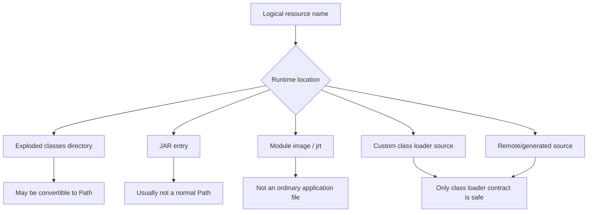
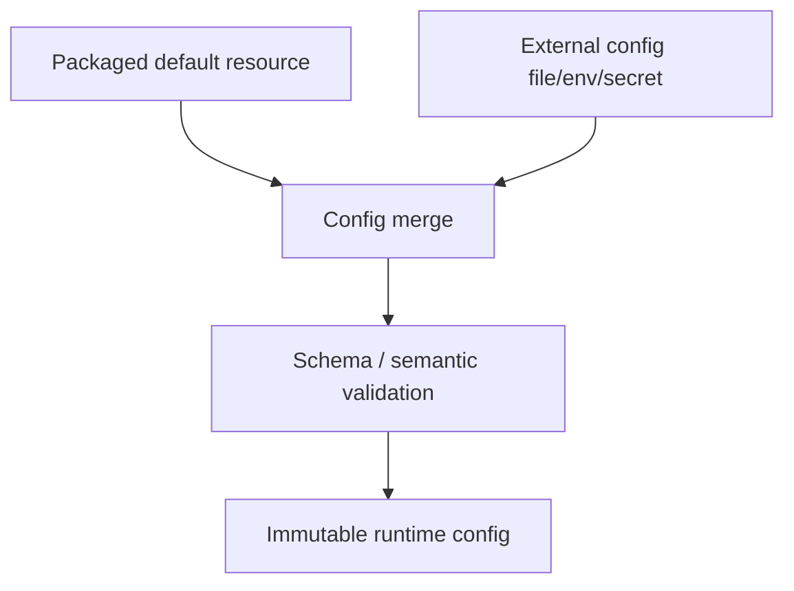

------
title: Learn Java IO, Modern IO, Streams, Buffers, Resources, Serialization & Data Boundaries - Part 028
description: Classpath resources, module resources, JAR resources, ClassLoader behavior, resource paths, config files, and production resource-loading traps in Java applications.
series: learn-java-io-modern-io-resource-boundaries
seriesTitle: Learn Java IO, Modern IO, Streams, Buffers, Resources, Serialization & Data Boundaries
order: 28
partTitle: Classpath, Module, and Application Resources
tags:
  - java
  - io
  - classpath
  - module
  - classloader
  - jar
  - resources
  - configuration
  - resource-boundaries
  - series
date: 2026-06-30
---

# Part 028 — Classpath, Module, and Application Resources

> A resource is not necessarily a file. It may be inside a directory during development, inside a JAR in production, inside a module image, behind a custom class loader, or unavailable because of module encapsulation.

This part is about resource loading as an IO boundary.

The most common production bug in this area is code that works in the IDE and fails after packaging:

```java
Path path = Paths.get(getClass().getResource("/config/app.yaml").toURI());
```

That may work when the resource is a real file in `target/classes`. It often fails when the resource lives inside a JAR.

The correct mental model:

> Classpath and module resources are logical named resources. Read them as streams unless your API contract explicitly requires a real filesystem path.

## 1. Learning Objectives

After this part, you should be able to:

1. Explain why classpath resources are not necessarily files.
2. Correctly use `Class.getResourceAsStream`, `ClassLoader.getResourceAsStream`, and `Module.getResourceAsStream`.
3. Understand absolute vs relative resource names.
4. Design library APIs that accept resources without assuming local file paths.
5. Load packaged configuration, templates, schemas, fixtures, and static assets safely.
6. Handle duplicate classpath resources deterministically.
7. Avoid class loader leaks and context class loader mistakes.
8. Understand how JAR and module packaging affect resource visibility.

## 2. Kaufman Skill Slice

The skill for this part is:

> Given a logical application resource, locate and read it correctly across IDE, test, JAR, modular runtime, container, and custom class-loader environments.

Break it down:

| Sub-skill | Production question |
|---|---|
| Naming | Is the resource path absolute, relative to a class package, or class-loader-rooted? |
| Location | Is the resource in a directory, JAR, module image, generated build output, or external config mount? |
| Ownership | Who closes the returned stream? |
| Encoding | Is the resource binary or text? If text, which charset? |
| Multiplicity | Can multiple dependencies provide the same resource name? |
| Visibility | Is the resource accessible across modules/class loaders? |
| API shape | Does the caller need `Path`, `InputStream`, `URL`, `URI`, or logical name? |
| Deployment | Does the code behave the same in IDE, tests, fat JAR, container, and JPMS module path? |

## 3. Resource Mental Model

A resource is data identified by an abstract name.

Examples:

```text
application.yaml
schemas/case-event.schema.json
templates/email/welcome.html
META-INF/services/com.example.Plugin
static/logo.png
```

A resource may physically live in many forms:



Therefore, the portable abstraction is usually:

```java
InputStream
```

not:

```java
File
Path
```

## 4. ClassLoader Resource Basics

A `ClassLoader` is responsible not only for loading classes but also for locating resources. Java's documentation describes resources as data such as `.class` files, configuration, or images identified by abstract `/`-separated path names.

### 4.1 `ClassLoader.getResourceAsStream`

```java
try (InputStream in = Thread.currentThread()
        .getContextClassLoader()
        .getResourceAsStream("schemas/case-event.schema.json")) {

    if (in == null) {
        throw new IllegalStateException("Resource not found");
    }

    // read stream
}
```

Resource name rules:

- No leading `/` for `ClassLoader` resource lookup.
- Name is rooted at the classpath/module search root of that class loader.
- Uses `/` separators, not OS-specific separators.

Good:

```java
loader.getResourceAsStream("config/defaults.yaml")
```

Avoid:

```java
loader.getResourceAsStream("/config/defaults.yaml")
```

## 5. `Class.getResourceAsStream`

`Class.getResourceAsStream` has different path rules.

```java
public final class ResourceDemo {
    public InputStream relative() {
        return ResourceDemo.class.getResourceAsStream("local-template.txt");
    }

    public InputStream absolute() {
        return ResourceDemo.class.getResourceAsStream("/templates/global.html");
    }
}
```

For `Class.getResourceAsStream`:

| Name | Meaning |
|---|---|
| `"local-template.txt"` | Relative to the package of the class |
| `"/templates/global.html"` | Absolute from classpath/module resource root |

If `ResourceDemo` is in package `com.example.mail`, then:

```java
ResourceDemo.class.getResourceAsStream("local-template.txt")
```

means:

```text
com/example/mail/local-template.txt
```

The leading slash changes the lookup root.

## 6. `Module.getResourceAsStream`

In modular applications, `Module.getResourceAsStream(String name)` reads a resource from a specific module.

The resource name is a `/`-separated path. The API drops a leading slash before delegating. It may return `null` if the resource is not in the module or is encapsulated and cannot be located by the caller.

Example:

```java
Module module = MyFeature.class.getModule();
try (InputStream in = module.getResourceAsStream("config/defaults.yaml")) {
    if (in == null) {
        throw new IllegalStateException("Module resource not found");
    }
    // read it
}
```

Module resource loading matters when:

- you run on the module path instead of only classpath
- resources live in named modules
- module encapsulation affects visibility
- custom layers are used
- plugins are loaded dynamically

## 7. API Comparison

| API | Path form | Typical use |
|---|---|---|
| `ClassLoader.getResourceAsStream("x/y.txt")` | Rooted, no leading slash | Application/library resource by class loader |
| `Class.getResourceAsStream("x.txt")` | Relative to class package | Package-local resource beside class |
| `Class.getResourceAsStream("/x/y.txt")` | Absolute from root | Resource known relative to classpath root |
| `Module.getResourceAsStream("x/y.txt")` | Module-specific resource name | JPMS-aware module resource loading |
| `ClassLoader.getResources("META-INF/services/...")` | Rooted name | Enumerating multiple provider resources |
| `URL.openStream()` | Resource URL | When URL semantics are explicitly acceptable |

## 8. The Biggest Trap: Converting Resource URL to Path

This code is fragile:

```java
URL url = getClass().getResource("/schemas/case-event.schema.json");
Path path = Paths.get(url.toURI());
```

It may work in development:

```text
file:/workspace/app/target/classes/schemas/case-event.schema.json
```

But fail in packaged runtime:

```text
jar:file:/opt/app/app.jar!/schemas/case-event.schema.json
```

A JAR entry is not a normal OS file.

Use stream-based loading:

```java
public static byte[] readRequiredResource(Class<?> anchor, String absoluteName) throws IOException {
    try (InputStream in = anchor.getResourceAsStream(absoluteName)) {
        if (in == null) {
            throw new FileNotFoundException("Resource not found: " + absoluteName);
        }
        return in.readAllBytes(); // okay only for bounded small resources
    }
}
```

For large resources, stream to a sink instead of materializing.

## 9. Required Resource Helper

Avoid sprinkling null checks everywhere.

```java
import java.io.*;
import java.nio.charset.*;

public final class Resources {
    private Resources() {}

    public static InputStream openRequired(Class<?> anchor, String absoluteName) throws IOException {
        InputStream in = anchor.getResourceAsStream(absoluteName);
        if (in == null) {
            throw new FileNotFoundException("Required resource not found: " + absoluteName);
        }
        return in;
    }

    public static String readUtf8(Class<?> anchor, String absoluteName) throws IOException {
        try (InputStream in = openRequired(anchor, absoluteName)) {
            return new String(in.readAllBytes(), StandardCharsets.UTF_8);
        }
    }
}
```

This helper makes policy explicit:

- missing resource is an error
- resource name is absolute
- text charset is UTF-8
- stream is closed by helper
- `readAllBytes()` is used only for known-small packaged resources

## 10. Binary vs Text Resources

Resource loading gives bytes. Text decoding is a separate boundary.

Bad:

```java
new String(in.readAllBytes())
```

Better:

```java
String text = new String(in.readAllBytes(), StandardCharsets.UTF_8);
```

For line-oriented resources:

```java
try (BufferedReader reader = new BufferedReader(
        new InputStreamReader(in, StandardCharsets.UTF_8))) {
    // read lines
}
```

Examples of text resources:

- YAML
- JSON schema
- SQL migration templates
- HTML/email templates
- `.properties` files

Examples of binary resources:

- images
- certificates/keystores
- serialized fixtures
- compressed payload samples
- embedded model/data files

Do not let an API return `String` when the resource is binary.

## 11. Resource Naming Conventions

Recommended conventions:

```text
schemas/case/event-v1.schema.json
templates/email/case-assigned.html
fixtures/io/archive/simple.zip
config/defaults/application-defaults.yaml
META-INF/services/com.example.Plugin
```

Avoid:

```text
../config.yaml
C:\config\app.yaml
/config.yaml              # except when intentionally using Class.getResource absolute lookup
schema.json               # too collision-prone in library code
```

For library resources, prefix with a package-like namespace:

```text
com/example/mylib/schemas/event-v1.json
```

That reduces collisions with application resources or other dependencies.

## 12. Duplicate Resources

The classpath can contain multiple resources with the same name:

```text
lib-a.jar!/META-INF/services/com.example.Plugin
lib-b.jar!/META-INF/services/com.example.Plugin
```

`getResourceAsStream` usually returns the first match according to class-loader search order. That order may depend on runtime packaging.

If multiplicity matters, enumerate:

```java
ClassLoader loader = Thread.currentThread().getContextClassLoader();
Enumeration<URL> urls = loader.getResources("META-INF/services/com.example.Plugin");
while (urls.hasMoreElements()) {
    URL url = urls.nextElement();
    try (InputStream in = url.openStream()) {
        // process each provider file
    }
}
```

If deterministic behavior matters:

- collect all URLs
- sort by a stable rule if possible
- reject duplicates if only one is allowed
- expose conflict diagnostics

For service providers, prefer `ServiceLoader` instead of manually parsing `META-INF/services` unless you are building infrastructure that intentionally needs low-level control.

## 13. Context ClassLoader vs Anchor Class

There are two common resource-loading styles.

### 13.1 Anchor Class

```java
MyLibrary.class.getResourceAsStream("/com/example/mylib/defaults.yaml")
```

Best for resources packaged with the same library.

Strengths:

- stable
- avoids context class loader surprises
- good for library-owned defaults/templates/schemas

### 13.2 Context ClassLoader

```java
Thread.currentThread().getContextClassLoader()
        .getResourceAsStream("application.yaml")
```

Best when the application/container/plugin environment should decide resource visibility.

Strengths:

- works in many plugin/container frameworks
- lets caller environment provide resources
- useful for service discovery and SPI

Weaknesses:

- can be null
- can change by thread
- can leak class loaders if stored in static fields
- can produce surprising results in async/thread-pool code

## 14. ClassLoader Leak Trap

Do not store class loaders, classes, or loaded resource-derived objects in global statics unless you understand lifecycle.

Bad in plugin/container environments:

```java
public final class GlobalCache {
    static final Map<ClassLoader, Object> CACHE = new ConcurrentHashMap<>();
}
```

This can prevent plugin/application class loaders from being garbage collected.

Prefer lifecycle-scoped caches:

```java
public interface ResourceCache extends AutoCloseable {
    Template getTemplate(String name);
    @Override void close();
}
```

The owner of the class loader should own the cache lifecycle.

## 15. External Config vs Packaged Defaults

A common production pattern:

1. Load packaged defaults from resources.
2. Overlay environment-specific external config from mounted files, secrets, config maps, or remote config service.
3. Validate the merged config.
4. Freeze immutable config object.



Do not treat packaged resources and external config as the same kind of boundary.

| Aspect | Packaged resource | External config |
|---|---|---|
| Location | Application artifact | Filesystem/env/remote |
| Mutability | Immutable after build | Changes by deployment |
| Access API | Class/resource stream | Path/env/client |
| Trust | Trusted as build artifact | Deployment-trusted but still validate |
| Failure | Build/package defect | Deployment/config defect |

## 16. Templates and Schemas

Packaged templates and schemas should usually be loaded as resources.

Example: read a schema resource.

```java
public static String readSchema(String name) throws IOException {
    String resource = "/schemas/" + name + ".schema.json";
    try (InputStream in = SchemaRegistry.class.getResourceAsStream(resource)) {
        if (in == null) {
            throw new FileNotFoundException(resource);
        }
        return new String(in.readAllBytes(), StandardCharsets.UTF_8);
    }
}
```

But do not concatenate untrusted input directly into resource names without validation.

Bad:

```java
String resource = "/templates/" + userInput + ".html";
```

Better:

```java
private static final Map<String, String> TEMPLATE_RESOURCES = Map.of(
    "CASE_ASSIGNED", "/templates/email/case-assigned.html",
    "CASE_CLOSED", "/templates/email/case-closed.html"
);
```

Use logical IDs mapped to known resources.

## 17. Tests and Fixtures

Test resources are usually placed under:

```text
src/test/resources
```

They become test classpath resources.

Good pattern:

```java
byte[] fixture = Resources.readRequiredResourceBytes(
        MyTest.class,
        "/fixtures/io/archive/simple.zip"
);
```

For tests that need a real `Path`, copy the resource to a temp directory:

```java
static Path copyResourceToTemp(Class<?> anchor, String resource, Path tempDir) throws IOException {
    Path target = tempDir.resolve(Path.of(resource).getFileName().toString());
    try (InputStream in = anchor.getResourceAsStream(resource)) {
        if (in == null) {
            throw new FileNotFoundException(resource);
        }
        Files.copy(in, target, StandardCopyOption.REPLACE_EXISTING);
    }
    return target;
}
```

This keeps the production code stream-based while allowing path-based tests for APIs that truly require a file.

## 18. When an API Requires `Path`

Some APIs need a real file path:

- memory mapping
- native library loading
- OS-level file watching
- APIs that only accept `File`/`Path`
- tools invoked as external processes

If your resource might be inside a JAR, you need an extraction step:

```java
public static Path materializeResource(Class<?> anchor,
                                       String resource,
                                       Path tempDir) throws IOException {
    String filename = Path.of(resource).getFileName().toString();
    Path target = Files.createTempFile(tempDir, "resource-", "-" + filename);

    try (InputStream in = anchor.getResourceAsStream(resource)) {
        if (in == null) {
            throw new FileNotFoundException(resource);
        }
        Files.copy(in, target, StandardCopyOption.REPLACE_EXISTING);
    }

    return target;
}
```

Make this explicit in your API:

```java
public interface NativeToolRunner {
    ToolResult runWithMaterializedResource(String resourceName) throws IOException;
}
```

Do not hide extraction in random helper code without cleanup policy.

## 19. JAR Resource URLs

Resource URLs may have schemes such as:

```text
file:/workspace/app/target/classes/config/app.yaml
jar:file:/opt/app/app.jar!/config/app.yaml
jrt:/java.base/java/lang/String.class
```

Do not write URL parsing logic unless you intentionally support those schemes.

A resource `URL` is useful for:

- diagnostics
- opening a stream
- enumerating resource locations
- passing to APIs that accept URL streams

It is not automatically a filesystem path.

## 20. Multi-Release JAR Implication

Multi-release JARs can contain version-specific classes/resources under:

```text
META-INF/versions/{n}/...
```

`JarFile` has support for processing multi-release JAR files depending on configuration. Class loaders using `JarFile` should configure version-aware behavior appropriately for the running JVM.

For most application resource loading, you do not manually inspect multi-release JAR layout. But if you build classpath scanners, packaging analyzers, or plugin systems, you must understand that the same logical entry can have version-specific variants.

## 21. Resource Loading in Fat JARs and Nested JARs

Some application packagers create fat or executable JARs with nested dependencies.

Examples:

```text
app.jar
├── BOOT-INF/classes/application.yaml
└── BOOT-INF/lib/dependency.jar
```

In such runtimes, custom class loaders may provide resources from nested JARs. Code that assumes ordinary filesystem layout is likely to break.

Stream-based class-loader resource access is the most portable strategy.

If you are writing low-level scanners, do not assume every classpath element is a directory or a plain JAR file. That assumption is often false in modern deployment packaging.

## 22. Library API Design for Resources

Avoid APIs like this for library-owned resources:

```java
void configure(Path schemaPath);
```

Better options:

```java
void configure(InputStream schemaStream);
void configure(ResourceSource schemaSource);
void configure(String logicalSchemaName);
```

A good `ResourceSource` can encode ownership and repeatability:

```java
public interface ResourceSource {
    String description();
    boolean replayable();
    InputStream openStream() throws IOException;
}
```

Implementations:

```java
public record ClasspathResource(Class<?> anchor, String name) implements ResourceSource {
    @Override
    public String description() {
        return "classpath:" + name + " anchored at " + anchor.getName();
    }

    @Override
    public boolean replayable() {
        return true;
    }

    @Override
    public InputStream openStream() throws IOException {
        InputStream in = anchor.getResourceAsStream(name);
        if (in == null) {
            throw new FileNotFoundException(name);
        }
        return in;
    }
}
```

This design is better than passing an already-open `InputStream` when the callee needs to read multiple times.

## 23. Resource Lookup Failure Taxonomy

When resource loading fails, diagnose precisely.

| Symptom | Likely cause |
|---|---|
| Works in IDE, fails in JAR | Code converted resource URL to `Path` |
| `getResourceAsStream` returns null | Wrong leading slash or wrong class loader |
| Works in app, fails in tests | Resource under wrong source set |
| Works on classpath, fails on module path | Module encapsulation/resource visibility issue |
| Wrong resource loaded | Duplicate resource names across dependencies |
| Fails in async thread | Context class loader differs or is null |
| File path works locally, fails in container | Working directory assumption or missing mount |
| Encoding corruption | Default charset used |

## 24. Diagnostic Helper

For production debugging, log resource lookup context without dumping secrets.

```java
public static URL requireResourceUrl(Class<?> anchor, String absoluteName) {
    URL url = anchor.getResource(absoluteName);
    if (url == null) {
        ClassLoader loader = anchor.getClassLoader();
        Module module = anchor.getModule();
        throw new IllegalStateException(
            "Resource not found: " + absoluteName
            + ", anchor=" + anchor.getName()
            + ", loader=" + loader
            + ", module=" + module.getName()
        );
    }
    return url;
}
```

Be careful not to log sensitive resource content or secret paths.

## 25. Security and Trust Boundary Notes

This series already has a separate security track, but IO-level resource safety still needs basic discipline:

- Do not let user input select arbitrary classpath resources.
- Do not expose resource contents through debug endpoints.
- Do not load executable scripts/templates by unchecked names.
- Do not treat packaged defaults as runtime secrets.
- Do not store secrets in application JAR resources.
- Validate external config even when it comes from trusted deployment.

## 26. Production Patterns

### 26.1 Packaged Defaults + External Override

```java
public final class AppConfigLoader {
    public AppConfig load(Optional<Path> externalConfig) throws IOException {
        String defaults = Resources.readUtf8(
                AppConfigLoader.class,
                "/config/defaults.yaml"
        );

        String override = null;
        if (externalConfig.isPresent()) {
            override = Files.readString(externalConfig.get(), StandardCharsets.UTF_8);
        }

        return parseValidateAndFreeze(defaults, override);
    }

    private AppConfig parseValidateAndFreeze(String defaults, String override) {
        // parser/validator intentionally omitted
        return new AppConfig();
    }
}
```

### 26.2 Resource-Based Template Registry

```java
public enum EmailTemplate {
    CASE_ASSIGNED("/templates/email/case-assigned.html"),
    CASE_CLOSED("/templates/email/case-closed.html");

    private final String resource;

    EmailTemplate(String resource) {
        this.resource = resource;
    }

    public String load() throws IOException {
        return Resources.readUtf8(EmailTemplate.class, resource);
    }
}
```

### 26.3 Copy Resource to Temp for Native Tool

```java
Path schemaFile = materializeResource(
        ToolRunner.class,
        "/schemas/tool/schema.xsd",
        tempDir
);
```

This is acceptable because the materialization boundary is explicit.

## 27. Anti-Patterns

### 27.1 Assuming `src/main/resources` Exists at Runtime

Bad:

```java
Path.of("src/main/resources/config/defaults.yaml")
```

That path is a source-tree path, not a runtime resource path.

### 27.2 Assuming Current Working Directory

Bad:

```java
Files.readString(Path.of("config/defaults.yaml"));
```

This reads from the process working directory, not the classpath.

### 27.3 Converting Every Resource to `File`

Bad:

```java
new File(getClass().getResource("/x.txt").getFile())
```

Breaks with spaces, URL escaping, JARs, custom loaders, and module images.

### 27.4 Using Default Charset

Bad:

```java
new InputStreamReader(in)
```

Use explicit charset.

### 27.5 Returning Open Resource Streams Without Ownership Contract

Bad:

```java
InputStream getConfig(); // Who closes this?
```

Better:

```java
void withConfig(ConfigConsumer consumer) throws IOException;
```

or:

```java
ResourceSource configSource();
```

## 28. Exercise: Build a Resource Loader Library

Create a small internal library:

```java
public interface ResourceLoader {
    InputStream openRequired(String name) throws IOException;
    Optional<URL> find(String name);
    List<URL> findAll(String name) throws IOException;
    String readUtf8(String name) throws IOException;
}
```

Implement:

1. `ClasspathResourceLoader`
2. `AnchoredClassResourceLoader`
3. `ModuleResourceLoader`
4. `FilesystemResourceLoader`
5. `CompositeResourceLoader`

Required behavior:

- no default charset
- required vs optional resource distinction
- deterministic duplicate handling
- helpful diagnostics
- no conversion to `Path` unless loader is filesystem-specific
- close all streams deterministically

## 29. Review Checklist

When reviewing resource-loading code, ask:

- Does this code assume a resource is a file?
- Does it work inside a JAR?
- Does it work on the module path?
- Is the resource name absolute or relative by contract?
- Is the correct class loader used?
- Are duplicate resources possible?
- Is charset explicit?
- Is missing resource behavior explicit?
- Is stream ownership explicit?
- Does it leak class loaders through static caches?
- Are external config and packaged defaults treated differently?
- Does user input influence resource names?

## 30. Key Takeaways

1. A classpath/module resource is a logical resource, not necessarily a filesystem file.
2. `ClassLoader.getResourceAsStream` and `Class.getResourceAsStream` use different naming rules.
3. Use anchor-class loading for library-owned resources and context class loader loading for environment-provided resources.
4. Use stream-based access unless a real file path is explicitly required.
5. When a real path is required, materialize the resource into a managed temp file.
6. Duplicate resources are possible and must be handled intentionally.
7. Packaged defaults, external config, and secrets are different boundary types.
8. Resource-loading code must be tested in packaged runtime, not only in IDE class output directories.

## References

- Oracle Java SE 11 API, `java.lang.ClassLoader`: `https://docs.oracle.com/en/java/javase/11/docs/api/java.base/java/lang/ClassLoader.html`
- Oracle Java SE 24 API, `java.lang.Module`: `https://docs.oracle.com/en/java/javase/24/docs/api/java.base/java/lang/Module.html`
- Oracle Java SE 25 API, `java.util.jar.JarFile`: `https://docs.oracle.com/en/java/javase/25/docs/api/java.base/java/util/jar/JarFile.html`
- Oracle Java SE 25 API, `java.util.jar.JarInputStream`: `https://docs.oracle.com/en/java/javase/25/docs/api/java.base/java/util/jar/JarInputStream.html`
- Oracle Java SE 25 API, `java.nio.file.Files`: `https://docs.oracle.com/en/java/javase/25/docs/api/java.base/java/nio/file/Files.html`
