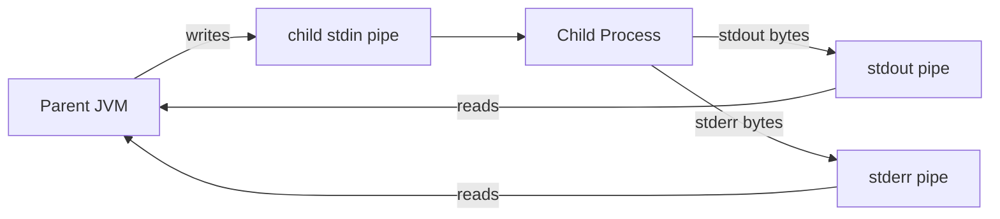
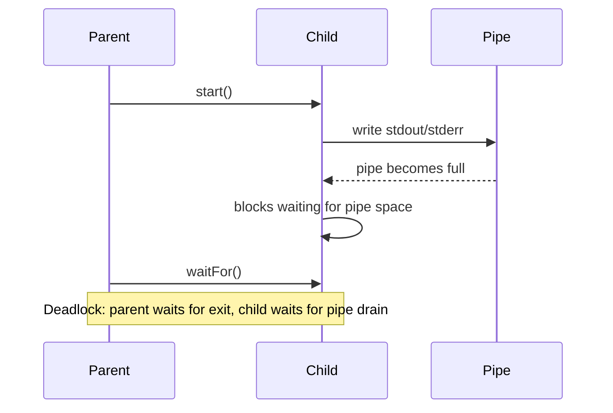
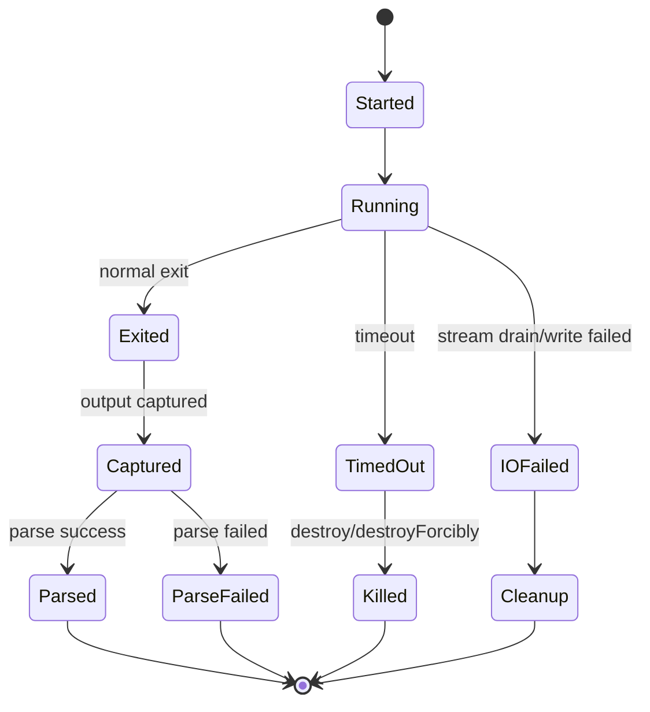
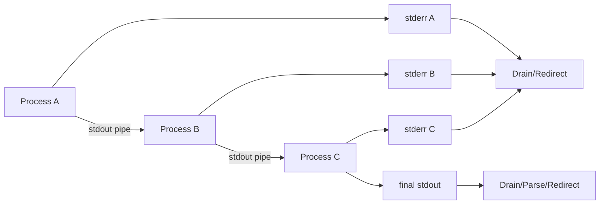

------
title: Learn Java IO, Modern IO, Streams, Buffers, Resources, Serialization & Data Boundaries - Part 029
description: Process IO in Java using ProcessBuilder, stdin/stdout/stderr handling, pipe deadlock avoidance, redirects, bounded capture, timeouts, cancellation, encoding, and production process-boundary design.
series: learn-java-io-modern-io-resource-boundaries
seriesTitle: Learn Java IO, Modern IO, Streams, Buffers, Resources, Serialization & Data Boundaries
order: 29
partTitle: Process IO: stdin, stdout, stderr, and Deadlock Avoidance
tags:
  - java
  - io
  - processbuilder
  - process
  - stdin
  - stdout
  - stderr
  - pipes
  - deadlock
  - resource-boundaries
  - series
date: 2026-06-30
---

# Part 029 — Process IO: stdin, stdout, stderr, and Deadlock Avoidance

> Starting a process is easy. Owning its IO boundary correctly is the hard part.

Java gives you `ProcessBuilder` and `Process` to create and control native processes. That sounds simple until the child process writes enough data to fill a pipe, waits for the parent to read it, while the parent waits for the child to exit. That is the classic process IO deadlock.

This part treats process execution as a bidirectional IO boundary:

```text
parent JVM  <---- stdin/stdout/stderr pipes ---->  child process
```

The mental model is not “run command and get string”. The correct model is:

> A child process is a concurrent producer/consumer with finite OS pipe buffers, independent lifecycle, its own working directory, environment, encoding, exit status, and failure modes.

## 1. Learning Objectives

After this part, you should be able to:

1. Explain why process IO deadlocks happen.
2. Use `ProcessBuilder` without accidentally invoking a shell.
3. Decide between `inheritIO`, redirect-to-file, concurrent drain, and bounded capture.
4. Correctly handle stdin, stdout, and stderr lifecycles.
5. Apply timeout, cancellation, and process-tree cleanup policies.
6. Decode process output with explicit charset rules.
7. Build a reusable process runner that prevents unbounded memory capture.
8. Understand the difference between exit code failure and IO/protocol failure.
9. Test process-boundary behavior without relying on fragile shell scripts.
10. Review production process execution code for deadlock, leak, and data-loss risks.

## 2. Kaufman Skill Slice

The skill for this part is:

> Given an external command, execute it from Java while preserving bounded memory, bounded time, deterministic IO ownership, and diagnosable failure behavior.

Break it down:

| Sub-skill | Production question |
|---|---|
| Command construction | Are we executing an argument vector or a shell expression? |
| Environment | Which variables are inherited, added, removed, or normalized? |
| Working directory | Is the child launched from a controlled directory? |
| Stdin policy | Does the child need input, EOF, a file, or no input? |
| Stdout policy | Is output inherited, redirected, streamed, captured, parsed, or discarded? |
| Stderr policy | Is stderr separate, merged, redirected, or captured with limit? |
| Backpressure | Can the child block because the parent is not draining pipes? |
| Timeout | What happens if the child hangs? |
| Cancellation | Do we destroy the child only, or the process tree? |
| Encoding | How are bytes from stdout/stderr decoded? |
| Result model | What is returned: exit code, output, metrics, files, or parsed records? |
| Cleanup | Are streams, executors, temp files, and processes closed? |

## 3. Process IO Mental Model

A process has at least three standard streams:

| Stream | From Java parent perspective | Common Java method |
|---|---|---|
| Child stdin | Parent writes to child | `process.getOutputStream()` |
| Child stdout | Parent reads from child | `process.getInputStream()` |
| Child stderr | Parent reads diagnostics from child | `process.getErrorStream()` |

The names are easy to confuse:

```text
process.getOutputStream()
```

means:

```text
an OutputStream from the parent JVM into the child's standard input
```

Similarly:

```text
process.getInputStream()
```

means:

```text
an InputStream for the parent JVM to read from the child's standard output
```

Diagram:



Important invariant:

> The child process, the parent thread, and the OS pipe buffers are concurrent participants. If any participant waits while holding a full/empty pipe expectation, the system can deadlock.

## 4. The Classic Deadlock

This is wrong:

```java
Process process = new ProcessBuilder("some-command").start();
int exitCode = process.waitFor();
String output = new String(process.getInputStream().readAllBytes(), StandardCharsets.UTF_8);
String error = new String(process.getErrorStream().readAllBytes(), StandardCharsets.UTF_8);
```

Why?

If the child writes enough stdout or stderr to fill the pipe buffer, it blocks. The parent is waiting for exit. The child cannot exit because it is blocked writing. The parent cannot start reading because it is waiting.

State diagram:



The fix is not “increase buffer size”. The fix is to choose a stream policy before starting the process.

## 5. ProcessBuilder Core Model

`ProcessBuilder` is a mutable builder for process attributes:

```java
ProcessBuilder pb = new ProcessBuilder("git", "status", "--porcelain=v1");
pb.directory(Path.of("/repo/worktree").toFile());
pb.environment().put("LC_ALL", "C");
Process process = pb.start();
```

Key attributes:

| Attribute | Meaning |
|---|---|
| command | Argument vector used to create the process |
| environment | Environment variables for the child |
| directory | Working directory for the child |
| redirects | Where stdin/stdout/stderr are connected |
| error stream merge | Whether stderr is merged into stdout |

Production rule:

> Build commands as an argument vector, not as one shell string, unless shell semantics are explicitly required.

Prefer:

```java
new ProcessBuilder("git", "log", "--oneline", "--", fileName)
```

Avoid:

```java
new ProcessBuilder("sh", "-c", "git log --oneline -- " + fileName)
```

The second form introduces shell parsing, quoting, expansion, and injection risk. Sometimes shell is necessary, but it should be a conscious boundary decision.

## 6. Four Safe Output Strategies

There are four common ways to handle stdout/stderr safely.

### 6.1 Inherit IO

Use when the child is an interactive or diagnostic command and you want output to go directly to the parent process console:

```java
Process process = new ProcessBuilder("java", "--version")
    .inheritIO()
    .start();

int exit = process.waitFor();
```

Pros:

- Simple.
- No pipe draining code.
- Good for CLI tools.

Cons:

- Output is not captured.
- Hard to test.
- Not suitable for server-side request handling.

### 6.2 Redirect to File

Use when output may be large and should not be stored in memory:

```java
Path out = tempDir.resolve("tool.out");
Path err = tempDir.resolve("tool.err");

Process process = new ProcessBuilder("some-tool", "--large-output")
    .redirectOutput(out.toFile())
    .redirectError(err.toFile())
    .start();

int exit = process.waitFor();
```

Pros:

- Handles large output.
- Avoids unbounded heap usage.
- Preserves diagnostic artifacts.

Cons:

- Requires file lifecycle management.
- Caller must inspect or stream files later.

### 6.3 Merge stderr into stdout

Use when ordering between stdout and stderr matters more than separation:

```java
Process process = new ProcessBuilder("some-tool")
    .redirectErrorStream(true)
    .start();

byte[] combined = process.getInputStream().readAllBytes();
int exit = process.waitFor();
```

Careful: after `redirectErrorStream(true)`, stderr is merged into stdout. The error stream is no longer independently meaningful.

Pros:

- One stream to drain.
- Preserves approximate interleaving.

Cons:

- Loses stream distinction.
- Parsing output becomes harder.

### 6.4 Concurrent Drain with Bounded Capture

Use when you need captured output but must avoid deadlock and memory blowup.

```java
ExecutorService executor = Executors.newFixedThreadPool(2);

try {
    Process process = new ProcessBuilder("some-tool").start();

    Future<byte[]> stdout = executor.submit(() -> readLimited(process.getInputStream(), 1_000_000));
    Future<byte[]> stderr = executor.submit(() -> readLimited(process.getErrorStream(), 1_000_000));

    boolean finished = process.waitFor(30, TimeUnit.SECONDS);
    if (!finished) {
        process.destroyForcibly();
        throw new TimeoutException("process timed out");
    }

    int exit = process.exitValue();
    byte[] out = stdout.get(5, TimeUnit.SECONDS);
    byte[] err = stderr.get(5, TimeUnit.SECONDS);
} finally {
    executor.shutdownNow();
}
```

The important ideas:

1. Drain stdout and stderr while the process is running.
2. Bound the captured bytes.
3. Apply timeout.
4. Handle process cleanup.
5. Handle gobbler failures separately from process exit code.

## 7. Bounded Capture Utility

Never expose an unbounded `readAllBytes()` on process output in production unless the command and maximum output are strictly controlled.

A simple bounded reader:

```java
static byte[] readLimited(InputStream in, int maxBytes) throws IOException {
    ByteArrayOutputStream out = new ByteArrayOutputStream(Math.min(maxBytes, 8192));
    byte[] buffer = new byte[8192];
    int total = 0;

    while (true) {
        int n = in.read(buffer);
        if (n == -1) {
            return out.toByteArray();
        }
        if (n == 0) {
            continue;
        }
        if (total + n > maxBytes) {
            int allowed = maxBytes - total;
            if (allowed > 0) {
                out.write(buffer, 0, allowed);
            }
            throw new IOException("process output exceeded limit: " + maxBytes + " bytes");
        }
        out.write(buffer, 0, n);
        total += n;
    }
}
```

In more advanced systems, use a result that records truncation instead of throwing:

```java
record CapturedBytes(byte[] bytes, boolean truncated, long observedBytes) {}
```

A truncating capture is often better for diagnostics:

```text
capture first 64 KiB stdout
capture first 64 KiB stderr
stream full output to file if needed
```

## 8. Stdin Policy

A child process that reads stdin may block forever if the parent never writes or never closes stdin.

Wrong:

```java
Process process = new ProcessBuilder("some-filter").start();
process.getOutputStream().write(inputBytes);
int exit = process.waitFor(); // child may wait for EOF
```

Better:

```java
Process process = new ProcessBuilder("some-filter").start();

try (OutputStream stdin = process.getOutputStream()) {
    stdin.write(inputBytes);
} // close sends EOF to child stdin

int exit = process.waitFor();
```

But still not enough if stdout/stderr are not drained concurrently.

Production stdin modes:

| Mode | Usage |
|---|---|
| closed stdin | Child should not read input |
| inherited stdin | Interactive command |
| redirected from file | Large input |
| streamed by parent | Dynamic input |
| bounded generated input | Controlled generated payload |

Closed stdin pattern:

```java
Process process = new ProcessBuilder("tool").start();
process.getOutputStream().close();
```

If the child expects no input, closing stdin early is often clearer than leaving it open.

## 9. Timeout and Cancellation

A process can hang for many reasons:

- waiting for stdin
- blocked writing stdout/stderr
- waiting on network
- waiting on lock
- CPU-bound loop
- child process spawned grandchildren
- external binary prompt waiting for user input

Use timeout:

```java
boolean finished = process.waitFor(timeout.toMillis(), TimeUnit.MILLISECONDS);
if (!finished) {
    process.destroy();
    if (!process.waitFor(2, TimeUnit.SECONDS)) {
        process.destroyForcibly();
    }
    throw new TimeoutException("process timed out after " + timeout);
}
```

This kills the direct child process. It may not kill grandchildren on every platform.

For process trees, Java exposes `ProcessHandle`:

```java
static void destroyTree(Process process) {
    ProcessHandle handle = process.toHandle();

    handle.descendants()
        .sorted(Comparator.comparingLong(ProcessHandle::pid).reversed())
        .forEach(ph -> ph.destroy());

    handle.destroy();
}
```

Then escalate:

```java
static void destroyTreeForcibly(Process process) {
    ProcessHandle handle = process.toHandle();

    handle.descendants()
        .forEach(ProcessHandle::destroyForcibly);

    handle.destroyForcibly();
}
```

Caveat:

> Process-tree semantics are platform-dependent. Treat cancellation as best-effort unless you control the child process design.

## 10. Encoding Boundary

Process output is bytes, not strings.

Bad:

```java
String output = new String(bytes);
```

Better:

```java
String output = new String(bytes, StandardCharsets.UTF_8);
```

But even UTF-8 may be wrong if the child uses platform encoding or locale-specific output.

Production strategy:

1. Configure the child to emit stable machine-readable UTF-8 output when possible.
2. Set locale/environment variables where appropriate.
3. Prefer machine-readable flags such as JSON, NUL-delimited output, or stable porcelain modes.
4. Decode with explicit charset.
5. Treat decoding failures as protocol failures.

Example:

```java
ProcessBuilder pb = new ProcessBuilder("git", "status", "--porcelain=v1", "-z");
pb.environment().put("LC_ALL", "C");
```

The `-z` option in tools that support it is valuable because filenames may contain newlines. This is not Java-specific; it is a boundary design principle:

> Prefer unambiguous machine protocols over human-readable text when a process output is consumed by code.

## 11. Exit Code Is Not the Whole Result

A process execution result has multiple channels of information:

```java
record ProcessResult(
    int exitCode,
    byte[] stdout,
    byte[] stderr,
    Duration duration,
    boolean timedOut,
    boolean stdoutTruncated,
    boolean stderrTruncated
) {}
```

Exit code alone cannot tell you:

- whether stdout capture was truncated
- whether stderr capture failed
- whether decoding failed
- whether timeout killed the process
- whether output parsing failed
- whether the process wrote a valid partial artifact

Process boundary states:



A robust process runner should not collapse all non-happy-path states into “exit code != 0”.

## 12. Redirects

`ProcessBuilder.Redirect` lets you connect standard streams to files.

Examples:

```java
ProcessBuilder pb = new ProcessBuilder("tool");
pb.redirectInput(inputFile.toFile());
pb.redirectOutput(outputFile.toFile());
pb.redirectError(errorFile.toFile());
```

Append mode:

```java
pb.redirectOutput(ProcessBuilder.Redirect.appendTo(logFile.toFile()));
```

Discard output:

```java
pb.redirectOutput(ProcessBuilder.Redirect.DISCARD);
pb.redirectError(ProcessBuilder.Redirect.DISCARD);
```

Use discard only when diagnostics are truly irrelevant. In production, silently discarding stderr often makes incidents harder to debug.

Better compromise:

```text
large output -> file
small diagnostic summary -> bounded capture
```

## 13. Merging stderr

`redirectErrorStream(true)` merges stderr into stdout.

```java
ProcessBuilder pb = new ProcessBuilder("tool");
pb.redirectErrorStream(true);
Process process = pb.start();
byte[] combined = process.getInputStream().readAllBytes();
```

Use it when:

- you need approximate chronological output
- the tool writes progress to stderr but data to stdout is not machine-consumed
- separation does not matter

Avoid it when:

- stdout is a machine-readable protocol
- stderr is diagnostic only
- you must distinguish data from error messages

A common production bug:

```java
pb.redirectErrorStream(true);
parseJson(process.getInputStream());
```

If the child writes warnings to stderr, merged output is no longer valid JSON.

## 14. Process Pipelines

Java supports starting pipelines with `ProcessBuilder.startPipeline`.

Conceptual example:

```java
List<ProcessBuilder> pipeline = List.of(
    new ProcessBuilder("cat", "input.txt"),
    new ProcessBuilder("grep", "ERROR"),
    new ProcessBuilder("sort")
);

List<Process> processes = ProcessBuilder.startPipeline(pipeline);
```

This creates OS-level pipe connections between processes.

Important:

1. You still need to consume the final stdout.
2. You still need to consume stderr for each process unless redirected/merged.
3. You need to check each exit code, not just the last process.
4. Cancellation should consider the whole pipeline.

Pipeline failure model:



Pipeline result should preserve per-process status:

```java
record PipelineResult(List<Integer> exitCodes, byte[] stdout, List<byte[]> stderrs) {}
```

## 15. Interactive Process Trap

Some commands are interactive by default:

- password prompts
- confirmation prompts
- pagers
- editors
- shell commands waiting for stdin
- tools that change behavior if stdout is a terminal

In server-side Java, avoid interactive commands. Disable prompts explicitly:

```text
--yes
--batch
--non-interactive
--no-pager
--quiet
```

Also remember:

> A pipe is not a terminal. Some programs behave differently when stdout/stderr are not attached to a TTY.

Java `ProcessBuilder` does not provide a full pseudo-terminal abstraction. If you need TTY behavior, you need a dedicated library or platform-specific integration.

## 16. Environment Boundary

Environment variables are part of the process contract.

```java
ProcessBuilder pb = new ProcessBuilder("tool");
Map<String, String> env = pb.environment();
env.put("LC_ALL", "C");
env.put("NO_COLOR", "1");
env.remove("AWS_PROFILE");
```

Guidelines:

| Concern | Practice |
|---|---|
| Locale-sensitive output | Set stable locale variables where applicable |
| Color codes | Disable color for machine parsing |
| Credentials | Do not accidentally inherit secrets if child does not need them |
| Proxies | Decide whether proxy env vars should be inherited |
| PATH lookup | Prefer absolute executable path for critical commands |
| Case sensitivity | Environment behavior differs across platforms |

A deterministic process runner should allow an explicit environment policy:

```java
enum EnvironmentPolicy {
    INHERIT_ALL,
    INHERIT_SELECTED,
    EMPTY_WITH_ALLOWLIST
}
```

## 17. Working Directory Boundary

Working directory affects:

- relative file paths
- config discovery
- tool behavior
- generated artifact location
- security boundaries
- reproducibility

Set it explicitly:

```java
ProcessBuilder pb = new ProcessBuilder("git", "status", "--porcelain=v1");
pb.directory(repoDir.toFile());
```

Do not rely on the JVM process working directory in production.

If a child writes files, prefer:

```text
work root / execution id / staging files
```

Example:

```text
/var/app/work/process-runs/2026-06-30T10-15-30Z-8f3a/
  input/
  output/
  logs/
  tmp/
```

This makes cleanup, diagnostics, and retry behavior easier.

## 18. Cross-Platform Concerns

Process execution is OS-sensitive.

| Concern | Linux/macOS | Windows |
|---|---|---|
| executable lookup | PATH, executable bit | PATHEXT, `.exe`, `.bat`, `.cmd` |
| shell | `/bin/sh`, bash, zsh | `cmd.exe`, PowerShell |
| path separator | `/` | `\` and `/` in some APIs |
| line endings | `\n` | often `\r\n` |
| signals | POSIX signals | different process control model |
| environment case | usually case-sensitive | often case-insensitive semantics |

Avoid assuming shell syntax is portable:

```text
rm -rf path
```

is not portable Java process logic.

Prefer Java APIs for filesystem work. Use external processes only when they provide capability you cannot reasonably implement in Java.

## 19. Production ProcessRunner Design

A useful process runner should make unsafe choices hard.

```java
record CommandSpec(
    List<String> command,
    Path workingDirectory,
    Map<String, String> environmentOverrides,
    StdinSpec stdin,
    OutputSpec stdout,
    OutputSpec stderr,
    Duration timeout
) {}

sealed interface StdinSpec permits NoStdin, BytesStdin, FileStdin {}
record NoStdin() implements StdinSpec {}
record BytesStdin(byte[] bytes) implements StdinSpec {}
record FileStdin(Path path) implements StdinSpec {}

sealed interface OutputSpec permits InheritOutput, FileOutput, CaptureOutput, DiscardOutput {}
record InheritOutput() implements OutputSpec {}
record FileOutput(Path path, boolean append) implements OutputSpec {}
record CaptureOutput(int maxBytes) implements OutputSpec {}
record DiscardOutput() implements OutputSpec {}
```

This makes policies explicit:

```java
CommandSpec spec = new CommandSpec(
    List.of("git", "status", "--porcelain=v1", "-z"),
    repo,
    Map.of("LC_ALL", "C"),
    new NoStdin(),
    new CaptureOutput(256_000),
    new CaptureOutput(64_000),
    Duration.ofSeconds(10)
);
```

Better than:

```java
run("git status");
```

## 20. Minimal Safe Runner Skeleton

This is intentionally incomplete but shows the structure:

```java
public final class ProcessRunner {
    private final ExecutorService ioExecutor;

    public ProcessRunner(ExecutorService ioExecutor) {
        this.ioExecutor = Objects.requireNonNull(ioExecutor);
    }

    public ProcessResult run(List<String> command, Path cwd, Duration timeout) throws Exception {
        ProcessBuilder pb = new ProcessBuilder(command);
        pb.directory(cwd.toFile());

        Process process = pb.start();
        Instant started = Instant.now();

        Future<CapturedBytes> stdout = ioExecutor.submit(() -> capture(process.getInputStream(), 256_000));
        Future<CapturedBytes> stderr = ioExecutor.submit(() -> capture(process.getErrorStream(), 64_000));

        try (OutputStream stdin = process.getOutputStream()) {
            // Close stdin to signal EOF because this runner does not provide input.
        }

        boolean finished = process.waitFor(timeout.toMillis(), TimeUnit.MILLISECONDS);
        if (!finished) {
            process.destroy();
            if (!process.waitFor(2, TimeUnit.SECONDS)) {
                process.destroyForcibly();
            }
            return ProcessResult.timedOut(command, Duration.between(started, Instant.now()));
        }

        int exitCode = process.exitValue();
        CapturedBytes out = stdout.get(5, TimeUnit.SECONDS);
        CapturedBytes err = stderr.get(5, TimeUnit.SECONDS);

        return ProcessResult.completed(
            command,
            exitCode,
            out,
            err,
            Duration.between(started, Instant.now())
        );
    }

    private static CapturedBytes capture(InputStream in, int maxBytes) throws IOException {
        ByteArrayOutputStream out = new ByteArrayOutputStream(Math.min(maxBytes, 8192));
        byte[] buffer = new byte[8192];
        long observed = 0;
        boolean truncated = false;

        while (true) {
            int n = in.read(buffer);
            if (n == -1) {
                return new CapturedBytes(out.toByteArray(), truncated, observed);
            }

            observed += n;
            int remaining = maxBytes - out.size();
            if (remaining > 0) {
                out.write(buffer, 0, Math.min(n, remaining));
            } else {
                truncated = true;
            }

            if (observed > maxBytes) {
                truncated = true;
            }
        }
    }
}
```

A production implementation should also handle:

- redirects
- stdin bytes/files
- process tree cancellation
- executor saturation
- startup failure
- stdout/stderr drain failure
- structured logging
- result redaction
- temporary working directory lifecycle

## 21. Startup Failure vs Runtime Failure

`pb.start()` can fail before a child exists:

```java
try {
    Process process = pb.start();
} catch (IOException e) {
    // Executable not found, permission issue, invalid working directory, etc.
}
```

This is different from:

```java
exitCode != 0
```

Failure taxonomy:

| Failure | Example | Result category |
|---|---|---|
| Startup failure | executable not found | no child process |
| IO setup failure | redirect file not writable | no useful child result |
| Runtime non-zero exit | command failed | child result with exit code |
| Timeout | child did not finish | cancellation result |
| Drain failure | stdout reader failed | boundary failure |
| Parse failure | invalid JSON output | protocol failure |

Good APIs preserve these distinctions.

## 22. Logging and Redaction

Command logging is useful but dangerous.

Avoid logging secrets:

```text
curl -H Authorization: Bearer ...
```

Instead, model redaction explicitly:

```java
record CommandArgument(String value, boolean sensitive) {}
```

Or keep command and display command separate:

```java
record CommandSpec(List<String> argv, List<String> displayArgv) {}
```

Log:

- executable name
- working directory
- timeout
- exit code
- duration
- output size/truncation
- diagnostic file path

Be careful with:

- full stdout/stderr
- environment variables
- command arguments containing tokens
- generated temporary paths that reveal sensitive tenant/case data

## 23. Process Boundary Patterns

### 23.1 Tool adapter pattern

Wrap each external tool behind a typed interface:

```java
interface PdfTextExtractor {
    ExtractedText extract(Path pdf) throws IOException, InterruptedException;
}
```

Internally it may call `pdftotext`, but the rest of the application sees a typed contract.

Benefits:

- isolates process IO complexity
- centralizes timeout
- centralizes version detection
- simplifies testing
- prevents command construction spread across codebase

### 23.2 Staged output pattern

External tools often write output files. Use staging:

```text
run-dir/
  input.pdf
  output.tmp
  stderr.log
  manifest.json
```

Only move `output.tmp` to committed location after:

1. process exit code success
2. output file exists
3. output file validates
4. size/format constraints pass
5. optional checksum computed

### 23.3 Version probe pattern

On startup or first use:

```text
tool --version
```

Validate:

- executable exists
- version is supported
- output format is recognized
- runtime permission is available

Do not discover this inside the first user request.

### 23.4 Quarantine failure pattern

For regulated or audit-heavy systems, keep failed run artifacts:

```text
failed-runs/<execution-id>/
  command.json
  stdout.head
  stderr.head
  input.manifest
  generated-files/
```

This supports incident diagnosis without re-running non-deterministic tools.

## 24. Process IO Anti-Patterns

| Anti-pattern | Why it fails |
|---|---|
| `waitFor()` before draining streams | Deadlock when pipe fills |
| Unbounded `readAllBytes()` | Heap exhaustion from large output |
| Merging stderr into machine stdout | Corrupts protocol parsing |
| Passing one shell string | Quoting and injection problems |
| Leaving stdin open | Child waits for EOF |
| Ignoring stderr | Lost diagnostics |
| No timeout | Request/thread/resource leak |
| Killing only child when it spawns children | Orphan processes |
| Relying on default charset | Platform-dependent decoding |
| Relying on parent cwd | Deployment-dependent behavior |
| Logging full command/env | Secret leakage |
| Treating non-zero exit as only failure | Misses timeout, IO, and parse failures |

## 25. Deliberate Practice

### Exercise 1 — Deadlock reproduction

Write a child program that prints more data than a pipe buffer to stderr and then exits.

Parent program:

```java
Process process = new ProcessBuilder("java", "SpamStderr").start();
process.waitFor();
```

Observe that it may hang.

Then fix it by draining stderr concurrently.

### Exercise 2 — Bounded capture

Build a process runner that captures only the first 64 KiB of stdout and stderr, while tracking the total observed bytes.

Acceptance criteria:

- no unbounded `readAllBytes()`
- no process deadlock
- result marks truncation
- timeout enforced
- stdin closed when unused

### Exercise 3 — Protocol-safe parsing

Run a tool that emits machine-readable stdout and diagnostic stderr.

Acceptance criteria:

- stdout parsed independently
- stderr captured separately
- merged stderr test fails intentionally
- decoding charset is explicit

### Exercise 4 — Staged artifact generation

Execute an external process that writes an output file.

Acceptance criteria:

- output written to staging directory
- exit code checked
- output validated
- temp output atomically moved to committed location
- failed runs are quarantined

## 26. Review Checklist

Use this checklist for every process execution code review:

```text
[ ] Command is argument-vector based, not shell-string based, unless shell is explicit.
[ ] Working directory is explicit.
[ ] Environment policy is explicit.
[ ] Stdin policy is explicit: closed, inherited, file, or streamed.
[ ] Stdout policy is explicit: inherited, redirected, captured, streamed, or discarded.
[ ] Stderr policy is explicit and does not corrupt machine-readable stdout.
[ ] Stdout and stderr cannot deadlock the child.
[ ] Captured output is bounded or redirected to file.
[ ] Timeout is enforced.
[ ] Cancellation policy is defined.
[ ] Process tree behavior is considered.
[ ] Charset is explicit for text output.
[ ] Exit code, timeout, IO failure, and parse failure are distinct.
[ ] Temporary files/directories are cleaned up or quarantined intentionally.
[ ] Sensitive command arguments and environment variables are redacted.
```

## 27. Mental Model Summary

Process IO is not a utility call. It is a concurrent boundary.

The safe default is:

```text
argument vector
+ explicit cwd
+ explicit environment policy
+ explicit stdin policy
+ concurrent drain or redirect stdout/stderr
+ bounded capture
+ timeout
+ cleanup
+ typed result
```

If you remember only one invariant:

> Never wait for a child process while ignoring the pipes it may need you to drain.

## References

- Oracle Java SE 25 API — `ProcessBuilder`: https://docs.oracle.com/en/java/javase/25/docs/api/java.base/java/lang/ProcessBuilder.html
- Oracle Java SE 25 API — `Process`: https://docs.oracle.com/en/java/javase/25/docs/api/java.base/java/lang/Process.html
- Oracle Java SE 25 API — `ProcessHandle`: https://docs.oracle.com/en/java/javase/25/docs/api/java.base/java/lang/ProcessHandle.html
- Oracle Java SE 25 API — `System`: https://docs.oracle.com/en/java/javase/25/docs/api/java.base/java/lang/System.html
