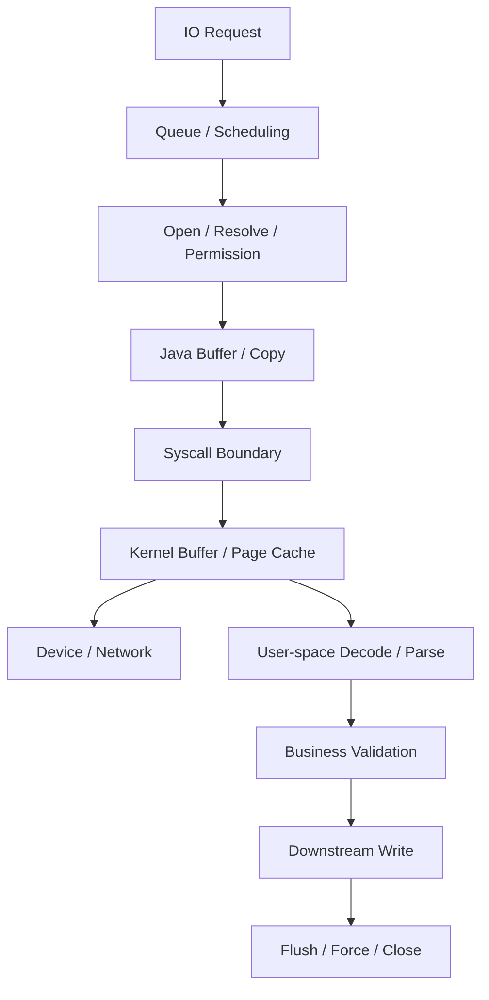
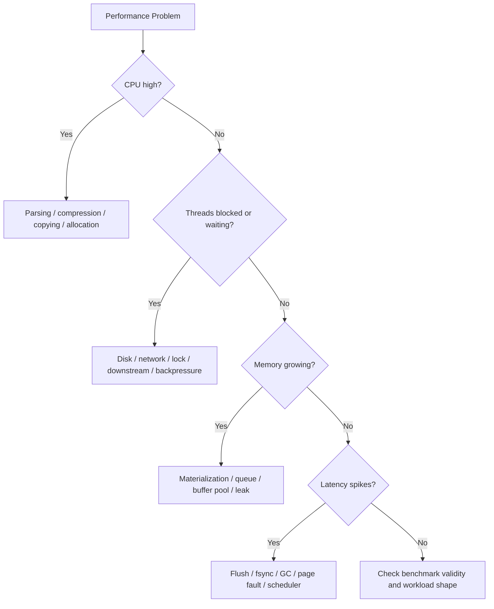
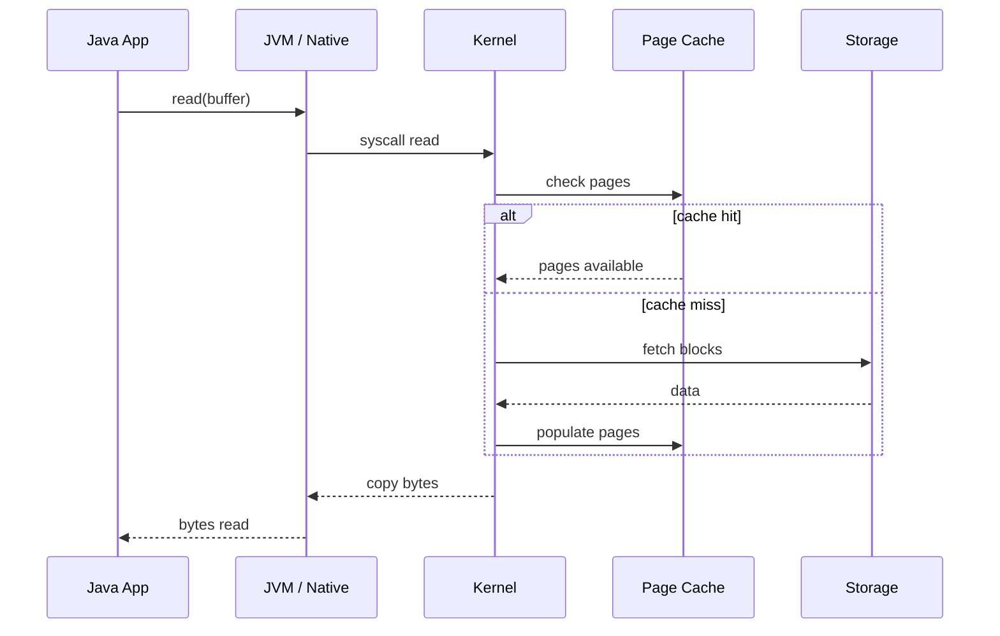
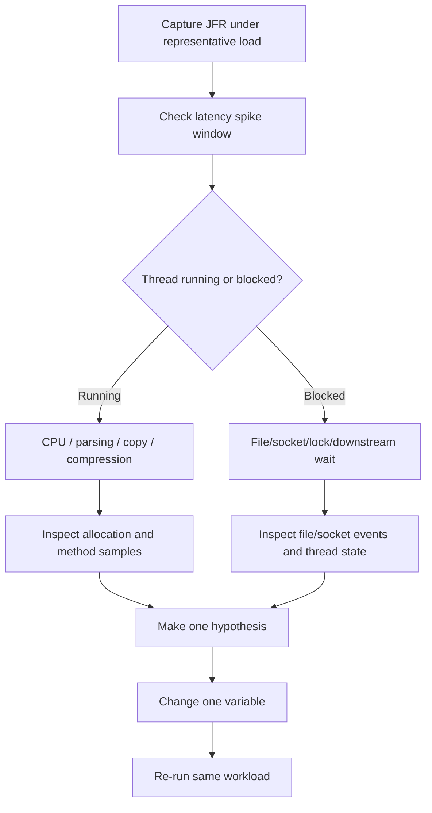
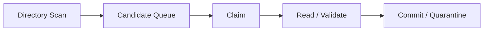

------
title: Learn Java IO, Modern IO, Streams, Buffers, Resources, Serialization & Data Boundaries - Part 031
description: IO performance diagnostics and tuning for production Java systems: latency, throughput, buffer sizing, page cache behavior, direct memory, profiling, JFR, JMH pitfalls, and review checklists.
series: learn-java-io-modern-io-resource-boundaries
seriesTitle: Learn Java IO, Modern IO, Streams, Buffers, Resources, Serialization & Data Boundaries
order: 31
partTitle: IO Performance Diagnostics and Tuning
tags:
  - java
  - io
  - nio
  - performance
  - diagnostics
  - jfr
  - buffers
  - filesystem
  - series
date: 2026-06-30
------

# Part 031 — IO Performance Diagnostics and Tuning

> Goal: mampu mendiagnosis dan men-tune performa IO Java dengan mental model yang benar: bukan menebak ukuran buffer, bukan mengganti semua hal menjadi NIO, dan bukan menganggap benchmark lokal sebagai kebenaran production.

Di level top engineer, pertanyaan IO performance bukan:

> “API mana yang paling cepat?”

Pertanyaan yang benar adalah:

> “Di boundary mana waktu, memory, syscall, contention, copy, page fault, flush, dan backpressure benar-benar terjadi?”

IO performance adalah gabungan dari beberapa sistem:

- Java API layer: `InputStream`, `OutputStream`, `Reader`, `Writer`, `ByteBuffer`, `Channel`, `Files`.
- JVM layer: heap, direct memory, GC, JIT, allocation, safepoint.
- OS layer: syscall, page cache, scheduler, socket buffer, file descriptor, permissions, disk cache.
- Storage/network layer: SSD/HDD/NFS/object storage/TLS/proxy/load balancer.
- Application layer: parsing, compression, validation, persistence, retry, queueing, cancellation.

Kalau satu layer lambat, layer lain sering terlihat bersalah.

Contoh klasik:

- “File read lambat” padahal bottleneck ada di parsing CSV.
- “Network lambat” padahal consumer downstream tidak menguras stream.
- “GC spike” padahal IO pipeline meng-materialize body besar ke `byte[]`.
- “`FileChannel.transferTo` tidak cepat” padahal target bukan socket/file yang bisa dioptimasi OS.
- “Direct buffer cepat” padahal allocation direct buffer dilakukan per request.
- “flush mempercepat output” padahal flush justru memecah batch dan memperbanyak syscall.

Part ini adalah diagnostic map untuk membedakan semua itu.

---

## 1. Kaufman Deconstruction: Sub-Skill Performance IO

Skill “IO performance” harus dipecah menjadi sub-skill berikut.

| Sub-skill | Pertanyaan yang dijawab | Failure mode jika tidak dikuasai |
|---|---|---|
| Workload characterization | Apa yang sebenarnya dibaca/ditulis? | Tuning berdasarkan benchmark palsu |
| Boundary localization | Waktu hilang di API, JVM, OS, disk, network, atau parser? | Optimasi di tempat yang salah |
| Copy accounting | Berapa kali data disalin? | Memory bandwidth dan GC membengkak |
| Buffer tuning | Buffer mana yang benar-benar mengurangi syscall? | Buffer terlalu kecil/besar/berlapis |
| Allocation control | Apakah IO membuat garbage per chunk/request? | GC latency dan memory pressure |
| Direct memory diagnosis | Apakah off-heap dipakai dan dibatasi? | Native OOM, slice retention, hidden memory |
| Page cache reasoning | Data dari disk atau dari cache? | Benchmark terlihat cepat tapi tidak realistis |
| Flush/durability reasoning | Apakah butuh visible, sent, atau durable? | Latency spike dan false durability |
| Backpressure diagnosis | Apakah producer lebih cepat dari consumer? | Queue growth, OOM, timeout cascade |
| Benchmark discipline | Apakah microbenchmark valid? | Kesimpulan performance yang salah |

Latihan 20 jam untuk bagian ini bukan “coba buffer 8 KB vs 64 KB”. Latihannya adalah membuat hipotesis, mengukur, memisahkan layer, lalu membuktikan bottleneck.

---

## 2. Mental Model: IO Performance Equation

Untuk banyak sistem IO, throughput kasar dapat dipahami sebagai:

```text
throughput = useful_bytes / total_elapsed_time
```

Tapi `total_elapsed_time` adalah gabungan:

```text
total_elapsed_time = queue_time
                   + open/setup_time
                   + syscall_time
                   + copy_time
                   + kernel_wait_time
                   + storage_or_network_time
                   + decode_parse_transform_time
                   + allocation_gc_time
                   + flush_sync_time
                   + downstream_wait_time
                   + cleanup_time
```

Kalau ingin tuning, jangan langsung mengganti API. Pecah dulu komponen waktunya.



Setiap panah bisa menjadi bottleneck.

---

## 3. Workload Characterization Sebelum Tuning

Sebelum menyentuh code, jawab ini.

### 3.1 Read atau write?

Read-heavy dan write-heavy punya bottleneck berbeda.

Read-heavy:

- cache hit ratio penting;
- random vs sequential access sangat menentukan;
- decoding/parsing sering lebih mahal daripada read;
- mmap bisa membantu random access tetapi memperumit lifecycle.

Write-heavy:

- flush/fsync policy dominan;
- batching menentukan throughput;
- append vs overwrite berbeda;
- atomic rename pattern menambah write amplification;
- durability requirement harus eksplisit.

### 3.2 Sequential atau random?

Sequential read/write cocok dengan:

- `BufferedInputStream`/`BufferedOutputStream`;
- `Files.copy`;
- `FileChannel.transferTo`/`transferFrom`;
- large chunk pipeline.

Random access cocok dengan:

- `FileChannel` positional read/write;
- `SeekableByteChannel`;
- mmap windowing;
- index + data file design.

Anti-pattern:

```java
// Looks innocent; terrible for many random reads from large file if each call opens a new stream.
byte[] readRange(Path file, long offset, int length) throws IOException {
    try (InputStream in = Files.newInputStream(file)) {
        in.skipNBytes(offset);
        return in.readNBytes(length);
    }
}
```

Lebih baik:

```java
byte[] readRange(Path file, long offset, int length) throws IOException {
    ByteBuffer buffer = ByteBuffer.allocate(length);

    try (FileChannel channel = FileChannel.open(file, StandardOpenOption.READ)) {
        while (buffer.hasRemaining()) {
            int n = channel.read(buffer, offset + buffer.position());
            if (n < 0) {
                break;
            }
        }
    }

    return buffer.array();
}
```

### 3.3 Small files atau large files?

Small files biasanya bottleneck di:

- open/close;
- metadata lookup;
- directory traversal;
- permission checks;
- object allocation;
- scheduling overhead.

Large files biasanya bottleneck di:

- transfer bandwidth;
- buffer copy;
- page cache;
- decompression;
- downstream write;
- disk/network throughput.

### 3.4 Local disk, network filesystem, atau object storage?

Java API bisa sama, tetapi semantics berbeda.

| Storage | Karakteristik | Risiko |
|---|---|---|
| Local SSD | low latency, high IOPS | benchmark terlalu optimis |
| HDD | sequential bagus, random buruk | random IO collapse |
| NFS/SMB | network latency + filesystem semantics | locking, atomicity, metadata cache ambiguity |
| Container volume | host dependent | fsync/rename semantics bisa berbeda |
| Object storage gateway | bukan filesystem sejati | rename/copy/list consistency trap |

Jangan menganggap `Files.move(..., ATOMIC_MOVE)` di semua provider punya perilaku yang sama. Jika atomic move tidak didukung, API dapat melempar `AtomicMoveNotSupportedException`.

---

## 4. Bottleneck Localization

Gunakan hirarki diagnosis berikut.



### 4.1 Gejala: CPU tinggi

Kemungkinan:

- decode text terlalu sering;
- regex parsing line-by-line mahal;
- checksum/compression/encryption mahal;
- banyak copy dari `byte[]` ke `byte[]`;
- allocation per chunk;
- logging verbose per record;
- charset decoder fallback/replacement berat.

Diagnosis:

- CPU profiler;
- allocation profiler;
- JFR method profiling;
- sample stack saat load;
- disable transform sementara untuk isolasi.

### 4.2 Gejala: CPU rendah, latency tinggi

Kemungkinan:

- thread blocked di read/write;
- downstream lambat;
- socket/file buffer penuh;
- fsync/force menunggu storage;
- open file descriptor starvation;
- lock contention;
- directory with too many entries;
- remote filesystem.

Diagnosis:

- thread dump;
- JFR file/socket events;
- OS metrics: iowait, disk util, read/write latency;
- request timeline;
- queue depth;
- timeout histogram.

### 4.3 Gejala: memory naik

Kemungkinan:

- `readAllBytes()` pada body besar;
- unbounded queue antara producer/consumer;
- direct buffer pool tidak dibatasi;
- `ByteBuffer.slice()` menahan parent besar;
- `Files.lines()` stream tidak ditutup;
- compression bomb;
- process output ditampung tanpa batas.

Diagnosis:

- heap dump;
- native memory tracking;
- `BufferPoolMXBean`;
- queue size metric;
- per-request memory budget;
- direct memory max.

---

## 5. Copy Accounting

Optimasi IO sering gagal karena engineer tidak menghitung copy.

Contoh upload pipeline buruk:

```text
socket -> byte[] all body -> String -> JSON object -> byte[] -> temp file -> byte[] -> downstream
```

Pipeline lebih baik:

```text
socket -> bounded chunks -> temp file + checksum -> metadata validation -> committed file -> downstream stream
```

### 5.1 Copy map

Buat tabel untuk setiap pipeline.

| Step | From | To | Copy? | Allocation? | Can stream? |
|---|---|---|---|---|---|
| receive | socket buffer | heap chunk | yes | reusable? | yes |
| validate size | chunk | counter | no | no | yes |
| checksum | chunk | digest state | no | no | yes |
| persist | chunk | file/page cache | yes | no if reused | yes |
| parse | file | domain object | depends | yes | maybe |

Tujuan bukan menghapus semua copy. Tujuan adalah menghapus copy yang tidak memberi boundary value.

Boundary value yang sah:

- validate sebelum commit;
- checksum/integrity;
- charset decoding;
- decompression;
- encryption/decryption;
- durable staging;
- protocol framing;
- ownership isolation.

Copy yang biasanya boros:

- `InputStream -> byte[] -> ByteArrayInputStream` hanya agar API cocok;
- `byte[] -> String -> byte[]` untuk binary data;
- `ByteBuffer -> byte[]` setiap loop;
- `Files.readAllBytes` lalu `Files.write` untuk copy file besar;
- `StringBuilder` untuk seluruh file log besar.

---

## 6. Buffer Tuning

Buffer bukan magic. Buffer mengubah frekuensi boundary crossing.

### 6.1 Buffer mengurangi syscall

Tanpa buffer:

```text
read 1 byte -> syscall
read 1 byte -> syscall
read 1 byte -> syscall
```

Dengan buffer:

```text
read 8192 bytes -> syscall
serve many small reads from memory
```

### 6.2 Buffer terlalu kecil

Gejala:

- syscall count tinggi;
- CPU kernel mode naik;
- throughput rendah;
- banyak context switch;
- file/socket read kecil-kecil.

### 6.3 Buffer terlalu besar

Gejala:

- memory per request tinggi;
- cache locality buruk;
- latency naik karena batch terlalu besar;
- direct memory pressure;
- GC/native memory spike;
- throughput tidak naik setelah titik tertentu.

### 6.4 Rule of thumb yang lebih aman

Mulai dari:

- 8 KB untuk classic buffered stream default mental model;
- 16–64 KB untuk general file copy pipeline;
- 64–256 KB untuk high-throughput sequential transfer, jika measured membantu;
- lebih besar hanya jika workload dan memory budget membuktikan benefit.

Jangan treat angka ini sebagai dogma. Ukur.

### 6.5 Buffer budget formula

```text
total_buffer_memory = concurrent_operations
                    * buffers_per_operation
                    * buffer_size
```

Contoh:

```text
2,000 concurrent uploads
* 3 buffers per upload
* 256 KB
= 1.5 GB buffer memory
```

Itu belum termasuk parser object, queue, direct buffer, TLS, dan application state.

### 6.6 Avoid double buffering blindly

Ini sering redundant:

```java
try (InputStream in = new BufferedInputStream(
        Files.newInputStream(path));
     BufferedReader reader = new BufferedReader(
        new InputStreamReader(in, StandardCharsets.UTF_8))) {
    // ...
}
```

`BufferedReader` sudah buffering character reads. `BufferedInputStream` tambahan bisa berguna pada kasus tertentu, tetapi jangan otomatis menumpuk buffer tanpa alasan.

Lebih jelas:

```java
try (BufferedReader reader = Files.newBufferedReader(path, StandardCharsets.UTF_8)) {
    String line;
    while ((line = reader.readLine()) != null) {
        consume(line);
    }
}
```

---

## 7. Page Cache Reasoning

File IO di OS modern sering tidak langsung ke disk. Banyak read/write melewati page cache.

### 7.1 Read path simplified



### 7.2 Benchmark trap: hot cache

Local benchmark sering membaca file yang sudah ada di page cache. Hasilnya mengukur memory copy, bukan disk.

Gejala:

- read throughput lebih tinggi dari kemampuan disk;
- run kedua jauh lebih cepat;
- CPU copy dominan;
- disk utilization rendah.

Untuk diagnosis production, catat:

- cold read vs hot read;
- repeated access pattern;
- file working set size;
- memory size vs dataset size;
- page cache eviction;
- container memory limit.

### 7.3 Write path simplified

`write()` sering hanya menyalin data ke kernel/page cache. Itu belum berarti data durable di storage.

```text
Application write success != durable on disk
close success != necessarily application-level crash-safe protocol
atomic rename != necessarily fsynced directory entry
```

Part 012 sudah membahas crash consistency. Di sini poin performance-nya: durability itu mahal dan harus dibatch dengan sadar.

---

## 8. Flush, Force, Sync: Performance Consequences

### 8.1 `flush()`

`flush()` mendorong buffered data ke sink di layer berikutnya. Pada `BufferedOutputStream`, flush berarti menulis buffer ke underlying stream. Pada writer, flush mengalirkan encoded character output ke bawah.

`flush()` bukan jaminan durable disk.

### 8.2 `FileChannel.force(boolean)`

`force` meminta update channel file dipaksa ke storage device. Ini primitive mahal. Jangan panggil per record kecuali requirement durability memang mengharuskan.

Bad:

```java
for (Record record : records) {
    writeRecord(channel, record);
    channel.force(true); // extremely expensive under load
}
```

Better jika business mengizinkan group commit:

```java
int sinceLastForce = 0;

for (Record record : records) {
    writeRecord(channel, record);
    sinceLastForce++;

    if (sinceLastForce >= 1_000) {
        channel.force(false);
        sinceLastForce = 0;
    }
}

channel.force(false);
```

Trade-off:

- throughput naik;
- risiko kehilangan batch terakhir jika crash;
- recovery protocol wajib jelas.

### 8.3 `SYNC` dan `DSYNC`

`StandardOpenOption.SYNC` dan `DSYNC` dapat membuat setiap update lebih sinkron ke storage. Ini bukan default yang boleh dipakai tanpa benchmark dan requirement.

Gunakan hanya jika:

- data loss window harus sangat kecil;
- throughput requirement realistis;
- hardware/storage latency diketahui;
- recovery design mengandalkan durable-per-write semantics.

---

## 9. Direct Buffer Diagnostics

Direct buffer membantu beberapa native IO path karena buffer berada di luar Java heap dan bisa mengurangi copy tertentu. Tapi direct buffer bukan gratis.

### 9.1 Failure modes

- allocate direct buffer per request;
- direct memory tidak dibatasi eksplisit;
- slice kecil menahan direct buffer besar;
- pool tidak punya max size;
- cleaner delay menyebabkan native memory naik;
- heap tampak aman tetapi process RSS besar;
- container killed karena native memory, bukan Java heap OOM.

### 9.2 Instrumentasi direct memory

Gunakan `BufferPoolMXBean` untuk melihat pool seperti `direct` dan `mapped`.

```java
import java.lang.management.BufferPoolMXBean;
import java.lang.management.ManagementFactory;

public final class BufferPoolSnapshot {
    public static void printBufferPools() {
        for (BufferPoolMXBean bean : ManagementFactory.getPlatformMXBeans(BufferPoolMXBean.class)) {
            System.out.printf(
                "%s: count=%d, used=%d, capacity=%d%n",
                bean.getName(),
                bean.getCount(),
                bean.getMemoryUsed(),
                bean.getTotalCapacity()
            );
        }
    }
}
```

Metrics yang berguna:

- direct buffer count;
- direct memory used;
- mapped memory used;
- allocation rate;
- pool borrow latency;
- pool exhaustion count;
- request count using direct buffer;
- largest retained buffer.

### 9.3 Pooling direct buffer

Pooling berguna jika:

- buffer besar;
- allocation sering;
- lifecycle jelas;
- concurrency bounded;
- pool punya cap;
- borrower wajib return.

Simple bounded pool:

```java
import java.nio.ByteBuffer;
import java.util.ArrayDeque;
import java.util.Optional;

public final class BoundedByteBufferPool {
    private final int bufferSize;
    private final int maxIdle;
    private final ArrayDeque<ByteBuffer> idle = new ArrayDeque<>();
    private int allocated;

    public BoundedByteBufferPool(int bufferSize, int maxIdle) {
        if (bufferSize <= 0 || maxIdle <= 0) {
            throw new IllegalArgumentException("bufferSize and maxIdle must be positive");
        }
        this.bufferSize = bufferSize;
        this.maxIdle = maxIdle;
    }

    public synchronized ByteBuffer borrow() {
        ByteBuffer buffer = idle.pollFirst();
        if (buffer != null) {
            buffer.clear();
            return buffer;
        }
        allocated++;
        return ByteBuffer.allocateDirect(bufferSize);
    }

    public synchronized void release(ByteBuffer buffer) {
        if (buffer == null) {
            return;
        }
        buffer.clear();
        if (idle.size() < maxIdle && buffer.capacity() == bufferSize) {
            idle.addFirst(buffer);
        }
        // Else let it be reclaimed eventually.
    }

    public synchronized int idleCount() {
        return idle.size();
    }

    public synchronized int allocatedCount() {
        return allocated;
    }
}
```

Production pool harus lebih kuat:

- close/shutdown behavior;
- leak detection;
- max allocated, bukan hanya max idle;
- metrics;
- timeout borrow;
- owner token;
- no double release;
- no release after close.

---

## 10. Allocation Control in IO Loops

Bad:

```java
try (InputStream in = Files.newInputStream(source);
     OutputStream out = Files.newOutputStream(target)) {

    while (true) {
        byte[] buffer = new byte[8192]; // allocates every loop
        int n = in.read(buffer);
        if (n < 0) {
            break;
        }
        out.write(buffer, 0, n);
    }
}
```

Good:

```java
try (InputStream in = Files.newInputStream(source);
     OutputStream out = Files.newOutputStream(target)) {

    byte[] buffer = new byte[64 * 1024];
    int n;
    while ((n = in.read(buffer)) >= 0) {
        out.write(buffer, 0, n);
    }
}
```

Bad with ByteBuffer:

```java
while (channel.read(ByteBuffer.allocateDirect(64 * 1024)) >= 0) {
    // lost data and allocates direct buffer repeatedly
}
```

Good:

```java
ByteBuffer buffer = ByteBuffer.allocateDirect(64 * 1024);
while (channel.read(buffer) >= 0) {
    buffer.flip();
    consume(buffer);
    buffer.clear();
}
```

Allocation checklist:

- Is buffer allocated outside loop?
- Is `String` created per byte/chunk unnecessarily?
- Is `byte[]` materialized for reusable stream?
- Is line parsing creating many intermediate arrays?
- Are direct buffers allocated per request?
- Are slices retaining large parent buffers?

---

## 11. JMH Pitfalls for IO Benchmarking

JMH is useful, but IO microbenchmarking is dangerous.

### 11.1 What JMH can measure well

- parser function over in-memory buffer;
- charset decoder performance on fixed input;
- checksum/compression CPU cost;
- buffer manipulation overhead;
- allocation rate of API variants;
- ByteBuffer state machine overhead.

### 11.2 What JMH often measures badly

- real disk latency;
- page cache behavior;
- network jitter;
- fsync latency;
- object storage semantics;
- filesystem metadata contention;
- production concurrency;
- cold start file open cost.

### 11.3 Benchmark traps

| Trap | Why wrong | Better approach |
|---|---|---|
| Reading same file repeatedly | page cache dominates | separate hot/cold tests |
| Tiny file benchmark | metadata/open cost dominates | benchmark representative file sizes |
| No checksum of result | dead-code elimination or incomplete work | consume result with blackhole/checksum |
| Benchmark on laptop | storage and CPU differ | run on production-like host |
| Single thread only | misses queue/backpressure | run concurrency tests |
| Measuring whole pipeline only | no localization | stage-level timing |
| Using tempfs accidentally | not disk | verify mount/storage |

### 11.4 Structure of useful benchmark suite

```text
benchmarks/
  parser/
    CsvRecordParserBenchmark.java
    BinaryFrameParserBenchmark.java
  buffer/
    ByteBufferFlipCompactBenchmark.java
    HeapVsDirectCopyBenchmark.java
  transfer/
    FileCopyHotCacheBenchmark.java
    FileCopyColdCacheHarness.md
  integration/
    UploadPipelineLoadTest.md
    ArchiveExtractionStressTest.md
```

Keep microbenchmark and load test separate. They answer different questions.

---

## 12. JFR-Based IO Diagnostics

Java Flight Recorder is often the most practical first tool because it correlates JVM events, threads, allocation, file IO, socket IO, and method samples.

Useful investigation questions:

- Which files are read/written most?
- Which thread blocks on IO?
- Is latency dominated by file read, socket read, write, allocation, or locks?
- Are there allocation spikes during transfer?
- Are there long pauses near direct/mapped buffer usage?
- Are requests timing out while IO thread is blocked?

### 12.1 What to capture

At minimum:

- CPU samples;
- allocation samples;
- file read/write events;
- socket read/write events;
- thread park/block events;
- GC events;
- exception events if relevant;
- object allocation outside TLAB if memory pressure exists.

### 12.2 How to read result

Avoid staring at averages first. Look at:

- p95/p99 duration of file/socket events;
- top paths/sockets by bytes;
- longest blocked threads;
- allocation hot methods;
- correlation between GC and IO latency;
- event timeline around spikes.

### 12.3 Diagnostic flow with JFR



---

## 13. OS-Level Metrics to Correlate

Java metrics alone are insufficient.

Correlate with:

- disk read/write throughput;
- disk latency;
- disk queue depth;
- iowait;
- filesystem mount options;
- network throughput;
- retransmits/errors;
- open file descriptor count;
- process RSS;
- page faults;
- container memory limit;
- cgroup throttling;
- CPU steal time in virtualized environments.

If Java says “write took 2 seconds”, OS metrics help answer whether it was:

- storage saturated;
- network filesystem slow;
- process throttled;
- GC paused;
- downstream not reading;
- lock contention;
- flush/force latency.

---

## 14. Metrics for Production IO Components

Every serious IO component should expose metrics at the boundary.

### 14.1 File ingestion metrics

- files discovered;
- files claimed;
- files skipped;
- bytes read;
- read duration;
- parse duration;
- validation failure count;
- quarantine count;
- commit duration;
- temp file cleanup count;
- retry count;
- oldest unprocessed file age;
- active workers;
- queue depth;
- in-flight bytes.

### 14.2 Transfer metrics

- bytes transferred;
- transfer duration;
- throughput histogram;
- partial transfer count;
- resume count;
- checksum mismatch count;
- cancellation count;
- timeout count;
- downstream write latency;
- buffer pool borrow time;
- buffer pool exhaustion.

### 14.3 Direct memory metrics

- direct buffer count;
- direct memory used;
- mapped memory used;
- allocation count;
- pool idle count;
- pool active count;
- borrow timeout;
- leak suspicion count.

### 14.4 Process IO metrics

- process start latency;
- stdout bytes;
- stderr bytes;
- drain duration;
- exit code distribution;
- timeout kill count;
- output truncation count;
- process tree kill failures.

---

## 15. Tuning Patterns

### 15.1 Replace materialization with streaming

Bad:

```java
byte[] body = input.readAllBytes();
validate(body);
Files.write(target, body);
```

Better:

```java
MessageDigest digest = MessageDigest.getInstance("SHA-256");
long bytes = 0;

try (InputStream in = source.openStream();
     OutputStream out = Files.newOutputStream(temp, StandardOpenOption.CREATE_NEW)) {

    byte[] buffer = new byte[64 * 1024];
    int n;
    while ((n = in.read(buffer)) >= 0) {
        bytes += n;
        if (bytes > maxBytes) {
            throw new IOException("payload too large");
        }
        digest.update(buffer, 0, n);
        out.write(buffer, 0, n);
    }
}
```

### 15.2 Batch small writes

Bad:

```java
for (String line : lines) {
    writer.write(line);
    writer.write('\n');
    writer.flush();
}
```

Better:

```java
for (String line : lines) {
    writer.write(line);
    writer.write('\n');
}
writer.flush();
```

For stronger control, batch records into chunks.

### 15.3 Avoid per-record open/close

Bad:

```java
for (Record record : records) {
    Files.writeString(logFile, record.toLine(), StandardOpenOption.APPEND);
}
```

Better:

```java
try (BufferedWriter writer = Files.newBufferedWriter(
        logFile,
        StandardCharsets.UTF_8,
        StandardOpenOption.CREATE,
        StandardOpenOption.APPEND)) {

    for (Record record : records) {
        writer.write(record.toLine());
        writer.newLine();
    }
}
```

### 15.4 Use transfer APIs when moving bytes unchanged

If you are only copying bytes, don't parse them.

```java
try (FileChannel in = FileChannel.open(source, StandardOpenOption.READ);
     FileChannel out = FileChannel.open(target,
         StandardOpenOption.CREATE_NEW,
         StandardOpenOption.WRITE)) {

    long position = 0;
    long size = in.size();

    while (position < size) {
        long transferred = in.transferTo(position, size - position, out);
        if (transferred <= 0) {
            break;
        }
        position += transferred;
    }
}
```

Always loop. Transfer methods may transfer fewer bytes than requested.

### 15.5 Limit concurrency by bytes, not only tasks

Bad:

```text
maxWorkers = 200
```

Better:

```text
maxWorkers = 32
maxInFlightBytes = 512 MB
maxBufferMemory = 128 MB
maxOpenFiles = 256
```

A thousand small files and a thousand 2 GB files are not equivalent.

### 15.6 Separate metadata scan from content processing

Directory scan can be cheap or expensive depending on filesystem. Do not mix scan latency with processing latency without measuring separately.



Expose separate metrics for each stage.

---

## 16. Performance Anti-Patterns

### 16.1 `available()` as size estimate

Bad:

```java
byte[] buffer = new byte[in.available()];
in.read(buffer);
```

`available()` is not total stream size. It is at most a non-blocking availability hint.

### 16.2 Assuming `read(byte[])` fills the array

Bad:

```java
byte[] header = new byte[16];
in.read(header); // may read fewer than 16 bytes
```

Good:

```java
byte[] header = in.readNBytes(16);
if (header.length != 16) {
    throw new EOFException("truncated header");
}
```

### 16.3 Logging per chunk at info level

Bad:

```java
log.info("copied {} bytes", n);
```

inside every loop.

Better:

- aggregate metrics;
- debug-level sample logs;
- final transfer summary;
- structured metrics.

### 16.4 Creating strings for binary payload

Bad:

```java
String body = new String(bytes, StandardCharsets.UTF_8);
byte[] again = body.getBytes(StandardCharsets.UTF_8);
```

If payload is binary, keep it binary.

### 16.5 Using mmap for everything

mmap can improve some random access/read-heavy workloads, but it introduces page fault behavior, lifecycle complexity, mapping window design, and unmapping concerns.

### 16.6 Using async for slow CPU work

`AsynchronousFileChannel` does not make parsing faster. If bottleneck is CPU parser/compression, async IO only complicates code.

---

## 17. Review Checklist for IO Performance

Use this during design review.

### Workload

- [ ] Is workload read/write/mixed?
- [ ] Is access sequential/random?
- [ ] Are file sizes and concurrency known?
- [ ] Is storage local, networked, containerized, or object-backed?
- [ ] Is performance target latency, throughput, or durability?

### Memory

- [ ] Is there a per-request memory budget?
- [ ] Are buffers allocated outside loops?
- [ ] Are queues bounded?
- [ ] Is direct memory measured?
- [ ] Are large payloads streamed rather than materialized?

### IO API

- [ ] Is chosen API aligned with boundary contract?
- [ ] Are partial reads/writes handled?
- [ ] Are transfer APIs looped?
- [ ] Is flush/force policy explicit?
- [ ] Are resources closed deterministically?

### Diagnostics

- [ ] Are bytes, duration, queue depth, and failures measured?
- [ ] Are JFR/OS metrics available?
- [ ] Can performance be broken down by stage?
- [ ] Are p95/p99 measured, not only average?
- [ ] Are test workloads representative?

### Tuning discipline

- [ ] Is there a hypothesis?
- [ ] Is only one variable changed at a time?
- [ ] Is benchmark hot/cold cache aware?
- [ ] Is production-like concurrency used?
- [ ] Is correctness preserved after tuning?

---

## 18. Deliberate Practice

### Exercise 1 — Copy accounting

Take one existing file upload/download path in your project. Draw copy map:

```text
source -> buffer -> parser -> temp -> committed -> downstream
```

For each step, mark:

- copy yes/no;
- allocation yes/no;
- blocking yes/no;
- replayable yes/no;
- bounded yes/no.

Then remove one unnecessary materialization.

### Exercise 2 — Buffer experiment

Implement file copy using:

- `InputStream` with 8 KB buffer;
- `InputStream` with 64 KB buffer;
- `FileChannel.transferTo`;
- `Files.copy`.

Measure:

- elapsed time;
- bytes/s;
- allocation;
- CPU;
- hot cache vs cold-ish cache behavior;
- correctness via checksum.

Do not conclude “winner” universally. Conclude for this workload.

### Exercise 3 — JFR diagnosis

Run a load test for an IO-heavy endpoint. Capture JFR. Identify:

- top file/socket events;
- allocation hotspots;
- blocked threads;
- p99 event duration;
- correlation with GC.

Write one hypothesis and test it.

### Exercise 4 — Direct memory audit

Add `BufferPoolMXBean` metrics to a service that uses direct/mapped buffers. Stress it. Verify:

- direct count stabilizes;
- memory used stabilizes;
- no per-request unbounded growth;
- container RSS matches expectation.

---

## 19. Summary

IO performance engineering is not API superstition. It is boundary accounting.

A top engineer should be able to say:

- where time is spent;
- where bytes are copied;
- where memory is allocated;
- where backpressure is applied;
- where data becomes durable;
- where partial failure is handled;
- what benchmark actually measured;
- what production metrics prove.

The strongest default is:

```text
stream large data, bound memory, batch writes, measure stages, avoid hidden materialization, and tune only after locating the bottleneck.
```

Part 032 closes the series with a capstone: a production-grade IO design combining safe ingestion, staging, validation, idempotency, durability, retry, and resumable transfer.
