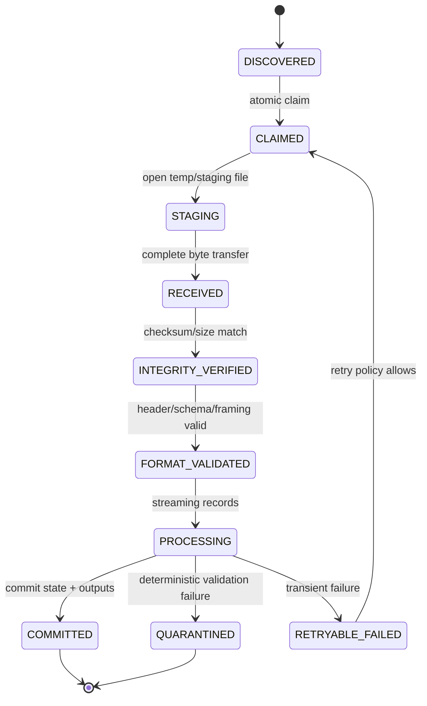
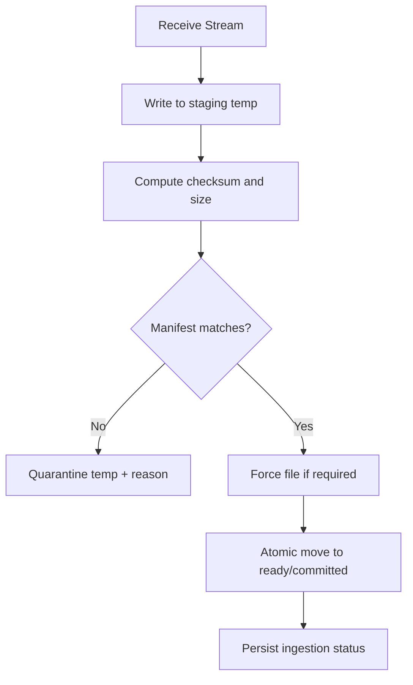
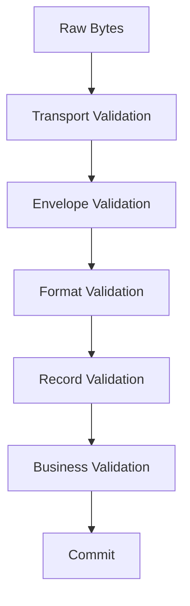
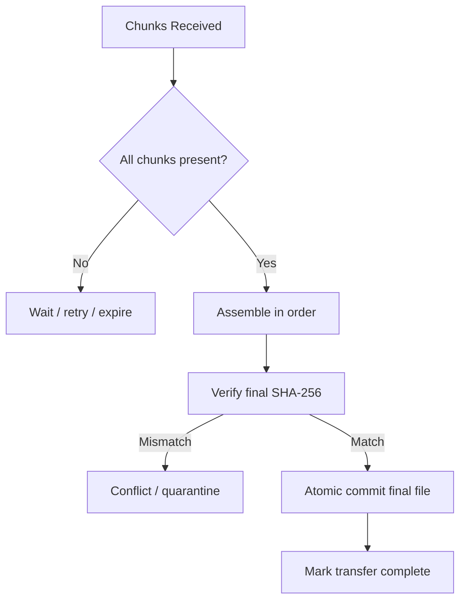
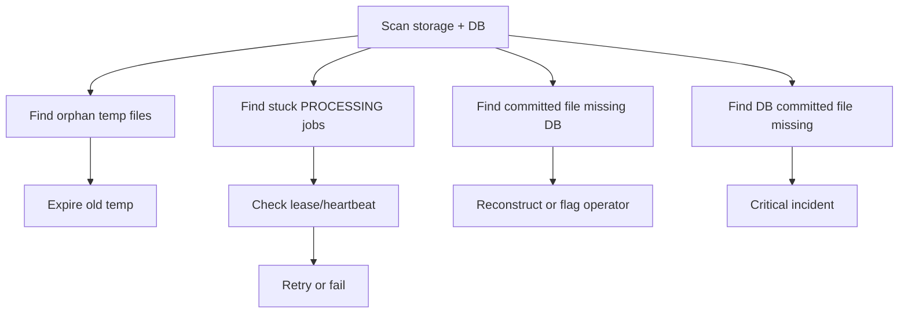
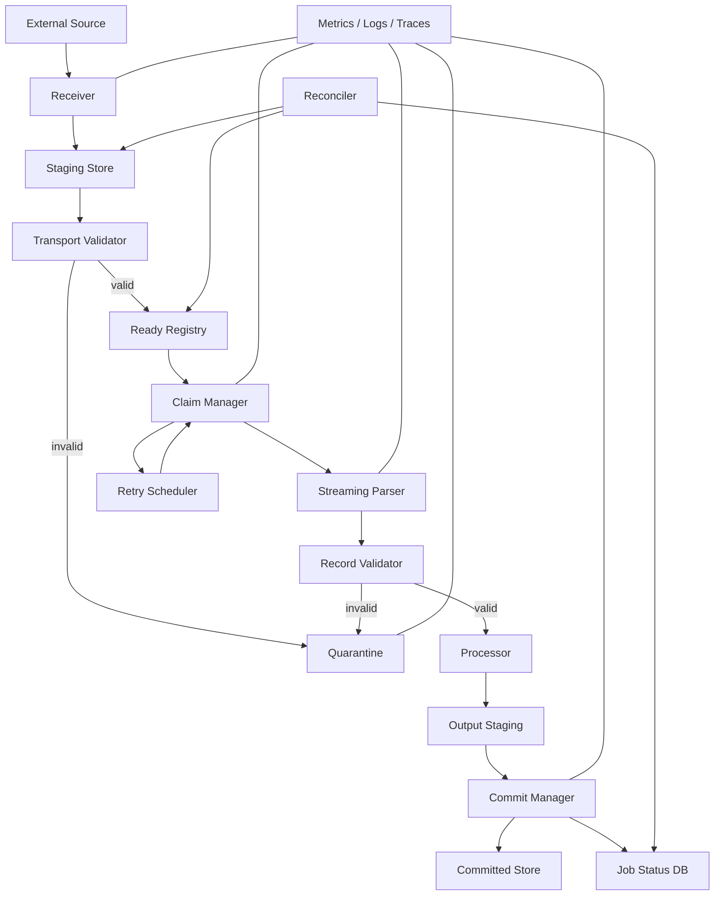

------
title: Learn Java IO, Modern IO, Streams, Buffers, Resources, Serialization & Data Boundaries - Part 032
description: Production IO patterns and capstone architecture for safe file ingestion, resumable transfer, staging, validation, commit, quarantine, retry, and operational review.
series: learn-java-io-modern-io-resource-boundaries
seriesTitle: Learn Java IO, Modern IO, Streams, Buffers, Resources, Serialization & Data Boundaries
order: 32
partTitle: Production IO Patterns & Capstone
tags:
  - java
  - io
  - nio
  - production-patterns
  - file-ingestion
  - resumable-transfer
  - capstone
  - series
date: 2026-06-30
------

# Part 032 — Production IO Patterns & Capstone

> Goal: menyatukan seluruh seri menjadi satu desain production-grade: safe file ingestion dan resumable transfer yang bounded, observable, crash-aware, idempotent, dan defensible.

Part terakhir ini bukan katalog API. Ini adalah latihan arsitektur.

Kita akan membangun mental model untuk sistem IO yang menerima file/payload dari boundary eksternal, menyimpannya dengan aman, memvalidasi, memproses, meng-commit, mengkarantina jika gagal, dan bisa recovery setelah crash.

Capstone problem:

> Bangun Java file ingestion engine untuk sistem enterprise/regulatory yang menerima file besar dari partner, memvalidasi format dan integrity, memproses record secara streaming, memastikan idempotency, mendukung retry/resume, dan tidak kehilangan data atau membuat status ambigu saat crash.

Ini relevan untuk:

- regulatory submission ingestion;
- bank reconciliation file;
- telecom mediation file;
- billing batch file;
- evidence document transfer;
- audit archive import;
- report generation pipeline;
- secure document handoff;
- large export/import jobs.

---

## 1. Final Mental Model

Production IO bukan “read file then process”. Production IO adalah state machine.



Setiap transition harus punya:

- precondition;
- operation;
- durability boundary;
- failure behavior;
- recovery behavior;
- idempotency key;
- observable event.

Kalau salah satu tidak jelas, production incident tinggal menunggu waktu.

---

## 2. Capstone Requirements

### 2.1 Functional requirements

Sistem harus bisa:

- menerima file dari directory drop, HTTP upload, SFTP mirror, atau message-triggered path;
- membaca file besar tanpa materialisasi penuh;
- memvalidasi size, checksum, magic/header, charset/binary framing;
- memproses record secara streaming;
- menyimpan status ingestion;
- quarantine file invalid;
- retry transient failure;
- resume transfer jika memungkinkan;
- mencegah duplicate processing;
- cleanup temporary resources;
- expose audit trail.

### 2.2 Non-functional requirements

Sistem harus:

- bounded memory;
- bounded concurrency;
- deterministic cleanup;
- crash-recoverable;
- observable;
- secure enough at boundary;
- testable with fault injection;
- compatible with filesystem semantics target;
- defensible for audit/regulatory review.

### 2.3 Explicit non-goals

Agar tidak over-engineer:

- tidak semua transfer harus resumable;
- tidak semua file harus durable per record;
- tidak semua parsing harus parallel;
- tidak semua IO harus async;
- tidak semua storage mendukung atomic rename;
- tidak semua failure boleh retry.

Top engineer bukan yang menambahkan semua fitur. Top engineer membuat trade-off eksplisit.

---

## 3. Directory Layout Pattern

Gunakan directory sebagai state machine yang mudah diinspeksi.

```text
/ingestion-root
  /incoming        # partner/system writes new files here
  /claiming        # short-lived claim markers or renamed files
  /staging         # temp transfer/materialization area
  /ready           # received + integrity verified
  /processing      # claimed by processor
  /committed       # processed successfully, retained or archived
  /quarantine      # deterministic invalid input
  /failed          # exhausted retry / operator action needed
  /archive         # long-term retention if required
```

Alternative: state disimpan di database, file di object store/filesystem. Tapi directory-state tetap useful untuk simple/batch systems.

### 3.1 Naming convention

Nama file harus cukup untuk identity, tapi jangan overload.

```text
<source-system>_<business-date>_<sequence>_<content-hash-prefix>.dat
```

Contoh:

```text
partnerA_20260630_000042_9f2c7a11.dat
```

Metadata yang lebih kaya simpan di manifest.

---

## 4. Manifest Pattern

Jangan bergantung hanya pada filename.

Manifest memberi transfer contract.

```json
{
  "sourceSystem": "partnerA",
  "businessDate": "2026-06-30",
  "sequence": 42,
  "fileName": "partnerA_20260630_000042.dat",
  "contentType": "application/x-fixed-width-records",
  "encoding": "UTF-8",
  "sizeBytes": 18392017,
  "sha256": "...",
  "recordCount": 120000,
  "schemaVersion": "2026-01",
  "createdAt": "2026-06-30T10:15:00Z"
}
```

Manifest benefits:

- integrity check;
- idempotency key;
- replayability;
- audit trail;
- compatibility validation;
- decoupling naming from metadata.

Manifest risks:

- manifest and payload can diverge;
- manifest can be spoofed;
- manifest may arrive before payload complete;
- manifest update can be non-atomic.

Therefore, validate manifest against actual file facts.

---

## 5. Claim Pattern

Multiple workers must not process same file.

### 5.1 Atomic rename claim

Common local filesystem pattern:

```java
Path claimed = processingDir.resolve(input.getFileName().toString() + ".processing");
try {
    Files.move(input, claimed, StandardCopyOption.ATOMIC_MOVE);
    return Optional.of(claimed);
} catch (AtomicMoveNotSupportedException e) {
    // Provider does not support atomic move. Use another claim strategy.
    throw e;
} catch (FileAlreadyExistsException e) {
    return Optional.empty();
} catch (NoSuchFileException e) {
    return Optional.empty();
}
```

This works only when:

- source and target are same filesystem/provider;
- atomic move is supported;
- all workers follow same protocol;
- writer does not keep writing after move in a way that violates contract.

### 5.2 Create marker claim

Alternative:

```java
Path marker = claimDir.resolve(input.getFileName().toString() + ".lock");
try {
    Files.createFile(marker);
    return Optional.of(marker);
} catch (FileAlreadyExistsException e) {
    return Optional.empty();
}
```

Marker must include:

- owner id;
- timestamp;
- heartbeat or lease;
- original file path;
- recovery policy.

### 5.3 Database claim

For distributed systems, database claim is often clearer:

```sql
UPDATE ingestion_job
SET status = 'PROCESSING', owner = ?, claimed_at = ?
WHERE idempotency_key = ?
  AND status IN ('READY', 'RETRYABLE_FAILED')
```

Then check affected row count.

Use DB state if you need:

- multi-host coordination;
- audit trail;
- retry scheduling;
- operator UI;
- business status;
- idempotency across storage.

---

## 6. Staging and Commit Pattern

Never write directly to final path if partial file can be observed.



### 6.1 Safe receive skeleton

```java
import java.io.IOException;
import java.io.InputStream;
import java.io.OutputStream;
import java.nio.file.*;
import java.security.DigestInputStream;
import java.security.MessageDigest;
import java.security.NoSuchAlgorithmException;
import java.util.HexFormat;

public final class StagedReceiver {
    private final Path stagingDir;
    private final Path readyDir;
    private final long maxBytes;

    public StagedReceiver(Path stagingDir, Path readyDir, long maxBytes) {
        this.stagingDir = stagingDir;
        this.readyDir = readyDir;
        this.maxBytes = maxBytes;
    }

    public ReceivedFile receive(String logicalName, InputStream source) throws IOException {
        Files.createDirectories(stagingDir);
        Files.createDirectories(readyDir);

        Path temp = Files.createTempFile(stagingDir, logicalName + "-", ".part");
        MessageDigest digest = sha256();
        long bytes = 0;

        try (DigestInputStream in = new DigestInputStream(source, digest);
             OutputStream out = Files.newOutputStream(temp, StandardOpenOption.WRITE)) {

            byte[] buffer = new byte[64 * 1024];
            int n;
            while ((n = in.read(buffer)) >= 0) {
                bytes += n;
                if (bytes > maxBytes) {
                    throw new IOException("payload exceeds maxBytes: " + maxBytes);
                }
                out.write(buffer, 0, n);
            }
        } catch (IOException | RuntimeException e) {
            safeDelete(temp);
            throw e;
        }

        String sha256Hex = HexFormat.of().formatHex(digest.digest());
        Path ready = readyDir.resolve(logicalName);

        try {
            Files.move(temp, ready, StandardCopyOption.ATOMIC_MOVE);
        } catch (AtomicMoveNotSupportedException e) {
            Files.move(temp, ready, StandardCopyOption.REPLACE_EXISTING);
            // Only acceptable if requirement permits non-atomic fallback.
        } catch (IOException | RuntimeException e) {
            safeDelete(temp);
            throw e;
        }

        return new ReceivedFile(ready, bytes, sha256Hex);
    }

    private static MessageDigest sha256() {
        try {
            return MessageDigest.getInstance("SHA-256");
        } catch (NoSuchAlgorithmException e) {
            throw new IllegalStateException(e);
        }
    }

    private static void safeDelete(Path path) {
        try {
            Files.deleteIfExists(path);
        } catch (IOException ignored) {
            // log in production
        }
    }

    public record ReceivedFile(Path path, long sizeBytes, String sha256) {}
}
```

This skeleton is not final production code. It demonstrates the transition discipline.

Missing production pieces:

- manifest validation;
- final path collision policy;
- durable force policy;
- audit event;
- metrics;
- timeout/cancellation;
- content-type validation;
- quarantine with reason;
- retry classification;
- directory fsync if required and feasible;
- storage/provider-specific semantics.

---

## 7. Idempotency Pattern

Idempotency answers:

> If the same file/payload/job arrives twice, do we process it once or twice?

Possible idempotency keys:

| Key | Pros | Cons |
|---|---|---|
| filename | simple | weak, rename changes identity |
| manifest business key | business meaningful | partner may send duplicate with correction |
| content hash | strong for exact content | expensive for huge file but usually already computed |
| source + business date + sequence | common batch identity | sequence errors possible |
| database assigned id | controlled internally | must map external duplicates |

A strong ingestion key often combines:

```text
sourceSystem + businessDate + sequence + contentHash
```

### 7.1 Idempotency state table

```sql
CREATE TABLE ingestion_job (
    id BIGINT GENERATED ALWAYS AS IDENTITY PRIMARY KEY,
    idempotency_key VARCHAR(256) NOT NULL UNIQUE,
    source_system VARCHAR(100) NOT NULL,
    business_date DATE NOT NULL,
    sequence_no BIGINT NOT NULL,
    content_hash VARCHAR(128) NOT NULL,
    size_bytes BIGINT NOT NULL,
    status VARCHAR(40) NOT NULL,
    attempt_count INT NOT NULL,
    storage_path VARCHAR(1000) NOT NULL,
    last_error_code VARCHAR(100),
    last_error_message VARCHAR(2000),
    created_at TIMESTAMP NOT NULL,
    updated_at TIMESTAMP NOT NULL
);
```

Status examples:

```text
RECEIVED
READY
PROCESSING
COMMITTED
QUARANTINED
RETRYABLE_FAILED
FAILED
```

### 7.2 Duplicate arrival decision table

| Existing status | Same hash? | Decision |
|---|---:|---|
| COMMITTED | yes | accept as duplicate/no-op |
| COMMITTED | no | reject or version according to business rule |
| PROCESSING | yes | return in-progress |
| QUARANTINED | yes | no-op or expose previous reason |
| FAILED | yes | allow operator/manual retry |
| RETRYABLE_FAILED | yes | schedule retry |
| Any | no | treat as conflict unless correction protocol exists |

---

## 8. Streaming Record Processing Pattern

For large files, process records streaming.

```java
public interface RecordReader<T> extends AutoCloseable {
    T next() throws IOException, FormatException;
    long recordNumber();

    @Override
    void close() throws IOException;
}
```

But Java convention often uses iterator-like API carefully:

```java
public interface StreamingRecordReader<T> extends AutoCloseable {
    boolean hasNext() throws IOException, FormatException;
    T next() throws IOException, FormatException;
    long currentRecordNumber();
}
```

Be careful: `hasNext()` may need to read ahead. That means it can throw IO/format exceptions and own a buffer.

### 8.1 Record processing transaction boundary

Bad:

```text
read all records -> create all domain objects -> write all outputs
```

Better:

```text
read chunk -> validate chunk -> persist chunk result -> checkpoint -> continue
```

But chunk transaction introduces partial commit complexity.

Design choices:

| Mode | Pros | Cons |
|---|---|---|
| all-or-nothing file | simple business semantics | requires staging output; large rollback cost |
| per-record commit | high progress | duplicates/replay handling needed |
| chunk commit | balanced | checkpoint and compensation needed |
| append-only event output | recoverable | downstream dedup required |

### 8.2 Checkpoint pattern

Checkpoint should include:

- file id/idempotency key;
- byte offset if framing allows;
- record number;
- last committed output id;
- hash/state if needed;
- schema version;
- processing version.

```json
{
  "jobId": 9182,
  "recordNumber": 50000,
  "byteOffset": 8172631,
  "lastOutputSequence": 50000,
  "processorVersion": "2026.06.30",
  "updatedAt": "2026-06-30T11:00:00Z"
}
```

Resuming from byte offset is only safe if:

- record framing is deterministic;
- charset boundary is not split incorrectly;
- compression format supports seeking or you have block index;
- validation state can be reconstructed;
- downstream writes are idempotent.

Often it is safer to replay from beginning with dedup than to resume mid-stream blindly.

---

## 9. Validation Boundary Pattern

Validation should be staged.



### 9.1 Validation layers

| Layer | Checks | Failure destination |
|---|---|---|
| Transport | size, checksum, complete transfer | retry/quarantine |
| Envelope | manifest, source, sequence, declared type | quarantine |
| Format | magic/header, charset, framing, schema version | quarantine |
| Record | required fields, parseable values | quarantine or partial reject |
| Business | referential/business rules | domain-specific |
| Commit | output write success | retry/failed |

Keep error classification deterministic.

### 9.2 Error classification

```java
public enum IngestionErrorKind {
    TRANSIENT_IO,
    PERMANENT_IO,
    SIZE_LIMIT_EXCEEDED,
    CHECKSUM_MISMATCH,
    UNSUPPORTED_FORMAT,
    MALFORMED_RECORD,
    BUSINESS_REJECTED,
    DUPLICATE,
    CONFLICT,
    INTERNAL_BUG
}
```

Map each error kind to action.

| Error kind | Retry? | Quarantine? | Operator? |
|---|---:|---:|---:|
| TRANSIENT_IO | yes | no | maybe after attempts |
| PERMANENT_IO | no | maybe | yes |
| SIZE_LIMIT_EXCEEDED | no | yes | maybe |
| CHECKSUM_MISMATCH | maybe retransfer | yes | yes |
| UNSUPPORTED_FORMAT | no | yes | maybe |
| MALFORMED_RECORD | no | yes | maybe |
| BUSINESS_REJECTED | no | domain-specific | maybe |
| DUPLICATE | no | no | no |
| CONFLICT | no | yes | yes |
| INTERNAL_BUG | no auto | no | yes |

---

## 10. Quarantine Pattern

Quarantine is not a trash folder. It is an evidence-preserving state.

A quarantined item should contain:

- original payload or safe reference;
- manifest;
- reason code;
- human-readable reason;
- record number/offset if applicable;
- detection timestamp;
- processor version;
- source identity;
- hash;
- whether retry is allowed;
- operator notes.

Directory example:

```text
/quarantine
  /2026-06-30
    /partnerA_20260630_000042_9f2c7a11
      payload.dat
      manifest.json
      error.json
```

`error.json`:

```json
{
  "errorKind": "MALFORMED_RECORD",
  "recordNumber": 1837,
  "byteOffset": 284991,
  "message": "Invalid date in field settlementDate",
  "processorVersion": "2026.06.30",
  "detectedAt": "2026-06-30T11:12:00Z"
}
```

Quarantine must be bounded:

- retention policy;
- access control;
- PII/security review;
- storage quota;
- operator workflow;
- deletion/audit policy.

---

## 11. Retry Pattern

Retry only transient failures.

### 11.1 Retryable examples

- temporary network issue;
- file temporarily locked;
- downstream unavailable;
- rate limit;
- storage timeout;
- process killed mid-transfer.

### 11.2 Non-retryable examples

- unsupported format;
- checksum mismatch after complete transfer, unless retransfer source exists;
- schema version unsupported;
- invalid record syntax;
- content exceeds hard size limit;
- idempotency conflict.

### 11.3 Retry state

Retry needs durable state:

```json
{
  "attempt": 3,
  "maxAttempts": 10,
  "nextAttemptAt": "2026-06-30T12:00:00Z",
  "lastErrorKind": "TRANSIENT_IO",
  "lastErrorMessage": "downstream timeout",
  "backoffPolicy": "exponential-with-jitter"
}
```

Avoid immediate retry storms.

---

## 12. Resumable Transfer Pattern

Resumable transfer is useful but easy to get wrong.

### 12.1 Preconditions

You need:

- stable source identity;
- known total size or chunk map;
- chunk integrity;
- durable partial state;
- idempotent chunk write;
- final assembly/commit boundary;
- cleanup of abandoned partials.

### 12.2 Chunk model

```text
fileId = source + business key + content hash or upload id
chunkIndex = 0..N-1
chunkSize = fixed except last
chunkHash = sha256(chunk bytes)
fileHash = sha256(all bytes)
```

Chunk table:

```sql
CREATE TABLE transfer_chunk (
    transfer_id VARCHAR(128) NOT NULL,
    chunk_index INT NOT NULL,
    offset_bytes BIGINT NOT NULL,
    size_bytes INT NOT NULL,
    sha256 VARCHAR(128) NOT NULL,
    status VARCHAR(40) NOT NULL,
    storage_path VARCHAR(1000) NOT NULL,
    PRIMARY KEY (transfer_id, chunk_index)
);
```

### 12.3 Chunk receive skeleton

```java
public record ChunkDescriptor(
    String transferId,
    int index,
    long offset,
    int size,
    String sha256
) {}

public interface ChunkStore {
    boolean alreadyCommitted(ChunkDescriptor chunk) throws IOException;
    void stageChunk(ChunkDescriptor chunk, InputStream body) throws IOException;
    void commitChunk(ChunkDescriptor chunk) throws IOException;
}
```

Chunk receive rule:

```text
if chunk already committed with same hash -> no-op
if chunk exists with different hash -> conflict
else receive into temp -> verify size/hash -> atomic commit chunk
```

### 12.4 Final assembly

Final assembly must verify:

- all chunks present;
- chunk count matches manifest;
- offsets contiguous;
- sizes correct;
- hash per chunk correct;
- assembled file hash correct.

Only then commit final file.



### 12.5 When not to support resume

Do not support resume if:

- payloads are small;
- source cannot provide stable identity;
- storage cannot commit chunks safely;
- operational complexity exceeds benefit;
- correctness requirements are higher than team maturity;
- retry full transfer is acceptable.

---

## 13. Output Generation Pattern

Many ingestion systems produce output files/reports.

Apply same discipline:

```text
generate to temp -> validate output -> force if required -> atomic move -> publish metadata
```

Bad:

```java
Files.writeString(finalReportPath, reportContent);
notifyDownstream(finalReportPath);
```

Better:

```java
Path temp = Files.createTempFile(finalReportPath.getParent(), ".report-", ".tmp");
try {
    Files.writeString(temp, reportContent, StandardCharsets.UTF_8);
    validateReport(temp);
    Files.move(temp, finalReportPath, StandardCopyOption.ATOMIC_MOVE);
    notifyDownstream(finalReportPath);
} catch (IOException | RuntimeException e) {
    Files.deleteIfExists(temp);
    throw e;
}
```

If downstream observes directory, publish a separate marker only after final file is committed:

```text
report.dat
report.dat.ready
```

---

## 14. Cleanup and Reconciliation Pattern

Crash leaves artifacts.

Possible leftovers:

- `.part` files;
- claim markers;
- processing directory files;
- partially written chunks;
- incomplete assembled files;
- orphan database rows;
- committed file but missing DB status;
- DB committed but file missing;
- quarantine missing metadata.

### 14.1 Reconciliation job

A reconciliation job should run periodically and at startup.



### 14.2 Reconciliation rules

| State | Detection | Action |
|---|---|---|
| old staging temp | mtime older than threshold | delete or quarantine |
| processing without heartbeat | owner dead/lease expired | retry claim |
| ready file no DB row | scan mismatch | create row or operator review |
| DB ready file missing | storage missing | fail critical |
| partial chunks expired | no activity | cleanup and mark expired |
| quarantine missing error | incomplete quarantine | operator alert |

---

## 15. Observability Contract

Every ingestion job should emit structured events.

### 15.1 Event examples

```json
{
  "event": "ingestion.received",
  "jobId": 9182,
  "sourceSystem": "partnerA",
  "sizeBytes": 18392017,
  "sha256": "...",
  "durationMs": 1284
}
```

```json
{
  "event": "ingestion.quarantined",
  "jobId": 9182,
  "errorKind": "MALFORMED_RECORD",
  "recordNumber": 1837,
  "reason": "Invalid settlementDate"
}
```

```json
{
  "event": "ingestion.committed",
  "jobId": 9182,
  "recordsProcessed": 120000,
  "durationMs": 91823
}
```

### 15.2 Metrics

- `ingestion_jobs_total{status,source}`
- `ingestion_bytes_total{source}`
- `ingestion_duration_seconds{stage,source}`
- `ingestion_active_jobs`
- `ingestion_queue_depth`
- `ingestion_quarantine_total{reason}`
- `ingestion_retry_total{reason}`
- `ingestion_oldest_ready_age_seconds`
- `ingestion_buffer_pool_used_bytes`
- `ingestion_temp_files_total`

### 15.3 Trace/span model

Useful span breakdown:

```text
ingestion.job
  receive
  validate.transport
  validate.format
  process.records
  commit.outputs
  cleanup
```

Do not log every record at high level. Use metrics and sampled/debug logs.

---

## 16. Security and Boundary Hardening Without Repeating Security Series

This series is IO-focused, so hardening is about boundary safety.

Checklist:

- [ ] enforce max file size;
- [ ] enforce max record size;
- [ ] enforce max archive entries and decompressed size;
- [ ] sanitize archive entry paths;
- [ ] reject path traversal;
- [ ] use explicit charset;
- [ ] reject malformed input where correctness requires;
- [ ] avoid native Java deserialization for untrusted payload;
- [ ] apply object input filters if legacy deserialization is unavoidable;
- [ ] store quarantine securely;
- [ ] avoid leaking sensitive content in logs;
- [ ] restrict process execution and environment;
- [ ] limit temp file permissions;
- [ ] define retention and deletion policy.

---

## 17. Testing Strategy for Capstone

### 17.1 Unit tests

Test pure logic:

- filename parser;
- manifest parser;
- idempotency key builder;
- error classifier;
- record parser;
- checksum verification;
- path containment;
- status transition validation.

### 17.2 Integration tests

Test real IO:

- temp file staging;
- atomic move success/failure path;
- quarantine creation;
- duplicate file behavior;
- process restart reconciliation;
- partial file cleanup;
- large file streaming;
- archive extraction guardrails.

### 17.3 Fault injection tests

Inject:

- `IOException` after N bytes;
- short reads;
- partial writes;
- malformed UTF-8;
- truncated binary frame;
- checksum mismatch;
- disk full simulation if possible;
- permission denied;
- locked file;
- downstream timeout;
- crash between file move and DB update;
- crash between DB commit and file move.

### 17.4 Golden corpus

Keep fixtures:

```text
fixtures/
  valid/
    minimal.dat
    large.dat
    unicode.dat
  invalid/
    truncated-header.dat
    malformed-utf8.dat
    wrong-checksum.dat
    duplicate-record.dat
    oversized-record.dat
  archive/
    zip-slip.zip
    duplicate-entries.zip
    compression-bomb-small.zip
```

Each fixture should have expected outcome.

---

## 18. Design Review Template

Use this before approving any IO-heavy feature.

### 18.1 Boundary definition

- What enters the system?
- Is it byte, text, binary frame, archive, object graph, or process output?
- Who owns the stream/resource?
- Is input trusted?
- Is it replayable?
- Is it bounded?

### 18.2 State machine

- What states exist?
- What transitions are atomic?
- What transitions are durable?
- What happens after crash at each transition?
- What states require operator action?

### 18.3 Correctness

- Are partial reads/writes handled?
- Is charset explicit?
- Is framing explicit?
- Is checksum/integrity verified?
- Is path traversal prevented?
- Is duplicate handling deterministic?
- Is retry classification explicit?

### 18.4 Performance

- Is data streamed or materialized?
- What is per-request memory budget?
- What is max concurrency?
- What is max in-flight bytes?
- Are buffers sized intentionally?
- Is direct memory used and measured?
- Is flush/force policy explicit?

### 18.5 Operations

- What metrics exist?
- What logs/events exist?
- How does an operator find stuck jobs?
- How is quarantine reviewed?
- How is cleanup done?
- How are retention and deletion handled?
- How is reconciliation run?

---

## 19. Capstone Architecture

Final architecture example:



### 19.1 Component responsibilities

| Component | Responsibility | Must not do |
|---|---|---|
| Receiver | stream bytes to staging, size/checksum | parse business records deeply |
| Transport Validator | verify manifest, size, checksum | commit business output |
| Claim Manager | exclusive ownership | process without durable state |
| Streaming Parser | convert bytes/text to records | load entire file unnecessarily |
| Record Validator | classify record errors | hide deterministic input errors |
| Processor | produce domain outputs | own transport retry policy |
| Commit Manager | atomically publish outputs/status | expose partial output |
| Quarantine | preserve invalid evidence | silently delete bad input |
| Retry Scheduler | retry transient failures | retry malformed input forever |
| Reconciler | repair/flag ambiguous state | mutate without audit |

---

## 20. Minimal Production Interfaces

### 20.1 Body source

```java
public interface BodySource {
    InputStream openStream() throws IOException;
    boolean replayable();
    OptionalLong knownSize();
    String description();
}
```

### 20.2 Body sink

```java
public interface BodySink {
    OutputStream openStream() throws IOException;
    void commit() throws IOException;
    void abort();
}
```

### 20.3 Ingestion repository

```java
public interface IngestionRepository {
    IngestionJob createOrGet(Manifest manifest, String contentHash) throws IOException;
    boolean claim(long jobId, String ownerId) throws IOException;
    void markReady(long jobId, Path storagePath) throws IOException;
    void markProcessing(long jobId) throws IOException;
    void markCommitted(long jobId, CommitSummary summary) throws IOException;
    void markQuarantined(long jobId, QuarantineReason reason) throws IOException;
    void markRetryableFailure(long jobId, IngestionFailure failure) throws IOException;
}
```

### 20.4 Processor contract

```java
public interface IngestionProcessor<T> {
    ProcessingResult process(StreamingRecordReader<T> reader, ProcessingContext context)
        throws IOException, FormatException, ProcessingException;
}
```

The important part is not the exact interface. The important part is that lifecycle and failure are explicit.

---

## 21. Common Production Failure Scenarios

### 21.1 File arrives while still being written

Symptoms:

- truncated read;
- checksum mismatch;
- parser EOF;
- inconsistent size.

Mitigations:

- ready marker protocol;
- writer writes to temp then renames;
- stable-size wait with caution;
- manifest arrives after payload;
- exclusive upload API instead of drop directory.

### 21.2 Crash after moving file but before DB update

Mitigation:

- reconciliation scans committed/ready directory;
- content hash reconstructs idempotency;
- DB insert is idempotent;
- ambiguous state creates operator alert.

### 21.3 Crash after DB says committed but output missing

This is more serious.

Mitigation:

- commit file first then DB, with reconciliation;
- or DB transaction controls metadata only after durable output;
- use outbox/event after commit;
- never notify downstream before output exists.

### 21.4 Duplicate file with different content

Mitigation:

- idempotency conflict state;
- do not overwrite;
- quarantine or correction workflow;
- operator review.

### 21.5 Poison file retry loop

Mitigation:

- deterministic parse/validation errors go quarantine;
- retry only transient categories;
- max attempts;
- exponential backoff;
- operator-visible failure.

### 21.6 Backpressure collapse

Symptoms:

- queue grows;
- heap grows;
- temp disk fills;
- all workers blocked downstream;
- retries amplify load.

Mitigation:

- bounded queue;
- max in-flight bytes;
- admission control;
- pause discovery;
- reject/defer new uploads;
- retry jitter;
- circuit breaker at downstream boundary.

---

## 22. Final Anti-Patterns

### 22.1 “Just readAllBytes”

Fine for tiny trusted inputs. Dangerous as general API.

### 22.2 “Path means safe path”

`Path` can still represent traversal, symlink, wrong provider, or unexpected absolute path.

### 22.3 “Close means durable”

Close releases resources. Durability requires explicit storage semantics and often `force`/sync protocol.

### 22.4 “Atomic move solves everything”

Atomic move helps visibility. It does not solve manifest divergence, DB/file dual-write, directory durability, or unsupported providers.

### 22.5 “Serialization is convenient”

Java native serialization is a compatibility and safety boundary. Do not use it as default external format.

### 22.6 “Async IO fixes slow IO”

Async IO changes waiting model. It does not fix slow storage, parser CPU, unbounded memory, or downstream backpressure.

### 22.7 “Quarantine is optional”

For regulated/enterprise systems, bad input is evidence. Silent deletion destroys debuggability and auditability.

---

## 23. Final Checklist: Top 1% IO Engineer

You are operating at advanced level when you can answer these without guessing.

### API and model

- [ ] Can explain byte vs char vs record boundary.
- [ ] Can choose `Path`, `InputStream`, `ByteBuffer`, `Channel`, or callback intentionally.
- [ ] Can handle partial read/write.
- [ ] Can design stream ownership and close behavior.
- [ ] Can avoid hidden materialization.

### Filesystem correctness

- [ ] Can design safe temp-write-rename flow.
- [ ] Can reason about atomic move limits.
- [ ] Can classify crash windows.
- [ ] Can design reconciliation.
- [ ] Can handle symlink/path traversal risk.

### Memory and performance

- [ ] Can budget buffer memory by concurrency.
- [ ] Can explain heap vs direct buffer trade-off.
- [ ] Can diagnose page cache benchmark traps.
- [ ] Can measure with JFR and OS metrics.
- [ ] Can avoid false microbenchmark conclusions.

### Data boundaries

- [ ] Can design framing.
- [ ] Can validate charset/binary format.
- [ ] Can version serialized/binary formats.
- [ ] Can harden deserialization boundary.
- [ ] Can build archive extraction safely.

### Production operations

- [ ] Can expose metrics per IO stage.
- [ ] Can classify retryable vs non-retryable failure.
- [ ] Can implement quarantine with audit metadata.
- [ ] Can design idempotency and duplicate handling.
- [ ] Can recover after crash without ambiguous status.

---

## 24. 20-Hour Final Practice Plan

This is the practical path to internalize the series.

### Hour 1–2: Boundary inventory

Pick one existing IO flow. Document:

- input type;
- API shape;
- ownership;
- size limits;
- charset/framing;
- failure modes.

### Hour 3–5: Safe staging implementation

Implement:

- receive stream to temp;
- size limit;
- checksum;
- atomic move;
- cleanup on failure.

### Hour 6–8: Parser and validation

Implement streaming parser:

- header validation;
- record iteration;
- malformed input handling;
- explicit error kind.

### Hour 9–11: Idempotency and status

Add job state:

- idempotency key;
- claim;
- status transition;
- duplicate handling.

### Hour 12–14: Quarantine and retry

Implement:

- quarantine layout;
- error metadata;
- retry classification;
- max attempts.

### Hour 15–17: Fault injection tests

Test:

- partial read;
- checksum mismatch;
- malformed record;
- crash window simulation;
- duplicate arrival;
- cleanup.

### Hour 18–19: Performance measurement

Measure:

- throughput;
- p95/p99 stage duration;
- memory;
- buffer pool;
- large file behavior.

### Hour 20: Design review

Write one-page architecture decision record:

- chosen API boundaries;
- rejected alternatives;
- crash behavior;
- retry behavior;
- durability trade-off;
- observability contract.

---

## 25. Series Completion Summary

This series covered:

1. Kaufman skill map for Java IO mastery.
2. IO mental model: bytes, characters, records, boundaries.
3. Classic `java.io` streams/readers/writers.
4. Resource lifecycle and ownership.
5. Decorator stream patterns.
6. Buffering deep dive.
7. Text IO, charset, Unicode, BOM, newline.
8. Binary IO, endianness, framing.
9. Modern `Path`, `Files`, `FileSystem`.
10. Filesystem semantics: metadata, links, permissions.
11. Correct file operations and atomicity.
12. Durability and crash consistency.
13. NIO buffer state machine.
14. Direct buffers and off-heap memory.
15. Channels, `FileChannel`, seekable access.
16. Zero-copy and large transfer patterns.
17. Memory-mapped files.
18. Foreign memory and file mapping.
19. Selectors and non-blocking IO.
20. `AsynchronousFileChannel`.
21. Streaming pipelines and backpressure.
22. API design for IO boundaries.
23. Data transfer boundaries.
24. Java serialization internals.
25. Serialization versioning and compatibility.
26. Serialization safety boundaries.
27. Compression, archives, packaging IO.
28. Classpath, module, and application resources.
29. Process IO and deadlock avoidance.
30. Testing IO systems.
31. Performance diagnostics and tuning.
32. Production IO patterns and capstone.

This is the final part of the series.

---

## 26. Final Principle

The mature IO mindset is this:

```text
Every IO operation crosses a boundary.
Every boundary needs a contract.
Every contract needs lifecycle, limits, failure semantics, and observability.
```

If you can make those explicit, you are no longer merely using Java IO APIs. You are engineering reliable data movement.

