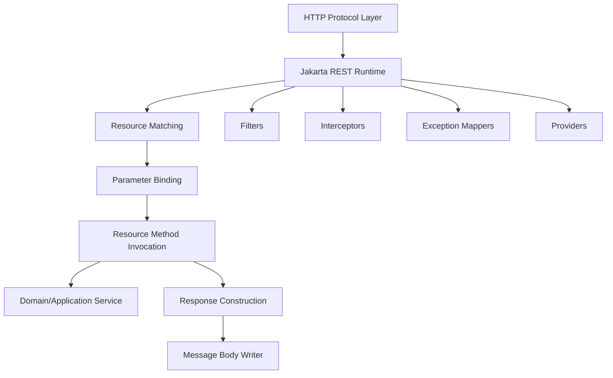
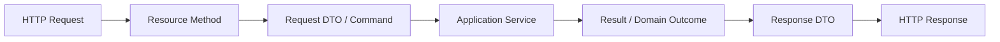
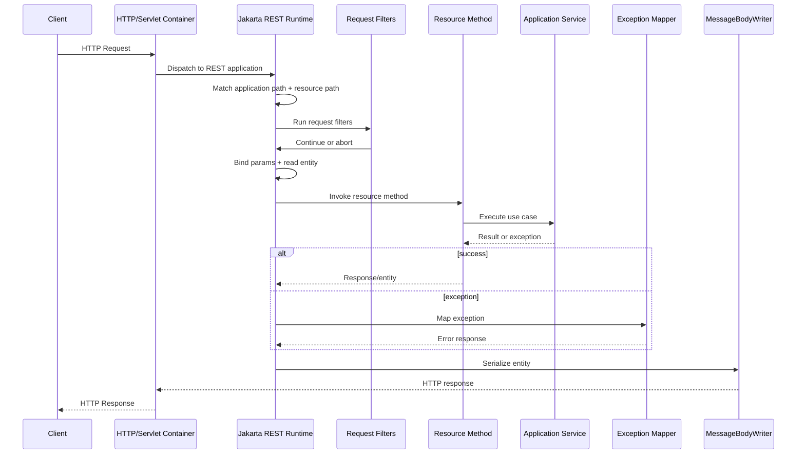
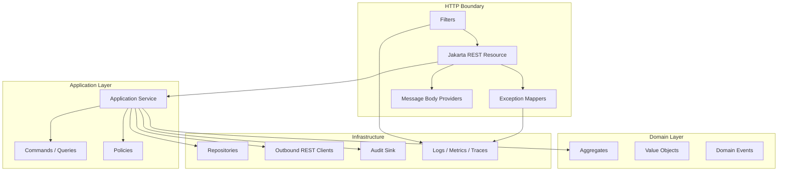

# Part 001 — Kaufman Skill Map

Kita tidak sedang belajar “cara membuat endpoint `GET /hello`”. Itu terlalu dangkal.

Tujuan seri ini adalah membangun kemampuan untuk melihat Jakarta RESTful Web Services sebagai **boundary runtime untuk sistem HTTP production**: tempat protokol, kontrak, representasi, security, observability, validasi, error model, deployment, dan operability bertemu.

Dengan kata lain, targetnya bukan hanya:

```java
@Path("/hello")
public class HelloResource {
    @GET
    public String hello() {
        return "hello";
    }
}
```

Targetnya adalah bisa menjawab pertanyaan yang biasanya membedakan engineer biasa dari engineer senior/top-tier:

- Apakah endpoint ini benar secara semantik HTTP?
- Apakah kontraknya bisa berevolusi tanpa merusak client lama?
- Apakah error response-nya cukup stabil untuk integrasi antar-service?
- Apakah resource class hanya menjadi protocol adapter, atau sudah tercampur domain/persistence?
- Apakah timeout, retry, idempotency, dan failure classification sudah jelas?
- Apakah filter/provider/interceptor dipakai sebagai extension point yang sehat, bukan sebagai tempat menyembunyikan business logic?
- Apakah request lifecycle-nya dipahami sampai level provider selection dan exception mapping?
- Apakah API ini bisa diaudit, dioperasikan, dan dipertanggungjawabkan dalam sistem yang regulated?

Itulah ruang lingkup seri ini.

---

## 1. Baseline yang Digunakan Seri Ini

Seri ini memakai baseline berikut:

- **Nama modern**: Jakarta RESTful Web Services.
- **Nama historis/populer**: JAX-RS.
- **Package modern**: `jakarta.ws.rs.*`.
- **Package lama**: `javax.ws.rs.*`.
- **Baseline stabil utama**: Jakarta RESTful Web Services 4.0 / Jakarta EE 11.
- **Baseline Java**: Java SE 17+.
- **Fokus runtime**: specification-first, lalu implementasi seperti Jersey, RESTEasy, Apache CXF, Open Liberty, Payara, WildFly, dan Quarkus.

Kenapa baseline ini penting?

Karena JAX-RS/Jakarta REST sering dipelajari sebagai kumpulan annotation. Itu salah framing. Annotation hanyalah surface syntax. Yang lebih penting adalah **model runtime** dan **kontrak protokol**.

Jika kita hanya tahu annotation, kita bisa membuat endpoint. Jika kita memahami runtime dan contract, kita bisa mendesain service yang stabil, aman, bisa dites, bisa diamati, dan bisa dimigrasikan.

---

## 2. Kaufman Framework: Cara Seri Ini Disusun

Josh Kaufman dalam *The First 20 Hours* tidak mengajarkan “belajar semua hal dari awal sampai ensiklopedia”. Pendekatannya lebih pragmatis:

1. Tentukan target performa yang jelas.
2. Pecah skill menjadi sub-skill kecil.
3. Pelajari cukup untuk bisa mulai praktik dan mengoreksi diri.
4. Singkirkan hambatan praktik.
5. Latihan intensional minimal 20 jam.

Kita adaptasi framework itu untuk Jakarta REST.

### 2.1 Target Performa

Target setelah menyelesaikan seri ini:

> Mampu mendesain, mengimplementasikan, menguji, mengamankan, mengobservasi, dan mengoperasikan REST API Java berbasis Jakarta REST dengan kontrak yang stabil, runtime behavior yang dipahami, dan failure model yang eksplisit.

Lebih konkret, kamu harus bisa:

- Membuat resource model yang tidak sekadar RPC-over-HTTP.
- Memilih HTTP method/status/header/media type secara sadar.
- Membedakan resource, representation, DTO, domain object, persistence entity, dan command.
- Menulis filter, interceptor, provider, exception mapper, dan validation boundary dengan benar.
- Membuat error contract yang stabil dan tidak membocorkan informasi sensitif.
- Menguji resource, provider, contract, dan failure path.
- Mendesain client Jakarta REST yang resilient terhadap timeout, retry, partial failure, dan response ambiguity.
- Memahami perbedaan runtime implementation dan konsekuensi deployment.

### 2.2 Prinsip Deconstruction

Jakarta REST dapat dipecah menjadi beberapa lapisan mental model:



Setiap lapisan punya pertanyaan kunci:

| Lapisan | Pertanyaan yang Harus Bisa Dijawab |
|---|---|
| HTTP protocol | Apa arti method, status, header, cache, conditional request, dan content negotiation? |
| Runtime | Bagaimana class ditemukan, path dicocokkan, method dipilih, parameter di-bind, response ditulis? |
| Resource model | Apa resource-nya? Apa representasinya? Apa operation-nya? Apa state transition-nya? |
| DTO/contract | Apa bentuk request/response yang stabil dan kompatibel? |
| Provider pipeline | Siapa membaca body? Siapa menulis body? Siapa mapping error? Siapa menjalankan filter? |
| Security | Di mana authentication/authorization terjadi? Apa trust boundary-nya? |
| Reliability | Apa yang terjadi saat timeout, retry, duplicate request, dan partial failure? |
| Operability | Bagaimana log, metric, trace, audit, dan health check dirancang? |

### 2.3 Learn Enough to Self-Correct

Kita tidak akan menghafal seluruh API sekaligus. Kita akan membangun kemampuan membaca gejala.

Contoh gejala:

- Client menerima `415 Unsupported Media Type`.
- Method yang dipanggil runtime bukan method yang kamu harapkan.
- `ExceptionMapper` tidak jalan.
- JSON field hilang atau `null` secara tidak sengaja.
- Filter berjalan dua kali atau tidak berjalan sama sekali.
- Request upload file membuat memory spike.
- Response 204 masih membawa body.
- Retry client menyebabkan double mutation.

Engineer top-tier tidak hanya “memperbaiki error”. Ia tahu **kelas masalahnya**.

Misalnya:

| Gejala | Kemungkinan Lapisan Masalah |
|---|---|
| 404 padahal endpoint ada | Application path, deployment path, resource path, path template, HTTP method mismatch |
| 405 Method Not Allowed | Path cocok, method HTTP tidak cocok |
| 406 Not Acceptable | `Accept` tidak cocok dengan `@Produces` |
| 415 Unsupported Media Type | `Content-Type` tidak cocok dengan `@Consumes` / body reader |
| JSON gagal deserialize | MessageBodyReader/provider/JSON binding config |
| Error response tidak seragam | Exception mapper resolution / fallback exception path |
| Header auth tidak terbaca | Filter order / security context / proxy header trust |

Belajar Jakarta REST dengan cepat berarti menguasai “diagnostic map” ini.

---

## 3. Mental Model Utama: Resource Bukan Controller Biasa

Di banyak framework web, kita terbiasa berpikir “controller menerima request”. Di Jakarta REST, lebih tepat berpikir:

> Resource class adalah adapter dari HTTP resource model ke application use case.

Resource bukan domain service. Resource bukan repository. Resource bukan transaction script yang menampung semua logic. Resource adalah boundary.

### 3.1 Resource sebagai Protocol Adapter

Resource method menerima request dalam bentuk HTTP, lalu menerjemahkannya menjadi input application service.



Resource yang sehat biasanya:

- Tipis, tetapi tidak bodoh.
- Mengerti HTTP semantics.
- Mengerti request/response contract.
- Tidak menjalankan business rule kompleks.
- Tidak langsung mengekspos persistence entity.
- Tidak menyembunyikan failure model.
- Tidak memutuskan transaksi sendirian jika transaksi adalah concern application layer.

Contoh buruk:

```java
@Path("/cases")
public class CaseResource {
    @POST
    public Response create(Map<String, Object> json) {
        var conn = DriverManager.getConnection("...");
        var id = UUID.randomUUID();
        conn.createStatement().executeUpdate("insert ...");
        return Response.ok(Map.of("id", id)).build();
    }
}
```

Masalahnya bukan hanya style. Masalahnya boundary kabur:

- HTTP layer tahu detail database.
- Tidak ada request DTO stabil.
- Tidak ada validation boundary.
- Tidak ada error taxonomy.
- Tidak ada transaction abstraction.
- Tidak ada idempotency strategy.
- Tidak ada audit point yang jelas.

Contoh lebih sehat:

```java
@Path("/cases")
@Consumes(MediaType.APPLICATION_JSON)
@Produces(MediaType.APPLICATION_JSON)
public class CaseResource {

    private final CaseApplicationService service;

    public CaseResource(CaseApplicationService service) {
        this.service = service;
    }

    @POST
    public Response createCase(
            @Valid CreateCaseRequest request,
            @Context UriInfo uriInfo,
            @HeaderParam("Idempotency-Key") String idempotencyKey) {

        var command = request.toCommand(idempotencyKey);
        var result = service.createCase(command);

        var location = uriInfo.getAbsolutePathBuilder()
                .path(result.caseId().toString())
                .build();

        return Response.created(location)
                .entity(CaseResponse.from(result))
                .build();
    }
}
```

Di sini resource melakukan tugas boundary:

- Menerima representasi JSON.
- Memvalidasi request DTO.
- Membaca header idempotency.
- Menerjemahkan request ke command.
- Memanggil application service.
- Menghasilkan `201 Created` dengan `Location` header.
- Mengembalikan response DTO, bukan entity database.

---

## 4. Peta Sub-Skill Jakarta REST

Berikut skill map seri ini.

| Cluster | Sub-Skill | Tujuan |
|---|---|---|
| Bootstrapping | `Application`, `@ApplicationPath`, discovery | Paham bagaimana runtime menemukan REST app |
| Resource design | `@Path`, HTTP method annotation, subresource | Mendesain API surface yang stabil |
| Parameter binding | `@PathParam`, `@QueryParam`, `@HeaderParam`, `@BeanParam` | Mengubah input HTTP menjadi Java type dengan aman |
| Media type | `@Consumes`, `@Produces`, content negotiation | Mengontrol representasi dan error 406/415 |
| Entity provider | `MessageBodyReader`, `MessageBodyWriter` | Paham serialization/deserialization pipeline |
| Response model | `Response`, status, headers, links, cache | Menghasilkan response yang benar secara protokol |
| Error model | `ExceptionMapper`, problem details, taxonomy | Membuat failure contract stabil |
| Validation | Bean Validation, DTO validation, groups | Menolak input invalid di boundary yang tepat |
| Cross-cutting | filters, interceptors, dynamic features | Menaruh concern lintas-resource di extension point tepat |
| Context | `@Context`, `UriInfo`, `HttpHeaders`, `SecurityContext` | Memakai runtime state tanpa menciptakan coupling berlebihan |
| Security | auth boundary, authorization, CORS, CSRF | Mengamankan REST API sesuai trust model |
| Client API | `Client`, `WebTarget`, `Invocation`, `Response` | Mengonsumsi REST API dengan lifecycle benar |
| Resilience | timeout, retry, idempotency, circuit breaker | Menghadapi partial failure dan distributed uncertainty |
| Async/streaming | `AsyncResponse`, SSE, streaming | Menangani workload panjang/streaming tanpa salah model |
| Performance | serialization, threading, allocation, benchmarking | Mengidentifikasi bottleneck nyata |
| Runtime | Jersey, RESTEasy, CXF, app server, Quarkus | Memahami portability vs vendor feature |
| Testing | resource, provider, contract, in-container | Membangun confidence yang sesuai risiko |
| Operability | logs, metrics, traces, audit | Membuat API bisa dioperasikan di production |

---

## 5. Apa yang Tidak Akan Diulang

Karena seri lain sudah selesai, kita tidak akan membuang waktu mengulang materi berikut kecuali saat menyambung langsung ke Jakarta REST:

- Java syntax dasar.
- Collection, stream, generics, record, enum secara umum.
- JDBC transaction management secara mendalam.
- Design pattern umum.
- DSA.
- BPMN/Camunda lifecycle.
- Generic microservices lecture.
- Generic HTTP beginner tutorial.

Contoh: ketika membahas transaction boundary, kita tidak akan mengulang JDBC. Kita akan membahas **apa konsekuensi REST resource terhadap transaction boundary**.

Contoh: ketika membahas pattern, kita tidak akan mengulang Strategy/Factory/Adapter. Kita akan membahas **provider pipeline, exception mapping, DTO boundary, idempotent command endpoint, dan representation evolution**.

---

## 6. Model Request Lifecycle yang Harus Dipegang Sejak Awal

Sebelum menulis banyak annotation, pegang alur ini:



Kesalahan umum adalah menganggap resource method langsung dipanggil begitu request masuk. Padahal sebelum method itu berjalan, runtime sudah melakukan banyak keputusan:

- Apakah request masuk ke Jakarta REST application yang benar?
- Resource class mana yang cocok?
- Method mana yang cocok?
- Media type request cocok atau tidak?
- Provider mana yang bisa membaca body?
- Filter apa yang berjalan?
- Context apa yang tersedia?

Setelah method selesai, runtime juga masih mengambil keputusan:

- Apakah return value langsung menjadi entity?
- Apakah `Response` object sudah lengkap?
- Provider mana yang menulis response body?
- Exception mapper mana yang dipakai jika gagal?
- Response filter apa yang memodifikasi header/body?

Pahami lifecycle ini, maka banyak error Jakarta REST menjadi jauh lebih mudah dianalisis.

---

## 7. Skill Acquisition Plan: 20 Jam Pertama

Seri ini panjang, tetapi 20 jam pertama harus punya hasil konkret. Jangan menunggu paham semua sebelum praktik.

### Jam 1–2: Bootstrapping dan Resource Minimal

Target:

- Membuat aplikasi Jakarta REST minimal.
- Memahami `Application` dan `@ApplicationPath`.
- Membuat 3 resource: collection, item, dan command-like operation.

Latihan:

- `GET /cases`
- `GET /cases/{caseId}`
- `POST /cases`
- `POST /cases/{caseId}/transitions`

Output:

- Bisa menjelaskan full URL path sebagai kombinasi deployment context, application path, class path, dan method path.

### Jam 3–4: HTTP Method dan Status Discipline

Target:

- Tidak asal memakai `200 OK`.
- Bisa memilih `201`, `202`, `204`, `400`, `404`, `409`, `412`, `415`, `422`, `500` secara konsisten.

Latihan:

- `POST /cases` mengembalikan `201 Created` + `Location`.
- `DELETE /cases/{id}` mengembalikan `204 No Content`.
- Duplicate create dengan idempotency key mengembalikan response deterministik.

Output:

- Tabel status code untuk domain mini.

### Jam 5–6: Parameter Binding

Target:

- Menggunakan `@PathParam`, `@QueryParam`, `@HeaderParam`, `@BeanParam`.
- Menghindari parsing manual dari raw request.

Latihan:

- `GET /cases?status=OPEN&limit=50&cursor=...`
- `GET /cases/{caseId}/evidence/{evidenceId}`
- `X-Correlation-ID` dan `Idempotency-Key`.

Output:

- Request parameter object yang jelas.

### Jam 7–8: DTO dan JSON Contract

Target:

- Membedakan request DTO, response DTO, command, domain object, dan persistence entity.

Latihan:

- Create DTO untuk create case.
- Response DTO untuk detail case.
- Response DTO untuk list item.

Output:

- Contract tidak mengekspos persistence entity.

### Jam 9–10: Validation Boundary

Target:

- Menolak input invalid sebelum masuk application service.
- Menghasilkan error response konsisten.

Latihan:

- Required field.
- Enum invalid.
- Date range invalid.
- Cross-field validation.

Output:

- Error response untuk validation failure.

### Jam 11–12: Exception Mapping

Target:

- Domain exception tidak bocor menjadi `500` acak.
- Error contract stabil.

Latihan:

- `CaseNotFoundException` -> 404.
- `InvalidStateTransitionException` -> 409.
- `DuplicateRequestException` -> 409 atau deterministic replay.
- Fallback mapper untuk unexpected error.

Output:

- Centralized exception mapper.

### Jam 13–14: Filters dan Context

Target:

- Memahami request/response filter.
- Menambahkan correlation ID dan audit context.

Latihan:

- Request filter membaca/generate correlation ID.
- Response filter menulis `X-Correlation-ID`.
- Filter tidak membaca body kecuali benar-benar perlu.

Output:

- Traceable request flow.

### Jam 15–16: Client API

Target:

- Menggunakan Jakarta REST Client API dengan lifecycle benar.
- Tidak membuat client baru per request.

Latihan:

- Panggil external service mock.
- Set timeout.
- Handle non-2xx response.
- Tutup `Response` dengan benar.

Output:

- Client wrapper yang testable.

### Jam 17–18: Testing

Target:

- Mengetes resource behavior, bukan hanya method Java.

Latihan:

- Resource test untuk status/header/body.
- Exception mapper test.
- Provider/filter test.
- Contract snapshot untuk response JSON.

Output:

- Test suite yang menangkap regression API contract.

### Jam 19–20: Operability Mini-Review

Target:

- API minimal siap direview dari sisi production.

Latihan:

- Tambahkan structured log.
- Tambahkan metric konseptual.
- Tambahkan health/readiness endpoint jika runtime mendukung.
- Review checklist: security, compatibility, observability, error model.

Output:

- Mini REST service yang tidak hanya “jalan”, tetapi bisa dijelaskan secara operasional.

---

## 8. The Smallest Useful Project

Agar praktik tidak abstrak, seri ini akan memakai domain latihan yang cocok untuk engineer dengan konteks case management/regulatory lifecycle:

> **Regulatory Case API** — API untuk membuat case, menambahkan evidence, menjalankan state transition, melakukan escalation, mencatat decision, dan menghasilkan audit trail.

Kenapa domain ini bagus?

Karena domain ini memaksa kita menghadapi problem nyata:

- Resource tidak selalu CRUD sederhana.
- State transition harus valid.
- Mutation harus audit-safe.
- Duplicate request berbahaya.
- Authorization bisa bergantung pada case status dan role.
- Error harus defensible.
- Response harus cukup stabil untuk integrasi internal/eksternal.
- Evidence upload/download memperkenalkan binary payload dan streaming.

Contoh resource map awal:

```txt
GET    /cases
POST   /cases
GET    /cases/{caseId}
PATCH  /cases/{caseId}
POST   /cases/{caseId}/transitions
GET    /cases/{caseId}/evidence
POST   /cases/{caseId}/evidence
GET    /cases/{caseId}/evidence/{evidenceId}
GET    /cases/{caseId}/audit-events
POST   /cases/{caseId}/escalations
GET    /cases/{caseId}/decisions
POST   /cases/{caseId}/decisions
```

Tidak semua endpoint ini akan dibuat sekaligus. Kita akan memakainya sebagai recurring example saat membahas topik tertentu.

---

## 9. North Star Architecture

Kita akan mengarah ke arsitektur seperti ini:



Prinsipnya:

- HTTP boundary boleh tahu HTTP.
- Application layer boleh tahu use case.
- Domain layer tidak boleh bergantung pada Jakarta REST.
- Infrastructure boleh tahu network, database, queue, file storage, dan runtime detail.
- Error mapping berada di boundary, tetapi error taxonomy harus dimodelkan dari domain/application layer.
- Observability bukan afterthought; ia adalah bagian dari API design.

---

## 10. Rubrik Kemampuan

Gunakan rubrik ini untuk mengukur progress.

### Level 1 — Syntax User

Ciri:

- Bisa memakai `@Path`, `@GET`, `@POST`.
- Bisa return object JSON.
- Belum paham provider pipeline.
- Semua error sering menjadi `500` atau plain text.
- Status code sering asal.

Risiko:

- Endpoint jalan di demo, rapuh di production.

### Level 2 — API Builder

Ciri:

- Bisa membuat CRUD API yang cukup rapi.
- Sudah memakai DTO dan validation.
- Sudah tahu `Response` dan beberapa status code.
- Mulai memakai exception mapper.

Risiko:

- Kontrak masih kurang matang untuk evolusi jangka panjang.

### Level 3 — Runtime-Aware Engineer

Ciri:

- Paham request lifecycle.
- Bisa debug 404/405/406/415 secara sistematis.
- Bisa menulis provider/filter/interceptor.
- Bisa memisahkan resource, service, DTO, entity.
- Bisa membuat test untuk API behavior.

Risiko:

- Masih bisa under-design observability/resilience.

### Level 4 — Production API Engineer

Ciri:

- Mendesain API berdasarkan resource model, compatibility, failure model, dan operability.
- Memikirkan idempotency, retry, timeout, audit, security, and observability sejak awal.
- Bisa memilih runtime implementation berdasarkan constraint.
- Bisa menulis contract review checklist.

Risiko:

- Bisa terlalu kompleks jika tidak menjaga simplicity.

### Level 5 — Top-Tier API Architect

Ciri:

- Bisa mendesain API platform yang konsisten lintas team.
- Bisa membuat governance ringan tapi efektif.
- Bisa mengantisipasi migrasi namespace/runtime/version.
- Bisa menjelaskan trade-off REST vs messaging vs workflow vs RPC.
- Bisa membuat API defensible untuk domain regulated.

Risiko:

- Over-standardization. Engineer top-tier tahu kapan rule perlu fleksibel.

---

## 11. Kesalahan Belajar yang Harus Dihindari

### 11.1 Menghafal Annotation Tanpa Lifecycle

Annotation mudah dihafal. Runtime behavior sulit. Fokus ke lifecycle.

Pertanyaan self-check:

- Jika dua method punya path mirip, mana yang dipilih?
- Jika `Accept` tidak cocok, response apa?
- Jika exception dilempar sebelum resource method, mapper mana yang menangani?
- Jika provider custom dan built-in sama-sama cocok, mana yang dipakai?

### 11.2 Menganggap REST Sama dengan CRUD

CRUD adalah salah satu bentuk resource manipulation, bukan definisi REST.

Domain case management sering membutuhkan operation seperti:

- submit evidence,
- transition state,
- escalate case,
- issue decision,
- reopen case,
- assign investigator.

Tantangannya adalah memodelkan operation itu tetap sebagai resource/representation/state transition yang jelas, bukan sekadar `POST /doSomething`.

### 11.3 Menyamakan DTO dengan Entity

Persistence entity punya alasan berubah yang berbeda dari API DTO.

Jika entity langsung diekspos:

- field internal bisa bocor,
- lazy loading bisa meledak,
- backward compatibility sulit,
- constraint database ikut menjadi public contract,
- security masking sulit.

### 11.4 Menunda Error Model

Error model yang ditunda biasanya tumbuh liar.

Gejalanya:

- Setiap endpoint punya format error berbeda.
- Client harus parsing string message.
- Domain conflict kadang 400, kadang 409, kadang 500.
- Correlation ID tidak konsisten.
- Validation error tidak bisa ditampilkan dengan baik oleh UI.

### 11.5 Memasukkan Business Logic ke Filter

Filter cocok untuk cross-cutting concern seperti:

- correlation ID,
- authentication pre-processing,
- audit envelope,
- request/response logging,
- header normalization,
- CORS.

Filter buruk untuk:

- business decision,
- state transition,
- case assignment,
- domain validation kompleks,
- persistence mutation.

Jika filter mulai tahu detail domain terlalu banyak, architecture smell.

---

## 12. Decision Heuristics Awal

Gunakan heuristik ini sebelum masuk part berikutnya.

### 12.1 Resource atau Service?

Jika logic berhubungan dengan HTTP shape, letakkan di resource.

Contoh:

- membaca header,
- membuat `Location` URI,
- memilih status code,
- mapping request DTO,
- mapping response DTO.

Jika logic berhubungan dengan business outcome, letakkan di application/domain layer.

Contoh:

- boleh/tidaknya transition,
- siapa yang boleh approve,
- apakah evidence memenuhi syarat,
- kapan escalation dibuat,
- bagaimana audit event domain dibentuk.

### 12.2 Query Param atau Path Param?

Gunakan path param untuk identitas resource:

```txt
/cases/{caseId}
/cases/{caseId}/evidence/{evidenceId}
```

Gunakan query param untuk filtering/projection/pagination:

```txt
/cases?status=OPEN&assignedTo=me&limit=50
```

Jika query param mengubah resource identity secara fundamental, mungkin resource model-nya belum jelas.

### 12.3 POST atau PUT?

Gunakan `POST` jika server menentukan identifier atau operation menghasilkan subordinate resource/action result.

Gunakan `PUT` jika client mengganti state resource pada URI yang sudah diketahui dan operation idempotent.

Contoh:

```txt
POST /cases
PUT  /cases/{caseId}/assignment
POST /cases/{caseId}/transitions
```

State transition sering tetap `POST`, karena ia bukan sekadar mengganti seluruh representation. Ia adalah command yang menghasilkan efek domain dan audit trail. Tapi command itu tetap harus dimodelkan dengan contract yang jelas, bukan `POST /cases/{id}/do-transition-please`.

### 12.4 400 atau 409?

Gunakan `400 Bad Request` untuk request yang secara sintaksis/semantik input invalid dan tidak bergantung pada current state resource.

Gunakan `409 Conflict` jika request valid sebagai bentuk, tetapi bertabrakan dengan current state.

Contoh:

- `status = "banana"` -> 400.
- Transition `CLOSED -> UNDER_REVIEW` tidak diizinkan karena current state -> 409.

### 12.5 404 atau 403?

Ini security-sensitive.

Jika resource tidak ada, 404.
Jika resource ada tetapi user tidak berhak, secara teknis 403.
Namun dalam beberapa sistem, 404 bisa dipakai untuk menyembunyikan keberadaan resource. Itu harus menjadi policy eksplisit, bukan kebetulan.

---

## 13. Practice Backlog untuk Seri Ini

Simpan backlog ini. Nanti setiap part akan mengerjakan subset.

### Resource Modeling

- Desain `CaseResource`.
- Desain `EvidenceResource`.
- Desain `DecisionResource`.
- Desain `EscalationResource`.
- Evaluasi nested resource terlalu dalam.

### Request/Response Contract

- `CreateCaseRequest`.
- `CaseDetailResponse`.
- `CaseListItemResponse`.
- `TransitionCaseRequest`.
- `ProblemResponse`.
- `PagedResponse<T>`.

### Runtime Extension

- `CorrelationIdFilter`.
- `AuditContextFilter`.
- `ProblemExceptionMapper`.
- `JsonConfigProvider`.
- `SecurityContext` usage.

### Reliability

- Idempotency key for `POST /cases`.
- Conflict detection for state transition.
- Timeout policy for outbound client.
- Retry classification for safe/idempotent calls.

### Testing

- Resource contract tests.
- Exception mapper tests.
- Validation error tests.
- Content negotiation tests.
- Client failure tests.

---

## 14. Minimal Reference Implementation Shape

Kita akan sering menggunakan struktur seperti ini:

```txt
src/main/java/com/acme/cases/api
  CaseApplication.java
  resource/
    CaseResource.java
    EvidenceResource.java
    DecisionResource.java
  dto/
    CreateCaseRequest.java
    CaseResponse.java
    ProblemResponse.java
  mapper/
    CaseApiMapper.java
  error/
    ProblemExceptionMapper.java
    ValidationExceptionMapper.java
  filter/
    CorrelationIdFilter.java
    AuditContextFilter.java
  provider/
    JsonProviderConfig.java

src/main/java/com/acme/cases/application
  CaseApplicationService.java
  command/
    CreateCaseCommand.java
    TransitionCaseCommand.java
  result/
    CaseCreatedResult.java

src/main/java/com/acme/cases/domain
  Case.java
  CaseId.java
  CaseStatus.java
  CaseTransitionPolicy.java

src/main/java/com/acme/cases/infra
  persistence/
  client/
  audit/
```

Ini bukan template wajib. Ini mental model boundary.

Jika project kecil, struktur bisa dipadatkan. Jika project besar/regulatory, struktur eksplisit seperti ini membantu menjaga perubahan tetap terkendali.

---

## 15. Checklist Sebelum Lanjut ke Part 002

Sebelum lanjut, pastikan kamu bisa menjawab:

1. Apa bedanya resource class dengan application service?
2. Mengapa Jakarta REST tidak boleh dipahami sebagai kumpulan annotation saja?
3. Apa saja langkah besar request lifecycle sebelum resource method dipanggil?
4. Apa bahaya mengekspos persistence entity sebagai response JSON?
5. Mengapa error model harus didesain sejak awal?
6. Apa output 20 jam pertama yang masuk akal?
7. Mengapa domain case management cocok sebagai latihan advanced REST API?

Jika jawabanmu masih terasa kabur, jangan khawatir. Part berikutnya akan menata sejarah, versi, namespace, dan compatibility agar fondasinya tidak goyah.

---

## 16. Sumber Resmi yang Digunakan

- Jakarta RESTful Web Services project page: `https://jakarta.ee/specifications/restful-ws/`
- Jakarta RESTful Web Services 4.0: `https://jakarta.ee/specifications/restful-ws/4.0/`
- Jakarta RESTful Web Services 5.0 under development: `https://jakarta.ee/specifications/restful-ws/5.0/`
- Jakarta EE Platform 11: `https://jakarta.ee/specifications/platform/11/`
- Jakarta EE Tutorial — Building RESTful Web Services with Jakarta REST: `https://jakarta.ee/learn/docs/jakartaee-tutorial/current/websvcs/rest/rest.html`
