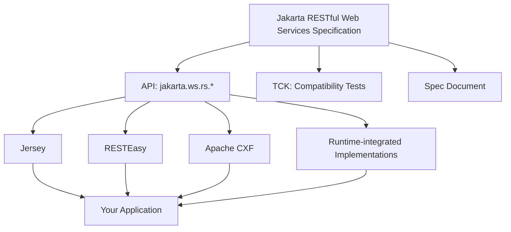
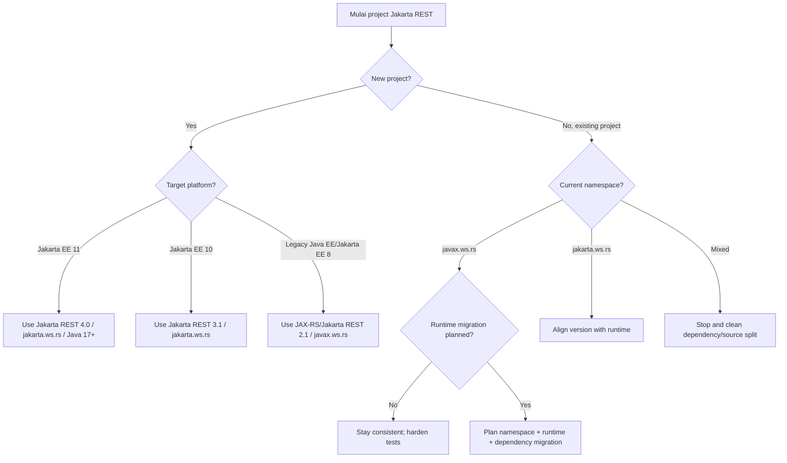

# Part 002 — JAX-RS to Jakarta REST: Evolution, Namespace, Versioning, and Compatibility

Sebelum masuk ke annotation, resource class, provider, dan runtime pipeline, kita harus menata satu hal yang sering membuat engineer bingung:

> Apakah ini JAX-RS, Jakarta REST, Java EE, Jakarta EE, `javax.ws.rs`, atau `jakarta.ws.rs`?

Jawaban pendeknya:

- **JAX-RS** adalah nama historis yang masih sangat sering dipakai.
- **Jakarta RESTful Web Services** adalah nama modern dalam ekosistem Jakarta EE.
- **`javax.ws.rs.*`** adalah namespace lama.
- **`jakarta.ws.rs.*`** adalah namespace modern.
- **Jakarta REST 4.0** adalah baseline stabil untuk Jakarta EE 11 dan Java SE 17+.
- **Jakarta REST 5.0** sedang disiapkan untuk Jakarta EE 12 dan belum menjadi baseline utama seri ini.

Part ini penting karena banyak problem production bukan berasal dari kode resource method, tetapi dari mismatch versi:

- dependency memakai `jakarta.ws.rs`, runtime masih mengharapkan `javax.ws.rs`;
- library extension masih JAX-RS 2.1, aplikasi sudah Jakarta EE 10/11;
- API jar dibundel ke WAR padahal runtime sudah menyediakan API;
- implementation Jersey/RESTEasy/CXF tidak cocok dengan versi spec;
- migration dilakukan dengan search-replace namespace tanpa memahami behavior compatibility.

---

## 1. Vocabulary yang Harus Rapi

### 1.1 REST

REST adalah architectural style untuk sistem hypermedia/distributed yang menggunakan konsep resource, representation, uniform interface, cacheability, stateless interaction, dan layered system.

Dalam praktik enterprise API, istilah “REST API” sering dipakai lebih longgar: HTTP API dengan resource-oriented URI dan JSON representation.

Seri ini pragmatis: kita tidak akan berdebat dogmatis soal REST purity, tetapi kita akan menjaga **HTTP correctness**, **resource modeling**, dan **contract stability**.

### 1.2 JAX-RS

JAX-RS adalah nama historis untuk Java API for RESTful Web Services.

Engineer masih sering berkata:

- “JAX-RS resource”
- “JAX-RS provider”
- “JAX-RS client”
- “JAX-RS exception mapper”

Walaupun package modern sudah `jakarta.ws.rs`, istilah JAX-RS masih berguna sebagai shorthand.

### 1.3 Jakarta RESTful Web Services

Jakarta RESTful Web Services adalah nama specification modern di bawah Jakarta EE.

Specification ini menyediakan API dasar untuk membangun web service mengikuti pola REST. Yang penting: specification bukan implementation.

Specification mendefinisikan kontrak API seperti:

- annotation,
- resource matching,
- provider model,
- client API,
- exception handling,
- filters/interceptors,
- entity provider,
- context object.

Implementation-lah yang menjalankan kontrak itu.

Contoh implementation/runtime:

- Jersey,
- RESTEasy,
- Apache CXF,
- Open Liberty,
- Payara,
- WildFly,
- Quarkus REST / RESTEasy Reactive.

### 1.4 Jakarta EE

Jakarta EE adalah platform. Jakarta REST adalah salah satu specification di dalam ekosistem itu.

Ini penting karena dependency dan deployment berbeda tergantung target:

- Jika aplikasi berjalan di Jakarta EE runtime lengkap atau Web Profile yang menyediakan Jakarta REST, API jar sering bersifat `provided`.
- Jika aplikasi standalone/embedded, kamu perlu membawa implementation dan dependency runtime sendiri.

---

## 2. Specification vs Implementation

Satu kesalahan besar adalah menyamakan Jakarta REST dengan Jersey atau RESTEasy.

Jakarta REST adalah kontrak. Jersey/RESTEasy/CXF adalah implementasi.



Implikasi praktis:

- Kode yang hanya memakai API standard lebih portable.
- Feature runtime-specific bisa berguna, tetapi menciptakan coupling.
- Bug/performance behavior bisa berbeda antar-implementation.
- Test harus membedakan “spec behavior” dan “implementation behavior”.

### 2.1 Portability Surface

Kode berikut cukup portable:

```java
@Path("/cases")
@Produces(MediaType.APPLICATION_JSON)
@Consumes(MediaType.APPLICATION_JSON)
public class CaseResource {

    @GET
    public List<CaseSummaryResponse> listCases() {
        return List.of();
    }
}
```

Kode berikut mulai implementation-sensitive jika annotation/class berasal dari vendor tertentu:

```java
// Example only: vendor/runtime-specific annotations create portability coupling.
@SomeVendorReactiveAnnotation
@Path("/cases")
public class CaseResource {
}
```

Bukan berarti vendor-specific feature buruk. Yang buruk adalah memakai feature itu tanpa sadar konsekuensi migrasi.

---

## 3. Version Map: Dari JAX-RS ke Jakarta REST

Peta besar:

| Era | Nama Umum | Namespace | Platform Umum | Catatan |
|---|---|---|---|---|
| Java EE era | JAX-RS | `javax.ws.rs.*` | Java EE | Banyak legacy app masih di sini |
| Jakarta EE 8 | Jakarta REST 2.1 | `javax.ws.rs.*` | Jakarta EE 8 | First Jakarta EE release, namespace masih `javax` |
| Jakarta EE 9 | Jakarta REST 3.0 | `jakarta.ws.rs.*` | Jakarta EE 9 | Big namespace change dari `javax` ke `jakarta` |
| Jakarta EE 10 | Jakarta REST 3.1 | `jakarta.ws.rs.*` | Jakarta EE 10 | Modern Jakarta baseline sebelum EE 11 |
| Jakarta EE 11 | Jakarta REST 4.0 | `jakarta.ws.rs.*` | Jakarta EE 11 | Baseline utama seri ini, Java SE 17+ |
| Jakarta EE 12 | Jakarta REST 5.0 | `jakarta.ws.rs.*` | Jakarta EE 12 | Under development, Java SE 21+ plan |

Hal yang paling penting: **Jakarta EE 8 masih memakai `javax.*`; Jakarta EE 9 adalah titik namespace switch besar ke `jakarta.*`.**

Jadi jangan berasumsi “Jakarta” selalu berarti package `jakarta.*`. Untuk Jakarta EE 8, tidak begitu.

---

## 4. Namespace Change: `javax.ws.rs` ke `jakarta.ws.rs`

Perubahan namespace ini terlihat sederhana:

```java
// Lama
import javax.ws.rs.GET;
import javax.ws.rs.Path;
import javax.ws.rs.Produces;
import javax.ws.rs.core.MediaType;

// Modern
import jakarta.ws.rs.GET;
import jakarta.ws.rs.Path;
import jakarta.ws.rs.Produces;
import jakarta.ws.rs.core.MediaType;
```

Namun secara runtime, ini bukan sekadar rename.

Class dengan annotation `javax.ws.rs.Path` **berbeda type** dari class dengan annotation `jakarta.ws.rs.Path`.

Runtime modern yang mencari `jakarta.ws.rs.Path` tidak otomatis memperlakukan `javax.ws.rs.Path` sebagai annotation yang sama.

### 4.1 Failure Mode Umum

Misalnya kamu punya resource:

```java
import javax.ws.rs.GET;
import javax.ws.rs.Path;

@Path("/cases")
public class CaseResource {
    @GET
    public String list() {
        return "[]";
    }
}
```

Lalu kamu deploy ke Jakarta EE 10/11 runtime yang mengharapkan `jakarta.ws.rs.*`.

Kemungkinan hasil:

- Resource tidak ditemukan.
- Endpoint 404.
- Application scanning tidak mengenali class.
- Provider tidak diregister.
- Exception mapper tidak dipakai.

Masalahnya bukan path string. Masalahnya type annotation.

### 4.2 Rule Praktis

Jangan campur namespace dalam satu aplikasi.

Buruk:

```java
import jakarta.ws.rs.Path;
import javax.ws.rs.core.Response;
```

Baik untuk modern Jakarta:

```java
import jakarta.ws.rs.Path;
import jakarta.ws.rs.core.Response;
```

Baik untuk legacy Java EE/JAX-RS:

```java
import javax.ws.rs.Path;
import javax.ws.rs.core.Response;
```

Mixed namespace adalah red flag. Kadang compile bisa berhasil karena dependency tersedia, tetapi runtime behavior rusak.

---

## 5. Jakarta REST 4.0 sebagai Baseline

Seri ini memakai Jakarta REST 4.0 sebagai baseline utama karena:

- Ia adalah rilis untuk Jakarta EE 11.
- Minimum Java SE version adalah Java SE 17+.
- Ia masih mempertahankan kompatibilitas dengan rilis sebelumnya di jalur Jakarta modern.
- Ia membersihkan dependency legacy seperti JAXB dependency dan ManagedBean support.
- Ia menambahkan/menegaskan beberapa coverage TCK seperti multipart/form-data API dan default `ExceptionMapper`.
- Ia menambahkan API/behavior modern seperti `UriInfo#getMatchedResourceTemplate` dan JSON Merge Patch.

### 5.1 Apa Arti “Remove JAXB Dependency”?

Secara historis, XML/JAXB sering sangat dekat dengan Java EE/JAX-RS. Di REST API modern, JSON biasanya dominan.

Removal JAXB dependency berarti specification tidak lagi menjadikan JAXB sebagai dependency yang melekat pada Jakarta REST. Ini bukan berarti kamu tidak bisa memakai XML/JAXB sama sekali. Artinya kamu harus lebih eksplisit soal stack dan provider jika butuh XML binding.

Prinsip production:

> Jangan mengandalkan provider implisit untuk format penting. Jadikan media type dan serialization strategy sebagai keputusan sadar.

### 5.2 Apa Arti “Remove ManagedBean Support”?

ManagedBean adalah model lama yang sudah dipruning di Jakarta EE 11. Untuk dependency injection dan lifecycle modern, arah platform adalah CDI.

Implikasi praktis:

- Jangan mendesain resource baru dengan asumsi ManagedBean legacy.
- Pahami integrasi CDI/runtime yang kamu pakai.
- Untuk migration, cari resource/provider yang mengandalkan lifecycle lama.

### 5.3 Apa Arti “TCK Coverage”?

TCK adalah Technology Compatibility Kit. Ia dipakai untuk menguji apakah implementation sesuai specification.

Ketika sebuah rilis menambah TCK test untuk area tertentu, itu berarti area itu dianggap penting untuk compatibility behavior.

Untuk kita sebagai engineer, artinya:

- Jangan menganggap multipart hanya vendor extension.
- Jangan menganggap default exception mapping bisa dibiarkan liar.
- Test behavior yang bergantung pada spec harus lebih serius.

---

## 6. Jakarta REST 5.0: Kenapa Tidak Menjadi Baseline Utama?

Jakarta REST 5.0 ditujukan untuk Jakarta EE 12 dan berstatus under development.

Rencana besarnya mengarah ke integrasi CDI yang lebih penuh, Java SE 21+, serta beberapa deprecation/removal preparation seperti `@Context` dan `@Suspended`.

Seri ini tidak menjadikan 5.0 sebagai baseline utama karena:

- target kita adalah production learning yang stabil;
- Jakarta REST 4.0 sudah cukup modern;
- banyak organisasi enterprise akan berada di Java 17/21 dan Jakarta EE 10/11 untuk waktu cukup lama;
- API under development bisa berubah.

Namun kita akan memberi catatan “future direction” ketika relevan, terutama untuk:

- CDI integration,
- context injection,
- async model,
- records,
- Java 21/runtime behavior.

---

## 7. Dependency Model

### 7.1 Jakarta EE Runtime

Jika aplikasi berjalan di Jakarta EE runtime yang menyediakan Jakarta REST, dependency API biasanya diberi scope `provided`.

Contoh Maven untuk full Jakarta EE 11 API:

```xml
<dependency>
    <groupId>jakarta.platform</groupId>
    <artifactId>jakarta.jakartaee-api</artifactId>
    <version>11.0.0</version>
    <scope>provided</scope>
</dependency>
```

Artinya:

- compile-time tersedia;
- runtime disediakan application server;
- kamu tidak membundel API jar ke deployment artifact.

### 7.2 Jakarta REST API Saja

Untuk project yang hanya membutuhkan API Jakarta REST:

```xml
<dependency>
    <groupId>jakarta.ws.rs</groupId>
    <artifactId>jakarta.ws.rs-api</artifactId>
    <version>4.0.0</version>
    <scope>provided</scope>
</dependency>
```

Tetapi API jar saja tidak cukup untuk menjalankan service standalone. Kamu tetap butuh implementation runtime.

### 7.3 Standalone/Embedded Runtime

Jika kamu tidak deploy ke Jakarta EE server, kamu perlu membawa implementation.

Contoh konseptual:

```txt
Application code
+ jakarta.ws.rs-api
+ Jersey/RESTEasy/CXF implementation
+ HTTP server/container integration
+ JSON provider
+ CDI/injection integration if needed
```

Di sini dependency management menjadi lebih sensitif:

- versi API harus cocok dengan implementation;
- JSON provider harus jelas;
- servlet/runtime integration harus tersedia;
- classpath conflict lebih mudah terjadi.

---

## 8. Deployment Compatibility Matrix

Gunakan matrix ini saat membaca project existing.

| Kode Aplikasi | Runtime | Risiko |
|---|---|---|
| `javax.ws.rs.*` | Java EE / Jakarta EE 8 | Normal legacy |
| `javax.ws.rs.*` | Jakarta EE 9+ / 10 / 11 | Resource/provider kemungkinan tidak dikenali |
| `jakarta.ws.rs.*` | Jakarta EE 9+ / 10 / 11 | Normal modern |
| `jakarta.ws.rs.*` | Java EE legacy / Jakarta EE 8 | Class not found / incompatible |
| Mixed `javax` + `jakarta` | Runtime apa pun | Red flag, behavior sulit diprediksi |

### 8.1 Dependency Smell Checklist

Cari smell berikut di `pom.xml` / `build.gradle`:

- Ada `javax.ws.rs-api` dan `jakarta.ws.rs-api` bersamaan.
- Ada Jersey 2.x dengan Jakarta namespace modern tanpa compatibility layer yang jelas.
- Ada RESTEasy classic versi lama di Jakarta EE 10/11 app.
- API jar dibundel tanpa `provided` ke WAR untuk app server yang sudah menyediakan API.
- Ada transitive dependency yang membawa `javax.ws.rs` dari library lama.
- Ada JSON provider lama yang bergantung pada namespace lama.

### 8.2 Code Smell Checklist

Cari smell berikut di source code:

```txt
import javax.ws.rs.
import jakarta.ws.rs.
```

Jika dua-duanya ada di satu codebase, investigasi:

- Apakah migration setengah jalan?
- Apakah module berbeda memang target runtime berbeda?
- Apakah library adapter diperlukan?
- Apakah test masih compile karena dependency dobel?

---

## 9. Migration Strategy: Legacy JAX-RS ke Jakarta REST

Migration sehat tidak hanya search-replace import.

Gunakan tahap berikut.

### 9.1 Inventory

Identifikasi:

- Semua resource class.
- Semua provider.
- Semua filter/interceptor.
- Semua exception mapper.
- Semua client usage.
- Semua dependency `javax.ws.rs`.
- Semua vendor-specific extension.
- Semua JSON/XML provider.
- Semua integration test yang menyentuh HTTP behavior.

Command sederhana:

```bash
grep -R "javax.ws.rs" -n src/main src/test
```

Untuk Maven:

```bash
mvn dependency:tree | grep -E "javax.ws.rs|jakarta.ws.rs|jersey|resteasy|cxf"
```

### 9.2 Decide Target Platform

Jangan mulai migration sebelum target jelas.

Pertanyaan:

- Targetnya Jakarta EE 10 atau 11?
- Java baseline 17 atau 21?
- Runtime target apa: Payara, WildFly, Open Liberty, Quarkus, Tomcat+Jersey, embedded?
- Apakah aplikasi WAR, bootable JAR, container image, atau native image?
- Apakah ada library internal yang masih `javax`?

### 9.3 Namespace Migration

Lakukan perubahan namespace secara atomik per module jika bisa.

Dari:

```java
import javax.ws.rs.GET;
import javax.ws.rs.Path;
import javax.ws.rs.core.Response;
```

Menjadi:

```java
import jakarta.ws.rs.GET;
import jakarta.ws.rs.Path;
import jakarta.ws.rs.core.Response;
```

Tapi jangan berhenti di compile.

### 9.4 Provider and Runtime Verification

Pastikan semua extension ikut termigrasi:

- `ExceptionMapper`.
- `MessageBodyReader`.
- `MessageBodyWriter`.
- `ContainerRequestFilter`.
- `ContainerResponseFilter`.
- `ReaderInterceptor`.
- `WriterInterceptor`.
- `Feature` dan `DynamicFeature`.
- Client filters.

Provider sering terlupakan karena tidak dipanggil langsung oleh kode. Ia dipanggil runtime melalui discovery/registration.

### 9.5 Contract Regression Test

Minimal test yang harus lewat:

- Endpoint discovery: sample endpoint return 200.
- 404 path unknown.
- 405 method mismatch.
- 406 accept mismatch.
- 415 content type mismatch.
- JSON serialization/deserialization.
- Exception mapper untuk domain exception.
- Validation error response.
- Filter correlation ID.
- Client API call jika ada outbound REST client.

Migration tanpa contract regression test sangat berisiko.

---

## 10. Application Path dan Deployment Path: Sumber 404 Klasik

Jakarta REST application biasanya dikonfigurasi dengan subclass `Application` dan `@ApplicationPath`.

Contoh:

```java
import jakarta.ws.rs.ApplicationPath;
import jakarta.ws.rs.core.Application;

@ApplicationPath("/api")
public class CaseRestApplication extends Application {
}
```

Resource:

```java
@Path("/cases")
public class CaseResource {
    @GET
    public List<CaseSummaryResponse> list() {
        return List.of();
    }
}
```

Jika app dideploy dengan context path `/case-service`, maka URL efektif:

```txt
/case-service/api/cases
```

Banyak 404 berasal dari salah menghitung path composition.

```mermaid
flowchart LR
    A[Server Host] --> B[Deployment Context Path]
    B --> C[@ApplicationPath]
    C --> D[Resource @Path]
    D --> E[Method @Path]

    B -. example .-> B1[/case-service]
    C -. example .-> C1[/api]
    D -. example .-> D1[/cases]
    E -. example .-> E1[/{caseId}]
```

Hasil akhir:

```txt
https://example.com/case-service/api/cases/{caseId}
```

Self-check:

- Apakah context path berasal dari server/deployment artifact?
- Apakah `@ApplicationPath` diawali slash atau tidak? Runtime biasanya menormalisasi, tapi konsistensi tetap penting.
- Apakah class resource punya `@Path` dari namespace yang benar?
- Apakah method punya HTTP method annotation?
- Apakah package scanning/registration menemukan class tersebut?

---

## 11. Resource Discovery: Scanning vs Explicit Registration

Ada dua gaya umum.

### 11.1 Classpath Scanning

Runtime mencari resource/provider berdasarkan annotation.

Kelebihan:

- Simple.
- Cocok untuk aplikasi kecil/menengah.
- Sedikit boilerplate.

Kekurangan:

- Behavior bisa tergantung runtime/deployment.
- Startup scanning cost.
- Resource yang tidak diinginkan bisa ikut terdaftar jika packaging tidak rapi.
- Sulit melihat API surface hanya dari `Application` class.

### 11.2 Explicit Registration

Subclass `Application` mendaftarkan class/resource/provider secara eksplisit.

Contoh konseptual:

```java
@ApplicationPath("/api")
public class CaseRestApplication extends Application {

    @Override
    public Set<Class<?>> getClasses() {
        return Set.of(
                CaseResource.class,
                EvidenceResource.class,
                ProblemExceptionMapper.class,
                CorrelationIdFilter.class
        );
    }
}
```

Kelebihan:

- API surface eksplisit.
- Lebih mudah review.
- Mengurangi accidental registration.
- Berguna untuk modular monolith/large codebase.

Kekurangan:

- Boilerplate.
- Bisa lupa mendaftarkan provider.
- Beberapa integration dengan CDI/runtime perlu perhatian.

Rule praktis:

- Untuk learning dan service kecil, scanning cukup.
- Untuk platform/regulatory service yang butuh reviewability tinggi, explicit registration sering lebih defensible.

---

## 12. Compatibility Thinking untuk Library Internal

Dalam organisasi besar, migration jarang hanya satu repository.

Misalnya ada shared library:

```txt
internal-api-common
  ProblemResponse
  ProblemExceptionMapper
  CorrelationIdFilter
  JsonProviderConfig
```

Jika library itu masih `javax.ws.rs`, lalu aplikasi target sudah `jakarta.ws.rs`, maka mapper/filter/provider dari library bisa tidak bekerja.

### 12.1 Pilihan Strategi

| Strategi | Kelebihan | Kekurangan |
|---|---|---|
| Maintain branch `javax` dan `jakarta` | Clear compatibility | Maintenance ganda |
| Release major version modern Jakarta | Bersih jangka panjang | Butuh koordinasi consumer |
| Adapter layer | Bisa transisi bertahap | Kompleks dan sering rapuh |
| Shade/transform bytecode | Berguna untuk library tertentu | Sulit didiagnosis, build kompleks |

Untuk platform internal, strategi paling sehat biasanya:

- major version baru untuk Jakarta namespace;
- compatibility window jelas;
- migration guide;
- contract tests untuk shared provider;
- dependency convergence check di CI.

---

## 13. Runtime Choice: Jangan Salah Level Abstraksi

Saat memilih runtime, bedakan pertanyaan specification dan operation.

Pertanyaan specification:

- Apakah runtime mendukung versi Jakarta REST target?
- Apakah implementation compatible/TCK-tested?
- Apakah behavior standard cukup?

Pertanyaan operation:

- Bagaimana startup time?
- Bagaimana memory footprint?
- Bagaimana observability integration?
- Bagaimana deployment model?
- Bagaimana thread model?
- Bagaimana native image support?
- Bagaimana lifecycle config?
- Bagaimana support/security patch cadence?

Contoh framing salah:

> “Jersey vs RESTEasy, mana yang lebih bagus?”

Framing lebih baik:

> “Untuk service ini, kita butuh Jakarta REST 4.0, Java 17+, WAR deployment ke app server existing, support JSON-B/Jackson, observability OpenTelemetry, dan migration path dari `javax`; runtime mana yang paling rendah risiko?”

---

## 14. Decision Tree Versi

Gunakan decision tree berikut.



Rule utama:

> Pilih namespace berdasarkan runtime target, bukan berdasarkan library yang kebetulan autocomplete muncul di IDE.

---

## 15. Common Pitfalls

### 15.1 API Jar Dikemas ke WAR Padahal Runtime Menyediakan

Jika runtime sudah menyediakan Jakarta REST API, membundel API jar sendiri dapat memicu classloading conflict.

Gejala:

- `ClassCastException` untuk type yang terlihat sama.
- Provider tidak dikenali.
- Annotation tidak terbaca sesuai ekspektasi.
- Behavior berbeda antara local dan server.

Mitigasi:

- Gunakan `provided` untuk API/platform dependency pada app server.
- Audit final artifact.
- Periksa server module/classloader policy.

### 15.2 Transitive Dependency Membawa Namespace Lama

Library lama bisa membawa `javax.ws.rs-api` transitively.

Gejala:

- IDE menawarkan import `javax.ws.rs`.
- Build compile tetapi runtime gagal.
- Dependency tree terlihat punya dua API namespace.

Mitigasi:

- Gunakan dependency convergence.
- Exclude dependency lama.
- Upgrade shared library.
- Fail CI jika mixed namespace ditemukan.

### 15.3 Migration Hanya Search-Replace

Search-replace import memang diperlukan, tetapi tidak cukup.

Yang juga harus dicek:

- deployment descriptor;
- server feature flag;
- provider registration;
- JSON provider;
- CDI integration;
- tests;
- client API;
- documentation/OpenAPI;
- generated client/server code;
- filters/interceptors;
- exception mappers.

### 15.4 Mengabaikan Client API

Banyak migration hanya fokus server resource. Padahal JAX-RS/Jakarta REST juga punya client API.

Cari:

```java
ClientBuilder.newClient()
WebTarget target
Invocation.Builder
Response response
```

Pastikan import dan provider client-side ikut sesuai namespace/version.

### 15.5 Mengira Jakarta REST 5.0 Sudah Aman untuk Baseline Production

Jika versi masih under development, jangan jadikan baseline enterprise tanpa alasan kuat.

Gunakan sebagai arah desain, bukan foundation stabil, kecuali organisasimu memang melakukan early adoption dengan risk acceptance eksplisit.

---

## 16. Migration Review Checklist

Gunakan checklist ini saat review PR migration.

### 16.1 Source Code

- [ ] Tidak ada import `javax.ws.rs` di module modern.
- [ ] Semua resource memakai `jakarta.ws.rs.Path`.
- [ ] Semua provider memakai `jakarta.ws.rs.ext.Provider`.
- [ ] Semua exception mapper memakai `jakarta.ws.rs.ext.ExceptionMapper`.
- [ ] Semua filter/interceptor memakai namespace modern.
- [ ] Semua client API usage memakai namespace modern.

### 16.2 Dependencies

- [ ] Tidak ada `javax.ws.rs-api` transitively.
- [ ] `jakarta.ws.rs-api` version aligned dengan target runtime.
- [ ] Scope API dependency benar: `provided` untuk app server.
- [ ] JSON provider compatible dengan runtime.
- [ ] Vendor implementation version compatible dengan Jakarta REST target.

### 16.3 Runtime

- [ ] Server mendukung Jakarta REST target.
- [ ] Feature/server module diaktifkan.
- [ ] Deployment packaging sesuai classloader policy.
- [ ] Application path tervalidasi.
- [ ] Resource discovery tervalidasi.

### 16.4 Behavior

- [ ] Endpoint utama return expected status.
- [ ] Content negotiation tested.
- [ ] Validation error contract tested.
- [ ] Exception mapper tested.
- [ ] Filter correlation ID tested.
- [ ] Client outbound call tested.
- [ ] Multipart/binary endpoint tested jika ada.

### 16.5 Documentation

- [ ] OpenAPI/schema diperbarui.
- [ ] Migration note untuk consumer internal tersedia.
- [ ] Deployment runbook diperbarui.
- [ ] Known incompatibilities dicatat.

---

## 17. Practical Example: Namespace Mismatch Diagnosis

Misalkan kamu deploy service dan endpoint `GET /case-service/api/cases` mengembalikan 404.

Resource terlihat benar:

```java
import javax.ws.rs.GET;
import javax.ws.rs.Path;

@Path("/cases")
public class CaseResource {
    @GET
    public String list() {
        return "[]";
    }
}
```

Application class:

```java
import jakarta.ws.rs.ApplicationPath;
import jakarta.ws.rs.core.Application;

@ApplicationPath("/api")
public class CaseApplication extends Application {
}
```

Apa yang salah?

Resource memakai `javax.ws.rs.Path`, sedangkan application class memakai `jakarta.ws.rs.ApplicationPath`. Runtime Jakarta modern mencari annotation modern pada resource class. Resource bisa tidak dikenali.

Perbaikan:

```java
import jakarta.ws.rs.GET;
import jakarta.ws.rs.Path;

@Path("/cases")
public class CaseResource {
    @GET
    public String list() {
        return "[]";
    }
}
```

Lalu cek dependency tree agar tidak ada namespace lama.

---

## 18. Practical Example: Provider Tidak Jalan

Exception mapper:

```java
import javax.ws.rs.core.Response;
import javax.ws.rs.ext.ExceptionMapper;
import javax.ws.rs.ext.Provider;

@Provider
public class CaseNotFoundMapper implements ExceptionMapper<CaseNotFoundException> {
    @Override
    public Response toResponse(CaseNotFoundException exception) {
        return Response.status(404).build();
    }
}
```

Resource sudah modern:

```java
import jakarta.ws.rs.GET;
import jakarta.ws.rs.Path;

@Path("/cases/{id}")
public class CaseResource {
    @GET
    public CaseResponse get() {
        throw new CaseNotFoundException();
    }
}
```

Mapper tidak jalan karena mapper masih `javax.ws.rs.ext.Provider` dan `javax.ws.rs.ext.ExceptionMapper`.

Perbaikan:

```java
import jakarta.ws.rs.core.Response;
import jakarta.ws.rs.ext.ExceptionMapper;
import jakarta.ws.rs.ext.Provider;

@Provider
public class CaseNotFoundMapper implements ExceptionMapper<CaseNotFoundException> {
    @Override
    public Response toResponse(CaseNotFoundException exception) {
        return Response.status(Response.Status.NOT_FOUND).build();
    }
}
```

Lesson:

> Migration harus mencakup resource dan seluruh extension points.

---

## 19. Practical Example: API vs Implementation Dependency

Kode compile dengan dependency ini:

```xml
<dependency>
    <groupId>jakarta.ws.rs</groupId>
    <artifactId>jakarta.ws.rs-api</artifactId>
    <version>4.0.0</version>
</dependency>
```

Lalu kamu mencoba menjalankan standalone app dan bingung kenapa tidak ada server yang listen port.

Masalahnya:

- `jakarta.ws.rs-api` hanya API contract.
- Ia tidak menyediakan HTTP server.
- Ia tidak menyediakan full runtime implementation.

Untuk standalone kamu perlu implementation dan container integration.

Mental model:

```txt
API jar = types and annotations
Implementation = runtime behavior
Container/server = network and request dispatch
```

Jangan berharap API jar menjalankan aplikasi.

---

## 20. Compatibility Rules of Thumb

Simpan rule ini:

1. **Namespace harus konsisten.** Jangan campur `javax.ws.rs` dan `jakarta.ws.rs`.
2. **Runtime menentukan namespace.** Jakarta EE 9+ memakai `jakarta.*`.
3. **API bukan implementation.** API jar tidak cukup untuk standalone runtime.
4. **Scope dependency penting.** App server biasanya menyediakan API/runtime.
5. **Provider juga bagian dari migration.** Jangan hanya migrasi resource.
6. **Client API juga harus dicek.** Outbound client sering terlupakan.
7. **Contract tests wajib.** Compile success bukan migration success.
8. **Vendor feature harus sadar risiko.** Feature runtime-specific harus punya alasan.
9. **Jakarta REST 4.0 adalah baseline stabil modern.** 5.0 dipantau sebagai arah, bukan default production baseline.
10. **Classloading conflict bisa terlihat seperti bug random.** Audit final artifact.

---

## 21. Latihan Praktik

### Latihan 1 — Dependency Audit

Ambil satu project Java REST existing. Jalankan:

```bash
mvn dependency:tree | grep -E "javax.ws.rs|jakarta.ws.rs|jersey|resteasy|cxf"
```

Tulis:

- namespace dominan,
- versi API,
- runtime implementation,
- potensi conflict,
- target migration jika perlu.

### Latihan 2 — Import Audit

Jalankan:

```bash
grep -R "import javax.ws.rs" -n src/main src/test || true
grep -R "import jakarta.ws.rs" -n src/main src/test || true
```

Klasifikasikan module:

- legacy clean,
- modern clean,
- mixed namespace,
- unknown.

### Latihan 3 — 404 Diagnosis

Buat endpoint sederhana, lalu sengaja campur namespace di resource. Amati gejala. Perbaiki. Catat bedanya antara:

- wrong context path,
- wrong application path,
- wrong resource path,
- wrong namespace,
- wrong HTTP method.

### Latihan 4 — Provider Migration

Buat `ExceptionMapper<IllegalArgumentException>`, lalu ubah namespace-nya menjadi salah. Amati apakah mapper jalan. Perbaiki.

### Latihan 5 — Decision Tree

Untuk project baru, pilih target:

- Jakarta EE 11 app server,
- Quarkus service,
- Tomcat + Jersey,
- legacy Java EE app.

Untuk masing-masing, tulis dependency strategy dan namespace choice.

---

## 22. Checklist Sebelum Lanjut ke Part 003

Pastikan kamu bisa menjawab:

1. Apa beda JAX-RS dan Jakarta RESTful Web Services?
2. Mengapa `javax.ws.rs.Path` dan `jakarta.ws.rs.Path` bukan annotation yang sama?
3. Apa arti Jakarta REST sebagai specification, bukan implementation?
4. Kapan dependency API memakai scope `provided`?
5. Mengapa API jar saja tidak cukup untuk menjalankan standalone REST service?
6. Apa risiko mixed namespace?
7. Mengapa migration harus mencakup provider/filter/client, bukan hanya resource?
8. Mengapa Jakarta REST 4.0 dipakai sebagai baseline utama seri ini?

Jika ini sudah jelas, Part 003 akan masuk ke mental model runtime: bagaimana request benar-benar diproses dari container sampai resource method dan kembali menjadi HTTP response.

---

## 23. Sumber Resmi yang Digunakan

- Jakarta RESTful Web Services project page: `https://jakarta.ee/specifications/restful-ws/`
- Jakarta RESTful Web Services 4.0: `https://jakarta.ee/specifications/restful-ws/4.0/`
- Jakarta RESTful Web Services 5.0 under development: `https://jakarta.ee/specifications/restful-ws/5.0/`
- Jakarta EE Platform 11: `https://jakarta.ee/specifications/platform/11/`
- Jakarta EE Tutorial — Building RESTful Web Services with Jakarta REST: `https://jakarta.ee/learn/docs/jakartaee-tutorial/current/websvcs/rest/rest.html`
