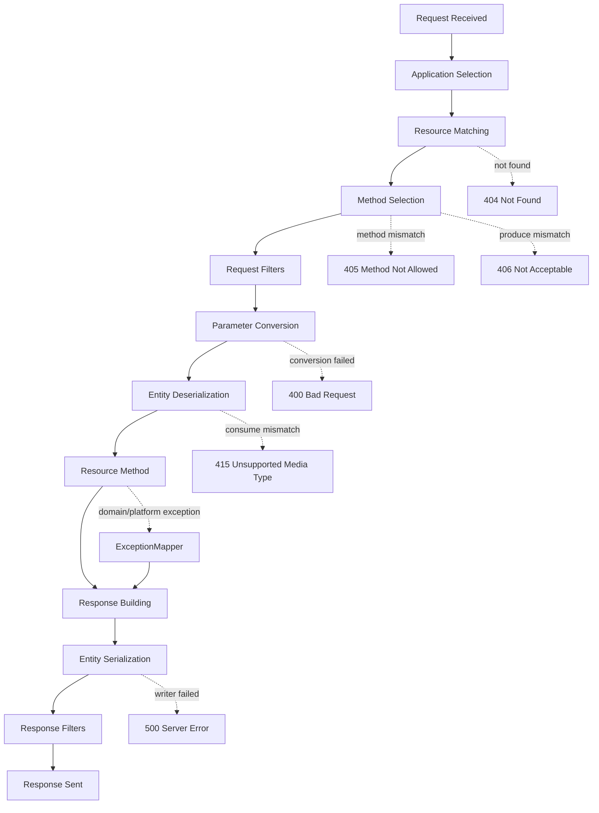
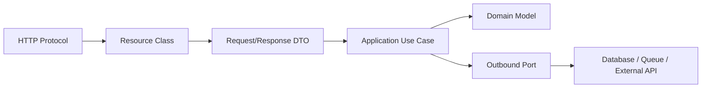
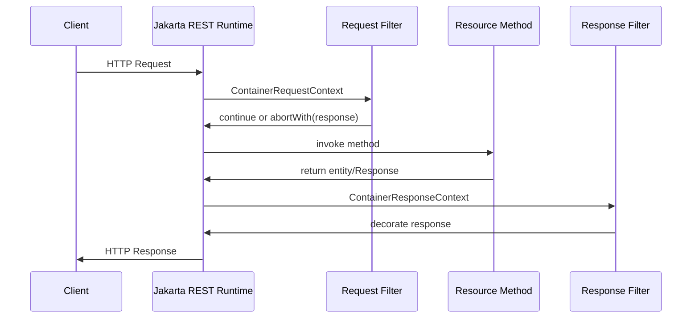
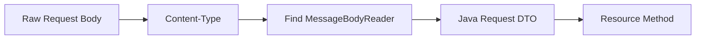
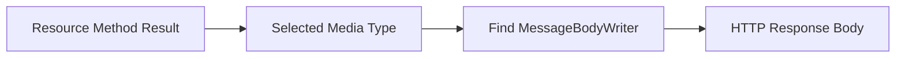
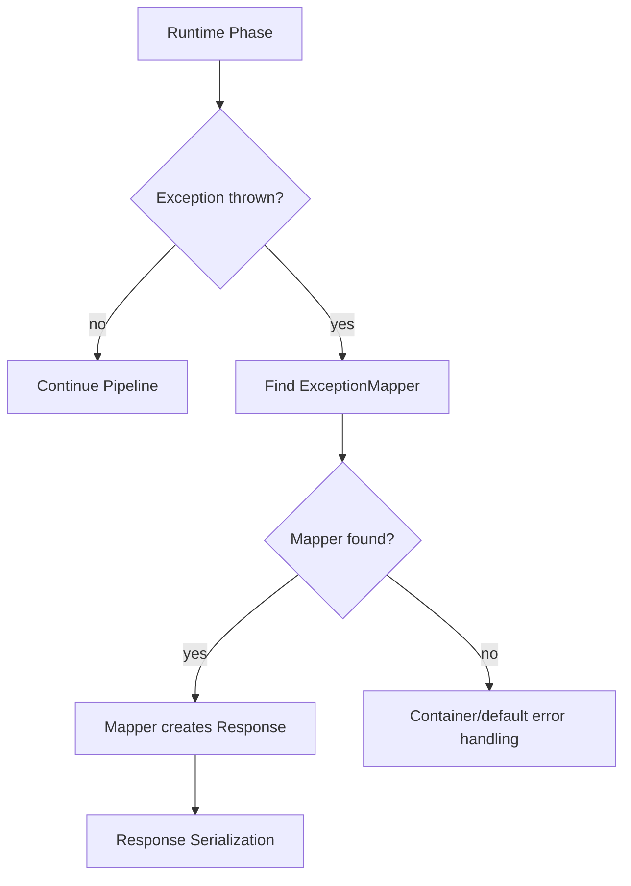
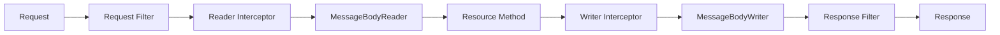
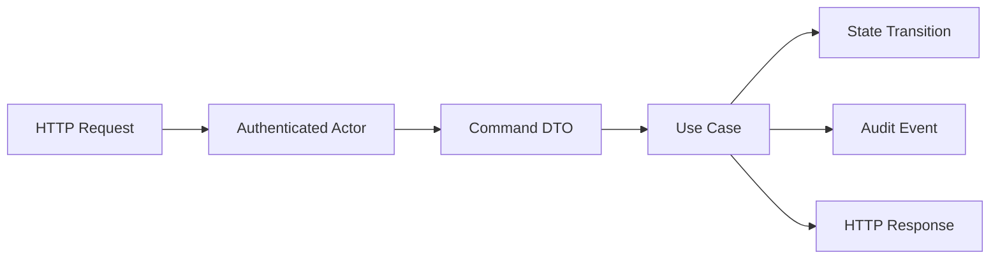

# Part 003 — REST Runtime Mental Model

Banyak developer belajar Jakarta REST dari annotation:

```java
@Path("/cases")
public class CaseResource {
    @GET
    public List<CaseSummaryResponse> listCases() {
        return List.of();
    }
}
```

Itu cukup untuk membuat demo. Tapi tidak cukup untuk mendesain API production.

Engineer yang kuat harus bisa membayangkan apa yang terjadi di runtime ketika request masuk:

```http
GET /case-management/api/cases/CASE-2026-001?include=evidence HTTP/1.1
Host: enforcement.example.internal
Accept: application/json
Authorization: Bearer eyJ...
X-Correlation-Id: req-8f7a
```

Pertanyaan yang harus bisa dijawab:

- aplikasi Jakarta REST mana yang menerima request ini?
- root resource class mana yang cocok?
- method mana yang dipilih?
- kapan filter berjalan?
- kapan parameter diinjeksi?
- kapan body dibaca?
- provider mana yang mengubah Java object menjadi JSON?
- jika exception dilempar, siapa yang menangani?
- jika response gagal diserialisasi, status apa yang keluar?
- apakah resource instance aman untuk concurrency?

Bagian ini membangun mental model tersebut.

---

## 1. Target Pembelajaran

Setelah part ini, kita ingin bisa melakukan tiga hal:

1. **Membaca request lifecycle secara deterministik**  
   Bukan menebak “framework akan handle”, tetapi tahu urutan besar proses runtime.

2. **Mendiagnosis failure berdasarkan fase pipeline**  
   `404`, `405`, `406`, `415`, `400`, `500` sering tampak seperti error biasa, padahal masing-masing biasanya berasal dari fase pipeline berbeda.

3. **Mendesain resource yang sesuai dengan runtime**  
   Resource class harus ditulis sebagai adapter protokol HTTP, bukan sebagai tempat menumpuk business logic, persistence logic, dan operational concern.

---

## 2. Big Picture: Jakarta REST sebagai Runtime Boundary

Jakarta REST bukan hanya library annotation. Jakarta REST adalah boundary antara:

- HTTP request/response,
- Java object,
- application container,
- provider pipeline,
- dependency injection,
- media type negotiation,
- error handling,
- extension points.

Mental model sederhananya:

```mermaid
flowchart LR
    Client[HTTP Client] --> Transport[HTTP Transport / Servlet Container]
    Transport --> App[Jakarta REST Application]
    App --> Match[Resource + Method Matching]
    Match --> Inbound[Inbound Filters]
    Inbound --> Params[Parameter + Context Injection]
    Params --> EntityRead[MessageBodyReader]
    EntityRead --> Resource[Resource Method]
    Resource --> EntityWrite[MessageBodyWriter]
    EntityWrite --> Outbound[Outbound Filters]
    Outbound --> Response[HTTP Response]
```



Namun diagram itu masih terlalu rapi. Dalam kasus nyata, exception bisa terjadi di hampir semua fase:



Runtime pipeline ini penting karena banyak bug API sebenarnya bukan bug business logic. Banyak bug terjadi sebelum resource method dipanggil.

Contoh:

- `@Path` salah → resource method tidak pernah dipanggil.
- `Content-Type` salah → body tidak pernah dibaca.
- `Accept` tidak cocok → method tidak dipilih.
- `MessageBodyReader` tidak tersedia → request gagal sebelum domain service dipanggil.
- `ExceptionMapper` terlalu generic → error contract menjadi tidak stabil.

---

## 3. Layer-Layer yang Terlibat

Untuk memahami Jakarta REST runtime, pisahkan empat layer ini.

| Layer | Tanggung Jawab | Contoh |
|---|---|---|
| HTTP transport/container | menerima TCP/HTTP, routing awal ke web app, servlet/filter, TLS termination bisa di luar | Servlet container, app server, embedded runtime |
| Jakarta REST application | menentukan root path aplikasi dan komponen yang tersedia | `Application`, `@ApplicationPath` |
| Resource/provider pipeline | memilih resource, inject parameter, membaca/menulis entity, filter, interceptor | `@Path`, `@GET`, `MessageBodyReader`, `ContainerRequestFilter` |
| Application/domain layer | menjalankan use case bisnis | `CaseService`, `EvidenceService`, repository, event publisher |

Boundary yang sehat:



Resource class tidak seharusnya menjadi “mini application service”. Resource class adalah adapter protokol:

- menerima input HTTP,
- memanggil use case,
- menerjemahkan result ke response HTTP,
- tidak menyimpan state mutable request antar-request,
- tidak menyembunyikan transaksi/persistence/authorization domain secara acak.

---

## 4. Request Path: Dari URL ke Resource Method

Misalkan aplikasi dideploy seperti ini:

```java
package com.example.caseapi;

import jakarta.ws.rs.ApplicationPath;
import jakarta.ws.rs.core.Application;

@ApplicationPath("/api")
public class CaseApiApplication extends Application {
}
```

Lalu resource:

```java
package com.example.caseapi.resource;

import jakarta.ws.rs.GET;
import jakarta.ws.rs.Path;
import jakarta.ws.rs.PathParam;
import jakarta.ws.rs.Produces;
import jakarta.ws.rs.core.MediaType;

@Path("/cases")
@Produces(MediaType.APPLICATION_JSON)
public class CaseResource {

    @GET
    @Path("/{caseId}")
    public CaseDetailResponse getCase(@PathParam("caseId") String caseId) {
        return new CaseDetailResponse(caseId, "OPEN");
    }
}
```

Request:

```http
GET /case-management/api/cases/CASE-2026-001 HTTP/1.1
Accept: application/json
```

Decompose path-nya:

| Bagian | Nilai | Pemilik |
|---|---:|---|
| context path | `/case-management` | web application / deployment |
| application path | `/api` | `@ApplicationPath` |
| root resource path | `/cases` | `@Path` pada class |
| method path | `/CASE-2026-001` | `@Path("/{caseId}")` pada method |

Resource method yang dipilih:

```java
CaseResource#getCase(String caseId)
```

Parameter yang diinjeksi:

```java
caseId = "CASE-2026-001"
```

Return value:

```java
new CaseDetailResponse("CASE-2026-001", "OPEN")
```

Lalu runtime mencari `MessageBodyWriter` yang dapat menulis `CaseDetailResponse` sebagai `application/json`.

---

## 5. Fase 1 — Application Selection

Sebelum resource matching terjadi, runtime harus tahu aplikasi Jakarta REST mana yang aktif.

Pada deployment tradisional, ada beberapa komponen path:

```text
/{context-path}/{application-path}/{resource-path}
```

Contoh:

```text
/case-management/api/cases/CASE-2026-001
```

Artinya:

```text
context-path      = /case-management
application-path  = /api
resource-path     = /cases/CASE-2026-001
```

`@ApplicationPath` bukan resource path. Ia adalah root path untuk seluruh aplikasi Jakarta REST dalam deployment tersebut.

Contoh buruk:

```java
@ApplicationPath("/cases")
public class CaseApiApplication extends Application {
}
```

Lalu:

```java
@Path("/cases")
public class CaseResource {
}
```

Hasil URL menjadi:

```text
/case-management/cases/cases
```

Ini sering terjadi ketika developer belum membedakan application path dan resource path.

Rule praktis:

- `@ApplicationPath("/api")` atau `@ApplicationPath("/rest")` untuk boundary aplikasi.
- `@Path("/cases")`, `@Path("/evidence")`, `@Path("/decisions")` untuk resource domain.
- Hindari memakai nama entity domain sebagai application path kecuali memang deployment hanya berisi satu resource family.

---

## 6. Fase 2 — Root Resource Matching

Root resource class adalah class Java yang menjadi entry point resource.

Contoh:

```java
@Path("/cases")
public class CaseResource {
}

@Path("/evidence")
public class EvidenceResource {
}

@Path("/officers")
public class OfficerResource {
}
```

Runtime akan mencocokkan sisa path setelah application path.

Request:

```http
GET /case-management/api/cases/CASE-2026-001
```

Sisa path untuk Jakarta REST:

```text
/cases/CASE-2026-001
```

Candidate root resource:

```java
@Path("/cases")
public class CaseResource
```

Bukan:

```java
@Path("/evidence")
public class EvidenceResource
```

### 6.1 Matching Bukan Sekadar String Equality

`@Path` mendukung template variable:

```java
@Path("/cases/{caseId}")
public class CaseResource {
}
```

Atau class-level + method-level composition:

```java
@Path("/cases")
public class CaseResource {
    @GET
    @Path("/{caseId}")
    public CaseDetailResponse getCase(@PathParam("caseId") String caseId) { ... }
}
```

Secara desain, opsi kedua biasanya lebih maintainable karena class-level path menunjukkan resource collection, method-level path menunjukkan operation pada item/subresource.

### 6.2 Overlapping Path

Contoh berbahaya:

```java
@Path("/cases/{caseId}")
public class CaseByIdResource { }

@Path("/cases/search")
public class CaseSearchResource { }
```

Request:

```http
GET /api/cases/search
```

Secara manusia, `search` tampak sebagai endpoint search. Secara template, `search` juga bisa menjadi `{caseId}`.

Runtime punya algoritma matching, tetapi desain yang terlalu ambigu tetap buruk. Jangan sengaja membuat URI yang bergantung pada “siapa menang matching”. Lebih baik eksplisit:

```text
GET /api/cases?status=OPEN&assignedTo=OFF-1
GET /api/case-searches/{searchId}
POST /api/case-searches
```

Atau jika benar-benar command-style:

```text
POST /api/cases/searches
```

---

## 7. Fase 3 — Resource Method Selection

Setelah root resource cocok, runtime memilih method berdasarkan kombinasi:

- HTTP method: `GET`, `POST`, `PUT`, `PATCH`, `DELETE`, `HEAD`, `OPTIONS`.
- method-level `@Path`.
- media type yang dikonsumsi: `@Consumes`.
- media type yang diproduksi: `@Produces`.
- request headers seperti `Accept` dan `Content-Type`.

Contoh:

```java
@Path("/cases")
@Produces(MediaType.APPLICATION_JSON)
public class CaseResource {

    @GET
    public List<CaseSummaryResponse> listCases() { ... }

    @POST
    @Consumes(MediaType.APPLICATION_JSON)
    public Response createCase(CreateCaseRequest request) { ... }

    @GET
    @Path("/{caseId}")
    public CaseDetailResponse getCase(@PathParam("caseId") String caseId) { ... }
}
```

Request ini cocok ke `listCases`:

```http
GET /api/cases
Accept: application/json
```

Request ini cocok ke `createCase`:

```http
POST /api/cases
Content-Type: application/json
Accept: application/json

{"subject":"Unlicensed operation"}
```

Request ini cocok ke `getCase`:

```http
GET /api/cases/CASE-2026-001
Accept: application/json
```

### 7.1 `404` vs `405`

Perbedaan penting:

| Status | Biasanya Berarti |
|---:|---|
| `404 Not Found` | tidak ada resource path yang cocok |
| `405 Method Not Allowed` | path cocok, tapi HTTP method tidak tersedia |

Contoh:

```java
@Path("/cases")
public class CaseResource {
    @GET
    public List<CaseSummaryResponse> listCases() { ... }
}
```

Request:

```http
POST /api/cases
```

Path `/cases` cocok. Tapi method `POST` tidak ada. Secara mental model, ini bukan resource missing. Ini operation missing.

### 7.2 `406` vs `415`

| Status | Penyebab Umum | Header Terkait |
|---:|---|---|
| `406 Not Acceptable` | server tidak bisa menghasilkan media type yang diminta client | `Accept` |
| `415 Unsupported Media Type` | server tidak bisa membaca media type body yang dikirim client | `Content-Type` |

Contoh:

```java
@POST
@Consumes(MediaType.APPLICATION_JSON)
@Produces(MediaType.APPLICATION_JSON)
public Response createCase(CreateCaseRequest request) { ... }
```

Request yang memicu `415`:

```http
POST /api/cases
Content-Type: text/plain
Accept: application/json

subject=Unlicensed operation
```

Request yang berpotensi memicu `406`:

```http
POST /api/cases
Content-Type: application/json
Accept: application/xml

{"subject":"Unlicensed operation"}
```

Kesalahan umum: mengira semua error input adalah `400`. Padahal mismatch media type adalah error negosiasi/protokol.

---

## 8. Fase 4 — Request Filters

`ContainerRequestFilter` berjalan sebelum resource method dieksekusi.

Ada dua jenis besar:

1. **Pre-matching filter**  
   Berjalan sebelum resource matching selesai. Biasanya untuk hal sangat awal seperti request normalization atau method override. Gunakan dengan sangat hati-hati.

2. **Post-matching filter**  
   Berjalan setelah resource/method diketahui. Cocok untuk authorization, audit metadata, correlation context, policy enforcement.

Contoh filter correlation ID:

```java
package com.example.caseapi.infrastructure.http;

import java.io.IOException;
import java.util.UUID;

import jakarta.annotation.Priority;
import jakarta.ws.rs.Priorities;
import jakarta.ws.rs.container.ContainerRequestContext;
import jakarta.ws.rs.container.ContainerRequestFilter;
import jakarta.ws.rs.container.ContainerResponseContext;
import jakarta.ws.rs.container.ContainerResponseFilter;
import jakarta.ws.rs.ext.Provider;

@Provider
@Priority(Priorities.HEADER_DECORATOR)
public class CorrelationIdFilter implements ContainerRequestFilter, ContainerResponseFilter {

    public static final String HEADER = "X-Correlation-Id";
    public static final String PROPERTY = "correlationId";

    @Override
    public void filter(ContainerRequestContext requestContext) throws IOException {
        String correlationId = requestContext.getHeaderString(HEADER);
        if (correlationId == null || correlationId.isBlank()) {
            correlationId = UUID.randomUUID().toString();
        }
        requestContext.setProperty(PROPERTY, correlationId);
    }

    @Override
    public void filter(ContainerRequestContext requestContext,
                       ContainerResponseContext responseContext) throws IOException {
        Object correlationId = requestContext.getProperty(PROPERTY);
        if (correlationId != null) {
            responseContext.getHeaders().putSingle(HEADER, correlationId.toString());
        }
    }
}
```

Mental model:



Request filter bisa menghentikan pipeline:

```java
requestContext.abortWith(
    Response.status(Response.Status.UNAUTHORIZED)
        .entity(new ErrorResponse("AUTHENTICATION_REQUIRED"))
        .build()
);
```

Ini penting. Jika filter melakukan `abortWith`, resource method tidak dipanggil.

Anti-pattern:

```java
@Provider
public class BusinessRuleFilter implements ContainerRequestFilter {
    @Override
    public void filter(ContainerRequestContext ctx) {
        // Jangan taruh business process besar di sini.
        // Filter adalah cross-cutting boundary, bukan use-case layer.
    }
}
```

Filter cocok untuk:

- correlation ID,
- authentication metadata extraction,
- coarse authorization boundary,
- request size policy,
- audit envelope,
- header normalization,
- tenant context extraction.

Filter buruk untuk:

- create case,
- approve decision,
- mutate evidence,
- orchestrate workflow,
- call many repositories,
- hide domain branching.

---

## 9. Fase 5 — Parameter Injection

Setelah method dipilih, runtime mengisi parameter dari berbagai sumber:

```java
@GET
@Path("/{caseId}/events")
public List<CaseEventResponse> listEvents(
        @PathParam("caseId") String caseId,
        @QueryParam("type") String type,
        @HeaderParam("X-Tenant-Id") String tenantId,
        @Context jakarta.ws.rs.core.UriInfo uriInfo
) {
    ...
}
```

Sumber parameter:

| Annotation | Sumber |
|---|---|
| `@PathParam` | path template |
| `@QueryParam` | query string |
| `@HeaderParam` | HTTP header |
| `@CookieParam` | cookie |
| `@MatrixParam` | matrix parameter path segment |
| `@FormParam` | form body |
| `@BeanParam` | grouping beberapa parameter |
| `@Context` | runtime context object |

### 9.1 Parameter Conversion

Jika parameter bertipe non-String, runtime akan mencoba konversi.

```java
@GET
public List<CaseSummaryResponse> listCases(
        @QueryParam("limit") @DefaultValue("50") int limit
) {
    ...
}
```

Request valid:

```http
GET /api/cases?limit=25
```

Request bermasalah:

```http
GET /api/cases?limit=abc
```

Ini gagal sebelum business logic berjalan. Jangan tangani ini dengan `try/catch` di resource method karena method tidak akan dipanggil jika conversion gagal.

### 9.2 Jangan Menjadikan Parameter Injection sebagai Domain Validation

Contoh buruk:

```java
@GET
public List<CaseSummaryResponse> listCases(
        @QueryParam("status") String status,
        @QueryParam("assignedTo") String assignedTo,
        @QueryParam("createdAfter") String createdAfter
) {
    if (!List.of("OPEN", "CLOSED").contains(status)) {
        throw new BadRequestException();
    }
    ...
}
```

Lebih baik buat boundary object:

```java
public class ListCasesQuery {
    @QueryParam("status")
    private String status;

    @QueryParam("assignedTo")
    private String assignedTo;

    @QueryParam("createdAfter")
    private String createdAfter;

    public CaseSearchCriteria toCriteria() {
        return CaseSearchCriteria.builder()
            .status(CaseStatus.parse(status))
            .assignedTo(assignedTo)
            .createdAfter(DateParsers.parseInstant(createdAfter))
            .build();
    }
}
```

Lalu:

```java
@GET
public List<CaseSummaryResponse> listCases(@BeanParam ListCasesQuery query) {
    return service.listCases(query.toCriteria());
}
```

`@BeanParam` membuat method signature lebih stabil dan lebih mudah berkembang.

---

## 10. Fase 6 — Entity Body Reading

Untuk method yang menerima body:

```java
@POST
@Consumes(MediaType.APPLICATION_JSON)
@Produces(MediaType.APPLICATION_JSON)
public Response createCase(CreateCaseRequest request) {
    ...
}
```

Runtime harus melakukan:

```text
HTTP body bytes -> Java object CreateCaseRequest
```

Yang melakukan ini adalah `MessageBodyReader`.

Secara mental model:



Jika `Content-Type: application/json`, runtime mencari provider yang mampu membaca JSON menjadi `CreateCaseRequest`.

Jika provider tidak ada, atau body tidak valid, method tidak akan berjalan.

### 10.1 Kapan Body Dibaca?

Body dibaca sebelum resource method menerima parameter entity.

Contoh:

```java
public Response createCase(CreateCaseRequest request) { ... }
```

Parameter `request` sudah berupa object ketika method dipanggil. Jika JSON malformed, method tidak dipanggil.

### 10.2 DTO Harus Menjadi Boundary, Bukan Entity Persistence

Buruk:

```java
@POST
public Response createCase(CaseEntity entity) {
    repository.persist(entity);
    return Response.ok().build();
}
```

Masalah:

- field persistence bocor ke API,
- client bisa mengisi field internal,
- validasi tidak eksplisit,
- perubahan database menjadi breaking API change,
- serialization annotation bercampur persistence annotation,
- audit trail sulit dikontrol.

Lebih baik:

```java
public record CreateCaseRequest(
    String subject,
    String allegationType,
    String reportedBy,
    String narrative
) {}
```

Lalu mapping ke command:

```java
CreateCaseCommand command = new CreateCaseCommand(
    request.subject(),
    request.allegationType(),
    request.reportedBy(),
    request.narrative(),
    authenticatedOfficerId
);
```

---

## 11. Fase 7 — Resource Method Execution

Resource method adalah titik transisi dari protocol world ke application world.

Contoh sehat:

```java
@Path("/cases")
@Consumes(MediaType.APPLICATION_JSON)
@Produces(MediaType.APPLICATION_JSON)
public class CaseResource {

    private final CaseApplicationService service;

    public CaseResource(CaseApplicationService service) {
        this.service = service;
    }

    @POST
    public Response createCase(CreateCaseRequest request, @Context UriInfo uriInfo) {
        CreatedCase result = service.createCase(request.toCommand());

        URI location = uriInfo.getAbsolutePathBuilder()
            .path(result.caseId())
            .build();

        return Response.created(location)
            .entity(CreatedCaseResponse.from(result))
            .build();
    }
}
```

Resource method melakukan:

- mengambil DTO request,
- mengambil context HTTP yang diperlukan,
- memanggil application service,
- membangun response HTTP.

Resource method tidak melakukan:

- query SQL langsung,
- transaksi manual yang tersebar,
- parsing JSON manual,
- audit persistence manual tanpa abstraction,
- retry outbound call secara tersembunyi,
- mengubah global state.

### 11.1 Resource Lifecycle dan State

Secara default, resource class instance dibuat per request. Namun runtime/container/CDI dapat memperkenalkan lifecycle berbeda, misalnya singleton provider, CDI scoped bean, atau object dari `Application#getSingletons()`.

Karena itu, rule production yang aman:

- anggap provider/filter/interceptor bisa dipakai lintas request,
- jangan simpan request-specific mutable state di field instance,
- gunakan local variable atau request context,
- gunakan dependency yang thread-safe atau scoped dengan benar,
- jangan mengandalkan constructor untuk semua injection jika portabilitas lintas runtime penting.

Buruk:

```java
@Path("/cases")
public class CaseResource {
    private String currentCaseId; // bahaya jika lifecycle berubah

    @GET
    @Path("/{caseId}")
    public CaseDetailResponse getCase(@PathParam("caseId") String caseId) {
        this.currentCaseId = caseId;
        return service.getCase(currentCaseId);
    }
}
```

Baik:

```java
@GET
@Path("/{caseId}")
public CaseDetailResponse getCase(@PathParam("caseId") String caseId) {
    return service.getCase(caseId);
}
```

---

## 12. Fase 8 — Response Building

Resource method bisa return beberapa bentuk:

```java
public CaseDetailResponse getCase(...) { ... }
public Response createCase(...) { ... }
public void deleteCase(...) { ... }
```

Untuk API production, `Response` sering lebih eksplisit karena kita perlu mengontrol:

- status code,
- headers,
- entity,
- `Location`,
- `ETag`,
- cache headers,
- content negotiation behavior,
- no-content response.

Contoh:

```java
return Response.status(Response.Status.ACCEPTED)
    .header("X-Correlation-Id", correlationId)
    .entity(new AcceptedCommandResponse(commandId))
    .build();
```

Namun jangan overuse `Response` jika method hanya query sederhana dan tidak butuh metadata HTTP khusus.

```java
@GET
@Path("/{caseId}")
public CaseDetailResponse getCase(@PathParam("caseId") String caseId) {
    return CaseDetailResponse.from(service.getCase(caseId));
}
```

Prinsip:

- Query sederhana boleh return DTO.
- Mutation/creation/deletion lebih baik return `Response` agar status dan header eksplisit.
- Error jangan dibangun tersebar di semua method; gunakan exception mapper.

---

## 13. Fase 9 — Entity Body Writing

Setelah resource method return entity, runtime harus melakukan:

```text
Java object -> response bytes
```

Yang melakukan ini adalah `MessageBodyWriter`.



Jika method return:

```java
public CaseDetailResponse getCase(...) { ... }
```

Dan response media type adalah:

```text
application/json
```

Runtime mencari writer untuk:

```text
CaseDetailResponse + application/json
```

Jika tidak ada writer, request bisa gagal setelah business logic berhasil. Ini menyakitkan karena domain action mungkin sudah terjadi, tetapi response gagal ditulis.

Karena itu mutation endpoint harus didesain hati-hati:

```java
@POST
public Response createCase(CreateCaseRequest request) {
    CreatedCase created = service.createCase(...);
    return Response.created(...)
        .entity(CreatedCaseResponse.from(created))
        .build();
}
```

Pastikan `CreatedCaseResponse` benar-benar serializable oleh provider JSON yang dipakai.

### 13.1 Serialization Failure Adalah Production Risk

Contoh response object yang bermasalah:

```java
public class CaseDetailResponse {
    private final String caseId;
    private final Instant createdAt;

    public CaseDetailResponse(String caseId, Instant createdAt) {
        this.caseId = caseId;
        this.createdAt = createdAt;
    }

    // tidak ada accessor yang dikenali provider tertentu
}
```

Tergantung provider JSON, ini bisa gagal atau menghasilkan `{}`.

Lebih stabil:

```java
public record CaseDetailResponse(
    String caseId,
    String status,
    Instant createdAt
) {}
```

Tapi tetap cek provider JSON dan konfigurasi time serialization.

---

## 14. Fase 10 — Response Filters

`ContainerResponseFilter` berjalan setelah resource method menghasilkan response, tetapi sebelum response dikirim.

Cocok untuk:

- correlation ID response header,
- security headers,
- cache policy default,
- audit envelope,
- metrics tagging,
- deprecation warning header,
- API version metadata.

Contoh security header filter:

```java
@Provider
public class SecurityHeaderFilter implements ContainerResponseFilter {
    @Override
    public void filter(ContainerRequestContext requestContext,
                       ContainerResponseContext responseContext) {
        responseContext.getHeaders().putSingle("X-Content-Type-Options", "nosniff");
        responseContext.getHeaders().putSingle("X-Frame-Options", "DENY");
    }
}
```

Jangan gunakan response filter untuk mengubah hasil domain secara besar-besaran. Jika response filter perlu tahu detail business state terlalu banyak, kemungkinan concern-nya salah tempat.

---

## 15. Exception Flow

Exception bisa terjadi pada fase mana pun:

- resource matching,
- parameter conversion,
- entity reading,
- resource method,
- entity writing,
- filter/interceptor.

Jakarta REST menyediakan `ExceptionMapper<T>` untuk memetakan exception menjadi response.

Contoh:

```java
@Provider
public class CaseNotFoundMapper implements ExceptionMapper<CaseNotFoundException> {
    @Override
    public Response toResponse(CaseNotFoundException exception) {
        return Response.status(Response.Status.NOT_FOUND)
            .entity(new ProblemResponse(
                "CASE_NOT_FOUND",
                "Case was not found",
                exception.caseId()
            ))
            .type(MediaType.APPLICATION_JSON)
            .build();
    }
}
```

Mental model:



Top-tier design tidak hanya bertanya “exception apa yang dilempar?”, tetapi:

- apakah exception ini domain error atau platform error?
- apakah client boleh melihat detailnya?
- apakah status code stabil?
- apakah error code machine-readable?
- apakah correlation ID tersedia?
- apakah response shape konsisten?
- apakah mapper terlalu generic?

### 15.1 Jangan Menangkap Semua Error di Resource Method

Buruk:

```java
@POST
public Response createCase(CreateCaseRequest request) {
    try {
        return Response.ok(service.createCase(request.toCommand())).build();
    } catch (Exception e) {
        return Response.serverError().build();
    }
}
```

Masalah:

- error contract tersebar,
- observability buruk,
- domain exception kehilangan makna,
- client tidak bisa membedakan validation/domain/conflict/not-found,
- status code menjadi kasar.

Lebih baik:

```java
@POST
public Response createCase(CreateCaseRequest request) {
    CreatedCase created = service.createCase(request.toCommand());
    return Response.created(locationFor(created)).entity(CreatedCaseResponse.from(created)).build();
}
```

Lalu mapper:

```java
@Provider
public class DomainExceptionMapper implements ExceptionMapper<DomainException> {
    @Override
    public Response toResponse(DomainException exception) {
        return Response.status(mapStatus(exception))
            .entity(ProblemResponse.from(exception))
            .type(MediaType.APPLICATION_JSON)
            .build();
    }
}
```

---

## 16. Interceptors vs Filters

Filter bekerja pada request/response context. Interceptor bekerja lebih dekat ke entity stream.

| Komponen | Fokus | Contoh Use Case |
|---|---|---|
| `ContainerRequestFilter` | request metadata sebelum method | auth, correlation, tenant |
| `ContainerResponseFilter` | response metadata sebelum dikirim | security header, cache header |
| `ReaderInterceptor` | proses pembacaan entity body | decrypt, decompress, audit raw body terbatas |
| `WriterInterceptor` | proses penulisan entity body | compress, sign response, wrap stream |

Mental model:



Rule praktis:

- Gunakan filter untuk header/context/policy.
- Gunakan interceptor untuk entity stream concern.
- Jangan gunakan interceptor untuk business logic.
- Hindari membaca body di request filter kecuali benar-benar paham konsekuensinya terhadap stream consumption.

---

## 17. Request Lifecycle Walkthrough: Create Case

Kita gunakan endpoint realistic.

```java
@Path("/cases")
@Consumes(MediaType.APPLICATION_JSON)
@Produces(MediaType.APPLICATION_JSON)
public class CaseResource {

    private final CaseApplicationService service;

    public CaseResource(CaseApplicationService service) {
        this.service = service;
    }

    @POST
    public Response createCase(CreateCaseRequest request, @Context UriInfo uriInfo) {
        CreatedCase created = service.createCase(request.toCommand());

        URI location = uriInfo.getAbsolutePathBuilder()
            .path(created.caseId())
            .build();

        return Response.created(location)
            .entity(CreatedCaseResponse.from(created))
            .build();
    }
}
```

Request:

```http
POST /case-management/api/cases HTTP/1.1
Content-Type: application/json
Accept: application/json
X-Correlation-Id: req-123

{
  "subject": "Unlicensed activity",
  "allegationType": "LICENSE_VIOLATION",
  "reportedBy": "OFFICER-17",
  "narrative": "Observed repeated activity without valid license."
}
```

Runtime path:

1. Container menerima HTTP request.
2. Context path `/case-management` menentukan web app.
3. `@ApplicationPath("/api")` menentukan Jakarta REST application.
4. `@Path("/cases")` menentukan root resource.
5. `@POST` menentukan resource method.
6. `Content-Type: application/json` dicocokkan dengan `@Consumes`.
7. `Accept: application/json` dicocokkan dengan `@Produces`.
8. Request filter mengambil/menetapkan correlation ID.
9. `MessageBodyReader` membaca JSON menjadi `CreateCaseRequest`.
10. `UriInfo` diinjeksi.
11. Resource method memanggil `CaseApplicationService`.
12. Service membuat case dan mengembalikan result.
13. Resource method membangun `201 Created` + `Location`.
14. `MessageBodyWriter` menulis `CreatedCaseResponse` menjadi JSON.
15. Response filter menambahkan header.
16. Client menerima response.

Response:

```http
HTTP/1.1 201 Created
Content-Type: application/json
Location: /case-management/api/cases/CASE-2026-001
X-Correlation-Id: req-123

{
  "caseId": "CASE-2026-001",
  "status": "OPEN"
}
```

---

## 18. Debugging by Pipeline Phase

Ketika endpoint gagal, jangan langsung buka service method. Tanyakan dulu: request gagal di fase mana?

| Symptom | Kemungkinan Fase | Hal yang Dicek |
|---|---|---|
| `404` | application/resource matching | context path, `@ApplicationPath`, class `@Path`, method `@Path` |
| `405` | method selection | ada `@GET`/`@POST` yang sesuai? |
| `406` | response negotiation | `Accept`, `@Produces`, writer tersedia? |
| `415` | request entity negotiation | `Content-Type`, `@Consumes`, reader tersedia? |
| `400` sebelum method | parameter/entity conversion | path/query conversion, malformed JSON |
| `401/403` | filter/security layer | auth filter, role mapping, `SecurityContext` |
| `500` setelah service sukses | response serialization | DTO shape, JSON provider, circular reference |
| response header hilang | response filter | provider discovery, priority, name binding |
| method tidak kena log | request tidak mencapai resource | pre-matching filter, servlet mapping, path |

Diagnosis yang baik dimulai dari path decomposition:

```text
Full URL
= scheme + host + port
+ context path
+ application path
+ resource path
+ method path
+ query
```

Lalu cek negotiation:

```text
Request body?      -> Content-Type + @Consumes + MessageBodyReader
Response body?     -> Accept + @Produces + MessageBodyWriter
```

Lalu cek execution:

```text
Filters -> Parameter Injection -> Entity Read -> Resource Method -> Entity Write -> Response Filters
```

---

## 19. Production Invariants

Invariants yang harus dijaga saat menulis Jakarta REST resource:

### 19.1 Resource Method Harus Jelas Side Effect-nya

`GET` tidak boleh melakukan mutation domain.

Buruk:

```java
@GET
@Path("/{caseId}/mark-viewed")
public Response markViewed(@PathParam("caseId") String caseId) { ... }
```

Lebih baik:

```java
@POST
@Path("/{caseId}/view-events")
public Response recordView(@PathParam("caseId") String caseId) { ... }
```

Atau jika hanya analytics non-critical, jangan campurkan dengan domain state yang authoritative.

### 19.2 Resource Tidak Menyimpan Request State di Field

Gunakan local variable, context, atau request-scoped dependency.

### 19.3 Provider Global Harus Minimal dan Terprediksi

Provider global bisa mempengaruhi seluruh API. Jangan membuat provider yang diam-diam mengubah kontrak banyak endpoint.

### 19.4 Exception Mapper Harus Stabil

Error response adalah bagian dari API contract. Jangan membocorkan stack trace, SQL error, nama table, atau detail internal.

### 19.5 Serialization Harus Dites

Test tidak cukup memanggil method Java. Test harus melewati runtime minimal untuk memastikan provider JSON, status, header, dan body benar.

---

## 20. Mental Model untuk Regulatory / Case Management API

Dalam sistem enforcement atau case management, Jakarta REST resource sering menjadi boundary untuk aksi yang harus bisa dipertanggungjawabkan.

Contoh endpoint:

```http
POST /api/cases/{caseId}/escalations
POST /api/cases/{caseId}/evidence
POST /api/cases/{caseId}/decisions
POST /api/cases/{caseId}/state-transitions
```

Setiap mutation harus punya model:



Pertanyaan production:

- apakah actor identity tersedia sebelum use case?
- apakah idempotency diperlukan?
- apakah request body menjadi evidence?
- apakah failure response bisa diaudit?
- apakah transition invalid menghasilkan `409 Conflict` atau `422 Unprocessable Content` style response?
- apakah correlation ID mengikat log, audit event, dan outbound call?

Jakarta REST hanya memberi pipeline. Desain defensibility tetap tanggung jawab aplikasi.

---

## 21. Common Pitfalls

### 21.1 Menganggap Annotation Adalah Arsitektur

Annotation hanya mapping. Arsitektur ada pada boundary, contract, lifecycle, dan failure model.

### 21.2 Menaruh Business Logic di Filter

Filter menggoda karena berjalan otomatis. Tapi justru karena otomatis, filter harus dipakai untuk cross-cutting concern yang benar-benar cross-cutting.

### 21.3 Mengembalikan Persistence Entity

Ini mencampur API contract dengan storage model.

### 21.4 Tidak Mengontrol Media Type

Endpoint tanpa `@Produces`/`@Consumes` yang jelas sering menghasilkan behavior yang berbeda antar-runtime atau antar-provider.

### 21.5 Tidak Memahami `404` vs `405` vs `406` vs `415`

Semua tampak seperti “endpoint error”, padahal masing-masing menunjukkan fase berbeda.

### 21.6 Mengandalkan Runtime-Specific Magic

Beberapa implementation memberi fitur tambahan. Boleh digunakan, tapi isolasi agar tidak merusak portabilitas.

---

## 22. Practice: Trace Request Lifecycle

Ambil endpoint ini:

```java
@Path("/cases")
@Produces(MediaType.APPLICATION_JSON)
public class CaseResource {

    @GET
    @Path("/{caseId}/evidence")
    public List<EvidenceResponse> listEvidence(
        @PathParam("caseId") String caseId,
        @QueryParam("type") String type
    ) {
        return service.listEvidence(caseId, type);
    }
}
```

Trace request ini:

```http
GET /case-management/api/cases/CASE-1/evidence?type=PHOTO
Accept: application/json
```

Jawaban yang harus bisa dibuat:

```text
context path      = /case-management
application path  = /api
root resource     = /cases
method path       = /{caseId}/evidence
caseId            = CASE-1
query type        = PHOTO
http method       = GET
produces          = application/json
reader needed?    = no request entity
writer needed?    = yes, List<EvidenceResponse> -> JSON
```

Lalu ubah request:

```http
POST /case-management/api/cases/CASE-1/evidence?type=PHOTO
Accept: application/json
```

Prediksi:

```text
Path likely matches, method does not -> 405 Method Not Allowed
```

Lalu ubah:

```http
GET /case-management/api/cases/CASE-1/evidence?type=PHOTO
Accept: application/xml
```

Prediksi:

```text
Resource/method matches, but response media type may not -> 406 Not Acceptable
```

Latihan seperti ini membangun kemampuan diagnosis yang jauh lebih bernilai daripada menghafal annotation.

---

## 23. Ringkasan

Jakarta REST runtime bisa dipahami sebagai pipeline:

```text
HTTP request
-> container/application selection
-> resource matching
-> method selection
-> filters
-> parameter injection
-> entity reading
-> resource method
-> response building
-> entity writing
-> response filters
-> HTTP response
```

Mental model utama:

- `@ApplicationPath` menentukan root aplikasi REST.
- `@Path` pada class/method menentukan resource matching.
- HTTP method annotation menentukan operation selection.
- `@Consumes` dan `Content-Type` menentukan cara membaca request body.
- `@Produces` dan `Accept` menentukan cara menulis response body.
- Filter menangani cross-cutting request/response concern.
- Interceptor menangani entity stream concern.
- `MessageBodyReader` dan `MessageBodyWriter` mengubah bytes ↔ Java object.
- `ExceptionMapper` mengubah exception menjadi response contract.

Jika kita memahami pipeline ini, kita bisa mendesain endpoint secara sadar, bukan hanya berharap runtime melakukan hal yang benar.

---

## 24. Checklist Cepat

Sebelum menulis endpoint baru, jawab:

- Apa full URL decomposition-nya?
- Resource collection/item apa yang direpresentasikan?
- HTTP method sudah benar secara semantik?
- Request body perlu `@Consumes` apa?
- Response perlu `@Produces` apa?
- Status code sukses apa yang benar?
- Error apa saja yang mungkin dan mapper mana yang menangani?
- Apakah filter/interceptor yang ada akan mempengaruhi endpoint ini?
- Apakah DTO aman untuk serialization/deserialization?
- Apakah mutation perlu idempotency key?
- Apakah observability/correlation/audit sudah tersedia?

---

## 25. Referensi Resmi

- Jakarta RESTful Web Services 4.0 Specification: `https://jakarta.ee/specifications/restful-ws/4.0/jakarta-restful-ws-spec-4.0`
- Jakarta EE Tutorial — Building RESTful Web Services with Jakarta REST: `https://jakarta.ee/learn/docs/jakartaee-tutorial/current/websvcs/rest/rest.html`
- Jakarta RESTful Web Services Explained: `https://jakarta.ee/learn/specification-guides/restful-web-services-explained/`
