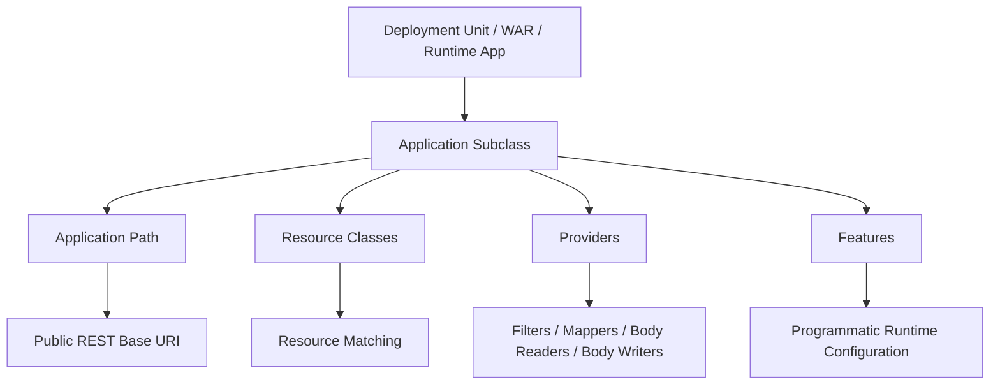

# Part 004 — Application Configuration

Di part sebelumnya kita melihat request lifecycle. Sekarang kita mundur satu langkah: bagaimana runtime tahu bahwa aplikasi Jakarta REST kita ada?

Konfigurasi aplikasi tampak kecil:

```java
@ApplicationPath("/api")
public class CaseApiApplication extends Application {
}
```

Namun baris kecil ini menentukan:

- root path semua endpoint REST,
- boundary deployment,
- discovery resource/provider,
- apakah komponen didaftarkan otomatis atau eksplisit,
- bagaimana endpoint terlihat dari luar,
- bagaimana aplikasi dimigrasikan antar-runtime.

Dalam production, kesalahan konfigurasi aplikasi sering menghasilkan bug yang membingungkan:

- endpoint `404` padahal class sudah ada,
- provider tidak aktif,
- filter jalan di endpoint yang salah,
- dua aplikasi REST saling overlap path,
- deployment lokal jalan tapi container production tidak,
- package scanning lambat atau tidak sesuai ekspektasi,
- resource tidak portable karena mengandalkan fitur implementation-specific.

Part ini membahas `Application`, `@ApplicationPath`, discovery, deployment boundary, dan convention yang sehat.

---

## 1. Mental Model: Application sebagai Root Registry

`jakarta.ws.rs.core.Application` adalah objek konfigurasi untuk sebuah aplikasi Jakarta REST.

Secara konseptual:



`Application` bukan resource. Ia adalah registry/configuration boundary.

Minimal configuration:

```java
package com.example.caseapi;

import jakarta.ws.rs.ApplicationPath;
import jakarta.ws.rs.core.Application;

@ApplicationPath("/api")
public class CaseApiApplication extends Application {
}
```

Dengan resource:

```java
package com.example.caseapi.resource;

import jakarta.ws.rs.GET;
import jakarta.ws.rs.Path;

@Path("/health")
public class HealthResource {
    @GET
    public String health() {
        return "ok";
    }
}
```

Jika deployment context path adalah:

```text
/case-management
```

Maka endpoint menjadi:

```text
/case-management/api/health
```

Path decomposition:

```text
/case-management/api/health
 └────────────┘ └──┘ └────┘
  context path   app  resource path
```

---

## 2. `@ApplicationPath`: Root Path, Bukan Resource Path

`@ApplicationPath` menetapkan base URI untuk seluruh aplikasi REST.

Contoh sehat:

```java
@ApplicationPath("/api")
public class CaseApiApplication extends Application {
}
```

Resource:

```java
@Path("/cases")
public class CaseResource {
}

@Path("/evidence")
public class EvidenceResource {
}
```

Endpoint:

```text
/api/cases
/api/evidence
```

Contoh yang sering salah:

```java
@ApplicationPath("/cases")
public class CaseApiApplication extends Application {
}

@Path("/cases")
public class CaseResource {
}
```

Endpoint menjadi:

```text
/cases/cases
```

Kesalahan ini terjadi karena developer menganggap application path sama dengan resource path.

Rule praktis:

| Elemen | Pertanyaan | Contoh |
|---|---|---|
| context path | aplikasi ini dideploy sebagai apa? | `/case-management` |
| application path | root API Jakarta REST apa? | `/api` |
| resource path | resource domain apa? | `/cases` |
| method path | subresource/action apa? | `/{caseId}/evidence` |

---

## 3. Base Path Convention untuk Production

Tidak ada satu convention universal. Tapi beberapa pilihan umum:

### 3.1 `/api`

```java
@ApplicationPath("/api")
```

Cocok untuk aplikasi yang hanya memiliki satu API utama.

Endpoint:

```text
/case-management/api/cases
```

Kelebihan:

- sederhana,
- mudah diingat,
- cocok untuk internal service.

Kekurangan:

- versioning perlu strategi lain,
- jika ada public/internal API dalam deployment sama, perlu segment tambahan.

### 3.2 `/api/v1`

```java
@ApplicationPath("/api/v1")
```

Kelebihan:

- version terlihat eksplisit.

Kekurangan:

- seluruh app path terkunci ke version,
- migrasi ke `/api/v2` sering mendorong duplikasi aplikasi,
- tidak semua perubahan butuh URI version.

### 3.3 `/rest`

```java
@ApplicationPath("/rest")
```

Historis dan masih ditemukan di aplikasi lama.

Kelemahan:

- menamai teknologi, bukan kontrak.
- kurang informatif bagi client.

### 3.4 `/internal/api`

```java
@ApplicationPath("/internal/api")
```

Cocok bila deployment mengekspos boundary internal yang tidak dimaksudkan untuk public client.

Namun security jangan hanya mengandalkan path. Path adalah convention, bukan security boundary.

### 3.5 Rekomendasi Seri Ini

Untuk mayoritas contoh:

```java
@ApplicationPath("/api")
```

Versioning akan dibahas di contract design. Kita tidak akan default ke `/v1` di semua endpoint karena versioning adalah keputusan kontrak, bukan dekorasi path otomatis.

---

## 4. Discovery Mode: Otomatis vs Eksplisit

Ada dua cara besar mendaftarkan resource/provider:

1. **Auto-discovery/scanning**  
   Runtime menemukan class yang diberi annotation seperti `@Path` dan `@Provider`.

2. **Explicit registration**  
   `Application` override `getClasses()` atau `getSingletons()` untuk menentukan komponen yang dipublish.

### 4.1 Auto-Discovery

```java
@ApplicationPath("/api")
public class CaseApiApplication extends Application {
}
```

Resource/provider:

```java
@Path("/cases")
public class CaseResource { }

@Provider
public class DomainExceptionMapper implements ExceptionMapper<DomainException> { }
```

Jika `getClasses()` dan `getSingletons()` tidak dioverride atau mengembalikan collection kosong, runtime pada deployment web app akan melakukan discovery terhadap root resource class dan provider dalam aplikasi.

Kelebihan:

- sedikit boilerplate,
- cocok untuk aplikasi kecil-menengah,
- mudah onboarding.

Kekurangan:

- boundary aplikasi kurang eksplisit,
- resource/provider tidak sengaja bisa ikut terpublish,
- startup scanning bisa menjadi concern di aplikasi besar,
- sulit membaca surface API hanya dari `Application` class.

### 4.2 Explicit Class Registration

```java
@ApplicationPath("/api")
public class CaseApiApplication extends Application {

    @Override
    public Set<Class<?>> getClasses() {
        return Set.of(
            CaseResource.class,
            EvidenceResource.class,
            HealthResource.class,
            DomainExceptionMapper.class,
            CorrelationIdFilter.class
        );
    }
}
```

Kelebihan:

- API surface eksplisit,
- mudah review,
- mencegah accidental exposure,
- cocok untuk regulated system.

Kekurangan:

- perlu update registry ketika menambah resource/provider,
- bisa lupa mendaftarkan mapper/filter,
- interaksi dengan CDI/runtime-specific discovery harus dipahami.

### 4.3 Explicit Singleton Registration

```java
@ApplicationPath("/api")
public class CaseApiApplication extends Application {

    private final Set<Object> singletons = Set.of(
        new HealthResource(),
        new DomainExceptionMapper()
    );

    @Override
    public Set<Object> getSingletons() {
        return singletons;
    }
}
```

Gunakan dengan hati-hati.

Singleton berarti object instance bisa melayani banyak request. Jangan simpan mutable request state di field.

Buruk:

```java
public class HealthResource {
    private int counter; // shared mutable state jika singleton

    @GET
    public String health() {
        counter++;
        return "ok";
    }
}
```

Lebih aman:

```java
public class HealthResource {
    @GET
    public String health() {
        return "ok";
    }
}
```

Atau gunakan dependency thread-safe/scoped dengan benar.

---

## 5. Auto-Discovery vs Explicit Registration: Decision Matrix

| Konteks | Rekomendasi |
|---|---|
| demo/tutorial | auto-discovery |
| small internal service | auto-discovery dengan package discipline |
| medium production service | explicit registration atau auto-discovery + tests |
| regulated/case-management API | explicit registration sangat disarankan |
| multi-module monolith | explicit registration per module/API boundary |
| library provider | service loading atau documented feature registration |
| high-startup-sensitive runtime | explicit/build-time registration jika runtime mendukung |

Untuk sistem regulated, eksplisit biasanya lebih baik karena API surface harus bisa direview.

Contoh registry yang reviewable:

```java
@ApplicationPath("/api")
public class EnforcementApiApplication extends Application {

    @Override
    public Set<Class<?>> getClasses() {
        return Set.of(
            // Resources
            CaseResource.class,
            EvidenceResource.class,
            DecisionResource.class,
            EscalationResource.class,
            CaseStateTransitionResource.class,

            // Providers
            ProblemExceptionMapper.class,
            DomainExceptionMapper.class,
            JsonMappingExceptionMapper.class,

            // Filters
            CorrelationIdFilter.class,
            AuditContextFilter.class,
            SecurityHeaderFilter.class
        );
    }
}
```

Review pertanyaan:

- Resource apa yang dipublish?
- Mapper apa yang aktif?
- Filter apa yang global?
- Ada provider yang terlalu luas efeknya?
- Ada endpoint internal yang tidak sengaja ikut expose?

---

## 6. `Application` sebagai Configuration Boundary

`Application` juga bisa expose property:

```java
@ApplicationPath("/api")
public class CaseApiApplication extends Application {

    @Override
    public Map<String, Object> getProperties() {
        return Map.of(
            "caseapi.apiName", "case-management",
            "caseapi.contractVersion", "2026-06"
        );
    }
}
```

Provider dapat mengakses configuration melalui context object seperti `Configuration`.

Namun hati-hati: jangan menjadikan `Application` sebagai service locator manual.

Buruk:

```java
public class CaseApiApplication extends Application {
    public static CaseService caseService;
    public static EvidenceService evidenceService;
}
```

Masalah:

- global mutable state,
- sulit dites,
- lifecycle tidak jelas,
- dependency injection rusak,
- concurrency dan cleanup buruk.

Lebih baik gunakan CDI atau mekanisme DI runtime:

```java
@Path("/cases")
public class CaseResource {

    @Inject
    CaseApplicationService service;
}
```

Atau constructor injection jika runtime/framework yang dipakai mendukung dan portabilitasnya sudah dipahami.

---

## 7. Multiple Jakarta REST Applications dalam Satu Deployment

Satu deployment dapat memiliki lebih dari satu subclass `Application`, masing-masing dengan `@ApplicationPath` berbeda.

Contoh:

```java
@ApplicationPath("/public-api")
public class PublicApiApplication extends Application {
    @Override
    public Set<Class<?>> getClasses() {
        return Set.of(PublicCaseResource.class, PublicProblemMapper.class);
    }
}

@ApplicationPath("/internal-api")
public class InternalApiApplication extends Application {
    @Override
    public Set<Class<?>> getClasses() {
        return Set.of(InternalCaseResource.class, InternalAuditResource.class, InternalProblemMapper.class);
    }
}
```

Endpoint:

```text
/public-api/cases
/internal-api/audit-events
```

Ini bisa berguna untuk:

- public vs internal API,
- admin vs business API,
- version transition,
- modular monolith boundary,
- migration mode.

Namun trade-off-nya:

- provider/filter harus jelas masuk aplikasi mana,
- error contract bisa diverge,
- security boundary bisa salah asumsi,
- docs/OpenAPI generation perlu dipisah,
- path overlap harus dihindari.

Rule:

> Multiple application hanya sehat jika boundary-nya eksplisit dan tested. Jika hanya untuk “merapikan package”, biasanya tidak perlu.

---

## 8. Servlet Mapping dan Legacy `web.xml`

Pada runtime modern, annotation biasanya cukup:

```java
@ApplicationPath("/api")
public class CaseApiApplication extends Application {
}
```

Namun beberapa deployment lama atau konfigurasi khusus memakai `web.xml`.

Contoh konseptual:

```xml
<web-app>
    <servlet>
        <servlet-name>com.example.caseapi.CaseApiApplication</servlet-name>
    </servlet>

    <servlet-mapping>
        <servlet-name>com.example.caseapi.CaseApiApplication</servlet-name>
        <url-pattern>/api/*</url-pattern>
    </servlet-mapping>
</web-app>
```

Jangan mencampur annotation path dan servlet mapping tanpa memahami hasil akhirnya.

Masalah umum:

```java
@ApplicationPath("/api")
public class CaseApiApplication extends Application { }
```

Dan `web.xml` juga mapping:

```xml
<url-pattern>/rest/*</url-pattern>
```

Lalu tim bingung endpoint sebenarnya `/api/...` atau `/rest/...`.

Rule:

- Untuk aplikasi modern, pilih annotation-first jika runtime mendukung.
- Jika memakai `web.xml`, dokumentasikan path final secara eksplisit.
- Jangan biarkan path root ditentukan oleh dua mekanisme tanpa alasan.

---

## 9. Deployment Boundary: WAR, Application Server, Bootable Runtime

Jakarta REST bisa berjalan dalam beberapa style deployment.

### 9.1 WAR pada Application Server

Struktur umum:

```text
case-management.war
├── WEB-INF/
│   ├── classes/
│   └── lib/
└── ...
```

Runtime seperti application server menyediakan implementasi Jakarta REST.

Dependency biasanya `provided`:

```xml
<dependency>
    <groupId>jakarta.ws.rs</groupId>
    <artifactId>jakarta.ws.rs-api</artifactId>
    <version>4.0.0</version>
    <scope>provided</scope>
</dependency>
```

Karena server sudah menyediakan API/implementation.

### 9.2 Standalone / Embedded / Bootable JAR

Runtime seperti Quarkus, Helidon, atau vendor-specific bootable server sering membungkus server + app dalam satu artifact.

Dalam model ini:

- dependency dikelola extension/platform,
- scanning bisa dilakukan build-time,
- beberapa fitur Jakarta REST bisa punya behavior optimized,
- native image bisa punya constraint reflection/serialization.

Application class masih berguna sebagai boundary, tetapi tidak selalu identik dengan deployment model tradisional.

### 9.3 Container Image

Di cloud/Kubernetes, path external bisa ditambah oleh ingress/API gateway.

Contoh internal app:

```text
http://case-service:8080/api/cases
```

External gateway:

```text
https://api.example.gov/enforcement/cases
```

Jangan hardcode external URL dari `UriInfo` tanpa mempertimbangkan reverse proxy headers.

Misalnya `Location` header pada create endpoint bisa salah jika app tidak aware terhadap forwarded host/proto.

Production concern:

- `X-Forwarded-Proto`,
- `X-Forwarded-Host`,
- `Forwarded`,
- trusted proxy boundary,
- gateway path rewrite,
- canonical public API URL.

---

## 10. Package Discipline

Jika memakai auto-discovery, package discipline sangat penting.

Buruk:

```text
com.example
├── CaseResource.java
├── ExperimentalResource.java
├── OldAdminResource.java
├── DebugResource.java
└── SomeProvider.java
```

Risiko: resource eksperimental ikut terpublish.

Lebih baik:

```text
com.example.caseapi
├── CaseApiApplication.java
├── resource
│   ├── CaseResource.java
│   ├── EvidenceResource.java
│   └── DecisionResource.java
├── provider
│   ├── ProblemExceptionMapper.java
│   └── JsonMappingExceptionMapper.java
├── filter
│   ├── CorrelationIdFilter.java
│   └── AuditContextFilter.java
└── internal
    └── NotAResource.java
```

Lebih kuat lagi untuk regulated service:

```java
@Override
public Set<Class<?>> getClasses() {
    return Set.of(
        CaseResource.class,
        EvidenceResource.class,
        DecisionResource.class,
        ProblemExceptionMapper.class,
        CorrelationIdFilter.class
    );
}
```

---

## 11. Provider Discovery

Provider adalah extension component seperti:

- `ExceptionMapper`,
- `MessageBodyReader`,
- `MessageBodyWriter`,
- `ContainerRequestFilter`,
- `ContainerResponseFilter`,
- `ReaderInterceptor`,
- `WriterInterceptor`,
- `ContextResolver`,
- `Feature`,
- `DynamicFeature`.

Provider biasanya diberi:

```java
@Provider
public class ProblemExceptionMapper implements ExceptionMapper<Throwable> {
    ...
}
```

Jika auto-discovery aktif, provider bisa ditemukan otomatis.

Jika explicit registration digunakan, provider harus masuk `getClasses()` atau `getSingletons()`.

Masalah umum:

```java
@Provider
public class DomainExceptionMapper implements ExceptionMapper<DomainException> { ... }
```

Tapi `Application` explicit:

```java
@Override
public Set<Class<?>> getClasses() {
    return Set.of(CaseResource.class);
}
```

`DomainExceptionMapper` tidak aktif.

Gejala:

- domain exception yang seharusnya `409` menjadi `500`,
- error body tidak konsisten,
- log menunjukkan mapper tidak pernah dipanggil.

Rule:

> Jika memakai explicit registration, buat test yang memastikan provider penting aktif.

---

## 12. Testing Application Configuration

Jangan hanya mengetes resource method sebagai Java method. Konfigurasi aplikasi harus dites sebagai runtime behavior.

Minimal test cases:

| Test | Tujuan |
|---|---|
| `GET /api/health` returns `200` | memastikan app path dan resource discovery benar |
| unknown path returns `404` | memastikan routing jelas |
| wrong method returns `405` | memastikan method selection |
| domain exception returns expected JSON | memastikan exception mapper aktif |
| request has correlation header in response | memastikan filter aktif |
| JSON request body maps to DTO | memastikan body reader aktif |
| DTO response serializes as expected | memastikan body writer aktif |

Pseudo-test:

```java
@Test
void healthEndpointIsPublishedUnderApiPath() {
    Response response = client.target(baseUri)
        .path("api")
        .path("health")
        .request()
        .get();

    assertEquals(200, response.getStatus());
}
```

Test ini bukan untuk mengetes business logic. Test ini mengetes deployment/runtime contract.

---

## 13. Explicit API Surface Review

Untuk service penting, treat `Application` class sebagai API manifest.

Contoh:

```java
@ApplicationPath("/api")
public class EnforcementApiApplication extends Application {

    @Override
    public Set<Class<?>> getClasses() {
        return Set.of(
            HealthResource.class,
            CaseResource.class,
            EvidenceResource.class,
            DecisionResource.class,
            EscalationResource.class,
            CaseStateTransitionResource.class,
            ProblemExceptionMapper.class,
            DomainExceptionMapper.class,
            ValidationExceptionMapper.class,
            JsonProcessingExceptionMapper.class,
            CorrelationIdFilter.class,
            AuditContextFilter.class,
            SecurityHeaderFilter.class
        );
    }
}
```

Review checklist:

- Apakah resource baru punya owner?
- Apakah endpoint internal tidak masuk public application?
- Apakah mapper generic seperti `Throwable` tidak menelan semua error secara salah?
- Apakah filter security/audit berlaku pada semua endpoint yang perlu?
- Apakah health endpoint sengaja dikecualikan dari auth?
- Apakah ordering filter jelas dengan `@Priority`?
- Apakah provider JSON custom mempengaruhi semua endpoint?

---

## 14. `Feature` untuk Registrasi Terstruktur

Jika provider semakin banyak, `Application#getClasses()` bisa menjadi terlalu panjang.

Jakarta REST menyediakan `Feature` sebagai cara programmatic registration.

Contoh:

```java
import jakarta.ws.rs.core.Feature;
import jakarta.ws.rs.core.FeatureContext;
import jakarta.ws.rs.ext.Provider;

@Provider
public class ObservabilityFeature implements Feature {
    @Override
    public boolean configure(FeatureContext context) {
        context.register(CorrelationIdFilter.class);
        context.register(SecurityHeaderFilter.class);
        context.register(RequestMetricsFilter.class);
        return true;
    }
}
```

Lalu:

```java
@ApplicationPath("/api")
public class CaseApiApplication extends Application {
    @Override
    public Set<Class<?>> getClasses() {
        return Set.of(
            CaseResource.class,
            EvidenceResource.class,
            ObservabilityFeature.class,
            ProblemExceptionMapper.class
        );
    }
}
```

Gunakan `Feature` untuk grouping concern:

- observability,
- security headers,
- error handling,
- JSON customization,
- audit context,
- client/provider shared config.

Jangan gunakan `Feature` untuk menyembunyikan resource yang tidak terlihat dalam review.

---

## 15. Name Binding dan Global Binding

Filter/interceptor bisa global atau bound ke annotation tertentu.

Contoh name binding:

```java
import jakarta.ws.rs.NameBinding;
import java.lang.annotation.Retention;
import java.lang.annotation.RetentionPolicy;

@NameBinding
@Retention(RetentionPolicy.RUNTIME)
public @interface Audited {
}
```

Filter:

```java
@Audited
@Provider
public class AuditFilter implements ContainerRequestFilter {
    @Override
    public void filter(ContainerRequestContext requestContext) {
        ...
    }
}
```

Resource:

```java
@Audited
@Path("/cases")
public class CaseResource {
}
```

Atau method:

```java
@POST
@Audited
@Path("/{caseId}/state-transitions")
public Response transitionState(...) { ... }
```

Design implication:

- Global filter cocok untuk concern yang berlaku ke semua request.
- Name-bound filter cocok untuk concern yang hanya berlaku pada resource/method tertentu.
- Jangan rely pada “kebetulan terdaftar” tanpa test.

---

## 16. Configuration Anti-Patterns

### 16.1 Application Path Terlalu Spesifik

Buruk:

```java
@ApplicationPath("/cases")
```

Jika aplikasi nanti punya evidence, decisions, escalations, path menjadi kacau.

Lebih baik:

```java
@ApplicationPath("/api")
```

Lalu resource:

```java
@Path("/cases")
@Path("/evidence")
@Path("/decisions")
```

### 16.2 Mengandalkan Auto-Discovery Tanpa Test

Auto-discovery tidak salah. Yang salah adalah tidak punya test untuk memastikan surface endpoint benar.

### 16.3 Provider Tidak Sengaja Global

```java
@Provider
public class ExperimentalJsonWriter implements MessageBodyWriter<Object> { ... }
```

Jika provider terlalu generic, ia bisa mempengaruhi banyak response.

### 16.4 `Application` sebagai Global Service Locator

Hindari static service registry di `Application`.

### 16.5 Mencampur Public dan Admin API

Buruk:

```java
@ApplicationPath("/api")
public class ApiApplication extends Application {
    @Override
    public Set<Class<?>> getClasses() {
        return Set.of(
            PublicCaseResource.class,
            AdminDebugResource.class
        );
    }
}
```

Lebih baik pisahkan:

```java
@ApplicationPath("/api")
public class PublicApiApplication extends Application { ... }

@ApplicationPath("/admin-api")
public class AdminApiApplication extends Application { ... }
```

Tetap gunakan security yang kuat. Path separation hanya membantu operability dan review.

---

## 17. Production Template

Berikut template yang cukup sehat untuk service production kecil-menengah.

```java
package com.example.enforcement.api;

import java.util.Set;

import jakarta.ws.rs.ApplicationPath;
import jakarta.ws.rs.core.Application;

@ApplicationPath("/api")
public class EnforcementApiApplication extends Application {

    @Override
    public Set<Class<?>> getClasses() {
        return Set.of(
            // Health / platform
            HealthResource.class,

            // Business resources
            CaseResource.class,
            EvidenceResource.class,
            DecisionResource.class,
            EscalationResource.class,

            // Error contract
            ProblemExceptionMapper.class,
            DomainExceptionMapper.class,
            ValidationExceptionMapper.class,
            JsonExceptionMapper.class,

            // Cross-cutting providers
            ObservabilityFeature.class,
            SecurityFeature.class,
            JsonFeature.class
        );
    }
}
```

Contoh feature:

```java
@Provider
public class ObservabilityFeature implements Feature {
    @Override
    public boolean configure(FeatureContext context) {
        context.register(CorrelationIdFilter.class);
        context.register(RequestMetricsFilter.class);
        context.register(AccessLogFilter.class);
        return true;
    }
}
```

Endpoint health:

```java
@Path("/health")
@Produces(MediaType.APPLICATION_JSON)
public class HealthResource {

    @GET
    public HealthResponse health() {
        return new HealthResponse("UP");
    }
}

public record HealthResponse(String status) {}
```

Endpoint business:

```java
@Path("/cases")
@Consumes(MediaType.APPLICATION_JSON)
@Produces(MediaType.APPLICATION_JSON)
public class CaseResource {

    @Inject
    CaseApplicationService service;

    @POST
    public Response createCase(CreateCaseRequest request, @Context UriInfo uriInfo) {
        CreatedCase created = service.createCase(request.toCommand());
        URI location = uriInfo.getAbsolutePathBuilder().path(created.caseId()).build();

        return Response.created(location)
            .entity(CreatedCaseResponse.from(created))
            .build();
    }
}
```

---

## 18. Migration Considerations: `javax.ws.rs` to `jakarta.ws.rs`

Untuk aplikasi lama, configuration class mungkin seperti ini:

```java
import javax.ws.rs.ApplicationPath;
import javax.ws.rs.core.Application;

@ApplicationPath("/api")
public class LegacyApplication extends Application {
}
```

Pada Jakarta EE modern:

```java
import jakarta.ws.rs.ApplicationPath;
import jakarta.ws.rs.core.Application;

@ApplicationPath("/api")
public class CaseApiApplication extends Application {
}
```

Migrasi bukan hanya search-replace import. Periksa juga:

- dependency Maven/Gradle,
- application server version,
- implementation version,
- JSON provider compatibility,
- CDI integration,
- validation integration,
- test framework,
- generated OpenAPI tooling,
- third-party filters/providers.

Checklist migrasi konfigurasi:

```text
[ ] Application class uses jakarta.ws.rs.*
[ ] Resource/provider classes use jakarta.ws.rs.*
[ ] Runtime supports Jakarta REST target version
[ ] No mixed javax/jakarta API on classpath
[ ] web.xml/init-param names checked
[ ] JSON provider compatible
[ ] Integration tests run through real runtime
```

---

## 19. Operational Concerns untuk Base Path

Base path bukan hanya developer convenience. Ia mempengaruhi:

- API gateway route,
- firewall rule,
- service mesh policy,
- logs,
- metrics cardinality,
- OpenAPI server URL,
- client SDK generation,
- backward compatibility.

Contoh perubahan berbahaya:

```java
@ApplicationPath("/api")
```

Menjadi:

```java
@ApplicationPath("/rest")
```

Ini breaking change untuk semua client kecuali gateway melakukan rewrite.

Karena itu, treat application path sebagai bagian dari public contract.

Jika perlu mengubah path:

1. expose path lama dan baru sementara,
2. tambahkan deprecation header di path lama,
3. update docs/client,
4. monitor traffic path lama,
5. matikan setelah window migrasi jelas.

---

## 20. Case Management Example: Boundary Split

Misalkan sistem enforcement punya kebutuhan:

- public complainant API,
- internal officer API,
- admin/ops API.

Jangan langsung satukan semua dalam satu `@ApplicationPath("/api")` jika security dan contract-nya berbeda jauh.

Desain:

```java
@ApplicationPath("/public-api")
public class PublicApiApplication extends Application {
    @Override
    public Set<Class<?>> getClasses() {
        return Set.of(
            PublicComplaintResource.class,
            PublicCaseStatusResource.class,
            PublicProblemMapper.class,
            PublicSecurityFeature.class
        );
    }
}

@ApplicationPath("/officer-api")
public class OfficerApiApplication extends Application {
    @Override
    public Set<Class<?>> getClasses() {
        return Set.of(
            CaseResource.class,
            EvidenceResource.class,
            DecisionResource.class,
            EscalationResource.class,
            OfficerProblemMapper.class,
            OfficerSecurityFeature.class,
            AuditFeature.class
        );
    }
}

@ApplicationPath("/ops-api")
public class OpsApiApplication extends Application {
    @Override
    public Set<Class<?>> getClasses() {
        return Set.of(
            HealthResource.class,
            DiagnosticsResource.class,
            OpsSecurityFeature.class
        );
    }
}
```

Trade-off:

- lebih banyak configuration class,
- lebih banyak tests,
- tetapi boundary lebih jelas.

Untuk regulated systems, explicit boundary biasanya worth it.

---

## 21. Checklist Sebelum Commit `Application` Class

Gunakan checklist ini saat review:

### Path

```text
[ ] @ApplicationPath jelas dan stabil
[ ] Tidak menduplikasi resource path
[ ] Tidak mengandung version sembarangan
[ ] Sesuai gateway/ingress route
[ ] Tidak memakai path sebagai satu-satunya security boundary
```

### Discovery

```text
[ ] Mode discovery dipilih sadar: auto atau explicit
[ ] Jika explicit, semua resource/provider penting terdaftar
[ ] Jika auto, package discipline dan integration test ada
[ ] Tidak ada experimental/debug resource ikut publish
```

### Provider

```text
[ ] ExceptionMapper domain aktif
[ ] Validation mapper aktif
[ ] JSON provider sesuai
[ ] Filter correlation/security/audit aktif
[ ] Provider generic direview efek globalnya
```

### Runtime

```text
[ ] Runtime mendukung Jakarta REST version target
[ ] Dependency scope benar
[ ] Tidak mencampur javax dan jakarta
[ ] Deployment model jelas: WAR/bootable/container
[ ] Tests menjalankan runtime, bukan hanya unit method
```

### Operability

```text
[ ] Health endpoint tersedia
[ ] Correlation ID tersedia
[ ] Error response stabil
[ ] OpenAPI/docs path sesuai
[ ] Gateway rewrite tidak merusak Location header
```

---

## 22. Latihan Praktis

Buat konfigurasi untuk service `enforcement-case-api` dengan kebutuhan:

- base path `/api`,
- resource: cases, evidence, decisions,
- provider: domain exception mapper, validation mapper,
- filters: correlation ID, audit context,
- explicit registration,
- health endpoint.

Skeleton:

```java
@ApplicationPath("/api")
public class EnforcementCaseApiApplication extends Application {
    @Override
    public Set<Class<?>> getClasses() {
        return Set.of(
            HealthResource.class,
            CaseResource.class,
            EvidenceResource.class,
            DecisionResource.class,
            DomainExceptionMapper.class,
            ValidationExceptionMapper.class,
            CorrelationIdFilter.class,
            AuditContextFilter.class
        );
    }
}
```

Lalu tulis test untuk membuktikan:

```text
GET /api/health -> 200
GET /api/cases/unknown -> 404 with problem response
POST /api/cases with invalid JSON -> stable error response
POST /api/cases without correlation ID -> response contains generated X-Correlation-Id
```

Tujuan latihan bukan membuat endpoint lengkap. Tujuannya membuktikan configuration boundary benar.

---

## 23. Ringkasan

`Application` dan `@ApplicationPath` adalah fondasi runtime Jakarta REST.

Hal yang harus diingat:

- `Application` adalah root registry/configuration, bukan resource.
- `@ApplicationPath` adalah base path seluruh REST application.
- Auto-discovery nyaman, explicit registration lebih reviewable.
- Jika `getClasses()` atau `getSingletons()` mengembalikan komponen non-empty, API surface menjadi explicit dan resource/provider lain tidak otomatis ikut terpublish.
- Singleton registration harus thread-safe.
- Provider/filter/error mapper harus dianggap bagian dari contract runtime.
- Base path adalah public contract dan operational concern.
- Untuk sistem regulated, explicit API manifest sering lebih aman.

Setelah configuration jelas, barulah kita bisa membahas resource class design secara serius.

---

## 24. Referensi Resmi

- Jakarta RESTful Web Services 4.0 Specification: `https://jakarta.ee/specifications/restful-ws/4.0/jakarta-restful-ws-spec-4.0`
- Jakarta RESTful Web Services Explained: `https://jakarta.ee/learn/specification-guides/restful-web-services-explained/`
- Jakarta EE Tutorial — Building RESTful Web Services with Jakarta REST: `https://jakarta.ee/learn/docs/jakartaee-tutorial/current/websvcs/rest/rest.html`
