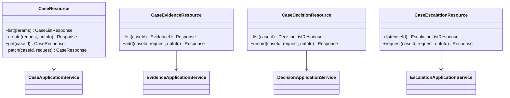
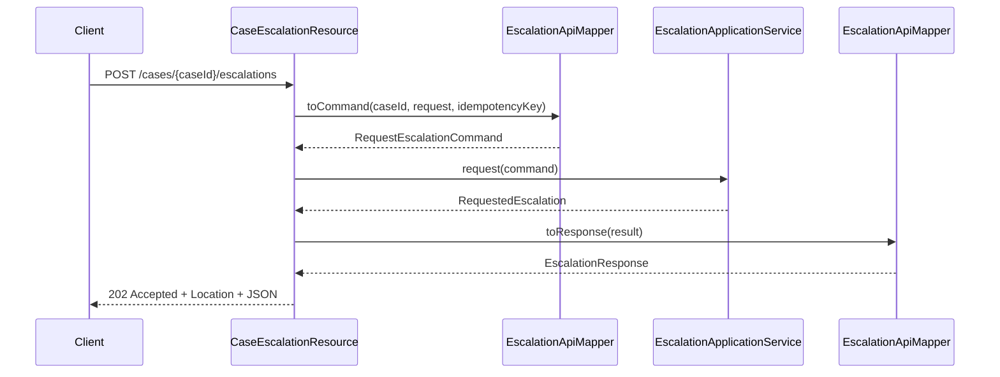

# Part 005 — Resource Class Design

Di part sebelumnya kita sudah membahas bagaimana aplikasi Jakarta REST dikonfigurasi melalui `Application`, `@ApplicationPath`, discovery, explicit registration, dan deployment boundary.

Sekarang kita masuk ke unit paling sering ditulis developer: **resource class**.

Banyak engineer menulis resource class seperti controller biasa:

```java
@Path("/cases")
public class CaseResource {
    @GET
    public List<CaseEntity> findAll() {
        return caseRepository.findAll();
    }
}
```

Kode itu terlihat ringkas, tetapi secara desain lemah:

- entity persistence bocor ke API contract;
- resource method tidak menunjukkan HTTP semantics secara jelas;
- business rule, mapping, authorization, persistence, dan serialization sering tercampur;
- testing menjadi terlalu berat karena resource class membawa terlalu banyak concern;
- perubahan internal database dapat menjadi breaking change untuk client;
- error model tidak terlihat dari boundary.

Resource class yang kuat bukan sekadar class berisi annotation. Resource class adalah **protocol adapter**: ia menerjemahkan HTTP request menjadi application use case call, lalu menerjemahkan result/failure menjadi HTTP response yang stabil.

Mental model utama part ini:

```text
HTTP request -> resource class -> application boundary -> resource response
```

Bukan:

```text
HTTP request -> resource class -> database table
```

---

## 1. Target Pembelajaran

Setelah part ini, kita ingin bisa:

1. Mendesain resource class sebagai **HTTP boundary**, bukan tempat business logic utama.
2. Memahami perbedaan root resource, resource method, sub-resource method, dan sub-resource locator.
3. Menentukan kapan resource class boleh tipis dan kapan ia perlu sedikit orchestration.
4. Menghindari anti-pattern umum: entity leak, RPC endpoint, god resource, ambiguous path, dan provider coupling.
5. Membuat struktur resource class yang stabil untuk sistem production, termasuk domain kompleks seperti case management, evidence, decision, dan escalation.

---

## 2. Apa Itu Resource Class?

Dalam Jakarta REST, resource class adalah Java class yang menjadi entry point untuk resource HTTP. Root resource class biasanya ditandai dengan `@Path` di level class.

Contoh minimal:

```java
import jakarta.ws.rs.GET;
import jakarta.ws.rs.Path;
import jakarta.ws.rs.Produces;
import jakarta.ws.rs.core.MediaType;

@Path("/health")
public class HealthResource {

    @GET
    @Produces(MediaType.TEXT_PLAIN)
    public String health() {
        return "ok";
    }
}
```

Secara mekanis:

- `@Path("/health")` membuat class ini menjadi root resource candidate;
- `@GET` menandai method sebagai handler untuk HTTP GET;
- `@Produces` memberi tahu media type response yang dapat dihasilkan;
- return value `String` akan diproses oleh `MessageBodyWriter` yang sesuai.

Namun secara desain, kita perlu melihat resource class dengan sudut pandang lebih dalam.

Resource class bukan “tempat endpoint”. Resource class adalah **alamat publik sistem**.

Jika alamat publik buruk, sistem internal yang bagus tetap sulit dipakai.

---

## 3. Resource Class sebagai Protocol Adapter

Resource class yang baik menjalankan pekerjaan berikut:

| Tanggung Jawab | Penjelasan |
|---|---|
| URI binding | Menerima request berdasarkan path dan method HTTP. |
| Input extraction | Mengambil path/query/header/body/cookie/form input. |
| Input validation boundary | Menolak input yang tidak valid sedini mungkin. |
| Request-to-command/query mapping | Mengubah input HTTP menjadi object aplikasi. |
| Use case invocation | Memanggil service/application boundary yang tepat. |
| Result mapping | Mengubah output aplikasi menjadi DTO/response. |
| HTTP response decision | Memilih status code, header, entity, dan media type. |
| Failure translation | Membiarkan exception mapper atau explicit response menangani failure. |

Resource class yang buruk biasanya melakukan semua hal di bawah ini sekaligus:

- query database langsung;
- membangun SQL;
- memutuskan state transition kompleks;
- mengirim message broker;
- melakukan retry external API;
- menyimpan audit event secara manual;
- mengandung authorization logic besar;
- mengembalikan JPA entity;
- menangkap semua exception lalu return `500` manual.

Prinsipnya:

> Resource class boleh tahu HTTP. Resource class boleh tahu application boundary. Resource class tidak boleh menjadi domain model, transaction script raksasa, atau persistence adapter.

---

## 4. Bentuk Dasar Resource Class

Resource class production biasanya memiliki struktur seperti ini:

```java
@Path("/cases")
@Produces(MediaType.APPLICATION_JSON)
@Consumes(MediaType.APPLICATION_JSON)
public class CaseResource {

    private final CaseApplicationService cases;
    private final CaseApiMapper mapper;

    public CaseResource(CaseApplicationService cases, CaseApiMapper mapper) {
        this.cases = cases;
        this.mapper = mapper;
    }

    @GET
    public CaseListResponse listCases(@BeanParam CaseSearchRequestParams params) {
        CaseSearchQuery query = mapper.toQuery(params);
        CaseSearchResult result = cases.search(query);
        return mapper.toResponse(result);
    }

    @POST
    public Response createCase(CreateCaseRequest request, @Context UriInfo uriInfo) {
        CreateCaseCommand command = mapper.toCommand(request);
        CreatedCase created = cases.create(command);

        URI location = uriInfo
                .getAbsolutePathBuilder()
                .path(created.caseId().value())
                .build();

        return Response
                .created(location)
                .entity(mapper.toResponse(created))
                .build();
    }
}
```

Perhatikan beberapa keputusan desain:

- resource method menerima DTO/request parameter, bukan entity database;
- service aplikasi menerima command/query object, bukan object HTTP;
- `UriInfo` hanya dipakai di boundary HTTP;
- `201 Created` menggunakan `Location` header;
- mapping dipusatkan agar kontrak API tidak menyebar ke service layer;
- resource class tetap cukup tipis tetapi tidak anemik.

---

## 5. Root Resource Class

Root resource class adalah class dengan `@Path` di level class.

```java
@Path("/cases")
public class CaseResource {
}
```

Path tersebut relatif terhadap base application path.

Jika aplikasi dikonfigurasi:

```java
@ApplicationPath("/api")
public class CaseManagementApplication extends Application {
}
```

Maka resource root menjadi:

```text
/api/cases
```

Root resource class idealnya merepresentasikan resource family yang jelas:

| Resource Class | Cocok Untuk |
|---|---|
| `CaseResource` | Collection dan item operation untuk case. |
| `EvidenceResource` | Evidence sebagai resource utama atau nested resource. |
| `DecisionResource` | Decision record, approval, adjudication output. |
| `EscalationResource` | Escalation request/flow jika menjadi domain concept publik. |
| `HealthResource` | Operational endpoint sederhana. |
| `OpenApiResource` | Metadata/contract endpoint jika runtime mendukung. |

Hindari nama generik:

```java
@Path("/api")
public class ApiResource {
}

@Path("/service")
public class ServiceEndpoint {
}

@Path("/actions")
public class ActionResource {
}
```

Nama generik membuat API kehilangan model domain publik.

---

## 6. Resource Method

Resource method adalah method Java yang memiliki HTTP method designator seperti `@GET`, `@POST`, `@PUT`, `@DELETE`, `@PATCH`, `@HEAD`, atau annotation custom berbasis `@HttpMethod`.

Contoh:

```java
@GET
@Path("/{caseId}")
public CaseResponse getCase(@PathParam("caseId") String caseId) {
    return mapper.toResponse(cases.get(new CaseId(caseId)));
}
```

Resource method biasanya memiliki kombinasi:

- HTTP method annotation;
- optional method-level `@Path`;
- optional `@Consumes`;
- optional `@Produces`;
- parameter injection annotation;
- entity body parameter;
- `@Context` parameter;
- return type.

Contoh lebih lengkap:

```java
@PUT
@Path("/{caseId}/assignment")
public Response assignCase(
        @PathParam("caseId") String caseId,
        AssignCaseRequest request,
        @HeaderParam("Idempotency-Key") String idempotencyKey) {

    AssignCaseCommand command = new AssignCaseCommand(
            new CaseId(caseId),
            new OfficerId(request.officerId()),
            IdempotencyKey.optional(idempotencyKey)
    );

    cases.assign(command);
    return Response.noContent().build();
}
```

Resource method harus mudah dibaca sebagai kontrak:

```text
PUT /cases/{caseId}/assignment
Body: AssignCaseRequest
Header: optional Idempotency-Key
Response: 204 No Content
```

Jika pembaca tidak bisa memahami kontrak dari signature dan annotation, resource method terlalu kabur.

---

## 7. Method-Level `@Path`

`@Path` di level method menambahkan path relatif terhadap class-level path.

```java
@Path("/cases")
public class CaseResource {

    @GET
    @Path("/{caseId}")
    public CaseResponse getCase(@PathParam("caseId") String caseId) {
        // ...
    }
}
```

Full path:

```text
/cases/{caseId}
```

Tanpa method-level `@Path`, method cocok ke root resource path:

```java
@Path("/cases")
public class CaseResource {

    @GET
    public CaseListResponse listCases() {
        // GET /cases
    }

    @POST
    public Response createCase(CreateCaseRequest request) {
        // POST /cases
    }
}
```

Ini pattern umum:

```text
GET    /cases        -> list collection
POST   /cases        -> create item or submit command to collection
GET    /cases/{id}   -> retrieve item
PUT    /cases/{id}   -> replace item or stable state representation
PATCH  /cases/{id}   -> partial update
DELETE /cases/{id}   -> remove/cancel/archive depending domain semantics
```

Namun jangan memaksakan CRUD jika domain tidak cocok. Kita bahas lebih dalam di Part 006 dan Part 007.

---

## 8. Sub-Resource Method vs Sub-Resource Locator

Jakarta REST punya dua konsep yang sering membingungkan.

### 8.1 Sub-Resource Method

Sub-resource method adalah method dengan `@Path` dan HTTP method annotation.

```java
@Path("/cases")
public class CaseResource {

    @GET
    @Path("/{caseId}/evidence")
    public EvidenceListResponse listEvidence(@PathParam("caseId") String caseId) {
        return evidenceApi.listForCase(new CaseId(caseId));
    }
}
```

Method ini langsung menangani request:

```text
GET /cases/{caseId}/evidence
```

### 8.2 Sub-Resource Locator

Sub-resource locator adalah method dengan `@Path`, tetapi **tanpa** HTTP method annotation. Ia tidak langsung menangani request. Ia mengembalikan object resource lain yang akan melanjutkan matching.

```java
@Path("/cases")
public class CaseResource {

    private final EvidenceResource evidenceResource;

    public CaseResource(EvidenceResource evidenceResource) {
        this.evidenceResource = evidenceResource;
    }

    @Path("/{caseId}/evidence")
    public EvidenceResource evidence(@PathParam("caseId") String caseId) {
        return evidenceResource.withCaseId(new CaseId(caseId));
    }
}
```

Kemudian:

```java
public class EvidenceResource {

    private CaseId caseId;

    public EvidenceResource withCaseId(CaseId caseId) {
        EvidenceResource copy = new EvidenceResource(/* dependencies */);
        copy.caseId = caseId;
        return copy;
    }

    @GET
    public EvidenceListResponse listEvidence() {
        // GET /cases/{caseId}/evidence
    }

    @POST
    public Response addEvidence(AddEvidenceRequest request) {
        // POST /cases/{caseId}/evidence
    }
}
```

Sub-resource locator berguna jika:

- nested resource punya banyak operasi;
- class root terlalu besar;
- path prefix membawa context seperti `caseId`;
- resource family ingin dipisah tanpa membuat root path baru;
- kita ingin merepresentasikan hierarchy domain.

Namun sub-resource locator juga bisa membuat lifecycle dan state menjadi rumit. Gunakan dengan disiplin.

---

## 9. Lifecycle dan Thread Safety Resource Class

Resource class terlihat seperti POJO biasa, tetapi lifecycle-nya bergantung pada runtime dan integration model. Dalam banyak implementasi Jakarta REST, resource class dapat dibuat per-request, tetapi provider atau singleton registration dapat mengubah ekspektasi. Jika kita mendaftarkan instance melalui `Application#getSingletons()`, instance tersebut dipakai sebagai singleton.

Konsekuensinya:

```java
@Path("/cases")
public class BadCaseResource {

    private String lastCaseId; // berbahaya jika instance shared

    @GET
    @Path("/{caseId}")
    public CaseResponse get(@PathParam("caseId") String caseId) {
        this.lastCaseId = caseId;
        return load(lastCaseId);
    }
}
```

Ini lemah karena resource state request disimpan di field mutable. Jika instance ternyata singleton/shared, terjadi race condition.

Rule praktis:

- dependency boleh disimpan sebagai `final` field;
- request-specific data sebaiknya ada di parameter method atau local variable;
- hindari mutable field untuk path/query/header/body data;
- jika memakai sub-resource locator yang membawa state, buat instance baru/copy per request;
- jangan menyimpan `UriInfo`, `HttpHeaders`, `SecurityContext`, atau entity request sebagai field mutable kecuali lifecycle benar-benar dipahami.

Desain aman:

```java
@Path("/cases")
public class CaseResource {

    private final CaseApplicationService cases;

    public CaseResource(CaseApplicationService cases) {
        this.cases = cases;
    }

    @GET
    @Path("/{caseId}")
    public CaseResponse get(@PathParam("caseId") String caseId) {
        return toResponse(cases.get(new CaseId(caseId)));
    }
}
```

---

## 10. Constructor Injection vs Field Injection

Dalam Jakarta EE/CDI environment, resource class sering dikelola oleh CDI. Maka dependency injection bisa dilakukan dengan constructor injection atau field injection.

Prefer constructor injection:

```java
@Path("/cases")
public class CaseResource {

    private final CaseApplicationService cases;
    private final CaseApiMapper mapper;

    public CaseResource(CaseApplicationService cases, CaseApiMapper mapper) {
        this.cases = cases;
        this.mapper = mapper;
    }
}
```

Keuntungan:

- dependency eksplisit;
- immutable field;
- mudah unit test;
- resource tidak berada dalam state setengah jadi;
- constructor menjadi dokumentasi kebutuhan resource.

Field injection boleh ditemui di banyak contoh:

```java
@Inject
CaseApplicationService cases;
```

Tetapi untuk handbook-level code, constructor injection lebih mudah dijaga.

Catatan: detail CDI, scope, dan container-specific behavior akan dibahas lagi di bagian provider/context/security/testing. Di part ini kita fokus pada desain resource class.

---

## 11. Resource Class Tidak Sama dengan Service Class

Anti-pattern umum:

```java
@Path("/cases")
public class CaseResource {

    @POST
    @Path("/{caseId}/escalate")
    public Response escalate(@PathParam("caseId") String caseId, EscalateRequest request) {
        CaseEntity entity = entityManager.find(CaseEntity.class, caseId);

        if (entity == null) {
            return Response.status(404).build();
        }

        if (!entity.getStatus().equals("OPEN")) {
            return Response.status(409).entity("Cannot escalate").build();
        }

        entity.setStatus("ESCALATED");
        entity.setEscalationReason(request.reason());
        entityManager.persist(new AuditLog(...));
        notificationClient.send(...);

        return Response.ok().build();
    }
}
```

Masalah:

- resource mengandung business state machine;
- persistence langsung dipanggil;
- audit manual dicampur;
- notification side effect dicampur;
- error response tidak konsisten;
- sulit diuji tanpa database dan external dependency;
- idempotency tidak jelas;
- transaction boundary tidak terlihat.

Lebih baik:

```java
@POST
@Path("/{caseId}/escalations")
public Response requestEscalation(
        @PathParam("caseId") String caseId,
        RequestEscalationRequest request,
        @HeaderParam("Idempotency-Key") String idempotencyKey,
        @Context UriInfo uriInfo) {

    RequestEscalationCommand command = new RequestEscalationCommand(
            new CaseId(caseId),
            request.reason(),
            request.priority(),
            IdempotencyKey.required(idempotencyKey)
    );

    RequestedEscalation result = cases.requestEscalation(command);

    URI location = uriInfo.getAbsolutePathBuilder()
            .path(result.escalationId().value())
            .build();

    return Response.accepted(mapper.toResponse(result))
            .location(location)
            .build();
}
```

Resource tetap membuat keputusan HTTP penting:

- endpoint menggunakan collection-like resource `/escalations`;
- command membutuhkan idempotency key;
- response menggunakan `202 Accepted` jika escalation diproses async/workflow;
- `Location` memberi alamat resource escalation;
- domain rule ditangani service aplikasi.

---

## 12. Thin Resource vs Anemic Resource

Ada nasihat populer: “controller/resource harus tipis.” Itu benar, tetapi sering disalahartikan.

Resource terlalu gemuk:

```text
HTTP + validation + authorization + business rule + transaction + SQL + DTO mapping + audit + integration
```

Resource terlalu anemik:

```java
@POST
public Response create(CreateCaseRequest request) {
    return service.handleEverything(request);
}
```

Yang kedua juga lemah karena HTTP boundary hilang. Service menerima DTO HTTP langsung, sehingga application layer tergantung pada API contract.

Resource yang sehat:

```text
HTTP extraction + boundary validation + request mapping + use case call + response decision
```

Contoh:

```java
@POST
public Response createCase(CreateCaseRequest request, @Context UriInfo uriInfo) {
    CreateCaseCommand command = mapper.toCommand(request);
    CreatedCase created = cases.create(command);
    URI location = locationOf(uriInfo, created.caseId());
    return Response.created(location).entity(mapper.toResponse(created)).build();
}
```

Ini tidak terlalu gemuk, tetapi juga tidak menyerahkan protokol HTTP ke service.

---

## 13. DTO Boundary: Jangan Return Entity

Anti-pattern:

```java
@GET
@Path("/{caseId}")
public CaseEntity getCase(@PathParam("caseId") String caseId) {
    return entityManager.find(CaseEntity.class, caseId);
}
```

Masalah:

- field internal bisa bocor;
- lazy loading dapat meledak saat serialization;
- relasi entity dapat membuat JSON infinite recursion;
- perubahan schema database menjadi perubahan API;
- annotation persistence bercampur dengan annotation serialization;
- security filtering menjadi sulit;
- audit/control atas representation lemah.

Gunakan DTO:

```java
public record CaseResponse(
        String id,
        String status,
        String subject,
        String assignedOfficerId,
        Instant createdAt,
        Instant updatedAt,
        List<LinkResponse> links
) {}
```

Resource:

```java
@GET
@Path("/{caseId}")
public CaseResponse getCase(@PathParam("caseId") String caseId) {
    CaseView view = cases.get(new CaseId(caseId));
    return mapper.toResponse(view);
}
```

DTO adalah kontrak publik. Entity adalah detail internal.

---

## 14. Return Type: DTO vs `Response`

Jakarta REST resource method dapat mengembalikan object langsung atau `Response`.

### 14.1 Return DTO Langsung

```java
@GET
@Path("/{caseId}")
public CaseResponse getCase(@PathParam("caseId") String caseId) {
    return mapper.toResponse(cases.get(new CaseId(caseId)));
}
```

Cocok jika:

- status code normal adalah `200 OK`;
- tidak perlu custom header;
- response shape sederhana;
- failure ditangani `ExceptionMapper`.

### 14.2 Return `Response`

```java
@POST
public Response createCase(CreateCaseRequest request, @Context UriInfo uriInfo) {
    CreatedCase created = cases.create(mapper.toCommand(request));
    URI location = uriInfo.getAbsolutePathBuilder().path(created.id()).build();

    return Response
            .created(location)
            .entity(mapper.toResponse(created))
            .build();
}
```

Cocok jika:

- perlu status selain `200`;
- perlu `Location`, `ETag`, `Cache-Control`, atau custom header;
- response mungkin `201`, `202`, `204`, `304`, atau `409`;
- kita ingin eksplisit tentang kontrak HTTP.

Rule praktis:

- Query/read method sering cukup return DTO;
- create/update/delete/command method sering lebih baik return `Response`;
- jangan return `Response` hanya untuk semua hal jika membuat kontrak menjadi kabur;
- jangan return raw entity hanya karena praktis.

---

## 15. `Optional`, `null`, Empty Result, dan `404`

Resource design harus eksplisit soal “tidak ada data”.

Untuk item resource:

```java
@GET
@Path("/{caseId}")
public CaseResponse getCase(@PathParam("caseId") String caseId) {
    return mapper.toResponse(cases.getOrThrow(new CaseId(caseId)));
}
```

Jika case tidak ada, service melempar domain/application exception:

```java
throw new CaseNotFoundException(caseId);
```

Lalu `ExceptionMapper<CaseNotFoundException>` mengubahnya menjadi `404`.

Untuk collection resource:

```java
@GET
public CaseListResponse listCases(@BeanParam CaseSearchRequestParams params) {
    return mapper.toResponse(cases.search(mapper.toQuery(params)));
}
```

Jika tidak ada item, response biasanya:

```json
{
  "items": [],
  "page": {
    "size": 50,
    "nextCursor": null
  }
}
```

Bukan `404`.

Perbedaan mental model:

| Request | Tidak Ada Data | Response Umum |
|---|---:|---:|
| `GET /cases/{id}` | item tidak ada | `404 Not Found` |
| `GET /cases?status=closed` | collection kosong | `200 OK` + empty list |
| `DELETE /cases/{id}` | sudah tidak ada | tergantung domain, sering tetap idempotent |
| `POST /cases/{id}/escalations` | case tidak ada | `404 Not Found` |

---

## 16. Path Design di Resource Class

Detail URI modeling akan dibahas di Part 007. Di sini kita hanya tetapkan prinsip resource-class-level.

Baik:

```java
@Path("/cases")
public class CaseResource {

    @GET
    public CaseListResponse list() {}

    @POST
    public Response create(CreateCaseRequest request) {}

    @GET
    @Path("/{caseId}")
    public CaseResponse get(@PathParam("caseId") String caseId) {}
}
```

Kurang baik:

```java
@Path("/case-service")
public class CaseServiceResource {

    @POST
    @Path("/getCase")
    public CaseResponse getCase(GetCaseRequest request) {}

    @POST
    @Path("/createCase")
    public CaseResponse createCase(CreateCaseRequest request) {}
}
```

Yang kedua lebih mirip RPC. Tidak selalu salah untuk internal command endpoint, tetapi jangan menyebutnya RESTful resource design jika semua operasi direpresentasikan sebagai verb path.

Resource path sebaiknya:

- memakai noun/resource concept;
- stabil terhadap perubahan implementation;
- tidak membawa nama method Java;
- tidak mengandung teknologi internal;
- tidak mengandung lifecycle step yang bukan resource;
- tidak memaksa CRUD jika domain sebenarnya workflow.

---

## 17. Collection Resource

Collection resource merepresentasikan kumpulan item.

```java
@Path("/cases")
@Produces(MediaType.APPLICATION_JSON)
@Consumes(MediaType.APPLICATION_JSON)
public class CaseCollectionResource {

    private final CaseApplicationService cases;
    private final CaseApiMapper mapper;

    public CaseCollectionResource(CaseApplicationService cases, CaseApiMapper mapper) {
        this.cases = cases;
        this.mapper = mapper;
    }

    @GET
    public CaseListResponse search(@BeanParam CaseSearchRequestParams params) {
        CaseSearchQuery query = mapper.toQuery(params);
        return mapper.toResponse(cases.search(query));
    }

    @POST
    public Response create(CreateCaseRequest request, @Context UriInfo uriInfo) {
        CreatedCase created = cases.create(mapper.toCommand(request));
        URI location = uriInfo.getAbsolutePathBuilder().path(created.caseId().value()).build();
        return Response.created(location).entity(mapper.toResponse(created)).build();
    }
}
```

Collection resource biasanya memiliki:

- `GET /collection` untuk list/search;
- `POST /collection` untuk create atau submit new subordinate resource;
- pagination/query parameter;
- creation response dengan `201 Created` atau `202 Accepted`.

Untuk domain regulated/case management, collection resource bisa menjadi pintu query besar, tetapi hindari menjadikan query grammar terlalu bebas hingga tidak bisa di-index atau diaudit.

---

## 18. Item Resource

Item resource merepresentasikan satu resource spesifik.

```java
@Path("/cases/{caseId}")
@Produces(MediaType.APPLICATION_JSON)
@Consumes(MediaType.APPLICATION_JSON)
public class CaseItemResource {

    private final CaseApplicationService cases;
    private final CaseApiMapper mapper;

    public CaseItemResource(CaseApplicationService cases, CaseApiMapper mapper) {
        this.cases = cases;
        this.mapper = mapper;
    }

    @GET
    public CaseResponse get(@PathParam("caseId") String caseId) {
        return mapper.toResponse(cases.get(new CaseId(caseId)));
    }

    @PATCH
    public CaseResponse patch(
            @PathParam("caseId") String caseId,
            PatchCaseRequest request) {
        return mapper.toResponse(cases.patch(new CaseId(caseId), mapper.toPatch(request)));
    }
}
```

Ada dua gaya penempatan:

### Gaya A — Collection dan item dalam satu class

```java
@Path("/cases")
public class CaseResource {
    @GET public CaseListResponse list() {}
    @POST public Response create(CreateCaseRequest request) {}
    @GET @Path("/{caseId}") public CaseResponse get(String id) {}
}
```

Cocok untuk resource family kecil.

### Gaya B — Pisah collection dan item class

```java
@Path("/cases")
public class CaseCollectionResource { }

@Path("/cases/{caseId}")
public class CaseItemResource { }
```

Cocok untuk API besar agar class tidak menjadi raksasa.

Trade-off:

| Gaya | Kelebihan | Risiko |
|---|---|---|
| Satu class | Mudah navigasi untuk resource kecil | God resource jika operasi bertambah |
| Pisah class | Lebih modular | Duplikasi path/context jika tidak disiplin |
| Sub-resource locator | Hierarchy jelas | Lifecycle/state lebih kompleks |

---

## 19. Nested Resource

Nested resource berguna jika satu resource memang berada dalam context resource lain.

Contoh:

```text
GET  /cases/{caseId}/evidence
POST /cases/{caseId}/evidence
GET  /cases/{caseId}/evidence/{evidenceId}
```

Resource class:

```java
@Path("/cases/{caseId}/evidence")
@Produces(MediaType.APPLICATION_JSON)
@Consumes(MediaType.APPLICATION_JSON)
public class CaseEvidenceResource {

    private final EvidenceApplicationService evidence;
    private final EvidenceApiMapper mapper;

    public CaseEvidenceResource(EvidenceApplicationService evidence, EvidenceApiMapper mapper) {
        this.evidence = evidence;
        this.mapper = mapper;
    }

    @GET
    public EvidenceListResponse list(@PathParam("caseId") String caseId) {
        return mapper.toResponse(evidence.listForCase(new CaseId(caseId)));
    }

    @POST
    public Response add(
            @PathParam("caseId") String caseId,
            AddEvidenceRequest request,
            @Context UriInfo uriInfo) {

        AddedEvidence added = evidence.add(new CaseId(caseId), mapper.toCommand(request));

        URI location = uriInfo.getAbsolutePathBuilder()
                .path(added.evidenceId().value())
                .build();

        return Response.created(location)
                .entity(mapper.toResponse(added))
                .build();
    }
}
```

Pertanyaan desain penting:

- Apakah evidence punya lifecycle independen?
- Apakah evidence bisa diakses tanpa case?
- Apakah evidence ID global atau hanya unik dalam case?
- Apakah URL nested perlu dibatasi kedalamannya?
- Apakah permission dievaluasi dari case atau evidence?

Jangan nested terlalu dalam:

```text
/cases/{caseId}/investigations/{investigationId}/evidence/{evidenceId}/attachments/{attachmentId}/versions/{versionId}
```

Path seperti ini sering menunjukkan model API terlalu mengikuti object graph internal.

---

## 20. Command Resource untuk Workflow

Dalam domain kompleks, tidak semua operasi cocok sebagai CRUD langsung.

Contoh escalation:

```text
POST /cases/{caseId}/escalations
```

Ini bukan sekadar update field `status`. Ini bisa berarti:

- membuat escalation request;
- menjalankan eligibility check;
- membuka workflow;
- menulis audit trail;
- mengirim notification;
- memicu review SLA;
- menghasilkan decision task.

Resource design:

```java
@Path("/cases/{caseId}/escalations")
@Produces(MediaType.APPLICATION_JSON)
@Consumes(MediaType.APPLICATION_JSON)
public class CaseEscalationResource {

    private final EscalationApplicationService escalations;
    private final EscalationApiMapper mapper;

    public CaseEscalationResource(EscalationApplicationService escalations, EscalationApiMapper mapper) {
        this.escalations = escalations;
        this.mapper = mapper;
    }

    @POST
    public Response requestEscalation(
            @PathParam("caseId") String caseId,
            RequestEscalationRequest request,
            @HeaderParam("Idempotency-Key") String idempotencyKey,
            @Context UriInfo uriInfo) {

        RequestEscalationCommand command = mapper.toCommand(
                new CaseId(caseId),
                request,
                IdempotencyKey.required(idempotencyKey)
        );

        RequestedEscalation result = escalations.request(command);

        URI location = uriInfo.getAbsolutePathBuilder()
                .path(result.escalationId().value())
                .build();

        return Response.accepted(mapper.toResponse(result))
                .location(location)
                .build();
    }
}
```

Kenapa bukan ini?

```text
POST /cases/{caseId}/escalate
```

Bisa saja untuk internal API kecil, tetapi `/escalations` memberi kita resource yang bisa dilacak:

```text
GET /cases/{caseId}/escalations/{escalationId}
```

Ini lebih kuat untuk audit, retry, async processing, dan operational diagnosis.

---

## 21. Resource Class dan Authorization Boundary

Resource class biasanya menjadi tempat yang baik untuk mengekspresikan **authorization boundary**, tetapi bukan tempat terbaik untuk menulis seluruh rule authorization.

Contoh deklaratif:

```java
@GET
@Path("/{caseId}")
@RolesAllowed("case:read")
public CaseResponse getCase(@PathParam("caseId") String caseId) {
    return mapper.toResponse(cases.get(new CaseId(caseId)));
}
```

Namun role saja sering tidak cukup. Domain regulated biasanya butuh object-level authorization:

```java
@GET
@Path("/{caseId}")
public CaseResponse getCase(
        @PathParam("caseId") String caseId,
        @Context SecurityContext securityContext) {

    CurrentUser user = principalMapper.from(securityContext);
    CaseView view = cases.getVisibleCase(user, new CaseId(caseId));
    return mapper.toResponse(view);
}
```

Boundary yang sehat:

- resource tahu siapa caller-nya;
- application service mengevaluasi visibility/rule yang bergantung domain;
- denied access diterjemahkan konsisten menjadi `403`, atau `404` jika policy intentionally hides existence;
- audit event menyertakan actor, resource, action, dan outcome.

Detail security akan dibahas di Part 020.

---

## 22. Resource Class dan Validation Boundary

Validation akan dibahas khusus di Part 015, tetapi desain resource harus siap dari sekarang.

Contoh DTO:

```java
public record CreateCaseRequest(
        @NotBlank String subject,
        @NotBlank String caseType,
        @Size(max = 4000) String description,
        @NotNull List<PartyRequest> parties
) {}
```

Resource:

```java
@POST
public Response create(@Valid CreateCaseRequest request, @Context UriInfo uriInfo) {
    CreatedCase created = cases.create(mapper.toCommand(request));
    URI location = uriInfo.getAbsolutePathBuilder().path(created.caseId().value()).build();
    return Response.created(location).entity(mapper.toResponse(created)).build();
}
```

Boundary validation sebaiknya memeriksa:

- shape request;
- required field;
- length/format dasar;
- enum/allowed value;
- syntactic validity.

Domain validation sebaiknya tetap di application/domain layer:

- apakah case type boleh dibuat oleh user ini;
- apakah status saat ini mengizinkan escalation;
- apakah evidence bisa ditambahkan setelah decision final;
- apakah officer punya jurisdiction.

---

## 23. Resource Class dan Exception Handling

Resource method tidak perlu menangkap setiap exception.

Anti-pattern:

```java
@GET
@Path("/{caseId}")
public Response get(@PathParam("caseId") String caseId) {
    try {
        return Response.ok(mapper.toResponse(cases.get(new CaseId(caseId)))).build();
    } catch (CaseNotFoundException e) {
        return Response.status(404).entity("Not found").build();
    } catch (Exception e) {
        return Response.status(500).entity("Internal error").build();
    }
}
```

Lebih baik:

```java
@GET
@Path("/{caseId}")
public CaseResponse get(@PathParam("caseId") String caseId) {
    return mapper.toResponse(cases.get(new CaseId(caseId)));
}
```

Lalu exception mapper:

```java
@Provider
public class CaseNotFoundExceptionMapper implements ExceptionMapper<CaseNotFoundException> {

    @Override
    public Response toResponse(CaseNotFoundException exception) {
        return Response.status(Response.Status.NOT_FOUND)
                .entity(ProblemDetails.notFound(exception.getMessage()))
                .type(MediaType.APPLICATION_JSON)
                .build();
    }
}
```

Exception mapper membuat failure contract konsisten lintas resource.

---

## 24. Naming Convention Resource Class

Gunakan nama yang menjelaskan resource family, bukan transport/framework.

Baik:

```text
CaseResource
CaseEvidenceResource
CaseAssignmentResource
CaseEscalationResource
DecisionResource
OfficerWorkQueueResource
HealthResource
```

Kurang baik:

```text
CaseController
CaseEndpoint
CaseServiceRest
CaseApiImpl
RestHandler
```

`Controller` boleh saja secara internal, tetapi dalam Jakarta REST, istilah `Resource` biasanya lebih presisi karena API tidak hanya “mengontrol” flow, tetapi merepresentasikan resource HTTP.

Untuk class besar, pecah berdasarkan subresource atau bounded area:

```text
CaseCollectionResource
CaseItemResource
CaseEvidenceResource
CaseDecisionResource
CaseEscalationResource
```

Jangan tunggu sampai `CaseResource` berisi 2.000 baris.

---

## 25. Method Naming Convention

Nama method Java tidak terlihat oleh client, tetapi penting untuk maintenance.

Baik:

```java
listCases()
getCase()
createCase()
replaceCase()
patchCase()
closeCase()
requestEscalation()
listEvidence()
addEvidence()
```

Kurang baik:

```java
handle()
doPost()
execute()
process()
callService()
caseOperation()
```

Nama method harus membantu reviewer memahami intent domain dan HTTP mapping.

---

## 26. `@Consumes` dan `@Produces` Placement

Umumnya, set default di class-level:

```java
@Path("/cases")
@Produces(MediaType.APPLICATION_JSON)
@Consumes(MediaType.APPLICATION_JSON)
public class CaseResource {
}
```

Override di method jika berbeda:

```java
@GET
@Path("/{caseId}/summary.txt")
@Produces(MediaType.TEXT_PLAIN)
public String summaryText(@PathParam("caseId") String caseId) {
    return cases.summaryText(new CaseId(caseId));
}
```

Jangan terlalu sering mengandalkan default runtime. Media type adalah bagian dari contract.

Buruk:

```java
@POST
public Response create(Object body) {
    // unclear content type and body shape
}
```

Baik:

```java
@POST
@Consumes(MediaType.APPLICATION_JSON)
@Produces(MediaType.APPLICATION_JSON)
public Response create(CreateCaseRequest request) {
    // explicit JSON contract
}
```

Content negotiation akan dibahas detail di Part 009.

---

## 27. `@Path` Regex dan Path Ambiguity

Jakarta REST mendukung URI template. Beberapa runtime juga mendukung regex template sesuai spesifikasi.

Contoh:

```java
@GET
@Path("/{caseId: CASE-[0-9]{4}-[0-9]+}")
public CaseResponse getCase(@PathParam("caseId") String caseId) {
    // ...
}
```

Namun hati-hati. Regex di path dapat membantu routing, tetapi dapat juga membuat API sulit dibaca.

Lebih buruk lagi adalah ambiguous path:

```java
@GET
@Path("/{id}")
public CaseResponse getById(@PathParam("id") String id) {}

@GET
@Path("/{status}")
public CaseListResponse getByStatus(@PathParam("status") String status) {}
```

Keduanya cocok untuk:

```text
GET /cases/open
```

Lebih baik:

```java
@GET
@Path("/{caseId}")
public CaseResponse getById(@PathParam("caseId") String caseId) {}

@GET
public CaseListResponse search(@QueryParam("status") String status) {}
```

Atau:

```text
GET /cases?status=open
```

Rule:

- path segment untuk identity/hierarchy;
- query parameter untuk filter/search;
- hindari dua template path dengan shape sama tetapi makna berbeda;
- jangan mengandalkan method order dalam source code.

---

## 28. Resource Class untuk Search

Search sering menjadi sumber desain buruk.

Anti-pattern:

```text
GET /cases/searchByStatusAndOfficerAndDateRange
POST /cases/find
POST /caseSearchService/search
```

Lebih REST-friendly:

```text
GET /cases?status=open&assignedOfficerId=OFF-123&createdFrom=2026-01-01&createdTo=2026-01-31
```

Resource:

```java
@GET
public CaseListResponse search(@BeanParam CaseSearchRequestParams params) {
    return mapper.toResponse(cases.search(mapper.toQuery(params)));
}
```

Parameter object:

```java
public class CaseSearchRequestParams {

    @QueryParam("status")
    private String status;

    @QueryParam("assignedOfficerId")
    private String assignedOfficerId;

    @QueryParam("createdFrom")
    private String createdFrom;

    @QueryParam("createdTo")
    private String createdTo;

    @QueryParam("limit")
    @DefaultValue("50")
    private int limit;

    @QueryParam("cursor")
    private String cursor;

    // getters
}
```

Untuk search kompleks dengan body besar, `POST /case-searches` atau `POST /cases/search-requests` bisa valid sebagai resource command/search job, terutama jika query disimpan, diaudit, atau async. Tetapi jangan menjadikannya default karena malas mendesain query parameters.

---

## 29. Resource Class untuk Partial Update

Partial update sering memakai `PATCH`.

```java
@PATCH
@Path("/{caseId}")
public CaseResponse patchCase(
        @PathParam("caseId") String caseId,
        PatchCaseRequest request) {

    PatchCaseCommand command = mapper.toCommand(new CaseId(caseId), request);
    return mapper.toResponse(cases.patch(command));
}
```

Desain request partial update harus eksplisit.

Jangan memakai entity lengkap dengan nullable fields tanpa membedakan:

- field tidak dikirim;
- field dikirim dengan `null`;
- field ingin dihapus;
- field ingin dikosongkan.

Contoh wrapper:

```java
public record PatchCaseRequest(
        OptionalField<String> subject,
        OptionalField<String> description,
        OptionalField<String> priority
) {}
```

Atau gunakan media type patch standard seperti JSON Patch/Merge Patch jika runtime dan organisasi mendukungnya.

Detail patch semantics akan dibahas di Part 006 dan contract evolution di Part 016.

---

## 30. Resource Class untuk Long-Running Operation

Jangan tahan HTTP request terlalu lama untuk workflow yang panjang.

Contoh buruk:

```java
@POST
@Path("/{caseId}/generate-enforcement-package")
public EnforcementPackageResponse generate(@PathParam("caseId") String caseId) {
    return packageService.generateSynchronously(new CaseId(caseId)); // bisa 2 menit
}
```

Lebih baik:

```text
POST /cases/{caseId}/enforcement-packages
202 Accepted
Location: /cases/{caseId}/enforcement-packages/{packageId}
```

Resource:

```java
@POST
@Path("/{caseId}/enforcement-packages")
public Response requestPackageGeneration(
        @PathParam("caseId") String caseId,
        GeneratePackageRequest request,
        @Context UriInfo uriInfo) {

    RequestedPackageGeneration result = packages.requestGeneration(
            new CaseId(caseId),
            mapper.toCommand(request)
    );

    URI location = uriInfo.getAbsolutePathBuilder()
            .path(result.packageId().value())
            .build();

    return Response.accepted(mapper.toResponse(result))
            .location(location)
            .build();
}
```

Ini memberi client resource untuk polling/status dan membuat failure recovery lebih jelas.

---

## 31. Resource Class dan Auditability

Untuk regulated systems, resource class adalah tempat alami untuk menangkap metadata audit dari HTTP:

- actor/principal;
- source IP/header tertentu jika trusted;
- user agent/client ID;
- correlation ID;
- idempotency key;
- request timestamp;
- target resource ID;
- action type;
- outcome.

Namun jangan menulis audit persistence langsung di setiap resource method.

Lebih baik:

- filter mengekstrak correlation/request metadata;
- security layer menyelesaikan actor;
- application service menghasilkan domain/audit event;
- audit writer menjadi infrastructure concern;
- resource hanya meneruskan boundary context jika perlu.

Contoh:

```java
@POST
@Path("/{caseId}/decisions")
public Response recordDecision(
        @PathParam("caseId") String caseId,
        RecordDecisionRequest request,
        @Context SecurityContext securityContext,
        @Context UriInfo uriInfo) {

    CurrentUser actor = principalMapper.from(securityContext);

    RecordedDecision recorded = decisions.record(new RecordDecisionCommand(
            new CaseId(caseId),
            actor.userId(),
            request.outcome(),
            request.rationale(),
            request.evidenceIds()
    ));

    URI location = uriInfo.getAbsolutePathBuilder()
            .path(recorded.decisionId().value())
            .build();

    return Response.created(location)
            .entity(mapper.toResponse(recorded))
            .build();
}
```

Resource membawa actor, tetapi audit rule tetap di application/domain layer.

---

## 32. Checklist Desain Resource Class

Gunakan checklist ini saat membuat resource baru.

### 32.1 Identity dan Path

- Apakah resource path merepresentasikan noun/domain concept yang stabil?
- Apakah `@Path` tidak bocor nama service/method internal?
- Apakah path tidak ambiguous dengan method lain?
- Apakah path nesting tidak terlalu dalam?
- Apakah query parameter dipakai untuk filter/search, bukan path segment palsu?

### 32.2 HTTP Contract

- Apakah method HTTP sesuai intent?
- Apakah response status eksplisit untuk create/update/delete/command?
- Apakah `Location` header digunakan untuk created/accepted resource?
- Apakah `@Consumes` dan `@Produces` jelas?
- Apakah empty collection tidak diperlakukan sebagai `404`?

### 32.3 Boundary DTO

- Apakah request body memakai request DTO, bukan entity?
- Apakah response body memakai response DTO, bukan entity?
- Apakah field sensitif difilter?
- Apakah DTO stabil terhadap perubahan persistence schema?
- Apakah date/time dan enum punya format eksplisit?

### 32.4 Application Boundary

- Apakah resource memanggil application service/use case, bukan repository langsung?
- Apakah business rule tidak ditulis besar di resource?
- Apakah transaction boundary tidak tersembunyi di resource?
- Apakah mapping request-to-command jelas?
- Apakah authorization domain-level berada di tempat yang tepat?

### 32.5 Failure Model

- Apakah domain/application exception punya mapper?
- Apakah resource tidak menangkap `Exception` generik?
- Apakah failure response konsisten?
- Apakah invalid input menghasilkan error terstruktur?
- Apakah error tidak membocorkan detail internal?

### 32.6 Runtime Safety

- Apakah resource tidak menyimpan request state di field mutable?
- Apakah dependency `final` dan thread-safe?
- Apakah singleton registration tidak memperkenalkan race condition?
- Apakah sub-resource locator tidak mengembalikan shared mutable object?
- Apakah resource mudah diuji tanpa container penuh?

---

## 33. Common Anti-Patterns

### 33.1 Entity Exposure

```java
@GET
public List<CaseEntity> list() {
    return repository.findAll();
}
```

Masalah: contract publik menjadi schema persistence.

Perbaikan: gunakan DTO dan mapper.

---

### 33.2 RPC Path Everywhere

```text
POST /case/create
POST /case/update
POST /case/delete
POST /case/get
POST /case/search
```

Masalah: HTTP method kehilangan semantics.

Perbaikan:

```text
GET    /cases
POST   /cases
GET    /cases/{caseId}
PATCH  /cases/{caseId}
DELETE /cases/{caseId}
```

Untuk command/workflow, jadikan command sebagai resource jika perlu:

```text
POST /cases/{caseId}/escalations
POST /cases/{caseId}/decisions
```

---

### 33.3 God Resource

```text
CaseResource.java: 3.500 lines
```

Berisi list, create, get, patch, delete, evidence, decision, assignment, escalation, report, notification, audit, export.

Perbaikan:

```text
CaseResource
CaseEvidenceResource
CaseDecisionResource
CaseAssignmentResource
CaseEscalationResource
CaseExportResource
```

---

### 33.4 Catch-All `Response`

```java
public Response method(...) {
    try {
        // everything
    } catch (Exception e) {
        return Response.status(500).entity(e.getMessage()).build();
    }
}
```

Masalah:

- failure taxonomy hilang;
- sensitive info bocor;
- response tidak konsisten;
- exception mapper tidak dipakai.

Perbaikan: gunakan exception mapper dan problem response.

---

### 33.5 Mutable Request State Field

```java
private String currentCaseId;
```

Masalah: concurrency risk.

Perbaikan: gunakan method parameter/local variable.

---

### 33.6 Ambiguous Resource Matching

```java
@GET @Path("/{id}")
public CaseResponse getById(...) {}

@GET @Path("/{status}")
public CaseListResponse getByStatus(...) {}
```

Perbaikan: query parameter untuk filter.

---

### 33.7 Service Leaks Into API

```java
@Path("/caseApplicationService")
public class CaseApplicationServiceResource {
    @POST @Path("/executeEscalationUseCase")
    public Response execute(...) {}
}
```

Perbaikan: modelkan public resource, bukan nama class internal.

---

## 34. Worked Example: Case Management Resource Set

Misalnya kita punya domain enforcement lifecycle:

- case dibuat dari complaint/referral;
- evidence ditambahkan;
- officer assignment berubah;
- case bisa dieskalasi;
- decision dicatat;
- final package digenerate.

Resource map:

```text
GET    /cases
POST   /cases
GET    /cases/{caseId}
PATCH  /cases/{caseId}
GET    /cases/{caseId}/evidence
POST   /cases/{caseId}/evidence
GET    /cases/{caseId}/decisions
POST   /cases/{caseId}/decisions
GET    /cases/{caseId}/escalations
POST   /cases/{caseId}/escalations
GET    /cases/{caseId}/enforcement-packages/{packageId}
POST   /cases/{caseId}/enforcement-packages
```

Resource class split:

```text
CaseResource
CaseEvidenceResource
CaseDecisionResource
CaseEscalationResource
CaseEnforcementPackageResource
```

Class diagram sederhana:



Request flow:



---

## 35. Design Heuristic: Resource Should Read Like API Documentation

Ketika reviewer membuka resource class, ia harus bisa menebak API contract tanpa membaca seluruh service implementation.

Contoh bagus:

```java
@Path("/cases/{caseId}/decisions")
@Produces(MediaType.APPLICATION_JSON)
@Consumes(MediaType.APPLICATION_JSON)
public class CaseDecisionResource {

    @GET
    public DecisionListResponse listDecisions(@PathParam("caseId") String caseId) {
        // ...
    }

    @POST
    public Response recordDecision(
            @PathParam("caseId") String caseId,
            RecordDecisionRequest request,
            @Context UriInfo uriInfo) {
        // ...
    }
}
```

Kontraknya terlihat:

```text
GET  /cases/{caseId}/decisions
POST /cases/{caseId}/decisions
Consumes: application/json
Produces: application/json
```

Jika kontrak tidak terlihat, resource class belum cukup jelas.

---

## 36. Latihan Part 005

Ambil satu endpoint lama yang berbentuk RPC, misalnya:

```text
POST /caseService/approveCase
```

Ubah menjadi resource model yang lebih baik.

Jawab pertanyaan:

1. Resource apa yang sebenarnya dibuat/diubah?
2. Apakah approval adalah state change, decision record, atau workflow command?
3. Apakah operasi ini synchronous atau asynchronous?
4. Response status apa yang paling tepat?
5. Apakah perlu `Location` header?
6. Apakah perlu idempotency key?
7. DTO request dan response apa yang stabil?
8. Exception apa saja yang mungkin muncul?
9. Mana yang ditangani resource, mana yang ditangani exception mapper?
10. Apa audit event minimal yang harus tercatat?

Contoh jawaban awal:

```text
POST /cases/{caseId}/decisions
```

Dengan body:

```json
{
  "outcome": "APPROVED",
  "rationale": "Evidence threshold met",
  "evidenceIds": ["EVD-100", "EVD-101"]
}
```

Response:

```http
HTTP/1.1 201 Created
Location: /cases/CASE-2026-001/decisions/DEC-9001
Content-Type: application/json
```

---

## 37. Ringkasan

Resource class Jakarta REST adalah public boundary sistem.

Hal penting:

- root resource class ditandai dengan `@Path`;
- resource method ditandai HTTP method annotation;
- method dengan `@Path` tanpa HTTP method adalah sub-resource locator;
- resource class sebaiknya menjadi protocol adapter;
- jangan return persistence entity;
- jangan menyimpan request state di field mutable;
- gunakan DTO dan application boundary;
- gunakan `Response` saat perlu status/header eksplisit;
- gunakan exception mapper untuk failure contract konsisten;
- desain resource harus bisa dibaca seperti API documentation.

Prinsip paling penting:

> Resource class tidak mendesain database dari luar. Resource class mendesain bahasa HTTP yang akan dipakai client untuk berinteraksi dengan capability sistem.

---

## 38. Referensi

- Jakarta RESTful Web Services 4.0 Specification — Resource classes, root resources, resource methods, sub-resources, request method designators.
- Jakarta EE Tutorial — Building RESTful Web Services with Jakarta REST.
- Jakarta RESTful Web Services API Javadoc — `jakarta.ws.rs.Path`, `jakarta.ws.rs.GET`, `jakarta.ws.rs.POST`, `jakarta.ws.rs.core.Response`.
