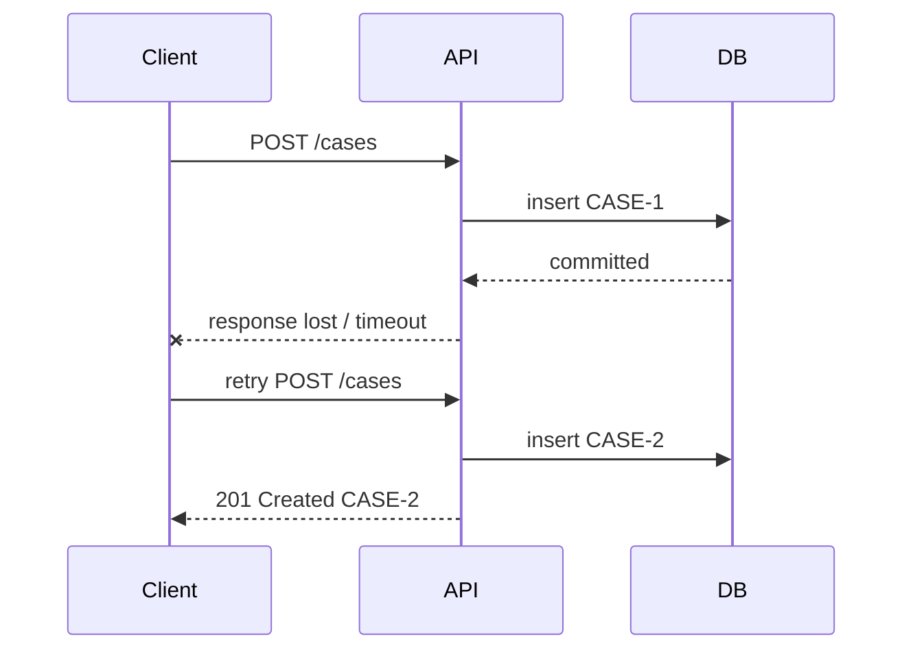
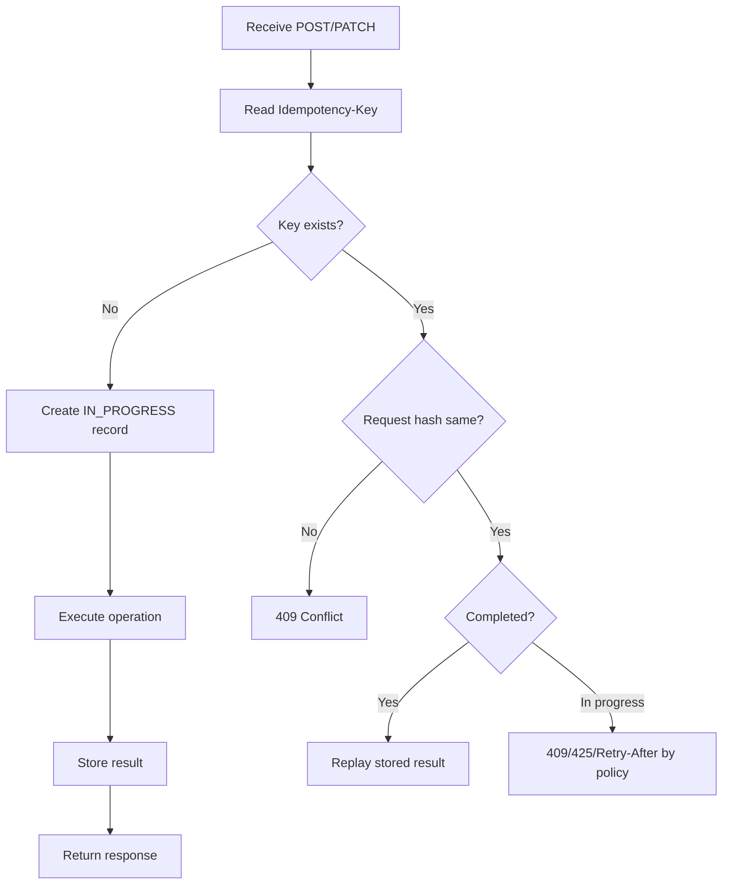
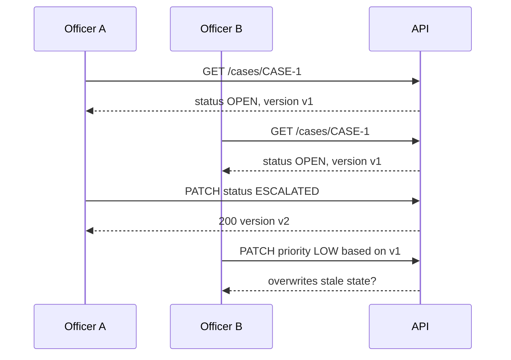
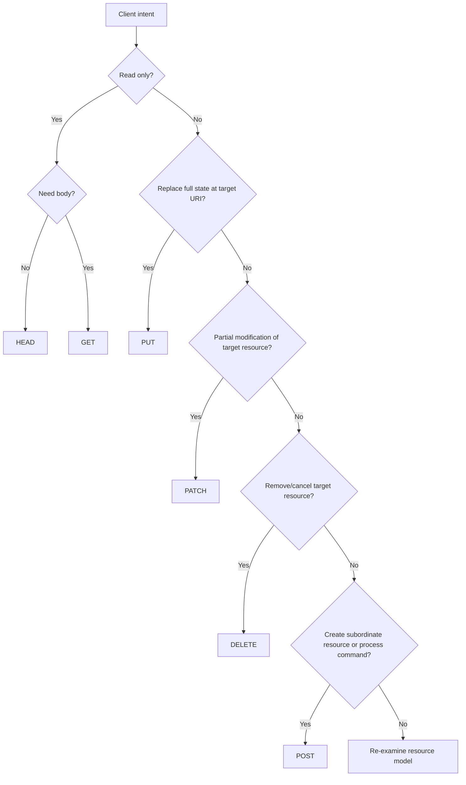

# Part 006 — HTTP Method Semantics in Jakarta REST

Part 005 membahas resource class sebagai boundary HTTP. Sekarang kita masuk ke pertanyaan yang sering diremehkan:

> Method HTTP apa yang seharusnya dipakai?

Banyak API terlihat “RESTful” karena memakai path seperti `/cases/{id}`, tetapi semantik method-nya kacau:

```text
GET  /cases/{id}/close
POST /cases/{id}/get
POST /cases/{id}/delete
PUT  /cases/{id}/partial-update
GET  /cases/search?delete=true
```

Masalahnya bukan kosmetik. Method HTTP menentukan:

- apakah request boleh diprefetch crawler/cache/proxy;
- apakah client boleh retry otomatis;
- apakah operation dianggap safe atau unsafe;
- apakah duplicate request bisa menyebabkan double mutation;
- bagaimana observability dan audit membaca traffic;
- status code apa yang masuk akal;
- bagaimana contract diuji dan direview.

Jakarta REST memberi annotation seperti `@GET`, `@POST`, `@PUT`, `@PATCH`, `@DELETE`, `@HEAD`, dan `@OPTIONS`. Namun annotation hanya mekanisme routing. Tanggung jawab desain semantik tetap pada engineer.

---

## 1. Target Pembelajaran

Setelah part ini, kita ingin bisa:

1. Memahami safe, unsafe, idempotent, dan non-idempotent operation.
2. Memilih `GET`, `POST`, `PUT`, `PATCH`, `DELETE`, `HEAD`, dan `OPTIONS` secara benar.
3. Mendesain create/update/delete/command endpoint dengan status code dan header yang tepat.
4. Menentukan kapan retry aman dan kapan perlu idempotency key.
5. Membedakan REST resource mutation dari database CRUD.
6. Mendesain endpoint workflow/regulatory action tanpa merusak semantik HTTP.

---

## 2. Mental Model: Method Bukan CRUD Shortcut

Kesalahan umum:

```text
POST   = insert database row
GET    = select database row
PUT    = update database row
DELETE = delete database row
```

Itu terlalu sempit.

HTTP method tidak berbicara langsung tentang database. HTTP method berbicara tentang **intended semantics terhadap resource**.

Lebih tepat:

| Method | Pertanyaan Desain |
|---|---|
| `GET` | Apakah client meminta representation tanpa intended mutation? |
| `POST` | Apakah client mengirim request untuk diproses oleh target resource, sering create subordinate resource atau command? |
| `PUT` | Apakah client mengganti state resource pada URI target dengan representation yang dikirim? |
| `PATCH` | Apakah client mengirim perubahan parsial terhadap resource target? |
| `DELETE` | Apakah client meminta resource target dihapus/dinonaktifkan/dibatalkan sesuai semantics resource? |
| `HEAD` | Apakah client hanya butuh metadata response seperti header tanpa body? |
| `OPTIONS` | Apakah client ingin mengetahui capability/method yang didukung target resource? |

Jangan mulai dari tabel database. Mulai dari resource contract.

---

## 3. Safe, Idempotent, Cacheable

Tiga sifat penting:

| Sifat | Makna |
|---|---|
| Safe | Client tidak meminta perubahan state server. |
| Idempotent | Multiple identical requests punya intended effect yang sama dengan satu request. |
| Cacheable | Response boleh disimpan/reused sesuai aturan caching. |

Ringkasan praktis:

| Method | Safe | Idempotent | Umum Cacheable | Tipikal Jakarta REST Annotation |
|---|---:|---:|---:|---|
| GET | Ya | Ya | Ya | `@GET` |
| HEAD | Ya | Ya | Ya | `@HEAD` atau otomatis dari GET tergantung runtime |
| OPTIONS | Ya | Ya | Tidak umum | `@OPTIONS` |
| POST | Tidak | Tidak secara default | Kondisional | `@POST` |
| PUT | Tidak | Ya | Tidak umum | `@PUT` |
| PATCH | Tidak | Tidak secara default | Kondisional | `@PATCH` |
| DELETE | Tidak | Ya | Tidak umum | `@DELETE` |

Poin penting: **idempotent bukan berarti response selalu sama**.

Contoh DELETE:

```text
DELETE /cases/CASE-1 -> 204 No Content
DELETE /cases/CASE-1 -> 404 Not Found
```

Response bisa berbeda, tetapi intended final state sama: resource tidak tersedia/terhapus/terbatalkan.

---

## 4. `@GET`: Read Representation, Jangan Mutasi

`GET` digunakan untuk mengambil representation resource.

Contoh:

```java
@GET
@Path("/{caseId}")
public CaseResponse getCase(@PathParam("caseId") String caseId) {
    return mapper.toResponse(cases.get(new CaseId(caseId)));
}
```

Request:

```http
GET /cases/CASE-2026-001 HTTP/1.1
Accept: application/json
```

Response:

```http
HTTP/1.1 200 OK
Content-Type: application/json
```

`GET` harus aman dari intended mutation. Artinya client tidak meminta perubahan state. Server masih boleh melakukan side effect teknis yang tidak diminta user, misalnya:

- access log;
- metrics counter;
- tracing span;
- cache refresh internal;
- last-accessed analytics jika tidak memengaruhi domain behavior client.

Namun jangan melakukan domain mutation yang berarti.

Buruk:

```java
@GET
@Path("/{caseId}/close")
public Response closeCase(@PathParam("caseId") String caseId) {
    cases.close(new CaseId(caseId));
    return Response.noContent().build();
}
```

Kenapa buruk?

- crawler/prefetcher bisa memanggil GET;
- cache/proxy menganggap GET safe;
- monitoring link checker bisa menutup case tanpa sengaja;
- client mungkin retry otomatis;
- audit sulit membedakan read dan mutation.

Lebih baik:

```java
@POST
@Path("/{caseId}/closures")
public Response requestClosure(
        @PathParam("caseId") String caseId,
        CloseCaseRequest request,
        @Context UriInfo uriInfo) {
    // create closure request/record
}
```

Atau jika closure adalah replacement state yang jelas:

```java
@PUT
@Path("/{caseId}/status")
public Response replaceStatus(
        @PathParam("caseId") String caseId,
        ReplaceCaseStatusRequest request) {
    // replace status representation
}
```

---

## 5. GET untuk Collection dan Search

Collection read:

```java
@GET
public CaseListResponse listCases(@BeanParam CaseSearchRequestParams params) {
    return mapper.toResponse(cases.search(mapper.toQuery(params)));
}
```

Request:

```http
GET /cases?status=OPEN&assignedOfficerId=OFF-123&limit=50 HTTP/1.1
Accept: application/json
```

Response empty tetap `200 OK`:

```json
{
  "items": [],
  "page": {
    "limit": 50,
    "nextCursor": null
  }
}
```

Jangan return `404` hanya karena hasil search kosong. Collection ada; isinya saja kosong untuk filter tersebut.

### 5.1 GET dengan Body

Hindari GET request body untuk API contract umum. Walaupun beberapa stack bisa menerima body, semantics-nya tidak portable dan banyak proxy/client/tooling tidak memperlakukannya dengan baik.

Jika query terlalu kompleks untuk query string:

Option A — buat search resource:

```text
POST /case-searches
201 Created
Location: /case-searches/SRCH-123
```

Option B — buat async report/search job:

```text
POST /case-search-jobs
202 Accepted
Location: /case-search-jobs/JOB-123
```

Option C — jika internal dan synchronous, pakai POST command jelas:

```text
POST /cases/search-requests
```

Namun jangan memakai POST hanya karena tidak ingin mendesain query parameter.

---

## 6. `@POST`: Process Request, Create Subordinate Resource, atau Command

`POST` adalah method paling fleksibel. Fleksibilitas ini berguna, tetapi berbahaya jika menjadi default untuk semua operasi.

### 6.1 Create Resource di Collection

```java
@POST
public Response createCase(CreateCaseRequest request, @Context UriInfo uriInfo) {
    CreatedCase created = cases.create(mapper.toCommand(request));

    URI location = uriInfo.getAbsolutePathBuilder()
            .path(created.caseId().value())
            .build();

    return Response.created(location)
            .entity(mapper.toResponse(created))
            .build();
}
```

Request:

```http
POST /cases HTTP/1.1
Content-Type: application/json
Accept: application/json
```

Response:

```http
HTTP/1.1 201 Created
Location: /cases/CASE-2026-001
Content-Type: application/json
```

Gunakan `201 Created` jika resource baru telah dibuat dan URI-nya diketahui.

### 6.2 Async Processing

Jika request diterima tetapi belum selesai diproses:

```java
@POST
@Path("/{caseId}/enforcement-packages")
public Response requestPackageGeneration(
        @PathParam("caseId") String caseId,
        GeneratePackageRequest request,
        @Context UriInfo uriInfo) {

    RequestedPackageGeneration result = packages.request(new CaseId(caseId), mapper.toCommand(request));

    URI location = uriInfo.getAbsolutePathBuilder()
            .path(result.packageId().value())
            .build();

    return Response.accepted(mapper.toResponse(result))
            .location(location)
            .build();
}
```

Response:

```http
HTTP/1.1 202 Accepted
Location: /cases/CASE-1/enforcement-packages/PKG-77
```

Gunakan `202 Accepted` jika processing belum selesai dan client harus mengecek resource status.

### 6.3 Command sebagai Subordinate Resource

Untuk workflow action:

```text
POST /cases/{caseId}/escalations
POST /cases/{caseId}/decisions
POST /cases/{caseId}/closures
```

Ini lebih kuat daripada:

```text
POST /cases/{caseId}/escalate
POST /cases/{caseId}/approve
POST /cases/{caseId}/close
```

Karena command result menjadi resource yang bisa diaudit, diambil ulang, dan diretry.

---

## 7. POST Tidak Idempotent Secara Default

Jika client mengirim request create dua kali:

```http
POST /cases
Content-Type: application/json
```

Server bisa membuat dua case berbeda:

```text
CASE-1
CASE-2
```

Itu normal untuk POST.

Masalah muncul saat network failure:



Client tidak tahu request pertama sukses. Tanpa idempotency design, retry bisa membuat duplicate mutation.

Solusi: idempotency key untuk operasi POST yang harus aman diretry.

```http
POST /cases HTTP/1.1
Idempotency-Key: 7f80e95f-3d58-4a25-9c6d-bc9956ce11f2
Content-Type: application/json
```

Resource:

```java
@POST
public Response createCase(
        CreateCaseRequest request,
        @HeaderParam("Idempotency-Key") String idempotencyKey,
        @Context UriInfo uriInfo) {

    CreatedCase created = cases.create(new CreateCaseCommand(
            mapper.toDraft(request),
            IdempotencyKey.required(idempotencyKey)
    ));

    URI location = uriInfo.getAbsolutePathBuilder()
            .path(created.caseId().value())
            .build();

    return Response.created(location)
            .entity(mapper.toResponse(created))
            .build();
}
```

Idempotency key bukan sekadar header. Ia butuh storage dan consistency rule:

- key scoped per actor/client/operation;
- hash request body disimpan untuk mencegah key reuse dengan body berbeda;
- response/result pertama disimpan atau direkonstruksi;
- concurrent duplicate harus diserialisasi;
- expiration policy jelas;
- audit event mencatat duplicate replay.

---

## 8. `@PUT`: Replace Resource State at Target URI

`PUT` berarti client mengirim representation untuk resource target. Intended effect dari request identik berulang harus sama.

Contoh replace assignment:

```java
@PUT
@Path("/{caseId}/assignment")
public Response replaceAssignment(
        @PathParam("caseId") String caseId,
        ReplaceAssignmentRequest request) {

    cases.replaceAssignment(new ReplaceAssignmentCommand(
            new CaseId(caseId),
            new OfficerId(request.officerId())
    ));

    return Response.noContent().build();
}
```

Request:

```http
PUT /cases/CASE-1/assignment HTTP/1.1
Content-Type: application/json

{
  "officerId": "OFF-123"
}
```

Jika dikirim 1x atau 5x, final assignment tetap officer `OFF-123`. Itu idempotent.

### 8.1 PUT untuk Create dengan Client-Selected ID

PUT juga bisa membuat resource jika client menentukan URI resource.

```http
PUT /external-referrals/REF-2026-0091
Content-Type: application/json
```

Jika resource belum ada, server bisa create. Jika sudah ada, server replace.

Response umum:

- `201 Created` jika resource baru dibuat;
- `200 OK` jika updated dan response body dikirim;
- `204 No Content` jika updated tanpa body.

Resource:

```java
@PUT
@Path("/{referralId}")
public Response putReferral(
        @PathParam("referralId") String referralId,
        PutReferralRequest request,
        @Context UriInfo uriInfo) {

    PutReferralResult result = referrals.put(new ReferralId(referralId), mapper.toCommand(request));

    if (result.created()) {
        URI location = uriInfo.getAbsolutePath();
        return Response.created(location)
                .entity(mapper.toResponse(result.referral()))
                .build();
    }

    return Response.noContent().build();
}
```

### 8.2 PUT Bukan Partial Update

Buruk:

```java
@PUT
@Path("/{caseId}")
public CaseResponse updateCase(@PathParam("caseId") String caseId, UpdateCaseRequest request) {
    // only updates non-null fields
}
```

Jika hanya non-null fields diubah, itu partial update. Gunakan `PATCH`, atau definisikan jelas bahwa `PUT` menerima full replacement representation.

`PUT` harus membuat client sadar: representation yang dikirim adalah state resource target yang diinginkan.

---

## 9. `@PATCH`: Partial Modification

`PATCH` digunakan untuk partial update terhadap resource target.

Contoh:

```java
@PATCH
@Path("/{caseId}")
public CaseResponse patchCase(
        @PathParam("caseId") String caseId,
        PatchCaseRequest request) {

    PatchCaseCommand command = mapper.toCommand(new CaseId(caseId), request);
    return mapper.toResponse(cases.patch(command));
}
```

Request:

```http
PATCH /cases/CASE-1 HTTP/1.1
Content-Type: application/json

{
  "priority": "HIGH",
  "description": "Updated after new evidence"
}
```

PATCH tidak idempotent secara default. Ia bisa dibuat idempotent tergantung patch document.

Contoh idempotent:

```json
{
  "priority": "HIGH"
}
```

Jika dikirim berulang, final priority tetap HIGH.

Contoh non-idempotent:

```json
{
  "operation": "incrementRiskScore",
  "amount": 1
}
```

Jika dikirim berulang, risk score bertambah berkali-kali.

### 9.1 JSON Merge Patch vs Custom Patch DTO

Option A — custom DTO:

```java
public record PatchCaseRequest(
        OptionalField<String> subject,
        OptionalField<String> description,
        OptionalField<String> priority
) {}
```

Option B — JSON Merge Patch media type:

```http
Content-Type: application/merge-patch+json
```

Option C — JSON Patch operations:

```http
Content-Type: application/json-patch+json
```

Jangan memakai `Map<String, Object>` tanpa validation dan contract karena sulit dijaga.

---

## 10. `@DELETE`: Remove, Cancel, Revoke, or Make Unavailable

`DELETE` meminta server menghapus association/resource target sesuai semantics resource.

Contoh:

```java
@DELETE
@Path("/{caseId}/evidence/{evidenceId}")
public Response removeEvidence(
        @PathParam("caseId") String caseId,
        @PathParam("evidenceId") String evidenceId) {

    evidence.remove(new CaseId(caseId), new EvidenceId(evidenceId));
    return Response.noContent().build();
}
```

Response umum:

- `204 No Content` jika berhasil dan tidak ada body;
- `200 OK` jika body status dikirim;
- `202 Accepted` jika deletion async;
- `404 Not Found` jika resource tidak ada dan policy ingin menyatakannya;
- `409 Conflict` jika state tidak mengizinkan deletion;
- `403 Forbidden` jika caller tidak boleh delete.

### 10.1 DELETE dan Idempotency

DELETE adalah idempotent dari sisi intended effect. Tetapi response bisa berbeda:

```text
DELETE /cases/CASE-1 -> 204 No Content
DELETE /cases/CASE-1 -> 404 Not Found
```

Atau organisasi memilih:

```text
DELETE /cases/CASE-1 -> 204 No Content
DELETE /cases/CASE-1 -> 204 No Content
```

Keduanya bisa masuk akal tergantung API policy. Yang penting final state sama.

### 10.2 Delete Tidak Harus Physical Delete

Dalam regulated systems, DELETE jarang berarti hard delete database row. Ia bisa berarti:

- revoke document;
- remove association;
- mark as withdrawn;
- cancel request;
- make unavailable to normal users;
- close draft;
- tombstone resource.

Jika deletion semantics punya audit/legal meaning, dokumentasikan jelas.

Contoh:

```text
DELETE /cases/{caseId}/draft
```

Bisa berarti draft case dibatalkan, bukan case final dihapus dari audit log.

---

## 11. `@HEAD`: Metadata Tanpa Body

`HEAD` sama seperti `GET`, tetapi response tidak membawa body. Berguna untuk:

- mengecek resource existence;
- membaca `ETag`;
- membaca `Last-Modified`;
- mengecek `Content-Length` untuk download;
- lightweight polling.

Contoh:

```java
@HEAD
@Path("/{caseId}/documents/{documentId}")
public Response headDocument(
        @PathParam("caseId") String caseId,
        @PathParam("documentId") String documentId) {

    DocumentMetadata metadata = documents.metadata(new CaseId(caseId), new DocumentId(documentId));

    return Response.ok()
            .type(metadata.mediaType())
            .header("Content-Length", metadata.sizeBytes())
            .tag(metadata.etag())
            .lastModified(Date.from(metadata.lastModified()))
            .build();
}
```

Beberapa runtime dapat menyajikan HEAD dari GET jika tidak ada explicit HEAD, tetapi production API sebaiknya eksplisit untuk resource besar/download.

---

## 12. `@OPTIONS`: Capability Discovery

`OPTIONS` digunakan untuk mengetahui opsi komunikasi target resource.

Contoh minimal:

```java
@OPTIONS
@Path("/{caseId}")
public Response optionsCase(@PathParam("caseId") String caseId) {
    return Response.ok()
            .header("Allow", "GET, PATCH, DELETE, OPTIONS")
            .build();
}
```

Namun dalam banyak stack, CORS preflight juga memakai OPTIONS. Jangan campur aduk business capability dengan CORS handling secara manual jika sudah ada filter/framework CORS.

OPTIONS berguna untuk generic clients, tetapi banyak internal APIs tidak menulisnya eksplisit kecuali diperlukan.

---

## 13. Custom HTTP Method Annotation

Jakarta REST mendukung custom request method designator melalui annotation yang diberi `@HttpMethod`.

Contoh jika runtime/API belum punya annotation tertentu:

```java
import jakarta.ws.rs.HttpMethod;
import java.lang.annotation.ElementType;
import java.lang.annotation.Retention;
import java.lang.annotation.RetentionPolicy;
import java.lang.annotation.Target;

@Target({ElementType.METHOD})
@Retention(RetentionPolicy.RUNTIME)
@HttpMethod("PURGE")
public @interface PURGE {
}
```

Lalu:

```java
@PURGE
@Path("/{cacheKey}")
public Response purge(@PathParam("cacheKey") String cacheKey) {
    cache.purge(cacheKey);
    return Response.noContent().build();
}
```

Gunakan sangat hati-hati. Banyak proxy, firewall, gateway, dan client library hanya mendukung method umum. Untuk production API lintas sistem, custom method hampir selalu meningkatkan biaya integrasi.

---

## 14. Status Code by Method

Status code bukan dekorasi. Ia adalah bagian dari contract.

### 14.1 GET

| Kondisi | Status |
|---|---:|
| Resource ditemukan | `200 OK` |
| Collection kosong | `200 OK` |
| Item tidak ada | `404 Not Found` |
| Caller tidak boleh melihat | `403 Forbidden` atau intentional `404` |
| Conditional GET tidak berubah | `304 Not Modified` |

### 14.2 POST

| Kondisi | Status |
|---|---:|
| Resource baru dibuat | `201 Created` |
| Request diterima async | `202 Accepted` |
| Command selesai dan body dikirim | `200 OK` |
| Command selesai tanpa body | `204 No Content` |
| Input invalid | `400 Bad Request` atau `422 Unprocessable Content` jika dipakai organisasi |
| Conflict state/idempotency | `409 Conflict` |

### 14.3 PUT

| Kondisi | Status |
|---|---:|
| Created at target URI | `201 Created` |
| Replaced and body returned | `200 OK` |
| Replaced without body | `204 No Content` |
| Version precondition failed | `412 Precondition Failed` |
| State conflict | `409 Conflict` |

### 14.4 PATCH

| Kondisi | Status |
|---|---:|
| Patched and body returned | `200 OK` |
| Patched without body | `204 No Content` |
| Patch document invalid | `400 Bad Request` |
| Patch media type unsupported | `415 Unsupported Media Type` |
| Conflict with current state | `409 Conflict` |
| Precondition failed | `412 Precondition Failed` |

### 14.5 DELETE

| Kondisi | Status |
|---|---:|
| Deleted/cancelled without body | `204 No Content` |
| Delete accepted async | `202 Accepted` |
| Delete result body returned | `200 OK` |
| Resource not found | `404 Not Found` or `204` by policy |
| Cannot delete due state | `409 Conflict` |

---

## 15. Method Semantics and Retry Matrix

Retry behavior harus mengikuti method semantics dan operation design.

| Operation | Method | Retry Aman? | Syarat |
|---|---|---:|---|
| Read case | GET | Ya | Selama GET safe. |
| Search cases | GET | Ya | Query tidak melakukan mutation. |
| Create case | POST | Tidak default | Butuh idempotency key jika auto-retry. |
| Replace assignment | PUT | Ya secara semantics | Handler harus benar-benar idempotent. |
| Partial patch | PATCH | Tidak default | Bisa aman jika patch idempotent atau pakai idempotency key. |
| Remove evidence | DELETE | Ya secara semantics | Final state harus sama. |
| Submit decision | POST | Tidak default | Biasanya butuh idempotency key. |
| Generate package async | POST | Tidak default | Butuh idempotency key/request dedup. |

Retry bukan hanya client concern. Server harus didesain agar duplicate request tidak merusak state.

---

## 16. Idempotency Key Design for POST/PATCH

Untuk mutation non-idempotent yang harus aman terhadap retry, gunakan idempotency key.

### 16.1 Header

```http
Idempotency-Key: 3b272e8e-fdf9-43e6-9df2-f99305398c2e
```

### 16.2 Scope

Key harus scoped. Jangan global tanpa konteks.

Contoh scope:

```text
tenantId + clientId + actorId + method + targetPath + idempotencyKey
```

### 16.3 Storage Model

```text
idempotency_records
- scope_hash
- key
- request_hash
- status: IN_PROGRESS | COMPLETED | FAILED_RETRYABLE | FAILED_FINAL
- response_status
- response_headers
- response_body_reference
- created_at
- expires_at
```

### 16.4 Flow



### 16.5 Resource Example

```java
@POST
@Path("/{caseId}/decisions")
public Response recordDecision(
        @PathParam("caseId") String caseId,
        @HeaderParam("Idempotency-Key") String idempotencyKey,
        RecordDecisionRequest request,
        @Context UriInfo uriInfo) {

    RecordDecisionCommand command = new RecordDecisionCommand(
            new CaseId(caseId),
            IdempotencyKey.required(idempotencyKey),
            request.outcome(),
            request.rationale(),
            request.evidenceIds()
    );

    RecordedDecision result = decisions.record(command);

    URI location = uriInfo.getAbsolutePathBuilder()
            .path(result.decisionId().value())
            .build();

    return Response.created(location)
            .entity(mapper.toResponse(result))
            .build();
}
```

---

## 17. Conditional Requests: `ETag`, `If-Match`, and Lost Update

Idempotency key mencegah duplicate request. Conditional request mencegah lost update.

Problem:



Gunakan ETag:

```http
GET /cases/CASE-1
```

Response:

```http
HTTP/1.1 200 OK
ETag: "case-CASE-1-v1"
```

Update:

```http
PATCH /cases/CASE-1
If-Match: "case-CASE-1-v1"
Content-Type: application/json
```

Jika version sudah berubah:

```http
HTTP/1.1 412 Precondition Failed
```

Resource:

```java
@PATCH
@Path("/{caseId}")
public Response patchCase(
        @PathParam("caseId") String caseId,
        @HeaderParam("If-Match") String ifMatch,
        PatchCaseRequest request) {

    PatchedCase patched = cases.patch(new PatchCaseCommand(
            new CaseId(caseId),
            EntityTagValue.required(ifMatch),
            mapper.toPatch(request)
    ));

    return Response.ok(mapper.toResponse(patched))
            .tag(patched.etag())
            .build();
}
```

Conditional request akan dibahas lagi di Part 013, tetapi method semantics perlu memahami relasinya dengan mutation.

---

## 18. Method Semantics for Workflow/State Machine

Regulatory/case-management systems sering punya state transition:

```text
DRAFT -> OPEN -> UNDER_REVIEW -> ESCALATED -> DECIDED -> CLOSED
```

Pertanyaan: apakah transisi state memakai `PATCH`, `PUT`, atau `POST`?

Jawabannya bergantung pada meaning.

### 18.1 Direct State Replacement

Jika client secara eksplisit mengganti status resource:

```http
PUT /cases/CASE-1/status
Content-Type: application/json

{ "status": "ESCALATED" }
```

Cocok jika status adalah subresource representation sederhana dan operation idempotent.

### 18.2 Partial Update

Jika status adalah salah satu field dari case:

```http
PATCH /cases/CASE-1
Content-Type: application/json

{ "status": "ESCALATED" }
```

Cocok jika API mengizinkan partial field modification. Namun hati-hati: domain transition sering butuh rationale, actor, evidence, rule, dan audit.

### 18.3 Transition as Command Resource

Jika transition punya business meaning besar:

```http
POST /cases/CASE-1/escalations
Content-Type: application/json

{
  "reason": "Cross-jurisdiction evidence found",
  "priority": "HIGH"
}
```

Ini sering paling cocok untuk regulated workflows. Escalation menjadi resource/event/record, bukan sekadar update field.

Rule:

- jika hanya representational replacement: `PUT`;
- jika partial modification: `PATCH`;
- jika domain action menghasilkan record/workflow/event: `POST` ke subordinate resource;
- jika operation async: `202 Accepted` + `Location`;
- jika operation non-idempotent tetapi retryable: idempotency key.

---

## 19. Common Mistakes by Method

### 19.1 GET for Mutation

```text
GET /cases/CASE-1/approve
```

Masalah: unsafe operation under safe method.

Perbaikan:

```text
POST /cases/CASE-1/decisions
```

---

### 19.2 POST for Every Read

```text
POST /cases/get
POST /cases/search
```

Masalah: cacheability, observability, semantic clarity hilang.

Perbaikan:

```text
GET /cases/{caseId}
GET /cases?status=OPEN
```

---

### 19.3 PUT for Partial Update

```text
PUT /cases/CASE-1
{ "priority": "HIGH" }
```

Jika field lain tetap tidak berubah karena tidak dikirim, ini partial update. Gunakan PATCH.

---

### 19.4 DELETE for Domain Rejection Without Resource Model

```text
DELETE /case-approval/CASE-1
```

Jika yang terjadi adalah decision “REJECTED”, lebih jelas:

```text
POST /cases/CASE-1/decisions
{ "outcome": "REJECTED", "rationale": "..." }
```

DELETE cocok untuk remove/cancel/revoke target resource, bukan semua negative outcome.

---

### 19.5 POST Create Without Location

```http
HTTP/1.1 200 OK

{ "id": "CASE-1" }
```

Lebih baik:

```http
HTTP/1.1 201 Created
Location: /cases/CASE-1
Content-Type: application/json
```

---

### 19.6 Ignoring Duplicate Mutation

```text
POST /payments
POST /decisions
POST /escalations
```

Tanpa idempotency, retry bisa membuat duplicate. Untuk operation bernilai tinggi, idempotency bukan optional.

---

## 20. Jakarta REST Annotation Examples

### 20.1 GET

```java
@GET
@Path("/{caseId}")
@Produces(MediaType.APPLICATION_JSON)
public CaseResponse getCase(@PathParam("caseId") String caseId) {
    return mapper.toResponse(cases.get(new CaseId(caseId)));
}
```

### 20.2 POST

```java
@POST
@Consumes(MediaType.APPLICATION_JSON)
@Produces(MediaType.APPLICATION_JSON)
public Response createCase(CreateCaseRequest request, @Context UriInfo uriInfo) {
    CreatedCase created = cases.create(mapper.toCommand(request));
    URI location = uriInfo.getAbsolutePathBuilder().path(created.caseId().value()).build();
    return Response.created(location).entity(mapper.toResponse(created)).build();
}
```

### 20.3 PUT

```java
@PUT
@Path("/{caseId}/assignment")
@Consumes(MediaType.APPLICATION_JSON)
public Response replaceAssignment(
        @PathParam("caseId") String caseId,
        ReplaceAssignmentRequest request) {
    cases.replaceAssignment(mapper.toCommand(new CaseId(caseId), request));
    return Response.noContent().build();
}
```

### 20.4 PATCH

```java
@PATCH
@Path("/{caseId}")
@Consumes(MediaType.APPLICATION_JSON)
@Produces(MediaType.APPLICATION_JSON)
public CaseResponse patchCase(
        @PathParam("caseId") String caseId,
        PatchCaseRequest request) {
    return mapper.toResponse(cases.patch(mapper.toCommand(new CaseId(caseId), request)));
}
```

### 20.5 DELETE

```java
@DELETE
@Path("/{caseId}/evidence/{evidenceId}")
public Response removeEvidence(
        @PathParam("caseId") String caseId,
        @PathParam("evidenceId") String evidenceId) {
    evidence.remove(new CaseId(caseId), new EvidenceId(evidenceId));
    return Response.noContent().build();
}
```

### 20.6 HEAD

```java
@HEAD
@Path("/{caseId}/documents/{documentId}")
public Response headDocument(
        @PathParam("caseId") String caseId,
        @PathParam("documentId") String documentId) {
    DocumentMetadata metadata = documents.metadata(new CaseId(caseId), new DocumentId(documentId));
    return Response.ok()
            .tag(metadata.etag())
            .header("Content-Length", metadata.sizeBytes())
            .type(metadata.mediaType())
            .build();
}
```

### 20.7 OPTIONS

```java
@OPTIONS
@Path("/{caseId}")
public Response optionsCase(@PathParam("caseId") String caseId) {
    return Response.ok()
            .header("Allow", "GET, PATCH, DELETE, OPTIONS")
            .build();
}
```

---

## 21. Method Selection Decision Tree

Gunakan decision tree ini:



Jika hasilnya selalu POST, resource model mungkin belum cukup matang.

---

## 22. API Review Examples

### 22.1 Bad API

```text
POST /caseService/getCase
POST /caseService/createCase
POST /caseService/updateCaseStatus
POST /caseService/deleteEvidence
POST /caseService/approveCase
```

Masalah:

- service name bocor;
- method name bocor;
- read memakai POST;
- delete memakai POST;
- approval tidak punya resource record;
- tidak jelas idempotency;
- tidak jelas response status.

### 22.2 Better API

```text
GET    /cases/{caseId}
POST   /cases
PATCH  /cases/{caseId}
DELETE /cases/{caseId}/evidence/{evidenceId}
POST   /cases/{caseId}/decisions
```

Lebih baik karena:

- resource concept terlihat;
- HTTP method membawa semantics;
- decision menjadi resource/record;
- delete target jelas;
- response status bisa distandarkan.

---

## 23. Case Management Semantics Table

| Use Case | Recommended Endpoint | Method | Status Umum | Catatan |
|---|---|---|---:|---|
| List cases | `/cases?status=OPEN` | GET | 200 | Empty result tetap 200. |
| Get case | `/cases/{caseId}` | GET | 200/404 | Tidak mutasi domain. |
| Create case | `/cases` | POST | 201 | Return Location. |
| Replace assignment | `/cases/{caseId}/assignment` | PUT | 204/200 | Idempotent. |
| Patch priority | `/cases/{caseId}` | PATCH | 200/204 | Partial update. |
| Add evidence | `/cases/{caseId}/evidence` | POST | 201 | Create subordinate resource. |
| Remove evidence | `/cases/{caseId}/evidence/{evidenceId}` | DELETE | 204 | Idempotent final state. |
| Request escalation | `/cases/{caseId}/escalations` | POST | 202/201 | Often workflow/record. |
| Record decision | `/cases/{caseId}/decisions` | POST | 201 | Usually requires audit/idempotency. |
| Generate package | `/cases/{caseId}/enforcement-packages` | POST | 202 | Long-running operation. |
| Check document metadata | `/cases/{caseId}/documents/{documentId}` | HEAD | 200/404 | Header only. |

---

## 24. Failure Semantics by Method

### 24.1 Not Found

`404 Not Found` biasanya berarti target resource tidak ada atau sengaja disembunyikan.

```java
throw new CaseNotFoundException(caseId);
```

Mapper:

```java
@Provider
public class CaseNotFoundExceptionMapper implements ExceptionMapper<CaseNotFoundException> {
    @Override
    public Response toResponse(CaseNotFoundException exception) {
        return Response.status(Response.Status.NOT_FOUND)
                .entity(ProblemDetails.notFound(exception.getMessage()))
                .build();
    }
}
```

### 24.2 Method Not Allowed

Jika path cocok tetapi method tidak didukung, runtime dapat menghasilkan `405 Method Not Allowed`.

Contoh:

```text
DELETE /cases
```

Jika `/cases` hanya mendukung `GET` dan `POST`, `DELETE` tidak valid.

### 24.3 Unsupported Media Type

Jika request body memakai media type yang tidak didukung `@Consumes`, hasilnya `415 Unsupported Media Type`.

```http
POST /cases
Content-Type: application/xml
```

Jika resource hanya `@Consumes(application/json)`, request bisa ditolak.

### 24.4 Not Acceptable

Jika client `Accept` tidak cocok dengan `@Produces`, hasilnya `406 Not Acceptable`.

```http
GET /cases/CASE-1
Accept: application/xml
```

Jika resource hanya produce JSON, runtime bisa menolak.

---

## 25. Method Semantics and Caching

GET response dapat cacheable jika header mendukung.

Contoh:

```java
@GET
@Path("/{caseId}")
public Response getCase(@PathParam("caseId") String caseId) {
    CaseView view = cases.get(new CaseId(caseId));
    return Response.ok(mapper.toResponse(view))
            .tag(view.etag())
            .cacheControl(CachePolicies.privateShortLived())
            .build();
}
```

Untuk data sensitif:

```http
Cache-Control: no-store
```

Untuk data private tapi boleh cache di client:

```http
Cache-Control: private, max-age=60
```

Jangan mengandalkan GET otomatis cacheable tanpa memikirkan security dan freshness.

POST response bisa cacheable secara teori jika header eksplisit, tetapi di kebanyakan API bisnis, POST response tidak diperlakukan sebagai cacheable oleh tooling umum.

---

## 26. Method Semantics and Audit

Audit log harus membedakan read dan mutation.

| Method | Audit Level Umum |
|---|---|
| GET | Access audit untuk data sensitif; metrics untuk umum. |
| POST | Mutation/command audit. |
| PUT | State replacement audit. |
| PATCH | Field/state delta audit. |
| DELETE | Removal/revocation/cancellation audit. |
| HEAD | Access metadata audit jika resource sensitif. |
| OPTIONS | Biasanya operational/security log. |

Untuk regulated systems, `GET` terhadap sensitive case/evidence bisa tetap perlu audit meskipun safe.

Safe tidak berarti “tidak perlu audit”. Safe berarti caller tidak meminta perubahan state domain.

---

## 27. Method Semantics and Authorization

Authorization rule sering berbeda per method.

```java
@GET
@Path("/{caseId}")
@RolesAllowed("case:read")
public CaseResponse getCase(...) {}

@PATCH
@Path("/{caseId}")
@RolesAllowed("case:update")
public CaseResponse patchCase(...) {}

@POST
@Path("/{caseId}/decisions")
@RolesAllowed("case:decide")
public Response recordDecision(...) {}
```

Jangan memakai satu permission generik `case:write` untuk semua operation bernilai hukum tinggi. Decision, escalation, assignment, closure, dan evidence deletion sering punya authority berbeda.

Method semantics membantu permission model menjadi lebih granular.

---

## 28. Testing Method Semantics

Testing bukan hanya happy path.

### 28.1 GET Should Not Mutate

Test idea:

```text
Given case version v1
When GET /cases/{id} is called multiple times
Then case domain state remains unchanged
And audit access logs may increase
```

### 28.2 POST Duplicate Without Idempotency

Test idea:

```text
Given create endpoint requires Idempotency-Key
When POST /cases without key
Then response is 400 Bad Request
```

### 28.3 POST Duplicate With Same Key

```text
Given first POST /cases succeeds with Idempotency-Key K
When same request is repeated with K
Then same created resource is returned/referenced
And no duplicate case is created
```

### 28.4 PUT Idempotency

```text
Given assignment is OFF-100
When PUT assignment OFF-200 is sent twice
Then final assignment is OFF-200
And no duplicate assignment event is produced except retry/access metadata by policy
```

### 28.5 PATCH Conflict

```text
Given case version v2
When PATCH uses If-Match v1
Then response is 412 Precondition Failed
```

### 28.6 DELETE Idempotency

```text
Given evidence exists
When DELETE is sent twice
Then final state is evidence unavailable
And second response follows documented policy
```

---

## 29. Implementation Trap: Annotation Does Not Guarantee Semantics

This compiles:

```java
@GET
@Path("/{caseId}/approve")
public Response approve(@PathParam("caseId") String caseId) {
    cases.approve(new CaseId(caseId));
    return Response.noContent().build();
}
```

Runtime will route it. The compiler will not complain. The spec will not infer your domain intent.

The problem is architectural, not syntactic.

Jakarta REST gives protocol mapping primitives. Engineer must preserve HTTP semantics.

---

## 30. Worked Example: Redesigning RPC Endpoints

Original:

```text
POST /caseService/getCase
POST /caseService/createCase
POST /caseService/assignOfficer
POST /caseService/escalateCase
POST /caseService/approveCase
POST /caseService/deleteEvidence
```

Redesign:

```text
GET    /cases/{caseId}
POST   /cases
PUT    /cases/{caseId}/assignment
POST   /cases/{caseId}/escalations
POST   /cases/{caseId}/decisions
DELETE /cases/{caseId}/evidence/{evidenceId}
```

Mapping rationale:

| Old | New | Why |
|---|---|---|
| `getCase` | `GET /cases/{caseId}` | Read representation. |
| `createCase` | `POST /cases` | Create resource under collection. |
| `assignOfficer` | `PUT /cases/{caseId}/assignment` | Replace assignment state idempotently. |
| `escalateCase` | `POST /cases/{caseId}/escalations` | Domain transition creates escalation record/workflow. |
| `approveCase` | `POST /cases/{caseId}/decisions` | Approval is decision record. |
| `deleteEvidence` | `DELETE /cases/{caseId}/evidence/{evidenceId}` | Remove target subordinate resource. |

---

## 31. Resource Code for the Redesign

```java
@Path("/cases")
@Produces(MediaType.APPLICATION_JSON)
@Consumes(MediaType.APPLICATION_JSON)
public class CaseResource {

    private final CaseApplicationService cases;
    private final CaseApiMapper mapper;

    public CaseResource(CaseApplicationService cases, CaseApiMapper mapper) {
        this.cases = cases;
        this.mapper = mapper;
    }

    @GET
    @Path("/{caseId}")
    public CaseResponse get(@PathParam("caseId") String caseId) {
        return mapper.toResponse(cases.get(new CaseId(caseId)));
    }

    @POST
    public Response create(
            CreateCaseRequest request,
            @HeaderParam("Idempotency-Key") String idempotencyKey,
            @Context UriInfo uriInfo) {

        CreatedCase created = cases.create(new CreateCaseCommand(
                mapper.toDraft(request),
                IdempotencyKey.required(idempotencyKey)
        ));

        URI location = uriInfo.getAbsolutePathBuilder()
                .path(created.caseId().value())
                .build();

        return Response.created(location)
                .entity(mapper.toResponse(created))
                .build();
    }
}
```

```java
@Path("/cases/{caseId}/assignment")
@Produces(MediaType.APPLICATION_JSON)
@Consumes(MediaType.APPLICATION_JSON)
public class CaseAssignmentResource {

    private final AssignmentApplicationService assignments;

    public CaseAssignmentResource(AssignmentApplicationService assignments) {
        this.assignments = assignments;
    }

    @PUT
    public Response replaceAssignment(
            @PathParam("caseId") String caseId,
            ReplaceAssignmentRequest request) {

        assignments.replace(new ReplaceAssignmentCommand(
                new CaseId(caseId),
                new OfficerId(request.officerId())
        ));

        return Response.noContent().build();
    }
}
```

```java
@Path("/cases/{caseId}/decisions")
@Produces(MediaType.APPLICATION_JSON)
@Consumes(MediaType.APPLICATION_JSON)
public class CaseDecisionResource {

    private final DecisionApplicationService decisions;
    private final DecisionApiMapper mapper;

    public CaseDecisionResource(DecisionApplicationService decisions, DecisionApiMapper mapper) {
        this.decisions = decisions;
        this.mapper = mapper;
    }

    @POST
    public Response recordDecision(
            @PathParam("caseId") String caseId,
            @HeaderParam("Idempotency-Key") String idempotencyKey,
            RecordDecisionRequest request,
            @Context UriInfo uriInfo) {

        RecordedDecision decision = decisions.record(new RecordDecisionCommand(
                new CaseId(caseId),
                IdempotencyKey.required(idempotencyKey),
                request.outcome(),
                request.rationale(),
                request.evidenceIds()
        ));

        URI location = uriInfo.getAbsolutePathBuilder()
                .path(decision.decisionId().value())
                .build();

        return Response.created(location)
                .entity(mapper.toResponse(decision))
                .build();
    }
}
```

---

## 32. Review Checklist

Saat memilih method untuk endpoint baru, jawab:

1. Apakah request ini read-only dari perspektif domain?
2. Jika read-only, mengapa bukan GET atau HEAD?
3. Jika mutation, apakah request mengganti seluruh representation target?
4. Jika mengganti seluruh state, apakah PUT lebih tepat?
5. Jika partial update, apakah PATCH lebih tepat?
6. Jika command/workflow/event, resource apa yang di-create oleh POST?
7. Apakah operation idempotent?
8. Jika tidak idempotent, apakah retry bisa terjadi?
9. Jika retry bisa terjadi, apakah butuh idempotency key?
10. Apa status code sukses yang paling akurat?
11. Apakah perlu `Location` header?
12. Apakah perlu `ETag` atau `If-Match`?
13. Apa policy untuk duplicate request?
14. Apa policy untuk resource not found?
15. Apa audit event yang wajib tercatat?

---

## 33. Latihan Part 006

Ambil operasi domain berikut dan tentukan method + endpoint + status code:

1. Officer melihat detail case.
2. Officer mencari case berdasarkan status dan SLA.
3. System menerima external referral dengan ID dari sistem eksternal.
4. Supervisor mengganti assignee case.
5. Officer menambahkan evidence.
6. Officer menghapus evidence draft.
7. Supervisor meminta escalation.
8. Decision maker mencatat final decision.
9. System menggenerate enforcement package async.
10. Client mengecek metadata dokumen sebelum download.

Contoh jawaban:

| Use Case | Endpoint | Method | Status |
|---|---|---|---:|
| Detail case | `/cases/{caseId}` | GET | 200/404 |
| Search | `/cases?status=OPEN&sla=BREACHED` | GET | 200 |
| External referral upsert | `/external-referrals/{referralId}` | PUT | 201/204 |
| Replace assignee | `/cases/{caseId}/assignment` | PUT | 204 |
| Add evidence | `/cases/{caseId}/evidence` | POST | 201 |
| Delete draft evidence | `/cases/{caseId}/evidence/{evidenceId}` | DELETE | 204 |
| Request escalation | `/cases/{caseId}/escalations` | POST | 202/201 |
| Record decision | `/cases/{caseId}/decisions` | POST | 201 |
| Generate package | `/cases/{caseId}/enforcement-packages` | POST | 202 |
| Document metadata | `/cases/{caseId}/documents/{documentId}` | HEAD | 200/404 |

---

## 34. Ringkasan

HTTP method adalah contract semantics, bukan sekadar routing annotation.

Hal penting:

- `GET` dan `HEAD` harus safe;
- `GET` untuk collection kosong tetap `200 OK`;
- `POST` cocok untuk create subordinate resource atau command processing;
- `POST` tidak idempotent secara default;
- mutation POST bernilai tinggi butuh idempotency key;
- `PUT` cocok untuk full replacement di target URI dan harus idempotent;
- `PATCH` cocok untuk partial update dan tidak otomatis idempotent;
- `DELETE` idempotent dari sisi intended final state, walau response bisa berbeda;
- `201 Created` sebaiknya disertai `Location`;
- `202 Accepted` cocok untuk operation async;
- conditional request seperti `If-Match` mencegah lost update;
- workflow action sering lebih baik dimodelkan sebagai subordinate resource daripada verb path.

Prinsip desain:

> Jangan bertanya “endpoint ini memanggil service method apa?”. Tanyakan “client sedang berinteraksi dengan resource apa, dan intended effect-nya terhadap resource itu apa?”.

---

## 35. Referensi

- RFC 9110 — HTTP Semantics, terutama bagian safe methods, idempotent methods, method definitions, status code, dan conditional request.
- Jakarta RESTful Web Services 4.0 Specification — Request method designators, resource methods, entity handling, response construction.
- Jakarta EE Tutorial — Building RESTful Web Services with Jakarta REST.
- Jakarta RESTful Web Services API Javadoc — `jakarta.ws.rs.GET`, `POST`, `PUT`, `PATCH`, `DELETE`, `HEAD`, `OPTIONS`, `HttpMethod`, dan `Response`.
