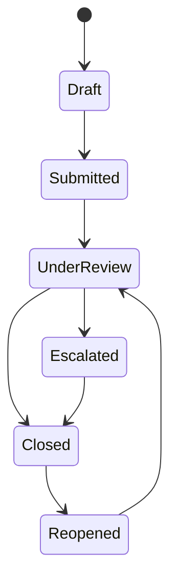

# Part 007 — URI Design and Resource Modeling

Di part sebelumnya kita membahas semantik HTTP method: safety, idempotency, mutation, retry, dan failure recovery.

Sekarang kita masuk ke desain URI dan resource model.

Ini penting karena banyak API gagal bukan karena kodenya sulit, tetapi karena model resource-nya salah sejak awal. Begitu URI sudah dipakai client, ia menjadi kontrak publik. Mengubahnya jauh lebih mahal daripada mengubah class Java internal.

Kesalahan umum:

```text
POST /approveCase
POST /case/updateStatus
GET  /getCaseById?id=123
POST /cases/123/doEscalation
```

Endpoint seperti itu bisa berjalan, tetapi mental model-nya adalah RPC. Jakarta REST tidak melarang RPC-like endpoint, tetapi jika semua endpoint menjadi command procedure, kita kehilangan kelebihan terbesar HTTP: resource addressing, method semantics, caching, conditional request, uniform interface, idempotent retry, dan observability yang mudah dibaca.

Resource model yang baik menjawab pertanyaan:

```text
Apa resource yang dialamatkan?
Apa representasinya?
Apa operasi valid terhadap representasi itu?
Apa perubahan state yang terjadi?
Apa URI yang tetap stabil walaupun internal model berubah?
```

Bukan hanya:

```text
Method Java mana yang ingin saya expose lewat HTTP?
```

---

## 1. Target Pembelajaran

Setelah part ini, kita ingin bisa:

1. Mendesain URI berdasarkan resource, bukan berdasarkan service method.
2. Membedakan collection resource, item resource, nested resource, query/search resource, dan command/action resource.
3. Memakai path parameter dan query parameter secara konsisten.
4. Menentukan kapan nesting URI membantu, dan kapan ia merusak stabilitas API.
5. Mendesain API untuk domain kompleks seperti case management, evidence, escalation, decision, dan audit.
6. Menghindari anti-pattern: verb-in-path, unstable hierarchy, over-nesting, leaky database key, dan endpoint per use case kecil.
7. Menghubungkan URI design dengan Jakarta REST `@Path`, sub-resource, `UriInfo`, dan link generation.

---

## 2. Mental Model: URI Adalah Address, Bukan Function Name

URI adalah alamat resource.

Dalam RFC 3986, URI memiliki komponen seperti scheme, authority, path, query, dan fragment. Untuk API HTTP, bagian yang paling sering kita desain adalah path dan query.

Contoh:

```text
https://api.example.com/v1/cases/CASE-2026-000123/evidence?type=document&status=accepted
|---- scheme -----|---- authority ----|--------- path ----------|---------- query ----------|
```

Path biasanya merepresentasikan identitas/hierarki resource:

```text
/v1/cases/CASE-2026-000123/evidence
```

Query biasanya merepresentasikan parameterisasi terhadap resource tersebut:

```text
?type=document&status=accepted
```

Desain yang sehat:

```text
GET /cases/CASE-2026-000123
```

Artinya:

```text
Ambil representasi resource case dengan identity CASE-2026-000123.
```

Desain yang lemah:

```text
GET /getCaseById?id=CASE-2026-000123
```

Artinya:

```text
Panggil function getCaseById dengan argumen id.
```

Perbedaannya bukan kosmetik. Perbedaan itu memengaruhi caching, observability, documentation, client SDK, security policy, rate limiting, dan cara engineer membaca sistem dari log.

---

## 3. Resource Bukan Selalu Entity Database

Kesalahan paling mahal adalah menyamakan resource dengan table.

Kadang resource memang mirip aggregate/entity:

```text
/cases/{caseId}
/parties/{partyId}
/documents/{documentId}
```

Tetapi resource juga bisa berupa:

- collection;
- search result;
- status/projection;
- transition request;
- decision record;
- audit entry;
- attachment stream;
- generated report;
- import job;
- export job;
- validation result;
- policy evaluation result.

Contoh resource yang bukan table langsung:

```text
GET  /cases/{caseId}/timeline
GET  /cases/{caseId}/summary
POST /cases/{caseId}/evidence-submissions
GET  /exports/{exportId}
GET  /reports/enforcement-backlog?region=ID-JK&period=2026-Q2
```

Yang penting adalah client bisa memahami resource sebagai sesuatu yang punya identitas, representasi, dan lifecycle.

---

## 4. Jakarta REST `@Path` sebagai URI Template

Di Jakarta REST, `@Path` mendeklarasikan URI template pada class atau method.

```java
import jakarta.ws.rs.GET;
import jakarta.ws.rs.Path;
import jakarta.ws.rs.PathParam;
import jakarta.ws.rs.Produces;
import jakarta.ws.rs.core.MediaType;

@Path("/cases")
@Produces(MediaType.APPLICATION_JSON)
public class CaseResource {

    @GET
    @Path("/{caseId}")
    public CaseResponse getCase(@PathParam("caseId") String caseId) {
        return caseQueryService.getCase(caseId);
    }
}
```

Gabungan `@ApplicationPath`, class-level `@Path`, dan method-level `@Path` membentuk final request path.

Jika:

```java
@ApplicationPath("/api")
public class RestApplication extends Application {}
```

Dan:

```java
@Path("/v1/cases")
public class CaseResource {}
```

Maka path efektifnya:

```text
/api/v1/cases
```

Prinsip desain:

```text
Application path  -> deployment/API base boundary
Class path        -> resource family
Method path       -> specific resource/sub-resource operation
```

Jangan jadikan method path sebagai tempat menaruh nama use case Java.

Kurang baik:

```java
@POST
@Path("/{caseId}/approveCase")
public Response approveCase(...) { ... }
```

Lebih baik, tergantung model domain:

```java
@POST
@Path("/{caseId}/approval-decisions")
public Response createApprovalDecision(...) { ... }
```

Atau jika approval adalah state replacement yang punya current representation:

```java
@PUT
@Path("/{caseId}/approval")
public Response replaceApproval(...) { ... }
```

---

## 5. Taxonomy Resource yang Perlu Dikuasai

### 5.1 Collection Resource

Collection resource merepresentasikan kumpulan item.

```text
/cases
/cases/{caseId}/evidence
/parties
/documents
```

Typical operations:

```text
GET  /cases              -> list/search collection
POST /cases              -> create new case
GET  /cases/{caseId}     -> read one case
```

Contoh Jakarta REST:

```java
@Path("/cases")
@Produces(MediaType.APPLICATION_JSON)
@Consumes(MediaType.APPLICATION_JSON)
public class CaseResource {

    @GET
    public PageResponse<CaseSummaryResponse> searchCases(
            @BeanParam CaseSearchRequest request) {
        return caseQueryService.search(request);
    }

    @POST
    public Response createCase(CreateCaseRequest request, @Context UriInfo uriInfo) {
        CaseCreated result = caseCommandService.create(request);

        URI location = uriInfo.getAbsolutePathBuilder()
                .path(result.caseId())
                .build();

        return Response.created(location)
                .entity(CaseResponse.from(result))
                .build();
    }
}
```

Collection resource sebaiknya tidak hanya dianggap sebagai “list endpoint”. Ia adalah boundary untuk collection behavior: create, search, pagination, filtering, bulk-safe operations, dan policy atas collection.

### 5.2 Item Resource

Item resource merepresentasikan satu resource yang punya identity.

```text
/cases/{caseId}
/documents/{documentId}
/users/{userId}
```

Typical operations:

```text
GET    /cases/{caseId}
PUT    /cases/{caseId}
PATCH  /cases/{caseId}
DELETE /cases/{caseId}
```

Contoh:

```java
@GET
@Path("/{caseId}")
public CaseResponse getCase(@PathParam("caseId") String caseId) {
    return caseQueryService.getRequired(caseId);
}

@PATCH
@Path("/{caseId}")
public CaseResponse patchCase(
        @PathParam("caseId") String caseId,
        PatchCaseRequest request) {
    return caseCommandService.patch(caseId, request);
}
```

Item URI harus stabil. Jangan memasukkan atribut yang mungkin berubah ke dalam URI identity.

Rapuh:

```text
/cases/2026/open/jakarta/CASE-123
```

Lebih stabil:

```text
/cases/CASE-123
```

Filter state, wilayah, kategori, atau status sebaiknya ditempatkan sebagai query saat mencari collection:

```text
GET /cases?year=2026&status=open&region=jakarta
```

### 5.3 Nested Resource

Nested resource dipakai ketika resource secara konseptual berada dalam scope parent.

```text
/cases/{caseId}/evidence
/cases/{caseId}/decisions
/cases/{caseId}/timeline
/cases/{caseId}/assignments
```

Contoh:

```java
@GET
@Path("/{caseId}/evidence")
public PageResponse<EvidenceResponse> listEvidence(
        @PathParam("caseId") String caseId,
        @BeanParam EvidenceSearchRequest search) {
    return evidenceQueryService.searchWithinCase(caseId, search);
}
```

Nesting baik jika:

- child tidak bermakna di luar parent;
- authorization selalu bergantung pada parent;
- query selalu dibatasi parent;
- URI menjadi lebih jelas bagi client;
- lifecycle child dikontrol oleh parent.

Nesting buruk jika:

- child punya identity global sendiri;
- child sering diakses lintas parent;
- hierarchy domain bisa berubah;
- path menjadi terlalu panjang;
- client harus tahu internal containment yang sebenarnya implementation detail.

Contoh evidence bisa didesain dua cara.

Jika evidence hanya valid dalam case:

```text
/cases/{caseId}/evidence/{evidenceId}
```

Jika evidence punya identity global dan bisa direferensikan lintas case:

```text
/evidence/{evidenceId}
/cases/{caseId}/evidence-references/{evidenceId}
```

Tidak ada jawaban universal. Yang penting adalah lifecycle dan identity-nya jelas.

### 5.4 Search Resource

Search kadang cukup sebagai query terhadap collection:

```text
GET /cases?status=open&assignee=u123&priority=high
```

Tetapi untuk search kompleks, terutama jika request-nya panjang, sensitif, atau butuh body JSON, kita bisa membuat resource eksplisit:

```text
POST /case-searches
GET  /case-searches/{searchId}/results
```

Atau untuk synchronous query yang tidak perlu persisted search:

```text
POST /cases/search
```

Namun `POST /cases/search` adalah kompromi. Ia lebih procedural, tetapi kadang praktis jika:

- query terlalu kompleks untuk URL;
- filter mengandung banyak struktur nested;
- request mengandung permission-sensitive criteria;
- perlu body JSON;
- tidak ingin menyimpan search sebagai resource.

Untuk sistem enterprise/regulatory, persisted search sering lebih defensible:

```text
POST /case-searches
GET  /case-searches/{searchId}
GET  /case-searches/{searchId}/results
```

Karena search criteria bisa diaudit, direplay, dan dijadikan evidence untuk keputusan operasional.

### 5.5 Command atau Action Resource

REST tidak berarti semua domain action harus dipaksa menjadi CRUD dangkal.

Domain seperti regulatory enforcement punya command nyata:

- submit evidence;
- assign investigator;
- escalate case;
- approve closure;
- reopen case;
- generate notice;
- issue sanction;
- request clarification.

Pertanyaannya bukan “bolehkah action?” tetapi “apakah action itu bisa dimodelkan sebagai resource?”

Buruk:

```text
POST /cases/{caseId}/escalate
POST /cases/{caseId}/approve
POST /cases/{caseId}/close
```

Lebih baik:

```text
POST /cases/{caseId}/escalations
POST /cases/{caseId}/approval-decisions
POST /cases/{caseId}/closure-decisions
```

Kenapa?

Karena escalation, approval decision, dan closure decision biasanya punya:

- actor;
- timestamp;
- reason;
- evidence basis;
- previous state;
- resulting state;
- audit record;
- idempotency key;
- review outcome.

Dengan menjadikannya resource, kita bisa mengembalikan:

```text
201 Created
Location: /cases/{caseId}/escalations/{escalationId}
```

Itu jauh lebih kaya daripada:

```text
200 OK
{"status":"escalated"}
```

---

## 6. Path Parameter vs Query Parameter

Gunakan path parameter untuk identity atau containment.

```text
/cases/{caseId}
/cases/{caseId}/evidence/{evidenceId}
```

Gunakan query parameter untuk filtering, sorting, projection, pagination, optional behavior, dan non-identity modifier.

```text
/cases?status=open&assignee=u123&pageSize=50
/cases/{caseId}/timeline?includeSystemEvents=true
/documents?type=notice&createdAfter=2026-01-01
```

Rule of thumb:

```text
Jika parameter diperlukan untuk mengidentifikasi resource utama -> path.
Jika parameter mengubah view terhadap resource/collection -> query.
```

Contoh salah:

```text
GET /cases/status/open/assignee/u123
```

Ini membuat filter seolah-olah identity hierarchy. Akibatnya URI menjadi sulit dievolusikan.

Lebih baik:

```text
GET /cases?status=open&assignee=u123
```

### 6.1 Filter yang Banyak

Jika filter bertambah banyak, tetap jangan buru-buru memindahkan semuanya ke path.

Masih baik:

```text
GET /cases?status=open&priority=high&region=ID-JK&createdAfter=2026-01-01&sort=-createdAt
```

Mulai perlu search resource:

```json
{
  "status": ["OPEN", "UNDER_REVIEW"],
  "priority": ["HIGH", "CRITICAL"],
  "region": {
    "include": ["ID-JK", "ID-BT"],
    "exclude": ["ID-JK-ARCHIVED"]
  },
  "createdAt": {
    "from": "2026-01-01T00:00:00Z",
    "to": "2026-06-30T23:59:59Z"
  },
  "hasEvidenceType": ["FINANCIAL_RECORD", "WITNESS_STATEMENT"]
}
```

Model:

```text
POST /case-searches
GET  /case-searches/{searchId}/results
```

---

## 7. Naming: Nouns, Plurals, and Domain Language

URI sebaiknya memakai noun/resource name.

Baik:

```text
/cases
/cases/{caseId}
/cases/{caseId}/evidence
/cases/{caseId}/decisions
```

Kurang baik:

```text
/getCases
/createCase
/updateCaseStatus
/deleteEvidence
```

Gunakan plural untuk collection:

```text
/cases
/documents
/investigators
```

Item tetap berada di bawah collection:

```text
/cases/{caseId}
/documents/{documentId}
```

Gunakan domain language yang client pahami, bukan internal implementation language.

Buruk:

```text
/caseAggregateRoots/{aggregateId}
/case_tbl/{case_pk}
/wf_task_instance/{taskId}
```

Lebih baik:

```text
/cases/{caseId}
/cases/{caseId}/tasks/{taskId}
```

Jika sistem internal memakai BPMN/Camunda, jangan bocorkan istilah process instance ke API publik kecuali client memang perlu mengelola process runtime sebagai domain resource.

Buruk:

```text
/process-instances/{processInstanceId}/variables/caseStatus
```

Lebih domain-friendly:

```text
/cases/{caseId}/state
/cases/{caseId}/workflow-tasks
```

---

## 8. URI Versioning

Ada beberapa strategi versioning:

```text
Path versioning:       /v1/cases
Media type versioning: Accept: application/vnd.example.case.v1+json
Header versioning:     X-API-Version: 1
No explicit version:   compatibility through additive changes
```

Untuk banyak organisasi, path versioning paling mudah dioperasikan:

```text
/api/v1/cases
/api/v2/cases
```

Tetapi jangan jadikan version sebagai alasan untuk breaking change sembarangan. Version adalah compatibility boundary, bukan tempat membuang discipline.

Guideline praktis:

- pakai `/v1` di API publik atau lintas tim besar;
- hindari version per endpoint kecil;
- jangan bump versi hanya karena field baru additive;
- dokumentasikan deprecation policy;
- pisahkan versioning API contract dari versioning service deployment.

Contoh Jakarta REST:

```java
@Path("/v1/cases")
public class CaseResourceV1 { }

@Path("/v2/cases")
public class CaseResourceV2 { }
```

Atau gunakan class yang sama jika perbedaan tidak besar, tetapi hati-hati agar branching tidak membuat class sulit dibaca.

---

## 9. Over-Nesting dan Hierarchy Trap

Nesting terlalu dalam membuat API rapuh.

Buruk:

```text
/organizations/{orgId}/regions/{regionId}/departments/{deptId}/investigators/{investigatorId}/cases/{caseId}/evidence/{evidenceId}/attachments/{attachmentId}
```

Masalah:

- terlalu banyak parent harus diketahui client;
- jika struktur organisasi berubah, URI ikut berubah;
- authorization logic menjadi berat;
- log sulit dibaca;
- cache key panjang dan noisy;
- endpoint cenderung mengandung detail internal.

Lebih baik:

```text
/cases/{caseId}
/cases/{caseId}/evidence/{evidenceId}
/evidence/{evidenceId}/attachments/{attachmentId}
/investigators/{investigatorId}/assignments
```

Gunakan query untuk scope administratif:

```text
GET /cases?organizationId=o123&regionId=ID-JK&departmentId=d456
```

Batas praktis:

```text
1 level nesting: biasanya aman
2 level nesting: masih wajar jika lifecycle benar-benar nested
3+ level nesting: perlu desain ulang kecuali ada alasan domain kuat
```

---

## 10. Identity Design

URI identity harus:

- stabil;
- opaque bagi client bila memungkinkan;
- tidak mengekspos detail database;
- tidak mengandung informasi sensitif;
- aman ditaruh di log;
- tidak mudah ditebak jika resource sensitif dan authorization lemah;
- kompatibel dengan URL encoding.

### 10.1 Database ID Leak

Kurang ideal:

```text
/cases/982134
```

Tidak selalu salah. Numeric ID bisa diterima untuk internal API yang aman. Tetapi untuk public/high-risk API, numeric sequential ID menambah risiko enumeration.

Lebih baik:

```text
/cases/CASE-2026-000123
/cases/01J1Z9N3K6T6QW8TK6R5K6F5SP
/cases/case_7b6b9c2a4e4a4e4d
```

### 10.2 Semantic ID vs Opaque ID

Semantic ID:

```text
CASE-2026-000123
```

Kelebihan:

- mudah dibaca manusia;
- cocok untuk regulatory/case tracking;
- bisa dipakai di dokumen resmi.

Risiko:

- bisa mengandung informasi yang berubah;
- bisa memperlihatkan volume atau urutan kasus;
- format sulit diubah.

Opaque ID:

```text
01J1Z9N3K6T6QW8TK6R5K6F5SP
```

Kelebihan:

- tidak bocor domain;
- lebih stabil;
- cocok untuk distributed generation.

Risiko:

- kurang manusiawi;
- butuh display/reference number terpisah.

Untuk sistem regulatory, sering paling baik memakai dua field:

```json
{
  "id": "01J1Z9N3K6T6QW8TK6R5K6F5SP",
  "caseNumber": "CASE-2026-000123"
}
```

URI memakai `id` atau `caseNumber` tergantung kebutuhan operasi. Jika client manusia dan dokumen hukum sering memakai case number, gunakan case number sebagai route key tetapi pastikan ia immutable.

---

## 11. Resource Modeling untuk State Transition

State transition adalah area yang sering membuat API menjadi RPC.

Misalnya case punya state:



Pendekatan buruk:

```text
POST /cases/{caseId}/submit
POST /cases/{caseId}/startReview
POST /cases/{caseId}/escalate
POST /cases/{caseId}/close
POST /cases/{caseId}/reopen
```

Pendekatan lebih resource-oriented:

```text
POST /cases/{caseId}/submissions
POST /cases/{caseId}/review-assignments
POST /cases/{caseId}/escalations
POST /cases/{caseId}/closure-decisions
POST /cases/{caseId}/reopen-decisions
```

Setiap transition menghasilkan record.

Contoh request:

```http
POST /cases/CASE-2026-000123/escalations
Content-Type: application/json
Idempotency-Key: esc-CASE-2026-000123-2026-06-27T10:15:00Z

{
  "reasonCode": "PUBLIC_INTEREST_HIGH",
  "reasonText": "Repeated non-compliance across related parties.",
  "evidenceIds": ["ev_001", "ev_002"],
  "targetUnit": "ENFORCEMENT_BOARD"
}
```

Response:

```http
HTTP/1.1 201 Created
Location: /cases/CASE-2026-000123/escalations/esc_789
Content-Type: application/json

{
  "id": "esc_789",
  "caseId": "CASE-2026-000123",
  "previousState": "UNDER_REVIEW",
  "resultingState": "ESCALATED",
  "reasonCode": "PUBLIC_INTEREST_HIGH",
  "createdAt": "2026-06-27T10:15:01Z",
  "createdBy": "user_123"
}
```

Keuntungan:

- audit trail natural;
- retry bisa idempotent;
- client bisa melihat transition history;
- authorization bisa spesifik per transition type;
- failure contract lebih jelas;
- legal defensibility lebih kuat.

---

## 12. Modeling Partial Views dan Projections

Tidak semua client butuh representasi lengkap.

Pilihan desain:

### 12.1 Dedicated Summary Resource

```text
GET /cases/{caseId}/summary
```

Cocok jika summary adalah domain projection resmi.

### 12.2 Sparse Fields

```text
GET /cases/{caseId}?fields=id,caseNumber,status,priority
```

Cocok untuk API internal yang ingin efisiensi payload.

### 12.3 Collection Summary

```text
GET /cases
```

Mengembalikan summary item:

```json
{
  "items": [
    {
      "id": "case_123",
      "caseNumber": "CASE-2026-000123",
      "status": "UNDER_REVIEW",
      "priority": "HIGH"
    }
  ]
}
```

Detail lengkap hanya pada:

```text
GET /cases/{caseId}
```

Rule praktis:

- list endpoint jangan mengembalikan semua detail berat;
- detail endpoint boleh lebih lengkap;
- projection official lebih baik daripada fieldset bebas jika domain regulated dan harus konsisten;
- fieldset bebas perlu validasi dan observability karena bisa menjadi sumber query mahal.

---

## 13. Pagination URI Design

Kita akan membahas pagination lebih lengkap di part contract design, tetapi URI model-nya perlu dikenalkan di sini.

Offset pagination:

```text
GET /cases?page=3&pageSize=50
GET /cases?offset=100&limit=50
```

Cursor pagination:

```text
GET /cases?cursor=eyJjcmVhdGVkQXQiOiIyMDI2LTA2LTI3In0&limit=50
```

Keyset-like pagination:

```text
GET /cases?createdBefore=2026-06-27T10:00:00Z&limit=50
```

Untuk data mutable besar, cursor/keyset biasanya lebih stabil daripada offset.

Response sebaiknya memberikan links:

```json
{
  "items": [],
  "page": {
    "limit": 50,
    "nextCursor": "eyJjcmVhdGVkQXQiOiIyMDI2LTA2LTI3In0"
  },
  "links": {
    "self": "/cases?limit=50",
    "next": "/cases?cursor=eyJjcmVhdGVkQXQiOiIyMDI2LTA2LTI3In0&limit=50"
  }
}
```

Dengan Jakarta REST, link generation sebaiknya memakai `UriInfo`/`UriBuilder`, bukan string concatenation.

```java
URI next = uriInfo.getAbsolutePathBuilder()
        .replaceQueryParam("cursor", page.nextCursor())
        .replaceQueryParam("limit", request.limit())
        .build();
```

---

## 14. URI Generation: Jangan Concatenate String Manual

Buruk:

```java
String location = "/api/v1/cases/" + caseId;
return Response.created(URI.create(location)).build();
```

Masalah:

- base path bisa berubah;
- reverse proxy bisa memengaruhi external URI;
- encoding raw ID sering salah;
- slash ganda atau hilang;
- query escaping salah;
- sulit dites.

Lebih baik:

```java
@POST
public Response createCase(CreateCaseRequest request, @Context UriInfo uriInfo) {
    CaseCreated created = caseCommandService.create(request);

    URI location = uriInfo.getAbsolutePathBuilder()
            .path(created.caseId())
            .build();

    return Response.created(location)
            .entity(CaseResponse.from(created))
            .build();
}
```

Untuk path method/class, gunakan `UriBuilder` jika perlu:

```java
URI uri = uriInfo.getBaseUriBuilder()
        .path(CaseResource.class)
        .path(CaseResource.class, "getCase")
        .build(caseId);
```

Catatan: penggunaan method reference berbasis nama method bisa rentan rename jika tidak ada test. Pastikan link generation tercakup contract test.

---

## 15. Sub-Resource Locator untuk Resource Tree

Sub-resource locator berguna ketika resource tree kompleks dan kita ingin memisahkan class.

```java
@Path("/cases")
public class CaseResource {

    @Path("/{caseId}/evidence")
    public EvidenceResource evidence(@PathParam("caseId") String caseId) {
        return new EvidenceResource(caseId);
    }
}
```

```java
public class EvidenceResource {
    private final String caseId;

    public EvidenceResource(String caseId) {
        this.caseId = caseId;
    }

    @GET
    public PageResponse<EvidenceResponse> list(@BeanParam EvidenceSearchRequest search) {
        return evidenceQueryService.search(caseId, search);
    }

    @GET
    @Path("/{evidenceId}")
    public EvidenceResponse get(@PathParam("evidenceId") String evidenceId) {
        return evidenceQueryService.get(caseId, evidenceId);
    }
}
```

Namun hati-hati: resource object lifecycle dan dependency injection bisa berbeda antar implementation/runtime. Di environment CDI, lebih baik jangan sembarang `new` object yang butuh injection. Gunakan pattern yang didukung runtime atau pertahankan method langsung jika lebih sederhana.

Alternatif sederhana:

```java
@Path("/cases/{caseId}/evidence")
public class CaseEvidenceResource {

    @GET
    public PageResponse<EvidenceResponse> list(
            @PathParam("caseId") String caseId,
            @BeanParam EvidenceSearchRequest search) {
        return evidenceQueryService.search(caseId, search);
    }
}
```

Untuk production, sering lebih jelas membuat resource class per resource family daripada membuat sub-resource locator dalam-dalam.

---

## 16. Matrix Parameter: Tahu, tetapi Jangan Jadikan Default

Jakarta REST mendukung matrix parameter melalui `@MatrixParam`.

Contoh URI:

```text
/cases;status=open;priority=high
```

Contoh Java:

```java
@GET
@Path("/cases")
public PageResponse<CaseSummaryResponse> search(
        @MatrixParam("status") String status,
        @MatrixParam("priority") String priority) {
    return caseQueryService.search(status, priority);
}
```

Dalam praktik modern API HTTP/JSON, query parameter jauh lebih umum:

```text
/cases?status=open&priority=high
```

Gunakan matrix param hanya jika:

- organisasi punya standar internal yang jelas;
- intermediary/proxy/gateway tidak menghapus semicolon path parameter;
- client tooling mendukung;
- dokumentasi dan test sudah kuat.

Kalau tidak, query parameter lebih aman secara operasional.

---

## 17. API untuk Long-Running Operation

Long-running operation tidak cocok dipaksa synchronous.

Buruk:

```text
POST /reports/generate-enforcement-backlog
```

Menunggu 2 menit lalu timeout.

Lebih baik:

```text
POST /report-jobs
GET  /report-jobs/{jobId}
GET  /report-jobs/{jobId}/result
```

Request:

```http
POST /report-jobs
Content-Type: application/json

{
  "type": "ENFORCEMENT_BACKLOG",
  "period": "2026-Q2",
  "region": "ID-JK"
}
```

Response:

```http
HTTP/1.1 202 Accepted
Location: /report-jobs/job_123
Content-Type: application/json

{
  "id": "job_123",
  "status": "ACCEPTED",
  "links": {
    "self": "/report-jobs/job_123"
  }
}
```

Kemudian:

```text
GET /report-jobs/job_123
```

Response:

```json
{
  "id": "job_123",
  "status": "COMPLETED",
  "links": {
    "result": "/report-jobs/job_123/result"
  }
}
```

Ini membuat timeout, retry, observability, dan audit jauh lebih jelas.

---

## 18. URI Design untuk Audit dan Evidence

Domain regulated butuh URI yang merepresentasikan jejak keputusan, bukan hanya current state.

Contoh model:

```text
/cases/{caseId}
/cases/{caseId}/evidence
/cases/{caseId}/evidence/{evidenceId}
/cases/{caseId}/decisions
/cases/{caseId}/decisions/{decisionId}
/cases/{caseId}/timeline
/cases/{caseId}/audit-events
/cases/{caseId}/state-transitions
```

Perhatikan perbedaan:

```text
/cases/{caseId}/state
/cases/{caseId}/state-transitions
```

`state` adalah current projection.

`state-transitions` adalah historical records.

Untuk defensibility, jangan hanya menyimpan final state. Simpan juga transition record yang bisa dialamatkan.

Contoh:

```text
GET /cases/CASE-2026-000123/state
GET /cases/CASE-2026-000123/state-transitions
GET /cases/CASE-2026-000123/state-transitions/tr_456
```

Ini membantu ketika auditor bertanya:

```text
Siapa yang mengubah case dari UNDER_REVIEW ke ESCALATED, kapan, berdasarkan evidence apa, dan rule apa?
```

API yang matang bisa menjawab melalui resource, bukan query manual ke database.

---

## 19. Anti-Pattern URI Design

### 19.1 Verb-in-Path Everywhere

```text
/createCase
/updateCase
/deleteCase
/approveCase
/rejectCase
```

Masalah:

- menduplikasi HTTP method;
- mengubah API menjadi RPC;
- sulit menerapkan idempotency;
- observability kurang konsisten.

Perbaikan:

```text
POST   /cases
PATCH  /cases/{caseId}
DELETE /cases/{caseId}
POST   /cases/{caseId}/approval-decisions
```

### 19.2 Query Parameter sebagai Identity Utama

```text
GET /case?id=CASE-123
```

Perbaikan:

```text
GET /cases/CASE-123
```

### 19.3 Deep Internal Hierarchy

```text
/orgs/{orgId}/departments/{deptId}/teams/{teamId}/users/{userId}/cases/{caseId}
```

Perbaikan:

```text
GET /cases/{caseId}
GET /cases?organizationId={orgId}&departmentId={deptId}&teamId={teamId}&assigneeId={userId}
```

### 19.4 Leaky Workflow Engine URI

```text
/process-definition/key/enforcement/process-instance/{id}/task/{taskId}/complete
```

Perbaikan:

```text
POST /cases/{caseId}/workflow-tasks/{taskId}/completions
```

### 19.5 Endpoint per UI Button

```text
POST /caseScreen/submitButtonClicked
POST /caseScreen/assignButtonClicked
POST /caseScreen/escalateButtonClicked
```

Perbaikan:

```text
POST /cases/{caseId}/submissions
POST /cases/{caseId}/assignments
POST /cases/{caseId}/escalations
```

API tidak boleh mengikuti komponen UI terlalu dekat. UI berubah lebih sering daripada domain resource.

---

## 20. Resource Design Checklist

Gunakan checklist ini sebelum menulis resource class.

### 20.1 Resource Identity

- Apa resource utamanya?
- Apakah resource punya identity stabil?
- Apakah URI mengandung field yang mungkin berubah?
- Apakah ID aman muncul di log?
- Apakah client perlu memahami ID format?

### 20.2 Collection dan Item

- Apakah collection resource jelas?
- Apakah item resource jelas?
- Apakah create operation berada di collection?
- Apakah read/update/delete berada di item?
- Apakah list response memakai summary representation?

### 20.3 Query dan Filter

- Apakah filter ditempatkan di query, bukan path?
- Apakah sorting grammar jelas?
- Apakah pagination stabil untuk data besar?
- Apakah filter kompleks perlu search resource?

### 20.4 State Transition

- Apakah transition dimodelkan sebagai resource/record?
- Apakah response mengandung resulting state?
- Apakah transition idempotent jika retry?
- Apakah audit record bisa dialamatkan?
- Apakah invalid transition menghasilkan error contract jelas?

### 20.5 Nesting

- Apakah nested resource benar-benar bergantung pada parent?
- Apakah parent hierarchy stabil?
- Apakah path lebih dari dua level?
- Apakah child punya identity global?

### 20.6 Operability

- Apakah URI mudah dibaca di access log?
- Apakah route cardinality terkendali?
- Apakah sensitive data tidak masuk path/query?
- Apakah link generation memakai `UriBuilder`/`UriInfo`?

---

## 21. Case Study: Regulatory Case API

Misal kita punya domain:

- case;
- party;
- allegation;
- evidence;
- investigator assignment;
- escalation;
- decision;
- notice;
- sanction;
- audit event.

Resource model awal:

```text
/cases
/cases/{caseId}
/cases/{caseId}/parties
/cases/{caseId}/allegations
/cases/{caseId}/evidence
/cases/{caseId}/assignments
/cases/{caseId}/escalations
/cases/{caseId}/decisions
/cases/{caseId}/notices
/cases/{caseId}/sanctions
/cases/{caseId}/timeline
/cases/{caseId}/audit-events
```

Diagram:

```mermaid
flowchart TD
    Cases[/cases/]
    Case[/cases/{caseId}/]
    Parties[/cases/{caseId}/parties/]
    Allegations[/cases/{caseId}/allegations/]
    Evidence[/cases/{caseId}/evidence/]
    Assignments[/cases/{caseId}/assignments/]
    Escalations[/cases/{caseId}/escalations/]
    Decisions[/cases/{caseId}/decisions/]
    Notices[/cases/{caseId}/notices/]
    Sanctions[/cases/{caseId}/sanctions/]
    Timeline[/cases/{caseId}/timeline/]
    Audit[/cases/{caseId}/audit-events/]

    Cases --> Case
    Case --> Parties
    Case --> Allegations
    Case --> Evidence
    Case --> Assignments
    Case --> Escalations
    Case --> Decisions
    Case --> Notices
    Case --> Sanctions
    Case --> Timeline
    Case --> Audit
```

Resource method sketch:

```java
@Path("/v1/cases")
@Produces(MediaType.APPLICATION_JSON)
@Consumes(MediaType.APPLICATION_JSON)
public class CaseResource {

    @GET
    public PageResponse<CaseSummaryResponse> searchCases(@BeanParam CaseSearchRequest request) {
        return caseQueries.search(request);
    }

    @POST
    public Response createCase(CreateCaseRequest request, @Context UriInfo uriInfo) {
        CaseCreated created = caseCommands.create(request);
        URI location = uriInfo.getAbsolutePathBuilder()
                .path(created.caseId())
                .build();
        return Response.created(location)
                .entity(CaseResponse.from(created))
                .build();
    }

    @GET
    @Path("/{caseId}")
    public CaseResponse getCase(@PathParam("caseId") String caseId) {
        return caseQueries.getRequired(caseId);
    }

    @POST
    @Path("/{caseId}/escalations")
    public Response escalate(
            @PathParam("caseId") String caseId,
            CreateEscalationRequest request,
            @HeaderParam("Idempotency-Key") String idempotencyKey,
            @Context UriInfo uriInfo) {

        EscalationCreated created = caseCommands.escalate(caseId, request, idempotencyKey);

        URI location = uriInfo.getAbsolutePathBuilder()
                .path(created.escalationId())
                .build();

        return Response.created(location)
                .entity(EscalationResponse.from(created))
                .build();
    }
}
```

Yang penting: `escalate` sebagai method Java boleh bernama verb karena itu detail internal. URI publik tetap resource-oriented: `/escalations`.

---

## 22. Latihan Kaufman: URI Refactoring Drill

Ambil daftar endpoint RPC berikut:

```text
POST /createCase
POST /assignCaseToInvestigator
POST /uploadEvidence
POST /approveClosure
POST /generateNotice
GET  /getCaseTimeline?id=CASE-123
GET  /getOpenCasesByRegion?region=ID-JK
POST /reopenCase
```

Refactor menjadi resource-oriented URI:

```text
POST /cases
POST /cases/{caseId}/assignments
POST /cases/{caseId}/evidence
POST /cases/{caseId}/closure-decisions
POST /cases/{caseId}/notices
GET  /cases/{caseId}/timeline
GET  /cases?status=open&region=ID-JK
POST /cases/{caseId}/reopen-decisions
```

Lalu jawab untuk setiap endpoint:

1. Resource apa yang dialamatkan?
2. Apakah operation safe/idempotent?
3. Apa status code suksesnya?
4. Apakah response perlu `Location`?
5. Apakah retry aman?
6. Apa audit record yang tercipta?
7. Apakah URI akan tetap benar jika internal workflow engine berubah?

---

## 23. Ringkasan

URI design bukan aktivitas naming biasa. Ia adalah desain kontrak jangka panjang.

Prinsip utama:

- URI adalah alamat resource, bukan function name.
- Resource tidak selalu sama dengan database entity.
- Collection dan item resource harus jelas.
- Path parameter untuk identity; query parameter untuk view/filter.
- State transition sering lebih baik dimodelkan sebagai resource record.
- Hindari verb-in-path, over-nesting, dan leakage dari database/workflow engine.
- Gunakan `UriInfo`/`UriBuilder` untuk membangun URI.
- Untuk domain regulated, desain URI harus mendukung audit, replay, traceability, dan legal defensibility.

Jika part 005 menjawab “bagaimana mendesain resource class”, part ini menjawab “resource apa yang pantas ada dan bagaimana ia dialamatkan”.

Part berikutnya akan membahas parameter injection: `@PathParam`, `@QueryParam`, `@HeaderParam`, `@CookieParam`, `@MatrixParam`, `@BeanParam`, default value, conversion, encoding, dan boundary validation.

---

## Referensi

- Jakarta RESTful Web Services 4.0 Specification — https://jakarta.ee/specifications/restful-ws/4.0/jakarta-restful-ws-spec-4.0
- Jakarta RESTful Web Services 4.0 API — https://jakarta.ee/specifications/restful-ws/4.0/apidocs/
- RFC 3986: Uniform Resource Identifier Generic Syntax — https://datatracker.ietf.org/doc/html/rfc3986
- RFC 6570: URI Template — https://datatracker.ietf.org/doc/html/rfc6570
