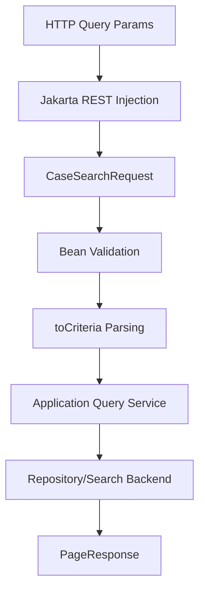

# Part 008 — Parameter Injection

Di part sebelumnya kita mendesain URI dan resource model. Sekarang kita membahas bagaimana data dari HTTP request masuk ke resource method Jakarta REST.

Parameter injection terlihat sederhana:

```java
@GET
@Path("/{caseId}")
public CaseResponse get(@PathParam("caseId") String caseId) {
    return caseService.get(caseId);
}
```

Tetapi di production, parameter injection adalah boundary penting. Di sinilah raw HTTP input berubah menjadi Java value. Kesalahan kecil bisa menghasilkan bug yang sulit dilacak:

- ID salah decode;
- optional parameter ambigu;
- default value menyembunyikan input invalid;
- list parameter tidak konsisten;
- header palsu dipercaya;
- filter query tidak tervalidasi;
- conversion error menjadi 500, bukan 400;
- `@BeanParam` menjadi object besar tanpa invariant.

Mental model part ini:

```text
HTTP request metadata/body
        ↓
Jakarta REST parameter source
        ↓
conversion + defaulting + decoding
        ↓
resource method argument / bean field
        ↓
explicit validation + application boundary
```

Parameter injection bukan tempat business rule utama. Ia adalah input mapping boundary.

---

## 1. Target Pembelajaran

Setelah part ini, kita ingin bisa:

1. Memahami sumber injection: path, query, header, cookie, matrix, form, context, dan bean param.
2. Memilih annotation yang tepat untuk setiap jenis input.
3. Mendesain request parameter object dengan `@BeanParam` tanpa menjadi “god request”.
4. Memahami conversion rules, default value, collection value, dan optional value.
5. Mengelola encoded/decoded value secara aman.
6. Menentukan mana yang harus divalidasi di boundary dan mana yang harus divalidasi di application layer.
7. Membuat parameter injection yang testable, explicit, dan aman untuk production.

---

## 2. Taxonomy Parameter Injection

Jakarta REST menyediakan beberapa annotation utama untuk mengambil data dari HTTP request:

| Annotation | Source HTTP | Typical Use |
|---|---|---|
| `@PathParam` | URI path template | resource identity |
| `@QueryParam` | query string | filter, pagination, sorting, projection |
| `@HeaderParam` | HTTP header | correlation ID, idempotency key, conditional request, content negotiation adjunct |
| `@CookieParam` | Cookie header | session-ish value, legacy browser integration |
| `@MatrixParam` | matrix parameter in path segment | uncommon path-scoped parameters |
| `@FormParam` | `application/x-www-form-urlencoded` body | form post, legacy integration |
| `@BeanParam` | aggregate of supported injection annotations | grouped request parameters |
| `@Context` | runtime/context object | `UriInfo`, `HttpHeaders`, `Request`, `SecurityContext`, etc. |

Contoh gabungan:

```java
@GET
@Path("/{caseId}/evidence")
public PageResponse<EvidenceResponse> listEvidence(
        @PathParam("caseId") String caseId,
        @QueryParam("type") String type,
        @QueryParam("status") String status,
        @QueryParam("limit") @DefaultValue("50") int limit,
        @HeaderParam("X-Correlation-Id") String correlationId,
        @Context UriInfo uriInfo) {
    ...
}
```

Untuk endpoint kecil, parameter langsung masih oke. Untuk endpoint dengan banyak query params, gunakan request bean.

---

## 3. `@PathParam`: Identity dari URI Template

`@PathParam` mengambil nilai dari URI template.

```java
@Path("/cases/{caseId}")
public class CaseResource {

    @GET
    public CaseResponse getCase(@PathParam("caseId") String caseId) {
        return caseQueryService.getRequired(caseId);
    }
}
```

Path param sebaiknya merepresentasikan identity resource, bukan filter.

Baik:

```text
GET /cases/CASE-2026-000123
```

Kurang baik:

```text
GET /cases/status/open
```

Gunakan query untuk filter:

```text
GET /cases?status=open
```

### 3.1 Path Param dengan Regex

Jakarta REST `@Path` mendukung template parameter dengan regular expression.

Contoh:

```java
@GET
@Path("/{caseId: CASE-[0-9]{4}-[0-9]{6}}")
public CaseResponse getCase(@PathParam("caseId") String caseId) {
    return caseQueryService.getRequired(caseId);
}
```

Regex bisa membantu route matching dan error lebih awal, tetapi jangan berlebihan.

Gunakan regex untuk:

- menghindari ambiguity antar path;
- membedakan numeric ID vs slug;
- format ID yang benar-benar stabil;
- mencegah route salah match.

Jangan gunakan regex untuk seluruh business validation. Format syntactic boleh di path regex; invariant domain tetap di validation/application layer.

### 3.2 Path Param sebagai Typed Value Object

Daripada menyebar `String caseId`, kita bisa memakai value object jika conversion didukung.

```java
public record CaseId(String value) {
    public CaseId {
        if (value == null || value.isBlank()) {
            throw new IllegalArgumentException("caseId is required");
        }
    }

    public static CaseId valueOf(String value) {
        return new CaseId(value);
    }
}
```

```java
@GET
@Path("/{caseId}")
public CaseResponse getCase(@PathParam("caseId") CaseId caseId) {
    return caseQueryService.getRequired(caseId);
}
```

Jakarta REST conversion dapat memakai bentuk seperti constructor string, `valueOf`, atau converter provider tergantung type dan runtime support. Untuk type penting, lebih eksplisit memakai `ParamConverterProvider` yang akan dibahas di bagian bawah.

### 3.3 `PathSegment`

Jika perlu membaca matrix parameter atau raw segment, gunakan `PathSegment`.

```java
@GET
@Path("/{segment}")
public Response inspect(@PathParam("segment") PathSegment segment) {
    String path = segment.getPath();
    MultivaluedMap<String, String> matrix = segment.getMatrixParameters();
    ...
}
```

Ini jarang dibutuhkan untuk JSON API umum, tetapi berguna saat API memakai matrix parameters atau segment-level metadata.

---

## 4. `@QueryParam`: Filter, Pagination, Sorting, Projection

`@QueryParam` mengambil nilai dari query string.

```java
@GET
@Path("/cases")
public PageResponse<CaseSummaryResponse> searchCases(
        @QueryParam("status") String status,
        @QueryParam("assignee") String assignee,
        @QueryParam("limit") @DefaultValue("50") int limit) {
    ...
}
```

Query parameter cocok untuk:

- filtering;
- pagination;
- sorting;
- projection;
- optional include/exclude;
- search criteria sederhana;
- behavior modifier yang tidak mengubah resource identity.

Contoh:

```text
GET /cases?status=open&assignee=user_123&limit=50&sort=-createdAt
```

### 4.1 Jangan Percaya Query Param sebagai Domain Value

`@QueryParam("limit") int limit` bukan berarti input valid.

Kita masih perlu batas:

```java
public record PageRequest(int limit, String cursor) {
    public PageRequest {
        if (limit < 1 || limit > 200) {
            throw new BadRequestException("limit must be between 1 and 200");
        }
    }
}
```

Atau validasi Bean Validation:

```java
public class CaseSearchRequest {
    @QueryParam("limit")
    @DefaultValue("50")
    @Min(1)
    @Max(200)
    public int limit;

    @QueryParam("cursor")
    public String cursor;
}
```

Gunakan validasi boundary untuk error yang client bisa perbaiki.

### 4.2 Multi-Value Query Parameter

Client bisa mengirim:

```text
GET /cases?status=open&status=under_review
```

Resource method:

```java
@GET
public PageResponse<CaseSummaryResponse> search(
        @QueryParam("status") List<String> statuses) {
    return caseQueryService.searchByStatuses(statuses);
}
```

Atau:

```java
@QueryParam("status") Set<CaseStatus> statuses
```

Tetapi tentukan grammar secara eksplisit.

Dua gaya umum:

```text
Repeated param: ?status=open&status=under_review
CSV param:      ?status=open,under_review
```

Repeated param lebih sesuai dengan model query parameter multi-value HTTP. CSV sering praktis, tetapi butuh parsing custom dan escaping jika value bisa mengandung koma.

Recommendation:

```text
Gunakan repeated query parameter untuk multi-value filter.
```

### 4.3 Sorting Grammar

Jangan biarkan sorting menjadi raw SQL-ish string.

Buruk:

```text
GET /cases?sort=created_at desc;drop table
```

Lebih baik:

```text
GET /cases?sort=-createdAt
GET /cases?sort=priority,-createdAt
```

Lalu parse terhadap allowlist:

```java
private static final Set<String> ALLOWED_SORT_FIELDS = Set.of(
        "createdAt", "priority", "status", "caseNumber"
);
```

Jangan langsung meneruskan query param ke SQL/order builder tanpa validasi allowlist.

### 4.4 Projection Grammar

```text
GET /cases/{caseId}?fields=id,caseNumber,status,priority
```

Projection bisa membantu payload efficiency, tetapi meningkatkan complexity:

- authorization per field;
- caching;
- test matrix;
- documentation;
- accidental heavy query;
- serialization variability.

Untuk domain regulated, lebih aman menggunakan named projection:

```text
GET /cases/{caseId}?view=summary
GET /cases/{caseId}?view=detail
GET /cases/{caseId}?view=audit
```

Atau dedicated resource:

```text
GET /cases/{caseId}/summary
```

---

## 5. `@HeaderParam`: Metadata, Control, and Trust Boundary

`@HeaderParam` mengambil HTTP header.

```java
@POST
@Path("/{caseId}/escalations")
public Response escalate(
        @PathParam("caseId") String caseId,
        @HeaderParam("Idempotency-Key") String idempotencyKey,
        CreateEscalationRequest request) {
    ...
}
```

Header cocok untuk request metadata, bukan domain entity field utama.

Common headers:

```text
X-Correlation-Id
Idempotency-Key
If-Match
If-None-Match
If-Unmodified-Since
Authorization
Accept-Language
Prefer
```

### 5.1 Correlation ID

```java
@GET
@Path("/{caseId}")
public CaseResponse get(
        @PathParam("caseId") String caseId,
        @HeaderParam("X-Correlation-Id") String correlationId) {
    ...
}
```

Namun untuk cross-cutting concern seperti correlation ID, lebih baik gunakan `ContainerRequestFilter`, bukan mengulang parameter di semua resource method.

Resource method cukup menerima correlation ID jika use case benar-benar perlu menyimpannya sebagai domain/audit metadata.

### 5.2 Idempotency Key

Untuk operation non-idempotent yang perlu aman di-retry:

```http
POST /cases/CASE-123/escalations
Idempotency-Key: esc-CASE-123-001
```

Resource:

```java
@POST
@Path("/{caseId}/escalations")
public Response createEscalation(
        @PathParam("caseId") String caseId,
        @HeaderParam("Idempotency-Key") String idempotencyKey,
        CreateEscalationRequest request,
        @Context UriInfo uriInfo) {
    EscalationCreated created = commandService.escalate(caseId, request, idempotencyKey);
    URI location = uriInfo.getAbsolutePathBuilder().path(created.escalationId()).build();
    return Response.created(location).entity(EscalationResponse.from(created)).build();
}
```

Validation:

- required untuk unsafe operation tertentu;
- length bounded;
- character set bounded;
- scoped by caller/resource;
- stored with request hash;
- conflict behavior defined.

### 5.3 Do Not Trust Forwarded Headers Blindly

Headers seperti ini sering berasal dari proxy:

```text
X-Forwarded-For
X-Forwarded-Proto
Forwarded
X-Real-IP
```

Jangan langsung percaya dari client publik. Trust harus dikonfigurasi di gateway/proxy layer. Application layer hanya boleh mempercayai forwarded header jika request berasal dari trusted infrastructure.

---

## 6. `@CookieParam`: Gunakan dengan Sadar

`@CookieParam` membaca cookie.

```java
@GET
public Response getPreference(@CookieParam("locale") String locale) {
    ...
}
```

Cookie sering muncul pada browser-based application. Untuk REST API service-to-service, header/token eksplisit biasanya lebih jelas.

Risiko cookie:

- CSRF relevance untuk browser context;
- implicit state;
- domain/path cookie complexity;
- SameSite/Secure/HttpOnly policy;
- sulit digunakan oleh non-browser client.

Gunakan cookie jika:

- API memang dipakai browser;
- security model mendukungnya;
- CSRF protection jelas;
- cookie bukan satu-satunya sumber authorization tanpa guard lain.

---

## 7. `@MatrixParam`: Path Segment Parameter

Matrix parameter berada di path segment, misalnya:

```text
/cases;status=open;priority=high
/cases/CASE-123/evidence;type=document
```

Resource:

```java
@GET
@Path("/cases")
public PageResponse<CaseSummaryResponse> search(
        @MatrixParam("status") String status,
        @MatrixParam("priority") String priority) {
    ...
}
```

Dalam banyak API modern, matrix param jarang dipakai. Query parameter lebih dikenal dan lebih aman terhadap tooling/proxy.

Gunakan matrix param hanya jika ada alasan kuat dan seluruh infrastructure mendukung semicolon path parameter.

---

## 8. `@FormParam`: Form URL Encoded Body

`@FormParam` membaca form field dari body `application/x-www-form-urlencoded`.

```java
@POST
@Path("/token")
@Consumes(MediaType.APPLICATION_FORM_URLENCODED)
public TokenResponse token(
        @FormParam("grant_type") String grantType,
        @FormParam("client_id") String clientId,
        @FormParam("client_secret") String clientSecret) {
    ...
}
```

Untuk JSON API modern, DTO body biasanya lebih baik:

```java
@POST
@Consumes(MediaType.APPLICATION_JSON)
public Response createCase(CreateCaseRequest request) {
    ...
}
```

Gunakan `@FormParam` untuk:

- OAuth-like integration;
- browser form submit;
- legacy systems;
- simple key-value form payload.

Jangan campur body JSON dan `@FormParam` pada endpoint yang sama.

---

## 9. `@BeanParam`: Grouping Parameter dengan Disiplin

`@BeanParam` menggabungkan beberapa injection annotation ke satu object.

Buruk jika method terlalu banyak parameter:

```java
@GET
public PageResponse<CaseSummaryResponse> search(
        @QueryParam("status") List<String> statuses,
        @QueryParam("assignee") String assignee,
        @QueryParam("region") String region,
        @QueryParam("priority") String priority,
        @QueryParam("createdAfter") String createdAfter,
        @QueryParam("createdBefore") String createdBefore,
        @QueryParam("sort") String sort,
        @QueryParam("cursor") String cursor,
        @QueryParam("limit") @DefaultValue("50") int limit) {
    ...
}
```

Lebih baik:

```java
public class CaseSearchRequest {

    @QueryParam("status")
    public List<String> statuses;

    @QueryParam("assignee")
    public String assignee;

    @QueryParam("region")
    public String region;

    @QueryParam("priority")
    public String priority;

    @QueryParam("createdAfter")
    public OffsetDateTime createdAfter;

    @QueryParam("createdBefore")
    public OffsetDateTime createdBefore;

    @QueryParam("sort")
    public List<String> sort;

    @QueryParam("cursor")
    public String cursor;

    @QueryParam("limit")
    @DefaultValue("50")
    public int limit;
}
```

Resource:

```java
@GET
public PageResponse<CaseSummaryResponse> search(@BeanParam CaseSearchRequest request) {
    request.validate();
    return caseQueryService.search(request.toCriteria());
}
```

### 9.1 `@BeanParam` Bukan Domain Object

`CaseSearchRequest` adalah request boundary object, bukan domain query object final.

Lebih baik mapping eksplisit:

```java
public CaseSearchCriteria toCriteria() {
    return new CaseSearchCriteria(
            CaseStatus.parseAll(statuses),
            UserId.optional(assignee),
            RegionCode.optional(region),
            Priority.optional(priority),
            DateRange.of(createdAfter, createdBefore),
            SortSpec.parse(sort),
            PageCursor.optional(cursor),
            PageLimit.of(limit)
    );
}
```

Jangan biarkan raw string masuk jauh ke repository.

Buruk:

```java
repository.search(request.statuses, request.assignee, request.sort);
```

Lebih baik:

```java
repository.search(request.toCriteria());
```

### 9.2 Field vs Setter Injection

Contoh field injection:

```java
public class CaseSearchRequest {
    @QueryParam("status")
    public List<String> statuses;
}
```

Contoh setter injection:

```java
public class CaseSearchRequest {
    private List<String> statuses = List.of();

    @QueryParam("status")
    public void setStatuses(List<String> statuses) {
        this.statuses = statuses == null ? List.of() : List.copyOf(statuses);
    }

    public List<String> statuses() {
        return statuses;
    }
}
```

Field injection lebih ringkas. Setter injection memberi kontrol normalisasi. Untuk request object kecil, field injection cukup. Untuk boundary yang perlu invariant, gunakan setter atau mapping method eksplisit.

### 9.3 Jangan Membuat `@BeanParam` Terlalu Besar

Anti-pattern:

```java
public class UniversalSearchRequest {
    @QueryParam("status") public String status;
    @QueryParam("type") public String type;
    @QueryParam("region") public String region;
    @QueryParam("category") public String category;
    @QueryParam("owner") public String owner;
    @QueryParam("workflowState") public String workflowState;
    @QueryParam("riskScore") public String riskScore;
    // dipakai oleh 20 endpoint berbeda
}
```

Masalah:

- parameter tidak relevan muncul di endpoint tertentu;
- validation menjadi conditional rumit;
- documentation tidak jelas;
- backward compatibility sulit;
- test matrix meledak.

Lebih baik request bean per resource/query family:

```text
CaseSearchRequest
EvidenceSearchRequest
DecisionSearchRequest
AuditEventSearchRequest
```

---

## 10. `@DefaultValue`: Useful, but Dangerous if Abused

`@DefaultValue` memberi nilai jika parameter tidak ada.

```java
@GET
public PageResponse<CaseSummaryResponse> search(
        @QueryParam("limit") @DefaultValue("50") int limit) {
    ...
}
```

Default value cocok untuk:

- pagination limit;
- optional boolean include flag;
- default sort;
- locale fallback;
- view mode yang aman.

Contoh:

```java
@QueryParam("limit")
@DefaultValue("50")
@Min(1)
@Max(200)
public int limit;
```

Jangan gunakan default untuk menyembunyikan input yang harus eksplisit.

Buruk:

```java
@QueryParam("reason")
@DefaultValue("OTHER")
String reason;
```

Untuk decision/escalation, reason harus eksplisit. Default `OTHER` dapat merusak audit quality.

### 10.1 Missing vs Empty vs Invalid

Tiga kasus berbeda:

```text
/cases                 -> missing
/cases?status=         -> empty
/cases?status=UNKNOWN  -> invalid
```

Jangan selalu perlakukan sama.

Untuk filter optional:

- missing: no filter;
- empty: biasanya bad request;
- invalid: bad request.

```java
static Optional<CaseStatus> parseOptionalStatus(String raw) {
    if (raw == null) {
        return Optional.empty();
    }
    if (raw.isBlank()) {
        throw new BadRequestException("status must not be blank");
    }
    return Optional.of(CaseStatus.parse(raw));
}
```

---

## 11. Type Conversion Rules and Custom Conversion

Jakarta REST melakukan conversion dari string HTTP input ke Java type tertentu.

Common target types:

- `String`;
- primitive/wrapper: `int`, `Integer`, `boolean`, `Boolean`;
- enum;
- collection of supported type;
- type dengan constructor `String` atau method conversion tertentu;
- type yang didukung oleh `ParamConverterProvider`.

### 11.1 Enum Conversion

```java
public enum CaseStatus {
    OPEN,
    UNDER_REVIEW,
    CLOSED
}
```

```java
@GET
public PageResponse<CaseSummaryResponse> search(
        @QueryParam("status") CaseStatus status) {
    ...
}
```

Problem: default enum conversion biasanya case-sensitive.

Client sering mengirim:

```text
?status=open
```

Sementara enum Java:

```text
OPEN
```

Jika ingin API lower-case, jangan bergantung pada enum conversion default. Buat parser eksplisit atau `ParamConverter`.

### 11.2 `ParamConverterProvider`

Untuk type penting, buat converter eksplisit.

```java
import jakarta.ws.rs.ext.ParamConverter;
import jakarta.ws.rs.ext.ParamConverterProvider;
import jakarta.ws.rs.ext.Provider;
import java.lang.annotation.Annotation;
import java.lang.reflect.Type;

@Provider
public class CaseIdParamConverterProvider implements ParamConverterProvider {

    @Override
    @SuppressWarnings("unchecked")
    public <T> ParamConverter<T> getConverter(
            Class<T> rawType,
            Type genericType,
            Annotation[] annotations) {

        if (!rawType.equals(CaseId.class)) {
            return null;
        }

        return (ParamConverter<T>) new ParamConverter<CaseId>() {
            @Override
            public CaseId fromString(String value) {
                if (value == null || value.isBlank()) {
                    throw new BadRequestException("caseId is required");
                }
                return CaseId.parse(value);
            }

            @Override
            public String toString(CaseId value) {
                return value.value();
            }
        };
    }
}
```

Resource:

```java
@GET
@Path("/{caseId}")
public CaseResponse get(@PathParam("caseId") CaseId caseId) {
    return caseQueryService.getRequired(caseId);
}
```

Gunakan custom converter untuk:

- ID value object;
- domain enum dengan stable wire format;
- date/time grammar organisasi;
- cursor token;
- sort specification;
- bounded page limit.

Jangan membuat converter terlalu pintar sampai melakukan database lookup atau authorization. Converter harus parsing/conversion, bukan business query.

### 11.3 Conversion Failure Should Become Client Error

Jika client mengirim:

```text
GET /cases?limit=abc
```

Itu client error, bukan server error.

Pastikan runtime mengembalikan 400-ish response dan error mapper menghasilkan body konsisten.

Nanti di part exception mapping kita akan membuat error model yang lebih lengkap.

---

## 12. Encoding and `@Encoded`

URI memiliki percent-encoding. Jakarta REST biasanya memberikan decoded value untuk parameter tertentu.

Contoh path:

```text
/documents/a%2Fb
```

Pertanyaan penting:

```text
Apakah documentId yang diterima Java adalah "a/b" atau "a%2Fb"?
```

Default decoding bergantung pada annotation/rules Jakarta REST. Jika butuh encoded raw value, gunakan `@Encoded`.

```java
@GET
@Path("/{documentId}")
public DocumentResponse get(
        @Encoded @PathParam("documentId") String encodedDocumentId) {
    ...
}
```

`@Encoded` bisa diletakkan di parameter, method, atau class untuk mengontrol decoded vs encoded injection.

Guideline:

- untuk normal ID sederhana, biarkan decoded default;
- untuk opaque token yang bisa mengandung reserved characters, gunakan encoding-safe alphabet seperti base64url/ULID, bukan raw slash;
- jangan membuat ID yang mengandung `/` jika ia dipakai sebagai path segment;
- test encoded path explicitly.

Lebih aman:

```text
/documents/doc_7b6b9c2a4e4a
```

Daripada:

```text
/documents/folderA%2FfolderB%2Fdocument.pdf
```

Jika client perlu path-like key, pertimbangkan query:

```text
GET /documents/by-storage-key?key=folderA/folderB/document.pdf
```

Atau model resource storage object secara eksplisit.

---

## 13. `@Context`: Runtime Context, Bukan Input Parameter Biasa

`@Context` menginjeksikan runtime object.

Common context:

```java
@Context UriInfo uriInfo
@Context HttpHeaders headers
@Context Request request
@Context SecurityContext securityContext
@Context Configuration configuration
```

Contoh `UriInfo`:

```java
@POST
public Response create(CreateCaseRequest request, @Context UriInfo uriInfo) {
    CaseCreated created = service.create(request);
    URI location = uriInfo.getAbsolutePathBuilder()
            .path(created.caseId())
            .build();
    return Response.created(location).build();
}
```

Contoh `SecurityContext`:

```java
@POST
@Path("/{caseId}/assignments")
public Response assign(
        @PathParam("caseId") String caseId,
        CreateAssignmentRequest request,
        @Context SecurityContext securityContext) {

    String actor = securityContext.getUserPrincipal().getName();
    AssignmentCreated created = assignmentService.assign(caseId, request, actor);
    return Response.status(Response.Status.CREATED).entity(created).build();
}
```

Guideline:

- `UriInfo` untuk URI/link construction dan matched path info;
- `HttpHeaders` untuk low-level header access jika `@HeaderParam` tidak cukup;
- `Request` untuk conditional request evaluation;
- `SecurityContext` untuk principal/role boundary;
- jangan passing entire context jauh ke domain service;
- extract value yang dibutuhkan lalu kirim value object/application command.

Buruk:

```java
caseService.assign(caseId, request, securityContext, uriInfo, headers);
```

Lebih baik:

```java
Actor actor = Actor.from(securityContext);
CorrelationId correlationId = CorrelationId.from(headers);
caseService.assign(new AssignCaseCommand(caseId, request.assigneeId(), actor, correlationId));
```

---

## 14. Parameter Injection and Validation Boundary

Ada tiga level validasi:

```text
Syntactic validation  -> apakah input bisa diparse?
Semantic validation  -> apakah value masuk akal secara domain?
Authorization         -> apakah actor boleh memakai value itu?
```

Contoh:

```text
GET /cases?limit=abc
```

Syntactic error.

```text
GET /cases?limit=100000
```

Semantic/boundary error.

```text
GET /cases?region=SECRET-UNIT
```

Mungkin syntactically valid, tetapi authorization denied untuk actor tertentu.

Resource boundary sebaiknya:

1. Parse raw input.
2. Validate shape/range/allowed grammar.
3. Build application command/query object.
4. Call application service.
5. Let application service enforce domain invariant and authorization.

### 14.1 Bean Validation Example

```java
public class CaseSearchRequest {

    @QueryParam("limit")
    @DefaultValue("50")
    @Min(1)
    @Max(200)
    public int limit;

    @QueryParam("cursor")
    @Size(max = 1024)
    public String cursor;

    @QueryParam("status")
    public List<@Pattern(regexp = "open|under_review|closed") String> statuses;
}
```

Resource:

```java
@GET
public PageResponse<CaseSummaryResponse> search(@Valid @BeanParam CaseSearchRequest request) {
    return caseQueryService.search(request.toCriteria());
}
```

Catatan: Bean Validation integration detail bisa bergantung pada runtime/container configuration. Pastikan ada integration test untuk validation response.

### 14.2 Manual Validation Still Matters

Bean Validation bagus untuk constraint sederhana. Untuk grammar kompleks seperti sort, cursor, date range, gunakan parser eksplisit.

```java
public CaseSearchCriteria toCriteria() {
    return new CaseSearchCriteria(
            CaseStatus.parseAll(statuses),
            DateRange.closedOpen(createdAfter, createdBefore),
            SortSpec.parse(sort, CaseSortField.allowedFields()),
            PageRequest.of(cursor, limit)
    );
}
```

Validation yang baik menghasilkan error yang actionable:

```json
{
  "type": "https://api.example.com/problems/invalid-parameter",
  "title": "Invalid request parameter",
  "status": 400,
  "detail": "sort contains unsupported field: riskScore",
  "invalidParams": [
    {
      "name": "sort",
      "reason": "Unsupported field: riskScore",
      "allowedValues": ["createdAt", "priority", "status", "caseNumber"]
    }
  ]
}
```

---

## 15. Optional Values: Avoid Ambiguous Nulls

Parameter injection sering menghasilkan `null` untuk missing value.

```java
@QueryParam("status") String status
```

Jika tidak ada `status`, nilainya `null`.

Terlalu banyak null membuat kode boundary sulit dibaca.

Gunakan mapping method:

```java
public Optional<CaseStatus> status() {
    return CaseStatus.parseOptional(rawStatus);
}
```

Atau pakai object:

```java
public record OptionalFilter<T>(Optional<T> value) { }
```

Namun jangan berlebihan memakai `Optional` sebagai field mutable di `@BeanParam` jika runtime conversion tidak jelas. Lebih aman simpan raw field lalu expose accessor yang typed.

```java
public class CaseSearchRequest {
    @QueryParam("status")
    private String rawStatus;

    public Optional<CaseStatus> status() {
        return CaseStatus.parseOptional(rawStatus);
    }
}
```

---

## 16. Date and Time Parameters

Date/time query terlihat mudah tetapi rawan bug.

```text
GET /cases?createdAfter=2026-06-01T00:00:00Z
```

Gunakan type yang eksplisit:

- `Instant` untuk timestamp absolut;
- `OffsetDateTime` jika offset client penting;
- `LocalDate` untuk tanggal kalender tanpa waktu;
- hindari `Date` legacy;
- jangan gunakan `LocalDateTime` untuk instant global karena timezone ambigu.

Contoh:

```java
public class CaseSearchRequest {
    @QueryParam("createdAfter")
    public OffsetDateTime createdAfter;

    @QueryParam("createdBefore")
    public OffsetDateTime createdBefore;
}
```

Lalu validasi range:

```java
public DateRange createdRange() {
    if (createdAfter != null && createdBefore != null && !createdAfter.isBefore(createdBefore)) {
        throw new BadRequestException("createdAfter must be before createdBefore");
    }
    return DateRange.of(createdAfter, createdBefore);
}
```

Untuk date-only report:

```text
GET /reports/enforcement-backlog?fromDate=2026-04-01&toDate=2026-06-30
```

Gunakan `LocalDate` dan definisikan timezone organisasi saat mengubah ke instant.

---

## 17. Header vs Query vs Body: Where Should Input Go?

Gunakan mental model berikut.

| Data | Location |
|---|---|
| Resource identity | path |
| Filter/search simple | query |
| Pagination/sort/projection | query |
| Request metadata/control | header |
| Authentication credential | `Authorization` header atau container-specific mechanism |
| Domain command payload | body |
| Large/complex search criteria | body via search resource |
| Browser/session preference | cookie, jika memang browser model |
| Runtime context | `@Context` |

Contoh escalation:

```http
POST /cases/CASE-123/escalations
Idempotency-Key: esc-001
X-Correlation-Id: corr-abc
Content-Type: application/json

{
  "reasonCode": "PUBLIC_INTEREST_HIGH",
  "evidenceIds": ["ev_1", "ev_2"]
}
```

Mapping:

```java
@POST
@Path("/{caseId}/escalations")
public Response escalate(
        @PathParam("caseId") String caseId,
        @HeaderParam("Idempotency-Key") String idempotencyKey,
        @HeaderParam("X-Correlation-Id") String correlationId,
        CreateEscalationRequest body) {
    ...
}
```

Jangan menaruh command payload kompleks di query:

```text
POST /cases/CASE-123/escalate?reason=...&evidenceIds=ev1,ev2&targetUnit=...
```

---

## 18. Production Pattern: Request Boundary Object

Untuk endpoint kompleks, bentuk object boundary yang explicit.

```java
public class CaseSearchRequest {

    @QueryParam("status")
    private List<String> rawStatuses;

    @QueryParam("assignee")
    private String rawAssignee;

    @QueryParam("createdAfter")
    private OffsetDateTime createdAfter;

    @QueryParam("createdBefore")
    private OffsetDateTime createdBefore;

    @QueryParam("sort")
    private List<String> rawSort;

    @QueryParam("cursor")
    private String cursor;

    @QueryParam("limit")
    @DefaultValue("50")
    private int limit;

    public CaseSearchCriteria toCriteria() {
        return new CaseSearchCriteria(
                CaseStatus.parseAll(rawStatuses),
                UserId.optional(rawAssignee),
                DateRange.of(createdAfter, createdBefore),
                SortSpec.parse(rawSort, CaseSortField.allowed()),
                PageRequest.of(cursor, limit)
        );
    }
}
```

Resource:

```java
@GET
public PageResponse<CaseSummaryResponse> search(@BeanParam CaseSearchRequest request) {
    return caseQueryService.search(request.toCriteria());
}
```

Benefit:

- resource method tetap pendek;
- parsing/validation terpusat;
- request grammar testable tanpa container berat;
- service menerima typed criteria, bukan raw HTTP strings;
- API documentation lebih mudah dipetakan.

---

## 19. Testing Parameter Injection

Testing harus mencakup dua level:

### 19.1 Unit Test Parsing/Mapping

```java
@Test
void rejectsUnsupportedSortField() {
    CaseSearchRequest request = new CaseSearchRequest();
    request.setRawSort(List.of("-riskScore"));

    BadRequestException ex = assertThrows(
            BadRequestException.class,
            request::toCriteria
    );

    assertThat(ex.getMessage()).contains("riskScore");
}
```

### 19.2 Runtime Integration Test

Test actual HTTP call terhadap Jakarta REST runtime:

```text
GET /cases?limit=abc -> 400
GET /cases?limit=100000 -> 400
GET /cases?status=open&status=closed -> 200
GET /cases?sort=-createdAt -> 200
GET /cases?sort=-unknown -> 400
```

Kenapa integration test perlu?

Karena conversion, defaulting, encoding, and provider behavior bisa berbeda jika hanya dites sebagai plain Java method.

---

## 20. Common Pitfalls

### 20.1 Primitive with Missing Required Parameter

```java
@QueryParam("limit") int limit
```

Jika parameter missing, primitive bisa menjadi `0`, padahal mungkin invalid. Gunakan `@DefaultValue` atau wrapper `Integer` dengan validation.

```java
@QueryParam("limit")
@DefaultValue("50")
int limit
```

Atau:

```java
@QueryParam("limit")
Integer limit
```

Lalu validate missing explicitly.

### 20.2 Boolean Trap

```text
?includeClosed=false
?includeClosed=0
?includeClosed=no
?includeClosed=
```

Tentukan grammar. Jangan anggap semua client tahu boolean conversion runtime.

Untuk public API, dokumentasikan hanya:

```text
true | false
```

Reject selain itu.

### 20.3 Passing Raw Header to Domain

Buruk:

```java
service.process(headers);
```

Lebih baik:

```java
CorrelationId correlationId = CorrelationId.from(headers.getHeaderString("X-Correlation-Id"));
service.process(command.withCorrelationId(correlationId));
```

### 20.4 `@BeanParam` with Hidden Side Effects

Jangan lakukan database lookup di setter:

```java
@QueryParam("assignee")
public void setAssignee(String assigneeId) {
    this.assignee = userRepository.findById(assigneeId); // buruk
}
```

Setter/converter harus ringan. Lookup belongs in application layer.

### 20.5 Sensitive Data in Query

Query string sering muncul di log, browser history, proxy logs, monitoring tools.

Jangan kirim data sensitif di query:

```text
GET /cases?nationalId=3173xxxxxxxxxxxx
```

Gunakan secure search resource dengan POST body dan logging policy yang benar jika memang perlu.

---

## 21. Case Study: `CaseSearchRequest`

Endpoint:

```text
GET /v1/cases?status=open&status=under_review&assignee=user_123&createdAfter=2026-01-01T00:00:00Z&sort=-createdAt&limit=50
```

Request bean:

```java
import jakarta.validation.constraints.Max;
import jakarta.validation.constraints.Min;
import jakarta.validation.constraints.Size;
import jakarta.ws.rs.BadRequestException;
import jakarta.ws.rs.DefaultValue;
import jakarta.ws.rs.QueryParam;
import java.time.OffsetDateTime;
import java.util.List;

public class CaseSearchRequest {

    @QueryParam("status")
    private List<String> rawStatuses;

    @QueryParam("assignee")
    @Size(max = 128)
    private String rawAssignee;

    @QueryParam("createdAfter")
    private OffsetDateTime createdAfter;

    @QueryParam("createdBefore")
    private OffsetDateTime createdBefore;

    @QueryParam("sort")
    private List<String> rawSort;

    @QueryParam("cursor")
    @Size(max = 1024)
    private String cursor;

    @QueryParam("limit")
    @DefaultValue("50")
    @Min(1)
    @Max(200)
    private int limit;

    public CaseSearchCriteria toCriteria() {
        if (createdAfter != null && createdBefore != null && !createdAfter.isBefore(createdBefore)) {
            throw new BadRequestException("createdAfter must be before createdBefore");
        }

        return new CaseSearchCriteria(
                CaseStatus.parseAll(rawStatuses),
                UserId.optional(rawAssignee),
                DateRange.of(createdAfter, createdBefore),
                SortSpec.parse(rawSort, CaseSortField.allowed()),
                PageRequest.of(cursor, limit)
        );
    }
}
```

Resource:

```java
@Path("/v1/cases")
@Produces(MediaType.APPLICATION_JSON)
public class CaseResource {

    @GET
    public PageResponse<CaseSummaryResponse> search(@Valid @BeanParam CaseSearchRequest request) {
        return caseQueryService.search(request.toCriteria());
    }
}
```

Flow:



---

## 22. Parameter Injection Checklist

Gunakan checklist ini saat review API.

### 22.1 Source Correctness

- Apakah identity ada di path?
- Apakah filter ada di query?
- Apakah metadata ada di header?
- Apakah command payload ada di body?
- Apakah cookie hanya dipakai jika security model mendukung?

### 22.2 Conversion

- Apakah type conversion eksplisit untuk domain value penting?
- Apakah enum wire format stabil?
- Apakah date/time memakai type yang benar?
- Apakah multi-value parameter grammar jelas?
- Apakah encoded path sudah dites?

### 22.3 Validation

- Apakah missing, empty, dan invalid dibedakan?
- Apakah limit/page size dibatasi?
- Apakah sort/filter memakai allowlist?
- Apakah error response actionable?
- Apakah sensitive data tidak masuk query/path?

### 22.4 Architecture

- Apakah resource method tidak terlalu banyak parameter?
- Apakah `@BeanParam` tidak terlalu generik?
- Apakah raw HTTP value tidak bocor ke repository?
- Apakah context object tidak dipassing jauh ke domain?
- Apakah parameter parsing bisa dites tanpa container?

---

## 23. Latihan Kaufman: Parameter Boundary Drill

Ambil endpoint:

```text
GET /cases?status=open,closed&limit=1000&sort=created_at desc&nationalId=3173xxxx
```

Identifikasi masalah:

1. Multi-value status memakai CSV, apakah ini grammar resmi API?
2. `limit=1000`, apakah melewati batas?
3. `sort=created_at desc`, apakah field dan direction tervalidasi?
4. `nationalId` di query, apakah data sensitif masuk log?
5. Apakah status wire format sesuai enum publik?
6. Apakah error response untuk setiap invalid parameter jelas?

Refactor:

```text
GET /cases?status=open&status=closed&limit=100&sort=-createdAt
```

Jika national ID memang diperlukan:

```text
POST /case-searches
Content-Type: application/json

{
  "partyIdentifier": {
    "type": "NATIONAL_ID",
    "value": "3173xxxx"
  },
  "statuses": ["open", "closed"],
  "limit": 100,
  "sort": ["-createdAt"]
}
```

Dengan logging policy yang tidak mencatat body sensitif mentah.

---

## 24. Ringkasan

Parameter injection adalah boundary tempat HTTP input menjadi Java value. Jangan anggap ia sekadar annotation convenience.

Prinsip utama:

- `@PathParam` untuk resource identity.
- `@QueryParam` untuk filter, pagination, sorting, projection.
- `@HeaderParam` untuk metadata/control seperti correlation ID dan idempotency key.
- `@CookieParam` hanya jika browser/security model jelas.
- `@MatrixParam` didukung, tetapi jarang menjadi default API modern.
- `@FormParam` untuk form encoded payload, bukan JSON command payload.
- `@BeanParam` bagus untuk grouping, tetapi harus tetap spesifik dan tervalidasi.
- Default value harus eksplisit dan aman.
- Missing, empty, dan invalid harus dibedakan.
- Gunakan typed request criteria sebelum masuk application/repository layer.
- Context object jangan bocor jauh ke domain.

Part berikutnya akan membahas content negotiation: `@Consumes`, `@Produces`, `Accept`, `Content-Type`, variant selection, dan error 406/415.

---

## Referensi

- Jakarta RESTful Web Services 4.0 Specification — https://jakarta.ee/specifications/restful-ws/4.0/jakarta-restful-ws-spec-4.0
- Jakarta RESTful Web Services 4.0 API Docs — https://jakarta.ee/specifications/restful-ws/4.0/apidocs/
- RFC 3986: Uniform Resource Identifier Generic Syntax — https://datatracker.ietf.org/doc/html/rfc3986
- RFC 9110: HTTP Semantics — https://datatracker.ietf.org/doc/html/rfc9110
