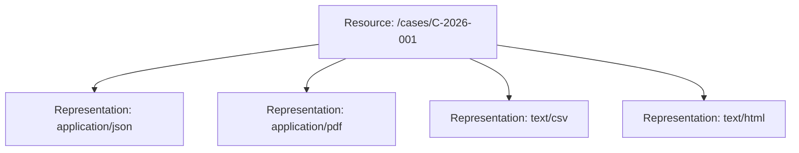
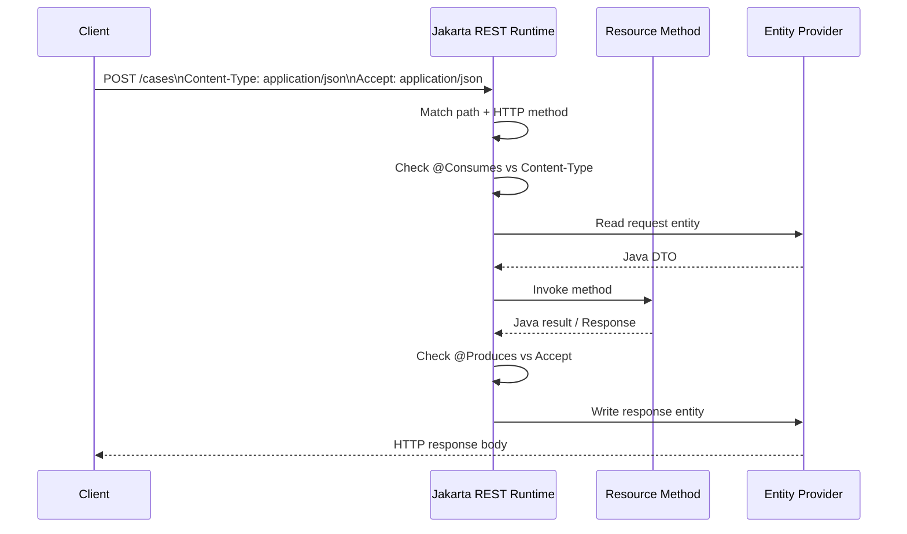

# Part 009 — Content Negotiation: `@Consumes`, `@Produces`, `Accept`, `Content-Type`, and Variant Selection

> Target kompetensi: setelah bagian ini, kita tidak hanya tahu cara menaruh `@Produces(MediaType.APPLICATION_JSON)`, tetapi memahami bagaimana runtime Jakarta REST memilih resource method, memilih response media type, menolak request dengan `415`, menolak representation request dengan `406`, dan mendesain API contract yang stabil walaupun representation berevolusi.

Content negotiation sering terlihat sederhana karena contoh tutorial biasanya seperti ini:

```java
@GET
@Produces(MediaType.APPLICATION_JSON)
public CaseDto getCase(@PathParam("caseId") String caseId) {
    return service.getCase(caseId);
}
```

Tetapi di production, content negotiation adalah bagian dari **contract boundary**. Ia menentukan:

1. request body seperti apa yang boleh masuk;
2. response body seperti apa yang bisa keluar;
3. apakah satu URI bisa punya beberapa representasi;
4. bagaimana client dan server bernegosiasi saat preferensi mereka tidak identik;
5. status code apa yang benar saat format request/response tidak kompatibel;
6. seberapa aman API kita terhadap breaking change representation.

Dalam Jakarta REST, negotiation bukan fitur tambahan. Ia ikut dalam proses **resource method selection**, **entity provider selection**, dan **response construction**.

---

## 1. Mental Model: Resource ≠ Representation

Kesalahan paling umum adalah menganggap endpoint `/cases/{caseId}` berarti “JSON case”. Lebih tepat:

- `/cases/{caseId}` adalah **resource identifier**.
- `application/json` adalah salah satu **representation format** dari resource tersebut.
- `application/xml`, `text/csv`, `application/pdf`, atau custom media type bisa menjadi representasi lain.



Satu resource bisa punya banyak representasi, dan satu representasi bisa punya banyak versi contract. Content negotiation adalah mekanisme untuk memilih representation yang paling cocok untuk satu request.

Dalam sistem enterprise/regulatory, distinction ini penting. Sebuah **case** bisa direpresentasikan sebagai:

| Representation | Use Case |
|---|---|
| `application/json` | UI/API integration |
| `application/vnd.company.case-summary+json` | lightweight summary untuk dashboard |
| `application/vnd.company.case-audit+json` | audit export |
| `application/pdf` | printable legal packet |
| `text/csv` | report/export |

Resource tetap sama. Representasinya berbeda.

---

## 2. Dua Arah Negotiation

Content negotiation pada Jakarta REST punya dua arah utama:

| Arah | Header Client | Annotation Server | Pertanyaan |
|---|---|---|---|
| Request body masuk | `Content-Type` | `@Consumes` | “Format body yang dikirim client ini bisa dibaca server?” |
| Response body keluar | `Accept` | `@Produces` | “Format response apa yang diminta client dan bisa dihasilkan server?” |

Secara mental:



Kalau negotiation gagal sebelum method dipanggil, resource method tidak dieksekusi. Ini bukan sekadar validasi manual; ini bagian dari dispatch/runtime selection.

---

## 3. `Content-Type`: Format Request Body

`Content-Type` menjelaskan representation dari request body yang dikirim client.

Contoh request:

```http
POST /cases HTTP/1.1
Content-Type: application/json
Accept: application/json

{
  "subjectId": "SUB-001",
  "caseType": "ENFORCEMENT",
  "priority": "HIGH"
}
```

Resource method:

```java
@Path("/cases")
public class CaseResource {

    @POST
    @Consumes(MediaType.APPLICATION_JSON)
    @Produces(MediaType.APPLICATION_JSON)
    public Response createCase(CreateCaseRequest request, @Context UriInfo uriInfo) {
        CaseDto created = service.create(request);
        URI location = uriInfo.getAbsolutePathBuilder()
                .path(created.id())
                .build();

        return Response.created(location)
                .entity(created)
                .build();
    }
}
```

Interpretasi:

- client mengirim body sebagai `application/json`;
- method hanya menerima request body `application/json`;
- runtime mencari `MessageBodyReader<CreateCaseRequest>` yang bisa membaca `application/json`;
- jika tidak ada method/provider yang cocok, request gagal sebelum business logic.

---

## 4. `@Consumes`: Input Capability Declaration

`@Consumes` adalah deklarasi kemampuan resource method/class untuk menerima request entity media type tertentu.

### 4.1 Method-Level `@Consumes`

```java
@POST
@Path("/cases")
@Consumes(MediaType.APPLICATION_JSON)
public Response createCase(CreateCaseRequest request) {
    ...
}
```

Method ini hanya cocok untuk request dengan:

```http
Content-Type: application/json
```

### 4.2 Class-Level `@Consumes`

```java
@Path("/cases")
@Consumes(MediaType.APPLICATION_JSON)
@Produces(MediaType.APPLICATION_JSON)
public class CaseResource {

    @POST
    public Response createCase(CreateCaseRequest request) {
        ...
    }

    @PUT
    @Path("/{caseId}")
    public CaseDto replaceCase(@PathParam("caseId") String caseId,
                               ReplaceCaseRequest request) {
        ...
    }
}
```

Class-level annotation menjadi default untuk method di dalamnya. Method-level annotation bisa override.

### 4.3 Multiple Consumed Media Types

```java
@POST
@Consumes({
    MediaType.APPLICATION_JSON,
    "application/vnd.acme.case-create+json"
})
@Produces(MediaType.APPLICATION_JSON)
public Response createCase(CreateCaseRequest request) {
    ...
}
```

Gunakan multiple media type hanya jika semantic contract-nya benar-benar kompatibel. Jangan menaruh banyak media type hanya agar client “mudah”. Kalau payload shape berbeda, gunakan DTO/provider/path yang jelas.

---

## 5. `Accept`: Format Response yang Diinginkan Client

`Accept` menjelaskan daftar media type response yang bisa diterima client.

Contoh:

```http
GET /cases/C-2026-001 HTTP/1.1
Accept: application/json
```

Resource method:

```java
@GET
@Path("/{caseId}")
@Produces(MediaType.APPLICATION_JSON)
public CaseDto getCase(@PathParam("caseId") String caseId) {
    return service.getCase(caseId);
}
```

Kalau client meminta:

```http
Accept: application/pdf
```

dan resource hanya bisa produce JSON, runtime harus memilih method lain yang kompatibel atau menghasilkan `406 Not Acceptable`.

---

## 6. `@Produces`: Output Capability Declaration

`@Produces` adalah deklarasi format response yang bisa dihasilkan oleh resource method/class/provider.

### 6.1 Simple JSON Response

```java
@GET
@Path("/{caseId}")
@Produces(MediaType.APPLICATION_JSON)
public CaseDto getCase(@PathParam("caseId") String caseId) {
    return service.getCase(caseId);
}
```

### 6.2 Same Resource, Multiple Representations

```java
@Path("/cases/{caseId}")
public class CaseRepresentationResource {

    @GET
    @Produces(MediaType.APPLICATION_JSON)
    public CaseDto getJson(@PathParam("caseId") String caseId) {
        return service.getCase(caseId);
    }

    @GET
    @Produces("application/pdf")
    public Response getPdf(@PathParam("caseId") String caseId) {
        StreamingOutput stream = output -> pdfService.writeCasePdf(caseId, output);
        return Response.ok(stream, "application/pdf")
                .header("Content-Disposition", "inline; filename=case-" + caseId + ".pdf")
                .build();
    }
}
```

Same URI, same HTTP method, different representation.

### 6.3 Prefer Explicit `@Produces`

Anti-pattern:

```java
@GET
@Path("/{caseId}")
public CaseDto getCase(@PathParam("caseId") String caseId) {
    return service.getCase(caseId);
}
```

Masalah:

- response media type bisa bergantung pada runtime/provider;
- contract tidak jelas;
- documentation generation menjadi lemah;
- debugging `406`/provider selection menjadi sulit.

Production convention:

```java
@GET
@Path("/{caseId}")
@Produces(MediaType.APPLICATION_JSON)
public CaseDto getCase(@PathParam("caseId") String caseId) {
    return service.getCase(caseId);
}
```

---

## 7. Default Behavior: Missing Headers

### 7.1 Missing `Accept`

Jika request tidak punya `Accept`, secara praktis client dianggap menerima media type apa pun (`*/*`). Maka method dengan `@Produces("application/json")` tetap bisa dipilih.

```http
GET /cases/C-2026-001 HTTP/1.1
```

Server boleh memilih representation terbaik yang tersedia.

Dalam API publik/internal yang serius, tetap lebih baik client mengirim `Accept` eksplisit:

```http
Accept: application/json
```

Alasannya:

- memudahkan debugging;
- menghindari response type surprise;
- memperjelas contract test;
- membantu gateway/proxy observability.

### 7.2 Missing `Content-Type`

Untuk request tanpa body, `Content-Type` biasanya tidak relevan:

```http
GET /cases/C-2026-001 HTTP/1.1
Accept: application/json
```

Untuk request dengan body, client harus mengirim `Content-Type` eksplisit. Kalau body ada tetapi `Content-Type` hilang, runtime/provider behavior bisa menjadi ambigu.

Production rule:

> Untuk method dengan entity body (`POST`, `PUT`, `PATCH`), client wajib mengirim `Content-Type` eksplisit.

---

## 8. Status Code: `415 Unsupported Media Type` vs `406 Not Acceptable`

Ini salah satu distinction paling penting.

| Status | Penyebab | Header yang Bermasalah | Contoh |
|---|---|---|---|
| `415 Unsupported Media Type` | Server tidak bisa/menolak membaca request body format tersebut | `Content-Type` | Client mengirim XML ke endpoint yang hanya `@Consumes application/json` |
| `406 Not Acceptable` | Server tidak bisa menghasilkan response format yang diminta client | `Accept` | Client meminta PDF, endpoint hanya `@Produces application/json` |

### 8.1 `415` Example

Request:

```http
POST /cases HTTP/1.1
Content-Type: application/xml
Accept: application/json

<case>...</case>
```

Resource:

```java
@POST
@Consumes(MediaType.APPLICATION_JSON)
@Produces(MediaType.APPLICATION_JSON)
public Response createCase(CreateCaseRequest request) {
    ...
}
```

Outcome:

```http
HTTP/1.1 415 Unsupported Media Type
```

Kenapa? Request body media type tidak cocok dengan `@Consumes`.

### 8.2 `406` Example

Request:

```http
GET /cases/C-2026-001 HTTP/1.1
Accept: application/pdf
```

Resource:

```java
@GET
@Produces(MediaType.APPLICATION_JSON)
public CaseDto getCase(@PathParam("caseId") String caseId) {
    ...
}
```

Outcome:

```http
HTTP/1.1 406 Not Acceptable
```

Kenapa? Server tidak punya compatible response representation.

---

## 9. `q` Factor: Client Preference

Client bisa mengirim preferensi media type dengan quality value `q`.

```http
Accept: application/json; q=1.0, application/xml; q=0.5, */*; q=0.1
```

Artinya:

1. paling suka JSON;
2. masih bisa menerima XML;
3. fallback apa pun kalau perlu.

Resource:

```java
@GET
@Produces({ MediaType.APPLICATION_JSON, MediaType.APPLICATION_XML })
public CaseDto getCase(@PathParam("caseId") String caseId) {
    return service.getCase(caseId);
}
```

Jika JSON dan XML sama-sama tersedia, server akan memilih JSON karena `q` lebih tinggi.

### Production Guidance

Client internal harus mengirim `Accept` yang sempit:

```http
Accept: application/json
```

Bukan:

```http
Accept: */*
```

`*/*` membuat contract menjadi terlalu longgar. Longgar terlihat fleksibel, tetapi di production sering menjadi sumber bug karena client menerima format yang tidak pernah diuji.

---

## 10. `qs` Factor: Server Preference

Selain `q` dari client, Jakarta REST juga mengenal server-side relative quality factor `qs` pada `@Produces`.

Contoh:

```java
@GET
@Produces({
    "application/json; qs=1.0",
    "application/xml; qs=0.5"
})
public CaseDto getCase(@PathParam("caseId") String caseId) {
    return service.getCase(caseId);
}
```

Jika client menerima JSON dan XML dengan preferensi sama, server dapat memprioritaskan JSON.

### Kapan `qs` Berguna?

`qs` berguna saat:

- API punya beberapa representation yang sama-sama valid;
- client mengirim wildcard atau preferensi seimbang;
- server ingin memilih format default yang lebih canonical.

Contoh:

```http
Accept: application/*; q=0.8
```

Server punya:

```java
@Produces({
    "application/json; qs=1.0",
    "application/xml; qs=0.7"
})
```

Maka JSON lebih mungkin dipilih.

### Jangan Overuse `qs`

Kalau API internal hanya mendukung JSON, jangan membuat negotiation terlalu kompleks. Gunakan explicit contract:

```java
@Produces(MediaType.APPLICATION_JSON)
```

`qs` adalah alat untuk multi-representation API, bukan default style untuk semua endpoint.

---

## 11. Specificity: `application/json` vs `application/*` vs `*/*`

Dalam negotiation, media type yang lebih spesifik lebih kuat daripada wildcard.

Urutan specificity:

```text
application/json > application/* > */*
```

Contoh client:

```http
Accept: application/*; q=0.8, application/json; q=0.7
```

Walaupun `application/*` punya `q` lebih tinggi, resource/runtime selection perlu mempertimbangkan kombinasi specificity dan quality. Jangan menulis API yang bergantung pada edge ordering semacam ini. Di client, buat `Accept` jelas.

Best practice:

```http
Accept: application/json
```

atau jika memang fallback:

```http
Accept: application/vnd.acme.case+json; q=1.0, application/json; q=0.8
```

---

## 12. Content Negotiation and Resource Method Selection

Jakarta REST tidak hanya memilih serializer setelah method dipanggil. Negotiation dapat memengaruhi **method selection**.

Contoh:

```java
@Path("/reports/{reportId}")
public class ReportResource {

    @GET
    @Produces(MediaType.APPLICATION_JSON)
    public ReportDto getJson(@PathParam("reportId") String reportId) {
        return reportService.getReport(reportId);
    }

    @GET
    @Produces("text/csv")
    public Response getCsv(@PathParam("reportId") String reportId) {
        StreamingOutput stream = out -> reportService.writeCsv(reportId, out);
        return Response.ok(stream, "text/csv").build();
    }
}
```

Request:

```http
GET /reports/R-001 HTTP/1.1
Accept: text/csv
```

Runtime memilih method `getCsv`, bukan `getJson`.

### Ambiguous Method Problem

Hindari method yang secara path/method/produces terlalu mirip tanpa alasan.

Buruk:

```java
@GET
@Produces(MediaType.APPLICATION_JSON)
public CaseDto getCaseA() { ... }

@GET
@Produces(MediaType.APPLICATION_JSON)
public CaseSummaryDto getCaseB() { ... }
```

Masalah:

- path sama;
- HTTP method sama;
- output media type sama;
- runtime tidak punya basis kontrak yang jelas;
- hasil bisa ambiguous atau implementation-dependent.

Lebih baik:

```java
@GET
@Produces(MediaType.APPLICATION_JSON)
public CaseDto getCase() { ... }

@GET
@Path("summary")
@Produces(MediaType.APPLICATION_JSON)
public CaseSummaryDto getCaseSummary() { ... }
```

atau gunakan media type berbeda jika memang representation berbeda:

```java
@GET
@Produces("application/vnd.acme.case-detail+json")
public CaseDetailDto getCaseDetail() { ... }

@GET
@Produces("application/vnd.acme.case-summary+json")
public CaseSummaryDto getCaseSummary() { ... }
```

---

## 13. Media Type Design

### 13.1 Standard Media Types

Common choices:

| Media Type | Use |
|---|---|
| `application/json` | default JSON API |
| `application/xml` | XML representation |
| `text/plain` | simple string output |
| `text/csv` | tabular export |
| `application/pdf` | PDF document |
| `application/octet-stream` | generic binary |
| `application/x-www-form-urlencoded` | HTML-style form body |
| `multipart/form-data` | multipart upload |

### 13.2 Vendor Media Types

Vendor media type berguna jika representation punya domain-specific contract.

```text
application/vnd.acme.case+json
application/vnd.acme.case-summary+json
application/vnd.acme.case-audit+json
```

Pattern:

```text
application/vnd.<organization>.<representation>+json
```

Contoh resource:

```java
@GET
@Produces({
    MediaType.APPLICATION_JSON,
    "application/vnd.acme.case+json"
})
public CaseDto getCase(@PathParam("caseId") String caseId) {
    return service.getCase(caseId);
}
```

### 13.3 When Vendor Media Types Help

Vendor media types membantu saat:

- representation berbeda secara kontraktual;
- API perlu evolution path tanpa path versioning;
- client perlu eksplisit memilih representation;
- same resource punya compact/detail/audit/legal views.

### 13.4 When Vendor Media Types Hurt

Jangan pakai vendor media type untuk semua hal kalau organisasi belum siap:

- documentation tooling bisa lebih rumit;
- gateway rules harus aware;
- testing matrix membesar;
- client developer experience bisa menurun;
- banyak library default lebih mudah dengan `application/json`.

Practical rule:

> Untuk internal service biasa, mulai dari `application/json`. Gunakan vendor media type hanya saat representation benar-benar menjadi contract dimension.

---

## 14. Versioning via Media Type

Salah satu strategi versioning:

```http
Accept: application/vnd.acme.case.v2+json
```

atau:

```http
Accept: application/vnd.acme.case+json; version=2
```

Resource:

```java
@GET
@Produces("application/vnd.acme.case.v1+json")
public CaseV1Dto getV1(@PathParam("caseId") String caseId) {
    return versioningService.getV1(caseId);
}

@GET
@Produces("application/vnd.acme.case.v2+json")
public CaseV2Dto getV2(@PathParam("caseId") String caseId) {
    return versioningService.getV2(caseId);
}
```

### Trade-Off

| Strategy | Strength | Weakness |
|---|---|---|
| URL versioning `/v1/cases` | mudah dilihat, mudah gateway routing | version menjadi bagian URI resource |
| Header versioning | URI stabil | sulit debug dari browser/log sederhana |
| Media type versioning | sesuai representation theory | tooling/client lebih kompleks |
| Additive evolution only | simple | tidak cukup untuk breaking changes |

Untuk kebanyakan enterprise API, kombinasi yang realistis:

1. gunakan URL major version untuk public API besar;
2. gunakan additive evolution untuk minor changes;
3. gunakan custom media type untuk representation khusus, bukan semua endpoint.

---

## 15. Language and Encoding Negotiation

Selain media type, HTTP juga punya negotiation untuk bahasa dan encoding.

Common headers:

```http
Accept-Language: en-US, id-ID; q=0.8
Accept-Encoding: gzip, br
```

Jakarta REST punya API seperti `Variant`, `Request`, dan `selectVariant` untuk negotiation lebih programmatic.

Contoh konseptual:

```java
@GET
@Produces({ MediaType.APPLICATION_JSON, MediaType.APPLICATION_XML })
public Response getCase(@PathParam("caseId") String caseId,
                        @Context Request request) {

    List<Variant> variants = Variant
            .mediaTypes(MediaType.APPLICATION_JSON_TYPE, MediaType.APPLICATION_XML_TYPE)
            .languages(Locale.ENGLISH, new Locale("id", "ID"))
            .add()
            .build();

    Variant selected = request.selectVariant(variants);

    if (selected == null) {
        return Response.notAcceptable(variants).build();
    }

    CaseDto dto = service.getCase(caseId);

    return Response.ok(dto, selected).build();
}
```

Gunakan programmatic variant selection hanya jika kita benar-benar punya beberapa dimensi representasi:

- media type;
- language;
- encoding;
- maybe other representation metadata.

Jika hanya JSON, annotation-based negotiation lebih sederhana.

---

## 16. Entity Provider Coupling

`@Consumes` dan `@Produces` tidak cukup. Runtime juga butuh provider yang bisa membaca/menulis Java type untuk media type tersebut.

Contoh:

```java
@POST
@Consumes("application/vnd.acme.case-create+json")
@Produces("application/vnd.acme.case+json")
public CaseDto create(CreateCaseRequest request) {
    return service.create(request);
}
```

Agar ini berjalan:

- runtime harus punya `MessageBodyReader<CreateCaseRequest>` untuk `application/vnd.acme.case-create+json`;
- runtime harus punya `MessageBodyWriter<CaseDto>` untuk `application/vnd.acme.case+json`.

Jika JSON provider hanya terdaftar untuk `application/json`, custom vendor media type mungkin tidak otomatis bekerja di semua runtime. Banyak JSON provider mendukung `application/*+json`, tetapi jangan asumsikan tanpa test.

Production test wajib:

```bash
curl -i \
  -H 'Content-Type: application/vnd.acme.case-create+json' \
  -H 'Accept: application/vnd.acme.case+json' \
  -d '{"subjectId":"S-001"}' \
  http://localhost:8080/api/cases
```

---

## 17. JSON as Default: Keep Contract Explicit

Untuk mayoritas service internal:

```java
@Path("/cases")
@Consumes(MediaType.APPLICATION_JSON)
@Produces(MediaType.APPLICATION_JSON)
public class CaseResource {
    ...
}
```

Ini simple, eksplisit, dan mudah diuji.

Tetapi hati-hati dengan class-level `@Consumes` pada resource yang punya `GET` method. `GET` biasanya tidak punya body. Jika client/proxy mengirim `Content-Type` aneh pada `GET`, beberapa runtime selection behavior bisa terasa membingungkan.

Lebih disiplin:

```java
@Path("/cases")
@Produces(MediaType.APPLICATION_JSON)
public class CaseResource {

    @GET
    public List<CaseSummaryDto> listCases() {
        ...
    }

    @POST
    @Consumes(MediaType.APPLICATION_JSON)
    public Response createCase(CreateCaseRequest request) {
        ...
    }
}
```

Rule:

- `@Produces` aman di class-level jika semua response JSON.
- `@Consumes` sering lebih jelas di method-level untuk method yang punya request body.

---

## 18. Negotiation and Error Response Format

Error response juga representation.

Jika endpoint produce JSON, error seharusnya JSON juga.

Bad:

```http
HTTP/1.1 400 Bad Request
Content-Type: text/html

<html>...</html>
```

Good:

```http
HTTP/1.1 400 Bad Request
Content-Type: application/problem+json

{
  "type": "https://api.acme.internal/problems/validation-error",
  "title": "Validation failed",
  "status": 400,
  "detail": "priority must be one of LOW, MEDIUM, HIGH",
  "instance": "/cases",
  "correlationId": "01J..."
}
```

Resource methods can produce business response as `application/json`, while exception mappers produce `application/problem+json`.

```java
@Provider
@Produces("application/problem+json")
public class ValidationExceptionMapper implements ExceptionMapper<ConstraintViolationException> {

    @Override
    public Response toResponse(ConstraintViolationException exception) {
        ProblemDetails problem = ProblemDetails.validation(exception);
        return Response.status(Response.Status.BAD_REQUEST)
                .type("application/problem+json")
                .entity(problem)
                .build();
    }
}
```

Production concern: if client sends `Accept: application/json`, should it accept `application/problem+json`? Technically `application/problem+json` is a different media type but has JSON structured syntax suffix. Many clients can parse it, but contract harus jelas.

Practical internal standard:

```http
Accept: application/json, application/problem+json
```

atau documentasikan bahwa errors use `application/problem+json` for all JSON APIs.

---

## 19. Caching and `Vary`

Jika response dipilih berdasarkan `Accept`, cache perlu tahu bahwa representation bergantung pada `Accept`.

Example:

```http
Vary: Accept
```

Jika response juga tergantung language:

```http
Vary: Accept, Accept-Language
```

Tanpa `Vary`, cache/proxy bisa menyajikan representation yang salah.

Contoh bug:

1. Client A request `Accept: application/pdf`.
2. Proxy cache menyimpan PDF untuk `/cases/C-001`.
3. Client B request `Accept: application/json`.
4. Proxy mengembalikan PDF karena cache key tidak mempertimbangkan `Accept`.

Resource:

```java
@GET
@Produces({ MediaType.APPLICATION_JSON, "application/pdf" })
public Response getCase(@PathParam("caseId") String caseId,
                        @HeaderParam("Accept") String accept) {
    Object entity = ...;
    return Response.ok(entity)
            .header(HttpHeaders.VARY, HttpHeaders.ACCEPT)
            .build();
}
```

Untuk API non-cacheable, tetap pahami `Vary` karena gateway, CDN, browser, atau reverse proxy bisa muncul di arsitektur tanpa disadari developer resource method.

---

## 20. Testing Content Negotiation

Content negotiation harus dites sebagai contract, bukan hanya happy path.

### 20.1 Positive Tests

```bash
curl -i \
  -H 'Accept: application/json' \
  http://localhost:8080/api/cases/C-001
```

Expected:

```http
HTTP/1.1 200 OK
Content-Type: application/json
```

### 20.2 `406` Test

```bash
curl -i \
  -H 'Accept: application/pdf' \
  http://localhost:8080/api/cases/C-001
```

Expected if PDF unsupported:

```http
HTTP/1.1 406 Not Acceptable
```

### 20.3 `415` Test

```bash
curl -i \
  -X POST \
  -H 'Content-Type: application/xml' \
  -H 'Accept: application/json' \
  -d '<case></case>' \
  http://localhost:8080/api/cases
```

Expected if XML unsupported:

```http
HTTP/1.1 415 Unsupported Media Type
```

### 20.4 Vendor Media Type Test

```bash
curl -i \
  -H 'Accept: application/vnd.acme.case+json' \
  http://localhost:8080/api/cases/C-001
```

Expected:

```http
HTTP/1.1 200 OK
Content-Type: application/vnd.acme.case+json
```

atau jika server canonicalizes to `application/json`, documentasikan secara eksplisit. Jangan biarkan client menebak.

---

## 21. Implementation Edge Cases

### 21.1 Browser `Accept` Header

Browser sering mengirim `Accept` kompleks seperti:

```http
Accept: text/html,application/xhtml+xml,application/xml;q=0.9,*/*;q=0.8
```

Kalau API endpoint dipanggil langsung dari browser dan resource bisa produce `text/html` dan `application/json`, browser mungkin mendapatkan HTML, bukan JSON.

Untuk API yang dipanggil UI JavaScript, pastikan fetch/client mengirim:

```javascript
fetch('/api/cases/C-001', {
  headers: {
    'Accept': 'application/json'
  }
});
```

### 21.2 Generated Clients

Generated clients dari OpenAPI biasanya menetapkan `Accept` dan `Content-Type`. Jangan override global header sembarangan.

Bad:

```java
client.target(baseUri)
      .request("*/*")
      .get(CaseDto.class);
```

Good:

```java
client.target(baseUri)
      .path("cases/{caseId}")
      .resolveTemplate("caseId", caseId)
      .request(MediaType.APPLICATION_JSON_TYPE)
      .get(CaseDto.class);
```

### 21.3 Gateway Transformation

API gateway bisa:

- strip headers;
- rewrite `Accept`;
- add compression;
- normalize `Content-Type`;
- reject unknown media types before request reaches app.

Testing hanya di local runtime tidak cukup. Contract test harus melewati gateway path jika gateway ikut menjadi production boundary.

---

## 22. Anti-Patterns

### Anti-Pattern 1: Always Return JSON but Never Declare It

```java
@GET
public CaseDto getCase() { ... }
```

Fix:

```java
@GET
@Produces(MediaType.APPLICATION_JSON)
public CaseDto getCase() { ... }
```

### Anti-Pattern 2: Accept Everything

```java
@POST
@Consumes(MediaType.WILDCARD)
public Response create(Object body) { ... }
```

Ini membuat input boundary lemah. Server harus tahu format apa yang ia terima.

Fix:

```java
@POST
@Consumes(MediaType.APPLICATION_JSON)
public Response create(CreateCaseRequest request) { ... }
```

### Anti-Pattern 3: Abuse `Accept` for Business Behavior

Bad:

```http
Accept: application/json; workflow=expedited
```

Business behavior bukan representation preference. Gunakan field command atau endpoint/state transition yang jelas.

### Anti-Pattern 4: Treat 406 and 415 as Generic 400

Bad:

```http
HTTP/1.1 400 Bad Request
```

untuk semua negotiation failure.

Fix:

- wrong request body media type -> `415`;
- unsupported response representation -> `406`.

### Anti-Pattern 5: Version Every Minor DTO Change with Media Type

Bad:

```text
application/vnd.acme.case.v1.0.1+json
application/vnd.acme.case.v1.0.2+json
application/vnd.acme.case.v1.0.3+json
```

Fix:

- additive fields do not require new major representation;
- breaking changes need explicit migration strategy;
- keep versioning coarse and meaningful.

---

## 23. Production Design Checklist

Sebelum endpoint dianggap siap, jawab ini:

### Request Side

- Apakah method dengan body punya `@Consumes` eksplisit?
- Apakah `Content-Type` yang salah menghasilkan `415`?
- Apakah request tanpa `Content-Type` untuk body ditangani secara konsisten?
- Apakah JSON provider mendukung media type yang dipakai?
- Apakah payload besar/multipart punya batas ukuran?

### Response Side

- Apakah method punya `@Produces` eksplisit?
- Apakah `Accept` yang tidak didukung menghasilkan `406`?
- Apakah `Content-Type` response benar?
- Apakah error response punya media type konsisten?
- Apakah `Vary` dipakai jika response tergantung `Accept`/language?

### Contract Side

- Apakah media type documented di OpenAPI/API handbook?
- Apakah client examples menyertakan `Accept` dan `Content-Type`?
- Apakah vendor media type benar-benar diperlukan?
- Apakah versioning strategy jelas?
- Apakah generated client contract test mencakup negotiation failure?

---

## 24. Mini Case Study: Case API with JSON, Audit JSON, and PDF

Kita punya resource case:

```text
/cases/{caseId}
```

Representation:

| Media Type | Meaning |
|---|---|
| `application/json` | default detail view |
| `application/vnd.acme.case-audit+json` | audit-focused view |
| `application/pdf` | printable case dossier |

Resource design:

```java
@Path("/cases/{caseId}")
public class CaseResource {

    @GET
    @Produces(MediaType.APPLICATION_JSON)
    public CaseDto getCase(@PathParam("caseId") String caseId) {
        return caseQueryService.getCase(caseId);
    }

    @GET
    @Produces("application/vnd.acme.case-audit+json")
    public CaseAuditDto getCaseAudit(@PathParam("caseId") String caseId) {
        return auditQueryService.getCaseAudit(caseId);
    }

    @GET
    @Produces("application/pdf")
    public Response getCasePdf(@PathParam("caseId") String caseId) {
        StreamingOutput stream = output -> dossierService.writePdf(caseId, output);

        return Response.ok(stream, "application/pdf")
                .header(HttpHeaders.CONTENT_DISPOSITION,
                        "inline; filename=case-" + caseId + ".pdf")
                .header(HttpHeaders.VARY, HttpHeaders.ACCEPT)
                .build();
    }
}
```

Request examples:

```http
GET /cases/C-001
Accept: application/json
```

```http
GET /cases/C-001
Accept: application/vnd.acme.case-audit+json
```

```http
GET /cases/C-001
Accept: application/pdf
```

This is acceptable when the three representations are all truthful representations of the same resource.

But if PDF generation is a long-running command, do not overload `GET`:

```http
POST /cases/C-001/dossier-generation-requests
Content-Type: application/json
Accept: application/json
```

Then return `202 Accepted` with operation resource. Representation selection must not hide workflow semantics.

---

## 25. Summary

Content negotiation in Jakarta REST is about more than JSON serialization. It is the mechanism that ties HTTP representation semantics to Java resource method dispatch and provider selection.

Core invariants:

1. `Content-Type` describes request body format.
2. `@Consumes` declares what request formats a method/provider can consume.
3. `Accept` describes acceptable response formats.
4. `@Produces` declares what response formats a method/provider can produce.
5. Wrong request body media type is `415`.
6. Unsupported requested response representation is `406`.
7. Media type specificity, `q`, and `qs` influence selection.
8. Error responses are representations too.
9. Multi-representation APIs need tests for each representation.
10. Simple JSON APIs should stay explicit, not over-negotiated.

The next part goes one layer deeper: once a media type has been selected, how does Jakarta REST actually convert an HTTP entity body into Java, and Java back into HTTP? That is the job of `MessageBodyReader` and `MessageBodyWriter`.

---

## References

- Jakarta RESTful Web Services 4.0 Specification — `https://jakarta.ee/specifications/restful-ws/4.0/jakarta-restful-ws-spec-4.0`
- RFC 9110: HTTP Semantics — `https://www.rfc-editor.org/rfc/rfc9110.html`
