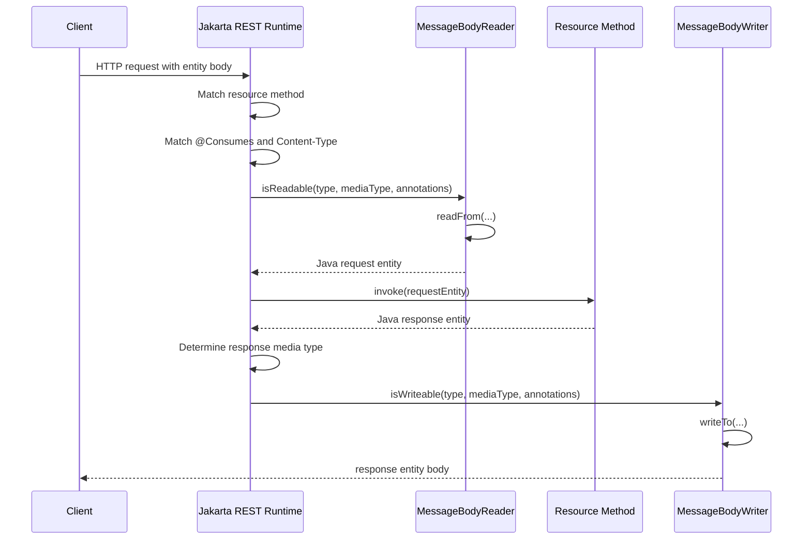
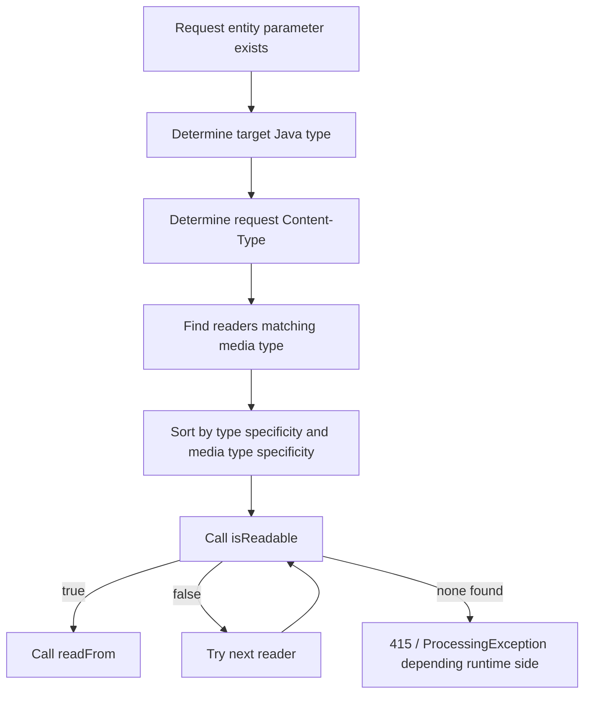
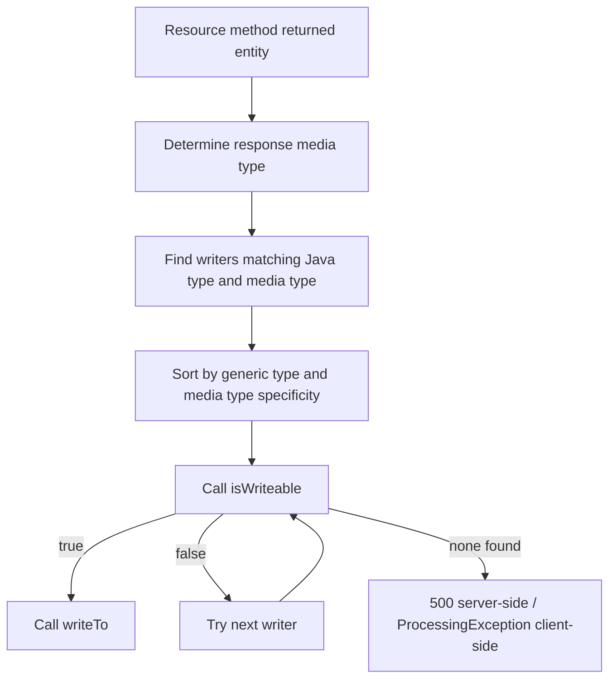

# Part 010 — MessageBodyReader and MessageBodyWriter: Serialization Pipeline Internals

> Target kompetensi: setelah bagian ini, kita memahami bagaimana Jakarta REST mengubah HTTP body menjadi Java object dan Java object menjadi HTTP body. Kita juga akan tahu kapan harus membuat custom provider, bagaimana provider dipilih, apa failure mode-nya, dan bagaimana mencegah serialization layer menjadi sumber bug production.

Pada part sebelumnya, kita membahas **media type negotiation**. Tetapi negotiation hanya menjawab pertanyaan:

> “Representation format apa yang akan dipakai?”

Setelah itu runtime masih perlu menjawab dua pertanyaan lain:

1. “Bagaimana membaca request body ini menjadi Java object?”
2. “Bagaimana menulis Java object ini menjadi response body?”

Di Jakarta REST, jawabannya adalah:

- `MessageBodyReader<T>` untuk inbound body;
- `MessageBodyWriter<T>` untuk outbound body.

Keduanya disebut **entity providers**.

---

## 1. Mental Model: Entity Provider as Representation Adapter

Resource method seharusnya tidak parsing raw HTTP body sendiri.

Bad:

```java
@POST
public Response create(String rawJson) {
    JsonObject json = parse(rawJson);
    ...
}
```

Better:

```java
@POST
@Consumes(MediaType.APPLICATION_JSON)
public Response create(CreateCaseRequest request) {
    ...
}
```

Kenapa lebih baik?

Karena parsing/serialization adalah tanggung jawab provider pipeline.


Resource method bekerja pada Java object. Provider bekerja pada representation mapping.

---

## 2. Where Providers Sit in the Runtime Pipeline

Pipeline simplified:



Poin penting: provider selection terjadi **berdasarkan Java type + generic type + annotation + media type**. Bukan hanya berdasarkan media type.

---

## 3. `MessageBodyReader<T>` Contract

`MessageBodyReader<T>` digunakan untuk membaca request body menjadi Java object.

Interface konseptual:

```java
public interface MessageBodyReader<T> {

    boolean isReadable(Class<?> type,
                       Type genericType,
                       Annotation[] annotations,
                       MediaType mediaType);

    T readFrom(Class<T> type,
               Type genericType,
               Annotation[] annotations,
               MediaType mediaType,
               MultivaluedMap<String, String> httpHeaders,
               InputStream entityStream) throws IOException, WebApplicationException;
}
```

Parameter penting:

| Parameter | Meaning |
|---|---|
| `type` | raw Java class target, misalnya `CreateCaseRequest.class` |
| `genericType` | generic target, misalnya `List<CreateCaseRequest>` |
| `annotations` | annotations pada parameter resource method |
| `mediaType` | request body media type |
| `httpHeaders` | request entity headers |
| `entityStream` | raw input stream |

Contoh method resource:

```java
@POST
@Consumes("application/vnd.acme.case-command+json")
public Response submitCommand(CaseCommand command) {
    ...
}
```

Runtime akan mencari reader yang bisa membaca:

```text
Java type: CaseCommand
Media type: application/vnd.acme.case-command+json
```

---

## 4. `MessageBodyWriter<T>` Contract

`MessageBodyWriter<T>` digunakan untuk menulis Java object menjadi response body.

Interface konseptual:

```java
public interface MessageBodyWriter<T> {

    boolean isWriteable(Class<?> type,
                        Type genericType,
                        Annotation[] annotations,
                        MediaType mediaType);

    void writeTo(T t,
                 Class<?> type,
                 Type genericType,
                 Annotation[] annotations,
                 MediaType mediaType,
                 MultivaluedMap<String, Object> httpHeaders,
                 OutputStream entityStream) throws IOException, WebApplicationException;
}
```

Contoh method resource:

```java
@GET
@Path("/{caseId}")
@Produces("application/vnd.acme.case+json")
public CaseDto getCase(@PathParam("caseId") String caseId) {
    return service.getCase(caseId);
}
```

Runtime akan mencari writer yang bisa menulis:

```text
Java type: CaseDto
Media type: application/vnd.acme.case+json
```

---

## 5. Built-In Entity Providers

Jakarta REST runtime wajib menyediakan beberapa provider standar untuk type/media type tertentu. Contoh umum:

| Java Type | Media Type |
|---|---|
| `byte[]` | `*/*` |
| `String` | `*/*` |
| `InputStream` | `*/*` |
| `Reader` | `*/*` |
| `File` | `*/*` |
| `MultivaluedMap<String, String>` | `application/x-www-form-urlencoded` |
| `List<EntityPart>` | `multipart/form-data` |
| `StreamingOutput` | `*/*`, writer only |
| primitive wrappers / `Number` / `Boolean` / `Character` | `text/plain` |

JSON support biasanya datang dari integration provider seperti JSON-B, Jackson, MOXy, atau runtime-specific extension. Jangan menganggap semua Jakarta REST runtime punya JSON behavior identik jika dependency/runtime packaging berbeda.

Production rule:

> Treat JSON serialization as an explicit dependency and test it as part of the API contract.

---

## 6. Provider Selection: The Algorithmic Mental Model

Saat membaca request body, runtime kira-kira melakukan ini:



Saat menulis response body:



Provider selection is deterministic enough to reason about, but complex enough that production teams should avoid unnecessary provider overlap.

---

## 7. Declaring Provider Capabilities

Provider media type capability uses:

- `@Consumes` on `MessageBodyReader`;
- `@Produces` on `MessageBodyWriter`.

### 7.1 Reader Example

```java
@Provider
@Consumes("application/vnd.acme.case-command+json")
public class CaseCommandReader implements MessageBodyReader<CaseCommand> {

    private final ObjectMapper objectMapper = new ObjectMapper();

    @Override
    public boolean isReadable(Class<?> type,
                              Type genericType,
                              Annotation[] annotations,
                              MediaType mediaType) {
        return CaseCommand.class.isAssignableFrom(type);
    }

    @Override
    public CaseCommand readFrom(Class<CaseCommand> type,
                                Type genericType,
                                Annotation[] annotations,
                                MediaType mediaType,
                                MultivaluedMap<String, String> httpHeaders,
                                InputStream entityStream) throws IOException {
        return objectMapper.readValue(entityStream, CaseCommand.class);
    }
}
```

### 7.2 Writer Example

```java
@Provider
@Produces("application/vnd.acme.case+json")
public class CaseDtoWriter implements MessageBodyWriter<CaseDto> {

    private final ObjectMapper objectMapper = new ObjectMapper();

    @Override
    public boolean isWriteable(Class<?> type,
                               Type genericType,
                               Annotation[] annotations,
                               MediaType mediaType) {
        return CaseDto.class.isAssignableFrom(type);
    }

    @Override
    public void writeTo(CaseDto value,
                        Class<?> type,
                        Type genericType,
                        Annotation[] annotations,
                        MediaType mediaType,
                        MultivaluedMap<String, Object> httpHeaders,
                        OutputStream entityStream) throws IOException {
        httpHeaders.putSingle(HttpHeaders.CONTENT_TYPE, mediaType.toString());
        objectMapper.writeValue(entityStream, value);
    }
}
```

### 7.3 Do Not Write Custom Providers Too Early

Most applications should not create custom JSON readers/writers for every DTO. Prefer standard JSON provider integration.

Create custom providers when:

- media type has non-standard representation;
- encryption/signature wrapper is part of representation;
- binary/custom format is needed;
- legacy payload cannot be mapped by normal JSON-B/Jackson config;
- cross-cutting serialization behavior cannot be expressed safely by DTO annotation/config.

---

## 8. Provider Scope and Discovery

A provider can be discovered if:

1. annotated with `@Provider` and scanning is enabled;
2. explicitly registered in `Application#getClasses()`;
3. registered via `Application#getSingletons()`;
4. registered through implementation-specific configuration;
5. installed by the runtime as default/pre-packaged provider.

Explicit registration example:

```java
@ApplicationPath("/api")
public class ApiApplication extends Application {

    @Override
    public Set<Class<?>> getClasses() {
        return Set.of(
                CaseResource.class,
                CaseCommandReader.class,
                CaseDtoWriter.class,
                ProblemExceptionMapper.class
        );
    }
}
```

Singleton registration:

```java
@ApplicationPath("/api")
public class ApiApplication extends Application {

    private final ObjectMapper objectMapper = JsonMapperFactory.create();

    @Override
    public Set<Object> getSingletons() {
        return Set.of(
                new CaseCommandReader(objectMapper),
                new CaseDtoWriter(objectMapper)
        );
    }
}
```

Be careful: singleton providers must be thread-safe.

---

## 9. Thread-Safety of Providers

Providers are usually shared and reused. Even when lifecycle details depend on runtime, you should design providers as thread-safe.

Safe:

```java
@Provider
@Produces(MediaType.APPLICATION_JSON)
public class JsonWriter implements MessageBodyWriter<Object> {

    private final ObjectMapper objectMapper;

    public JsonWriter(ObjectMapper objectMapper) {
        this.objectMapper = objectMapper;
    }

    // ObjectMapper is thread-safe after configuration
}
```

Unsafe:

```java
@Provider
public class UnsafeCsvWriter implements MessageBodyWriter<ReportDto> {

    private final StringBuilder buffer = new StringBuilder();

    @Override
    public void writeTo(ReportDto report, ..., OutputStream out) throws IOException {
        buffer.setLength(0);
        buffer.append(...);
        out.write(buffer.toString().getBytes(StandardCharsets.UTF_8));
    }
}
```

Why unsafe?

- concurrent requests share the same `StringBuilder`;
- output can be corrupted;
- sensitive data can leak across responses.

Fix:

```java
@Override
public void writeTo(ReportDto report, ..., OutputStream out) throws IOException {
    StringBuilder buffer = new StringBuilder();
    buffer.append(...);
    out.write(buffer.toString().getBytes(StandardCharsets.UTF_8));
}
```

or stream directly.

---

## 10. Generic Types: `List<T>`, `Map<K,V>`, and Type Erasure

Provider methods receive both `Class<?> type` and `Type genericType` because Java type erasure matters.

Resource:

```java
@GET
@Produces(MediaType.APPLICATION_JSON)
public List<CaseSummaryDto> listCases() {
    return service.listCases();
}
```

At runtime:

```text
type        = java.util.List
genericType = java.util.List<com.acme.CaseSummaryDto>
```

A smart JSON provider uses `genericType` to serialize list element type correctly.

Custom provider example:

```java
@Override
public boolean isWriteable(Class<?> type,
                           Type genericType,
                           Annotation[] annotations,
                           MediaType mediaType) {
    if (!List.class.isAssignableFrom(type)) {
        return false;
    }

    if (!(genericType instanceof ParameterizedType parameterized)) {
        return false;
    }

    Type elementType = parameterized.getActualTypeArguments()[0];
    return elementType.equals(CaseSummaryDto.class);
}
```

But avoid writing custom generic providers unless necessary. They are easy to get wrong.

---

## 11. Annotation-Aware Providers

The `annotations` parameter lets provider behavior depend on annotations on resource method parameter or method.

Example custom annotation:

```java
@Retention(RetentionPolicy.RUNTIME)
@Target({ ElementType.PARAMETER, ElementType.METHOD })
public @interface RedactedRepresentation {
}
```

Resource:

```java
@GET
@Produces("application/vnd.acme.case-audit+json")
@RedactedRepresentation
public CaseAuditDto getAudit(@PathParam("caseId") String caseId) {
    return auditService.getAudit(caseId);
}
```

Writer:

```java
@Override
public boolean isWriteable(Class<?> type,
                           Type genericType,
                           Annotation[] annotations,
                           MediaType mediaType) {
    boolean redacted = Arrays.stream(annotations)
            .anyMatch(a -> a.annotationType().equals(RedactedRepresentation.class));

    return redacted && CaseAuditDto.class.isAssignableFrom(type);
}
```

Use this sparingly. Annotation-aware providers can become hidden behavior. Prefer explicit DTOs when possible.

---

## 12. Reader Failure Modeling

`MessageBodyReader.readFrom` can fail for different reasons.

| Failure | Good HTTP Outcome | Notes |
|---|---|---|
| malformed JSON | `400 Bad Request` | syntax invalid |
| unsupported media type | `415 Unsupported Media Type` | provider not selected or content type rejected |
| semantically invalid DTO | `400` or `422` depending standard | usually Bean Validation layer |
| too large | `413 Payload Too Large` | often filter/container/gateway |
| unsupported charset | `415` or `400` | depends failure point |
| IO error | `400`, `500`, or connection abort | depends cause |

Reader should not hide parsing errors behind generic server errors.

Bad:

```java
try {
    return mapper.readValue(entityStream, CaseCommand.class);
} catch (Exception e) {
    throw new RuntimeException(e);
}
```

Better:

```java
try {
    return mapper.readValue(entityStream, CaseCommand.class);
} catch (JsonParseException e) {
    throw new BadRequestException("Malformed JSON request body", e);
} catch (JsonMappingException e) {
    throw new BadRequestException("Invalid JSON shape", e);
}
```

But do not leak sensitive raw payload or internal class names in error response.

---

## 13. Writer Failure Modeling

Writer failure usually means server could not serialize what the resource returned.

Common causes:

- no writer for type/media type;
- DTO has unserializable field;
- lazy persistence proxy escapes boundary;
- circular object graph;
- output stream fails because client disconnected;
- custom writer throws due to invalid internal state.

Resource returning persistence entity is a common cause:

```java
@GET
@Produces(MediaType.APPLICATION_JSON)
public CaseEntity getCase(@PathParam("caseId") String caseId) {
    return entityManager.find(CaseEntity.class, caseId);
}
```

Problems:

- lazy loading during serialization;
- circular relations;
- persistence annotations leak into API;
- serialization changes when entity changes;
- security data exposure.

Fix:

```java
@GET
@Produces(MediaType.APPLICATION_JSON)
public CaseDto getCase(@PathParam("caseId") String caseId) {
    return service.getCaseDto(caseId);
}
```

---

## 14. Streaming Responses

For large output, avoid building entire response in memory.

### 14.1 `StreamingOutput`

```java
@GET
@Path("/{caseId}/dossier")
@Produces("application/pdf")
public Response getDossier(@PathParam("caseId") String caseId) {
    StreamingOutput stream = output -> {
        dossierService.writeDossierPdf(caseId, output);
    };

    return Response.ok(stream, "application/pdf")
            .header(HttpHeaders.CONTENT_DISPOSITION,
                    "attachment; filename=case-" + caseId + "-dossier.pdf")
            .build();
}
```

`StreamingOutput` is handled by a standard writer. It allows service code to write directly to output stream.

### 14.2 Streaming JSON Array Carefully

For huge result sets, do not do this:

```java
List<CaseDto> all = service.findAllCases();
return all;
```

Potential issues:

- memory pressure;
- long transaction;
- slow client holds resources;
- no clear pagination.

Prefer pagination/cursor first. Streaming JSON arrays are harder to retry and observe.

If streaming is required:

```java
@GET
@Produces(MediaType.APPLICATION_JSON)
public Response exportCases() {
    StreamingOutput stream = output -> {
        try (JsonGenerator generator = objectMapper.getFactory().createGenerator(output)) {
            generator.writeStartArray();
            service.streamCases(caseDto -> objectMapper.writeValue(generator, caseDto));
            generator.writeEndArray();
        }
    };

    return Response.ok(stream).build();
}
```

Operationally, exports often deserve a job resource:

```text
POST /case-export-requests
GET  /case-export-requests/{requestId}
GET  /case-export-requests/{requestId}/file
```

---

## 15. Streaming Requests

For large uploads, use streaming types:

```java
@POST
@Path("/{caseId}/evidence-files")
@Consumes("application/octet-stream")
@Produces(MediaType.APPLICATION_JSON)
public Response uploadEvidence(@PathParam("caseId") String caseId,
                               InputStream input,
                               @HeaderParam(HttpHeaders.CONTENT_TYPE) String contentType) {
    EvidenceDto evidence = evidenceService.store(caseId, input, contentType);
    return Response.status(Response.Status.CREATED)
            .entity(evidence)
            .build();
}
```

But production upload requires more than `InputStream`:

- max size enforcement;
- checksum;
- virus/malware scanning;
- content sniffing policy;
- storage failure handling;
- idempotency/retry strategy;
- audit event;
- metadata validation;
- authorization on case/evidence relation.

`MessageBodyReader` can parse the stream, but it should not become the whole upload business workflow.

---

## 16. Multipart and `EntityPart`

Jakarta REST 4.0 includes standard `EntityPart` support for multipart/form-data use cases.

Resource example:

```java
@POST
@Path("/{caseId}/evidence")
@Consumes(MediaType.MULTIPART_FORM_DATA)
@Produces(MediaType.APPLICATION_JSON)
public Response uploadEvidence(@PathParam("caseId") String caseId,
                               List<EntityPart> parts) throws IOException {

    Optional<EntityPart> filePart = parts.stream()
            .filter(part -> part.getName().equals("file"))
            .findFirst();

    Optional<EntityPart> metadataPart = parts.stream()
            .filter(part -> part.getName().equals("metadata"))
            .findFirst();

    if (filePart.isEmpty()) {
        throw new BadRequestException("Missing file part");
    }

    EvidenceDto created = evidenceService.storeMultipart(
            caseId,
            filePart.get(),
            metadataPart.orElse(null)
    );

    return Response.status(Response.Status.CREATED)
            .entity(created)
            .build();
}
```

Provider concern:

- runtime parses multipart entity;
- each part has headers/media type;
- large files still need careful memory/disk handling;
- runtime defaults vary, so test size and streaming behavior on target implementation.

---

## 17. Character Encoding

For text-based media types, charset matters.

Example:

```http
Content-Type: application/json; charset=UTF-8
```

For JSON, UTF-8 is the practical default in modern APIs. But when writing text manually, be explicit.

Bad:

```java
out.write(text.getBytes());
```

Good:

```java
out.write(text.getBytes(StandardCharsets.UTF_8));
```

When writing response:

```java
return Response.ok(csv, "text/csv; charset=UTF-8").build();
```

Do not let platform default charset decide API behavior.

---

## 18. Custom CSV Writer Example

A custom writer is reasonable for a representation such as CSV.

DTO:

```java
public record CaseExportRow(
        String caseId,
        String status,
        String assignedTeam,
        OffsetDateTime openedAt
) {}
```

Writer:

```java
@Provider
@Produces("text/csv")
public class CaseExportCsvWriter implements MessageBodyWriter<List<CaseExportRow>> {

    @Override
    public boolean isWriteable(Class<?> type,
                               Type genericType,
                               Annotation[] annotations,
                               MediaType mediaType) {
        if (!List.class.isAssignableFrom(type)) {
            return false;
        }

        if (!(genericType instanceof ParameterizedType parameterized)) {
            return false;
        }

        return parameterized.getActualTypeArguments()[0].equals(CaseExportRow.class);
    }

    @Override
    public void writeTo(List<CaseExportRow> rows,
                        Class<?> type,
                        Type genericType,
                        Annotation[] annotations,
                        MediaType mediaType,
                        MultivaluedMap<String, Object> headers,
                        OutputStream entityStream) throws IOException {

        headers.putSingle(HttpHeaders.CONTENT_TYPE, "text/csv; charset=UTF-8");

        try (Writer writer = new OutputStreamWriter(entityStream, StandardCharsets.UTF_8)) {
            writer.write("caseId,status,assignedTeam,openedAt\n");
            for (CaseExportRow row : rows) {
                writer.write(escape(row.caseId()));
                writer.write(',');
                writer.write(escape(row.status()));
                writer.write(',');
                writer.write(escape(row.assignedTeam()));
                writer.write(',');
                writer.write(escape(row.openedAt().toString()));
                writer.write('\n');
            }
        }
    }

    private String escape(String value) {
        if (value == null) {
            return "";
        }
        boolean quote = value.contains(",") || value.contains("\"") || value.contains("\n");
        String escaped = value.replace("\"", "\"\"");
        return quote ? "\"" + escaped + "\"" : escaped;
    }
}
```

Resource:

```java
@GET
@Path("/exports/cases")
@Produces("text/csv")
public List<CaseExportRow> exportCases() {
    return exportService.findRows();
}
```

But for large exports, prefer `StreamingOutput` rather than `List<CaseExportRow>`.

---

## 19. Custom Encrypted Payload Reader/Writer

Sometimes representation includes encryption envelope.

Media type:

```text
application/vnd.acme.encrypted+json
```

Envelope:

```json
{
  "keyId": "kms-key-2026-01",
  "algorithm": "AES-GCM",
  "ciphertext": "...",
  "nonce": "...",
  "tag": "..."
}
```

Reader concept:

```java
@Provider
@Consumes("application/vnd.acme.encrypted+json")
public class EncryptedCommandReader implements MessageBodyReader<CaseCommand> {

    private final ObjectMapper objectMapper;
    private final PayloadCrypto crypto;

    @Override
    public boolean isReadable(Class<?> type,
                              Type genericType,
                              Annotation[] annotations,
                              MediaType mediaType) {
        return CaseCommand.class.isAssignableFrom(type);
    }

    @Override
    public CaseCommand readFrom(Class<CaseCommand> type,
                                Type genericType,
                                Annotation[] annotations,
                                MediaType mediaType,
                                MultivaluedMap<String, String> httpHeaders,
                                InputStream entityStream) throws IOException {
        EncryptedEnvelope envelope = objectMapper.readValue(entityStream, EncryptedEnvelope.class);
        byte[] plaintext = crypto.decrypt(envelope);
        return objectMapper.readValue(plaintext, CaseCommand.class);
    }
}
```

Architectural warning:

- provider can handle representation mechanics;
- authorization and business validation still belong outside provider;
- key management should not be embedded directly in provider;
- decryption failure must be classified carefully, usually not leaked in detail.

---

## 20. Provider Priority

When multiple providers can handle the same type/media type, priority decides tie-breakers after type/media specificity.

Example:

```java
@Provider
@Priority(Priorities.ENTITY_CODER)
@Produces(MediaType.APPLICATION_JSON)
public class CustomJsonWriter implements MessageBodyWriter<Object> {
    ...
}
```

Danger: broad provider + high priority can hijack serialization for the entire app.

Risky:

```java
@Provider
@Produces("*/*")
@Priority(1)
public class UniversalWriter implements MessageBodyWriter<Object> {
    ...
}
```

This can shadow runtime JSON provider, String provider, file provider, etc.

Safer:

```java
@Provider
@Produces("application/vnd.acme.case+json")
public class CaseDtoWriter implements MessageBodyWriter<CaseDto> {
    ...
}
```

Rule:

> Make provider capability as narrow as possible.

---

## 21. JSON Provider Configuration

Most enterprise Jakarta REST services depend on JSON provider behavior.

Questions that must be standardized:

- Are unknown fields accepted or rejected?
- Are null fields included or omitted?
- How are enums serialized?
- How are `OffsetDateTime`, `Instant`, and `LocalDate` formatted?
- Are Java records supported?
- Are validation annotations considered during serialization/deserialization?
- Is polymorphic deserialization allowed?
- Are private fields serialized or only accessors?

Example ObjectMapper factory:

```java
public final class JsonMapperFactory {

    private JsonMapperFactory() {
    }

    public static ObjectMapper create() {
        return JsonMapper.builder()
                .findAndAddModules()
                .disable(SerializationFeature.WRITE_DATES_AS_TIMESTAMPS)
                .disable(DeserializationFeature.FAIL_ON_UNKNOWN_PROPERTIES)
                .enable(MapperFeature.ACCEPT_CASE_INSENSITIVE_ENUMS)
                .build();
    }
}
```

Decision point: `FAIL_ON_UNKNOWN_PROPERTIES`.

| Setting | Pros | Cons |
|---|---|---|
| disabled | forward-compatible clients easier | typos can be silently ignored |
| enabled | catches bad input early | adding fields from newer clients can break older servers |

For regulatory systems, be careful with silent ignore. It can hide client defects. A common compromise:

- public/internal API: reject unknown fields for command DTOs;
- query DTOs/responses: additive evolution allowed;
- use explicit extension map only where needed.

---

## 22. Entity Provider vs Exception Mapper vs Filter

Do not put all cross-cutting behavior into provider.

| Concern | Better Location |
|---|---|
| parse JSON body | `MessageBodyReader` |
| serialize DTO | `MessageBodyWriter` |
| convert exception to error response | `ExceptionMapper` |
| authentication | container/filter/security layer |
| authorization | service/resource boundary |
| audit logging | filter + domain event/service |
| correlation ID | request/response filter |
| compression | container/gateway/filter |
| validation | Bean Validation/resource boundary |

Provider should map representation to Java and Java to representation. If provider starts calling domain services, writing audit events, or enforcing authorization, boundary is drifting.

---

## 23. DTO Boundary and Serialization Stability

Entity providers amplify DTO design quality. If DTO is unstable, serialization is unstable.

Good DTO:

```java
public record CaseDto(
        String id,
        String status,
        String priority,
        String assignedTeam,
        OffsetDateTime openedAt,
        List<LinkDto> links
) {}
```

Bad DTO:

```java
public class CaseDto {
    public Object data;
    public Map<String, Object> extras;
}
```

Bad DTO may be flexible but weakens contract. Use typed DTOs for domain-critical APIs.

### Avoid Serializing Domain Events Accidentally

Bad:

```java
public record CaseDto(
        String id,
        List<DomainEvent> events
) {}
```

If `DomainEvent` hierarchy changes, API changes. Instead create API-facing event representation:

```java
public record CaseTimelineItemDto(
        String eventId,
        String eventType,
        OffsetDateTime occurredAt,
        String actor,
        Map<String, Object> publicDetails
) {}
```

---

## 24. Observability for Provider Layer

Provider failures should be observable.

Track:

- count of malformed request body by endpoint/media type;
- count of unsupported media type;
- serialization failures by DTO type;
- response size distribution;
- request body size distribution;
- slow serialization events;
- client disconnect during streaming.

Do not log raw body by default.

Safe log fields:

```json
{
  "event": "request_deserialization_failed",
  "path": "/cases",
  "method": "POST",
  "contentType": "application/json",
  "targetType": "CreateCaseRequest",
  "errorClass": "JsonMappingException",
  "correlationId": "01J..."
}
```

Unsafe:

```json
{
  "rawBody": "{\"name\":\"...\",\"ssn\":\"...\"}"
}
```

---

## 25. Testing Entity Providers

### 25.1 Unit Test Custom Writer

```java
@Test
void writesCsvWithHeaderAndEscaping() throws Exception {
    CaseExportCsvWriter writer = new CaseExportCsvWriter();
    ByteArrayOutputStream out = new ByteArrayOutputStream();

    List<CaseExportRow> rows = List.of(
            new CaseExportRow("C-001", "OPEN", "Team, A", OffsetDateTime.parse("2026-01-01T10:00:00Z"))
    );

    writer.writeTo(
            rows,
            List.class,
            new TypeReference<List<CaseExportRow>>() {}.getType(),
            new Annotation[0],
            MediaType.valueOf("text/csv"),
            new MultivaluedHashMap<>(),
            out
    );

    String csv = out.toString(StandardCharsets.UTF_8);
    assertThat(csv).contains("caseId,status,assignedTeam,openedAt");
    assertThat(csv).contains("\"Team, A\"");
}
```

### 25.2 Integration Test Provider Selection

Use an in-container or runtime test:

```bash
curl -i \
  -H 'Accept: text/csv' \
  http://localhost:8080/api/exports/cases
```

Assert:

```http
HTTP/1.1 200 OK
Content-Type: text/csv; charset=UTF-8
```

### 25.3 Negative Test: No Writer

Force unsupported representation:

```bash
curl -i \
  -H 'Accept: application/x-yaml' \
  http://localhost:8080/api/cases/C-001
```

Expected:

```http
HTTP/1.1 406 Not Acceptable
```

### 25.4 Negative Test: Malformed Body

```bash
curl -i \
  -X POST \
  -H 'Content-Type: application/json' \
  -H 'Accept: application/json' \
  -d '{invalid-json' \
  http://localhost:8080/api/cases
```

Expected:

```http
HTTP/1.1 400 Bad Request
Content-Type: application/problem+json
```

Exact status can depend on how provider/exception mapper classifies parse failure, but the API contract must define it.

---

## 26. Common Provider Bugs

### Bug 1: Provider Too Broad

```java
@Provider
@Produces("*/*")
public class ObjectWriter implements MessageBodyWriter<Object> {
    ...
}
```

Impact:

- unexpected serialization takeover;
- binary/file/String handling broken;
- error responses changed;
- runtime-specific behavior.

Fix: narrow type and media type.

### Bug 2: Reading Entire Large Body into Memory

```java
String body = new String(entityStream.readAllBytes(), StandardCharsets.UTF_8);
```

Impact:

- memory spike;
- denial-of-service risk;
- poor backpressure.

Fix: stream parse where possible and enforce size limits earlier.

### Bug 3: Swallowing IO Exceptions

```java
catch (IOException e) {
    return null;
}
```

Impact:

- resource method receives null unexpectedly;
- error classified incorrectly;
- debugging hard.

Fix: throw `BadRequestException`, `WebApplicationException`, or propagate `IOException` appropriately.

### Bug 4: Non-Thread-Safe Formatter

```java
private final SimpleDateFormat format = new SimpleDateFormat("yyyy-MM-dd");
```

Impact:

- corrupted date output under concurrency.

Fix: use `DateTimeFormatter`, immutable config, or thread-local only if unavoidable.

### Bug 5: Domain Logic in Provider

```java
if (!authorizationService.canSeeCase(user, caseId)) {
    throw new ForbiddenException();
}
```

Impact:

- hidden authorization path;
- hard to test;
- provider needs request/domain context;
- violates separation of concerns.

Fix: authorize before returning DTO/entity to writer.

---

## 27. Provider Design Checklist

Before adding a custom provider, answer:

1. Can standard JSON-B/Jackson provider solve this with configuration?
2. Is the media type representation-specific and stable?
3. Is the provider capability narrow enough?
4. Is it thread-safe?
5. Does it avoid domain/service calls?
6. Does it classify parse/write failures correctly?
7. Does it avoid logging raw sensitive body?
8. Does it stream large payloads instead of buffering?
9. Does it handle charset explicitly?
10. Does it have unit tests and runtime integration tests?
11. Does it work with the selected implementation: Jersey, RESTEasy, CXF, Quarkus REST, Open Liberty, etc.?
12. Does it avoid implementation-specific APIs unless intentionally accepted?

---

## 28. Advanced Pattern: Representation Module

For large systems, create a representation module per API domain.

Example package:

```text
com.acme.caseapi
  ├── resource
  │   └── CaseResource.java
  ├── dto
  │   ├── CaseDto.java
  │   ├── CreateCaseRequest.java
  │   └── CaseAuditDto.java
  ├── representation
  │   ├── CaseMediaTypes.java
  │   ├── CaseDtoJsonWriter.java
  │   └── CaseAuditJsonWriter.java
  ├── error
  │   └── ProblemDetailsMapper.java
  └── application
      └── ApiApplication.java
```

`CaseMediaTypes`:

```java
public final class CaseMediaTypes {

    private CaseMediaTypes() {}

    public static final String CASE_JSON = "application/vnd.acme.case+json";
    public static final MediaType CASE_JSON_TYPE = MediaType.valueOf(CASE_JSON);

    public static final String CASE_AUDIT_JSON = "application/vnd.acme.case-audit+json";
    public static final MediaType CASE_AUDIT_JSON_TYPE = MediaType.valueOf(CASE_AUDIT_JSON);
}
```

Resource:

```java
@GET
@Produces(CaseMediaTypes.CASE_JSON)
public CaseDto getCase(...) { ... }
```

This reduces typo risk and centralizes media type governance.

---

## 29. How This Connects to the Next Parts

`MessageBodyReader` and `MessageBodyWriter` are the core entity conversion extension points. Next topics build on them:

- JSON-B/JSON-P/Jackson configuration;
- DTO contract evolution;
- multipart and binary payloads;
- exception mapping;
- validation boundary;
- filters/interceptors;
- observability.

Serialization is not an implementation detail. It is part of API behavior. A top-tier engineer treats provider configuration as contract infrastructure.

---

## 30. Summary

Core takeaways:

1. `MessageBodyReader<T>` maps inbound representation to Java object.
2. `MessageBodyWriter<T>` maps Java object to outbound representation.
3. Provider selection depends on Java type, generic type, annotations, and media type.
4. Built-in providers cover basic types, but JSON behavior depends on runtime/dependencies.
5. Custom providers should be narrow, thread-safe, explicit, and tested.
6. Avoid putting domain logic, authorization, or audit workflows inside providers.
7. Large payloads should be streamed or moved to async export/upload workflows.
8. Provider failures must be classified and observed cleanly.
9. DTO boundary quality directly determines serialization stability.
10. Provider pipeline is part of production API architecture, not boilerplate.

The next part will focus on JSON representation specifically: JSON-B, JSON-P, Jackson, Java records, DTO contracts, null handling, unknown fields, enum/time serialization, and compatibility evolution.

---

## References

- Jakarta RESTful Web Services 4.0 Specification — `https://jakarta.ee/specifications/restful-ws/4.0/jakarta-restful-ws-spec-4.0`
- Jakarta RESTful Web Services API Javadoc — `https://javadoc.io/doc/jakarta.ws.rs/jakarta.ws.rs-api/latest/index.html`
