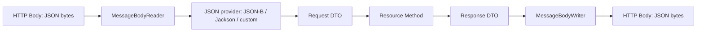

# Part 011 — JSON with Jakarta REST: JSON-B, JSON-P, Jackson, Records, and DTO Contracts

> Target kompetensi: setelah bagian ini, kita tidak hanya bisa menerima dan mengembalikan JSON dari resource method. Kita akan memahami JSON sebagai **public contract**, memahami posisi JSON-B, JSON-P, dan Jackson di provider pipeline, serta mampu mendesain DTO yang stabil, aman, dan tahan evolusi.

Di banyak aplikasi Jakarta REST, JSON terlihat sederhana:

```java
@POST
@Consumes(MediaType.APPLICATION_JSON)
@Produces(MediaType.APPLICATION_JSON)
public Response createCase(CreateCaseRequest request) {
    CaseResponse response = service.create(request);
    return Response.status(Response.Status.CREATED).entity(response).build();
}
```

Tetapi di production, bagian yang tampak sederhana ini sering menjadi sumber defect mahal:

- field yang tidak sengaja berubah nama;
- `null` yang berubah makna;
- enum yang rename dan mematahkan client;
- date/time yang ambigu timezone;
- response DTO yang mengekspos persistence entity;
- serialization lazy-loading;
- backward compatibility yang tidak diuji;
- custom serializer yang berbeda antar runtime;
- request besar yang membuat heap pressure;
- error JSON yang bentuknya tidak konsisten dengan success JSON.

Mental model yang benar:

> JSON bukan sekadar format serialization. JSON adalah boundary contract antara sistem kita dan dunia luar.

---

## 1. Posisi JSON dalam Jakarta REST Runtime

Jakarta REST sendiri tidak meminta resource method melakukan parsing manual. Resource method cukup menyatakan Java type dan media type.

```java
@POST
@Consumes(MediaType.APPLICATION_JSON)
public Response submit(SubmitEvidenceRequest request) {
    ...
}
```

Runtime lalu mencari entity provider yang bisa membaca:

- Java target type: `SubmitEvidenceRequest`;
- generic type bila ada;
- annotation context;
- media type: `application/json` atau `application/*+json`;
- provider priority dan registration source.

Secara konseptual:



Dari sudut pandang engineer, kita harus mengontrol tiga boundary:

1. **Representation boundary**: bentuk JSON yang dilihat client.
2. **DTO boundary**: class Java yang menjadi kontrak input/output.
3. **Serialization boundary**: provider dan aturan mapping.

Kalau tiga boundary ini dicampur, API menjadi rapuh.

---

## 2. JSON-B, JSON-P, dan Jackson: Peran yang Berbeda

Di ekosistem Jakarta REST, ada tiga pendekatan umum untuk JSON.

| Pendekatan | Mental model | Cocok untuk | Risiko utama |
|---|---|---|---|
| JSON-B | Object binding standard Jakarta | DTO biasa, portable Jakarta EE | Fitur lebih sedikit dibanding Jackson |
| JSON-P | Tree/stream processing standard Jakarta | JSON dinamis, patch, transformasi, low-level control | Manual, lebih verbose |
| Jackson | Object mapper populer non-Jakarta standard | Ekosistem luas, polymorphism, module banyak | Portability antar runtime perlu dijaga |

Jangan berpikir “mana yang paling bagus”. Pertanyaan yang lebih akurat:

> Di boundary ini, kita butuh object binding stabil, tree-level control, atau library-specific feature?

### 2.1 JSON-B

Jakarta JSON Binding atau JSON-B adalah standard binding Java object ↔ JSON document.

Biasanya cocok untuk request/response DTO yang bentuknya stabil:

```java
public record CreateCaseRequest(
    String title,
    String description,
    String priority
) {}
```

```java
public record CaseResponse(
    String id,
    String status,
    String title
) {}
```

Dengan provider JSON-B, Jakarta REST dapat membaca `CreateCaseRequest` dari JSON dan menulis `CaseResponse` ke JSON tanpa parsing manual.

### 2.2 JSON-P

Jakarta JSON Processing atau JSON-P menyediakan API untuk parsing, generating, transforming, dan querying JSON.

Contoh penggunaan tree model:

```java
@POST
@Consumes(MediaType.APPLICATION_JSON)
public Response inspect(JsonObject body) {
    String operation = body.getString("operation", "unknown");
    JsonArray changes = body.getJsonArray("changes");
    ...
}
```

JSON-P cocok ketika struktur JSON tidak cukup stabil untuk DTO biasa, misalnya:

- patch document;
- dynamic metadata;
- schema-less evidence attributes;
- JSON transformation;
- partial extraction dari payload besar;
- audit capture atas raw logical JSON.

### 2.3 Jackson

Jackson bukan bagian dari Jakarta REST specification, tetapi sering dipakai oleh runtime/framework tertentu atau diregistrasikan sebagai provider.

Jackson berguna ketika kita membutuhkan:

- module khusus Java time;
- advanced polymorphism;
- custom naming strategy;
- compatibility dengan ekosistem Spring/non-Jakarta;
- JSON views;
- fine-grained serializer/deserializer.

Tetapi gunakan dengan sadar:

```java
@Provider
@Produces(MediaType.APPLICATION_JSON)
@Consumes(MediaType.APPLICATION_JSON)
public class JacksonJsonProvider implements MessageBodyReader<Object>, MessageBodyWriter<Object> {
    // simplified; real provider usually comes from Jackson JAX-RS module
}
```

Masalahnya bukan Jackson-nya. Masalahnya adalah ketika API contract diam-diam bergantung pada konfigurasi ObjectMapper yang tidak terdokumentasi.

---

## 3. Rule of Thumb: JSON-B for Contract, JSON-P for Dynamic JSON, Jackson for Explicit Library Decision

Gunakan aturan berikut:

| Situasi | Pilihan default |
|---|---|
| REST API biasa dengan DTO stabil | JSON-B |
| Jakarta EE portability penting | JSON-B |
| Perlu menerima `JsonObject`, `JsonArray`, `JsonValue` | JSON-P |
| Perlu JSON Merge Patch / JSON Patch style operation | JSON-P atau specialized library |
| Perlu fitur Jackson spesifik | Jackson, tapi daftarkan sebagai keputusan arsitektur |
| Runtime Quarkus/RESTEasy/Jersey sudah menyediakan Jackson provider | Boleh, tapi contract test wajib |
| Library internal platform sudah standard Jackson | Boleh, selama config centrally controlled |

Prinsip utamanya:

> Provider JSON adalah bagian dari architecture decision, bukan detail acak dependency.

---

## 4. DTO Boundary: Jangan Return Entity Persistence

Anti-pattern paling mahal:

```java
@GET
@Path("/{id}")
public CaseEntity get(@PathParam("id") UUID id) {
    return repository.findById(id);
}
```

Kenapa buruk?

- field database bocor ke API;
- lazy association bisa memicu query tak terduga;
- bidirectional relation bisa membuat infinite recursion;
- internal enum bocor;
- audit/internal flag ikut terekspos;
- perubahan schema persistence menjadi breaking API;
- security review sulit karena boundary tidak jelas.

Gunakan DTO:

```java
public record CaseResponse(
    String id,
    String caseNumber,
    String title,
    String status,
    Instant createdAt,
    Instant updatedAt
) {}
```

Mapping eksplisit:

```java
public final class CaseMapper {
    public CaseResponse toResponse(CaseRecord record) {
        return new CaseResponse(
            record.id().toString(),
            record.caseNumber(),
            record.title(),
            record.status().apiValue(),
            record.createdAt(),
            record.updatedAt()
        );
    }
}
```

DTO bukan boilerplate. DTO adalah firewall.

---

## 5. Request DTO vs Response DTO

Jangan gunakan class yang sama untuk request dan response hanya karena field-nya mirip.

Bad:

```java
public class CaseDto {
    public String id;
    public String title;
    public String status;
    public Instant createdAt;
}
```

Dipakai untuk:

```java
@POST
public CaseDto create(CaseDto request) { ... }
```

Masalah:

- client bisa mengirim `id` dan `createdAt` padahal server harus generate;
- `status` mungkin tidak boleh ditentukan saat create;
- response field menjadi input field secara tidak sengaja;
- validation menjadi ambigu.

Better:

```java
public record CreateCaseRequest(
    String title,
    String description,
    String priority
) {}

public record CaseResponse(
    String id,
    String caseNumber,
    String title,
    String status,
    Instant createdAt
) {}
```

Untuk update:

```java
public record UpdateCaseRequest(
    String title,
    String description,
    String priority
) {}
```

Untuk patch:

```java
public record PatchCaseRequest(
    Optional<String> title,
    Optional<String> description,
    Optional<String> priority
) {}
```

Namun hati-hati: `Optional` dalam DTO JSON tidak selalu ideal karena membedakan missing field vs explicit null membutuhkan desain yang lebih teliti. Kita bahas di bagian null semantics.

---

## 6. Java Records sebagai DTO

Java records sangat cocok untuk immutable DTO:

```java
public record CaseSummaryResponse(
    String id,
    String caseNumber,
    String title,
    String status
) {}
```

Keuntungan:

- immutable by default;
- shape terlihat jelas;
- constructor canonical;
- cocok untuk response DTO;
- mengurangi accidental setter exposure;
- baik untuk contract-oriented coding.

Tetapi records punya beberapa perhatian:

1. Provider JSON harus mendukung record binding.
2. Default value tidak bisa diberikan lewat field initializer seperti class mutable biasa.
3. Validasi constructor perlu dirancang hati-hati.
4. Missing field handling berbeda antar provider/config.
5. Record component name menjadi bagian penting contract.

Contoh compact constructor:

```java
public record CreateCaseRequest(
    String title,
    String description,
    String priority
) {
    public CreateCaseRequest {
        if (title != null) {
            title = title.trim();
        }
    }
}
```

Namun jangan jadikan constructor DTO tempat domain rule berat. Constructor DTO boleh melakukan normalization ringan, bukan business workflow.

---

## 7. Field Naming: Contract Harus Stabil

Default object binding biasanya memakai nama property Java.

```java
public record CaseResponse(String caseNumber) {}
```

JSON:

```json
{
  "caseNumber": "CASE-2026-0001"
}
```

Jika organisasi memakai `snake_case`, jangan biarkan setiap service mengkonfigurasi sendiri.

Pilih salah satu style secara platform-level:

- `camelCase`: umum untuk JavaScript/JSON dan cocok dengan Java property;
- `snake_case`: umum di banyak public API;
- `kebab-case`: jarang untuk JSON field;
- mixed style: hindari.

Jika memakai JSON-B annotation:

```java
import jakarta.json.bind.annotation.JsonbProperty;

public record CaseResponse(
    @JsonbProperty("case_number") String caseNumber,
    String title
) {}
```

Gunakan explicit annotation ketika:

- field sudah dipublish dan tidak boleh berubah;
- Java internal name perlu refactor tapi JSON contract tetap;
- integrasi eksternal sudah mengunci naming.

Jangan rename JSON field hanya karena rename variable internal.

---

## 8. Null Semantics: Missing, Null, Empty, Unknown

JSON contract sering rusak bukan karena syntax, tetapi karena makna nilai.

Empat kondisi ini berbeda:

```json
{}
```

```json
{"description": null}
```

```json
{"description": ""}
```

```json
{"description": "   "}
```

Pertanyaan yang harus dijawab API:

| Kondisi | Makna yang mungkin |
|---|---|
| Field missing | Tidak diubah / tidak dikirim / default |
| Field null | Clear value / unknown / invalid |
| Empty string | Nilai kosong valid / invalid |
| Blank string | Harus trim / invalid |

Untuk create request, biasanya lebih ketat:

```java
public record CreateCaseRequest(
    @NotBlank String title,
    String description
) {}
```

Untuk update full replacement, missing field mungkin berarti field menjadi null/default karena representasi lengkap dikirim.

Untuk patch, missing field biasanya berarti “tidak diubah”, sedangkan explicit null bisa berarti “hapus nilai”.

Contoh patch yang explicit:

```json
{
  "description": null
}
```

Bisa berarti:

> Set description menjadi null.

Tetapi ini harus dinyatakan dalam contract. Jangan biarkan provider JSON mendefinisikan business semantics secara implisit.

---

## 9. Unknown Fields: Strict atau Lenient?

Ketika client mengirim field yang tidak dikenali:

```json
{
  "title": "Case A",
  "unexpectedField": "x"
}
```

Ada dua strategi.

### 9.1 Lenient by default

Runtime mengabaikan unknown field.

Keuntungan:

- backward/forward compatibility lebih mudah;
- client bisa mengirim field baru ke server lama;
- cocok untuk internal rolling deployment.

Risiko:

- typo client tidak terdeteksi;
- security-sensitive input bisa diabaikan diam-diam;
- debugging sulit.

### 9.2 Strict by default

Unknown field menghasilkan `400 Bad Request`.

Keuntungan:

- contract lebih ketat;
- typo cepat ditemukan;
- cocok untuk regulated API atau external public API dengan schema formal.

Risiko:

- evolusi forward compatibility lebih sulit;
- rolling deployment perlu lebih hati-hati.

Rekomendasi praktis:

| API type | Unknown field policy |
|---|---|
| Internal service-to-service controlled | Lenient, dengan contract test |
| Public external API | Strict atau documented lenient |
| Regulatory mutation endpoint | Strict |
| Search/filter endpoint | Strict untuk query grammar |
| Event ingestion | Lenient dengan capture raw payload |

Yang paling buruk adalah tidak tahu policy-nya.

---

## 10. Enum Serialization: Jangan Bocorkan `enum.name()` Secara Buta

Bad:

```java
public enum CaseStatus {
    NEW,
    UNDER_INVESTIGATION,
    CLOSED
}
```

Jika JSON otomatis memakai `name()`:

```json
{"status":"UNDER_INVESTIGATION"}
```

Masalah muncul saat internal enum berubah:

```java
UNDER_REVIEW
```

Client break.

Lebih stabil:

```java
public enum CaseStatus {
    NEW("new"),
    UNDER_INVESTIGATION("under_investigation"),
    CLOSED("closed");

    private final String apiValue;

    CaseStatus(String apiValue) {
        this.apiValue = apiValue;
    }

    public String apiValue() {
        return apiValue;
    }
}
```

Lalu DTO response menggunakan string API value:

```java
public record CaseResponse(
    String id,
    String status
) {}
```

Mapping:

```java
new CaseResponse(caseId.toString(), status.apiValue());
```

Untuk request, parse explicit:

```java
public enum CasePriority {
    LOW("low"), MEDIUM("medium"), HIGH("high");

    public static CasePriority fromApiValue(String value) {
        return Arrays.stream(values())
            .filter(p -> p.apiValue.equals(value))
            .findFirst()
            .orElseThrow(() -> new BadRequestException("Unsupported priority: " + value));
    }
}
```

Dalam API jangka panjang, string literal di JSON adalah public API. Treat it like database migration: perubahan perlu plan.

---

## 11. Date and Time: Gunakan `Instant`, `OffsetDateTime`, atau Local Type dengan Alasan Jelas

Tanggal/waktu adalah sumber bug integrasi yang klasik.

Gunakan aturan ini:

| Kebutuhan | Java type | JSON recommendation |
|---|---|---|
| Timestamp global audit/event | `Instant` | ISO-8601 UTC, mis. `2026-06-27T10:15:30Z` |
| Timestamp dengan offset client-visible | `OffsetDateTime` | ISO-8601 dengan offset |
| Tanggal kalender tanpa waktu | `LocalDate` | `YYYY-MM-DD` |
| Jam lokal tanpa tanggal | `LocalTime` | jarang untuk API business |
| Jadwal dengan timezone region | `ZonedDateTime` + zone policy | hati-hati, zone database matters |

Untuk audit/regulatory system, default yang aman:

```java
public record AuditEventResponse(
    String id,
    String action,
    Instant occurredAt,
    String actorId
) {}
```

JSON:

```json
{
  "id": "evt_01J...",
  "action": "case.submitted",
  "occurredAt": "2026-06-27T03:15:30Z",
  "actorId": "usr_123"
}
```

Hindari timestamp numerik kecuali ada kebutuhan jelas:

```json
{"occurredAt": 1782530130000}
```

Kenapa?

- apakah millis atau seconds?
- timezone tidak terlihat;
- manusia sulit debug;
- client language bisa overflow/precision issue.

---

## 12. BigDecimal, Money, and Numeric Precision

JSON hanya punya number; Java punya banyak numeric type.

Untuk uang, denda, threshold, score, dan measurement regulated, jangan gunakan `double` untuk nilai presisi.

Bad:

```java
public record PenaltyResponse(double amount) {}
```

Better:

```java
public record MoneyResponse(
    String currency,
    BigDecimal amount
) {}
```

Contoh JSON:

```json
{
  "currency": "IDR",
  "amount": 1500000.00
}
```

Untuk public API, kadang amount sebagai string lebih defensible:

```json
{
  "currency": "IDR",
  "amount": "1500000.00"
}
```

Trade-off:

| Format | Keuntungan | Risiko |
|---|---|---|
| JSON number | natural bagi client | precision/scale bisa berubah |
| string decimal | presisi kontraktual | client perlu parse explicit |
| minor unit integer | presisi kuat | perlu currency exponent policy |

Untuk sistem enforcement/regulatory, dokumentasikan format money. Jangan mengandalkan default JSON provider.

---

## 13. Collections and Empty Collections

Response collection harus konsisten.

Prefer:

```json
{
  "items": [],
  "page": {
    "limit": 20,
    "nextCursor": null
  }
}
```

Daripada:

```json
{
  "items": null
}
```

Untuk field list di response:

- list kosong berarti tidak ada item;
- `null` berarti unknown/not loaded/hidden, tapi jarang perlu;
- missing berarti field tidak bagian dari representation.

DTO:

```java
public record CaseListResponse(
    List<CaseSummaryResponse> items,
    PageInfo page
) {
    public CaseListResponse {
        items = List.copyOf(items == null ? List.of() : items);
    }
}
```

Jangan expose mutable list yang bisa berubah setelah serialization dimulai.

---

## 14. Polymorphism: Hindari Kecuali Contract-nya Kuat

Polymorphic JSON terlihat menarik:

```json
{
  "type": "email",
  "to": "a@example.com",
  "subject": "..."
}
```

```json
{
  "type": "webhook",
  "url": "https://...",
  "secretRef": "..."
}
```

Di Java:

```java
sealed interface NotificationTarget permits EmailTarget, WebhookTarget {}
```

Masalahnya:

- provider support berbeda;
- discriminator field harus stabil;
- deserialization bisa menjadi security-sensitive;
- unknown subtype harus punya behavior jelas;
- schema documentation harus kuat.

Untuk API contract, polymorphism boleh jika:

1. ada discriminator eksplisit seperti `type`;
2. setiap subtype punya schema jelas;
3. unknown `type` menghasilkan error jelas;
4. tidak memakai class name Java sebagai type id;
5. tidak mengaktifkan arbitrary subtype deserialization.

Bad:

```json
{
  "@class": "com.company.internal.EmailTarget",
  ...
}
```

Ini membocorkan package internal dan berisiko security.

Better:

```json
{
  "type": "email",
  "email": {
    "to": "a@example.com"
  }
}
```

---

## 15. JSON Merge Patch and Partial Update

Jakarta REST 3.1 menambahkan media type constants untuk JSON Merge Patch:

```java
MediaType.APPLICATION_MERGE_PATCH_JSON
```

Patch endpoint perlu membedakan:

- field missing: tidak berubah;
- field null: hapus/set null;
- field value: ubah ke value itu.

Contoh:

```http
PATCH /cases/{id}
Content-Type: application/merge-patch+json
```

```json
{
  "description": null,
  "priority": "high"
}
```

Implementasi dengan JSON-P:

```java
@PATCH
@Path("/{id}")
@Consumes(MediaType.APPLICATION_MERGE_PATCH_JSON)
@Produces(MediaType.APPLICATION_JSON)
public CaseResponse patchCase(@PathParam("id") UUID id, JsonObject patch) {
    PatchCommand command = patchParser.parse(patch);
    return mapper.toResponse(service.patch(id, command));
}
```

Kenapa `JsonObject` sering lebih baik daripada DTO biasa untuk patch?

Karena DTO biasa sering kehilangan informasi penting: apakah field tidak ada, atau ada dengan nilai null.

---

## 16. JSON Error Response Harus Satu Kontrak dengan Success Response

Jangan biarkan provider/runtime mengeluarkan error JSON yang berubah-ubah.

Bad:

```json
{"error":"Bad Request"}
```

Kadang:

```json
{"message":"Validation failed"}
```

Kadang HTML error page.

Better:

```java
public record ProblemResponse(
    String type,
    String title,
    int status,
    String detail,
    String instance,
    String correlationId,
    List<ViolationResponse> violations
) {}

public record ViolationResponse(
    String field,
    String code,
    String message
) {}
```

Contoh JSON:

```json
{
  "type": "https://api.example.com/problems/validation-error",
  "title": "Validation failed",
  "status": 400,
  "detail": "One or more fields are invalid.",
  "instance": "/cases",
  "correlationId": "corr_01J...",
  "violations": [
    {
      "field": "title",
      "code": "required",
      "message": "title is required"
    }
  ]
}
```

Important:

- error response juga `@Produces(application/json)`;
- error response tidak boleh bocor stack trace;
- validation error field path harus stabil;
- correlation ID harus ada untuk observability;
- security-sensitive error harus generic.

---

## 17. ContextResolver for JSON-B

Jakarta REST memungkinkan aplikasi menyediakan context resolver agar provider JSON-B memakai konfigurasi tertentu.

Contoh:

```java
import jakarta.json.bind.Jsonb;
import jakarta.json.bind.JsonbBuilder;
import jakarta.json.bind.JsonbConfig;
import jakarta.ws.rs.Produces;
import jakarta.ws.rs.core.MediaType;
import jakarta.ws.rs.ext.ContextResolver;
import jakarta.ws.rs.ext.Provider;

@Provider
@Produces(MediaType.APPLICATION_JSON)
public class JsonbConfiguration implements ContextResolver<Jsonb> {

    private final Jsonb jsonb;

    public JsonbConfiguration() {
        JsonbConfig config = new JsonbConfig()
            .withNullValues(false);

        this.jsonb = JsonbBuilder.create(config);
    }

    @Override
    public Jsonb getContext(Class<?> type) {
        return jsonb;
    }
}
```

Gunakan ini untuk konfigurasi global yang memang bagian dari contract, misalnya:

- null inclusion;
- naming strategy;
- date format;
- adapters;
- strictness jika provider mendukung.

Namun hati-hati:

> Mengubah global JSON config adalah breaking change potensial.

Jangan mengganti behavior JSON-B global karena satu endpoint butuh format khusus. Untuk endpoint khusus, lebih baik gunakan DTO khusus atau provider khusus dengan media type khusus.

---

## 18. DTO Versioning: Tambah Field Boleh, Ubah Makna Jangan

Backward-compatible changes biasanya:

- menambah optional response field;
- menambah optional request field dengan default aman;
- menambah enum value jika client siap unknown value;
- menambah link;
- menambah nested metadata.

Breaking changes:

- rename field;
- remove field;
- ubah type field;
- ubah date format;
- ubah enum literal;
- ubah semantics `null`;
- mengubah default value;
- mengubah error shape;
- mengubah precision numeric;
- mengubah array menjadi object.

Contoh additive response:

```json
{
  "id": "case_123",
  "title": "...",
  "status": "open",
  "riskScore": 87
}
```

Jika `riskScore` baru dan optional, client lama harus tetap berjalan.

Tetapi mengubah:

```json
{"status":"OPEN"}
```

menjadi:

```json
{"status":"open"}
```

adalah breaking untuk client yang melakukan exact match.

---

## 19. Desain DTO untuk Evolusi

Gunakan DTO yang membuka ruang evolusi tanpa membuat contract terlalu generic.

### 19.1 Metadata envelope

```java
public record CaseResponse(
    String id,
    String caseNumber,
    String title,
    String status,
    CaseMetadata metadata
) {}

public record CaseMetadata(
    Instant createdAt,
    Instant updatedAt,
    String createdBy
) {}
```

### 19.2 Links

```java
public record CaseResponse(
    String id,
    String title,
    String status,
    List<LinkResponse> links
) {}

public record LinkResponse(
    String rel,
    String href,
    String method
) {}
```

### 19.3 Capabilities

Untuk workflow/regulatory system, jangan hardcode semua action di client. Expose allowed actions:

```json
{
  "id": "case_123",
  "status": "under_review",
  "allowedActions": [
    "assign",
    "request_evidence",
    "escalate"
  ]
}
```

Ini membantu client mengikuti state machine tanpa tahu semua transition internal.

---

## 20. Sensitive Data and JSON Redaction

Jangan mengandalkan `@JsonbTransient` atau annotation sejenis sebagai satu-satunya security boundary.

Bad:

```java
public class UserEntity {
    public String id;
    public String email;
    public String passwordHash;
    public String internalRiskFlag;
}
```

Lalu berharap annotation menyelamatkan semua response.

Better:

```java
public record UserProfileResponse(
    String id,
    String email,
    String displayName
) {}
```

Redaction harus terjadi di mapping layer atau query projection, bukan hanya serialization layer.

Untuk audit/regulatory API:

- pisahkan public response dan internal response;
- jangan expose evidence storage path;
- jangan expose internal rule code jika sensitif;
- jangan expose reviewer notes tanpa authorization;
- jangan log raw request/response JSON sembarangan.

---

## 21. Large JSON Payloads

JSON object binding mudah, tetapi tidak selalu murah.

Masalah payload besar:

- full body harus dibaca ke memory;
- object graph besar membuat allocation spike;
- validation bisa mahal;
- logging payload memperbesar biaya;
- error response mungkin muncul setelah resource banyak dipakai;
- parsing bisa menjadi CPU hotspot.

Strategi:

1. Batasi `Content-Length` di gateway/container.
2. Gunakan streaming untuk payload besar jika memungkinkan.
3. Pisahkan upload file dari metadata JSON.
4. Jangan kirim array besar tanpa pagination.
5. Jangan log payload besar by default.
6. Gunakan JSON-P streaming/tree hanya bila benar-benar perlu kontrol.
7. Terapkan timeout dan backpressure di layer gateway/runtime.

Endpoint seperti ini berbahaya:

```java
@POST
@Path("/bulk")
public Response bulk(List<CreateCaseRequest> requests) {
    ...
}
```

Lebih aman:

- batasi jumlah item;
- gunakan asynchronous job;
- validasi ukuran;
- hasilkan job resource;
- expose progress endpoint.

```http
POST /case-import-jobs
Content-Type: application/json
```

```json
{
  "source": "manual_upload",
  "items": [...]
}
```

Response:

```http
202 Accepted
Location: /case-import-jobs/job_123
```

---

## 22. Contract Tests untuk JSON

Unit test resource method tidak cukup. Kita perlu test actual JSON shape.

Contoh golden JSON test:

```java
@Test
void shouldSerializeCaseResponseContract() {
    CaseResponse response = new CaseResponse(
        "case_123",
        "CASE-2026-0001",
        "Open investigation",
        "under_review",
        Instant.parse("2026-06-27T03:15:30Z")
    );

    String json = jsonb.toJson(response);

    assertThat(json).contains("\"caseNumber\":\"CASE-2026-0001\"");
    assertThat(json).contains("\"status\":\"under_review\"");
    assertThat(json).contains("\"createdAt\":\"2026-06-27T03:15:30Z\"");
}
```

Lebih kuat: compare semantic JSON:

```java
JsonObject actual = Json.createReader(new StringReader(json)).readObject();

assertEquals("case_123", actual.getString("id"));
assertEquals("under_review", actual.getString("status"));
```

Untuk API contract publik, gunakan:

- OpenAPI schema validation;
- consumer-driven contract;
- snapshot/golden response test;
- backward compatibility test;
- enum literal test;
- null/missing field test;
- unknown field behavior test.

---

## 23. Example: Production-Grade JSON DTO Set untuk Case API

### 23.1 Create request

```java
import jakarta.validation.constraints.NotBlank;
import jakarta.validation.constraints.Size;

public record CreateCaseRequest(
    @NotBlank
    @Size(max = 200)
    String title,

    @Size(max = 5000)
    String description,

    @NotBlank
    String priority
) {}
```

### 23.2 Response

```java
import java.time.Instant;
import java.util.List;

public record CaseResponse(
    String id,
    String caseNumber,
    String title,
    String description,
    String priority,
    String status,
    Instant createdAt,
    Instant updatedAt,
    List<String> allowedActions,
    List<LinkResponse> links
) {}

public record LinkResponse(
    String rel,
    String href,
    String method
) {}
```

### 23.3 Resource method

```java
@Path("/cases")
@Consumes(MediaType.APPLICATION_JSON)
@Produces(MediaType.APPLICATION_JSON)
public class CaseResource {

    private final CaseApplicationService service;
    private final CaseRepresentationMapper mapper;

    public CaseResource(CaseApplicationService service, CaseRepresentationMapper mapper) {
        this.service = service;
        this.mapper = mapper;
    }

    @POST
    public Response create(@Valid CreateCaseRequest request, @Context UriInfo uriInfo) {
        CaseRecord created = service.create(mapper.toCommand(request));
        URI location = uriInfo.getAbsolutePathBuilder()
            .path(created.id().toString())
            .build();

        return Response.created(location)
            .entity(mapper.toResponse(created))
            .build();
    }
}
```

### 23.4 Mapper

```java
public final class CaseRepresentationMapper {

    public CreateCaseCommand toCommand(CreateCaseRequest request) {
        return new CreateCaseCommand(
            normalize(request.title()),
            normalizeNullable(request.description()),
            CasePriority.fromApiValue(request.priority())
        );
    }

    public CaseResponse toResponse(CaseRecord record) {
        return new CaseResponse(
            record.id().toString(),
            record.caseNumber(),
            record.title(),
            record.description(),
            record.priority().apiValue(),
            record.status().apiValue(),
            record.createdAt(),
            record.updatedAt(),
            record.allowedActions().stream().map(CaseAction::apiValue).toList(),
            List.of(
                new LinkResponse("self", "/cases/" + record.id(), "GET"),
                new LinkResponse("events", "/cases/" + record.id() + "/events", "GET")
            )
        );
    }

    private String normalize(String value) {
        return value == null ? null : value.trim();
    }

    private String normalizeNullable(String value) {
        String normalized = normalize(value);
        return normalized == null || normalized.isBlank() ? null : normalized;
    }
}
```

---

## 24. Anti-Patterns

### 24.1 Raw JSON everywhere

```java
public Response create(String json) { ... }
```

Ini menghilangkan benefit provider pipeline, validation, dan contract clarity.

Gunakan hanya untuk endpoint yang memang raw/dynamic.

### 24.2 Map sebagai DTO

```java
public Response create(Map<String, Object> body) { ... }
```

Masalah:

- tidak ada type safety;
- tidak ada schema jelas;
- validation sulit;
- refactor rawan;
- error message buruk.

Gunakan DTO atau JSON-P tergantung kebutuhan.

### 24.3 Entity exposure

```java
return Response.ok(caseEntity).build();
```

Ini mencampur persistence boundary dan API boundary.

### 24.4 Global ObjectMapper/Jsonb config liar

Satu endpoint mengubah konfigurasi global, lalu semua endpoint berubah.

### 24.5 Date format custom tanpa kebutuhan

```json
{"createdAt":"27/06/2026 10:15"}
```

Ambigu, tidak portable, sulit sort, sulit parse.

### 24.6 Enum internal sebagai API

`UNDER_INVESTIGATION_INTERNAL_REVIEW_PENDING` bukan contract yang bagus.

### 24.7 `null` sebagai “semua hal”

Jika `null` bisa berarti unknown, clear, not authorized, not applicable, dan not loaded, API tidak defensible.

---

## 25. Checklist JSON Contract Review

Sebelum merge endpoint JSON, cek:

- Apakah request DTO dan response DTO terpisah?
- Apakah persistence entity tidak terekspos?
- Apakah field naming konsisten?
- Apakah null/missing/empty semantics jelas?
- Apakah unknown field policy jelas?
- Apakah date/time memakai ISO-8601 dan type Java tepat?
- Apakah enum value stabil dan tidak bocor internal name?
- Apakah numeric precision aman?
- Apakah list kosong tidak menjadi null tanpa alasan?
- Apakah error JSON shape konsisten?
- Apakah sensitive field tidak mungkin terserialisasi?
- Apakah provider JSON dikonfigurasi secara eksplisit?
- Apakah ada test untuk serialization/deserialization?
- Apakah response additive changes tidak mematahkan client lama?
- Apakah patch semantics diuji?

---

## 26. Latihan 20 Jam ala Kaufman untuk JSON Boundary

### Latihan 1 — DTO firewall

Ambil satu entity internal dan buat:

- create request DTO;
- update request DTO;
- response DTO;
- summary response DTO;
- mapper explicit.

Pastikan tidak ada entity yang muncul di resource method return type.

### Latihan 2 — Null semantics matrix

Untuk satu endpoint update, tulis tabel:

| Field | Missing | Null | Empty | Invalid |
|---|---|---|---|---|
| title | ? | ? | ? | ? |
| description | ? | ? | ? | ? |
| priority | ? | ? | ? | ? |

Lalu implementasikan test.

### Latihan 3 — Enum compatibility

Buat enum internal dengan `apiValue()`, parser explicit, dan test untuk unknown value.

### Latihan 4 — Date/time contract

Buat response dengan `Instant`, test JSON output-nya, lalu pastikan timezone tidak bergantung pada server local timezone.

### Latihan 5 — JSON-P patch endpoint

Buat endpoint `PATCH /cases/{id}` dengan `JsonObject`, bedakan missing vs null, dan tulis test untuk keduanya.

---

## 27. Ringkasan

JSON di Jakarta REST berada di tengah-tengah resource design, provider pipeline, dan API contract.

Key takeaways:

- JSON adalah contract, bukan sekadar hasil serialization.
- JSON-B cocok untuk portable object binding.
- JSON-P cocok untuk dynamic/tree-level JSON.
- Jackson boleh dipakai, tetapi harus menjadi keputusan arsitektur eksplisit.
- DTO adalah firewall antara API dan domain/persistence.
- Request DTO dan response DTO sebaiknya dipisah.
- Null, missing, empty, enum, date/time, numeric precision, dan unknown field policy harus didefinisikan.
- Error response juga bagian dari JSON contract.
- Contract test adalah pengaman utama agar provider/config tidak mengubah API tanpa sadar.

Di part berikutnya, kita akan keluar dari JSON biasa dan masuk ke **forms, multipart, file upload, downloads, dan binary streaming**. Ini penting karena payload non-JSON sering membawa risiko memory, security, dan operability yang lebih besar daripada endpoint CRUD biasa.

---

## References

- Jakarta RESTful Web Services 4.0 Specification: https://jakarta.ee/specifications/restful-ws/4.0/jakarta-restful-ws-spec-4.0
- Jakarta JSON Binding: https://jakarta.ee/specifications/jsonb/
- Jakarta JSON Processing: https://jakarta.ee/specifications/jsonp/
