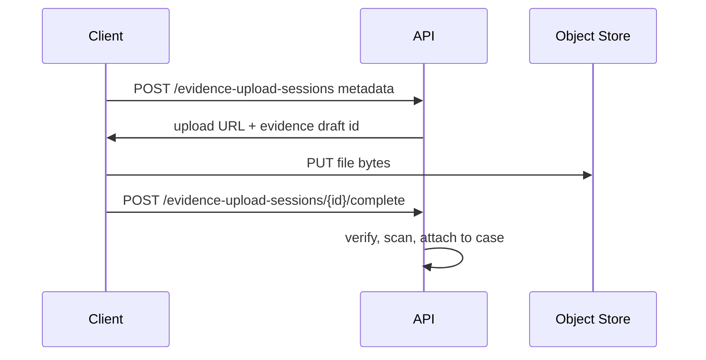
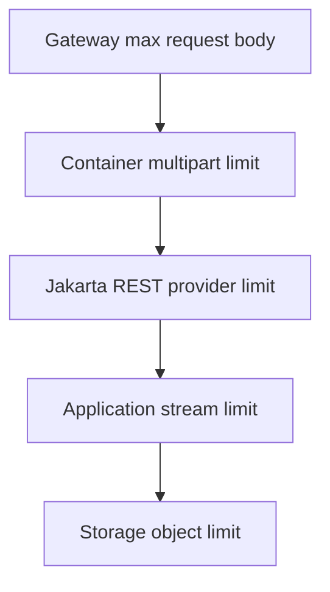
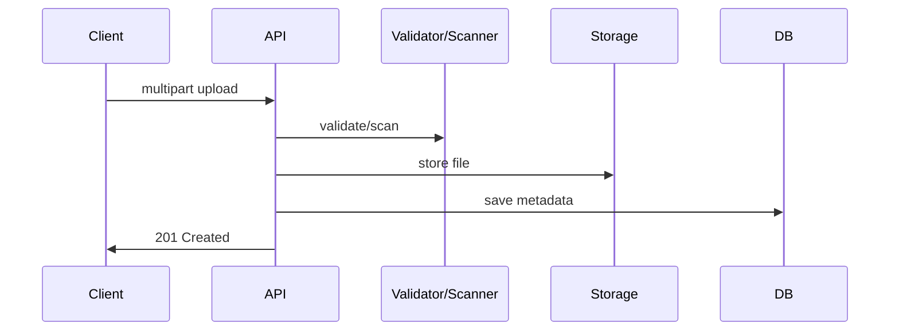
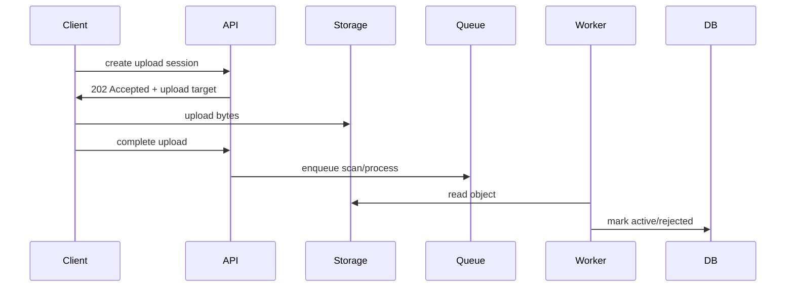
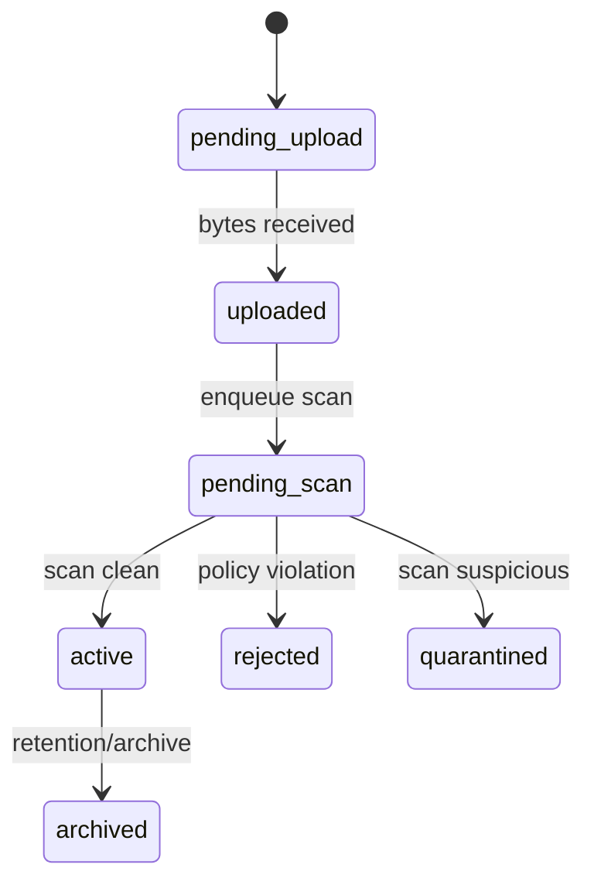
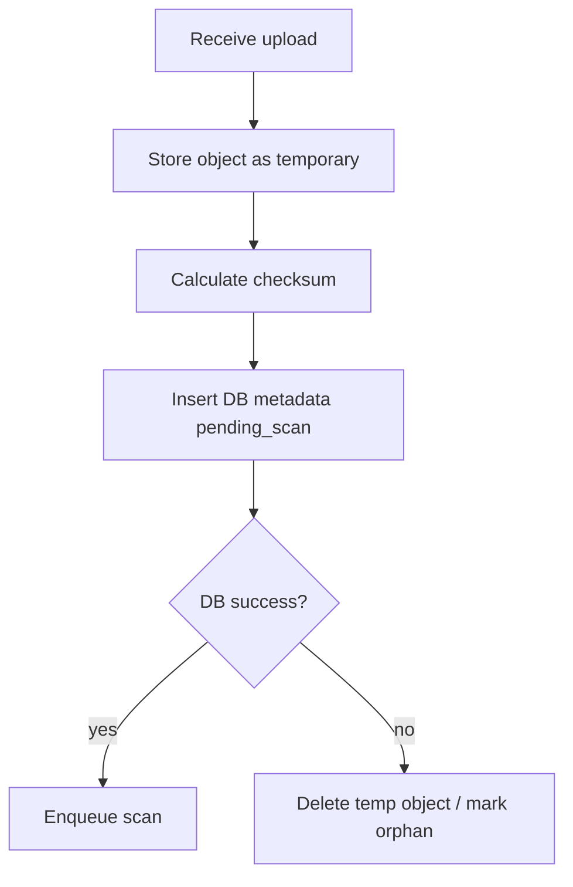

# Part 012 — Multipart, Forms, File Uploads, Downloads, and Binary Streaming

> Target kompetensi: setelah bagian ini, kita mampu mendesain endpoint form, multipart, upload, download, dan binary streaming yang aman, hemat memory, dapat diobservasi, serta tidak menjebak sistem production dengan heap spike, file descriptor leak, atau exposure data sensitif.

JSON adalah representasi dominan untuk API modern, tetapi tidak semua request cocok sebagai JSON.

Beberapa kasus butuh format lain:

- HTML form submit;
- upload evidence/document;
- upload attachment dengan metadata;
- download PDF/report;
- export CSV;
- stream binary object;
- receive webhook form encoded;
- ingest multipart data dari sistem legacy.

Dalam Jakarta REST, area ini penting karena ia menyentuh lebih banyak resource sistem:

- heap memory;
- disk temporary storage;
- file descriptor;
- network bandwidth;
- proxy timeout;
- antivirus/malware scanning;
- audit trail;
- data retention;
- access control;
- content sniffing;
- range/download semantics.

Endpoint upload/download yang terlihat kecil bisa menjadi risiko operasional besar.

---

## 1. Mental Model: Payload Type Determines Operational Risk

Endpoint JSON biasa biasanya seperti ini:


Upload/download berbeda:


Perbedaan utamanya:

| JSON DTO | Multipart/binary |
|---|---|
| relatif kecil | bisa sangat besar |
| biasanya memory-bound | memory + disk + network + storage |
| shape mudah divalidasi | content perlu inspeksi |
| contract field-level | contract part/header/content-level |
| error cepat | error bisa terjadi setelah stream panjang |

Karena itu, desain upload/download harus dimulai dari resource limit dan lifecycle, bukan dari annotation.

---

## 2. Media Types yang Perlu Dikuasai

| Media type | Use case | Jakarta REST concern |
|---|---|---|
| `application/json` | request/response biasa | JSON provider |
| `application/x-www-form-urlencoded` | HTML form/simple webhook | `@FormParam` |
| `multipart/form-data` | file + field dalam satu request | `EntityPart`, `List<EntityPart>`, provider multipart |
| `application/octet-stream` | raw binary | `InputStream`, `StreamingOutput`, `File` |
| `text/csv` | export/import CSV | custom writer/reader or streaming |
| `application/pdf` | generated/downloaded PDF | binary response headers |
| `application/zip` | archive download | streaming + safe filename |

Rule:

> Jangan menerima `*/*` untuk upload kecuali benar-benar perlu. Semakin longgar `@Consumes`, semakin besar attack surface.

---

## 3. Form URL Encoded: `application/x-www-form-urlencoded`

Form URL encoded cocok untuk field sederhana.

```http
POST /login
Content-Type: application/x-www-form-urlencoded

username=alice&password=secret
```

Resource:

```java
@Path("/sessions")
@Produces(MediaType.APPLICATION_JSON)
public class SessionResource {

    @POST
    @Consumes(MediaType.APPLICATION_FORM_URLENCODED)
    public Response createSession(
        @FormParam("username") String username,
        @FormParam("password") String password
    ) {
        ...
    }
}
```

Untuk banyak field, gunakan `@BeanParam` atau DTO-like form object:

```java
public class LoginForm {
    @FormParam("username")
    public String username;

    @FormParam("password")
    public String password;
}
```

```java
@POST
@Consumes(MediaType.APPLICATION_FORM_URLENCODED)
public Response login(@BeanParam LoginForm form) {
    ...
}
```

Namun untuk API modern, form-urlencoded biasanya dipakai ketika:

- kompatibilitas HTML form;
- OAuth-style protocol;
- webhook provider tertentu;
- legacy system integration.

Untuk domain API baru, JSON biasanya lebih ekspresif.

---

## 4. Multipart Form Data: Konsep Dasar

`multipart/form-data` memungkinkan satu HTTP request berisi banyak part. Setiap part punya:

- name;
- optional filename;
- content headers;
- media type;
- content stream/body.

Contoh simplified:

```http
POST /cases/case_123/evidence
Content-Type: multipart/form-data; boundary=abc

--abc
Content-Disposition: form-data; name="metadata"
Content-Type: application/json

{"title":"Invoice","category":"financial_record"}
--abc
Content-Disposition: form-data; name="file"; filename="invoice.pdf"
Content-Type: application/pdf

<binary bytes>
--abc--
```

Multipart adalah pilihan baik ketika metadata dan file harus dikirim sebagai satu logical operation.

Tetapi jangan selalu pakai multipart. Untuk file besar, sering lebih baik memakai pre-signed upload flow:



Keuntungan:

- API server tidak menjadi data plane besar;
- upload bisa langsung ke object storage;
- retry/resume lebih mudah;
- scaling lebih murah;
- scanning pipeline bisa asynchronous.

Multipart cocok untuk ukuran kecil-sedang dan integrasi sederhana. Untuk file besar, desain storage flow lebih penting daripada annotation.

---

## 5. Jakarta REST 4.0 `EntityPart`

Jakarta REST 4.0 menyediakan API portable untuk multipart form data melalui `jakarta.ws.rs.core.EntityPart`.

Contoh menerima semua parts:

```java
import jakarta.ws.rs.Consumes;
import jakarta.ws.rs.POST;
import jakarta.ws.rs.Path;
import jakarta.ws.rs.core.EntityPart;
import jakarta.ws.rs.core.MediaType;
import jakarta.ws.rs.core.Response;
import java.io.InputStream;
import java.util.List;
import java.util.Optional;

@Path("/evidence")
public class EvidenceResource {

    @POST
    @Consumes(MediaType.MULTIPART_FORM_DATA)
    public Response upload(List<EntityPart> parts) {
        for (EntityPart part : parts) {
            String name = part.getName();
            Optional<String> fileName = part.getFileName();
            MediaType mediaType = part.getMediaType();
            InputStream content = part.getContent();

            // process carefully
        }

        return Response.accepted().build();
    }
}
```

Contoh menerima part tertentu dengan `@FormParam`:

```java
@POST
@Consumes(MediaType.MULTIPART_FORM_DATA)
public Response uploadEvidence(
    @FormParam("metadata") EntityPart metadataPart,
    @FormParam("file") EntityPart filePart
) {
    ...
}
```

Jika hanya butuh content:

```java
@POST
@Consumes(MediaType.MULTIPART_FORM_DATA)
public Response uploadEvidence(
    @FormParam("file") InputStream file
) {
    ...
}
```

Tetapi jika butuh filename, headers, atau media type part, gunakan `EntityPart`, bukan `InputStream` saja.

---

## 6. Jangan Gunakan `String` untuk File Part Besar

Jakarta REST memungkinkan `@FormParam` multipart ke `String`, `InputStream`, atau `EntityPart` dalam beberapa kondisi.

Contoh berbahaya:

```java
@POST
@Consumes(MediaType.MULTIPART_FORM_DATA)
public Response upload(@FormParam("file") String fileContent) {
    ...
}
```

Ini buruk untuk file besar karena seluruh content harus menjadi `String` di heap.

Gunakan:

```java
@POST
@Consumes(MediaType.MULTIPART_FORM_DATA)
public Response upload(@FormParam("file") EntityPart filePart) {
    try (InputStream input = filePart.getContent()) {
        storage.write(input);
    }
}
```

Aturan praktis:

| Part type | Aman untuk | Hindari untuk |
|---|---|---|
| `String` | field kecil seperti title/category | file, payload besar, unknown size |
| `InputStream` | content streaming | jika butuh headers/filename |
| `EntityPart` | production multipart | jika ingin DTO binding otomatis sederhana |
| `List<EntityPart>` | dynamic multipart | contract yang harus strict tanpa validasi manual |

---

## 7. Strict Multipart Contract

Multipart endpoint harus punya kontrak jelas.

Contoh contract:

```txt
POST /cases/{caseId}/evidence
Consumes: multipart/form-data

Required parts:
- metadata: application/json, max 16 KB
- file: application/pdf, image/png, image/jpeg, max 20 MB

Rules:
- exactly one metadata part
- exactly one file part
- filename required
- file media type must match allowed list
- file content will be malware-scanned before becoming active
```

Jangan menerima arbitrary parts tanpa alasan.

Validation helper:

```java
public final class MultipartEvidenceRequest {
    private final EntityPart metadata;
    private final EntityPart file;

    public MultipartEvidenceRequest(List<EntityPart> parts) {
        Map<String, List<EntityPart>> byName = parts.stream()
            .collect(Collectors.groupingBy(EntityPart::getName));

        this.metadata = requireSingle(byName, "metadata");
        this.file = requireSingle(byName, "file");
    }

    private static EntityPart requireSingle(Map<String, List<EntityPart>> byName, String name) {
        List<EntityPart> values = byName.getOrDefault(name, List.of());
        if (values.size() != 1) {
            throw new BadRequestException("Expected exactly one part: " + name);
        }
        return values.get(0);
    }
}
```

---

## 8. Parsing Metadata Part sebagai JSON

Metadata multipart sering dikirim sebagai JSON part.

```java
public record EvidenceMetadataRequest(
    String title,
    String category,
    String description
) {}
```

Dengan `EntityPart`, kita bisa membaca content metadata.

Approach sederhana:

```java
@POST
@Consumes(MediaType.MULTIPART_FORM_DATA)
@Produces(MediaType.APPLICATION_JSON)
public Response uploadEvidence(List<EntityPart> parts) {
    MultipartEvidenceRequest multipart = new MultipartEvidenceRequest(parts);

    EvidenceMetadataRequest metadata = readMetadata(multipart.metadata());

    try (InputStream file = multipart.file().getContent()) {
        EvidenceRecord record = service.upload(metadata, file);
        return Response.status(Response.Status.CREATED)
            .entity(mapper.toResponse(record))
            .build();
    }
}
```

Pseudo helper:

```java
private EvidenceMetadataRequest readMetadata(EntityPart part) {
    if (!MediaType.APPLICATION_JSON_TYPE.isCompatible(part.getMediaType())) {
        throw new BadRequestException("metadata must be application/json");
    }

    try (InputStream input = part.getContent()) {
        return jsonb.fromJson(input, EvidenceMetadataRequest.class);
    }
}
```

Catatan: API detail JSON-B overload bisa berbeda berdasarkan versi/implementation; gunakan method yang tersedia di runtime Anda atau baca sebagai `Reader` bila perlu.

Yang penting secara desain:

- validasi media type metadata;
- batasi ukuran metadata;
- validasi DTO metadata;
- jangan parse file part sebagai string;
- jangan trust filename.

---

## 9. Filename Is Untrusted Input

Filename dari client tidak boleh digunakan langsung sebagai path server.

Bad:

```java
Path target = Paths.get("/uploads", filePart.getFileName().orElse("file.bin"));
Files.copy(filePart.getContent(), target);
```

Masalah:

- path traversal: `../../etc/passwd`;
- unicode trick;
- duplicate filename overwrite;
- reserved names;
- information leakage;
- invalid characters;
- extremely long filename.

Better:

```java
String originalFilename = filePart.getFileName().orElse("uploaded-file");
String safeDisplayName = filenamePolicy.toSafeDisplayName(originalFilename);
String storageKey = storageKeyGenerator.newKey();

storage.put(storageKey, filePart.getContent());
```

Simpan dua hal berbeda:

| Data | Fungsi |
|---|---|
| `storageKey` | identifier internal/object storage key |
| `originalFilename` | display/audit metadata, sanitized |

Jangan jadikan filename client sebagai authority.

---

## 10. Content-Type Is Also Untrusted

Client bisa mengirim:

```http
Content-Type: image/png
```

padahal isinya executable atau zip bomb.

Validasi harus berlapis:

1. cek declared part media type;
2. cek magic bytes/signature;
3. cek file extension hanya untuk display, bukan authority;
4. cek ukuran;
5. cek decompression bomb jika archive;
6. scan malware;
7. enforce policy per domain.

Example policy:

```java
public final class EvidenceFilePolicy {
    private static final Set<MediaType> ALLOWED = Set.of(
        MediaType.valueOf("application/pdf"),
        MediaType.valueOf("image/png"),
        MediaType.valueOf("image/jpeg")
    );

    public void validateDeclaredType(MediaType type) {
        if (ALLOWED.stream().noneMatch(allowed -> allowed.isCompatible(type))) {
            throw new BadRequestException("Unsupported file type");
        }
    }
}
```

Tetapi declared type validation bukan cukup. Ia hanya first gate.

---

## 11. Size Limits: Enforce Before and During Read

Jangan hanya mengandalkan aplikasi membaca lalu mengecek ukuran setelah selesai.

Better layered limit:



Aplikasi tetap perlu stream limit:

```java
public final class BoundedInputStream extends FilterInputStream {
    private final long maxBytes;
    private long readBytes;

    public BoundedInputStream(InputStream in, long maxBytes) {
        super(in);
        this.maxBytes = maxBytes;
    }

    @Override
    public int read(byte[] b, int off, int len) throws IOException {
        int count = super.read(b, off, len);
        if (count > 0) {
            readBytes += count;
            if (readBytes > maxBytes) {
                throw new PayloadTooLargeException("Payload exceeds limit");
            }
        }
        return count;
    }

    @Override
    public int read() throws IOException {
        int value = super.read();
        if (value != -1) {
            readBytes++;
            if (readBytes > maxBytes) {
                throw new PayloadTooLargeException("Payload exceeds limit");
            }
        }
        return value;
    }
}
```

Custom exception bisa dipetakan ke `413 Payload Too Large`.

```java
@Provider
public class PayloadTooLargeMapper implements ExceptionMapper<PayloadTooLargeException> {
    @Override
    public Response toResponse(PayloadTooLargeException exception) {
        return Response.status(413)
            .type(MediaType.APPLICATION_JSON)
            .entity(new ProblemResponse(
                "https://api.example.com/problems/payload-too-large",
                "Payload too large",
                413,
                exception.getMessage()
            ))
            .build();
    }
}
```

---

## 12. Upload Architecture: Synchronous vs Asynchronous

Ada dua pola utama.

### 12.1 Synchronous upload

Client upload file, API langsung validasi, simpan, dan response final.



Cocok untuk:

- file kecil;
- scan cepat;
- UX butuh immediate result;
- throughput rendah/sedang.

Risiko:

- request lama;
- timeout proxy;
- thread/request resource tertahan;
- retry client bisa duplicate;
- scan service bisa bottleneck.

### 12.2 Asynchronous upload

API menerima upload atau upload session, lalu memproses di background pipeline.



Cocok untuk:

- file besar;
- scan/processing mahal;
- object storage direct upload;
- high throughput;
- regulatory audit pipeline.

Response bisa:

```http
202 Accepted
Location: /evidence-upload-jobs/job_123
```

Body:

```json
{
  "id": "job_123",
  "status": "pending_scan",
  "links": [
    {"rel": "self", "href": "/evidence-upload-jobs/job_123", "method": "GET"}
  ]
}
```

---

## 13. Idempotency for Uploads

Upload endpoint sering di-retry karena network failure.

Tanpa idempotency:

```http
POST /cases/case_123/evidence
```

Client timeout setelah server berhasil simpan. Client retry. Evidence menjadi double.

Gunakan idempotency key:

```http
POST /cases/case_123/evidence
Idempotency-Key: 3db3f4b0-0d7b-4df2-9f0c-0b3f6a8c1b7e
```

Server menyimpan key + request fingerprint + result.

Semantics:

- same key + same request = return same result;
- same key + different request = `409 Conflict` atau `422` tergantung policy;
- key expired = request baru;
- key scope harus jelas, misalnya per actor/per endpoint/per case.

Untuk file upload, fingerprint bisa mahal. Opsi:

- hash file stream saat upload;
- fingerprint metadata + declared size;
- object storage checksum;
- upload session id sebagai idempotency boundary.

---

## 14. Download Response: Jangan Hanya Return `File`

Download endpoint perlu header yang benar.

Contoh sederhana:

```java
@GET
@Path("/{id}/content")
@Produces("application/pdf")
public Response download(@PathParam("id") UUID id) {
    EvidenceFile file = service.getAuthorizedFile(id);

    return Response.ok(file.inputStream(), file.mediaType().toString())
        .header("Content-Disposition", contentDisposition(file.safeFilename()))
        .header("Content-Length", file.size())
        .build();
}
```

Helper filename:

```java
private String contentDisposition(String filename) {
    return "attachment; filename=\"" + sanitizeAscii(filename) + "\"";
}
```

Headers yang perlu dipertimbangkan:

| Header | Fungsi |
|---|---|
| `Content-Type` | media type response |
| `Content-Length` | ukuran jika diketahui |
| `Content-Disposition` | inline vs attachment dan filename |
| `Cache-Control` | cache policy |
| `ETag` | conditional download |
| `Last-Modified` | conditional download |
| `Accept-Ranges` | range request support jika ada |
| `X-Content-Type-Options: nosniff` | mencegah content sniffing di browser |

Jangan return file tanpa authorization check. Download endpoint adalah data exfiltration boundary.

---

## 15. `StreamingOutput`

Untuk response streaming, Jakarta REST menyediakan `StreamingOutput`.

```java
@GET
@Path("/{id}/content")
public Response stream(@PathParam("id") UUID id) {
    EvidenceFile file = service.getAuthorizedFile(id);

    StreamingOutput output = out -> {
        try (InputStream input = file.openStream()) {
            input.transferTo(out);
        }
    };

    return Response.ok(output, file.mediaType().toString())
        .header("Content-Disposition", contentDisposition(file.safeFilename()))
        .build();
}
```

Kelebihan:

- tidak harus menaruh seluruh file di heap;
- cocok untuk generated report;
- cocok untuk object storage streaming;
- resource dibuka saat response ditulis.

Perhatian:

- exception bisa terjadi setelah response status/header terkirim;
- logging harus menangani partial download;
- pastikan stream ditutup;
- jangan melakukan business mutation saat streaming response jika status sudah terkirim;
- timeout/proxy bisa memutus stream.

---

## 16. Download Inline vs Attachment

`Content-Disposition` menentukan browser behavior.

Attachment:

```http
Content-Disposition: attachment; filename="report.pdf"
```

Inline:

```http
Content-Disposition: inline; filename="report.pdf"
```

Security guidance:

- gunakan attachment untuk file yang tidak perlu dirender browser;
- gunakan inline hanya untuk content type yang aman dan memang perlu preview;
- set `X-Content-Type-Options: nosniff`;
- jangan percaya extension;
- sanitize filename;
- hindari user-controlled HTML/SVG inline tanpa sanitization.

---

## 17. Range Requests and Partial Content

Untuk file besar/video/download resumable, HTTP range request bisa penting.

Client:

```http
GET /files/file_123/content
Range: bytes=0-1023
```

Server:

```http
206 Partial Content
Content-Range: bytes 0-1023/100000
```

Jakarta REST tidak otomatis membuat domain range semantics untuk aplikasi. Implementasi bisa:

- diserahkan ke object storage/CDN;
- ditangani oleh servlet/container static resource;
- diimplementasikan manual di resource.

Manual range handling cukup tricky:

- parse Range header;
- validate single/multiple range;
- handle invalid range dengan `416 Range Not Satisfiable`;
- set `Content-Range`;
- stream byte range;
- jangan load full file.

Untuk production, jika range/resume penting, prefer object storage/CDN yang native mendukung range.

---

## 18. Generated Files: CSV, PDF, ZIP

### 18.1 CSV export

```java
@GET
@Path("/exports/cases.csv")
@Produces("text/csv")
public Response exportCases() {
    StreamingOutput output = out -> {
        try (Writer writer = new OutputStreamWriter(out, StandardCharsets.UTF_8)) {
            writer.write("caseNumber,title,status\n");
            service.streamCases(row -> {
                try {
                    writer.write(csv(row.caseNumber()));
                    writer.write(',');
                    writer.write(csv(row.title()));
                    writer.write(',');
                    writer.write(csv(row.status()));
                    writer.write('\n');
                } catch (IOException e) {
                    throw new UncheckedIOException(e);
                }
            });
        }
    };

    return Response.ok(output, "text/csv")
        .header("Content-Disposition", "attachment; filename=\"cases.csv\"")
        .build();
}
```

CSV risks:

- formula injection: values starting with `=`, `+`, `-`, `@`;
- delimiter escaping;
- newline escaping;
- huge export;
- timezone formatting;
- access control.

### 18.2 PDF report

PDF generation can be CPU/memory-heavy.

Recommended:

- small report: synchronous streaming acceptable;
- large/regulatory report: async report job;
- store generated artifact;
- audit who generated/downloaded;
- include hash/checksum if evidence-grade.

### 18.3 ZIP download

ZIP risks:

- zip bomb if accepting uploads;
- path traversal in entries;
- huge memory if building in heap;
- long-running request.

For generated ZIP, stream entries; do not assemble entire zip in memory.

---

## 19. Security Model for Upload/Download

Upload/download endpoints need explicit threat model.

### 19.1 Upload threats

- malware;
- decompression bomb;
- archive traversal;
- content-type spoofing;
- excessive size;
- slow upload attack;
- duplicate upload;
- unauthorized case attachment;
- poisoned metadata;
- filename injection;
- audit bypass.

### 19.2 Download threats

- unauthorized access;
- IDOR: insecure direct object reference;
- content sniffing;
- cache leakage;
- exposing internal storage path;
- inline unsafe rendering;
- response splitting via filename;
- logging sensitive file identifiers;
- signed URL overexposure.

### 19.3 Minimum controls

| Control | Upload | Download |
|---|---|---|
| Authorization | required | required |
| Size limit | required | optional by file policy |
| Media type validation | required | required |
| Malware scan | usually required | not applicable at request time |
| Safe filename | required | required |
| Audit event | required | required for regulated data |
| Correlation ID | required | required |
| Rate limit | recommended | recommended |
| Cache policy | not relevant | required |

---

## 20. Auditability in Regulated Systems

Evidence/document upload in regulated systems needs stronger model than “file saved”.

Track:

- who uploaded;
- when upload started;
- when upload completed;
- source IP/client identity if policy allows;
- original filename;
- declared media type;
- detected media type;
- size;
- hash/checksum;
- scan result;
- case association;
- status transition;
- retention policy;
- access/download events.

Example evidence metadata:

```java
public record EvidenceRecord(
    String id,
    String caseId,
    String title,
    String originalFilename,
    String mediaType,
    long sizeBytes,
    String sha256,
    String status,
    Instant uploadedAt,
    String uploadedBy
) {}
```

Statuses:

```txt
pending_upload -> uploaded -> pending_scan -> active
                                      \-> rejected
                                      \-> quarantined
```

Mermaid:



Do not expose unscanned file as active evidence.

---

## 21. Resource Design for Evidence Upload

### 21.1 Multipart direct upload

```http
POST /cases/{caseId}/evidence
Content-Type: multipart/form-data
```

Response:

```http
201 Created
Location: /cases/{caseId}/evidence/{evidenceId}
```

Good when upload is small and synchronous.

### 21.2 Upload session

```http
POST /cases/{caseId}/evidence-upload-sessions
Content-Type: application/json
```

Request:

```json
{
  "filename": "invoice.pdf",
  "mediaType": "application/pdf",
  "sizeBytes": 204800,
  "title": "Invoice"
}
```

Response:

```json
{
  "id": "upl_123",
  "status": "pending_upload",
  "uploadUrl": "https://storage.example.com/...",
  "expiresAt": "2026-06-27T04:00:00Z"
}
```

Complete:

```http
POST /cases/{caseId}/evidence-upload-sessions/{id}/complete
```

Good when upload is large or object storage handles bytes.

### 21.3 Evidence resource

```http
GET /cases/{caseId}/evidence/{evidenceId}
```

Metadata response.

```http
GET /cases/{caseId}/evidence/{evidenceId}/content
```

Binary download response.

Separation of metadata and content gives stronger authorization, caching, and audit control.

---

## 22. Transaction Boundary: DB and File Storage Are Not One Transaction

Common mistake:

```java
@Transactional
public EvidenceRecord upload(InputStream file, Metadata metadata) {
    storage.put(key, file);
    repository.insert(metadata.withStorageKey(key));
    return ...;
}
```

If DB insert fails after object storage succeeds, orphan file remains.

If storage fails after DB insert, metadata points to missing file.

Use compensation:



Patterns:

- temporary object prefix;
- pending status;
- cleanup job;
- outbox event for scan pipeline;
- idempotency key;
- reconciliation job.

Do not assume DB transaction covers file/object storage.

---

## 23. Error Handling for Uploads

Map errors clearly:

| Condition | Status | Problem type |
|---|---:|---|
| missing required part | 400 | invalid-multipart |
| duplicate part | 400 | invalid-multipart |
| unsupported media type | 415 | unsupported-media-type |
| file too large | 413 | payload-too-large |
| unauthorized case | 403/404 | forbidden/not-found policy |
| idempotency conflict | 409 | idempotency-conflict |
| scan failed suspicious | 422/409 | file-rejected |
| storage unavailable | 503 | storage-unavailable |
| timeout | 504 or 503 | upload-timeout |

For security, do not reveal too much:

- `404` may be better than `403` for objects user should not know exist;
- malware reason may be generic;
- internal storage path must never appear;
- stack trace must not appear.

---

## 24. Observability for Upload/Download

Log metadata, not raw bytes.

Good structured log fields:

```json
{
  "event": "evidence.upload.completed",
  "correlationId": "corr_123",
  "caseId": "case_123",
  "evidenceId": "ev_456",
  "actorId": "usr_789",
  "sizeBytes": 204800,
  "declaredMediaType": "application/pdf",
  "detectedMediaType": "application/pdf",
  "durationMs": 842,
  "status": "pending_scan"
}
```

Metrics:

- upload request count;
- upload size distribution;
- upload duration;
- upload failures by reason;
- scan queue latency;
- rejected files;
- download count;
- download bytes;
- partial/aborted downloads;
- storage errors.

Tracing:

- inbound request span;
- storage put/get span;
- scan enqueue span;
- DB metadata span;
- correlation ID propagation.

---

## 25. Testing Multipart and Binary Endpoints

Test levels:

### 25.1 Unit-level parser test

Test multipart validation helper with fake `EntityPart` objects.

Cases:

- missing metadata;
- missing file;
- duplicate file;
- unsupported file type;
- filename absent;
- metadata too large;
- invalid metadata JSON.

### 25.2 Resource integration test

Use actual runtime test client:

- send multipart request;
- assert status;
- assert metadata saved;
- assert storage called;
- assert response JSON;
- assert error response shape.

### 25.3 Large payload test

- near limit succeeds;
- above limit returns 413;
- stream closes after rejection;
- no object leak;
- no DB metadata leak.

### 25.4 Download test

- authorized user can download;
- unauthorized user cannot;
- `Content-Type` correct;
- `Content-Disposition` safe;
- `Cache-Control` correct;
- body stream correct;
- missing file maps to correct problem response.

---

## 26. Example: Production Evidence Upload Resource

Simplified resource:

```java
@Path("/cases/{caseId}/evidence")
@Produces(MediaType.APPLICATION_JSON)
public class EvidenceResource {

    private final EvidenceApplicationService service;
    private final EvidenceMultipartParser multipartParser;
    private final EvidenceMapper mapper;

    public EvidenceResource(
        EvidenceApplicationService service,
        EvidenceMultipartParser multipartParser,
        EvidenceMapper mapper
    ) {
        this.service = service;
        this.multipartParser = multipartParser;
        this.mapper = mapper;
    }

    @POST
    @Consumes(MediaType.MULTIPART_FORM_DATA)
    public Response upload(
        @PathParam("caseId") String caseId,
        List<EntityPart> parts,
        @Context UriInfo uriInfo,
        @HeaderParam("Idempotency-Key") String idempotencyKey
    ) {
        EvidenceUploadRequest request = multipartParser.parse(parts);

        EvidenceRecord record = service.upload(
            new UploadEvidenceCommand(
                caseId,
                request.metadata(),
                request.fileContent(),
                request.originalFilename(),
                request.declaredMediaType(),
                idempotencyKey
            )
        );

        URI location = uriInfo.getAbsolutePathBuilder()
            .path(record.id())
            .build();

        return Response.created(location)
            .entity(mapper.toResponse(record))
            .build();
    }

    @GET
    @Path("/{evidenceId}/content")
    public Response download(
        @PathParam("caseId") String caseId,
        @PathParam("evidenceId") String evidenceId
    ) {
        EvidenceFile file = service.getDownloadableFile(caseId, evidenceId);

        StreamingOutput output = out -> {
            try (InputStream in = file.openStream()) {
                in.transferTo(out);
            }
        };

        return Response.ok(output, file.mediaType())
            .header("Content-Disposition", "attachment; filename=\"" + file.safeFilename() + "\"")
            .header("Content-Length", file.sizeBytes())
            .header("Cache-Control", "private, no-store")
            .header("X-Content-Type-Options", "nosniff")
            .build();
    }
}
```

This example intentionally keeps resource as protocol adapter:

- parse multipart at boundary;
- delegate domain/storage logic to service;
- use idempotency key;
- separate metadata upload from download;
- stream content;
- set security-sensitive headers.

---

## 27. Common Anti-Patterns

### 27.1 Reading entire file into byte array

```java
byte[] bytes = filePart.getContent().readAllBytes();
```

Dangerous for large/unknown size.

### 27.2 Trusting filename

```java
Files.copy(input, Paths.get(uploadDir, filename));
```

Can cause traversal/overwrite issues.

### 27.3 Trusting `Content-Type`

Declared type is client input, not evidence.

### 27.4 Returning internal storage URL

```json
{"url":"s3://bucket/internal/key"}
```

Leaks infrastructure details.

### 27.5 Synchronous virus scan for all file sizes

Can destroy latency and availability.

### 27.6 No cleanup job

Temporary files/orphan objects accumulate forever.

### 27.7 Download without audit

In regulated systems, reading evidence can be as important as mutating evidence.

### 27.8 Multipart endpoint with vague contract

“Send whatever parts you want” becomes untestable and insecure.

---

## 28. Production Checklist

Before shipping upload/download endpoint:

- Is `@Consumes` narrow enough?
- Are required parts explicitly defined?
- Are duplicate/missing parts rejected?
- Is metadata part size-limited?
- Is file content streamed, not buffered entirely?
- Is filename sanitized and not used as storage key?
- Is declared media type validated?
- Is content sniffing/magic-byte validation planned?
- Is malware scanning integrated or queued?
- Is max upload size enforced at gateway/container/application layers?
- Is idempotency defined?
- Is storage/DB consistency handled with compensation?
- Is cleanup/reconciliation implemented?
- Are download headers correct?
- Is authorization checked for upload and download?
- Are audit events written for upload/download?
- Are raw bytes excluded from logs?
- Are error responses consistent JSON problem responses?
- Are large payload and failure tests included?

---

## 29. Latihan 20 Jam ala Kaufman

### Latihan 1 — Multipart parser

Buat parser untuk `metadata` + `file` dengan rule:

- exactly one metadata;
- exactly one file;
- metadata must be JSON;
- file must be PDF/PNG/JPEG;
- filename required;
- file max 20 MB.

### Latihan 2 — Safe storage key

Implementasikan service yang menyimpan:

- internal generated storage key;
- original filename sanitized;
- declared media type;
- detected media type placeholder;
- SHA-256 hash.

### Latihan 3 — Idempotent upload

Tambahkan `Idempotency-Key` dan test:

- same key same request returns same response;
- same key different file rejects;
- missing key behavior documented.

### Latihan 4 — Download endpoint

Buat endpoint download dengan:

- `StreamingOutput`;
- `Content-Disposition`;
- `Cache-Control: private, no-store`;
- `X-Content-Type-Options: nosniff`;
- authorization check;
- audit event.

### Latihan 5 — Failure injection

Simulasikan:

- storage put fails;
- DB insert fails;
- stream interrupted;
- scan rejects file;
- client sends payload too large;
- duplicate multipart part.

Pastikan tidak ada orphan state tanpa cleanup path.

---

## 30. Ringkasan

Multipart, form, upload, download, dan binary streaming adalah area Jakarta REST yang paling cepat membawa risiko production.

Key takeaways:

- `application/x-www-form-urlencoded` cocok untuk form sederhana dan protokol tertentu.
- `multipart/form-data` cocok untuk metadata + file, tetapi harus punya contract ketat.
- Jakarta REST 4.0 menyediakan `EntityPart` sebagai portable multipart API.
- Jangan baca file besar sebagai `String` atau `byte[]` tanpa batas.
- Filename dan Content-Type adalah untrusted input.
- Size limit harus berlapis: gateway, container, provider, application, storage.
- Upload besar sering lebih baik melalui upload session/object storage flow.
- DB dan file/object storage bukan satu transaksi; butuh compensation/reconciliation.
- Download endpoint harus mengatur headers, authorization, cache policy, dan audit.
- `StreamingOutput` membantu menghindari heap spike, tetapi failure setelah header terkirim harus dipikirkan.

Di part berikutnya, kita kembali ke response modeling: **status code, headers, entity, links, caching, conditional requests, ETag, dan Last-Modified**. Itu adalah layer protokol yang membuat API terlihat matang, bukan hanya “return JSON”.

---

## References

- Jakarta RESTful Web Services 4.0 Specification: https://jakarta.ee/specifications/restful-ws/4.0/jakarta-restful-ws-spec-4.0
- Jakarta RESTful Web Services 4.0 `EntityPart` API: https://jakarta.ee/specifications/restful-ws/4.0/apidocs/jakarta.ws.rs/jakarta/ws/rs/core/entitypart
- RFC 7578 — Returning Values from Forms: multipart/form-data: https://www.rfc-editor.org/rfc/rfc7578
