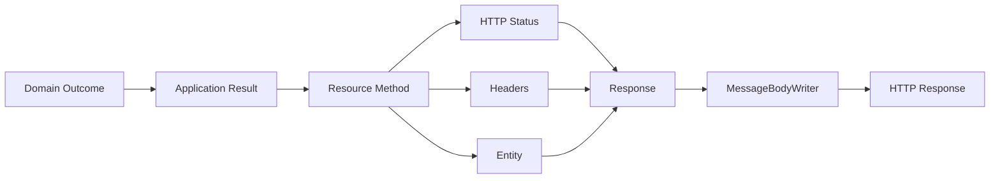
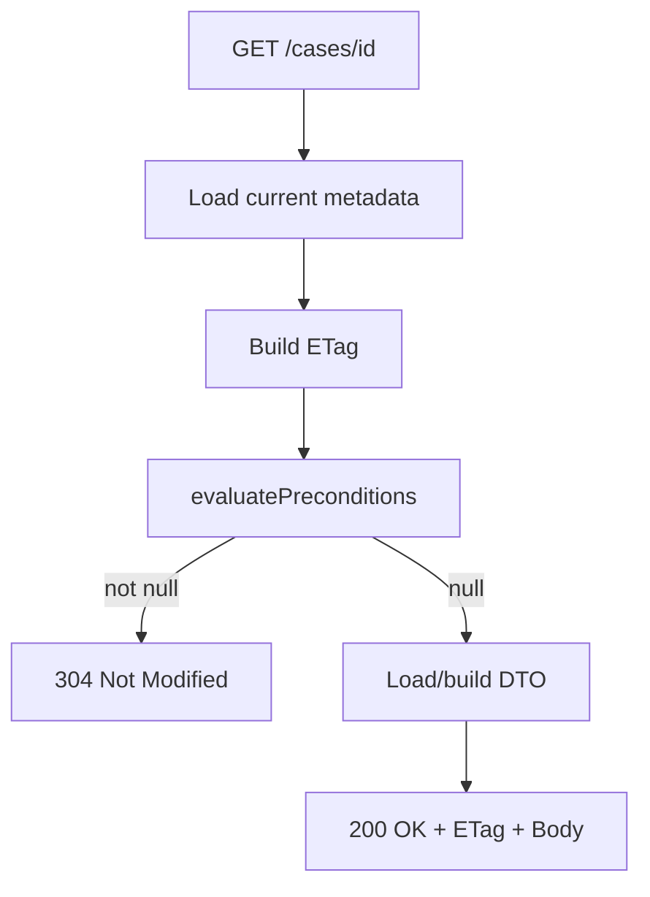
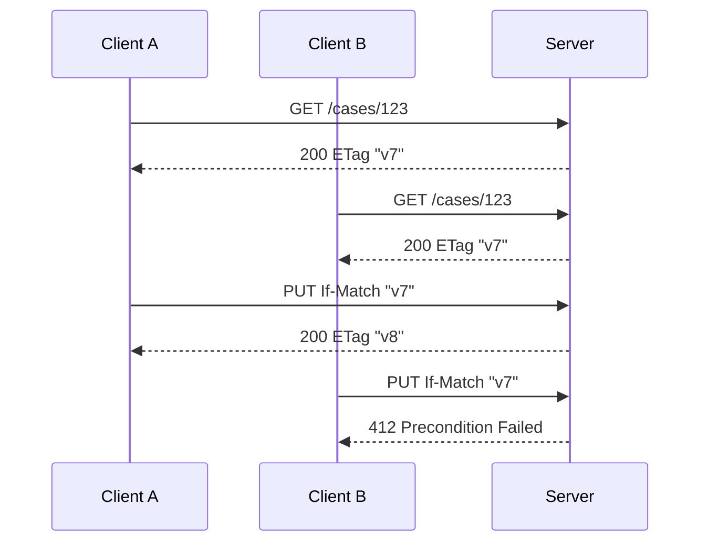

# Part 013 — Response API: Status Codes, Headers, Entity, Links, Caching, and Conditional Requests

Pada part sebelumnya kita membahas bagaimana request body dibaca dan response body ditulis oleh provider pipeline. Sekarang kita naik satu level: **bagaimana response harus dibentuk sebagai kontrak HTTP**.

Banyak REST API Java gagal bukan karena resource method-nya tidak bisa mengembalikan JSON, tetapi karena response-nya tidak punya disiplin:

- semua success dikembalikan sebagai `200 OK`, bahkan untuk create, async operation, dan delete;
- error memakai status yang tidak konsisten;
- `Location`, `ETag`, `Last-Modified`, `Cache-Control`, dan `Vary` diabaikan;
- response body dikembalikan untuk `204 No Content`;
- `Response` dipakai terlalu bebas tanpa standar internal;
- conditional request tidak dipakai, sehingga API boros dan rawan lost update;
- header yang seharusnya menjadi protocol contract justru disembunyikan di body.

Di Jakarta REST, `Response` bukan sekadar wrapper. Ia adalah cara eksplisit untuk membangun **status line + headers + entity**.

Mental model utamanya:



Resource method yang matang tidak bertanya “return object apa?”. Ia bertanya:

> Outcome ini harus direpresentasikan sebagai status apa, header apa, entity apa, dan cache/validator contract apa?

---

## 1. Jakarta REST Response Model

Resource method Jakarta REST bisa mengembalikan beberapa bentuk:

```java
@GET
public CaseDto getCase() {
    return service.getCase();
}
```

atau:

```java
@GET
public Response getCase() {
    CaseDto dto = service.getCase();
    return Response.ok(dto).build();
}
```

Bentuk pertama nyaman, tetapi kurang eksplisit. Runtime akan menganggap response success default, biasanya `200 OK`, lalu memilih `MessageBodyWriter` untuk entity. Bentuk kedua memberi kendali penuh terhadap:

- status code;
- headers;
- media type;
- entity;
- links;
- cookies;
- cache metadata;
- validators seperti `ETag` dan `Last-Modified`.

Rule praktis:

| Situasi | Return langsung DTO? | Return `Response`? |
|---|---:|---:|
| Simple `GET` tanpa header khusus | Bisa | Bisa |
| Create resource | Tidak disarankan | Ya |
| Delete | Tidak disarankan | Ya |
| Async accepted operation | Tidak | Ya |
| Conditional request | Tidak | Ya |
| Response dengan `Location`, `ETag`, `Cache-Control` | Tidak | Ya |
| Download/streaming | Tidak | Ya |
| Error response | Biasanya via mapper | Ya jika lokal dan terkontrol |

Untuk production API, jangan takut memakai `Response`, tetapi jangan juga menjadikan semua resource method sebagai tempat manual assembly yang tidak konsisten. Gunakan helper atau response factory internal untuk pattern yang berulang.

Contoh factory sederhana:

```java
public final class ApiResponses {
    private ApiResponses() {}

    public static Response created(URI location, Object body) {
        return Response.created(location)
            .entity(body)
            .build();
    }

    public static Response noContent() {
        return Response.noContent().build();
    }

    public static Response accepted(URI monitorLocation, Object body) {
        return Response.accepted(body)
            .location(monitorLocation)
            .build();
    }
}
```

Tujuannya bukan menyembunyikan HTTP, tetapi menjaga konsistensi.

---

## 2. Anatomi Response

HTTP response terdiri dari tiga bagian konseptual:

```text
HTTP/1.1 200 OK
Content-Type: application/json
ETag: "case-123-v7"
Cache-Control: private, max-age=30

{"id":"CASE-123","status":"OPEN"}
```

Di Jakarta REST:

```java
return Response.ok(dto)
    .type(MediaType.APPLICATION_JSON_TYPE)
    .tag(new EntityTag("case-123-v7"))
    .cacheControl(cacheControl)
    .build();
```

Mapping-nya:

| HTTP part | Jakarta REST API |
|---|---|
| Status code | `Response.status(...)`, `ok()`, `created()`, `noContent()` |
| Entity/body | `.entity(...)` |
| `Content-Type` | `.type(...)` atau `@Produces` |
| `Location` | `.location(...)`, `created(...)` |
| `ETag` | `.tag(EntityTag)` |
| `Last-Modified` | `.lastModified(Date)` |
| `Cache-Control` | `.cacheControl(CacheControl)` |
| Links | `.links(...)`, `Link` |
| Cookies | `.cookie(NewCookie...)` |
| Arbitrary header | `.header(name, value)` |

Jangan menyamakan body dengan response. Body hanya satu bagian. Dalam REST API yang matang, header sering menjadi bagian kontrak utama.

---

## 3. Status Code Discipline

Status code adalah sinyal mesin, bukan dekorasi.

Client, gateway, load balancer, retry library, browser, cache, dan monitoring system membaca status code. Jika semua response dikembalikan sebagai `200` dengan `success: false` di body, kamu memutus kontrak HTTP.

### 3.1 Success Status Codes

| Status | Makna | Contoh Jakarta REST |
|---|---|---|
| `200 OK` | Request berhasil dan response punya body | `GET /cases/{id}` |
| `201 Created` | Resource baru dibuat | `POST /cases` |
| `202 Accepted` | Request diterima tetapi belum selesai | command async, batch import |
| `204 No Content` | Request berhasil tanpa body | delete, update tanpa representasi balik |
| `206 Partial Content` | Partial response untuk range request | download besar dengan byte range |
| `304 Not Modified` | Conditional GET tidak perlu mengirim body | cache revalidation |

Contoh create:

```java
@POST
@Consumes(MediaType.APPLICATION_JSON)
@Produces(MediaType.APPLICATION_JSON)
public Response createCase(CreateCaseRequest request, @Context UriInfo uriInfo) {
    CreatedCase created = service.create(request);

    URI location = uriInfo.getAbsolutePathBuilder()
        .path(created.id())
        .build();

    return Response.created(location)
        .entity(CaseResponse.from(created))
        .build();
}
```

`201 Created` tanpa `Location` biasanya kurang lengkap. `Location` memberi client URI canonical resource yang baru dibuat.

Contoh accepted untuk pekerjaan async:

```java
@POST
@Path("/imports")
@Consumes(MediaType.APPLICATION_JSON)
@Produces(MediaType.APPLICATION_JSON)
public Response importCases(ImportRequest request, @Context UriInfo uriInfo) {
    ImportJob job = service.startImport(request);

    URI monitor = uriInfo.getBaseUriBuilder()
        .path("imports")
        .path(job.id())
        .build();

    return Response.accepted(new ImportAcceptedResponse(job.id(), monitor.toString()))
        .location(monitor)
        .build();
}
```

Gunakan `202 Accepted` ketika server belum menyelesaikan pekerjaan. Jangan pakai `201 Created` hanya karena ada job ID jika resource domain sebenarnya belum tercipta.

Contoh no content:

```java
@DELETE
@Path("/{caseId}")
public Response deleteCase(@PathParam("caseId") String caseId) {
    service.delete(caseId);
    return Response.noContent().build();
}
```

Untuk `204`, jangan kirim entity. Jika ingin mengirim representasi state terbaru, gunakan `200`.

### 3.2 Client Error Status Codes

| Status | Makna | Contoh |
|---|---|---|
| `400 Bad Request` | Request malformed atau invalid secara sintaks/format | JSON tidak valid, query grammar rusak |
| `401 Unauthorized` | Authentication dibutuhkan/gagal | token hilang/invalid |
| `403 Forbidden` | Authenticated tetapi tidak punya hak | user tidak boleh akses case |
| `404 Not Found` | Resource tidak ditemukan atau sengaja disembunyikan | case tidak ada |
| `405 Method Not Allowed` | Path cocok, method tidak didukung | `POST` ke read-only item |
| `406 Not Acceptable` | Tidak bisa menghasilkan media type yang diminta | `Accept: application/xml` tidak didukung |
| `409 Conflict` | Konflik dengan state saat ini | duplicate active escalation |
| `410 Gone` | Resource pernah ada tetapi sudah tidak tersedia | archived/decommissioned resource |
| `412 Precondition Failed` | Conditional update gagal | `If-Match` tidak cocok |
| `415 Unsupported Media Type` | Request media type tidak didukung | `Content-Type: text/plain` untuk JSON endpoint |
| `422 Unprocessable Content` | Body valid secara syntax tetapi semantik domain invalid | decision date sebelum case date |
| `428 Precondition Required` | Server mensyaratkan precondition | update wajib pakai `If-Match` |
| `429 Too Many Requests` | Rate limit | client melebihi quota |

Catatan: `422` sangat berguna untuk validation/domain semantic error, tetapi pastikan organisasi menyepakati penggunaannya. Banyak sistem tetap memakai `400` untuk semua validation error. Yang penting bukan dogma, tetapi konsistensi dan dokumentasi.

### 3.3 Server Error Status Codes

| Status | Makna | Contoh |
|---|---|---|
| `500 Internal Server Error` | Bug/unexpected failure | null pointer, invariant breach |
| `502 Bad Gateway` | Upstream invalid response | gateway/service dependency rusak |
| `503 Service Unavailable` | Service sementara tidak tersedia | overload, maintenance, dependency down |
| `504 Gateway Timeout` | Upstream timeout | dependency call time out |

Jangan pakai `500` untuk domain validation. Jangan pakai `400` untuk database outage. Status code harus membantu client membedakan apakah masalah ada di request, authorization, state conflict, atau server.

---

## 4. Response Builder Patterns

### 4.1 `Response.ok()`

Gunakan untuk success dengan body.

```java
return Response.ok(caseDto).build();
```

Dengan explicit media type:

```java
return Response.ok(caseDto, MediaType.APPLICATION_JSON_TYPE).build();
```

Biasanya `@Produces` lebih baik untuk resource-level contract:

```java
@GET
@Produces(MediaType.APPLICATION_JSON)
public Response getCase(...) {
    return Response.ok(dto).build();
}
```

### 4.2 `Response.created()`

```java
return Response.created(location)
    .entity(response)
    .build();
```

Gunakan saat resource baru berhasil dibuat dan punya URI canonical.

### 4.3 `Response.accepted()`

```java
return Response.accepted(body)
    .location(jobUri)
    .build();
```

Gunakan saat operasi belum selesai.

### 4.4 `Response.noContent()`

```java
return Response.noContent().build();
```

Gunakan untuk success tanpa body. Jangan masukkan `.entity(...)`.

### 4.5 `Response.status()`

Gunakan untuk status yang tidak punya shortcut.

```java
return Response.status(Response.Status.CONFLICT)
    .entity(problem)
    .type("application/problem+json")
    .build();
```

Untuk status non-standard enum, gunakan integer:

```java
return Response.status(422)
    .entity(problem)
    .type("application/problem+json")
    .build();
```

Tetapi jangan menyebarkan magic number. Buat enum internal atau helper.

---

## 5. Headers as Contract

Header bukan tambahan kosmetik. Header adalah metadata protokol.

### 5.1 `Location`

`Location` menunjukkan URI resource yang relevan terhadap response.

Common use:

- `201 Created`: URI resource baru.
- `202 Accepted`: URI monitoring job/status.
- `303 See Other`: URI lain untuk mengambil result.

Contoh:

```java
return Response.created(caseUri)
    .entity(response)
    .build();
```

### 5.2 `Content-Type`

`Content-Type` menjawab: entity response ini formatnya apa?

Jangan rely pada “client pasti tahu ini JSON”. Selalu desain media type.

```java
@Produces(MediaType.APPLICATION_JSON)
```

Untuk error problem details:

```java
return Response.status(400)
    .type("application/problem+json")
    .entity(problem)
    .build();
```

### 5.3 `Vary`

Jika response berbeda berdasarkan `Accept`, `Accept-Language`, `Authorization`, atau header lain, `Vary` membantu cache memahami dimensi variasi.

Contoh:

```java
return Response.ok(dto)
    .header(HttpHeaders.VARY, HttpHeaders.ACCEPT)
    .build();
```

Jika API memakai content negotiation, `Vary: Accept` sering relevan. Jika response private per user, pertimbangkan `Cache-Control: private` atau no-store, bukan sekadar `Vary: Authorization`.

### 5.4 `Retry-After`

Gunakan untuk `429` dan kadang `503`.

```java
return Response.status(429)
    .header("Retry-After", "60")
    .entity(problem)
    .type("application/problem+json")
    .build();
```

Tanpa `Retry-After`, client hanya menebak kapan boleh mencoba lagi.

### 5.5 Correlation Headers

Untuk operability:

```java
return Response.ok(dto)
    .header("X-Correlation-Id", correlationId)
    .build();
```

Namun biasanya correlation ID lebih baik di response filter agar konsisten untuk semua endpoint termasuk error.

---

## 6. Links and Hypermedia: Pragmatic Use

Jakarta REST menyediakan `Link` API.

```java
Link self = Link.fromUri(caseUri)
    .rel("self")
    .type(MediaType.APPLICATION_JSON)
    .build();

return Response.ok(dto)
    .links(self)
    .build();
```

Hypermedia penuh sering tidak dipakai di internal API modern. Tetapi link tetap berguna untuk:

- `self` link;
- next/prev pagination;
- async job monitor link;
- related resource link;
- downloadable artifact link;
- audit record link.

Contoh pagination headers:

```java
return Response.ok(page.items())
    .link(page.nextUri(), "next")
    .link(page.prevUri(), "prev")
    .build();
```

Namun jangan menambahkan link hanya agar terlihat RESTful. Link harus membantu client mengurangi hard-coded URI construction atau memperjelas workflow.

---

## 7. Caching Mental Model

Caching bukan hanya performance optimization. Ia adalah kontrak state freshness.

Ada tiga pertanyaan:

1. **Boleh disimpan?**
2. **Berapa lama dianggap fresh?**
3. **Bagaimana revalidasi dilakukan?**

Header utama:

| Header | Fungsi |
|---|---|
| `Cache-Control` | Kebijakan cache modern |
| `ETag` | Validator berbasis versi/representasi |
| `Last-Modified` | Validator berbasis waktu |
| `Expires` | Legacy freshness |
| `Vary` | Dimensi variasi response |

### 7.1 `CacheControl`

Jakarta REST punya class `CacheControl`.

```java
CacheControl cc = new CacheControl();
cc.setPrivate(true);
cc.setMaxAge(30);

return Response.ok(dto)
    .cacheControl(cc)
    .build();
```

Untuk data sensitif:

```java
CacheControl cc = new CacheControl();
cc.setNoStore(true);

return Response.ok(dto)
    .cacheControl(cc)
    .build();
```

Rule praktis:

| Data | Cache policy |
|---|---|
| Public reference data | `public, max-age=...` |
| User-specific but not highly sensitive | `private, max-age=...` |
| Sensitive/regulatory/case content | sering `no-store` atau sangat hati-hati |
| Static metadata | long `max-age` + versioned URI |
| Frequently changing collection | short max-age atau validators |

Jangan asal `no-cache` untuk semua hal. `no-cache` berarti cache boleh menyimpan tetapi harus revalidate sebelum reuse. Untuk melarang penyimpanan, pakai `no-store`.

---

## 8. Validators: `ETag` and `Last-Modified`

Validator memungkinkan client bertanya:

> Saya punya versi ini. Apakah masih valid?

### 8.1 `ETag`

`ETag` adalah identifier versi representasi.

```java
EntityTag tag = new EntityTag("case-123-v7");

return Response.ok(dto)
    .tag(tag)
    .build();
```

ETag bisa strong atau weak:

```java
EntityTag strong = new EntityTag("case-123-v7");
EntityTag weak = new EntityTag("case-123-v7", true);
```

Strong ETag cocok untuk concurrency control. Weak ETag cocok untuk cache validation saat representasi “semantically equivalent” walau byte-level tidak identik.

Untuk update prevention, gunakan strong validator.

### 8.2 `Last-Modified`

```java
return Response.ok(dto)
    .lastModified(Date.from(caseView.lastModifiedAt()))
    .build();
```

`Last-Modified` lebih mudah, tetapi punya kelemahan:

- precision terbatas;
- clock skew;
- update cepat dalam detik yang sama;
- tidak selalu merepresentasikan perubahan bentuk response.

Untuk sistem penting, gunakan ETag.

---

## 9. Conditional GET

Conditional GET mengurangi payload dan latency.

Client:

```http
GET /cases/CASE-123 HTTP/1.1
If-None-Match: "case-123-v7"
```

Jika versi server sama, server bisa mengembalikan:

```http
HTTP/1.1 304 Not Modified
ETag: "case-123-v7"
```

Tanpa body.

Jakarta REST menyediakan `Request#evaluatePreconditions`.

```java
@GET
@Path("/{caseId}")
@Produces(MediaType.APPLICATION_JSON)
public Response getCase(
        @PathParam("caseId") String caseId,
        @Context Request request) {

    CaseView view = service.getCaseView(caseId);
    EntityTag etag = new EntityTag(view.versionTag());

    Response.ResponseBuilder preconditions = request.evaluatePreconditions(etag);
    if (preconditions != null) {
        return preconditions.tag(etag).build();
    }

    return Response.ok(CaseResponse.from(view))
        .tag(etag)
        .build();
}
```

Mental model:

- Jika precondition cocok untuk “not modified”, builder tidak null.
- Jika resource harus dikirim, builder null.
- Tetap kirim validator di success response.

Diagram:



Optimization penting: untuk payload mahal, coba load metadata/version dulu. Jangan build DTO besar sebelum tahu client sudah punya versi valid.

---

## 10. Conditional Update and Lost Update Prevention

Lost update terjadi ketika dua client membaca versi yang sama, lalu update saling menimpa.



Jakarta REST:

```java
@PUT
@Path("/{caseId}")
@Consumes(MediaType.APPLICATION_JSON)
@Produces(MediaType.APPLICATION_JSON)
public Response updateCase(
        @PathParam("caseId") String caseId,
        UpdateCaseRequest body,
        @Context Request request) {

    CaseVersion current = service.getVersion(caseId);
    EntityTag currentTag = new EntityTag(current.etag());

    Response.ResponseBuilder failed = request.evaluatePreconditions(currentTag);
    if (failed != null) {
        return failed.tag(currentTag).build();
    }

    UpdatedCase updated = service.update(caseId, body, current.version());
    EntityTag newTag = new EntityTag(updated.etag());

    return Response.ok(CaseResponse.from(updated))
        .tag(newTag)
        .build();
}
```

Namun hati-hati: `evaluatePreconditions` behavior bergantung header conditional yang dikirim. Untuk mutation kritikal, kamu mungkin ingin mewajibkan `If-Match`.

```java
String ifMatch = headers.getHeaderString(HttpHeaders.IF_MATCH);
if (ifMatch == null || ifMatch.isBlank()) {
    return Response.status(428)
        .entity(problem("precondition-required", "If-Match is required"))
        .type("application/problem+json")
        .build();
}
```

Rule untuk regulated/case-management API:

- mutation state penting wajib pakai optimistic concurrency;
- gunakan `If-Match` atau explicit version field, tetapi jangan keduanya tanpa aturan jelas;
- response update harus mengembalikan ETag baru;
- failure `412` harus memberi problem details yang bisa dipahami client;
- audit log harus mencatat expected version dan actual version.

---

## 11. Status Code and Body Matrix

Response body harus selaras dengan status.

| Status | Body? | Catatan |
|---|---:|---|
| `200` | Ya | Standard success representation |
| `201` | Opsional, sering ya | Body boleh berisi representation/resource summary |
| `202` | Ya disarankan | Berisi job/operation status atau link |
| `204` | Tidak | Jangan kirim entity |
| `304` | Tidak | Cache metadata headers saja |
| `400+` | Ya disarankan | Problem details/error contract |
| `500+` | Ya disarankan | Sanitized problem details, jangan stack trace |

Anti-pattern umum:

```java
return Response.noContent()
    .entity(new DeleteResponse("deleted"))
    .build();
```

Jangan. Jika ingin body, gunakan `200 OK`.

---

## 12. Error Response Belongs to the Next Part, but the Response Rules Start Here

Walau exception mapping dibahas di Part 014, response discipline untuk error harus dipikirkan sekarang.

Minimal error body:

```json
{
  "type": "https://api.example.com/problems/validation-error",
  "title": "Validation failed",
  "status": 422,
  "detail": "The request contains invalid fields.",
  "instance": "/cases/CASE-123/decisions",
  "correlationId": "01JABC...",
  "errors": [
    {
      "field": "decisionDate",
      "code": "must_not_be_before_case_opened_at",
      "message": "decisionDate must not be before caseOpenedAt"
    }
  ]
}
```

Headers:

```http
Content-Type: application/problem+json
X-Correlation-Id: 01JABC...
```

Core rule:

> Status code mengatakan kelas hasil. Body menjelaskan detail yang aman dan actionable. Header membawa metadata protokol dan operasional.

---

## 13. Response in Resource vs Filter vs ExceptionMapper

Tidak semua header harus ditambahkan di resource method.

| Concern | Tempat ideal |
|---|---|
| Domain-specific `Location` | Resource method |
| ETag untuk specific representation | Resource method/service result |
| Cache policy per resource | Resource method/helper/filter khusus |
| Correlation ID | Response filter |
| Security headers | Response filter / gateway |
| Error response | Exception mapper |
| Rate-limit headers | Filter/gateway/resource tergantung desain |
| Audit metadata | Biasanya filter + audit service |

Contoh response filter untuk correlation ID:

```java
@Provider
public class CorrelationIdResponseFilter implements ContainerResponseFilter {
    @Override
    public void filter(ContainerRequestContext request, ContainerResponseContext response) {
        Object correlationId = request.getProperty("correlationId");
        if (correlationId != null) {
            response.getHeaders().putSingle("X-Correlation-Id", correlationId.toString());
        }
    }
}
```

Filter bagus untuk header yang global. Resource method bagus untuk header yang merupakan bagian dari domain/resource contract.

---

## 14. Practical Response Recipes

### 14.1 Create Resource

```java
@POST
public Response create(CreateCaseRequest request, @Context UriInfo uriInfo) {
    CreatedCase created = service.create(request);

    URI location = uriInfo.getAbsolutePathBuilder()
        .path(created.id())
        .build();

    return Response.created(location)
        .tag(new EntityTag(created.etag()))
        .entity(CaseResponse.from(created))
        .build();
}
```

Expected:

```http
201 Created
Location: /cases/CASE-123
ETag: "case-123-v1"
Content-Type: application/json
```

### 14.2 Update Resource with New Representation

```java
@PUT
@Path("/{id}")
public Response update(@PathParam("id") String id, UpdateCaseRequest request) {
    UpdatedCase updated = service.update(id, request);

    return Response.ok(CaseResponse.from(updated))
        .tag(new EntityTag(updated.etag()))
        .build();
}
```

### 14.3 Update Resource without Body

```java
@PATCH
@Path("/{id}/assignment")
public Response assign(@PathParam("id") String id, AssignRequest request) {
    service.assign(id, request.assigneeId());
    return Response.noContent().build();
}
```

### 14.4 Async Command

```java
@POST
@Path("/{id}/exports")
public Response exportCase(@PathParam("id") String id, @Context UriInfo uriInfo) {
    ExportJob job = service.startExport(id);

    URI jobUri = uriInfo.getBaseUriBuilder()
        .path("exports")
        .path(job.id())
        .build();

    return Response.accepted(new ExportJobResponse(job.id(), jobUri.toString()))
        .location(jobUri)
        .build();
}
```

### 14.5 Conflict

```java
return Response.status(Response.Status.CONFLICT)
    .type("application/problem+json")
    .entity(Problem.conflict(
        "active-escalation-exists",
        "This case already has an active escalation"))
    .build();
```

### 14.6 Rate Limit

```java
return Response.status(429)
    .header("Retry-After", "60")
    .type("application/problem+json")
    .entity(Problem.rateLimited("Too many requests"))
    .build();
```

---

## 15. Response Contract for Regulatory Systems

Untuk sistem enforcement/case-management, response bukan hanya interface teknis. Ia bagian dari defensibility.

Contoh: state transition endpoint.

```http
POST /cases/CASE-123/transitions
Content-Type: application/json
Idempotency-Key: 01J...

{
  "transition": "ESCALATE",
  "reasonCode": "HIGH_RISK_SIGNAL",
  "note": "Multiple unresolved findings"
}
```

Response yang baik:

```http
201 Created
Location: /cases/CASE-123/transitions/TRN-999
ETag: "case-123-v8"
Content-Type: application/json
X-Correlation-Id: 01J...

{
  "id": "TRN-999",
  "caseId": "CASE-123",
  "fromState": "UNDER_REVIEW",
  "toState": "ESCALATED",
  "reasonCode": "HIGH_RISK_SIGNAL",
  "recordedAt": "2026-06-27T10:15:30Z"
}
```

Kenapa `201`? Karena transition record adalah resource audit baru. Kenapa `ETag`? Karena case aggregate berubah. Kenapa body? Karena client butuh canonical transition result.

Jika transition tidak valid:

```http
409 Conflict
Content-Type: application/problem+json

{
  "type": "https://api.example.com/problems/invalid-state-transition",
  "title": "Invalid state transition",
  "status": 409,
  "detail": "Case CASE-123 cannot move from CLOSED to ESCALATED.",
  "caseId": "CASE-123",
  "currentState": "CLOSED",
  "requestedTransition": "ESCALATE"
}
```

Ini jauh lebih defensible daripada `400 Bad Request` dengan body `invalid`.

---

## 16. Anti-Patterns

### 16.1 Always `200 OK`

```json
{
  "success": false,
  "error": "not found"
}
```

Dengan status `200`. Ini buruk karena client/gateway/monitoring menganggap success.

### 16.2 Business Error Hidden in Header Only

Header sulit dibaca manusia dan tidak cocok untuk struktur error kompleks. Gunakan body problem details untuk detail, header untuk metadata.

### 16.3 Body on `204` or `304`

Response ini tidak boleh diperlakukan seperti success body biasa.

### 16.4 Missing `Location` on Create

Client dipaksa menebak URI resource baru.

### 16.5 No Validator on Mutable Resource

Tanpa ETag/version, update bersamaan rawan lost update.

### 16.6 Leaking Internal IDs in Headers

Header sering dicatat oleh proxy/logging middleware. Jangan masukkan sensitive internal payload di header.

### 16.7 Inconsistent Error Media Type

Kadang JSON biasa, kadang HTML container error, kadang plain text. Ini menyulitkan client. Selesaikan dengan exception mapper global.

---

## 17. Testing Response Contract

Test response bukan hanya body.

```java
@Test
void createCaseReturns201LocationAndBody() {
    Response response = target("/cases")
        .request(MediaType.APPLICATION_JSON_TYPE)
        .post(Entity.json(new CreateCaseRequest("subject")));

    assertEquals(201, response.getStatus());
    assertNotNull(response.getHeaderString("Location"));
    assertEquals("application/json", response.getMediaType().toString());

    CaseResponse body = response.readEntity(CaseResponse.class);
    assertNotNull(body.id());
}
```

Conditional GET test:

```java
@Test
void getCaseWithMatchingEtagReturns304() {
    Response first = target("/cases/CASE-123")
        .request(MediaType.APPLICATION_JSON_TYPE)
        .get();

    String etag = first.getHeaderString("ETag");

    Response second = target("/cases/CASE-123")
        .request(MediaType.APPLICATION_JSON_TYPE)
        .header("If-None-Match", etag)
        .get();

    assertEquals(304, second.getStatus());
    assertFalse(second.hasEntity());
}
```

Contract tests harus memverifikasi:

- status;
- media type;
- required headers;
- forbidden headers;
- body schema;
- no body untuk status tertentu;
- cache headers;
- problem details shape;
- correlation ID propagation.

---

## 18. Checklist Response Design

Gunakan checklist ini saat review endpoint.

### Success Response

- Apakah status code sesuai outcome?
- Apakah create memakai `201` dan `Location`?
- Apakah async operation memakai `202` dan monitor link?
- Apakah `204` benar-benar tanpa body?
- Apakah media type eksplisit?
- Apakah response DTO tidak mengekspos entity persistence?
- Apakah response menyertakan identifier canonical?

### Headers

- Apakah `Content-Type` benar?
- Apakah `Location` ada saat dibutuhkan?
- Apakah `ETag`/`Last-Modified` relevan?
- Apakah `Cache-Control` aman?
- Apakah `Vary` perlu?
- Apakah correlation ID konsisten?
- Apakah sensitive data tidak bocor di header?

### Caching/Concurrency

- Apakah read-heavy resource punya validator?
- Apakah mutable critical resource memakai optimistic concurrency?
- Apakah update critical mewajibkan `If-Match`?
- Apakah `412` dan `428` dimodelkan?
- Apakah ETag berubah ketika representasi berubah?

### Error Preparedness

- Apakah error status code taxonomy jelas?
- Apakah error memakai `application/problem+json` atau format internal konsisten?
- Apakah mapper global menangani unexpected failure?
- Apakah stack trace tidak pernah muncul ke client?

---

## 19. Latihan Part 013

### Latihan 1 — Refactor Response

Ubah endpoint berikut:

```java
@POST
@Path("/cases")
public CaseDto create(CreateCaseRequest request) {
    return service.create(request);
}
```

Menjadi response contract yang benar:

- `201 Created`
- `Location`
- body berisi representation
- `ETag` jika service punya version

### Latihan 2 — Add Conditional GET

Untuk endpoint:

```java
GET /cases/{id}
```

Tambahkan:

- `ETag` pada response `200`;
- support `If-None-Match`;
- response `304` tanpa body;
- test contract.

### Latihan 3 — Prevent Lost Update

Untuk endpoint:

```java
PUT /cases/{id}
```

Desain:

- client wajib mengirim `If-Match`;
- jika tidak ada: `428 Precondition Required`;
- jika versi tidak cocok: `412 Precondition Failed`;
- jika update berhasil: `200` + ETag baru atau `204` + ETag baru;
- audit metadata yang perlu dicatat.

---

## 20. Ringkasan

Response API adalah tempat Jakarta REST bertemu HTTP secara eksplisit.

Yang harus tertanam:

- `Response` bukan wrapper JSON; ia adalah pembangun status, headers, dan entity.
- Status code harus mencerminkan kelas outcome.
- Header adalah bagian dari kontrak, bukan dekorasi.
- `Location`, `ETag`, `Last-Modified`, `Cache-Control`, `Vary`, dan `Retry-After` punya nilai operasional nyata.
- Conditional request membantu caching dan mencegah lost update.
- `204` dan `304` tidak membawa body.
- Untuk sistem regulated, response adalah bagian dari auditability dan legal defensibility.

Part berikutnya akan membahas **Exception Mapping**: bagaimana semua failure path dipusatkan menjadi error contract yang konsisten, aman, dan bisa dikonsumsi client.

---

## References

- Jakarta RESTful Web Services 4.0 Specification: https://jakarta.ee/specifications/restful-ws/4.0/jakarta-restful-ws-spec-4.0
- Jakarta RESTful Web Services 4.0 API Docs: https://jakarta.ee/specifications/restful-ws/4.0/apidocs/
- RFC 9110 — HTTP Semantics: https://www.rfc-editor.org/rfc/rfc9110
- RFC 9457 — Problem Details for HTTP APIs: https://www.rfc-editor.org/rfc/rfc9457
