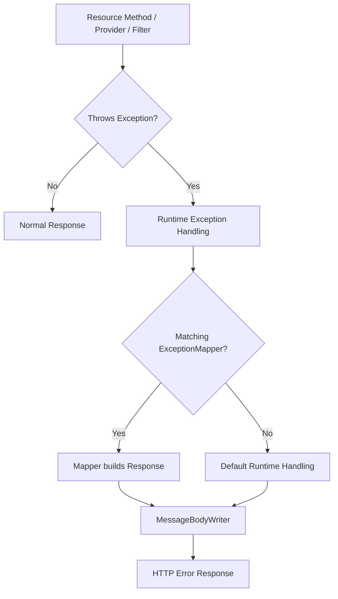
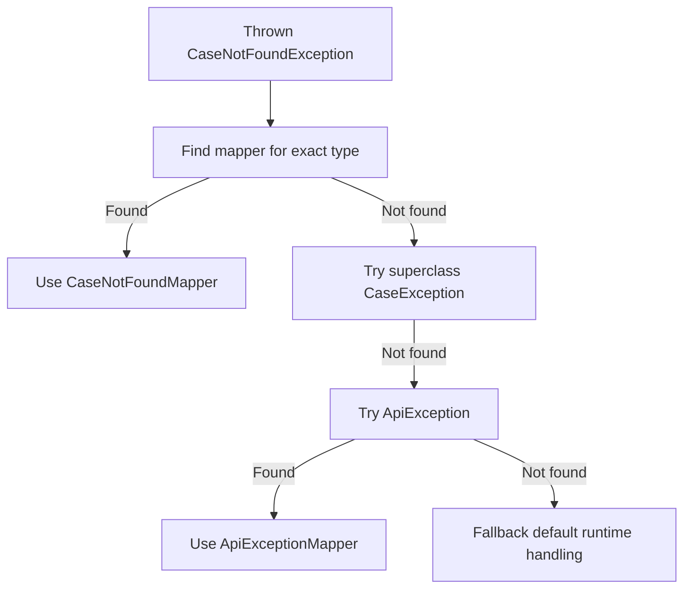
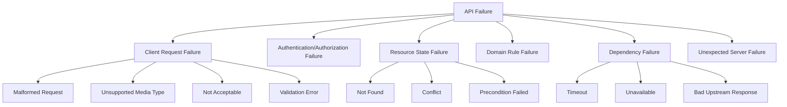

# Part 014 — Exception Mapping: `ExceptionMapper`, Error Taxonomy, Problem Details, and Failure Contracts

Part 013 membahas response sebagai kontrak eksplisit. Sekarang kita membahas jalur yang sering lebih penting dalam production: **failure path**.

REST API yang matang tidak hanya punya endpoint sukses. Ia punya model kegagalan yang:

- konsisten;
- aman;
- stabil untuk client;
- dapat diobservasi;
- tidak membocorkan detail internal;
- cukup ekspresif untuk domain;
- kompatibel dengan HTTP semantics;
- bisa diaudit dan dipertanggungjawabkan.

Jakarta REST menyediakan mekanisme utama bernama `ExceptionMapper`.

Mental model:



Engineer top-tier tidak menulis `try-catch` di semua endpoint. Ia mendesain **error taxonomy**, lalu membuat mapper sebagai boundary translation dari Java failure ke HTTP failure.

---

## 1. The Real Problem: Java Exceptions Are Not HTTP Errors

Java exception adalah mekanisme control/error flow di dalam proses. HTTP error response adalah kontrak antar proses.

Keduanya tidak sama.

Contoh buruk:

```java
@GET
@Path("/{id}")
public Response get(@PathParam("id") String id) {
    try {
        return Response.ok(service.get(id)).build();
    } catch (Exception e) {
        return Response.status(500)
            .entity(e.getMessage())
            .build();
    }
}
```

Masalah:

- semua error jadi `500`;
- message internal bocor;
- response format tidak stabil;
- endpoint lain mungkin beda format;
- stack/invariant tidak diklasifikasikan;
- logging dan correlation sulit konsisten;
- validation, not found, conflict, dan dependency failure kehilangan makna.

Error handling yang sehat memisahkan:

| Layer | Bentuk failure | Tugas |
|---|---|---|
| Domain | invariant/domain rule violation | menjelaskan business failure |
| Application service | use case failure | mengklasifikasikan outcome |
| Resource boundary | HTTP translation | memilih status dan representation |
| Exception mapper | centralized translation | konsistensi error response |
| Observability | log/metric/trace | diagnosis dan audit |

---

## 2. Jakarta REST Exception Types

Jakarta REST punya beberapa tipe exception penting.

### 2.1 `WebApplicationException`

`WebApplicationException` adalah runtime exception yang membawa `Response`.

```java
throw new WebApplicationException(
    Response.status(Response.Status.NOT_FOUND)
        .entity(problem)
        .type("application/problem+json")
        .build()
);
```

Ada subclass untuk status umum, misalnya:

- `BadRequestException`
- `NotAuthorizedException`
- `ForbiddenException`
- `NotFoundException`
- `NotAllowedException`
- `NotAcceptableException`
- `NotSupportedException`
- `InternalServerErrorException`
- `ServiceUnavailableException`

Contoh:

```java
throw new NotFoundException("Case not found");
```

Namun jangan terlalu cepat memakai exception ini di domain/application service. `WebApplicationException` adalah tipe HTTP/runtime. Jika ia bocor ke domain layer, domain menjadi tergantung Jakarta REST.

Rule:

- Resource/provider/filter boleh tahu `WebApplicationException`.
- Domain service sebaiknya tidak.
- Application service boleh melempar application exception yang nanti dipetakan.

### 2.2 Processing Exceptions

Provider dan runtime bisa melempar exception saat membaca/menulis entity, melakukan parameter conversion, atau memproses request. Beberapa runtime punya detail implementasi masing-masing.

Yang penting: jangan asumsikan semua error masuk resource method. Banyak error terjadi **sebelum** method dipanggil:

- path/method mismatch;
- content negotiation failure;
- missing/invalid parameter conversion;
- JSON parse error;
- validation error;
- authentication filter rejection;
- message body reader failure.

Karena itu mapper/filter global penting.

---

## 3. `ExceptionMapper` Basics

`ExceptionMapper<E>` mengubah exception menjadi `Response`.

```java
@Provider
public class CaseNotFoundMapper implements ExceptionMapper<CaseNotFoundException> {
    @Override
    public Response toResponse(CaseNotFoundException exception) {
        ProblemDetails problem = ProblemDetails.of(
            "https://api.example.com/problems/case-not-found",
            "Case not found",
            404,
            "The requested case was not found."
        );

        return Response.status(Response.Status.NOT_FOUND)
            .type("application/problem+json")
            .entity(problem)
            .build();
    }
}
```

`@Provider` membuat mapper dapat ditemukan oleh runtime jika discovery aktif. Mapper juga bisa didaftarkan secara eksplisit melalui `Application#getClasses()` atau `ResourceConfig`/mekanisme implementasi.

Core rule:

> Mapper adalah adapter dari exception type ke HTTP response. Ia bukan tempat business logic baru.

---

## 4. Mapper Resolution Mental Model

Ketika exception dilempar, runtime mencari mapper yang paling sesuai berdasarkan tipe exception.

Contoh hierarchy:

```java
class ApiException extends RuntimeException {}
class CaseException extends ApiException {}
class CaseNotFoundException extends CaseException {}
```

Mapper:

```java
@Provider
class ApiExceptionMapper implements ExceptionMapper<ApiException> { ... }

@Provider
class CaseNotFoundMapper implements ExceptionMapper<CaseNotFoundException> { ... }
```

Jika `CaseNotFoundException` dilempar, mapper spesifik harus menang.

Diagram:



Design implication:

- Buat mapper spesifik untuk error yang punya contract khusus.
- Buat mapper base untuk keluarga error internal.
- Buat fallback mapper untuk `Throwable` atau `Exception` dengan hati-hati.

---

## 5. Error Taxonomy

Jangan mulai dari mapper. Mulai dari taxonomy.

Taxonomy minimal:



Mapping contoh:

| Failure | Java exception | HTTP status | Retry? |
|---|---|---:|---|
| JSON malformed | reader/runtime exception | `400` | No |
| Content-Type unsupported | `NotSupportedException` | `415` | No unless client changes |
| Accept unsupported | `NotAcceptableException` | `406` | No unless client changes |
| Request validation failed | `ConstraintViolationException` / `ValidationException` | `400` or `422` | No |
| Resource not found | `CaseNotFoundException` | `404` | Usually no |
| Duplicate active command | `ConflictException` / domain exception | `409` | Maybe after state changes |
| ETag mismatch | precondition failure | `412` | Yes after refetch |
| Missing precondition | custom exception | `428` | Yes with header |
| Rate limit | rate limit exception | `429` | Yes after `Retry-After` |
| Dependency timeout | `DependencyTimeoutException` | `503` or `504` | Maybe |
| Unexpected bug | `Throwable` fallback | `500` | Unknown/no blind retry |

Untuk sistem regulated, taxonomy harus cukup kaya untuk membedakan:

- invalid evidence;
- invalid state transition;
- missing authority;
- stale decision basis;
- duplicate enforcement action;
- case sealed/restricted;
- audit trail write failure;
- dependency unavailable.

---

## 6. Problem Details as Error Representation

RFC 9457 mendefinisikan “Problem Details” sebagai format machine-readable untuk error HTTP API. Ia menggantikan RFC 7807.

Struktur umum:

```json
{
  "type": "https://api.example.com/problems/validation-error",
  "title": "Validation failed",
  "status": 422,
  "detail": "The request contains invalid fields.",
  "instance": "/cases/CASE-123/decisions"
}
```

Field inti:

| Field | Fungsi |
|---|---|
| `type` | URI problem type; stable identifier |
| `title` | ringkasan manusiawi |
| `status` | HTTP status code |
| `detail` | detail instance spesifik, aman untuk client |
| `instance` | URI request/problem occurrence |

Kamu boleh menambah extension fields:

```json
{
  "type": "https://api.example.com/problems/invalid-state-transition",
  "title": "Invalid state transition",
  "status": 409,
  "detail": "Case cannot move from CLOSED to ESCALATED.",
  "instance": "/cases/CASE-123/transitions",
  "correlationId": "01J...",
  "caseId": "CASE-123",
  "currentState": "CLOSED",
  "requestedTransition": "ESCALATE"
}
```

Java record:

```java
public record ProblemDetails(
    URI type,
    String title,
    int status,
    String detail,
    String instance,
    String correlationId,
    Map<String, Object> extensions
) {}
```

Dalam practice, mungkin lebih nyaman membuat builder agar extension fields tidak semua masuk satu map mentah.

---

## 7. Designing a Problem Factory

Jangan build problem details manual di setiap mapper.

```java
@ApplicationScoped
public class ProblemFactory {
    @Context
    UriInfo uriInfo;

    @Context
    HttpHeaders headers;

    public ProblemDetails create(
            String typeSlug,
            String title,
            int status,
            String detail,
            Map<String, Object> extensions) {

        String correlationId = currentCorrelationId();
        String instance = uriInfo != null
            ? uriInfo.getRequestUri().getPath()
            : null;

        return new ProblemDetails(
            URI.create("https://api.example.com/problems/" + typeSlug),
            title,
            status,
            detail,
            instance,
            correlationId,
            extensions == null ? Map.of() : Map.copyOf(extensions)
        );
    }

    private String currentCorrelationId() {
        // Usually from MDC/request context/filter property.
        return "...";
    }
}
```

Mapper:

```java
@Provider
public class InvalidStateTransitionMapper
        implements ExceptionMapper<InvalidStateTransitionException> {

    @Context
    ProblemFactory problems;

    @Override
    public Response toResponse(InvalidStateTransitionException ex) {
        ProblemDetails body = problems.create(
            "invalid-state-transition",
            "Invalid state transition",
            409,
            "The requested transition is not allowed for the current case state.",
            Map.of(
                "caseId", ex.caseId(),
                "currentState", ex.currentState(),
                "requestedTransition", ex.requestedTransition()
            )
        );

        return Response.status(Response.Status.CONFLICT)
            .type("application/problem+json")
            .entity(body)
            .build();
    }
}
```

Note: injection ke provider bergantung integrasi runtime/CDI. Di Jakarta EE full environment, provider bisa dikelola oleh container. Di runtime standalone, cara injection bisa berbeda. Desain kode agar mudah dites.

---

## 8. Mapping Domain Exceptions

Contoh domain/application exceptions:

```java
public sealed class CaseApplicationException extends RuntimeException
        permits CaseNotFoundException,
                InvalidCaseTransitionException,
                DuplicateEscalationException,
                StaleCaseVersionException {

    private final String code;

    protected CaseApplicationException(String code, String message) {
        super(message);
        this.code = code;
    }

    public String code() {
        return code;
    }
}
```

Spesifik:

```java
public final class CaseNotFoundException extends CaseApplicationException {
    private final String caseId;

    public CaseNotFoundException(String caseId) {
        super("case_not_found", "Case not found");
        this.caseId = caseId;
    }

    public String caseId() {
        return caseId;
    }
}
```

Mapper:

```java
@Provider
public class CaseNotFoundMapper implements ExceptionMapper<CaseNotFoundException> {
    @Override
    public Response toResponse(CaseNotFoundException ex) {
        ProblemDetails problem = new ProblemDetails(
            URI.create("https://api.example.com/problems/case-not-found"),
            "Case not found",
            404,
            "The requested case was not found.",
            null,
            Correlation.currentId(),
            Map.of("caseId", ex.caseId())
        );

        return Response.status(Response.Status.NOT_FOUND)
            .type("application/problem+json")
            .entity(problem)
            .build();
    }
}
```

Pertanyaan penting: apakah `caseId` aman dikembalikan? Jika identifier itself sensitive, jangan echo. Untuk multi-tenant/authorization, kamu mungkin sengaja mengembalikan `404` tanpa detail agar tidak memberi signal bahwa resource ada.

---

## 9. Validation Errors

Jakarta REST sering terintegrasi dengan Bean Validation. Ketika validation gagal, exception seperti `ConstraintViolationException` bisa dipetakan.

Contoh problem shape:

```json
{
  "type": "https://api.example.com/problems/validation-error",
  "title": "Validation failed",
  "status": 422,
  "detail": "The request contains invalid fields.",
  "correlationId": "01J...",
  "errors": [
    {
      "path": "subject",
      "code": "NotBlank",
      "message": "subject must not be blank"
    },
    {
      "path": "priority",
      "code": "Min",
      "message": "priority must be greater than or equal to 1"
    }
  ]
}
```

Mapper:

```java
@Provider
public class ConstraintViolationMapper
        implements ExceptionMapper<ConstraintViolationException> {

    @Override
    public Response toResponse(ConstraintViolationException ex) {
        List<FieldError> errors = ex.getConstraintViolations().stream()
            .map(v -> new FieldError(
                v.getPropertyPath().toString(),
                v.getConstraintDescriptor().getAnnotation().annotationType().getSimpleName(),
                v.getMessage()))
            .toList();

        ProblemDetails problem = ProblemDetails.validation(errors);

        return Response.status(422)
            .type("application/problem+json")
            .entity(problem)
            .build();
    }
}
```

Beberapa tim memilih `400` daripada `422`. Itu valid jika konsisten. Bedanya:

- `400`: request salah secara umum;
- `422`: syntax bisa diproses, tetapi semantic validation gagal.

Untuk API publik/internal besar, `422` sering lebih ekspresif. Untuk organisasi yang sudah standardisasi `400`, jangan melawan standar tanpa alasan kuat.

---

## 10. Not Found vs Forbidden: Security Choice

Jika user tidak punya akses ke resource, apakah response harus `403` atau `404`?

Jawaban tergantung disclosure policy.

| Situasi | Response umum |
|---|---|
| User authenticated, resource exists, tetapi role tidak cukup dan existence boleh diketahui | `403` |
| Resource existence tidak boleh diungkap | `404` |
| Token hilang/invalid | `401` |
| User punya role tetapi tenant/resource bukan miliknya | sering `404` atau `403`, tergantung policy |

Contoh:

```java
public final class CaseAccessDeniedException extends RuntimeException {
    private final String caseId;
    private final boolean hideExistence;
}
```

Mapper:

```java
if (ex.hideExistence()) {
    return Response.status(Response.Status.NOT_FOUND)
        .type("application/problem+json")
        .entity(problem.notFoundGeneric())
        .build();
}

return Response.status(Response.Status.FORBIDDEN)
    .type("application/problem+json")
    .entity(problem.forbidden("You are not allowed to access this case."))
    .build();
```

Security rule:

> Error detail is part of the attack surface.

Jangan mengembalikan:

- SQL query;
- table name;
- stack trace;
- internal host name;
- raw upstream response;
- policy internals;
- sensitive identifiers;
- auth token detail.

---

## 11. Fallback Mapper

Apakah perlu `ExceptionMapper<Throwable>` atau `ExceptionMapper<Exception>`?

Biasanya ya untuk memastikan response tidak menjadi HTML container error atau stack trace. Tetapi hati-hati: fallback mapper bisa menyembunyikan bug jika logging buruk.

```java
@Provider
@Priority(Priorities.USER + 500)
public class UnhandledExceptionMapper implements ExceptionMapper<Throwable> {
    private static final Logger log = LoggerFactory.getLogger(UnhandledExceptionMapper.class);

    @Override
    public Response toResponse(Throwable ex) {
        String correlationId = Correlation.currentId();

        log.error("Unhandled API failure correlationId={}", correlationId, ex);

        ProblemDetails problem = new ProblemDetails(
            URI.create("https://api.example.com/problems/internal-server-error"),
            "Internal server error",
            500,
            "An unexpected error occurred.",
            null,
            correlationId,
            Map.of()
        );

        return Response.status(Response.Status.INTERNAL_SERVER_ERROR)
            .type("application/problem+json")
            .entity(problem)
            .build();
    }
}
```

Rules:

- Log full exception server-side.
- Return sanitized message client-side.
- Include correlation ID.
- Do not put `ex.getMessage()` directly into response for unexpected failures.
- Ensure metrics count unhandled failures.

### 11.1 Should You Catch `Throwable`?

Catching `Throwable` catches serious errors like `OutOfMemoryError`. In some systems, mapping `Exception` is safer than `Throwable`. Runtime behavior and container policy matter.

Practical approach:

- Use `ExceptionMapper<Exception>` for application-level fallback.
- Let fatal JVM errors be handled by container where appropriate.
- If using `Throwable`, rethrow/avoid mapping known fatal categories if your runtime allows.

---

## 12. `WebApplicationException` Mapper

A tricky area: `WebApplicationException` already contains a response.

You may still want to normalize it into problem details.

```java
@Provider
public class WebApplicationExceptionMapper
        implements ExceptionMapper<WebApplicationException> {

    @Override
    public Response toResponse(WebApplicationException ex) {
        Response original = ex.getResponse();
        int status = original == null ? 500 : original.getStatus();

        // Preserve important headers if needed.
        ProblemDetails problem = ProblemDetails.fromStatus(status);

        return Response.status(status)
            .type("application/problem+json")
            .entity(problem)
            .build();
    }
}
```

But be careful:

- `NotAuthorizedException` may carry `WWW-Authenticate` header.
- `ServiceUnavailableException` may carry `Retry-After`.
- `NotAllowedException` may carry `Allow`.
- Existing response entity might already be meaningful.

If you normalize, preserve protocol-critical headers.

Pseudo helper:

```java
private Response.ResponseBuilder copyProtocolHeaders(Response source, Response.ResponseBuilder target) {
    copy(source, target, HttpHeaders.WWW_AUTHENTICATE);
    copy(source, target, HttpHeaders.ALLOW);
    copy(source, target, HttpHeaders.RETRY_AFTER);
    return target;
}
```

Core rule:

> Normalization is good, but do not destroy required HTTP semantics.

---

## 13. Dependency Failure Mapping

Outbound service failure should not automatically become `500`.

Example exceptions:

```java
public sealed class DependencyException extends RuntimeException
        permits DependencyTimeoutException,
                DependencyUnavailableException,
                BadDependencyResponseException {

    private final String dependency;

    protected DependencyException(String dependency, String message, Throwable cause) {
        super(message, cause);
        this.dependency = dependency;
    }

    public String dependency() {
        return dependency;
    }
}
```

Mapping:

| Dependency failure | Suggested status | Notes |
|---|---:|---|
| Timeout calling upstream | `504` if acting as gateway, otherwise often `503` | depends architecture |
| Upstream unavailable | `503` | add `Retry-After` if known |
| Upstream invalid response | `502` | do not leak raw upstream body |
| Required downstream business conflict | maybe `409` or domain-specific | if conflict is meaningful to client |

Mapper:

```java
@Provider
public class DependencyUnavailableMapper
        implements ExceptionMapper<DependencyUnavailableException> {

    @Override
    public Response toResponse(DependencyUnavailableException ex) {
        ProblemDetails problem = ProblemDetails.dependencyUnavailable(ex.dependency());

        return Response.status(Response.Status.SERVICE_UNAVAILABLE)
            .type("application/problem+json")
            .header("Retry-After", "30")
            .entity(problem)
            .build();
    }
}
```

Do not expose internal dependency names if they reveal architecture. Use public dependency labels if needed.

---

## 14. Logging, Metrics, and Correlation

Exception mapper is a natural observability point, but avoid duplicate logging.

### 14.1 Logging Policy

| Error class | Log level | Include stack? |
|---|---|---|
| Validation error | debug/info, often no stack | No |
| Not found | debug/info depending traffic | No |
| Conflict | info | No unless unexpected |
| Auth failure | warn/info with caution | No sensitive data |
| Rate limit | info/debug | No |
| Dependency unavailable | warn/error | Stack/cause useful |
| Unexpected exception | error | Yes |

Do not log sensitive request bodies in mapper.

### 14.2 Metrics

At minimum:

- `http.server.requests` tagged by method, route, status;
- error count by problem type;
- dependency failure count;
- validation failure count;
- rate limit count;
- unhandled exception count.

Problem type is useful as low-cardinality label if controlled. Do not use raw `detail` as metric label.

### 14.3 Correlation ID

Every problem response should carry correlation ID.

```json
{
  "type": "https://api.example.com/problems/internal-server-error",
  "title": "Internal server error",
  "status": 500,
  "correlationId": "01J..."
}
```

And header:

```http
X-Correlation-Id: 01J...
```

Usually generated in request filter, returned in response filter, and included by problem factory.

---

## 15. Exception Mapper and Transaction Boundary

Do not use mapper to repair application state.

Bad idea:

```java
@Provider
public class AnyExceptionMapper implements ExceptionMapper<Exception> {
    public Response toResponse(Exception ex) {
        auditRepository.insertFailure(...); // may run inside broken transaction
        return ...;
    }
}
```

Mapper should be side-effect-light. It can log/emit metric, but it should not become business recovery layer.

If failure audit is mandatory:

- use a dedicated audit mechanism with independent failure handling;
- avoid participating in the same failed transaction;
- use append-only event/outbox where appropriate;
- make mapper call minimal and resilient.

For regulated systems, failure audit matters, but it must not make the response path more fragile.

---

## 16. Exception Handling in Filters and Providers

Exceptions can be thrown from:

- resource methods;
- request filters;
- response filters;
- reader interceptors;
- writer interceptors;
- message body readers/writers;
- parameter converters;
- validation layer.

Mapper coverage varies by runtime phase. For example, a failure while writing a response body may happen after headers are committed. At that point, runtime may not be able to replace response with clean JSON problem.

Design implication:

- Validate before writing streaming response where possible.
- Avoid late failure in `StreamingOutput`.
- Log writer failures carefully.
- For large downloads, failure may be visible as broken connection, not problem JSON.
- Do not promise problem details for every transport-level failure.

---

## 17. Streaming Failure Reality

Example:

```java
return Response.ok((StreamingOutput) output -> {
    service.writeLargeExport(output);
}).type("application/octet-stream").build();
```

If `writeLargeExport` fails after some bytes are sent, server cannot send:

```json
{"type":".../export-failed"}
```

because response body already started.

For large/important export:

- prefer async job;
- prepare artifact first;
- expose job status;
- download only completed artifact;
- return problem details before stream begins if artifact not ready.

This is a production-grade failure model.

---

## 18. Error Contract Examples

### 18.1 Case Not Found

```http
HTTP/1.1 404 Not Found
Content-Type: application/problem+json
X-Correlation-Id: 01J...

{
  "type": "https://api.example.com/problems/case-not-found",
  "title": "Case not found",
  "status": 404,
  "detail": "The requested case was not found.",
  "correlationId": "01J..."
}
```

### 18.2 Validation Error

```http
HTTP/1.1 422 Unprocessable Content
Content-Type: application/problem+json

{
  "type": "https://api.example.com/problems/validation-error",
  "title": "Validation failed",
  "status": 422,
  "detail": "The request contains invalid fields.",
  "errors": [
    {"path":"subject","code":"NotBlank","message":"subject must not be blank"}
  ]
}
```

### 18.3 Conflict

```http
HTTP/1.1 409 Conflict
Content-Type: application/problem+json

{
  "type": "https://api.example.com/problems/active-escalation-exists",
  "title": "Active escalation already exists",
  "status": 409,
  "detail": "This case already has an active escalation.",
  "caseId": "CASE-123"
}
```

### 18.4 Precondition Failed

```http
HTTP/1.1 412 Precondition Failed
Content-Type: application/problem+json
ETag: "case-123-v8"

{
  "type": "https://api.example.com/problems/stale-resource-version",
  "title": "Stale resource version",
  "status": 412,
  "detail": "The resource has changed since the client last read it.",
  "currentVersion": "case-123-v8"
}
```

### 18.5 Internal Server Error

```http
HTTP/1.1 500 Internal Server Error
Content-Type: application/problem+json
X-Correlation-Id: 01J...

{
  "type": "https://api.example.com/problems/internal-server-error",
  "title": "Internal server error",
  "status": 500,
  "detail": "An unexpected error occurred.",
  "correlationId": "01J..."
}
```

No stack trace. No SQL. No class name. No dependency secret.

---

## 19. Testing Exception Mappers

Mapper tests should verify:

- status code;
- media type;
- problem type;
- safe detail;
- required extension fields;
- correlation ID;
- protocol-critical headers;
- logging/metrics if your test infrastructure supports it.

Unit test:

```java
@Test
void mapsCaseNotFoundTo404Problem() {
    CaseNotFoundMapper mapper = new CaseNotFoundMapper();

    Response response = mapper.toResponse(new CaseNotFoundException("CASE-123"));

    assertEquals(404, response.getStatus());
    assertEquals("application/problem+json", response.getMediaType().toString());

    ProblemDetails problem = (ProblemDetails) response.getEntity();
    assertEquals("Case not found", problem.title());
    assertEquals(404, problem.status());
}
```

Integration test:

```java
@Test
void unknownCaseReturnsProblemJson() {
    Response response = target("/cases/DOES-NOT-EXIST")
        .request("application/json")
        .get();

    assertEquals(404, response.getStatus());
    assertEquals("application/problem+json", response.getMediaType().toString());

    JsonObject body = response.readEntity(JsonObject.class);
    assertEquals("Case not found", body.getString("title"));
}
```

Test juga failure sebelum resource method:

- invalid JSON body;
- unsupported content type;
- unsupported accept;
- invalid path param conversion;
- missing required query param;
- validation failure;
- auth failure.

Banyak tim hanya test exception dari service. Itu tidak cukup.

---

## 20. Anti-Patterns

### 20.1 `try-catch` Everywhere

Resource method penuh catch block membuat contract tersebar dan inkonsisten.

### 20.2 Exposing `exception.getMessage()`

Untuk domain exception yang message-nya curated, mungkin aman. Untuk unexpected exception, sangat berbahaya.

### 20.3 One Generic Error for Everything

```json
{"error":"Something went wrong"}
```

Client tidak bisa membedakan validation, conflict, retryable failure, atau auth problem.

### 20.4 One Mapper for All Domain Exceptions Without Type

Jika semua domain exception jadi `400`, client kehilangan signal state conflict vs invalid request.

### 20.5 Logging Validation Errors as Stack Traces

Ini membuat noise dan menyembunyikan incident nyata.

### 20.6 Mapping Auth Failures with Too Much Detail

Jangan beri tahu attacker apakah token expired, signature invalid, user disabled, role missing, atau resource exists kecuali memang policy mengizinkan.

### 20.7 Losing Protocol Headers

Saat menormalisasi `WebApplicationException`, jangan hilangkan `WWW-Authenticate`, `Allow`, atau `Retry-After`.

### 20.8 Error Contract Different by Runtime Path

Resource error JSON, tetapi JSON parse error HTML. Ini terjadi jika mapper tidak mencakup reader/runtime exceptions atau server default error page masih aktif.

---

## 21. Regulated Case-Management Failure Model

Untuk domain enforcement/case lifecycle, error taxonomy harus mendukung audit dan dispute resolution.

Contoh problem types:

| Problem type | Status | Meaning |
|---|---:|---|
| `case-not-found` | `404` | Case tidak ditemukan atau disembunyikan |
| `case-access-denied` | `403`/`404` | Actor tidak punya akses |
| `case-sealed` | `403`/`409` | Case restricted/sealed |
| `invalid-state-transition` | `409` | Transition tidak valid dari state sekarang |
| `stale-case-version` | `412` | Optimistic lock gagal |
| `precondition-required` | `428` | Mutation wajib `If-Match` |
| `duplicate-action` | `409` | Action idempotent/duplicate conflict |
| `evidence-not-admissible` | `422` | Evidence gagal rule domain |
| `decision-window-closed` | `409`/`422` | Deadline/state window sudah lewat |
| `audit-write-unavailable` | `503` | Tidak bisa menjamin audit write |

Contoh invalid transition exception:

```java
public final class InvalidStateTransitionException extends CaseApplicationException {
    private final String caseId;
    private final String currentState;
    private final String requestedTransition;

    public InvalidStateTransitionException(
            String caseId,
            String currentState,
            String requestedTransition) {
        super("invalid_state_transition", "Invalid case state transition");
        this.caseId = caseId;
        this.currentState = currentState;
        this.requestedTransition = requestedTransition;
    }

    // getters
}
```

Response:

```json
{
  "type": "https://api.example.com/problems/invalid-state-transition",
  "title": "Invalid state transition",
  "status": 409,
  "detail": "The requested transition is not allowed for the current case state.",
  "caseId": "CASE-123",
  "currentState": "CLOSED",
  "requestedTransition": "ESCALATE",
  "correlationId": "01J..."
}
```

Defensibility questions:

- Apakah problem type stabil?
- Apakah error menjelaskan alasan tanpa membocorkan detail sensitif?
- Apakah correlation ID mengarah ke audit/log?
- Apakah status code membantu client memilih langkah berikutnya?
- Apakah duplicate request bisa dibedakan dari conflict asli?
- Apakah stale update dipisahkan dari invalid transition?
- Apakah failure audit tetap reliable?

---

## 22. Exception Mapping Checklist

### Taxonomy

- Apakah semua failure utama punya kategori?
- Apakah domain, validation, auth, dependency, dan unexpected failure dipisahkan?
- Apakah retryable vs non-retryable jelas?
- Apakah conflict vs validation dibedakan?

### Mapper Coverage

- Apakah domain exceptions punya mapper?
- Apakah validation exceptions punya mapper?
- Apakah `WebApplicationException` dinormalisasi atau sengaja dibiarkan?
- Apakah fallback mapper ada?
- Apakah JSON parse/provider errors menghasilkan response konsisten?

### Security

- Apakah stack trace tidak pernah keluar?
- Apakah internal dependency detail tidak bocor?
- Apakah auth error tidak memberi oracle ke attacker?
- Apakah sensitive IDs tidak dikembalikan tanpa policy?

### Protocol

- Apakah status code benar?
- Apakah `Content-Type` error konsisten?
- Apakah `WWW-Authenticate`, `Retry-After`, `Allow`, dan `ETag` dipertahankan jika relevan?
- Apakah `404` vs `403` mengikuti disclosure policy?

### Observability

- Apakah correlation ID ada di body/header/log?
- Apakah unexpected error logged dengan stack?
- Apakah expected client errors tidak membanjiri error log?
- Apakah metrics memakai label low-cardinality?

### Testing

- Apakah mapper unit-tested?
- Apakah endpoint integration-tested untuk failure path?
- Apakah failure sebelum resource method diuji?
- Apakah response problem details schema distabilkan?

---

## 23. Latihan Part 014

### Latihan 1 — Define Error Taxonomy

Ambil domain case-management sederhana dan definisikan minimal 10 problem types:

- slug;
- HTTP status;
- retryable or not;
- safe detail;
- extension fields;
- log level.

### Latihan 2 — Implement Mapper Family

Implementasikan:

- `CaseNotFoundMapper`;
- `InvalidStateTransitionMapper`;
- `StaleCaseVersionMapper`;
- `ConstraintViolationMapper`;
- fallback `ExceptionMapper<Exception>`.

Pastikan semua mengembalikan `application/problem+json`.

### Latihan 3 — Test Failure Before Resource Method

Buat integration test untuk:

- malformed JSON;
- unsupported `Content-Type`;
- unsupported `Accept`;
- invalid path parameter;
- validation error;
- unknown resource.

Tujuannya memastikan error contract konsisten, bukan hanya service exception.

---

## 24. Ringkasan

Exception mapping adalah boundary translation dari Java failure ke HTTP failure.

Yang harus tertanam:

- Java exception bukan HTTP response.
- `ExceptionMapper` memusatkan error contract.
- Mulai dari error taxonomy, bukan dari catch block.
- Gunakan problem details atau format internal yang setara stabil.
- Jangan bocorkan detail internal.
- Preserve protocol-critical headers.
- Fallback mapper harus log server-side dan return sanitized response.
- Failure bisa terjadi sebelum resource method dan setelah response streaming dimulai.
- Untuk sistem regulated, error taxonomy adalah bagian dari auditability dan defensibility.

Part berikutnya akan membahas **Validation Boundary**: bagaimana Bean Validation, request DTO, method validation, cross-field rule, validation groups, dan error reporting disusun tanpa mencampur domain invariant, persistence constraint, dan API request validation.

---

## References

- Jakarta RESTful Web Services 4.0 Specification: https://jakarta.ee/specifications/restful-ws/4.0/jakarta-restful-ws-spec-4.0
- Jakarta RESTful Web Services 4.0 `ExceptionMapper` API Docs: https://jakarta.ee/specifications/restful-ws/4.0/apidocs/jakarta.ws.rs/jakarta/ws/rs/ext/exceptionmapper
- Jakarta RESTful Web Services 4.0 API Docs: https://jakarta.ee/specifications/restful-ws/4.0/apidocs/
- RFC 9110 — HTTP Semantics: https://www.rfc-editor.org/rfc/rfc9110
- RFC 9457 — Problem Details for HTTP APIs: https://www.rfc-editor.org/rfc/rfc9457
