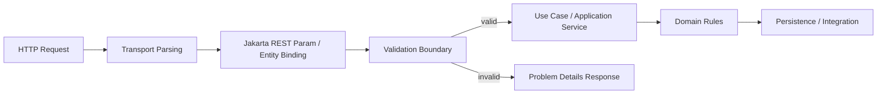
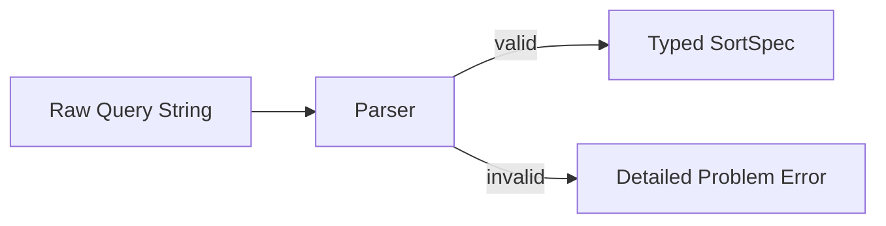
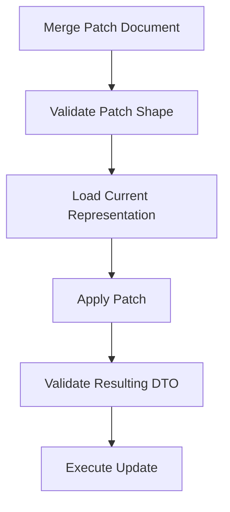
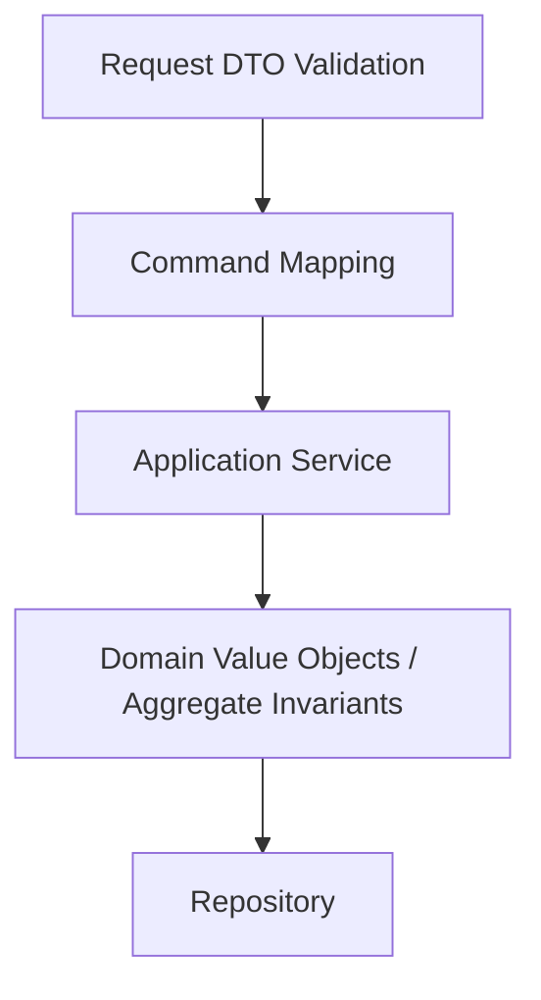

# Part 015 — Validation Boundary

> Target: setelah bagian ini, kita tidak hanya tahu cara menaruh `@NotNull` pada DTO. Kita ingin mampu mendesain **validation boundary** yang eksplisit, aman berubah, mudah dites, dan menghasilkan error response yang konsisten untuk sistem production.

Dalam Jakarta REST, validasi bukan dekorasi kosmetik. Validasi adalah **kontrak awal** antara consumer dan service. Ia menentukan apakah request cukup valid untuk memasuki use case. Jika boundary ini kabur, maka business service, persistence layer, workflow engine, dan downstream call akan dipaksa menebak-nebak kualitas input.

Mental model yang akan dipakai:



Validation boundary menjawab pertanyaan:

- Apakah request dapat diparse?
- Apakah shape request sesuai kontrak?
- Apakah field wajib tersedia?
- Apakah tipe, format, range, dan cardinality valid?
- Apakah kombinasi field masuk akal?
- Apakah request valid untuk operasi spesifik ini?
- Apakah error dapat dijelaskan tanpa membocorkan detail internal?

Yang **bukan** tugas validation boundary:

- Menentukan semua business rule domain.
- Mengecek authorization.
- Mengecek race condition.
- Menjamin state transition legal dalam domain.
- Menyembunyikan domain invariant yang seharusnya ada di domain model.

Boundary validation dan domain validation harus bekerja bersama, tetapi tidak boleh dicampur sembarangan.

---

## 1. Posisi Jakarta Validation dalam Jakarta REST

Jakarta REST sendiri menyediakan mapping HTTP ke Java resource method. Jakarta Validation menyediakan metadata dan API untuk validasi object, property, method parameter, constructor parameter, dan return value.

Dalam aplikasi Jakarta EE modern, keduanya biasanya berintegrasi melalui container. Artinya, request DTO atau parameter resource method dapat diberi constraint seperti:

```java
public record CreateCaseRequest(
    @NotBlank String subject,
    @NotNull CaseType type,
    @Size(max = 2000) String description
) {}
```

Lalu resource method dapat menerima DTO tersebut:

```java
@Path("/cases")
@Consumes(MediaType.APPLICATION_JSON)
@Produces(MediaType.APPLICATION_JSON)
public class CaseResource {

    @POST
    public Response create(@Valid CreateCaseRequest request) {
        CaseId id = service.create(request);
        return Response.created(/* uri */).build();
    }
}
```

Kunci desainnya: validasi di sini terjadi **sebelum** request masuk ke application service. Jika DTO tidak valid, service tidak perlu dipanggil.

Namun, jangan membuat asumsi bahwa semua runtime mengembalikan body error yang sama. Status response untuk validation failure bisa distandarkan, tetapi bentuk body perlu dikendalikan melalui exception mapper atau mekanisme error mapping runtime.

---

## 2. Tiga Lapisan Validasi

Di production service, validasi sebaiknya dipisah menjadi tiga lapisan.

### 2.1 Transport / syntactic validation

Ini validasi sebelum data menjadi objek domain/use-case.

Contoh:

- JSON malformed.
- `Content-Type` tidak sesuai.
- Field numeric berisi string yang tidak bisa dikonversi.
- Path param tidak bisa dikonversi menjadi UUID.
- Multipart part wajib tidak ada.

Biasanya failure lapisan ini menjadi:

- `400 Bad Request` untuk malformed syntax atau invalid parameter.
- `415 Unsupported Media Type` untuk request entity media type yang tidak didukung.
- `406 Not Acceptable` untuk response representation yang tidak acceptable.

### 2.2 Contract / structural validation

Ini validasi bahwa request object memenuhi kontrak API.

Contoh:

- `subject` wajib ada.
- `description` maksimal 2.000 karakter.
- `requestedDueDate` tidak boleh masa lalu.
- `pageSize` antara 1 dan 100.
- `sort` hanya boleh field tertentu.
- `metadata` maksimal 20 item.

Jakarta Validation sangat cocok untuk lapisan ini.

### 2.3 Domain / semantic validation

Ini validasi berbasis state dan rule bisnis.

Contoh:

- Case hanya bisa dieskalasi jika statusnya `UNDER_REVIEW`.
- Evidence tidak boleh dihapus setelah decision finalized.
- Officer tidak boleh approve case yang dia buat sendiri.
- Transition membutuhkan minimal satu supporting document.
- Deadline bergantung pada regulatory category dan jurisdiction.

Sebagian rule domain bisa diekspresikan sebagai validation constraint, tetapi sering kali lebih baik diletakkan di domain/application layer karena membutuhkan state, authorization, dan dependency.

Rule praktis:

> Constraint annotation bagus untuk rule yang lokal, deterministik, dan dapat dievaluasi dari object/parameter. Rule domain yang bergantung pada state eksternal sebaiknya tetap di application/domain service.

---

## 3. Validasi Request DTO

Request DTO adalah boundary object. Ia bukan entity persistence, bukan domain aggregate, dan bukan object yang harus reused di seluruh layer.

### 3.1 Record sebagai request DTO

Dengan Java modern, `record` cocok untuk DTO yang immutable dan eksplisit.

```java
public record CreateInvestigationRequest(
    @NotBlank
    @Size(max = 180)
    String title,

    @NotNull
    InvestigationCategory category,

    @Size(max = 4000)
    String summary,

    @Valid
    @Size(max = 20)
    List<CreateSubjectRequest> subjects
) {}

public record CreateSubjectRequest(
    @NotBlank String externalRef,
    @NotNull SubjectType type,
    @Size(max = 240) String displayName
) {}
```

Keuntungan:

- Semua field terlihat dalam constructor signature.
- Object immutable setelah dibuat.
- Cocok untuk JSON binding modern.
- Mengurangi setter-based partial mutation.

Hal yang perlu dijaga:

- Jangan menjadikan record DTO sebagai domain model.
- Jangan memasukkan behavior domain berat ke DTO.
- Jangan membuat DTO “universal” untuk create/update/search/detail.

### 3.2 DTO per use case

Anti-pattern umum:

```java
public class CaseDto {
    public String id;
    public String subject;
    public String status;
    public String decision;
    public String createdBy;
    public Instant createdAt;
    public Instant updatedAt;
    public List<EvidenceDto> evidence;
}
```

Lalu `CaseDto` dipakai untuk:

- create case
- update case
- return case detail
- search result
- escalate case
- close case

Akibatnya:

- Field menjadi ambigu: required atau optional?
- Consumer bisa mengirim field yang hanya seharusnya response-only.
- Validation group menjadi terlalu kompleks.
- API contract mudah bocor.
- Backward compatibility sulit dikontrol.

Lebih baik:

```java
public record CreateCaseRequest(...) {}
public record UpdateCaseSummaryRequest(...) {}
public record EscalateCaseRequest(...) {}
public record CloseCaseRequest(...) {}
public record CaseDetailResponse(...) {}
public record CaseSearchItemResponse(...) {}
```

Boundary DTO harus mengikuti operasi, bukan mengikuti tabel database.

---

## 4. Resource Method Parameter Validation

Validasi tidak hanya berlaku pada request body. Query param, path param, header, cookie, dan bean param juga bagian dari contract.

Contoh:

```java
@GET
public Response search(
    @QueryParam("q") @Size(max = 200) String query,
    @QueryParam("page") @DefaultValue("1") @Min(1) int page,
    @QueryParam("size") @DefaultValue("25") @Min(1) @Max(100) int size,
    @QueryParam("sort") @Pattern(regexp = "createdAt|updatedAt|priority") String sort
) {
    return Response.ok(service.search(query, page, size, sort)).build();
}
```

Namun, jika parameter mulai banyak, gunakan `@BeanParam`.

```java
public class CaseSearchParams {

    @QueryParam("q")
    @Size(max = 200)
    private String query;

    @QueryParam("status")
    private List<CaseStatus> statuses;

    @QueryParam("page")
    @DefaultValue("1")
    @Min(1)
    private int page;

    @QueryParam("size")
    @DefaultValue("25")
    @Min(1)
    @Max(100)
    private int size;

    @QueryParam("sort")
    @ValidSort(allowed = {"createdAt", "updatedAt", "priority"})
    private String sort;

    // getters
}
```

Resource:

```java
@GET
public Response search(@Valid @BeanParam CaseSearchParams params) {
    return Response.ok(service.search(params)).build();
}
```

Mental model:

```mermaid
flowchart TD
  A[Query/Header/Path Parameters] --> B[@BeanParam Object]
  B --> C[Jakarta Validation]
  C -->|valid| D[Application Service Query Object]
  C -->|invalid| E[400 Problem Details]
```

Gunakan `@BeanParam` ketika:

- Parameter lebih dari 3-5.
- Parameter dipakai ulang di beberapa endpoint.
- Ada validasi kombinasi antar parameter.
- Anda ingin test parsing/validation secara terpisah.

---

## 5. Constraint Dasar yang Paling Sering Dipakai

Constraint bawaan mencakup banyak kebutuhan contract-level.

| Constraint | Cocok untuk | Catatan |
|---|---|---|
| `@NotNull` | field wajib ada sebagai value non-null | Tidak menjamin string tidak kosong |
| `@NotBlank` | text wajib berisi non-whitespace | Cocok untuk title/name/subject |
| `@NotEmpty` | collection/string tidak kosong | Tidak trim whitespace |
| `@Size` | panjang string / ukuran collection | Gunakan untuk mencegah abuse payload |
| `@Min` / `@Max` | angka integral | Cocok untuk page size, threshold |
| `@DecimalMin` / `@DecimalMax` | decimal | Gunakan untuk money/rate boundary |
| `@Positive` / `@PositiveOrZero` | numeric non-negative | Cocok untuk amount/count |
| `@Past` / `@Future` | waktu relatif | Hati-hati timezone dan clock |
| `@Pattern` | grammar sederhana | Jangan jadikan regex monster |
| `@Email` | format email | Bukan validasi deliverability |
| `@Valid` | nested object / collection | Wajib untuk cascading validation |

Contoh:

```java
public record AssignOfficerRequest(
    @NotBlank
    @Pattern(regexp = "[A-Z]{2,8}-[0-9]{3,12}")
    String officerRef,

    @NotBlank
    @Size(max = 500)
    String reason
) {}
```

Jangan overfit regex. Untuk grammar kompleks seperti filtering/sorting, lebih baik parse dengan parser kecil dan hasilkan error spesifik.

---

## 6. Cascading Validation dengan `@Valid`

Tanpa `@Valid`, constraint pada nested object bisa tidak dievaluasi.

```java
public record CreateCaseRequest(
    @NotBlank String subject,

    @Valid
    @Size(max = 20)
    List<CreatePartyRequest> parties
) {}

public record CreatePartyRequest(
    @NotBlank String externalRef,
    @NotNull PartyRole role
) {}
```

Jika `parties` berisi object dengan `externalRef = null`, validation pada nested item membutuhkan cascading.

Untuk container element validation, kita juga bisa menaruh constraint pada element type:

```java
public record AddTagsRequest(
    @Size(max = 20)
    List<@NotBlank @Size(max = 40) String> tags
) {}
```

Ini berguna untuk:

- list of IDs
- tags
- codes
- enum-like string values
- metadata key/value

Tetapi untuk domain identifier penting, lebih baik gunakan value object atau custom converter/constraint.

---

## 7. Null, Missing, Empty, dan Default: Jangan Disamakan

Dalam JSON API, empat kondisi ini berbeda:

```json
{}
```

```json
{"subject": null}
```

```json
{"subject": ""}
```

```json
{"subject": "   "}
```

`@NotNull`, `@NotEmpty`, dan `@NotBlank` punya arti berbeda.

| Input | `@NotNull` | `@NotEmpty` | `@NotBlank` |
|---|---:|---:|---:|
| missing -> `null` | fail | fail | fail |
| explicit `null` | fail | fail | fail |
| `""` | pass | fail | fail |
| `"   "` | pass | pass | fail |
| `"abc"` | pass | pass | pass |

Untuk create request, biasanya field wajib memakai `@NotBlank` atau `@NotNull`.

Untuk patch request, jangan asal menaruh `@NotNull`, karena missing field bisa berarti “tidak berubah”. Ini dibahas lebih jauh pada bagian partial update.

---

## 8. Validation Group: Gunakan Secara Terbatas

Validation group memungkinkan constraint berbeda untuk operasi berbeda.

```java
public interface OnCreate {}
public interface OnUpdate {}

public record CaseCommandRequest(
    @Null(groups = OnCreate.class)
    @NotNull(groups = OnUpdate.class)
    UUID id,

    @NotBlank(groups = OnCreate.class)
    @Size(max = 180, groups = {OnCreate.class, OnUpdate.class})
    String subject
) {}
```

Secara teknis bisa. Secara desain, sering kali ini tanda DTO terlalu generic.

Gunakan group ketika:

- Ada object yang memang natural dipakai di beberapa context.
- Constraint context-specific sedikit dan jelas.
- Group tidak membuat API contract sulit dibaca.

Hindari group ketika:

- Create/update/escalate/close semua memakai DTO sama.
- Field-level requiredness menjadi tidak bisa dipahami dari nama class.
- Group mulai membentuk matrix operasi x field.

Pilihan yang lebih jelas:

```java
public record CreateCaseRequest(
    @NotBlank String subject,
    @NotNull CaseType type
) {}

public record UpdateCaseSubjectRequest(
    @NotBlank String subject
) {}
```

Rule:

> Untuk external API DTO, explicit type lebih mudah dirawat daripada satu DTO dengan banyak validation group.

---

## 9. Cross-Field Validation

Beberapa rule tidak bisa diekspresikan pada satu field.

Contoh:

- `fromDate` harus sebelum `toDate`.
- `decisionReason` wajib jika `decision = REJECTED`.
- `assigneeId` wajib jika `assignmentMode = MANUAL`.
- `jurisdiction` wajib jika `caseType = CROSS_BORDER`.

Gunakan class-level constraint.

```java
@Target({ElementType.TYPE})
@Retention(RetentionPolicy.RUNTIME)
@Constraint(validatedBy = ValidDateRangeValidator.class)
public @interface ValidDateRange {
    String message() default "invalid date range";
    Class<?>[] groups() default {};
    Class<? extends Payload>[] payload() default {};
}
```

Validator:

```java
public class ValidDateRangeValidator
        implements ConstraintValidator<ValidDateRange, CaseSearchParams> {

    @Override
    public boolean isValid(CaseSearchParams value, ConstraintValidatorContext context) {
        if (value == null) {
            return true;
        }
        LocalDate from = value.getFromDate();
        LocalDate to = value.getToDate();
        if (from == null || to == null) {
            return true;
        }
        return !from.isAfter(to);
    }
}
```

Pemakaian:

```java
@ValidDateRange
public class CaseSearchParams {
    @QueryParam("fromDate") LocalDate fromDate;
    @QueryParam("toDate") LocalDate toDate;
}
```

Untuk error path yang lebih baik, custom validator dapat menambahkan property violation:

```java
context.disableDefaultConstraintViolation();
context.buildConstraintViolationWithTemplate("must be on or after fromDate")
       .addPropertyNode("toDate")
       .addConstraintViolation();
```

Cross-field validation harus tetap deterministik. Jika butuh database lookup, jangan letakkan di constraint kecuali Anda benar-benar mengontrol lifecycle, performance, caching, dan failure behavior.

---

## 10. Custom Constraint untuk Domain Grammar

Constraint custom berguna untuk grammar yang sering dipakai dan tidak nyaman diekspresikan dengan annotation bawaan.

Contoh sort grammar:

```java
@ValidSort(allowed = {"createdAt", "updatedAt", "priority"})
private String sort;
```

Annotation:

```java
@Target({ElementType.FIELD, ElementType.PARAMETER})
@Retention(RetentionPolicy.RUNTIME)
@Constraint(validatedBy = SortValidator.class)
public @interface ValidSort {
    String message() default "invalid sort expression";
    Class<?>[] groups() default {};
    Class<? extends Payload>[] payload() default {};
    String[] allowed();
}
```

Validator:

```java
public class SortValidator implements ConstraintValidator<ValidSort, String> {

    private Set<String> allowed;

    @Override
    public void initialize(ValidSort constraint) {
        this.allowed = Set.of(constraint.allowed());
    }

    @Override
    public boolean isValid(String value, ConstraintValidatorContext context) {
        if (value == null || value.isBlank()) {
            return true;
        }

        for (String token : value.split(",")) {
            String field = token.startsWith("-") ? token.substring(1) : token;
            if (!allowed.contains(field)) {
                return false;
            }
        }
        return true;
    }
}
```

Tetapi untuk grammar kompleks, lebih baik pisahkan:



Custom constraint yang hanya mengembalikan `true/false` kadang terlalu miskin untuk error reporting. Parser eksplisit bisa menghasilkan:

```json
{
  "field": "sort",
  "code": "unsupported_sort_field",
  "message": "Unsupported sort field: riskScore",
  "allowed": ["createdAt", "updatedAt", "priority"]
}
```

---

## 11. Partial Update: PATCH dan Validation

Partial update adalah sumber bug validation paling sering.

Misal create request:

```java
public record CreateCaseRequest(
    @NotBlank String subject,
    @NotNull CaseType type,
    @Size(max = 4000) String summary
) {}
```

Untuk PATCH, kita tidak bisa memakai constraint yang sama secara langsung:

```java
public record PatchCaseRequest(
    String subject,
    String summary
) {}
```

Masalahnya: `null` bisa berarti:

- field tidak dikirim
- field dikirim dengan value null
- field ingin dihapus

Tiga arti ini harus dibedakan.

### 11.1 Strategy A: Merge Patch

Dengan JSON Merge Patch, `null` berarti remove/set-null, missing berarti unchanged. Cocok jika semantics ini diterima API.

Endpoint:

```java
@PATCH
@Consumes("application/merge-patch+json")
public Response patch(String mergePatchDocument) {
    // parse, validate allowed fields, apply to current representation, validate result
}
```

Validation flow:



Kelebihan:

- Semantics standard dan jelas.
- Bisa validasi final state.

Kekurangan:

- Perlu kontrol allowed fields.
- Error path bisa lebih kompleks.
- Consumer harus paham merge patch.

### 11.2 Strategy B: Explicit Optional Field Wrapper

Gunakan wrapper untuk membedakan missing vs present-null.

```java
public record PatchCaseRequest(
    JsonNullable<@NotBlank @Size(max = 180) String> subject,
    JsonNullable<@Size(max = 4000) String> summary
) {}
```

Konsepnya:

- undefined = tidak dikirim
- present null = dikirim null
- present value = dikirim value

Tidak semua stack menyediakan wrapper ini out-of-the-box. Jika dipakai, pastikan JSON provider, validation, OpenAPI generation, dan test mendukungnya.

### 11.3 Strategy C: Operation-Specific Commands

Untuk sistem regulated, sering kali lebih aman membuat endpoint eksplisit:

```http
PUT /cases/{caseId}/subject
POST /cases/{caseId}/summary-revisions
POST /cases/{caseId}/assignments
POST /cases/{caseId}/escalations
```

Keuntungan:

- Validation lebih sederhana.
- Audit trail lebih kuat.
- Authorization lebih jelas.
- Idempotency dan state transition lebih mudah dimodelkan.

Kekurangan:

- Lebih banyak endpoint.
- Consumer harus memahami resource/action model.

Untuk workflow/case-management, explicit command resource sering lebih defensible daripada generic PATCH.

---

## 12. Validation untuk Enum dan Unknown Values

Enum di API tampak mudah, tetapi evolusinya sulit.

```java
public enum CasePriority {
    LOW, MEDIUM, HIGH
}
```

Jika consumer mengirim:

```json
{"priority":"CRITICAL"}
```

JSON binding biasanya gagal sebelum Jakarta Validation berjalan. Itu transport/binding error, bukan `@NotNull` error.

Pertanyaan desain:

- Apakah enum value case-sensitive?
- Apakah unknown value menghasilkan `400`?
- Bagaimana consumer discover allowed values?
- Bagaimana menambah enum value tanpa merusak old consumer?

Untuk request enum, strict validation biasanya benar.

Untuk response enum, menambah enum value bisa menjadi breaking change bagi consumer yang melakukan exhaustive switch. Karena itu, API contract harus menyebutkan apakah enum open atau closed.

Jika enum sering berubah, pertimbangkan code table resource:

```http
GET /reference-data/case-priorities
```

Dan request:

```java
public record SetPriorityRequest(
    @NotBlank
    @ReferenceCode(type = "CASE_PRIORITY")
    String priorityCode
) {}
```

Tetapi validasi `@ReferenceCode` yang lookup ke database harus hati-hati. Jangan membuat validation layer melakukan query berat tanpa timeout/cache/failure policy.

---

## 13. Validation untuk Identifiers

Jangan treat semua identifier sebagai `String` tanpa boundary.

Contoh buruk:

```java
@GET
@Path("/{caseId}")
public Response get(@PathParam("caseId") String caseId) { ... }
```

Lebih baik minimal:

```java
@GET
@Path("/{caseId}")
public Response get(@PathParam("caseId") @NotBlank @Pattern(regexp = "[A-Z0-9-]{8,64}") String caseId) { ... }
```

Atau gunakan value object + converter:

```java
public record CaseId(String value) {
    public CaseId {
        if (value == null || !value.matches("[A-Z0-9-]{8,64}")) {
            throw new IllegalArgumentException("invalid case id");
        }
    }
}
```

Dengan `ParamConverterProvider`, kita bisa convert `String` path param menjadi `CaseId`.

```java
@GET
@Path("/{caseId}")
public Response get(@PathParam("caseId") CaseId caseId) { ... }
```

Kelebihan:

- Resource method lebih typed.
- Invalid ID gagal sebelum service.
- Service tidak menerima raw string.

Hati-hati:

- Conversion exception harus dimap menjadi `400`, bukan `500`.
- Jangan lakukan database lookup di converter.
- Converter harus deterministic dan cheap.

---

## 14. Validation Error Response Contract

Jangan biarkan runtime mengembalikan HTML generic atau stack trace. Buat error contract.

Gunakan problem details style:

```json
{
  "type": "https://api.example.com/problems/validation-failed",
  "title": "Validation failed",
  "status": 400,
  "detail": "One or more request fields are invalid.",
  "instance": "/cases",
  "correlationId": "01JABC...",
  "errors": [
    {
      "field": "subject",
      "code": "NotBlank",
      "message": "must not be blank"
    },
    {
      "field": "subjects[0].externalRef",
      "code": "NotBlank",
      "message": "must not be blank"
    }
  ]
}
```

Internal model:

```java
public record Problem(
    URI type,
    String title,
    int status,
    String detail,
    String instance,
    String correlationId,
    List<FieldError> errors
) {}

public record FieldError(
    String field,
    String code,
    String message,
    Object rejectedValue
) {}
```

Hindari mengirim `rejectedValue` untuk:

- password
- token
- secret
- document content
- large payload
- PII sensitif
- financial account number

Jika butuh debug, simpan detail di log/audit internal dengan masking.

---

## 15. Mapping `ConstraintViolationException`

Buat mapper eksplisit.

```java
@Provider
@Priority(Priorities.USER)
public class ConstraintViolationExceptionMapper
        implements ExceptionMapper<ConstraintViolationException> {

    @Context
    UriInfo uriInfo;

    @Context
    HttpHeaders headers;

    @Override
    public Response toResponse(ConstraintViolationException exception) {
        List<FieldError> errors = exception.getConstraintViolations()
            .stream()
            .map(this::toFieldError)
            .sorted(Comparator.comparing(FieldError::field))
            .toList();

        Problem problem = new Problem(
            URI.create("https://api.example.com/problems/validation-failed"),
            "Validation failed",
            400,
            "One or more request fields are invalid.",
            uriInfo.getRequestUri().getPath(),
            currentCorrelationId(),
            errors
        );

        return Response.status(Response.Status.BAD_REQUEST)
            .type("application/problem+json")
            .entity(problem)
            .build();
    }

    private FieldError toFieldError(ConstraintViolation<?> violation) {
        return new FieldError(
            normalizePath(violation.getPropertyPath()),
            violation.getConstraintDescriptor()
                     .getAnnotation()
                     .annotationType()
                     .getSimpleName(),
            violation.getMessage(),
            safeRejectedValue(violation.getInvalidValue())
        );
    }
}
```

Property path bisa berbeda tergantung apakah violation berasal dari:

- request entity
- method parameter
- return value
- nested object
- collection element

Maka `normalizePath` perlu dites per runtime.

Contoh raw path dapat terlihat seperti:

```text
create.arg0.subject
search.arg0.page
create.request.subjects[0].externalRef
```

External API sebaiknya tidak mengekspos nama method Java seperti `create.arg0`. Normalisasi ke path kontrak:

```text
subject
page
subjects[0].externalRef
```

---

## 16. Status Code untuk Validation Failure

Gunakan status code secara konsisten.

| Failure | Status | Contoh |
|---|---:|---|
| Malformed JSON | 400 | body bukan JSON valid |
| Invalid path/query/header param | 400 | `page=abc` |
| Bean Validation violation | 400 | `subject` blank |
| Unsupported `Content-Type` | 415 | kirim XML ke endpoint JSON-only |
| `Accept` tidak bisa dipenuhi | 406 | minta `application/xml` tapi endpoint hanya JSON |
| Semantic conflict dengan state resource | 409 | escalate case yang sudah closed |
| Missing precondition for guarded update | 428 | update tanpa `If-Match` |
| ETag mismatch | 412 | stale update |
| Authenticated tapi unauthorized | 403 | user tidak boleh mutate case |
| Not authenticated | 401 | token tidak valid/hilang |

Jangan pakai `422` hanya karena terdengar “validation”. Jika organisasi Anda memilih `422 Unprocessable Content`, dokumentasikan dengan jelas. Banyak Jakarta REST stack dan enterprise API tetap memakai `400` untuk request validation. Yang penting adalah konsistensi, bukan debat status code tanpa akhir.

Untuk regulated system, perbedaan penting:

- `400`: request contract invalid.
- `403`: caller tidak boleh melakukan tindakan.
- `404`: resource tidak ditemukan atau sengaja disamarkan.
- `409`: tindakan bertentangan dengan state saat ini.
- `412`: precondition gagal.

---

## 17. Validation dan Security

Validation bukan security control lengkap, tetapi validation membantu mengecilkan attack surface.

Checklist:

- Batasi panjang string.
- Batasi ukuran list/map.
- Batasi page size.
- Batasi upload size.
- Batasi grammar filter/sort.
- Jangan parse expression bebas tanpa allowlist.
- Jangan mengembalikan raw rejected sensitive value.
- Jangan memakai regex rentan catastrophic backtracking.
- Jangan melakukan database lookup tak terbatas dalam validator.
- Jangan membiarkan validation error menjadi oracle untuk data sensitif.

Contoh bug:

```java
@Pattern(regexp = "(a+)+")
String value;
```

Regex seperti ini bisa rentan ReDoS. Untuk input publik, regex harus sederhana atau diberi timeout via parser yang aman.

---

## 18. Validation dan Internationalization

Constraint message sebaiknya bukan contract utama. Message bisa berubah, diterjemahkan, atau disesuaikan.

Lebih stabil:

```json
{
  "field": "pageSize",
  "code": "Max",
  "message": "must be less than or equal to 100",
  "params": {
    "value": 100
  }
}
```

Consumer sebaiknya bergantung pada:

- `type`
- `status`
- `code`
- `field`

Bukan pada English sentence.

Untuk UI, message bisa localized berdasarkan `Accept-Language`. Tetapi API contract harus tetap machine-readable.

---

## 19. Return Value Validation

Jakarta Validation mendukung method return value validation. Dalam resource, return validation dapat dipakai sebagai guard internal.

```java
@GET
@Path("/{id}")
@NotNull
public CaseDetailResponse get(@PathParam("id") CaseId id) {
    return service.get(id);
}
```

Namun, hati-hati. Return value validation failure adalah server bug, bukan client error. Jangan map menjadi `400`.

Jika response DTO melanggar constraint, itu berarti:

- service menghasilkan invalid response
- mapping salah
- data corrupt
- constraint terlalu ketat

Status yang lebih masuk akal biasanya `500 Internal Server Error`, dengan log internal yang jelas.

Pisahkan mapper untuk request validation vs return validation jika runtime memungkinkan membedakan path violation. Jika tidak, pastikan fallback mapper tidak menyamarkan server bug sebagai client error.

---

## 20. Validation di Layer Service dan Domain

Jangan berpikir “karena resource sudah validate, domain tidak perlu invariant”. Boundary validation bisa dilewati oleh:

- test langsung ke service
- message consumer
- batch job
- CLI/admin tool
- future endpoint
- internal event replay

Domain invariant tetap harus ada.

Contoh:

```java
public final class CaseTitle {
    private final String value;

    public CaseTitle(String value) {
        if (value == null || value.isBlank()) {
            throw new IllegalArgumentException("case title must not be blank");
        }
        if (value.length() > 180) {
            throw new IllegalArgumentException("case title too long");
        }
        this.value = value;
    }
}
```

Resource validation memberi UX error yang baik. Domain invariant memberi safety jika boundary berubah.

Layering yang sehat:



Jangan mengandalkan satu lapisan sebagai satu-satunya penjaga kebenaran.

---

## 21. Mapping dari Request DTO ke Command

Resource sebaiknya tidak melempar DTO mentah ke domain.

```java
@POST
public Response create(@Valid CreateCaseRequest request) {
    CreateCaseCommand command = new CreateCaseCommand(
        new CaseTitle(request.subject()),
        request.type(),
        request.summary()
    );

    CaseId id = service.create(command);
    return Response.created(location(id)).build();
}
```

Kenapa mapping penting:

- DTO adalah contract external.
- Command adalah contract application layer.
- Domain value object menjaga invariant internal.
- Perubahan API tidak otomatis merusak application service.

Jika mapping terasa repetitive, jangan langsung “menghilangkan” boundary dengan memakai DTO sebagai command. Repetisi kecil sering jauh lebih murah daripada coupling contract jangka panjang.

---

## 22. Testing Validation Boundary

Validation harus dites seperti API contract.

### 22.1 Unit test DTO validation

```java
class CreateCaseRequestValidationTest {

    private final Validator validator = Validation.buildDefaultValidatorFactory().getValidator();

    @Test
    void rejectsBlankSubject() {
        var request = new CreateCaseRequest(" ", CaseType.ENFORCEMENT, "summary");

        var violations = validator.validate(request);

        assertThat(violations)
            .anyMatch(v -> v.getPropertyPath().toString().equals("subject"));
    }
}
```

### 22.2 Resource integration test

Test full HTTP behavior:

```http
POST /cases
Content-Type: application/json
Accept: application/json

{"subject":" ","type":"ENFORCEMENT"}
```

Expected:

```http
HTTP/1.1 400 Bad Request
Content-Type: application/problem+json
```

And body:

```json
{
  "type": "https://api.example.com/problems/validation-failed",
  "status": 400,
  "errors": [
    {"field": "subject", "code": "NotBlank"}
  ]
}
```

### 22.3 Property path regression test

Since path rendering can be runtime-specific, test mapper output:

- nested object
- collection element
- method parameter
- query bean
- invalid enum
- malformed JSON

### 22.4 Fuzz-ish boundary test

For public API, generate boundary cases:

- string length 0, 1, max, max+1
- list size 0, max, max+1
- invalid date range
- unsupported sort field
- malformed UUID
- unknown enum
- duplicate query params

---

## 23. Validation Decision Matrix

| Situation | Recommended technique |
|---|---|
| Required string | `@NotBlank` |
| Required enum/object | `@NotNull` |
| Max text length | `@Size(max = n)` |
| Nested object | `@Valid` |
| List item constraint | `List<@NotBlank String>` |
| Query parameter group | `@BeanParam` + `@Valid` |
| Date range | class-level custom constraint |
| Sort/filter grammar | custom parser or constraint with allowlist |
| Identifier syntax | value object + `ParamConverterProvider` or `@Pattern` |
| Create vs update different requiredness | separate DTOs first; groups only if justified |
| PATCH missing vs null | merge patch or explicit field wrapper |
| Domain state rule | application/domain service |
| Authorization rule | security/application layer, not validation annotation |
| External reference existence | service/domain rule, not cheap field validation unless cached/controlled |

---

## 24. Common Anti-Patterns

### 24.1 “Validation everywhere, but no contract”

Lots of annotations, but inconsistent error response. Consumer still cannot reliably react.

Fix: define problem response schema and centralize mapper.

### 24.2 “One DTO for everything”

One class with 30 fields and many groups.

Fix: operation-specific request/response DTOs.

### 24.3 “Database lookup in every validator”

Validator calls repository for each field/item.

Problems:

- unpredictable latency
- N+1 validation query
- transaction ambiguity
- failure mode confusion
- cache inconsistency

Fix: move existence/state validation to application service.

### 24.4 “Regex as parser”

Complex filter grammar validated by unreadable regex.

Fix: small parser with structured errors.

### 24.5 “Return validation failure mapped to 400”

Server-generated invalid response blamed on client.

Fix: distinguish request validation from response invariant failure.

### 24.6 “Leaking rejected sensitive value”

Error body includes password/token/document content.

Fix: mask or omit rejected value by default.

---

## 25. Production Checklist

Before considering validation boundary production-ready:

- [ ] Every public request body has operation-specific DTO.
- [ ] Requiredness is explicit and tested.
- [ ] Text fields have max length.
- [ ] Collections/maps have max size.
- [ ] Query parameters have max page size and allowlisted sort/filter fields.
- [ ] Nested DTOs use `@Valid`.
- [ ] PATCH semantics distinguish missing vs null.
- [ ] Validation failure returns consistent `application/problem+json` or equivalent.
- [ ] Field errors are machine-readable.
- [ ] Sensitive rejected values are not exposed.
- [ ] Malformed JSON and invalid enum are mapped consistently.
- [ ] Validation mapper does not expose Java method names like `arg0`.
- [ ] Domain invariant still exists beyond resource validation.
- [ ] Tests cover boundary values and nested errors.
- [ ] Runtime-specific behavior is captured by integration tests.

---

## 26. Mini Practice

Design validation for this endpoint:

```http
POST /cases/{caseId}/escalations
Content-Type: application/json
```

Request:

```json
{
  "targetLevel": "REGIONAL_REVIEW",
  "reason": "Repeated non-compliance across branches",
  "evidenceIds": ["EVD-001", "EVD-002"]
}
```

Recommended DTO:

```java
public record EscalateCaseRequest(
    @NotNull EscalationLevel targetLevel,

    @NotBlank
    @Size(max = 2000)
    String reason,

    @NotEmpty
    @Size(max = 50)
    List<@NotBlank @Pattern(regexp = "EVD-[0-9]{3,12}") String> evidenceIds
) {}
```

Resource:

```java
@POST
@Path("/{caseId}/escalations")
@Consumes(MediaType.APPLICATION_JSON)
@Produces(MediaType.APPLICATION_JSON)
public Response escalate(
    @PathParam("caseId") CaseId caseId,
    @Valid EscalateCaseRequest request
) {
    EscalationId escalationId = service.escalate(caseId, request);
    return Response.created(escalationLocation(caseId, escalationId)).build();
}
```

But these rules remain in service/domain:

- case exists
- caller can escalate
- case state allows escalation
- evidence IDs belong to the case
- evidence is admissible for escalation
- duplicate escalation is prevented

Boundary validation rejects structurally invalid request. Domain validation rejects semantically invalid operation.

---

## 27. Closing Mental Model

Validation boundary is not about sprinkling annotations. It is about protecting the service with a precise contract.

A mature Jakarta REST API treats validation as:

- a protocol boundary
- a consumer-facing contract
- a security hardening layer
- an operability feature
- a compatibility surface
- a domain protection mechanism, but not a replacement for domain invariants

The next part builds directly on this: once input is valid, how do we design API contracts that can evolve for years without constantly breaking consumers?
