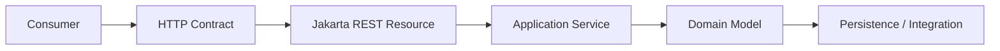
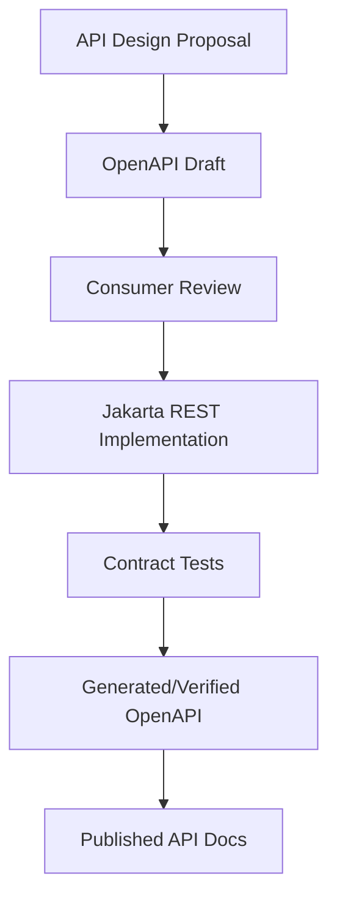
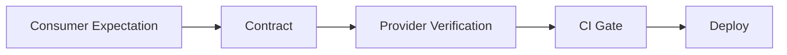

# Part 016 — API Contract Design

> Target: setelah bagian ini, kita mampu mendesain kontrak API Jakarta REST yang tidak hanya “jalan hari ini”, tetapi bisa bertahan ketika domain berubah, consumer bertambah, data membesar, dan organisasi butuh governance.

Resource method adalah implementation detail. **API contract** adalah perjanjian jangka panjang antara provider dan consumer.

Contract mencakup:

- URI shape
- HTTP method semantics
- request body
- response body
- status codes
- headers
- media types
- validation errors
- pagination/filtering/sorting grammar
- caching and conditional request semantics
- authentication/authorization expectation
- rate limit behavior
- deprecation and versioning policy
- compatibility promises

Dalam Jakarta REST, contract tidak muncul otomatis hanya karena kita menulis annotation:

```java
@GET
@Path("/{id}")
@Produces(MediaType.APPLICATION_JSON)
public CaseDetailResponse get(@PathParam("id") CaseId id) { ... }
```

Annotation membantu routing dan representation, tetapi contract harus didesain secara eksplisit.

---

## 1. Contract as Boundary, Not Implementation Leak

API contract berada di antara consumer dan provider.



Kontrak yang sehat menyembunyikan:

- tabel database
- aggregate internals
- workflow engine implementation
- internal service topology
- Java class names
- exception class names
- storage identifiers yang tidak seharusnya publik

Kontrak yang buruk memperlihatkan semuanya:

```http
GET /caseEntity/findByCaseStatusAndOfficerId?caseStatusCd=3&officerEntityId=112
```

Kontrak yang lebih baik:

```http
GET /cases?status=under-review&assignedOfficer=OFF-112
```

Atau untuk sistem yang butuh stable external identifier:

```http
GET /cases?status=under-review&assignedOfficerRef=OFF-2026-000112
```

Rule:

> API contract sebaiknya mengikuti bahasa domain yang stabil, bukan struktur persistence yang kebetulan dipakai saat ini.

---

## 2. Compatibility First Thinking

Top-tier engineer mendesain endpoint dengan pertanyaan awal:

> “Apa yang akan terjadi ketika field ini berubah, enum bertambah, consumer lama masih hidup, dan data volume 100x?”

Compatibility bukan pekerjaan setelah API rusak. Compatibility adalah input desain.

### 2.1 Additive changes biasanya aman

Umumnya aman:

- menambahkan optional response field
- menambahkan endpoint baru
- menambahkan optional query parameter
- menambahkan media type baru tanpa menghapus lama
- menambahkan link baru
- menambahkan error code baru jika consumer siap unknown code

Namun “aman” bergantung pada consumer. Consumer yang strict terhadap unknown field bisa tetap rusak. Karena itu contract harus menyatakan bahwa consumer wajib ignore unknown response fields.

### 2.2 Breaking changes

Biasanya breaking:

- menghapus field response
- mengganti nama field
- mengganti tipe field
- mengubah semantic field
- mengubah required request field
- mengubah status code untuk kasus yang sama
- mengubah error schema
- mengubah pagination semantics
- mengubah enum closed set
- mengubah identifier format tanpa masa transisi
- mengubah default sorting
- mengubah timezone representation
- mempersempit authorization tanpa koordinasi

### 2.3 Behavior changes juga breaking

Contoh:

Endpoint lama:

```http
GET /cases?status=open
```

Dulu mengembalikan `OPEN` dan `REOPENED`. Setelah refactor hanya mengembalikan `OPEN`. Schema tidak berubah, tetapi behavior berubah. Consumer reporting bisa salah.

Breaking change tidak selalu terlihat dari JSON schema diff.

---

## 3. Request DTO vs Response DTO

Jangan pakai DTO yang sama untuk request dan response.

Bad:

```java
public record CaseDto(
    String id,
    String subject,
    String status,
    String createdBy,
    Instant createdAt,
    Instant updatedAt
) {}
```

Lalu dipakai untuk `POST /cases` dan `GET /cases/{id}`.

Problem:

- `id` response-only, tetapi muncul di request schema.
- `status` mungkin server-controlled.
- `createdAt` tidak boleh dikirim consumer.
- Requiredness berbeda.
- Evolution request dan response menjadi coupled.

Better:

```java
public record CreateCaseRequest(
    String subject,
    CaseType type,
    String summary
) {}

public record CaseDetailResponse(
    String id,
    String subject,
    CaseType type,
    CaseStatus status,
    String summary,
    ActorRef createdBy,
    Instant createdAt,
    Instant updatedAt
) {}
```

Request DTO mewakili **intention from client**. Response DTO mewakili **representation from server**.

---

## 4. Field Contract Design

Setiap field harus punya contract minimal:

- name
- type
- required/optional/nullability
- format
- max length / range
- semantics
- source of truth
- mutability
- compatibility rule

Contoh dokumentasi field:

| Field | Type | Required | Nullable | Semantics |
|---|---|---:|---:|---|
| `subject` | string | yes | no | Human-readable case title, max 180 chars |
| `type` | enum | yes | no | Case classification at creation time |
| `summary` | string | no | yes | Optional summary, max 4000 chars |
| `externalRef` | string | no | no | Client-provided idempotency/domain reference |

Dalam code:

```java
public record CreateCaseRequest(
    @NotBlank @Size(max = 180) String subject,
    @NotNull CaseType type,
    @Size(max = 4000) String summary,
    @Size(max = 80) String externalRef
) {}
```

Tetapi annotation tidak cukup. `externalRef` misalnya butuh semantic contract:

- unik per tenant?
- case-sensitive?
- boleh berubah?
- dipakai untuk deduplication?
- terlihat di response?

---

## 5. Nullability Policy

Nullability harus konsisten.

Ada beberapa policy umum:

### 5.1 Omit absent optional fields

Response:

```json
{
  "id": "CASE-1",
  "subject": "Late filing"
}
```

Field `summary` tidak ada jika absent.

Kelebihan:

- Payload lebih kecil.
- Natural untuk JSON.

Kekurangan:

- Consumer harus handle missing.
- Schema perlu jelas.

### 5.2 Include explicit null

```json
{
  "id": "CASE-1",
  "subject": "Late filing",
  "summary": null
}
```

Kelebihan:

- Shape stabil.
- Consumer tahu field dikenal tapi kosong.

Kekurangan:

- Null semantics harus jelas.
- Bisa membingungkan untuk patch.

### 5.3 Avoid null via empty collection/object

```json
{
  "evidence": []
}
```

Untuk collection, empty array biasanya lebih baik daripada null.

Rule praktis:

- Collection response: prefer `[]`, not `null`.
- Optional scalar: pilih omit atau null, lalu konsisten.
- Request create: missing dan null harus diputuskan eksplisit.
- Patch: missing dan null harus punya semantics yang terdokumentasi.

---

## 6. Time, Date, and Timezone Contract

Time bug sering menjadi production defect yang mahal.

Gunakan representasi ISO-8601 untuk timestamp, biasanya UTC:

```json
{
  "createdAt": "2026-06-27T14:30:00Z"
}
```

Java type yang umum:

- `Instant` untuk timestamp absolute.
- `OffsetDateTime` jika offset penting dalam contract.
- `LocalDate` untuk tanggal kalender tanpa waktu.
- Hindari `LocalDateTime` untuk event absolute karena tidak punya timezone/offset.

Contract harus menjawab:

- Apakah timestamp selalu UTC?
- Apakah precision millisecond, microsecond, atau nanosecond?
- Apakah consumer boleh mengirim timezone offset?
- Bagaimana date-only ditafsirkan untuk jurisdiction berbeda?
- Apakah range query inclusive atau exclusive?

Contoh range query yang jelas:

```http
GET /cases?createdFrom=2026-01-01T00:00:00Z&createdTo=2026-02-01T00:00:00Z
```

Semantics:

```text
createdAt >= createdFrom AND createdAt < createdTo
```

Prefer half-open interval untuk menghindari ambiguitas end-of-day.

---

## 7. Identifier Contract

Identifier publik harus stabil.

Pertanyaan desain:

- Apakah ID sequential, UUID, ULID, prefixed ID, atau business reference?
- Apakah ID expose tenant/org info?
- Apakah ID bisa ditebak?
- Apakah ID berubah saat migration?
- Apakah internal DB ID boleh terekspos?

Untuk public API, sering lebih aman memakai opaque stable ID:

```json
{
  "id": "CASE-01J2ZTKKX4VZ7Y9WQ8Y6V9P4QG"
}
```

Atau domain-friendly prefixed ID:

```json
{
  "id": "CASE-2026-00001234"
}
```

Jangan expose database auto-increment ID jika:

- bisa memudahkan enumeration attack
- migration storage mungkin berubah
- multi-tenant isolation sensitif
- ID internal berbeda dari canonical case reference

Jika harus expose numeric ID, mitigasi dengan authorization kuat dan tidak mengandalkan unguessability.

---

## 8. Pagination Design

Endpoint collection tanpa pagination adalah bug tertunda.

Bad:

```http
GET /cases
```

Jika data tumbuh, endpoint akan lambat, mahal, dan tidak stabil.

### 8.1 Offset pagination

```http
GET /cases?page=1&size=25
```

Response:

```json
{
  "items": [],
  "page": {
    "number": 1,
    "size": 25,
    "totalItems": 492,
    "totalPages": 20
  }
}
```

Kelebihan:

- Mudah dipahami.
- Cocok untuk UI page-based.
- Bisa menampilkan total.

Kekurangan:

- Mahal untuk offset besar.
- Tidak stabil saat data berubah.
- Total count bisa mahal.

Cocok untuk:

- admin UI kecil-menengah
- data tidak berubah cepat
- sorting deterministik
- database bisa menanggung count

### 8.2 Cursor pagination

```http
GET /cases?limit=25&cursor=eyJjcmVhdGVkQXQiOiIyMDI2..."
```

Response:

```json
{
  "items": [],
  "page": {
    "limit": 25,
    "nextCursor": "eyJjcmVhdGVkQXQiOiIyMDI2...",
    "hasMore": true
  }
}
```

Kelebihan:

- Lebih stabil untuk dataset berubah.
- Lebih scalable untuk halaman jauh.
- Cocok untuk infinite scroll dan integration sync.

Kekurangan:

- Tidak mudah lompat ke page N.
- Cursor harus opaque dan signed/validated.
- Sorting harus stabil.

### 8.3 Keyset pagination

Conceptual query:

```sql
WHERE (created_at, id) < (:createdAt, :id)
ORDER BY created_at DESC, id DESC
LIMIT 25
```

API bisa tetap cursor-based, tetapi implementation keyset.

Rule:

> Untuk API integration dan high-volume list, cursor/keyset biasanya lebih baik daripada offset.

### 8.4 Pagination invariants

Apapun strateginya, tetapkan invariants:

- default page size
- max page size
- deterministic sort
- tie-breaker sort field
- stable cursor encoding
- cursor expiry policy
- behavior saat filter berubah bersama cursor
- whether total count is provided

---

## 9. Sorting Contract

Sorting harus allowlisted.

Bad:

```http
GET /cases?sort=anything
```

Jika langsung diteruskan ke query builder, ini bisa menjadi bug security/performance.

Better:

```http
GET /cases?sort=-createdAt,priority
```

Contract:

- comma-separated list
- `-` prefix means descending
- default ascending if no prefix
- allowed fields: `createdAt`, `updatedAt`, `priority`, `status`
- stable tie-breaker `id` always applied internally

Server-side parser menghasilkan typed object:

```java
public record SortSpec(List<SortTerm> terms) {}
public record SortTerm(String field, Direction direction) {}
```

Resource:

```java
@GET
public Response search(@Valid @BeanParam CaseSearchParams params) {
    SortSpec sort = sortParser.parse(params.sort());
    return Response.ok(service.search(params.toQuery(sort))).build();
}
```

Jangan menjadikan external field name sama dengan database column name. Mapping harus eksplisit:

```java
Map<String, String> sortableColumns = Map.of(
    "createdAt", "c.created_at",
    "updatedAt", "c.updated_at",
    "priority", "c.priority_rank"
);
```

---

## 10. Filtering Contract

Filter bisa sederhana atau kompleks.

### 10.1 Simple query params

```http
GET /cases?status=open&priority=high&assignedOfficer=OFF-123
```

Kelebihan:

- Mudah dibaca.
- Mudah cache/log.
- Mudah validasi.

Cocok untuk filter umum.

### 10.2 Repeated params

```http
GET /cases?status=open&status=under-review
```

Semantics harus jelas:

```text
status IN [open, under-review]
```

### 10.3 Comma-separated params

```http
GET /cases?status=open,under-review
```

Lebih ringkas, tetapi escaping dan value yang mengandung comma perlu dipikirkan.

### 10.4 Filter expression

```http
GET /cases?filter=status:open AND priority:high
```

Kekuatan lebih besar, tetapi harus punya grammar, parser, validation, complexity limit, dan security review.

Untuk enterprise internal API, filter expression sering menggoda. Jangan membangun query language tanpa budget maintenance.

### 10.5 Search endpoint for complex query

Jika filter kompleks, gunakan POST search resource:

```http
POST /case-searches
Content-Type: application/json
```

```json
{
  "status": ["open", "under-review"],
  "createdFrom": "2026-01-01T00:00:00Z",
  "createdTo": "2026-02-01T00:00:00Z",
  "assignee": {
    "team": "regional-review"
  },
  "sort": [
    {"field": "createdAt", "direction": "desc"}
  ],
  "limit": 50
}
```

Response bisa synchronous atau async.

Untuk long-running search:

```http
POST /case-search-jobs
GET /case-search-jobs/{jobId}
GET /case-search-jobs/{jobId}/results
```

---

## 11. Sparse Fieldsets and Projection

Kadang consumer tidak butuh full detail.

```http
GET /cases/{id}?fields=id,subject,status,assignedOfficer
```

Atau:

```http
GET /cases?fields=items(id,subject,status),page
```

Kelebihan:

- Mengurangi payload.
- Mengurangi over-fetching.

Risiko:

- Complexity naik.
- Authorization per field harus jelas.
- Caching lebih sulit.
- Query optimization menjadi lebih kompleks.

Alternatif lebih sederhana:

```http
GET /cases/{id}
GET /cases/{id}/summary
GET /cases/{id}/audit-log
GET /cases/{id}/evidence
```

Atau response type berbeda:

```http
GET /cases?view=summary
GET /cases?view=detail
```

Rule:

> Jangan menambahkan projection grammar hanya untuk menghemat beberapa field. Gunakan ketika payload besar, consumer beragam, dan tim siap mengelola complexity.

---

## 12. Embedding and Expansion

Untuk related resources:

```http
GET /cases/{id}?include=evidence,assignedOfficer
```

Response:

```json
{
  "id": "CASE-1",
  "subject": "Late filing",
  "assignedOfficer": {
    "id": "OFF-1",
    "displayName": "A. Wijaya"
  },
  "evidence": [
    {"id": "EVD-1", "filename": "report.pdf"}
  ]
}
```

Pitfalls:

- N+1 query.
- Authorization differences for included resources.
- Payload explosion.
- Recursive include.
- Cache fragmentation.

Mitigations:

- allowlist include values
- max include depth
- max item count
- documented default view
- explicit performance tests

For regulated systems, be careful embedding sensitive evidence or audit details. A caller authorized to view case summary may not be authorized to view every document or internal note.

---

## 13. Error Contract

Error response is part of API contract.

Minimum:

```json
{
  "type": "https://api.example.com/problems/validation-failed",
  "title": "Validation failed",
  "status": 400,
  "detail": "One or more request fields are invalid.",
  "correlationId": "01J...",
  "errors": [
    {
      "field": "subject",
      "code": "NotBlank",
      "message": "must not be blank"
    }
  ]
}
```

Contract rules:

- `type` is stable.
- `status` matches HTTP status.
- `code` is machine-readable.
- `message` is human-readable and not stable for logic.
- `correlationId` is safe to share with support.
- Unknown error fields must be ignored by consumers.

Avoid:

```json
{
  "error": "java.lang.IllegalArgumentException: subject invalid"
}
```

Never expose Java exception names, stack traces, SQL error, or internal class names.

---

## 14. Status Code Contract

Status code should be predictable.

For `POST /cases`:

| Scenario | Status | Body |
|---|---:|---|
| Created synchronously | 201 | case representation or empty with Location |
| Accepted async | 202 | operation/job representation |
| Invalid request | 400 | problem |
| Unauthorized | 401 | problem or auth scheme response |
| Forbidden | 403 | problem |
| Duplicate idempotency key conflict | 409 | problem |
| Unsupported media type | 415 | problem |
| Dependency unavailable | 503 | problem |

For `GET /cases/{id}`:

| Scenario | Status |
|---|---:|
| Found | 200 |
| Not found | 404 |
| Not modified | 304 |
| Unauthorized | 401 |
| Forbidden | 403 or 404 depending disclosure policy |

For `DELETE /cases/{id}`:

Decide idempotency semantics:

- Return `204` even if already deleted?
- Return `404` if not found?
- Use soft delete with deletion resource?

For public APIs, idempotent delete often returns successful outcome if final state is “deleted”. For regulated systems, deletion may not be allowed; use archival/withdrawal resource instead.

---

## 15. Header Contract

Headers are part of the API.

Common headers:

| Header | Direction | Use |
|---|---|---|
| `Content-Type` | request/response | representation format |
| `Accept` | request | desired response format |
| `Location` | response | URI of created resource |
| `ETag` | response | representation validator |
| `If-Match` | request | lost update prevention |
| `If-None-Match` | request | conditional GET/create guard |
| `Cache-Control` | response | caching policy |
| `Vary` | response | cache key variation |
| `Retry-After` | response | retry guidance |
| `Idempotency-Key` | request | safe duplicate handling for POST |
| `X-Correlation-Id` or `traceparent` | both | request tracing |

Do not introduce custom headers casually. If standard header exists, prefer standard.

For idempotency:

```http
POST /cases
Idempotency-Key: 01J2ZTVKQ58Y5XW3K2X5Q0R6KP
```

Contract must define:

- key scope
- retention period
- request fingerprint behavior
- response replay behavior
- conflict behavior if same key used with different payload

---

## 16. Media Type and Versioning

Versioning is not only URI prefix. There are several strategies.

### 16.1 URI versioning

```http
GET /v1/cases/{id}
GET /v2/cases/{id}
```

Pros:

- Easy to route.
- Easy to document.
- Easy for consumers.

Cons:

- Encourages big-bang versions.
- Version applies to whole path, not representation detail.
- Can duplicate resource tree.

### 16.2 Media type versioning

```http
Accept: application/vnd.example.case+json;version=1
```

Pros:

- Aligns version with representation.
- URI remains resource-focused.

Cons:

- Harder for casual tooling.
- More complex negotiation.
- Many teams implement inconsistently.

### 16.3 Header versioning

```http
API-Version: 2026-06-01
```

Pros:

- Keeps URI clean.
- Easy to add to gateway policy.

Cons:

- Less visible.
- Cache/proxy behavior must account for header.

### 16.4 No global version, additive evolution

Keep v1 stable and evolve additively as long as possible.

Pros:

- Avoids version sprawl.
- Encourages compatibility discipline.

Cons:

- Requires strong governance.
- Breaking changes need separate strategy.

Recommended practical policy:

- Use additive evolution by default.
- Use URI major version for large public compatibility break.
- Use media type/profile for specialized representation if team maturity supports it.
- Never use versioning as excuse for careless breaking changes.

---

## 17. Deprecation Contract

Deprecation must be visible, timed, and actionable.

A good deprecation notice includes:

- what is deprecated
- since when
- removal date or minimum support period
- replacement endpoint/field
- migration notes
- support contact/channel

At HTTP level, useful signals include:

```http
Deprecation: true
Sunset: Wed, 31 Dec 2027 23:59:59 GMT
Link: <https://developer.example.com/migrations/cases-v2>; rel="deprecation"
```

In documentation:

```yaml
deprecated: true
description: >
  Deprecated since 2026-06-27. Use GET /cases/{id}/summary instead.
  This operation will be removed no earlier than 2027-12-31.
```

Internal governance:

- track active consumers
- measure traffic by endpoint/version
- notify owners
- add runtime warning metrics
- block removal until usage below threshold or exemption approved

Regulated systems often cannot remove old behavior quickly because downstream audit/reporting integrations have retention obligations.

---

## 18. OpenAPI as Contract Artifact

OpenAPI is not the contract by itself, but it is a useful contract artifact.

It can express:

- paths
- operations
- parameters
- request body schema
- response schema
- status codes
- headers
- examples
- security schemes
- deprecation marker

It cannot fully express:

- all business semantics
- all ordering guarantees
- complex authorization policy
- performance SLO
- state transition legality
- idempotency replay semantics
- audit obligations

Jakarta REST annotation can be combined with OpenAPI annotations or build-time generation, but generated docs must be reviewed. Generated wrong docs are worse than no docs because they create false confidence.

Recommended workflow:



Contract-first is often better for APIs with many external consumers. Code-first can work for internal APIs if review discipline is strong.

---

## 19. Consumer-Driven Contract Tests

Provider tests alone do not prove consumer compatibility.

Consumer-driven contract flow:



Use cases:

- consumer expects field `status` to exist
- consumer expects `404` for unknown case
- consumer expects `409` for invalid state transition
- consumer expects pagination cursor behavior
- consumer expects unknown response fields to be ignored

Contract tests should focus on behavior, not implementation.

Bad contract test:

```text
provider calls CaseRepository.findById exactly once
```

Good contract test:

```text
GET /cases/{id} returns 200 with id, subject, status for existing visible case
```

---

## 20. API Contract and Authorization

Authorization affects contract.

For a resource the caller cannot access, should API return `403` or `404`?

Options:

### 20.1 `403 Forbidden`

Pros:

- Honest.
- Easier debugging.
- Useful for internal systems.

Cons:

- Confirms resource exists.

### 20.2 `404 Not Found`

Pros:

- Avoids resource existence disclosure.
- Useful for multi-tenant sensitive data.

Cons:

- Harder support/debugging.
- Consumer cannot distinguish missing vs hidden.

Policy should be endpoint/category-specific, not random.

For regulated systems:

- UI may need `403` to show access request path.
- External/public API may use `404` to reduce enumeration risk.
- Audit log should record actual authorization decision internally.

Do not let resource method accidentally reveal existence via different validation timing:

```text
Invalid ID format -> 400
Valid but hidden ID -> 404
Valid visible ID but forbidden action -> 403
```

This may be fine, but it must be deliberate.

---

## 21. State Transition Contract

In case-management systems, mutation often means state transition.

Bad:

```http
PATCH /cases/{id}
{"status":"ESCALATED"}
```

This hides intent. Who escalated? Why? Based on what evidence? Was it approved? What audit event should exist?

Better:

```http
POST /cases/{id}/escalations
```

Request:

```json
{
  "targetLevel": "regional-review",
  "reason": "Repeated non-compliance across branches",
  "evidenceIds": ["EVD-1", "EVD-2"]
}
```

Response:

```http
201 Created
Location: /cases/{id}/escalations/{escalationId}
```

Representation:

```json
{
  "id": "ESC-1",
  "caseId": "CASE-1",
  "targetLevel": "regional-review",
  "status": "accepted",
  "createdAt": "2026-06-27T14:30:00Z"
}
```

Advantages:

- Audit entity exists.
- Idempotency can be scoped to action.
- Authorization can target action.
- Error model can distinguish invalid state from invalid request.
- Business process becomes explicit.

Use resource-oriented command records for significant domain actions.

---

## 22. Long-Running Operation Contract

Not all operations should block HTTP request.

For long-running work:

```http
POST /case-export-jobs
```

Response:

```http
202 Accepted
Location: /case-export-jobs/EXP-1
Retry-After: 10
```

Body:

```json
{
  "id": "EXP-1",
  "status": "queued",
  "submittedAt": "2026-06-27T14:30:00Z"
}
```

Then:

```http
GET /case-export-jobs/EXP-1
```

```json
{
  "id": "EXP-1",
  "status": "completed",
  "downloadUrl": "/case-export-jobs/EXP-1/file"
}
```

Status model:

- `queued`
- `running`
- `completed`
- `failed`
- `cancelled`
- `expired`

Contract must define:

- retention period
- cancellation endpoint
- retry behavior
- partial failure behavior
- authorization for job result
- idempotency key behavior

---

## 23. Cache and Conditional Request Contract

For read-heavy resources, contract should define cache behavior.

```http
GET /cases/{id}
```

Response:

```http
200 OK
ETag: "case-CASE-1-v17"
Cache-Control: private, max-age=60
```

Conditional GET:

```http
GET /cases/{id}
If-None-Match: "case-CASE-1-v17"
```

Response:

```http
304 Not Modified
```

For update:

```http
PUT /cases/{id}/summary
If-Match: "case-CASE-1-v17"
```

If stale:

```http
412 Precondition Failed
```

Contract must specify:

- whether ETag is strong or weak
- which representation it validates
- whether ETag changes on related resource mutation
- whether `If-Match` is required for update
- whether missing `If-Match` returns `428 Precondition Required`

For regulated state mutation, requiring `If-Match` can prevent lost update and strengthen defensibility.

---

## 24. Rate Limit and Quota Contract

If API has rate limit, define it.

Common response:

```http
429 Too Many Requests
Retry-After: 60
```

Optional headers:

```http
RateLimit-Limit: 100
RateLimit-Remaining: 0
RateLimit-Reset: 60
```

Contract questions:

- per user, tenant, token, IP, or client app?
- rolling window or fixed window?
- burst allowed?
- which endpoints excluded?
- are 4xx counted?
- how should clients retry?

Without clear rate contract, clients guess and create retry storms.

---

## 25. Naming and Shape Conventions

Be boring and consistent.

Recommended JSON conventions:

- `camelCase` field names if Java ecosystem and common web clients.
- plural collection resource names: `/cases`, `/evidence-items`.
- stable lowercase enum strings if consumer ecosystem is polyglot.
- no Java package/class names in JSON.
- no database column abbreviations.

Enum strings:

```json
{"status":"under-review"}
```

Instead of:

```json
{"status":"UNDER_REVIEW"}
```

Both are valid if consistent. Uppercase Java enum leaks implementation slightly but is common. Lowercase kebab-case is friendlier for API consumers. Pick one and document it.

---

## 26. Contract Review Checklist

Before implementation:

- [ ] Resource name reflects domain concept, not database/service method.
- [ ] HTTP method semantics are correct.
- [ ] Request and response DTOs are separate.
- [ ] Required/optional/null semantics are explicit.
- [ ] Field max sizes and ranges are defined.
- [ ] Timestamp/timezone policy is explicit.
- [ ] Identifier stability and opacity are decided.
- [ ] Pagination exists for collections.
- [ ] Sort/filter grammar is allowlisted.
- [ ] Error schema is consistent.
- [ ] Status codes are documented per scenario.
- [ ] Headers are documented.
- [ ] Idempotency policy exists for unsafe retryable operations.
- [ ] Authorization disclosure policy is explicit.
- [ ] Caching/ETag policy is explicit where relevant.
- [ ] Backward compatibility impact has been reviewed.
- [ ] Deprecation path exists for future removal.
- [ ] OpenAPI examples match actual behavior.
- [ ] Contract tests cover critical consumer expectations.

---

## 27. Jakarta REST Implementation Sketch

Resource:

```java
@Path("/cases")
@Consumes(MediaType.APPLICATION_JSON)
@Produces(MediaType.APPLICATION_JSON)
public class CaseResource {

    private final CaseApplicationService service;
    private final CaseRepresentationMapper mapper;

    public CaseResource(CaseApplicationService service,
                        CaseRepresentationMapper mapper) {
        this.service = service;
        this.mapper = mapper;
    }

    @POST
    public Response create(
        @HeaderParam("Idempotency-Key") @Size(max = 128) String idempotencyKey,
        @Valid CreateCaseRequest request,
        @Context UriInfo uriInfo
    ) {
        CreateCaseCommand command = mapper.toCreateCommand(request, idempotencyKey);
        CreatedCase created = service.create(command);

        URI location = uriInfo.getAbsolutePathBuilder()
            .path(created.id().value())
            .build();

        return Response.created(location)
            .entity(mapper.toCreatedResponse(created))
            .tag(new EntityTag(created.versionTag()))
            .build();
    }

    @GET
    public Response search(@Valid @BeanParam CaseSearchParams params) {
        CaseSearchQuery query = mapper.toSearchQuery(params);
        Page<CaseSearchItemResponse> page = service.search(query).map(mapper::toSearchItem);
        return Response.ok(page).build();
    }

    @GET
    @Path("/{caseId}")
    public Response get(
        @PathParam("caseId") CaseId caseId,
        @Context Request request
    ) {
        CaseDetail detail = service.get(caseId);
        EntityTag etag = new EntityTag(detail.versionTag());

        Response.ResponseBuilder precondition = request.evaluatePreconditions(etag);
        if (precondition != null) {
            return precondition.tag(etag).build();
        }

        return Response.ok(mapper.toDetailResponse(detail))
            .tag(etag)
            .cacheControl(privateCache(60))
            .build();
    }
}
```

Notice the boundaries:

- resource handles HTTP concerns
- DTO validation happens at boundary
- mapper converts API contract to application command/query
- service owns business behavior
- response includes HTTP metadata

---

## 28. Example Contract: Case Search

Endpoint:

```http
GET /cases?status=open&status=under-review&assignedOfficer=OFF-1&limit=25&cursor=...
```

Semantics:

- Returns cases visible to caller.
- Multiple `status` params mean OR/IN.
- `assignedOfficer` filters by stable officer reference.
- `limit` default 25, max 100.
- `cursor` is opaque and must be treated as server-generated.
- Default sort is `createdAt desc, id desc`.
- Response may include new fields in future.

Response:

```json
{
  "items": [
    {
      "id": "CASE-2026-0001",
      "subject": "Late filing",
      "status": "open",
      "priority": "medium",
      "createdAt": "2026-06-27T14:30:00Z"
    }
  ],
  "page": {
    "limit": 25,
    "nextCursor": "eyJjcmVhdGVkQXQiOiIyMDI2...",
    "hasMore": true
  }
}
```

Invalid request:

```http
GET /cases?limit=500
```

Response:

```http
400 Bad Request
Content-Type: application/problem+json
```

```json
{
  "type": "https://api.example.com/problems/validation-failed",
  "title": "Validation failed",
  "status": 400,
  "errors": [
    {
      "field": "limit",
      "code": "Max",
      "message": "must be less than or equal to 100"
    }
  ]
}
```

---

## 29. Common Anti-Patterns

### 29.1 Contract equals Java class

Changing Java field changes API unintentionally.

Fix: explicit DTOs and API review.

### 29.2 Database-shaped API

Endpoint mirrors tables and foreign keys.

Fix: resource model should reflect domain and consumer tasks.

### 29.3 Unbounded list endpoint

`GET /cases` returns everything.

Fix: pagination from day one.

### 29.4 Free-form filtering passed to SQL

`filter=...` becomes query fragment.

Fix: parse into typed allowlisted query model.

### 29.5 Breaking enum addition

Provider adds enum value; consumer crashes.

Fix: document open/closed enum policy and consumer unknown handling.

### 29.6 Silent behavior change

Schema unchanged but semantics changed.

Fix: semantic contract tests and change review.

### 29.7 Versioning as garbage collection

Team creates `/v2` for every messy change.

Fix: additive evolution and deprecation discipline.

---

## 30. Capstone Exercise for This Part

Design contract for:

```text
A regulatory case system needs an endpoint for assigning a case to an officer.
Assignment must be auditable, require reason, prevent stale updates, and be safely retryable.
```

Recommended resource:

```http
POST /cases/{caseId}/assignments
Idempotency-Key: <key>
If-Match: <case-etag>
Content-Type: application/json
Accept: application/json
```

Request:

```json
{
  "officerRef": "OFF-2026-001",
  "reason": "Regional workload balancing"
}
```

Response:

```http
201 Created
Location: /cases/{caseId}/assignments/{assignmentId}
ETag: "case-CASE-1-v18"
```

```json
{
  "id": "ASN-2026-0001",
  "caseId": "CASE-2026-0001",
  "officerRef": "OFF-2026-001",
  "reason": "Regional workload balancing",
  "status": "accepted",
  "createdAt": "2026-06-27T14:30:00Z"
}
```

Failure cases:

| Scenario | Status |
|---|---:|
| invalid officerRef format | 400 |
| missing reason | 400 |
| caller cannot assign | 403 |
| case not found / hidden | 404 |
| case closed | 409 |
| stale ETag | 412 |
| missing `If-Match` | 428 |
| duplicate idempotency key same payload | replay original response |
| duplicate idempotency key different payload | 409 |

This design is stronger than:

```http
PATCH /cases/{id}
{"assignedOfficer":"OFF-2026-001"}
```

Because assignment is not merely a field update. It is a business event.

---

## 31. Closing Mental Model

A Jakarta REST API becomes production-grade when resource methods are just the visible tip of a designed contract.

Good contract design is:

- explicit about semantics
- conservative about breaking changes
- precise about validation
- predictable about status codes
- stable in identifiers and time representation
- bounded in collection access
- observable in errors and headers
- honest about long-running operations
- disciplined about deprecation
- tested from the consumer perspective

The next part moves from contract design into the Jakarta REST extension mechanism: providers, discovery, registration, priority, features, and how to control the runtime pipeline without creating hidden coupling.
