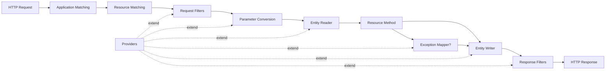
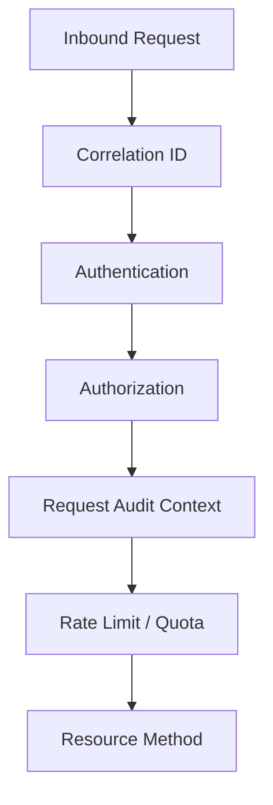
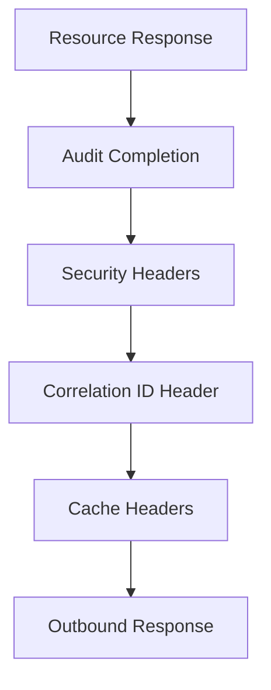
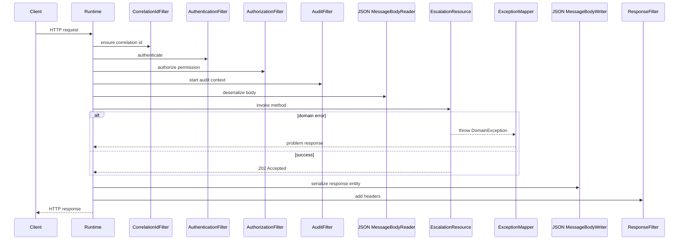

# Part 017 — Provider Model

Provider model adalah cara Jakarta REST memperluas runtime tanpa mengubah resource method. Jika resource class adalah boundary HTTP-to-application, maka provider adalah extension point yang mengontrol perilaku lintas resource: serialization, deserialization, exception mapping, filtering, interception, feature registration, dan context customization.

Engineer yang hanya tahu `@Path`, `@GET`, dan `@POST` bisa membuat endpoint. Engineer yang menguasai provider model bisa membangun API platform yang konsisten, observable, secure, portable, dan mudah dikontrol di banyak resource.

Bagian ini membahas provider sebagai **extension architecture**, bukan sekadar annotation `@Provider`.

---

## 1. Target Kompetensi

Setelah bagian ini, kita harus bisa:

1. Menjelaskan apa itu provider dan mengapa provider bukan sekadar helper class.
2. Membedakan provider standar: entity provider, filter, interceptor, exception mapper, feature, dynamic feature, context resolver, dan param converter.
3. Menentukan kapan provider sebaiknya auto-discovered dan kapan harus explicit registration.
4. Mendesain provider ordering dengan `@Priority` secara deterministik.
5. Menghindari provider conflict antar library, module, dan runtime implementation.
6. Membuat provider yang stateless, thread-safe, portable, dan mudah dites.
7. Menyusun governance provider untuk sistem production, terutama sistem regulated/case-management.

---

## 2. Mental Model: Provider sebagai Runtime Plugin

Jakarta REST runtime memproses request melalui beberapa tahap:



Provider adalah objek yang didaftarkan ke runtime agar runtime bisa memanggilnya pada fase tertentu. Artinya provider tidak dipanggil oleh kode bisnis secara langsung. Provider dipanggil oleh runtime berdasarkan jenis provider, annotation, media type, priority, name binding, dan registration.

Mental model yang berguna:

> Resource method menjawab “apa operasi domain yang terjadi?” Provider menjawab “bagaimana runtime harus memperlakukan request/response di sekitar operasi itu?”

Contoh:

- `MessageBodyReader` menjawab: bagaimana body JSON/XML/binary dibaca menjadi Java object?
- `MessageBodyWriter` menjawab: bagaimana Java object ditulis menjadi HTTP response body?
- `ExceptionMapper` menjawab: bagaimana exception Java dipetakan menjadi response HTTP?
- `ContainerRequestFilter` menjawab: apa yang harus dilakukan sebelum resource method dipanggil?
- `ContainerResponseFilter` menjawab: apa yang harus dilakukan setelah resource menghasilkan response?
- `ReaderInterceptor` menjawab: apakah input stream entity perlu dibungkus/dimodifikasi sebelum deserialization?
- `WriterInterceptor` menjawab: apakah output stream entity perlu dibungkus/dimodifikasi sebelum serialization?
- `ParamConverterProvider` menjawab: bagaimana string URI/header/query dikonversi ke custom Java type?
- `ContextResolver<T>` menjawab: konfigurasi runtime apa yang dipakai untuk tipe tertentu, misalnya JSON-B atau mapper.
- `Feature` menjawab: kumpulan provider/config apa yang harus diregistrasikan bersama.
- `DynamicFeature` menjawab: provider apa yang harus diregistrasikan secara selektif untuk resource method tertentu.

---

## 3. Provider Taxonomy

Provider Jakarta REST dapat dilihat dalam empat kelompok besar.

### 3.1 Entity Providers

Entity providers mengurus body request dan response.

| Provider | Fungsi |
|---|---|
| `MessageBodyReader<T>` | Membaca HTTP entity body menjadi Java object |
| `MessageBodyWriter<T>` | Menulis Java object menjadi HTTP entity body |

Entity provider biasanya dipilih berdasarkan:

- Java type
- Generic type
- Annotation pada parameter/method
- Media type `Content-Type` atau negotiated `Accept`
- Provider priority
- Built-in vs custom provider

Contoh kasus penggunaan:

- Custom CSV request/response
- NDJSON streaming
- Encrypted payload wrapper
- Domain-specific import format
- Strict JSON provider dengan unknown-field policy

### 3.2 Error Providers

Error provider utama adalah `ExceptionMapper<T extends Throwable>`.

Ia mengubah exception menjadi `Response`.

Contoh:

```java
@Provider
public final class DomainExceptionMapper implements ExceptionMapper<DomainException> {

    @Override
    public Response toResponse(DomainException exception) {
        Problem problem = Problem.domain(
            exception.code(),
            exception.safeMessage(),
            exception.correlationId()
        );

        return Response.status(exception.httpStatus())
            .type("application/problem+json")
            .entity(problem)
            .build();
    }
}
```

Error provider adalah bagian dari public API contract. Jangan perlakukan mapper sebagai tempat “membungkus exception seadanya”.

### 3.3 Pipeline Providers

Pipeline providers mengintervensi request/response lifecycle.

| Provider | Level |
|---|---|
| `ContainerRequestFilter` | HTTP request metadata/context |
| `ContainerResponseFilter` | HTTP response metadata/context |
| `ReaderInterceptor` | Entity input stream |
| `WriterInterceptor` | Entity output stream |
| `ClientRequestFilter` | Client outbound request |
| `ClientResponseFilter` | Client inbound response |

Rule praktis:

- Filter cocok untuk header, auth, correlation ID, audit context, cache short-circuit, CORS, security headers.
- Interceptor cocok untuk entity stream: compression, checksum, encryption envelope, stream metering.

Jangan gunakan interceptor untuk logic yang cukup dilakukan di filter. Jangan gunakan filter untuk membaca body kecuali benar-benar paham konsekuensi stream consumption.

### 3.4 Configuration Providers

Configuration providers mengontrol bagaimana provider lain dipasang atau bagaimana runtime mengonfigurasi tipe tertentu.

| Provider | Fungsi |
|---|---|
| `Feature` | Register kumpulan component secara modular |
| `DynamicFeature` | Register provider secara selektif berdasarkan resource/method |
| `ContextResolver<T>` | Resolve konfigurasi untuk type tertentu |
| `ParamConverterProvider` | Custom conversion dari string ke type |

Contoh `Feature`:

```java
public final class ApiPlatformFeature implements Feature {

    @Override
    public boolean configure(FeatureContext context) {
        context.register(CorrelationIdFilter.class);
        context.register(ProblemExceptionMapper.class);
        context.register(JsonbConfigResolver.class);
        context.register(AuditResponseFilter.class);
        return true;
    }
}
```

`Feature` membantu kita membuat provider package yang bisa dipasang sebagai satu modul.

---

## 4. `@Provider`: Annotation Discovery

`@Provider` menandai class sebagai provider yang bisa ditemukan runtime.

Contoh:

```java
@Provider
public final class CorrelationIdFilter implements ContainerRequestFilter {

    @Override
    public void filter(ContainerRequestContext requestContext) {
        String correlationId = requestContext.getHeaderString("X-Correlation-ID");
        if (correlationId == null || correlationId.isBlank()) {
            correlationId = UUID.randomUUID().toString();
        }
        requestContext.setProperty("correlationId", correlationId);
    }
}
```

Tetapi `@Provider` bukan jaminan absolut bahwa provider akan aktif. Aktivasi dipengaruhi oleh application configuration.

Ingat kembali dari Part 004:

- Jika `Application#getClasses()` dan `Application#getSingletons()` kosong, runtime melakukan discovery resource/provider.
- Jika salah satunya non-empty, runtime hanya memakai class/singleton yang explicit registered.

Artinya provider dengan `@Provider` bisa tidak aktif jika aplikasi menggunakan explicit registration dan provider itu tidak diregistrasikan.

Contoh explicit registration:

```java
@ApplicationPath("/api")
public final class CaseApiApplication extends Application {

    @Override
    public Set<Class<?>> getClasses() {
        return Set.of(
            CaseResource.class,
            EvidenceResource.class,
            CorrelationIdFilter.class,
            ProblemExceptionMapper.class,
            JsonbConfigResolver.class
        );
    }
}
```

---

## 5. Discovery vs Explicit Registration

Provider registration adalah keputusan arsitektur, bukan preferensi gaya.

### 5.1 Auto-Discovery

Auto-discovery cocok untuk:

- aplikasi kecil
- prototype
- test fixture
- runtime full Jakarta EE yang dikontrol penuh
- provider internal yang aman ditemukan otomatis

Keuntungan:

- sedikit boilerplate
- developer experience lebih ringan
- cepat untuk iterasi

Risiko:

- provider tak sengaja aktif karena classpath
- ordering conflict lebih sulit dilihat
- sulit diaudit
- hidden behavior saat dependency berubah
- provider dari library bisa mempengaruhi seluruh app

### 5.2 Explicit Registration

Explicit registration cocok untuk:

- production system
- API platform multi-module
- regulated/auditable system
- aplikasi dengan banyak provider
- aplikasi yang perlu runtime portability
- sistem dengan security/audit requirement ketat

Keuntungan:

- provider surface terlihat jelas
- code review lebih mudah
- behavior lebih deterministik
- lebih aman terhadap classpath surprise
- mudah membuat “platform feature” reusable

Trade-off:

- boilerplate lebih banyak
- lupa register provider akan menjadi bug
- perlu governance naming/packaging

### 5.3 Rekomendasi Praktis

Untuk sistem production:

1. Pakai explicit registration di `Application` atau `Feature`.
2. Kelompokkan provider platform dalam satu feature.
3. Pisahkan provider global dan provider resource-specific.
4. Hindari auto-discovery provider dari dependency eksternal tanpa review.
5. Buat integration test yang memverifikasi provider aktif.

Contoh:

```java
@ApplicationPath("/api")
public final class CaseApiApplication extends ResourceConfig {

    public CaseApiApplication() {
        register(CaseResource.class);
        register(EvidenceResource.class);
        register(ApiPlatformFeature.class);
    }
}
```

Catatan: `ResourceConfig` adalah Jersey-specific. Untuk portability strict, extend `Application` dan gunakan standard Jakarta REST APIs. Untuk aplikasi Jersey-only, `ResourceConfig` bisa sangat praktis.

---

## 6. Provider Scope dan Lifecycle

Provider umumnya dibuat dan dikelola oleh runtime. Kita tidak boleh mengasumsikan provider dibuat per request kecuali dokumentasi runtime mengatakan demikian.

Rule aman:

> Anggap provider bersifat singleton-like dan harus thread-safe.

Implikasi:

- Jangan simpan mutable request state di field instance.
- Simpan state request di `ContainerRequestContext#setProperty`, MDC, request-scoped CDI bean, atau context object yang memang request-scoped.
- Dependency injected service harus thread-safe atau request-scoped.
- Cache internal harus concurrent-safe.

Anti-pattern:

```java
@Provider
public final class UnsafeAuditFilter implements ContainerRequestFilter {

    private String currentUserId; // BUG: shared between requests

    @Override
    public void filter(ContainerRequestContext requestContext) {
        this.currentUserId = requestContext.getHeaderString("X-User-ID");
    }
}
```

Lebih aman:

```java
@Provider
public final class AuditContextFilter implements ContainerRequestFilter {

    @Override
    public void filter(ContainerRequestContext requestContext) {
        String userId = requestContext.getHeaderString("X-User-ID");
        requestContext.setProperty("audit.userId", userId);
    }
}
```

---

## 7. Provider Ordering dengan `@Priority`

Provider bisa punya urutan eksekusi. Jakarta REST menggunakan konsep priority. Angka lebih kecil berarti dieksekusi lebih awal untuk fase request. Untuk response, urutan bisa terasa kebalik tergantung jenis chain karena response berjalan keluar dari pipeline.

Gunakan `jakarta.annotation.Priority`.

```java
@Provider
@Priority(Priorities.AUTHENTICATION)
public final class AuthenticationFilter implements ContainerRequestFilter {
    @Override
    public void filter(ContainerRequestContext requestContext) {
        // authenticate request
    }
}
```

Konstanta umum ada di `jakarta.ws.rs.Priorities`, misalnya:

- `AUTHENTICATION`
- `AUTHORIZATION`
- `HEADER_DECORATOR`
- `ENTITY_CODER`
- `USER`

Jangan asal memberi angka magic seperti `@Priority(1234)` tanpa alasan.

### 7.1 Ordering yang Masuk Akal

Contoh urutan request filter:



Contoh urutan response filter:



Prinsip:

- Correlation ID sebaiknya paling awal agar semua log memilikinya.
- Authentication harus sebelum authorization.
- Authorization harus sebelum resource method.
- Audit context harus tahu user/result/status.
- Security headers sebaiknya selalu ditambahkan bahkan pada error response.
- Compression/encryption stream harus dekat dengan entity writer.

---

## 8. Name Binding: Provider Selektif Berdasarkan Annotation

Tidak semua provider harus global.

Name binding memungkinkan provider diterapkan hanya pada resource/method yang diberi annotation tertentu.

Contoh annotation:

```java
@NameBinding
@Retention(RetentionPolicy.RUNTIME)
@Target({ElementType.TYPE, ElementType.METHOD})
public @interface Audited {
}
```

Provider:

```java
@Provider
@Audited
public final class AuditFilter implements ContainerRequestFilter, ContainerResponseFilter {

    @Override
    public void filter(ContainerRequestContext requestContext) {
        requestContext.setProperty("audit.startNanos", System.nanoTime());
    }

    @Override
    public void filter(
        ContainerRequestContext requestContext,
        ContainerResponseContext responseContext
    ) {
        Object start = requestContext.getProperty("audit.startNanos");
        // write audit event
    }
}
```

Resource:

```java
@Path("/cases/{caseId}/decisions")
public final class CaseDecisionResource {

    @POST
    @Audited
    public Response recordDecision(@PathParam("caseId") CaseId caseId,
                                   DecisionRequest request) {
        // ...
        return Response.status(Response.Status.CREATED).build();
    }
}
```

Name binding cocok untuk:

- audit hanya pada mutation endpoint
- elevated authorization pada endpoint tertentu
- response signing untuk endpoint tertentu
- tenant enforcement hanya pada resource tenant-aware
- deprecation warning hanya pada endpoint legacy

Hindari name binding berlebihan sampai sulit memahami provider mana aktif. Untuk hal yang harus konsisten di seluruh API, gunakan provider global.

---

## 9. DynamicFeature: Registration Berdasarkan ResourceInfo

`DynamicFeature` lebih powerful daripada name binding. Ia bisa membaca resource class/method dan mendaftarkan provider secara programatik.

Contoh:

```java
@Provider
public final class AuditedDynamicFeature implements DynamicFeature {

    @Override
    public void configure(ResourceInfo resourceInfo, FeatureContext context) {
        Method method = resourceInfo.getResourceMethod();
        boolean audited = method.isAnnotationPresent(Audited.class)
            || resourceInfo.getResourceClass().isAnnotationPresent(Audited.class);

        if (audited) {
            context.register(AuditFilter.class);
        }
    }
}
```

Dynamic feature cocok ketika:

- provider perlu dikonfigurasi berdasarkan annotation custom
- provider butuh parameter dari annotation
- runtime registration lebih kompleks daripada `@NameBinding`
- kita ingin membuat platform extension yang reusable

Contoh annotation dengan parameter:

```java
@Retention(RetentionPolicy.RUNTIME)
@Target({ElementType.TYPE, ElementType.METHOD})
public @interface RequiresPermission {
    String value();
}
```

Dynamic feature bisa membaca value permission dan membuat filter instance dengan permission tertentu.

Namun hati-hati: provider instance dengan konfigurasi per method harus tetap thread-safe dan tidak mencampur state antar endpoint.

---

## 10. Feature: Provider Bundle untuk Platform Module

`Feature` adalah cara clean untuk membungkus registration.

```java
public final class CaseApiPlatformFeature implements Feature {

    @Override
    public boolean configure(FeatureContext context) {
        context.register(CorrelationIdFilter.class, Priorities.AUTHENTICATION - 100);
        context.register(AuthenticationFilter.class, Priorities.AUTHENTICATION);
        context.register(AuthorizationFilter.class, Priorities.AUTHORIZATION);
        context.register(ProblemExceptionMapper.class);
        context.register(ValidationExceptionMapper.class);
        context.register(JsonbConfigResolver.class);
        context.register(AuditDynamicFeature.class);
        return true;
    }
}
```

Lalu di application:

```java
@ApplicationPath("/api")
public final class CaseApiApplication extends Application {

    @Override
    public Set<Class<?>> getClasses() {
        return Set.of(
            CaseResource.class,
            EvidenceResource.class,
            CaseApiPlatformFeature.class
        );
    }
}
```

Keuntungan:

- provider platform mudah dipasang
- registration terpusat
- review lebih sederhana
- bisa dipakai lintas service
- memberi boundary antara app-specific resource dan platform-level concerns

Risiko:

- feature terlalu gemuk menjadi “magic platform”
- hidden provider registration jika tidak didokumentasikan
- sulit override jika semua digabung tanpa extension point

Rekomendasi:

- Pisahkan `SecurityFeature`, `ObservabilityFeature`, `JsonFeature`, `ErrorHandlingFeature`, jika system besar.
- Buat README/provider manifest.
- Integration test harus membuktikan feature benar-benar aktif.

---

## 11. ContextResolver

`ContextResolver<T>` menyediakan object konfigurasi untuk runtime/provider tertentu.

Use case umum: konfigurasi JSON-B.

```java
@Provider
@Produces(MediaType.APPLICATION_JSON)
public final class JsonbResolver implements ContextResolver<Jsonb> {

    private final Jsonb jsonb;

    public JsonbResolver() {
        JsonbConfig config = new JsonbConfig()
            .withNullValues(false)
            .withDateFormat("yyyy-MM-dd'T'HH:mm:ssXXX", Locale.ROOT);
        this.jsonb = JsonbBuilder.create(config);
    }

    @Override
    public Jsonb getContext(Class<?> type) {
        return jsonb;
    }
}
```

Context resolver harus dianggap global. Jangan membuat konfigurasi berbeda-beda secara tidak eksplisit karena consumer API akan melihat response yang tidak konsisten.

Checklist JSON resolver:

- date/time format eksplisit
- unknown field policy jelas
- null policy jelas
- enum policy jelas
- numeric precision jelas
- error DTO juga mengikuti konfigurasi yang sama
- test snapshot untuk response JSON utama

---

## 12. ParamConverterProvider

`ParamConverterProvider` mengubah string dari URI/header/query menjadi custom type.

Contoh custom type:

```java
public record CaseId(String value) {
    public CaseId {
        if (value == null || !value.matches("CASE-[0-9]{8}")) {
            throw new IllegalArgumentException("Invalid case id");
        }
    }
}
```

Converter:

```java
@Provider
public final class CaseIdParamConverterProvider implements ParamConverterProvider {

    @Override
    @SuppressWarnings("unchecked")
    public <T> ParamConverter<T> getConverter(
        Class<T> rawType,
        Type genericType,
        Annotation[] annotations
    ) {
        if (!rawType.equals(CaseId.class)) {
            return null;
        }

        return (ParamConverter<T>) new ParamConverter<CaseId>() {
            @Override
            public CaseId fromString(String value) {
                return new CaseId(value);
            }

            @Override
            public String toString(CaseId value) {
                return value.value();
            }
        };
    }
}
```

Resource:

```java
@GET
@Path("/cases/{caseId}")
public CaseResponse getCase(@PathParam("caseId") CaseId caseId) {
    // type-safe id
}
```

Kapan cocok:

- domain identifier
- tenant id
- cursor token
- period/date range
- sort expression
- custom enum parsing

Kapan tidak cocok:

- parsing body JSON kompleks
- validasi domain yang butuh database
- authorization
- transformation yang menghasilkan side effect

Converter harus cepat, deterministic, dan tanpa I/O.

---

## 13. ExceptionMapper Conflict dan Resolution

Multiple `ExceptionMapper` bisa cocok untuk exception yang sama melalui inheritance.

Contoh:

```java
@Provider
public final class ThrowableMapper implements ExceptionMapper<Throwable> { ... }

@Provider
public final class RuntimeExceptionMapper implements ExceptionMapper<RuntimeException> { ... }

@Provider
public final class DomainExceptionMapper implements ExceptionMapper<DomainException> { ... }
```

Jika `DomainException extends RuntimeException`, mapper paling spesifik harus menang.

Prinsip desain:

- Buat mapper spesifik untuk domain exception utama.
- Buat mapper spesifik untuk validation/security/dependency exception.
- Buat fallback mapper untuk `Throwable`, tetapi jangan terlalu banyak logic di sana.
- Jangan expose stack trace.
- Jangan ubah semua exception menjadi `500` tanpa taxonomy.

Anti-pattern:

```java
@Provider
public final class CatchAllMapper implements ExceptionMapper<Exception> {
    @Override
    public Response toResponse(Exception exception) {
        return Response.ok(new ErrorDto(exception.getMessage())).build(); // BUG
    }
}
```

Masalah:

- exception menjadi `200 OK`
- internal message bocor
- observability buruk
- consumer tidak bisa membedakan failure
- audit defensibility rendah

Lebih baik:

```java
@Provider
public final class FallbackExceptionMapper implements ExceptionMapper<Throwable> {

    @Override
    public Response toResponse(Throwable exception) {
        String correlationId = Correlation.currentId();
        // log exception with stack trace internally

        return Response.serverError()
            .type("application/problem+json")
            .entity(Problem.internalError(correlationId))
            .build();
    }
}
```

---

## 14. Entity Provider Conflict

Entity provider conflict sering terjadi ketika:

- JSON-B dan Jackson sama-sama tersedia
- runtime punya built-in provider
- library menambahkan provider otomatis
- custom provider terlalu broad
- media type `*/*` dipakai sembarangan

Contoh provider terlalu broad:

```java
@Provider
@Consumes("*/*")
public final class DangerousReader implements MessageBodyReader<Object> {
    // too broad
}
```

Risiko:

- mengambil alih provider JSON default
- behavior berubah saat classpath berubah
- error negotiation sulit didiagnosis
- resource unrelated ikut terdampak

Rekomendasi:

- Buat provider sespesifik mungkin pada type dan media type.
- Hindari `Object` kecuali benar-benar framework-level provider.
- Hindari `*/*` untuk custom reader/writer.
- Tulis test untuk memastikan provider yang diharapkan dipakai.
- Log registration provider di startup jika runtime mendukung.

---

## 15. Provider dan CDI

Dalam Jakarta EE runtime, provider sering bisa memakai CDI injection. Namun jangan menganggap semua runtime standalone memiliki integrasi CDI yang sama.

Contoh:

```java
@Provider
public final class AuthorizationFilter implements ContainerRequestFilter {

    @Inject
    PermissionService permissionService;

    @Override
    public void filter(ContainerRequestContext requestContext) {
        // use permissionService
    }
}
```

Pertanyaan penting:

1. Apakah provider dikelola CDI atau hanya JAX-RS runtime?
2. Apakah dependency injected thread-safe?
3. Apakah scope dependency sesuai request?
4. Apakah lifecycle provider jelas pada runtime target?
5. Bagaimana test provider dilakukan tanpa container penuh?

Untuk portability, buat constructor dan logic yang mudah dites:

```java
@Provider
public final class AuthorizationFilter implements ContainerRequestFilter {

    private final PermissionService permissionService;

    @Inject
    public AuthorizationFilter(PermissionService permissionService) {
        this.permissionService = permissionService;
    }

    @Override
    public void filter(ContainerRequestContext requestContext) {
        // logic
    }
}
```

---

## 16. Provider sebagai Governance Boundary

Di sistem production, provider model bisa menjadi alat governance API.

Contoh provider global:

- correlation ID filter
- authentication filter
- security headers filter
- problem details exception mapper
- validation exception mapper
- JSON config resolver
- audit dynamic feature
- request metrics filter
- deprecation header filter
- trace propagation filter

Dengan provider, kita bisa memastikan policy berlaku tanpa menulis ulang di setiap resource.

Namun provider juga bisa menjadi sumber magic. Karena itu perlu provider manifest.

Contoh manifest:

| Provider | Scope | Priority | Purpose | Owner |
|---|---:|---:|---|---|
| `CorrelationIdFilter` | Global | 900 | Attach correlation ID | Platform |
| `AuthenticationFilter` | Global | 1000 | Authenticate token | Security |
| `AuthorizationFilter` | Dynamic | 2000 | Enforce permission annotation | Security |
| `ProblemExceptionMapper` | Global | n/a | Error contract | Platform |
| `AuditFilter` | Name-bound | 5000 | Mutation audit | Compliance |
| `JsonbResolver` | Global JSON | n/a | JSON policy | API Platform |

Provider tanpa owner akan menjadi technical debt.

---

## 17. Testing Provider

Provider harus dites di tiga level.

### 17.1 Unit Test Pure Logic

Ekstrak logic ke class biasa.

```java
public final class CorrelationIdPolicy {
    public String resolve(String incoming) {
        if (incoming == null || incoming.isBlank()) {
            return UUID.randomUUID().toString();
        }
        return incoming;
    }
}
```

Provider hanya adapter:

```java
@Provider
public final class CorrelationIdFilter implements ContainerRequestFilter {

    private final CorrelationIdPolicy policy;

    public CorrelationIdFilter(CorrelationIdPolicy policy) {
        this.policy = policy;
    }

    @Override
    public void filter(ContainerRequestContext context) {
        context.setProperty("correlationId", policy.resolve(context.getHeaderString("X-Correlation-ID")));
    }
}
```

### 17.2 Provider Integration Test

Test dengan runtime in-memory/container ringan:

- provider aktif
- order benar
- header/result benar
- exception mapping benar
- JSON policy benar

### 17.3 Contract Test

Test output yang dilihat consumer:

- error shape
- header required
- media type
- status code
- correlation ID
- audit/deprecation headers

Provider bug sering muncul sebagai contract regression, bukan unit failure.

---

## 18. Anti-Patterns

### 18.1 Provider dengan Mutable Field per Request

Provider harus thread-safe. Jangan simpan request state di field.

### 18.2 Catch-All Provider yang Mengubah Semua Behavior

Provider terlalu broad akan membuat runtime sulit diprediksi.

### 18.3 Provider Berisi Business Logic

Provider bukan tempat domain workflow.

Salah:

```java
@Provider
public final class EscalationFilter implements ContainerRequestFilter {
    // decides case escalation state transition
}
```

Benar:

- filter mengambil identity/context
- resource memanggil application service
- application service menjalankan domain workflow

### 18.4 Silent Provider Registration

Library internal yang auto-register provider tanpa dokumentasi bisa mengubah behavior aplikasi tanpa review.

### 18.5 Overusing DynamicFeature

Jika semua provider dipasang melalui dynamic feature kompleks, developer sulit memprediksi pipeline.

### 18.6 Runtime-Specific Leakage

Contoh:

- resource bergantung pada Jersey-specific context
- provider memakai RESTEasy internal API
- test hanya lulus pada satu implementation

Boleh memakai implementation-specific API jika sengaja, tetapi tandai boundary-nya.

---

## 19. Provider Design Checklist

Gunakan checklist ini sebelum menambahkan provider baru.

### 19.1 Scope

- Apakah provider global, name-bound, atau dynamic?
- Apakah provider harus aktif untuk error response?
- Apakah provider berlaku di server, client, atau keduanya?

### 19.2 Ordering

- Apakah priority eksplisit?
- Apakah bergantung pada provider lain?
- Apakah order response chain sudah diuji?

### 19.3 State

- Apakah provider stateless?
- Jika menyimpan state, apakah concurrent-safe?
- Apakah request state disimpan di context yang benar?

### 19.4 Contract

- Apakah provider mengubah public API behavior?
- Apakah status/header/body berubah?
- Apakah perubahan didokumentasikan?

### 19.5 Failure

- Apa yang terjadi jika provider gagal?
- Apakah exception provider menghasilkan response aman?
- Apakah provider bisa menyebabkan recursive error mapping?

### 19.6 Portability

- Apakah memakai API standar Jakarta REST?
- Jika memakai runtime-specific API, apakah terisolasi?
- Apakah ada test pada runtime target?

### 19.7 Observability

- Apakah provider menambahkan log/metric/trace yang berguna?
- Apakah tidak membocorkan sensitive data?
- Apakah correlation ID tersedia?

---

## 20. Case Management Example: Provider Stack

Misal kita membangun API enforcement case-management.

Endpoint:

```http
POST /api/cases/CASE-20260001/escalations
Content-Type: application/json
Accept: application/problem+json, application/json
X-Correlation-ID: c-123
Authorization: Bearer ...
```

Provider stack:



Key governance points:

- correlation ID harus ada sebelum auth log
- auth failure tetap mengembalikan problem shape
- audit tidak boleh mencatat raw evidence payload sensitif
- authorization harus terjadi sebelum mutation
- exception mapper harus membedakan validation, domain conflict, dependency outage, dan internal error
- response filter harus menambahkan security headers pada success dan failure

---

## 21. Production Heuristics

Provider model sebaiknya dipakai untuk hal yang:

1. berlaku lintas banyak resource,
2. berhubungan dengan runtime/protocol concern,
3. membutuhkan konsistensi platform,
4. bisa diuji sebagai pipeline behavior,
5. tidak membutuhkan domain transaction ownership.

Jangan pakai provider untuk:

1. domain workflow,
2. persistence transaction orchestration,
3. business rule branching,
4. command handling,
5. long-running job coordination.

Boundary yang baik:

```txt
Provider       : protocol/platform concern
Resource       : HTTP operation boundary
Application svc: use case orchestration
Domain         : business invariant
Repository     : persistence abstraction
```

---

## 22. Summary

Provider adalah extension architecture Jakarta REST. Dengan provider, kita mengontrol serialization, error contract, filtering, interception, parameter conversion, context configuration, dan modular registration.

Hal paling penting:

- Provider dipanggil runtime, bukan resource secara manual.
- `@Provider` hanya menandai class; registration tetap tergantung application configuration.
- Production system sebaiknya memakai explicit registration atau feature-based registration.
- Provider harus stateless/thread-safe.
- `@Priority`, name binding, dan `DynamicFeature` harus dipakai secara sengaja.
- Provider terlalu broad bisa merusak behavior seluruh API.
- Provider adalah tempat ideal untuk policy lintas resource, bukan business workflow.

Di part berikutnya, kita akan masuk lebih dalam ke filter dan interceptor pipeline sebagai provider yang paling sering dipakai untuk cross-cutting concerns.

---

## References

- Jakarta RESTful Web Services 4.0 Specification: https://jakarta.ee/specifications/restful-ws/4.0/jakarta-restful-ws-spec-4.0
- Jakarta RESTful Web Services 4.0 API Docs: https://jakarta.ee/specifications/restful-ws/4.0/apidocs/
- Jakarta RESTful Web Services 4.0 Release Page: https://jakarta.ee/specifications/restful-ws/4.0/
