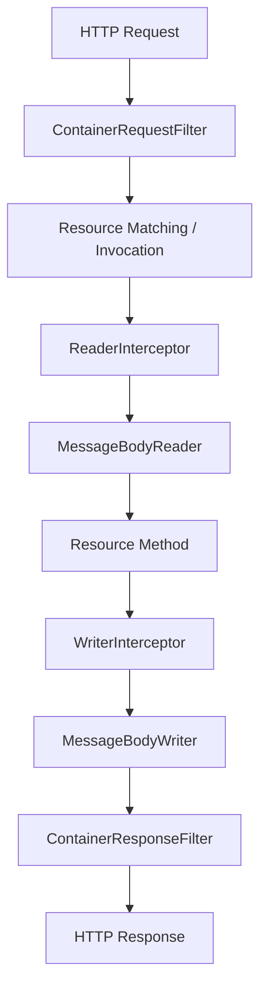
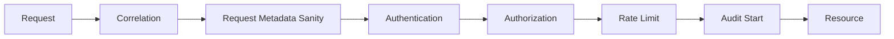
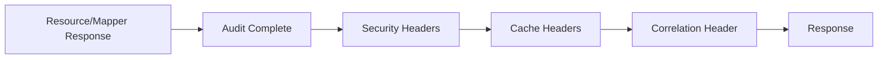
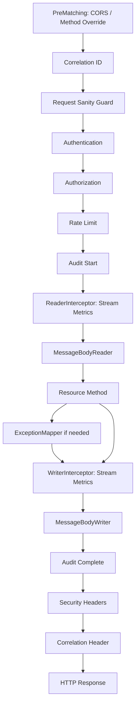

# Part 018 — Filters and Interceptors

Filter dan interceptor adalah provider yang paling sering dipakai untuk cross-cutting concerns. Ia berada di jalur request/response sehingga sangat powerful, tetapi juga berisiko tinggi. Filter yang salah bisa mematikan security, membocorkan data sensitif, merusak content negotiation, mengonsumsi stream body sebelum waktunya, atau membuat latency memburuk di seluruh API.

Bagian ini membahas filter dan interceptor sebagai **pipeline architecture**.

---

## 1. Target Kompetensi

Setelah bagian ini, kita harus bisa:

1. Membedakan filter dan interceptor secara teknis dan arsitektural.
2. Menjelaskan kapan request filter berjalan pre-match dan post-match.
3. Mendesain urutan filter dengan `@Priority`.
4. Menggunakan `abortWith` secara benar untuk auth, cache, validation precondition, atau maintenance mode.
5. Menerapkan name-bound filter untuk audit/security tertentu.
6. Menggunakan reader/writer interceptor untuk entity stream, bukan sekadar header metadata.
7. Menghindari logging body yang berbahaya dan memory-heavy.
8. Membuat pipeline yang observable, secure, dan portable.

---

## 2. Mental Model: Metadata Pipeline vs Entity Stream Pipeline

Filter dan interceptor sama-sama “mengintersepsi”, tetapi bekerja di layer berbeda.



Simplifikasi:

| Mechanism | Layer | Biasanya untuk |
|---|---|---|
| `ContainerRequestFilter` | Request metadata/context | auth, correlation ID, CORS preflight, rate limit, request audit start |
| `ContainerResponseFilter` | Response metadata/context | security headers, correlation ID header, cache headers, audit completion |
| `ReaderInterceptor` | Input entity stream | decompression, checksum, stream metering, decrypt envelope |
| `WriterInterceptor` | Output entity stream | compression, signing, checksum, stream metering |

Rule praktis:

> Jika concern bisa diselesaikan dengan header/context/status, gunakan filter. Jika concern harus membungkus `InputStream` atau `OutputStream`, gunakan interceptor.

---

## 3. Server-Side Filter Types

### 3.1 `ContainerRequestFilter`

Request filter berjalan sebelum resource method. Ia menerima `ContainerRequestContext`.

```java
@Provider
public final class CorrelationIdRequestFilter implements ContainerRequestFilter {

    @Override
    public void filter(ContainerRequestContext requestContext) {
        String incoming = requestContext.getHeaderString("X-Correlation-ID");
        String correlationId = incoming == null || incoming.isBlank()
            ? UUID.randomUUID().toString()
            : incoming;

        requestContext.setProperty("correlationId", correlationId);
    }
}
```

`ContainerRequestContext` memberi akses ke:

- HTTP method
- URI info
- headers
- cookies
- media type
- acceptable media types
- security context
- entity stream
- request properties
- abort response

### 3.2 `ContainerResponseFilter`

Response filter berjalan setelah resource method atau exception mapper menghasilkan response.

```java
@Provider
public final class CorrelationIdResponseFilter implements ContainerResponseFilter {

    @Override
    public void filter(
        ContainerRequestContext requestContext,
        ContainerResponseContext responseContext
    ) {
        Object correlationId = requestContext.getProperty("correlationId");
        if (correlationId != null) {
            responseContext.getHeaders().putSingle("X-Correlation-ID", correlationId.toString());
        }
    }
}
```

`ContainerResponseContext` memberi akses ke:

- status code
- headers
- media type
- entity
- entity annotations
- entity stream indirectly through writer interceptor, not here

Response filter ideal untuk response metadata. Jangan melakukan serialization manual di response filter.

---

## 4. Pre-Matching vs Post-Matching Request Filter

Secara default, request filter berjalan setelah resource matching. Ini disebut post-match filter.

Pre-matching filter diberi `@PreMatching` dan berjalan sebelum runtime memilih resource method.

```java
@Provider
@PreMatching
public final class MethodOverrideFilter implements ContainerRequestFilter {

    @Override
    public void filter(ContainerRequestContext requestContext) {
        String override = requestContext.getHeaderString("X-HTTP-Method-Override");
        if ("PATCH".equalsIgnoreCase(override)) {
            requestContext.setMethod("PATCH");
        }
    }
}
```

Pre-matching filter bisa mengubah input matching, misalnya:

- method override
- normalize path
- content negotiation workaround legacy
- reject request sangat awal
- CORS preflight short-circuit

Tetapi pre-matching filter berbahaya jika disalahgunakan karena ia berjalan sebelum resource diketahui.

Gunakan pre-matching hanya jika filter harus mempengaruhi matching atau short-circuit sebelum matching.

Contoh yang **tidak** sebaiknya pre-matching:

- authorization berbasis annotation resource method
- audit yang butuh resource method info
- validation yang bergantung pada DTO
- permission check berbasis domain action

---

## 5. `abortWith`: Short-Circuit Pipeline

Request filter bisa menghentikan request sebelum resource method dengan `abortWith(Response)`.

Contoh authentication failure:

```java
@Provider
@Priority(Priorities.AUTHENTICATION)
public final class AuthenticationFilter implements ContainerRequestFilter {

    @Override
    public void filter(ContainerRequestContext requestContext) {
        String authorization = requestContext.getHeaderString(HttpHeaders.AUTHORIZATION);

        if (authorization == null || !authorization.startsWith("Bearer ")) {
            Problem problem = Problem.unauthorized("Missing bearer token");
            requestContext.abortWith(
                Response.status(Response.Status.UNAUTHORIZED)
                    .type("application/problem+json")
                    .entity(problem)
                    .header(HttpHeaders.WWW_AUTHENTICATE, "Bearer")
                    .build()
            );
        }
    }
}
```

Use cases legitimate:

- authentication failure
- authorization failure
- CORS preflight response
- rate limit exceeded
- maintenance mode
- cached response
- request too large detected from headers
- missing required platform header

Anti-pattern:

- melakukan business decision final di filter
- query database kompleks untuk workflow branching
- membuat resource method tidak pernah menjalankan use case tanpa terlihat jelas
- return `200` dari filter untuk menyembunyikan error

---

## 6. Ordering dengan `@Priority`

Filter order harus disengaja. Jika tidak, behavior bisa berubah karena classpath/registration.

Contoh:

```java
@Provider
@Priority(Priorities.AUTHENTICATION - 100)
public final class CorrelationIdFilter implements ContainerRequestFilter {
    // must run before auth logs
}

@Provider
@Priority(Priorities.AUTHENTICATION)
public final class AuthenticationFilter implements ContainerRequestFilter {
    // authenticate principal
}

@Provider
@Priority(Priorities.AUTHORIZATION)
public final class AuthorizationFilter implements ContainerRequestFilter {
    // authorize principal
}
```

Urutan request yang sehat:



Urutan response yang sehat:



Catatan penting: response pipeline dapat memiliki urutan yang terasa berbeda dari request pipeline. Jangan hanya mengandalkan intuisi; tulis integration test untuk order jika order penting.

---

## 7. Name-Bound Filters

Name binding membuat filter hanya berlaku pada resource/method tertentu.

Annotation:

```java
@NameBinding
@Retention(RetentionPolicy.RUNTIME)
@Target({ElementType.TYPE, ElementType.METHOD})
public @interface RequiresAudit {
}
```

Filter:

```java
@Provider
@RequiresAudit
public final class AuditFilter implements ContainerRequestFilter, ContainerResponseFilter {

    @Override
    public void filter(ContainerRequestContext requestContext) {
        requestContext.setProperty("audit.start", Instant.now());
    }

    @Override
    public void filter(ContainerRequestContext requestContext,
                       ContainerResponseContext responseContext) {
        Instant start = (Instant) requestContext.getProperty("audit.start");
        int status = responseContext.getStatus();
        // write audit event
    }
}
```

Resource:

```java
@Path("/cases/{caseId}/state-transitions")
public final class CaseStateTransitionResource {

    @POST
    @RequiresAudit
    public Response transition(@PathParam("caseId") CaseId caseId,
                               TransitionRequest request) {
        // application service call
        return Response.accepted().build();
    }
}
```

Cocok untuk:

- audit mutation endpoint
- permission annotation
- response signing
- deprecation warning
- sensitive resource logging suppression
- endpoint-specific rate limit

Tidak cocok untuk:

- correlation ID global
- security headers global
- general error mapping
- JSON config global

---

## 8. Authorization Filter dengan ResourceInfo

Authorization sering butuh mengetahui annotation resource method. Gunakan `@Context ResourceInfo`.

```java
@NameBinding
@Retention(RetentionPolicy.RUNTIME)
@Target({ElementType.TYPE, ElementType.METHOD})
public @interface RequiresPermission {
    String value();
}
```

```java
@Provider
@RequiresPermission("")
@Priority(Priorities.AUTHORIZATION)
public final class PermissionFilter implements ContainerRequestFilter {

    @Context
    ResourceInfo resourceInfo;

    @Inject
    PermissionService permissionService;

    @Override
    public void filter(ContainerRequestContext requestContext) {
        RequiresPermission annotation = findPermissionAnnotation(resourceInfo);
        if (annotation == null) {
            return;
        }

        Principal principal = requestContext.getSecurityContext().getUserPrincipal();
        if (!permissionService.hasPermission(principal, annotation.value())) {
            requestContext.abortWith(
                Response.status(Response.Status.FORBIDDEN)
                    .type("application/problem+json")
                    .entity(Problem.forbidden("Insufficient permission"))
                    .build()
            );
        }
    }

    private RequiresPermission findPermissionAnnotation(ResourceInfo resourceInfo) {
        RequiresPermission methodAnnotation = resourceInfo.getResourceMethod()
            .getAnnotation(RequiresPermission.class);
        if (methodAnnotation != null) {
            return methodAnnotation;
        }
        return resourceInfo.getResourceClass().getAnnotation(RequiresPermission.class);
    }
}
```

Catatan: annotation `@RequiresPermission("")` pada provider di atas hanya untuk mengilustrasikan name-binding; dalam desain yang lebih bersih, gunakan `DynamicFeature` untuk membaca annotation berparameter dan register filter instance yang tepat.

---

## 9. CORS Filter

CORS sering diimplementasikan sebagai filter, tetapi harus hati-hati. Jangan membuka CORS secara wildcard untuk endpoint credential-sensitive.

Preflight request:

```java
@Provider
@PreMatching
@Priority(Priorities.HEADER_DECORATOR)
public final class CorsPreflightFilter implements ContainerRequestFilter {

    private static final Set<String> ALLOWED_ORIGINS = Set.of(
        "https://app.example.com",
        "https://admin.example.com"
    );

    @Override
    public void filter(ContainerRequestContext requestContext) {
        if (!"OPTIONS".equalsIgnoreCase(requestContext.getMethod())) {
            return;
        }

        String origin = requestContext.getHeaderString("Origin");
        String requestedMethod = requestContext.getHeaderString("Access-Control-Request-Method");

        if (origin == null || requestedMethod == null || !ALLOWED_ORIGINS.contains(origin)) {
            return;
        }

        requestContext.abortWith(
            Response.noContent()
                .header("Access-Control-Allow-Origin", origin)
                .header("Access-Control-Allow-Methods", "GET,POST,PUT,PATCH,DELETE,OPTIONS")
                .header("Access-Control-Allow-Headers", "Authorization,Content-Type,X-Correlation-ID")
                .header("Access-Control-Max-Age", "600")
                .header("Vary", "Origin")
                .build()
        );
    }
}
```

Response CORS header:

```java
@Provider
public final class CorsResponseFilter implements ContainerResponseFilter {

    @Override
    public void filter(ContainerRequestContext requestContext,
                       ContainerResponseContext responseContext) {
        String origin = requestContext.getHeaderString("Origin");
        if (origin != null && isAllowed(origin)) {
            responseContext.getHeaders().putSingle("Access-Control-Allow-Origin", origin);
            responseContext.getHeaders().add("Vary", "Origin");
        }
    }

    private boolean isAllowed(String origin) {
        return origin.equals("https://app.example.com")
            || origin.equals("https://admin.example.com");
    }
}
```

Production checklist:

- do not use `*` with credentials
- add `Vary: Origin`
- keep allowed origins config-driven
- distinguish public API and browser-facing API
- test preflight and actual requests

---

## 10. Security Headers Filter

Security headers cocok di response filter.

```java
@Provider
public final class SecurityHeadersFilter implements ContainerResponseFilter {

    @Override
    public void filter(ContainerRequestContext requestContext,
                       ContainerResponseContext responseContext) {
        responseContext.getHeaders().putSingle("X-Content-Type-Options", "nosniff");
        responseContext.getHeaders().putSingle("Referrer-Policy", "no-referrer");
        responseContext.getHeaders().putSingle("X-Frame-Options", "DENY");
        responseContext.getHeaders().putSingle("Cache-Control", "no-store");
    }
}
```

Catatan:

- `Cache-Control: no-store` tidak selalu benar untuk semua endpoint. Public GET endpoint bisa cacheable.
- Jangan menambahkan header global yang bertentangan dengan caching strategy endpoint.
- Untuk API murni JSON, beberapa browser security headers tetap berguna jika API dipanggil dari browser context.

Desain lebih baik:

- default security headers global
- cache header dikontrol oleh resource/response policy
- endpoint public cacheable diberi exception eksplisit

---

## 11. Request/Response Logging Filter

Logging filter adalah area paling sering disalahgunakan.

Yang aman dilog secara default:

- correlation ID
- method
- normalized path template jika tersedia
- status
- latency
- user/tenant id yang sudah dinormalisasi
- request size jika tersedia
- response size jika tersedia
- remote address jika trusted source jelas

Yang tidak aman dilog secara default:

- authorization token
- cookie
- raw body
- password/token/secret
- evidence documents
- personal data tanpa masking
- full query string jika berisi sensitive data

Contoh minimal:

```java
@Provider
public final class AccessLogFilter implements ContainerRequestFilter, ContainerResponseFilter {

    @Override
    public void filter(ContainerRequestContext requestContext) {
        requestContext.setProperty("access.startNanos", System.nanoTime());
    }

    @Override
    public void filter(ContainerRequestContext requestContext,
                       ContainerResponseContext responseContext) {
        long start = (long) requestContext.getProperty("access.startNanos");
        long elapsedMillis = TimeUnit.NANOSECONDS.toMillis(System.nanoTime() - start);

        String method = requestContext.getMethod();
        String path = requestContext.getUriInfo().getPath();
        int status = responseContext.getStatus();
        Object correlationId = requestContext.getProperty("correlationId");

        // Use structured logger in real code
        System.out.printf(
            "method=%s path=%s status=%d elapsedMs=%d correlationId=%s%n",
            method, path, status, elapsedMillis, correlationId
        );
    }
}
```

Untuk production, gunakan structured logging, bukan `System.out`.

---

## 12. Body Logging: Almost Always a Trap

Untuk membaca body di filter, kita harus mengonsumsi entity stream. Jika stream tidak dikembalikan, `MessageBodyReader` tidak bisa membaca body.

Contoh berbahaya:

```java
@Provider
public final class DangerousBodyLoggingFilter implements ContainerRequestFilter {

    @Override
    public void filter(ContainerRequestContext requestContext) throws IOException {
        String body = new String(requestContext.getEntityStream().readAllBytes(), StandardCharsets.UTF_8);
        // BUG: body consumed, memory risk, sensitive data risk
    }
}
```

Jika benar-benar harus inspect body:

- batasi ukuran maksimum
- buffer secara eksplisit
- restore stream dengan `setEntityStream`
- mask sensitive data
- hanya aktif di environment tertentu
- jangan untuk file upload/multipart besar
- jangan untuk evidence payload

Contoh lebih aman tetapi tetap harus hati-hati:

```java
@Provider
public final class LimitedBodyCaptureFilter implements ContainerRequestFilter {

    private static final int MAX_CAPTURE_BYTES = 4096;

    @Override
    public void filter(ContainerRequestContext requestContext) throws IOException {
        InputStream original = requestContext.getEntityStream();
        byte[] captured = original.readNBytes(MAX_CAPTURE_BYTES + 1);

        if (captured.length > MAX_CAPTURE_BYTES) {
            // Do not log full body. Restore only captured prefix + remaining stream is non-trivial.
            // In production, prefer a bounded tee stream implementation.
        }

        requestContext.setEntityStream(new ByteArrayInputStream(captured));
    }
}
```

Masalah contoh di atas: jika body lebih besar dari capture limit, sisa stream sudah tidak sederhana untuk dikembalikan. Implementasi production perlu tee/buffering strategy yang benar. Karena itu body logging sebaiknya dihindari atau dilakukan di layer gateway yang punya dukungan aman.

---

## 13. ReaderInterceptor

`ReaderInterceptor` membungkus proses membaca entity.

```java
@Provider
public final class InputChecksumInterceptor implements ReaderInterceptor {

    @Override
    public Object aroundReadFrom(ReaderInterceptorContext context) throws IOException {
        InputStream original = context.getInputStream();
        CountingInputStream counting = new CountingInputStream(original);
        context.setInputStream(counting);

        Object entity = context.proceed();

        long bytesRead = counting.getCount();
        // record metric
        return entity;
    }
}
```

`context.proceed()` wajib dipanggil jika ingin melanjutkan chain. Tanpa `proceed()`, `MessageBodyReader` berikutnya tidak akan dipanggil.

Use cases:

- decompress input stream
- decrypt envelope
- calculate checksum
- collect byte count metric
- enforce stream-level limit
- transform legacy wire format

Jangan gunakan reader interceptor untuk:

- authorization domain
- persistence
- DTO validation yang sudah ditangani Bean Validation
- resource selection

---

## 14. WriterInterceptor

`WriterInterceptor` membungkus proses menulis entity.

```java
@Provider
public final class OutputSizeMetricInterceptor implements WriterInterceptor {

    @Override
    public void aroundWriteTo(WriterInterceptorContext context) throws IOException {
        OutputStream original = context.getOutputStream();
        CountingOutputStream counting = new CountingOutputStream(original);
        context.setOutputStream(counting);

        context.proceed();

        long bytesWritten = counting.getCount();
        // record metric
    }
}
```

Use cases:

- compression
- response signing
- checksum
- output byte metrics
- encryption envelope
- wrapping stream for audit hash

Important:

- `context.proceed()` meneruskan chain.
- Jangan menulis body manual lalu tetap memanggil proceed tanpa memahami double-write risk.
- Jangan mengubah headers terlambat setelah body mulai ditulis jika container sudah commit response.

---

## 15. Compression: Filter atau Interceptor?

Compression mengubah entity stream, jadi secara konseptual cocok dengan writer interceptor.

Namun banyak runtime/container/gateway sudah menangani compression. Jangan implementasikan compression sendiri kecuali ada alasan kuat.

Jika tetap dilakukan:

- cek `Accept-Encoding`
- jangan compress file yang sudah compressed
- set `Content-Encoding`
- update/remove `Content-Length`
- tambahkan `Vary: Accept-Encoding`
- hindari compress response kecil
- hati-hati dengan security side-channel pada response yang mengandung secret

Arsitektur umum:

```txt
Preferred: gateway/container compression
Fallback : WriterInterceptor for special cases
Avoid    : manual compression inside resource method
```

---

## 16. Audit Filter untuk Regulated Workflows

Audit bukan access log. Audit adalah record yang menjawab: siapa melakukan apa, pada objek apa, kapan, dengan hasil apa, berdasarkan authorization/context apa.

Name-bound audit filter:

```java
@NameBinding
@Retention(RetentionPolicy.RUNTIME)
@Target({ElementType.TYPE, ElementType.METHOD})
public @interface AuditAction {
    String value();
}
```

```java
@Provider
@AuditAction("")
public final class AuditActionFilter implements ContainerRequestFilter, ContainerResponseFilter {

    @Context
    ResourceInfo resourceInfo;

    @Inject
    AuditWriter auditWriter;

    @Override
    public void filter(ContainerRequestContext requestContext) {
        requestContext.setProperty("audit.startedAt", Instant.now());
        requestContext.setProperty("audit.action", resolveAction(resourceInfo));
    }

    @Override
    public void filter(ContainerRequestContext requestContext,
                       ContainerResponseContext responseContext) {
        AuditEvent event = AuditEvent.builder()
            .action((String) requestContext.getProperty("audit.action"))
            .status(responseContext.getStatus())
            .path(requestContext.getUriInfo().getPath())
            .method(requestContext.getMethod())
            .correlationId(String.valueOf(requestContext.getProperty("correlationId")))
            .occurredAt((Instant) requestContext.getProperty("audit.startedAt"))
            .build();

        auditWriter.write(event);
    }

    private String resolveAction(ResourceInfo resourceInfo) {
        AuditAction method = resourceInfo.getResourceMethod().getAnnotation(AuditAction.class);
        if (method != null) {
            return method.value();
        }
        AuditAction type = resourceInfo.getResourceClass().getAnnotation(AuditAction.class);
        return type == null ? "unknown" : type.value();
    }
}
```

Caveat penting:

- Jika resource method melempar exception dan exception mapper menghasilkan response, response filter masih bisa melihat final status.
- Jika request diabort sebelum audit filter berjalan, event audit mungkin hilang. Karena itu ordering penting.
- Audit writer jangan membuat request utama gagal kecuali audit adalah regulatory hard requirement.
- Jika audit wajib berhasil, desain transactional/outbox audit dengan jelas di application service, bukan hanya filter.

Untuk regulated systems, audit filter cocok untuk request envelope. Domain audit seperti state transition evidence harus ditulis oleh application service karena butuh domain transaction context.

---

## 17. Metrics Filter

REST API minimal butuh RED metrics:

- Rate
- Errors
- Duration

Filter bisa merekam metric.

```java
@Provider
public final class HttpMetricsFilter implements ContainerRequestFilter, ContainerResponseFilter {

    @Override
    public void filter(ContainerRequestContext requestContext) {
        requestContext.setProperty("metrics.start", System.nanoTime());
    }

    @Override
    public void filter(ContainerRequestContext requestContext,
                       ContainerResponseContext responseContext) {
        long start = (long) requestContext.getProperty("metrics.start");
        long durationNanos = System.nanoTime() - start;

        String method = requestContext.getMethod();
        String path = requestContext.getUriInfo().getPath();
        int status = responseContext.getStatus();

        // metrics.record(method, routeTemplate, statusFamily, durationNanos)
    }
}
```

Jangan label metric dengan raw path yang mengandung ID unik:

```txt
BAD : /cases/CASE-20260001/evidence/EV-123
GOOD: /cases/{caseId}/evidence/{evidenceId}
```

Raw path sebagai metric label menyebabkan high cardinality dan bisa merusak monitoring backend.

Jakarta REST 4.0 memiliki API `UriInfo#getMatchedResourceTemplate`, yang membantu mendapatkan template resource yang cocok pada runtime modern. Jika runtime/versi belum mendukung, gunakan mapping manual atau observability framework yang bisa resolve route template.

---

## 18. Trace and Correlation Propagation

Inbound filter:

- baca `traceparent` atau header tracing lain
- baca/buat `X-Correlation-ID`
- simpan di request context dan logging MDC

Outbound client filter:

- propagasi correlation ID ke downstream API
- propagasi trace context

Server response filter:

- kembalikan correlation ID ke client

Contoh response:

```http
HTTP/1.1 409 Conflict
Content-Type: application/problem+json
X-Correlation-ID: c-2026-06-27-001

{
  "type": "https://api.example.com/problems/case-state-conflict",
  "title": "Case state conflict",
  "status": 409,
  "detail": "The case cannot be escalated from the current state.",
  "correlationId": "c-2026-06-27-001"
}
```

Correlation ID harus muncul di:

- response header
- problem body
- application logs
- audit event
- outbound downstream calls
- error tracking

---

## 19. Client-Side Filters

Jakarta REST Client API juga punya filters.

Client request filter:

```java
public final class ClientCorrelationFilter implements ClientRequestFilter {

    @Override
    public void filter(ClientRequestContext requestContext) {
        String correlationId = Correlation.currentId();
        if (correlationId != null) {
            requestContext.getHeaders().putSingle("X-Correlation-ID", correlationId);
        }
    }
}
```

Client response filter:

```java
public final class ClientErrorMetricFilter implements ClientResponseFilter {

    @Override
    public void filter(ClientRequestContext requestContext,
                       ClientResponseContext responseContext) {
        int status = responseContext.getStatus();
        // record outbound status metric
    }
}
```

Use cases:

- auth token propagation
- correlation/trace headers
- outbound metrics
- response classification
- retry library integration metadata
- safe logging of downstream calls

Jangan implement retry manual di low-level filter kecuali benar-benar paham body replayability dan idempotency. Retry lebih baik ditangani oleh resilience layer yang tahu operation semantics.

---

## 20. Failure Modeling in Filters

Filter failure bisa terjadi sebelum resource method. Maka error contract harus tetap konsisten.

Pertanyaan desain:

1. Jika auth service down, response `503` atau `401`?
2. Jika audit writer gagal, request gagal atau audit queued?
3. Jika rate limiter down, fail-open atau fail-closed?
4. Jika CORS config invalid, apakah startup gagal?
5. Jika response filter gagal saat response sudah commit, apa observability-nya?

Contoh fail strategy:

| Concern | Failure Strategy |
|---|---|
| Authentication token invalid | fail-closed `401` |
| Authorization service unavailable | usually fail-closed `503` or `403` depending policy |
| Rate limiter unavailable | depends risk: public API often fail-open with alert, sensitive mutation fail-closed |
| Audit write unavailable | regulated mutation may fail or use durable outbox |
| Metrics write unavailable | fail-open |
| Logging unavailable | fail-open with fallback |
| Security header filter failure | fail request if systemic misconfig, otherwise alert |

Dalam regulated systems, keputusan fail-open/fail-closed harus disetujui secara eksplisit, bukan keputusan incidental di kode filter.

---

## 21. Transaction Boundary Warning

Filter bukan tempat yang baik untuk membuka/commit transaction bisnis.

Salah:

```java
@Provider
public final class TransactionFilter implements ContainerRequestFilter, ContainerResponseFilter {
    // begins and commits business transaction around every request
}
```

Masalah:

- GET ikut transaction tanpa perlu
- streaming response bisa keluar dari transaction boundary
- exception mapper dan response filter order menjadi rumit
- resource async menjadi berbahaya
- transaction scope terlalu lebar
- domain invariant tersembunyi dari application service

Lebih baik:

- transaction boundary di application service/use case
- persistence transaction eksplisit pada command/query yang membutuhkan
- filter hanya menambahkan metadata context

---

## 22. Practical Pipeline Blueprint

Untuk API production, pipeline bisa seperti ini:



Tidak semua API butuh semua provider. Tetapi pipeline blueprint membantu kita menaruh concern di tempat yang tepat.

---

## 23. Testing Filters and Interceptors

### 23.1 Unit Test Pure Policy

Ekstrak policy:

```java
public final class CorsPolicy {
    public boolean isAllowedOrigin(String origin) { ... }
}
```

Unit test policy tanpa Jakarta REST runtime.

### 23.2 Integration Test Pipeline

Test dengan runtime:

- unauthenticated request returns `401`
- unauthorized request returns `403`
- mutation endpoint has audit side effect
- correlation ID returned on success and error
- CORS preflight returns expected headers
- security headers present on exception response
- body reader still receives entity after filter chain
- writer interceptor records output bytes

### 23.3 Order Test

Buat test endpoint yang mencatat order ke request property/list.

```java
requestContext.setProperty("pipeline.steps", new ArrayList<String>());
```

Lalu assert urutan. Jangan lakukan ini di production code; pakai test-only provider.

---

## 24. Common Anti-Patterns

### 24.1 “All Logic in Filter”

Filter menjadi tempat authentication, authorization, validation, business rule, transaction, dan audit sekaligus. Ini membuat pipeline sulit dipahami.

### 24.2 Raw Body Logging

Membaca dan menulis ulang stream tanpa batas ukuran dan masking.

### 24.3 Missing `context.proceed()`

Interceptor lupa memanggil `proceed()`, sehingga entity tidak dibaca/ditulis.

### 24.4 Wrong Priority

Authorization berjalan sebelum authentication.

### 24.5 Global Filter for Specific Concern

Filter audit berlaku untuk semua GET endpoint sehingga audit noise tinggi dan biaya storage besar.

### 24.6 Silent Abort

Filter mengembalikan response tanpa header/error contract yang konsisten.

### 24.7 Runtime-Specific Context Everywhere

Filter bergantung pada implementation internal sehingga sulit migrasi runtime.

### 24.8 High-Cardinality Metrics

Metric label memakai raw path berisi ID unik.

---

## 25. Review Checklist

Sebelum menambahkan filter/interceptor baru:

### Purpose

- Concern ini metadata/context atau entity stream?
- Bisa diselesaikan di resource/application service dengan lebih jelas?
- Berlaku global atau hanya endpoint tertentu?

### Scope

- Server atau client side?
- Pre-match atau post-match?
- Name-bound atau global?

### Ordering

- Priority eksplisit?
- Harus sebelum/sesudah provider lain?
- Sudah ada test order?

### Security

- Apakah membaca header trusted/untrusted dengan benar?
- Apakah sensitive data dilog?
- Apakah CORS terlalu permisif?
- Apakah failure fail-open/fail-closed jelas?

### Performance

- Apakah membaca body ke memory?
- Apakah melakukan I/O eksternal per request?
- Apakah menambah latency di semua endpoint?
- Apakah safe untuk streaming/multipart?

### Contract

- Apakah response shape tetap konsisten?
- Apakah headers didokumentasikan?
- Apakah error status sesuai?

### Operability

- Apakah correlation ID tersedia?
- Apakah metric cardinality aman?
- Apakah failure provider terobservasi?

---

## 26. Summary

Filter dan interceptor adalah mekanisme pipeline Jakarta REST.

Hal paling penting:

- Filter bekerja pada metadata/context request-response.
- Interceptor bekerja pada entity stream.
- Pre-matching filter berjalan sebelum resource matching dan harus dipakai terbatas.
- `abortWith` adalah short-circuit mechanism, bukan tempat business workflow.
- `@Priority` menentukan ordering; jangan biarkan ordering implicit untuk concern security/audit.
- Name binding dan dynamic feature membantu scope provider secara selektif.
- Body logging hampir selalu berbahaya.
- Audit/filter governance sangat penting untuk regulated systems.
- Client-side filters berguna untuk outbound correlation, tracing, auth, dan metrics.

Dengan provider model dari Part 017 dan pipeline mastery dari Part 018, kita punya fondasi untuk memahami context injection pada Part 019 dan security boundary pada Part 020.

---

## References

- Jakarta RESTful Web Services 4.0 Specification: https://jakarta.ee/specifications/restful-ws/4.0/jakarta-restful-ws-spec-4.0
- Jakarta RESTful Web Services 4.0 API Docs: https://jakarta.ee/specifications/restful-ws/4.0/apidocs/
- Jersey Documentation — Filters and Interceptors: https://eclipse-ee4j.github.io/jersey.github.io/documentation/latest31x/filters-and-interceptors.html
- RESTEasy User Guide — Filters and Interceptors: https://docs.resteasy.dev/5.0/userguide/html/ch36.html
