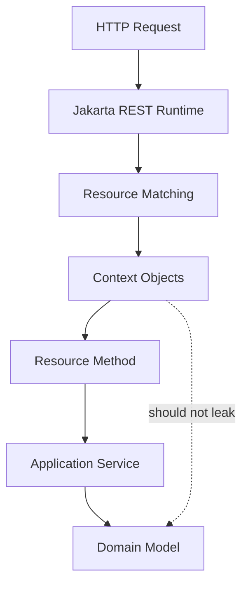
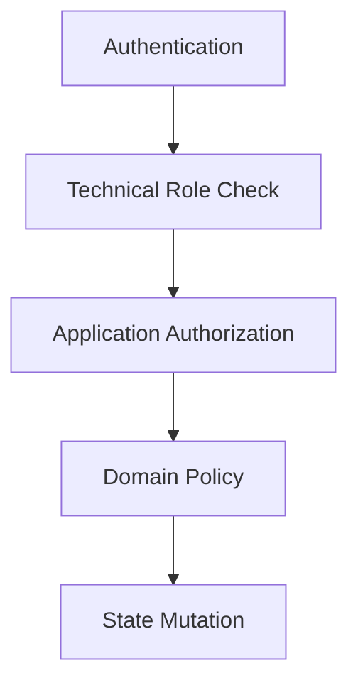

# Part 019 — Context Injection

`@Context` adalah salah satu fitur Jakarta REST yang terlihat kecil, tetapi sangat menentukan kualitas desain endpoint. Dengan `@Context`, resource/provider bisa mengakses informasi request runtime: URI, header, security principal, conditional request evaluator, provider registry, konfigurasi aplikasi, dan metadata resource yang sedang dieksekusi.

Kesalahan umum: memperlakukan context sebagai global state, menyimpannya di field singleton, meneruskannya jauh ke service/domain layer, atau memakainya sebagai shortcut untuk menghindari desain parameter eksplisit. Di sistem kecil, itu terlihat praktis. Di sistem production, itu membuat coupling terhadap HTTP runtime menyebar ke seluruh aplikasi.

Bagian ini membahas `@Context` sebagai **runtime boundary**, bukan sebagai dependency injection bebas.

---

## 1. Target Kompetensi

Setelah bagian ini, kita harus bisa:

1. Menjelaskan apa yang dimaksud context object dalam Jakarta REST.
2. Membedakan request context, application context, provider context, dan resource metadata.
3. Menggunakan `UriInfo`, `HttpHeaders`, `Request`, dan `SecurityContext` secara benar.
4. Menentukan kapan context boleh masuk resource layer dan kapan harus diterjemahkan menjadi value object/domain command.
5. Menghindari bug thread-safety akibat field injection pada resource/provider singleton.
6. Membuat filter/provider yang menggunakan context tanpa membuat coupling tersembunyi.
7. Mendesain audit/correlation/security boundary berbasis context dengan aman.

---

## 2. Mental Model: Context Adalah View ke Runtime Request

Context object bukan model bisnis. Ia adalah view ke runtime.



Context menjawab pertanyaan seperti:

- Request ini datang ke URI apa?
- Header apa yang dikirim client?
- Siapa principal yang terautentikasi?
- Apakah request datang lewat secure channel?
- Method/resource mana yang sedang dipanggil?
- Provider apa yang tersedia untuk type tertentu?
- Apakah conditional request seharusnya short-circuit menjadi `304` atau `412`?

Context **tidak** seharusnya menjawab:

- Apakah case ini boleh dieskalasi secara domain?
- Apakah evidence ini valid secara hukum?
- Apa state transition berikutnya?
- Bagaimana SLA enforcement dihitung?

Pertanyaan seperti itu milik service/domain layer.

---

## 3. Context Object Taxonomy

Jakarta REST menyediakan beberapa context object. Kita bisa mengelompokkannya seperti ini.

| Kelompok | Object | Kegunaan |
|---|---|---|
| URI/request shape | `UriInfo` | Path, query, matched URI, URI builder |
| Header/request metadata | `HttpHeaders` | Header, cookies, accepted media/language |
| Request precondition | `Request` | Conditional request: ETag, Last-Modified |
| Security | `SecurityContext` | Principal, role, auth scheme, HTTPS check |
| Application/runtime | `Application`, `Configuration` | App object dan config runtime |
| Provider lookup | `Providers` | Lookup provider by type/media type |
| Resource support | `ResourceContext` | Initialize/create resource instance |
| Resource metadata | `ResourceInfo` | Resource class/method yang sedang dieksekusi |

Tidak semua object cocok dipakai di semua tempat. Beberapa lebih umum di resource method, beberapa lebih umum di provider/filter.

---

## 4. Injection Location: Parameter Lebih Aman daripada Field

Context bisa diinjeksi ke parameter method atau field, tergantung runtime dan lifecycle object. Secara desain, **method parameter injection biasanya lebih jelas** karena dependency terlihat pada signature method.

```java
@Path("/cases")
public class CaseResource {

    @GET
    @Path("/{caseId}")
    public Response getCase(
            @PathParam("caseId") String caseId,
            @Context UriInfo uriInfo,
            @Context SecurityContext securityContext) {

        var actor = ActorRef.fromPrincipal(securityContext.getUserPrincipal());
        var self = uriInfo.getAbsolutePath();

        var result = service.getCase(caseId, actor);
        return Response.ok(result)
                .link(self, "self")
                .build();
    }
}
```

Field injection terlihat ringkas, tetapi harus hati-hati pada lifecycle.

```java
@Path("/cases")
public class CaseResource {

    @Context
    UriInfo uriInfo;

    @Context
    SecurityContext securityContext;
}
```

Field injection aman hanya jika kita memahami resource lifecycle. Jika resource/provider dibuat singleton, field context biasanya diimplementasikan dengan proxy request-scoped atau mekanisme runtime lain. Itu tidak boleh diasumsikan sebagai object stabil lintas request.

Prinsip praktis:

1. Gunakan parameter injection untuk context yang hanya diperlukan satu method.
2. Gunakan field injection hanya untuk context yang dipakai berulang di class dan tetap jangan simpan nilainya ke static/global state.
3. Jangan pass `UriInfo`, `HttpHeaders`, atau `SecurityContext` langsung ke domain service.
4. Konversi context menjadi value object eksplisit sebelum masuk use case.

Contoh boundary yang lebih bersih:

```java
record RequestActor(String subject, Set<String> roles, boolean secure) {}

static RequestActor actorFrom(SecurityContext securityContext) {
    var principal = securityContext.getUserPrincipal();
    var subject = principal == null ? "anonymous" : principal.getName();

    return new RequestActor(
            subject,
            Set.of(), // isi dari role mapping policy aplikasi
            securityContext.isSecure());
}
```

---

## 5. `UriInfo`: URI Runtime, Link Building, dan Matched Resource

`UriInfo` adalah context untuk memahami URI request dan membangun URI response.

Kegunaan utama:

1. Membaca absolute/base/request URI.
2. Membaca path segments.
3. Membaca path parameters dan query parameters.
4. Membangun `UriBuilder` dari request saat ini.
5. Membuat `self`, `next`, `prev`, dan related links.
6. Mengetahui matched resources/templates untuk audit atau diagnostics.

Contoh umum:

```java
@GET
@Path("/{caseId}")
public Response getCase(@PathParam("caseId") String caseId,
                        @Context UriInfo uriInfo) {
    CaseDto dto = service.getCase(caseId);

    URI self = uriInfo.getAbsolutePathBuilder().build();
    URI evidence = uriInfo.getBaseUriBuilder()
            .path(CaseResource.class)
            .path(CaseResource.class, "listEvidence")
            .resolveTemplate("caseId", caseId)
            .build();

    return Response.ok(dto)
            .link(self, "self")
            .link(evidence, "evidence")
            .build();
}

@GET
@Path("/{caseId}/evidence")
public Response listEvidence(@PathParam("caseId") String caseId) {
    return Response.ok(service.listEvidence(caseId)).build();
}
```

### 5.1 Jangan Build URI dengan String Concatenation

Buruk:

```java
String location = "/api/cases/" + id + "/evidence/" + evidenceId;
return Response.created(URI.create(location)).build();
```

Lebih baik:

```java
URI location = uriInfo.getBaseUriBuilder()
        .path(CaseResource.class)
        .path(CaseResource.class, "getEvidence")
        .resolveTemplate("caseId", caseId)
        .resolveTemplate("evidenceId", evidenceId)
        .build();

return Response.created(location).build();
```

Mengapa lebih baik:

- Mengurangi hard-coded path.
- Lebih aman saat base path berubah.
- Mengikuti template resource method.
- Lebih mudah diuji.

### 5.2 Query Parameter: Jangan Treat Query sebagai Map Mentah

`UriInfo#getQueryParameters()` berguna untuk generic filter/search grammar, tetapi jangan biarkan query raw masuk domain.

Buruk:

```java
MultivaluedMap<String, String> query = uriInfo.getQueryParameters();
return service.search(query);
```

Lebih baik:

```java
SearchCasesRequest request = SearchCasesRequest.from(uriInfo.getQueryParameters());
return Response.ok(service.search(request)).build();
```

`SearchCasesRequest` menjadi boundary object yang bisa memvalidasi:

- field yang diizinkan,
- operator yang diizinkan,
- default sort,
- pagination limit,
- konflik parameter,
- timezone/date parsing.

### 5.3 Matched URI untuk Audit/Observability

Untuk logging/audit, raw URI sering terlalu kardinal karena berisi ID berbeda-beda. Yang lebih stabil adalah route template.

Contoh metrik buruk:

```text
GET /cases/C-1001/evidence/E-1
GET /cases/C-1002/evidence/E-9
GET /cases/C-1003/evidence/E-7
```

Contoh metrik lebih baik:

```text
GET /cases/{caseId}/evidence/{evidenceId}
```

Gunakan matched resource/template bila runtime menyediakan API terkait. Untuk portability, fallback ke `ResourceInfo` + annotation path atau filter instrumentation runtime-specific jika diperlukan.

---

## 6. `HttpHeaders`: Header Bukan Kebenaran Mutlak

`HttpHeaders` memberi akses ke header request, cookie, acceptable media types, acceptable languages, dan metadata serupa.

Contoh:

```java
@GET
@Path("/{caseId}")
public Response getCase(@PathParam("caseId") String caseId,
                        @Context HttpHeaders headers) {

    List<MediaType> acceptable = headers.getAcceptableMediaTypes();
    Locale locale = headers.getAcceptableLanguages().stream()
            .findFirst()
            .orElse(Locale.ENGLISH);

    return Response.ok(service.getCase(caseId, locale)).build();
}
```

### 6.1 Header Trust Boundary

Header dikirim oleh client atau proxy. Tidak semua header boleh dipercaya.

| Header | Risiko |
|---|---|
| `X-Forwarded-For` | Bisa dipalsukan jika tidak diset/diterima hanya dari trusted proxy |
| `X-User-Id` | Berbahaya jika dipakai sebagai identitas tanpa gateway guarantee |
| `User-Agent` | Tidak reliable untuk security decision |
| `Content-Type` | Bisa salah/malicious; tetap validasi payload |
| `Accept-Language` | Preferensi, bukan kebenaran domain |
| `Idempotency-Key` | Harus divalidasi length/format/scope |
| `Correlation-Id` | Bisa dipakai untuk tracing, tetapi harus disanitasi |

Prinsipnya: header boleh menjadi input protocol, bukan sumber otoritas kecuali berasal dari trust boundary yang jelas.

### 6.2 Correlation ID

Pattern yang umum:

1. Terima `X-Correlation-Id` jika valid.
2. Generate ID baru jika tidak ada/tidak valid.
3. Simpan di request context/logging MDC.
4. Kembalikan di response header.
5. Propagate ke outbound client call.

Jangan biarkan client mengirim correlation ID dengan ukuran tak terbatas.

```java
static String normalizeCorrelationId(String raw) {
    if (raw == null || raw.isBlank()) return UUID.randomUUID().toString();
    if (raw.length() > 128) return UUID.randomUUID().toString();
    if (!raw.matches("[A-Za-z0-9._:-]+")) return UUID.randomUUID().toString();
    return raw;
}
```

---

## 7. `Request`: Conditional Request dan Lost Update Prevention

`Request` sering diabaikan, padahal ia penting untuk HTTP correctness.

Kegunaan utama:

- Mengevaluasi precondition berdasarkan `ETag`.
- Mengevaluasi precondition berdasarkan `Last-Modified`.
- Menghasilkan response builder untuk `304 Not Modified` atau `412 Precondition Failed`.

Contoh conditional GET:

```java
@GET
@Path("/{caseId}")
public Response getCase(@PathParam("caseId") String caseId,
                        @Context Request request) {

    CaseDto dto = service.getCase(caseId);
    EntityTag etag = new EntityTag(dto.versionHash());

    Response.ResponseBuilder precondition = request.evaluatePreconditions(etag);
    if (precondition != null) {
        return precondition.tag(etag).build();
    }

    return Response.ok(dto)
            .tag(etag)
            .build();
}
```

Contoh update dengan optimistic concurrency:

```java
@PUT
@Path("/{caseId}")
public Response replaceCase(@PathParam("caseId") String caseId,
                            ReplaceCaseRequest body,
                            @HeaderParam("If-Match") String ifMatch) {

    if (ifMatch == null || ifMatch.isBlank()) {
        return Response.status(428)
                .entity(Problem.preconditionRequired("If-Match is required"))
                .build();
    }

    CaseDto updated = service.replace(caseId, body, VersionTag.parse(ifMatch));

    return Response.ok(updated)
            .tag(new EntityTag(updated.versionHash()))
            .build();
}
```

`Request` membantu di sisi protocol, tetapi conflict domain tetap harus ditangani service layer. `ETag` bukan pengganti invariant domain.

---

## 8. `SecurityContext`: Principal, Role, Channel, dan Authentication Scheme

`SecurityContext` memberi informasi security request saat ini.

Method utama:

- `getUserPrincipal()`
- `isUserInRole(String role)`
- `isSecure()`
- `getAuthenticationScheme()`

Contoh:

```java
@POST
@Path("/{caseId}/escalations")
public Response escalate(@PathParam("caseId") String caseId,
                         EscalateCaseRequest body,
                         @Context SecurityContext securityContext) {

    if (securityContext.getUserPrincipal() == null) {
        throw new NotAuthorizedException("Authentication required");
    }

    if (!securityContext.isUserInRole("case-escalator")) {
        throw new ForbiddenException("Insufficient role");
    }

    var command = new EscalateCaseCommand(
            caseId,
            body.reasonCode(),
            body.comment(),
            securityContext.getUserPrincipal().getName());

    EscalationDto result = service.escalate(command);

    return Response.status(Response.Status.CREATED)
            .entity(result)
            .build();
}
```

### 8.1 Role Check Bukan Domain Authorization Lengkap

`isUserInRole("case-escalator")` menjawab “apakah actor punya role teknis ini?”, bukan “apakah actor boleh mengeskalasi case ini?”.

Domain authorization bisa bergantung pada:

- unit organisasi,
- case assignment,
- conflict of interest,
- stage lifecycle,
- delegation,
- regulatory mandate,
- separation of duties,
- historical decision trail.

Maka security boundary idealnya dua lapis:



Resource boleh melakukan coarse-grained role check. Fine-grained authorization sebaiknya berada di application/domain policy.

### 8.2 `isSecure()` dan Proxy Termination

`securityContext.isSecure()` biasanya menunjukkan apakah request dianggap secure oleh container. Dalam deployment modern, TLS sering terminate di load balancer/API gateway. Jika backend menerima HTTP internal, `isSecure()` bisa `false` kecuali runtime/proxy dikonfigurasi benar.

Jangan membuat keputusan security kritis hanya dari `isSecure()` tanpa memahami topologi deployment.

---

## 9. `ResourceInfo`: Resource Method Metadata untuk Provider

`ResourceInfo` sering dipakai di filter/provider untuk mengetahui class dan method resource yang sedang dipanggil.

Contoh audit filter dengan annotation custom:

```java
@NameBinding
@Retention(RetentionPolicy.RUNTIME)
@Target({ElementType.TYPE, ElementType.METHOD})
public @interface AuditedAction {
    String value();
}
```

```java
@Provider
@AuditedAction("")
public class AuditFilter implements ContainerRequestFilter {

    @Context
    ResourceInfo resourceInfo;

    @Override
    public void filter(ContainerRequestContext requestContext) {
        Method method = resourceInfo.getResourceMethod();
        AuditedAction action = method.getAnnotation(AuditedAction.class);

        if (action != null) {
            requestContext.setProperty("audit.action", action.value());
        }
    }
}
```

Resource example:

```java
@POST
@Path("/{caseId}/closure")
@AuditedAction("CASE_CLOSE_REQUESTED")
public Response closeCase(@PathParam("caseId") String caseId, CloseCaseRequest body) {
    return Response.accepted(service.requestClosure(caseId, body)).build();
}
```

Use case bagus:

- audit action classification,
- metrics route metadata,
- security annotation extraction,
- feature toggle by method annotation.

Use case buruk:

- menjalankan business branching berdasarkan nama method,
- mengambil domain rule dari annotation resource,
- mengganti behavior use case secara tersembunyi.

---

## 10. `Providers`: Lookup Provider Secara Eksplisit

`Providers` memungkinkan lookup provider runtime seperti `MessageBodyReader`, `MessageBodyWriter`, `ExceptionMapper`, dan `ContextResolver`.

Contoh use case:

- writer interceptor perlu mengetahui writer untuk type tertentu,
- exception mapper aggregator,
- custom serialization feature,
- diagnostics endpoint internal.

```java
@Provider
public class JsonPolicyFeature implements Feature {
    @Context
    Providers providers;

    @Override
    public boolean configure(FeatureContext context) {
        // Umumnya jarang perlu manual lookup di Feature,
        // tetapi Providers berguna untuk runtime introspection tertentu.
        return true;
    }
}
```

Prinsip:

1. Jangan gunakan `Providers` untuk bypass dependency injection normal.
2. Jangan membuat resource method bergantung pada provider registry kecuali memang resource tersebut adalah diagnostics/runtime feature.
3. Manual lookup provider adalah advanced tool; default-nya biarkan runtime melakukan provider selection.

---

## 11. `ResourceContext`: Membuat atau Menginisialisasi Resource

`ResourceContext` berguna untuk sub-resource locator dan dynamic resource composition.

Contoh:

```java
@Path("/cases/{caseId}")
public class CaseRootResource {

    @Context
    ResourceContext resourceContext;

    @Path("evidence")
    public EvidenceResource evidence(@PathParam("caseId") String caseId) {
        EvidenceResource resource = resourceContext.getResource(EvidenceResource.class);
        resource.setCaseId(caseId);
        return resource;
    }
}
```

Namun setter mutation seperti ini harus hati-hati. Alternatif yang lebih eksplisit sering lebih baik:

```java
@Path("evidence")
public EvidenceResource evidence(@PathParam("caseId") String caseId) {
    return new EvidenceResource(caseId, evidenceService);
}
```

Tetapi manual `new` bisa melewati injection/CDI runtime. `ResourceContext` membantu runtime menginisialisasi instance sesuai lifecycle/provider injection.

Decision rule:

- Gunakan sub-resource locator untuk resource tree yang memang dinamis.
- Jangan gunakan hanya untuk menyembunyikan struktur class yang terlalu besar.
- Pastikan state sub-resource request-scoped, bukan shared mutable state.

---

## 12. `Configuration` dan `Application`: Runtime Configuration View

`Configuration` memberi akses ke property, registered components, dan runtime type. Ini berguna untuk provider atau diagnostics.

Contoh:

```java
@Provider
public class RuntimeDiagnosticsFilter implements ContainerRequestFilter {

    @Context
    Configuration configuration;

    @Override
    public void filter(ContainerRequestContext requestContext) {
        Object enabled = configuration.getProperty("audit.enabled");
        requestContext.setProperty("audit.enabled", enabled);
    }
}
```

Jangan overuse `Configuration` sebagai global application config. Untuk konfigurasi bisnis/operasional, gunakan config system resmi runtime seperti MicroProfile Config, environment config, atau dependency injection configuration object.

---

## 13. Request Properties: Context Lokal untuk Pipeline

Selain `@Context`, filter bisa memakai `ContainerRequestContext#setProperty` untuk menaruh data sepanjang request pipeline.

Contoh correlation ID:

```java
@Provider
@Priority(Priorities.AUTHENTICATION)
public class CorrelationFilter implements ContainerRequestFilter, ContainerResponseFilter {

    public static final String CORRELATION_ID = "correlation.id";

    @Override
    public void filter(ContainerRequestContext request) {
        String raw = request.getHeaderString("X-Correlation-Id");
        String id = normalizeCorrelationId(raw);
        request.setProperty(CORRELATION_ID, id);
    }

    @Override
    public void filter(ContainerRequestContext request, ContainerResponseContext response) {
        Object id = request.getProperty(CORRELATION_ID);
        if (id != null) {
            response.getHeaders().putSingle("X-Correlation-Id", id.toString());
        }
    }
}
```

Ini lebih aman daripada static `ThreadLocal` jika runtime async/reactive/virtual-thread behavior tidak dijamin sama. Jika memakai MDC/ThreadLocal, bersihkan selalu pada akhir request.

---

## 14. Anti-Pattern: Context Leakage ke Service Layer

Buruk:

```java
public class CaseService {
    public CaseDto getCase(String caseId, UriInfo uriInfo, SecurityContext securityContext) {
        // Service sekarang tahu HTTP runtime.
    }
}
```

Dampak buruk:

- Service sulit diuji tanpa mock Jakarta REST.
- Domain/application layer terikat ke HTTP.
- Reuse dari batch/job/messaging menjadi sulit.
- Authorization rule tersebar.
- Serialization/link building bercampur dengan use case.

Lebih baik:

```java
record RequestContextSnapshot(
        String actorId,
        String correlationId,
        Locale locale,
        boolean secure) {}

@GET
@Path("/{caseId}")
public Response getCase(@PathParam("caseId") String caseId,
                        @Context SecurityContext security,
                        @Context HttpHeaders headers) {

    RequestContextSnapshot ctx = new RequestContextSnapshot(
            principalName(security),
            headers.getHeaderString("X-Correlation-Id"),
            preferredLocale(headers),
            security.isSecure());

    return Response.ok(service.getCase(caseId, ctx)).build();
}
```

Bahkan lebih baik lagi, jika context tidak diperlukan domain, jangan kirim sama sekali.

---

## 15. Thread-Safety dan Lifecycle

Context object sering request-scoped. Provider sering singleton. Resource bisa per-request atau implementation-dependent tergantung runtime/config.

Risiko:

```java
@Provider
public class BadProvider implements ContainerRequestFilter {

    private SecurityContext lastSecurityContext;

    @Context
    public void setSecurityContext(SecurityContext securityContext) {
        this.lastSecurityContext = securityContext;
    }

    @Override
    public void filter(ContainerRequestContext requestContext) {
        // Salah: field mutable bisa dipakai lintas request jika provider singleton.
    }
}
```

Lebih aman:

```java
@Provider
public class GoodProvider implements ContainerRequestFilter {

    @Context
    SecurityContext securityContext;

    @Override
    public void filter(ContainerRequestContext requestContext) {
        Principal principal = securityContext.getUserPrincipal();
        requestContext.setProperty("actor", principal == null ? null : principal.getName());
    }
}
```

Tetap ingat: jangan simpan hasil request-specific ke field provider.

Rule:

1. Provider harus stateless atau immutable.
2. Jangan simpan context object ke static field.
3. Jangan cache principal/header/uri di singleton.
4. Jika perlu cache, cache metadata application-level, bukan request-level.
5. Jika menggunakan async response, jangan asumsikan thread yang sama.

---

## 16. Context dalam Async Resource

Pada async/suspended request, context harus diperlakukan sebagai data yang mungkin hanya valid pada fase request tertentu. Snapshot-kan data yang diperlukan sebelum pekerjaan asynchronous dijalankan.

Buruk:

```java
@GET
@Path("/{caseId}/report")
public void report(@PathParam("caseId") String caseId,
                   @Suspended AsyncResponse async,
                   @Context SecurityContext securityContext) {

    executor.submit(() -> {
        // Jangan bergantung pada context runtime request di thread lain tanpa memahami runtime.
        String actor = securityContext.getUserPrincipal().getName();
        async.resume(service.generate(caseId, actor));
    });
}
```

Lebih baik:

```java
@GET
@Path("/{caseId}/report")
public void report(@PathParam("caseId") String caseId,
                   @Suspended AsyncResponse async,
                   @Context SecurityContext securityContext,
                   @Context HttpHeaders headers) {

    String actor = principalName(securityContext);
    String correlationId = normalizeCorrelationId(headers.getHeaderString("X-Correlation-Id"));

    executor.submit(() -> {
        try {
            async.resume(service.generate(caseId, actor, correlationId));
        } catch (Exception e) {
            async.resume(e);
        }
    });
}
```

Snapshot primitive/value object, bukan object context runtime.

---

## 17. Context Boundary untuk Regulated Systems

Dalam sistem enforcement/case-management, context sering dibutuhkan untuk audit dan defensibility. Namun audit event harus merekam **meaningful facts**, bukan dump mentah request.

Audit event yang buruk:

```json
{
  "headers": "all request headers",
  "uri": "/api/cases/C-1001/escalations",
  "body": "full request body"
}
```

Audit event yang lebih baik:

```json
{
  "eventType": "CASE_ESCALATION_REQUESTED",
  "actorId": "user-123",
  "caseId": "C-1001",
  "resourceTemplate": "/cases/{caseId}/escalations",
  "method": "POST",
  "correlationId": "f9f3...",
  "decisionInputHash": "sha256:...",
  "occurredAt": "2026-06-27T10:15:30Z"
}
```

Mengapa lebih baik:

- tidak membocorkan semua header/body,
- route template mengurangi cardinality,
- actor dan action eksplisit,
- body sensitif bisa direpresentasikan sebagai hash,
- cocok untuk evidence trail.

---

## 18. Testing Context Usage

Testing context bisa dilakukan di beberapa level.

### 18.1 Resource Unit Test

Untuk method yang menerima context sebagai parameter, test lebih mudah karena kita bisa stub interface.

```java
@Test
void shouldBuildSelfLink() {
    UriInfo uriInfo = mock(UriInfo.class);
    UriBuilder builder = UriBuilder.fromUri("https://api.example.test/cases/C-1");

    when(uriInfo.getAbsolutePathBuilder()).thenReturn(builder);

    Response response = resource.getCase("C-1", uriInfo, securityContext);

    assertEquals(200, response.getStatus());
}
```

### 18.2 Provider/Filter Test

Test property/header behavior:

```java
@Test
void shouldReturnCorrelationId() {
    ContainerRequestContext request = mock(ContainerRequestContext.class);
    ContainerResponseContext response = mock(ContainerResponseContext.class);
    MultivaluedMap<String, Object> headers = new MultivaluedHashMap<>();

    when(request.getHeaderString("X-Correlation-Id")).thenReturn("abc-123");
    when(request.getProperty("correlation.id")).thenReturn("abc-123");
    when(response.getHeaders()).thenReturn(headers);

    filter.filter(request);
    filter.filter(request, response);

    assertEquals("abc-123", headers.getFirst("X-Correlation-Id"));
}
```

### 18.3 In-Container Test

Perlu untuk memverifikasi:

- apakah `SecurityContext` terisi sesuai auth mechanism,
- apakah path/matched template sesuai runtime,
- apakah request property survive sampai response filter,
- apakah field injection aman pada runtime yang dipakai.

---

## 19. Production Checklist

Sebelum memakai context di resource/provider, cek:

- Apakah context ini benar-benar perlu?
- Apakah bisa diganti parameter eksplisit?
- Apakah context leaking ke service/domain layer?
- Apakah header yang dipakai trusted?
- Apakah principal/role check cukup, atau perlu domain authorization?
- Apakah data request-specific disimpan di singleton/static?
- Apakah async code hanya membawa snapshot value?
- Apakah correlation ID dibatasi length/charset?
- Apakah URI/link dibangun dengan `UriBuilder`, bukan string concat?
- Apakah audit event merekam semantic event, bukan dump request?

---

## 20. Kesimpulan

`@Context` adalah jembatan antara Jakarta REST runtime dan resource/provider code. Ia powerful karena memberi akses ke URI, header, request precondition, security, provider registry, dan resource metadata. Tetapi kekuatan ini juga membuatnya mudah disalahgunakan.

Mental model utama:

> Context adalah boundary object untuk memahami request saat ini. Ambil informasi yang dibutuhkan, ubah menjadi value object eksplisit, lalu jangan biarkan HTTP runtime menyebar ke domain.

Untuk engineer top-tier, perbedaan pentingnya bukan sekadar tahu bahwa `@Context UriInfo` ada. Yang penting adalah tahu **di mana context boleh hidup, kapan harus di-snapshot, kapan harus diterjemahkan, dan kapan harus ditolak masuk ke layer bawah**.

---

## Referensi

- Jakarta RESTful Web Services 4.0 Specification — Context, resource matching, providers, and security context sections.
- Jakarta RESTful Web Services 4.0 API Docs — `jakarta.ws.rs.core.UriInfo`, `HttpHeaders`, `Request`, `SecurityContext`, `Configuration`, `Application`.
- RFC 9110 — HTTP Semantics, conditional requests, validators, and method semantics.
