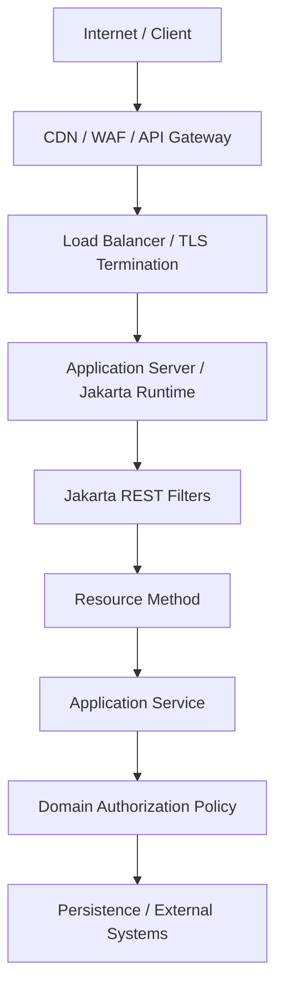

# Part 020 — Security in Jakarta REST

Security di Jakarta REST bukan hanya menambahkan annotation role atau filter token. Security adalah desain boundary: siapa client-nya, identitas apa yang dipercaya, header mana yang boleh dipercaya, operasi mana yang boleh dilakukan, state apa yang boleh berubah, data apa yang boleh keluar, error apa yang aman dikembalikan, dan event apa yang harus diaudit.

Untuk API production, terutama sistem regulated/case-management, security harus dipahami sebagai kombinasi:

1. **Authentication** — siapa actor/requester?
2. **Authorization** — actor boleh melakukan apa terhadap resource tertentu?
3. **Transport trust** — apakah channel/proxy/header bisa dipercaya?
4. **Input trust** — apakah payload/header/path/query aman diproses?
5. **Output control** — apakah response membocorkan informasi?
6. **Auditability** — apakah tindakan penting bisa dibuktikan kemudian?
7. **Abuse resistance** — apakah API tahan brute force, enumeration, replay, flood, dan misuse?

Bagian ini fokus pada security di layer Jakarta REST. Kita tidak akan mengulang teori security generik, tetapi akan membahas cara menerjemahkannya ke resource, filter, provider, error contract, dan deployment boundary.

---

## 1. Target Kompetensi

Setelah bagian ini, kita harus bisa:

1. Menentukan security responsibility antara gateway, container, Jakarta REST filter, application service, dan domain policy.
2. Menggunakan `SecurityContext` tanpa menganggap role check sebagai domain authorization lengkap.
3. Mendesain coarse-grained dan fine-grained authorization.
4. Menerapkan authentication/authorization filter yang tidak bocor detail dan tidak salah status code.
5. Memahami CORS dan CSRF secara tepat untuk API REST.
6. Mengelola sensitive data di request, response, log, audit, dan exception.
7. Mendesain error contract yang aman tetapi tetap actionable.
8. Membuat checklist security review untuk endpoint Jakarta REST.

---

## 2. Mental Model: Security Boundary Berlapis

Jakarta REST resource berada di tengah beberapa boundary.



Setiap layer punya tanggung jawab berbeda.

| Layer | Tanggung jawab security yang umum |
|---|---|
| CDN/WAF | DDoS shielding, coarse blocking, bot rules |
| API Gateway | TLS, auth token validation, routing, quota, client identity propagation |
| App Server | container security, principal establishment, roles, session/cert integration |
| Jakarta REST Filter | request validation, correlation, coarse auth, CORS/security headers, audit hooks |
| Resource | protocol authorization check, resource identity extraction, command construction |
| Application Service | use case authorization, transaction boundary, policy orchestration |
| Domain Policy | invariant, state transition, separation of duties, case assignment rule |

Kesalahan besar adalah menaruh semua security di satu tempat. Gateway tidak tahu semua domain invariant. Domain tidak boleh tahu semua HTTP header. Resource tidak boleh menjadi policy engine raksasa.

---

## 3. Authentication: Establish Identity Before Resource Logic

Authentication menjawab “siapa requester?”. Di Jakarta REST, identity bisa datang dari beberapa mekanisme:

- container-managed security,
- Jakarta Security,
- servlet security,
- OIDC/JWT integration runtime,
- API gateway yang memvalidasi token lalu meneruskan identity,
- custom `ContainerRequestFilter`,
- mutual TLS integration,
- service-to-service credential.

Jakarta REST sendiri menyediakan `SecurityContext` untuk membaca identity yang sudah dibentuk runtime/request. Jakarta REST bukan authentication framework lengkap.

### 3.1 Filter Token Sederhana

Contoh filter untuk ilustrasi. Ini bukan production-ready JWT validator.

```java
@Provider
@Priority(Priorities.AUTHENTICATION)
public class BearerTokenAuthenticationFilter implements ContainerRequestFilter {

    private final TokenVerifier tokenVerifier;

    public BearerTokenAuthenticationFilter(TokenVerifier tokenVerifier) {
        this.tokenVerifier = tokenVerifier;
    }

    @Override
    public void filter(ContainerRequestContext requestContext) {
        String authorization = requestContext.getHeaderString(HttpHeaders.AUTHORIZATION);

        if (authorization == null || !authorization.startsWith("Bearer ")) {
            requestContext.abortWith(Response.status(Response.Status.UNAUTHORIZED)
                    .header(HttpHeaders.WWW_AUTHENTICATE, "Bearer")
                    .entity(Problem.unauthorized("Authentication required"))
                    .build());
            return;
        }

        String token = authorization.substring("Bearer ".length()).trim();

        TokenPrincipal principal;
        try {
            principal = tokenVerifier.verify(token);
        } catch (InvalidTokenException e) {
            requestContext.abortWith(Response.status(Response.Status.UNAUTHORIZED)
                    .header(HttpHeaders.WWW_AUTHENTICATE, "Bearer error=\"invalid_token\"")
                    .entity(Problem.unauthorized("Invalid authentication credentials"))
                    .build());
            return;
        }

        requestContext.setSecurityContext(new ApiSecurityContext(
                principal,
                requestContext.getSecurityContext().isSecure()));
    }
}
```

Custom `SecurityContext`:

```java
final class ApiSecurityContext implements SecurityContext {
    private final TokenPrincipal principal;
    private final boolean secure;

    ApiSecurityContext(TokenPrincipal principal, boolean secure) {
        this.principal = principal;
        this.secure = secure;
    }

    @Override
    public Principal getUserPrincipal() {
        return principal;
    }

    @Override
    public boolean isUserInRole(String role) {
        return principal.roles().contains(role);
    }

    @Override
    public boolean isSecure() {
        return secure;
    }

    @Override
    public String getAuthenticationScheme() {
        return "Bearer";
    }
}
```

Catatan production:

- Validasi signature token.
- Validasi issuer/audience.
- Validasi expiry/not-before.
- Validasi token binding bila relevan.
- Jangan log token.
- Jangan parse JWT tanpa verifikasi.
- Jangan percaya header identity kecuali dari trusted gateway.
- Gunakan library/runtime security yang matang bila tersedia.

---

## 4. `401` vs `403`: Jangan Campur

Status security harus konsisten.

| Kondisi | Status | Makna |
|---|---:|---|
| Tidak ada credential | `401 Unauthorized` | Client harus authenticate |
| Credential invalid/expired | `401 Unauthorized` | Credential tidak valid |
| Credential valid tetapi tidak punya akses | `403 Forbidden` | Actor dikenal tetapi dilarang |
| Resource disembunyikan demi anti-enumeration | `404 Not Found` | Digunakan dengan policy eksplisit |
| Scope/token salah untuk API | `403` atau `401` | Tergantung model auth dan challenge |

`401` sebaiknya menyertakan `WWW-Authenticate` untuk authentication scheme yang relevan. `403` tidak berarti “belum login”; ia berarti “sudah dikenali tetapi tidak boleh”.

---

## 5. Authorization: Role Check Bukan Policy Lengkap

Contoh role check di resource:

```java
@POST
@Path("/{caseId}/assignment")
public Response assignCase(@PathParam("caseId") String caseId,
                           AssignCaseRequest body,
                           @Context SecurityContext security) {

    if (!security.isUserInRole("case-manager")) {
        throw new ForbiddenException("Insufficient role");
    }

    AssignmentResult result = service.assign(caseId, body, principalName(security));
    return Response.ok(result).build();
}
```

Ini hanya coarse-grained authorization. Domain policy masih harus memeriksa:

- apakah actor berada di unit organisasi yang benar,
- apakah actor punya mandate pada case ini,
- apakah target assignee eligible,
- apakah case stage memperbolehkan assignment,
- apakah assignment melanggar separation of duties,
- apakah ada hold/freeze legal,
- apakah operation membutuhkan approval tambahan.

Lebih baik:

```java
public AssignmentResult assign(String caseId, AssignCaseRequest body, String actorId) {
    CaseAggregate aggregate = repository.get(caseId);
    Actor actor = actorDirectory.get(actorId);

    authorizationPolicy.requireCanAssign(actor, aggregate, body.assigneeId());

    aggregate.assignTo(body.assigneeId(), actorId, clock.instant());
    repository.save(aggregate);

    audit.record(AuditEvent.caseAssigned(caseId, actorId, body.assigneeId()));
    return mapper.toResult(aggregate);
}
```

Resource melakukan HTTP adaptation. Policy melakukan keputusan domain.

---

## 6. Annotation-Based Security

Dalam Jakarta EE runtimes, annotation seperti `@RolesAllowed`, `@PermitAll`, dan `@DenyAll` sering digunakan bersama resource/CDI/EJB integration.

Contoh:

```java
@Path("/cases")
@RolesAllowed("case-user")
public class CaseResource {

    @GET
    @Path("/{caseId}")
    public Response getCase(@PathParam("caseId") String caseId) {
        return Response.ok(service.getCase(caseId)).build();
    }

    @POST
    @Path("/{caseId}/escalations")
    @RolesAllowed("case-escalator")
    public Response escalate(@PathParam("caseId") String caseId,
                             EscalateCaseRequest body) {
        return Response.status(Response.Status.CREATED)
                .entity(service.escalate(caseId, body))
                .build();
    }
}
```

Gunakan annotation untuk coarse access rule yang stabil. Jangan taruh policy kompleks di annotation.

Checklist:

- Verifikasi runtime benar-benar enforce annotation untuk resource class.
- Pastikan test integration mencakup negative access.
- Jangan mengandalkan annotation untuk object-level authorization.
- Hindari role explosion seperti `case-close-own-region-high-risk-approver`.

---

## 7. CORS: Browser Boundary, Bukan API Authentication

CORS mengatur apakah browser boleh membiarkan JavaScript dari origin tertentu membaca response cross-origin. CORS bukan authentication, bukan authorization, dan bukan perlindungan server dari request non-browser.

CORS biasanya diimplementasikan dengan filter.

```java
@Provider
@Priority(Priorities.HEADER_DECORATOR)
public class CorsFilter implements ContainerRequestFilter, ContainerResponseFilter {

    private static final Set<String> ALLOWED_ORIGINS = Set.of(
            "https://app.example.gov",
            "https://review.example.gov");

    @Override
    public void filter(ContainerRequestContext request) {
        if ("OPTIONS".equalsIgnoreCase(request.getMethod())
                && request.getHeaderString("Access-Control-Request-Method") != null) {

            String origin = request.getHeaderString("Origin");
            if (!ALLOWED_ORIGINS.contains(origin)) {
                request.abortWith(Response.status(Response.Status.FORBIDDEN).build());
                return;
            }

            request.abortWith(Response.noContent()
                    .header("Access-Control-Allow-Origin", origin)
                    .header("Access-Control-Allow-Methods", "GET,POST,PUT,PATCH,DELETE,OPTIONS")
                    .header("Access-Control-Allow-Headers", "Authorization,Content-Type,X-Correlation-Id,Idempotency-Key")
                    .header("Access-Control-Allow-Credentials", "true")
                    .header("Vary", "Origin")
                    .build());
        }
    }

    @Override
    public void filter(ContainerRequestContext request, ContainerResponseContext response) {
        String origin = request.getHeaderString("Origin");
        if (ALLOWED_ORIGINS.contains(origin)) {
            response.getHeaders().putSingle("Access-Control-Allow-Origin", origin);
            response.getHeaders().putSingle("Vary", "Origin");
        }
    }
}
```

CORS rules:

1. Jangan pakai `Access-Control-Allow-Origin: *` untuk credentialed request.
2. Whitelist origin secara eksplisit.
3. Tambahkan `Vary: Origin` jika response tergantung origin.
4. Batasi allowed headers.
5. Jangan anggap CORS melindungi API dari curl/Postman/server-side client.

---

## 8. CSRF: Relevan Jika Browser Mengirim Credential Otomatis

CSRF relevan ketika browser otomatis menyertakan credential seperti cookie/session/basic auth/client certificate ke request cross-site.

Jika API hanya menerima bearer token di `Authorization` header yang tidak otomatis dikirim browser, risiko CSRF jauh lebih rendah. Tetapi jika aplikasi menggunakan cookie session, CSRF harus ditangani.

Mitigasi umum:

- SameSite cookie.
- CSRF token double-submit/synchronizer token.
- Origin/Referer validation untuk state-changing request.
- Reject unsafe methods tanpa CSRF token.
- CORS strict.

Filter ilustratif:

```java
@Provider
@Priority(Priorities.AUTHORIZATION)
public class CsrfFilter implements ContainerRequestFilter {

    private static final Set<String> SAFE_METHODS = Set.of("GET", "HEAD", "OPTIONS");

    @Override
    public void filter(ContainerRequestContext request) {
        if (SAFE_METHODS.contains(request.getMethod())) {
            return;
        }

        String csrfHeader = request.getHeaderString("X-CSRF-Token");
        String csrfCookie = getCookie(request, "csrf_token");

        if (csrfHeader == null || csrfCookie == null || !constantTimeEquals(csrfHeader, csrfCookie)) {
            request.abortWith(Response.status(Response.Status.FORBIDDEN)
                    .entity(Problem.forbidden("CSRF validation failed"))
                    .build());
        }
    }
}
```

Jangan implement sendiri kalau framework/security runtime sudah menyediakan mekanisme matang.

---

## 9. Input Trust: Path, Query, Header, Body Semua Tidak Dipercaya

Jakarta REST membuat binding input mudah, tetapi kemudahan itu bisa menipu. Semua input perlu boundary validation.

| Source | Risiko |
|---|---|
| Path param | enumeration, injection ke downstream path/query, invalid identifier |
| Query param | unbounded pagination, expensive filter, regex DoS, ambiguous grammar |
| Header | spoofing, oversized value, CRLF/log injection |
| Cookie | tampering, replay, session fixation |
| JSON body | mass assignment, unknown field, malicious nesting, oversized payload |
| Multipart | large file, zip bomb, content-type spoofing, filename traversal |

Contoh guard untuk pagination:

```java
public record PageRequest(int limit, String cursor) {
    public PageRequest {
        if (limit < 1 || limit > 100) {
            throw new BadRequestException("limit must be between 1 and 100");
        }
        if (cursor != null && cursor.length() > 512) {
            throw new BadRequestException("cursor is too long");
        }
    }
}
```

Contoh guard untuk ID:

```java
public final class CaseId {
    private static final Pattern PATTERN = Pattern.compile("C-[0-9]{6,12}");

    public static CaseId parse(String raw) {
        if (raw == null || !PATTERN.matcher(raw).matches()) {
            throw new BadRequestException("Invalid case id");
        }
        return new CaseId(raw);
    }

    private final String value;

    private CaseId(String value) {
        this.value = value;
    }

    public String value() {
        return value;
    }
}
```

---

## 10. Output Control: Jangan Bocorkan Data Lewat Response

Bocor data sering terjadi bukan karena query salah, tetapi karena response DTO terlalu besar atau exception terlalu detail.

Anti-pattern:

```java
@GET
@Path("/{caseId}")
public CaseEntity getCase(@PathParam("caseId") String caseId) {
    return repository.find(caseId);
}
```

Risiko:

- field internal ikut serialized,
- lazy relation terbuka,
- audit/private notes bocor,
- database schema menjadi public API,
- role-based redaction sulit.

Lebih baik:

```java
public record CaseSummaryDto(
        String id,
        String status,
        String assignedUnit,
        OffsetDateTime openedAt,
        List<LinkDto> links) {}
```

Gunakan DTO berbeda untuk:

- public client,
- internal officer,
- supervisor,
- audit reviewer,
- system integration.

Jangan hanya rely pada `@JsonIgnore` di entity sebagai security boundary.

---

## 11. Sensitive Data di Logs dan Error

Log adalah production observability tool, tetapi juga data leakage vector.

Jangan log:

- bearer token,
- cookie/session id,
- password/secret/API key,
- full request body yang mengandung PII,
- document/evidence content,
- raw authorization failure detail,
- stack trace ke client.

Log yang aman:

```json
{
  "event": "REST_REQUEST_COMPLETED",
  "method": "POST",
  "route": "/cases/{caseId}/escalations",
  "status": 201,
  "durationMs": 42,
  "actorId": "user-123",
  "correlationId": "7c41...",
  "caseIdHash": "sha256:..."
}
```

Error response yang aman:

```json
{
  "type": "https://api.example.gov/problems/forbidden",
  "title": "Forbidden",
  "status": 403,
  "detail": "You do not have permission to perform this action.",
  "correlationId": "7c41..."
}
```

Internal logs boleh punya detail lebih banyak, tetapi tetap harus mengikuti data classification.

---

## 12. Security Headers

Untuk API yang dikonsumsi browser atau berada di domain publik, response security headers bisa ditambahkan dengan `ContainerResponseFilter`.

```java
@Provider
public class SecurityHeadersFilter implements ContainerResponseFilter {

    @Override
    public void filter(ContainerRequestContext request, ContainerResponseContext response) {
        response.getHeaders().putSingle("X-Content-Type-Options", "nosniff");
        response.getHeaders().putSingle("Referrer-Policy", "no-referrer");
        response.getHeaders().putSingle("Cache-Control", "no-store");
        response.getHeaders().putSingle("Pragma", "no-cache");

        if (isBrowserFacing(request)) {
            response.getHeaders().putSingle("Content-Security-Policy", "default-src 'none'");
        }
    }
}
```

Catatan:

- `Cache-Control: no-store` cocok untuk sensitive API response, tetapi tidak cocok untuk semua endpoint.
- CSP lebih relevan untuk browser-rendered content; API JSON biasanya minimal.
- Header policy harus disesuaikan dengan gateway dan frontend architecture.

---

## 13. Rate Limiting dan Abuse Resistance

Jakarta REST tidak menyediakan rate limiting standard. Biasanya dilakukan di gateway, service mesh, WAF, atau filter aplikasi.

Kapan di gateway:

- global quota,
- per API key/client,
- DDoS protection,
- cheap rejection before app compute.

Kapan di aplikasi:

- per actor + per resource rule,
- business-specific limit,
- mutation-specific throttle,
- fraud/abuse signal yang butuh domain data.

Contoh domain-specific limit:

```java
public void requestOtp(String userId, String ipAddress) {
    ratePolicy.requireAllowed("otp", userId, ipAddress);
    otpService.issue(userId);
}
```

Untuk regulated workflow:

- Batasi repeated state transition attempts.
- Batasi bulk export.
- Batasi search expensive query.
- Batasi file upload attempts.
- Audit rejected attempts jika meaningful.

---

## 14. IDOR dan Object-Level Authorization

IDOR atau insecure direct object reference adalah risiko besar pada REST API karena resource ID sering ada di path.

Endpoint terlihat aman:

```http
GET /cases/C-100001
Authorization: Bearer <valid-token>
```

Tetapi jika API hanya cek token valid dan tidak cek apakah actor boleh membaca `C-100001`, maka case bisa bocor.

Resource-level authorization pattern:

```java
public CaseDto getCase(String caseId, String actorId) {
    CaseAggregate aggregate = repository.get(caseId);
    Actor actor = actorDirectory.get(actorId);

    accessPolicy.requireCanView(actor, aggregate);

    return mapper.toDto(aggregate, RedactionPolicy.forActor(actor, aggregate));
}
```

Checklist object-level authorization:

- Every item endpoint checks access to that item.
- Every collection endpoint filters by allowed visibility.
- Bulk endpoint checks access per item or via scoped query.
- Export endpoint has stronger permission than read endpoint.
- Mutation endpoint checks both action and target state.
- Error behavior avoids existence leak where required.

---

## 15. Mass Assignment dan DTO Boundary

Mass assignment terjadi ketika client bisa mengirim field yang seharusnya tidak boleh dikontrol.

Buruk:

```java
@PUT
@Path("/{caseId}")
public Response updateCase(@PathParam("caseId") String id, CaseEntity entity) {
    entity.setId(id);
    repository.save(entity);
    return Response.ok(entity).build();
}
```

Client bisa mencoba mengubah:

- `status`,
- `assignedOfficerId`,
- `riskLevel`,
- `createdAt`,
- `closedAt`,
- `auditFlags`,
- internal review fields.

Lebih baik:

```java
public record UpdateCaseSummaryRequest(
        @NotBlank String title,
        @Size(max = 4000) String summary) {}
```

State transition punya endpoint/command sendiri:

```java
@POST
@Path("/{caseId}/transitions/submit-for-review")
public Response submitForReview(@PathParam("caseId") String caseId,
                                SubmitForReviewRequest body,
                                @Context SecurityContext security) {
    return Response.accepted(service.submitForReview(caseId, body, principalName(security))).build();
}
```

Jangan izinkan client mengirim aggregate/entity penuh untuk operasi terbatas.

---

## 16. Replay, Idempotency, dan High-Impact Mutation

High-impact mutation seperti pembayaran, escalation, enforcement decision, closure, or evidence deletion harus tahan retry dan replay.

Gunakan `Idempotency-Key` untuk operasi `POST` yang bisa diulang karena network failure.

```java
@POST
@Path("/{caseId}/escalations")
public Response escalate(@PathParam("caseId") String caseId,
                         @HeaderParam("Idempotency-Key") String idempotencyKey,
                         EscalateCaseRequest body,
                         @Context SecurityContext security) {

    IdempotencyKey key = IdempotencyKey.parse(idempotencyKey);
    String actor = principalName(security);

    EscalationDto result = idempotency.execute(
            key,
            actor,
            "case-escalation:" + caseId,
            () -> service.escalate(caseId, body, actor));

    return Response.status(Response.Status.CREATED).entity(result).build();
}
```

Security implications:

- Scope key by actor/client/resource/operation.
- Store request hash to prevent key reuse with different payload.
- Expire keys with policy.
- Return same result for duplicate valid request.
- Audit duplicates if suspicious.

---

## 17. Secure Exception Mapping

Exception mapper harus membedakan message internal dan external.

Buruk:

```java
@Provider
public class BadExceptionMapper implements ExceptionMapper<Exception> {
    @Override
    public Response toResponse(Exception e) {
        return Response.serverError()
                .entity(Map.of("error", e.toString(), "stack", Arrays.toString(e.getStackTrace())))
                .build();
    }
}
```

Lebih baik:

```java
@Provider
public class SafeExceptionMapper implements ExceptionMapper<Throwable> {

    @Override
    public Response toResponse(Throwable throwable) {
        String correlationId = Correlation.current();

        log.error("Unhandled exception correlationId={}", correlationId, throwable);

        return Response.status(Response.Status.INTERNAL_SERVER_ERROR)
                .type("application/problem+json")
                .entity(Problem.internalError(
                        "Unexpected server error",
                        correlationId))
                .build();
    }
}
```

Security-specific mapping:

- invalid credential: generic `401`, no detail like “signature ok but user disabled”.
- forbidden: generic `403` unless UX needs explicit reason.
- object not accessible: sometimes `404` if anti-enumeration policy.
- validation: safe field-level feedback, but avoid internal field names if sensitive.

---

## 18. Secure File Upload/Download Boundary

Upload/download sering jadi titik risiko tinggi.

Upload checklist:

- enforce max size before buffering,
- stream to controlled storage,
- do not trust filename,
- normalize/replace filename,
- validate content type and magic bytes,
- virus/malware scanning,
- block executable where not allowed,
- store outside web root,
- audit uploader/action/resource,
- asynchronous processing for heavy scan.

Download checklist:

- authorize per file/evidence,
- use safe `Content-Disposition`,
- prevent path traversal,
- avoid exposing storage path,
- set correct `Content-Type`,
- consider `X-Content-Type-Options: nosniff`,
- support audit event for sensitive download,
- rate-limit bulk download.

Example safe filename approach:

```java
static String safeDownloadName(String original) {
    String normalized = original == null ? "download.bin" : original;
    normalized = normalized.replaceAll("[\\r\\n\\\\/]+", "_");
    normalized = normalized.replaceAll("[^A-Za-z0-9._ -]", "_");
    if (normalized.isBlank()) return "download.bin";
    return normalized.length() > 120 ? normalized.substring(0, 120) : normalized;
}
```

---

## 19. Security Testing Strategy

Security test tidak cukup happy path.

### 19.1 Authentication Tests

- no token → `401`
- malformed token → `401`
- expired token → `401`
- valid token → allowed if role/policy ok
- token from wrong issuer/audience → `401`

### 19.2 Authorization Tests

- valid user lacks role → `403`
- valid role lacks object access → `403` or `404` depending policy
- user can access own assigned case
- user cannot access another unit’s restricted case
- supervisor can access subordinate case if policy allows
- closed/frozen case mutation rejected

### 19.3 Input Abuse Tests

- oversized query/body/header
- invalid ID format
- unknown JSON fields if strict mode
- huge pagination limit
- injection-looking strings
- multipart huge file
- fake content type

### 19.4 Output Leakage Tests

- response has no internal fields
- error has no stack trace
- forbidden response does not leak existence if policy says hide
- logs do not contain token/secret/body
- audit event contains semantic action and actor

---

## 20. Security Review Checklist

Untuk setiap endpoint:

### Identity

- Siapa client-nya?
- Authentication mechanism apa?
- Apakah identity berasal dari trusted boundary?
- Apakah service-to-service identity dibedakan dari user identity?

### Authorization

- Role/scope apa yang diperlukan?
- Apakah perlu object-level authorization?
- Apakah collection query difilter sesuai access?
- Apakah bulk operation memeriksa semua item?
- Apakah state transition legal untuk current state?

### Input

- Apakah path/query/header/body divalidasi?
- Apakah pagination dibatasi?
- Apakah unknown JSON field diterima atau ditolak dengan sadar?
- Apakah file upload dibatasi dan discan?
- Apakah idempotency key diperlukan?

### Output

- Apakah DTO sesuai role/view?
- Apakah error aman?
- Apakah cache policy aman?
- Apakah sensitive data tidak masuk log?

### Operations

- Apakah endpoint terukur metrics/tracing?
- Apakah audit event cukup?
- Apakah rate limit tersedia?
- Apakah alert ada untuk abuse/failure spike?
- Apakah negative test sudah ada?

---

## 21. Regulated Case-Management Security Model

Untuk enforcement lifecycle, security harus menjaga bukan hanya confidentiality, tetapi juga procedural integrity.

Contoh policy matrix:

| Operation | Coarse role | Domain condition | Audit required |
|---|---|---|---|
| View case | `case-reader` | assigned unit or supervisory mandate | yes |
| Add evidence | `evidence-writer` | case open, actor assigned | yes |
| Delete evidence | `evidence-admin` | not locked, dual approval maybe | yes, high severity |
| Escalate case | `case-escalator` | allowed stage, no conflict | yes |
| Close case | `case-closer` | mandatory checks passed | yes, decision record |
| Export dossier | `case-exporter` | legal basis + supervisor approval | yes, high severity |

Endpoint design should make high-impact operations explicit:

```http
POST /cases/{caseId}/escalations
POST /cases/{caseId}/closure-requests
POST /cases/{caseId}/evidence/{evidenceId}/redaction-requests
POST /cases/{caseId}/exports
```

This is more defensible than a generic:

```http
PATCH /cases/{caseId}
```

with body:

```json
{ "status": "CLOSED", "export": true }
```

Explicit commands give clearer authorization, validation, idempotency, and audit semantics.

---

## 22. Kesimpulan

Security di Jakarta REST harus diperlakukan sebagai boundary architecture. Jakarta REST memberi tools: filter, `SecurityContext`, exception mapper, resource method, DTO, provider pipeline, dan response headers. Namun tools itu tidak otomatis menghasilkan sistem aman.

Mental model utama:

> Authentication establishes actor identity. Coarse authorization gates the endpoint. Domain authorization decides whether the actor may perform this action on this resource in this state. Audit records the meaningful decision/action without leaking sensitive payload.

Engineer top-tier tidak hanya bertanya “bagaimana cara cek role?”. Ia bertanya:

- siapa yang menetapkan principal,
- header mana yang dipercaya,
- resource mana yang bisa dienumerasi,
- object-level policy apa yang berlaku,
- mutation mana yang butuh idempotency,
- error mana yang bisa membocorkan informasi,
- audit apa yang dibutuhkan untuk membuktikan keputusan.

Itulah perbedaan antara endpoint yang berjalan dan API yang defensible.

---

## Referensi

- Jakarta RESTful Web Services 4.0 Specification — `SecurityContext`, filters, providers, exception mapping, resource lifecycle.
- Jakarta Security 4.0 Specification — Jakarta EE security context and authentication/security integration model.
- RFC 9110 — HTTP Semantics for status codes, authentication-related response behavior, safe/idempotent methods, and caching semantics.
- RFC 9457 — Problem Details for HTTP APIs.
- OWASP API Security Top 10 — API object authorization, authentication, authorization, resource consumption, and sensitive data exposure risks.
