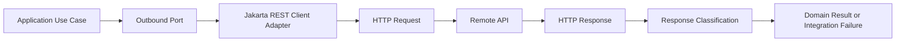
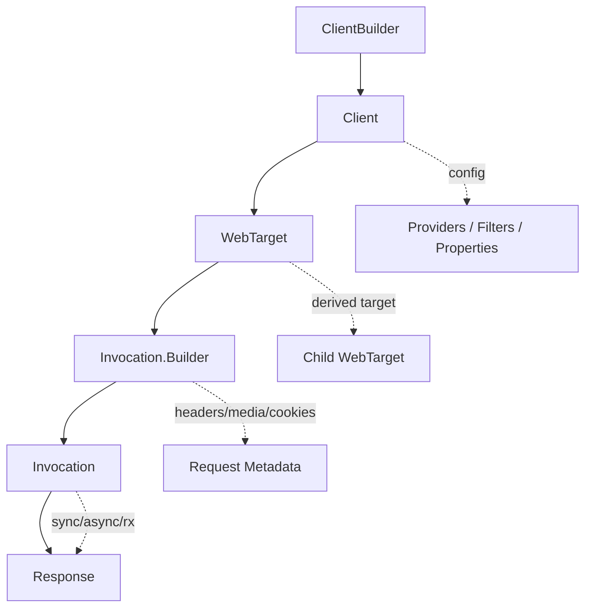
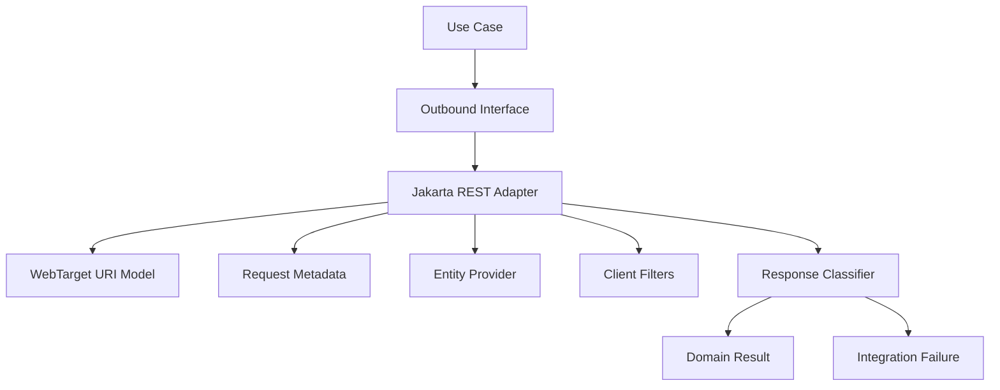

# Part 021 — Jakarta REST Client API Mental Model

> Goal: treat outbound REST calls as a first-class architectural boundary, not as random `HttpClient` calls hidden inside service methods.

By this stage, we already understand server-side Jakarta REST resources, providers, filters, response contracts, validation, and security boundaries. This part switches perspective: **your service is now a client of another HTTP API**.

The common beginner model is:

```java
String json = callUrl("https://api.example.com/cases/123");
```

That model is too weak for production systems. It ignores:

- lifecycle ownership;
- provider registration;
- connection reuse;
- timeout discipline;
- response classification;
- entity stream ownership;
- outbound observability;
- DTO contract drift;
- security token propagation;
- retry eligibility;
- idempotency;
- testability.

A top-tier engineer sees a REST client as a **protocol adapter** that converts internal intent into an explicit, observable, and failure-aware HTTP interaction.



The Jakarta REST Client API gives us a standard fluent client API in the same ecosystem as server-side Jakarta REST. It is **not restricted to calling Jakarta REST servers**. It can call any HTTP web resource.

---

## 1. Kaufman Deconstruction

Using Josh Kaufman's learning model, we break “can use Jakarta REST Client API” into smaller skills.

### 1.1 Target Performance Level

After this part, you should be able to:

1. create and configure a reusable `Client`;
2. model remote base URLs using `WebTarget`;
3. construct requests with path templates, query parameters, headers, accepted media types, and entity bodies;
4. handle `Response` safely without leaking resources;
5. deserialize successful responses into DTOs;
6. classify non-2xx responses intentionally;
7. register providers, filters, and features on the client side;
8. design a client adapter that is testable and observable;
9. know where the Jakarta REST Client API ends and where resilience policy begins.

### 1.2 Sub-Skills

| Sub-skill | Why it matters |
|---|---|
| `Client` lifecycle | Prevents connection pool churn and resource leaks |
| `WebTarget` modeling | Prevents string-concatenated URL bugs |
| `Invocation.Builder` usage | Makes method/media/header decisions explicit |
| `Entity<T>` usage | Carries body plus media type |
| `Response` handling | Avoids hidden status/body/stream mistakes |
| `GenericType<T>` usage | Preserves generic response type information |
| client providers | Reuses JSON/error/filter logic consistently |
| client filters | Enables auth, correlation IDs, audit, metrics |
| adapter design | Keeps HTTP details out of domain logic |

### 1.3 Practice Loop

For this part, use this practice loop:

1. Build one typed client adapter for a remote `CaseRegistry` API.
2. Add JSON DTO serialization/deserialization.
3. Add a request filter for correlation ID and authorization.
4. Add response classification for `2xx`, `4xx`, `5xx`, and network failure.
5. Add tests using a local fake HTTP server.
6. Refactor until business code does not know Jakarta REST types.

---

## 2. The Core Mental Model

Jakarta REST Client API has a small but important object graph.



Think of each object like this:

| API object | Mental model | Should usually be |
|---|---|---|
| `ClientBuilder` | factory/bootstrapper | short-lived |
| `Client` | configured HTTP client root | long-lived/reused |
| `WebTarget` | immutable-ish URI target builder | reusable/derived |
| `Invocation.Builder` | request metadata builder | per request |
| `Invocation` | prepared request | per request |
| `Response` | HTTP response + entity stream | short-lived and closed |
| `Entity<T>` | outbound body + media type | per request |

The design is deliberately fluent:

```java
Response response = client
    .target("https://registry.example.com")
    .path("cases/{caseId}")
    .resolveTemplate("caseId", "CASE-2026-001")
    .request(MediaType.APPLICATION_JSON_TYPE)
    .header("X-Correlation-Id", correlationId)
    .get();
```

This is more than syntactic convenience. It separates concerns:

- `Client` owns configuration and infrastructure.
- `WebTarget` owns URI construction.
- `Invocation.Builder` owns request metadata.
- `Invocation` owns prepared execution.
- `Response` owns the result and entity stream.

---

## 3. Why Use Jakarta REST Client API?

Java already has `java.net.http.HttpClient`. Many frameworks also provide their own clients. So why use Jakarta REST Client API?

Use it when you want:

1. alignment with Jakarta REST providers;
2. reuse of `MessageBodyReader` / `MessageBodyWriter` concepts;
3. a fluent higher-level abstraction than raw HTTP;
4. integration with Jakarta/MicroProfile runtimes;
5. consistent client-side filters and interceptors;
6. portability across Jakarta implementations;
7. a familiar API for teams already using server-side Jakarta REST.

Do not use it blindly. If your architecture is based on a different runtime abstraction, such as Spring WebClient, Vert.x WebClient, or JDK `HttpClient`, the standard Jakarta API may not be your only choice. The decision should be based on runtime consistency, provider ecosystem, observability, timeout support, and operational requirements.

The correct mental model is not:

> “Jakarta REST Client is always better.”

The correct model is:

> “Jakarta REST Client is a standard REST client abstraction that integrates well with Jakarta REST concepts and providers.”

---

## 4. Dependencies and Runtime Boundary

In a full Jakarta EE runtime, the Jakarta REST API may be provided by the platform. In a standalone application, you need both:

1. the Jakarta REST API;
2. an implementation/runtime.

Example API dependency:

```xml
<dependency>
  <groupId>jakarta.ws.rs</groupId>
  <artifactId>jakarta.ws.rs-api</artifactId>
  <version>4.0.0</version>
  <scope>provided</scope>
</dependency>
```

But the API artifact alone is not enough for a standalone application. You need an implementation such as Jersey, RESTEasy, CXF, or a runtime that bundles one.

A common mistake is to add only the API dependency and then wonder why `ClientBuilder.newClient()` fails at runtime. The API defines contracts; an implementation performs the actual work.

### 4.1 Implementation Boundary

Your application code should depend on `jakarta.ws.rs.client.*` where possible:

```java
import jakarta.ws.rs.client.Client;
import jakarta.ws.rs.client.ClientBuilder;
import jakarta.ws.rs.client.Entity;
import jakarta.ws.rs.client.WebTarget;
import jakarta.ws.rs.core.MediaType;
import jakarta.ws.rs.core.Response;
```

Avoid leaking implementation-specific types unless a deliberate decision is made:

```java
// Avoid in portable application code unless intentionally targeting Jersey.
org.glassfish.jersey.client.ClientConfig config;
```

Implementation-specific configuration is sometimes necessary for:

- connection pooling;
- TLS configuration;
- proxy settings;
- timeout properties;
- compression;
- native image constraints;
- runtime-specific observability.

But isolate it near bootstrap. Do not scatter vendor properties across business code.

---

## 5. `ClientBuilder`: Bootstrap Layer

`ClientBuilder` creates `Client` instances.

```java
Client client = ClientBuilder.newClient();
```

You can also configure before building:

```java
Client client = ClientBuilder.newBuilder()
    .register(CorrelationIdClientFilter.class)
    .register(JsonProviderFeature.class)
    .build();
```

A `ClientBuilder` is not the architectural center. It is a bootstrapper. Once the `Client` exists, the `Client` becomes the root of outbound calls.

### 5.1 What Belongs in Client Bootstrap?

Put stable cross-cutting configuration here:

- JSON provider setup;
- correlation ID request filter;
- auth token filter if token source is generic;
- client-side logging filter with redaction;
- metrics/tracing filters;
- default headers if truly global;
- implementation-level timeouts;
- TLS and hostname verification;
- proxy configuration;
- connection pool configuration.

Do not put per-use-case decisions here:

- specific case ID;
- per-command idempotency key;
- request body;
- per-call `Accept` override;
- user-specific authorization decision if it depends on operation context.

---

## 6. `Client`: Heavy Root Object

A `Client` is the main entry point for building and executing requests. It is also a configurable object that manages underlying communication infrastructure.

Treat `Client` as **expensive enough to reuse**.

Bad:

```java
public CaseDto findCase(String caseId) {
    Client client = ClientBuilder.newClient();
    try {
        return client.target(baseUrl)
            .path("cases/{id}")
            .resolveTemplate("id", caseId)
            .request(MediaType.APPLICATION_JSON_TYPE)
            .get(CaseDto.class);
    } finally {
        client.close();
    }
}
```

This creates a new client for every request. In real systems, that may destroy connection reuse and add unnecessary allocation/configuration overhead.

Better:

```java
public final class CaseRegistryClient implements AutoCloseable {

    private final Client client;
    private final WebTarget cases;

    public CaseRegistryClient(Client client, URI baseUri) {
        this.client = Objects.requireNonNull(client);
        this.cases = client.target(baseUri).path("cases");
    }

    public CaseDto findCase(String caseId) {
        return cases
            .path("{id}")
            .resolveTemplate("id", caseId)
            .request(MediaType.APPLICATION_JSON_TYPE)
            .get(CaseDto.class);
    }

    @Override
    public void close() {
        client.close();
    }
}
```

In container-managed environments, the container may own the client lifecycle. In self-managed code, your application must close it during shutdown.

### 6.1 Ownership Rule

Use this invariant:

> The component that creates the `Client` owns closing it.

If a `Client` is injected by the container, do not close it inside a random adapter method. If your adapter creates it, the adapter or composition root must close it.

---

## 7. `WebTarget`: URI Modeling Layer

`WebTarget` represents a target URI or URI template.

```java
WebTarget registry = client.target("https://registry.example.com/api");
WebTarget cases = registry.path("cases");
WebTarget caseById = cases.path("{caseId}");
```

This is safer than manual string concatenation.

Bad:

```java
String url = baseUrl + "/cases/" + caseId + "?include=" + include;
```

Better:

```java
Response response = client.target(baseUri)
    .path("cases/{caseId}")
    .resolveTemplate("caseId", caseId)
    .queryParam("include", "parties", "evidenceSummary")
    .request(MediaType.APPLICATION_JSON_TYPE)
    .get();
```

### 7.1 URI Templates

A target may contain placeholders:

```java
WebTarget target = client
    .target("https://registry.example.com")
    .path("cases/{caseId}/events/{eventId}");

URI uri = target
    .resolveTemplate("caseId", "CASE-001")
    .resolveTemplate("eventId", "EVT-777")
    .getUri();
```

### 7.2 Query Parameters

```java
WebTarget target = client.target(baseUri)
    .path("cases")
    .queryParam("status", "OPEN")
    .queryParam("sort", "createdAt:desc")
    .queryParam("limit", 50);
```

Important: query parameters are part of the resource identifier and contract. Do not let every caller invent its own grammar. Model query options explicitly.

```java
public record CaseSearchQuery(
    String status,
    Instant createdAfter,
    int limit,
    String cursor
) {}
```

Then centralize URI building:

```java
private WebTarget applySearch(WebTarget target, CaseSearchQuery query) {
    WebTarget t = target;

    if (query.status() != null) {
        t = t.queryParam("status", query.status());
    }
    if (query.createdAfter() != null) {
        t = t.queryParam("createdAfter", query.createdAfter().toString());
    }
    if (query.cursor() != null) {
        t = t.queryParam("cursor", query.cursor());
    }

    return t.queryParam("limit", query.limit());
}
```

### 7.3 Avoid Hidden URL Logic

Do not let business code assemble remote URLs:

```java
// Bad: use case knows remote API shape.
String url = registryBase + "/cases/" + command.caseId() + "/escalations";
registryHttpClient.post(url, command);
```

Prefer an outbound port:

```java
public interface CaseRegistryGateway {
    EscalationRef createEscalation(CreateEscalationRequest request);
}
```

And one Jakarta REST adapter owns the URL details:

```java
public final class JakartaRestCaseRegistryGateway implements CaseRegistryGateway {
    private final WebTarget cases;

    public JakartaRestCaseRegistryGateway(Client client, URI baseUri) {
        this.cases = client.target(baseUri).path("cases");
    }

    @Override
    public EscalationRef createEscalation(CreateEscalationRequest request) {
        return cases
            .path("{caseId}/escalations")
            .resolveTemplate("caseId", request.caseId())
            .request(MediaType.APPLICATION_JSON_TYPE)
            .post(Entity.json(request), EscalationRef.class);
    }
}
```

---

## 8. `Invocation.Builder`: Request Metadata Layer

`request()` creates an `Invocation.Builder`.

```java
Invocation.Builder request = target.request(MediaType.APPLICATION_JSON_TYPE);
```

The builder controls request metadata:

```java
Response response = target
    .request(MediaType.APPLICATION_JSON_TYPE)
    .header("X-Correlation-Id", correlationId)
    .header("Idempotency-Key", idempotencyKey)
    .acceptLanguage(Locale.ENGLISH)
    .get();
```

Common metadata:

| Concern | API |
|---|---|
| accepted response type | `request(MediaType.APPLICATION_JSON_TYPE)` / `.accept(...)` |
| request body type | `Entity.entity(body, mediaType)` / `Entity.json(body)` |
| custom header | `.header(name, value)` |
| cookie | `.cookie(...)` |
| language | `.acceptLanguage(...)` |
| cache validation | `.header("If-None-Match", etag)` |
| optimistic concurrency | `.header("If-Match", etag)` |

### 8.1 Avoid Global Headers for Per-Request Data

Bad:

```java
client.property("current-user", userId);
```

Better:

```java
target.request(MediaType.APPLICATION_JSON_TYPE)
    .header("X-Actor-Id", actorId)
    .post(Entity.json(command));
```

Better still, if a header must be set on every request from request context, use a client request filter that reads a request-scoped context safely.

---

## 9. Basic GET

```java
public CaseDto getCase(String caseId) {
    return cases
        .path("{caseId}")
        .resolveTemplate("caseId", caseId)
        .request(MediaType.APPLICATION_JSON_TYPE)
        .get(CaseDto.class);
}
```

This is concise but hides status classification. It may be acceptable for throwaway examples, but production code should be more explicit.

More explicit:

```java
public Optional<CaseDto> findCase(String caseId) {
    try (Response response = cases
        .path("{caseId}")
        .resolveTemplate("caseId", caseId)
        .request(MediaType.APPLICATION_JSON_TYPE)
        .get()) {

        return switch (response.getStatus()) {
            case 200 -> Optional.of(response.readEntity(CaseDto.class));
            case 404 -> Optional.empty();
            default -> throw RemoteApiException.from(response);
        };
    }
}
```

This is longer, but it captures the business semantics: `404` means “case absent”, not necessarily “system failed”.

---

## 10. POST with JSON Entity

```java
public EscalationRef createEscalation(CreateEscalationRequest request) {
    try (Response response = cases
        .path("{caseId}/escalations")
        .resolveTemplate("caseId", request.caseId())
        .request(MediaType.APPLICATION_JSON_TYPE)
        .header("Idempotency-Key", request.idempotencyKey())
        .post(Entity.entity(request, MediaType.APPLICATION_JSON_TYPE))) {

        if (response.getStatus() == 201) {
            URI location = response.getLocation();
            EscalationRef body = response.readEntity(EscalationRef.class);
            return body.withLocation(location);
        }

        throw RemoteApiException.from(response);
    }
}
```

`Entity<T>` matters because the request body alone is not enough. The body must be paired with a media type.

Convenience:

```java
Entity<CreateEscalationRequest> entity = Entity.json(request);
```

Explicit:

```java
Entity<CreateEscalationRequest> entity =
    Entity.entity(request, MediaType.APPLICATION_JSON_TYPE);
```

Use explicit media types when versioning or vendor media types are involved:

```java
MediaType CASE_COMMAND_V1 = MediaType.valueOf(
    "application/vnd.example.case-command.v1+json"
);

Entity<CreateEscalationRequest> entity = Entity.entity(request, CASE_COMMAND_V1);
```

---

## 11. PUT, PATCH, DELETE

### 11.1 PUT

```java
public CaseDto replaceCase(String caseId, ReplaceCaseRequest request, String etag) {
    try (Response response = cases
        .path("{caseId}")
        .resolveTemplate("caseId", caseId)
        .request(MediaType.APPLICATION_JSON_TYPE)
        .header("If-Match", etag)
        .put(Entity.json(request))) {

        return switch (response.getStatus()) {
            case 200 -> response.readEntity(CaseDto.class);
            case 204 -> null;
            case 412 -> throw new OptimisticConcurrencyFailure(caseId);
            default -> throw RemoteApiException.from(response);
        };
    }
}
```

`PUT` should normally represent replacement or deterministic upsert semantics. If your operation is a business command, do not force it into `PUT` just to look RESTful.

### 11.2 PATCH

```java
public CaseDto patchCase(String caseId, JsonMergePatch patch, String etag) {
    try (Response response = cases
        .path("{caseId}")
        .resolveTemplate("caseId", caseId)
        .request(MediaType.APPLICATION_JSON_TYPE)
        .header("If-Match", etag)
        .method("PATCH", Entity.entity(patch, "application/merge-patch+json"))) {

        return switch (response.getStatus()) {
            case 200 -> response.readEntity(CaseDto.class);
            case 412 -> throw new OptimisticConcurrencyFailure(caseId);
            default -> throw RemoteApiException.from(response);
        };
    }
}
```

Jakarta REST provides generic `.method(...)`, so you can use HTTP methods beyond convenience methods.

### 11.3 DELETE

```java
public boolean deleteAttachment(String caseId, String attachmentId) {
    try (Response response = cases
        .path("{caseId}/attachments/{attachmentId}")
        .resolveTemplate("caseId", caseId)
        .resolveTemplate("attachmentId", attachmentId)
        .request()
        .delete()) {

        return switch (response.getStatus()) {
            case 204 -> true;
            case 404 -> false;
            default -> throw RemoteApiException.from(response);
        };
    }
}
```

Here `404` may be modeled as already deleted or absent depending on your business contract. Do not let that decision hide inside a generic HTTP utility.

---

## 12. `Response`: Handle It Like a Resource

`Response` represents the status, headers, and entity stream. Treat it as closeable.

Correct:

```java
try (Response response = target.request().get()) {
    int status = response.getStatus();
    String body = response.readEntity(String.class);
}
```

Risky:

```java
Response response = target.request().get();
return response.readEntity(CaseDto.class);
```

If you do not close responses, you can leak connections or prevent reuse depending on the implementation and whether the entity stream is fully consumed.

### 12.1 Status Before Body

A disciplined response handler usually reads status first:

```java
try (Response response = target.request(MediaType.APPLICATION_JSON_TYPE).get()) {
    Response.Status.Family family = response.getStatusInfo().getFamily();

    if (family == Response.Status.Family.SUCCESSFUL) {
        return response.readEntity(CaseDto.class);
    }

    ErrorEnvelope error = safeReadError(response);
    throw RemoteApiException.of(response.getStatus(), error);
}
```

### 12.2 Read Entity Once

Entity streams are generally one-shot unless buffered.

Bad:

```java
String raw = response.readEntity(String.class);
ErrorEnvelope error = response.readEntity(ErrorEnvelope.class); // may fail
```

Better:

```java
String raw = response.readEntity(String.class);
ErrorEnvelope error = parseError(raw);
```

Or buffer deliberately:

```java
response.bufferEntity();
String raw = response.readEntity(String.class);
ErrorEnvelope error = response.readEntity(ErrorEnvelope.class);
```

Do not buffer large responses blindly. Buffering is a memory decision.

### 12.3 Generic Response Types

For generic response types, use `GenericType<T>`.

```java
GenericType<List<CaseDto>> caseListType = new GenericType<>() {};

List<CaseDto> cases = target
    .request(MediaType.APPLICATION_JSON_TYPE)
    .get(caseListType);
```

The same applies to `Response.readEntity(...)`:

```java
try (Response response = target.request().get()) {
    List<CaseDto> cases = response.readEntity(new GenericType<List<CaseDto>>() {});
}
```

Without `GenericType`, Java erasure prevents the provider from seeing the full element type.

---

## 13. Typed Convenience vs Explicit Response

Jakarta REST Client allows both styles:

```java
CaseDto dto = target.request().get(CaseDto.class);
```

and:

```java
try (Response response = target.request().get()) {
    // classify explicitly
}
```

Use typed convenience when:

- the remote contract is stable;
- non-2xx behavior is already handled elsewhere;
- this is an internal low-risk call;
- the call is wrapped by a generated/typed client with clear error handling.

Use explicit `Response` when:

- `404` has domain meaning;
- `409` maps to a business conflict;
- `412` maps to optimistic lock failure;
- `429` maps to throttling;
- response headers matter;
- `Location`, `ETag`, `Retry-After`, or pagination links matter;
- you need to capture error body;
- auditability matters.

In regulated systems, explicit `Response` handling is usually preferable at the adapter boundary.

---

## 14. Client-Side Providers

One of the strongest reasons to use Jakarta REST Client API is provider reuse.

Client-side providers can include:

- `MessageBodyReader`;
- `MessageBodyWriter`;
- `ClientRequestFilter`;
- `ClientResponseFilter`;
- `ReaderInterceptor`;
- `WriterInterceptor`;
- `ContextResolver`;
- `Feature`.

Register globally on `Client`:

```java
Client client = ClientBuilder.newBuilder()
    .register(CorrelationIdClientFilter.class)
    .register(OutboundAuditFilter.class)
    .register(JsonbContextResolver.class)
    .build();
```

Register on a target:

```java
WebTarget target = client
    .target(baseUri)
    .register(SpecialPartnerProvider.class);
```

### 14.1 Provider Scope Strategy

| Scope | Use for |
|---|---|
| `Client` | global provider/filter behavior for all outbound calls |
| `WebTarget` | remote-service-specific behavior |
| per request | request metadata, not provider registration |

Avoid registering providers dynamically inside hot request paths.

Bad:

```java
public CaseDto getCase(String id) {
    return client
        .target(baseUri)
        .register(new TemporaryJsonProvider())
        .path("cases/{id}")
        .resolveTemplate("id", id)
        .request()
        .get(CaseDto.class);
}
```

Provider registration should be part of adapter composition, not per-call improvisation.

---

## 15. Client Request Filters

A `ClientRequestFilter` can mutate or observe outbound requests before they are sent.

Example: correlation ID propagation.

```java
@Provider
public final class CorrelationIdClientFilter implements ClientRequestFilter {

    private final CorrelationContext correlationContext;

    public CorrelationIdClientFilter(CorrelationContext correlationContext) {
        this.correlationContext = correlationContext;
    }

    @Override
    public void filter(ClientRequestContext requestContext) {
        correlationContext.currentId().ifPresent(id ->
            requestContext.getHeaders().putSingle("X-Correlation-Id", id)
        );
    }
}
```

Example: bearer token.

```java
@Provider
public final class BearerTokenClientFilter implements ClientRequestFilter {

    private final TokenProvider tokenProvider;

    public BearerTokenClientFilter(TokenProvider tokenProvider) {
        this.tokenProvider = tokenProvider;
    }

    @Override
    public void filter(ClientRequestContext requestContext) {
        String token = tokenProvider.currentAccessToken();
        requestContext.getHeaders().putSingle("Authorization", "Bearer " + token);
    }
}
```

### 15.1 Filter Rules

A good client request filter:

- does not perform heavy blocking work unless unavoidable;
- does not log secrets;
- does not mutate request bodies casually;
- does not decide business semantics;
- uses clear request properties if it needs per-call hints;
- fails safely when required auth context is missing.

---

## 16. Client Response Filters

A `ClientResponseFilter` observes or modifies inbound responses before the application receives them.

Example: capture remote service metadata.

```java
@Provider
public final class RemoteMetadataClientFilter implements ClientResponseFilter {

    @Override
    public void filter(
        ClientRequestContext requestContext,
        ClientResponseContext responseContext
    ) {
        String requestId = responseContext.getHeaderString("X-Request-Id");
        if (requestId != null) {
            requestContext.setProperty("remote.requestId", requestId);
        }
    }
}
```

Use response filters for:

- metrics tagging;
- correlation capture;
- tracing;
- safe response metadata logging;
- security header verification in certain internal systems.

Avoid using response filters for deep business error classification. That usually belongs in the adapter method where status has domain meaning.

---

## 17. Request Properties for Per-Call Hints

Sometimes a global filter needs per-call context. Use request properties instead of thread-local hacks when possible.

```java
Response response = target
    .request(MediaType.APPLICATION_JSON_TYPE)
    .property("audit.operation", "CASE_ESCALATION_CREATE")
    .post(Entity.json(command));
```

Filter:

```java
@Provider
public final class AuditClientFilter implements ClientRequestFilter {

    @Override
    public void filter(ClientRequestContext requestContext) {
        Object operation = requestContext.getProperty("audit.operation");
        if (operation != null) {
            requestContext.getHeaders().putSingle("X-Audit-Operation", operation.toString());
        }
    }
}
```

This keeps cross-cutting behavior centralized while still allowing operation-specific metadata.

---

## 18. Error Classification Adapter

A reusable response classifier is better than repeated switch statements everywhere.

```java
public final class RemoteResponseClassifier {

    public <T> T readOrThrow(Response response, Class<T> successType) {
        int status = response.getStatus();

        if (status >= 200 && status < 300) {
            if (successType == Void.class) {
                return null;
            }
            return response.readEntity(successType);
        }

        ErrorEnvelope error = readError(response);
        throw classify(status, error);
    }

    private ErrorEnvelope readError(Response response) {
        if (!response.hasEntity()) {
            return ErrorEnvelope.empty();
        }

        String raw = response.readEntity(String.class);
        return ErrorEnvelope.parseLeniently(raw);
    }

    private RuntimeException classify(int status, ErrorEnvelope error) {
        return switch (status) {
            case 400 -> new RemoteValidationException(error);
            case 401 -> new RemoteAuthenticationException(error);
            case 403 -> new RemoteAuthorizationException(error);
            case 404 -> new RemoteNotFoundException(error);
            case 409 -> new RemoteConflictException(error);
            case 412 -> new RemotePreconditionFailedException(error);
            case 429 -> new RemoteRateLimitedException(error);
            default -> {
                if (status >= 500) {
                    yield new RemoteServiceUnavailableException(error);
                }
                yield new RemoteApiException(status, error);
            }
        };
    }
}
```

Then adapter methods stay readable:

```java
public CaseDto getCase(String caseId) {
    try (Response response = cases
        .path("{caseId}")
        .resolveTemplate("caseId", caseId)
        .request(MediaType.APPLICATION_JSON_TYPE)
        .get()) {

        return classifier.readOrThrow(response, CaseDto.class);
    }
}
```

### 18.1 Do Not Over-Generalize

A classifier should not erase domain meaning.

Example: `404` means different things in different operations.

| Operation | `404` meaning |
|---|---|
| `GET /cases/{id}` | case absent |
| `POST /cases/{id}/escalations` | cannot escalate nonexistent case |
| `DELETE /attachments/{id}` | already absent may be acceptable |
| `GET /configuration/{key}` | deployment/config mismatch |

So build a shared low-level classifier, but let adapter methods decide domain meaning.

---

## 19. Domain Result Instead of HTTP Leakage

Avoid returning Jakarta REST types to business use cases.

Bad:

```java
public Response escalateCase(EscalationCommand command) {
    return registryClient.post(command);
}
```

This leaks HTTP into domain/application logic.

Better:

```java
public sealed interface EscalationSubmissionResult {
    record Accepted(String escalationId, URI location) implements EscalationSubmissionResult {}
    record Duplicate(String escalationId) implements EscalationSubmissionResult {}
    record Rejected(String reasonCode) implements EscalationSubmissionResult {}
}
```

Adapter:

```java
public EscalationSubmissionResult submit(EscalationCommand command) {
    try (Response response = target
        .path("cases/{caseId}/escalations")
        .resolveTemplate("caseId", command.caseId())
        .request(MediaType.APPLICATION_JSON_TYPE)
        .header("Idempotency-Key", command.idempotencyKey())
        .post(Entity.json(command))) {

        return switch (response.getStatus()) {
            case 201 -> {
                EscalationCreated body = response.readEntity(EscalationCreated.class);
                yield new EscalationSubmissionResult.Accepted(
                    body.escalationId(),
                    response.getLocation()
                );
            }
            case 200 -> {
                EscalationCreated body = response.readEntity(EscalationCreated.class);
                yield new EscalationSubmissionResult.Duplicate(body.escalationId());
            }
            case 422 -> {
                ErrorEnvelope error = response.readEntity(ErrorEnvelope.class);
                yield new EscalationSubmissionResult.Rejected(error.code());
            }
            default -> throw RemoteApiException.from(response);
        };
    }
}
```

The use case now sees business outcomes, not raw HTTP plumbing.

---

## 20. DTO Contracts

Outbound DTOs are part of your integration contract. Treat them as stable external representations.

```java
public record CreateEscalationRequest(
    String caseId,
    String reasonCode,
    String requestedBy,
    Instant requestedAt,
    String idempotencyKey
) {}

public record EscalationCreated(
    String escalationId,
    String status,
    Instant createdAt
) {}
```

Do not reuse internal domain entities as outbound DTOs.

Bad:

```java
client.target(baseUri)
    .path("cases")
    .request()
    .post(Entity.json(caseJpaEntity));
```

Problems:

- persistence fields leak;
- lazy-loaded relationships may serialize accidentally;
- internal names become external contract;
- backward compatibility becomes harder;
- security-sensitive fields may be exposed;
- changes in persistence model break remote API integration.

Use explicit DTOs even when they feel repetitive.

---

## 21. Handling Headers

Headers often carry protocol-level meaning.

### 21.1 Location Header

```java
URI location = response.getLocation();
```

Use after `201 Created`.

### 21.2 ETag Header

```java
EntityTag etag = response.getEntityTag();
```

Use for cache validation and optimistic concurrency.

### 21.3 Retry-After Header

```java
String retryAfter = response.getHeaderString("Retry-After");
```

Useful for `429 Too Many Requests` or `503 Service Unavailable`.

### 21.4 Link Headers

```java
Set<Link> links = response.getLinks();
```

Useful for pagination or hypermedia-style APIs.

### 21.5 Header Discipline

Do not parse protocol headers in random call sites. Centralize where possible:

```java
public record RemoteFailureMetadata(
    String remoteRequestId,
    String retryAfter,
    String correlationId
) {}
```

---

## 22. Conditional Requests from Client Side

Client-side conditional requests are essential when a remote API exposes versioned resources.

### 22.1 Conditional GET

```java
public CachedCaseResult getCaseIfChanged(String caseId, EntityTag knownEtag) {
    Invocation.Builder builder = cases
        .path("{caseId}")
        .resolveTemplate("caseId", caseId)
        .request(MediaType.APPLICATION_JSON_TYPE);

    if (knownEtag != null) {
        builder.header("If-None-Match", knownEtag.toString());
    }

    try (Response response = builder.get()) {
        return switch (response.getStatus()) {
            case 200 -> new CachedCaseResult.Changed(
                response.readEntity(CaseDto.class),
                response.getEntityTag()
            );
            case 304 -> new CachedCaseResult.NotChanged(knownEtag);
            default -> throw RemoteApiException.from(response);
        };
    }
}
```

### 22.2 Optimistic Update

```java
public CaseDto updateCase(String caseId, ReplaceCaseRequest request, EntityTag etag) {
    try (Response response = cases
        .path("{caseId}")
        .resolveTemplate("caseId", caseId)
        .request(MediaType.APPLICATION_JSON_TYPE)
        .header("If-Match", etag.toString())
        .put(Entity.json(request))) {

        return switch (response.getStatus()) {
            case 200 -> response.readEntity(CaseDto.class);
            case 412 -> throw new OptimisticConcurrencyFailure(caseId);
            default -> throw RemoteApiException.from(response);
        };
    }
}
```

In case-management systems, conditional updates are often more defensible than last-write-wins updates.

---

## 23. Asynchronous Invocation

The client API also supports asynchronous invocation.

```java
Future<Response> future = target
    .request(MediaType.APPLICATION_JSON_TYPE)
    .async()
    .get();
```

Callback style:

```java
target.request(MediaType.APPLICATION_JSON_TYPE)
    .async()
    .get(new InvocationCallback<CaseDto>() {
        @Override
        public void completed(CaseDto response) {
            // handle success
        }

        @Override
        public void failed(Throwable throwable) {
            // handle failure
        }
    });
```

Use async when:

- you can compose results without blocking request threads;
- implementation/runtime has a real async transport path;
- you need parallel outbound calls;
- you understand cancellation and timeout behavior.

Do not use async just to appear modern. Async without bounded concurrency and timeouts often creates harder-to-debug failures.

### 23.1 Parallel Calls Example

```java
Future<CaseDto> caseFuture = cases
    .path("{id}")
    .resolveTemplate("id", caseId)
    .request(MediaType.APPLICATION_JSON_TYPE)
    .async()
    .get(CaseDto.class);

Future<List<EvidenceDto>> evidenceFuture = evidence
    .queryParam("caseId", caseId)
    .request(MediaType.APPLICATION_JSON_TYPE)
    .async()
    .get(new GenericType<List<EvidenceDto>>() {});
```

This can reduce latency, but only if:

- both calls are independent;
- remote services can handle concurrency;
- your client pool is sized correctly;
- you enforce deadlines;
- you handle partial failure.

---

## 24. Reactive Invokers

Jakarta REST Client API includes a reactive invoker abstraction. In Jakarta REST 4.0 API docs, `CompletionStageRxInvoker` is listed as a reactive invoker based on `CompletionStage`.

Conceptually:

```java
CompletionStage<CaseDto> stage = target
    .request(MediaType.APPLICATION_JSON_TYPE)
    .rx()
    .get(CaseDto.class);
```

This is useful when composing with other `CompletionStage` workflows.

But remember: reactive API shape does not automatically mean the entire stack is non-blocking. The runtime implementation, connector, thread model, and downstream service behavior all matter.

---

## 25. Timeouts: API vs Implementation Reality

Jakarta REST Client API defines the standard abstraction, but timeout configuration is often implementation-specific or runtime-specific.

Common timeout categories:

| Timeout | Meaning |
|---|---|
| connect timeout | time to establish connection |
| read/socket timeout | time waiting for data |
| request timeout/deadline | total allowed request duration |
| pool acquisition timeout | time waiting for a pooled connection |
| DNS timeout | time resolving host |
| TLS handshake timeout | time completing TLS |

Do not assume one timeout property covers all categories.

Adapter configuration should make timeout policy visible:

```java
public record RemoteClientTimeouts(
    Duration connectTimeout,
    Duration readTimeout,
    Duration totalDeadline
) {}
```

Then map to implementation-specific settings in one place.

```java
public final class CaseRegistryClientFactory {

    public CaseRegistryClient create(URI baseUri, RemoteClientTimeouts timeouts) {
        Client client = ClientBuilder.newBuilder()
            .register(CorrelationIdClientFilter.class)
            // implementation-specific properties go here
            .build();

        return new CaseRegistryClient(client, baseUri);
    }
}
```

Part 022 will go deeper into resilience policy.

---

## 26. Observability for Outbound Calls

An outbound REST client should emit enough information to debug production failures without exposing sensitive data.

Minimum useful telemetry:

| Signal | Example |
|---|---|
| remote service name | `case-registry` |
| HTTP method | `GET` |
| route template | `/cases/{caseId}` |
| status family | `2xx`, `4xx`, `5xx` |
| exact status | `404`, `503`, etc. |
| duration | milliseconds |
| timeout flag | true/false |
| retry attempt | attempt number |
| remote request ID | from response header |
| correlation ID | propagated from inbound request |

Do not log full URLs if they contain sensitive query params. Prefer route templates.

Bad:

```text
GET https://registry.example.com/cases?name=John%20Doe&nationalId=123456789
```

Better:

```text
remote_call service=case-registry method=GET route=/cases status=200 durationMs=37 correlationId=...
```

---

## 27. Authentication and Token Propagation

Client-side auth can be explicit per request:

```java
Response response = target
    .request(MediaType.APPLICATION_JSON_TYPE)
    .header("Authorization", "Bearer " + token)
    .get();
```

Or centralized in a filter:

```java
@Provider
public final class ServiceTokenFilter implements ClientRequestFilter {
    private final ServiceTokenProvider tokenProvider;

    public ServiceTokenFilter(ServiceTokenProvider tokenProvider) {
        this.tokenProvider = tokenProvider;
    }

    @Override
    public void filter(ClientRequestContext requestContext) {
        requestContext.getHeaders().putSingle(
            "Authorization",
            "Bearer " + tokenProvider.getToken()
        );
    }
}
```

Use explicit auth when the token is operation-specific. Use a filter when the token policy is uniform for that remote service.

### 27.1 Do Not Blindly Forward Inbound Tokens

Forwarding an inbound user token to downstream services may be correct in some architectures, but dangerous in others.

Ask:

- Is the downstream service allowed to receive this user token?
- Does the token audience include the downstream service?
- Should we use token exchange instead?
- Should we call as service identity with actor context separately?
- Are we leaking privileges across trust boundaries?

For regulated workflows, a common pattern is:

```text
Authorization: Bearer <service-token>
X-Actor-Id: <end-user-id>
X-Actor-Roles: <optional scoped roles>
X-Correlation-Id: <correlation-id>
```

But only if your security architecture explicitly supports it.

---

## 28. Building a Production Adapter

A production adapter should not be just a thin wrapper around `Client`.

It should own:

- base URI;
- route construction;
- media types;
- DTO mapping assumptions;
- auth/correlation headers;
- idempotency header placement;
- response classification;
- exception translation;
- telemetry names;
- timeout/resilience policy hooks;
- test fakes.

Example structure:

```java
public interface CaseRegistryGateway {
    Optional<CaseSnapshot> findCase(String caseId);
    EscalationSubmissionResult submitEscalation(EscalationCommand command);
    EvidenceUploadResult uploadEvidence(EvidenceUploadCommand command);
}
```

Implementation:

```java
public final class JakartaRestCaseRegistryGateway implements CaseRegistryGateway {

    private final WebTarget cases;
    private final RemoteResponseClassifier classifier;

    public JakartaRestCaseRegistryGateway(
        Client client,
        URI baseUri,
        RemoteResponseClassifier classifier
    ) {
        this.cases = client.target(baseUri).path("cases");
        this.classifier = classifier;
    }

    @Override
    public Optional<CaseSnapshot> findCase(String caseId) {
        try (Response response = cases
            .path("{caseId}")
            .resolveTemplate("caseId", caseId)
            .request(MediaType.APPLICATION_JSON_TYPE)
            .get()) {

            return switch (response.getStatus()) {
                case 200 -> Optional.of(response.readEntity(CaseSnapshot.class));
                case 404 -> Optional.empty();
                default -> throw classifier.failure(response);
            };
        }
    }

    @Override
    public EscalationSubmissionResult submitEscalation(EscalationCommand command) {
        CreateEscalationRequest body = CreateEscalationRequest.from(command);

        try (Response response = cases
            .path("{caseId}/escalations")
            .resolveTemplate("caseId", command.caseId())
            .request(MediaType.APPLICATION_JSON_TYPE)
            .header("Idempotency-Key", command.idempotencyKey())
            .post(Entity.json(body))) {

            return switch (response.getStatus()) {
                case 201 -> {
                    EscalationCreated created = response.readEntity(EscalationCreated.class);
                    yield EscalationSubmissionResult.accepted(
                        created.escalationId(),
                        response.getLocation()
                    );
                }
                case 200 -> {
                    EscalationCreated existing = response.readEntity(EscalationCreated.class);
                    yield EscalationSubmissionResult.duplicate(existing.escalationId());
                }
                case 409 -> {
                    ErrorEnvelope error = response.readEntity(ErrorEnvelope.class);
                    yield EscalationSubmissionResult.rejected(error.code());
                }
                default -> throw classifier.failure(response);
            };
        }
    }
}
```

Notice what is missing from business logic:

- no `WebTarget`;
- no string URL concatenation;
- no HTTP status switches outside the adapter;
- no JSON provider details;
- no bearer header mechanics;
- no response stream handling.

That is the goal.

---

## 29. Testing Client Adapters

Do not test Jakarta REST internals. Test your adapter contract.

Recommended tests:

1. request path and query construction;
2. request method and media type;
3. required headers;
4. request body shape;
5. successful response mapping;
6. `404`/`409`/`412` business mapping;
7. `429`/`503` failure mapping;
8. invalid JSON response handling;
9. timeout/network failure classification;
10. sensitive data redaction in logs.

Use a local fake HTTP server or test container, not a live remote service.

Example pseudo-test:

```java
@Test
void submitEscalationSendsIdempotencyKey() {
    fakeServer.stubPost("/cases/CASE-1/escalations")
        .withHeader("Idempotency-Key", "idem-123")
        .respond(201, "application/json", """
            {"escalationId":"ESC-1","status":"CREATED","createdAt":"2026-06-27T10:00:00Z"}
        """);

    EscalationSubmissionResult result = gateway.submitEscalation(command);

    assertThat(result).isInstanceOf(EscalationSubmissionResult.Accepted.class);
}
```

Testing should prove your adapter speaks the expected remote contract.

---

## 30. Common Anti-Patterns

### 30.1 New Client Per Request

```java
ClientBuilder.newClient().target(url).request().get();
```

Impact:

- poor connection reuse;
- difficult shutdown;
- repeated provider registration;
- unnecessary object churn.

### 30.2 Raw `Response` Leaking Upward

```java
public Response callRegistry(...) { ... }
```

Impact:

- HTTP concerns leak into use cases;
- response stream ownership becomes unclear;
- status classification becomes duplicated.

### 30.3 Catch-All Integration Exception

```java
catch (Exception e) {
    throw new RuntimeException("Remote API failed", e);
}
```

Impact:

- no distinction between validation, auth, conflict, throttling, dependency outage;
- impossible retry policy;
- poor observability.

### 30.4 Silent Typed GET

```java
return target.request().get(CaseDto.class);
```

Impact:

- hides `404`/`409`/`429` semantics;
- loses response headers;
- may throw provider/runtime exceptions without useful context.

Typed convenience is fine when wrapped by a robust client abstraction. It is risky as application architecture.

### 30.5 URL String Concatenation

```java
baseUrl + "/cases/" + caseId + "/events?limit=" + limit
```

Impact:

- escaping bugs;
- double slash bugs;
- query injection;
- hard-to-test route logic.

### 30.6 Logging Full Bodies by Default

Impact:

- PII leakage;
- credential leakage;
- regulatory risk;
- high memory pressure;
- broken streaming.

Use structured, redacted, metadata-first logging.

---

## 31. Production Checklist

Before using a Jakarta REST client adapter in production, verify:

- [ ] `Client` lifecycle is clear.
- [ ] `Client` is reused, not created per request.
- [ ] responses are closed.
- [ ] base URI is externalized and validated.
- [ ] request paths are built with `WebTarget`, not string concatenation.
- [ ] media types are explicit.
- [ ] request and response DTOs are external contract DTOs.
- [ ] non-2xx responses are classified intentionally.
- [ ] `404`, `409`, `412`, `429`, and `5xx` have clear meanings.
- [ ] timeout policy is configured.
- [ ] retry policy is defined outside raw call code.
- [ ] idempotency keys are used for retryable mutations.
- [ ] correlation IDs are propagated.
- [ ] auth headers are applied safely.
- [ ] logs are redacted.
- [ ] metrics include route template and status family.
- [ ] tests use a fake server or contract test harness.
- [ ] implementation-specific properties are isolated.

---

## 32. Mental Model Summary

The Jakarta REST Client API is not just a convenience wrapper. It is a standardized way to model outbound REST interactions using the same provider/filter/representation concepts as Jakarta REST servers.

A strong engineer designs it as:



The key invariant:

> Business code should express intent; the Jakarta REST client adapter should own HTTP mechanics.

---

## 33. Exercises

### Exercise 1 — Build a Typed Gateway

Create:

```java
public interface CaseRegistryGateway {
    Optional<CaseSnapshot> findCase(String caseId);
}
```

Implement it using Jakarta REST Client API.

Acceptance criteria:

- `200` maps to `Optional.of(...)`;
- `404` maps to `Optional.empty()`;
- all other statuses throw classified exceptions;
- `Response` is always closed;
- base URL is injected;
- no business code sees `Response`.

### Exercise 2 — Add Correlation Filter

Create a `ClientRequestFilter` that adds `X-Correlation-Id`.

Acceptance criteria:

- does not generate a new ID if one exists;
- does not log sensitive values;
- works across multiple outbound calls in the same inbound request.

### Exercise 3 — Add Idempotent POST

Create a method:

```java
EscalationSubmissionResult submitEscalation(EscalationCommand command);
```

Acceptance criteria:

- sends `Idempotency-Key`;
- `201` maps to `Accepted`;
- replay response maps to `Duplicate` if remote API supports it;
- `409` maps to domain rejection;
- `5xx` maps to retryable integration failure.

### Exercise 4 — Test Route Construction

Use a fake HTTP server and verify:

- method;
- path;
- query params;
- headers;
- request body;
- response mapping.

---

## 34. References

- Jakarta RESTful Web Services 4.0 Specification: https://jakarta.ee/specifications/restful-ws/4.0/
- Jakarta REST Client API package docs: https://jakarta.ee/specifications/restful-ws/4.0/apidocs/jakarta.ws.rs/jakarta/ws/rs/client/package-summary
- Jakarta EE Tutorial — Accessing REST Resources with the Jakarta REST Client API: https://jakarta.ee/learn/docs/jakartaee-tutorial/current/websvcs/rest-client/rest-client.html
- RFC 9110 — HTTP Semantics: https://www.rfc-editor.org/rfc/rfc9110
