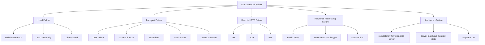
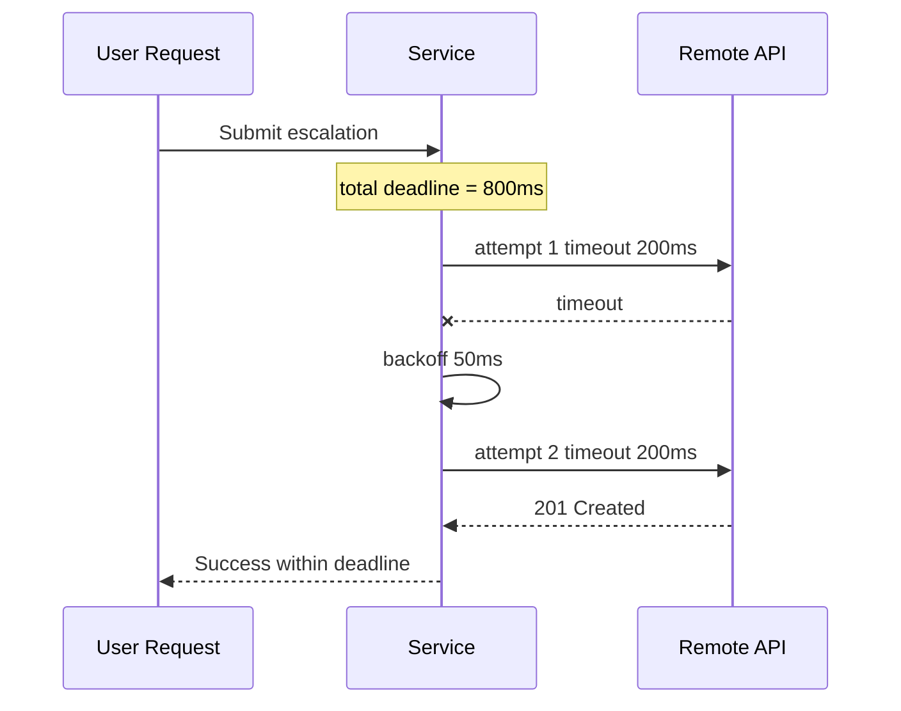
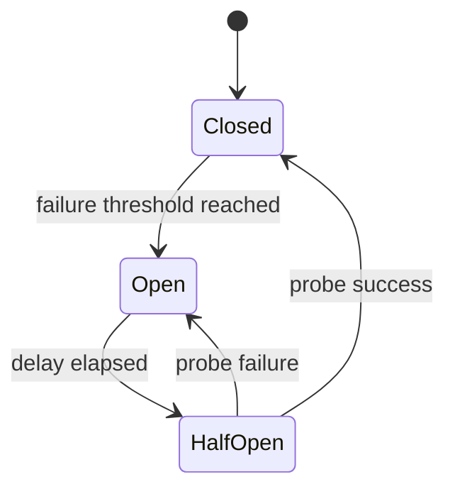
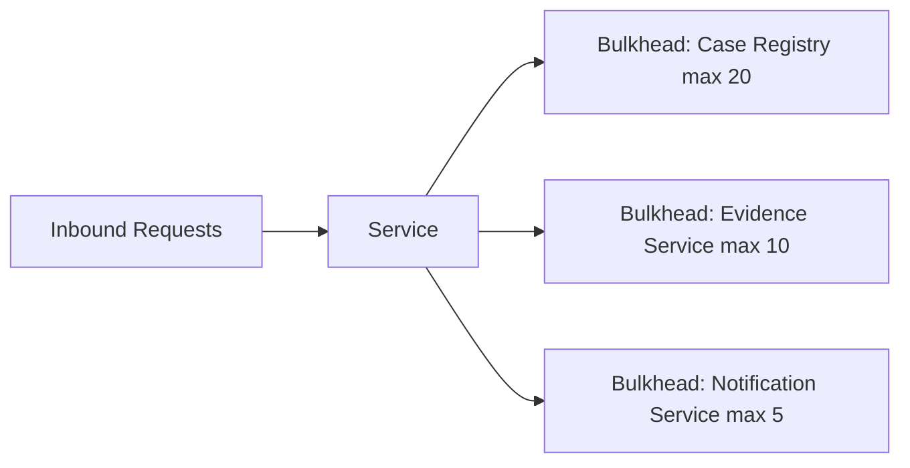
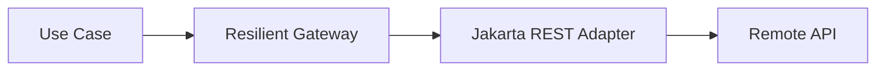
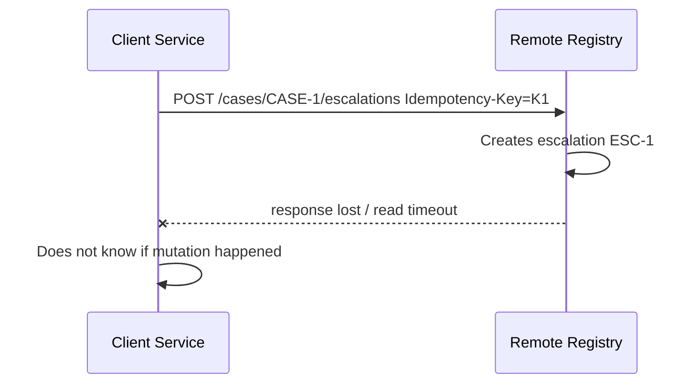
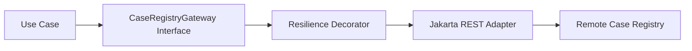
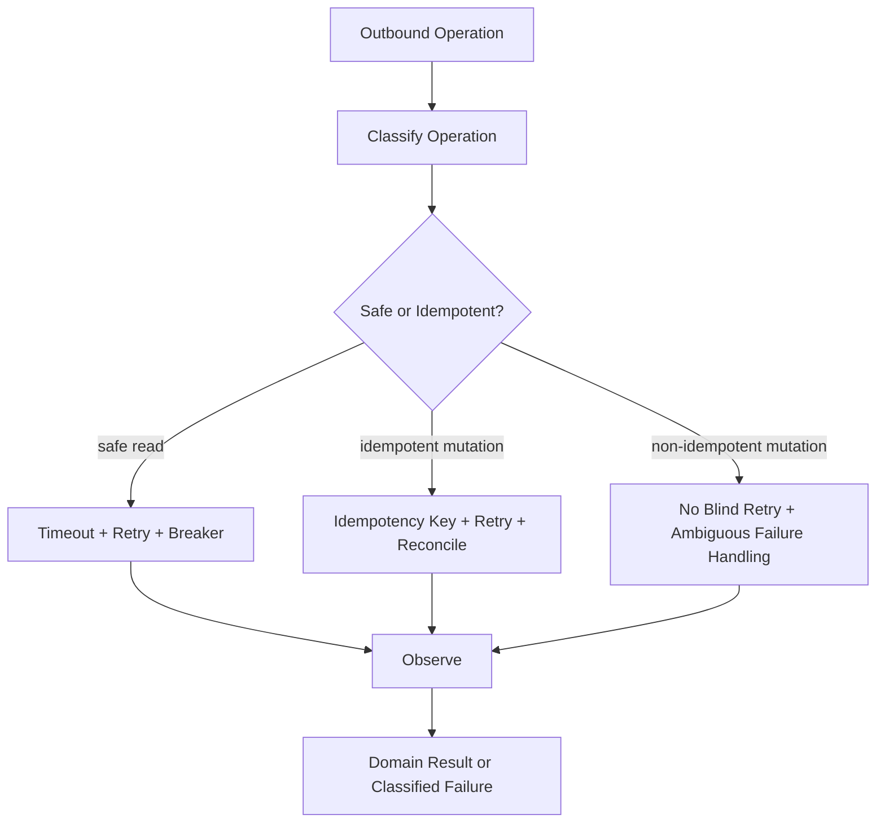

# Part 022 — Client Resilience: Timeouts, Retries, Circuit Breakers, Idempotency Keys, and Failure Classification

> Goal: design outbound REST calls so failures are bounded, classified, observable, and safe to recover from.

A REST client that works in local development is easy. A REST client that behaves correctly under partial failure is hard.

This part answers a different question from Part 021:

- Part 021: how do we use Jakarta REST Client API correctly?
- Part 022: how do we keep outbound HTTP integrations from damaging the whole system when the remote side is slow, broken, overloaded, inconsistent, or ambiguous?

The core principle:

> Resilience is not “retry everything”. Resilience is controlled failure behavior.

In distributed systems, every outbound HTTP call can fail in multiple ways:

- DNS failure;
- connection failure;
- TLS failure;
- timeout;
- connection pool exhaustion;
- request serialization failure;
- remote `4xx`;
- remote `5xx`;
- invalid response body;
- response status/body mismatch;
- slow response;
- partial response;
- rate limiting;
- duplicate command execution;
- success response lost after remote mutation;
- local cancellation after remote side already processed the request.

A top-tier engineer models those cases explicitly instead of hiding them behind `RuntimeException`.

---

## 1. Kaufman Deconstruction

### 1.1 Target Performance Level

After this part, you should be able to:

1. assign time budgets to outbound calls;
2. distinguish timeout types;
3. classify remote failures into retryable and non-retryable categories;
4. use retries only when safe;
5. use idempotency keys for mutation retries;
6. prevent retry storms;
7. apply circuit breakers for repeated remote failures;
8. apply bulkheads to isolate remote dependency saturation;
9. design fallback behavior without lying to users;
10. expose meaningful outbound metrics/logs/traces;
11. test resilience behavior deterministically.

### 1.2 The Real Skill

The skill is not memorizing annotations. The skill is answering:

> “What should this system do when the dependency behaves badly?”

That requires:

- protocol knowledge;
- domain semantics;
- operation idempotency;
- latency budgets;
- user journey impact;
- state consistency model;
- observability design;
- incident thinking.

---

## 2. Failure Taxonomy

Start with a taxonomy.



Not all failures are equal.

| Failure | Usually retryable? | Why |
|---|---:|---|
| invalid request DTO serialization | no | local bug or bad data |
| bad base URI | no | configuration bug |
| DNS temporary failure | maybe | infrastructure/transient |
| connect timeout | maybe | dependency or network issue |
| read timeout on GET | maybe | operation may be safe |
| read timeout on POST | dangerous | remote may have processed mutation |
| `400` | no | caller sent invalid request |
| `401` | maybe after token refresh | auth may be expired |
| `403` | no | authorization denial |
| `404` | context-dependent | may be valid absence |
| `409` | usually no automatic retry | business conflict |
| `412` | no blind retry | optimistic concurrency failure |
| `429` | yes, respecting `Retry-After` | rate limiting |
| `500` | maybe | remote transient or bug |
| `503` | maybe, respecting `Retry-After` | remote unavailable |
| invalid JSON on `200` | no blind retry | contract/runtime bug |

Resilience policy starts with classification.

---

## 3. Timeout Budgeting

Timeouts are not an implementation detail. They are part of system design.

Without timeouts, your service can wait too long for a dependency. Under load, this can exhaust request threads, connection pools, event loops, memory, or user patience.

### 3.1 Timeout Types

| Timeout | Meaning | Common failure mode if missing |
|---|---|---|
| connect timeout | maximum time to establish TCP connection | threads stuck connecting |
| TLS handshake timeout | maximum time for TLS handshake | secure connection stalls |
| read/socket timeout | maximum idle/read wait | dependency hangs after accept |
| request timeout | total allowed time for call | retries exceed user budget |
| pool acquire timeout | wait for available client connection | hidden queue buildup |
| DNS timeout | name resolution duration | startup/runtime stalls |

The Jakarta REST API standardizes the client abstraction, but some timeout knobs are implementation-specific. Treat timeout configuration as part of your adapter factory, not scattered call-site code.

### 3.2 Budget from User Journey

Do not pick random values like “30 seconds”. Start from user journey SLO.

Example:

```text
User action: Submit escalation
End-to-end target p95: 800 ms
Application processing budget: 150 ms
Database budget: 100 ms
Case registry outbound budget: 250 ms
Evidence service outbound budget: 150 ms
Buffer: 150 ms
```

Then configure outbound calls accordingly.

### 3.3 Deadline vs Timeout

A timeout is often local to one attempt. A deadline is the total budget for the operation.



If each retry gets a full timeout without a total deadline, retries can exceed the user request budget.

Bad:

```text
attempt timeout = 2s
max retries = 3
actual max latency ≈ 8s with backoff
inbound request target = 1s
```

Better:

```text
total deadline = 800ms
attempt timeout = min(remaining budget, configured per-attempt cap)
```

---

## 4. Retry: Use as a Scalpel, Not a Hammer

Retry is useful when failures are transient and the operation is safe to repeat.

Retry is harmful when it:

- repeats non-idempotent mutations;
- amplifies remote overload;
- hides real bugs;
- increases tail latency;
- creates duplicate case actions;
- makes audit trails ambiguous;
- violates rate limits;
- causes retry storms.

### 4.1 Retry Decision Matrix

| Operation type | Retry policy |
|---|---|
| safe read `GET` | often retryable for transport/5xx/429 |
| idempotent `PUT` with deterministic body | retryable if safe under contract |
| `DELETE` | retryable if delete semantics are idempotent |
| mutation `POST` without idempotency key | avoid automatic retry after ambiguous failure |
| mutation `POST` with idempotency key | retryable if remote contract guarantees deduplication |
| workflow transition | retry only with idempotency and state-aware result mapping |

### 4.2 Retryable Failures

Usually retryable:

- connect timeout;
- connection reset before request body sent;
- temporary DNS/network failure;
- `503 Service Unavailable`;
- `502 Bad Gateway`;
- `504 Gateway Timeout`;
- `429 Too Many Requests` when respecting `Retry-After`;
- read timeout for safe reads.

Usually not retryable:

- `400 Bad Request`;
- `401 Unauthorized` unless token refresh is performed;
- `403 Forbidden`;
- `404 Not Found` if absence is valid;
- `409 Conflict` unless conflict resolution is implemented;
- `412 Precondition Failed`;
- serialization failure;
- invalid response schema;
- validation failure.

### 4.3 Retry with Backoff and Jitter

Bad retry:

```text
retry immediately 3 times
```

Better:

```text
attempt 1
wait 50ms + jitter
attempt 2
wait 100ms + jitter
attempt 3
```

Jitter matters because many clients retrying at the same fixed interval can synchronize and overload the recovering service.

### 4.4 Retry Budget

Bound retries with:

- max attempts;
- max elapsed time;
- per-attempt timeout;
- circuit breaker state;
- rate limit awareness;
- idempotency eligibility.

Pseudo-policy:

```java
public record RetryPolicy(
    int maxAttempts,
    Duration initialBackoff,
    Duration maxBackoff,
    boolean jitterEnabled
) {}
```

But do not bury semantics inside `RetryPolicy`. Operation safety still matters.

---

## 5. Idempotency Keys

Idempotency keys solve one of the hardest mutation problems:

> The client timed out after sending a mutation. Did the remote service execute it?

For non-idempotent commands, a retry can create duplicates.

Example:

```text
POST /cases/CASE-1/escalations
```

If the client times out after the remote service creates the escalation, retrying the same POST can create a second escalation unless the remote API deduplicates.

### 5.1 Idempotency Key Model

Client sends:

```text
Idempotency-Key: 7b8f7f6e-6b60-4a7c-b7c5-1a4e39c6f999
```

Remote server stores:

```text
idempotency_key -> operation result
```

When the same key is received again for the same operation, the server returns the same result or an equivalent duplicate-safe response.

### 5.2 Client-Side Rule

Generate the idempotency key from command identity, not from each HTTP attempt.

Bad:

```java
for (int attempt = 0; attempt < 3; attempt++) {
    String key = UUID.randomUUID().toString(); // wrong: new key per attempt
    send(command, key);
}
```

Better:

```java
String key = command.idempotencyKey();
for (int attempt = 0; attempt < 3; attempt++) {
    send(command, key);
}
```

### 5.3 Domain-Derived Idempotency Key

For regulatory/case-management commands, the key can be derived from stable command identity:

```java
public record EscalationCommand(
    String caseId,
    String requestedBy,
    String reasonCode,
    Instant requestedAt,
    String commandId
) {
    public String idempotencyKey() {
        return commandId;
    }
}
```

Do not derive idempotency key from mutable fields unless you want changes to create a new operation identity.

### 5.4 Idempotency Scope

Define scope clearly:

| Scope | Example |
|---|---|
| per endpoint | key unique for `/escalations` only |
| per tenant | key unique within tenant |
| per actor | key unique per user/actor |
| global | key unique across service |
| per command type | key unique for escalation commands only |

Ambiguous scope causes false duplicates or duplicate misses.

---

## 6. Circuit Breaker

A circuit breaker prevents repeated calls to a failing dependency.



States:

| State | Meaning |
|---|---|
| closed | calls allowed; failures counted |
| open | calls fail fast; remote dependency protected |
| half-open | limited probe calls allowed |

### 6.1 When Circuit Breaker Helps

Use circuit breaker when:

- dependency has repeated failures;
- calls are expensive;
- failure consumes scarce resources;
- users get faster failure than waiting for timeout;
- fallback or graceful degradation exists;
- you need to protect your own service from thread/connection exhaustion.

### 6.2 When Circuit Breaker Hurts

A bad circuit breaker can:

- block recovery too long;
- fail fast when dependency is healthy again;
- hide partial regional recovery;
- affect all tenants because one tenant triggers failures;
- interact badly with retries;
- create confusing error behavior.

### 6.3 Circuit Breaker Dimensions

Do not always use one global circuit per remote service.

Possible dimensions:

- remote service;
- endpoint/operation;
- tenant;
- region;
- auth mode;
- criticality.

Example:

```text
case-registry:GET:/cases/{id}
case-registry:POST:/cases/{id}/escalations
case-registry:GET:/reference-data
```

A failure in reference data should not necessarily open the breaker for escalation submission.

---

## 7. Bulkhead

A bulkhead limits how much concurrency one dependency or operation can consume.



Without bulkheads, a slow remote dependency can consume all request threads or all outbound connections.

### 7.1 Bulkhead Types

| Bulkhead type | Meaning |
|---|---|
| semaphore bulkhead | limit concurrent calls |
| thread-pool bulkhead | isolate execution threads |
| connection pool limit | limit physical remote connections |
| queue limit | limit waiting tasks |
| rate limit | limit call frequency |

### 7.2 Bulkhead Failure Is a Real Failure

If a bulkhead is full, the service should return a classified failure quickly.

```java
throw new RemoteDependencySaturatedException("case-registry");
```

Do not let bulkhead queues grow unbounded. Queues can turn overload into latency and memory failure.

---

## 8. Fallbacks

Fallback is not a synonym for “hide the error”.

Good fallback examples:

- serve cached reference data;
- return partial view with warning;
- enqueue command for later processing if business allows async acceptance;
- use stale read model for non-critical dashboard;
- degrade optional enrichment.

Bad fallback examples:

- return fake success for a failed mutation;
- silently skip audit write;
- mark escalation created when remote registry failed;
- use stale authorization data for sensitive action;
- suppress evidence upload failure.

### 8.1 Fallback Decision Table

| Operation | Fallback allowed? | Why |
|---|---:|---|
| fetch non-critical display label | yes | can degrade UI |
| fetch case before legal decision | maybe | depends on data freshness requirement |
| submit enforcement action | usually no fake success | legal/audit consequences |
| upload evidence | no silent fallback | evidentiary integrity |
| send notification | maybe async retry | notification may be eventually consistent |

In regulated systems, fallback must preserve truthfulness.

> A fallback may degrade experience; it must not falsify state.

---

## 9. MicroProfile Fault Tolerance

In Jakarta/MicroProfile environments, MicroProfile Fault Tolerance provides standard annotations for resilience patterns such as:

- `@Timeout`;
- `@Retry`;
- `@CircuitBreaker`;
- `@Bulkhead`;
- `@Fallback`;
- `@Asynchronous`.

Example:

```java
@ApplicationScoped
public class CaseRegistryGateway {

    @Retry(maxRetries = 2, delay = 100, jitter = 50)
    @Timeout(300)
    @CircuitBreaker(requestVolumeThreshold = 20, failureRatio = 0.5, delay = 1000)
    public CaseSnapshot getCase(String caseId) {
        return callCaseRegistry(caseId);
    }
}
```

This is useful, but annotations are not magic. You still need operation-specific semantics.

### 9.1 Annotation Risk

Bad:

```java
@Retry(maxRetries = 3)
public EscalationResult submitEscalation(EscalationCommand command) {
    return remote.submit(command);
}
```

If the command is non-idempotent, this can duplicate an escalation.

Better:

```java
@Retry(maxRetries = 2, retryOn = RetryableRemoteFailure.class)
public EscalationResult submitEscalation(EscalationCommand command) {
    requireIdempotencyKey(command);
    return remote.submit(command);
}
```

And ensure the remote API actually honors the idempotency key.

### 9.2 Classify Before Retry

Your adapter should throw meaningful exceptions:

```java
sealed class RemoteCallFailure extends RuntimeException permits
    RetryableRemoteFailure,
    NonRetryableRemoteFailure,
    AmbiguousMutationFailure {}
```

Then resilience policy can decide:

```java
@Retry(
    maxRetries = 2,
    retryOn = RetryableRemoteFailure.class,
    abortOn = {
        NonRetryableRemoteFailure.class,
        AmbiguousMutationFailure.class
    }
)
public CaseSnapshot findCase(String caseId) {
    return adapter.findCaseOrThrow(caseId);
}
```

### 9.3 Keep Resilience Outside Raw HTTP Mechanics

Do not implement ad-hoc retry loops inside every Jakarta REST method. Prefer a resilience layer around the adapter or use platform mechanisms consistently.



The adapter knows HTTP. The resilience wrapper knows retry/breaker/bulkhead policy. Sometimes they live in the same class, but keep the concerns mentally separate.

---

## 10. Failure Classification Design

Create a classification model that separates:

- caller errors;
- dependency failures;
- security failures;
- concurrency conflicts;
- throttling;
- ambiguous mutation state;
- contract violations.

Example:

```java
public sealed interface RemoteFailure permits
    RemoteFailure.CallerRejected,
    RemoteFailure.AuthenticationFailed,
    RemoteFailure.AuthorizationDenied,
    RemoteFailure.NotFound,
    RemoteFailure.Conflict,
    RemoteFailure.PreconditionFailed,
    RemoteFailure.RateLimited,
    RemoteFailure.DependencyUnavailable,
    RemoteFailure.Timeout,
    RemoteFailure.ContractViolation,
    RemoteFailure.AmbiguousMutation {

    record CallerRejected(String code, String message) implements RemoteFailure {}
    record AuthenticationFailed() implements RemoteFailure {}
    record AuthorizationDenied() implements RemoteFailure {}
    record NotFound(String resource) implements RemoteFailure {}
    record Conflict(String code) implements RemoteFailure {}
    record PreconditionFailed(String expectedVersion) implements RemoteFailure {}
    record RateLimited(Duration retryAfter) implements RemoteFailure {}
    record DependencyUnavailable(String service) implements RemoteFailure {}
    record Timeout(String phase) implements RemoteFailure {}
    record ContractViolation(String detail) implements RemoteFailure {}
    record AmbiguousMutation(String operationId) implements RemoteFailure {}
}
```

Then map to exceptions or domain results.

### 10.1 HTTP Status Mapping

| Status | Common classification |
|---:|---|
| 400 | caller rejected / validation mismatch |
| 401 | authentication failed |
| 403 | authorization denied |
| 404 | not found or valid absence |
| 409 | conflict / state transition rejected |
| 412 | precondition failed / stale version |
| 422 | semantic validation failed |
| 429 | rate limited |
| 500 | dependency failure |
| 502 | upstream gateway failure |
| 503 | dependency unavailable |
| 504 | upstream timeout |

Do not blindly map all `4xx` to “client error” at the application level. If your service calls another service, a downstream `400` may indicate **your adapter sent an invalid contract**. That is often your service bug.

---

## 11. Ambiguous Mutation Failure

Ambiguous failure is the most dangerous category.

Scenario:



If the client retries without idempotency, it may create duplicate state.

### 11.1 Safe Handling

If idempotency is supported:

```java
try {
    return submitWithRetry(command);
} catch (TimeoutException e) {
    return queryByIdempotencyKey(command.idempotencyKey())
        .orElseThrow(() -> new AmbiguousMutationFailure(command.commandId(), e));
}
```

If idempotency is not supported:

- do not blindly retry;
- record ambiguous outcome;
- surface operational follow-up;
- reconcile using remote query if possible;
- design the API better next iteration.

### 11.2 Regulatory Implication

For enforcement/case systems, ambiguous mutation must be auditable.

Record:

- command ID;
- idempotency key;
- actor;
- timestamp;
- target endpoint;
- request hash;
- timeout/failure phase;
- retry attempts;
- reconciliation result.

This is not over-engineering. It is how you prove what the system attempted and what it knows.

---

## 12. Rate Limiting and `Retry-After`

When the remote API returns `429 Too Many Requests`, the response may include `Retry-After`.

Client behavior:

1. parse `Retry-After` if present;
2. cap it by local deadline;
3. avoid retrying if user journey cannot wait;
4. record rate limit metrics;
5. consider per-tenant throttling upstream.

Example:

```java
private Optional<Duration> retryAfter(Response response) {
    String value = response.getHeaderString("Retry-After");
    if (value == null || value.isBlank()) {
        return Optional.empty();
    }

    try {
        long seconds = Long.parseLong(value);
        return Optional.of(Duration.ofSeconds(seconds));
    } catch (NumberFormatException ignored) {
        return Optional.empty();
    }
}
```

In production, also support HTTP-date form if the remote API uses it.

### 12.1 Do Not Retry Past Deadline

```java
Duration wait = retryAfter.orElse(defaultBackoff);
if (deadline.remaining().compareTo(wait.plus(perAttemptTimeout)) < 0) {
    throw new RemoteRateLimitedException(wait);
}
```

---

## 13. Token Refresh and `401`

A `401` might mean:

- token expired;
- token invalid;
- wrong audience;
- missing scope;
- clock skew;
- authentication server issue.

Do not retry indefinitely.

Typical strategy:

1. call remote API;
2. if `401`, refresh token once;
3. retry once if the operation is safe or no mutation was sent;
4. if still `401`, classify as auth failure.

For mutation POSTs, token refresh retry can still be ambiguous if the first request reached the server and the `401` was generated after some processing. Usually authentication happens before mutation, but design should not depend on wishful thinking for high-risk operations.

---

## 14. Connection Pool and Saturation

Timeouts and retries are not enough. The client also needs connection pool discipline.

Risks:

- too few connections: unnecessary queuing;
- too many connections: remote overload;
- no pool acquire timeout: hidden wait;
- per-request client creation: no effective reuse;
- unclosed responses: pool exhaustion;
- long streaming responses consuming all connections.

### 14.1 Pool Sizing Questions

Ask:

- How many concurrent inbound requests can trigger this remote call?
- How many calls per inbound request?
- What is p95/p99 remote latency?
- What is the remote service's allowed QPS/concurrency?
- Are calls streaming or short-lived?
- Are there separate pools per remote service?
- Is there tenant isolation?

### 14.2 Basic Estimate

If expected QPS is 100 and p95 latency is 100 ms:

```text
concurrency ≈ qps * latencySeconds
concurrency ≈ 100 * 0.1 = 10
```

Then add margin, but do not exceed downstream capacity. This is an estimate, not a substitute for load testing.

---

## 15. Resilience Policy by Operation Type

### 15.1 Read Operation

```java
public Optional<CaseSnapshot> findCase(String caseId) {
    return retryPolicy.execute(() -> adapter.findCase(caseId));
}
```

Policy:

- timeout: short;
- retry: yes for transient failure;
- circuit breaker: yes;
- bulkhead: yes;
- fallback: maybe cached/stale if allowed;
- idempotency key: not needed for pure read.

### 15.2 Mutation Command

```java
public EscalationSubmissionResult submitEscalation(EscalationCommand command) {
    requireIdempotencyKey(command);
    return mutationRetryPolicy.execute(() -> adapter.submitEscalation(command));
}
```

Policy:

- timeout: bounded;
- retry: only with idempotency;
- circuit breaker: yes;
- bulkhead: yes;
- fallback: no fake success;
- reconciliation: yes for ambiguous failure.

### 15.3 Notification Operation

```java
public NotificationResult sendNotification(NotificationCommand command) {
    return notificationPolicy.execute(() -> adapter.send(command));
}
```

Policy:

- timeout: short;
- retry: maybe async/background queue;
- circuit breaker: yes;
- fallback: enqueue for later;
- user response: usually not block critical transaction unless notification is required.

### 15.4 Reference Data Lookup

Policy:

- timeout: very short;
- retry: maybe once;
- fallback: cached data;
- circuit breaker: yes;
- stale tolerance: explicit.

---

## 16. Observability for Resilience

Resilience without observability is just hidden failure.

### 16.1 Metrics

Minimum metrics:

| Metric | Labels |
|---|---|
| outbound request count | service, operation, method, status_family |
| outbound duration | service, operation, method |
| outbound failure count | service, operation, failure_type |
| retry count | service, operation, attempt |
| timeout count | service, operation, phase |
| circuit breaker state | service, operation |
| bulkhead rejection count | service, operation |
| rate limited count | service, operation |
| ambiguous mutation count | service, operation |

Use route templates instead of raw URLs.

Good label:

```text
operation=POST /cases/{caseId}/escalations
```

Bad label:

```text
url=/cases/CASE-2026-000001/escalations
```

High-cardinality labels can damage metrics systems.

### 16.2 Logs

Log structured facts:

```json
{
  "event": "remote_call_failed",
  "service": "case-registry",
  "operation": "POST /cases/{caseId}/escalations",
  "status": 503,
  "failureType": "DEPENDENCY_UNAVAILABLE",
  "attempt": 2,
  "durationMs": 240,
  "correlationId": "...",
  "remoteRequestId": "...",
  "idempotencyKeyHash": "..."
}
```

Do not log full request body, tokens, raw idempotency keys, or PII by default.

### 16.3 Tracing

For distributed tracing, propagate context to outbound calls through client filters.

Track:

- remote service name;
- HTTP method;
- route template;
- status;
- exception type;
- retry attempt;
- timeout/circuit breaker events.

---

## 17. Testing Resilience

Resilience policies must be tested. They are too important to trust by inspection.

### 17.1 Test Cases

| Scenario | Expected behavior |
|---|---|
| remote returns `200` | maps success |
| remote returns `404` for find | maps empty |
| remote returns `409` for command | maps domain rejection |
| remote returns `503` once then `201` | retry succeeds if command idempotent |
| remote times out on GET | retry according to policy |
| remote times out on POST without idempotency | no blind retry; ambiguous failure |
| remote returns invalid JSON on `200` | contract violation |
| remote returns `429 Retry-After` | waits or fails based on deadline |
| circuit open | fail fast |
| bulkhead full | dependency saturated failure |

### 17.2 Fake Server

Use a fake server capable of:

- delayed responses;
- connection resets;
- status sequences;
- header assertions;
- body assertions;
- verifying retry count;
- simulating invalid JSON.

Example pseudo-test:

```java
@Test
void retryableGetRetries503Once() {
    fakeServer.stubGet("/cases/CASE-1")
        .thenRespond(503, "application/json", "{\"code\":\"UNAVAILABLE\"}")
        .thenRespond(200, "application/json", "{\"caseId\":\"CASE-1\"}");

    Optional<CaseSnapshot> result = gateway.findCase("CASE-1");

    assertThat(result).isPresent();
    fakeServer.verifyRequestCount("GET", "/cases/CASE-1", 2);
}
```

### 17.3 Ambiguous Mutation Test

```java
@Test
void postTimeoutWithoutIdempotencyIsNotRetried() {
    fakeServer.stubPost("/cases/CASE-1/escalations")
        .thenDelayBeyondTimeout();

    assertThatThrownBy(() -> gateway.submitEscalation(commandWithoutIdempotency))
        .isInstanceOf(AmbiguousMutationFailure.class);

    fakeServer.verifyRequestCount("POST", "/cases/CASE-1/escalations", 1);
}
```

### 17.4 Idempotent Mutation Retry Test

```java
@Test
void postTimeoutWithIdempotencyCanRetry() {
    fakeServer.stubPost("/cases/CASE-1/escalations")
        .withHeader("Idempotency-Key", "cmd-123")
        .thenDelayBeyondTimeout()
        .thenRespond(201, "application/json", "{\"escalationId\":\"ESC-1\"}");

    EscalationSubmissionResult result = gateway.submitEscalation(commandWithKey);

    assertThat(result).isInstanceOf(EscalationSubmissionResult.Accepted.class);
    fakeServer.verifyAllRequestsHadHeader("Idempotency-Key", "cmd-123");
}
```

---

## 18. Common Anti-Patterns

### 18.1 Retry Everything

```java
@Retry(maxRetries = 3)
public Result callRemote(Command command) { ... }
```

Impact:

- duplicate mutations;
- amplified overload;
- hidden bugs;
- increased tail latency.

### 18.2 No Timeout

Impact:

- request thread exhaustion;
- pool saturation;
- cascading failure;
- bad user experience.

### 18.3 Timeout Longer Than User Journey

```text
remote timeout: 30s
user request SLO: 1s
```

This is not resilience. It is denial of reality.

### 18.4 Circuit Breaker Without Classification

If all exceptions count the same, validation bugs can open the circuit. Auth failures can open the circuit. Bad requests can look like dependency outage.

Classify first.

### 18.5 Fallback That Lies

```java
catch (Exception e) {
    return EscalationResult.success("TEMP");
}
```

This is catastrophic for regulated actions. It creates false state.

### 18.6 Logging Secrets on Failure

Failures are exactly when teams often log too much. Redaction must be designed before incidents.

### 18.7 One Global Bulkhead

A single bulkhead for all remote operations may allow low-priority calls to block critical ones.

Separate critical operations.

---

## 19. Resilience Architecture Patterns

### 19.1 Gateway + Resilience Decorator



Interface:

```java
public interface CaseRegistryGateway {
    Optional<CaseSnapshot> findCase(String caseId);
    EscalationSubmissionResult submitEscalation(EscalationCommand command);
}
```

Adapter:

```java
public final class JakartaRestCaseRegistryGateway implements CaseRegistryGateway {
    // pure HTTP adapter
}
```

Decorator:

```java
public final class ResilientCaseRegistryGateway implements CaseRegistryGateway {

    private final CaseRegistryGateway delegate;
    private final RetryPolicy readRetry;
    private final CircuitBreaker breaker;
    private final Bulkhead bulkhead;

    @Override
    public Optional<CaseSnapshot> findCase(String caseId) {
        return bulkhead.execute(() ->
            breaker.execute(() ->
                readRetry.execute(() -> delegate.findCase(caseId))
            )
        );
    }

    @Override
    public EscalationSubmissionResult submitEscalation(EscalationCommand command) {
        requireIdempotencyKey(command);
        return bulkhead.execute(() ->
            breaker.execute(() ->
                mutationRetry.execute(() -> delegate.submitEscalation(command))
            )
        );
    }
}
```

The point is not this exact code. The point is separation of concerns.

### 19.2 Policy Registry

For larger systems, define policies per remote operation.

```yaml
remoteClients:
  caseRegistry:
    operations:
      findCase:
        timeoutMs: 200
        maxAttempts: 2
        circuitBreaker: true
        bulkhead: caseRegistryReads
      submitEscalation:
        timeoutMs: 500
        maxAttempts: 2
        requiresIdempotencyKey: true
        circuitBreaker: true
        bulkhead: caseRegistryWrites
```

Make policies visible and reviewable.

---

## 20. Case-Management Example

Suppose our service has to create an escalation in a remote registry.

### 20.1 Requirements

- command must not create duplicates;
- actor identity must be propagated;
- audit trail must record attempts;
- `409` means transition rejected;
- `412` means stale case version;
- `503` can be retried if idempotency key exists;
- timeout after sending request is ambiguous;
- response must be classified.

### 20.2 Client Method

```java
public EscalationSubmissionResult submitEscalation(EscalationCommand command) {
    requireNonBlank(command.idempotencyKey());

    try (Response response = cases
        .path("{caseId}/escalations")
        .resolveTemplate("caseId", command.caseId())
        .request(MediaType.APPLICATION_JSON_TYPE)
        .header("Idempotency-Key", command.idempotencyKey())
        .header("X-Actor-Id", command.actorId())
        .post(Entity.json(CreateEscalationRequest.from(command)))) {

        return switch (response.getStatus()) {
            case 201 -> {
                EscalationCreated body = response.readEntity(EscalationCreated.class);
                yield EscalationSubmissionResult.accepted(body.escalationId(), response.getLocation());
            }
            case 200 -> {
                EscalationCreated body = response.readEntity(EscalationCreated.class);
                yield EscalationSubmissionResult.duplicate(body.escalationId());
            }
            case 409 -> {
                ErrorEnvelope error = response.readEntity(ErrorEnvelope.class);
                yield EscalationSubmissionResult.rejected(error.code());
            }
            case 412 -> throw new StaleCaseVersionException(command.caseId());
            case 429 -> throw RemoteRateLimitedException.from(response);
            case 503 -> throw RetryableRemoteFailure.from(response);
            default -> throw RemoteApiException.from(response);
        };
    } catch (ProcessingException e) {
        throw classifyProcessingException(command, e);
    }
}
```

### 20.3 Ambiguous Timeout Classification

```java
private RuntimeException classifyProcessingException(
    EscalationCommand command,
    ProcessingException e
) {
    if (TimeoutClassifier.isReadTimeout(e)) {
        return new AmbiguousMutationFailure(
            command.commandId(),
            command.idempotencyKey(),
            e
        );
    }

    if (TimeoutClassifier.isConnectTimeout(e)) {
        return new RetryableRemoteFailure("connect-timeout", e);
    }

    return new RetryableRemoteFailure("transport-failure", e);
}
```

This distinction is important:

- connect timeout may mean request never reached the server;
- read timeout may mean request reached the server but response was not received.

Implementation details vary, so classification should be conservative.

---

## 21. Recovery and Reconciliation

For high-value mutations, design a reconciliation endpoint or query.

Example:

```text
GET /operations/{idempotencyKey}
```

or:

```text
GET /cases/{caseId}/escalations?commandId=cmd-123
```

Client recovery:

```java
public EscalationSubmissionResult submitWithReconciliation(EscalationCommand command) {
    try {
        return resilientSubmit(command);
    } catch (AmbiguousMutationFailure ambiguous) {
        return lookupByCommandId(command.commandId())
            .map(existing -> EscalationSubmissionResult.duplicate(existing.escalationId()))
            .orElseThrow(() -> ambiguous);
    }
}
```

This is often better than increasing retries.

---

## 22. Resilience Checklist

For each outbound operation, answer:

- [ ] What is the user journey budget?
- [ ] What is the per-attempt timeout?
- [ ] What is the total deadline?
- [ ] Is the operation safe, idempotent, or non-idempotent?
- [ ] If mutation, is there an idempotency key?
- [ ] Does the remote API guarantee deduplication?
- [ ] Which failures are retryable?
- [ ] Which failures must abort retry?
- [ ] What status codes map to domain outcomes?
- [ ] What status codes map to dependency failures?
- [ ] Is `Retry-After` respected?
- [ ] Is there a circuit breaker?
- [ ] Is there a bulkhead?
- [ ] What fallback is allowed?
- [ ] Does fallback preserve truth?
- [ ] Are attempts logged/audited safely?
- [ ] Are metrics low-cardinality?
- [ ] Are ambiguous mutations recorded?
- [ ] Is reconciliation possible?
- [ ] Are tests covering timeout, retry, breaker, and rate-limit behavior?

---

## 23. Mental Model Summary

A resilient Jakarta REST client is not defined by one annotation or one library. It is defined by clear behavior under failure.



The key invariant:

> A retry policy must know the semantics of the operation it retries.

---

## 24. Exercises

### Exercise 1 — Classify Failures

Create a `RemoteFailureClassifier` that maps:

- `400`;
- `401`;
- `403`;
- `404`;
- `409`;
- `412`;
- `429`;
- `500`;
- `503`;
- invalid JSON;
- timeout;
- connection failure.

Acceptance criteria:

- retryable and non-retryable failures are distinct;
- `404` is operation-specific;
- `429` preserves `Retry-After`;
- invalid JSON is treated as contract violation;
- read timeout on mutation is ambiguous.

### Exercise 2 — Add Idempotent Mutation Retry

Implement retry for escalation submission.

Acceptance criteria:

- no retry without idempotency key;
- same key reused across attempts;
- retries only retryable failures;
- max attempts enforced;
- total deadline enforced;
- metrics include attempt count.

### Exercise 3 — Add Circuit Breaker

Add a circuit breaker around `CaseRegistryGateway.findCase`.

Acceptance criteria:

- repeated `503` opens the circuit;
- `400` does not open the circuit;
- open circuit fails fast;
- half-open success closes circuit;
- metrics expose breaker state.

### Exercise 4 — Design Fallback Matrix

For a case-management system, decide fallback policy for:

- case detail lookup;
- evidence download;
- escalation submission;
- notification sending;
- reference data lookup;
- audit event publishing.

For each, define:

- allowed fallback;
- forbidden fallback;
- user-visible behavior;
- audit requirement.

---

## 25. References

- Jakarta RESTful Web Services 4.0 Specification: https://jakarta.ee/specifications/restful-ws/4.0/
- Jakarta REST Client API package docs: https://jakarta.ee/specifications/restful-ws/4.0/apidocs/jakarta.ws.rs/jakarta/ws/rs/client/package-summary
- MicroProfile Fault Tolerance 4.1: https://microprofile.io/specifications/fault-tolerance/4-1/
- MicroProfile Fault Tolerance 4.1 Specification HTML: https://download.eclipse.org/microprofile/microprofile-fault-tolerance-4.1/microprofile-fault-tolerance-spec-4.1.html
- RFC 9110 — HTTP Semantics: https://www.rfc-editor.org/rfc/rfc9110
