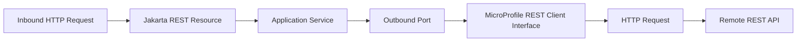
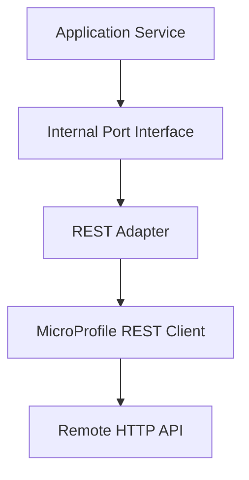
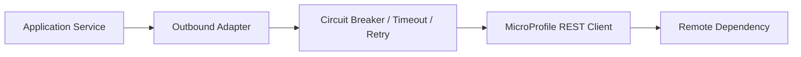

# Part 023 — MicroProfile REST Client

Pada part sebelumnya kita membahas **Jakarta REST Client API** sebagai client HTTP programatik: `Client`, `WebTarget`, `Invocation.Builder`, `Response`, dan provider/filter di sisi client. Bagian ini membahas level abstraksi yang berbeda: **MicroProfile REST Client**.

MicroProfile REST Client adalah pendekatan **type-safe**, interface-driven untuk memanggil REST API dari Java. Ia memanfaatkan konsep Jakarta REST sebanyak mungkin, terutama annotation seperti `@Path`, `@GET`, `@POST`, `@Consumes`, `@Produces`, `@HeaderParam`, `@PathParam`, `@QueryParam`, dan provider model.

Mental model paling ringkas:

> Jakarta REST Client API cocok ketika kita ingin membangun request secara eksplisit. MicroProfile REST Client cocok ketika remote API diperlakukan sebagai dependency contract yang stabil dan ingin dipanggil melalui Java interface.

Namun, typed client bukan berarti risiko hilang. Ia hanya memindahkan risiko dari string-building request ke **contract discipline**, **config discipline**, **provider discipline**, dan **resilience policy**.

---

## 1. Kenapa MicroProfile REST Client Ada?

Dalam sistem production, outbound HTTP call biasanya memiliki masalah berulang:

- base URL berbeda per environment;
- endpoint path perlu konsisten;
- parameter harus typed;
- header auth/correlation harus konsisten;
- response error harus dimapping;
- timeout/retry/circuit breaker perlu policy;
- client harus bisa di-test tanpa benar-benar memanggil service eksternal;
- API contract perlu mudah direview.

Dengan Jakarta REST Client API, kita bisa menulis:

```java
Response response = client
    .target(baseUri)
    .path("/cases/{caseId}")
    .resolveTemplate("caseId", caseId)
    .request(MediaType.APPLICATION_JSON_TYPE)
    .header("X-Correlation-Id", correlationId)
    .get();
```

Itu eksplisit dan kuat. Tetapi jika dilakukan di banyak tempat, kode akan mudah bocor:

- path string tersebar;
- header propagation tersebar;
- error handling tidak seragam;
- timeout/retry policy tidak konsisten;
- body reading sering lupa menutup response;
- mapping status code ke domain error tidak standar.

MicroProfile REST Client mengubah remote API menjadi interface:

```java
@Path("/cases")
@RegisterRestClient(configKey = "case-service")
@Consumes(MediaType.APPLICATION_JSON)
@Produces(MediaType.APPLICATION_JSON)
public interface CaseServiceClient {

    @GET
    @Path("/{caseId}")
    CaseDto findCase(@PathParam("caseId") UUID caseId);
}
```

Pemakaian dalam service:

```java
@ApplicationScoped
public class CaseLookupService {

    private final CaseServiceClient caseClient;

    public CaseLookupService(@RestClient CaseServiceClient caseClient) {
        this.caseClient = caseClient;
    }

    public CaseDto getRequiredCase(UUID caseId) {
        return caseClient.findCase(caseId);
    }
}
```

Ini terlihat sederhana. Tetapi untuk engineer senior, pertanyaan pentingnya bukan “bisa dipanggil atau tidak”. Pertanyaannya:

- Bagaimana base URI ditentukan?
- Bagaimana timeout disetel?
- Bagaimana 404 dibedakan dari 500?
- Bagaimana body error dibaca tanpa leak?
- Bagaimana auth token dimasukkan?
- Bagaimana correlation ID dipropagasi?
- Bagaimana response schema berevolusi?
- Bagaimana provider conflict dicegah?
- Bagaimana retry tidak menggandakan command?
- Bagaimana contract test memastikan interface masih cocok dengan remote API?

---

## 2. Posisi MicroProfile REST Client dalam Arsitektur

MicroProfile REST Client bukan pengganti Jakarta REST server. Ia adalah komponen di sisi **outbound integration**.



Dalam clean architecture, hexagonal architecture, atau service-oriented architecture, MicroProfile REST Client sebaiknya berada di balik **port adapter**, bukan langsung menyebar ke semua domain service.

Contoh struktur:

```text
src/main/java/com/acme/caseapp/
  application/
    CaseAssessmentService.java
  domain/
    Case.java
    Evidence.java
  integration/
    partyregistry/
      PartyRegistryPort.java
      PartyRegistryClient.java
      PartyRegistryAdapter.java
      PartyRegistryMapper.java
      PartyRegistryExceptionMapper.java
```

Pemisahan yang sehat:

- `PartyRegistryPort` adalah kontrak internal aplikasi;
- `PartyRegistryClient` adalah interface MicroProfile REST Client;
- `PartyRegistryAdapter` menerjemahkan remote DTO/error ke model internal;
- `PartyRegistryMapper` menjaga boundary mapping;
- `PartyRegistryExceptionMapper` mengubah HTTP error menjadi exception yang meaningful.

Anti-pattern:

```java
@ApplicationScoped
public class EnforcementDecisionService {

    @Inject
    @RestClient
    PartyRegistryClient client;

    public Decision decide(Case c) {
        // Domain decision directly coupled to remote HTTP shape.
        var party = client.getParty(c.partyId());
        ...
    }
}
```

Masalahnya bukan injection-nya. Masalahnya adalah domain/application policy menjadi tergantung pada:

- URL shape remote service;
- DTO remote service;
- HTTP exception remote service;
- retry/timeout provider remote service;
- serialization convention remote service.

Untuk sistem kecil ini bisa diterima. Untuk sistem regulated/case-management, coupling semacam ini menyulitkan audit, testing, dan migration.

---

## 3. Baseline Versi dan Konteks Modern

Seri ini memakai baseline:

- Java 17+;
- Jakarta RESTful Web Services 4.0 sebagai Jakarta EE 11 baseline;
- MicroProfile REST Client 4.0 sebagai baseline MicroProfile modern;
- CDI sebagai dependency injection model umum;
- MicroProfile Config sebagai sumber konfigurasi;
- MicroProfile Fault Tolerance sebagai opsi resilience policy;
- MicroProfile OpenAPI sebagai opsi dokumentasi/contract surface.

MicroProfile REST Client 4.0 adalah rilis Final pada 2024 dan merupakan rilis mayor. Ia tetap menjaga model type-safe REST client sambil menyesuaikan ekosistem Jakarta REST modern.

Prinsip praktis:

> Gunakan fitur specification-level untuk portability. Gunakan fitur implementation-specific hanya jika manfaatnya jelas, terdokumentasi, dan dibungkus agar tidak menyebar.

---

## 4. Interface sebagai Remote Contract

MicroProfile REST Client membuat Java interface menjadi deklarasi remote API.

```java
@Path("/parties")
@RegisterRestClient(configKey = "party-registry")
@Consumes(MediaType.APPLICATION_JSON)
@Produces(MediaType.APPLICATION_JSON)
public interface PartyRegistryClient {

    @GET
    @Path("/{partyId}")
    PartyResponse getParty(@PathParam("partyId") UUID partyId);

    @GET
    List<PartySearchResult> search(
        @QueryParam("name") String name,
        @QueryParam("status") String status,
        @QueryParam("limit") @DefaultValue("50") int limit
    );

    @POST
    @Path("/{partyId}/risk-screenings")
    RiskScreeningResponse requestRiskScreening(
        @PathParam("partyId") UUID partyId,
        RiskScreeningRequest request
    );
}
```

Annotation yang biasa dipakai:

| Concern | Annotation |
|---|---|
| base path | `@Path` |
| method HTTP | `@GET`, `@POST`, `@PUT`, `@PATCH`, `@DELETE` |
| media type input | `@Consumes` |
| media type output | `@Produces` |
| path variable | `@PathParam` |
| query parameter | `@QueryParam` |
| header | `@HeaderParam` |
| cookie | `@CookieParam` |
| grouped params | `@BeanParam` |
| config/CDI registration | `@RegisterRestClient` |
| provider registration | `@RegisterProvider` |

Yang perlu diingat:

- interface bukan domain port;
- interface adalah adapter contract ke remote API;
- setiap method adalah remote call;
- setiap method harus punya timeout dan failure model yang jelas;
- return type menentukan bagaimana status/error dibaca.

---

## 5. `@RegisterRestClient` dan Config Key

`@RegisterRestClient` membuat interface bisa didaftarkan sebagai REST client.

```java
@RegisterRestClient(configKey = "party-registry")
public interface PartyRegistryClient {
    ...
}
```

Config key penting karena memisahkan nama Java interface dari nama konfigurasi operasional.

Contoh config:

```properties
party-registry/mp-rest/url=https://party-registry.internal.example
party-registry/mp-rest/connectTimeout=500
party-registry/mp-rest/readTimeout=2000
```

Banyak runtime juga mendukung property tambahan, tetapi jangan menganggap semua property vendor-specific portable.

Rekomendasi naming:

```text
<bounded-context-or-service-name>/mp-rest/url
<bounded-context-or-service-name>/mp-rest/connectTimeout
<bounded-context-or-service-name>/mp-rest/readTimeout
```

Contoh baik:

```properties
party-registry/mp-rest/url=https://party-registry.service.consul
risk-engine/mp-rest/url=https://risk-engine.service.consul
evidence-store/mp-rest/url=https://evidence-store.service.consul
```

Contoh buruk:

```properties
client/mp-rest/url=https://...
api/mp-rest/url=https://...
remote/mp-rest/url=https://...
```

Nama generik membuat observability dan incident response menjadi sulit.

---

## 6. CDI Injection dengan `@RestClient`

Pemakaian umum:

```java
@ApplicationScoped
public class PartyRegistryAdapter implements PartyRegistryPort {

    private final PartyRegistryClient client;

    public PartyRegistryAdapter(@RestClient PartyRegistryClient client) {
        this.client = client;
    }

    @Override
    public PartySnapshot getParty(UUID partyId) {
        PartyResponse response = client.getParty(partyId);
        return PartyMapper.toSnapshot(response);
    }
}
```

Gunakan constructor injection bila runtime mendukungnya. Jika tidak, field injection masih umum:

```java
@Inject
@RestClient
PartyRegistryClient client;
```

Boundary yang disarankan:



Kenapa tidak langsung inject client ke resource?

Karena resource layer sebaiknya fokus pada inbound HTTP boundary. Jika resource langsung memanggil remote client:

- resource menjadi orchestration layer terlalu besar;
- response mapping outbound bercampur dengan response mapping inbound;
- error remote bisa bocor ke public API;
- retry/timeout policy menjadi tersebar;
- testing resource menjadi terlalu berat.

---

## 7. Return Type: DTO vs `Response`

MicroProfile REST Client bisa mengembalikan typed DTO:

```java
@GET
@Path("/{id}")
PartyResponse getParty(@PathParam("id") UUID id);
```

Atau `Response`:

```java
@GET
@Path("/{id}")
Response getPartyRaw(@PathParam("id") UUID id);
```

### DTO return type

Kelebihan:

- kode sederhana;
- serialization otomatis;
- cocok untuk happy path;
- mudah dibaca.

Kekurangan:

- status code non-2xx cenderung masuk exception mapping;
- header response tidak langsung terlihat;
- perlu mekanisme khusus untuk 404/409/429;
- sulit untuk partial handling jika remote API punya banyak variasi response.

### `Response` return type

Kelebihan:

- bisa membaca status code dan header secara eksplisit;
- cocok untuk conditional request, pagination header, rate limit header;
- cocok untuk ambiguity handling.

Kekurangan:

- caller harus menutup response;
- raw HTTP detail mudah bocor;
- kode lebih verbose;
- raw response handling sering tidak konsisten.

Contoh aman:

```java
@ApplicationScoped
public class PartyRegistryAdapter implements PartyRegistryPort {

    private final PartyRegistryClient client;

    public PartyRegistryAdapter(@RestClient PartyRegistryClient client) {
        this.client = client;
    }

    @Override
    public Optional<PartySnapshot> findParty(UUID partyId) {
        try (Response response = client.getPartyRaw(partyId)) {
            return switch (response.getStatus()) {
                case 200 -> Optional.of(PartyMapper.toSnapshot(response.readEntity(PartyResponse.class)));
                case 404 -> Optional.empty();
                default -> throw mapUnexpected(response);
            };
        }
    }
}
```

Rule:

> Jika method client mengembalikan `Response`, adapter harus menjadi pemilik lifecycle response. Jangan kembalikan `Response` ke domain/application layer.

---

## 8. Request DTO dan Response DTO

Remote DTO sebaiknya terpisah dari DTO public API internal service.

Contoh remote DTO:

```java
public record PartyResponse(
    UUID id,
    String displayName,
    String legalStatus,
    String riskBand,
    Instant lastUpdatedAt
) {}
```

Internal model:

```java
public record PartySnapshot(
    PartyId id,
    String name,
    PartyStatus status,
    RiskBand riskBand,
    Instant observedAt
) {}
```

Mapping:

```java
final class PartyMapper {

    static PartySnapshot toSnapshot(PartyResponse response) {
        return new PartySnapshot(
            new PartyId(response.id()),
            response.displayName(),
            PartyStatus.fromExternal(response.legalStatus()),
            RiskBand.fromExternal(response.riskBand()),
            response.lastUpdatedAt()
        );
    }
}
```

Kenapa mapping ini penting?

Karena remote service bisa berubah:

- field ditambah;
- enum value baru muncul;
- null semantics berubah;
- timestamp precision berubah;
- nested object ditambah;
- error shape berubah.

Jika remote DTO langsung menjadi model internal, perubahan remote akan menyebar ke semua layer.

---

## 9. Header Management

Header outbound biasanya terdiri dari beberapa kategori:

| Header | Sifat | Contoh |
|---|---|---|
| authentication | security | `Authorization` |
| tracing | observability | `traceparent`, `X-Correlation-Id` |
| tenant/context | authorization | `X-Tenant-Id` |
| idempotency | mutation safety | `Idempotency-Key` |
| content negotiation | protocol | `Accept`, `Content-Type` |
| conditional request | concurrency | `If-Match`, `If-None-Match` |

Header bisa dideklarasikan di method:

```java
@POST
@Path("/{partyId}/risk-screenings")
RiskScreeningResponse requestRiskScreening(
    @PathParam("partyId") UUID partyId,
    @HeaderParam("Idempotency-Key") String idempotencyKey,
    RiskScreeningRequest request
);
```

Namun header seperti auth/correlation lebih baik dipropagasi melalui filter/provider.

---

## 10. Client Request Filter untuk Correlation ID

Contoh filter:

```java
@Provider
@Priority(Priorities.HEADER_DECORATOR)
public class CorrelationClientRequestFilter implements ClientRequestFilter {

    @Inject
    RequestCorrelation correlation;

    @Override
    public void filter(ClientRequestContext requestContext) {
        correlation.currentId()
            .ifPresent(id -> requestContext.getHeaders().putSingle("X-Correlation-Id", id));
    }
}
```

Register di client:

```java
@RegisterProvider(CorrelationClientRequestFilter.class)
@RegisterRestClient(configKey = "party-registry")
public interface PartyRegistryClient {
    ...
}
```

Atau via config jika runtime mendukung:

```properties
party-registry/mp-rest/providers=com.acme.CorrelationClientRequestFilter
```

Design rule:

> Header yang selalu berlaku untuk semua call ke suatu dependency sebaiknya bukan parameter method. Header yang bagian dari business command boleh menjadi parameter eksplisit.

Contoh header yang layak eksplisit:

- `Idempotency-Key` untuk command;
- `If-Match` untuk optimistic concurrency;
- `X-Decision-Reason` untuk command audit jika memang bagian dari contract.

Contoh header yang sebaiknya provider/filter:

- `Authorization`;
- `X-Correlation-Id`;
- `traceparent`;
- internal service identity.

---

## 11. Authentication Filter

Contoh sederhana token provider:

```java
@Provider
@Priority(Priorities.AUTHENTICATION)
public class ServiceTokenFilter implements ClientRequestFilter {

    @Inject
    ServiceTokenProvider tokenProvider;

    @Override
    public void filter(ClientRequestContext requestContext) {
        String token = tokenProvider.currentToken();
        requestContext.getHeaders().putSingle(HttpHeaders.AUTHORIZATION, "Bearer " + token);
    }
}
```

Hal yang harus dipastikan:

- token provider thread-safe;
- token refresh tidak membuat thundering herd;
- token tidak dilog;
- unauthorized response dimapping jelas;
- retry setelah token refresh tidak menggandakan unsafe command;
- failure auth dibedakan dari dependency unavailable.

Anti-pattern:

```java
@GET
PartyResponse getParty(
    @HeaderParam("Authorization") String token,
    @PathParam("partyId") UUID partyId
);
```

Ini membuat token handling menyebar dan raw token mudah masuk log/debugging.

---

## 12. Response Exception Mapper

Remote non-2xx response harus diterjemahkan ke exception yang meaningful.

MicroProfile REST Client menyediakan konsep `ResponseExceptionMapper`.

Contoh:

```java
@Provider
public class PartyRegistryExceptionMapper
    implements ResponseExceptionMapper<PartyRegistryException> {

    @Override
    public PartyRegistryException toThrowable(Response response) {
        int status = response.getStatus();

        ErrorEnvelope error = null;
        if (response.hasEntity()) {
            try {
                error = response.readEntity(ErrorEnvelope.class);
            } catch (RuntimeException ignored) {
                // Keep mapper robust. Never fail just because error body is malformed.
            }
        }

        return switch (status) {
            case 404 -> new PartyNotFoundException(errorCode(error), errorMessage(error));
            case 409 -> new PartyConflictException(errorCode(error), errorMessage(error));
            case 429 -> new PartyRegistryRateLimitedException(retryAfter(response), errorMessage(error));
            default -> new PartyRegistryUnavailableException(status, errorMessage(error));
        };
    }
}
```

Register:

```java
@RegisterProvider(PartyRegistryExceptionMapper.class)
@RegisterRestClient(configKey = "party-registry")
public interface PartyRegistryClient {
    ...
}
```

Exception taxonomy:

```text
RemoteDependencyException
├── RemoteDependencyUnavailableException       // timeout, 5xx, connection failure
├── RemoteDependencyRejectedException          // 429, quota, throttling
├── RemoteDependencyConflictException          // 409, version conflict
├── RemoteDependencyNotFoundException          // 404 if semantically expected
├── RemoteDependencyUnauthorizedException      // 401/403
└── RemoteDependencyContractException          // malformed success/error body
```

Jangan langsung lempar `RuntimeException("failed")`. Exception outbound adalah bagian dari failure model aplikasi.

---

## 13. Mapping 404: Error atau Empty?

Tidak semua 404 sama.

Contoh 1: lookup opsional.

```java
Optional<PartySnapshot> findParty(UUID partyId);
```

Jika remote mengembalikan 404, adapter boleh mengubahnya menjadi `Optional.empty()`.

Contoh 2: dependency contract dilanggar.

```java
PartySnapshot getRequiredParty(UUID partyId);
```

Jika caller menjamin party harus ada, 404 adalah inconsistency dan harus menjadi exception.

Contoh 3: authorization masking.

Beberapa sistem mengembalikan 404 untuk resource yang tidak boleh diketahui user. Dalam hal ini 404 bukan “not found” murni.

Rule:

> Mapping 404 harus berdasarkan semantic intent dari use case, bukan hanya status code.

---

## 14. Timeout Configuration

Setiap REST client production harus punya timeout eksplisit.

Contoh:

```properties
party-registry/mp-rest/connectTimeout=500
party-registry/mp-rest/readTimeout=2000
```

Timeout harus diturunkan dari total request budget.

Misal inbound SLA 3 detik:

```text
Total inbound budget:       3000 ms
Resource/filter overhead:    150 ms
Application logic:           250 ms
DB query budget:             800 ms
Party registry call:         600 ms
Risk engine call:            800 ms
Serialization/logging:       150 ms
Safety margin:               250 ms
```

Jika remote call diberi read timeout 10 detik, service melanggar budget meski remote akhirnya sukses.

Rule:

> Timeout bukan angka teknis sembarang. Timeout adalah policy bisnis + operasional yang membatasi berapa lama caller boleh menunggu dependency.

---

## 15. Retry dengan Fault Tolerance

MicroProfile REST Client sering dipakai bersama MicroProfile Fault Tolerance.

Contoh:

```java
@ApplicationScoped
public class PartyRegistryAdapter implements PartyRegistryPort {

    private final PartyRegistryClient client;

    public PartyRegistryAdapter(@RestClient PartyRegistryClient client) {
        this.client = client;
    }

    @Retry(maxRetries = 2, delay = 100, jitter = 50)
    @Timeout(800)
    @CircuitBreaker(requestVolumeThreshold = 20, failureRatio = 0.5, delay = 5000)
    public PartySnapshot getParty(UUID partyId) {
        return PartyMapper.toSnapshot(client.getParty(partyId));
    }
}
```

Namun jangan asal memberi `@Retry` di client method.

Retry aman untuk:

- idempotent GET;
- PUT dengan idempotent semantics;
- DELETE yang dirancang idempotent;
- POST yang memakai idempotency key;
- transient network failure sebelum request diproses, jika bisa diklasifikasikan.

Retry berbahaya untuk:

- command POST tanpa idempotency key;
- payment/decision/escalation command;
- remote mutation yang bisa sukses tapi response gagal;
- call yang menghasilkan side effect external.

Untuk sistem enforcement/case-management:

```java
@POST
@Path("/cases/{caseId}/escalations")
EscalationResponse escalate(
    @PathParam("caseId") UUID caseId,
    @HeaderParam("Idempotency-Key") String idempotencyKey,
    EscalationRequest request
);
```

Adapter:

```java
public EscalationResult escalate(CaseId caseId, EscalationCommand command) {
    String key = idempotencyKeyFactory.forCommand(command.commandId());
    return mapper.toResult(client.escalate(caseId.value(), key, mapper.toRequest(command)));
}
```

Retry policy harus menuntut idempotency key untuk command.

---

## 16. Circuit Breaker Placement

Circuit breaker sebaiknya ditempatkan di adapter/application boundary, bukan di domain object.



Tujuannya:

- domain tidak tahu remote failure mechanism;
- test domain tetap pure;
- policy bisa diganti;
- observability bisa diberi label dependency;
- fallback bisa dikontrol.

Fallback harus hati-hati. Jangan fallback ke data stale untuk keputusan hukum/regulatory kecuali explicit policy mengizinkan.

Contoh fallback aman:

- display profile optional;
- enrichment non-critical;
- cached static reference data.

Contoh fallback berbahaya:

- risk score untuk enforcement decision;
- identity verification;
- sanction screening;
- evidence integrity check.

---

## 17. Config-Driven Provider Registration

Provider dapat diregistrasi via annotation:

```java
@RegisterProvider(AuthFilter.class)
@RegisterProvider(CorrelationClientRequestFilter.class)
@RegisterProvider(PartyRegistryExceptionMapper.class)
@RegisterRestClient(configKey = "party-registry")
public interface PartyRegistryClient {
    ...
}
```

Atau via config:

```properties
party-registry/mp-rest/providers=com.acme.AuthFilter,com.acme.CorrelationClientRequestFilter,com.acme.PartyRegistryExceptionMapper
```

Kapan annotation?

- provider adalah bagian dari contract client;
- provider harus selalu ada;
- provider tidak environment-specific;
- provider mudah direview saat membaca interface.

Kapan config?

- provider berbeda per environment;
- instrumentation provider runtime-specific;
- feature toggle;
- provider operasional yang bukan business contract.

Rule:

> Provider yang menentukan correctness sebaiknya eksplisit di code. Provider yang menentukan observability/operasional dapat dipertimbangkan via config.

---

## 18. CDI Provider dan State

Provider sering singleton/application-scoped. Jangan simpan request state dalam field provider.

Buruk:

```java
@Provider
public class BadFilter implements ClientRequestFilter {
    private String currentCorrelationId;

    @Override
    public void filter(ClientRequestContext ctx) {
        currentCorrelationId = ctx.getHeaderString("X-Correlation-Id");
    }
}
```

Baik:

```java
@Provider
public class GoodFilter implements ClientRequestFilter {

    @Inject
    RequestCorrelation correlation;

    @Override
    public void filter(ClientRequestContext ctx) {
        correlation.currentId()
            .ifPresent(id -> ctx.getHeaders().putSingle("X-Correlation-Id", id));
    }
}
```

Provider harus:

- stateless, atau;
- menyimpan dependency thread-safe, atau;
- memakai request-scoped bean untuk state request.

---

## 19. `ClientHeadersFactory`

MicroProfile REST Client juga mengenal mekanisme header propagation melalui `ClientHeadersFactory`.

Contoh konsep:

```java
@RegisterClientHeaders(CorrelationHeadersFactory.class)
@RegisterRestClient(configKey = "party-registry")
public interface PartyRegistryClient {
    ...
}
```

Factory:

```java
@ApplicationScoped
public class CorrelationHeadersFactory implements ClientHeadersFactory {

    @Inject
    RequestCorrelation correlation;

    @Override
    public MultivaluedMap<String, String> update(
        MultivaluedMap<String, String> incomingHeaders,
        MultivaluedMap<String, String> clientOutgoingHeaders
    ) {
        MultivaluedHashMap<String, String> result = new MultivaluedHashMap<>();
        correlation.currentId().ifPresent(id -> result.putSingle("X-Correlation-Id", id));
        return result;
    }
}
```

Kelebihannya:

- fokus pada header propagation;
- dapat mengambil incoming headers;
- cocok untuk correlation/tenant propagation.

Risikonya:

- jangan propagate semua header mentah;
- jangan forward `Authorization` user ke service internal kecuali memang trust model-nya jelas;
- jangan forward cookie browser ke internal service;
- jangan propagate spoofable header tanpa normalisasi.

Allowlist, bukan copy-all:

```text
Allowed propagation:
- X-Correlation-Id
- traceparent
- tracestate
- X-Request-Id
- X-Tenant-Id only after validation/normalization
```

---

## 20. Method Parameter Design

Interface method harus dibuat stabil dan tidak ambiguous.

Buruk:

```java
@GET
@Path("/search")
List<PartySearchResult> search(
    @QueryParam("q") String q,
    @QueryParam("x") String x,
    @QueryParam("p") int p
);
```

Lebih baik:

```java
public class PartySearchParams {
    @QueryParam("name")
    public String name;

    @QueryParam("status")
    public String status;

    @QueryParam("cursor")
    public String cursor;

    @QueryParam("limit")
    @DefaultValue("50")
    public int limit;
}

@GET
List<PartySearchResult> search(@BeanParam PartySearchParams params);
```

Untuk command:

```java
@POST
@Path("/{caseId}/decisions")
DecisionResponse createDecision(
    @PathParam("caseId") UUID caseId,
    @HeaderParam("Idempotency-Key") String idempotencyKey,
    DecisionRequest request
);
```

Jangan overload interface dengan terlalu banyak method yang path-nya mirip tetapi semantics berbeda.

---

## 21. Pagination Response

Remote API sering mengembalikan pagination melalui body atau header.

Body-based:

```java
public record PageResponse<T>(
    List<T> items,
    String nextCursor,
    boolean hasMore
) {}
```

Client:

```java
@GET
PageResponse<PartySearchResult> search(@BeanParam PartySearchParams params);
```

Header-based:

```java
@GET
Response searchRaw(@BeanParam PartySearchParams params);
```

Adapter:

```java
try (Response response = client.searchRaw(params)) {
    List<PartySearchResult> items = response.readEntity(new GenericType<List<PartySearchResult>>() {});
    String nextCursor = response.getHeaderString("Next-Cursor");
    return new Page<>(items, nextCursor);
}
```

Recommendation:

- jika remote API milik internal platform, prefer body-based pagination contract;
- jika remote API eksternal memakai header/link, isolate di adapter;
- jangan biarkan pagination header bocor ke domain model.

---

## 22. Generic Type Handling

Generic response bisa tricky karena type erasure.

Contoh:

```java
public record PageResponse<T>(List<T> items, String nextCursor) {}
```

Method:

```java
@GET
PageResponse<PartySearchResult> search(@BeanParam PartySearchParams params);
```

Biasanya framework/provider JSON dapat memproses generic signature interface method. Namun testing tetap wajib karena kombinasi provider JSON, runtime, dan native image bisa punya batasan.

Untuk raw response:

```java
List<PartySearchResult> results = response.readEntity(
    new GenericType<List<PartySearchResult>>() {}
);
```

Rule:

> Generic response boleh dipakai di interface, tetapi wajib ada integration test yang benar-benar deserialize response sample.

---

## 23. Media Type Discipline

Selalu set `@Consumes` dan `@Produces` dengan jelas.

```java
@Consumes(MediaType.APPLICATION_JSON)
@Produces(MediaType.APPLICATION_JSON)
public interface PartyRegistryClient {
    ...
}
```

Jika remote memakai vendor media type:

```java
@Produces("application/vnd.acme.party.v1+json")
@Consumes("application/vnd.acme.party.v1+json")
```

Jangan bergantung pada default runtime.

Masalah default:

- provider yang dipilih bisa berbeda antar runtime;
- server remote bisa mengubah default response;
- content negotiation gagal diam-diam;
- test lokal lulus, production gagal.

---

## 24. Error Body Contract

Untuk remote dependency, error body sebaiknya punya bentuk stabil.

Contoh:

```java
public record RemoteProblem(
    String type,
    String title,
    int status,
    String code,
    String detail,
    String correlationId
) {}
```

Mapper:

```java
private RemoteProblem readProblem(Response response) {
    if (!response.hasEntity()) {
        return null;
    }
    try {
        return response.readEntity(RemoteProblem.class);
    } catch (RuntimeException ex) {
        return null;
    }
}
```

Jangan mengasumsikan error body selalu valid. Saat service remote crash, proxy/gateway bisa mengembalikan HTML, empty body, atau JSON non-standard.

Mapper harus robust terhadap:

- empty body;
- malformed JSON;
- wrong content type;
- missing code;
- giant body;
- duplicated headers;
- upstream gateway response.

---

## 25. Exception Mapper Priority

Jika banyak `ResponseExceptionMapper`, ordering/priority menjadi penting.

Gunakan mapper spesifik untuk dependency tertentu.

```java
@Provider
@Priority(1000)
public class PartyRegistryExceptionMapper implements ResponseExceptionMapper<RuntimeException> {
    ...
}
```

Gunakan fallback mapper umum hanya jika benar-benar perlu:

```java
@Provider
@Priority(5000)
public class GenericRemoteExceptionMapper implements ResponseExceptionMapper<RuntimeException> {
    ...
}
```

Risiko fallback global:

- mapper menangkap error dependency yang seharusnya dimapping khusus;
- exception taxonomy jadi terlalu generik;
- status code meaning hilang;
- observability kehilangan dependency name.

Rule:

> Dalam sistem besar, mapper sebaiknya dependency-specific atau setidaknya dependency-labeled.

---

## 26. Observability untuk Typed Client

Typed client membuat call terlihat seperti method call lokal. Ini berbahaya karena network cost tersembunyi.

Setiap outbound adapter harus menghasilkan telemetry:

- dependency name;
- operation name;
- HTTP method;
- path template, bukan full URL dengan ID sensitif;
- status code;
- duration;
- timeout/retry count;
- circuit state;
- correlation ID;
- error class;
- idempotency key presence, bukan value.

Contoh label:

```text
dependency=party-registry
operation=getParty
http.method=GET
http.route=/parties/{partyId}
http.status_code=200
duration.ms=42
retry.count=0
```

Jangan log:

- bearer token;
- full Authorization header;
- raw PII response body;
- evidence binary body;
- idempotency key value jika dianggap sensitif;
- full query yang berisi personal data.

---

## 27. Testing Strategy

Testing MicroProfile REST Client harus berlapis.

### 27.1 Interface Contract Test

Validasi bahwa annotation membentuk request yang benar.

Gunakan mock HTTP server:

```java
@Test
void shouldCallPartyEndpoint() {
    server.stubFor(get(urlEqualTo("/parties/6d1f..."))
        .willReturn(okJson("""
            {"id":"6d1f...","displayName":"Acme Ltd","legalStatus":"ACTIVE","riskBand":"LOW"}
        """)));

    PartyResponse response = client.getParty(partyId);

    assertThat(response.displayName()).isEqualTo("Acme Ltd");
}
```

Yang dicek:

- method HTTP;
- path;
- query encoding;
- header;
- content type;
- request body;
- response mapping.

### 27.2 Exception Mapper Test

```java
@Test
void shouldMapNotFoundToPartyNotFoundException() {
    server.stubFor(get(urlEqualTo("/parties/missing"))
        .willReturn(notFound().withBody("""
            {"code":"PARTY_NOT_FOUND","detail":"Party not found"}
        """)));

    assertThrows(PartyNotFoundException.class, () -> client.getParty(missingId));
}
```

### 27.3 Adapter Test

Test mapping remote DTO/error ke internal port semantics.

```java
@Test
void shouldReturnEmptyWhenPartyNotFound() {
    when(client.getPartyRaw(partyId)).thenReturn(notFoundResponse());

    Optional<PartySnapshot> result = adapter.findParty(partyId);

    assertThat(result).isEmpty();
}
```

### 27.4 Resilience Test

Simulasikan:

- timeout;
- 500;
- 429 with `Retry-After`;
- connection reset;
- malformed JSON;
- slow response;
- duplicate mutation response.

### 27.5 Contract Test dengan Remote Provider

Untuk service internal, pakai consumer-driven contract atau OpenAPI contract test agar interface tetap cocok dengan provider.

---

## 28. Example: Party Registry Adapter

Remote client:

```java
@Path("/parties")
@RegisterRestClient(configKey = "party-registry")
@RegisterProvider(ServiceTokenFilter.class)
@RegisterProvider(CorrelationClientRequestFilter.class)
@RegisterProvider(PartyRegistryExceptionMapper.class)
@Consumes(MediaType.APPLICATION_JSON)
@Produces(MediaType.APPLICATION_JSON)
public interface PartyRegistryClient {

    @GET
    @Path("/{partyId}")
    Response getPartyRaw(@PathParam("partyId") UUID partyId);

    @GET
    PageResponse<PartySearchResult> search(@BeanParam PartySearchParams params);
}
```

Port:

```java
public interface PartyRegistryPort {
    Optional<PartySnapshot> findParty(PartyId partyId);
    Page<PartySummary> search(PartySearchCriteria criteria);
}
```

Adapter:

```java
@ApplicationScoped
public class PartyRegistryAdapter implements PartyRegistryPort {

    private final PartyRegistryClient client;

    public PartyRegistryAdapter(@RestClient PartyRegistryClient client) {
        this.client = client;
    }

    @Override
    public Optional<PartySnapshot> findParty(PartyId partyId) {
        try (Response response = client.getPartyRaw(partyId.value())) {
            return switch (response.getStatus()) {
                case 200 -> Optional.of(PartyMapper.toSnapshot(response.readEntity(PartyResponse.class)));
                case 404 -> Optional.empty();
                default -> throw PartyRegistryErrors.unexpected(response);
            };
        }
    }

    @Override
    public Page<PartySummary> search(PartySearchCriteria criteria) {
        PartySearchParams params = PartyMapper.toParams(criteria);
        PageResponse<PartySearchResult> response = client.search(params);
        return PartyMapper.toPage(response);
    }
}
```

Config:

```properties
party-registry/mp-rest/url=https://party-registry.internal
party-registry/mp-rest/connectTimeout=300
party-registry/mp-rest/readTimeout=800
```

---

## 29. Example: Risk Engine Command Client

Remote client:

```java
@Path("/risk-assessments")
@RegisterRestClient(configKey = "risk-engine")
@RegisterProvider(ServiceTokenFilter.class)
@RegisterProvider(CorrelationClientRequestFilter.class)
@RegisterProvider(RiskEngineExceptionMapper.class)
@Consumes(MediaType.APPLICATION_JSON)
@Produces(MediaType.APPLICATION_JSON)
public interface RiskEngineClient {

    @POST
    RiskAssessmentResponse createAssessment(
        @HeaderParam("Idempotency-Key") String idempotencyKey,
        RiskAssessmentRequest request
    );

    @GET
    @Path("/{assessmentId}")
    RiskAssessmentResponse getAssessment(@PathParam("assessmentId") UUID assessmentId);
}
```

Adapter:

```java
@ApplicationScoped
public class RiskAssessmentAdapter implements RiskAssessmentPort {

    private final RiskEngineClient client;
    private final IdempotencyKeys idempotencyKeys;

    public RiskAssessmentAdapter(
        @RestClient RiskEngineClient client,
        IdempotencyKeys idempotencyKeys
    ) {
        this.client = client;
        this.idempotencyKeys = idempotencyKeys;
    }

    @Override
    public RiskAssessmentResult requestAssessment(RiskAssessmentCommand command) {
        String key = idempotencyKeys.forCommand(command.commandId());
        RiskAssessmentRequest request = RiskMapper.toRequest(command);
        RiskAssessmentResponse response = client.createAssessment(key, request);
        return RiskMapper.toResult(response);
    }
}
```

Important:

- command ID harus stabil;
- idempotency key harus deterministik untuk command yang sama;
- retry hanya boleh aktif jika remote menghormati idempotency key;
- response ambiguity harus dimodelkan.

---

## 30. Native Image dan Build-Time Constraints

Pada runtime seperti Quarkus, banyak metadata diproses build-time. Ini memberi startup cepat dan memory rendah, tetapi ada implikasi:

- reflection untuk DTO/provider harus dikenali build-time;
- dynamic provider loading lebih sensitif;
- generic type serialization perlu test native;
- default constructors/records perlu provider JSON compatibility;
- client proxy generation harus sesuai extension runtime.

Rule:

> Jika target deployment adalah native image, jangan hanya test JVM mode. Test minimal smoke test native untuk semua critical REST client.

---

## 31. Common Pitfalls

### 31.1 Menganggap Typed Client Seperti Local Method

```java
client.createDecision(request);
```

Ini terlihat lokal, tetapi sebenarnya:

- network call;
- bisa timeout;
- bisa partial success;
- bisa duplicate;
- bisa return malformed JSON;
- bisa rate limited;
- bisa kena auth failure.

Selalu desain sebagai remote boundary.

### 31.2 No Timeout

Client tanpa timeout eksplisit adalah incident yang menunggu terjadi.

### 31.3 Exception Mapper Terlalu Generik

`throw new RuntimeException(response.readEntity(String.class))` membuat failure tidak bisa diklasifikasi.

### 31.4 DTO Sharing Antar Service

Sharing Java DTO jar antar service membuat versioning sulit. Lebih baik generate/validate contract melalui OpenAPI/contract test, atau mapping eksplisit.

### 31.5 Propagate Semua Header

Header copy-all bisa membocorkan token/cookie/PII dan menciptakan trust boundary yang salah.

### 31.6 Retry Unsafe POST

Retry command tanpa idempotency key bisa menggandakan keputusan/escalation/payment.

### 31.7 Response Leak

Jika return type `Response`, response harus ditutup. Jangan simpan atau return ke layer lain.

### 31.8 Provider Global Tidak Terkontrol

Provider global bisa mengubah behavior semua client dan membuat debugging sulit.

---

## 32. Production Checklist

Sebelum MicroProfile REST Client masuk production, cek:

- [ ] interface punya `@RegisterRestClient(configKey = "...")`;
- [ ] base URL environment-specific via config;
- [ ] connect timeout eksplisit;
- [ ] read timeout eksplisit;
- [ ] `@Consumes` dan `@Produces` eksplisit;
- [ ] auth filter jelas;
- [ ] correlation/tracing propagation jelas;
- [ ] error mapper dependency-specific;
- [ ] 404/409/429/5xx mapping jelas;
- [ ] retry policy sesuai idempotency;
- [ ] circuit breaker jika dependency kritis/unstable;
- [ ] no token/PII logging;
- [ ] adapter mengisolasi remote DTO;
- [ ] contract test untuk path/query/header/body;
- [ ] malformed response test;
- [ ] timeout test;
- [ ] observability labels memakai route template, bukan full URL sensitif;
- [ ] dokumentasi dependency SLA dan owner.

---

## 33. Decision Matrix: Jakarta REST Client vs MicroProfile REST Client

| Situation | Better Fit |
|---|---|
| dynamic URL/request composition | Jakarta REST Client API |
| stable internal REST dependency | MicroProfile REST Client |
| many optional query/filter combinations | either, depending complexity |
| typed service-to-service integration | MicroProfile REST Client |
| one-off admin/tooling call | Jakarta REST Client API |
| need full raw response control | Jakarta REST Client API or MP client returning `Response` |
| CDI/config/fault tolerance integration | MicroProfile REST Client |
| library code outside MicroProfile runtime | Jakarta REST Client API |

Kesimpulan:

> MicroProfile REST Client unggul sebagai declarative adapter untuk dependency REST yang stabil. Tetapi untuk request yang sangat dinamis atau library yang harus runtime-agnostic, Jakarta REST Client API tetap lebih eksplisit.

---

## 34. Regulatory / Case-Management Lens

Untuk sistem enforcement lifecycle, outbound REST call sering menjadi bagian dari keputusan formal.

Contoh dependency:

- party registry;
- evidence store;
- risk engine;
- notification service;
- document generation;
- identity verification;
- sanctions screening;
- case assignment service.

Setiap call harus punya:

```text
Dependency identity
Operation identity
Input contract
Output contract
Timeout budget
Retry policy
Idempotency model
Audit correlation
Failure classification
Fallback policy
Owner/escalation path
```

Untuk command seperti escalation:

```text
POST /cases/{caseId}/escalations
Idempotency-Key: command-uuid
```

Audit record internal harus menyimpan:

- command ID;
- target dependency;
- operation name;
- request correlation ID;
- idempotency key reference/hash;
- outcome;
- remote status;
- remote error code;
- timestamp;
- retry count;
- final decision by application.

Jangan menyimpan raw request/response body tanpa data classification. Evidence, party data, dan decision notes sering mengandung informasi sensitif.

---

## 35. Mental Model Summary

MicroProfile REST Client adalah:

- Java interface sebagai remote API adapter;
- Jakarta REST annotation sebagai contract language;
- CDI integration untuk injection;
- MicroProfile Config integration untuk endpoint/config;
- provider model untuk header, auth, serialization, exception mapping;
- candidate integration point untuk MicroProfile Fault Tolerance dan observability.

Ia bukan:

- local method call;
- domain port otomatis;
- retry/resilience magic;
- pengganti contract design;
- alasan untuk menyebarkan remote DTO ke seluruh aplikasi.

Top-tier usage berarti:

- remote API contract eksplisit;
- config terkontrol;
- timeout wajib;
- retry sesuai idempotency;
- exception taxonomy meaningful;
- observability dependency-aware;
- adapter mengisolasi remote shape;
- tests membuktikan path/query/header/body/error behavior.

---

## 36. Latihan 20 Jam ala Kaufman

### Jam 1–3: Interface Basics

- Buat satu `@RegisterRestClient` interface.
- Tambahkan `GET`, `POST`, `@PathParam`, `@QueryParam`.
- Set `@Consumes`/`@Produces`.
- Konfigurasi base URL dan timeout.

### Jam 4–6: Provider dan Header

- Tambahkan auth filter.
- Tambahkan correlation filter.
- Tambahkan `ClientHeadersFactory` allowlist.
- Pastikan token tidak masuk log.

### Jam 7–9: Error Mapping

- Buat `ResponseExceptionMapper`.
- Map 404/409/429/5xx.
- Test malformed error body.
- Bedakan dependency unavailable vs domain not found.

### Jam 10–12: Adapter Boundary

- Buat internal port.
- Buat adapter.
- Mapping remote DTO ke internal model.
- Jangan bocorkan `Response` ke application layer.

### Jam 13–15: Resilience

- Tambahkan timeout budget.
- Tambahkan retry untuk GET.
- Tambahkan idempotency key untuk POST command.
- Simulasikan ambiguous mutation failure.

### Jam 16–18: Observability

- Tambahkan metrics label dependency/operation/status/duration.
- Tambahkan structured logs tanpa body sensitif.
- Propagasi correlation ID.

### Jam 19–20: Contract Test

- Mock remote server.
- Test path/query/header/body.
- Test response DTO.
- Test error DTO.
- Test timeout/failure.

---

## 37. Kriteria Lulus Part Ini

Kamu dianggap menguasai part ini jika bisa menjelaskan dan menerapkan:

- kapan memakai Jakarta REST Client API vs MicroProfile REST Client;
- bagaimana interface REST client menjadi remote contract;
- bagaimana `@RegisterRestClient` dan config key bekerja;
- bagaimana CDI injection dengan `@RestClient` dipakai secara aman;
- kapan return DTO vs `Response`;
- bagaimana auth/correlation/idempotency header dikelola;
- bagaimana `ResponseExceptionMapper` membangun failure taxonomy;
- bagaimana timeout/retry/circuit breaker dipasang tanpa melanggar semantics;
- bagaimana adapter mencegah remote DTO bocor ke domain;
- bagaimana contract test outbound client dilakukan.

---

## 38. Sumber Resmi dan Bacaan Lanjutan

- MicroProfile REST Client 4.0 Specification
- MicroProfile REST Client API Javadoc
- Jakarta RESTful Web Services 4.0 Specification
- Jakarta REST Client API Javadoc
- MicroProfile Config Specification
- MicroProfile Fault Tolerance Specification
- MicroProfile OpenAPI Specification
- Dokumentasi runtime: Open Liberty, Quarkus, RESTEasy, Helidon, Payara, WildFly
