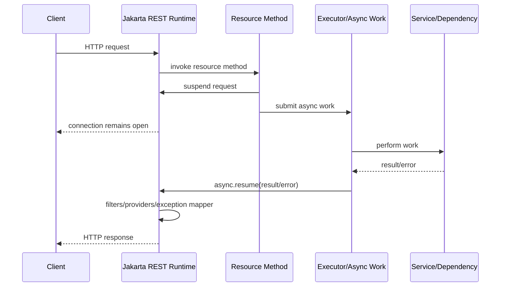
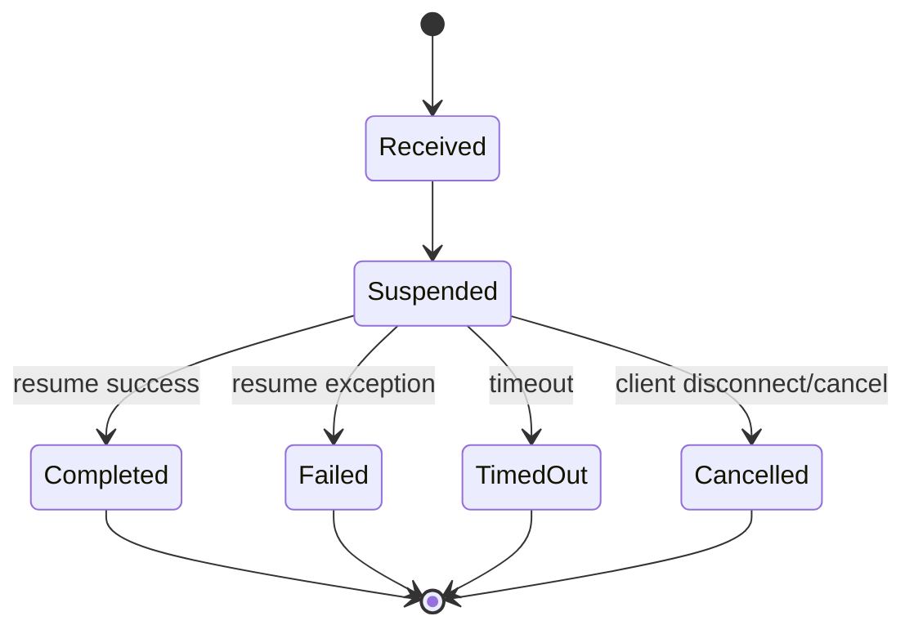

# Part 024 — Async Resources

Bagian ini membahas **asynchronous resource processing** di Jakarta REST.

Banyak engineer salah paham tentang async di REST service. Async bukan otomatis membuat request lebih cepat. Async juga bukan berarti CPU work menjadi gratis. Async terutama berguna untuk **membebaskan container request thread** saat resource menunggu pekerjaan yang akan selesai nanti: I/O lambat, job queue, callback eksternal, event, atau proses panjang.

Mental model:

> Async resource memisahkan lifecycle HTTP request dari eksekusi resource method awal. Tetapi tanggung jawab atas timeout, cancellation, cleanup, backpressure, security context, dan observability tetap milik aplikasi.

---

## 1. Kenapa Async Resource Ada?

Resource method synchronous biasa:

```java
@GET
@Path("/{id}")
public CaseDto getCase(@PathParam("id") UUID id) {
    return caseService.getCase(id);
}
```

Request thread memproses resource sampai return response.

Untuk operasi cepat, ini ideal:

- sederhana;
- mudah dipahami;
- mudah di-debug;
- error handling natural;
- context lifecycle jelas.

Namun untuk operasi lambat:

```java
@POST
@Path("/{caseId}/reports")
public ReportResult generateReport(@PathParam("caseId") UUID caseId) {
    return reportService.generateLargeReport(caseId); // may take 30 seconds
}
```

Masalah:

- request thread tertahan lama;
- thread pool bisa habis;
- client/proxy bisa timeout;
- user tidak tahu progress;
- retry bisa menggandakan kerja;
- failure cleanup sulit.

Async resource memberi opsi untuk suspend request dan resume nanti.

---

## 2. Dua Model Async Utama

Dalam Jakarta REST modern, ada dua pola utama:

1. `@Suspended AsyncResponse`
2. return type async seperti `CompletionStage<T>`

### 2.1 `AsyncResponse`

```java
@GET
@Path("/{caseId}/summary")
public void getSummary(
    @PathParam("caseId") UUID caseId,
    @Suspended AsyncResponse async
) {
    executor.submit(() -> {
        try {
            CaseSummary summary = service.computeSummary(caseId);
            async.resume(summary);
        } catch (Throwable t) {
            async.resume(t);
        }
    });
}
```

Resource method return `void`, request disuspend, lalu aplikasi memanggil `async.resume(...)` ketika hasil siap.

### 2.2 `CompletionStage<T>`

```java
@GET
@Path("/{caseId}/summary")
public CompletionStage<CaseSummary> getSummary(@PathParam("caseId") UUID caseId) {
    return service.computeSummaryAsync(caseId);
}
```

Runtime akan menunggu completion stage selesai lalu serialize hasil atau map exception.

### 2.3 Mana yang Dipilih?

| Situasi | Pilihan |
|---|---|
| callback/event eksternal | `AsyncResponse` |
| perlu manual timeout/cancel hook | `AsyncResponse` |
| service sudah return `CompletionStage` | `CompletionStage<T>` |
| pipeline async composable | `CompletionStage<T>` |
| perlu low-level control resume/cancel | `AsyncResponse` |
| simple async wrapper | `CompletionStage<T>` |

Rule:

> Pakai `CompletionStage<T>` untuk async yang composable dan natural. Pakai `AsyncResponse` saat kamu butuh kontrol lifecycle request secara eksplisit.

---

## 3. Request Lifecycle Async



Yang sering dilupakan:

- request tetap menempati koneksi;
- response belum dikirim sampai resume/timeout/cancel;
- memory context tetap ada;
- async work tetap butuh thread/executor;
- client/proxy/load balancer punya timeout sendiri;
- jika client disconnect, work mungkin masih berjalan kecuali aplikasi membatalkan.

---

## 4. `AsyncResponse` Basics

Contoh minimal:

```java
@GET
@Path("/slow")
public void slow(@Suspended AsyncResponse async) {
    executor.submit(() -> {
        async.resume(Response.ok("done").build());
    });
}
```

Resume bisa memakai entity:

```java
async.resume(new CaseSummary(...));
```

Atau response lengkap:

```java
async.resume(Response.accepted().build());
```

Atau exception:

```java
async.resume(new NotFoundException("Case not found"));
```

Jika resume dengan exception, Jakarta REST exception mapping tetap berlaku.

---

## 5. Timeout pada `AsyncResponse`

Async tanpa timeout adalah resource leak waiting to happen.

```java
@GET
@Path("/{caseId}/summary")
public void getSummary(
    @PathParam("caseId") UUID caseId,
    @Suspended AsyncResponse async
) {
    async.setTimeout(2, TimeUnit.SECONDS);
    async.setTimeoutHandler(ar -> ar.resume(
        Response.status(Response.Status.SERVICE_UNAVAILABLE)
            .entity(new ErrorDto("SUMMARY_TIMEOUT", "Summary generation timed out"))
            .build()
    ));

    executor.submit(() -> computeAndResume(caseId, async));
}
```

Timeout handler harus:

- mengembalikan status yang jelas;
- tidak membocorkan detail internal;
- mencatat telemetry;
- membatalkan kerja background jika mungkin;
- tidak mencoba resume dua kali.

Status code yang umum:

| Situation | Status |
|---|---|
| service overload/transient unavailable | `503` |
| dependency timeout | `504` jika bertindak sebagai gateway/proxy-like |
| accepted long-running job | `202` |
| client request timeout semantics | hati-hati, biasanya bukan `408` dari aplikasi |

Untuk resource yang benar-benar long-running, jangan tahan connection terlalu lama. Lebih baik gunakan `202 Accepted` + job resource.

---

## 6. Resume Idempotency

`AsyncResponse` hanya boleh diselesaikan sekali.

Race condition umum:

```text
Worker thread completes at 2000 ms
Timeout fires at 2000 ms
Both try async.resume(...)
```

Gunakan check atau atomic guard jika perlu:

```java
private void safeResume(AsyncResponse async, Object result) {
    if (!async.isDone()) {
        async.resume(result);
    }
}
```

Namun `isDone()` + `resume()` bukan atomic. Untuk kontrol ketat, gunakan `AtomicBoolean`:

```java
AtomicBoolean completed = new AtomicBoolean(false);

async.setTimeoutHandler(ar -> {
    if (completed.compareAndSet(false, true)) {
        ar.resume(timeoutResponse());
    }
});

executor.submit(() -> {
    try {
        CaseSummary summary = service.computeSummary(caseId);
        if (completed.compareAndSet(false, true)) {
            async.resume(summary);
        }
    } catch (Throwable t) {
        if (completed.compareAndSet(false, true)) {
            async.resume(t);
        }
    }
});
```

Top-tier engineer tidak menganggap async lifecycle sebagai detail runtime. Race completion adalah bagian dari correctness.

---

## 7. Cancellation dan Disconnect

Client bisa disconnect sebelum async work selesai.

`AsyncResponse` menyediakan state seperti done/cancelled/suspended. Runtime dapat menyelesaikan request karena normal completion, timeout, atau cancellation.

Aplikasi harus memikirkan:

- apakah work harus dibatalkan jika client disconnect?
- apakah work tetap perlu selesai karena command sudah diterima?
- apakah result perlu disimpan ke job resource?
- apakah audit event harus tetap dicatat?

Untuk query/enrichment:

```text
Client disconnect -> cancel work if possible
```

Untuk command/regulatory action:

```text
Client disconnect != cancel command automatically
```

Jika command sudah diterima dan commit/audit sudah dimulai, disconnect client tidak boleh membatalkan state transition tanpa policy eksplisit.

---

## 8. Async Bukan Pengganti Job Resource

Jika operasi butuh detik panjang/menit, jangan tahan HTTP connection.

Lebih baik:

```http
POST /cases/{caseId}/reports
Idempotency-Key: ...

202 Accepted
Location: /reports/jobs/{jobId}
```

Lalu:

```http
GET /reports/jobs/{jobId}
```

Response:

```json
{
  "jobId": "...",
  "status": "RUNNING",
  "submittedAt": "2026-06-27T10:00:00Z",
  "links": {
    "self": "/reports/jobs/..."
  }
}
```

Saat selesai:

```json
{
  "jobId": "...",
  "status": "COMPLETED",
  "result": {
    "reportId": "...",
    "downloadUrl": "/reports/.../content"
  }
}
```

Decision rule:

| Duration | Pattern |
|---|---|
| <100 ms | synchronous |
| 100 ms–2 s | synchronous or `CompletionStage` if natural |
| 2–10 s | async only if client/proxy timeout and UX support it |
| >10 s | `202 Accepted` + job resource |
| minutes/hours | queue/workflow/job model |

Angka ini bukan hukum mutlak, tetapi berguna sebagai default engineering heuristic.

---

## 9. Executor Ownership

Jangan asal membuat executor di resource class.

Buruk:

```java
@Path("/cases")
public class CaseResource {
    private final ExecutorService executor = Executors.newCachedThreadPool();
}
```

Masalah:

- lifecycle tidak jelas;
- shutdown tidak jelas;
- thread unbounded;
- context propagation tidak jelas;
- monitoring sulit;
- bisa menciptakan resource leak.

Lebih baik pakai managed executor dari runtime jika tersedia.

Konsep:

```java
@ApplicationScoped
public class AsyncExecution {

    @Inject
    ManagedExecutor executor;

    public CompletionStage<CaseSummary> supplyAsync(Supplier<CaseSummary> supplier) {
        return CompletableFuture.supplyAsync(supplier, executor);
    }
}
```

Atau definisikan executor application-scoped dengan lifecycle eksplisit.

Rule:

> Async resource harus punya executor ownership yang jelas: size, queue, rejection policy, context propagation, metrics, shutdown.

---

## 10. Backpressure Boundary

Async sering dipakai untuk “menghindari blocking”, tetapi jika request rate tinggi dan work lambat, backlog tetap tumbuh.

Tanpa backpressure:

```text
1000 requests/s arrive
Each async work takes 5 s
5000 pending tasks accumulate
Memory grows
Executor queue grows
Latency explodes
Eventually outage
```

Backpressure harus eksplisit:

- bounded executor queue;
- semaphore per dependency;
- rate limit;
- admission control;
- `503` saat overload;
- priority queue untuk critical operations;
- separate pool untuk heavy work;
- circuit breaker untuk downstream.

Contoh semaphore:

```java
@ApplicationScoped
public class SummaryAdmissionControl {

    private final Semaphore permits = new Semaphore(100);

    public boolean tryAcquire() {
        return permits.tryAcquire();
    }

    public void release() {
        permits.release();
    }
}
```

Resource:

```java
@GET
@Path("/{caseId}/summary")
public void getSummary(
    @PathParam("caseId") UUID caseId,
    @Suspended AsyncResponse async
) {
    if (!admission.tryAcquire()) {
        async.resume(Response.status(503)
            .entity(new ErrorDto("OVERLOADED", "Too many summary requests"))
            .build());
        return;
    }

    executor.submit(() -> {
        try {
            async.resume(service.computeSummary(caseId));
        } catch (Throwable t) {
            async.resume(t);
        } finally {
            admission.release();
        }
    });
}
```

---

## 11. `CompletionStage<T>` Resource

Jika service sudah asynchronous:

```java
@GET
@Path("/{caseId}/summary")
public CompletionStage<CaseSummary> getSummary(@PathParam("caseId") UUID caseId) {
    return summaryService.computeAsync(caseId);
}
```

Error mapping:

```java
@GET
@Path("/{caseId}/summary")
public CompletionStage<CaseSummary> getSummary(@PathParam("caseId") UUID caseId) {
    return summaryService.computeAsync(caseId)
        .exceptionallyCompose(ex -> failedStage(mapException(ex)));
}
```

Namun sering lebih baik biarkan exception mapper menangani exception domain:

```java
public CompletionStage<CaseSummary> getSummary(UUID caseId) {
    return summaryService.computeAsync(caseId);
}
```

Jika `CompletionStage` gagal dengan `CaseNotFoundException`, exception mapper bisa mengubahnya menjadi `404`.

Pitfall:

- exception sering dibungkus `CompletionException`;
- context request mungkin tidak otomatis terbawa;
- timeout harus tetap eksplisit;
- cancellation tidak selalu membatalkan underlying work.

---

## 12. CompletionStage Timeout

Java menyediakan timeout di `CompletableFuture`, tetapi semantics-nya perlu hati-hati.

```java
return summaryService.computeAsync(caseId)
    .orTimeout(2, TimeUnit.SECONDS);
```

Jika timeout terjadi, future selesai exception. Tetapi underlying work belum tentu berhenti.

Lebih aman:

```java
return summaryService.computeAsync(caseId)
    .completeOnTimeout(fallbackSummary(caseId), 2, TimeUnit.SECONDS);
```

Namun fallback harus sesuai domain. Untuk regulated decision, fallback summary palsu/stale bisa berbahaya.

Better pattern:

```java
return summaryService.computeAsync(caseId)
    .orTimeout(2, TimeUnit.SECONDS)
    .exceptionallyCompose(ex -> {
        Throwable root = unwrap(ex);
        if (root instanceof TimeoutException) {
            return failedStage(new ServiceUnavailableException("Summary timed out"));
        }
        return failedStage(root);
    });
```

---

## 13. Exception Mapping dengan Async

Jika `async.resume(Throwable)` dipanggil:

```java
async.resume(new CaseNotFoundException(caseId));
```

Exception mapper:

```java
@Provider
public class CaseNotFoundMapper implements ExceptionMapper<CaseNotFoundException> {
    @Override
    public Response toResponse(CaseNotFoundException ex) {
        return Response.status(Response.Status.NOT_FOUND)
            .entity(new ProblemDto("CASE_NOT_FOUND", ex.getMessage()))
            .build();
    }
}
```

Jika `CompletionStage` gagal:

```java
CompletableFuture.failedFuture(new CaseNotFoundException(caseId))
```

Runtime akan menyelesaikan request sebagai failure dan exception mapper berlaku, dengan catatan runtime dapat membungkus exception. Test behavior pada runtime target.

Rule:

> Async failure tetap harus memakai exception taxonomy yang sama dengan sync failure. Jangan buat error contract berbeda hanya karena implementasinya async.

---

## 14. Security Context dan Async

Request context seperti identity, roles, tenant, dan correlation ID bisa hidup di request thread. Saat work dipindahkan ke executor lain, context bisa hilang.

Buruk:

```java
executor.submit(() -> {
    // SecurityContext may not be available here.
    service.computeForCurrentUser();
});
```

Lebih baik snapshot context yang diperlukan:

```java
public void getSummary(@Context SecurityContext security,
                       @Context HttpHeaders headers,
                       @PathParam("caseId") UUID caseId,
                       @Suspended AsyncResponse async) {

    UserPrincipalSnapshot user = UserPrincipalSnapshot.from(security);
    String correlationId = headers.getHeaderString("X-Correlation-Id");

    executor.submit(() -> {
        try {
            async.resume(service.computeSummary(caseId, user, correlationId));
        } catch (Throwable t) {
            async.resume(t);
        }
    });
}
```

Atau gunakan context propagation facility dari runtime/MicroProfile Context Propagation jika tersedia.

Rule:

> Jangan mengandalkan request-scoped context tetap valid di thread lain kecuali runtime secara eksplisit menjamin context propagation.

---

## 15. Audit Context

Untuk regulated workflow, async operation harus mempertahankan audit context.

Audit context minimal:

```java
public record AuditContext(
    UUID requestId,
    UUID actorId,
    String actorType,
    String tenantId,
    String correlationId,
    Instant receivedAt,
    String sourceIp,
    String userAgent
) {}
```

Saat suspend:

```java
AuditContext audit = AuditContextFactory.from(security, headers, request);
```

Saat worker:

```java
auditLogger.recordStarted(audit, "CASE_SUMMARY_GENERATION", caseId);
```

Saat selesai:

```java
auditLogger.recordCompleted(audit, "CASE_SUMMARY_GENERATION", outcome);
```

Jangan bergantung pada `SecurityContext` live object di worker thread. Simpan snapshot immutable.

---

## 16. Long-Running Command Pattern

Untuk command yang memicu proses panjang:

```java
@POST
@Path("/{caseId}/reports")
public Response requestReport(
    @PathParam("caseId") UUID caseId,
    @HeaderParam("Idempotency-Key") String idempotencyKey,
    ReportRequest request
) {
    ReportJob job = reportService.submit(caseId, idempotencyKey, request);

    return Response.accepted(job.toDto())
        .location(uriInfo.getAbsolutePathBuilder()
            .path("/jobs/{jobId}")
            .build(job.id()))
        .build();
}
```

Job resource:

```java
@GET
@Path("/reports/jobs/{jobId}")
public ReportJobDto getJob(@PathParam("jobId") UUID jobId) {
    return reportService.getJob(jobId).toDto();
}
```

Mermaid:

```mermaid
flowchart LR
  A[POST /cases/{id}/reports] --> B[Validate Command]
  B --> C[Create Job Record]
  C --> D[Publish Work]
  D --> E[Return 202 + Location]
  F[Worker] --> G[Generate Report]
  G --> H[Update Job Status]
  I[GET /reports/jobs/{jobId}] --> H
```

Ini biasanya lebih baik dari `AsyncResponse` untuk proses panjang.

---

## 17. Async Query vs Async Command

### Async Query

Contoh:

```http
GET /cases/{caseId}/summary
```

Jika client disconnect, query boleh dibatalkan.

### Async Command

Contoh:

```http
POST /cases/{caseId}/escalations
```

Jika client disconnect setelah command diterima, command tidak otomatis batal. Sistem harus punya command state.

Pattern:

```http
POST /cases/{caseId}/escalations
Idempotency-Key: abc

202 Accepted
Location: /commands/abc
```

Lalu:

```http
GET /commands/abc
```

Command status:

```json
{
  "commandId": "abc",
  "status": "COMPLETED",
  "result": {
    "escalationId": "..."
  }
}
```

---

## 18. Virtual Threads dan Async Resource

Java modern membawa virtual threads. Ini mengubah sebagian trade-off.

Dengan virtual threads, blocking I/O bisa lebih murah dibanding platform thread, sehingga resource synchronous dengan virtual-thread-per-request dapat cukup scalable untuk banyak workload I/O-bound.

Namun virtual threads tidak menghapus kebutuhan untuk:

- timeout;
- backpressure;
- connection limits;
- DB pool limits;
- remote dependency limits;
- memory budgeting;
- cancellation policy;
- observability.

Decision heuristic:

| Workload | Virtual Thread Sync | Async Resource |
|---|---:|---:|
| simple blocking I/O | often good | optional |
| callback/event completion | not enough | strong fit |
| long-running job | not enough | prefer job resource |
| high fan-out with composition | possible | `CompletionStage` useful |
| streaming | depends | often useful |
| CPU-bound heavy work | no magic | needs bounded executor |

Rule:

> Virtual threads reduce the cost of waiting. They do not remove the need for admission control or dependency budgeting.

---

## 19. CPU-bound Work

Async does not make CPU-bound work cheaper.

Bad:

```java
executor.submit(() -> {
    // CPU-heavy PDF generation for 10 seconds
    async.resume(generateHugePdf(caseId));
});
```

Jika request rate tinggi, CPU akan saturate.

Untuk CPU-bound heavy work:

- gunakan bounded pool;
- pisahkan dari request pool;
- batasi concurrency;
- gunakan job queue;
- precompute/cache jika feasible;
- return `202` jika long-running;
- expose status/progress.

---

## 20. I/O-bound Work

Async cocok untuk I/O-bound jika:

- dependency client non-blocking atau work berada di managed executor;
- thread request bisa dilepas;
- concurrency dibatasi;
- timeout jelas;
- cancellation dipikirkan.

Contoh fan-out:

```java
@GET
@Path("/{caseId}/overview")
public CompletionStage<CaseOverview> getOverview(@PathParam("caseId") UUID caseId) {
    CompletionStage<CaseDto> c = caseService.getCaseAsync(caseId);
    CompletionStage<List<EvidenceDto>> e = evidenceService.listAsync(caseId);
    CompletionStage<RiskDto> r = riskService.getRiskAsync(caseId);

    return c.thenCombine(e, CaseOverviewPartial::new)
        .thenCombine(r, CaseOverview::from);
}
```

Tapi fan-out memperbesar failure surface:

- partial failure;
- inconsistent snapshots;
- timeout budget per dependency;
- fallback decision;
- correlation propagation;
- cancellation propagation.

---

## 21. Timeout Budget untuk Fan-Out

Jika total SLA 1000 ms dan ada 3 dependency paralel, jangan memberi masing-masing 1000 ms tanpa margin.

```text
Total budget: 1000 ms
Request overhead: 100 ms
Aggregation overhead: 100 ms
Dependency budget: 700 ms
Margin: 100 ms
```

Per dependency:

```text
case-service: 300 ms
evidence-service: 600 ms
risk-service: 500 ms
```

Karena paralel, total bukan jumlah semua timeout, tetapi tail latency ditentukan dependency paling lambat dan failure handling.

---

## 22. Partial Failure Policy

Untuk overview UI:

```json
{
  "case": {...},
  "evidenceSummary": null,
  "risk": {...},
  "warnings": [
    {"code":"EVIDENCE_SUMMARY_UNAVAILABLE"}
  ]
}
```

Untuk legal decision endpoint:

```http
503 Service Unavailable
```

karena risk/evidence dependency mandatory.

Rule:

> Partial failure policy adalah business decision. Jangan biarkan `CompletableFuture.exceptionally` diam-diam mengubah mandatory data menjadi null.

---

## 23. Async + Transaction Boundary

Jangan membawa database transaction across async boundary.

Buruk:

```java
@Transactional
public void submit(@Suspended AsyncResponse async) {
    Case c = repository.find(...);
    executor.submit(() -> {
        c.changeStatus(...); // detached/stale/transaction gone
        async.resume(...);
    });
}
```

Baik:

```java
public void submit(@Suspended AsyncResponse async) {
    UUID caseId = ...;
    executor.submit(() -> {
        try {
            CaseSummary summary = transactionalService.computeSummary(caseId);
            async.resume(summary);
        } catch (Throwable t) {
            async.resume(t);
        }
    });
}
```

Transaction harus dimulai dan selesai di thread/work unit yang melakukan database access.

---

## 24. Async + Persistence Context

Jangan pass JPA entity ke async worker.

Buruk:

```java
CaseEntity entity = caseRepository.find(caseId);
executor.submit(() -> generateSummary(entity));
```

Risiko:

- lazy loading outside transaction;
- stale data;
- thread-safety;
- persistence context closed;
- hidden DB access.

Baik:

```java
CaseSummaryInput input = caseRepository.loadSummaryInput(caseId);
executor.submit(() -> generateSummary(input));
```

Atau worker memuat sendiri data yang diperlukan dalam transaction baru.

---

## 25. Async + Request Body

Jika async worker butuh request body, pastikan body sudah dibaca ke object aman sebelum resource method selesai.

```java
@POST
public void submit(ReportRequest request, @Suspended AsyncResponse async) {
    ReportCommand command = mapper.toCommand(request);
    executor.submit(() -> process(command, async));
}
```

Jangan simpan raw input stream untuk dibaca nanti kecuali lifecycle stream dijamin dan didesain khusus.

---

## 26. Response Filters dan Async

Response filters tetap berjalan saat response dihasilkan dari async resume.

Flow:

```text
async.resume(entity)
  -> exception mapper if needed
  -> message body writer
  -> response filters
  -> HTTP response
```

Pastikan filter logging/metrics mengukur durasi total request, bukan hanya durasi resource method awal.

Jika request disuspend, durasi resource method mungkin 2 ms, tetapi durasi user-perceived 1500 ms.

Metrics harus menangkap:

- time to suspend;
- queue wait time;
- work execution time;
- total response time;
- timeout count;
- cancellation count;
- pending async count.

---

## 27. Metrics untuk Async

Metric penting:

```text
http.server.requests.duration
async.requests.pending
async.requests.timeout.count
async.requests.cancelled.count
async.executor.queue.size
async.executor.active.count
async.executor.rejected.count
async.work.duration
async.queue.wait.duration
```

Label:

```text
resource=CaseSummaryResource
operation=getSummary
route=/cases/{caseId}/summary
outcome=success|timeout|cancelled|error
```

Jangan label dengan `caseId`, `partyId`, atau ID cardinality tinggi.

---

## 28. Logging untuk Async

Saat berpindah thread, MDC/log context bisa hilang.

Snapshot correlation ID:

```java
String correlationId = correlation.currentOrCreate();

executor.submit(() -> {
    try (MdcScope ignored = MdcScope.with("correlationId", correlationId)) {
        async.resume(service.compute(caseId));
    } catch (Throwable t) {
        async.resume(t);
    }
});
```

Log lifecycle:

```text
summary.request.accepted
summary.work.started
summary.work.completed
summary.response.resumed
```

Untuk timeout:

```text
summary.request.timeout
summary.work.cancel.requested
summary.work.completed.after.timeout
```

Late completion after timeout harus dimonitor. Jika tinggi, timeout terlalu pendek atau executor terlalu overloaded.

---

## 29. Handling Worker Rejection

Jika executor queue penuh, jangan suspend request lalu diam.

```java
try {
    executor.execute(task);
} catch (RejectedExecutionException ex) {
    async.resume(Response.status(503)
        .entity(new ErrorDto("ASYNC_EXECUTOR_SATURATED", "Server is busy"))
        .build());
}
```

Admission control lebih baik dilakukan sebelum submit.

---

## 30. Async Streaming vs Async Request

Async resource berbeda dari streaming.

Async resource:

```text
request waits -> one final response
```

Streaming:

```text
response starts -> multiple chunks/events
```

Untuk progress update, async response bukan solusi ideal karena client tidak melihat progress sampai response selesai. Gunakan:

- job resource polling;
- Server-Sent Events;
- WebSocket jika bidirectional needed;
- callback/webhook jika system-to-system.

SSE akan dibahas pada Part 025.

---

## 31. Example: Async Summary with CompletionStage

Resource:

```java
@Path("/cases")
@Produces(MediaType.APPLICATION_JSON)
public class CaseSummaryResource {

    private final CaseSummaryService service;

    public CaseSummaryResource(CaseSummaryService service) {
        this.service = service;
    }

    @GET
    @Path("/{caseId}/summary")
    public CompletionStage<CaseSummaryDto> getSummary(@PathParam("caseId") UUID caseId) {
        return service.computeSummary(caseId)
            .thenApply(CaseSummaryMapper::toDto);
    }
}
```

Service:

```java
@ApplicationScoped
public class CaseSummaryService {

    private final ManagedExecutor executor;
    private final CaseRepository repository;

    public CompletionStage<CaseSummary> computeSummary(UUID caseId) {
        return CompletableFuture.supplyAsync(() -> {
            CaseSummaryInput input = repository.loadSummaryInput(caseId);
            return CaseSummary.compute(input);
        }, executor);
    }
}
```

Mapper exception:

```java
@Provider
public class CaseNotFoundMapper implements ExceptionMapper<CaseNotFoundException> {
    @Override
    public Response toResponse(CaseNotFoundException exception) {
        return Response.status(404)
            .entity(new ProblemDto("CASE_NOT_FOUND", exception.getMessage()))
            .build();
    }
}
```

---

## 32. Example: AsyncResponse with Timeout and Admission Control

```java
@Path("/cases")
@Produces(MediaType.APPLICATION_JSON)
public class CaseSummaryResource {

    private final ExecutorService executor;
    private final SummaryAdmissionControl admission;
    private final CaseSummaryService service;

    public CaseSummaryResource(
        ExecutorService executor,
        SummaryAdmissionControl admission,
        CaseSummaryService service
    ) {
        this.executor = executor;
        this.admission = admission;
        this.service = service;
    }

    @GET
    @Path("/{caseId}/summary")
    public void getSummary(
        @PathParam("caseId") UUID caseId,
        @Suspended AsyncResponse async
    ) {
        if (!admission.tryAcquire()) {
            async.resume(Response.status(503)
                .entity(new ProblemDto("OVERLOADED", "Too many summary requests"))
                .build());
            return;
        }

        AtomicBoolean completed = new AtomicBoolean(false);

        async.setTimeout(2, TimeUnit.SECONDS);
        async.setTimeoutHandler(ar -> {
            if (completed.compareAndSet(false, true)) {
                admission.release();
                ar.resume(Response.status(503)
                    .entity(new ProblemDto("SUMMARY_TIMEOUT", "Summary generation timed out"))
                    .build());
            }
        });

        try {
            executor.execute(() -> {
                try {
                    CaseSummaryDto dto = CaseSummaryMapper.toDto(service.computeSummaryBlocking(caseId));
                    if (completed.compareAndSet(false, true)) {
                        async.resume(dto);
                    }
                } catch (Throwable t) {
                    if (completed.compareAndSet(false, true)) {
                        async.resume(t);
                    }
                } finally {
                    if (completed.get()) {
                        admission.release();
                    }
                }
            });
        } catch (RejectedExecutionException ex) {
            if (completed.compareAndSet(false, true)) {
                admission.release();
                async.resume(Response.status(503)
                    .entity(new ProblemDto("EXECUTOR_SATURATED", "Server is busy"))
                    .build());
            }
        }
    }
}
```

Catatan: contoh ini deliberately verbose agar lifecycle terlihat. Dalam production, logic seperti `completed/admission/release` sebaiknya dibungkus abstraction agar tidak copy-paste.

---

## 33. Cleanup Bug pada Contoh Async

Perhatikan pola release permit. Kesalahan umum:

```java
finally {
    admission.release();
}
```

Jika worker selesai setelah timeout dan timeout handler sudah release, `finally` akan release lagi. Semaphore count menjadi salah.

Gunakan ownership yang jelas:

```java
AtomicBoolean permitReleased = new AtomicBoolean(false);

Runnable releasePermit = () -> {
    if (permitReleased.compareAndSet(false, true)) {
        admission.release();
    }
};
```

Lalu panggil `releasePermit.run()` dari semua terminal path.

---

## 34. Safer AsyncResponse Lifecycle Helper

Buat abstraction:

```java
public final class AsyncRequestGuard {

    private final AsyncResponse async;
    private final AtomicBoolean completed = new AtomicBoolean(false);
    private final Runnable cleanup;

    public AsyncRequestGuard(AsyncResponse async, Runnable cleanup) {
        this.async = async;
        this.cleanup = cleanup;
    }

    public boolean resume(Object value) {
        if (completed.compareAndSet(false, true)) {
            try {
                return async.resume(value);
            } finally {
                cleanup.run();
            }
        }
        return false;
    }
}
```

Pemakaian:

```java
AsyncRequestGuard guard = new AsyncRequestGuard(async, admission::release);

async.setTimeoutHandler(ar -> guard.resume(timeoutResponse()));

executor.execute(() -> {
    try {
        guard.resume(service.compute(caseId));
    } catch (Throwable t) {
        guard.resume(t);
    }
});
```

Ini mengurangi bug double-resume dan double-cleanup.

---

## 35. Anti-Patterns

### 35.1 Async untuk Semua Endpoint

Async menambah kompleksitas. Jangan pakai jika synchronous cukup.

### 35.2 Unbounded Executor

`newCachedThreadPool()` tanpa kontrol bisa membuat outage lebih cepat.

### 35.3 No Timeout

Suspended request tanpa timeout bisa menggantung selamanya.

### 35.4 No Backpressure

Async tanpa admission control hanya memindahkan bottleneck ke queue.

### 35.5 Passing JPA Entity to Worker

Persistence context tidak aman across thread/request boundary.

### 35.6 Losing Security Context

Jangan asumsikan `SecurityContext` valid di worker thread.

### 35.7 Long-Running HTTP Hold

Untuk proses panjang, gunakan `202 + job resource`.

### 35.8 Silent Fallback

Jangan mengubah failure mandatory dependency menjadi null tanpa contract.

### 35.9 Ignoring Client Disconnect

Work bisa tetap berjalan sia-sia atau command bisa ambiguous.

### 35.10 Logging Wrong Duration

Durasi resource method bukan durasi request async.

---

## 36. Production Checklist

Sebelum async resource masuk production:

- [ ] alasan async jelas;
- [ ] synchronous alternative sudah dipertimbangkan;
- [ ] timeout eksplisit;
- [ ] timeout response contract jelas;
- [ ] cancellation policy jelas;
- [ ] executor managed/bounded;
- [ ] queue/admission control ada;
- [ ] rejection menghasilkan `503` atau contract sesuai;
- [ ] resume hanya sekali;
- [ ] cleanup hanya sekali;
- [ ] security/audit context disnapshot atau dipropagasi;
- [ ] transaction tidak melewati async boundary;
- [ ] JPA entity tidak dipass ke worker;
- [ ] client disconnect policy jelas;
- [ ] metrics pending/timeout/cancel/reject ada;
- [ ] correlation ID tetap ada di worker log;
- [ ] partial failure policy explicit;
- [ ] load test mencakup overload scenario;
- [ ] proxy/load balancer timeout sesuai;
- [ ] long-running process memakai job resource, bukan held request.

---

## 37. Testing Strategy

### 37.1 Success Completion

- request masuk;
- async work selesai;
- response 200;
- body benar;
- metrics success bertambah.

### 37.2 Timeout

- work dibuat lambat;
- timeout handler menghasilkan response sesuai;
- cleanup terpanggil sekali;
- late completion tidak mengubah response.

### 37.3 Worker Exception

- worker lempar domain exception;
- exception mapper menghasilkan status benar;
- error body benar.

### 37.4 Rejection

- executor saturated;
- response `503`;
- no suspended leak.

### 37.5 Cancellation

- client disconnect/cancel jika test framework mendukung;
- work cancellation behavior sesuai policy.

### 37.6 Context Propagation

- correlation ID tetap muncul di worker log;
- audit context benar;
- security decision memakai snapshot valid.

### 37.7 Load Test

- pending async count stabil;
- queue tidak unbounded;
- timeout rate terukur;
- tail latency tidak collapse;
- no memory leak.

---

## 38. Mental Model Summary

Async resource adalah alat untuk mengelola lifecycle request yang tidak selesai langsung.

Gunakan async ketika:

- work menunggu I/O/event/callback;
- service sudah punya async API;
- request thread perlu dilepas;
- completion bisa terjadi nanti;
- timeout/cancel/cleanup bisa dikontrol.

Jangan gunakan async untuk:

- menyembunyikan operasi lambat tanpa backpressure;
- menggantikan job resource untuk long-running task;
- mempercepat CPU-bound work;
- menghindari desain timeout/resilience;
- membawa transaction/request context ke thread lain.

Top-tier engineer melihat async sebagai **state machine**:



Setiap terminal state harus punya response/audit/cleanup/metrics behavior yang jelas.

---

## 39. Latihan 20 Jam ala Kaufman

### Jam 1–3: Basic AsyncResponse

- Buat endpoint `GET /cases/{id}/summary` dengan `AsyncResponse`.
- Resume success.
- Resume exception.
- Tambahkan exception mapper.

### Jam 4–6: Timeout

- Tambahkan `setTimeout`.
- Tambahkan timeout handler.
- Test worker selesai setelah timeout.

### Jam 7–9: CompletionStage

- Buat endpoint return `CompletionStage<T>`.
- Test success/failure.
- Tambahkan timeout pada stage.

### Jam 10–12: Executor dan Backpressure

- Gunakan bounded executor.
- Tambahkan admission control.
- Test rejection.

### Jam 13–15: Context

- Snapshot security context.
- Propagasi correlation ID.
- Tambahkan audit event started/completed/timeout.

### Jam 16–18: Job Resource Pattern

- Ubah long-running operation menjadi `202 Accepted + Location`.
- Buat `GET /jobs/{id}`.
- Tambahkan idempotency key.

### Jam 19–20: Load/Failure Test

- Simulasikan 100 concurrent request.
- Ukur pending count, timeout count, rejection count.
- Pastikan cleanup tidak double-release.

---

## 40. Kriteria Lulus Part Ini

Kamu dianggap menguasai part ini jika bisa:

- menjelaskan kapan async resource diperlukan dan kapan tidak;
- membedakan `AsyncResponse` dan `CompletionStage<T>`;
- mendesain timeout/cancellation/cleanup lifecycle;
- menghindari double-resume dan double-cleanup;
- memilih job resource untuk long-running command;
- menerapkan bounded executor/admission control;
- menjaga security/audit/correlation context across thread;
- tidak membawa transaction/JPA entity across async boundary;
- mengukur async request dengan metric yang benar;
- menguji success, timeout, rejection, failure, dan overload.

---

## 41. Sumber Resmi dan Bacaan Lanjutan

- Jakarta RESTful Web Services 4.0 Specification
- Jakarta REST `AsyncResponse` Javadoc
- Jakarta REST server-side asynchronous processing section
- MicroProfile Context Propagation Specification
- MicroProfile Fault Tolerance Specification
- Jakarta Concurrency Specification
- Dokumentasi runtime target: Jersey, RESTEasy, Open Liberty, WildFly, Quarkus, Payara
