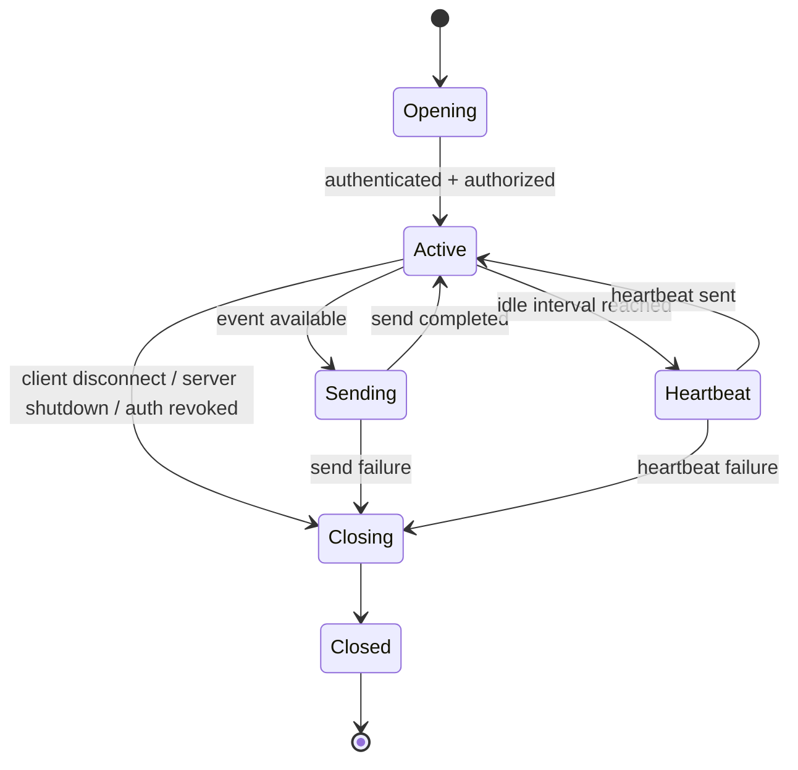
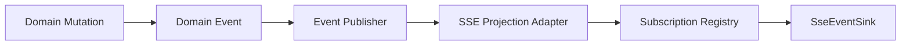
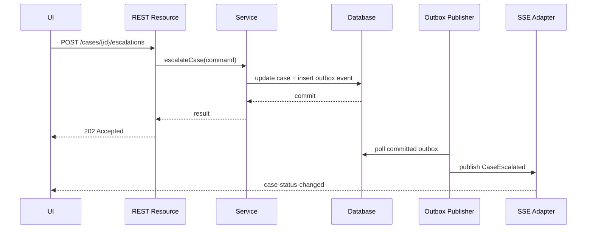
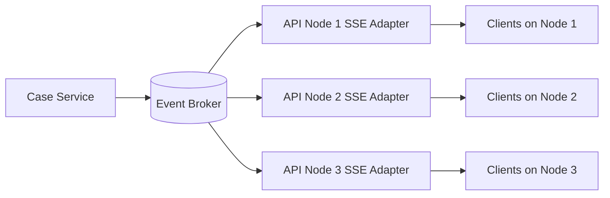
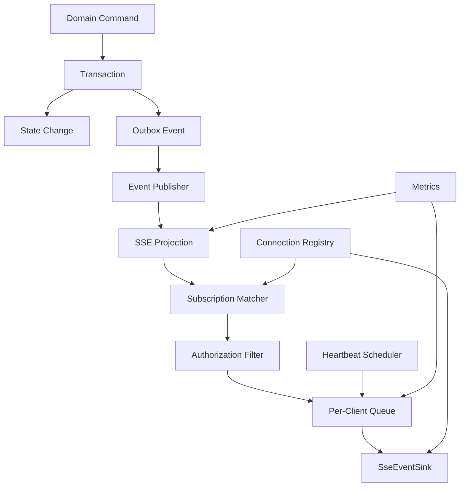

# Part 025 — Server-Sent Events: Event Streams, Reconnect, Heartbeats, and Operational Constraints

## 1. Learning Objective

Setelah bagian ini, kita ingin bisa mendesain dan mengimplementasikan **Server-Sent Events (SSE)** di Jakarta REST secara production-grade, bukan sekadar membuat endpoint yang mengirim beberapa string ke browser.

Target kemampuan:

1. Memahami kapan SSE cocok dan kapan tidak.
2. Mampu membuat endpoint SSE dengan `SseEventSink`, `Sse`, dan `OutboundSseEvent`.
3. Mampu membedakan **per-client stream** dan **broadcast stream**.
4. Mampu mendesain reconnection, event id, heartbeat, dan replay boundary.
5. Mampu mengelola lifecycle koneksi, memory pressure, proxy timeout, observability, dan shutdown.
6. Mampu memetakan SSE ke domain serius seperti case-management, enforcement lifecycle, audit status, escalation notification, atau progress tracking.

SSE terlihat sederhana karena API-nya kecil. Justru itu jebakannya. Kesalahan produksi biasanya bukan pada syntax `SseEventSink`, tetapi pada:

- koneksi tidak pernah dibersihkan,
- stream tidak punya backpressure boundary,
- event hilang saat reconnect,
- load balancer memutus koneksi idle,
- thread/container resource habis,
- broadcast ke ribuan client dilakukan dari satu critical section,
- data sensitif bocor karena event channel terlalu luas,
- API event diperlakukan seperti message broker, padahal SSE bukan broker.

## 2. Kaufman Deconstruction

Agar belajar efektif, kita pecah SSE menjadi sub-skill kecil.

| Sub-skill | Pertanyaan inti | Output praktis |
|---|---|---|
| Transport model | Apa bedanya SSE, polling, WebSocket, dan broker? | Bisa memilih teknologi sesuai use case |
| Jakarta REST API | Apa peran `SseEventSink`, `Sse`, `OutboundSseEvent`, `SseBroadcaster`? | Bisa membuat endpoint SSE idiomatis |
| Event contract | Apa bentuk event, id, name, retry, data? | Event schema stabil dan bisa berevolusi |
| Lifecycle | Kapan sink dibuat, ditutup, error, atau disconnect? | Tidak ada koneksi zombie |
| Reconnect | Apa yang terjadi setelah client disconnect? | Replay atau resume boundary jelas |
| Operational model | Bagaimana koneksi panjang hidup di container/proxy? | Tahu timeout, heartbeat, resource limit |
| Security | Siapa boleh subscribe event apa? | Tidak ada data leakage antar tenant/user |
| Observability | Apa yang harus diukur? | Bisa debug drop, lag, fan-out, error |

Satu mental model penting:

> SSE adalah **HTTP response yang dibiarkan terbuka** untuk mengirim rangkaian event satu arah dari server ke client.

Itu berarti semua aturan operasional HTTP tetap berlaku: authentication, authorization, headers, connection timeout, proxies, observability, rate limiting, dan lifecycle response.

## 3. What SSE Is and Is Not

SSE adalah mekanisme streaming event **server-to-client** melalui HTTP. Client membuka request ke endpoint yang menghasilkan media type:

```http
Accept: text/event-stream
```

Server merespons dengan:

```http
Content-Type: text/event-stream
```

Lalu server menulis event secara bertahap ke response body.

### 3.1 SSE Is Good For

SSE cocok untuk:

- progress update long-running job,
- notification stream satu arah,
- dashboard status,
- live audit/event feed read-only,
- case state update,
- asynchronous workflow progress,
- operational event stream ringan,
- UI yang perlu auto-update tanpa polling agresif.

Contoh domain:

```text
GET /cases/CASE-2026-000123/events
```

Client ingin menerima event seperti:

```json
{"type":"CASE_STATUS_CHANGED","caseId":"CASE-2026-000123","from":"UNDER_REVIEW","to":"ESCALATED"}
```

### 3.2 SSE Is Not Good For

SSE tidak cocok untuk:

- bidirectional interactive protocol,
- low-latency command channel dua arah,
- high-volume event bus,
- guaranteed durable delivery tanpa storage tambahan,
- large binary streaming,
- replacement Kafka/RabbitMQ/NATS,
- per-event transactional command processing dari client ke server.

Untuk bidirectional komunikasi, WebSocket sering lebih cocok. Untuk durable event integration antar service, gunakan broker/event log. Untuk large file, gunakan download streaming biasa, bukan SSE.

### 3.3 SSE vs Polling vs WebSocket

| Model | Direction | Complexity | Best use |
|---|---:|---:|---|
| Short polling | Client asks repeatedly | Low | Rare updates, simple systems |
| Long polling | Server holds request until event | Medium | Compatibility-sensitive systems |
| SSE | Server pushes over HTTP response | Medium | One-way live updates |
| WebSocket | Full duplex | Higher | Bidirectional real-time protocol |
| Message broker | Service-to-service durable async | Higher | Reliable integration/event sourcing |

Rule of thumb:

> Jika browser/UI hanya perlu mendengar perubahan dari server, SSE lebih sederhana daripada WebSocket.

## 4. SSE Wire Format

SSE event stream adalah text stream. Satu event terdiri dari baris-baris field, lalu dipisahkan blank line.

Contoh:

```text
id: evt-001
event: case-status-changed
retry: 5000
data: {"caseId":"CASE-1","status":"ESCALATED"}

id: evt-002
event: evidence-added
data: {"caseId":"CASE-1","evidenceId":"EV-9"}

```

Field umum:

| Field | Makna |
|---|---|
| `id` | Event id; client dapat mengirim kembali lewat `Last-Event-ID` saat reconnect |
| `event` | Nama event; browser dapat dispatch ke listener spesifik |
| `data` | Payload event; bisa multi-line |
| `retry` | Rekomendasi delay reconnect dalam millisecond |
| comment line | Baris diawali `:`; sering dipakai untuk heartbeat |

Contoh heartbeat:

```text
: heartbeat

```

Heartbeat penting karena banyak proxy/load balancer menutup koneksi idle. Heartbeat menjaga stream aktif dan memberi sinyal bahwa koneksi masih hidup.

## 5. Jakarta REST SSE API Mental Model

Jakarta REST menyediakan package SSE di `jakarta.ws.rs.sse`.

Komponen utama:

| Komponen | Peran |
|---|---|
| `SseEventSink` | Stream output untuk satu client connection |
| `Sse` | Factory/helper untuk membuat event dan broadcaster |
| `OutboundSseEvent` | Event yang dikirim server ke client |
| `SseBroadcaster` | Helper untuk broadcast event ke banyak sink |
| `InboundSseEvent` | Event yang dibaca client SSE |
| `SseEventSource` | Client-side source untuk subscribe SSE stream |

Dalam resource server, `SseEventSink` biasanya didapat dengan injection parameter resource method:

```java
@GET
@Path("/events")
@Produces(MediaType.SERVER_SENT_EVENTS)
public void stream(@Context SseEventSink sink, @Context Sse sse) {
    // send events to sink
}
```

Poin penting:

- `SseEventSink` mewakili satu koneksi HTTP terbuka.
- `Sse` dipakai untuk membuat event.
- Response method sering return `void`, karena output dikirim melalui sink.
- Sink harus ditutup saat stream selesai atau client tidak lagi valid.
- Send biasanya asynchronous dan mengembalikan `CompletionStage` tergantung implementasi API.

## 6. Minimal SSE Resource

Contoh paling kecil:

```java
package com.acme.caseapi.boundary;

import jakarta.ws.rs.GET;
import jakarta.ws.rs.Path;
import jakarta.ws.rs.Produces;
import jakarta.ws.rs.core.Context;
import jakarta.ws.rs.core.MediaType;
import jakarta.ws.rs.sse.OutboundSseEvent;
import jakarta.ws.rs.sse.Sse;
import jakarta.ws.rs.sse.SseEventSink;

@Path("/system")
public class SystemEventsResource {

    @GET
    @Path("/events")
    @Produces(MediaType.SERVER_SENT_EVENTS)
    public void events(@Context SseEventSink sink, @Context Sse sse) {
        OutboundSseEvent event = sse.newEventBuilder()
                .name("system-ready")
                .id("evt-1")
                .mediaType(MediaType.TEXT_PLAIN_TYPE)
                .data(String.class, "ready")
                .build();

        sink.send(event)
                .whenComplete((ignored, error) -> {
                    try {
                        sink.close();
                    } catch (Exception closeError) {
                        // log close failure without masking original failure
                    }
                });
    }
}
```

Ini valid untuk demo, tetapi bukan production pattern. Production stream biasanya tidak langsung close setelah satu event, kecuali endpoint memang one-shot progress notification.

## 7. Long-Lived Per-Client Stream

Untuk stream yang tetap terbuka, kita perlu registry koneksi.

Contoh sederhana:

```java
package com.acme.caseapi.sse;

import jakarta.enterprise.context.ApplicationScoped;
import jakarta.ws.rs.sse.OutboundSseEvent;
import jakarta.ws.rs.sse.SseEventSink;

import java.util.Map;
import java.util.UUID;
import java.util.concurrent.ConcurrentHashMap;

@ApplicationScoped
public class SseConnectionRegistry {

    private final Map<UUID, SseEventSink> sinks = new ConcurrentHashMap<>();

    public UUID add(SseEventSink sink) {
        UUID id = UUID.randomUUID();
        sinks.put(id, sink);
        return id;
    }

    public void remove(UUID id) {
        SseEventSink sink = sinks.remove(id);
        if (sink != null) {
            try {
                sink.close();
            } catch (Exception ignored) {
                // log in real code
            }
        }
    }

    public void broadcast(OutboundSseEvent event) {
        sinks.forEach((id, sink) -> {
            if (sink.isClosed()) {
                sinks.remove(id);
                return;
            }

            sink.send(event).whenComplete((ignored, error) -> {
                if (error != null) {
                    remove(id);
                }
            });
        });
    }

    public int size() {
        return sinks.size();
    }
}
```

Resource:

```java
package com.acme.caseapi.boundary;

import com.acme.caseapi.sse.SseConnectionRegistry;
import jakarta.inject.Inject;
import jakarta.ws.rs.GET;
import jakarta.ws.rs.Path;
import jakarta.ws.rs.Produces;
import jakarta.ws.rs.core.Context;
import jakarta.ws.rs.core.MediaType;
import jakarta.ws.rs.sse.Sse;
import jakarta.ws.rs.sse.SseEventSink;

@Path("/cases/events")
public class CaseEventsResource {

    @Inject
    SseConnectionRegistry registry;

    @GET
    @Produces(MediaType.SERVER_SENT_EVENTS)
    public void subscribe(@Context SseEventSink sink, @Context Sse sse) {
        registry.add(sink);

        sink.send(sse.newEventBuilder()
                .name("subscribed")
                .data(String.class, "ok")
                .build());
    }
}
```

Masalah contoh ini:

- Tidak ada authorization per event.
- Tidak ada tenant/user isolation.
- Tidak ada heartbeat.
- Tidak ada replay.
- Tidak ada bounded fan-out.
- Tidak ada graceful shutdown.
- Tidak ada metrics.

Jadi gunakan ini sebagai starting mental model, bukan final architecture.

## 8. Using `SseBroadcaster`

Jakarta REST juga menyediakan `SseBroadcaster`.

```java
package com.acme.caseapi.sse;

import jakarta.annotation.PostConstruct;
import jakarta.enterprise.context.ApplicationScoped;
import jakarta.ws.rs.core.Context;
import jakarta.ws.rs.sse.OutboundSseEvent;
import jakarta.ws.rs.sse.Sse;
import jakarta.ws.rs.sse.SseBroadcaster;
import jakarta.ws.rs.sse.SseEventSink;

@ApplicationScoped
public class CaseEventBroadcaster {

    @Context
    Sse sse;

    private SseBroadcaster broadcaster;

    @PostConstruct
    void init() {
        broadcaster = sse.newBroadcaster();
        broadcaster.onError((sink, error) -> {
            // log and remove happens internally depending on implementation behavior
        });
        broadcaster.onClose(sink -> {
            // metrics: active connection decremented
        });
    }

    public void register(SseEventSink sink) {
        broadcaster.register(sink);
    }

    public void broadcast(OutboundSseEvent event) {
        broadcaster.broadcast(event);
    }
}
```

`SseBroadcaster` useful untuk fan-out sederhana, tetapi tetap harus dipakai dengan governance:

- Jangan broadcast semua event ke semua user.
- Jangan letakkan business authorization di client.
- Jangan menganggap broadcaster adalah durable event bus.
- Jangan membiarkan producer thread blocked oleh slow client tanpa pengendalian.

## 9. Event Contract Design

SSE event bukan hanya string. Ia adalah API contract.

Contoh event untuk regulated case-management:

```json
{
  "eventId": "evt-2026-06-27-000001",
  "occurredAt": "2026-06-27T09:40:12Z",
  "type": "CASE_STATUS_CHANGED",
  "caseId": "CASE-2026-000123",
  "actorId": "user-901",
  "previousStatus": "UNDER_REVIEW",
  "newStatus": "ESCALATED",
  "decisionId": "DEC-7712",
  "correlationId": "corr-8ab19d"
}
```

### 9.1 Recommended SSE Event Fields

SSE wire event:

```text
id: evt-2026-06-27-000001
event: case-status-changed
data: { ...json... }

```

Payload fields:

| Field | Reason |
|---|---|
| `eventId` | Stable event identity |
| `occurredAt` | Ordering/debugging |
| `type` | Payload-level type for non-browser clients |
| domain id | `caseId`, `taskId`, `decisionId`, etc. |
| actor/reference | Audit/debug, not always full PII |
| correlation id | Trace across request/workflow |
| version | Optional schema version |

### 9.2 Event Naming

Use event names that describe facts, not UI commands.

Good:

```text
case-status-changed
evidence-added
review-assigned
sla-breached
```

Bad:

```text
refresh-page
show-red-modal
run-escalation-function
```

Event should represent something that happened, not tell the UI exactly what to do.

### 9.3 Event Payload Versioning

Keep event payload additive:

- add optional fields,
- do not rename fields without versioning,
- do not change enum meaning silently,
- keep old event types until consumers migrate,
- avoid embedding entire aggregate state unless explicitly designed as snapshot event.

A common production pattern:

```json
{
  "schemaVersion": 1,
  "eventId": "evt-1",
  "type": "CASE_STATUS_CHANGED",
  "data": {
    "caseId": "CASE-1",
    "from": "DRAFT",
    "to": "SUBMITTED"
  }
}
```

## 10. Reconnection and `Last-Event-ID`

SSE clients commonly reconnect automatically. If the server sends event id, browser can send `Last-Event-ID` when reconnecting.

```http
GET /cases/CASE-1/events HTTP/1.1
Accept: text/event-stream
Last-Event-ID: evt-2026-06-27-000009
```

This creates a design question:

> Can the server replay missed events after the last known event id?

There are three valid answers.

### 10.1 No Replay

Client reconnects and only receives new events.

Use when:

- events are only hints,
- client can refresh current state after reconnect,
- losing event is acceptable.

Pattern:

```text
On reconnect:
1. Client calls GET /cases/{id} to refresh state.
2. Client opens SSE stream again.
3. Stream only sends future events.
```

### 10.2 Bounded Replay

Server keeps recent event buffer.

Use when:

- missed events matter for UX,
- short disconnects common,
- durable event log not needed.

Example:

```java
public interface CaseEventBuffer {
    List<CaseEvent> after(String caseId, String lastEventId, int limit);
    void append(CaseEvent event);
}
```

Limits must be explicit:

- maximum event age,
- maximum events per reconnect,
- what happens if `Last-Event-ID` too old,
- ordering guarantee,
- tenant isolation.

### 10.3 Durable Replay

Events come from persistent event store or broker-backed projection.

Use when:

- auditability matters,
- missing events is unacceptable,
- event stream is part of business contract,
- reconnection may occur after minutes/hours.

But be careful:

> Once durable replay is guaranteed, you are designing an event delivery subsystem, not just an SSE endpoint.

That may require pagination, offset/cursor, retention policy, consumer identity, and access review.

## 11. Heartbeat Design

Heartbeat prevents idle timeout and helps detect broken connections.

A heartbeat can be a comment event:

```text
: heartbeat

```

Or a named event:

```text
event: heartbeat
data: {}

```

Comment heartbeat is less intrusive for browser event listeners.

Example scheduler-based heartbeat:

```java
package com.acme.caseapi.sse;

import jakarta.enterprise.context.ApplicationScoped;
import jakarta.inject.Inject;
import jakarta.ws.rs.sse.OutboundSseEvent;
import jakarta.ws.rs.sse.Sse;

@ApplicationScoped
public class SseHeartbeatService {

    @Inject
    SseConnectionRegistry registry;

    public void sendHeartbeat(Sse sse) {
        OutboundSseEvent heartbeat = sse.newEventBuilder()
                .comment("heartbeat")
                .build();

        registry.broadcast(heartbeat);
    }
}
```

In real Jakarta EE, scheduling should use managed facilities such as Jakarta Concurrency or container-supported scheduling, not unmanaged raw threads.

Heartbeat interval should be lower than proxy idle timeout. If your load balancer closes idle HTTP responses after 60 seconds, heartbeat every 20-30 seconds is common. Do not send heartbeat every 100 ms. That turns connection maintenance into avoidable traffic.

## 12. Browser Client Example

```javascript
const source = new EventSource('/api/cases/CASE-2026-000123/events', {
  withCredentials: true
});

source.addEventListener('case-status-changed', event => {
  const payload = JSON.parse(event.data);
  console.log('case status changed', payload);
});

source.addEventListener('heartbeat', () => {
  // optional
});

source.onerror = error => {
  console.warn('SSE connection error', error);
  // Browser usually reconnects automatically.
};
```

Notes:

- Browser `EventSource` is GET-based.
- Custom headers are limited in native browser `EventSource`; auth often relies on cookies or URL/token alternatives.
- For bearer token header, some teams use fetch-based polyfills, reverse proxy session cookies, or short-lived stream tokens.
- Do not put long-lived sensitive tokens in query string unless you fully understand log exposure risks.

## 13. Security Model

SSE is not public by default. Treat subscription as a normal protected API request.

Security checks:

1. Is the user authenticated?
2. Is the user allowed to open this stream?
3. Is the user allowed to receive every event sent on this stream?
4. Can event payload include PII/sensitive evidence metadata?
5. Can tenant A infer tenant B activity by event timing or count?
6. What happens when user permission changes while stream is open?

### 13.1 Per-Resource Stream

```http
GET /cases/{caseId}/events
```

Authorization is scoped:

```text
Can user read case {caseId}?
```

This is simpler and safer.

### 13.2 Global User Stream

```http
GET /me/events
```

Server must filter every event per user.

This is flexible but risky. It requires efficient subscription matching and access checks.

### 13.3 Admin/Tenant Stream

```http
GET /tenants/{tenantId}/events
```

This is high-risk. Use only if:

- authorization model is strong,
- event payload is minimized,
- audit logs record subscriptions,
- rate/connection limits exist,
- query filters are validated.

## 14. Connection Lifecycle

A production SSE endpoint needs lifecycle states.



Lifecycle actions:

| State | Action |
|---|---|
| Opening | Validate identity, register sink, emit initial event |
| Active | Hold sink, track metadata, apply limits |
| Sending | Send event asynchronously, handle failure |
| Heartbeat | Send comment/heartbeat |
| Closing | Remove registry entry, close sink, decrement metrics |
| Closed | No further writes |

Never assume `isClosed()` is enough. Network failure may be discovered only when writing.

## 15. Slow Client Problem

SSE has no universal application-level backpressure in the simple model. Slow clients can cause:

- write backlog,
- memory growth,
- delayed events,
- connection pile-up,
- producer slowdown,
- broadcaster lock contention.

Mitigations:

1. Keep event payload small.
2. Use bounded per-client queue if decoupling producer from sink.
3. Drop low-priority events when queue full.
4. Close client if it cannot keep up.
5. Use snapshot-on-reconnect model for non-critical UI hints.
6. Avoid broadcasting from transaction thread.
7. Use metrics: queue depth, send latency, active sinks, drop count.

Example policy:

```text
If client queue > 500 events:
  send overflow notification if possible
  close stream
  require client to refresh state and reconnect
```

For case-management UI, most event streams are hints. It is usually better to close slow stream and force state refresh than to keep unbounded per-client backlog.

## 16. Producer Boundary

Do not publish SSE directly from deep domain logic.

Bad:

```java
public void escalateCase(...) {
    // mutation
    sseRegistry.broadcast(...); // domain service now knows HTTP transport
}
```

Better:

```java
public void escalateCase(...) {
    CaseEscalated event = domainService.escalate(...);
    eventPublisher.publish(event);
}
```

Then an adapter translates internal domain/integration event to SSE representation:

```java
@ApplicationScoped
public class CaseSseProjection {

    public void onCaseEscalated(CaseEscalated event) {
        // authorize/filter/project
        // build OutboundSseEvent
        // send to matching subscribers
    }
}
```

Mental model:



SSE is an adapter. It should not become your domain event infrastructure unless explicitly intended.

## 17. Transaction Boundary

Do not send SSE event before transaction commits.

Bad failure:

1. Server emits `case-status-changed`.
2. Database commit fails.
3. Client believes case changed.
4. System of record says it did not.

Safer pattern:

- mutation commits,
- outbox/event record written transactionally,
- async publisher reads committed event,
- SSE projection sends event.



This is not mandatory for every small app, but for regulated actions it is the safer default.

## 18. SSE for Long-Running Job Progress

A common pattern:

```http
POST /imports
```

Response:

```http
202 Accepted
Location: /imports/IMP-2026-0001
Link: </imports/IMP-2026-0001/events>; rel="events"
```

Then client subscribes:

```http
GET /imports/IMP-2026-0001/events
Accept: text/event-stream
```

Events:

```text
event: import-progress
data: {"importId":"IMP-2026-0001","processed":100,"total":1000}

```

Final event:

```text
event: import-completed
data: {"importId":"IMP-2026-0001","status":"COMPLETED"}

```

This separates command request from progress observation. It also allows client to refresh status with:

```http
GET /imports/IMP-2026-0001
```

Good invariant:

> SSE progress stream is optional convenience; canonical job state remains available via normal resource GET.

## 19. HTTP Headers for SSE

Recommended response headers often include:

```http
Content-Type: text/event-stream
Cache-Control: no-cache
Connection: keep-alive
X-Accel-Buffering: no
```

Notes:

- `Content-Type` is set by `@Produces(MediaType.SERVER_SENT_EVENTS)`.
- `Cache-Control: no-cache` prevents intermediaries from caching stream.
- `X-Accel-Buffering: no` is useful with some Nginx deployments, but is not a general HTTP standard.
- Compression may buffer output and harm latency. Test it.
- Reverse proxies can buffer response chunks unless disabled.

In Jakarta REST, headers may be set through a response filter, implementation config, or resource response setup depending on runtime.

## 20. Proxy and Load Balancer Constraints

Long-lived HTTP responses interact with infrastructure.

Check:

- idle timeout,
- request timeout,
- response buffering,
- max concurrent connections,
- HTTP/1.1 vs HTTP/2 behavior,
- sticky session requirement,
- connection draining on deployment,
- TLS termination behavior,
- ingress controller annotations,
- proxy compression.

SSE failure in production often looks like:

```text
Works locally.
Disconnects every 60 seconds in staging.
```

The usual culprit is proxy idle timeout or buffering.

## 21. Horizontal Scaling

If one instance holds SSE connections and another instance receives the domain event, how does event reach subscribers?

### 21.1 Sticky Sessions Only

Client remains connected to same instance.

Pros:

- simple,
- no cross-node fan-out for per-request state.

Cons:

- events produced on another node still need distribution,
- deployment/draining more complex,
- uneven connection distribution.

Sticky sessions alone do not solve event routing.

### 21.2 Shared Broker / Pub-Sub

Each instance subscribes to internal event channel and forwards to local SSE sinks.



This is common for horizontally scaled SSE.

### 21.3 External Push Gateway

Move SSE/WebSocket fan-out to dedicated gateway.

Use when:

- very high concurrent connection count,
- many app services produce events,
- unified client notification platform needed,
- app nodes should not hold long-lived connections.

Trade-off: more infrastructure and contract surface.

## 22. Resource Limits

Set explicit limits:

| Limit | Why |
|---|---|
| Max connections per user | Prevent abuse/leaks |
| Max connections per tenant | Fairness |
| Max global active streams | Protect server |
| Max event size | Protect memory/network |
| Max send latency | Detect slow clients |
| Max queue depth | Prevent unbounded memory |
| Heartbeat interval | Avoid idle disconnect |
| Stream max lifetime | Optional rotation/cleanup |

Example policy:

```text
Per user: 3 active SSE streams
Per tenant: 500 active SSE streams
Max event payload: 32 KB
Heartbeat: 25 seconds
Close stream if send failure or queue overflow
Require client state refresh after reconnect
```

## 23. Observability

Metrics:

- active SSE connections,
- connections opened/closed,
- close reason,
- send success/failure,
- send latency,
- event fan-out count,
- dropped events,
- queue depth,
- heartbeat failure count,
- reconnect rate,
- per-tenant connection count.

Logs:

- connection id,
- user id hash or safe reference,
- tenant id,
- subscription scope,
- close reason,
- correlation id for event source.

Do not log full event payload if it may include PII/evidence/sensitive case data.

Trace:

- mutation request creates event,
- event persisted/published,
- SSE adapter receives event,
- event sent to N subscribers.

## 24. Testing Strategy

### 24.1 Unit Test Event Mapping

Test domain event to SSE payload projection.

```java
@Test
void mapsCaseEscalatedToSsePayload() {
    CaseEscalated event = new CaseEscalated(...);

    CaseSsePayload payload = mapper.toPayload(event);

    assertThat(payload.type()).isEqualTo("CASE_ESCALATED");
    assertThat(payload.caseId()).isEqualTo("CASE-1");
}
```

### 24.2 Resource Integration Test

Test:

- endpoint returns `text/event-stream`,
- initial event is sent,
- unauthorized request denied,
- subscription closes on failure.

### 24.3 Reconnect Test

Test:

- client sends `Last-Event-ID`,
- server replays or rejects according to policy,
- too-old event id returns clear recovery instruction.

### 24.4 Load Test

Test:

- many idle clients,
- many active clients,
- slow clients,
- reconnect storm after deployment,
- proxy timeout behavior,
- event burst fan-out.

SSE load test must simulate long-lived connections, not just request/response throughput.

## 25. Common Anti-Patterns

### 25.1 SSE as Message Broker

Symptom:

- business services depend on clients being connected,
- no durable event store,
- losing SSE event breaks business process.

Fix:

- use outbox/broker for business event delivery,
- use SSE as UI notification projection.

### 25.2 Broadcasting Everything to Everyone

Symptom:

```java
broadcaster.broadcast(allDomainEvents);
```

Fix:

- subscription scope,
- per-user authorization,
- event projection/filtering.

### 25.3 No Heartbeat

Symptom:

- production disconnects periodically,
- local works.

Fix:

- heartbeat interval below infrastructure idle timeout,
- disable buffering where necessary.

### 25.4 Unbounded Queues

Symptom:

- memory grows during slow client/network issue.

Fix:

- bounded queue,
- drop/close policy,
- metrics.

### 25.5 Sending Before Commit

Symptom:

- UI observes event for state that did not commit.

Fix:

- after-commit publication,
- transactional outbox.

### 25.6 No Stream Ownership

Symptom:

- no one knows who closes sinks,
- zombie connections accumulate.

Fix:

- connection registry with lifecycle owner,
- explicit close reason,
- shutdown hook.

## 26. Production Design Blueprint

For serious systems, use this structure:



Responsibilities:

| Component | Responsibility |
|---|---|
| Resource | Authenticate/authorize subscription, register sink |
| Registry | Track active connection metadata |
| Event publisher | Emit committed events |
| SSE projection | Convert internal event to external event contract |
| Subscription matcher | Decide which clients should receive event |
| Authorization filter | Re-check event visibility |
| Queue/sender | Isolate slow client and send events |
| Heartbeat | Keep stream alive and detect broken connections |
| Metrics/logging | Operability |

## 27. Case-Management Example API

Resources:

```http
GET /cases/{caseId}
GET /cases/{caseId}/events
POST /cases/{caseId}/escalations
GET /cases/{caseId}/decisions
```

SSE event types:

```text
case-status-changed
evidence-added
review-assigned
sla-warning
sla-breached
decision-recorded
escalation-created
```

Client behavior:

1. Load canonical case state with `GET /cases/{caseId}`.
2. Open `GET /cases/{caseId}/events`.
3. Apply event hints to UI.
4. On disconnect/reconnect, refresh canonical state.
5. Use event id only for bounded replay if supported.

This is a robust pattern because UI does not depend exclusively on SSE for truth.

## 28. Checklist

Before shipping SSE:

- [ ] Is SSE the right transport compared to polling/WebSocket/broker?
- [ ] Is stream scope clear?
- [ ] Is subscription authorized?
- [ ] Is every event filtered by user/tenant access?
- [ ] Is payload contract versioned or additive?
- [ ] Is event id policy defined?
- [ ] Is reconnect behavior defined?
- [ ] Is heartbeat implemented and aligned with proxy timeout?
- [ ] Are connection limits enforced?
- [ ] Are slow clients handled?
- [ ] Are sinks cleaned up on error/close?
- [ ] Are metrics/logs available?
- [ ] Does deployment infrastructure allow long-lived responses?
- [ ] Is shutdown/draining behavior tested?
- [ ] Are sensitive fields excluded or masked?

## 29. Practice Tasks

1. Build `/system/events` that emits heartbeat every 20 seconds.
2. Build `/jobs/{jobId}/events` for long-running job progress.
3. Add event id and reconnect behavior.
4. Add bounded replay using in-memory ring buffer.
5. Add per-user connection limit.
6. Simulate slow client and verify memory does not grow unbounded.
7. Put service behind reverse proxy and verify buffering/timeout behavior.
8. Add metrics for active connections and send failures.

## 30. Key Takeaways

- SSE is a simple one-way event stream over HTTP.
- Jakarta REST exposes SSE through `jakarta.ws.rs.sse` APIs such as `SseEventSink`, `Sse`, and `SseBroadcaster`.
- SSE should usually be treated as UI notification/projection, not as the source of business truth.
- Reconnection policy must be explicit: no replay, bounded replay, or durable replay.
- Heartbeat and infrastructure timeout alignment are production requirements.
- Slow clients and unbounded queues are major failure risks.
- For regulated workflows, emit only committed events and preserve canonical state through normal resource APIs.

## References

- Jakarta RESTful Web Services 4.0 Specification: https://jakarta.ee/specifications/restful-ws/4.0/jakarta-restful-ws-spec-4.0
- Jakarta RESTful Web Services API, SSE package: https://jakarta.ee/specifications/restful-ws/3.1/apidocs/jakarta.ws.rs/jakarta/ws/rs/sse/package-summary
- `SseEventSink` API documentation: https://jakarta.ee/specifications/restful-ws/3.1/apidocs/jakarta.ws.rs/jakarta/ws/rs/sse/sseeventsink
- Jersey Server-Sent Events documentation: https://eclipse-ee4j.github.io/jersey.github.io/documentation/latest31x/sse.html
