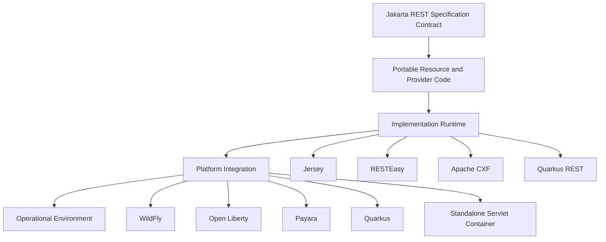
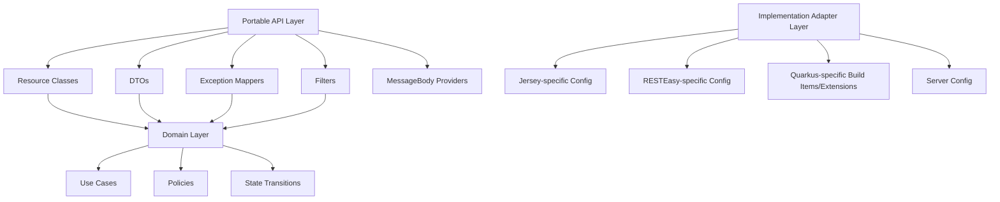
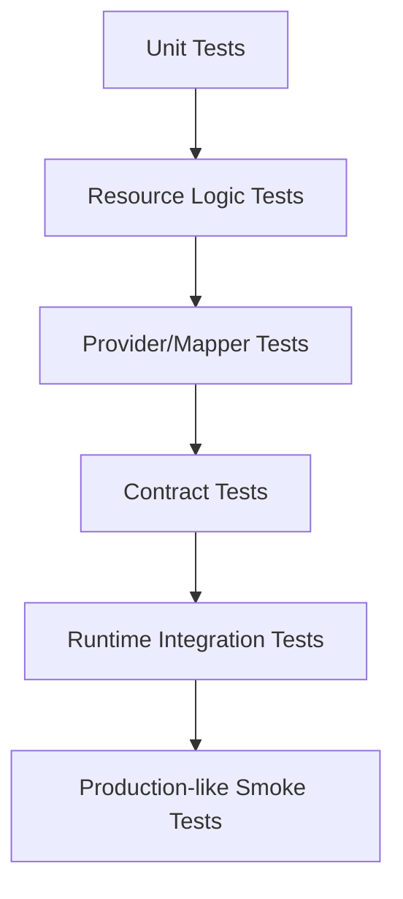

# Part 027 — Implementation Landscape: Jersey, RESTEasy, Apache CXF, Open Liberty, Payara, WildFly, Quarkus

> Goal: setelah bagian ini, kita tidak hanya tahu “JAX-RS bisa dijalankan di banyak runtime”, tetapi mampu memilih runtime, membaca konsekuensi arsitekturalnya, dan menjaga desain API tetap portable meskipun implementasinya punya fitur vendor-specific.

Di level spesifikasi, **Jakarta RESTful Web Services** mendefinisikan API Java untuk membangun RESTful web services. Di level runtime, yang benar-benar memproses request adalah implementasi: Jersey, RESTEasy, Apache CXF, atau runtime Jakarta EE/application platform yang membungkus salah satu implementasi atau menyediakan integrasinya sendiri.

Salah satu kesalahan umum engineer adalah menyamakan tiga hal ini:

1. **Specification API**: `jakarta.ws.rs.*` contract.
2. **Implementation**: Jersey, RESTEasy, CXF, Quarkus REST, dll.
3. **Platform/runtime**: WildFly, Open Liberty, Payara, Quarkus, Helidon, TomEE, custom embedded server, dll.

Ketiganya berbeda. Ketika kita mendesain sistem yang harus bertahan lama, perbedaan ini menentukan portability, operability, performance model, testing strategy, dan migration cost.

---

## 1. Kaufman Framing: Deconstruct the Skill

Untuk menguasai landscape implementasi, jangan mulai dari “mana framework terbaik?”. Mulai dari sub-skill yang lebih tajam.

| Sub-skill | Pertanyaan yang harus bisa dijawab |
|---|---|
| Specification awareness | Mana behavior yang dijamin oleh Jakarta REST dan mana yang hanya kebetulan di runtime tertentu? |
| Runtime model | Apakah runtime berbasis servlet, application server, event-loop, build-time indexing, atau hybrid? |
| Provider compatibility | Apakah provider, filter, interceptor, JSON library, multipart, dan validation berjalan sama? |
| Packaging model | WAR, executable JAR, native image, container image, server-managed deployment? |
| Operational model | Bagaimana logging, metrics, tracing, health, config, TLS, thread pool, graceful shutdown? |
| Migration risk | Berapa banyak kode yang bergantung pada vendor API? |
| Test strategy | Apakah test cukup berjalan di satu implementation, atau perlu contract test di runtime target? |

Target skill bukan hafal daftar produk. Target skill adalah mampu berkata:

> “API kita tetap Jakarta REST-portable pada resource/provider layer, tetapi deployment profile A memakai runtime X karena constraint Y. Vendor-specific feature hanya boleh masuk adapter layer Z, dan harus punya test compatibility.”

---

## 2. Specification vs Implementation

Jakarta REST memberi kita contract seperti:

- `@Path`
- `@GET`, `@POST`, `@PUT`, `@DELETE`, dll.
- `@Consumes`, `@Produces`
- `Response`
- `ExceptionMapper`
- `MessageBodyReader`
- `MessageBodyWriter`
- `ContainerRequestFilter`
- `ContainerResponseFilter`
- `ReaderInterceptor`
- `WriterInterceptor`
- Client API: `Client`, `WebTarget`, `Invocation`, `Response`
- SSE API
- Entity part/multipart support pada versi modern

Tetapi spesifikasi tidak selalu menentukan seluruh detail operasional. Misalnya:

- strategi classpath scanning;
- ordering detail jika banyak provider punya priority sama;
- default JSON provider yang dipasang runtime;
- integration dengan CDI;
- thread pool default;
- buffering default;
- cara logging request/response;
- native image behavior;
- build-time indexing;
- server-specific metrics;
- error page fallback jika exception keluar dari Jakarta REST layer.

Karena itu, desain production-grade harus memiliki dua lapisan pemikiran:



Portable code lives near the top. Runtime-specific optimization lives near the bottom.

---

## 3. The Three Questions Before Choosing a Runtime

Sebelum memilih Jersey, RESTEasy, CXF, Open Liberty, Payara, WildFly, atau Quarkus, tanyakan tiga hal.

### 3.1 Are We Building a Jakarta EE Application or a Microservice Runtime?

Jika aplikasi hidup di full Jakarta EE platform, kita biasanya peduli pada:

- CDI;
- Jakarta Validation;
- Jakarta JSON-B/JSON-P;
- Jakarta Persistence;
- Jakarta Security;
- Jakarta Transactions;
- Jakarta Concurrency;
- deployment descriptor dan server-managed concerns;
- enterprise integration dengan server runtime.

Jika aplikasi adalah microservice runtime, kita biasanya peduli pada:

- startup time;
- memory footprint;
- container image size;
- health/readiness/liveness;
- config via environment;
- immutable deployment;
- observability;
- graceful shutdown;
- native image possibility;
- cloud platform behavior.

Kedua model bisa sama-sama valid. Yang salah adalah memakai asumsi satu model untuk mengevaluasi model lain.

### 3.2 Do We Need Portability or Runtime Leverage?

Ada dua strategi sehat:

| Strategy | Cocok untuk | Risiko |
|---|---|---|
| Spec-first portability | Long-lived enterprise systems, regulated systems, vendor-neutral codebase | Tidak selalu memanfaatkan fitur runtime paling optimal |
| Runtime-leveraged design | Cloud-native services, Quarkus-optimized services, low-latency startup, native image | Migration cost lebih tinggi |

Top-tier engineer tidak fanatik pada salah satu. Mereka eksplisit soal trade-off.

### 3.3 What Is the Operational Ownership Model?

Runtime yang “teknisnya bagus” bisa gagal jika tim tidak bisa mengoperasikannya.

Periksa:

- siapa patching server;
- bagaimana CVE direspons;
- bagaimana thread pool dikonfigurasi;
- bagaimana TLS terminates;
- bagaimana access log diambil;
- bagaimana request tracing aktif;
- bagaimana deployment rollback;
- bagaimana config berubah;
- bagaimana heap/thread dump diambil;
- bagaimana production incident ditangani.

Framework choice adalah juga operations choice.

---

## 4. Jersey

**Jersey** adalah salah satu implementasi utama JAX-RS/Jakarta REST. Secara historis Jersey sering diasosiasikan dengan reference implementation lineage dan banyak dipakai untuk aplikasi yang ingin menggunakan JAX-RS secara langsung, baik standalone maupun di runtime yang mendukungnya.

### 4.1 Mental Model

Jersey cocok dipahami sebagai:

> Jakarta REST implementation dengan API extension dan ecosystem sendiri, dapat digunakan standalone, di servlet container, atau sebagai bagian dari platform tertentu.

Jersey memberi:

- implementation dari Jakarta REST/JAX-RS API;
- resource scanning/registration;
- provider pipeline;
- client implementation;
- integration modules;
- extension SPIs;
- testing utilities.

### 4.2 Strengths

Jersey sering kuat ketika kita butuh:

- Jakarta REST semantics yang eksplisit;
- standalone usage;
- fine-grained provider/resource registration;
- testability melalui Jersey Test Framework;
- ekosistem extension Jersey;
- dokumentasi yang cukup detail untuk core JAX-RS concepts.

### 4.3 Risks

Risiko Jersey biasanya muncul ketika:

- aplikasi memakai API Jersey-specific terlalu dalam;
- deployment target sebenarnya bukan Jersey;
- provider behavior diasumsikan sama dengan runtime lain;
- test hanya memakai Jersey embedded tapi production memakai RESTEasy/CXF;
- JSON provider default berbeda dari production runtime.

Contoh smell:

```java
// Smell: resource logic bergantung pada Jersey-specific class
// sehingga migration ke runtime Jakarta REST lain jadi mahal.
```

Rule yang sehat:

> Resource, DTO, exception mapper, filter, dan provider utama harus memakai `jakarta.ws.rs.*` semaksimal mungkin. Vendor-specific feature hanya boleh berada di module integration.

### 4.4 Jersey in Architecture Decision

Gunakan Jersey ketika:

- target deployment memang Jersey-compatible;
- butuh standalone Jakarta REST application;
- tim familiar dengan Jersey ecosystem;
- ingin fine-grained test harness untuk resource/provider;
- tidak butuh full Jakarta EE server.

Hindari keputusan otomatis memakai Jersey jika:

- platform enterprise sudah standard di WildFly/Open Liberty/Payara;
- tim butuh Quarkus native/build-time optimization;
- sistem butuh integration yang lebih natural dengan server-managed Jakarta EE services tertentu.

---

## 5. RESTEasy

**RESTEasy** adalah implementasi Jakarta RESTful Web Services yang banyak diasosiasikan dengan ekosistem JBoss/WildFly dan juga Quarkus history.

### 5.1 Mental Model

RESTEasy cocok dipahami sebagai:

> Jakarta REST implementation dengan integrasi kuat ke ekosistem Red Hat/JBoss/WildFly, sekaligus foundation historis untuk beberapa model REST di Quarkus.

RESTEasy menyediakan:

- server-side Jakarta REST implementation;
- client-side implementation;
- provider/filter/interceptor implementation;
- MicroProfile REST Client support di ecosystem tertentu;
- integrasi dengan CDI/Jakarta EE runtime;
- extension dan modules untuk kebutuhan enterprise.

### 5.2 Strengths

RESTEasy kuat ketika:

- production runtime adalah WildFly atau JBoss-family server;
- tim menggunakan ecosystem Red Hat;
- butuh Jakarta EE integration;
- butuh MicroProfile REST Client interop;
- deployment berada di server-managed model;
- ingin behavior yang align dengan runtime production WildFly/Quarkus RESTEasy Classic.

### 5.3 Risks

Risiko RESTEasy:

- extension-specific annotation/feature bisa bocor ke core API;
- Quarkus RESTEasy Classic dan Quarkus REST/RESTEasy Reactive punya model berbeda;
- migration dari RESTEasy Classic ke Quarkus REST perlu perhatian pada dependency, provider, reactive behavior, dan blocking model;
- beberapa behavior bisa berbeda dari Jersey test harness.

Prinsip:

> Jika production memakai RESTEasy, test integration layer harus menjalankan RESTEasy juga. Jangan menganggap semua provider ordering dan serialization detail identik dengan Jersey.

---

## 6. Apache CXF

**Apache CXF** adalah framework web service yang mendukung beberapa model, termasuk JAX-RS/Jakarta REST-style REST services dan SOAP/JAX-WS history.

### 6.1 Mental Model

CXF cocok dipahami sebagai:

> Integration-oriented web service framework yang bisa menjalankan REST API dan sering menarik jika sistem punya kebutuhan web service luas, legacy integration, atau enterprise integration concern.

CXF bukan hanya “REST endpoint framework”. Ia sering hadir di lingkungan yang punya:

- REST dan SOAP coexistence;
- enterprise integration;
- transport/configuration flexibility;
- interceptor-centric architecture;
- integration dengan Apache ecosystem.

### 6.2 Strengths

CXF kuat ketika:

- sistem punya kebutuhan REST dan SOAP/web services legacy;
- enterprise integration layer sudah memakai CXF;
- butuh fleksibilitas transport/interceptor;
- tim sudah punya operational experience dengan CXF;
- API REST adalah bagian dari service integration fabric yang lebih luas.

### 6.3 Risks

Risiko CXF:

- untuk simple REST API, mungkin terasa lebih berat secara konsep;
- engineer bisa membawa mental model SOAP/service-contract ke REST resource design;
- konfigurasi bisa menjadi kompleks;
- portability perlu dijaga jika menggunakan CXF-specific features.

Rule:

> Gunakan CXF karena kebutuhan integrasi nyata, bukan karena “bisa REST juga”.

---

## 7. WildFly

**WildFly** adalah application server Jakarta EE yang secara historis menggunakan RESTEasy untuk Jakarta REST. Jika kita deploy WAR ke WildFly, kita tidak sekadar memilih Jakarta REST implementation; kita memilih application server dengan banyak managed services.

### 7.1 Mental Model

WildFly cocok dipahami sebagai:

> Jakarta EE application server untuk aplikasi enterprise yang ingin banyak concern dikelola server: CDI, transactions, security, datasource, messaging, deployment, management, dan Jakarta REST integration.

### 7.2 Strengths

WildFly kuat ketika:

- aplikasi enterprise besar;
- dependency pada Jakarta EE services tinggi;
- tim ingin server-managed datasource/security/transaction;
- deployment model WAR/EAR masih relevan;
- organisasi punya standard operations untuk application server;
- integration dengan JBoss/Red Hat ecosystem penting.

### 7.3 Risks

Risiko WildFly:

- startup dan memory footprint bisa lebih besar daripada microservice framework lightweight;
- server configuration menjadi bagian penting dari system behavior;
- developer local/prod parity perlu dijaga;
- patching server perlu governance;
- terlalu banyak logic bisa tersebar di server config daripada code/config-as-code.

### 7.4 Design Implication

Jika target WildFly:

- test in-container lebih penting;
- datasource/transaction/security behavior harus diuji di runtime yang sama;
- Jakarta REST resource sebaiknya tetap thin;
- gunakan CDI untuk service injection;
- hindari membuat custom singleton mutable di resource/provider.

---

## 8. Open Liberty

**Open Liberty** adalah lightweight, modular application server dari ekosistem IBM/WebSphere Liberty yang mendukung Jakarta EE dan MicroProfile features secara granular.

### 8.1 Mental Model

Open Liberty cocok dipahami sebagai:

> Modular Jakarta EE/MicroProfile runtime yang memungkinkan kita mengaktifkan feature yang dibutuhkan saja.

Pendekatan feature-based runtime menarik karena production surface bisa dikurangi.

### 8.2 Strengths

Open Liberty kuat ketika:

- organisasi memakai IBM/WebSphere lineage;
- butuh Jakarta EE + MicroProfile;
- ingin runtime modular;
- ingin konfigurasi server eksplisit via feature manager;
- butuh enterprise support path;
- cocok dengan containerized deployment tapi tetap Jakarta EE style.

### 8.3 Risks

Risiko Open Liberty:

- feature configuration harus benar;
- local dev harus align dengan feature production;
- behavior bergantung feature yang aktif;
- jika tim tidak terbiasa dengan Liberty config, debugging bisa lambat.

### 8.4 Design Implication

Dalam Open Liberty:

- treat `server.xml` as part of architecture;
- review enabled features sebagai attack/maintenance surface;
- dokumentasikan feature requirement untuk Jakarta REST, JSON-B, CDI, Validation, Metrics, OpenAPI, Security;
- gunakan integration tests dengan runtime Liberty target.

---

## 9. Payara

**Payara** berasal dari GlassFish ecosystem dan mendukung Jakarta EE. Ia sering dipakai oleh organisasi yang ingin Jakarta EE server dengan commercial support/community edition options.

### 9.1 Mental Model

Payara cocok dipahami sebagai:

> Jakarta EE application server yang dekat dengan GlassFish lineage dan menawarkan server/runtime untuk aplikasi enterprise Jakarta EE.

### 9.2 Strengths

Payara kuat ketika:

- organisasi ingin full Jakarta EE server;
- aplikasi memakai CDI/JPA/JTA/Security/Validation/JAX-RS secara terpadu;
- tim punya history GlassFish/Payara;
- butuh admin console/server-managed capabilities;
- deployment model WAR cocok.

### 9.3 Risks

Risiko Payara:

- runtime-specific configuration bisa bocor ke deployment assumptions;
- versi Jakarta EE support harus dicek dengan target aplikasi;
- production tuning perlu skill server-specific;
- jika ingin very fast cold-start microservice, mungkin bukan default best fit.

---

## 10. Quarkus

**Quarkus** adalah framework Java cloud-native yang mengutamakan build-time processing, fast startup, low memory footprint, developer productivity, dan integrasi Kubernetes/native-image friendly. Untuk REST, Quarkus punya model modern bernama **Quarkus REST**, sebelumnya dikenal sebagai RESTEasy Reactive.

Part 028 akan membahas Quarkus REST secara khusus. Di bagian landscape ini, kita cukup membedakan Quarkus dari application server klasik.

### 10.1 Mental Model

Quarkus cocok dipahami sebagai:

> Build-time optimized Java runtime untuk cloud-native services, bukan sekadar “Jakarta REST implementation lain”.

Ia mendukung banyak API standar, tetapi arsitekturnya berbeda dari app server tradisional.

### 10.2 Strengths

Quarkus kuat ketika:

- service dikemas sebagai containerized microservice;
- cold start penting;
- memory footprint penting;
- Kubernetes-native deployment penting;
- native image menjadi target;
- tim ingin dev mode cepat;
- REST API butuh performa dan operational integration modern.

### 10.3 Risks

Risiko Quarkus:

- build-time processing mengubah cara memikirkan reflection/dynamic behavior;
- tidak semua runtime extension sama dengan server Jakarta EE tradisional;
- blocking vs non-blocking model harus dipahami;
- migration dari RESTEasy Classic ke Quarkus REST perlu review;
- native image menuntut disiplin lebih pada reflection/resource/config.

---

## 11. Implementation Comparison Matrix

| Dimension | Jersey | RESTEasy | Apache CXF | WildFly | Open Liberty | Payara | Quarkus REST |
|---|---|---|---|---|---|---|---|
| Primary identity | Jakarta REST implementation | Jakarta REST implementation | Web service/integration framework | Jakarta EE app server | Modular Jakarta EE/MicroProfile runtime | Jakarta EE app server | Cloud-native REST runtime |
| Typical packaging | WAR/JAR/embedded | WAR/JAR/server integration | WAR/JAR/integration runtime | WAR/EAR/server deployment | WAR/JAR/server package | WAR/server deployment | Fast JAR/native/container |
| Jakarta EE integration | Depends on environment | Strong in WildFly/JBoss ecosystem | Depends on setup | Strong | Strong/modular | Strong | Selective/extension-based |
| Portability risk | Jersey extensions | RESTEasy extensions | CXF config/extensions | Server config | Feature config | Server config | Quarkus-specific build/runtime model |
| Cloud-native fit | Possible | Possible | Possible | Moderate | Good | Moderate | Strong |
| Learning priority | Core JAX-RS concepts and test harness | Enterprise runtime and MicroProfile interop | Integration-heavy use cases | Server-managed enterprise app | Modular enterprise/cloud runtime | Full Jakarta EE app server | Build-time/reactive/blocking model |

This table is not a ranking. It is a map of fit.

---

## 12. Portability Boundaries

A well-designed Jakarta REST codebase has explicit boundaries.



### 12.1 Keep Portable

Keep these mostly vendor-neutral:

- resource classes;
- request DTOs;
- response DTOs;
- exception hierarchy;
- `ExceptionMapper`;
- validation annotations;
- `ContainerRequestFilter`;
- `ContainerResponseFilter`;
- `MessageBodyReader`/`Writer` when possible;
- OpenAPI contract;
- contract tests.

### 12.2 Isolate Vendor-Specific

Isolate these:

- Jersey `ResourceConfig` customization;
- RESTEasy-specific provider config;
- Quarkus extension annotations/config;
- server feature flags;
- native image reflection config;
- metrics/tracing vendor config;
- non-standard multipart or streaming extensions;
- test harness utilities.

A useful package convention:

```text
com.example.caseapi
  api.resource              // portable Jakarta REST resources
  api.dto                   // portable DTOs
  api.error                 // portable error contract
  api.provider              // portable providers where possible
  api.filter                // portable filters
  application               // use-case services
  domain                    // domain model/policy
  infrastructure.jersey     // Jersey-only config
  infrastructure.resteasy   // RESTEasy-only config
  infrastructure.quarkus    // Quarkus-only config
```

---

## 13. Runtime Behavior That Commonly Differs

Even when code compiles against `jakarta.ws.rs-api`, runtime details can differ.

### 13.1 Scanning and Discovery

Spec gives rules, but runtime scanning performance and classpath behavior differ.

Questions:

- Are providers auto-discovered?
- Does an explicit `Application#getClasses()` disable broader discovery?
- Are CDI beans discovered as resources?
- Does native image require build-time indexing?
- Are nested JARs scanned?

### 13.2 JSON Provider

Potential differences:

- JSON-B vs Jackson default;
- record support behavior;
- date/time format;
- unknown property handling;
- null property serialization;
- enum strategy;
- generic type handling.

Production rule:

> Do not rely on implicit JSON defaults for public API contracts. Configure and test serialization explicitly.

### 13.3 Multipart

Multipart support can vary by version and implementation. Jakarta REST 4.0 modernizes multipart API around `EntityPart`, but older stacks often used vendor-specific multipart APIs.

Migration question:

- Are we using standard `EntityPart`, or implementation-specific multipart classes?

### 13.4 SSE and Streaming

SSE API exists, but operational behavior depends on:

- container thread model;
- buffer flushing;
- proxy timeouts;
- connection limits;
- event-loop/blocking behavior;
- HTTP server implementation.

### 13.5 Async

`AsyncResponse` portability does not imply identical resource efficiency.

Questions:

- Who owns executor threads?
- Does runtime detach servlet thread?
- Are continuations tied to event-loop?
- Is context propagated?
- How does timeout behave?

### 13.6 CDI Integration

Jakarta REST and CDI integration can differ by platform/version.

Questions:

- Are resource classes CDI beans?
- Are providers CDI-managed?
- Are request-scoped beans safe in async callbacks?
- Does injection work in custom providers?
- Are interceptors CDI or Jakarta REST interceptors?

---

## 14. Implementation Selection Heuristics

### 14.1 Choose Full Jakarta EE Runtime When

Choose WildFly/Open Liberty/Payara-style runtime when:

- many Jakarta EE specs are first-class dependencies;
- server-managed transaction/security/datasource is valuable;
- deployment governance expects application server;
- enterprise support and standard ops matter;
- services are long-lived internal enterprise applications;
- runtime consistency across apps matters more than per-service minimalism.

### 14.2 Choose Quarkus When

Choose Quarkus when:

- service is containerized and independently deployed;
- cold start and memory footprint matter;
- Kubernetes/native-image/cloud-native deployment matters;
- team wants fast dev mode;
- MicroProfile/SmallRye ecosystem is desired;
- runtime-specific optimization is acceptable.

### 14.3 Choose Jersey Standalone When

Choose Jersey standalone when:

- you want explicit Jakarta REST implementation without full server;
- resource/provider testing with Jersey is valuable;
- app is simple enough not to need full Jakarta EE platform;
- team already standardizes on Jersey.

### 14.4 Choose CXF When

Choose CXF when:

- REST is part of broader web-service integration;
- SOAP/legacy WS coexistence matters;
- Apache CXF is already strategic infrastructure;
- transport/interceptor customization is central.

---

## 15. Decision Record Template

Use this ADR template when selecting runtime.

```md
# ADR: Jakarta REST Runtime Selection

## Status
Proposed / Accepted / Superseded

## Context
We need to deploy REST API for <domain/service>. The API uses Jakarta REST <version>, Java <version>, and integrates with <dependencies>.

## Options
1. Jersey standalone
2. RESTEasy on WildFly
3. Open Liberty
4. Payara
5. Quarkus REST
6. Apache CXF

## Decision
We choose <runtime>.

## Rationale
- Jakarta REST version support:
- Java baseline:
- Packaging model:
- CDI/Validation/JSON support:
- Observability:
- Deployment platform:
- Team familiarity:
- Migration risk:
- Support/security patching:

## Portability Boundary
Portable code remains in:
- api.resource
- api.dto
- api.error
- api.provider

Runtime-specific code is isolated in:
- infrastructure.<runtime>

## Consequences
Positive:
- ...

Negative:
- ...

Mitigations:
- ...
```

---

## 16. Anti-Patterns

### 16.1 Testing on One Runtime, Deploying on Another

Example:

- local tests use Jersey Test Framework;
- production deploys to WildFly/RESTEasy;
- JSON provider differs;
- exception mapper resolution differs;
- multipart behavior differs.

Mitigation:

- keep fast unit tests runtime-light;
- add contract/integration tests on production runtime;
- snapshot key wire-level responses.

### 16.2 Vendor API in Resource Methods

Bad:

```java
@Path("/cases")
public class CaseResource {
    @GET
    public SomeJerseySpecificResponse list() {
        // ...
    }
}
```

Better:

```java
@Path("/cases")
public class CaseResource {
    @GET
    @Produces(MediaType.APPLICATION_JSON)
    public Response list() {
        return Response.ok(/* portable DTO */).build();
    }
}
```

### 16.3 Runtime Choice by Popularity

“Quarkus is modern” or “WildFly is enterprise” is not a decision. It is branding.

A real decision includes:

- constraints;
- trade-off;
- operational owner;
- migration plan;
- test plan;
- failure model.

### 16.4 Treating Native Image as Free

Native image can be excellent, but it introduces constraints:

- reflection;
- dynamic proxies;
- resource loading;
- serialization metadata;
- startup/runtime trade-off;
- debugging differences.

Do not make native image a requirement unless the operational benefit is real.

### 16.5 Assuming Jakarta REST Version Equals Jakarta EE Version

Jakarta EE platform version includes a set of specifications. Jakarta REST has its own spec version. Verify both:

- Java baseline;
- Jakarta EE platform version;
- Jakarta REST version;
- implementation support;
- server feature support.

---

## 17. Migration Concerns

### 17.1 `javax.ws.rs` to `jakarta.ws.rs`

Migration from Java EE/JAX-RS 2.x to Jakarta REST 3.x/4.x requires namespace migration:

```java
// old
import javax.ws.rs.GET;
import javax.ws.rs.Path;

// new
import jakarta.ws.rs.GET;
import jakarta.ws.rs.Path;
```

But namespace change is only the first layer. Also check:

- dependencies;
- JSON provider;
- servlet version;
- validation version;
- CDI version;
- application server compatibility;
- third-party libraries that still depend on `javax.*`;
- generated OpenAPI tooling;
- client libraries;
- test harness.

### 17.2 Runtime Implementation Migration

When migrating Jersey → RESTEasy or RESTEasy → Quarkus REST, inventory:

- vendor-specific annotations;
- provider registration;
- multipart API;
- exception mapper behavior;
- async/SSE usage;
- JSON provider config;
- filters/interceptors;
- request context injection;
- test harness;
- server config;
- dependency tree.

A practical migration report:

```text
Migration Inventory
- Portable resource classes: 42
- Portable exception mappers: 8
- Portable filters: 6
- Jersey-specific classes: 5
- RESTEasy-specific classes: 0
- Multipart non-standard usage: 3 endpoints
- JSON provider custom config: 2 modules
- Tests tied to Jersey harness: 37
- Production runtime target: Quarkus REST
```

---

## 18. Testing Across Implementations

A mature test strategy has layers.



### 18.1 What Should Be Runtime-Neutral

- DTO validation;
- domain policy;
- command handling;
- error taxonomy;
- pagination/filter parsing;
- idempotency policy;
- authorization policy decisions.

### 18.2 What Must Be Runtime-Specific

- provider discovery;
- JSON serialization;
- exception mapper selection;
- multipart behavior;
- SSE streaming;
- async timeout;
- CDI injection;
- security integration;
- observability integration.

### 18.3 Wire-Level Golden Tests

For public/stable APIs, add golden tests for:

- status code;
- headers;
- media type;
- JSON field names;
- error response shape;
- pagination links;
- ETag behavior;
- conditional request behavior.

Example:

```http
GET /cases/C-1001 HTTP/1.1
Accept: application/json

HTTP/1.1 200 OK
Content-Type: application/json
ETag: "case-C-1001-v7"

{
  "caseId": "C-1001",
  "status": "UNDER_REVIEW"
}
```

This kind of test survives implementation changes better than class-level assertions.

---

## 19. Operational Comparison Checklist

Before accepting a runtime, answer these.

### 19.1 Version and Support

- Which Jakarta REST version is supported?
- Which Jakarta EE version is supported?
- Which Java version is required?
- Is it LTS-supported by vendor/community?
- What is the CVE patch process?

### 19.2 Deployment

- WAR, JAR, native image, container?
- Does deployment include server runtime?
- How are features enabled?
- How is rollback done?
- Is config externalized?

### 19.3 Observability

- Access logs?
- Structured logs?
- Metrics?
- OpenTelemetry tracing?
- Correlation ID propagation?
- Health checks?
- Request body logging controls?

### 19.4 Performance

- Thread model?
- Event-loop model?
- Virtual threads support?
- Connection pool configuration?
- JSON provider performance?
- Streaming behavior?
- Large upload/download handling?

### 19.5 Security

- Authentication integration?
- Authorization integration?
- TLS and proxy headers?
- CORS config?
- Security headers?
- Vulnerability scanning?
- Secrets/config handling?

### 19.6 Developer Experience

- Local dev speed?
- Hot reload?
- Test harness?
- IDE support?
- Documentation quality?
- Team familiarity?

---

## 20. Example Decision: Regulated Case API

Scenario:

- API manages enforcement cases.
- Needs auditability, transactions, validation, security, observability.
- Runs in Kubernetes.
- Team wants Java 17+ and Jakarta REST 4.0 baseline.
- Consumer contracts must be stable.

Possible decision:

```text
Decision:
Use Quarkus REST for new independently deployed services.
Use OpenAPI and contract tests to preserve API compatibility.
Keep resource/provider code Jakarta REST-portable where possible.
Isolate Quarkus-specific config in infrastructure.quarkus.
Run integration tests in Quarkus runtime, not only mock/unit tests.
```

Alternative enterprise decision:

```text
Decision:
Use Open Liberty/WildFly for services that need full Jakarta EE server-managed transactions, security, and organizational runtime governance.
Keep API contract identical.
Use runtime-specific integration tests.
```

Both can be correct. The quality is in the explicit boundary.

---

## 21. Practical Selection Matrix

| Constraint | Lean toward |
|---|---|
| Existing WildFly/JBoss ops | RESTEasy on WildFly |
| Existing IBM/WebSphere/Liberty ops | Open Liberty |
| Existing GlassFish/Payara ops | Payara |
| Cloud-native microservice, fast startup | Quarkus REST |
| Standalone JAX-RS implementation | Jersey |
| REST plus SOAP/legacy web service integration | Apache CXF |
| Maximum vendor neutrality | Jakarta REST spec-first + strict adapter boundary |
| Native image target | Quarkus, with native-image compatibility review |
| Full Jakarta EE server-managed app | WildFly/Open Liberty/Payara |
| Runtime-specific performance optimization | Quarkus REST, but with migration cost accepted |

---

## 22. Review Checklist

Before finalizing an implementation/runtime:

- [ ] Jakarta REST version is identified.
- [ ] Java baseline is identified.
- [ ] Jakarta EE/MicroProfile version is identified if relevant.
- [ ] JSON provider is explicit.
- [ ] Multipart support is verified.
- [ ] SSE/streaming behavior is tested if used.
- [ ] CDI integration is tested.
- [ ] Validation integration is tested.
- [ ] Security integration is tested.
- [ ] Observability integration is tested.
- [ ] Runtime-specific code is isolated.
- [ ] Contract tests run against runtime target.
- [ ] Deployment artifact model is documented.
- [ ] CVE/patch process is documented.
- [ ] Migration path is documented.

---

## 23. Key Takeaways

- Jakarta REST is the contract; Jersey/RESTEasy/CXF/Quarkus REST are implementations/runtimes.
- Application servers such as WildFly, Open Liberty, and Payara are platform choices, not merely JAX-RS library choices.
- Quarkus REST is not just “another servlet JAX-RS deployment”; its build-time/reactive/cloud-native model changes architecture trade-offs.
- Portability is not accidental. It requires deliberate boundaries.
- Runtime choice should be captured as an architecture decision, including operational consequences.
- Public API behavior must be verified at wire level, not inferred from Java annotations alone.

---

## References

- Jakarta RESTful Web Services 4.0 specification page: https://jakarta.ee/specifications/restful-ws/4.0/
- Jakarta RESTful Web Services 4.0 specification document: https://jakarta.ee/specifications/restful-ws/4.0/jakarta-restful-ws-spec-4.0
- Eclipse Jersey project/site: https://jersey.github.io/
- RESTEasy project/site: https://resteasy.dev/
- Quarkus REST guide: https://quarkus.io/guides/rest
- Quarkus RESTEasy Classic guide: https://quarkus.io/guides/resteasy
- Open Liberty Jakarta RESTful Web Services 4.0 feature documentation: https://www.ibm.com/docs/en/was-liberty/nd?topic=features-jakarta-restful-web-services-40
