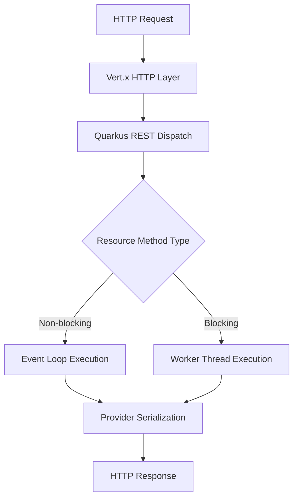
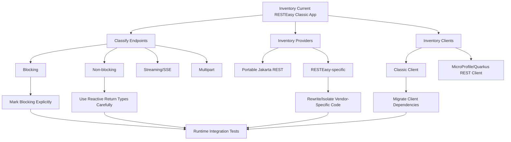

# Part 028 — Quarkus REST vs RESTEasy Classic: Blocking, Reactive, Build-Time Processing, and Migration Trade-Offs

> Goal: setelah bagian ini, kita mampu membedakan RESTEasy Classic dan Quarkus REST secara arsitektural, bukan sekadar mengganti dependency. Kita juga mampu mendesain resource method yang benar untuk blocking/non-blocking workloads, menghindari event-loop blocking, dan membuat migration plan yang aman.

Quarkus memiliki sejarah REST yang penting:

- **RESTEasy Classic** dulu menjadi default Jakarta REST implementation di Quarkus sampai era Quarkus 2.8.
- **RESTEasy Reactive** kemudian menjadi pendekatan modern berbasis build-time processing dan Vert.x.
- Di Quarkus modern, RESTEasy Reactive dikenal sebagai **Quarkus REST**.

Nama berubah, tetapi isu arsitekturalnya tetap: Quarkus REST bukan hanya “RESTEasy Classic versi baru”. Ia punya runtime model berbeda.

---

## 1. Kaufman Framing: The Skill to Acquire

Untuk menguasai Quarkus REST, kita deconstruct ke beberapa sub-skill:

| Sub-skill | Target pemahaman |
|---|---|
| Naming and history | Tahu hubungan RESTEasy Classic, RESTEasy Reactive, dan Quarkus REST. |
| Execution model | Bisa membedakan event-loop, worker thread, blocking method, non-blocking method. |
| Build-time model | Paham kenapa Quarkus banyak melakukan indexing/metamodel generation saat build. |
| Resource design | Bisa memilih return type dan annotation yang sesuai workload. |
| Provider compatibility | Tahu provider/filter/interceptor mana yang portable dan mana yang butuh review. |
| Migration | Bisa membuat migration inventory dari RESTEasy Classic ke Quarkus REST. |
| Production operation | Bisa memonitor blocking, latency, pool saturation, timeout, dan streaming. |

Kita tidak sedang belajar “cara membuat endpoint hello world”. Kita sedang belajar memilih execution model yang benar untuk API production.

---

## 2. Mental Model: Classic vs Quarkus REST

### 2.1 RESTEasy Classic

RESTEasy Classic cocok dipahami sebagai:

> Jakarta REST implementation tradisional yang mengikuti model request/response klasik, umumnya lebih dekat ke thread-per-request/blocking mental model.

Ia familiar untuk engineer yang datang dari:

- servlet container;
- application server;
- blocking JDBC;
- imperative service method;
- JAX-RS/Jakarta REST conventional provider model.

### 2.2 Quarkus REST

Quarkus REST cocok dipahami sebagai:

> Quarkus-native Jakarta REST implementation yang memanfaatkan build-time processing dan Vert.x/reactive core, tetapi tetap bisa melayani blocking dan non-blocking workloads.

Hal penting: “reactive” bukan berarti semua code harus reactive. Artinya runtime punya model non-blocking/event-loop yang bisa dieksploitasi ketika cocok, dan worker/blocking path ketika workload memang blocking.



---

## 3. Why Quarkus REST Exists

Traditional runtime does much work at startup/runtime:

- classpath scanning;
- annotation discovery;
- provider registration;
- reflection-heavy resource model building;
- late binding of metadata;
- dynamic runtime initialization.

Quarkus moves many tasks to build time:

- discover resources;
- index annotations;
- generate bytecode where useful;
- prepare metadata;
- reduce reflection;
- optimize startup;
- improve native image friendliness.

This matters for:

- container cold start;
- memory footprint;
- native executable generation;
- fast dev/test feedback;
- predictable runtime behavior.

But it introduces a trade-off:

> Dynamic runtime patterns that work in classic Jakarta REST may need explicit configuration or may not fit Quarkus build-time assumptions.

---

## 4. Dependency Model

### 4.1 RESTEasy Classic Style

Historically, applications used extensions around RESTEasy Classic, for example:

```xml
<dependency>
  <groupId>io.quarkus</groupId>
  <artifactId>quarkus-resteasy</artifactId>
</dependency>
```

and JSON extension variants such as:

```xml
<dependency>
  <groupId>io.quarkus</groupId>
  <artifactId>quarkus-resteasy-jackson</artifactId>
</dependency>
```

### 4.2 Quarkus REST Style

Modern Quarkus REST uses extensions such as:

```xml
<dependency>
  <groupId>io.quarkus</groupId>
  <artifactId>quarkus-rest</artifactId>
</dependency>
```

For Jackson JSON:

```xml
<dependency>
  <groupId>io.quarkus</groupId>
  <artifactId>quarkus-rest-jackson</artifactId>
</dependency>
```

For JSON-B:

```xml
<dependency>
  <groupId>io.quarkus</groupId>
  <artifactId>quarkus-rest-jsonb</artifactId>
</dependency>
```

The exact extension set should be checked against the Quarkus version used by the project, because names changed during the RESTEasy Reactive → Quarkus REST rename.

---

## 5. The Most Important Distinction: Blocking vs Non-Blocking

### 5.1 Blocking Workload

Blocking workload includes:

- JDBC call;
- JPA/Hibernate ORM call;
- blocking file I/O;
- blocking HTTP client call;
- slow legacy service call;
- synchronous message broker call;
- CPU-heavy computation that monopolizes thread.

A blocking operation must not run on event loop.

Bad mental model:

```text
Quarkus REST is reactive, so all endpoints are fast.
```

Correct mental model:

```text
Quarkus REST can dispatch efficiently, but blocking code still blocks whichever thread executes it.
```

### 5.2 Non-Blocking Workload

Non-blocking workload includes:

- async/reactive database client;
- reactive HTTP client;
- event-driven stream;
- non-blocking cache client;
- return types like `Uni<T>` in Mutiny-based APIs;
- `CompletionStage<T>` when upstream is genuinely async.

Non-blocking works well on event loop if code does not block.

### 5.3 Rule of Thumb

| Resource method does... | Prefer |
|---|---|
| JDBC/JPA/blocking service | Worker/blocking execution |
| Calls blocking REST client | Worker/blocking execution |
| Uses reactive client and returns `Uni<T>` | Non-blocking execution |
| Streams SSE from async events | Non-blocking if source is non-blocking |
| Performs CPU-heavy transformation | Worker or dedicated executor |
| Small pure DTO mapping | Usually okay inline |

---

## 6. Execution Examples

### 6.1 Blocking Resource Method

```java
@Path("/cases")
@Produces(MediaType.APPLICATION_JSON)
@Consumes(MediaType.APPLICATION_JSON)
public class CaseResource {

    private final CaseApplicationService service;

    public CaseResource(CaseApplicationService service) {
        this.service = service;
    }

    @GET
    @Path("/{caseId}")
    public CaseResponse getCase(@PathParam("caseId") String caseId) {
        // If service uses JDBC/JPA/blocking I/O, this is blocking workload.
        return service.getCase(caseId);
    }
}
```

In a Quarkus REST project, the dispatch strategy may infer blocking/non-blocking from signature and annotations, but production code should not rely on vague assumptions. Be explicit where correctness matters.

Example explicit blocking marker in Quarkus:

```java
import io.smallrye.common.annotation.Blocking;

@Path("/cases")
public class CaseResource {

    @GET
    @Path("/{caseId}")
    @Blocking
    public CaseResponse getCase(@PathParam("caseId") String caseId) {
        return service.getCase(caseId);
    }
}
```

The key point is not the annotation itself. The key point is declaring execution intent.

### 6.2 Non-Blocking Resource Method

```java
@Path("/case-events")
@Produces(MediaType.APPLICATION_JSON)
public class CaseEventResource {

    private final ReactiveCaseEventService events;

    public CaseEventResource(ReactiveCaseEventService events) {
        this.events = events;
    }

    @GET
    @Path("/{caseId}/latest")
    public Uni<CaseEventResponse> latest(@PathParam("caseId") String caseId) {
        return events.latest(caseId);
    }
}
```

This method should only be non-blocking if `events.latest(caseId)` is genuinely non-blocking.

Anti-pattern:

```java
@GET
public Uni<CaseResponse> get(@PathParam("caseId") String caseId) {
    return Uni.createFrom().item(() -> blockingJpaRepository.find(caseId));
}
```

Wrapping blocking code in a reactive type does not make it non-blocking.

---

## 7. Resource Method Return Types

Quarkus REST supports common Jakarta REST return styles, but the return type communicates execution and serialization intent.

| Return type | Meaning | Risk |
|---|---|---|
| `T` | Direct entity serialized to response | Easy but hides status/header control |
| `Response` | Full control of status/header/entity | Can become verbose or untyped |
| `RestResponse<T>` | Quarkus-specific typed response model | Less portable |
| `Uni<T>` | Reactive async item | Must be genuinely non-blocking |
| `CompletionStage<T>` | Java async result | Context/error handling must be controlled |
| `Multi<T>` | Stream style | Requires streaming/backpressure awareness |
| `SseEventSink` | SSE push model | Connection lifecycle must be managed |

Portable Jakarta REST code often uses `Response`. Quarkus-specific code may use `RestResponse<T>` or Mutiny types for better Quarkus integration.

### 7.1 Portability Decision

If API module must remain portable:

```java
public Response approveCase(...) { ... }
```

If service is intentionally Quarkus-native:

```java
public Uni<RestResponse<CaseResponse>> approveCase(...) { ... }
```

Both are valid if the architecture decision is explicit.

---

## 8. Provider and Filter Compatibility

Most Jakarta REST concepts still apply:

- `ExceptionMapper<T>`;
- `ContainerRequestFilter`;
- `ContainerResponseFilter`;
- `MessageBodyReader<T>`;
- `MessageBodyWriter<T>`;
- `ReaderInterceptor`;
- `WriterInterceptor`;
- `DynamicFeature`;
- `@NameBinding`.

But compatibility review is required when migrating.

### 8.1 Review Questions

For every provider/filter/interceptor:

- Does it block?
- Does it read the request body?
- Does it buffer response body?
- Does it depend on RESTEasy Classic APIs?
- Does it depend on servlet APIs?
- Does it use reflection dynamically?
- Does it assume resource method is on worker thread?
- Does it rely on CDI request context?
- Does it work in native image?

### 8.2 Logging Filter Example

Bad in event-loop-sensitive runtime:

```java
@Provider
public class BodyLoggingFilter implements ContainerRequestFilter {
    @Override
    public void filter(ContainerRequestContext ctx) throws IOException {
        String body = new String(ctx.getEntityStream().readAllBytes(), StandardCharsets.UTF_8);
        log.info("body={}", body);
    }
}
```

Problems:

- consumes request body unless stream is reset;
- buffers full body;
- may log sensitive data;
- can block;
- can allocate huge memory;
- dangerous for upload endpoints.

Better:

```java
@Provider
public class RequestMetadataLoggingFilter implements ContainerRequestFilter {
    @Override
    public void filter(ContainerRequestContext ctx) {
        log.info("method={} path={} contentType={} accept={} correlationId={}",
            ctx.getMethod(),
            ctx.getUriInfo().getPath(),
            ctx.getHeaderString(HttpHeaders.CONTENT_TYPE),
            ctx.getHeaderString(HttpHeaders.ACCEPT),
            ctx.getHeaderString("X-Correlation-Id"));
    }
}
```

---

## 9. Build-Time Processing Consequences

Quarkus build-time processing is powerful, but it changes design constraints.

### 9.1 Reflection

In classic runtime, reflection-heavy patterns often work because everything is discovered at runtime.

In Quarkus/native-image-friendly design:

- prefer explicit types;
- avoid runtime classpath scanning in application code;
- avoid dynamic proxy generation unless supported/configured;
- ensure JSON serialization metadata is known;
- register reflection when needed;
- test native image if native is a target.

### 9.2 Dynamic Resource Registration

Dynamic `Application` registration patterns may not map cleanly to build-time optimization.

Smell:

```java
public class DynamicApp extends Application {
    @Override
    public Set<Class<?>> getClasses() {
        return scanSomeDirectoryAtRuntime();
    }
}
```

This fights Quarkus's build-time model.

Better:

- compile-time known resource classes;
- build-time extension if dynamic behavior is truly needed;
- explicit generated source/config;
- avoid runtime classpath scanning for API surface.

### 9.3 Native Image

Native image is not just packaging. It changes what is allowed by default.

Review:

- reflection usage;
- JSON serialization;
- resource files;
- SSL/TLS support;
- dynamic classloading;
- JNI/native dependencies;
- proxies;
- ServiceLoader;
- logging initialization;
- timezone/locales if relevant.

---

## 10. JSON in Quarkus REST

Quarkus REST commonly integrates with Jackson or JSON-B via extensions.

### 10.1 JSON-B vs Jackson

Use JSON-B when:

- you want Jakarta-standard JSON binding;
- portability with Jakarta EE platform matters;
- your serialization needs are straightforward.

Use Jackson when:

- ecosystem/tooling already standardizes on Jackson;
- you need mature customization modules;
- you need specific polymorphism/date/time strategies;
- you integrate with libraries returning Jackson-friendly models.

### 10.2 Contract Rule

Regardless of provider:

- define DTOs explicitly;
- test wire JSON;
- fix date/time format;
- define null/missing behavior;
- define enum encoding;
- define unknown property behavior;
- avoid exposing JPA entities.

Example DTO:

```java
public record CaseResponse(
    String caseId,
    String status,
    Instant openedAt,
    List<LinkResponse> links
) {}
```

Records are excellent API DTO candidates, but serialization behavior must be verified in target runtime.

---

## 11. REST Client: Classic vs Quarkus REST Client

Quarkus also distinguishes legacy/classic client and modern REST Client compatible with Quarkus REST.

### 11.1 Design Principle

Do not let outbound HTTP client leak into domain services.

Bad:

```java
public class CasePolicyService {
    @Inject
    ExternalRiskRestClient client;

    public Decision decide(Case c) {
        return client.callRiskEngine(c.id());
    }
}
```

Better:

```java
public interface RiskAssessmentGateway {
    RiskAssessment assess(CaseId caseId);
}
```

Quarkus REST Client implementation lives in infrastructure:

```java
@RegisterRestClient(configKey = "risk-engine")
public interface RiskEngineHttpClient {
    @GET
    @Path("/risk/{caseId}")
    RiskAssessmentResponse getRisk(@PathParam("caseId") String caseId);
}
```

Adapter:

```java
@ApplicationScoped
public class HttpRiskAssessmentGateway implements RiskAssessmentGateway {
    private final RiskEngineHttpClient client;

    public HttpRiskAssessmentGateway(@RestClient RiskEngineHttpClient client) {
        this.client = client;
    }

    @Override
    public RiskAssessment assess(CaseId caseId) {
        RiskAssessmentResponse response = client.getRisk(caseId.value());
        return map(response);
    }
}
```

This keeps migration from Classic Client to Quarkus REST Client cheaper.

---

## 12. Migration from RESTEasy Classic to Quarkus REST

Migration is not just dependency replacement.



### 12.1 Migration Inventory

Create a migration inventory:

```text
RESTEasy Classic → Quarkus REST Migration Inventory

Resources:
- Total resource classes: 31
- Blocking/JPA endpoints: 24
- Non-blocking endpoints: 2
- SSE endpoints: 1
- Multipart endpoints: 4

Providers:
- ExceptionMapper: 9
- ContainerRequestFilter: 6
- ContainerResponseFilter: 3
- MessageBodyReader/Writer: 2
- RESTEasy-specific providers: 3

Clients:
- RESTEasy Classic REST Client: 5
- MicroProfile REST Client: 3

Risk:
- Body logging filter buffers request body.
- Upload resource uses RESTEasy multipart classes.
- Some endpoints return implementation-specific response types.
- Tests use RESTEasy Classic-specific harness.
```

### 12.2 Dependency Review

Typical migration tasks:

- replace Classic REST extension with Quarkus REST extension;
- replace JSON extension;
- replace client extension;
- remove incompatible RESTEasy Classic providers;
- update imports if namespace changes exist;
- review multipart APIs;
- review exception mapper behavior;
- run integration tests.

### 12.3 Resource Signature Review

Review each endpoint:

```text
Endpoint: POST /cases/{caseId}/assignments
Method: assignCase
Current return: Response
Workload: blocking transaction + DB write
Decision: keep imperative style, mark blocking, verify transaction boundary.
```

```text
Endpoint: GET /cases/{caseId}/events/stream
Method: streamEvents
Current return: SseEventSink
Workload: event stream
Decision: test proxy timeout, heartbeat, slow consumer handling.
```

```text
Endpoint: GET /risk/{caseId}
Method: getRisk
Current return: Uni<RiskResponse>
Workload: reactive outbound HTTP client
Decision: non-blocking acceptable if no hidden blocking call.
```

---

## 13. Blocking Annotation Discipline

A dangerous migration smell is “it works locally”. Event-loop blocking may only show under load.

### 13.1 Signs of Hidden Blocking

- endpoint latency spikes under moderate concurrency;
- warning logs about blocked event loop;
- CPU underutilized but requests hang;
- worker pool saturation;
- DB pool saturation;
- high p99 but acceptable p50;
- request timeout during downstream slowness.

### 13.2 Code Review Questions

For every resource method:

- Does it call JPA/JDBC?
- Does it call blocking HTTP client?
- Does it read files?
- Does it parse large payload?
- Does it call synchronous crypto/HSM service?
- Does it perform CPU-heavy calculation?
- Does it acquire locks?
- Does it wait on `Future#get()` or `CompletableFuture#join()`?

If yes, treat it as blocking unless proven otherwise.

### 13.3 Bad Non-Blocking Disguise

```java
@GET
public Uni<CaseResponse> get(@PathParam("caseId") String id) {
    return Uni.createFrom().item(service.getCase(id));
}
```

This calls `service.getCase(id)` immediately before creating the `Uni` if written this way. Even if deferred, it may still run on the wrong executor unless explicitly scheduled.

Better for blocking service:

```java
@GET
@Blocking
public CaseResponse get(@PathParam("caseId") String id) {
    return service.getCase(id);
}
```

Or use a proper worker scheduling strategy if staying reactive.

---

## 14. Transactions and Persistence

Many Quarkus services use Hibernate ORM with Panache or standard JPA. JPA is blocking unless using a reactive persistence stack.

### 14.1 Blocking Transaction Endpoint

```java
@Path("/cases")
public class CaseCommandResource {

    private final CaseCommandService service;

    public CaseCommandResource(CaseCommandService service) {
        this.service = service;
    }

    @POST
    @Path("/{caseId}/assignments")
    @Consumes(MediaType.APPLICATION_JSON)
    @Produces(MediaType.APPLICATION_JSON)
    @Blocking
    @Transactional
    public Response assign(
        @PathParam("caseId") String caseId,
        AssignCaseRequest request
    ) {
        AssignmentResult result = service.assign(caseId, request);

        return Response
            .status(Response.Status.CREATED)
            .entity(AssignmentResponse.from(result))
            .build();
    }
}
```

The important point:

- transaction boundary is explicit;
- blocking execution is explicit;
- response contract is explicit;
- resource delegates policy to application service.

### 14.2 Reactive Persistence Endpoint

If using reactive persistence:

```java
@POST
@Path("/{caseId}/decisions")
public Uni<Response> recordDecision(
    @PathParam("caseId") String caseId,
    DecisionRequest request
) {
    return service.recordDecision(caseId, request)
        .map(decision -> Response.status(Response.Status.CREATED)
            .entity(DecisionResponse.from(decision))
            .build());
}
```

Do not mix blocking JPA inside reactive chain unless you explicitly move it to worker execution.

---

## 15. SSE in Quarkus REST

SSE can fit Quarkus well, but production constraints matter.

### 15.1 SSE Resource

```java
@Path("/cases/{caseId}/events")
public class CaseEventStreamResource {

    @GET
    @Produces(MediaType.SERVER_SENT_EVENTS)
    public Multi<CaseEventDto> stream(@PathParam("caseId") String caseId) {
        return eventService.stream(caseId);
    }
}
```

This is clean if `eventService.stream(caseId)` is genuinely non-blocking and supports cancellation.

### 15.2 SSE Production Checklist

- Is each connection authenticated?
- Is authorization checked per case?
- What happens when authorization changes mid-stream?
- Are heartbeat events sent?
- Is `Last-Event-ID` supported?
- Is slow consumer handled?
- Is max connection count enforced?
- Does load balancer allow long-lived connection?
- Is event delivery at-most-once, at-least-once, or best-effort?
- Are audit logs written for subscription and event delivery?

---

## 16. Multipart and File Upload Migration

Classic RESTEasy apps often used RESTEasy-specific multipart APIs. Jakarta REST 4.0 standardizes more multipart handling through `EntityPart`, but runtime and Quarkus support must be verified by version.

### 16.1 Migration Questions

- Are we using `MultipartFormDataInput` or other RESTEasy-specific classes?
- Can we move to standard `EntityPart`?
- Do upload endpoints stream or buffer?
- Are size limits enforced before body is fully read?
- Is file scanning async?
- Is metadata stored transactionally?
- Are temp files cleaned on failure?

### 16.2 Upload Resource Discipline

```java
@POST
@Path("/{caseId}/evidence")
@Consumes(MediaType.MULTIPART_FORM_DATA)
@Blocking
public Response uploadEvidence(
    @PathParam("caseId") String caseId,
    List<EntityPart> parts
) {
    EvidenceUploadResult result = service.accept(caseId, parts);

    return Response.accepted(EvidenceUploadResponse.from(result)).build();
}
```

For large files, avoid loading into `String` or byte array. Stream to controlled storage.

---

## 17. Exception Mapping in Quarkus REST

Jakarta REST `ExceptionMapper` remains a strong pattern.

```java
@Provider
public class DomainExceptionMapper implements ExceptionMapper<DomainException> {
    @Override
    public Response toResponse(DomainException exception) {
        ProblemDetails problem = ProblemDetails.from(exception);
        return Response.status(exception.httpStatus())
            .type("application/problem+json")
            .entity(problem)
            .build();
    }
}
```

Migration review:

- Are mappers discovered?
- Are CDI dependencies injected?
- Does mapper catch too broadly?
- Does fallback mapper hide useful logs?
- Does mapper behave same for async failures?
- Does reactive failure map to same response contract?

For reactive methods:

```java
public Uni<CaseResponse> get(String id) {
    return service.get(id)
        .onFailure(NotAuthorized.class)
        .transform(SecurityException::new);
}
```

But do not duplicate mapping logic in every resource. Centralize error contract.

---

## 18. Filters in Quarkus REST

Filters are powerful but can accidentally damage performance.

### 18.1 Good Filter Use Cases

- correlation ID;
- request metadata logging;
- authentication token extraction;
- response security headers;
- metrics tags;
- audit envelope creation;
- CORS when not handled globally;
- idempotency key extraction.

### 18.2 Risky Filter Use Cases

- full body logging;
- blocking database lookup on event loop;
- remote authorization call without timeout;
- large response buffering;
- mutation of request body;
- doing business workflow in filter.

### 18.3 Correlation Filter

```java
@Provider
public class CorrelationIdFilter implements ContainerRequestFilter, ContainerResponseFilter {

    private static final String HEADER = "X-Correlation-Id";

    @Override
    public void filter(ContainerRequestContext requestContext) {
        String correlationId = requestContext.getHeaderString(HEADER);
        if (correlationId == null || correlationId.isBlank()) {
            correlationId = UUID.randomUUID().toString();
        }
        requestContext.setProperty(HEADER, correlationId);
    }

    @Override
    public void filter(ContainerRequestContext requestContext, ContainerResponseContext responseContext) {
        Object correlationId = requestContext.getProperty(HEADER);
        if (correlationId != null) {
            responseContext.getHeaders().putSingle(HEADER, correlationId.toString());
        }
    }
}
```

This is runtime-friendly because it handles metadata, not payload.

---

## 19. Performance Model

Quarkus REST performance depends less on annotation count and more on execution correctness.

### 19.1 Common Bottlenecks

| Bottleneck | Symptom | Fix direction |
|---|---|---|
| Event-loop blocking | Warnings, high p99 latency | Mark blocking or move to worker/reactive client |
| Worker pool saturation | Queued requests | Tune pool, reduce blocking, add backpressure |
| DB pool saturation | Slow all endpoints using DB | Right-size pool, query tuning, timeout budget |
| JSON serialization | CPU high, allocation high | DTO projection, streaming, serializer tuning |
| Response buffering | Memory spikes | Stream large output |
| Retry storm | Downstream collapse | Backoff, circuit breaker, idempotency |
| Body logging | Memory/PII incident | Metadata-only logs |
| Native reflection gaps | Runtime serialization failure | register metadata/test native |

### 19.2 Benchmarking Rule

Benchmark in the execution model you will run:

- JVM mode if production JVM;
- native mode if production native;
- same JSON provider;
- same DB/client stack;
- same TLS/proxy path if possible;
- same container CPU/memory limits;
- realistic payload sizes;
- p95/p99 tracked, not only average.

---

## 20. Migration Test Plan

A safe migration test plan includes:

### 20.1 Compile-Level Tests

- dependencies changed;
- imports resolved;
- resource methods compile;
- providers compile;
- REST clients compile.

### 20.2 Runtime Smoke Tests

- application starts;
- health endpoint works;
- OpenAPI generated if used;
- resource discovery works;
- provider discovery works.

### 20.3 Wire Contract Tests

For each critical endpoint:

- status code;
- `Content-Type`;
- headers;
- JSON shape;
- error shape;
- validation errors;
- auth errors;
- pagination behavior;
- ETag/conditional behavior.

### 20.4 Performance Regression Tests

- p50/p95/p99 latency;
- throughput;
- memory;
- GC;
- event-loop blocking logs;
- worker pool saturation;
- DB pool saturation.

### 20.5 Failure Tests

- downstream timeout;
- DB unavailable;
- malformed JSON;
- invalid multipart;
- unauthorized access;
- forbidden object access;
- client disconnect during streaming;
- upload interrupted;
- idempotent retry after timeout.

---

## 21. Case-Management Example: Endpoint Classification

Imagine a regulated case-management API.

| Endpoint | Workload | Execution decision |
|---|---|---|
| `GET /cases/{id}` | JPA read | Blocking |
| `POST /cases/{id}/assignments` | DB transaction + audit | Blocking |
| `POST /cases/{id}/decisions` | DB transaction + rule evaluation | Blocking unless rule engine is async/non-blocking |
| `POST /cases/{id}/evidence` | multipart upload + storage | Blocking/streaming; maybe async job |
| `GET /cases/{id}/events` | SSE event stream | Non-blocking if event source supports it |
| `GET /reference-data/statuses` | cached memory data | Non-blocking/direct OK |
| `POST /risk-assessments` | outbound remote risk service | Depends on client: blocking vs reactive |

This classification should be part of code review.

---

## 22. API Design Implications

Quarkus REST should not distort your HTTP contract.

Bad:

```text
We changed POST /cases/{id}/approve to async because Quarkus is reactive.
```

Better:

```text
Approval is semantically asynchronous because it triggers a long-running decision process.
The API returns 202 Accepted with operation resource.
Quarkus REST implementation uses non-blocking/event-driven processing where appropriate.
```

Runtime model should serve API semantics, not replace it.

---

## 23. When to Stay on RESTEasy Classic

Migrating is not always immediately worth it.

Stay temporarily on RESTEasy Classic when:

- application is stable and low-change;
- migration risk exceeds benefit;
- runtime dependencies are not compatible;
- provider ecosystem relies on Classic-specific APIs;
- performance/cold-start is not a problem;
- team lacks bandwidth for proper migration tests.

But document the cost:

- future Quarkus guidance favors Quarkus REST;
- ecosystem examples may shift;
- extension compatibility may improve more in Quarkus REST path;
- migration debt can grow.

---

## 24. When to Migrate to Quarkus REST

Migrate when:

- building new Quarkus services;
- cold start/memory matters;
- native image is a realistic goal;
- you want modern Quarkus REST Client alignment;
- you are already modernizing dependencies;
- you need reactive/non-blocking endpoints;
- you can run proper integration/performance tests.

Migration should be treated as an engineering project, not a dependency cleanup.

---

## 25. Migration Checklist

- [ ] Identify current Quarkus version.
- [ ] Identify current REST extension names.
- [ ] Replace RESTEasy Classic extensions with Quarkus REST equivalents.
- [ ] Replace JSON extension.
- [ ] Replace REST client extension if needed.
- [ ] Inventory all resource methods.
- [ ] Classify each method as blocking/non-blocking/streaming/upload.
- [ ] Add explicit blocking markers where needed.
- [ ] Inventory all filters/interceptors/providers.
- [ ] Remove RESTEasy Classic-specific APIs or isolate them.
- [ ] Review multipart endpoints.
- [ ] Review SSE endpoints.
- [ ] Review exception mappers.
- [ ] Review JSON serialization differences.
- [ ] Review tests that depend on Classic behavior.
- [ ] Run wire-level contract tests.
- [ ] Run load/performance tests.
- [ ] Check event-loop blocking warnings.
- [ ] Check native image if relevant.
- [ ] Update ADR and operational runbook.

---

## 26. Anti-Patterns

### 26.1 Reactive Type Over Blocking Code

```java
public Uni<CaseResponse> get(String id) {
    return Uni.createFrom().item(repository.findById(id));
}
```

This is not non-blocking design.

### 26.2 Business Logic in Resource Because “Quarkus Is Fast”

Fast runtime does not fix poor boundary design. Keep resource as protocol adapter.

### 26.3 Body Logging in Filters

This is one of the fastest ways to create memory, latency, and compliance incidents.

### 26.4 Ignoring Dispatch Warnings

Event-loop blocking warnings are not cosmetic.

### 26.5 Migrating Without Wire Tests

If the API contract matters, test HTTP responses. Java compilation is insufficient.

### 26.6 Assuming Classic and Quarkus REST Extensions Are Compatible

Some extensions are mutually incompatible or renamed. Check actual Quarkus documentation for the project version.

---

## 27. Design Rules for Top-Tier Quarkus REST Services

1. Resource methods declare HTTP semantics, not business workflow internals.
2. Blocking work is explicitly treated as blocking.
3. Reactive return types are used only when the call chain is genuinely non-blocking.
4. JSON contracts are tested at wire level.
5. Runtime-specific Quarkus features are isolated unless the service is intentionally Quarkus-native.
6. Providers and filters are reviewed for blocking, buffering, and sensitive data leakage.
7. SSE/upload endpoints receive dedicated operational review.
8. Native image is tested as its own runtime target, not assumed from JVM tests.
9. Migration from RESTEasy Classic has an inventory, not just dependency edits.
10. API semantics drive runtime implementation, not the other way around.

---

## 28. Key Takeaways

- Quarkus REST is the modern Quarkus REST stack, formerly RESTEasy Reactive.
- RESTEasy Classic used to be the default Jakarta REST implementation in Quarkus until older Quarkus generations.
- Quarkus REST supports both blocking and reactive workloads, but developers must classify workload correctly.
- Event-loop blocking is a correctness and performance problem, not an aesthetic issue.
- Build-time processing improves startup/memory/native-image potential but punishes uncontrolled dynamic runtime patterns.
- Migration from Classic to Quarkus REST requires dependency, provider, filter, multipart, client, JSON, and test review.
- For regulated systems, execution model must preserve auditability, transaction correctness, idempotency, and error contracts.

---

## References

- Quarkus REST reference guide: https://quarkus.io/guides/rest
- Quarkus migration guide from RESTEasy Classic to Quarkus REST: https://quarkus.io/guides/rest-migration
- Quarkus RESTEasy Classic guide: https://quarkus.io/guides/resteasy
- Quarkus REST client guide: https://quarkus.io/guides/rest-client
- RESTEasy project/site: https://resteasy.dev/
- Jakarta RESTful Web Services 4.0: https://jakarta.ee/specifications/restful-ws/4.0/
